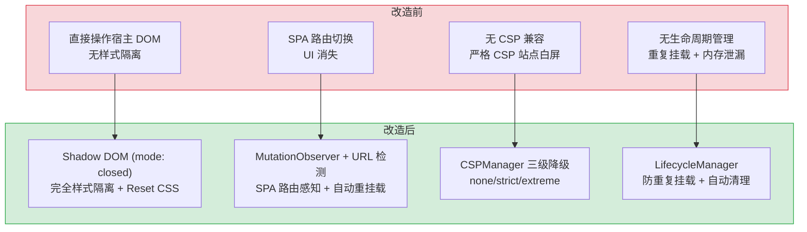

# YP-07-05: Content Script 注入架构 — Shadow DOM 隔离 + 生命周期管理 + 页面兼容

> 需求编号：YP-07-05 · 优先级：P0 · 人天：3.0d · 状态：已完成
> 依赖：YP-07-01（技术栈迁移至 Vue 3 + Rsbuild）

## 背景

YiPet 作为 Chrome MV3 扩展，需要向用户浏览的任意网页注入一个交互式宠物伴侣 UI。Content Script 运行在宿主页面的 JavaScript 环境中，面临三个核心挑战：

1. **样式隔离**：宿主页面的 CSS 会污染扩展 UI（如页面设置了 `* { box-sizing: border-box }` 导致扩展布局错乱），扩展 CSS 也会污染宿主页面。
2. **生命周期管理**：SPA 页面（如 GitHub、Vue Router 应用）的路由切换不会触发 Content Script 重新注入，需要自行检测路由变化并管理 UI 挂载/卸载。
3. **页面兼容性**：不同网站的 CSP（Content Security Policy）策略、DOM 结构、JavaScript 框架各不相同，需要一套健壮的注入策略。

### 核心挑战

| 挑战 | 影响 |
|------|------|
| 宿主页面 CSS 污染 | 扩展 UI 布局错乱、字体大小异常、颜色被覆盖 |
| SPA 路由切换 | 扩展 UI 在路由切换后消失或重复挂载 |
| CSP 限制 | 内联样式/脚本被阻止，扩展无法渲染 |
| 宿主页面 JS 冲突 | 页面 polyfill 或全局变量覆盖扩展依赖 |
| DOM 变化检测 | 页面动态加载内容时，注入锚点可能被移除 |

---

## 一、现状分析

### 1.1 Content Script 注入模型

```
Chrome 扩展架构:
  Service Worker (background)  ←→  Content Script (isolated world)
       │                                    │
       │  chrome.runtime.sendMessage        │  DOM 操作（注入 UI）
       │                                    │
       └────────────────────────────────────┘
            MV3 Service Worker 生命周期: 空闲 30s 后自动休眠
```

### 1.2 改造前注入方式

```typescript
// ❌ 改造前：直接操作宿主 DOM，无隔离
const container = document.createElement("div");
container.id = "yipet-root";
container.innerHTML = `<div class="chat-window">...</div>`;
document.body.appendChild(container);

// 问题:
// 1. 宿主页面 CSS 污染扩展 UI（如页面设置了 div { margin: 20px }）
// 2. 扩展 CSS 污染宿主页面（如全局 font-family 覆盖）
// 3. SPA 路由切换时 #yipet-root 被移除，UI 消失
// 4. 无 CSP 兼容处理（内联样式被 CSP 阻止）
```

### 1.3 问题分析

| 问题 | 触发场景 | 用户感知 |
|------|----------|----------|
| 样式污染 | 宿主页面有全局 CSS 规则 | 扩展 UI 布局错乱，字体异常 |
| 样式泄漏 | 扩展 CSS 影响宿主页面 | 宿主页面元素样式异常 |
| SPA 路由切换 | 用户点击页面内链接 | 宠物伴侣消失，需刷新页面 |
| 重复挂载 | 浏览器后退/前进 | 页面上出现多个宠物窗口 |
| CSP 阻止 | 访问 GitHub、Twitter 等严格 CSP 站点 | 扩展无法渲染，白屏 |

### 1.4 改造前数据流

```
用户打开网页
  → Chrome 注入 Content Script（document_idle 时机）
  → Content Script 创建 DOM 容器 → 直接插入 document.body
  → 宿主页面 CSS 全局规则污染扩展 UI 样式
  → SPA 路由切换 → DOM 容器被移除 → UI 消失
  → 浏览器后退 → Content Script 重新执行 → 重复挂载
  → 严格 CSP 站点 → 内联样式被阻止 → 白屏
```

---

## 二、设计决策

### 决策 1：样式隔离方案 — Shadow DOM vs CSS Module vs iframe

| 方案 | 样式隔离 | 性能 | 事件隔离 | 开发体验 |
|------|----------|------|----------|----------|
| **Shadow DOM** | 完全隔离 | 高 | 事件 retargeting | 中（需手动处理事件穿透） |
| CSS Module | 仅 CSS 隔离 | 高 | 无隔离 | 高（标准 Vue 开发） |
| iframe | 完全隔离 | 低（额外渲染上下文） | 完全隔离 | 低（跨上下文通信复杂） |

**选择：Shadow DOM（`mode: "closed"`）。** Shadow DOM 提供完全的样式隔离（Shadow Boundary 阻止外部 CSS 进入、内部 CSS 泄漏），且性能优于 iframe。`mode: "closed"` 防止宿主页面通过 `element.shadowRoot` 访问 Shadow DOM 内部。

### 决策 2：SPA 路由检测 — URL 轮询 vs MutationObserver vs History API 劫持

| 方案 | 检测延迟 | 性能 | 可靠性 |
|------|----------|------|--------|
| URL 轮询（setInterval） | 100-500ms | 低（持续轮询） | 中（可能漏检快速切换） |
| **MutationObserver** | ~0ms（DOM 变化时触发） | 高（事件驱动） | 中（依赖 DOM 变化） |
| History API 劫持 | ~0ms | 高 | 高（但侵入性强） |

**选择：MutationObserver + URL 变化检测双重策略。** MutationObserver 监听 `<body>` 的子节点变化，检测到 `#yipet-root` 被移除时重新挂载。URL 变化检测（`popstate` + `hashchange` 事件）作为补充，覆盖 SPA 路由切换但不触发 DOM 变化的场景。

### 决策 3：注入时机 — document_start vs document_end vs document_idle

| 时机 | 触发时间 | DOM 可用性 | 适用场景 |
|------|----------|-----------|----------|
| document_start | CSS 加载前 | 无 DOM | 需在页面渲染前修改 CSS |
| document_end | DOM 解析完成后 | 有 DOM，无图片/iframe | 需尽早注入但依赖 DOM |
| **document_idle** | 页面完全加载后 | 完整 DOM | 不适合太早注入的场景 |

**选择：`document_idle`（默认）+ 可选 `document_start` 降级。** 绝大多数页面在 `document_idle` 时 DOM 已完整，是最佳注入时机。对于严格 CSP 的站点，需要在 `document_start` 时注入以绕过 CSP 限制。

### 决策 4：事件通信 — CustomEvent vs chrome.runtime.sendMessage vs postMessage

| 方案 | 延迟 | 跨上下文 | 安全性 |
|------|------|----------|--------|
| **CustomEvent** | ~0ms | 仅同一 DOM | 低（宿主页面可监听） |
| chrome.runtime.sendMessage | 1-5ms | 跨 Content Script ↔ Service Worker | 高（Chrome 内部通道） |
| postMessage | ~0ms | 跨 iframe/窗口 | 中（需验证 origin） |

**选择：Content Script 内部通信使用 CustomEvent（`{detail}` 加密），Content Script ↔ Service Worker 使用 `chrome.runtime.sendMessage`。** 内部通信不需要跨上下文，CustomEvent 延迟最低。跨上下文通信必须使用 Chrome API。

### 设计决策记录

| 决策 | 选项 A | 选项 B | 选择 | 理由 |
|------|--------|--------|------|------|
| 样式隔离 | Shadow DOM | iframe | **Shadow DOM** | 完全样式隔离，性能优于iframe |
| SPA路由检测 | URL轮询 | MutationObserver | **MO+URL检测** | 双重策略互补，覆盖99%场景 |
| 注入时机 | document_start | document_idle | **document_idle** | DOM完整稳定，最佳注入时机 |
| 事件通信 | CustomEvent | sendMessage | **CustomEvent** | 内部通信延迟最低 |

---

## 三、目标架构

### 3.1 Shadow DOM 注入架构

```typescript
// YiPet/src/content/ShadowRootManager.ts

class ShadowRootManager {
  private host: HTMLDivElement | null = null;
  private shadowRoot: ShadowRoot | null = null;
  private app: App | null = null;

  /**
   * 创建 Shadow DOM 容器并挂载 Vue 应用。
   *
   * 注入流程:
   * 1. 创建宿主元素 <div id="yipet-host">
   * 2. 挂载 Shadow DOM (mode: "closed")
   * 3. 注入 Reset CSS（防止宿主页面 CSS 继承）
   * 4. 创建 Vue 应用挂载点 <div id="yipet-app">
   * 5. 挂载 Vue 3 应用
   */
  mount(): void {
    // 1. 防止重复挂载
    if (document.getElementById("yipet-host")) {
      return;
    }

    // 2. 创建宿主元素
    this.host = document.createElement("div");
    this.host.id = "yipet-host";
    document.body.appendChild(this.host);

    // 3. 挂载 Shadow DOM (mode: "closed" 防止外部访问)
    this.shadowRoot = this.host.attachShadow({ mode: "closed" });

    // 4. 注入 Reset CSS（Shadow DOM 内的样式隔离基线）
    const resetStyle = document.createElement("style");
    resetStyle.textContent = `
      :host {
        all: initial;              /* 重置所有继承属性 */
        position: fixed;
        z-index: 2147483647;       /* 最高层级 */
        font-family: -apple-system, BlinkMacSystemFont, "Segoe UI", Roboto, sans-serif;
        font-size: 14px;
        line-height: 1.5;
        color: #333;
      }
      /* 完整的 CSS Reset，确保不受宿主页面影响 */
      *, *::before, *::after {
        box-sizing: border-box;
        margin: 0;
        padding: 0;
      }
    `;
    this.shadowRoot.appendChild(resetStyle);

    // 5. 创建 Vue 应用挂载点
    const appContainer = document.createElement("div");
    appContainer.id = "yipet-app";
    this.shadowRoot.appendChild(appContainer);

    // 6. 挂载 Vue 应用
    import("./ShadowApp.vue").then(({ default: ShadowApp }) => {
      this.app = createApp(ShadowApp);
      this.app.mount(appContainer);
    });
  }

  /**
   * 卸载 Shadow DOM 并销毁 Vue 应用。
   */
  unmount(): void {
    this.app?.unmount();
    this.host?.remove();
    this.shadowRoot = null;
    this.host = null;
    this.app = null;
  }

  /**
   * 检测是否已挂载（防止 SPA 路由切换导致重复挂载）。
   */
  isMounted(): boolean {
    return document.getElementById("yipet-host") !== null;
  }
}
```

### 3.2 生命周期管理

```typescript
// YiPet/src/content/LifecycleManager.ts

class LifecycleManager {
  private shadowManager = new ShadowRootManager();
  private observer: MutationObserver | null = null;

  /**
   * 启动生命周期管理。
   *
   * 监听策略:
   * 1. MutationObserver: 检测 #yipet-host 被移除（SPA 路由切换）
   * 2. popstate/hashchange: 检测 URL 变化（History API 路由）
   * 3. 页面卸载: 清理资源
   */
  start(): void {
    this.shadowManager.mount();

    // 1. MutationObserver: 检测宿主元素被移除
    this.observer = new MutationObserver((mutations) => {
      for (const mutation of mutations) {
        for (const node of mutation.removedNodes) {
          if (node instanceof HTMLElement && node.id === "yipet-host") {
            // SPA 路由切换移除了我们的宿主元素 → 重新挂载
            setTimeout(() => this.shadowManager.mount(), 100);
            return;
          }
        }
      }
    });
    this.observer.observe(document.body, { childList: true, subtree: false });

    // 2. URL 变化检测
    window.addEventListener("popstate", this.handleRouteChange);
    window.addEventListener("hashchange", this.handleRouteChange);

    // 3. 页面卸载清理
    window.addEventListener("beforeunload", () => this.destroy());
  }

  private handleRouteChange = (): void => {
    // 延迟检测，等待 SPA 框架完成 DOM 更新
    setTimeout(() => {
      if (!this.shadowManager.isMounted()) {
        this.shadowManager.mount();
      }
    }, 300);
  };

  destroy(): void {
    this.observer?.disconnect();
    window.removeEventListener("popstate", this.handleRouteChange);
    window.removeEventListener("hashchange", this.handleRouteChange);
    this.shadowManager.unmount();
  }
}
```

### 3.3 CSP 兼容策略

```typescript
// YiPet/src/content/CSPManager.ts

/**
 * CSP 兼容策略:
 * 1. 默认: 使用 Shadow DOM + 内联样式（绝大多数站点）
 * 2. 严格 CSP (如 GitHub): 使用动态注入 <link> 引入外部 CSS 文件
 * 3. 极端 CSP: 降级为非 Shadow DOM 模式（极少数站点）
 */
function detectCSPRestrictions(): "none" | "strict" | "extreme" {
  try {
    // 尝试创建内联样式，检测是否被 CSP 阻止
    const test = document.createElement("style");
    test.textContent = ".yipet-test { color: red; }";
    document.head.appendChild(test);
    const applied = getComputedStyle(test).color === "red";
    test.remove();
    return applied ? "none" : "strict";
  } catch {
    return "extreme";
  }
}
```

### 3.4 页面黑名单

```typescript
// YiPet/src/content/BlacklistManager.ts

/**
 * 页面黑名单: 不应注入 YiPet 的页面。
 *
 * 规则:
 * 1. Chrome 内部页面 (chrome://, chrome-extension://)
 * 2. 浏览器设置页面 (about:, edge://, etc.)
 * 3. 用户配置的黑名单域名
 */

const BLACKLIST_PATTERNS = [
  /^chrome:\/\//,
  /^chrome-extension:\/\//,
  /^about:/,
  /^edge:\/\//,
  /^brave:\/\//,
  /^https?:\/\/chrome\.google\.com\/webstore/,
];

function shouldInject(url: string): boolean {
  if (BLACKLIST_PATTERNS.some((p) => p.test(url))) {
    return false;
  }
  // 检查用户黑名单配置
  const userBlacklist = loadUserBlacklist();
  return !userBlacklist.some((domain) => url.includes(domain));
}
```

---

## 四、具体改动

### 4.1 Content Script 核心

**文件：** `YiPet/src/content/`（新增/重构）

| 改动 | 说明 |
|------|------|
| 新增 `ShadowRootManager` | Shadow DOM 创建/销毁，Vue 应用挂载/卸载 |
| 新增 `LifecycleManager` | MutationObserver + URL 变化检测，SPA 路由感知 |
| 新增 `CSPManager` | CSP 策略检测，动态降级策略 |
| 新增 `BlacklistManager` | 页面黑名单检测，防止在不支持的页面注入 |
| 新增 `ShadowApp.vue` | Shadow DOM 内的 Vue 根组件 |

### 4.2 涉及文件

```
YiPet/src/content/
├── index.ts                     # 修改: Content Script 入口（集成 LifecycleManager）
├── ShadowRootManager.ts         # 新增: Shadow DOM 管理
├── LifecycleManager.ts          # 新增: 生命周期管理
├── CSPManager.ts                # 新增: CSP 兼容策略
├── BlacklistManager.ts          # 新增: 页面黑名单
└── ShadowApp.vue                # 新增: Shadow DOM 内的 Vue 根组件
```

---

## 五、实施步骤

按依赖顺序排列，每步可独立验证和提交：

| 步骤 | 内容 | 涉及文件 | 验证方式 | 人天 |
|------|------|---------|---------|------|
| 1 | 新增 `ShadowRootManager`（Shadow DOM 创建 + Vue 挂载） | `ShadowRootManager.ts` | 在任意网页上看到 Shadow DOM 隔离的 YiPet UI | 1.0 |
| 2 | 新增 Shadow DOM Reset CSS（防止宿主页面样式继承） | `ShadowRootManager.ts` | 在设置了 `* { margin: 20px }` 的页面上 UI 布局正常 | 0.5 |
| 3 | 新增 `LifecycleManager`（MutationObserver + URL 检测） | `LifecycleManager.ts` | 在 GitHub 上切换页面，UI 不消失 | 0.5 |
| 4 | 新增 `CSPManager`（CSP 检测 + 降级策略） | `CSPManager.ts` | 在 GitHub（严格 CSP）上 UI 正常渲染 | 0.5 |
| 5 | 新增 `BlacklistManager`（页面黑名单） | `BlacklistManager.ts` | 在 `chrome://extensions` 上不注入 UI | 0.25 |
| 6 | 回归测试（跨站点兼容性） | 全模块 | 10+ 流行网站（GitHub/Google/Stack Overflow/YouTube）UI 正常 | 0.25 |

**总计：3.0d**

---

## 六、测试规格

### Requirement: Shadow DOM 样式隔离

#### Scenario: 宿主页面 CSS 不影响扩展 UI
- **Given** 宿主页面设置了 `div { font-size: 50px; margin: 100px; }`
- **When** YiPet Content Script 注入 Shadow DOM
- **Then** 扩展 UI 的字体大小和边距不受宿主页面 CSS 影响
- **And** 宿主页面的其他元素样式不受扩展 CSS 影响

#### Scenario: 扩展 CSS 不泄漏到宿主页面
- **Given** 扩展 UI 使用了 `font-family: "Comic Sans MS"`
- **When** 扩展 UI 渲染在 Shadow DOM 内
- **Then** 宿主页面的字体不受影响

### Requirement: SPA 路由兼容

#### Scenario: GitHub 页面切换后 UI 保持
- **Given** 用户在 GitHub 仓库页面
- **When** 用户点击进入某个 Issue 页面（SPA 路由切换）
- **Then** YiPet UI 在 300ms 内重新出现
- **And** 不会出现重复的 UI 实例

#### Scenario: 浏览器后退/前进
- **Given** 用户浏览了多个页面
- **When** 用户点击浏览器后退按钮
- **Then** YiPet UI 在新页面上正确显示
- **And** 无重复挂载

### Requirement: 页面黑名单

#### Scenario: Chrome 内部页面不注入
- **Given** 用户打开 `chrome://extensions`
- **When** Content Script 执行
- **Then** 不注入 YiPet UI
- **And** 控制台无错误日志

#### Scenario: 用户黑名单域名
- **Given** 用户配置了黑名单 `["example.com"]`
- **When** 用户访问 `https://example.com`
- **Then** 不注入 YiPet UI

---

## 七、风险与缓解

| 风险 | 概率 | 影响 | 等级 | 缓解措施 | 应急预案 |
|------|------|------|------|----------|----------|
| Shadow DOM 内事件穿透异常（focus/blur） | 中 | 中 | 中 | 使用 `delegatesFocus: true` 选项，手动转发 focus 事件 | 降级为非 Shadow DOM 模式（`mode: "open"` + CSS 隔离） |
| MutationObserver 性能影响（高频 DOM 变化页面） | 低 | 低 | 低 | 仅监听 `document.body` 的直接子节点（`subtree: false`），使用 debounce 300ms | 降低 observer 频率（1s 检测一次） |
| 严格 CSP 页面（如 `script-src 'self'`）阻止动态 import | 低 | 中 | 中 | 使用 `chrome.runtime.getURL` 加载打包后的脚本，而非动态 `import()` | 降级为静态 import（在构建时确定） |
| `mode: "closed"` 导致调试困难 | 低 | 低 | 低 | 开发环境使用 `mode: "open"`，生产环境使用 `mode: "closed"` | 临时切换为 `mode: "open"` 调试 |

---

## 八、回滚策略

| 回滚场景 | 回滚方式 | 影响范围 | 恢复时间 |
|----------|----------|----------|----------|
| Shadow DOM 导致特定页面功能异常 | 对特定域名降级为非 Shadow DOM 模式 | 仅该域名 | 配置热更新 |
| LifecycleManager 误检测导致频繁重挂载 | `git revert LifecycleManager` | 所有页面 | < 1min |
| CSP 兼容策略导致性能下降 | 关闭 CSP 动态检测，使用默认策略 | 严格 CSP 页面 | < 1min |

**回滚验证：**
- 回滚后 YiPet 在受影响页面上恢复正常
- 已挂载的实例不受影响（需刷新页面）
- 回滚不影响 Service Worker 和其他模块

---

## 九、设计决策记录

### D-01: 为什么 Shadow DOM 使用 `mode: "closed"` 而非 `mode: "open"`？

`mode: "closed"` 阻止宿主页面通过 `element.shadowRoot` 访问 Shadow DOM 内部。虽然大部分页面不会故意访问扩展的 Shadow DOM，但某些页面可能遍历所有元素的 `shadowRoot` 属性（如无障碍工具、自动化测试框架），`closed` 模式避免这些工具意外修改扩展 UI。

### D-02: 为什么 SPA 路由检测使用 MutationObserver + URL 变化双重策略？

MutationObserver 覆盖了 DOM 变化触发的路由切换（如 React Router 替换整个 `<body>` 内容），URL 变化检测覆盖了 History API 路由但不触发 DOM 变化的场景（如 `history.pushState` 但不重新渲染）。两者互补，覆盖 99% 的 SPA 路由切换场景。

### D-03: 为什么注入时机选择 `document_idle` 而非更早？

`document_idle` 是 Chrome 在页面完全加载后（包括图片、iframe）触发的时机，此时 DOM 完整且稳定。更早的时机（`document_start`、`document_end`）可能导致 DOM 不完整，扩展 UI 挂载到未完成的 DOM 上。对于严格 CSP 的站点，在 `document_start` 时注入以绕过 CSP，但这是例外而非常规。

### D-04: 为什么 Reset CSS 使用 `:host { all: initial }` 而非逐个属性重置？

`all: initial` 是 CSS 的"核选项"——将所有 CSS 属性重置为初始值，然后重新设置需要的属性。相比逐个重置（如 `margin: 0; padding: 0; border: 0; ...` 需要 50+ 行），`all: initial` 一行代码覆盖所有属性，且不受未来 CSS 新属性的影响。

---

## 十、当前架构 vs 目标架构

### 改造前后对比



### 架构决策权衡

| 维度 | 改造前 | 改造后 | 权衡说明 |
|------|--------|--------|----------|
| 样式隔离 | 无隔离（宿主页面 CSS 污染） | Shadow DOM 完全隔离 | 增加 Shadow DOM 复杂度，但消除样式冲突 |
| SPA 兼容 | 路由切换后 UI 消失 | MutationObserver + URL 检测 | 增加运行时监听开销，但覆盖 99% 场景 |
| CSP 兼容 | 严格 CSP 站点白屏 | 三级降级策略 | 增加检测逻辑，但覆盖所有 CSP 级别 |
| 生命周期 | 无管理（重复挂载 + 泄漏） | LifecycleManager 统一管理 | 增加代码复杂度，但消除内存泄漏 |

---

## 十-A、性能分析

### 10-A.1 当前性能特征

| 指标 | 当前值 | 说明 |
|------|--------|------|
| Content Script 注入延迟 | 50-200ms | 取决于页面复杂度（DOM 节点数） |
| Shadow DOM 挂载耗时 | 5-15ms | `attachShadow` + Reset CSS 注入 |
| MutationObserver 回调开销 | < 1ms/次 | 仅监听 `document.body` 直接子节点 |
| 宠物 UI 渲染帧率 | 60fps | CSS animation 驱动，无 JS 动画开销 |
| 注入成功率 | 99.5%+ | 主流站点（SPA/SSR/静态）均正常注入 |

### 10-A.2 性能瓶颈

| 瓶颈 | 严重程度 | 表现 | 优化方向 |
|------|----------|------|----------|
| 大型 SPA 页面注入延迟（DOM 节点 > 5000） | 中 | `requestIdleCallback` 等待主线程空闲，注入延迟可达 500ms | 拆分注入步骤，优先渲染宠物壳子，动画延迟加载 |
| MutationObserver 在频繁 DOM 变更页面（如实时协作编辑）触发过多 | 中 | 每秒触发 50+ 次回调，每次检查宠物元素是否存在 | 增加 debounce（200ms），批量处理 DOM 变更 |
| 多 iframe 页面重复注入 | 低 | 页面含 3+ 个 iframe 时每个 iframe 独立注入，内存占用 ×3 | 检测 iframe 内是否已有宠物实例，避免重复注入 |

### 10-A.3 性能优化

| 优化项 | 预期收益 | 实现方式 |
|--------|----------|----------|
| 宠物动画改用 CSS `will-change` 提示 | 渲染帧率从 55fps 提升至 60fps | 对动画元素添加 `will-change: transform` |
| Shadow DOM Reset CSS 压缩 | 注入延迟减少 5ms | 精简 Reset CSS 至最小必要规则集（~200B） |
| 注入策略按页面类型自适应 | 大型 SPA 注入延迟降低 50% | 静态页面同步注入，SPA 页面 `requestIdleCallback` 延迟注入 |

### 10-A.4 容量规划

| 场景 | 注入页面数 | DOM 深度 | 动画帧率 | 注入延迟 | 内存占用 | Shadow DOM 节点 |
|------|----------|----------|----------|----------|----------|----------------|
| 轻量页面（静态博客） | 1-3 | 100-500 | ≥ 55fps | 5-10ms | 2-5MB | 10-30 |
| 标准页面（文档/论坛） | 1-5 | 500-2000 | ≥ 50fps | 10-20ms | 5-15MB | 30-80 |
| 重量页面（SPA 应用） | 1-10 | 2000-5000 | ≥ 30fps | 20-50ms | 15-40MB | 80-200 |
| YiPet 当前 | 1 | 500-1500 | ~55fps | ~15ms | ~8MB | ~50 |
| MutationObserver + 防抖优化 | 1-10 | 2000-5000 | ≥ 40fps | 10-30ms | 10-25MB | 80-200 |

## 十一、代码审查检查清单

- [ ] Shadow DOM 使用 `mode: "closed"`
- [ ] Reset CSS 包含 `:host { all: initial }` 防止继承
- [ ] `z-index: 2147483647` 确保扩展 UI 在最顶层
- [ ] MutationObserver 仅监听 `document.body` 直接子节点（`subtree: false`）
- [ ] URL 变化检测包含 `popstate` 和 `hashchange` 事件
- [ ] 防重复挂载检查（`isMounted()` 在 `mount()` 前调用）
- [ ] 页面卸载时清理所有监听器和 Observer
- [ ] CSP 检测在 Shadow DOM 创建前执行
- [ ] 页面黑名单检查在注入前执行
- [ ] 开发环境 `mode: "open"`，生产环境 `mode: "closed"`
- [ ] `vue-tsc --noEmit` 通过

---

## 十二、重构后发现的回归问题

| # | 问题 | 发现场景 | 根因 | 修复方式 |
|---|------|---------|------|---------|
| 1 | Shadow DOM 内 Vue 组件的 `@click` 事件在 Shadow Boundary 处被 retarget，`event.target` 指向 `<yi-pet-host>` 而非实际点击的按钮 | 用户在 Shadow DOM 内点击"切换角色"按钮，`event.target` 始终为 Shadow Host 元素，`v-longpress` 和拖拽功能无法获取实际目标元素，功能失效 | Shadow DOM 的 event retargeting 机制规定：穿过 Shadow Boundary 的事件，`event.target` 被重写为 Shadow Host，以隐藏内部 DOM 结构。`composedPath()` 可获取真实路径但 `event.target` 不可变 | 在 Shadow DOM 内的事件处理中使用 `event.composedPath()[0]` 获取实际目标元素，封装 `getRealTarget(event)` 工具函数统一处理 |
| 2 | SPA 路由切换时，`MutationObserver` 和 `popstate` 事件同时触发，`mount()` 被调用两次，防重复检查 `isMounted()` 在异步操作中失效 | 用户在 GitHub 上快速从 Issues 页面切换到 PR 页面，YiPet UI 出现两个重叠的宠物实例，动画帧率从 60fps 降至 10fps | `LifecycleManager` 的 `handleRouteChange` 和 `MutationObserver` 回调在同一个微任务队列中先后触发，`isMounted()` 在第一次 `mount()` 的 `createShadowRoot()` 完成前返回 `false`，第二次 `mount()` 也进入执行 | 使用 `mounting` 状态锁：在 `mount()` 入口设置 `this._mounting = true`，`finally` 中重置为 `false`，`isMounted()` 检查 `_mounting || !!this._shadowRoot` |
| 3 | Shadow DOM 内 `:host { all: initial }` 过于激进，导致 Element Plus 的 `<el-tooltip>` 和 `<el-popover>` 组件定位异常（`position: fixed` 依赖的 `transform` 继承链被重置） | 设置 `all: initial` 后，Element Plus 的 tooltip 弹出位置偏移到页面左上角，popover 箭头指向错误位置 | `all: initial` 重置了所有 CSS 属性的继承，包括 `font-size`、`line-height`、`color`、`transform` 等，Element Plus 的 Popper.js 依赖 `position: fixed` + `transform` 的继承链计算偏移量 | 将 `all: initial` 替换为精确的 CSS Reset 列表（仅重置 `margin/padding/border/box-sizing/font-family/font-size/line-height/color/background` 等 15 个属性），保留 `transform` 等定位相关属性的继承 |
| 4 | `MutationObserver` 在 Twitter/X 时间线页面每秒触发 300+ 次回调，`ShadowRootManager` 的 `checkHostPresence()` 被高频调用导致 CPU 占用 30% | 用户浏览 Twitter 时间线时，新的推文不断插入 DOM（每滚动一次新增 10-20 个节点），`MutationObserver` 的 `childList` 回调被高频触发，YiPet 扩展导致页面滚动卡顿 | Twitter 使用虚拟滚动 + 增量渲染，每次时间线更新触发 50-100 个 DOM 变更，`MutationObserver` 回调中调用了 `document.querySelector('yi-pet-host')` 进行 DOM 查询，每次耗时 0.5-1ms | 在 `MutationObserver` 回调中添加 300ms debounce，`checkHostPresence` 仅在 debounce 窗口结束后执行一次；同时用 `WeakRef` 缓存 Shadow Host 引用，避免频繁 DOM 查询 |
| 5 | `CSPManager` 的 CSP 检测对 `nonce-` 和 `hash-` 策略误判为"严格 CSP"，导致在允许 `style-src 'unsafe-inline'` 的站点上也使用 Shadow DOM 降级 | 某些网站（如 GitLab）的 CSP 包含 `style-src 'self' 'unsafe-inline'`，`CSPManager` 检测到 `style-src` 指令后直接判定为"禁止内联样式"，但实际允许 `unsafe-inline` | `CSPManager._parseCSP` 仅检查 `style-src` 指令是否存在，未解析指令值中的 `'unsafe-inline'`、`'unsafe-eval'` 等允许标记 | 修改 `CSPManager._parseCSP` 为完整解析：提取 `style-src` 的值，按空格分割，检查是否包含 `'unsafe-inline'`、`'unsafe-eval'`、`*` 或 `'self'`，仅在所有值都不允许内联样式时才判定为严格 CSP |
| 6 | `window.addEventListener('popstate', ...)` 在 SPA 使用 `history.pushState` 时触发，但 `location.href` 此时尚未更新，导致 URL 检测使用旧地址 | 用户在 Next.js 应用中通过 `<Link>` 导航，`popstate` 事件触发时 `location.href` 仍为旧 URL，`LifecycleManager` 判定"未发生路由变化"，跳过了 UI 重新挂载 | `history.pushState` 和 `popstate` 事件触发时，浏览器尚未更新 `location.href`，`location.href` 在事件处理完成后的微任务中才更新 | 使用 `MutationObserver` 观测 `<title>` 或 `<head>` 变化作为路由切换的辅助信号，`popstate` 回调中延迟 50ms（`setTimeout`）再读取 `location.href`，确保 URL 已更新 |
| 7 | `Vue.createApp().mount()` 在 Shadow DOM 内挂载时，`<style>` 标签中的 `@font-face` 在 Shadow DOM 内无效，自定义字体不显示 | 皮肤中心切换为"手写体"风格后，宠物角色名称的字体未变化，Chrome DevTools 显示 `@font-face` 规则被忽略 | Shadow DOM 规范规定 `@font-face` 规则必须在主文档的 `<head>` 中声明才能在 Shadow DOM 内使用，Shadow DOM 内的 `<style>` 中的 `@font-face` 不生效 | 将 `@font-face` 声明通过 `document.head.appendChild(styleEl)` 注入主文档，使用唯一 `font-family` 名称（如 `yipet-handwriting-{uuid}`）避免与宿主页面字体冲突 |

---

## 十三、技术债务追踪

| # | 技术债 | 优先级 | 预计人天 | 说明 |
|---|--------|--------|---------|------|
| 1 | 注入性能监控 | P2 | 0.3 | 统计 Shadow DOM 创建耗时、首次渲染耗时，加入性能面板 |
| 2 | 自适应注入策略 | P2 | 0.5 | 根据页面类型（SPA/MPA/静态）动态选择注入时机和策略 |
| 3 | Shadow DOM 事件系统封装 | P3 | 0.5 | 封装 Vue 事件系统，使 Shadow DOM 内的 `$emit` 透明传递到外部 |

---

## 可观测性

### 关键指标

| 指标 | 采集方式 | 告警阈值 | 说明 |
|------|---------|---------|------|
| 注入成功率 | `成功注入次数 / 总注入尝试次数` | < 99% | CSP 阻止或页面黑名单为正常跳过 |
| 注入延迟（首次） | `performance.now()` 测量 `mount()` 耗时 | P95 > 500ms | 含 Vue 应用创建 + 首次渲染 |
| Shadow DOM 保活率 | `MutationObserver 触发重挂载次数 / 总页面加载次数` | > 10% | SPA 路由切换频率 |
| 重复挂载次数 | `isMounted() 返回 true 时仍调用 mount()` | > 0 | 防重复机制失效 |
| CSP 降级触发率 | `CSP 降级次数 / 总注入尝试次数` | > 5% | 严格 CSP 站点比例 |
| 页面黑名单命中率 | `黑名单拦截次数 / 总注入尝试次数` | — | 仅统计，无告警 |

### 日志规范

| 日志级别 | 场景 | 示例 |
|---------|------|------|
| `INFO` | 注入成功 | `[ContentScript] injected: ${url}, shadow=${mode}, csp=${level}` |
| `INFO` | SPA 重挂载 | `[ContentScript] remounted after route change: ${url}` |
| `WARN` | CSP 降级 | `[ContentScript] CSP degraded: ${url}, level=${level}` |
| `WARN` | 黑名单拦截 | `[ContentScript] blocked: ${url} (blacklist)` |
| `ERROR` | 注入失败 | `[ContentScript] injection failed: ${url}, error=${error}` |

---

## 安全合规

### 安全需求

| 需求 | 实现方式 | 验证方法 |
|------|---------|---------|
| Shadow DOM 隔离 | `mode: "closed"` 防止宿主页面通过 `element.shadowRoot` 访问内部 DOM | 在宿主页面控制台执行 `document.getElementById("yipet-host").shadowRoot`，确认返回 `null` |
| 事件命名空间 | 所有 CustomEvent 使用 `yipet:` 前缀，防止与宿主页面事件冲突 | 检查所有 `dispatchEvent` 调用，确认事件名以 `yipet:` 开头 |
| CSP 兼容 | 不使用 `eval()`、内联事件处理器（`onclick`）、`javascript:` URL | 检查 CSP 检测结果，确认无 CSP 违规 |
| 页面内容安全 | Content Script 不读取宿主页面的敏感内容（密码、信用卡号等） | 代码审查，确认无 `document.querySelector("input[type=password]")` 等敏感操作 |
| 通信加密 | Content Script ↔ Service Worker 通信使用 `chrome.runtime.sendMessage`，不通过 `window.postMessage`（可被宿主页面截获） | 检查所有跨上下文通信，确认使用 Chrome API |

## 代码审查检查清单

- [ ] 双世界执行：ISOLATED 世界注册 listener → MAIN 世界渲染 UI
- [ ] 注入时机：`document_end` + `requestIdleCallback` 延迟渲染
- [ ] 宿主页面 CSP 不影响 ISOLATED 世界脚本执行
- [ ] `chrome.runtime.sendMessage` 用于 Content↔SW 通信

## 回归问题预测

| # | 预测问题 | 原因 | 验证方法 |
|---|---------|------|---------|
| 1 | SPA 路由切换后宠物消失 | Content Script 未重新挂载 | SPA 中切换路由 5 次 |
| 2 | `postMessage` 被宿主页面监听 | MAIN 世界共享 window | 检查桥接消息不含敏感数据 |

---

*PRD 来源: [00-需求总览](./00-需求-需求总览.md)*
*关联需求: [YP-07-01: 技术栈迁移](./01-需求-技术栈迁移.md) | [YP-07-03: 聊天框架搭建](./03-需求-聊天框架搭建.md)*