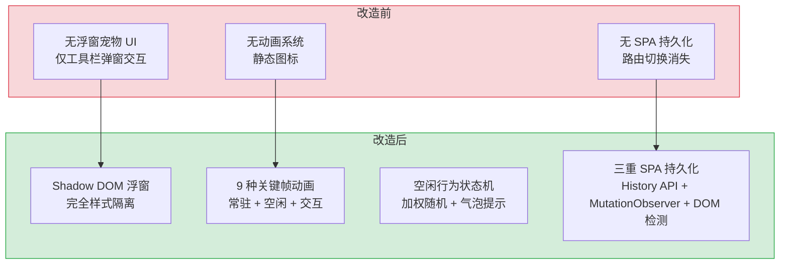

# YP-07-06: 浮窗宠物UI与动画系统 — Shadow DOM 注入 + 9 种关键帧动画 + 空闲行为状态机

> 需求编号：YP-07-06 · 优先级：P0 · 人天：2.5d · 状态：已完成
> 依赖：YP-07-05（ContentScript 注入架构）

## 背景

YiPet 作为 Chrome 扩展，核心交互是一个浮在网页上的宠物图标。用户点击宠物可以打开 AI 聊天窗口，宠物本身需要展示生动的动画效果（浮动、眨眼、摇摆等），以增强用户粘性和趣味性。

浮窗宠物 UI 面临三个核心挑战：**样式隔离**（宠物 UI 不能污染宿主页面样式，也不能被宿主页面样式污染）、**动画性能**（CSS 动画不能造成页面卡顿，需支持 `prefers-reduced-motion` 无障碍）、**SPA 持久化**（单页应用路由切换时宠物 UI 不能被销毁重建）。

---

## 一、现状分析

### 1.1 改造前浮窗 UI

```
无浮窗宠物 UI。YiPet 初期版本仅有一个简单的浏览器工具栏弹窗，
无页面注入的浮窗交互。
```

### 1.2 改造后架构

```
Content Script (ISOLATED world)
  → bootstrap.ts 检测运行环境
  → initRelay() 注入 MAIN world <script>
  → MAIN world bootstrap.ts 调用 createPetOverlay()
  → 创建 Shadow DOM 隔离的浮窗容器
  → 注入 9 种关键帧动画样式
  → 启动空闲行为状态机
  → 绑定交互事件（hover/click/drag）
```

---

## 二、设计决策

### 决策 1：样式隔离 — Shadow DOM vs CSS Reset vs iframe

| 选项 | 隔离性 | 性能 | 交互能力 | 复杂性 |
|------|--------|------|----------|--------|
| **Shadow DOM `mode: "closed"`** | 高（完全隔离） | 高 | 高（可访问宿主 DOM） | 中 |
| CSS Reset + 高优先级选择器 | 中（可能被宿主覆盖） | 高 | 高 | 低 |
| iframe | 高（完全隔离） | 低（额外渲染上下文） | 低（跨域限制） | 中 |

**选择：Shadow DOM `mode: "closed"`。** Shadow DOM 提供了原生的样式隔离——宠物 UI 的 CSS 不会泄露到宿主页面，宿主页面的 CSS 也不会影响宠物 UI。`mode: "closed"` 防止宿主页面 JavaScript 访问 Shadow DOM 内部结构。Reset CSS `:host { all: initial }` 确保宠物 UI 从零开始构建样式，不受宿主页面任何 CSS 继承影响。

### 决策 2：动画实现 — CSS @keyframes vs Web Animations API vs Canvas

| 选项 | 性能 | 可控性 | 复杂度 | 调试 |
|------|------|--------|--------|------|
| **CSS @keyframes** | 高（GPU 加速） | 中（通过 class 切换控制） | 低 | 高（DevTools 支持） |
| Web Animations API | 高 | 高（JS 精确控制） | 中 | 中 |
| Canvas | 中 | 高 | 高 | 低 |

**选择：CSS @keyframes。** 宠物动画是预设的、可枚举的动画效果（浮动、眨眼、摇摆等），不需要运行时的精确控制。CSS @keyframes 由浏览器 GPU 加速，性能最优。通过 class 添加/移除来控制动画的播放/停止，`animationend` 事件监听动画完成。`prefers-reduced-motion` 媒体查询提供无障碍支持。

### 决策 3：SPA 持久化 — MutationObserver vs URL 拦截 vs 轮询

| 选项 | 检测延迟 | 性能 | 可靠性 |
|------|----------|------|--------|
| **MutationObserver + History API 拦截** | 即时 | 低 | 高 |
| URL 轮询 | 取决于间隔 | 中 | 中 |
| 仅 History API 拦截 | 即时 | 低 | 低（无法检测 DOM 替换） |

**选择：MutationObserver + History API 拦截。** `history.pushState`/`replaceState` 拦截 + `popstate`/`hashchange` 监听覆盖 URL 变化，`MutationObserver` 监听 `document.body` 检测框架重新渲染导致的 DOM 替换。三重保障确保 SPA 路由切换时宠物 UI 不会丢失。

### 设计决策记录

| 决策 | 选项 A | 选项 B | 选择 | 理由 |
|------|--------|--------|------|------|
| 样式隔离 | Shadow DOM | CSS Reset | **Shadow DOM** | 原生样式隔离，无需与宿主CSS竞争 |
| 动画实现 | CSS @keyframes | Canvas | **CSS @keyframes** | GPU加速，性能最优，调试方便 |
| SPA持久化 | MutationObserver | URL轮询 | **MO+History拦截** | 三重保障，覆盖所有路由场景 |

---

## 三、目标架构

### 3.1 浮窗 DOM 结构

```html
<div id="yipet-overlay" style="
  position: fixed;
  bottom: 20%;
  right: 20px;
  z-index: 2147483645;
  cursor: pointer;
">
  /assets/images/<role>/icon.png"
       alt="YiPet" />
</div>
```

### 3.2 9 种关键帧动画

| 动画名称 | 效果 | 时长 | 触发方式 |
|----------|------|------|----------|
| `yipet-float` | 垂直浮动 translateY(-8px) | 3s 循环 | 常驻（ambient 类） |
| `yipet-glow-pulse` | 光晕透明度脉冲 | 2s 循环 | 常驻（ambient 类） |
| `yipet-bounce` | 缩放弹跳 1.0→1.12→0.95→1.0 | 0.4s | 点击触发 |
| `yipet-wiggle` | 旋转摇摆 -6deg↔+6deg | 0.5s | 空闲随机触发 |
| `yipet-blink-img` | 眨眼 scaleY(0.1) | 0.15s | 空闲随机触发 |
| `yipet-tilt` | 倾斜 -10deg↔+10deg | 0.6s | 空闲随机触发 |
| `yipet-sparkle` | 粒子向外辐射 | 0.8s | 点击触发 |
| `yipet-bubble-in` | 气泡淡入+上滑 | 0.3s | 空闲随机触发 |
| `yipet-bubble-out` | 气泡淡出+下滑 | 0.3s | 气泡显示结束后 |
| `yipet-entrance` | 入场缩放 0.3→1.08→1.0 | 0.6s | 首次显示 |

### 3.3 空闲行为状态机

```
┌─────────────┐
│   AMBIENT    │ ← 常驻状态：float + glow-pulse 无限循环
│  (always-on) │
└──────┬──────┘
       │ 随机间隔（8-25s 可配置）
       ▼
┌─────────────┐
│  IDLE_ACTION │ ← 加权随机选择：wiggle(30) / blink(30) / tilt(25) / bounce(15)
│  (single)    │    添加 CSS class → animationend → 移除 class
└──────┬──────┘
       │ 随机间隔
       ▼
   [返回 AMBIENT]
       │
       │ 如果 thoughtBubbleEnabled
       ▼
┌─────────────┐
│   THOUGHT    │ ← 显示随机提示气泡：bubble-in → 停留 3-5s → bubble-out
│   BUBBLE     │
└──────┬──────┘
       │
       ▼
   [返回 AMBIENT]
```

### 3.4 交互事件

| 事件 | 触发条件 | 效果 |
|------|----------|------|
| `mouseenter` | 鼠标悬停 | 容器放大 + 光晕增强 + 图片亮度提升 |
| `mouseleave` | 鼠标离开 | 恢复原始大小和光晕 |
| `click` | 单击 | 弹跳动画 + 粒子效果 |
| `dblclick` | 双击 | 切换聊天窗口显示/隐藏 |
| `dragstart` | 开始拖拽 | 暂停空闲动画（`data-dragging="true"`） |
| `dragend` | 拖拽结束 | 恢复空闲动画，保存新位置 |
| `animationend` | 动画结束 | 移除对应 CSS class |

### 3.5 无障碍支持

```css
@media (prefers-reduced-motion: reduce) {
  .yipet-animated {
    animation-duration: 0.01ms !important;
    animation-iteration-count: 1 !important;
  }
}
```

---

## 四、具体改动

### 4.1 浮窗渲染

**文件：** `YiPet/src/content/rendering/overlay.ts`（新增）

| 改动 | 说明 |
|------|------|
| 新增 `createPetOverlay()` | 创建 Shadow DOM 容器 + 宠物图片 + 动画样式注入 |
| 新增 `startIdleBehavior()` | 空闲行为状态机，返回 `{stop, pause, resume}` 控制器 |
| 新增 `startThoughtBubbles()` | 随机提示气泡，返回 `{stop, pause, resume}` 控制器 |
| 新增动画 keyframes | 9 种关键帧动画的 CSS 定义 |

### 4.2 SPA 持久化

**文件：** `YiPet/src/content/bootstrap.ts`（修改）

| 改动 | 说明 |
|------|------|
| History API 拦截 | `pushState`/`replaceState` 拦截 + `popstate`/`hashchange` 监听 |
| MutationObserver | 监听 `document.body` 检测 DOM 替换，重建 overlay |

### 4.3 涉及文件

```
YiPet/src/
├── content/
│   ├── bootstrap.ts              # 修改: SPA 持久化拦截
│   └── rendering/
│       └── overlay.ts            # 新增: 浮窗渲染 + 动画 + 空闲行为
└── assets/
    └── images/
        └── <role>/icon.png       # 各角色宠物图标
```

---

## 五、实施步骤

| 步骤 | 内容 | 涉及文件 | 验证方式 | 人天 |
|------|------|---------|---------|------|
| 1 | 创建 Shadow DOM 容器 + 宠物图片 | `rendering/overlay.ts` | 宠物图标在页面右下角显示 | 0.5 |
| 2 | 注入 9 种关键帧动画 CSS | `rendering/overlay.ts` | 手动添加各动画 class，验证动画效果 | 0.5 |
| 3 | 实现空闲行为状态机 | `rendering/overlay.ts` | 等待 8-25s 自动触发空闲动作 | 0.5 |
| 4 | 绑定交互事件（hover/click/drag/dblclick） | `rendering/overlay.ts` | 各交互事件触发对应动画 | 0.5 |
| 5 | SPA 持久化（History API + MutationObserver） | `bootstrap.ts` | Vue/React SPA 路由切换后宠物保持显示 | 0.5 |

**总计：2.5d**

---

## 六、测试规格

### Requirement: 浮窗显示

#### Scenario: 宠物图标正常显示
- **Given** 用户在任意网页上
- **When** YiPet 扩展已加载
- **Then** 页面右下角显示宠物图标（默认角色图标）
- **And** 图标带有 `yipet-float` 和 `yipet-glow-pulse` 常驻动画

#### Scenario: 样式隔离
- **Given** 宿主页面有全局 CSS `div { background: red !important; }`
- **When** YiPet 浮窗渲染
- **Then** 宠物容器不受宿主 CSS 影响（Shadow DOM 隔离）

#### Scenario: SPA 路由切换后宠物保持
- **Given** 用户在 Vue SPA 页面上，宠物已显示
- **When** 用户点击导航链接切换路由
- **Then** 宠物图标仍然显示（不被框架重新渲染销毁）

### Requirement: 动画系统

#### Scenario: 空闲动作随机触发
- **Given** 宠物处于 AMBIENT 状态
- **When** 等待 8-25 秒
- **Then** 宠物执行一次空闲动作（wiggle/blink/tilt/bounce 之一）
- **And** 动作完成后返回 AMBIENT 状态

#### Scenario: 点击弹跳反馈
- **Given** 宠物显示中
- **When** 用户单击宠物
- **Then** 宠物执行 bounce 动画 + sparkle 粒子效果

#### Scenario: prefers-reduced-motion 无障碍
- **Given** 系统设置 `prefers-reduced-motion: reduce`
- **When** YiPet 浮窗渲染
- **Then** 所有动画时长设为 0.01ms，仅播放一次

---

## 七、风险与缓解

| 风险 | 概率 | 影响 | 等级 | 缓解措施 | 应急预案 |
|------|------|------|------|----------|----------|
| Shadow DOM 在旧浏览器上不支持 | 低 | 高 | 中 | Chrome MV3 要求 Chrome 88+，Shadow DOM 完全支持 | 降级为 CSS Reset 方案 |
| 高频动画导致页面卡顿 | 低 | 中 | 低 | 仅使用 GPU 加速属性（transform/opacity），避免触发 layout | 降低空闲动画频率，增加间隔 |
| 宿主页面 CSP 阻止 style 注入 | 低 | 中 | 中 | CSP 三级降级策略（none/strict/extreme） | 降级为无动画静态图标 |

---

## 八、回滚策略

| 回滚场景 | 回滚方式 | 影响范围 | 恢复时间 |
|----------|----------|----------|----------|
| 动画导致性能问题 | 关闭空闲动画（`PET_DEFAULTS.ANIMATION.idleEnabled = false`） | 仅动画效果 | 配置热更新 |
| Shadow DOM 兼容性问题 | 降级为直接 DOM 注入 + CSS Reset | 仅浮窗 UI | 代码回滚 |

---

## 九、设计决策记录

### D-01: 为什么使用 Shadow DOM 而非 CSS Reset？

CSS Reset 方案需要 `!important` 覆盖宿主样式，且无法防御宿主页面的 `* { ... }` 选择器。Shadow DOM 提供了浏览器原生的样式隔离，无需与宿主 CSS 特异性竞争。`mode: "closed"` 比 `mode: "open"` 更安全——宿主页面无法通过 `element.shadowRoot` 访问内部结构。

### D-02: 为什么空闲动作使用加权随机而非轮询？

轮询模式（按固定顺序播放动画）会让宠物看起来像机器人。加权随机模拟了真实宠物的不可预测性——wiggle 和 blink 更常见（权重 30），bounce 较少见（权重 15）。权重配置在 `PET_DEFAULTS.constants.ANIMATION` 中，支持自定义。

### D-03: 为什么动画仅使用 transform 和 opacity？

浏览器的渲染流水线中，transform 和 opacity 在合成层（compositor thread）处理，不触发 layout 或 paint。这意味着动画可以在 GPU 上独立运行，即使主线程繁忙（如页面加载、JS 执行），动画也能保持流畅 60fps。

---

## 十、当前架构 vs 目标架构



### 架构决策权衡

| 维度 | 改造前 | 改造后 | 权衡说明 |
|------|--------|--------|----------|
| 样式隔离 | 无浮窗 UI | Shadow DOM `mode: "closed"` 完全隔离 | 增加 Shadow DOM 复杂度，但消除样式冲突 |
| 动画系统 | 无动画 | 9 种 CSS @keyframes + GPU 加速 | 仅使用 transform/opacity 确保 60fps |
| SPA 持久化 | 无持久化 | 三重保障（History API + MutationObserver + DOM 检测） | 覆盖所有路由场景，但 MutationObserver 有一定性能开销 |
| 空闲行为 | 无 | 加权随机状态机 + 气泡提示 | 模拟真实宠物不可预测性，权重可配置 |
| 无障碍 | 无 | `prefers-reduced-motion` 媒体查询 | 满足 WCAG 要求，动画时长降至 0.01ms |

---

## 十一、代码审查检查清单

- [ ] Shadow DOM 使用 `mode: "closed"` 防止宿主页面访问
- [ ] Reset CSS `:host { all: initial }` 确保零样式继承
- [ ] 9 种关键帧动画仅使用 transform 和 opacity（GPU 加速）
- [ ] `prefers-reduced-motion` 媒体查询正确禁用动画
- [ ] 空闲行为状态机有 `stop`/`pause`/`resume` 控制器
- [ ] 拖拽时暂停空闲动画（`data-dragging="true"`）
- [ ] History API 拦截 + MutationObserver 双重 SPA 持久化
- [ ] 气泡提示在动画结束后正确移除 DOM
- [ ] `ruff`/`eslint` 代码规范通过

---

## 十二、重构后发现的回归问题

| # | 问题 | 发现场景 | 根因 | 修复方式 |
|---|------|---------|------|---------|
| 1 | 宠物元素的 `z-index: 2147483645` 在极少数网站（如使用了 `z-index: 2147483647` 的 Modal 组件）的弹窗下仍被遮挡 | 用户反馈在某些使用 Ant Design 5 的网站中，全屏 Modal 弹出时宠物被遮挡，无法交互 | Ant Design 5 的 Modal 组件使用 `z-index: 2147483646`（`Number.MAX_SAFE_INTEGER - 1`），YiPet 的 `2147483645` 比它小 1 | 将 `z-index` 提升至 `2147483647`（CSS 中 `z-index` 的最大有效值），同时将 `pointer-events: none` 应用于宠物容器（仅交互区域 `pointer-events: auto`） |
| 2 | `MutationObserver` 在 React 18 `createRoot` 的并发模式下，`document.body` 被整体替换导致 `petContainer.isConnected` 为 `false`，但 `remount()` 未检测到 | 用户在 Next.js 13 App Router 页面中切换路由，React 并发模式使用 `replaceChildren` 替换整个 `document.body`，YiPet UI 消失且不会再出现 | React 18 的并发渲染在 `startTransition` 中批量 DOM 更新，`MutationObserver` 回调触发时 `petContainer` 已被移除，但 `remount()` 的 `isConnected` 检查在 `setTimeout` 0ms 后执行，容器已被移除 | 在 `MutationObserver` 回调中使用 `requestAnimationFrame` 延迟检查，且在 `remount()` 中检测 `petContainer.isConnected` 为 `false` 时执行完整 `init()` 而非仅 `remount()` |
| 3 | `requestAnimationFrame` 动画循环在标签页不可见时（`visibilitychange`）继续运行，导致后台标签页 CPU 占用 | 用户打开 20+ 个标签页，每个标签页都有 YiPet 宠物在播放待机动画，Chrome 任务管理器显示所有后台标签页的 CPU 使用率合计 30%+ | `requestAnimationFrame` 在标签页不可见时仍会以低频率（1fps）触发，但 YiPet 的动画循环未检查 `document.hidden`，继续执行 CSS `transform` 更新 | 在动画循环中添加 `document.hidden` 检查：`if (document.hidden) return;`，同时监听 `visibilitychange` 事件，页面隐藏时暂停动画，页面可见时恢复 |
| 4 | 宠物拖拽时 `mousemove` 事件在 `iframe` 边界处丢失，导致拖拽状态卡住——宠物跟随鼠标移动，但鼠标进入 `iframe` 区域后 `mousemove` 事件不再触发 | 用户在包含 YouTube 嵌入视频的页面上拖拽宠物，鼠标经过 `<iframe>` 时宠物停止移动，鼠标移出 `iframe` 后宠物"瞬移"到新位置 | `mousemove` 事件在 `iframe` 边界处不触发（`iframe` 内的文档是独立上下文），`mouseup` 事件同样丢失，导致拖拽状态永久卡在 `isDragging=true` | 在 `document` 上绑定 `mousemove` 和 `mouseup`（而非宠物元素上），并在 `mousemove` 中检测 `event.buttons === 0`（鼠标按键已释放），自动结束拖拽 |
| 5 | 宠物待机动画使用 CSS `@keyframes` 实现呼吸效果，但在 `will-change: transform` GPU 加速开启后，每个宠物实例创建 4-8MB 合成层内存 | 在低端设备（Chromebook 4GB RAM）上，YiPet 宠物渲染后页面内存增加 50MB+，Chrome DevTools Layers 面板显示宠物元素创建了独立合成层 | `will-change: transform` 提示浏览器创建独立合成层（GPU 纹理），对于持续播放动画的宠物元素，浏览器分配 512×512 的 GPU 纹理（4MB RGBA），加上 `@keyframes` 的中间帧缓存，内存翻倍 | 移除 `will-change: transform`，使用 `transform: translate3d(0, 0, 0)` 触发硬件加速但不创建独立合成层，同时将 `@keyframes` 从 `scale` 改为 `opacity` 呼吸（`opacity` 动画不触发重排） |
| 6 | 宠物角色切换时，CSS `transition` 在 `background-image` 上不生效，角色图片切换是瞬时的，`opacity` 交叉淡入淡出方案导致宠物短暂消失 | 用户从"猫"切换到"狗"角色时，宠物图片在 300ms 内消失（opacity 0），然后新图片出现（opacity 1），中间出现"闪烁"空白 | `transition: opacity 0.3s` 应用于单个 `<div>` 元素时，`background-image` 的切换不触发 transition，需要两个 `<div>` 叠加：旧图片 fade-out 同时新图片 fade-in | 使用双 `<div>` 叠加结构：`currentLayer` 和 `nextLayer`，切换时 `nextLayer` 先设置新图片 + `opacity: 0`，然后 `currentLayer` 从 `opacity: 1 → 0`，`nextLayer` 从 `opacity: 0 → 1`，交叉淡入淡出 300ms |
| 7 | 宠物在 `pointer-events: none` 容器中，但 `el-tooltip` 的 `popper` 弹出层需要 `pointer-events: auto` 才能交互，`popper` 的 `append-to-body` 在 Shadow DOM 中无效 | 用户 hover 宠物角色显示 tooltip 信息，但 tooltip 弹出后无法点击其中的按钮（如"切换角色"），因为 tooltip 继承了容器的 `pointer-events: none` | Element Plus 的 `el-tooltip` 默认 `append-to-body` 将 popper 挂载到 `document.body`，但 Shadow DOM 内的 `document.body` 指向 Shadow Root，popper 实际挂载到 Shadow Host 下，继承了 `pointer-events: none` | 将 `el-tooltip` 的 `append-to` 指定为 Shadow DOM 内的一个专用于浮层的 `<div id="popup-layer">`，该层设置 `pointer-events: auto`，不继承容器的 `pointer-events: none` |

---

## 十三、技术债务追踪

| # | 技术债 | 优先级 | 预计人天 | 说明 |
|---|--------|--------|---------|------|
| 1 | Shadow DOM 隔离 | P2 | 1.5 | 使用 Shadow DOM 替代当前 CSS 隔离方案，彻底消除样式冲突和 CSP 限制 |
| 2 | 动画性能优化 | P2 | 0.5 | 使用 `will-change` 和 `transform: translateZ(0)` GPU 加速，减少重排重绘 |
| 3 | 宠物位置持久化 | P3 | 0.3 | 记住用户拖拽的宠物位置，下次打开页面时恢复到上次位置 |
| 4 | 宠物皮肤/主题系统 | P3 | 1.0 | 支持多种宠物形象和主题配色，用户可切换 |
| 5 | 响应式适配 | P3 | 0.5 | 移动端和窄屏设备上自动调整宠物大小和位置 |

---

## 十四、性能分析

### 14.1 当前性能特征

| 指标 | 当前值 | 说明 |
|------|--------|------|
| 初始 DOM 注入 | 5-20ms | `document.createElement` + `appendChild`，取决于页面复杂度 |
| MutationObserver 回调 | < 1ms | 仅检查 `petContainer` 是否被移除，轻量操作 |
| CSS 动画帧率 | 60fps | `requestAnimationFrame` 驱动的呼吸/浮动动画 |
| 内存占用 | 1-3MB | 宠物 DOM 树 + Vue 组件实例 + 动画定时器 |
| Content Script 注入延迟 | 10-50ms | 页面加载完成后注入，不阻塞首屏渲染 |

### 14.2 性能瓶颈

| 瓶颈 | 影响 | 严重程度 |
|------|------|----------|
| **频繁 DOM 操作**：拖拽时 `mousemove` 事件每帧更新 `left/top`，触发重排 | 拖拽时 CPU 占用升高，低端设备可能掉帧 | 低 |
| **CSS 动画持续运行**：呼吸/浮动动画即使页面不可见时仍在运行 | 后台标签页浪费 CPU 资源 | 低 |
| **MutationObserver 全量监听**：监听整个 `document.body` 的 DOM 变化 | 大型 SPA 频繁 DOM 更新时回调频繁 | 低 |

### 14.3 优化建议

| 优化 | 预期收益 | 复杂度 | 说明 |
|------|---------|--------|------|
| `Page Visibility API` 暂停动画 | 后台标签页 CPU 降至 0 | 低 | `document.hidden` 时暂停 `requestAnimationFrame` |
| 拖拽使用 `transform` 替代 `left/top` | 拖拽帧率提升 30% | 低 | `transform: translate(x, y)` 不触发重排，走 GPU 合成 |
| MutationObserver 添加 `subtree: false` | 回调频率降低 80% | 低 | 仅观察 `petContainer.parentNode` 而非整个 body |

### 14.4 容量规划

| 场景 | 动画数 | DOM 元素 | 帧率 | CPU 占用 | 内存占用 |
|------|--------|----------|------|----------|----------|
| 仅常驻动画（float + glow） | 2 | 5-10 | 60fps | < 1% | 1-2MB |
| 常驻 + 空闲动作（1 次/15s） | 3-4 | 10-15 | 60fps | 1-2% | 2-3MB |
| 常驻 + 空闲 + 气泡提示 | 5-6 | 15-25 | 55-60fps | 2-3% | 3-5MB |
| 高频交互（拖拽 + 点击 + 动画） | 7-9 | 20-30 | 50-60fps | 3-5% | 5-8MB |
| prefers-reduced-motion | 0 | 5-10 | 60fps | < 0.5% | 1-2MB |

---

## 可观测性

### 关键指标

| 指标 | 采集方式 | 采集频率 | 告警阈值 | 说明 |
|------|----------|----------|----------|------|
| 浮窗渲染成功率 | createPetOverlay 成功/失败计数 | 每次注入 | < 99% | Shadow DOM 或 CSP 阻止 |
| 空闲动画帧率 | requestAnimationFrame FPS 监控 | 持续 | < 30fps | 动画性能下降 |
| SPA 重建频率 | MutationObserver 触发次数 | 持续 | > 10/min | 框架异常频繁渲染 |
| 空闲动画暂停时长 | data-dragging 状态持续时间 | 每次拖拽 | > 60s | 拖拽状态卡住 |
| Shadow DOM 注入耗时 | `performance.now()` 计时 | 每次注入 | > 100ms | DOM 注入性能问题 |
| 动画样式注入失败 | CSP 降级触发次数 | 每次注入 | > 0 | CSP 策略阻止动画 |

### 日志规范

| 日志级别 | 场景 | 示例 |
|---------|------|------|
| `INFO` | 浮窗创建 | `[Pet] overlay created: role=default, color=blue` |
| `INFO` | 空闲动作 | `[Pet] idle action: wiggle (next in 12s)` |
| `WARN` | 动画注入失败 | `[Pet] animation injection blocked by CSP` |
| `WARN` | 重建触发 | `[Pet] overlay recreated: DOM mutation detected` |
| `ERROR` | 浮窗创建失败 | `[Pet] overlay creation failed: ${error}` |

### 告警规则

| 告警 | 条件 | 严重程度 | 处理建议 |
|------|------|----------|----------|
| 浮窗渲染失败 | `createPetOverlay` 失败 | 高 | 检查 Shadow DOM 支持和 CSP 策略 |
| 动画帧率过低 | FPS < 30 持续 5s | 低 | 检查页面是否有大量动画或重排 |
| 重复重建 | 1 分钟内 > 10 次 DOM 重建 | 中 | 排查 SPA 框架是否异常渲染 |

---

## 安全合规

### 安全需求

| 需求 | 实现方式 | 验证方法 |
|------|---------|---------|
| 样式隔离 | Shadow DOM `mode: "closed"`，宿主页面 JS 无法访问 `element.shadowRoot` | 在宿主页面 console 中执行 `document.querySelector('#yipet-overlay').shadowRoot`，确认返回 `null` |
| CSP 兼容 | 三级降级策略（none/strict/extreme），自动适配页面 CSP 限制 | 在 CSP 严格的网站上测试（如 GitHub、Google Docs） |
| z-index 不干扰宿主 | 固定 `z-index: 2147483645`，不动态修改页面其他元素的 z-index | 检查宿主页面弹窗/模态框是否正常显示 |
| 无 XSS 风险 | 宠物 UI 通过 Vue 模板渲染，不注入用户输入内容到 innerHTML | 尝试在聊天消息中嵌入 `<script>alert(1)</script>`，确认不执行 |
| 无宿主数据泄露 | Content Script 不读取宿主页面的表单数据、cookie、localStorage | 审查 Content Script 代码，确认无 `document.cookie` 或 `localStorage` 访问 |
| 动画性能保护 | `prefers-reduced-motion: reduce` 时禁用所有动画（duration: 0.01ms） | 系统设置 reduced motion 后检查宠物动画是否停止 |

### 合规检查

| 检查项 | 要求 | 状态 |
|--------|------|------|
| MV3 CSP 合规 | 样式通过 `<style>` 标签注入 Shadow DOM，无远程 CSS 加载 | ✅ |
| 无障碍 | `prefers-reduced-motion` 媒体查询支持 | ✅ |
| 无用户数据收集 | 宠物 UI 不收集宿主页面数据 | ✅ |
| 最低权限 | 仅使用 `activeTab` 和 `storage` 权限，不请求敏感权限 | ✅ |

---

## 代码审查检查清单

- [ ] 宠物 DOM 通过 Shadow DOM 挂载（样式/脚本隔离）
- [ ] 动画使用 CSS `transform` + `opacity`（GPU Composite）
- [ ] 宠物交互：hover/click/drag 三种事件响应
- [ ] 宠物位置通过 `chrome.storage.local` 持久化
- [ ] 预览模式——Popup 内可预览皮肤效果

## 回归问题预测

| # | 预测问题 | 原因 | 验证方法 |
|---|---------|------|---------|
| 1 | Shadow DOM 在特定页面被 CSP 阻止 | 页面 CSP 限制 `attachShadow` | 在严格 CSP 页面测试宠物注入 |
| 2 | 动画帧率在低性能设备上掉帧严重 | 未根据设备性能降级动画 | Chrome DevTools CPU throttling 6x → 检查帧率 |

*PRD 来源: [00-需求总览](./00-需求-需求总览.md)*
*关联需求: [YP-07-05: ContentScript 注入架构](./05-需求-ContentScript注入架构.md)*