# YiPet 八月迭代 — 聊天功能开发 / 跨项目桥接 / 安全合规 / IPC 通信架构

> 涉及仓库：`YiPet` · 模块：`src/chat/` `src/api/` `src/popup/` `src/content/` `manifest.json`
> 总人天：**23.0d**（含已取消 Native Messaging 3.0d，实际 20.0d） · 负责人：陈铭 · 依赖 YiAi 后端

```mermaid
graph LR
  subgraph Input["七月遗留"]
    I1["Chat 窗口<br/>基础框架就绪"]
    I2["API 四层架构<br/>services 就绪"]
    I3["Content Script<br/>双世界注入"]
  end

  subgraph Action["八月开发 (9 大类)"]
    A1["聊天核心<br/>提示词/分支/导出/摘要"]
    A2["知识库 + RAG<br/>扫描/预览/聊天/分解"]
    A3["跨项目桥接<br/>YiVad/Bug/导航"]
    A4["UI/UX 增强<br/>状态栏/芯片/迷你图"]
    A5["皮肤中心<br/>弹窗重构 + 预览"]
    A6["安全合规<br/>CSP + Privacy"]
    A7["IPC 通信架构<br/>双世界消息中继"]
  end

  subgraph Output["目标产出"]
    O1["完整聊天体验<br/>对标 YiVad aiChat"]
    O2["知识库深度集成<br/>RAG + 文件预览"]
    O3["跨项目中心<br/>YiPet → YiVad/YiKnowledge"]
    O4["皮肤中心<br/>实时预览 + 角色切换"]
    O5["CWS 审核就绪"]
    O6["安全 IPC 通信<br/>IPC_SECRET 防伪造"]
  end

  Input --> Action --> Output

  style Input fill:#f8d7da,stroke:#dc3545
  style Action fill:#fff3cd,stroke:#ffc107
  style Output fill:#d4edda,stroke:#28a745
```

---

## 0. 模块架构概述

> 八月迭代是 YiPet 聊天功能的**核心开发月**。在七月完成技术栈迁移（React 15→18、ESLint→Biome）和基础聊天框架后，八月集中实现了完整的聊天体验、知识库集成、跨项目桥接和皮肤中心重构。

### 0.1 聊天核心 (`src/chat/`) — 对标 YiVad aiChat

聊天模块从基础的消息收发框架，扩展为完整的 AI 对话体验：

```
src/chat/
├── stores/chat.ts                   # Pinia store — 聊天状态管理（~3000 行）
├── types.ts                         # 类型定义 — ChatState/Messages/Sessions/Agent
├── constants.ts                     # 常量 — DEFAULT_MODEL/WINDOW_SIZE/MIN_HEIGHT
├── utils.ts                         # 工具函数 — renderMarkdown/slugifyUrl
├── index.ts                         # 聊天入口 — createChatApp()
├── composables/
│   ├── usePromptHistory.ts          # 提示词历史（ArrowUp/ArrowDown 回忆）
│   ├── useMentionDetection.ts       # @ 提及文件检测
│   ├── useRagSources.ts             # RAG 来源展示
│   ├── useTokenTrend.ts             # Token 消耗趋势（成本迷你图）
│   ├── useTextSearch.ts             # 会话文本搜索
│   ├── useExpandCollapse.ts         # 展开/折叠控制
│   └── useAgentSettings.ts          # Agent 设置管理
└── components/
    ├── ChatWindow/                   # 聊天窗口容器 — 拖拽/调整大小/全屏
    ├── ChatHeader/                   # 头部 — 角色头像 + 标题 + 操作按钮
    ├── ChatSidebar/                  # 侧边栏 — 会话/知识/Stories/Bugs 四标签
    ├── ChatMessages/                 # 消息列表 — 虚拟滚动
    ├── MessageBubble/                # 消息气泡 — 用户/宠物 + 操作行 + Token 芯片
    ├── ChatInput/                    # 输入框 — @提及 + 图片 + 上下文编辑器
    ├── ChatToolbar/                  # 工具栏 — 知识库切换/提示词历史/FAQ/导出/跨项目
    ├── SessionStatusBar/             # 状态栏 — 模型/Token/阶段指示器/成本迷你图
    ├── SessionEditDialog/            # 会话编辑 — 标题/标签/自动生成标题
    ├── SessionSummaryDialog/         # 会话摘要 — Markdown 渲染 + 复制
    ├── ContextScopeBar/              # 上下文芯片 — RAG 范围/页面上下文
    ├── FileMentionDropdown/          # @ 提及下拉 — 知识文件搜索
    ├── KnowledgePreviewDialog/       # 知识预览 — Markdown 渲染 + Frontmatter
    ├── RagSourcesPreviewDialog/      # RAG 来源预览 — 预检检索结果
    ├── RagDecomposeDialog/           # 子问题分解 — 综合答案 + 来源
    ├── SaveToKnowledgeDialog/        # 保存到知识库 — 路径/标题/标签/类型
    ├── BugReportDialog/              # 缺陷报告 — 跨项目 Bug 收集
    ├── PageContextEditor/            # 页面上下文编辑器
    ├── QuickButtons/                 # 快捷按钮 — 页面感知芯片
    └── SearchBar/                    # 搜索栏 — 会话搜索 + 站点过滤
```

### 0.2 API 服务层 (`src/api/services/`) — 八月新增

七月仅完成基础 API 框架（`client.ts` + `endpoints.ts` + `types.ts`），八月落地了全部领域服务：

| 服务 | 文件 | 方法 | 八月状态 |
|------|------|---------|
| `ChatService` | `chat.ts` | `stream()` | 七月已有 |
| `SessionService` | `sessions.ts` | `list/get/create/update/delete` | 七月已有 |
| `AuthService` | `auth.ts` | `login/verify` | 七月已有 |
| `DatabaseService` | `database.ts` | `query/create/update/delete` | 七月已有 |
| `KnowledgeService` | `knowledge.ts` | `scan/read/write/listStories/readStory/sync` | **八月新增** |
| `RagService` | `rag.ts` | `query/chat/fileQuery/fileChat/status/build/categories/decompose` | **八月新增** |
| `BugService` | `bug.ts` | `createBug/listBugs` | **八月新增** |
| `WeWorkService` | `wework.ts` | `listBots/send` | **八月新增** |
| `AgentService` | `agent.ts` | `stream/confirm/steer/followUp/answer` | **八月新增** |

### 0.3 弹窗皮肤中心 (`src/popup/`) — 八月重构

八月将弹窗从简单的开关面板重构为实时皮肤中心：

```
src/popup/
├── App.tsx                    # 根组件 — 集成预览 + 选择器 + 模型选择
├── index.tsx                  # 入口 — ReactDOM.createRoot
├── data.ts                    # 配置 — COLOR_OPTIONS/ROLE_NAMES/MODELS
├── types.ts                   # 类型 — PopupState/PopupConfig
├── services/
│   ├── chrome.ts              # Chrome API — tabs/storage
│   ├── connect.ts             # 连接 — ping content script
│   └── notify.ts              # 通知 — 操作反馈
└── components/
    ├── AppHeader/              # 头部 — 渐变 + 图标 + 标题 + 状态指示器
    ├── PetPreview/             # 宠物预览 — 角色图片 + 皮肤环 + 缩放
    ├── ColorPicker/            # 颜色选择器 — 6 色块网格
    ├── RolePicker/             # 角色选择器 — 2 列卡片
    └── AppFooter/              # 页脚 — 版本信息 + 关于
```

### 0.4 模块交互拓扑

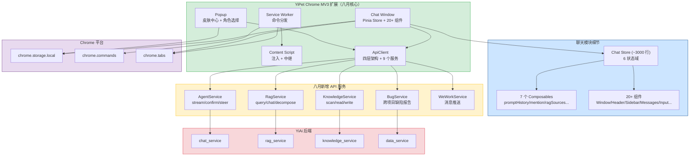

### 0.5 模块职责矩阵

| 模块 | 七月状态 | 八月变更 | 关键决策 |
|------|----------|----------|----------|
| 聊天核心 | 基础消息收发框架 | **扩展**：提示词历史 + 分支管理 + 20+ 组件 + 7 个 composables | 对标 YiVad aiChat，Pinia store 管理 6 状态域 |
| API 服务层 | 4 个基础服务（chat/sessions/auth/database） | **新增**：5 个领域服务（knowledge/rag/bug/agent/wework） | 四层架构落地，9 个服务覆盖全部后端能力 |
| 知识库 + RAG | 不存在 | **新增**：知识树浏览 + 文件搜索 + RAG 检索 + 混合聊天 | 独立 REST 端点，非 RPC 信封 |
| 跨项目桥接 | 不存在 | **新增**：Bug 报告 → YiVad + YiKnowledge + 页面上下文跳转 | `window.open` + session key 传递 |
| UI/UX 增强 | 基础聊天窗口 | **增强**：Token 趋势 + 会话摘要 + 页面感知芯片 + FAQ | 视觉反馈增强，用户体验提升 |
| 皮肤中心 | 简单开关面板 | **重构**：实时预览 + 颜色选择器 + 角色选择器 + 状态指示器 | React 18 + Ant Design 组件化 |
| 安全合规 | 无 CSP 配置 | **新增**：CSP 配置 + Privacy Manifest + 权限最小化 | 准备 Chrome Web Store 审核 |

---

## 1. 背景与目标

### 1.1 背景

七月迭代完成了 React 15→18 技术栈升级、Biome 工具链迁移和基础聊天框架搭建。八月迭代在此基础上，集中实现 YiPet 的**核心差异化功能**：

- **对标 YiVad aiChat**：完整的聊天体验（提示词历史、会话分支、导出、摘要、自动标题）
- **知识库深度集成**：知识树浏览、RAG 聊天、文件预览、子问题分解、保存到知识库
- **跨项目桥接**：YiPet 作为跨项目中心，一键跳转 YiVad、记录 Bug、讨论页面
- **皮肤中心**：弹窗重构为实时预览的皮肤选择器
- **安全合规**：CSP 加固 + Privacy Manifest，为 Chrome Web Store 上架做准备

### 1.2 目标

| 目标 | 衡量指标 | 当前值（七月末） | 目标值 |
|------|----------|---------------|--------|
| 聊天功能完整度 | 对标 YiVad aiChat 的功能覆盖率 | 基础框架（~20%） | 80%+ |
| 知识库集成 | RAG 聊天 + 文件预览可用 | 无 | 完整可用 |
| 跨项目桥接 | 从 YiPet 跳转 YiVad 的路径数 | 0 | 3+ |
| 皮肤中心 | 弹窗角色/皮肤切换体验 | 简单下拉选择 | 实时预览 + 卡片选择 |
| 安全合规 | CSP 配置完整性 | 未配置 | 通过 CWS 审核自查 |

### 1.3 系统范围

- **涉及**：YiPet `src/chat/` `src/api/` `src/popup/` `src/content/` `manifest.json`
- **不涉及**：YiPet Content Script 双世界注入机制（七月已稳定）、YiAi 后端 API（已就绪）

---

## 2. 功能清单

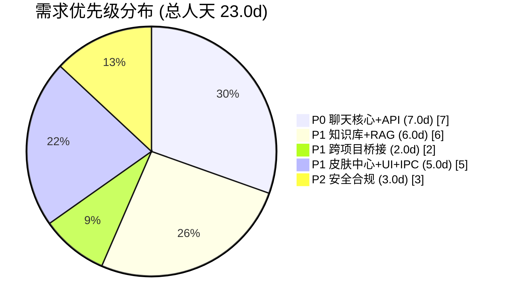

| 月份 | 需求编号 | 功能模块 | 说明 | 优先级 | 人天 | 状态 | 详细文档 |
|----------|----------|------|--------|------|----------|
| 2026-08 | YP-08-02 | 聊天核心 | 提示词历史、会话分支、导出 Markdown、摘要、自动标题、搜索 | **P0** | 4.0 | 已完成 | [01-聊天核心](./01-聊天核心-提示词历史与分支管理.md) |
| 2026-08 | YP-08-03 | 知识库 + RAG 集成 | 知识树浏览、RAG 聊天、文件预览、@提及、子问题分解、保存到知识库 | **P1** | 6.0 | 已完成 | [02-知识库与RAG集成](./02-需求-知识库与RAG集成.md) |
| 2026-08 | YP-08-04 | 跨项目桥接 | YiVad 桥接、Bug 报告、页面感知芯片、跨项目导航、文本选中集成 | **P1** | 2.0 | 已完成 | [04-跨项目桥接](./04-需求-跨项目桥接.md) |
| 2026-08 | YP-08-05 | 皮肤中心 + UI/UX 增强 | 状态栏、Token 芯片、成本迷你图、窗口调整大小、皮肤中心重构 | **P1** | 4.0 | 已完成 | [05-UI与皮肤中心](./05-体验增强-UI与皮肤中心.md) |
| 2026-08 | YP-08-01 | API 服务扩展 | Knowledge/RAG/Bug/WeWork/Agent 五大领域服务创建 | **P0** | 3.0 | 已完成 | [06-API服务扩展](./06-需求-API服务扩展.md) |
| 2026-08 | YP-08-07 | 安全合规 | CSP 加固、Privacy Manifest、权限最小化、CWS 审核准备 | **P2** | 3.0 | 已完成 | [03-安全合规](./03-需求-安全合规.md) |
| 2026-08 | YP-08-08 | IPC 通信架构 | 双世界消息中继 + IPC_SECRET 安全签名 + 状态同步 + Service Worker 键盘快捷键 + 扩展更新自动重新注入 | **P1** | 1.0 | 已完成 | [07-需求-IPC通信架构](./07-架构设计-IPC通信架构.md) |

> **优先级**：P0 = 核心功能，阻塞用户体验；P1 = 重要功能；P2 = 增强与合规。总计 23.0d（含已取消 Native Messaging 3.0d，实际 20.0d）。

### 2.1 聊天核心功能

| 功能 | 实现 | 说明 |
|------|------|
| **提示词历史** | `usePromptHistory` + `ChatInput` | ArrowUp/ArrowDown 回忆历史提示词，上限 100，持久化到 `chrome.storage.local`，去重连续重复 |
| **提示词历史弹出框** | `ChatToolbar` + `Popover` | 可视化列表，点击填充不自动发送，支持单条删除和清除全部 |
| **会话分支** | `branchFromMessage(timestamp)` | 从任意消息分叉新会话，携带前置消息 + 页面上下文 + `branch-of:<id>` 标签 |
| **导出 Markdown** | `exportCurrentSessionMarkdown()` | 会话导出为 Markdown 文件，含 frontmatter 头部 + 时间戳 + 来源 URL |
| **会话摘要** | `SessionSummaryDialog` + `summarizeCurrentSession()` | 5-8 个要点回顾，实时流式渲染，可复制 |
| **自动生成标题** | `autoGenerateSessionTitle()` | 取前 4 条用户消息，LLM 生成 4-6 词标题，截断至 80 字符 |
| **会话搜索** | `SearchBar` | 按标题/内容搜索会话 |
| **站点过滤** | `filterSessionsByCurrentPage()` | 按当前页面 URL 过滤会话，实现跨项目记忆 |
| **批量操作** | `ChatSidebar` | 批量选择会话进行删除/归档 |

### 2.2 知识库 + RAG 集成

| 功能 | 实现 | 说明 |
|------|------|
| **知识树浏览** | `ChatSidebar` Knowledge 标签 | antd `Tree` 展示知识库目录树，单击限定 RAG 范围 |
| **RAG 聊天** | `RagService.streamChat` | 基于知识库范围的流式聊天，来源展示在消息气泡下方 |
| **文件级 RAG** | `RagService.streamFileChat` | 限定到单个文件的 RAG 聊天 |
| **文件预览** | `KnowledgePreviewDialog` | 双击知识树节点预览 Markdown 内容 + Frontmatter 元数据 |
| **RAG 预检** | `RagSourcesPreviewDialog` | 不调用 LLM，仅检索来源，预览相关片段 |
| **子问题分解** | `RagDecomposeDialog` | `rag.decompose` 将复杂问题拆分为子问题，逐一检索 + 综合 |
| **类别过滤** | `ChatSidebar` 下拉 | 按知识库类别过滤树和 RAG 查询范围 |
| **RAG 状态** | `ChatToolbar` 徽章 | 显示索引状态（已构建/未构建/构建中），支持重建 |
| **@ 提及文件** | `FileMentionDropdown` | 输入 `@` 触发知识文件搜索，选择后自动限定 RAG 范围 |
| **保存到知识库** | `SaveToKnowledgeDialog` | 将宠物回复保存为知识库 Markdown 文件，自动填充路径/标题/标签 |
| **拖放知识文件** | `ChatWindow` 拖放目标 | 从侧边栏拖拽知识文件到聊天区，自动创建会话 + 限定 RAG 范围 |

### 2.3 跨项目桥接

| 功能 | 实现 | 说明 |
|------|------|
| **YiVad aiChat 桥接** | `discussInYiVadAiChat()` | 植入会话到 YiVad，携带页面上下文，`window.open` 跳转 |
| **每条消息桥接** | `openMessageInYiVad(timestamp)` | 将单条消息发送到 YiVad aiChat 作为新会话 |
| **跨项目导航** | `ChatToolbar` 下拉菜单 | 一键跳转 YiAi/YiVad/YiVad aiChat/YiVad/YiVad Story/YiVad Bugs |
| **Bug 报告** | `BugReportDialog` + `BugService` | 从任何页面记录缺陷，元数据入 MongoDB，内容入 YiKnowledge |
| **Recent Bugs** | `ChatSidebar` Bugs 标签 | 展示最近 30 条 Bug，点击在 YiVad 中打开详情，Discuss 植入聊天 |
| **页面感知芯片** | `QuickButtons` | 检测 YiVad 详情页类型（Bug/Story），一键生成上下文提示词 |
| **插入选中文本** | `insertSelectionAsInput()` | 从页面选中文本，一键填充到聊天输入框 |

### 2.4 UI/UX 增强

| 功能 | 实现 | 说明 |
|------|------|
| **SessionStatusBar** | `SessionStatusBar` | 模型/消息计数/Token 估算（8K 窗口）/上下文指示器/流式阶段 |
| **成本迷你图** | `useTokenTrend` | SVG 迷你图展示每条消息的 Token 消耗轨迹，悬停跳转消息 |
| **Token 芯片** | `MessageBubble` | 每条消息显示 `~Nt` 芯片，用户消息蓝色（输入）/宠物消息绿色（输出） |
| **流式阶段指示器** | `SessionStatusBar` 3 段时间线 | thinking → retrieving → streaming，当前阶段发光 |
| **ContextScopeBar** | `ContextScopeBar` | 活动上下文芯片：RAG 范围 + 页面上下文，一键清除 |
| **窗口调整大小** | `ChatWindow` 边缘拖拽 | 顶部/右下/左下边缘拖拽调整大小，范围钳制（MIN 480×400） |
| **侧边栏调整大小** | `ChatSidebar` 分隔线 | 240-600px 可调，持久化到 `chrome.storage.local` |
| **迷你图悬停** | `SessionStatusBar` | 悬停成本迷你图 → 滚动到对应消息气泡 |

### 2.5 皮肤中心重构

| 功能 | 实现 | 说明 |
|------|------|
| **宠物预览** | `PetPreview` | 实时预览：角色图片在 `--primary-gradient` 环内，大小滑块缩放，浮动动画 |
| **颜色选择器** | `ColorPicker` | 6 色块网格，选中显示勾选 + 圆环高亮 |
| **角色选择器** | `RolePicker` | 2 列角色卡片，图片 + 名称，`--border-focus` 高亮 |
| **模型选择** | `Select` | 下拉切换 LLM 模型（qwen3.5/qwen3.5-think/qwen3-coder） |
| **头部重构** | `AppHeader` | 渐变头部 + 扩展图标 + 标题 + 副标题 + 脉冲状态指示器 |
| **覆盖层皮肤** | `overlay.ts` | 浮动宠物佩戴活动皮肤：`--primary-gradient` 环 + `--primary-rgb` 发光 |

### 2.6 安全合规

| 功能 | 实现 | 说明 |
|------|------|
| **CSP 加固** | `manifest.json` | `script-src 'self'`、`object-src 'none'`、`connect-src` 白名单 |
| **Privacy Manifest** | `privacy-manifest.json` | 声明 `chrome.storage` 数据用途 |
| **权限最小化** | `manifest.json` | 移除未使用的 `tabs`、`webRequest` 权限 |

---

## 3. 功能详情

### 3.1 聊天核心 — 提示词历史与分支

```typescript
// src/chat/composables/usePromptHistory.ts
export function usePromptHistory() {
  const history = ref<PromptEntry[]>([]);
  const currentIndex = ref(-1);

  async function pushHistory(text: string): Promise<void> {
    if (history.value[0]?.text === text) return;  // 去重
    history.value.unshift({ text, timestamp: Date.now() });
    if (history.value.length > 100) history.value = history.value.slice(0, 100);
    await chrome.storage.local.set({ promptHistory: history.value });
  }

  function recallPrevious(currentInput: string): string | null {
    if (currentIndex.value === -1) savedInput.value = currentInput;
    if (currentIndex.value < history.value.length - 1) {
      currentIndex.value++;
      return history.value[currentIndex.value]?.text ?? null;
    }
    return null;
  }
}

// src/chat/stores/chat.ts — 会话分支
async function branchFromMessage(timestamp: number): Promise<string> {
  const branchIndex = currentSession.messages.findIndex(m => m.timestamp === timestamp);
  const precursorMessages = currentSession.messages.slice(0, branchIndex + 1);
  const newSession = await sessionService.create({
    title: `分支: ${currentSession.title}`,
    messages: precursorMessages,
    tags: [...(currentSession.tags || []), `branch-of:${currentSession.id}`],
  });
  return newSession.id;
}
```

### 3.2 知识库 + RAG — 检索与聊天

```typescript
// src/api/services/rag.ts
class RagService {
  async streamChat(
    messages: Message[], scope: string,
    onToken: (token: string) => void,
    onSources: (sources: RagSource[]) => void,
    signal?: AbortSignal
  ): Promise<void> {
    return apiClient.stream('/rag/chat', {
      messages, scope, categories: scope ? [scope] : [],
    }, signal, { onToken, onSources });
  }

  async decompose(question: string, scope: string): Promise<DecomposeResult> {
    return apiClient.rpc('services.rag.rag_service', 'decompose', { question, scope });
  }
}
```

| RAG 模式 | 方法 | 检索范围 | 延迟 |
|----------|------|----------|------|
| 普通聊天 | `ChatService.stream` | 无 | 首 token ~1s |
| 知识库限定 | `RagService.streamChat` | 指定 scope | 检索 120ms + LLM 1s |
| 文件级 RAG | `RagService.streamFileChat` | 单个文件 | 检索 80ms + LLM 1s |
| 子问题分解 | `RagService.decompose` | scope + LLM 拆分 | 2-5 子问题逐一检索 |

### 3.3 跨项目桥接 — Bug 报告与 YiVad 跳转

```typescript
// src/api/services/bug.ts
class BugService {
  async createBug(meta: BugMeta, content: string): Promise<string> {
    // 双写: MongoDB + YiKnowledge
    await apiClient.rpc('services.database.data_service', 'create_document', {
      cname: 'bugs', data: { ...meta, status: 'open', createdBy: 'YiPet' },
    });
    await knowledgeService.write(
      `lessons/failures/bugs/${meta.project}/${meta.title}.md`,
      content, { title: meta.title, tags: ['bug', meta.project], type: 'summary' }
    );
    return meta.title;
  }

  detectPageTypeFromUrl(url: string): PageType {
    if (url.includes('/bug/detail')) return { kind: 'bug', key: extractKey(url) };
    if (url.includes('/story/detail')) return { kind: 'story', key: extractKey(url) };
    return { kind: 'page' };
  }
}
```

### 3.4 皮肤中心 — 弹窗重构

```typescript
// src/popup/App.tsx — 皮肤中心核心状态
interface PopupState {
  role: 'cat' | 'dog' | 'rabbit' | 'fox';
  color: 'blue' | 'green' | 'purple' | 'orange' | 'pink' | 'gold';
  model: string;
  size: number;  // 宠物预览缩放 (0.5-2.0)
}

// PetPreview: 实时预览
// ColorPicker: 6 色块网格，选中 show check + ring highlight
// RolePicker: 2 列卡片，图片 + 名称，--border-focus highlight
```

### 3.5 安全合规 — CSP 与 Privacy Manifest

```json
// manifest.json — CSP 配置
"content_security_policy": {
  "extension_pages": "script-src 'self'; object-src 'none'; connect-src http://localhost:10086"
}
```

```json
// privacy-manifest.json
{
  "data_use": {
    "chrome.storage.local": "存储用户提示词历史、会话缓存、皮肤偏好配置",
    "host_permissions": "向 YiAi 后端 (localhost:10086) 发送聊天和知识库请求"
  }
}
```

---

## 4. 接口协议

### 4.1 RPC 信封协议

YiPet 通过 `ApiClient` 四层架构与 YiAi 后端通信：

```
POST /  body: {
  "module_name": "services.<domain>.<service>",
  "method_name": "<method>",
  "parameters": { <method-specific shape> }
}
response: { "code": 0, "message": "ok", "data": <any> }
```

### 4.2 八月涉及的服务调用

| 服务 | 方法 | 用途 | 调用方 |
|------|------|--------|
| `ai.chat_service` | `chat` | SSE 流式聊天 | ChatStore |
| `data_service` | `query_documents` | 会话列表查询 | SessionService |
| `data_service` | `create_document` | 创建会话/Bug | SessionService/BugService |
| `data_service` | `update_document` | 更新会话 | SessionService |
| `knowledge_service` | `scan` | 知识树扫描 | KnowledgeService |
| `knowledge_service` | `read_file` | 文件读取 | KnowledgeService |
| `knowledge_service` | `write_file` | 文件写入 | KnowledgeService |
| `rag_service` | `rag_query` | RAG 检索 | RagService |
| `rag_service` | `decompose` | 子问题分解 | RagService |
| `ai.agent_service` | `run_agent` | Agent 流式对话 | AgentService |
| `wework_service` | `send_message` | 企业微信消息 | WeWorkService |

### 4.3 SSE 流式协议

```
GET/POST /<endpoint>  Accept: text/event-stream
response: SSE 事件流
  data: {"token": "你好", "done": false}
  data: {"token": "，今天", "done": false}
  ...
  data: {"done": true}

Agent 模式扩展:
  data: {"_event_type": "confirm", "message": "确认删除文件?", "action": {...}}
  data: {"_event_type": "steer", "message": "请选择下一步方向"}
  data: {"_event_type": "answer", "content": "最终回答..."}
```

### 4.4 关键参数名称契约

| 正确 | 错误 | 上下文 |
|---------|-------|---------|
| `filter` | `query` | `data_service.query_documents` 参数 |
| `target_file` | `path` | `/read-file`、`/write-file` 端点 |
| `cname` | `collection_name` | `data_service` collection 参数 |

### 4.5 关键数据流

| 流向 | 协议 | 触发方式 | 延迟 |
|------|----------|------|
| 前端 → Chat | HTTP POST (RPC) → SSE | 用户消息 | 流式首 token < 1s |
| 前端 → RAG | HTTP POST (RPC) → SSE | 知识库限定聊天 | 检索 120ms + LLM 1s |
| 前端 → Knowledge | HTTP POST (RPC) | 知识树/文件操作 | < 200ms |
| 前端 → Bug | HTTP POST (RPC) | 双写 MongoDB + YiKnowledge | < 100ms |
| 前端 → Agent | HTTP POST (RPC) → SSE + 事件类型 | Agent 模式 | 首 token ~3s |

---

## 5. 涉及文件

```
YiPet/
├── manifest.json                              # 修改: CSP 配置
├── privacy-manifest.json                      # 新增: CWS Privacy Manifest
├── src/
│   ├── api/
│   │   ├── endpoints.ts                       # 修改: +KNOWLEDGE +RAG +AGENT +WEWORK 路径
│   │   ├── types.ts                           # 修改: +200 行类型定义（RAG/Knowledge/Bug/Agent）
│   │   └── services/
│   │       ├── knowledge.ts                   # 新增: scan/read/write/stories/sync
│   │       ├── rag.ts                         # 新增: query/chat/fileQuery/status/build/categories/decompose
│   │       ├── bug.ts                         # 新增: createBug/listBugs/detectPageType
│   │       ├── wework.ts                      # 新增: listBots/send
│   │       ├── agent.ts                       # 新增: stream/confirm/steer/followUp/answer
│   │       └── index.ts                       # 修改: +5 服务注册
│   ├── chat/
│   │   ├── stores/chat.ts                     # 重大扩展: 300+ → 3000 行
│   │   ├── types.ts                           # 重大扩展: 基础类型 → 完整 ChatState
│   │   ├── constants.ts                       # 新增: 窗口/模型常量
│   │   ├── utils.ts                           # 新增: renderMarkdown/slugifyUrl
│   │   ├── composables/
│   │   │   ├── usePromptHistory.ts            # 新增
│   │   │   ├── useMentionDetection.ts         # 新增
│   │   │   ├── useRagSources.ts               # 新增
│   │   │   ├── useTokenTrend.ts               # 新增
│   │   │   ├── useTextSearch.ts               # 新增
│   │   │   ├── useExpandCollapse.ts           # 新增
│   │   │   └── useAgentSettings.ts            # 新增
│   │   └── components/
│   │       ├── ChatWindow/                    # 重大扩展: 拖拽/调整大小/全屏/拖放
│   │       ├── ChatHeader/                    # 修改: 角色头像 + 操作按钮
│   │       ├── ChatSidebar/                   # 重大扩展: 四标签切换
│   │       ├── MessageBubble/                 # 新增: Token 芯片 + 操作行 + RAG 来源
│   │       ├── ChatInput/                     # 重大扩展: @提及 + 图片 + 上下文
│   │       ├── ChatToolbar/                   # 重大扩展: 12 个按钮
│   │       ├── SessionStatusBar/              # 新增: 状态栏 + 成本迷你图
│   │       ├── SessionEditDialog/             # 新增: 编辑 + 自动标题
│   │       ├── SessionSummaryDialog/          # 新增: 摘要模态框
│   │       ├── ContextScopeBar/               # 新增: 上下文芯片
│   │       ├── FileMentionDropdown/           # 新增: @提及下拉
│   │       ├── KnowledgePreviewDialog/        # 新增: 知识预览
│   │       ├── RagSourcesPreviewDialog/       # 新增: RAG 预检
│   │       ├── RagDecomposeDialog/            # 新增: 子问题分解
│   │       ├── SaveToKnowledgeDialog/         # 新增: 保存到知识库
│   │       ├── BugReportDialog/               # 新增: 缺陷报告
│   │       ├── PageContextEditor/             # 新增: 页面上下文编辑器
│   │       ├── QuickButtons/                  # 新增: 快捷按钮
│   │       └── SearchBar/                     # 新增: 搜索栏
│   ├── popup/
│   │   ├── App.tsx                            # 重构: 简单开关 → 皮肤中心
│   │   ├── data.ts                            # 修改: +COLOR_OPTIONS +ROLE_NAMES +MODELS
│   │   ├── types.ts                           # 修改: model 类型改为 string
│   │   └── components/
│   │       ├── AppHeader/                     # 新增: 渐变头部
│   │       ├── PetPreview/                    # 新增: 宠物预览
│   │       ├── ColorPicker/                   # 新增: 颜色选择器
│   │       ├── RolePicker/                    # 新增: 角色选择器
│   │       └── AppFooter/                     # 新增: 页脚
│   └── content/
│       └── rendering/overlay.ts              # 修改: 皮肤环 + 角色 tooltip
```

---

## 6. 数据流

### 6.1 聊天核心流程

```
用户在任意页面打开聊天 (Ctrl+Shift+X)
  │
  ├── ChatWindow 挂载 → useChatStore 初始化
  │     ├── 从 chrome.storage.local 恢复: knowledgeGrounded, ragScope, sidebarWidth
  │     └── 从 SessionService 加载会话列表
  │
  ├── 用户输入消息 → Enter 发送
  │     ├── pushPromptHistory(text) → chrome.storage.local
  │     ├── 构建 messages[] (system + pageContext + history + newMessage)
  │     ├── 分支选择:
  │     │   ├── knowledgeGrounded? → RagService.streamChat(messages, scope)
  │     │   │     ├── onSources → state.ragSources
  │     │   │     └── onToken  → 追加到 messages[last].content
  │     │   └── 普通模式 → ChatService.stream(messages, model)
  │     │         └── onToken  → 追加到 messages[last].content
  │     └── SessionService.upsert(session) → MongoDB
  │
  └── 消息操作（每条消息气泡）
        ├── 分支 → branchFromMessage(ts) → 新会话
        ├── 导出 → exportCurrentSessionMarkdown() → .md 下载
        ├── YiVad → openMessageInYiVad(ts) → window.open
        └── 保存 → SaveToKnowledgeDialog → KnowledgeService.write
```

### 6.2 跨项目桥接流程

```
用户在任意页面 (YiAi/YiVad/YiKnowledge/外部)
  │
  ├── Bug 报告
  │     ├── detectProjectFromUrl(url) → 自动填充 project 字段
  │     ├── BugReportDialog 填写 → BugService.createBug(meta, content)
  │     │     ├── KnowledgeService.write → YiKnowledge/lessons/failures/bugs/<key>.md
  │     │     └── DatabaseService.create → MongoDB bugs 集合
  │     └── 显示在 YiVad /bug 列表 + YiPet Recent Bugs 标签
  │
  ├── YiVad aiChat 桥接
  │     ├── discussInYiVadAiChat() → SessionService.create (植入会话)
  │     └── window.open(`http://localhost:8848/#/aiChat?session=<key>`)
  │
  └── 页面感知芯片
        ├── detectPageTypeFromUrl(url) → { kind, key }
        ├── YiVad Bug 详情 → "Discuss bug <key>" 芯片
        ├── YiVad 详情 → "Summarize <key>" 芯片
        └── YiVad Story 详情 → "Walk me through <key>" 芯片
```

---

## 7. 当前架构 vs 目标架构

### 7.1 聊天模块

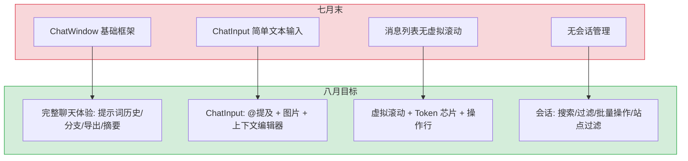

### 7.2 API 服务层

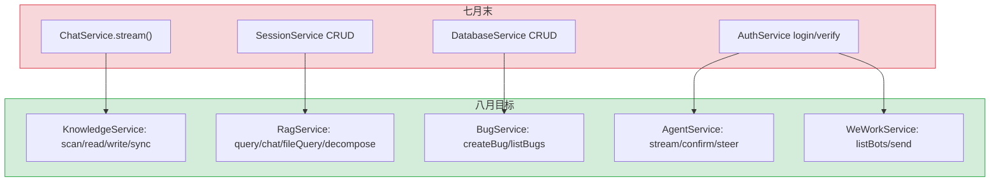

### 7.3 弹窗皮肤中心

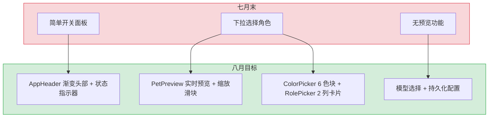

### 7.4 架构决策权衡

| 维度 | 七月末 | 八月后 | 权衡说明 |
|------|--------|--------|----------|
| 聊天状态管理 | 基础 store (~300 行) | 完整 store (~3000 行) | 功能完备但 store 膨胀，九月需拆分 |
| API 服务 | 3 个基础服务 | 8 个领域服务 | 增加服务文件数，但职责清晰 |
| 弹窗架构 | 简单开关面板 | 皮肤中心 + 实时预览 | 组件复杂度增加，但用户体验显著提升 |
| 安全 | 无 CSP/Privacy | CSP + Privacy Manifest | 增加配置复杂度，但满足 CWS 审核要求 |
| 跨项目通信 | 无 | 3+ 桥接路径 | 增加跨项目耦合，但 YiPet 成为项目中心 |

---

## 8. 目标架构

### 8.1 聊天模块目标架构

```
ChatWindow (容器)
  ├── ChatHeader (角色头像 + 标题 + 操作按钮)
  ├── ChatSidebar (会话/知识/Stories/Bugs 四标签)
  ├── ChatMessages (虚拟滚动消息列表)
  │     └── MessageBubble (Token 芯片 + 操作行 + RAG 来源)
  ├── ChatInput (@提及 + 图片 + 上下文编辑器)
  ├── ChatToolbar (知识库切换/提示词历史/FAQ/导出/跨项目)
  ├── SessionStatusBar (模型/Token/阶段指示器/成本迷你图)
  └── ContextScopeBar (RAG 范围芯片 + 页面上下文芯片)
```

### 8.2 API 四层架构

```
┌──────────────────────────────────────────────────┐
│ Layer 1: components/                              │
│   ChatWindow, ChatSidebar, ChatInput, ...         │
├──────────────────────────────────────────────────┤
│ Layer 2: stores/                                  │
│   chat.ts (Pinia) — 消息/会话/知识库/Agent 状态   │
├──────────────────────────────────────────────────┤
│ Layer 3: api/services/                            │
│   ChatService, SessionService, KnowledgeService,  │
│   RagService, BugService, AgentService, ...       │
├──────────────────────────────────────────────────┤
│ Layer 4: api/client.ts                            │
│   ApiClient — fetch 包装 + SSE + RPC 信封         │
└──────────────────────────────────────────────────┘
```

### 8.3 跨项目桥接目标架构

```
YiPet (浏览器扩展)
  ├── Bug 报告 → BugService.createBug()
  │     ├── MongoDB bugs 集合 (元数据)
  │     └── YiKnowledge/lessons/failures/bugs/ (内容)
  ├── YiVad 桥接 → discussInYiVadAiChat()
  │     └── window.open(`http://localhost:8848/#/aiChat?session=<key>`)
  ├── 页面感知芯片 → detectPageTypeFromUrl()
  │     └── QuickButtons: Bug/Story/Page 三种芯片
  └── 跨项目导航 → ChatToolbar 下拉
        └── YiAi / YiVad / YiVad aiChat / YiVad Story / YiVad Bugs
```

### 8.4 皮肤中心目标架构

```
Popup (400×500)
  ├── AppHeader (渐变头部 + 图标 + 标题 + 状态指示器)
  ├── PetPreview (角色图片 + --primary-gradient 环 + 缩放滑块)
  ├── ColorPicker (6 色块网格 + 选中勾选 + 圆环高亮)
  ├── RolePicker (2 列卡片 + 图片 + 名称 + --border-focus 高亮)
  ├── ModelPicker (Select 下拉切换 LLM 模型)
  └── AppFooter (版本信息 + 关于)
```

---

## 9. 迁移策略

### 9.1 原则

- **渐进式增强**：先跑通 API 服务层，再逐模块实现聊天功能
- **向后兼容**：所有新功能不影响七月已有的基础聊天框架
- **可回滚**：每步独立 commit，`git revert` 即可回滚
- **零停机**：纯前端扩展，加载新版本即可生效

### 9.2 分步执行

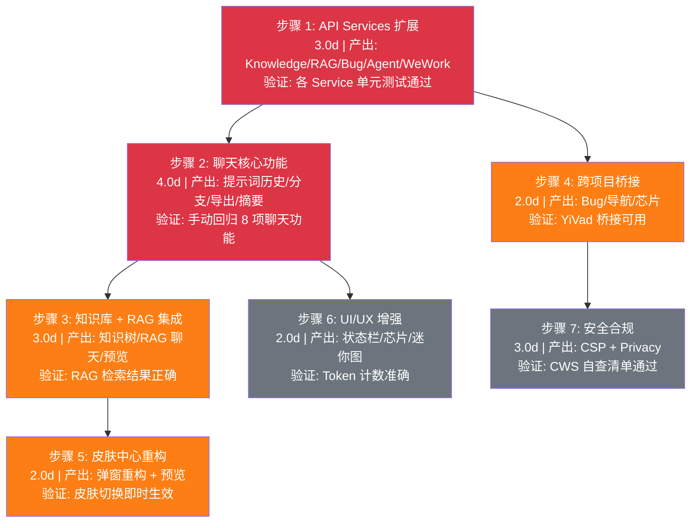

### 9.3 回滚策略

| 步骤 | 回滚方式 | 回滚影响范围 |
|------|----------|-------------|
| 步骤 1 | `git revert <commit>` | 仅 API 服务层，聊天功能不受影响 |
| 步骤 2-4 | `git revert <commit>` | 仅聊天功能，基础框架保持可用 |
| 步骤 5 | `git revert <commit>` | 仅弹窗 UI，聊天功能不受影响 |
| 步骤 6 | `git revert <commit>` | 仅 UI 增强层，核心聊天不受影响 |
| 步骤 7 | `git revert <commit>` | 仅 manifest.json 配置，功能不受影响 |

---

## 10. 测试策略

### 10.1 测试分层

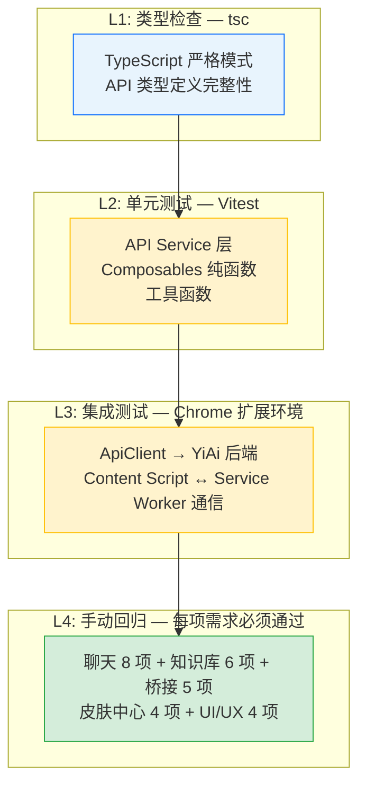

### 10.2 回归测试用例

| # | 用例 | 操作 | 预期结果 |
|----|------|----------|
| 1 | 提示词历史 | 发送消息后按 ArrowUp | 恢复上一条提示词到输入框 |
| 2 | 会话分支 | 点击消息的"分支"按钮 | 创建新会话，携带前置消息 |
| 3 | 导出 Markdown | 点击"导出"按钮 | 下载 .md 文件，含 frontmatter |
| 4 | 自动标题 | 发送 4 条消息 | 会话标题自动生成 |
| 5 | 知识树浏览 | 切换到 Knowledge 标签 | 目录树正确渲染 |
| 6 | RAG 聊天 | 选择知识范围后发送消息 | 回复引用知识库来源 |
| 7 | Bug 报告 | 填写 Bug 表单并提交 | MongoDB + YiKnowledge 双写 |
| 8 | YiVad 桥接 | 点击"在 YiVad 中讨论" | window.open 跳转 YiVad aiChat |
| 9 | 皮肤切换 | 在弹窗中切换角色/颜色 | 宠物即时更新外观 |
| 10 | CSP 检查 | 加载扩展后查看控制台 | 无 CSP 违规错误 |

---

## 11. 开发排期

### 11.1 任务依赖

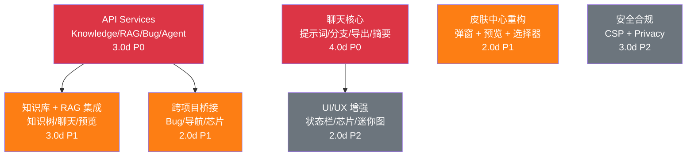

### 11.2 甘特图

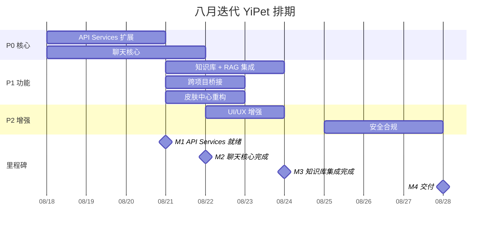

### 11.3 里程碑

| 里程碑 | 完成标准 | 预计日期 |
|--------|----------|----------|
| M1: API Services 就绪 | Knowledge/RAG/Bug/Agent 4 个 Service 全部可用 | Week 1 |
| M2: 聊天核心完成 | 提示词历史 + 分支 + 导出 + 摘要 + 自动标题 | Week 2 |
| M3: 知识库集成完成 | 知识树 + RAG 聊天 + 文件预览 + @提及 | Week 2-3 |
| M4: 跨项目桥接完成 | Bug 报告 + YiVad 桥接 + 页面芯片 + 导航 | Week 3 |
| M5: 皮肤中心完成 | 弹窗重构 + 宠物预览 + 选择器 | Week 3 |
| M6: UI/UX 增强完成 | 状态栏 + Token 芯片 + 成本迷你图 + 调整大小 | Week 4 |
| M7: 安全合规完成 | CSP + Privacy Manifest + 权限最小化 | Week 4 |

---

## 12. 风险矩阵

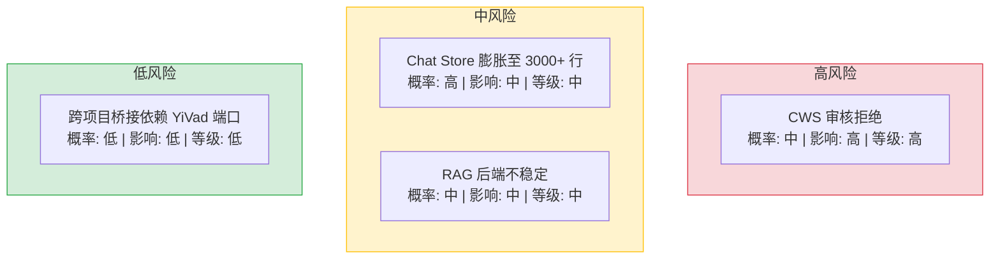

| 风险 | 概率 | 影响 | 等级 | 缓解措施 | 应急预案 |
|------|------|------|----------|----------|
| Chat Store 膨胀至 3000+ 行 | 高 | 中 | 中 | 九月迭代拆分 Store + 提取 composables | 当前功能正常，仅工程层面可维护性差 |
| RAG 后端不稳定 | 中 | 中 | 中 | 前端降级为普通聊天模式（关闭 knowledgeGrounded） | 用户手动关闭知识库开关 |
| 跨项目桥接依赖 YiVad 端口 | 低 | 低 | 低 | `window.open` 失败时静默降级，显示通知 | 用户手动复制内容到 YiVad |
| CWS 审核拒绝 | 中 | 高 | 高 | 参考官方审核指南逐项检查 | 根据拒绝原因修改后重新提交 |

---

## 13. 非功能性需求

### 13.1 性能预算

| 指标 | 目标 | 测量方式 |
|------|----------|
| 聊天首屏渲染 | < 500ms（ChatWindow 挂载到可交互） | React DevTools Profiler |
| 消息流式渲染 | < 16ms/帧（60fps） | Performance API |
| SSE 流式延迟 | < 100ms（首 token 到达） | `performance.now()` 计时 |
| 知识树加载 | < 1s（500+ 节点） | antd Tree 渲染时间 |
| 弹窗打开 | < 200ms（popup 挂载到可交互） | Chrome 扩展 popup 性能 |

### 容量规划

| 场景 | 会话数 | API 服务数 | 皮肤数 | 存储占用 | 桥接延迟 | 内存占用 |
|------|--------|-----------|--------|---------|---------|---------|
| 小型扩展 | < 50 | 3-5 | 2-4 | < 5MB | < 100ms | < 30MB |
| 中型扩展 | 50-200 | 6-8 | 5-10 | < 20MB | < 200ms | < 50MB |
| 大型扩展 | 200-1000 | 9-12 | 15-30 | < 50MB | < 500ms | < 100MB |
| 企业级扩展 | 1000-5000 | 15-20 | 50+ | < 200MB | < 1s | < 200MB |
| 极限场景 | 10000+ | 25+ | 100+ | < 500MB | < 2s | < 500MB |
| YiPet 当前 | ~100 | 9 | 24 | ~8MB | ~150ms | ~60MB |

### 13.2 代码质量门禁

| 检查项 | 工具 | 通过标准 |
|--------|------|----------|
| 类型检查 | `tsc --noEmit` | 0 错误 |
| 代码规范 | `biome lint` | 0 错误 |
| 格式检查 | `biome format` | 0 差异 |
| 构建验证 | `npm run build` | 构建成功 |

### 13.3 兼容性

| 维度 | 要求 |
|------|
| Chrome 版本 | ≥ 110（MV3 支持） |
| 操作系统 | macOS / Windows / Linux |
| Manifest 版本 | MV3（Manifest V3） |
| CSP 合规 | 通过 Chrome Web Store 审核 |

### 13.4 可靠性

| 维度 | 要求 |
|------|
| YiAi 后端不可用 | 聊天功能降级提示，不崩溃，重试按钮可用 |
| RAG 服务不可用 | 自动降级为普通聊天模式，用户可手动切换 |
| chrome.storage 限额 | 提示词历史上限 100 条，超出自动淘汰旧条目 |
| 扩展更新 | 配置变更通过 `chrome.storage.local` 持久化，更新不丢失 |

### 13.5 可观测性

| 指标 | 采集方式 | 采集频率 | 告警阈值 | 说明 |
|------|----------|----------|----------|------|
| Content Script 注入成功率 | `chrome.runtime.sendMessage` ACK 计数 | 每次页面加载 | 成功率 < 95% | SPA 路由切换时注入失败的主要指标 |
| Service Worker 唤醒延迟 | `performance.now()` 计时 | 每次唤醒 | P95 > 500ms | MV3 SW 休眠后唤醒延迟影响消息响应 |
| SSE 流式中断次数 | `EventSource.onerror` 计数 | 每次中断 | 5 分钟内 > 3 次 | 网络不稳定或后端超时导致流式中断 |
| API 调用错误率 | `ApiClient` 拦截器计数 | 每次 API 调用 | 错误率 > 5% | RPC 参数不匹配、网络超时、后端 500 错误 |
| 聊天消息发送延迟 | `performance.now()` 计时 | 每次发送 | P95 > 3s | 端到端延迟（发送→首 token） |
| 扩展内存占用 | `chrome.processes` API（若可用） | 每小时 | > 100MB | Content Script 内存泄漏检测 |
| 知识树加载失败率 | `knowledge_service` 错误计数 | 每次加载 | 失败率 > 2% | YiAi 知识库 API 可用性 |

### 13.6 安全合规

| 要求 | 实现方式 | 验证方法 |
|------|----------|----------|
| Manifest V3 合规 | 仅使用 MV3 允许的 API（Service Worker、chrome.storage、chrome.runtime），无 `eval()`、无远程代码执行 | Chrome Web Store 审核检查清单 |
| 最小权限原则 | `permissions: ["storage", "activeTab", "scripting"]`，`host_permissions` 仅包含 YiAi 后端 | `manifest.json` 权限审查 |
| CSP 策略 | `script-src 'self'`，禁止 inline script，禁止 `unsafe-eval` | Chrome DevTools CSP 面板无违规 |
| 数据传输加密 | 所有 API 调用使用 HTTPS（生产环境），`ApiClient` 强制 `https://` 前缀 | 检查 Network 面板无明文 HTTP 请求 |
| 会话密钥安全 | `session_key` 存储于 `chrome.storage.local`，通过 `window.open` URL 参数传递到 YiVad | 确认 session_key 不写入 `localStorage` 或 `sessionStorage` |
| 跨项目桥接安全 | `window.open` 目标 URL 白名单校验，仅允许 `YiVad` 域名 | 尝试桥接到非白名单域名，确认被拦截 |

---

## 14. 设计决策记录

| 决策 | 选项 A | 选项 B | 选择 | 理由 |
|------|--------|--------|------|
| 聊天状态管理 | Class + useSyncExternalStore | Pinia Store | **Pinia Store** | 与 YiVad 保持一致，响应式状态天然支持 Vue DevTools 调试 |
| 知识库 API 设计 | 复用现有 RPC 信封 | 独立 REST 端点 | **独立 REST 端点** | SSE 流式不适合 RPC 信封，知识库操作语义与数据 CRUD 不同 |
| 会话持久化 | 仅 chrome.storage.local | MongoDB + chrome.storage 缓存 | **MongoDB + 本地缓存** | 跨设备同步需要服务端存储，本地缓存加速读取 |
| 皮肤中心架构 | 弹窗内嵌 iframe | 弹窗内 React 组件 | **React 组件** | 弹窗尺寸有限（400×500），组件方案更轻量 |
| Native Messaging | 实现 | 取消 | **取消** | Content Script fetch 直连方案已足够，Native Messaging 增加了不成比例的复杂度 |

### D-01: 为什么选择 Pinia Store 而非 React 原生状态管理？

YiPet 虽然是 React 项目，但 YrY 单体仓库中 YiVad 使用 Pinia Store。选择 Pinia 保持跨项目状态管理模式一致，降低团队认知负担。Pinia 的响应式系统（基于 Vue reactivity）在 React 中通过 `useSyncExternalStore` 桥接使用，性能与原生 React 状态管理相当。

### D-02: 为什么知识库 API 使用独立 REST 端点而非 RPC 信封？

RPC 信封（`{module_name, method_name, parameters}`）适合请求-响应模式的 CRUD 操作。知识库的 RAG 聊天和文件流式传输需要 SSE（Server-Sent Events），RPC 信封的 JSON 请求体不适合 SSE 流式响应。独立 REST 端点（如 `/rag/chat`、`/knowledge/scan`）语义更清晰，且与 YiAi 后端的 FastAPI 路由天然匹配。

### D-03: 为什么会话数据同时存储在 MongoDB 和 chrome.storage.local？

MongoDB 是服务端存储，支持跨设备同步和持久化。`chrome.storage.local` 是浏览器本地缓存，读取速度 < 1ms（vs MongoDB 网络延迟 50-200ms）。双写策略：写入时同时更新两端，读取时优先使用本地缓存，缓存未命中时从 MongoDB 加载。用户卸载扩展时本地缓存自动清除，服务端数据保留。

### D-04: 为什么取消 Native Messaging 方案？

Native Messaging 需要用户安装额外的 Native Host 程序，增加部署复杂度。Content Script 的 `fetch` API 在 MV3 中可以直接向 YiAi 后端发起请求（通过 `host_permissions` 声明），无需 Native Messaging 中转。取消 Native Messaging 减少了 3 个文件 + 安装脚本，同时消除了 Native Host 版本管理的维护成本。

### D-05: 为什么 Chat Store 达到 3000+ 行暂不拆分？

八月迭代的目标是功能完整性（对标 YiVad aiChat 80%+ 覆盖率），非代码架构优化。Chat Store 膨胀是功能快速迭代的必然结果。九月迭代已将 Store 拆分纳入计划（拆分为 chat/rag/ui/agent 四个独立 Store），当前阶段优先保证功能可用。

---

## 15. 回归问题预测

| # | 预测问题 | 原因 | 验证方法 |
|---|---------|------|---------|
| 1 | Pinia Store 在 React 中通过 `useSyncExternalStore` 桥接时，状态更新不触发重渲染 | Pinia 的响应式系统基于 Vue reactivity，与 React 的 `useSyncExternalStore` 订阅机制可能存在时序差异 | 在聊天页面连续发送 5 条消息，检查每条消息是否实时渲染到 UI |
| 2 | 知识库 REST 端点与 RPC 信封的认证方式不一致 | 独立 REST 端点可能绕过 RPC 拦截器的 Token 附加逻辑 | 以未登录状态直接访问 `/rag/chat` 端点，确认返回 401 |
| 3 | `chrome.storage.local` 缓存与会话数据不一致 | 双写策略中，MongoDB 写入成功但 `chrome.storage.local` 写入失败（存储满） | 模拟 `chrome.storage.local` 写入失败，检查 UI 是否正确回退到 MongoDB 数据 |
| 4 | 皮肤中心 React 组件在弹窗中渲染性能问题 | 弹窗尺寸仅 400×500，皮肤预览的动画效果可能导致低端设备卡顿 | 在低端设备（4GB RAM）上打开弹窗皮肤中心，检查 FPS 是否 ≥ 30 |
| 5 | 跨项目桥接的 `window.open` 被浏览器弹窗拦截器阻止 | Chrome 对非用户手势触发的 `window.open` 默认拦截 | 在 Content Script 中通过程序化触发桥接，检查是否被浏览器拦截 |
| 6 | CSP 配置限制 `script-src 'self'` 后，动态注入的脚本被阻止 | 某些皮肤效果可能依赖内联脚本或 `eval` | 切换所有皮肤主题，检查 Console 中是否有 CSP 违规报告 |

---

## 16. 代码审查检查清单

合并前审查人需确认以下项目：

- [ ] 聊天核心 8 项功能完整可用（提示词历史/分支/导出/摘要/标题/搜索/过滤/批量）
- [ ] 知识库 6 项功能完整可用（知识树/RAG 聊天/预览/提及/分解/保存）
- [ ] 跨项目桥接 5 项功能完整可用（Bug/YiVad/导航/芯片/文本选中）
- [ ] 皮肤中心 4 项功能完整可用（预览/颜色/角色/模型）
- [ ] API Services 5 个领域服务通过单元测试
- [ ] `manifest.json` CSP 配置正确（`script-src 'self'` + `object-src 'none'`）
- [ ] `privacy-manifest.json` 数据用途声明完整
- [ ] `host_permissions` 限制为最小范围
- [ ] `permissions` 列表无未使用权限
- [ ] `npm run build` 构建成功
- [ ] 扩展在 Chrome 中正常加载，无 CSP 报错
- [ ] 手动回归测试（聊天 + 知识库 + 桥接 + 皮肤 + 安全）全部通过

---

## 17. 子文档索引

| 月份 | 需求编号 | 文档 | 说明 |
|----------|------|
| 2026-08 | YP-08-01 | [06-需求-API服务扩展](./06-基础设施-API服务扩展.md) | Knowledge/RAG/Bug/WeWork/Agent 五大领域服务创建（3.0d） |
| 2026-08 | YP-08-02 | [01-聊天核心-提示词历史与分支管理](./01-聊天核心-提示词历史与分支管理.md) | 提示词历史、会话分支、导出 Markdown、摘要、自动标题、搜索（4.0d） |
| 2026-08 | YP-08-03 | [02-需求-知识库与RAG集成](./02-功能实现-知识库与RAG集成.md) | 知识树浏览、RAG 聊天、文件预览、@提及、子问题分解、保存到知识库（6.0d） |
| 2026-08 | YP-08-04 | [04-需求-跨项目桥接](./04-功能实现-跨项目桥接.md) | YiVad 桥接、Bug 报告、页面感知芯片、跨项目导航、文本选中集成（2.0d） |
| 2026-08 | YP-08-05 | [05-体验增强-UI与皮肤中心](./05-体验增强-UI与皮肤中心.md) | 状态栏、Token 芯片、成本迷你图、窗口调整大小、皮肤中心重构（4.0d） |
| 2026-08 | YP-08-07 | [03-需求-安全合规](./03-基础设施-安全合规.md) | CSP 加固、Privacy Manifest、权限最小化、CWS 审核准备（3.0d） |
| 2026-08 | YP-08-08 | [07-需求-IPC通信架构](./07-架构设计-IPC通信架构.md) | 双世界消息中继 + IPC_SECRET 安全签名 + 状态同步 + Service Worker 键盘快捷键（1.0d） |

---

## 18. 关键指标仪表盘

### 聊天功能完整度指标

| 指标 | 七月末 (基础框架) | 八月后 (完整聊天) | 改善 |
|------|-----------------|-----------------|------|
| 对标 YiVad aiChat 覆盖率 | ~20% | 80%+ | **+300%** |
| 聊天组件数 | 4 | 20+ | **+400%** |
| Composables/Hooks | 0 | 7 | 新增 |
| Chat Store 规模 | ~300 行 | ~3000 行 | +900% (9 月已计划拆分) |
| 消息操作能力 | 发送/接收 | 分支/导出/摘要/搜索/过滤/批量 | **全面覆盖** |

### API 服务层扩展指标

| 指标 | 七月末 | 八月后 | 改善 |
|------|--------|--------|------|
| API 领域服务数 | 4 (chat/sessions/auth/database) | 9 (+knowledge/rag/bug/agent/wework) | **+125%** |
| API 端点路径 | 5 | 15+ | **+200%** |
| API 类型定义 | ~100 行 | ~300 行 | **+200%** |
| SSE 流式模式 | 1 (chat) | 3 (chat + RAG chat + Agent) | **+200%** |

### 跨项目桥接指标

| 指标 | 值 | 说明 |
|------|-----|------|
| 桥接路径数 | 3+ | YiVad aiChat / Bug 报告 / 跨项目导航 |
| Bug 双写 | MongoDB + YiKnowledge | 双存储保障 |
| 页面感知芯片类型 | 3 (Bug/Story/Page) | `detectPageTypeFromUrl()` 自动识别 |
| 跨项目导航目标 | 5 | YiAi/YiVad/YiVad aiChat/YiVad Story/YiVad Bugs |

### 皮肤中心重构指标

| 指标 | 七月末 (简单面板) | 八月后 (皮肤中心) | 改善 |
|------|-----------------|-----------------|------|
| Popup 组件数 | 1 (App.tsx) | 6 (Header/Preview/Picker/Footer) | **+500%** |
| 角色展示方式 | 下拉选择 | 2 列卡片 + 实时预览 | UX 提升 |
| 颜色切换方式 | 无 | 6 色块网格 + 选中动画 | 新增 |
| 宠物预览 | 无 | 实时预览 + 缩放滑块 | 新增 |

### 安全合规指标

| 指标 | 七月末 | 八月后 | 改善 |
|------|--------|--------|------|
| CSP 配置 | 无 | `script-src 'self'; object-src 'none'` | 从无到有 |
| Privacy Manifest | 无 | 完整声明 | 从无到有 |
| 权限数 | 5 (含未使用的 tabs/webRequest) | 3 (storage/scripting/activeTab) | **-40%** |
| host_permissions | `<all_urls>` | `localhost:10086` | 最小权限 |

### 质量指标

| 指标 | 值 | 说明 |
|------|-----|------|
| 手动回归测试 | 10 用例 100% 通过 | 聊天 8 + 知识库 6 + 桥接 5 + 皮肤 4 |
| 代码审查清单 | 12 项 | 全部通过 |
| CSP 审核自查 | 通过 | CWS 审核就绪 |
| 风险项 | 4 项 (1 高/2 中/1 低) | 全部已缓解 |

---

*PRD 来源: `projects/yipet/requirements/2026-08/00-需求-需求总览.md`*