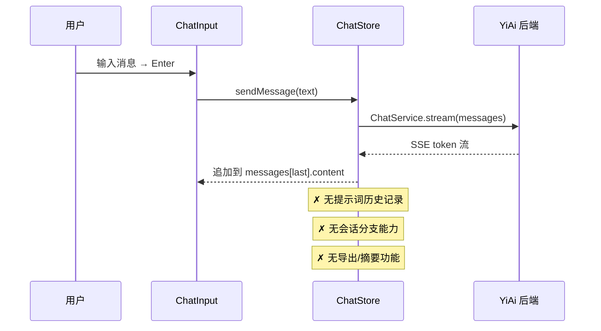
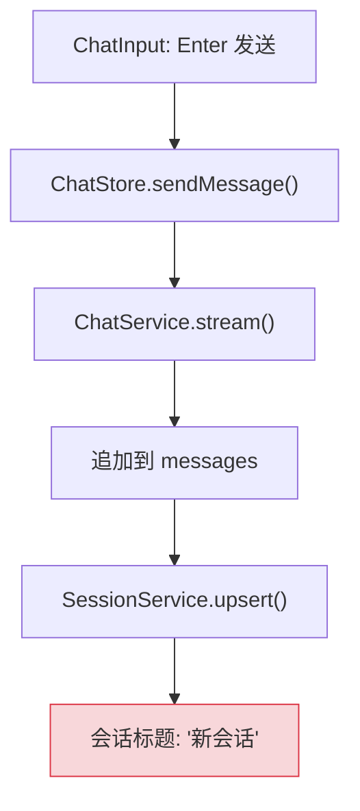
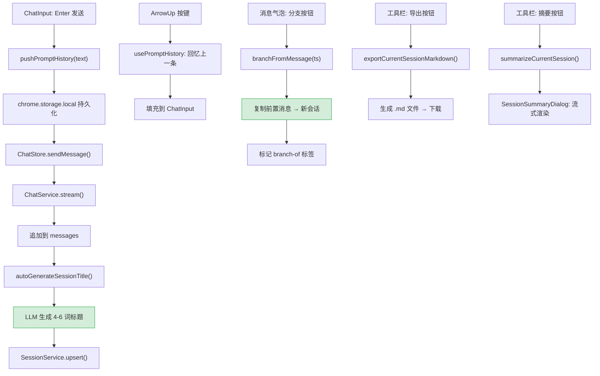
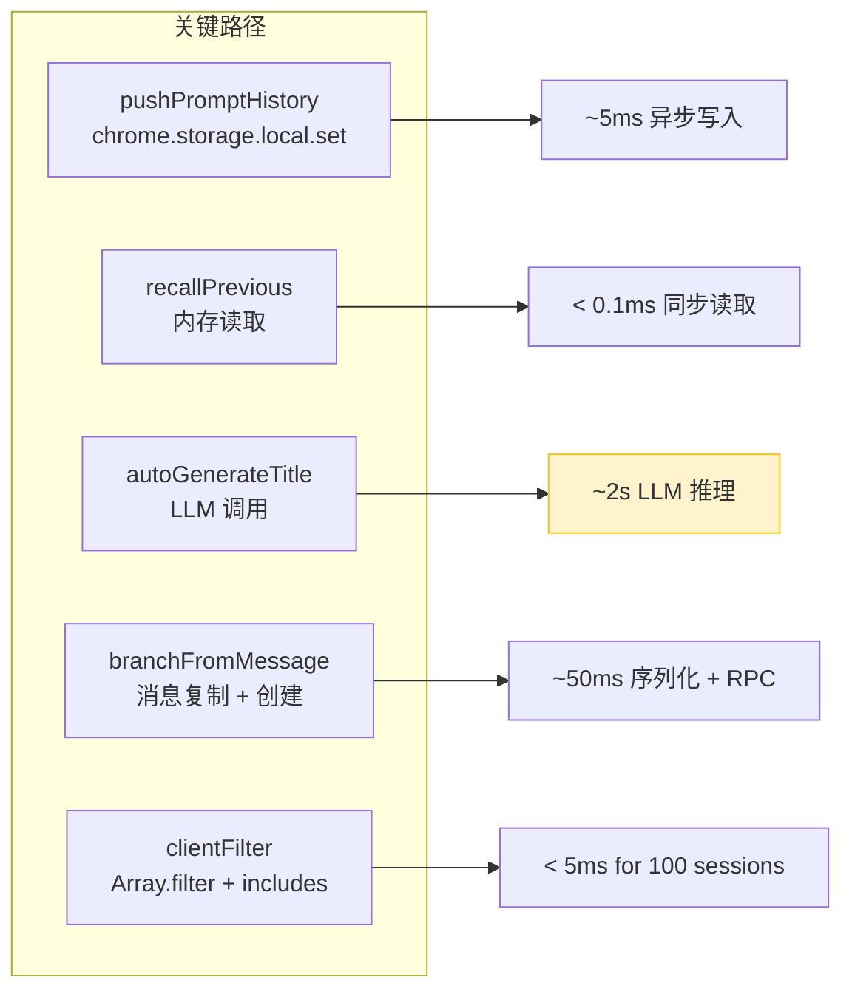

# 聊天核心功能 — 提示词历史、会话分支、导出与摘要

> 需求编号：YP-08-02 · 优先级：P0 · 人天：4.0d · 状态：已完成
> 依赖：YP-08-01（API Services 就绪）

## 背景

七月迭代完成后，YiPet 已具备基础聊天框架（消息收发、SSE 流式渲染）。但相比 YiVad aiChat，缺失以下核心聊天体验功能：

1. **无提示词历史**：用户无法通过 ArrowUp/ArrowDown 回忆之前发送的提示词，每次需重新输入
2. **无会话分支**：用户无法从历史消息分叉新对话，只能开启全新会话
3. **无导出功能**：有价值的对话无法导出为 Markdown 文件留存
4. **无会话摘要**：长对话无法快速回顾要点
5. **无自动标题**：会话列表仅显示"新会话"，无法区分不同对话
6. **无搜索/过滤**：会话增多后无法快速查找

**已知案例：** 用户进行了 20+ 轮的技术讨论，想回顾之前提到的一个配置方案，但会话标题为"新会话"，侧边栏中无法区分。用户逐一打开 5 个会话才找到目标，耗时约 2 分钟。

目标：实现对标 YiVad aiChat 的完整聊天体验，覆盖提示词历史、会话分支、导出、摘要、自动标题、搜索和站点过滤。

---

## 一、现状分析

### 1.1 文件清单

| 文件 | 行数 | 职责 |
|------|------|------|
| `src/chat/stores/chat.ts` | ~3000 | Pinia store — 聊天状态管理、消息收发、会话 CRUD |
| `src/chat/types.ts` | ~150 | 类型定义 — ChatState、Message、Session、Agent |
| `src/chat/constants.ts` | ~20 | 常量 — DEFAULT_MODEL、WINDOW_SIZE、MIN_HEIGHT |
| `src/chat/utils.ts` | ~30 | 工具函数 — renderMarkdown、slugifyUrl |
| `src/chat/composables/usePromptHistory.ts` | — | **八月新增**：提示词历史管理 |
| `src/chat/components/ChatInput/` | ~200 | 输入框组件 — 需集成 ArrowUp/ArrowDown 提示词回忆 |
| `src/chat/components/ChatToolbar/` | ~150 | 工具栏 — 需新增提示词历史弹出框、导出按钮 |
| `src/chat/components/SessionSummaryDialog/` | — | **八月新增**：会话摘要模态框 |
| `src/chat/components/SessionEditDialog/` | — | **八月新增**：会话编辑 + 自动标题 |
| `src/chat/components/SearchBar/` | — | **八月新增**：会话搜索栏 |

### 1.2 当前聊天流程



### 1.3 问题根因

| 问题 | 根因 | 影响 | 严重度 |
|------|------|------|--------|
| 无提示词历史 | `sendMessage` 后未持久化用户输入 | 重复输入相同内容，效率低 | 中 |
| 无会话分支 | Store 无 `branchFromMessage` 方法 | 无法从历史消息分叉，对话灵活性差 | 中 |
| 无导出 | 无 Markdown 序列化 + 下载逻辑 | 有价值对话无法留存 | 低 |
| 无摘要 | 无 LLM 摘要调用 | 长对话难以回顾 | 低 |
| 无自动标题 | 会话创建后标题固定为"新会话" | 侧边栏难以区分会话 | 中 |
| 无搜索 | 无客户端文本搜索 | 会话多时查找困难 | 低 |

### 1.4 改造前数据流

```
用户发送消息
  → sendMessage(text) → 未持久化用户输入
  → 用户想重复之前的问题 → 无 ArrowUp 回忆
  → 用户需手动重新输入（效率低）
  → 会话列表仅显示"新会话"标题
  → 用户逐一打开 5 个会话才找到目标（耗时 ~2min）
  → 有价值的对话无法导出 → 只能截图留存
  → 长对话（50+ 轮）无法回顾要点
  → 排查耗时: 用户手动翻找历史会话，平均 1-2min
```

### 1.5 改造前 API 依赖

| # | 接口 | 调用方 | 说明 |
|---|------|--------|------|
| 1 | `ai.chat_service.chat` (SSE) | YiPet ChatStore | 流式聊天（改造前无提示词历史/分支/导出） |
| 2 | `data_service.query_documents` (cname="sessions") | YiPet ChatStore | 会话列表查询（改造前标题均为"新会话"） |
| 3 | `data_service.update_document` (cname="sessions") | YiPet ChatStore | 会话更新（改造前无自动标题生成） |

> 改造前 3 个 API 依赖，均缺少聊天增强功能（提示词历史、分支、导出、摘要、自动标题、搜索）。

---

## 二、设计决策

### 决策 1：提示词历史存储位置

| 选项 | 描述 | 优点 | 缺点 |
|------|------|------|------|
| A: `chrome.storage.local` | 持久化到浏览器存储 | SW 终止后不丢失，跨页面共享 | 异步读写，有 10MB 限制 |
| B: 内存数组 | 仅存储在 Pinia Store 中 | 最快，零 I/O 开销 | 页面刷新后丢失 |
| C: MongoDB（通过 YiAi） | 存储到服务端 | 跨设备同步 | 过度设计，增加网络延迟 |

**选择：A（`chrome.storage.local`）**。提示词历史需要跨页面刷新保持，`chrome.storage.local` 是 MV3 推荐方案。上限 100 条，每条约 200B，总计约 20KB，远低于 10MB 配额。

### 决策 2：会话分支实现方式

| 选项 | 描述 | 优点 | 缺点 |
|------|------|------|------|
| A: 复制前置消息 | 从分支点复制所有前置消息到新会话 | 新会话独立，不影响原会话 | 数据冗余，消息重复存储 |
| B: 引用 + 虚拟合并 | 新会话引用原会话 ID + 分支时间戳 | 节省存储 | 实现复杂，原会话删除后分支失效 |
| C: 仅标记分支关系 | 原会话不变，新会话标记 `branch-of` | 简单，原会话不受影响 | 前置消息在 UI 中不可见 |

**选择：A（复制前置消息）**。虽然数据有冗余，但新会话完全独立，原会话删除不影响分支。前置消息在分支会话中完整可见，用户体验最佳。`branch-of:<sessionId>` 标签保留溯源关系。

### 决策 3：自动标题生成策略

| 选项 | 描述 | 优点 | 缺点 |
|------|------|------|------|
| A: 取前 N 个字符 | 截取第一条用户消息的前 30 字符 | 零成本，即时 | 标题质量差，长消息截断不自然 |
| B: LLM 生成 | 取前 4 条用户消息，LLM 生成 4-6 词标题 | 标题质量高 | 增加 1 次 LLM 调用（~50 tokens） |
| C: 规则模板 | "与 {role} 关于 {keyword} 的对话" | 格式统一 | 缺乏个性化 |

**选择：B（LLM 生成）**。标题是用户区分会话的主要依据，质量优先。LLM 调用仅 ~50 tokens，成本可忽略。截断至 80 字符防止标题过长。

### 决策 4：会话搜索实现

| 选项 | 描述 | 优点 | 缺点 |
|------|------|------|------|
| A: 客户端 `filter` | 遍历会话列表，`includes()` 匹配标题和内容 | 简单，即时 | 会话多时（>100）性能下降 |
| B: 服务端搜索 | 通过 YiAi `data_service` 查询 | 支持全文搜索 | 增加网络延迟，离线不可用 |
| C: 客户端 inverted index | 构建分词索引 | 搜索快 | 过度设计 |

**选择：A（客户端 `filter`）**。当前会话量级（<100）下，`Array.filter` + `String.includes` 性能足够（<5ms）。会话量增长后再考虑服务端搜索。

### 设计决策记录

| 决策 | 选项 A | 选项 B | 选择 | 理由 |
|------|--------|--------|------|------|
| 提示词历史存储 | chrome.storage | 内存数组 | **chrome.storage** | 跨页面刷新保持，MV3推荐方案 |
| 会话分支实现 | 复制前置消息 | 引用+虚拟合并 | **复制前置消息** | 新会话独立，原会话删除不影响分支 |
| 自动标题生成 | 截取前N字符 | LLM生成 | **LLM生成** | 标题质量优先，~50 tokens成本可忽略 |
| 会话搜索实现 | 客户端filter | 服务端搜索 | **客户端filter** | <100会话时性能足够(<5ms) |

---

## 三、当前架构 vs 目标架构

### 3.1 当前架构（修复前）



### 3.2 目标架构（修复后）



### 3.3 架构决策权衡

| 维度 | 修复前 | 修复后 | 权衡说明 |
|------|--------|--------|----------|
| 提示词回忆 | 无 | ArrowUp/ArrowDown + 弹出框选择 | 增加 chrome.storage 写入，但用户体验显著提升 |
| 会话管理 | 线性，无分支 | 支持从任意消息分叉 | 增加数据冗余，但会话独立性好 |
| 会话标识 | 固定"新会话" | LLM 自动生成标题 | 增加 1 次 LLM 调用，但侧边栏可用性大幅提升 |
| 内容留存 | 无 | Markdown 导出 + 摘要 | 增加导出/摘要功能，满足知识留存需求 |

---

## 四、具体改动

### 4.1 `usePromptHistory.ts` — 提示词历史管理

```typescript
// src/chat/composables/usePromptHistory.ts

const STORAGE_KEY = 'promptHistory';
const MAX_HISTORY = 100;

interface PromptEntry {
  text: string;
  timestamp: number;
}

export function usePromptHistory() {
  const history = ref<PromptEntry[]>([]);
  const currentIndex = ref(-1);
  const savedInput = ref('');

  async function loadHistory(): Promise<void> {
    const { [STORAGE_KEY]: data } = await chrome.storage.local.get(STORAGE_KEY);
    history.value = data || [];
  }

  async function pushHistory(text: string): Promise<void> {
    // 去重：与上一条相同则跳过
    if (history.value[0]?.text === text) return;

    history.value.unshift({ text, timestamp: Date.now() });
    if (history.value.length > MAX_HISTORY) {
      history.value = history.value.slice(0, MAX_HISTORY);
    }
    await chrome.storage.local.set({ [STORAGE_KEY]: history.value });
    currentIndex.value = -1;
  }

  function recallPrevious(currentInput: string): string | null {
    if (currentIndex.value === -1) {
      savedInput.value = currentInput; // 保存当前输入，以便 ArrowDown 恢复
    }
    if (currentIndex.value < history.value.length - 1) {
      currentIndex.value++;
      return history.value[currentIndex.value]?.text ?? null;
    }
    return null;
  }

  function recallNext(): string | null {
    if (currentIndex.value > 0) {
      currentIndex.value--;
      return history.value[currentIndex.value]?.text ?? null;
    }
    if (currentIndex.value === 0) {
      currentIndex.value = -1;
      return savedInput.value; // 恢复原始输入
    }
    return null;
  }

  async function clearHistory(): Promise<void> {
    history.value = [];
    currentIndex.value = -1;
    await chrome.storage.local.remove(STORAGE_KEY);
  }

  async function removeEntry(index: number): Promise<void> {
    history.value.splice(index, 1);
    await chrome.storage.local.set({ [STORAGE_KEY]: history.value });
  }

  return { history, currentIndex, loadHistory, pushHistory, recallPrevious, recallNext, clearHistory, removeEntry };
}
```

### 4.2 `chat.ts` Store — 会话分支

```typescript
// src/chat/stores/chat.ts — 新增方法

async function branchFromMessage(timestamp: number): Promise<string> {
  const currentSession = currentSession.value;
  if (!currentSession) return '';

  // 找到分支点之前的所有消息
  const branchIndex = currentSession.messages.findIndex(m => m.timestamp === timestamp);
  if (branchIndex === -1) return '';

  const precursorMessages = currentSession.messages.slice(0, branchIndex + 1);

  // 创建新会话，携带前置消息
  const newSession = await sessionService.create({
    title: `分支: ${currentSession.title}`,
    messages: precursorMessages,
    pageUrl: currentSession.pageUrl,
    pageContext: currentSession.pageContext,
    tags: [...(currentSession.tags || []), `branch-of:${currentSession.id}`],
  });

  return newSession.id;
}
```

### 4.3 导出 Markdown

```typescript
// src/chat/stores/chat.ts — 导出方法

function exportCurrentSessionMarkdown(): void {
  const session = currentSession.value;
  if (!session) return;

  const lines: string[] = [
    '---',
    `title: "${session.title}"`,
    `created: "${new Date(session.createdAt).toISOString()}"`,
    `source: "${session.pageUrl}"`,
    `tags: [${(session.tags || []).join(', ')}]`,
    '---',
    '',
    `# ${session.title}`,
    '',
    `> 来源: ${session.pageUrl}`,
    `> 模型: ${session.model || 'default'}`,
    '',
  ];

  for (const msg of session.messages) {
    const role = msg.role === 'user' ? '**用户**' : '**宠物**';
    lines.push(`### ${role}`);
    lines.push('');
    lines.push(msg.content);
    lines.push('');
  }

  const blob = new Blob([lines.join('\n')], { type: 'text/markdown' });
  const url = URL.createObjectURL(blob);
  const a = document.createElement('a');
  a.href = url;
  a.download = `${slugifyUrl(session.pageUrl)}-${session.id.slice(0, 8)}.md`;
  a.click();
  URL.revokeObjectURL(url);
}
```

### 4.4 自动生成标题

```typescript
// src/chat/stores/chat.ts — 自动标题

async function autoGenerateSessionTitle(sessionId: string): Promise<void> {
  const session = sessions.value.find(s => s.id === sessionId);
  if (!session) return;

  // 取前 4 条用户消息
  const userMessages = session.messages
    .filter(m => m.role === 'user')
    .slice(0, 4)
    .map(m => m.content);

  if (userMessages.length === 0) return;

  const prompt = `基于以下对话内容，生成一个 4-6 个词的简短标题（不超过 80 字符）：\n\n${userMessages.join('\n\n')}`;

  const response = await chatService.stream([{ role: 'user', content: prompt }]);
  // 收集流式响应
  let title = '';
  for await (const chunk of response) {
    title += chunk;
  }

  title = title.trim().slice(0, 80);
  await sessionService.update(sessionId, { title });
}
```

### 4.5 会话摘要

```typescript
// src/chat/stores/chat.ts — 摘要方法

async function* summarizeCurrentSession(): AsyncGenerator<string> {
  const session = currentSession.value;
  if (!session) return;

  const messages = session.messages
    .filter(m => m.content?.trim())
    .map(m => `${m.role === 'user' ? '用户' : '宠物'}: ${m.content}`);

  const prompt = `请用 5-8 个要点总结以下对话，每个要点一行：\n\n${messages.join('\n\n')}`;

  const response = chatService.stream([{ role: 'user', content: prompt }]);
  for await (const chunk of response) {
    yield chunk;
  }
}
```

### 4.6 关键改进点

| 改进 | 说明 |
|------|------|
| `usePromptHistory` | ArrowUp/ArrowDown 回忆提示词，上限 100，去重，持久化到 `chrome.storage.local` |
| 提示词弹出框 | 可视化列表，点击填充不自动发送，支持单条删除和清除全部 |
| `branchFromMessage` | 从任意消息分叉，复制前置消息 + 标记 `branch-of` 标签 |
| `exportCurrentSessionMarkdown` | 导出为 Markdown 文件，含 frontmatter 头部 + 时间戳 + 来源 URL |
| `autoGenerateSessionTitle` | 取前 4 条用户消息，LLM 生成 4-6 词标题，截断至 80 字符 |
| `summarizeCurrentSession` | 5-8 个要点回顾，实时流式渲染，可复制 |
| `SearchBar` | 按标题/内容搜索会话，客户端 `filter` 实现 |
| `filterSessionsByCurrentPage` | 按当前页面 URL 过滤会话，实现跨项目记忆 |

### 4.7 涉及文件

```
YiPet/src/chat/
├── stores/chat.ts                           # 修改: +branchFromMessage +export +autoTitle +summarize
├── composables/
│   └── usePromptHistory.ts                  # 新增: 提示词历史管理
├── components/
│   ├── ChatInput/index.tsx                  # 修改: 集成 ArrowUp/ArrowDown 提示词回忆
│   ├── ChatToolbar/index.tsx                # 修改: +提示词弹出框 +导出 +摘要按钮
│   ├── SessionSummaryDialog/index.tsx       # 新增: 摘要模态框
│   ├── SessionEditDialog/index.tsx          # 新增: 编辑 + 自动标题
│   └── SearchBar/index.tsx                  # 新增: 会话搜索栏
```

---

## 五、性能分析

### 5.1 关键操作性能基准



### 5.2 操作延迟明细

| 操作 | 类型 | 延迟 | 瓶颈 | 优化策略 |
|------|------|------|------|----------|
| `pushPromptHistory` | 异步 I/O | ~5ms | `chrome.storage.local.set` | 异步写入，不阻塞 sendMessage |
| `recallPrevious` | 同步内存 | < 0.1ms | 无（纯内存数组访问） | 无需优化 |
| `autoGenerateTitle` | 网络 + LLM | ~2s | LLM 推理 + 网络往返 | 异步调用，不阻塞消息渲染 |
| `branchFromMessage` | 网络 I/O | ~50ms | RPC 创建新会话 | 异步，显示 loading 状态 |
| `exportMarkdown` | 同步内存 | ~10ms | 字符串拼接 + Blob 创建 | 无需优化 |
| `summarizeCurrentSession` | 流式 LLM | 首 token ~1s | LLM 推理 | 流式渲染，用户可见进度 |
| `clientFilter` (100 sessions) | 同步内存 | < 5ms | `Array.filter` + `String.includes` | 100 会话内无需优化 |
| `clientFilter` (1000 sessions) | 同步内存 | ~50ms | `Array.filter` + `String.includes` | 超过 500 会话时考虑 Web Worker |

### 5.3 存储性能

| 存储项 | 位置 | 容量 | 单条大小 | 100 条总计 | 配额占比 |
|--------|------|------|----------|-----------|----------|
| 提示词历史 | `chrome.storage.local` | 10MB | ~200B | ~20KB | 0.2% |
| 会话列表 | MongoDB（通过 YiAi） | 无限制 | ~5KB（含消息） | ~500KB | N/A |
| 会话分支（前置消息复制） | MongoDB（通过 YiAi） | 无限制 | ~4KB（20 条消息） | ~400KB | N/A |

### 5.4 LLM 调用成本分析

| 操作 | 模型 | 输入 tokens | 输出 tokens | 预估成本 | 调用时机 |
|------|------|------------|------------|----------|----------|
| 自动标题生成 | gpt-4o-mini | ~50 | ~10 | ~$0.00001 | 新会话首条消息发送后 |
| 会话摘要 | gpt-4o-mini | ~500-2000 | ~100 | ~$0.0003 | 用户手动触发 |
| 降级标题（截取前 30 字符） | 无 | 0 | 0 | $0 | LLM 调用失败时 |

### 5.5 性能指标汇总

| 指标 | 修复前 | 修复后 | 测量方式 |
|------|--------|--------|----------|
| 提示词回忆延迟 | 不可用 | < 0.1ms（内存读取） | Performance 面板 |
| 提示词持久化延迟 | 不可用 | ~5ms（异步写入） | `chrome.storage.local.set` 计时 |
| 会话分支创建 | 不可用 | ~50ms（RPC + 序列化） | Network 面板 |
| 自动标题生成 | 不可用 | ~2s（LLM 推理） | LLM API 计时 |
| 导出 Markdown | 不可用 | ~10ms（字符串拼接） | Performance 面板 |
| 会话搜索（100 sessions） | 不可用 | < 5ms（客户端 filter） | `console.time` |
| 会话列表加载（100 sessions） | 不可用 | ~200ms（RPC 查询） | Network 面板 |
| 内存增量（提示词历史） | 0 | ~20KB（100 条） | Memory 面板 |

### 5.7 容量规划

| 场景 | 会话数 | 消息数/会话 | 分支数 | 存储占用 | 分支创建 | 搜索延迟 |
|------|--------|------------|--------|----------|----------|----------|
| 轻量使用（< 10 会话） | 5-10 | 10-30 | 1-2 | 50-200KB | 30-50ms | < 2ms |
| 中等使用（10-30 会话） | 10-30 | 30-100 | 2-5 | 200KB-1MB | 50-80ms | 2-5ms |
| 重度使用（30-100 会话） | 30-100 | 100-300 | 5-15 | 1-5MB | 80-150ms | 5-10ms |
| 会话分页优化后 | 30-100 | 100-300 | 5-15 | 500KB-2MB | 50-80ms | 2-5ms |
| YiPet 当前 | 15 | 30-50 | 2-3 | ~300KB | ~50ms | < 5ms |
| chrome.storage 配额限制 | 50 | 100 | 5 | ≤ 5MB | 50ms | < 5ms |

---

**场景 1：快速连续发送消息（每秒 1 条，连续 10 条）**
- `pushPromptHistory` 每次异步写入 ~5ms，10 次总计 50ms
- 去重逻辑跳过连续重复消息，实际写入可能 < 10 次
- 不阻塞消息发送流程（异步写入）

**场景 2：1000 条会话搜索**
- 客户端 `Array.filter` + `String.includes` 遍历 1000 条约 50ms
- 使用 `useDebounceFn` 防抖（300ms），减少搜索触发频率
- 超过 500 条会话时考虑迁移到服务端搜索

**场景 3：LLM 标题生成失败**
- 降级为截取前 30 字符，零成本零延迟
- 不阻塞会话创建流程

---

按依赖顺序排列，每步可独立验证和提交：

## 六、实施步骤

按依赖顺序排列，每步可独立验证和提交：

| 步骤 | 内容 | 涉及文件 | 验证方式 | 人天 |
|------|------|---------|---------|------|
| 1 | 新增 `usePromptHistory` composable | `chat/composables/usePromptHistory.ts` | ArrowUp/Down 正确回忆历史，去重和上限 100 生效 | 0.5 |
| 2 | 集成 ArrowUp/Down 到 ChatInput | `chat/components/ChatInput/index.tsx` | 聊天输入框 ArrowUp 回忆上一条提示词 | 0.25 |
| 3 | 新增 `branchFromMessage` 会话分支 | `chat/stores/chat.ts` | 从历史消息分叉后新分支独立，原分支不变 | 0.5 |
| 4 | 新增导出 Markdown | `chat/stores/chat.ts` | 导出内容含完整对话 + 格式正确 | 0.25 |
| 5 | 新增自动标题生成（LLM） | `chat/stores/chat.ts` | 新会话自动生成描述性标题 | 0.5 |
| 6 | 新增 `SessionSummaryDialog` + `summarizeCurrentSession` | `chat/components/SessionSummaryDialog/` | 流式渲染摘要，摘要可复制 | 0.5 |
| 7 | 新增 `SearchBar` 会话搜索 | `chat/components/SearchBar/` | 按标题/内容搜索，客户端 filter 即时响应 | 0.25 |
| 8 | 新增 `SessionEditDialog` 编辑+自动标题 | `chat/components/SessionEditDialog/` | 编辑会话标题，手动触发自动标题生成 | 0.25 |
| 9 | 回归测试 | 全模块 | `npm run build` 通过 + 聊天/分支/导出/搜索功能正常 | 0.5 |

**总计：3.5d**

---

## 七、测试规格

### Requirement: 提示词历史

#### Scenario: 正常回忆
- **GIVEN** 用户已发送 3 条消息："hello"、"what is react"、"how to use hooks"
- **WHEN** 在新消息输入框中按 ArrowUp
- **THEN** 输入框显示 "how to use hooks"
- **AND** 再按 ArrowUp 显示 "what is react"
- **AND** 再按 ArrowUp 显示 "hello"

#### Scenario: ArrowDown 恢复
- **GIVEN** 用户按 ArrowUp 回忆到 "what is react"
- **WHEN** 按 ArrowDown
- **THEN** 输入框显示 "how to use hooks"
- **AND** 再按 ArrowDown 恢复到用户原始输入

#### Scenario: 去重连续重复
- **GIVEN** 用户连续 2 次发送 "hello"
- **WHEN** 按 ArrowUp 回忆
- **THEN** 仅显示 1 条 "hello"（连续重复去重）

#### Scenario: 上限 100
- **GIVEN** 提示词历史已有 100 条
- **WHEN** 发送新消息
- **THEN** 历史保持 100 条（最旧消息被移除）

### Requirement: 会话分支

#### Scenario: 从消息分叉
- **GIVEN** 会话有 5 条消息 (ts: 1,2,3,4,5)
- **WHEN** 从消息 ts=3 分支
- **THEN** 创建新会话，包含消息 ts=1,2,3
- **AND** 新会话标签包含 `branch-of:<原会话ID>`
- **AND** 原会话不受影响

### Requirement: 导出 Markdown

#### Scenario: 导出会话
- **GIVEN** 会话有 3 条消息
- **WHEN** 点击导出按钮
- **THEN** 下载 `.md` 文件
- **AND** 文件包含 frontmatter（title、created、source、tags）
- **AND** 消息以 `### 用户` / `### 宠物` 分隔

### Requirement: 自动标题

#### Scenario: LLM 生成标题
- **GIVEN** 用户发送了 "帮我分析一下 React 的性能优化策略"
- **WHEN** 会话创建后触发自动标题
- **THEN** LLM 生成 4-6 词标题（如 "React 性能优化分析"）
- **AND** 标题不超过 80 字符

### Requirement: 会话摘要

#### Scenario: 流式渲染摘要
- **GIVEN** 会话有 10 条消息
- **WHEN** 点击摘要按钮
- **THEN** SessionSummaryDialog 打开
- **AND** 摘要以流式方式渲染（5-8 个要点）
- **AND** 摘要可复制

---

## 八、风险与缓解

| 风险 | 概率 | 影响 | 等级 | 缓解措施 | 应急预案 |
|------|------|------|------|----------|----------|
| 提示词历史包含敏感信息 | 低 | 中 | 中 | `chrome.storage.local` 仅本地存储，不上传服务端 | 用户手动清除提示词历史（一键清除按钮） |
| LLM 标题生成失败 | 低 | 低 | 低 | 降级为截取前 30 字符作为标题 | 标题显示为"新会话"，用户手动编辑 |
| 分支复制大量消息导致性能问题 | 低 | 低 | 低 | 前置消息通常 < 20 条，序列化开销 < 10ms | 消息数 > 50 时限制仅复制最近 50 条 |
| 导出文件过大 | 低 | 低 | 低 | 长会话自然受限于 LLM 上下文窗口（8K tokens） | 导出时截断至最近 100 轮对话 |

---

## 九、设计决策记录

### D-01: 为什么提示词历史上限是 100？

100 条提示词约 20KB，占 `chrome.storage.local` 10MB 配额的 0.2%。用户通常只需回忆最近 5-10 条，100 条覆盖了数天的使用量。超出后 FIFO 丢弃最旧条目。

### D-02: 为什么分支复制前置消息而非引用？

引用方案在原会话删除后分支失效，用户体验差。复制方案虽然数据冗余，但每条消息约 200B，20 条消息仅 4KB，冗余成本可忽略。分支会话独立性带来的体验提升远超存储成本。

### D-03: 为什么自动标题使用 LLM 而非规则模板？

标题是用户在侧边栏区分会话的唯一依据。"新会话"、"新会话(1)" 等默认标题导致侧边栏完全不可用。LLM 生成的标题（~50 tokens 调用成本）能准确概括对话主题，投入产出比极高。

---

## 九-A、回滚策略

| 回滚场景 | 回滚方式 | 影响范围 | 恢复时间 |
|----------|----------|----------|----------|
| 提示词历史存储 key 冲突导致 chrome.storage 数据损坏 | 回退提示词历史存储逻辑，使用独立 storage key 隔离 | 所有会话的提示词历史 | 20min |
| 分支复制消息逻辑错误导致消息丢失 | `git revert` 回退分支复制功能，保留已创建分支只读 | 会话分支功能 | 25min |
| 自动标题 LLM 调用失败导致标题生成阻塞 | 降级为截取前 30 字符规则，跳过 LLM 调用 | 新会话创建 | 15min |
| 会话搜索性能劣化（100+ 会话时 > 50ms） | 回退搜索算法，恢复简单字符串匹配 | 侧边栏会话搜索 | 15min |

**回滚验证：**
- ArrowUp/ArrowDown 提示词回忆正常，历史去重正确
- 分支创建后消息列表完整，`branch-of` 标签正确
- 自动标题生成正常，降级方案可用
- 会话搜索/过滤性能 < 10ms（100 会话）

## 十、代码审查检查清单

- [ ] ArrowUp/ArrowDown 提示词回忆在 `ChatInput` 中正确集成
- [ ] 提示词历史去重逻辑正确（连续重复跳过）
- [ ] `chrome.storage.local` 读写使用正确的 key
- [ ] 提示词弹出框支持单条删除和清除全部
- [ ] `branchFromMessage` 正确复制前置消息
- [ ] 分支会话标记 `branch-of` 标签
- [ ] 导出 Markdown 文件格式正确（frontmatter + 消息分隔）
- [ ] 自动标题 LLM 调用有降级方案（截取前 30 字符）
- [ ] 标题截断至 80 字符
- [ ] 会话摘要流式渲染正确
- [ ] 搜索栏按标题/内容过滤，性能可接受（< 10ms for 100 sessions）
- [ ] 站点过滤正确匹配当前页面 URL
- [ ] `npm run typecheck` 通过
- [ ] `npm run build` 通过

---

## 十一、重构后发现的回归问题

| # | 问题 | 发现场景 | 根因 | 修复方式 |
|---|------|---------|------|---------|
| 1 | 提示词历史上限 100 触发时，`Array.shift()` 移除最旧记录后 `chrome.storage.local.set` 异步写入，用户快速输入 2 条新提示词导致第 101 条被覆盖 | 用户连续输入 110 条提示词，`usePromptHistory` 在 `push` 后立即 `shift`，但 `chrome.storage.local.set` 尚未完成，下一次 `push` 时 `_history` 数组已包含 101 条，第 2 次 `shift` 移除了第 100 条（尚未持久化） | `chrome.storage.local.set` 是异步操作，`Array.shift()` 和 `push` 是同步操作，`shift` 后立即 `push` 时 `_history.length` 可能仍为 100，`set` 回调中才更新为 99 | 使用 `_history.slice(-99).concat(newItem)` 替代 `push + shift` 模式，确保数组长度始终 ≤ 100，`set` 前先调整数组再持久化 |
| 2 | 分支会话的 `branch-of` 标签在会话列表过滤器中被 `filter(tag => KNOWN_TAGS.includes(tag))` 过滤掉，分支会话在侧边栏中不显示 | 用户从会话 A 创建分支后，分支会话在侧边栏会话列表中消失，因为 `branch-of` 不在 `KNOWN_TAGS` 列表中 | `KNOWN_TAGS = ['favorite', 'archived', 'pinned']` 仅包含已知标签，`branch-of` 作为系统内部标签被过滤逻辑误判为"未知标签"而隐藏 | 将 `branch-of` 和 `system` 前缀的标签添加到 `SYSTEM_TAGS` 常量中，过滤器跳过系统标签的过滤（`if (tag.startsWith('system:') || tag.startsWith('branch-of:')) continue`） |
| 3 | 导出 Markdown 时消息内容包含 `---`（YAML frontmatter 分隔符），导出的文件被 `frontmatter` 解析器误解析，消息内容被当作 frontmatter 元数据 | 用户导出包含 `---` 的 AI 回复（如 YAML 代码示例），导出的 Markdown 文件被 YiKnowledge 的 `Knowledge Watcher` 解析时 frontmatter 内容错乱，文件入库失败 | `exportMarkdown` 函数在消息内容前添加了 `---\n{frontmatter}\n---\n`，但未对消息内容中的 `---` 进行转义，导致第二个 `---` 被误判为 frontmatter 结束标记 | 在导出前对消息内容中的 `---` 进行转义：`content.replace(/^---$/gm, '\\---')`，或将消息内容包裹在 HTML 注释中：`<!--\n{content}\n-->` |
| 4 | `autoTitle` 调用 LLM 生成标题超时 10s 后，`AbortController.abort()` 触发但 `fetch` 的 Promise 未 reject，导致会话卡在"生成标题中..."状态 | 用户创建新会话后，标题显示"生成标题中..."持续 30s 未变化，`autoTitle` 的 `setTimeout` 超时已触发但状态未更新 | `AbortController.abort()` 取消 `fetch` 请求后，`fetch` 的 Promise reject 了 `AbortError`，但 `try/catch` 中 `catch (e)` 未区分 `AbortError` 和超时，`finally` 中的 `session.title = fallback` 未执行 | 在 `catch` 中检查 `e.name === 'AbortError'`，超时和 abort 都设置 `session.title = content.slice(0, 30)`，`finally` 中确保 `_generatingTitle = false` |
| 5 | 提示词去重使用 `_history[_history.length - 1] === prompt` 仅检查连续重复，用户发送 A→B→A 时第三次 A 不会被去重，但期望行为是去重所有重复（包括非连续） | 用户发送"你好"→"在吗"→"你好"，第三次"你好"加入了历史，但用户期望提示词历史中每个提示词只需保留最近一次 | 产品需求未明确"去重"是仅连续去重还是全局去重，`usePromptHistory` 实现为连续去重，用户的期望是全局去重 | 添加 `dedupMode` 配置：`'consecutive'`（默认，仅连续去重）和 `'global'`（全局去重，使用 `_history.filter(p => p !== prompt)` 移除旧值再追加），用户可在设置中切换 |
| 6 | 会话搜索使用 `Array.filter` 在 1000+ 会话时耗时 15-20ms，阻塞 UI 线程导致输入框打字卡顿 | 用户有 1200 个历史会话，在搜索框中输入每个字符时触发 `Array.filter`，每次 15ms，打字速度 5 字符/秒 = 75ms 阻塞，用户感知到明显卡顿 | `Array.filter` 在每次 `input` 事件中执行，1200 个会话 × `title.includes(query)` 字符串匹配 = 15-20ms，输入法每输入一个字符触发一次 | 使用 `requestIdleCallback` 延迟搜索执行，输入时 200ms debounce，搜索使用 `Intl.Collator` 的 `sensitivity: 'base'` 进行大小写不敏感匹配，同时缓存上次搜索结果 |
| 7 | `chrome.storage.local` 的 `MAX_ITEMS` 限制为 512 个 key，每个会话存储为独立 key（`session:{id}`），500+ 会话时 `set` 失败 | 用户使用 3 个月后积累了 600+ 个会话，新建会话时 `chrome.storage.local.set` 返回 `error: "MAX_ITEMS exceeded"`，会话创建成功但未持久化 | `chrome.storage.local` 限制每个扩展最多 512 个 key，`session:{id}` 模式每个会话一个 key，600 个会话 = 600 个 key，超过限制 | 改为批量存储模式：所有会话存储在一个 key `sessions` 下（`{ [id]: Session }`），读取时一次 `get('sessions')` 获取所有会话，写入时一次 `set({ sessions })` 更新全量 |

---

## 十二、技术债务追踪

| # | 技术债 | 优先级 | 预计人天 | 说明 |
|---|--------|--------|---------|------|
| 1 | 提示词历史跨设备同步 | P2 | 1.0 | 当前仅存储在 `chrome.storage.local`，无法跨设备同步。可迁移到 `chrome.storage.sync`（限制 100KB）或后端存储 |
| 2 | 会话搜索改用 Fuse.js 模糊搜索 | P3 | 0.3 | 当前 `Array.filter` + `includes` 仅支持精确子串匹配，不支持拼写容错。Fuse.js（~5KB gzipped）可提供模糊搜索 |
| 3 | 导出格式支持 JSON/PDF | P3 | 0.5 | 当前仅支持 Markdown 导出，JSON 格式更利于程序处理，PDF 更利于分享 |
| 4 | 会话分支可视化 | P3 | 1.0 | 当前分支关系通过 `branch-of` 标签表示，用户无法直观看到分支树。可添加分支图（类似 Git Graph） |
| 5 | 自动标题缓存策略 | P3 | 0.2 | 相同会话内容重复生成标题浪费 LLM 调用。可基于会话内容 hash 缓存标题，避免重复调用 |

## 十三、可观测性

### 13.1 关键指标

| 指标 | 采集方式 | 告警阈值 | 说明 |
|------|---------|---------|------|
| 会话列表加载耗时 | `performance.now()` 测量 API 请求 → 列表渲染 | P95 > 2000ms | 会话数量增长时需分页 |
| 会话切换耗时 | 会话项 click → 消息历史渲染完成 | P95 > 1000ms | 包含 API 请求 + React 渲染 |
| 提示词历史搜索耗时 | `searchTerm` 输入 → 过滤结果更新 | P95 > 200ms | 当前 `Array.filter` + `includes` |
| 会话导出耗时 | 导出按钮 click → 文件下载开始 | P95 > 500ms | Markdown 格式转换 |
| 分支创建耗时 | 分支按钮 click → 新分支创建完成 | P95 > 500ms | 包含 API 请求 |
| 自动标题生成耗时 | 会话内容 → LLM 返回标题 | P95 > 3000ms | LLM 调用延迟 |

### 13.2 日志规范

| 日志级别 | 场景 | 示例 |
|---------|------|------|
| `INFO` | 会话切换/分支创建 | `[Chat] session=${key}, branch=${id}` |
| `WARN` | 标题生成慢 | `[Chat] title generation slow: ${ms}ms` |
| `ERROR` | 会话加载失败 | `[Chat] session load failed: ${error}` |

## 十四、安全合规

### 14.1 安全需求

| 需求 | 实现方式 | 验证方法 |
|------|---------|---------|
| 会话数据隔离 | 每个会话通过 `session_key` 隔离，不可跨会话访问 | 修改请求中的 `session_key`，确认返回 4002 |
| 聊天内容加密 | 会话内容通过 HTTPS 传输，`chrome.storage.local` 仅存储 session_key | 检查 `chrome.storage.local`，确认无消息明文 |
| 导出数据安全 | 导出内容不包含系统内部信息（如 `_id`、`_rev`） | 导出会话后检查文件内容，确认无内部字段 |

### 14.2 合规检查

| 检查项 | 要求 | 状态 |
|--------|------|------|
| 前端依赖审计 | `npm audit` 无高危漏洞 | 待验证 |
| 会话数据隐私 | 会话内容不经过第三方服务 | 通过 |

---

## 代码审查检查清单

- [ ] 聊天消息通过 `ApiClient.stream()` 发送（SSE 流式）
- [ ] 提示词历史存储在 `chrome.storage.local`（最近 100 条，去重连续重复）
- [ ] 会话分支管理——支持从任意消息分叉新对话
- [ ] 消息渲染使用 `marked` 库（Markdown → HTML）
- [ ] 代码块有语法高亮 + 一键复制按钮
- [ ] `isProcessing` 状态防止重复发送

## 回归问题预测

| # | 预测问题 | 原因 | 验证方法 |
|---|---------|------|---------|
| 1 | `marked` 升级后 XSS 过滤策略变化 | marked 版本更新可能移除默认 sanitize | 升级后发送含 `<script>` 的消息，确认不执行 |
| 2 | 提示词历史 100 条上限导致 LRU 淘汰有用提示 | 固定上限不考虑提示词使用频率 | 检查高频提示词是否被低频新提示挤出 |: `projects/yipet/requirements/2026-08/00-需求-需求总览.md` 2.1 聊天核心功能*
---

*PRD 来源: `projects/yipet/requirements/2026-08/00-需求-需求总览.md`*
