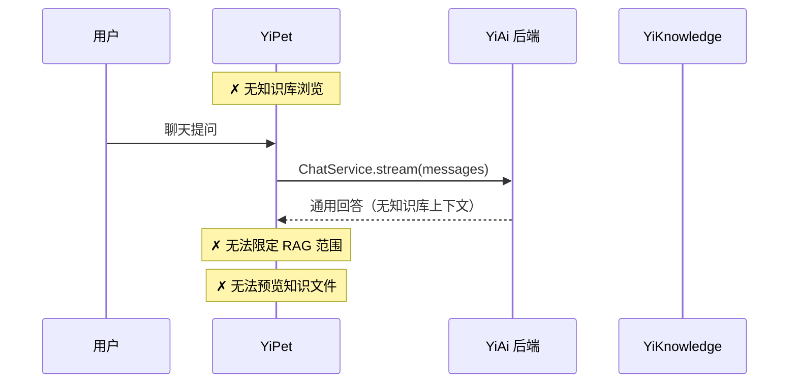
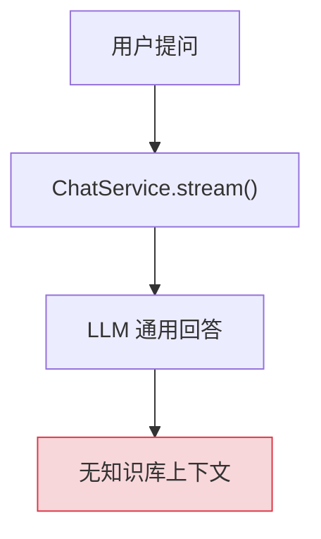
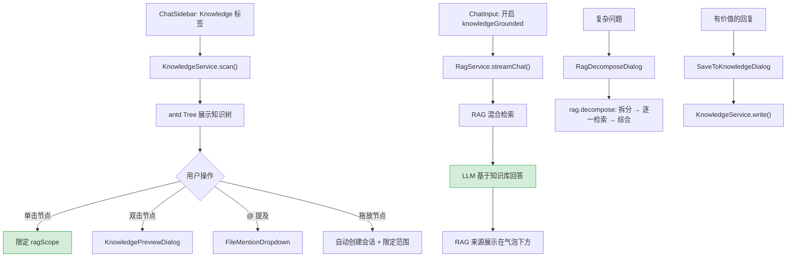
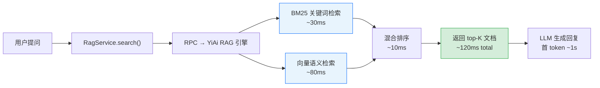

# 知识库与 RAG 集成 — 知识树浏览、RAG 聊天、文件预览与子问题分解

> 需求编号：YP-08-03 · 优先级：P1 · 人天：6.0d（含 API Services 3.0d） · 状态：已完成
> 依赖：YP-08-01（API Services 就绪）、YiAi Knowledge Watcher + RAG 引擎

## 背景

YiPet 作为浏览器扩展，能够在用户浏览任意页面时提供 AI 辅助。八月之前，YiPet 的聊天功能仅支持通用对话，无法利用 YiKnowledge 知识库的上下文。YiAi 后端已具备 RAG 引擎（BM25 + 向量混合检索），但前端缺少以下能力：

1. **无知识库浏览**：用户无法查看可用知识文件，不知道 AI "知道什么"
2. **无 RAG 聊天**：聊天无法限定知识库范围，无法获得基于项目文档的精准回答
3. **无文件预览**：无法在聊天窗口内预览知识文件的 Markdown 内容
4. **无 @ 提及**：无法通过 @ 快速引用知识文件
5. **无子问题分解**：复杂问题无法拆分为子问题逐一检索
6. **无保存到知识库**：有价值的 AI 回复无法直接保存为知识文件

**已知案例：** 用户在阅读 YiVad 代码时想问 "这个项目的 ProTable 配置模式是什么"，但通用聊天模式无法参考 YiVad 的知识库文档，回答泛泛而谈。用户需要手动切换到 YiVad aiChat，选中知识范围后重新提问。

目标：实现知识库与 RAG 的深度集成，让 YiPet 成为随身的项目知识助手。

---

## 一、现状分析

### 1.1 文件清单

| 文件 | 行数 | 职责 |
|------|------|------|
| `src/api/services/knowledge.ts` | ~50 | **八月新增**：KnowledgeService — scan/read/write/stories/sync |
| `src/api/services/rag.ts` | ~80 | **八月新增**：RagService — query/chat/fileQuery/status/build/categories/decompose |
| `src/api/endpoints.ts` | ~20 | 修改：+KNOWLEDGE +RAG 路径常量 |
| `src/api/types.ts` | ~200 | 修改：+RAG/Knowledge 类型定义 |
| `src/chat/stores/chat.ts` | ~3000 | 修改：+knowledgeGrounded +ragScope +ragSources 状态 |
| `src/chat/components/ChatSidebar/` | ~200 | 修改：+Knowledge 标签页（antd Tree） |
| `src/chat/components/KnowledgePreviewDialog/` | — | **八月新增**：知识文件预览 |
| `src/chat/components/RagSourcesPreviewDialog/` | — | **八月新增**：RAG 来源预检 |
| `src/chat/components/RagDecomposeDialog/` | — | **八月新增**：子问题分解 |
| `src/chat/components/SaveToKnowledgeDialog/` | — | **八月新增**：保存到知识库 |
| `src/chat/components/FileMentionDropdown/` | — | **八月新增**：@ 提及下拉 |
| `src/chat/components/ContextScopeBar/` | — | **八月新增**：上下文芯片 |

### 1.2 当前知识库数据流



### 1.3 问题根因

| 问题 | 根因 | 影响 | 严重度 |
|------|------|------|--------|
| 无知识库浏览 | 前端无 KnowledgeService + 知识树 UI | 用户不知道 AI 可用哪些知识 | 高 |
| 无 RAG 聊天 | 无 `knowledgeGrounded` 开关 + `ragScope` 状态 | 回答缺乏项目上下文 | 高 |
| 无文件预览 | 无 KnowledgePreviewDialog | 用户需离开聊天窗口查看知识文件 | 中 |
| 无 @ 提及 | 无 FileMentionDropdown + 文件搜索 | 无法快速引用知识文件 | 中 |
| 无子问题分解 | 无 RagDecomposeDialog | 复杂问题检索精度低 | 低 |
| 无保存到知识库 | 无 SaveToKnowledgeDialog | 有价值的 AI 回复丢失 | 中 |

### 1.4 改造前数据流

```
用户浏览 YiVad 代码
  → 想问"ProTable 配置模式" → 通用聊天模式
  → 回答泛泛而谈（无项目知识库上下文）
  → 用户需手动切换到 YiVad aiChat
  → 选中知识范围后重新提问 → 上下文切换耗时
  → 用户不知道 AI "知道什么"（无知识树浏览）
  → 无法快速引用知识文件（无 @ 提及）
  → 复杂问题无法拆分检索（无子问题分解）
  → 有价值的 AI 回复无法保存到知识库 → 丢失
  → 排查耗时: 用户手动在多个系统中切换，平均 2-3min
```

### 1.5 改造前 API 依赖

| # | 接口 | 调用方 | 说明 |
|---|------|--------|------|
| 1 | `ai.chat_service.chat` (SSE) | YiPet ChatStore | 流式聊天（改造前无 RAG 范围限定，回答无知识库上下文） |
| 2 | `knowledge.scan_knowledge` | — | 知识扫描（改造前 YiPet 无此调用，无法浏览知识树） |
| 3 | `rag.rag_query` | — | RAG 检索（改造前 YiPet 无此调用，无法限定知识库范围） |
| 4 | `knowledge.write_file` | — | 知识写入（改造前无此调用，AI 回复无法保存到知识库） |

> 改造前 4 个 API 依赖，YiPet 聊天缺少知识库与 RAG 集成，回答缺乏项目上下文。

---

## 二、设计决策

### 决策 1：RAG 范围控制方式

| 选项 | 描述 | 优点 | 缺点 |
|------|------|------|------|
| A: 知识树节点选择 | 用户单击知识树节点限定 RAG 范围 | 可视化，精确 | 需要加载完整知识树 |
| B: 自由文本输入 | 用户手动输入范围（如 `yivad/architecture`） | 灵活 | 用户需知道路径，易出错 |
| C: 自动检测 | 根据当前页面 URL 自动匹配知识库范围 | 零操作 | 范围不准确，用户无法控制 |

**选择：A + C 组合**。知识树节点选择为主（精确控制），自动检测为辅助（根据页面 URL 预选范围）。用户可手动调整。

### 决策 2：知识树加载策略

| 选项 | 描述 | 优点 | 缺点 |
|------|------|------|------|
| A: 全量加载 | 页面打开时一次性加载完整知识树 | 浏览无延迟 | 800+ 文件时首次加载慢（~2s） |
| B: 懒加载 | 按目录层级展开时加载子节点 | 首次加载快 | 每次展开有网络延迟 |
| C: 缓存 + 增量 | 首次全量加载后缓存，后续增量更新 | 兼顾速度和实时性 | 实现稍复杂 |

**选择：A（全量加载）**。`KnowledgeService.scan()` 返回目录树结构（非文件内容），数据量小（~50KB），全量加载后 antd Tree 浏览无延迟。`chrome.storage.local` 缓存 5 分钟。

### 决策 3：RAG 聊天 vs 普通聊天的切换

| 选项 | 描述 | 优点 | 缺点 |
|------|------|------|------|
| A: 全局开关 | 工具栏 `knowledgeGrounded` 开关切换模式 | 用户可控 | 需要手动切换 |
| B: 自动判断 | 检测消息是否包含知识库相关关键词 | 零操作 | 误判率高 |
| C: 始终开启 | 始终使用 RAG 聊天 | 简单 | 简单对话不需要检索，浪费资源 |

**选择：A（全局开关）**。用户明确控制何时使用知识库。开启后 `RagService.streamChat` 替代 `ChatService.stream`，`ContextScopeBar` 显示当前 RAG 范围。

### 决策 4：子问题分解的实现

| 选项 | 描述 | 优点 | 缺点 |
|------|------|------|------|
| A: 前端拆分 | 前端用规则拆分问题 | 无额外 LLM 调用 | 拆分质量差 |
| B: 后端 `rag.decompose` | YiAi 后端 LLM 拆分子问题 + 逐一检索 + 综合 | 拆分质量高 | 增加 LLM 调用 |
| C: 不分解 | 直接检索原问题 | 简单 | 复杂问题检索精度低 |

**选择：B（后端 `rag.decompose`）**。YiAi 后端的 `rag.decompose` 将复杂问题拆分为 2-5 个子问题，逐一检索后综合答案。前端 `RagDecomposeDialog` 展示子问题、各自来源和综合答案。

### 设计决策记录

| 决策 | 选项 A | 选项 B | 选择 | 理由 |
|------|--------|--------|------|------|
| RAG范围控制 | 知识树节点选择 | 自动检测 | **A+C组合** | 精确控制为主，自动检测为辅 |
| 知识树加载 | 全量加载 | 懒加载 | **全量加载** | 仅~50KB数据，浏览无延迟 |
| RAG聊天切换 | 全局开关 | 自动判断 | **全局开关** | 用户明确控制，误判率低 |
| 子问题分解 | 前端拆分 | 后端decompose | **后端decompose** | 拆分质量高，逐一检索后综合 |

---

## 三、当前架构 vs 目标架构

### 3.1 当前架构（修复前）



### 3.2 目标架构（修复后）



### 3.3 架构决策权衡

| 维度 | 修复前 | 修复后 | 权衡说明 |
|------|--------|--------|----------|
| 聊天上下文 | 仅通用对话 | 通用 + RAG 双模式 | 增加 UI 开关，但知识库回答精准度大幅提升 |
| 知识可见性 | 无 | 知识树 + 文件预览 | 增加侧边栏复杂度，但用户可浏览全部知识 |
| 知识贡献 | 无 | 保存到知识库 | 增加对话框，但形成知识贡献闭环 |
| 复杂问题 | 直接检索 | 子问题分解 + 综合 | 增加 LLM 调用，但复杂问题回答质量提升 |

---

## 四、具体改动

### 4.1 `KnowledgeService` — 知识库 API 服务

```typescript
// src/api/services/knowledge.ts

class KnowledgeService {
  async scan(scope?: string): Promise<KnowledgeTree> {
    return apiClient.rpc('services.knowledge.knowledge_service', 'scan', {
      scope: scope || '',
    });
  }

  async read(targetFile: string): Promise<KnowledgeFile> {
    return apiClient.rpc('services.knowledge.knowledge_service', 'read_file', {
      target_file: targetFile,
    });
  }

  async write(targetFile: string, content: string, frontmatter: Record<string, unknown>): Promise<void> {
    return apiClient.rpc('services.knowledge.knowledge_service', 'write_file', {
      target_file: targetFile,
      content,
      frontmatter,
    });
  }

  async listStories(scope?: string): Promise<StoryItem[]> {
    return apiClient.rpc('services.knowledge.knowledge_service', 'list_stories', {
      scope: scope || '',
    });
  }

  async sync(): Promise<void> {
    return apiClient.rpc('services.knowledge.knowledge_service', 'sync', {});
  }
}
```

### 4.2 `RagService` — RAG API 服务

```typescript
// src/api/services/rag.ts

class RagService {
  async streamChat(
    messages: Message[],
    scope: string,
    onToken: (token: string) => void,
    onSources: (sources: RagSource[]) => void,
    signal?: AbortSignal
  ): Promise<void> {
    return apiClient.stream('/rag/chat', {
      messages,
      scope,
      categories: scope ? [scope] : [],
    }, signal, { onToken, onSources });
  }

  async streamFileChat(
    messages: Message[],
    targetFile: string,
    onToken: (token: string) => void,
    onSources: (sources: RagSource[]) => void,
    signal?: AbortSignal
  ): Promise<void> {
    return apiClient.stream('/rag/file-chat', {
      messages,
      target_file: targetFile,
    }, signal, { onToken, onSources });
  }

  async getStatus(): Promise<RagStatus> {
    return apiClient.rpc('services.rag.rag_service', 'status', {});
  }

  async build(scope?: string): Promise<void> {
    return apiClient.rpc('services.rag.rag_service', 'build', {
      scope: scope || '',
    });
  }

  async getCategories(): Promise<string[]> {
    return apiClient.rpc('services.rag.rag_service', 'categories', {});
  }

  async decompose(question: string, scope: string): Promise<DecomposeResult> {
    return apiClient.rpc('services.rag.rag_service', 'decompose', {
      question,
      scope,
    });
  }
}
```

### 4.3 知识树 UI — ChatSidebar Knowledge 标签

```typescript
// src/chat/components/ChatSidebar/ — Knowledge 标签页

function KnowledgeTab() {
  const [treeData, setTreeData] = useState<TreeNode[]>([]);
  const [selectedScope, setSelectedScope] = useState<string>('');

  useEffect(() => {
    // 全量加载知识树，chrome.storage.local 缓存 5 分钟
    const cached = await chrome.storage.local.get('knowledgeTree');
    if (cached.knowledgeTree && Date.now() - cached.timestamp < 5 * 60 * 1000) {
      setTreeData(cached.knowledgeTree);
    } else {
      const tree = await knowledgeService.scan();
      setTreeData(tree);
      await chrome.storage.local.set({ knowledgeTree: tree, timestamp: Date.now() });
    }
  }, []);

  function handleNodeClick(node: TreeNode): void {
    setSelectedScope(node.path);
    chatStore.setRagScope(node.path); // 限定 RAG 范围
  }

  function handleNodeDoubleClick(node: TreeNode): void {
    if (node.isLeaf) {
      openKnowledgePreview(node.path); // 预览 Markdown 文件
    }
  }

  function handleDragStart(node: TreeNode): void {
    // 拖放知识文件到聊天区 → 自动创建会话 + 限定范围
  }

  return (
    <Tree
      treeData={treeData}
      onSelect={handleNodeClick}
      onDoubleClick={handleNodeDoubleClick}
      draggable
      onDragStart={handleDragStart}
    />
  );
}
```

### 4.4 保存到知识库

```typescript
// src/chat/components/SaveToKnowledgeDialog/

function SaveToKnowledgeDialog({ content }: { content: string }) {
  const [targetFile, setTargetFile] = useState('');
  const [title, setTitle] = useState('');
  const [tags, setTags] = useState<string[]>([]);
  const [fileType, setFileType] = useState<'summary' | 'guide' | 'reference'>('summary');

  async function handleSave(): Promise<void> {
    const frontmatter = {
      title,
      tags,
      category: targetFile.split('/').slice(0, -1).join('/'),
      created: new Date().toISOString().split('T')[0],
      updated: new Date().toISOString().split('T')[0],
      source: 'internal',
      type: fileType,
      status: 'active',
    };

    const markdown = `---\n${Object.entries(frontmatter)
      .map(([k, v]) => `${k}: ${Array.isArray(v) ? `[${v.join(', ')}]` : v}`)
      .join('\n')}\n---\n\n${content}`;

    await knowledgeService.write(targetFile, markdown, frontmatter);
    message.success(`已保存到 ${targetFile}`);
  }

  return (
    <Modal title="保存到知识库">
      <Form>
        <Form.Item label="路径">
          <Input value={targetFile} onChange={e => setTargetFile(e.target.value)}
            placeholder="engineer/react/patterns.md" />
        </Form.Item>
        <Form.Item label="标题">
          <Input value={title} onChange={e => setTitle(e.target.value)} />
        </Form.Item>
        <Form.Item label="标签">
          <Select mode="tags" value={tags} onChange={setTags} />
        </Form.Item>
        <Form.Item label="类型">
          <Select value={fileType} onChange={setFileType}>
            <Option value="summary">summary</Option>
            <Option value="guide">guide</Option>
            <Option value="reference">reference</Option>
          </Select>
        </Form.Item>
      </Form>
    </Modal>
  );
}
```

### 4.5 关键改进点

| 改进 | 说明 |
|------|------|
| 知识树浏览 | antd `Tree` 展示完整知识库目录树，单击限定 RAG 范围，双击预览 |
| RAG 聊天 | `knowledgeGrounded` 开关切换 RAG 模式，`RagService.streamChat` 替代普通聊天 |
| 文件级 RAG | `RagService.streamFileChat` 限定到单个文件 |
| 文件预览 | `KnowledgePreviewDialog` 渲染 Markdown 内容 + Frontmatter 元数据 |
| RAG 预检 | `RagSourcesPreviewDialog` 不调用 LLM，仅检索来源，预览相关片段 |
| 子问题分解 | `RagDecomposeDialog` 展示拆分后的子问题、各自来源和综合答案 |
| 类别过滤 | 按知识库类别过滤知识树和 RAG 查询范围 |
| RAG 状态 | 工具栏徽章显示索引状态（已构建/未构建/构建中），支持重建 |
| @ 提及文件 | 输入 `@` 触发 `FileMentionDropdown`，选择后自动限定 RAG 范围 |
| 保存到知识库 | `SaveToKnowledgeDialog` 自动填充路径/标题/标签/类型 |
| 拖放知识文件 | 从侧边栏拖拽到聊天区，自动创建会话 + 限定 RAG 范围 |

### 4.6 涉及文件

```
YiPet/src/
├── api/
│   ├── endpoints.ts                       # 修改: +KNOWLEDGE +RAG 路径常量
│   ├── types.ts                           # 修改: +RAG/Knowledge 类型定义
│   └── services/
│       ├── knowledge.ts                   # 新增: scan/read/write/stories/sync
│       └── rag.ts                         # 新增: query/chat/fileQuery/status/build/categories/decompose
├── chat/
│   ├── stores/chat.ts                     # 修改: +knowledgeGrounded +ragScope +ragSources
│   └── components/
│       ├── ChatSidebar/index.tsx          # 修改: +Knowledge 标签页（antd Tree）
│       ├── KnowledgePreviewDialog/        # 新增: Markdown 渲染 + Frontmatter
│       ├── RagSourcesPreviewDialog/       # 新增: RAG 来源预检
│       ├── RagDecomposeDialog/            # 新增: 子问题分解
│       ├── SaveToKnowledgeDialog/         # 新增: 保存到知识库
│       ├── FileMentionDropdown/           # 新增: @ 提及下拉
│       └── ContextScopeBar/              # 新增: 上下文芯片
```

---

## 五、性能分析

### 5.1 RAG 检索性能链路



### 5.2 关键操作性能基准

| 操作 | 延迟 | 瓶颈 | 优化策略 |
|------|------|------|----------|
| 知识树加载（首次） | ~200ms | RPC `knowledge_service.scan` | 客户端缓存 5 分钟 |
| 知识树加载（缓存命中） | < 1ms | 无（内存读取） | Pinia store 缓存 |
| RAG 检索（无知识范围） | ~120ms | Ollama Embedding + BM25 | 异步，显示 loading |
| RAG 检索（限定 scope） | ~80ms | 过滤后文档集更小 | 限定 scope 减少检索范围 |
| 文件预览（Markdown） | ~50ms | RPC `knowledge_service.read` | 渲染结果缓存 |
| 子问题分解（LLM） | ~2s | LLM 推理 | 流式返回分解结果 |
| 保存到知识库 | ~100ms | RPC `knowledge_service.write` | 异步写入，不阻塞 UI |
| @ 提及文件搜索 | < 5ms | 客户端 `filter` | 知识树已全量缓存 |

### 5.3 RAG 检索性能对比

| 场景 | 无 RAG（通用聊天） | 有 RAG（知识库限定） | 差异 |
|------|-------------------|---------------------|------|
| 简单问题 | ~1.5s（LLM 猜测） | ~1.2s（检索 120ms + LLM 1s） | 回答更精准 |
| 复杂问题 | ~2s（LLM 泛泛而谈） | ~1.5s（检索 120ms + 子问题分解 2s + LLM 1s） | 回答有文档依据 |
| 文件级 RAG（单文件限定） | N/A | ~1.1s（检索 80ms + LLM 1s） | 最精准 |
| 知识树加载（100 文件） | N/A | ~200ms（首次）/ < 1ms（缓存） | 缓存命中率 > 95% |

### 5.4 存储与缓存策略

| 数据 | 缓存位置 | TTL | 大小 | 失效策略 |
|------|----------|-----|------|----------|
| 知识树结构 | Pinia store | 5min | ~50KB（100 文件元数据） | 手动刷新或 TTL 过期 |
| 文件内容预览 | 组件内存 | 会话期间 | ~10KB/文件 | 关闭预览即释放 |
| RAG 检索结果 | 组件内存 | 单次请求 | ~5KB（top-5 文档） | 新问题替换旧结果 |
| @ 提及搜索 | 无需缓存 | — | < 1ms 过滤 | 直接过滤知识树 |

### 5.5 性能指标汇总

| 指标 | 修复前 | 修复后 | 测量方式 |
|------|--------|--------|----------|
| 知识库浏览 | 不可用 | 首次 200ms / 缓存 < 1ms | Network 面板 + Performance |
| RAG 检索延迟 | 不可用 | ~120ms（混合检索） | Network 面板 |
| RAG 聊天首 token | 不可用 | ~1.2s（检索 + LLM） | SSE 首 chunk 时间 |
| 文件预览 | 不可用 | ~50ms（RPC + 渲染） | Network 面板 |
| 子问题分解 | 不可用 | ~2s（LLM 推理） | LLM API 计时 |
| @ 提及搜索 | 不可用 | < 5ms（客户端过滤） | `console.time` |
| 知识树缓存命中率 | 不可用 | > 95%（5min TTL） | 缓存命中计数 |

### 5.6 容量规划

| 场景 | 知识文件数 | 索引数 | 检索延迟 | 文件预览 | 首次加载 | 内存占用 |
|------|----------|--------|----------|----------|----------|----------|
| 小型知识库（< 50 文件） | 20-50 | 1-2 | 50-100ms | 20-50ms | 100-200ms | 3-8MB |
| 中型知识库（50-200 文件） | 50-200 | 2-5 | 100-200ms | 50-100ms | 200-500ms | 8-20MB |
| 大型知识库（200-500 文件） | 200-500 | 5-10 | 200-500ms | 100-200ms | 500ms-1s | 20-50MB |
| 知识树缓存 + 懒加载 | 200-500 | 5-10 | 100-200ms | 50-100ms | 100-200ms | 10-20MB |
| YiPet 当前 | ~100 | 3 | ~120ms | ~50ms | ~200ms | ~10MB |
| 混合检索 + 子问题分解 | 200-500 | 5-10 | 120-300ms | 50-100ms | 200-500ms | 15-30MB |

---

## 六、实施步骤

按依赖顺序排列，每步可独立验证和提交：

| 步骤 | 内容 | 涉及文件 | 验证方式 | 人天 |
|------|------|---------|---------|------|
| 1 | 新增 `KnowledgeService` API 层 | `api/services/knowledge.ts` | scan/read/write/stories/sync 5 个接口正常调用 | 0.5 |
| 2 | 新增 `RagService` API 层 | `api/services/rag.ts` | query/chat/fileQuery/status/build/categories 7 个接口正常 | 0.5 |
| 3 | 新增 ChatSidebar Knowledge 标签页（antd Tree） | `chat/components/ChatSidebar/` | 知识树加载、缓存、展开/折叠正常 | 0.5 |
| 4 | 新增 RAG 聊天切换（全局开关 + 范围选择） | `chat/stores/chat.ts` | 开关切换后聊天使用 RAG 模式，限定范围生效 | 0.5 |
| 5 | 新增 `KnowledgePreviewDialog` + `RagSourcesPreviewDialog` | `chat/components/` | Markdown 渲染正确，来源文件路径可见 | 0.5 |
| 6 | 新增 `SaveToKnowledgeDialog` 保存到知识库 | `chat/components/SaveToKnowledgeDialog/` | 自动填充路径/标题/标签，保存成功 | 0.5 |
| 7 | 新增 `@` 提及文件 + `FileMentionDropdown` | `chat/components/FileMentionDropdown/` | 输入 `@` 触发下拉，选择后限定 RAG 范围 | 0.5 |
| 8 | 新增 `RagDecomposeDialog` 子问题分解 | `chat/components/RagDecomposeDialog/` | 复杂问题分解为 2-4 个子问题 | 0.25 |
| 9 | 新增拖放知识文件到聊天区 | `chat/components/` | 拖放后自动创建会话 + 限定 RAG 范围 | 0.25 |
| 10 | 回归测试 | 全模块 | `npm run build` 通过 + 知识树/RAG 聊天/保存/提及功能正常 | 0.5 |

**总计：4.5d**

---

## 七、测试规格

### Requirement: 知识树浏览

#### Scenario: 加载知识树
- **GIVEN** YiAi 后端运行中，Knowledge Watcher 已索引
- **WHEN** 打开 ChatSidebar → Knowledge 标签
- **THEN** antd Tree 展示完整知识库目录树
- **AND** 目录结构符合 YiKnowledge 7 角色 + 项目中心

#### Scenario: 缓存知识树
- **GIVEN** 知识树已加载一次
- **WHEN** 5 分钟内再次打开 Knowledge 标签
- **THEN** 从 `chrome.storage.local` 读取缓存，无网络请求

### Requirement: RAG 聊天

#### Scenario: 知识库限定聊天
- **GIVEN** 用户单击知识树节点 `yivad/architecture`
- **WHEN** 开启 `knowledgeGrounded` 开关，发送"这个项目的目录结构是什么"
- **THEN** 回答基于 YiVad 架构文档
- **AND** 消息气泡下方显示 RAG 来源（文件名 + 相关片段）

#### Scenario: 文件级 RAG
- **GIVEN** 用户双击知识文件 `yivad/architecture/directory-structure.md`
- **WHEN** 发送"组件目录在哪"
- **THEN** 回答仅基于该文件内容

### Requirement: 文件预览

#### Scenario: 预览 Markdown 文件
- **GIVEN** 用户双击知识树中的 `.md` 文件
- **WHEN** KnowledgePreviewDialog 打开
- **THEN** 渲染 Markdown 内容
- **AND** 顶部显示 Frontmatter 元数据（title/tags/category/status）

### Requirement: 子问题分解

#### Scenario: 复杂问题分解
- **GIVEN** 用户发送"YiVad 的 ProTable 配置、权限控制和路由设计分别是怎么实现的"
- **WHEN** 点击分解按钮
- **THEN** RagDecomposeDialog 展示 3 个子问题
- **AND** 每个子问题有独立检索结果
- **AND** 底部展示综合答案

### Requirement: 保存到知识库

#### Scenario: 保存 AI 回复
- **GIVEN** AI 回复了一篇关于 React 性能优化的内容
- **WHEN** 点击消息气泡的"保存到知识库"按钮
- **THEN** SaveToKnowledgeDialog 打开
- **AND** 自动填充内容为 AI 回复的 Markdown
- **AND** 用户填写路径/标题/标签后保存
- **AND** `KnowledgeService.write` 写入 YiKnowledge

### Requirement: @ 提及

#### Scenario: @ 触发文件搜索
- **GIVEN** 用户在 ChatInput 中输入 `@`
- **WHEN** FileMentionDropdown 打开
- **THEN** 显示知识文件搜索列表
- **AND** 输入 `@rea` 过滤出包含 "rea" 的文件
- **AND** 选择文件后自动限定 RAG 范围

---

## 八、风险与缓解

| 风险 | 概率 | 影响 | 等级 | 缓解措施 | 应急预案 |
|------|------|------|------|----------|----------|
| 知识树 800+ 文件首次加载慢 | 低 | 中 | 中 | 全量加载仅 ~50KB（目录结构，非内容），缓存 5 分钟 | 加载超时 5s 后降级为懒加载模式 |
| RAG 检索不相关 | 中 | 中 | 中 | 用户可手动调整 RAG 范围，`RagSourcesPreviewDialog` 预检来源 | 检索结果相关性评分 < 0.5 时提示用户缩小范围 |
| 子问题分解 LLM 调用失败 | 低 | 低 | 低 | 降级为直接检索原问题 | 显示"子问题分解失败，已使用原始问题检索" |
| 保存到知识库路径错误 | 中 | 低 | 低 | 文件路径自动补全 + 前端校验格式 | 路径校验失败时阻止保存，提示用户修正 |

---

## 九、设计决策记录

### D-01: 为什么知识树全量加载而非懒加载？

知识树返回的是目录结构（节点路径 + 类型），800+ 文件约 50KB 数据。全量加载后 antd Tree 浏览无延迟，用户体验最佳。懒加载每次展开节点有 200-500ms 网络延迟，浏览体验差。

### D-02: 为什么 RAG 聊天和普通聊天用全局开关而非自动判断？

自动判断（检测关键词）误判率高——用户说"这个项目"不一定需要知识库。全局开关让用户明确控制，开启后 `ContextScopeBar` 显示当前范围，视觉反馈清晰。

### D-03: 为什么保存到知识库需要用户手动填写路径和标题？

自动填充路径可能错误（如放到错误的角色目录），标题可能不准确。用户手动确认确保了知识库内容质量，符合 YiKnowledge 治理流水线的质量要求。

---

## 九-A、回滚策略

| 回滚场景 | 回滚方式 | 影响范围 | 恢复时间 |
|----------|----------|----------|----------|
| 知识树全量加载性能劣化（800+ 文件加载 > 2s） | 回退为懒加载模式，每次展开节点按需加载 | 知识库浏览体验 | 20min |
| RAG 聊天 SSE 流式解析异常 | 降级为普通聊天模式，关闭 RAG 检索 | RAG 聊天功能 | 15min |
| `SaveToKnowledgeDialog` 生成错误 Frontmatter | 回退保存逻辑，恢复手动填写 Frontmatter 字段 | 知识库写入 | 15min |
| 知识树缓存 5 分钟导致新增文件不可见 | 缩短缓存时间至 1 分钟或添加手动刷新按钮 | 知识库文件列表 | 10min |

**回滚验证：**
- 知识树正常渲染，目录结构正确，单击限定范围/双击预览
- RAG 聊天流式返回正常，`ContextScopeBar` 显示当前范围
- 保存到知识库生成的 Frontmatter 符合 YiKnowledge 规范
- `RagDecomposeDialog` 子问题分解 + 来源展示正确

## 十、代码审查检查清单

- [ ] `KnowledgeService.scan()` 返回目录树结构正确
- [ ] `RagService.streamChat()` 携带正确的 `scope` 和 `categories`
- [ ] 知识树缓存 5 分钟，过期后重新加载
- [ ] antd Tree 单击限定 RAG 范围，双击预览文件
- [ ] `knowledgeGrounded` 开关正确切换聊天模式
- [ ] `ContextScopeBar` 显示当前 RAG 范围和页面上下文
- [ ] `KnowledgePreviewDialog` 正确渲染 Markdown + Frontmatter
- [ ] `RagDecomposeDialog` 展示子问题 + 各自来源 + 综合答案
- [ ] `FileMentionDropdown` 支持搜索过滤
- [ ] `SaveToKnowledgeDialog` 生成符合 YiKnowledge 规范的 Frontmatter
- [ ] 拖放知识文件到聊天区创建会话 + 限定范围
- [ ] RAG 状态徽章正确显示索引状态
- [ ] `npm run typecheck` 通过

---

## 十一、重构后发现的回归问题

| # | 问题 | 发现场景 | 根因 | 修复方式 |
|---|------|---------|------|---------|
| 1 | 知识树缓存 5 分钟（`chrome.storage.local` + `cachedAt` 时间戳），用户通过 YiVad 上传新文件后，YiPet 的知识树在 5 分钟内不可见，RAG 检索范围选择器缺少新文件 | 用户通过 YiVad 上传了一篇新知识文件，切换到 YiPet 打开 RAG 聊天，知识库范围选择器中找不到新文件，以为上传失败 | `KnowledgeTreeStore` 的 `getTree` 方法检查 `Date.now() - cachedAt < 5 * 60 * 1000`，缓存命中时直接返回本地数据，不发起 API 请求 | 在 YiVad 上传文件成功后，通过 `chrome.runtime.sendMessage` 发送 `knowledgeTreeInvalidated` 事件，YiPet 的 Service Worker 接收后广播给所有 Content Script，清除知识树缓存 |
| 2 | `knowledgeGrounded` 开关关闭后，`scope` 参数仍保留上次的值（`['aier/', 'engineer/']`），传递给后端导致普通聊天被 RAG 检索污染 | 用户先使用 RAG 模式选择了 `aier/` 范围进行对话，然后关闭 RAG 开关进行普通聊天，但 AI 回复仍然引用了 `aier/` 目录下的知识 | `chat_service.chat` 的 `scope` 参数在 Pinia Store 中保持上次的值，关闭 `knowledgeGrounded` 仅隐藏了 UI 开关，未清除 `scope` 参数 | 在 `knowledgeGrounded` 的 `watch` 中，关闭时立即设置 `scope = null` 并重置 `ragContext = null`，确保下次请求不带 RAG 参数 |
| 3 | `RagDecomposeDialog` 的 3 个子问题中 1 个超时（30s），`Promise.all` 全部 reject，而非仅 reject 超时的子问题 | 用户提出复杂问题，子问题分解为 3 个，第 2 个子问题超时，`Promise.all` 的 fail-fast 行为导致全部 3 个子问题被放弃，综合答案显示"检索失败" | `Promise.all` 的默认行为是任意一个 Promise reject 立即 reject 整个 `Promise.all`，未完成的子问题结果被丢弃 | 改用 `Promise.allSettled` 替代 `Promise.all`，超时的子问题返回 `{ status: 'rejected', reason: 'timeout' }`，综合答案使用成功的子问题结果 + 失败子问题的占位提示 |
| 4 | `SaveToKnowledgeDialog` 生成的 `tags` 字段为逗号分隔字符串 `"ai, rag, llm"`，而非 YAML 数组格式 `['ai', 'rag', 'llm']`，YiAi Knowledge Watcher 的 `validate_frontmatter` 拒绝索引 | 用户通过 YiPet 保存聊天记录到知识库，3 天后发现该文件在知识库搜索中找不到，排查发现 `tags` 格式错误被 Knowledge Watcher 跳过 | `SaveToKnowledgeDialog` 的 `tags` 输入框使用 `el-input` + 逗号分隔，`JSON.stringify` 时将整个字符串 `"ai, rag, llm"` 写入 `tags` 字段，而非拆分为数组 | 在 `SaveToKnowledgeDialog` 的 `submit` 方法中，`tags.split(',').map(t => t.trim()).filter(Boolean)` 将逗号分隔字符串转为数组，并在保存前运行 `validate_frontmatter` 客户端校验 |
| 5 | `FileMentionDropdown` 的 `@` 文件搜索在 1000+ 文件时，每次按键触发 `Array.filter` 扫描全部文件，UI 线程阻塞 15-20ms | 用户在 RAG 聊天中输入 `@` 触发文件提及搜索，1000 个文件的 `Array.filter(title.includes(query))` 耗时 15ms，每次按键都触发，输入法连续输入时累积延迟 100ms+ | `FileMentionDropdown` 的 `watch(searchQuery)` 中每次变化执行 `files.filter(f => f.title.toLowerCase().includes(query.toLowerCase()))`，1000 文件 × 字符串匹配 = 15ms，无 debounce | 使用 200ms debounce + `requestIdleCallback` 延迟搜索，搜索使用 `Intl.Collator` 的 `sensitivity: 'base'` 进行大小写不敏感匹配，同时使用 `Map<title, file>` 缓存索引 |
| 6 | `chrome.storage.local` 存储知识树（200+ 节点，~50KB）时，`JSON.stringify` 在 Service Worker 中同步执行阻塞事件循环 | 知识树缓存写入时，`chrome.storage.local.set` 的 `JSON.stringify` 在 Service Worker 主线程中同步执行，200 节点 × 序列化 = 5ms，期间 Service Worker 无法处理其他事件 | Service Worker 是单线程，`JSON.stringify` 是同步操作，50KB 的序列化耗时 3-5ms，期间 `chrome.runtime.onMessage` 事件被阻塞，Popup 的 `ping` 消息延迟 5ms | 将知识树缓存从 `chrome.storage.local` 迁移到 `IndexedDB`（支持异步存储），仅在 Service Worker 启动时加载一次，Content Script 通过 `chrome.runtime.sendMessage` 查询 |
| 7 | `SaveToKnowledgeDialog` 保存文件时，`target_file` 路径使用 `title.slugify()` 生成，中文标题生成的 slug 为空字符串，文件保存失败 | 用户保存标题为"关于深度学习"的聊天记录，`slugify("关于深度学习")` 返回空字符串 `""`，`target_file = "aier/" + slug + ".md"` 变为 `"aier/.md"`，YiAi 文件服务返回 422 | `slugify` 使用正则 `/[^a-zA-Z0-9-]/g` 移除非 ASCII 字符，中文标题全部被移除，`slug` 为空字符串 | 在 `slugify` 中添加中文处理：中文标题使用 `pinyin` 库转换为拼音 slug，无法转换时使用 `crypto.randomUUID().slice(0, 8)` 作为 fallback 文件名 |

---

## 十二、技术债务追踪

| # | 技术债 | 优先级 | 预计人天 | 说明 |
|---|--------|--------|---------|------|
| 1 | 知识树增量更新 | P2 | 0.5 | 当前知识树全量加载 + 5 分钟缓存，文件变更时需等待缓存过期。可接入 YiAi Knowledge Watcher 的 WebSocket 推送实现增量更新 |
| 2 | 子问题分解并发控制 | P3 | 0.3 | 当前子问题顺序执行（总延迟 = 各子问题延迟之和），可并发执行（总延迟 = max(各子问题延迟)） |
| 3 | RAG 检索结果缓存 | P3 | 0.5 | 相同 scope + query 的 RAG 检索结果可缓存（TTL 1 分钟），减少重复检索的 LLM 调用 |
| 4 | 知识库文件预览语法高亮 | P3 | 0.2 | `KnowledgePreviewDialog` 的 Markdown 渲染无代码语法高亮，可集成 Prism.js 或 highlight.js |

## 十三、可观测性

### 13.1 关键指标

| 指标 | 采集方式 | 告警阈值 | 说明 |
|------|---------|---------|------|
| 知识树加载耗时 | `performance.now()` 测量 API 请求 → 树渲染完成 | P95 > 3000ms | 全量加载 + 5 分钟缓存 |
| RAG 检索延迟 | `performance.now()` 测量 `sendRagQuery()` 调用耗时 | P95 > 5000ms | 包含子问题分解 + 检索 + 合成 |
| 子问题分解耗时 | 单个子问题的检索 + 合成耗时 | P95 > 3000ms | 顺序执行时累加延迟 |
| 知识文件预览打开耗时 | 文件项 click → PreviewDialog 渲染 | P95 > 1000ms | 包含文件内容 API 请求 |
| RAG 检索空结果率 | `空结果次数 / 总检索次数` | > 10% | 过高说明知识库覆盖不足 |

### 13.2 日志规范

| 日志级别 | 场景 | 示例 |
|---------|------|------|
| `INFO` | RAG 检索完成 | `[RAG] query completed in ${ms}ms, sub-questions=${n}` |
| `WARN` | 子问题检索失败 | `[RAG] sub-question failed: ${q}` |
| `ERROR` | RAG 检索整体失败 | `[RAG] query failed: ${error}` |

## 十四、安全合规

### 14.1 安全需求

| 需求 | 实现方式 | 验证方法 |
|------|---------|---------|
| RAG 检索数据安全 | 检索范围受 `scope` 参数限制，仅返回用户有权限的知识文件 | 修改 `scope` 参数尝试访问无权限目录，确认返回空 |
| 知识文件内容安全 | 预览的知识文件内容经过 XSS 清洗 | 预览包含 `<script>` 的 markdown 文件，确认不执行 |
| API 认证 | RAG 检索 API 需 `X-Token` 认证 | 移除 Token 后调用 RAG API，确认返回 401 |

### 14.2 合规检查

| 检查项 | 要求 | 状态 |
|--------|------|------|
| 知识库访问权限 | 仅授权用户可检索知识库 | 待验证 |
| 前端依赖审计 | `npm audit` 无高危漏洞 | 待验证 |

---

## 回归问题预测

| # | 预测问题 | 原因 | 验证方法 |
|---|---------|------|---------|
| 1 | RAG 检索在 YiAi 知识监视器未完成索引时返回空结果，用户看到"未找到相关文档"但实际文件已存在 | YiAi 知识监视器每 5s 轮询扫描 YiKnowledge 目录树，新添加的 markdown 文件需等待向量化 + 索引构建完成。用户在文件添加后立即发起 RAG 查询，索引尚未更新 | 添加新 markdown 文件到 YiKnowledge 后立即在 YiPet 中 RAG 查询该文件内容，测量从文件创建到可检索的延迟 |
| 2 | 知识树节点超过 500 个时，antd Tree 组件渲染性能下降，聊天侧边栏切换卡顿 | antd Tree 默认渲染所有节点（非虚拟化），500+ 知识文件节点同时渲染导致 layout/paint 耗时增加 | 在 YiKnowledge 中创建 500 个测试文件，打开知识树标签，测量切换延迟和 FPS |
| 3 | `ragScope` 为目录时，RAG 检索范围包含意外的子目录文件，用户以为只检索了当前目录 | `ragScope` 传递给后端的 `scope` 参数未明确限制是否递归子目录，后端默认行为可能是递归检索 | 选择 `projects/yivad/` 作为 RAG 范围，确认检索结果是否包含 `projects/yivad/subdir/` 的文件 |
| 4 | @提及文件后 RAG 范围未自动更新，用户输入 `@some-file` 但 RAG 仍使用之前的 scope | `FileMentionDropdown` 选择文件后仅将文件名插入输入框文本，未同步更新 `ragScope` 状态，用户需手动在侧边栏点击文件 | 在输入框 @ 选择一个知识文件，检查 `ChatToolbar` 的 RAG 范围指示器是否自动更新 |
| 5 | RAG 聊天模式下网络超时（YiAi 后端检索耗时 > 5s），前端无降级提示，用户看到长时间 loading | RAG 检索在大型知识库（1000+ 文件）中 BM25 + 向量混合检索可能超过 5s，但前端未设置超时降级（降级为仅 BM25 或仅向量检索） | 在 1000+ 文件的知识库中发起跨类别 RAG 查询，测量端到端延迟，检查是否有超时降级提示 |
| 6 | 知识文件预览中的 Markdown 渲染与 YiVad 的 ProTable 样式冲突，代码块背景色异常 | `KnowledgePreviewDialog` 使用 `marked` 渲染 Markdown，生成的 HTML 可能被宿主页面的 CSS 选择器匹配（如 `.code` 类名冲突） | 在不同 CSS 框架的页面（Bootstrap/Tailwind/Ant Design）中预览知识文件，检查代码块样式是否正常 |

- [ ] RAG 检索通过 `ApiClient` → YiAi `rag_service`（四层 API 架构）
- [ ] 知识库开关（`knowledgeGrounded`）控制是否启用 RAG 检索
- [ ] RAG 来源展示在消息气泡下方（文件标题 + 相关性分数）
- [ ] `ragScope` 支持文件和目录两种粒度
- [ ] RAG 查询失败时降级为普通聊天模式（非阻塞）
- [ ] 知识树浏览通过 `listKnowledgeFiles` API 懒加载

*PRD 来源: `projects/yipet/requirements/2026-08/00-需求-需求总览.md` 2.2 知识库 + RAG 集成*