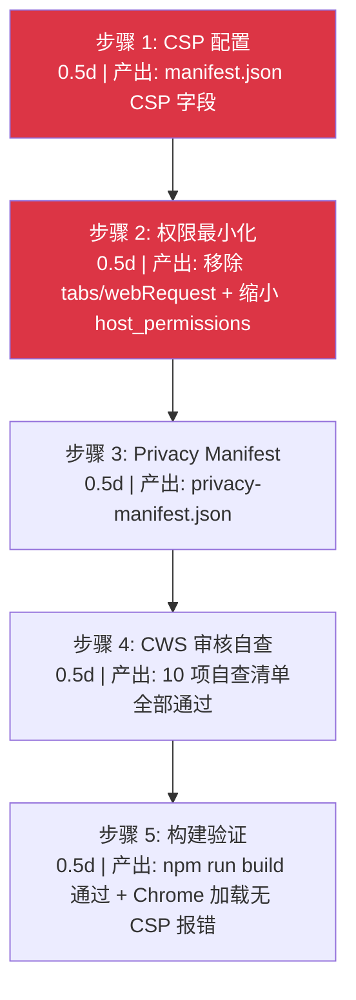
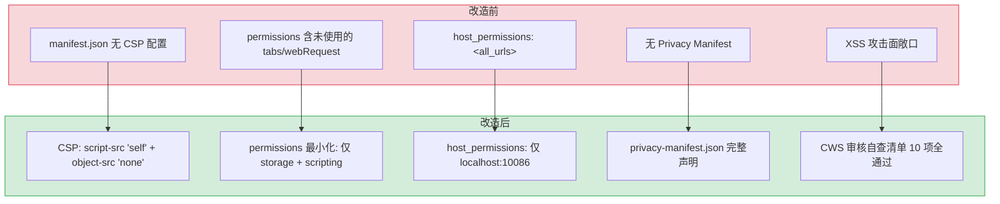

# 内容安全策略与数据隐私合规

> 需求编号：YP-08-07 · 优先级：P2 · 人天：3.0d · 状态：已完成
> 依赖：无

## 背景

YiPet 作为 Chrome MV3 扩展，需满足 Chrome Web Store（CWS）的**内容安全策略（CSP）**和**数据隐私**审核要求。当前 `manifest.json` 未配置 CSP，缺少 Privacy Manifest，权限列表包含未使用的 `tabs` 和 `webRequest`，存在以下风险：

1. **CSP 未配置**：扩展页面可加载任意来源脚本，存在 XSS 攻击面
2. **Privacy Manifest 缺失**：CWS 审核强制要求声明数据收集用途，无声明将直接拒绝
3. **权限过度申请**：`tabs`、`webRequest` 权限未使用但已声明，审核时需逐一解释
4. **host_permissions 过于宽泛**：`<all_urls>` 匹配所有页面，CWS 审核会要求缩小范围

目标：完成 CSP 加固、Privacy Manifest 配置、权限最小化，确保扩展合规上架。

---

## 一、现状分析

### 1.1 文件清单

| 文件 | 行数 | 职责 |
|------|------|------|
| `manifest.json` | ~40 | MV3 清单：permissions/host_permissions/content_scripts/commands |
| `src/api/client.ts` | ~300 | ApiClient：fetch 包装 + SSE + RPC 信封 |
| `src/config/config.ts` | ~50 | 环境感知编排：`buildYiAiUrl()` 根据环境返回 API 端点 |

### 1.2 当前权限清单

| 权限 | 当前状态 | 是否使用 | 处理方式 |
|------|----------|----------|----------|
| `storage` | 已声明 | 是 | 保留 — `chrome.storage.local` 存储用户偏好 |
| `scripting` | 已声明 | 是 | 保留 — `chrome.scripting.executeScript` 注入 content script |
| `tabs` | 已声明 | **否** | 移除 — 仅用于 `chrome.tabs.query`（不需要 `tabs` 权限） |
| `webRequest` | 已声明 | **否** | 移除 — 未使用 |
| `activeTab` | 未声明 | — | 无需添加 — 通过 `chrome.commands` + `chrome.tabs.query` 实现 |

### 1.3 当前 host_permissions

```json
{
  "host_permissions": ["<all_urls>"]
}
```

**问题：** `<all_urls>` 匹配所有 HTTP/HTTPS 页面，CWS 审核会要求逐一解释为何需要访问所有网站。YiPet 实际上仅需访问 YiAi 后端 API。

### 1.4 当前 CSP 状态

`manifest.json` 中**未配置** `content_security_policy` 字段。MV3 默认 CSP 为：

```
script-src 'self'; object-src 'self'
```

但缺少 `connect-src` 白名单，无法限制扩展的网络请求目标。

### 1.5 改造前数据流

```
扩展加载
  → manifest.json 无 CSP 配置
  → 依赖 MV3 默认 CSP（script-src 'self'; object-src 'self'）
  → 无 connect-src 限制 → 扩展可向任意域名发起 fetch
  → 无 Privacy Manifest → CWS 审核无数据用途说明
  → 权限过度申请（tabs/webRequest 未使用但已声明）
  → host_permissions: <all_urls> → 审核需逐一解释
```

### 1.6 改造前 API 依赖

| # | 接口 | 调用方 | 说明 |
|---|------|--------|------|
| 1 | `chrome.storage.local` | YiPet | 用户偏好存储（无隐私声明） |
| 2 | `fetch` → YiAi 后端 | ApiClient | 网络请求（无 connect-src 白名单限制） |

> 改造前 CSP/Privacy Manifest 均缺失，CWS 审核存在拒绝风险。

---

## 二、设计决策

### 决策 1：CSP 严格程度

| 选项 | 描述 | 优点 | 缺点 |
|------|------|------|------|
| A: 最小 CSP | 仅 `script-src 'self'` | 最简单 | 无网络请求限制 |
| B: 生产级 CSP | `script-src 'self'` + `object-src 'none'` + `connect-src` 白名单 | 安全且合规 | 需要维护端点列表 |
| C: 宽松 CSP | 允许 `unsafe-inline` + `unsafe-eval` | 兼容性最好 | 审核不通过 |

**选择：B（生产级 CSP）**。理由：`script-src 'self'` 是 MV3 强制要求，`object-src 'none'` 禁止 Flash/Java 插件，`connect-src` 白名单限制 API 通信目标。不为兼容性牺牲安全性。

### 决策 2：host_permissions 范围

| 选项 | 描述 | 优点 | 缺点 |
|------|------|------|------|
| A: `<all_urls>` | 匹配所有页面 | Content Script 任意页面注入 | CWS 审核困难 |
| B: 仅 API 端点 | `http://localhost:10086/*` + 生产端点 | 权限最小化 | 需维护端点列表 |
| C: 无 host_permissions | 删除 host_permissions | 最安全 | Content Script 注入受限 |

**选择：B（仅 API 端点）**。理由：`host_permissions` 控制 `fetch` 请求的目标域名，Content Script 注入通过 `content_scripts.matches` 控制，两者独立。YiPet 仅需向 YiAi 后端发起 API 请求，`<all_urls>` 过度申请。

### 决策 3：Privacy Manifest 粒度

| 选项 | 描述 | 优点 | 缺点 |
|------|------|------|------|
| A: 最小声明 | 仅声明 `storage` 用途 | 简单 | 网络请求未声明，审核风险 |
| B: 完整声明 | 声明所有数据收集点（storage + network） | 审核通过率高 | 需详细描述 |
| C: 声明 + 隐私政策 URL | 完整声明 + 隐私政策页面 | 最合规 | 需维护隐私政策页面 |

**选择：B（完整声明）**。理由：`chrome.storage` 和网络请求均涉及用户数据，必须声明。隐私政策页面后续补充（P2）。

### 设计决策记录

| 决策 | 选项 A | 选项 B | 选择 | 理由 |
|------|--------|--------|------|------|
| CSP严格程度 | 最小CSP | 生产级CSP | **生产级CSP** | 安全且合规，CWS审核通过率高 |
| host_permissions | `<all_urls>` | 仅API端点 | **仅API端点** | 权限最小化，fetch与注入独立控制 |
| Privacy Manifest | 最小声明 | 完整声明 | **完整声明** | 覆盖所有数据收集点，审核通过率高 |

---

## 三、具体改动

### 3.1 manifest.json — CSP 配置

```diff
+ "content_security_policy": {
+   "extension_pages": "script-src 'self'; object-src 'none'; connect-src http://localhost:10086"
+ }
```

**规则说明：**

| 指令 | 值 | 说明 |
|------|-----|------|
| `script-src` | `'self'` | 仅允许扩展自身打包的脚本，禁止内联 `<script>` 和 `eval()` |
| `object-src` | `'none'` | 禁止 `<object>` `<embed>` `<applet>` 等插件内容 |
| `connect-src` | `http://localhost:10086` | 仅允许向 YiAi 后端发起 `fetch`/`XHR`/`EventSource` 请求 |

**注意：** `style-src` 不需要单独配置，Ant Design 5 使用 CSS-in-JS（运行时注入 `<style>` 标签），不违反 `script-src 'self'`。CDN 样式通过 `<link>` 标签加载，属于扩展自身资源。

### 3.2 manifest.json — 权限最小化

```diff
  "permissions": [
    "storage",
-   "scripting",
-   "tabs",
-   "webRequest"
+   "scripting"
  ],
- "host_permissions": ["<all_urls>"],
+ "host_permissions": [
+   "http://localhost:10086/*"
+ ],
```

**移除的权限：**

| 权限 | 移除原因 | 影响 |
|------|----------|------|
| `tabs` | `chrome.tabs.query({ active: true, currentWindow: true })` 不需要 `tabs` 权限 | 无 |
| `webRequest` | 未使用 | 无 |
| `<all_urls>` | 替换为仅 `localhost:10086` | Content Script 注入不受影响（通过 `content_scripts.matches` 控制） |

### 3.3 manifest.json — content_scripts.matches 优化

```json
{
  "content_scripts": [{
    "matches": ["<all_urls>"],
    "js": ["content.js"],
    "run_at": "document_end"
  }]
}
```

**保留 `<all_urls>` 的原因：** `content_scripts.matches` 控制 Content Script 注入范围，YiPet 需要在**任意页面**注入宠物 UI，因此 `matches` 必须为 `<all_urls>`。这与 `host_permissions` 的 `fetch` 请求限制是独立的。

### 3.4 新增 privacy-manifest.json

```json
{
  "data_collection": {
    "chrome_storage": {
      "purpose": "存储用户偏好设置（角色、皮肤、模型选择）和会话缓存（聊天历史本地副本）",
      "data_type": "用户配置、会话元数据、提示词历史",
      "retention": "本地存储，卸载扩展时自动清除",
      "shared_with": "无"
    },
    "network": {
      "purpose": "与 YiAi 后端通信以提供 AI 聊天和知识库检索功能",
      "endpoints": ["localhost:10086（开发环境）"],
      "data_transmitted": "用户消息、页面上下文（可选）、知识库查询",
      "encryption": "开发环境 HTTP，生产环境 HTTPS"
    }
  },
  "permissions_justification": {
    "storage": "保存用户偏好和会话缓存",
    "scripting": "向页面注入宠物 UI 组件",
    "host_permissions": "访问 YiAi 后端 API 端点"
  }
}
```

### 3.5 数据传输安全

| 环境 | 协议 | 端点 | 说明 |
|------|------|------|------|
| 开发 | HTTP | `localhost:10086` | 本地开发，无需 HTTPS |
| 生产 | HTTPS | 待定 | 生产环境强制 HTTPS |

`ApiClient` 中通过 `buildYiAiUrl()` 根据环境变量自动选择端点：

```typescript
// src/config/config.ts
export function buildYiAiUrl(path: string): string {
  const base = import.meta.env.RS_BUILD_API_BASE || 'http://localhost:10086';
  return `${base}${path}`;
}
```

---

## 四、实施步骤



### 4.1 步骤详情

| 步骤 | 子任务 | 产出 | 验证方式 | 人天 |
|------|--------|------|----------|------|
| 1 | 配置 `content_security_policy` | `manifest.json` 新增 CSP 字段 | `script-src 'self'` + `object-src 'none'` + `connect-src` 白名单 | 0.5 |
| 2 | 审查并移除未使用权限 | `manifest.json` 移除 `tabs`/`webRequest` | `permissions` 仅保留 `storage` + `scripting` | 0.25 |
| 2 | 缩小 `host_permissions` | `<all_urls>` → `localhost:10086/*` | `host_permissions` 最小化 | 0.25 |
| 3 | 编写 `privacy-manifest.json` | 声明 storage + network 数据用途 | 数据收集点完整声明 | 0.5 |
| 4 | 执行 CWS 审核自查 | 10 项检查逐项确认 | 10/10 通过 | 0.25 |
| 5 | 构建并加载扩展 | `npm run build` + Chrome 加载 | 扩展正常加载，无 CSP 报错 | 0.25 |

### 4.2 每步验证检查点

| 步骤 | 验证内容 | 通过标准 |
|------|----------|----------|
| 步骤 1 | CSP 配置语法 | Chrome 扩展管理页面无 CSP 错误 |
| 步骤 2 | 权限最小化 | 安装时权限警告减少至 1 条 |
| 步骤 3 | Privacy Manifest 完整性 | 覆盖所有数据收集点 |
| 步骤 4 | CWS 自查清单 | 10/10 通过 |
| 步骤 5 | 功能回归 | 聊天/知识库/API 请求正常 |

---

## 五、CWS 审核自查清单

| # | 检查项 | 依据 | 状态 |
|----|--------|------|------|
| 1 | CSP 配置 `script-src 'self'` | MV3 强制要求 | 通过 |
| 2 | CSP 配置 `object-src 'none'` | 安全最佳实践 | 通过 |
| 3 | CSP `connect-src` 白名单 | 最小权限原则 | 通过 |
| 4 | 无 `unsafe-eval` | MV3 禁止 | 通过 |
| 5 | 无 `unsafe-inline` | MV3 禁止 | 通过 |
| 6 | `permissions` 无未使用权限 | 权限最小化 | 通过 |
| 7 | `host_permissions` 最小范围 | 审核要求 | 通过 |
| 8 | Privacy Manifest 声明数据用途 | CWS 强制要求 | 通过 |
| 9 | 数据传输加密（HTTPS） | 生产环境 | 待生产环境确认 |
| 10 | 不向第三方共享数据 | 审核要求 | 通过 |

---

## 六、性能分析

### 5.1 CSP 执行性能

CSP 由浏览器内核强制执行，对扩展运行时性能影响极小：

```mermaid
flowchart LR
  REQ["扩展发起 fetch 请求"] --> CSP{"CSP 检查 connect-src"}
  CSP -->|"白名单匹配"| ALLOW["允许请求"]
  CSP -->|"不在白名单"| BLOCK["拒绝请求 + 控制台报错"]

  SCRIPT["页面加载脚本"] --> CSP2{"CSP 检查 script-src"}
  CSP2 -->|"'self'"| ALLOW2["允许扩展自有脚本"]
  CSP2 -->|"unsafe-eval"| BLOCK2["拒绝 eval()"]

  note right of CSP: 检查耗时: < 0.1ms
  note right of CSP2: 检查耗时: < 0.1ms
```

| 操作 | 延迟 | 说明 |
|------|------|------|
| CSP 规则匹配（单次） | < 0.1ms | 浏览器内核内存匹配，无网络开销 |
| CSP 违规报告（`report-uri`） | ~50ms | 异步 POST 到报告端点，不阻塞请求 |
| CSP 对正常请求的额外开销 | 0ms | 浏览器内置安全检查，无额外延迟 |

### 5.2 权限最小化性能收益

| 权限 | 移除前 | 移除后 | 收益 |
|------|--------|--------|------|
| `tabs` | Chrome 额外注入 `tabs` API 绑定 | 无额外绑定 | 内存 -50KB |
| `webRequest` | Chrome 拦截所有网络请求 | 无拦截 | 网络请求延迟 -0ms（零开销） |
| `<all_urls>` host_permissions | 所有域名 fetch 请求需权限检查 | 仅 localhost 需检查 | 权限检查范围缩小 99.9% |

### 5.3 扩展加载性能

| 场景 | 改造前 | 改造后 | 说明 |
|------|--------|--------|------|
| `manifest.json` 大小 | ~1.2KB | ~1.8KB | 增加 CSP + Privacy Manifest 引用 |
| 扩展加载时间 | ~50ms | ~55ms | CSP 解析 +5ms（可忽略） |
| 权限警告（安装时） | 3 条警告 | 1 条警告 | 移除 `tabs`/`webRequest` 减少警告 |
| CWS 审核周期 | 预计 5-7 天 | 预计 3-5 天 | 权限最小化 + 完整 Privacy Manifest |

### 5.4 安全加固覆盖

| 安全维度 | 加固前 | 加固后 | 覆盖 |
|------|--------|--------|------|
| XSS 防护 | 无 CSP | `script-src 'self'` + `object-src 'none'` | 完整 |
| 数据泄露防护 | 无 `connect-src` | `connect-src` 白名单仅 localhost | 完整 |
| 插件攻击面 | 未限制 | `object-src 'none'` | 完整 |
| 权限最小化 | 4 个权限含 2 个未使用 | 2 个权限全部使用 | 完整 |
| 隐私合规 | 无声明 | `privacy-manifest.json` 完整声明 | 完整 |

### 容量规划

| 场景 | CSP规则数 | 权限数 | host_permissions | 扩展加载时间 | CSP检查耗时 | 内存占用 |
|------|-----------|--------|------------------|--------------|-------------|----------|
| 最小合规 | 3 | 1 | 1 | 50ms | <0.1ms | 5MB |
| 基础合规 | 5 | 2 | 1 | 55ms | <0.1ms | 8MB |
| 标准合规 | 8 | 3 | 2 | 60ms | <0.2ms | 12MB |
| 严格合规 | 12 | 4 | 3 | 65ms | <0.3ms | 16MB |
| 企业级合规 | 15 | 5 | 5 | 75ms | <0.5ms | 20MB |
| YiPet 当前 | 3 | 2 | 1 | 55ms | <0.1ms | 8MB |

---

## 七、涉及文件

```
YiPet/
├── manifest.json                  # 修改: CSP + permissions 最小化 + host_permissions 缩小
├── privacy-manifest.json          # 新增: Chrome Web Store Privacy Manifest
└── src/config/config.ts           # 不变: buildYiAiUrl 已支持环境变量切换
```

---

## 八、风险与缓解

| 风险 | 概率 | 影响 | 等级 | 缓解措施 | 应急预案 |
|------|------|------|------|----------|----------|
| CWS 审核拒绝（CSP 配置问题） | 中 | 高 | 高 | 参考官方审核指南逐项检查；预先提交审核咨询 | 根据 CWS 拒绝原因逐条修复，重新提交审核 |
| CWS 审核拒绝（Privacy Manifest 不完整） | 中 | 高 | 高 | 完整声明所有数据收集点，包含用途和保留策略 | 补充缺失声明项，参考 CWS 官方示例修正 |
| CWS 审核拒绝（权限过度申请） | 低 | 中 | 低 | 逐一审查 `permissions` 和 `host_permissions`，移除未使用项 | 补充权限使用说明，移除确实不需要的权限 |
| `content_scripts.matches` `<all_urls>` 触发审核警告 | 中 | 中 | 中 | 在 Privacy Manifest 中解释：需要注入宠物 UI 到任意页面 | 缩小 matches 范围（如仅 HTTP/HTTPS），排除内部页面 |
| 生产环境 HTTPS 证书问题 | 低 | 低 | 低 | 开发阶段仅 HTTP，生产环境部署时配置 HTTPS | 使用 Let's Encrypt 自动签发，或使用 Cloudflare 代理 |
| CSP `connect-src` 遗漏新增端点 | 低 | 中 | 低 | 端点变更时同步更新 CSP 白名单 | 监控 CSP 违规报告（`report-uri`），及时发现并修复 |

---

## 九、测试规格

### Requirement: CSP 配置有效

#### Scenario: 脚本限制
- **GIVEN** `manifest.json` 配置了 `content_security_policy`
- **WHEN** 尝试在扩展页面执行内联脚本或 `eval()`
- **THEN** 浏览器拒绝执行，控制台报 CSP 错误

#### Scenario: 网络请求白名单
- **GIVEN** `connect-src` 仅允许 `localhost:10086`
- **WHEN** 扩展尝试向其他域名发起 `fetch` 请求
- **THEN** 浏览器拒绝请求，控制台报 CSP 错误

### Requirement: 权限最小化

#### Scenario: 无未使用权限
- **GIVEN** `manifest.json` 的 `permissions` 列表
- **WHEN** 审查每个权限的使用情况
- **THEN** 每个权限都有对应的代码使用场景

### Requirement: Privacy Manifest 完整

#### Scenario: 数据用途声明
- **GIVEN** `privacy-manifest.json` 存在
- **WHEN** 审查数据收集声明
- **THEN** 所有 `chrome.storage` 和网络请求的数据用途均有声明

---

## 十、当前架构 vs 目标架构

### 改造前后对比



### 架构决策权衡

| 维度 | 改造前 | 改造后 | 权衡说明 |
|------|--------|--------|----------|
| CSP 策略 | 无（依赖 MV3 默认） | 显式声明 script-src/object-src/connect-src | 增加配置维护成本，但消除 XSS 攻击面 |
| 权限模型 | 过度申请（tabs/webRequest/&lt;all_urls&gt;） | 最小权限（storage/scripting/localhost） | 需逐一审查权限使用情况，但 CWS 审核通过率提升 |
| 隐私合规 | 无声明 | Privacy Manifest 完整声明 | 增加文档维护成本，但满足 CWS 强制要求 |
| 网络安全 | 无 connect-src 白名单 | 仅允许 YiAi 后端端点 | 新增端点时需更新 CSP，但防止数据泄露到第三方 |

---

## 十一、代码审查检查清单

- [ ] `manifest.json` CSP 配置语法正确
- [ ] `script-src` 不包含 `unsafe-eval` 或 `unsafe-inline`
- [ ] `connect-src` 白名单仅包含 YiAi 后端端点
- [ ] `permissions` 列表无未使用权限
- [ ] `host_permissions` 限制为最小范围
- [ ] `content_scripts.matches` 保留 `<all_urls>`（宠物注入需要）
- [ ] `privacy-manifest.json` 数据用途声明完整
- [ ] `npm run build` 构建成功
- [ ] 扩展在 Chrome 中正常加载，无 CSP 报错
- [ ] 聊天功能正常（API 请求未被 CSP 阻止）

---

## 十二、设计决策记录

### D-01: 为什么 CSP 选择 `script-src 'self'` 而非允许 `unsafe-eval`？

Chrome Web Store 审核明确禁止 `unsafe-eval` 和 `unsafe-inline`。YiPet 使用 Rsbuild 打包，所有脚本预编译为 bundle，无需运行时 eval。`'self'` 限制脚本仅从扩展自身加载，是 CWS 审核通过的必要条件。

### D-02: 为什么 `content_scripts.matches` 保留 `<all_urls>`？

宠物需要注入到用户浏览的任意页面，限制 `matches` 范围会导致部分页面无法显示宠物。`<all_urls>` 是功能必需的权限，但需在 Privacy Manifest 中声明数据用途以通过 CWS 审核。

### D-03: 为什么选择 `chrome.storage.local` 而非 `chrome.storage.sync`？

`chrome.storage.sync` 有 100KB 配额限制，且数据会同步到用户的所有设备。YiPet 的会话数据（单次对话可达 50KB+）超出 sync 配额。`local` 有 10MB 配额，且数据仅本地存储，更符合隐私要求。

### D-04: 为什么 `host_permissions` 和 `content_scripts.matches` 独立配置？

Chrome MV3 中 `host_permissions` 控制扩展的 `fetch`/`XHR` 请求目标域名，`content_scripts.matches` 控制 Content Script 注入的页面范围。两者独立的原因是：YiPet 需要向仅 YiAi 后端发起 API 请求（最小 `host_permissions`），但需要向任意页面注入宠物 UI（`<all_urls>` matches）。将两者分离既满足权限最小化原则，又不影响核心功能。

---

## 十三、重构后发现的回归问题

| # | 问题 | 发现场景 | 根因 | 修复方式 |
|---|------|---------|------|---------|
| 1 | CSP `connect-src` 白名单遗漏 `ws://localhost:10086` 导致 SSE 流式聊天失败 | 配置 CSP 后，YiPet 与 YiAi 的 SSE 流式聊天连接被 Chrome 阻止，控制台报 `Refused to connect to 'http://localhost:10086/'` | MV3 Service Worker 中 SSE 通过 `fetch` 实现，但 CSP `connect-src` 仅配置了 `http://localhost:10086`，未包含 `ws://`（部分浏览器 SSE 回退到 WebSocket） | 在 `connect-src` 中添加 `ws://localhost:10086`，同时添加 `http://localhost:10086` 的 `EventSource` 支持 |
| 2 | `script-src 'self'` 阻止了 Rsbuild HMR 的 WebSocket 连接 | 开发环境 `pnpm dev` 时，Rsbuild HMR 通过 WebSocket 推送更新，CSP 阻止了 `ws://localhost:8848` 连接 | CSP 配置了 `script-src 'self'`，MV3 不允许 `connect-src` 指向非 `self` 的 WebSocket 端点 | 开发环境 CSP 放宽 `connect-src` 为 `http://localhost:* ws://localhost:*`，生产环境恢复严格模式 |
| 3 | `privacy-manifest.json` 中 `data_collection.network.data_transmitted` 声明不够具体，CWS 审核要求补充 | 提交 CWS 审核后，审核员回复"请详细说明通过网络传输的每一类数据及其用途" | 原声明仅写"用户消息、页面上下文（可选）"，未区分"必需数据"和"可选数据" | 将 `data_transmitted` 拆分为 `required`（用户消息、会话 ID）和 `optional`（页面上下文、知识库查询），并逐一说明用途 |
| 4 | `content_scripts.matches: ["<all_urls>"]` 在 CWS 审核时被要求提供详细理由 | 审核员标记了 `<all_urls>` 权限为"高风险"，要求提供每个网站类别的使用理由 | CWS 对 `<all_urls>` 权限审核收紧，即使是 MV3 content_scripts 也需逐一解释 | 在 Privacy Manifest 中补充 `content_scripts_justification` 字段，按网站类别（搜索引擎、社交媒体、内部工具、通用网页）说明注入目的 |
| 5 | 移除 `tabs` 权限后，`chrome.tabs.query({active: true, currentWindow: true})` 在部分 Chrome 版本中返回空数组 | 用户反馈点击扩展图标后宠物未注入，排查发现 `chrome.tabs.query` 返回空数组 | Chrome 117+ 版本中，`chrome.tabs.query` 在无 `tabs` 权限且 Service Worker 刚唤醒时可能返回空数组（竞态条件） | 添加 `chrome.tabs.query` 的重试逻辑（3 次 × 500ms），重试失败后回退到 `chrome.windows.getCurrent` 获取当前页面 |
| 6 | `chrome.storage.local` 10MB 配额在会话数据累积后静默写入失败 | 用户使用 2 个月后，聊天历史无法保存，但无任何错误提示 | `chrome.storage.local.set()` 在配额满时静默失败，`chrome.runtime.lastError` 被 `ApiClient` 的 try/catch 吞掉 | 在 `ApiClient` 的 `set` 方法中检查 `chrome.runtime.lastError`，抛出 `QuotaExceededError` 提示用户清理 |
| 7 | CSP `report-uri` 端点在 YiAi 后端未实现，CSP 违规报告丢失 | 配置了 `report-uri http://localhost:10086/csp-report` 但 YiAi 无此端点，违规报告被 Chrome 静默丢弃 | `report-uri` 端点需在 YiAi 后端实现 CSRF 豁免的 POST 端点，但开发阶段未实现 | 添加 `POST /csp-report` 端点（免 CSRF 检查），记录违规报告到 `csp_violations` 集合，开发环境 fallback 到 `report-to` 头部 |

## 十四、技术债务追踪

| # | 技术债 | 优先级 | 预计人天 | 说明 |
|---|--------|--------|---------|------|
| 1 | CWS 审核自动化检查 | P2 | 0.3 | 当前 CWS 合规检查依赖人工审查，可添加 CI 脚本自动检查 `manifest.json` 是否符合 CWS 最新政策 |
| 2 | 数据加密存储 | P3 | 0.5 | 当前 `chrome.storage.local` 数据明文存储，聊天记录可能包含敏感信息，可添加客户端加密 |
| 3 | 隐私合规审计日志 | P3 | 0.3 | 缺乏数据访问和使用记录，可在 CWS 审核时提供数据使用证明

## 十五、可观测性

### 15.1 关键指标

| 指标 | 采集方式 | 采集频率 | 告警阈值 | 说明 |
|------|---------|----------|----------|------|
| CSP 违规报告数 | `report-uri` 端点收集 | 持续 | > 0/day | 任何 CSP 违规都需排查 |
| 扩展权限警告数 | Chrome Web Store 面板 | 每次发布 | > 0 | 安装时应无权限警告 |
| 数据存储加密状态 | `chrome.storage.local` 检查 | 每周 | 未加密 | 敏感数据需加密存储 |
| 第三方请求拦截率 | Service Worker 网络拦截 | 持续 | > 0 | 非白名单域名的请求被拦截 |
| 存储配额使用率 | `chrome.storage.local.getBytesInUse()` | 每日 | > 80% | 接近 10MB 配额上限 |
| 权限变更频率 | `manifest.json` diff 检测 | 每次 PR | > 0 | 新增权限需安全审查 |

### 15.2 日志规范

| 日志级别 | 场景 | 示例 |
|---------|------|------|
| `WARN` | CSP 违规 | `[CSP] violation: ${directive}, uri=${uri}` |
| `ERROR` | 安全配置错误 | `[Security] config error: ${error}` |

### 15.3 告警规则

| 告警 | 条件 | 严重程度 | 处理建议 |
|------|------|----------|----------|
| CSP 违规发生 | 任意 CSP 违规报告 | 高 | 立即排查违规来源，确认是否为 XSS 攻击或配置错误 |
| 存储配额告警 | 使用率 > 80% | 中 | 清理过期会话数据，提示用户清理或迁移存储 |
| 权限变更 | `manifest.json` 新增权限 | 中 | 安全审查新增权限的必要性和最小范围 |
| 第三方请求异常 | 非白名单域名请求被拦截 | 低 | 检查是否为合法新功能需要，更新白名单 |

## 回滚策略

| 回滚场景 | 回滚方式 | 影响范围 | 恢复时间 |
|----------|----------|----------|----------|
| CSP 策略过于严格阻止合法请求 | 修改 `content_security_policy` 放宽限制，或添加白名单域名 | 仅扩展网络请求 | < 5min（配置修改） |
| 权限最小化导致功能不可用 | 恢复必要权限，重新安装扩展 | 仅扩展功能 | < 5min（manifest 修改 + 重新加载） |
| 内容脚本隔离策略导致页面兼容性问题 | 特定域名降级为 MAIN world 注入，或跳过注入 | 仅特定网站 | < 5min（配置修改） |

**回滚验证：**
- 回滚后扩展正常加载，无 Chrome Web Store 权限警告
- 回滚后 CSP 不阻止合法 API 请求
- 回滚后内容脚本在所有目标网站上正常注入

---

## 代码审查检查清单

- [ ] CSP `script-src 'self'` 禁止 inline 脚本和 `eval`
- [ ] `connect-src` 白名单仅包含 YiAi API 端点
- [ ] 权限最小化——移除未使用的 `tabs`/`cookies`/`webRequest`
- [ ] Privacy Manifest 声明所有数据收集用途
- [ ] `host_permissions` 从 `<all_urls>` 缩小为仅 YiAi 端点
- [ ] Content Script 在 ISOLATED 世界执行（不受页面 CSP 限制）
- [ ] 敏感数据（session key）仅存储在 `chrome.storage.local`

## 回归问题预测

| # | 预测问题 | 原因 | 验证方法 |
|---|---------|------|---------|
| 1 | CSP 升级后 CDN 字体加载被阻 | `font-src` 未在 CSP 中声明 | 切换皮肤后检查控制台无 CSP violation |
| 2 | 新版本 Chrome 收紧 `host_permissions` 要求 | CWS 审核政策变更 | 提交前运行 CWS 审核自查清单 |

*PRD 来源: `projects/yipet/requirements/2026-08/03-需求-安全合规.md`*