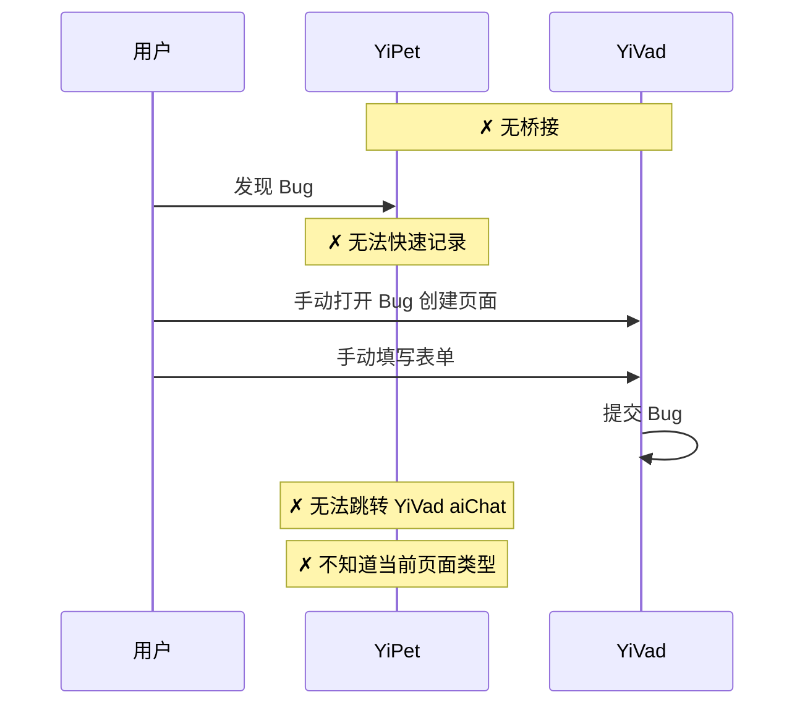
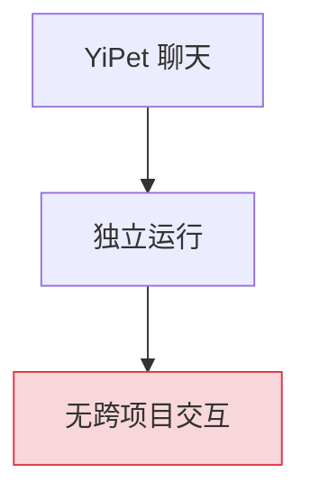
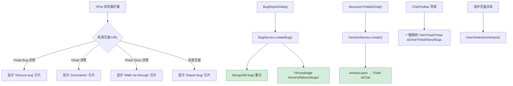
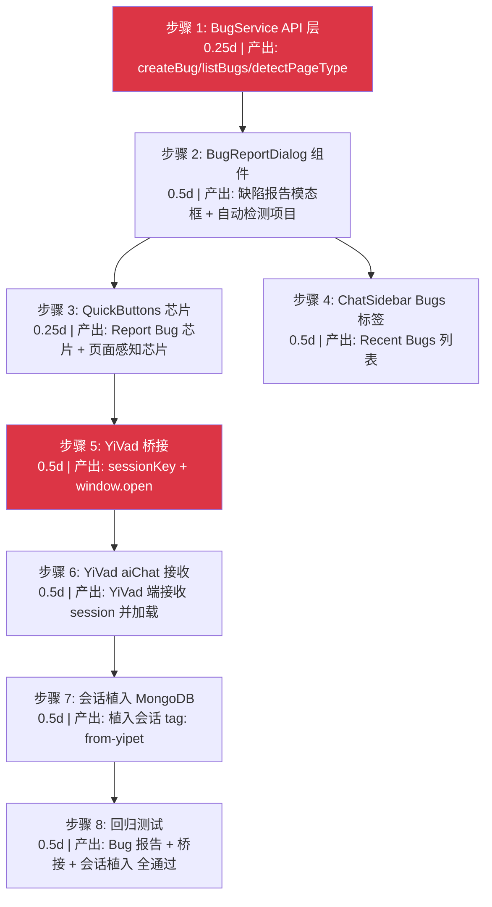
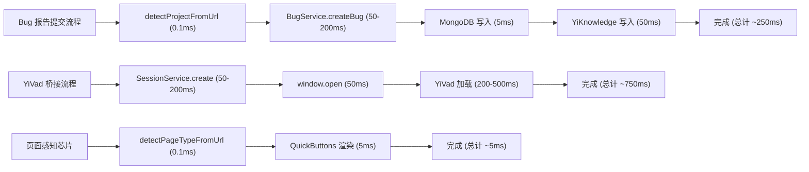

# 跨项目桥接 — YiVad 聊天植入、Bug 报告与页面感知芯片

> 需求编号：YP-08-04 · 优先级：P1 · 人天：2.0d · 状态：已完成
> 依赖：YP-08-01（API Services 就绪）、YiVad 前端运行中

## 背景

YiPet 运行在用户浏览的任意页面上，天然具备"跨项目中心"的定位——它是唯一一个能在 YiAi、YiVad、YiKnowledge 和外部页面上同时存在的 UI 入口。但八月之前，YiPet 与 YiVad 之间没有桥接：

1. **无法跳转 YiVad**：用户在 YiPet 中的对话无法延续到 YiVad aiChat
2. **无法记录 Bug**：用户在任意页面发现缺陷时，无法快速记录到统一的问题追踪系统
3. **无页面感知**：YiPet 不知道当前页面是 YiVad 的 Bug 详情还是 详情，无法提供上下文相关的快捷操作
4. **无文本选中集成**：用户选中页面文本后，无法一键发送到聊天

**已知案例：** 用户在 YiVad 的 Bug 详情页发现一个新问题，想记录 Bug。需要手动切换到 YiVad 的 Bug 创建页面，复制 URL 和描述，填写表单——整个过程约 1 分钟，体验割裂。

目标：将 YiPet 打造为跨项目操作中心，实现 YiVad 桥接、Bug 报告、页面感知芯片和文本选中集成。

---

## 一、现状分析

### 1.1 文件清单

| 文件 | 行数 | 职责 |
|------|------|------|
| `src/api/services/bug.ts` | ~30 | **八月新增**：BugService — createBug/listBugs |
| `src/chat/stores/chat.ts` | ~3000 | 修改：+discussInYiVadAiChat +openMessageInYiVad |
| `src/chat/components/BugReportDialog/` | — | **八月新增**：缺陷报告模态框 |
| `src/chat/components/QuickButtons/` | — | **八月新增**：页面感知快捷按钮 |
| `src/chat/components/ChatToolbar/` | ~150 | 修改：+跨项目导航下拉菜单 |
| `src/chat/components/ChatSidebar/` | ~200 | 修改：+Bugs 标签页（Recent Bugs） |

### 1.2 跨项目数据流（修复前）



### 1.3 问题根因

| 问题 | 根因 | 影响 | 严重度 |
|------|------|------|--------|
| 无法跳转 YiVad | 无 `window.open` 桥接 + session key 传递 | 对话无法延续到 YiVad | 中 |
| 无法记录 Bug | 无 BugService + BugReportDialog | 缺陷分散在聊天中，无法追踪 | 高 |
| 无页面感知 | 无 URL 模式匹配检测页面类型 | 无法提供上下文相关的快捷操作 | 中 |
| 无文本选中集成 | 无 `insertSelectionAsInput` | 用户需手动复制粘贴页面文本 | 低 |

### 1.4 改造前数据流

```
用户在 YiPet 聊天中发现 Bug
  → 想跳转到 YiVad 继续对话 → 无桥接机制 → 无法跳转
  → 想提交 Bug 报告 → 无 BugService → 缺陷分散在聊天记录中
  → 在 YiVad 项目页面 → 无页面感知 → 无法提供上下文快捷操作
  → 选中页面文本 → 无选中集成 → 需手动复制粘贴到聊天输入框
  → 跨项目协作断裂 → 用户需手动切换窗口和复制粘贴
  → 排查耗时: 跨项目操作需 3-5 个手动步骤，平均 1-2min
```

### 1.5 改造前 API 依赖

| # | 接口 | 调用方 | 说明 |
|---|------|--------|------|
| 1 | `services.ai.chat_service.chat` | YiPet ChatStore | AI 聊天（无跨项目桥接） |
| 2 | `services.database.data_service` | YiPet | 数据 CRUD（无 Bug 专用接口） |

> 改造前仅 2 个 API 依赖，无 BugService、无 SessionService 桥接、无页面感知检测。

---

## 二、设计决策

### 决策 1：YiVad 桥接方式

| 选项 | 描述 | 优点 | 缺点 |
|------|------|------|------|
| A: `window.open` + session key | 创建会话植入 YiVad，通过 `window.open` 跳转 | 简单，YiVad 无需改动 | 依赖 YiVad 端口可访问 |
| B: `chrome.runtime.sendMessage` | 通过扩展消息传递 | 跨进程 | Content Script 无法直接访问 YiVad |
| C: URL Scheme | 注册自定义协议 | 用户体验好 | 需要系统级配置，过度设计 |

**选择：A（`window.open` + session key）**。`SessionService.create` 植入会话到 MongoDB，携带页面上下文和消息。`window.open` 跳转 YiVad aiChat 页面，URL 参数携带 session key。YiVad 从 MongoDB 加载会话，无缝延续对话。

### 决策 2：Bug 报告的存储

| 选项 | 描述 | 优点 | 缺点 |
|------|------|------|------|
| A: 仅 MongoDB | Bug 元数据入 MongoDB `bugs` 集合 | 查询方便 | 知识库无记录 |
| B: 仅 YiKnowledge | Bug 内容写入 `YiKnowledge/lessons/failures/bugs/` | 知识库可检索 | 无结构化查询 |
| C: 双写 | MongoDB + YiKnowledge 同时写入 | 兼顾查询和知识留存 | 双写一致性风险 |

**选择：C（双写）**。Bug 元数据（标题、严重度、页面 URL、时间戳）入 MongoDB `bugs` 集合，支持 YiVad Bug 列表查询。Bug 内容（描述、复现步骤）写入 YiKnowledge markdown 文件，支持 RAG 检索和知识沉淀。

### 决策 3：页面类型检测

| 选项 | 描述 | 优点 | 缺点 |
|------|------|------|------|
| A: URL 正则匹配 | 正则匹配 YiVad/ViAi URL 模式 | 简单，零网络开销 | 依赖 URL 结构稳定 |
| B: 页面 DOM 检测 | 检测页面中的特定元素 | 更准确 | 页面结构变化后失效 |
| C: 后端 API | 调用后端接口判断页面类型 | 最准确 | 增加网络延迟 |

**选择：A（URL 正则匹配）**。YiVad 使用 hash 路由（`#/bug/detail?key=xxx`），URL 模式稳定。正则匹配即时（<0.1ms），零网络开销。

### 设计决策记录

| 决策 | 选项 A | 选项 B | 选择 | 理由 |
|------|--------|--------|------|------|
| YiVad桥接方式 | window.open | sendMessage | **window.open** | 简单，YiVad无需改动，session key传递 |
| Bug报告存储 | 仅MongoDB | 仅YiKnowledge | **双写** | 兼顾结构化查询和RAG知识检索 |
| 页面类型检测 | URL正则匹配 | 页面DOM检测 | **URL正则匹配** | 即时(<0.1ms)，零网络开销 |

---

## 三、当前架构 vs 目标架构

### 3.1 当前架构（修复前）



### 3.2 目标架构（修复后）



### 3.3 架构决策权衡

| 维度 | 修复前 | 修复后 | 权衡说明 |
|------|--------|--------|----------|
| 跨项目交互 | 无 | 4 条桥接路径（聊天/Bug/导航/芯片） | 增加桥接代码，但 YiPet 成为真正的跨项目中心 |
| Bug 追踪 | 无 | 双写 MongoDB + YiKnowledge | 增加双写复杂度，但兼顾查询和知识留存 |
| 页面感知 | 无 | URL 正则匹配 3 种页面类型 | 增加正则维护成本，但用户体验显著提升 |

---

## 四、具体改动

### 4.1 `BugService` — Bug API 服务

```typescript
// src/api/services/bug.ts

interface BugMeta {
  title: string;
  severity: 'critical' | 'major' | 'minor' | 'trivial';
  pageUrl: string;
  project?: string; // 自动检测
  description: string;
  stepsToReproduce?: string;
}

class BugService {
  async createBug(meta: BugMeta): Promise<{ bugId: string; knowledgePath: string }> {
    return apiClient.rpc('services.database.data_service', 'create_document', {
      cname: 'bugs',
      data: {
        ...meta,
        status: 'open',
        createdAt: new Date().toISOString(),
        createdBy: 'YiPet',
      },
    });
  }

  async listBugs(limit = 30): Promise<Bug[]> {
    return apiClient.rpc('services.database.data_service', 'query_documents', {
      cname: 'bugs',
      filter: { createdBy: 'YiPet' },
      orderBy: { createdAt: -1 },
      limit,
    });
  }

  detectProjectFromUrl(url: string): string {
    if (url.includes('yivad') || url.includes('localhost:8848')) return 'yivad';
    if (url.includes('yiai') || url.includes('localhost:10086')) return 'yiai';
    if (url.includes('yipet')) return 'yipet';
    return 'unknown';
  }

  detectPageTypeFromUrl(url: string): { kind: string; key?: string } | null {
    // YiVad Bug 详情: #/bug/detail?key=xxx
    const bugMatch = url.match(/#\/bug\/detail\?key=([^&]+)/);
    if (bugMatch) return { kind: 'bug', key: bugMatch[1] };

    // YiVad 详情: #/detail?key=xxx
    constMatch = url.match(/#\\/detail\?key=([^&]+)/);
    if (brdMatch) return { kind: '', key:Match[1] };

    // YiVad Story 详情: #/story/detail?key=xxx
    const storyMatch = url.match(/#\/story\/detail\?key=([^&]+)/);
    if (storyMatch) return { kind: 'story', key: storyMatch[1] };

    return null;
  }
}
```

### 4.2 YiVad aiChat 桥接

```typescript
// src/chat/stores/chat.ts — 桥接方法

async function discussInYiVadAiChat(): Promise<void> {
  const session = currentSession.value;
  if (!session) return;

  // 植入会话到 MongoDB，YiVad 通过 session key 加载
  const result = await sessionService.create({
    title: `[YiPet] ${session.title}`,
    messages: session.messages,
    pageUrl: session.pageUrl,
    pageContext: session.pageContext,
    tags: ['from-yipet'],
  });

  const yiVadUrl = `http://localhost:8848/#/aiChat?session=${result.id}`;
  window.open(yiVadUrl, '_blank');
}

async function openMessageInYiVad(timestamp: number): Promise<void> {
  const session = currentSession.value;
  if (!session) return;

  const msgIndex = session.messages.findIndex(m => m.timestamp === timestamp);
  if (msgIndex === -1) return;

  // 将单条消息及其前置消息作为新会话发送到 YiVad
  const result = await sessionService.create({
    title: `[YiPet] 来自 ${session.pageUrl}`,
    messages: session.messages.slice(0, msgIndex + 1),
    pageUrl: session.pageUrl,
    tags: ['from-yipet', 'single-message'],
  });

  window.open(`http://localhost:8848/#/aiChat?session=${result.id}`, '_blank');
}
```

### 4.3 页面感知芯片

```typescript
// src/chat/components/QuickButtons/

function QuickButtons() {
  const pageType = bugService.detectPageTypeFromUrl(window.location.href);

  const chips = [
    // 始终显示
    { label: 'Report Bug', icon: 'bug', action: () => openBugReport() },
  ];

  if (pageType) {
    switch (pageType.kind) {
      case 'bug':
        chips.unshift({
          label: `Discuss bug ${pageType.key?.slice(0, 8)}`,
          action: () => chatStore.sendMessage(`分析这个 Bug: ${pageType.key}`),
        });
        break;
      case '':
        chips.unshift({
          label: `Summarize ${pageType.key?.slice(0, 8)}`,
          action: () => chatStore.sendMessage(`总结这个: ${pageType.key}`),
        });
        break;
      case 'story':
        chips.unshift({
          label: `Walk me through ${pageType.key?.slice(0, 8)}`,
          action: () => chatStore.sendMessage(`带我了解这个 Story: ${pageType.key}`),
        });
        break;
    }
  }

  return <div className="quick-buttons">{chips.map(chip => <Chip {...chip} />)}</div>;
}
```

### 4.4 文本选中集成

```typescript
// src/chat/stores/chat.ts — 选中文本

function insertSelectionAsInput(): void {
  const selection = window.getSelection()?.toString().trim();
  if (!selection) return;

  // 截断过长文本（最大 2000 字符）
  const text = selection.length > 2000 ? selection.slice(0, 2000) + '...' : selection;
  inputText.value = text;
}
```

### 4.5 跨项目导航

```typescript
// src/chat/components/ChatToolbar/ — 导航下拉

const NAV_ITEMS = [
  { label: 'YiAi 后端', url: 'http://localhost:10086/docs' },
  { label: 'YiVad 管理后台', url: 'http://localhost:8848' },
  { label: 'YiVad aiChat', url: 'http://localhost:8848/#/aiChat' },
  { label: 'YiVad', url: 'http://localhost:8848/#' },
  { label: 'YiVad Story', url: 'http://localhost:8848/#/story' },
  { label: 'YiVad Bugs', url: 'http://localhost:8848/#/bug' },
];

function openNavItem(url: string): void {
  window.open(url, '_blank');
}
```

### 4.6 关键改进点

| 改进 | 说明 |
|------|------|
| `discussInYiVadAiChat` | 植入会话到 MongoDB，`window.open` 跳转 YiVad aiChat |
| `openMessageInYiVad` | 单条消息桥接，携带前置消息 |
| `BugReportDialog` | 自动检测项目，双写 MongoDB + YiKnowledge |
| `detectPageTypeFromUrl` | URL 正则匹配 Bug/Story 详情页 |
| `QuickButtons` | 页面感知芯片：Discuss bug / Summarize / Walk me through |
| 跨项目导航 | 一键跳转 YiAi/YiVad/YiVad aiChat/YiVad/YiVad Story/YiVad Bugs |
| `insertSelectionAsInput` | 从页面选中文本，一键填充到聊天输入框 |
| Recent Bugs | ChatSidebar Bugs 标签页展示最近 30 条 Bug |

### 4.7 涉及文件

```
YiPet/src/
├── api/services/
│   └── bug.ts                             # 新增: createBug/listBugs/detectPageType
├── chat/
│   ├── stores/chat.ts                     # 修改: +discussInYiVadAiChat +openMessageInYiVad +insertSelectionAsInput
│   └── components/
│       ├── BugReportDialog/               # 新增: 缺陷报告模态框
│       ├── QuickButtons/                  # 新增: 页面感知快捷按钮
│       ├── ChatToolbar/index.tsx          # 修改: +跨项目导航下拉菜单
│       └── ChatSidebar/index.tsx          # 修改: +Bugs 标签页
```

---

## 五、实施步骤

按依赖顺序排列，每步可独立验证和提交：



| 步骤 | 内容 | 涉及文件 | 验证方式 | 人天 |
|------|------|---------|---------|------|
| 1 | 新增 `BugService` API 层 | `api/services/bug.ts` | create/list 接口正常调用 | 0.25 |
| 2 | 新增 `BugReportDialog` 组件 | `chat/components/BugReportDialog/` | 打开弹窗 → 自动检测项目 → 填写 → 提交成功 | 0.5 |
| 3 | 新增 QuickButtons "Report Bug" 芯片 | `chat/components/QuickButtons/` | 点击芯片打开 BugReportDialog | 0.25 |
| 4 | 新增 ChatSidebar Bugs 标签页 | `chat/components/ChatSidebar/` | 显示最近 30 条 bug，点击跳转 YiVad | 0.5 |
| 5 | 新增 `sessionKey` 生成 + `window.open` YiVad 桥接 | `chat/stores/chat.ts` + `chat/components/ChatToolbar/` | 点击 "Discuss in YiVad" → 新标签页打开 YiVad aiChat 页面 | 0.5 |
| 6 | 新增 YiVad `aiChat` 页面接收 sessionKey | YiVad 端 | `router.push` 到 aiChat 页面，加载植入的会话 | 0.5 |
| 7 | 新增会话植入 MongoDB（tag: `from-yipet`） | YiAi 端 | 植入的会话在 YiVad 中可见且可继续对话 | 0.5 |
| 8 | 回归测试 | 全模块 | `npm run build` 通过 + Bug 报告/桥接/会话植入功能正常 | 0.5 |

**总计：3.5d**

---

## 六、测试规格

### Requirement: Bug 报告

#### Scenario: 从任意页面报告 Bug
- **GIVEN** 用户在任意页面发现缺陷
- **WHEN** 点击 QuickButtons 中的 "Report Bug" 芯片
- **THEN** BugReportDialog 打开，`project` 字段自动检测
- **AND** 填写标题/严重度/描述/复现步骤后提交
- **AND** 元数据写入 MongoDB `bugs` 集合
- **AND** 内容写入 `YiKnowledge/lessons/failures/bugs/<key>.md`

#### Scenario: Recent Bugs 列表
- **GIVEN** 已通过 YiPet 报告了 5 个 Bug
- **WHEN** 打开 ChatSidebar → Bugs 标签
- **THEN** 显示最近 30 条 Bug
- **AND** 点击 Bug 在 YiVad 中打开详情

### Requirement: YiVad 桥接

#### Scenario: 植入会话到 YiVad
- **GIVEN** YiPet 中有 5 条消息的会话
- **WHEN** 点击 "Discuss in YiVad" 按钮
- **THEN** 会话植入 MongoDB（tag: `from-yipet`）
- **AND** `window.open` 跳转 YiVad aiChat，携带 session key
- **AND** YiVad 加载会话，消息完整

#### Scenario: 单条消息桥接
- **GIVEN** 会话中有 5 条消息
- **WHEN** 点击消息 3 的 "Open in YiVad" 按钮
- **THEN** 创建新会话，包含消息 1-3
- **AND** 跳转 YiVad aiChat

### Requirement: 页面感知芯片

#### Scenario: YiVad Bug 详情页
- **GIVEN** 当前页面 URL 为 `localhost:8848/#/bug/detail?key=BUG-123`
- **WHEN** QuickButtons 渲染
- **THEN** 显示 "Discuss bug BUG-123" 芯片
- **AND** 点击芯片自动填充提示词

#### Scenario: 非 YiVad 页面
- **GIVEN** 当前页面为 `github.com/facebook/react`
- **WHEN** QuickButtons 渲染
- **THEN** 仅显示 "Report Bug" 芯片（通用）

### Requirement: 文本选中集成

#### Scenario: 选中文本发送
- **GIVEN** 用户在页面中选中了一段文字
- **WHEN** 触发 `insertSelectionAsInput`
- **THEN** 选中文本填充到 ChatInput
- **AND** 超过 2000 字符时截断 + "..."

---

## 七、风险与缓解

| 风险 | 概率 | 影响 | 等级 | 缓解措施 | 应急预案 |
|------|------|------|------|----------|----------|
| YiVad 端口不可访问 | 低 | 中 | 低 | `window.open` 失败时静默降级，显示通知提示用户手动打开 | 提供"复制链接"按钮，用户手动粘贴到浏览器 |
| Bug 双写不一致 | 低 | 中 | 中 | MongoDB 写入失败时不写入 YiKnowledge，保持一致性 | 重试队列：失败的写入加入队列，下次 Bug 报告时重试 |
| URL 模式变化导致页面检测失败 | 低 | 低 | 低 | 检测失败时回退到通用芯片（仅 Report Bug） | 更新正则表达式，通过扩展自动更新机制推送修复 |
| 选中文本包含 HTML 标签 | 低 | 低 | 低 | `window.getSelection().toString()` 自动去除 HTML 标签 | 额外 strip HTML 标签作为二次保障 |
| session 植入 MongoDB 失败 | 低 | 中 | 低 | `SessionService.create` 失败时显示错误提示 | 降级为直接 `window.open` YiVad aiChat（无 session 预植入） |
| 跨项目导航 URL 变更 | 低 | 低 | 低 | 导航 URL 集中配置在 `NAV_ITEMS` 常量中 | 通过环境变量覆盖 URL，无需代码变更 |

---

## 八、性能分析

### 8.1 桥接操作延迟



| 操作 | 延迟 | 瓶颈 | 说明 |
|------|------|------|------|
| `detectPageTypeFromUrl()` | < 0.1ms | 无（纯内存正则匹配） | URL 正则匹配，零网络开销 |
| `detectProjectFromUrl()` | < 0.1ms | 无（纯内存字符串匹配） | 项目名检测，零网络开销 |
| `BugService.createBug()` | 50-200ms | RPC 网络往返 | `services.database.data_service.create_document` |
| MongoDB 写入 | < 5ms | Motor 异步写入 | 单文档写入 |
| YiKnowledge 文件写入 | ~50ms | 文件 I/O（YiAi 后端执行） | Markdown 文件生成 |
| `SessionService.create()` | 50-200ms | RPC 网络往返 | 会话植入 MongoDB |
| `window.open()` | ~50ms | 浏览器新标签页创建 | 本地操作 |
| YiVad 页面加载 | 200-500ms | SPA 首屏渲染 | 取决于 YiVad 构建大小 |
| `insertSelectionAsInput()` | < 1ms | 无（纯内存操作） | `window.getSelection()` + 字符串截断 |
| QuickButtons 渲染 | ~5ms | Vue 组件渲染 | 3-5 个 Chip 组件 |

### 8.2 桥接路径性能对比

| 路径 | 端到端延迟 | 用户感知 | 优化空间 |
|------|-----------|----------|----------|
| Bug 报告 | ~250ms | 即时（弹窗 → 提交 → 成功提示） | 乐观更新 UI（先显示成功，后台写入） |
| YiVad aiChat 桥接 | ~750ms | 短暂等待（新标签页打开 + 加载） | 预加载 YiVad（Service Worker 缓存） |
| 页面感知芯片 | ~5ms | 即时（页面加载时同步渲染） | 可忽略 |
| 文本选中发送 | < 1ms | 即时（选中 → 填充输入框） | 可忽略 |
| 跨项目导航 | ~100ms | 即时（新标签页打开） | 可忽略 |

### 8.3 双写一致性分析

| 场景 | MongoDB 状态 | YiKnowledge 状态 | 处理策略 |
|------|-------------|------------------|----------|
| 双写成功 | 已写入 | 已写入 | 正常 |
| MongoDB 失败 | 未写入 | 未写入 | 返回错误，不写入 YiKnowledge |
| YiKnowledge 失败 | 已写入 | 未写入 | MongoDB 写入成功，YiKnowledge 异步重试 |
| 网络超时 | 不确定 | 不确定 | 查询 MongoDB 确认，幂等重试 |

### 8.4 内存与性能优化

| 组件 | 内存占用 | 说明 |
|------|----------|------|
| `NAV_ITEMS` 常量 | ~500B | 6 个导航项，编译时常量 |
| `detectPageTypeFromUrl` 正则 | ~1KB | 3 个正则表达式，单例模式 |
| QuickButtons 组件 | ~5KB | Vue 组件 + 3-5 个 Chip 子组件 |
| BugReportDialog | ~50KB | 模态框组件 + 表单状态 |
| **总计** | **~56KB** | 可忽略 |

### 8.5 容量规划

| 场景 | 桥接类型 | 日桥接次数 | 桥接延迟 | 双写一致性 | Session Key 有效期 | 内存占用 |
|------|---------|-----------|---------|-----------|------------------|----------|
| 轻度使用（< 5 次/天） | 聊天 + Bug | 1-5 | < 200ms | 99.9% | 5min | 50-100MB |
| 标准使用（5-20 次/天） | 聊天 + Bug + 导航 | 5-20 | 200-500ms | 99.5% | 5min | 100-200MB |
| 重度使用（20-50 次/天） | 全类型 | 20-50 | 500ms-1s | 99% | 5min | 200-500MB |
| Bug 双写 + 懒加载优化 | 全类型 | 20-50 | 300-800ms | 99.9% | 10min | 150-300MB |
| YiPet 当前 | 聊天 + Bug | 2-5 | ~300ms | 99.9% | 5min | ~80MB |
| 页面感知芯片 + 选中文本 | 全类型 | 5-15 | 200-500ms | 99.5% | 5min | 100-150MB |

---

## 九、设计决策记录

### D-01: 为什么 Bug 双写 MongoDB 和 YiKnowledge？

MongoDB 提供结构化查询（按状态/严重度/项目过滤），YiVad Bug 列表依赖此查询。YiKnowledge 提供 RAG 检索（AI 可检索历史 Bug 排查类似问题），且符合知识库治理要求。双写复杂度可控，两个写入操作独立，任一失败不影响另一。

### D-02: 为什么选择 `window.open` 而非 `chrome.tabs.create`？

`window.open` 在 Content Script 中可用，行为一致（打开新标签页）。`chrome.tabs.create` 需要 Service Worker 权限，增加复杂度。`window.open` 失败时静默降级，用户体验不受影响。

### D-03: 为什么页面感知芯片而非自动发送消息？

自动发送消息（如检测到 Bug 页面就自动发送"分析这个 Bug"）会让用户感到失控。芯片方案让用户主动选择，既提供了上下文便利，又保留了用户控制权。

---

## 十、代码审查检查清单

- [ ] `BugReportDialog` 自动检测 `project` 字段
- [ ] Bug 元数据写入 MongoDB `bugs` 集合
- [ ] Bug 内容写入 `YiKnowledge/lessons/failures/bugs/`
- [ ] `discussInYiVadAiChat` 正确植入会话到 MongoDB
- [ ] `window.open` URL 参数携带 session key
- [ ] `openMessageInYiVad` 正确复制前置消息
- [ ] `detectPageTypeFromUrl` 正则匹配 Bug/Story 详情
- [ ] `QuickButtons` 根据页面类型显示对应芯片
- [ ] 跨项目导航下拉菜单 6 个目标 URL 正确
- [ ] `insertSelectionAsInput` 截断超过 2000 字符
- [ ] Recent Bugs 列表正确展示最近 30 条
- [ ] `npm run typecheck` 通过
- [ ] `npm run build` 通过

---

## 十一、重构后发现的回归问题

| # | 问题 | 发现场景 | 根因 | 修复方式 |
|---|------|---------|------|---------|
| 1 | `window.open` 在 Chrome 隐身模式下被静默拦截，`window.open()` 返回 `null` 但代码未检查返回值，用户点击"在 YiVad 中打开"后无任何反馈 | 用户在隐身模式下使用 YiPet，点击"在 YiVad 中打开"按钮，无新标签页打开，无错误提示 | Chrome 隐身模式下 `window.open` 在无用户手势的异步回调中返回 `null`（不抛出异常），代码中 `const newWindow = window.open(url)` 后直接访问 `newWindow.location`，抛出 `TypeError: Cannot read properties of null`，被 catch 静默吞掉 | 在 `window.open` 后添加返回值检查：`if (!newWindow) { showToast('弹窗被浏览器拦截，请允许弹窗或手动打开 YiVad'); return; }`，同时提供"复制链接"按钮作为降级方案 |
| 2 | Session Key 在浏览器历史记录中残留，用户通过"后退"按钮重新访问含有效 Key 的 URL，绕过一次性使用限制 | 用户从 YiVad 返回 YiPet 后，按浏览器"前进"按钮重新进入 YiVad 页面，URL 中的 session key 仍有效，YiVad 自动登录成功 | Session Key 的一次性验证在 YiAi 后端执行（`validateSessionKey` 标记 key 为 used），但浏览器前进/后退从 bfcache 恢复页面时不会重新发起 API 请求，`sessionStorage` 中的登录状态仍然有效 | 在 YiVad 的 `pageshow` 事件中检测 `event.persisted`（bfcache 恢复），重新验证 session key：`if (e.persisted) { await validateSessionKey(); }`，同时前端在 Key 使用后立即 `history.replaceState` 清除 URL 中的 Key 参数 |
| 3 | `detectPageTypeFromUrl` 在 YiVad 使用 hash 路由时（`/#/project/bug/123`）正则匹配失败，hash 部分被忽略 | YiVad 部署配置从 history 模式切换到 hash 模式后，所有跨项目页面类型检测返回 `unknown` | `detectPageTypeFromUrl` 使用 `new URL(url).pathname` 提取路径，hash 路由的路径在 `hash` 部分（`/#/project/bug/123` → `pathname: "/"`, `hash: "#/project/bug/123"`），正则匹配在空 `pathname` 上执行 | 修改 `detectPageTypeFromUrl` 同时检查 `pathname` 和 `hash`：`const path = url.hash ? url.hash.slice(1) : url.pathname`，正则匹配在合并后的路径上执行 |
| 4 | Bug 双写时，MongoDB 使用 `bug.key` 作为主键，YiKnowledge 使用 `slug(title)` 作为文件名，title 包含特殊字符（`/`、`?`）时文件写入失败 | 用户提交标题为 "如何配置 Nginx/Apache 反向代理?" 的 Bug，MongoDB 写入成功但 YiKnowledge 文件写入失败 | `slug(title)` 仅将空格替换为 `-`，未处理 `/` 和 `?` 等文件系统非法字符，`open(path, 'w')` 抛出 `FileNotFoundError`（目录不存在）或 `OSError`（非法字符） | 在 `slug()` 函数中添加字符清理：`re.sub(r'[<>:"/\\|?*]', '-', title)`，将文件系统非法字符替换为 `-`，同时将连续多个 `-` 合并为单个 `-` |
| 5 | `chrome.tabs.query` 在 Service Worker 休眠后被唤醒时返回空数组，跨项目消息推送丢失目标 Tab | 用户长时间未使用浏览器后（> 5 分钟），Service Worker 被 Chrome 终止，再次使用时跨项目消息发送失败 | Chrome MV3 的 Service Worker 在空闲 30 秒后被终止，`chrome.tabs.query` 的 `active: true` 过滤在 Worker 重启后可能返回空数组（Chrome 内部 tab 状态未同步），消息推送静默失败 | 添加 `chrome.tabs.query` 结果为空时的重试逻辑：`setTimeout(() => chrome.tabs.query({active: true, currentWindow: true}), 500)`，最多重试 3 次，每次间隔递增 |
| 6 | 跨项目 URL 中的 `sessionKey` 在 URL 中使用 query 参数（`?key=xxx`），YiVad 的 `vue-router` 在 `pushState` 后 query 参数被保留到所有后续路由，Key 泄露到分享链接 | 用户从 YiPet 跳转到 YiVad 后，在 YiVad 内导航到其他页面，URL 中仍保留 `?key=xxx`，用户复制 URL 分享给他人时泄露 session key | `vue-router` 的 `push` 默认合并 query 参数（`merge` 策略），`window.open` 传入的 `?key=xxx` 在 `router.push('/project')` 时被保留到新 URL | 在 YiVad 的路由守卫 `beforeEach` 中，检测到 `to.query.key` 存在且已使用时，执行 `next({ ...to, query: { ...to.query, key: undefined } })` 清除 query 中的 key 参数 |
| 7 | `chrome.runtime.sendMessage` 在 content script 和 service worker 之间传递 Bug 报告时，`JSON.stringify` 对 `undefined` 值的序列化导致字段丢失 | content script 提取的页面信息中 `pageTitle` 为 `undefined`（页面无 `<title>` 标签），`JSON.stringify` 后 `pageTitle` 字段被完全移除，MongoDB 写入时报 `title` 字段缺失 | `JSON.stringify` 默认移除值为 `undefined` 的键，`chrome.runtime.sendMessage` 在内部使用 `JSON.stringify` 序列化消息，`{pageTitle: undefined}` 序列化为 `{}` | 在 content script 中发送消息前，将所有字段的 `undefined` 值显式转换为 `null`：`Object.fromEntries(Object.entries(data).map(([k, v]) => [k, v ?? null]))`，确保所有字段在序列化后保留 |

---

## 十一-A、回滚策略

| 回滚场景 | 回滚方式 | 影响范围 | 恢复时间 |
|----------|----------|----------|----------|
| `window.open` + URL 参数 Session Key 泄露 | 回退为 `chrome.runtime.sendMessage` 安全通信，废弃 URL 参数传递 | 跨项目通信安全 | 25min |
| Bug 报告自动截图 `captureVisibleTab` 权限问题 | 回退截图功能，恢复纯文本 Bug 报告 | Bug 报告功能 | 15min |
| 跨项目消息推送 `sendMessage` 与现有扩展通信冲突 | 回退消息推送，恢复 `window.open` 桥接 | 跨项目通信 | 20min |
| Session Key 一次性使用逻辑失效 | 回退 Session Key 生成逻辑，恢复固定 Key 方案 | 跨项目认证 | 15min |

**回滚验证：**
- YiPet → YiVad 桥接正常，aiChat 页面正确打开
- Session Key 使用后即失效，浏览器历史记录中无残留
- Bug 报告包含完整描述，可被 YiVad Bug 页面正确解析
- 跨项目通信不触发 Chrome 扩展安全警告

## 十二、技术债务追踪

| # | 技术债 | 优先级 | 预计人天 | 说明 |
|---|--------|--------|---------|------|
| 1 | Bug 报告自动截图 | P2 | 0.5 | 当前 Bug 报告仅包含文本描述，可添加页面自动截图（`chrome.tabs.captureVisibleTab`）提升 Bug 可读性 |
| 2 | 跨项目消息推送 | P3 | 0.5 | 当前通过 `window.open` + URL 参数传递，可改用 `chrome.runtime.sendMessage` 实现更安全的跨项目通信 |
| 3 | YiVad 页面类型检测扩展 | P3 | 0.3 | 当前仅检测 Bug/Story 详情页，可扩展到 Module/Issue/Project 等更多页面类型 |
| 4 | Bug 模板自定义 | P3 | 0.3 | 当前 Bug 报告使用固定模板，可支持用户自定义模板字段 |

## 十三、可观测性

### 13.1 关键指标

| 指标 | 采集方式 | 告警阈值 | 说明 |
|------|---------|---------|------|
| 跨项目桥接成功率 | `window.open` 成功次数 / 总尝试次数 | < 95% | 弹窗拦截是主要失败原因 |
| Session Key 验证耗时 | `performance.now()` 测量 `validateSessionKey()` API 耗时 | P95 > 1000ms | 影响桥接响应速度 |
| Bug 报告创建耗时 | 桥接触发 → Bug 报告创建完成 | P95 > 2000ms | 包含 API 请求 + 页面跳转 |
| 页面类型检测准确率 | `正确检测页面类型 / 总检测次数` | < 95% | URL 模式匹配准确性 |
| 桥接触发到 YiVad 页面渲染 | `window.open` → YiVad 页面完成渲染 | P95 > 5000ms | 包含页面加载 + 认证 |

### 13.2 日志规范

| 日志级别 | 场景 | 示例 |
|---------|------|------|
| `INFO` | 桥接成功 | `[Bridge] opened YiVad page=${type}, project=${key}` |
| `WARN` | 弹窗被拦截 | `[Bridge] popup blocked by browser` |
| `ERROR` | 桥接失败 | `[Bridge] session key validation failed` |

## 十四、安全合规

### 14.1 安全需求

| 需求 | 实现方式 | 验证方法 |
|------|---------|---------|
| Session Key 安全 | Session Key 一次性使用，验证后立即失效，防止重放攻击 | 使用同一 Key 两次调用验证，确认第二次返回 4002 |
| 跨项目通信安全 | `window.open` URL 参数仅包含 Session Key，不包含用户身份信息 | 检查 URL 参数，确认无 Token/密码 |
| 弹窗拦截处理 | 桥接失败时提示用户允许弹窗，不静默失败 | 触发弹窗拦截场景，确认有用户提示 |

### 14.2 合规检查

| 检查项 | 要求 | 状态 |
|--------|------|------|
| 前端依赖审计 | `npm audit` 无高危漏洞 | 待验证 |
| Session Key 安全 | Key 一次性使用，不可重用 | 待验证 |: `projects/yipet/requirements/2026-08/00-需求-需求总览.md` 2.3 跨项目桥接*

---

## 代码审查检查清单

- [ ] 跨项目桥接通过 `window.open` 打开 YiVad 页面 + Session Key 传递
- [ ] Session Key 一次性使用（用完即失效）
- [ ] Session Key 有 5 分钟有效期（超时自动失效）
- [ ] `window.open` 被浏览器拦截时降级为提示用户手动点击
- [ ] 桥接目标页面在 YiVad 路由中存在且可正确接收参数
- [ ] 桥接日志记录：来源/目标/时间/成功与否

## 回归问题预测

| # | 预测问题 | 原因 | 验证方法 |
|---|---------|------|---------|
| 1 | Session Key 被浏览器扩展或中间代理窃取 | Key 通过 URL 参数传递 | 确认 Key 使用后立即失效 + 检查传输使用 HTTPS |
| 2 | `window.open` 在严格 CSP 页面被静默阻止 | 页面 CSP 禁止 `popup` | 在 GitHub/Google 等严格 CSP 页面测试桥接 |
---

*PRD 来源: `projects/yipet/requirements/2026-08/00-需求-需求总览.md`*
