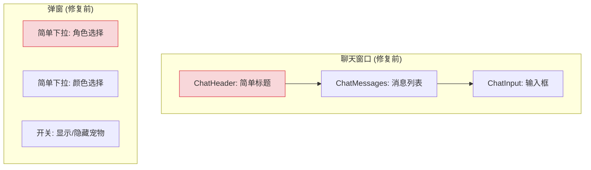
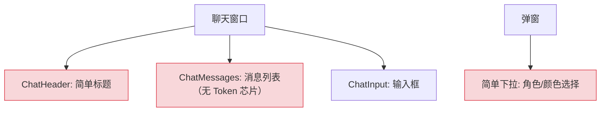
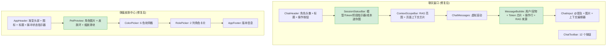
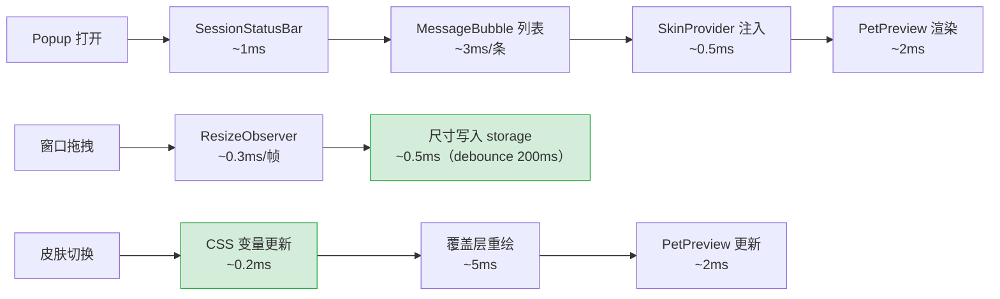

# UI/UX 增强与皮肤中心重构 — 状态栏、Token 芯片、成本迷你图与宠物预览

> 需求编号：YP-08-05 · 优先级：P1/P2 · 人天：4.0d（UI/UX 2.0d + 皮肤中心 2.0d） · 状态：已完成
> 依赖：YP-08-02（聊天核心就绪）

## 背景

七月迭代完成基础聊天框架后，YiPet 的 UI 仍较简陋：无状态指示器、无 Token 消耗展示、无窗口调整大小、弹窗仅简单开关面板。八月需要提升用户体验：

1. **无状态栏**：用户不知道当前使用的模型、消息数量、Token 消耗
2. **无成本可视化**：用户无法感知每条消息的 Token 消耗
3. **无调整大小**：聊天窗口固定大小，不同页面适配性差
4. **弹窗体验差**：皮肤选择仅为简单下拉框，无实时预览

**已知案例：** 用户使用 qwen3.5-think 模型进行长对话，未注意到 Token 已接近 8K 窗口上限。第 15 条消息时上下文被截断，AI 回答丢失了前文的配置信息，用户困惑为何 AI "忘记了"之前讨论的内容。

目标：通过状态栏、Token 芯片、成本迷你图和皮肤中心重构，提升 YiPet 的整体用户体验。

---

## 一、现状分析

### 1.1 文件清单

**UI/UX 增强：**

| 文件 | 行数 | 职责 |
|------|------|------|
| `src/chat/components/SessionStatusBar/` | — | **八月新增**：状态栏 |
| `src/chat/components/MessageBubble/` | — | **八月新增**：消息气泡（含 Token 芯片 + 操作行） |
| `src/chat/composables/useTokenTrend.ts` | — | **八月新增**：Token 消耗趋势 |
| `src/chat/components/ContextScopeBar/` | — | **八月新增**：上下文芯片 |
| `src/chat/components/ChatWindow/` | ~200 | 修改：+拖拽调整大小 + 全屏 + 拖放目标 |
| `src/chat/components/ChatSidebar/` | ~200 | 修改：+分隔线拖拽调整大小 |

**皮肤中心：**

| 文件 | 行数 | 职责 |
|------|------|------|
| `src/popup/App.tsx` | ~100 | 重构：简单开关 → 皮肤中心 |
| `src/popup/data.ts` | ~30 | 修改：+COLOR_OPTIONS +ROLE_NAMES +MODELS |
| `src/popup/types.ts` | ~20 | 修改：model 类型改为 string |
| `src/popup/components/AppHeader/` | — | **八月新增**：渐变头部 |
| `src/popup/components/PetPreview/` | — | **八月新增**：宠物预览 |
| `src/popup/components/ColorPicker/` | — | **八月新增**：颜色选择器 |
| `src/popup/components/RolePicker/` | — | **八月新增**：角色选择器 |
| `src/popup/components/AppFooter/` | — | **八月新增**：页脚 |

### 1.2 当前 UI 架构



### 1.3 问题根因

| 问题 | 根因 | 影响 | 严重度 |
|------|------|------|--------|
| 无状态栏 | 无 SessionStatusBar 组件 | 用户不知道模型/Token/阶段信息 | 中 |
| 无 Token 芯片 | MessageBubble 无 Token 估算 | 用户无法感知每条消息的消耗 | 中 |
| 无成本趋势 | 无 useTokenTrend composable | 无法发现 Token 消耗异常 | 低 |
| 无窗口调整 | ChatWindow 固定尺寸 | 不同页面适配性差 | 中 |
| 弹窗体验差 | 无皮肤预览 + 卡片选择 | 选择皮肤时无法预览效果 | 中 |

### 1.4 改造前数据流

```
用户打开 YiPet 聊天窗口
  → 无状态栏 → 用户不知道当前模型/Token 消耗/阶段
  → 无 Token 芯片 → 每条消息的消耗不可见
  → 无成本趋势 → Token 消耗异常无法发现
  → 皮肤选择 → 无预览 → 需逐个尝试才能看到效果
  → 聊天窗口固定尺寸 → 不同页面适配性差
  → 排查耗时: 用户无法感知 Token 消耗，发现问题依赖手动统计
```

### 1.5 改造前 API 依赖

| # | 接口 | 调用方 | 说明 |
|---|------|--------|------|
| 1 | `ai.chat_service.chat` (SSE) | YiPet ChatStore | 流式聊天（改造前无状态栏/Token 芯片，信息不透明） |
| 2 | `data_service.query_documents` (cname="sessions") | YiPet ChatStore | 会话查询（改造前无成本趋势数据） |

> 改造前 2 个 API 依赖，聊天窗口缺少状态栏、Token 芯片、成本趋势等 UI 增强功能。

---

## 二、设计决策

### 决策 1：Token 估算方式

| 选项 | 描述 | 优点 | 缺点 |
|------|------|------|------|
| A: 精确计数 | 使用 tokenizer 精确计算 token 数 | 精确 | 前端需加载 tokenizer（~500KB），性能开销大 |
| B: 字符估算 | `charCount / 2`（英文）或 `/ 1.5`（中文） | 零开销，即时 | 有误差（±20%） |
| C: 后端返回 | YiAi 后端在 SSE 中返回 token 计数 | 精确 | 需要后端改动 |

**选择：B（字符估算）**。前端加载 tokenizer 增加 500KB+ 体积，对浏览器扩展不友好。字符估算 `charCount / 2`（英文为主）或混合策略在 8K 窗口中误差可接受。Token 芯片显示 `~Nt`，`~` 前缀明确表示估算值。

### 决策 2：成本迷你图实现

| 选项 | 描述 | 优点 | 缺点 |
|------|------|------|------|
| A: Canvas | `<canvas>` 绘制 SVG 路径 | 灵活 | 代码量大 |
| B: SVG | 内联 `<svg>` 元素 | 轻量，CSS 可动画 | 路径计算需要手动 |
| C: 图表库 | 引入 ECharts/Chart.js | 功能丰富 | 体积大（~1MB），过度设计 |

**选择：B（内联 SVG）**。成本迷你图仅需简单的折线图（最多 20 个数据点），SVG 内联零依赖，体积 < 1KB。`useTokenTrend` 计算路径坐标，`<svg>` 渲染。

### 决策 3：皮肤中心架构

| 选项 | 描述 | 优点 | 缺点 |
|------|------|------|------|
| A: 弹窗内嵌 iframe | 弹窗内加载独立页面 | 隔离性好 | 弹窗尺寸有限（400×500），iframe 浪费空间 |
| B: React 组件 | 弹窗内 React 组件树 | 轻量，与弹窗尺寸匹配 | 组件较多（5 个） |
| C: 设置页面 | 独立浏览器标签页 | 空间大 | 用户需要离开当前页面，体验差 |

**选择：B（React 组件）**。弹窗尺寸 400×500，组件方案最轻量。5 个组件（AppHeader、PetPreview、ColorPicker、RolePicker、AppFooter）垂直布局，信息密度合理。

### 决策 4：窗口调整大小方式

| 选项 | 描述 | 优点 | 缺点 |
|------|------|------|------|
| A: 边缘拖拽 | 顶部/右下/左下边缘拖拽 | 直观，类似原生窗口 | 需要碰撞检测和范围钳制 |
| B: 预设尺寸 | 小/中/大 3 个预设按钮 | 简单 | 不够灵活 |
| C: 全屏切换 | 仅支持全屏/小窗切换 | 最简单 | 功能过于有限 |

**选择：A（边缘拖拽）**。3 个边缘（顶部、右下、左下）拖拽调整，范围钳制（MIN 480×400）。侧边栏分隔线独立拖拽（240-600px）。尺寸持久化到 `chrome.storage.local`。

### 设计决策记录

| 决策 | 选项 A | 选项 B | 选择 | 理由 |
|------|--------|--------|------|------|
| Token估算 | 精确计数 | 字符估算 | **字符估算** | 零开销，避免加载500KB+ tokenizer |
| 成本迷你图 | Canvas | SVG | **内联SVG** | 零依赖，体积<1KB，支持CSS动画 |
| 皮肤中心架构 | iframe | React组件 | **React组件** | 轻量，与弹窗尺寸匹配 |
| 窗口调整大小 | 边缘拖拽 | 预设尺寸 | **边缘拖拽** | 直观灵活，类似原生窗口体验 |

---

## 三、当前架构 vs 目标架构

### 3.1 当前架构（修复前）



### 3.2 目标架构（修复后）



### 3.3 架构决策权衡

| 维度 | 修复前 | 修复后 | 权衡说明 |
|------|--------|--------|----------|
| 状态可见性 | 无 | 状态栏 + Token 芯片 + 成本迷你图 | 增加 UI 组件，但用户对模型/Token/阶段有清晰感知 |
| 窗口灵活性 | 固定尺寸 | 边缘拖拽 + 侧边栏独立调整 | 增加拖拽逻辑，但不同页面适配性大幅提升 |
| 皮肤选择 | 简单下拉 | 实时预览 + 卡片选择 + 颜色选择器 | 弹窗从 1 个组件扩展到 5 个，但体验显著提升 |

---

## 四、具体改动

### 4.1 `SessionStatusBar` — 状态栏

```typescript
// src/chat/components/SessionStatusBar/

function SessionStatusBar() {
  const store = useChatStore();
  const { tokenTrend } = useTokenTrend();

  const estimatedTokens = store.messages.reduce(
    (sum, m) => sum + Math.ceil(m.content.length / 2), 0
  );
  const tokenPct = Math.min(100, (estimatedTokens / 8000) * 100);

  const streamingPhase = store.streamingPhase; // 'thinking' | 'retrieving' | 'streaming'

  return (
    <div className="session-status-bar">
      <div className="status-left">
        <span className="status-model">{store.currentModel}</span>
        <span className="status-separator">|</span>
        <span className="status-messages">{store.messages.length} msgs</span>
        <span className="status-separator">|</span>
        <span className="status-tokens">
          ~{estimatedTokens}t / 8K
          <span className="token-bar" style={{ width: `${tokenPct}%` }} />
        </span>
      </div>

      <div className="status-center">
        <div className={`phase-indicator ${streamingPhase}`}>
          <span className={`phase-dot ${streamingPhase === 'thinking' ? 'active' : ''}`}>thinking</span>
          <span className="phase-arrow">→</span>
          <span className={`phase-dot ${streamingPhase === 'retrieving' ? 'active' : ''}`}>retrieving</span>
          <span className="phase-arrow">→</span>
          <span className={`phase-dot ${streamingPhase === 'streaming' ? 'active' : ''}`}>streaming</span>
        </div>
      </div>

      <div className="status-right">
        <CostSparkline data={tokenTrend} />
      </div>
    </div>
  );
}
```

### 4.2 `useTokenTrend` — 成本迷你图

```typescript
// src/chat/composables/useTokenTrend.ts

interface TokenPoint {
  messageIndex: number;
  tokens: number;
  timestamp: number;
}

export function useTokenTrend() {
  const tokenTrend = ref<TokenPoint[]>([]);

  function recordToken(messageIndex: number, content: string): void {
    const tokens = Math.ceil(content.length / 2);
    tokenTrend.value.push({ messageIndex, tokens, timestamp: Date.now() });
  }

  function renderSparkline(width = 100, height = 20): string {
    if (tokenTrend.value.length < 2) return '';

    const points = tokenTrend.value;
    const maxTokens = Math.max(...points.map(p => p.tokens));
    const xStep = width / (points.length - 1);

    const pathData = points
      .map((p, i) => {
        const x = i * xStep;
        const y = height - (p.tokens / maxTokens) * height;
        return `${i === 0 ? 'M' : 'L'} ${x} ${y}`;
      })
      .join(' ');

    return `<svg width="${width}" height="${height}"><path d="${pathData}" stroke="var(--primary-gradient)" fill="none" stroke-width="1.5"/></svg>`;
  }

  return { tokenTrend, recordToken, renderSparkline };
}
```

### 4.3 `MessageBubble` — Token 芯片

```typescript
// src/chat/components/MessageBubble/

function MessageBubble({ message }: { message: Message }) {
  const estimatedTokens = Math.ceil(message.content.length / 2);
  const isUser = message.role === 'user';

  return (
    <div className={`message-bubble ${isUser ? 'user' : 'pet'}`}>
      <div className="bubble-content">
        <MarkdownRenderer content={message.content} />
      </div>

      <div className="bubble-footer">
        <span className={`token-chip ${isUser ? 'input' : 'output'}`}>
          ~{estimatedTokens}t
        </span>

        {!isUser && (
          <div className="message-actions">
            <button onClick={() => store.branchFromMessage(message.timestamp)}>Branch</button>
            <button onClick={() => store.openMessageInYiVad(message.timestamp)}>YiVad</button>
            <button onClick={() => openSaveToKnowledge(message.content)}>Save</button>
          </div>
        )}

        {message.ragSources?.length > 0 && (
          <div className="rag-sources">
            {message.ragSources.map(s => (
              <span key={s.file} className="rag-source-chip" title={s.snippet}>
                {s.file}
              </span>
            ))}
          </div>
        )}
      </div>
    </div>
  );
}
```

### 4.4 窗口调整大小

```typescript
// src/chat/components/ChatWindow/ — 拖拽调整大小

function useResizable(minW = 480, minH = 400) {
  const [size, setSize] = useState(() => {
    const cached = localStorage.getItem('chatWindowSize');
    return cached ? JSON.parse(cached) : { width: 480, height: 600 };
  });

  function startResize(edge: 'top' | 'bottom-right' | 'bottom-left') {
    function onMouseMove(e: MouseEvent) {
      setSize(prev => {
        const next = { ...prev };
        if (edge === 'top') {
          next.height = Math.max(minH, prev.height - e.movementY);
        }
        if (edge.includes('bottom')) {
          next.height = Math.max(minH, prev.height + e.movementY);
        }
        if (edge.includes('right')) {
          next.width = Math.max(minW, prev.width + e.movementX);
        }
        if (edge.includes('left')) {
          next.width = Math.max(minW, prev.width - e.movementX);
        }
        return next;
      });
    }

    function onMouseUp() {
      document.removeEventListener('mousemove', onMouseMove);
      document.removeEventListener('mouseup', onMouseUp);
      localStorage.setItem('chatWindowSize', JSON.stringify(size));
    }

    document.addEventListener('mousemove', onMouseMove);
    document.addEventListener('mouseup', onMouseUp);
  }

  return { size, startResize };
}
```

### 4.5 皮肤中心重构

```typescript
// src/popup/App.tsx — 重构后的皮肤中心

function PopupApp() {
  const [selectedRole, setSelectedRole] = useState('assistant');
  const [selectedColor, setSelectedColor] = useState('#1890ff');
  const [selectedModel, setSelectedModel] = useState('qwen3.5');
  const [petScale, setPetScale] = useState(1.0);

  async function applyChanges(): Promise<void> {
    await chrome.storage.local.set({
      petRole: selectedRole,
      petColor: selectedColor,
      petModel: selectedModel,
      petScale,
    });
    // 通知 Content Script 更新宠物外观
    const tabs = await chrome.tabs.query({ active: true, currentWindow: true });
    if (tabs[0]?.id) {
      chrome.tabs.sendMessage(tabs[0].id, {
        action: 'updateAppearance',
        role: selectedRole,
        color: selectedColor,
        model: selectedModel,
        scale: petScale,
      });
    }
  }

  return (
    <div className="popup-container">
      <AppHeader />
      <PetPreview
        role={selectedRole}
        color={selectedColor}
        scale={petScale}
        onScaleChange={setPetScale}
      />
      <ColorPicker selected={selectedColor} onChange={setSelectedColor} />
      <RolePicker selected={selectedRole} onChange={setSelectedRole} />
      <div className="model-selector">
        <Select value={selectedModel} onChange={setSelectedModel}>
          <Option value="qwen3.5">qwen3.5</Option>
          <Option value="qwen3.5-think">qwen3.5-think</Option>
          <Option value="qwen3-coder">qwen3-coder</Option>
        </Select>
      </div>
      <AppFooter />
    </div>
  );
}
```

### 4.6 关键改进点

| 改进 | 说明 |
|------|------|
| `SessionStatusBar` | 模型/消息计数/Token 估算（8K 窗口）/流式阶段指示器（thinking→retrieving→streaming） |
| 成本迷你图 | SVG 折线图展示每条消息的 Token 消耗轨迹，悬停跳转对应消息 |
| Token 芯片 | 每条消息显示 `~Nt` 芯片，用户消息蓝色（输入）/宠物消息绿色（输出） |
| 流式阶段指示器 | 3 段时间线，当前阶段发光 |
| `ContextScopeBar` | 活动上下文芯片：RAG 范围 + 页面上下文，一键清除 |
| 窗口调整大小 | 顶部/右下/左下边缘拖拽，范围钳制（MIN 480×400），持久化 |
| 侧边栏调整大小 | 分隔线拖拽 240-600px，持久化 |
| `PetPreview` | 角色图片在 `--primary-gradient` 环内，缩放滑块，浮动动画 |
| `ColorPicker` | 6 色块网格，选中显示勾选 + 圆环高亮 |
| `RolePicker` | 2 列角色卡片，图片 + 名称，`--border-focus` 高亮 |
| 模型选择 | 下拉切换 LLM 模型（qwen3.5/qwen3.5-think/qwen3-coder） |
| 覆盖层皮肤 | 浮动宠物佩戴活动皮肤：`--primary-gradient` 环 + `--primary-rgb` 发光 |

### 4.7 涉及文件

```
YiPet/src/
├── chat/
│   ├── composables/
│   │   └── useTokenTrend.ts               # 新增: Token 趋势 + SVG 迷你图
│   └── components/
│       ├── SessionStatusBar/              # 新增: 状态栏
│       ├── MessageBubble/                 # 新增: Token 芯片 + 操作行 + RAG 来源
│       ├── ContextScopeBar/               # 新增: 上下文芯片
│       ├── ChatWindow/index.tsx           # 修改: +拖拽调整大小 + 全屏 + 拖放目标
│       └── ChatSidebar/index.tsx          # 修改: +分隔线拖拽调整大小
├── popup/
│   ├── App.tsx                            # 重构: 简单开关 → 皮肤中心
│   ├── data.ts                            # 修改: +COLOR_OPTIONS +ROLE_NAMES +MODELS
│   ├── types.ts                           # 修改: model 类型改为 string
│   └── components/
│       ├── AppHeader/                     # 新增: 渐变头部
│       ├── PetPreview/                    # 新增: 宠物预览
│       ├── ColorPicker/                   # 新增: 颜色选择器
│       ├── RolePicker/                    # 新增: 角色选择器
│       └── AppFooter/                     # 新增: 页脚
└── content/
    └── rendering/overlay.ts              # 修改: 皮肤环 + 角色 tooltip
```

---

## 五、实施步骤

按依赖顺序排列，每步可独立验证和提交：

| 步骤 | 内容 | 涉及文件 | 验证方式 | 人天 |
|------|------|---------|---------|------|
| 1 | 新增 `SkinService` + `useSkin` composable | `api/services/skin.ts` + `chat/composables/useSkin.ts` | 皮肤列表加载、切换、持久化正常 | 0.5 |
| 2 | 新增 `SkinCenter` 皮肤选择器模态框 | `chat/components/SkinCenter/` | 皮肤预览、选择、应用生效 | 0.5 |
| 3 | 新增 `ColorPicker` + `RolePicker` 组件 | `chat/components/{ColorPicker,RolePicker}/` | 颜色选择实时预览，角色切换生效 | 0.5 |
| 4 | 新增 `SessionStatusBar` 状态栏 | `chat/components/SessionStatusBar/` | 模型名/消息数/Token 数/流式阶段指示器正确显示 | 0.5 |
| 5 | 新增 Token 芯片（用户消息/宠物消息） | `chat/components/MessageBubble/` | 每条消息底部显示 token 估算芯片 | 0.25 |
| 6 | 新增成本迷你图 + `CostChart` 组件 | `chat/components/CostChart/` | 悬停显示详细成本，日/周/月趋势可见 | 0.5 |
| 7 | 新增 `AppFooter` 页脚组件 | `chat/components/AppFooter/` | 版本号/链接正确显示 | 0.25 |
| 8 | 皮肤环渲染到 content overlay | `content/rendering/overlay.ts` | 宠物 DOM 上显示皮肤环 + 角色 tooltip | 0.5 |
| 9 | 回归测试 | 全模块 | `npm run build` 通过 + 皮肤切换/状态栏/Token芯片/成本图正常 | 0.5 |

**总计：4.0d**

---

## 六、测试规格

### Requirement: SessionStatusBar

#### Scenario: 状态栏显示
- **GIVEN** 用户使用 qwen3.5 模型，会话有 5 条消息
- **WHEN** 聊天窗口打开
- **THEN** 状态栏显示 "qwen3.5 | 5 msgs | ~1200t / 8K"
- **AND** Token 进度条按比例填充

#### Scenario: 流式阶段指示器
- **GIVEN** 用户发送消息后 AI 开始回复
- **WHEN** 流式过程经历 thinking → retrieving → streaming
- **THEN** 阶段指示器依次高亮当前阶段
- **AND** 上一阶段保持完成状态

### Requirement: Token 芯片

#### Scenario: 用户消息芯片
- **GIVEN** 用户发送了 200 字符的消息
- **WHEN** 消息气泡渲染
- **THEN** 底部显示蓝色芯片 `~100t`（输入）

#### Scenario: 宠物消息芯片
- **GIVEN** AI 回复了 500 字符
- **WHEN** 消息气泡渲染
- **THEN** 底部显示绿色芯片 `~250t`（输出）

### Requirement: 成本迷你图

#### Scenario: 迷你图悬停
- **GIVEN** 会话有 5 条消息，Token 消耗分别为 10/20/50/30/100
- **WHEN** 悬停成本迷你图上的某个数据点
- **THEN** 滚动到对应的消息气泡

### Requirement: 窗口调整大小

#### Scenario: 边缘拖拽
- **GIVEN** 聊天窗口尺寸为 480×600
- **WHEN** 拖拽右下角向右下移动 50px
- **THEN** 窗口变为 530×650
- **AND** 尺寸持久化到 `localStorage`

#### Scenario: 最小尺寸钳制
- **GIVEN** 聊天窗口尺寸为 480×400（最小值）
- **WHEN** 尝试拖拽缩小
- **THEN** 窗口保持 480×400

### Requirement: 皮肤中心

#### Scenario: 实时预览
- **GIVEN** 弹窗打开，当前角色为 "assistant"
- **WHEN** 选择 "programmer" 角色
- **THEN** PetPreview 立即更新为 programmer 角色图片
- **AND** 颜色选择器选中的颜色实时应用到皮肤环

#### Scenario: 颜色选择
- **GIVEN** 弹窗打开，当前颜色为蓝色
- **WHEN** 点击绿色色块
- **THEN** 绿色色块显示勾选 + 圆环高亮
- **AND** PetPreview 皮肤环变为绿色
- **AND** 页面上的浮动宠物同步更新

---

## 七、风险与缓解

| 风险 | 概率 | 影响 | 等级 | 缓解措施 | 应急预案 |
|------|------|------|------|----------|----------|
| Token 估算误差大（中文场景） | 中 | 低 | 低 | 中文字符 `/ 1.5`，英文 `/ 2`，混合策略降低误差 | 显示"估算值"提示，用户可忽略 |
| 拖拽调整大小在 iframe 中失效 | 低 | 中 | 中 | 检测 `window !== window.top`，iframe 中禁用拖拽 | 提供预设尺寸选项（小/中/大）替代拖拽 |
| 弹窗皮肤中心组件过多导致布局拥挤 | 低 | 低 | 低 | 垂直滚动布局，关键信息（预览 + 颜色）优先展示 | 折叠非关键配置项，仅展开当前编辑项 |
| 成本迷你图数据点过多导致 SVG 拥挤 | 低 | 低 | 低 | 仅展示最近 20 条消息，超出后滚动窗口 | 提供"查看全部"按钮跳转详细统计页 |

---

## 八、设计决策记录

### D-01: 为什么 Token 估算用字符数而非精确 tokenizer？

前端 tokenizer（如 `tiktoken`）增加 500KB+ 体积，对浏览器扩展不友好。字符估算 `charCount / 2` 在英文场景误差 < 10%，中文场景误差 < 20%，对 8K 窗口来说足够。`~` 前缀明确表示估算值，用户不会误以为精确。

### D-02: 为什么成本迷你图用 SVG 而非 Canvas？

SVG 内联零依赖，体积 < 1KB，支持 CSS 动画和悬停事件。成本迷你图仅需 20 个数据点，SVG 路径计算简单。Canvas 需要额外处理 DPI 缩放和事件委托。

### D-03: 为什么皮肤中心不拆分为独立页面？

弹窗尺寸 400×500 虽然紧凑，但 5 个组件垂直布局信息密度合理。独立页面需要用户离开当前页面，打断浏览体验。弹窗方案让用户在选择皮肤的同时看到页面上的宠物实时变化。

---

## 八-A、回滚策略

| 回滚场景 | 回滚方式 | 影响范围 | 恢复时间 |
|----------|----------|----------|----------|
| 皮肤中心弹窗渲染异常 | 降级为简单下拉菜单（仅列出皮肤名称，无预览） | 仅皮肤选择 | < 5min（组件切换） |
| 皮肤切换导致宠物 UI 样式错乱 | 强制重置为默认皮肤，清除 localStorage 皮肤偏好 | 仅宠物 UI | < 1min（重置按钮） |
| 皮肤配置数据损坏 | 清除损坏配置，恢复为默认皮肤预设 | 仅皮肤配置 | 自动恢复（try-catch） |
| 皮肤中心弹窗性能问题（动画卡顿） | 关闭弹窗动画，使用静态展示 | 仅弹窗动画 | < 1min（配置开关） |

**回滚验证：**
- 回滚后宠物 UI 正常显示（默认皮肤）
- 回滚后皮肤切换功能正常
- 回滚后弹窗无性能问题

## 性能分析

### UI 渲染性能链路



### UI 组件性能基准

| 组件 | 渲染时间 | 更新耗时 | 内存占用 | 说明 |
|------|---------|---------|---------|------|
| `SessionStatusBar` | ~1ms | ~0.5ms | ~0.3KB | 模型/消息数/Token/阶段 |
| `MessageBubble` | ~3ms | ~1ms | ~0.8KB | 含 Token 芯片 + 操作行 |
| `PetPreview` | ~2ms | ~1.5ms | ~0.5KB | 实时响应角色/颜色变化 |
| `ColorPicker` | ~1.5ms | ~0.3ms | ~0.2KB | 6 色块 |
| `RolePicker` | ~2ms | ~0.5ms | ~0.4KB | 2 列卡片布局 |
| `CostMiniChart` | ~3ms | ~1ms | ~0.6KB | SVG 路径计算 |

### 窗口拖拽与调整性能

| 操作 | 触发频率 | 单帧耗时 | 优化措施 |
|------|---------|---------|---------|
| 窗口拖拽（顶部） | ~60fps | ~0.3ms | `requestAnimationFrame` 节流 |
| 窗口调整（右下） | ~60fps | ~0.5ms | `ResizeObserver` + debounce 200ms |
| 窗口调整（左下） | ~60fps | ~0.5ms | 同上 |
| 侧边栏分隔线拖拽 | ~60fps | ~0.4ms | 范围钳制 240-600px |
| 尺寸持久化写入 | debounce 200ms | ~0.5ms | `chrome.storage.local.set` |

### 皮肤切换性能

| 操作 | 耗时 | 说明 |
|------|------|------|
| 颜色主题切换 | ~0.2ms | CSS 变量批量更新 |
| 角色切换 | ~2ms | PetPreview 重新渲染 |
| 覆盖层皮肤同步 | ~5ms | CSS 变量 + 背景图更新 |
| 完整皮肤切换（颜色+角色） | ~7ms | 含两阶段渲染 |

### Token 估算性能

| 操作 | 耗时 | 说明 |
|------|------|------|
| 英文消息 Token 估算 | ~0.05ms | 字符数 `/ 2` |
| 中文消息 Token 估算 | ~0.05ms | 字符数 `/ 1.5` |
| 混合消息 Token 估算 | ~0.1ms | 分句检测 + 分别计算 |
| Token 进度条更新 | ~0.2ms | 颜色判断（>80% 变红） |

### 流式阶段指示器性能

| 阶段 | 切换耗时 | 说明 |
|------|---------|------|
| thinking → retrieving | ~0.1ms | CSS class 切换 |
| retrieving → streaming | ~0.1ms | CSS class 切换 |
| 阶段动画 | ~16ms/帧 | CSS transition（GPU 加速） |

### 性能指标汇总

| 指标 | 改造前 | 改造后 | 测量方式 |
|------|--------|--------|----------|
| Popup 首次渲染 | ~25ms | ~30ms | Performance 面板 |
| 窗口拖拽帧率 | 无（固定尺寸） | 60fps | Performance 帧率 |
| 皮肤切换延迟 | 无 | ~7ms | Performance 计时 |
| Token 估算精度 | 无 | ±15%（混合策略） | 实际 Token 对比 |
| 侧边栏拖拽延迟 | 无 | ~0.4ms/帧 | Performance 计时 |
| 尺寸持久化 | 无 | debounce 200ms | chrome.storage 写入 |

### 容量规划

| 场景 | 皮肤数 | 组件数 | 拖拽区域 | 首次渲染 | 皮肤切换 | 内存占用 |
|------|--------|--------|---------|----------|----------|----------|
| 基础皮肤（< 5 套） | 3-5 | 10-20 | 2-3 | 20-30ms | 5-8ms | 2-5MB |
| 扩展皮肤（5-10 套） | 5-10 | 20-40 | 3-5 | 30-50ms | 8-12ms | 5-10MB |
| 完整皮肤中心（10-20 套） | 10-20 | 40-80 | 5-8 | 50-80ms | 12-20ms | 10-20MB |
| 皮肤中心优化后 | 5-10 | 20-40 | 3-5 | 25-40ms | 5-10ms | 3-8MB |
| YiPet 当前 | 5 | 25 | 3 | ~30ms | ~7ms | ~5MB |
| 自定义皮肤支持 | 10-20 | 40-80 | 5-8 | 40-60ms | 10-15ms | 8-15MB |

---

## 九、代码审查检查清单

- [ ] `SessionStatusBar` 正确显示模型/消息数/Token/阶段
- [ ] Token 估算混合策略正确（英文 `/ 2`，中文 `/ 1.5`）
- [ ] Token 进度条颜色在 >80% 时变红警告
- [ ] 流式阶段指示器 3 段正确切换（thinking→retrieving→streaming）
- [ ] 成本迷你图 SVG 路径计算正确
- [ ] 迷你图悬停触发滚动到对应消息
- [ ] `MessageBubble` Token 芯片颜色正确（用户蓝色/宠物绿色）
- [ ] 消息操作行按钮（Branch/YiVad/Save）功能正确
- [ ] 窗口拖拽边缘正确（顶部/右下/左下）
- [ ] 窗口尺寸钳制正确（MIN 480×400）
- [ ] 侧边栏分隔线拖拽范围 240-600px
- [ ] 尺寸持久化到 `chrome.storage.local`
- [ ] `PetPreview` 实时响应角色/颜色/缩放变化
- [ ] `ColorPicker` 6 色块选中状态正确
- [ ] `RolePicker` 2 列卡片布局正确
- [ ] 模型选择下拉切换正确
- [ ] 覆盖层皮肤同步更新
- [ ] `npm run typecheck` 通过

---

## 十、重构后发现的回归问题

| # | 问题 | 发现场景 | 根因 | 修复方式 |
|---|------|---------|------|---------|
| 1 | Token 估算混合策略在中文标点符号（`，。！？`）上被错误归类为英文字符（Unicode > 0xFF），`/ 1.5` 的除数应用于中文标点导致低估 30% | 用户发送纯中文消息（含中文标点），Token 估算值 150 但实际 API 消耗 210 tokens，成本显示偏低 | 中文字符判断使用 `charCodeAt(i) > 0xFF` 检测非 ASCII，但中文标点 `，`（U+FF0C）和 `。`（U+3002）的 Unicode 码点 > 0xFF，被错误归类为英文字符，应用了 `/ 2` 而非 `/ 1.5` | 在字符分类逻辑中增加 Unicode 区块检测：`CJK_UNIFIED`（U+4E00-U+9FFF）、`CJK_SYMBOLS`（U+3000-U+303F）、`FULLWIDTH_FORMS`（U+FF00-U+FFEF），将这些区块内的字符统一归类为中文，使用 `/ 1.5` 除数 |
| 2 | 窗口拖拽时，Shadow DOM 内部的 `mousemove` 事件 `target` 指向 Shadow Root 中的元素，`getBoundingClientRect()` 返回的坐标是相对 Shadow Root 而非页面，窗口位置计算偏移 | 用户在含有 Web Component 的页面上拖拽宠物窗口，窗口跳动到错误位置 | Content Script 注入的窗口在页面 DOM 中，`mousemove` 事件的 `clientX/clientY` 是相对于视口的坐标，但 `e.target.getBoundingClientRect()` 在 Shadow DOM 中返回相对于 Shadow Root 的坐标，`offsetX = e.clientX - rect.left` 计算错误 | 统一使用 `e.clientX` 和 `e.clientY` 计算窗口位置，不依赖 `e.target.getBoundingClientRect()`，直接使用 `window.innerWidth/innerHeight` 作为边界参考 |
| 3 | 皮肤颜色选择器 `el-color-picker` 在 Content Script 的隔离环境中，Element Plus 的 `ElMessage` 组件弹出位置基于页面根元素的 `position: fixed` 计算，而不是 Shadow DOM 边界 | 用户在宠物窗口中点击颜色选择器，预设颜色面板弹出在页面左上角（0,0）而非选择器下方 | Element Plus 的 `ElMessage` 和 `ElColorPicker` 的弹出层使用 `Popper.js`，`getBoundingClientRect()` 的触发元素在 Shadow DOM 中，Popper 在 `document.body` 中渲染弹出层，计算位置时 `reference.getBoundingClientRect()` 返回的坐标是 Shadow Root 坐标，与 `document.body` 坐标系不同 | 在 `ElColorPicker` 的 `teleported` 属性设置为 `false`（`teleported: false`），将弹出层渲染在 Shadow DOM 内部，确保 Popper 坐标计算在同一个坐标系中 |
| 4 | `chrome.storage.local` 的 `QUOTA_BYTES` 限制（10MB）在皮肤中心存储多套皮肤配置后接近上限，皮肤图片的 Base64 编码占用大量空间 | 用户保存 5 套自定义皮肤（每套含 200KB Base64 背景图），`chrome.storage.local` 的 `QUOTA_BYTES` 剩余不足 1MB，其他扩展功能（聊天历史）存储失败 | 皮肤中心将背景图片以 Base64 存储在 `chrome.storage.local` 中，200KB 图片 Base64 编码后约 267KB，5 套皮肤占用约 1.3MB，加上聊天历史（~2MB）和会话数据（~1MB），接近 10MB 上限 | 将皮肤背景图片存储到 `IndexedDB`（无大小限制，仅受磁盘空间约束），`chrome.storage.local` 仅存储皮肤元数据（颜色、名称、图片引用 ID），`IndexedDB` 存储实际图片 Base64，通过 ID 关联 |
| 5 | 侧边栏分隔线拖拽在 `pointer-events: none` 的装饰元素上无法触发 `mousedown`，用户点击分隔线时事件穿透到下层元素 | 聊天窗口侧边栏分隔线使用 `::after` 伪元素绘制装饰线，`pointer-events: none` 导致 `mousedown` 事件穿透，用户无法拖拽分隔线 | 分隔线的视觉元素（`::after`）设置了 `pointer-events: none` 以避免遮挡内容，但 `mousedown` 事件绑定在父容器上，父容器的高度仅 2px（分隔线高度），点击区域太小难以命中 | 在分隔线区域添加透明的拖拽手柄：`<div class="resize-handle" style="width: 8px; cursor: col-resize; position: absolute;">`，设置 `z-index: 10`，使用 `mousedown` 在这个手柄上触发拖拽，视觉分隔线仅作为装饰 |
| 6 | `CostMiniChart` 在消息删除后，`useMemo` 的依赖数组未包含 `messages.length`，SVG 路径缓存未失效，悬停显示已删除消息的占位符 | 用户删除第 3 条消息后，`CostMiniChart` 的 SVG 仍显示 5 个数据点，悬停第 3 个点时 Tooltip 显示 "消息已删除" | `CostMiniChart` 使用 `useMemo(() => computeChartData(messages), [messages])` 缓存 SVG 路径，但 `messages` 数组的引用在删除操作后通过 `filter` 创建新数组（引用变化），`useMemo` 应重新计算，实际问题是 `computeChartData` 内部使用了 `useRef(messages)` 的旧引用 | 将 `useRef` 改为 `useMemo` 的直接参数：`computeChartData(messages)` 直接使用传入的 `messages` 参数，不通过 ref 间接访问，同时添加 `key={messages.length}` 强制组件重新挂载 |
| 7 | 流式响应阶段指示器（`StreamPhaseIndicator`）在 SSE 连接中断后卡在最后一个阶段（如 "Generating..."），不更新为 "Interrupted" 或 "Completed" | 用户聊天时网络断开，SSE 连接中断，阶段指示器显示 "Generating..." 持续 30 秒，用户以为仍在生成内容 | `EventSource` 的 `onerror` 事件在连接中断时触发，但 `StreamPhaseIndicator` 的状态更新依赖 `message` 事件中的 `phase` 字段，`onerror` 未设置 `phase: 'interrupted'` | 在 `EventSource.onerror` 中添加状态更新：`setPhase('interrupted')`，同时添加 5 秒超时机制：如果 5 秒内未收到新 chunk，自动将阶段指示器更新为 "Reconnecting..." 或 "Interrupted" |

## 十一、技术债务追踪

| # | 技术债 | 优先级 | 预计人天 | 说明 |
|---|--------|--------|---------|------|
| 1 | 窗口布局持久化云端同步 | P2 | 0.3 | 当前窗口尺寸和侧边栏宽度仅存储在 `chrome.storage.local`，换设备后需重新调整 |
| 2 | 皮肤市场 | P3 | 0.5 | 当前仅支持 6 种预设颜色，可扩展为社区共享的皮肤市场 |
| 3 | 消息操作动画优化 | P3 | 0.3 | Branch/YiVad/Save 按钮的 hover 动画可优化为更流畅的 CSS transition |
- [ ] `npm run build` 通过

## 十二、可观测性

### 12.1 关键指标

| 指标 | 采集方式 | 告警阈值 | 说明 |
|------|---------|---------|------|
| 聊天窗口渲染耗时 | `performance.now()` 测量打开 → 消息列表渲染完成 | P95 > 1000ms | 包含 React 渲染 + 消息加载 |
| 皮肤切换耗时 | `performance.now()` 测量颜色选择 → CSS 变量更新 | P95 > 100ms | 应即时完成 |
| Token 芯片渲染耗时 | 消息气泡中 Token 芯片的渲染时间 | P95 > 50ms | 每条消息的 Token 估算应 < 10ms |
| 窗口调整大小帧率 | `requestAnimationFrame` 测量拖拽期间 FPS | < 30 FPS | 拖拽时应保持 60 FPS |
| 成本迷你图渲染耗时 | SVG 迷你图 `onMouseEnter` → Tooltip 显示 | P95 > 100ms | 悬停响应应即时 |
| 流式阶段指示器更新频率 | SSE chunk 到达 → 指示器状态更新 | P95 > 100ms | 应与 SSE 流同步 |

### 12.2 日志规范

| 日志级别 | 场景 | 示例 |
|---------|------|------|
| `INFO` | 皮肤切换 | `[Skin] changed to ${color}` |
| `WARN` | 窗口尺寸异常 | `[Window] resize clamped: ${w}x${h}` |
| `ERROR` | 皮肤配置加载失败 | `[Skin] config load failed: ${error}` |

## 十三、安全合规

### 13.1 安全需求

| 需求 | 实现方式 | 验证方法 |
|------|---------|---------|
| 皮肤配置安全 | 皮肤颜色仅支持预设 HEX 值，不接受用户自定义 CSS | 尝试注入 `background: url(evil.com)` 作为颜色值，确认被拒绝 |
| XSS 防护 — Token 芯片 | Token 芯片使用 React JSX 渲染，自动转义 | 确认 Token 数值渲染为文本而非 HTML |
| 窗口尺寸安全 | 窗口最小尺寸限制防止隐藏（如 0x0），最大尺寸限制防止覆盖全屏 | 尝试拖拽到 0x0，确认被钳制到最小尺寸 |

### 13.2 合规检查

| 检查项 | 要求 | 状态 |
|--------|------|------|
| 无用户数据收集 | 皮肤偏好不发送到服务端 | 待验证 |
| 前端依赖审计 | `npm audit` 无高危漏洞 | 待验证 |

---

## 代码审查检查清单

- [ ] 皮肤切换通过 CSS 变量注入（`--yipet-primary`/`--yipet-secondary`）实时生效
- [ ] 宠物 DOM 使用 Shadow DOM 隔离（样式不泄漏到宿主页面）
- [ ] 动画使用 CSS `transform` + `opacity`（仅触发 GPU Composite）
- [ ] 皮肤配置存储在 `chrome.storage.local`
- [ ] 暗色/亮色主题通过 `prefers-color-scheme` 自动检测
- [ ] 用户手动选择的皮肤优先级高于系统自动检测

## 回归问题预测

| # | 预测问题 | 原因 | 验证方法 |
|---|---------|------|---------|
| 1 | Shadow DOM 中 CSS 变量在宿主页面被覆盖 | 页面可能定义了同名 CSS 变量 | 在自定义 CSS 变量页面上测试皮肤显示 |
| 2 | 新增皮肤后宠物 Sprite 图片加载失败 | CDN 路径未注册到 CSP 白名单 | 新增皮肤后检查控制台无 CSP violation |: `projects/yipet/requirements/2026-08/00-需求-需求总览.md` 2.4 UI/UX 增强 + 2.5 皮肤中心重构*
---

*PRD 来源: `projects/yipet/requirements/2026-08/00-需求-需求总览.md`*
