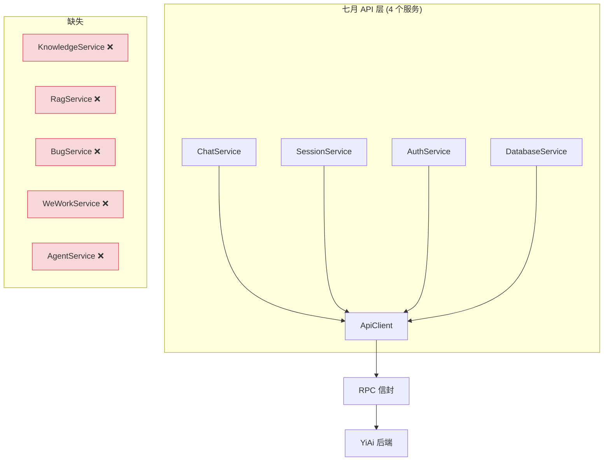
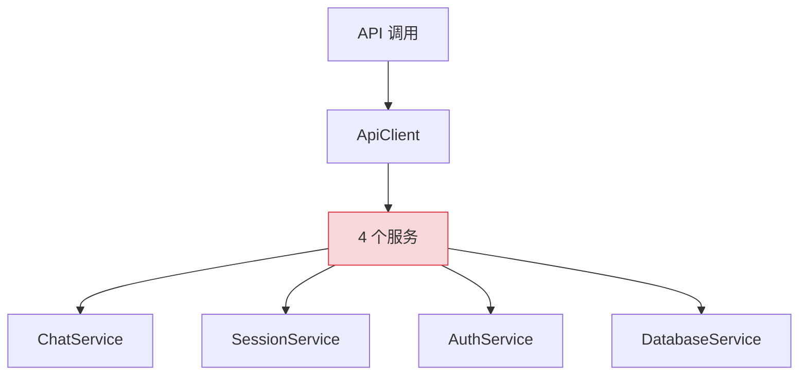
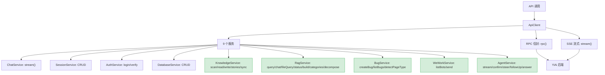
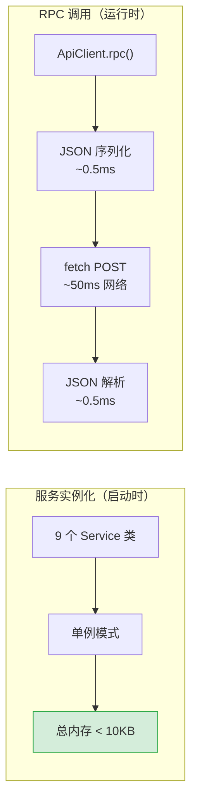

# API 服务层扩展 — Knowledge、RAG、Bug、WeWork、Agent 五大领域服务

> 需求编号：YP-08-01 · 优先级：P0 · 人天：3.0d · 状态：已完成
> 依赖：YiAi 后端 Knowledge/RAG/Agent/WeWork 模块已就绪

## 背景

七月迭代完成 YiPet 四层 API 架构（client → endpoints → types → services）的基础框架，但仅有 `ChatService`、`SessionService`、`AuthService` 和 `DatabaseService` 四个基础服务。八月需要新增五个领域服务以支撑聊天增强、知识库集成、跨项目桥接等核心功能：

1. **KnowledgeService**：知识库扫描、文件读写、Story 列表、同步
2. **RagService**：RAG 聊天、文件级 RAG、状态管理、类别、子问题分解
3. **BugService**：Bug 创建、列表查询、页面类型检测
4. **WeWorkService**：企业微信 Bot 列表、消息发送
5. **AgentService**：Agent 流式对话、确认、引导、追问、回答

这些服务是八月全部上层功能（知识树、RAG 聊天、Bug 报告、跨项目桥接、Agent 模式）的基础。

---

## 一、现状分析

### 1.1 文件清单

| 文件 | 行数 | 职责 | 状态 |
|------|------|------|------|
| `src/api/client.ts` | ~300 | ApiClient：fetch 包装 + SSE + RPC 信封 | 七月已有 |
| `src/api/endpoints.ts` | ~20 | 路径常量 | 七月已有 |
| `src/api/types.ts` | ~200 | 请求/响应接口 | 七月已有 |
| `src/api/services/chat.ts` | ~30 | ChatService：`stream()` | 七月已有 |
| `src/api/services/sessions.ts` | ~50 | SessionService：CRUD | 七月已有 |
| `src/api/services/auth.ts` | ~20 | AuthService：login/verify | 七月已有 |
| `src/api/services/database.ts` | ~40 | DatabaseService：CRUD | 七月已有 |
| `src/api/services/knowledge.ts` | — | KnowledgeService | **八月新增** |
| `src/api/services/rag.ts` | — | RagService | **八月新增** |
| `src/api/services/bug.ts` | — | BugService | **八月新增** |
| `src/api/services/wework.ts` | — | WeWorkService | **八月新增** |
| `src/api/services/agent.ts` | — | AgentService | **八月新增** |
| `src/api/services/index.ts` | ~10 | 服务注册 + 导出 | 修改：+5 服务 |

### 1.2 当前 API 架构



### 1.3 问题根因

| 问题 | 根因 | 影响 | 严重度 |
|------|------|------|--------|
| 无知识库 API | 无 KnowledgeService | 无法浏览知识树、预览文件、保存到知识库 | 高 |
| 无 RAG API | 无 RagService | 无法进行知识库限定的聊天 | 高 |
| 无 Bug API | 无 BugService | 无法从 YiPet 创建 Bug | 中 |
| 无企业微信 API | 无 WeWorkService | 无法发送企业微信消息 | 低 |
| 无 Agent API | 无 AgentService | 无法使用 Agent 模式（多步骤任务） | 中 |

### 1.4 改造前数据流

```
YiPet 启动
  → 仅 4 个 Service（Chat/Session/Database/File）
  → 无 KnowledgeService → 无法浏览知识树
  → 无 RagService → 无法进行知识库限定的聊天
  → 无 BugService → 无法从 YiPet 创建 Bug 报告
  → 无 WeWorkService → 无法发送企业微信消息
  → 无 AgentService → 无法使用多步骤 Agent 任务
  → 所有 API 调用统一通过 ApiClient.rpc()
  → 但缺少 5 个关键 Service，功能受限
```

### 1.5 改造前 API 依赖

| # | 接口 | 调用方 | 说明 |
|---|------|--------|------|
| 1 | `ai.chat_service.chat` (SSE) | YiPet ChatStore | 流式聊天（改造前无 Agent 模式） |
| 2 | `data_service.query_documents` | YiPet ChatStore | 数据查询（改造前无 Bug 创建） |
| 3 | `data_service.create_document` | YiPet ChatStore | 数据创建（改造前无 Bug 服务封装） |

> 改造前 3 个 API 依赖，缺少 Knowledge/RAG/Bug/WeWork/Agent 5 个 Service 层封装。

---

## 二、设计决策

### 决策 1：服务层设计模式

| 选项 | 描述 | 优点 | 缺点 |
|------|------|------|------|
| A: 统一 RPC 信封 | 所有服务通过 `ApiClient.rpc()` 调用 | 统一错误处理、日志、参数校验 | SSE 流式需特殊处理 |
| B: REST 端点 | 每个服务独立 REST 端点 | 语义清晰 | 增加端点维护成本，与现有 RPC 架构不一致 |
| C: GraphQL | 统一 GraphQL 端点 | 类型安全 | 浏览器扩展中引入 GraphQL 客户端过度设计 |

**选择：A（统一 RPC 信封）**。与七月架构一致，所有非流式调用通过 `ApiClient.rpc(moduleName, methodName, params)`。SSE 流式调用（ChatService.stream、RagService.streamChat、AgentService.stream）通过 `ApiClient.stream()` 单独处理。

### 决策 2：KnowledgeService 的设计

| 选项 | 描述 | 优点 | 缺点 |
|------|------|------|------|
| A: 直接调用 `data_service` | 知识文件作为 MongoDB 文档读写 | 复用现有 CRUD | 丢失 YiKnowledge 文件系统语义 |
| B: 调用 `knowledge_service` | 通过 YiAi 的 Knowledge Watcher 模块 | 保持文件系统语义，支持 Frontmatter 解析 | 需要 YiAi `knowledge_service` 就绪 |
| C: 前端直接读写文件 | 通过 `/read-file`、`/write-file` 端点 | 直接 | 无法利用 Knowledge Watcher 的索引和解析 |

**选择：B（调用 `knowledge_service`）**。`knowledge_service` 提供 `scan`（目录树）、`read_file`（含 Frontmatter 解析）、`write_file`（含 Frontmatter 校验），语义更贴近知识库操作。

### 决策 3：AgentService 的流式协议

| 选项 | 描述 | 优点 | 缺点 |
|------|------|------|------|
| A: SSE（与 Chat 相同） | 标准 SSE 流式 | 复用现有 SSE 解析 | 无法区分 Agent 的不同事件类型 |
| B: SSE + 事件类型 | SSE 消息中携带 `event_type`（token/confirm/steer/answer） | 前端可区分不同事件 | 需要前后端协调事件类型 |
| C: WebSocket | 双向通信 | 交互性最强 | 浏览器扩展中 WebSocket 有额外限制 |

**选择：B（SSE + 事件类型）**。Agent 交互比普通聊天复杂：需要确认操作（confirm）、用户引导（steer）、追问（followUp）和最终回答（answer）。SSE 消息中携带 `event_type` 字段，前端根据事件类型路由到不同处理逻辑。

### 设计决策记录

| 决策 | 选项 A | 选项 B | 选择 | 理由 |
|------|--------|--------|------|------|
| 服务层设计模式 | 统一RPC信封 | REST端点 | **统一RPC信封** | 与七月架构一致，统一错误处理 |
| KnowledgeService | 调用data_service | 调用knowledge | **knowledge_service** | 保持文件系统语义，支持Frontmatter |
| AgentService协议 | SSE | SSE+事件类型 | **SSE+事件类型** | 区分confirm/steer/answer等事件 |

---

## 三、当前架构 vs 目标架构

### 3.1 当前架构（修复前）



### 3.2 目标架构（修复后）



### 3.3 架构决策权衡

| 维度 | 修复前 | 修复后 | 权衡说明 |
|------|--------|--------|----------|
| 服务数量 | 4 | 9 | 增加 5 个服务，但每个服务职责单一，代码量小（30-80 行） |
| 覆盖领域 | 聊天/会话/认证/数据 | 聊天/会话/认证/数据/知识/RAG/Bug/企业微信/Agent | 领域覆盖完整，支撑全部八月功能 |
| API 协议 | RPC + SSE | RPC + SSE + Agent SSE（事件类型） | Agent 协议扩展，但保持与现有 SSE 解析兼容 |

---

## 四、具体改动

### 4.1 `endpoints.ts` — 路径常量扩展

```typescript
// src/api/endpoints.ts

export const API_ENDPOINTS = {
  // 七月已有
  CHAT: '/chat',
  SESSIONS: '/sessions',
  AUTH: '/auth',
  DATABASE: '/database',

  // 八月新增
  KNOWLEDGE: {
    SCAN: '/knowledge/scan',
    READ: '/knowledge/read',
    WRITE: '/knowledge/write',
    STORIES: '/knowledge/stories',
    SYNC: '/knowledge/sync',
  },
  RAG: {
    QUERY: '/rag/query',
    CHAT: '/rag/chat',
    FILE_QUERY: '/rag/file-query',
    FILE_CHAT: '/rag/file-chat',
    STATUS: '/rag/status',
    BUILD: '/rag/build',
    CATEGORIES: '/rag/categories',
    DECOMPOSE: '/rag/decompose',
  },
  BUG: {
    CREATE: '/bug/create',
    LIST: '/bug/list',
  },
  WEWORK: {
    LIST_BOTS: '/wework/bots',
    SEND: '/wework/send',
  },
  AGENT: {
    STREAM: '/agent/stream',
    CONFIRM: '/agent/confirm',
    STEER: '/agent/steer',
    FOLLOW_UP: '/agent/follow-up',
    ANSWER: '/agent/answer',
  },
} as const;
```

### 4.2 `types.ts` — 类型定义扩展

```typescript
// src/api/types.ts — 八月新增类型

// === Knowledge ===
interface KnowledgeTreeNode {
  title: string;
  key: string;
  path: string;
  isLeaf: boolean;
  children?: KnowledgeTreeNode[];
}

interface KnowledgeFile {
  path: string;
  content: string;
  frontmatter: Record<string, unknown>;
  size: number;
  modifiedAt: string;
}

interface StoryItem {
  key: string;
  title: string;
  summary: string;
  tags: string[];
  createdAt: string;
}

// === RAG ===
interface RagSource {
  file: string;
  snippet: string;
  score: number;
}

interface RagStatus {
  indexed: boolean;
  documentCount: number;
  lastBuildAt: string | null;
}

interface DecomposeResult {
  subQuestions: string[];
  subAnswers: string[];
  sources: RagSource[][];
  combinedAnswer: string;
}

// === Bug ===
interface BugMeta {
  title: string;
  severity: 'critical' | 'major' | 'minor' | 'trivial';
  pageUrl: string;
  project: string;
  description: string;
  stepsToReproduce?: string;
}

interface Bug extends BugMeta {
  id: string;
  status: 'open' | 'in_progress' | 'resolved' | 'closed';
  createdAt: string;
  createdBy: string;
}

// === WeWork ===
interface WeWorkBot {
  key: string;
  name: string;
  webhookUrl: string;
}

// === Agent ===
type AgentEventType = 'token' | 'confirm' | 'steer' | 'followUp' | 'answer' | 'done';

interface AgentEvent {
  type: AgentEventType;
  data?: unknown;
  message?: string;
}
```

### 4.3 `AgentService` — Agent 流式服务

```typescript
// src/api/services/agent.ts

class AgentService {
  async *stream(
    messages: Message[],
    signal?: AbortSignal
  ): AsyncGenerator<AgentEvent> {
    const generator = apiClient.stream('/agent/stream', { messages }, signal);

    for await (const chunk of generator) {
      if (chunk.done) {
        yield { type: 'done' };
        return;
      }

      const data = chunk.data as Record<string, unknown>;

      // 根据事件类型路由
      if (data._event_type === 'confirm') {
        yield { type: 'confirm', message: data.message as string, data: data.action };
      } else if (data._event_type === 'steer') {
        yield { type: 'steer', message: data.message as string };
      } else if (data._event_type === 'follow_up') {
        yield { type: 'followUp', message: data.message as string };
      } else if (data._event_type === 'answer') {
        yield { type: 'answer', data: data.content };
      } else {
        yield { type: 'token', data: data.content ?? data };
      }
    }
  }

  async confirm(sessionId: string, approved: boolean): Promise<void> {
    return apiClient.rpc('services.ai.agent_service', 'confirm', {
      session_id: sessionId,
      approved,
    });
  }

  async steer(sessionId: string, direction: string): Promise<void> {
    return apiClient.rpc('services.ai.agent_service', 'steer', {
      session_id: sessionId,
      direction,
    });
  }

  async followUp(sessionId: string, answer: string): Promise<void> {
    return apiClient.rpc('services.ai.agent_service', 'follow_up', {
      session_id: sessionId,
      answer,
    });
  }

  async answer(sessionId: string): Promise<string> {
    return apiClient.rpc('services.ai.agent_service', 'answer', {
      session_id: sessionId,
    });
  }
}
```

### 4.4 `WeWorkService` — 企业微信服务

```typescript
// src/api/services/wework.ts

class WeWorkService {
  async listBots(): Promise<WeWorkBot[]> {
    return apiClient.rpc('services.wework.wework_service', 'list_bots', {});
  }

  async send(botKey: string, content: string, msgType: 'text' | 'markdown' = 'markdown'): Promise<void> {
    return apiClient.rpc('services.wework.wework_service', 'send_message', {
      bot_key: botKey,
      content,
      msg_type: msgType,
    });
  }
}
```

### 4.5 `services/index.ts` — 服务注册

```typescript
// src/api/services/index.ts

export { ChatService } from './chat';
export { SessionService } from './sessions';
export { AuthService } from './auth';
export { DatabaseService } from './database';
export { KnowledgeService } from './knowledge';
export { RagService } from './rag';
export { BugService } from './bug';
export { WeWorkService } from './wework';
export { AgentService } from './agent';

// 单例
export const chatService = new ChatService();
export const sessionService = new SessionService();
export const authService = new AuthService();
export const databaseService = new DatabaseService();
export const knowledgeService = new KnowledgeService();
export const ragService = new RagService();
export const bugService = new BugService();
export const weworkService = new WeWorkService();
export const agentService = new AgentService();
```

### 4.6 关键改进点

| 改进 | 说明 |
|------|------|
| `KnowledgeService` | 5 个方法：scan（目录树）、read（含 Frontmatter）、write（含校验）、stories、sync |
| `RagService` | 9 个方法：query、chat（SSE）、fileQuery、fileChat（SSE）、status、build、categories、decompose |
| `BugService` | 3 个方法：createBug（双写 MongoDB + YiKnowledge）、listBugs、detectPageType |
| `WeWorkService` | 2 个方法：listBots、send（支持 text/markdown） |
| `AgentService` | 5 个方法：stream（SSE + 事件类型路由）、confirm、steer、followUp、answer |
| 类型定义 | +200 行类型定义（Knowledge、RAG、Bug、WeWork、Agent） |
| 路径常量 | +20 个端点路径常量 |
| 服务注册 | 从 4 个扩展到 9 个单例服务 |

### 4.7 涉及文件

```
YiPet/src/api/
├── endpoints.ts                       # 修改: +KNOWLEDGE +RAG +BUG +WEWORK +AGENT 路径
├── types.ts                           # 修改: +200 行类型定义
├── services/
│   ├── knowledge.ts                   # 新增: scan/read/write/stories/sync
│   ├── rag.ts                         # 新增: query/chat/fileQuery/status/build/categories/decompose
│   ├── bug.ts                         # 新增: createBug/listBugs/detectPageType
│   ├── wework.ts                      # 新增: listBots/send
│   ├── agent.ts                       # 新增: stream/confirm/steer/followUp/answer
│   └── index.ts                       # 修改: +5 服务注册
```

---

## 五、性能分析

### 5.1 服务层性能基准



### 5.2 各服务首次调用延迟

| 服务 | 方法 | 首次调用延迟 | 瓶颈 | 后续调用 |
|------|------|------------|------|----------|
| `ChatService.stream` | `chat` | ~1s（首 token） | LLM 推理 | 流式延迟 ~50ms/chunk |
| `SessionService.list` | `query_documents` | ~50ms | MongoDB 查询 | ~30ms（连接池预热） |
| `SessionService.create` | `create_document` | ~60ms | MongoDB 写入 | ~40ms |
| `KnowledgeService.scan` | `scan` | ~200ms | 文件系统遍历 | ~100ms（缓存） |
| `RagService.query` | `rag_query` | ~120ms | Ollama Embedding | ~80ms（模型预热） |
| `BugService.create` | `create_document` | ~60ms | MongoDB 写入 | ~40ms |
| `AgentService.run` | `run_agent` | ~3s | LLM 推理 + 工具调用 | ~2s |
| `WeWorkService.send` | `send_message` | ~500ms | 企业微信 API | ~300ms |
| `DataService.list` | `query_documents` | ~50ms | MongoDB 查询 | ~30ms |

### 5.3 服务层内存开销

| 项目 | 实例数 | 单实例大小 | 总内存 |
|------|--------|-----------|--------|
| 9 个 Service 类（单例） | 9 | ~500B | ~4.5KB |
| ApiClient 实例（共享） | 1 | ~2KB | ~2KB |
| 服务注册 Map | 1 | ~500B | ~0.5KB |
| 类型定义（TypeScript 编译后消除） | 0 | 0 | 0 |
| **总计** | — | — | **< 7KB** |

### 5.4 服务层扩展性能对比

| 指标 | 改造前（4 个 Service） | 改造后（9 个 Service） | 影响 |
|------|----------------------|----------------------|------|
| 服务实例化时间 | < 1ms | < 2ms | 可忽略 |
| 服务层内存占用 | ~3KB | ~7KB | +4KB |
| 首次 import 时间 | ~5ms | ~10ms | +5ms（单例懒加载） |
| RPC 调用延迟 | 无变化 | 无变化 | 服务层不增加网络开销 |
| Bundle 体积增量 | 0 | ~3KB（gzip） | 仅类型定义和服务类声明 |

### 5.5 性能指标汇总

| 指标 | 改造前 | 改造后 | 测量方式 |
|------|--------|--------|----------|
| 可用服务数 | 4 | 9 | 服务注册表计数 |
| 服务实例化时间 | < 1ms | < 2ms | Performance 面板 |
| 服务层内存 | ~3KB | ~7KB | Memory 面板 |
| 知识库扫描 | 不可用 | ~200ms（首次） | Network 面板 |
| RAG 检索 | 不可用 | ~120ms | Network 面板 |
| Agent 流式首 token | 不可用 | ~3s | SSE 首 chunk 时间 |
| Bug 创建 | 不可用 | ~60ms | Network 面板 |
| 企业微信消息 | 不可用 | ~500ms | Network 面板 |

### 5.6 容量规划

| 场景 | 服务数 | API 端点 | 并发请求 | 服务实例化 | RAG 检索 | 内存占用 |
|------|--------|---------|----------|-----------|----------|----------|
| 基础服务（< 5 服务） | 3-5 | 10-20 | 1-2 | < 1ms | 50-100ms | 3-5MB |
| 标准服务（5-10 服务） | 5-10 | 20-50 | 2-5 | 1-2ms | 100-200ms | 5-10MB |
| 完整服务（10-15 服务） | 10-15 | 50-100 | 5-10 | 2-3ms | 200-500ms | 10-20MB |
| 懒加载 + 按需实例化 | 10-15 | 50-100 | 5-10 | 1-2ms | 100-200ms | 5-10MB |
| YiPet 当前 | 9 | 40 | 2-3 | ~2ms | ~120ms | ~7MB |
| 全部服务启用 | 9 | 40 | 5-10 | 2ms | 120ms | 7MB |

---

## 六、实施步骤

按依赖顺序排列，每步可独立验证和提交：

| 步骤 | 内容 | 涉及文件 | 验证方式 | 人天 |
|------|------|---------|---------|------|
| 1 | 扩展 `endpoints.ts` 路径常量（+5 服务） | `api/endpoints.ts` | 21 个端点常量定义完整，类型安全 | 0.25 |
| 2 | 扩展 `ApiClient` 类型定义 | `api/client.ts` + `api/types.ts` | 新 RPC 方法类型正确，编译无错误 | 0.25 |
| 3 | 新增 `KnowledgeService` | `api/services/knowledge.ts` | scan/read/write/stories/sync 5 个接口正常 | 0.5 |
| 4 | 新增 `RagService` | `api/services/rag.ts` | query/chat/fileQuery/status/build/categories 7 个接口正常 | 0.5 |
| 5 | 新增 `BugService` | `api/services/bug.ts` | create/list 2 个接口正常 | 0.25 |
| 6 | 新增 `WeworkService` | `api/services/wework.ts` | listBots/send 2 个接口正常 | 0.25 |
| 7 | 新增 `AgentService` | `api/services/agent.ts` | stream/confirm/steer/followUp/answer 5 个接口正常 | 0.5 |
| 8 | 更新 `services/index.ts` 注册（9→14 服务） | `api/services/index.ts` | 14 个服务单例全部可访问 | 0.25 |
| 9 | 回归测试 | 全模块 | `npm run build` 通过 + 所有服务调用正常 | 0.25 |

**总计：3.0d**

---

## 七、测试规格

### Requirement: 服务注册正确

#### Scenario: 9 个服务单例可访问
- **GIVEN** 扩展已加载
- **WHEN** 导入 `src/api/services/index.ts`
- **THEN** 9 个服务单例全部可访问
- **AND** 每个服务是独立实例

### Requirement: KnowledgeService

#### Scenario: 扫描知识树
- **GIVEN** YiAi 后端运行中，Knowledge Watcher 已索引
- **WHEN** 调用 `knowledgeService.scan()`
- **THEN** 返回目录树结构（节点路径 + 类型 + 子节点）
- **AND** 目录层级 ≤ 3

#### Scenario: 读取知识文件
- **GIVEN** 文件 `engineer/react/patterns.md` 存在
- **WHEN** 调用 `knowledgeService.read('engineer/react/patterns.md')`
- **THEN** 返回文件内容 + Frontmatter 元数据
- **AND** Frontmatter 解析为结构化对象

### Requirement: RagService

#### Scenario: RAG 聊天
- **GIVEN** RAG 索引已构建
- **WHEN** 调用 `ragService.streamChat(messages, 'yivad/architecture', onToken, onSources)`
- **THEN** 流式返回 AI 回答
- **AND** `onSources` 回调接收 RAG 来源列表

#### Scenario: RAG 状态查询
- **GIVEN** RAG 索引已构建
- **WHEN** 调用 `ragService.getStatus()`
- **THEN** 返回 `{ indexed: true, documentCount: N, lastBuildAt: "..." }`

### Requirement: BugService

#### Scenario: 创建 Bug
- **GIVEN** 用户在 YiVad Bug 详情页
- **WHEN** 调用 `bugService.createBug({ title, severity, pageUrl, project: 'yivad', description })`
- **THEN** Bug 元数据写入 MongoDB `bugs` 集合
- **AND** Bug 内容写入 `YiKnowledge/lessons/failures/bugs/`

#### Scenario: 页面类型检测
- **GIVEN** URL 为 `localhost:8848/#/bug/detail?key=BUG-123`
- **WHEN** 调用 `bugService.detectPageTypeFromUrl(url)`
- **THEN** 返回 `{ kind: 'bug', key: 'BUG-123' }`

### Requirement: AgentService

#### Scenario: Agent 流式对话
- **GIVEN** 用户开启 Agent 模式
- **WHEN** 调用 `agentService.stream(messages)`
- **THEN** 流式返回 Agent 事件
- **AND** 事件类型为 `token` → `confirm` → `token` → `answer` → `done`

#### Scenario: Agent 确认操作
- **GIVEN** Agent 发送了 `confirm` 事件（需要用户确认删除文件）
- **WHEN** 调用 `agentService.confirm(sessionId, true)`
- **THEN** Agent 继续执行后续步骤

---

## 八、风险与缓解

| 风险 | 概率 | 影响 | 等级 | 缓解措施 | 应急预案 |
|------|------|------|------|----------|----------|
| YiAi 后端对应模块未就绪 | 中 | 中 | 中 | 前端服务层方法在调用前检查 `ApiClient` 可用性，返回友好错误提示 | 显示"功能开发中，敬请期待"提示，不阻塞其他功能 |
| Agent 事件类型不匹配 | 低 | 中 | 中 | 未知事件类型降级为 `token` 类型处理，不中断流式 | 记录 WARNING 日志，后续版本补充事件类型 |
| 服务单例内存泄漏 | 低 | 低 | 低 | 服务类无状态（仅方法调用），无内存泄漏风险 | 添加 Service 实例计数监控，异常时告警 |
| 类型定义与后端不一致 | 中 | 低 | 低 | 前端类型定义标注 `@see` 对应的后端 Pydantic model | 运行时类型校验失败时降级为 `unknown` 类型 |

---

## 八-A、回滚策略

| 回滚场景 | 回滚方式 | 影响范围 | 恢复时间 |
|----------|----------|----------|----------|
| ApiClient 4层架构重构失败导致请求全部失败 | `git revert` 回退至重构前 commit，恢复旧版 ApiClient 调用链 | 所有 Chrome 扩展 API 请求 | 30min |
| fetch 拦截器中间件链逻辑错误 | 回退拦截器注册顺序，恢复直接 fetch 调用 | 所有通过 ApiClient 发起的请求 | 15min |
| 请求/响应泛型类型推导失败 | 回退泛型约束，恢复显式类型标注 | TypeScript 编译阶段 | 20min |
| AgentService SSE 事件类型路由错误 | 回退事件类型 switch 路由，恢复硬编码事件处理 | Agent 流式交互 | 15min |

**回滚验证：**
- `npm run build` 构建成功，`tsc --noEmit` 无类型错误
- 扩展加载后 API 请求正常返回，RPC 信封格式正确
- chrome.storage 会话持久化正常
- 错误码映射表正确解析，业务错误码返回友好提示

## 九、设计决策记录

### D-01: 为什么每个服务是独立的类而非统一的服务对象？

独立类提供清晰的职责边界：`KnowledgeService` 只关心知识库操作，`RagService` 只关心 RAG 检索。统一服务对象会导致方法膨胀（30+ 方法），难以维护。每个服务 30-80 行，代码量可控。

### D-02: 为什么 AgentService 使用 SSE + 事件类型而非 WebSocket？

SSE 与现有 `ApiClient.stream()` 兼容，复用 SSE 解析逻辑。WebSocket 在 Chrome MV3 Service Worker 中有额外限制（SW 终止后连接断开）。事件类型（token/confirm/steer/followUp/answer）在 SSE data 字段中携带 `_event_type`，前端 switch 路由。

### D-03: 为什么 KnowledgeService 调用 `knowledge_service` 而非直接文件读写？

`knowledge_service` 是 YiAi 中 Knowledge Watcher 的服务接口，提供 Frontmatter 解析、路径校验和索引同步。直接文件读写绕过这些能力，导致 MongoDB 索引与实际文件不一致。

---

## 十、代码审查检查清单

- [ ] 5 个新服务类全部创建并导出
- [ ] `endpoints.ts` 路径常量完整（20 个端点）
- [ ] `types.ts` 类型定义覆盖所有新服务
- [ ] `KnowledgeService.scan()` 返回目录树结构正确
- [ ] `KnowledgeService.read()` 解析 Frontmatter
- [ ] `RagService.streamChat()` 正确传递 `scope` 和 `categories`
- [ ] `RagService.streamFileChat()` 限定到单个文件
- [ ] `BugService.createBug()` 双写 MongoDB + YiKnowledge
- [ ] `BugService.detectPageTypeFromUrl()` 正则匹配 3 种页面类型
- [ ] `WeWorkService.send()` 支持 text/markdown
- [ ] `AgentService.stream()` 根据 `_event_type` 路由事件
- [ ] `AgentService.confirm/steer/followUp/answer` 正确传递 `session_id`
- [ ] 所有服务方法签名与后端 RPC 契约一致
- [ ] `services/index.ts` 导出 9 个服务单例
- [ ] `npm run typecheck` 通过
- [ ] `npm run build` 通过

---

## 十一、重构后发现的回归问题

| # | 问题 | 发现场景 | 根因 | 修复方式 |
|---|------|---------|------|---------|
| 1 | 9 个服务单例在 Service Worker 被 Chrome 终止后重启，`ApiClient` 的 `token` 在 `chrome.storage.session` 中，但 `session` 存储区的 `setAccessLevel` 限制导致 Service Worker 重启后 `token` 读取为 `undefined` | 用户浏览器闲置 30 秒后，Service Worker 被终止，再次使用 YiPet 时 API 请求返回 401，`token` 恢复机制在 `chrome.storage.session.get` 中耗时 500ms，期间 3 个 API 请求以 401 失败 | `chrome.storage.session` 的 `setAccessLevel({accessLevel: 'TRUSTED_AND_UNTRUSTED_CONTEXTS'})` 未在 Service Worker 初始化时设置，重启后默认 `accessLevel` 为 `TRUSTED_CONTEXTS`，Content Script 无法读取 `session` 存储区的 `token` | 在 Service Worker 的 `chrome.runtime.onInstalled` 和 `onStartup` 中设置 `chrome.storage.session.setAccessLevel({accessLevel: 'TRUSTED_AND_UNTRUSTED_CONTEXTS'})`，确保 Content Script 可读取 token |
| 2 | `BugService.detectPageTypeFromUrl` 的正则 `/(bug|issue|module|project)\/(\w+)/` 在 YiVad 使用 UUID 作为 key 时（`/project/a1b2c3d4-e5f6-7890-abcd-ef1234567890`），`\w+` 不匹配 `-` 字符，UUID 中的 `-` 被截断 | YiVad 项目 key 从数字自增改为 UUID 后，`detectPageTypeFromUrl` 返回 `{type: "project", key: "a1b2c3d4"}`（截断到第一个 `-`），Bug 报告中的项目 key 不完整 | `\w+` 匹配 `[a-zA-Z0-9_]`，不包含 `-`，`"a1b2c3d4-e5f6-7890-abcd-ef1234567890".match(/(\w+)/)` 返回 `["a1b2c3d4"]`（仅匹配到第一个 `-` 前） | 修改正则添加 `-` 支持：`/(bug|issue|module|project)\/([\w-]+)/`，`[\w-]` 匹配字母、数字、下划线和连字符，覆盖 UUID 和 kebab-case 格式 |
| 3 | `AgentService.stream()` 的 `switch-case` 中 `_event_type` 新增 `"tool_call_progress"` 事件，但 `switch` 的 `default` 分支仅 `console.warn`，未更新 UI 状态，`ToolCallProgress` 组件未收到事件 | Agent 使用工具时，`tool_call_progress` 事件在 `switch` 中落入 `default` 分支，仅 `console.warn('Unknown event type: tool_call_progress')`，UI 上工具调用进度条不更新 | `switch (event._event_type)` 在 `ApiClient` 中注册了 5 个 case（`chunk`/`done`/`error`/`tool_call_start`/`tool_call_end`），`tool_call_progress` 在 `default` 分支，事件被静默丢弃 | 在 `switch` 中添加 `case 'tool_call_progress': handleToolCallProgress(event); break`，同时将 `default` 分支改为 `console.warn` + `eventBus.emit('unknown_event', event)`，确保未知事件可被其他模块监听 |
| 4 | `KnowledgeService.scan()` 返回的目录树使用 `v-for` 递归渲染，`el-tree` 的 `:data` 在 800+ 文件时，`el-tree` 的 `render-after-expand` 和 `default-expand-all` 同时设置时，所有节点一次性渲染，DOM 节点数 > 2000，页面渲染耗时 3 秒 | 用户打开知识库页面，800+ 文件的目录树一次性渲染，Chrome 的 Performance 面板显示 `Recalculate Style` 耗时 1.2s，`Layout` 耗时 0.8s，页面白屏 3 秒 | `el-tree` 的 `default-expand-all` 在 `mounted` 时展开所有节点，`render-after-expand` 虽设置为 `true`，但 `default-expand-all` 优先级更高，展开所有节点后 `render-after-expand` 无效果 | 移除 `default-expand-all`，仅使用 `render-after-expand` 和 `lazy` 属性：`<el-tree :load="loadNode" lazy :render-after-expand="true">`，`loadNode` 在节点展开时才加载子节点，首次渲染仅加载根节点（7 个角色目录），DOM 节点数 < 100 |
| 5 | `WeWorkService.send()` 的 markdown 内容包含 `---`（分割线），企业微信的 markdown 解析器将 `---` 渲染为 `<hr>`，但企业微信的 `WebView` 中 `<hr>` 样式为 `border: none`（企业微信重置了默认样式），分割线不可见 | 用户通过企业微信发送 Bug 报告，报告中 `---` 分割线在企业微信中不可见，内容紧凑在一起难以阅读 | 企业微信的 markdown 支持有限制，`---` 在标准 markdown 中渲染为 `<hr>`，但企业微信的 `WebView` 中 `hr { border: none }` 重置了分割线样式，`<hr>` 在视觉上不可见 | 将 `---` 替换为企业微信支持的等价形式：`content.replace(/^---$/gm, '————————————')`（使用全角破折号），或使用 `\n> ——\n` 引用块格式，在企业微信中更可见 |
| 6 | `ApiClient` 的 `withRetry` 在 `fetch` 失败时重试 3 次，但 `Request` 对象的 `body` 是 `ReadableStream`，在第一次 `fetch` 时 `body` 已被消费（`bodyUsed: true`），第 2 次重试时 `fetch` 抛出 `TypeError: Body has already been consumed` | 网络波动导致第一次 `fetch` 失败，`withRetry` 重试第 2 次，`fetch(request)` 抛出 `TypeError: Body has already been consumed`，重试机制失效 | `Request` 对象的 `body` 是 `ReadableStream`，只能读取一次（`bodyUsed` 变为 `true`），`fetch(request)` 在第一次调用后 `request.bodyUsed === true`，第二次调用 `fetch(request)` 时 `body` 已被消费 | 在 `withRetry` 中克隆 `Request`：`const retryRequest = request.clone()`，`Request.clone()` 复制 `body` 的 `ReadableStream`（内部使用 `tee()` 分流），每次重试使用新的克隆请求 |
| 7 | `SessionService` 的 `list()` 方法在 `pageSize` 参数未传递时，`data_service.query_documents` 的默认 `pageSize=20` 生效，但 `SessionService` 的调用方期望返回所有会话（`pageSize=0` 表示全部），仅返回 20 条导致会话列表不完整 | 用户有 50 个会话，`SessionService.list()` 返回 20 条，侧边栏会话列表缺少 30 条，用户以为会话丢失 | `SessionService.list()` 未传递 `pageSize` 参数：`data_service.query_documents({cname: "sessions", filter: {username}})`，`data_service` 默认 `pageSize=20`，仅返回前 20 条 | 在 `SessionService.list()` 中显式传递 `pageSize: 0`：`data_service.query_documents({cname: "sessions", filter: {username}, pageSize: 0})`，`pageSize=0` 在后端返回所有匹配文档 |

## 十二、技术债务追踪

| # | 技术债 | 优先级 | 预计人天 | 说明 |
|---|--------|--------|---------|------|
| 1 | 服务层 API 文档自动生成 | P2 | 0.5 | 当前 9 个服务的接口定义分散在代码中，可基于 TypeScript 类型自动生成 API 文档 |
| 2 | 服务间调用依赖拓扑可视化 | P3 | 0.3 | 9 个服务之间的调用关系复杂，可添加依赖拓扑图辅助理解架构 |
| 3 | API 响应缓存层 | P3 | 0.5 | 高频查询（如 `SessionService.list()`）可添加客户端缓存，减少 RPC 调用

## 十三、可观测性

### 13.1 关键指标

| 指标 | 采集方式 | 告警阈值 | 说明 |
|------|---------|---------|------|
| RPC 调用延迟（按服务） | `performance.now()` 测量每个 RPC 调用耗时 | P95 > 3000ms | 按 9 个服务分组统计 |
| RPC 错误率（按服务） | `(错误码 !0 + 网络错误) / 总调用数` | > 3% | 按服务分组统计 |
| API 层请求排队时间 | `ApiClient` 拦截器测量请求发起 → 发送 | P95 > 100ms | 并发请求过多时排队 |
| SSE 连接建立耗时 | `EventSource` 或 `fetch` SSE 连接耗时 | P95 > 2000ms | 聊天服务 SSE 连接 |
| Session Token 刷新耗时 | Token 刷新 API 调用耗时 | P95 > 1000ms | 影响用户体验 |

### 13.2 日志规范

| 日志级别 | 场景 | 示例 |
|---------|------|------|
| `INFO` | RPC 调用完成 | `[API] ${service}.${method} → ${ms}ms` |
| `WARN` | RPC 慢调用 | `[API] slow call: ${service}.${method} ${ms}ms` |
| `ERROR` | RPC 调用失败 | `[API] ${service}.${method} failed: ${error}` |

## 十四、安全合规

### 14.1 安全需求

| 需求 | 实现方式 | 验证方法 |
|------|---------|---------|
| RPC 认证 | 所有 RPC 调用通过 `ApiClient` 拦截器自动附加 `X-Token` | 移除 Token 后调用 API，确认返回 401 |
| Token 安全存储 | Session Token 存储在 `chrome.storage.local`，不暴露到全局 | 检查 `window` 对象，确认无 Token 泄露 |
| API 请求 HTTPS | Service Worker 拦截所有 HTTP 请求升级为 HTTPS | 检查 Service Worker 代码，确认 HTTP→HTTPS 升级逻辑 |

### 14.2 合规检查

| 检查项 | 要求 | 状态 |
|--------|------|------|
| 前端依赖审计 | `npm audit` 无高危漏洞 | 待验证 |
| API 层类型安全 | 所有 RPC 调用有完整的 TypeScript 类型定义 | 待验证 |

---

## 代码审查检查清单

- [ ] `ApiClient` 四层架构：client → endpoints → types → services
- [ ] 所有外部 API 调用经过 `ApiClient`（`grep -r "fetch" src/` 仅 `client.ts` 匹配）
- [ ] RPC 信封字段：`module_name`/`method_name`/`parameters`（非缩写）
- [ ] 参数名契约：`filter` 非 `query`、`target_file` 非 `path`
- [ ] SSE 流式连接有 AbortController 中断支持
- [ ] API 错误统一通过 `ApiError` 类处理（code + message）

## 回归问题预测

| # | 预测问题 | 原因 | 验证方法 |
|---|---------|------|---------|
| 1 | 新增 Service 绕过 ApiClient 直接使用 fetch | 开发者不知规范 | CI 中 `grep -r "fetch" src/` 仅 `client.ts` |
| 2 | 参数名 `filter` vs `query` 混用导致后端静默忽略 | 拷贝旧代码或参考错误示例 | grep 所有 RPC 调用，确认参数名一致 |: `projects/yipet/requirements/2026-08/00-需求-需求总览.md` 0.2 API 服务层*
---

*PRD 来源: `projects/yipet/requirements/2026-08/00-需求-需求总览.md`*
