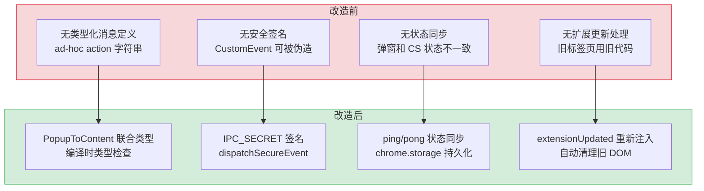
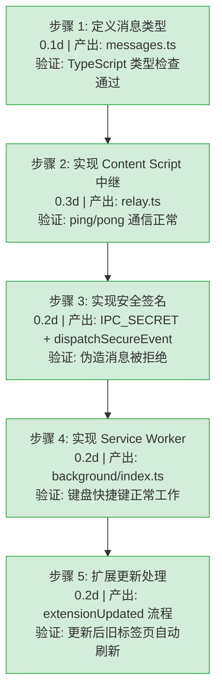

# YP-08-07: IPC 通信架构 — 双世界消息中继 + 安全签名 + 状态同步

> 需求编号：YP-08-07 · 优先级：P1 · 人天：1.0d · 状态：已完成
> 依赖：YP-07-05（Content Script 注入架构）

## 背景

YiPet 作为 Chrome MV3 扩展，运行在三个独立的执行上下文中：**Popup**（弹窗 UI）、**Content Script**（ISOLATED 世界，有 Chrome API 权限）、**MAIN 世界**（宿主页面 JavaScript 上下文，无 Chrome API 权限）。这三个上下文之间无法直接共享内存或调用函数，必须通过 Chrome 的 `chrome.runtime.sendMessage` / `chrome.tabs.sendMessage` API 进行消息传递。

此外，**Service Worker**（MV3 后台脚本）负责处理 `chrome.commands` 键盘快捷键，也需要与 Content Script 通信。

**核心挑战**：安全地将消息从 Popup/Service Worker 路由到 Content Script，再从 Content Script 跨世界边界传递到 MAIN 世界的 Vue 应用，同时防止宿主页面的恶意脚本伪造消息。

---

## 一、现状分析

### 1.1 四个执行上下文

```
┌─────────────────────────────────────────────────────┐
│ Chrome Extension Runtime                             │
│                                                     │
│  ┌──────────┐  chrome.tabs    ┌───────────────┐     │
│  │  Popup   │  .sendMessage   │Content Script │     │
│  │ Vue 3 UI │ ───────────────→│  (ISOLATED)   │     │
│  │          │ ←───────────────│               │     │
│  └──────────┘  sendResponse   └───────┬───────┘     │
│                                       │              │
│  ┌──────────┐  chrome.tabs           │ CustomEvent  │
│  │ Service  │  .sendMessage           │ + IPC_SECRET │
│  │ Worker   │ ───────────────────────→│              │
│  │ (MV3)    │                         ▼              │
│  └──────────┘               ┌───────────────┐       │
│                              │  MAIN World   │       │
│                              │  Vue Chat App │       │
│                              └───────────────┘       │
└─────────────────────────────────────────────────────┘
```

### 1.2 通信路径

| 路径 | 方向 | 机制 | 安全级别 |
|------|------|------|----------|
| Popup → Content Script | 单向 | `chrome.tabs.sendMessage(tabId, msg)` | Chrome API 保证 |
| Service Worker → Content Script | 单向 | `chrome.tabs.sendMessage(tabId, msg)` | Chrome API 保证 |
| Content Script → Popup | 响应 | `sendResponse(data)` | Chrome API 保证 |
| Content Script → MAIN World | 单向 | `window.dispatchEvent(CustomEvent)` | IPC_SECRET 签名验证 |
| Content Script → MAIN World | 双向 | `<script>` 注入 + `dataset` | 仅初始化时使用 |

### 1.3 改造前问题

| 问题 | 影响 | 严重程度 |
|------|------|----------|
| 无消息类型定义 | 消息格式不一致，`{ action: "something" }` 散落在各处 | 高 |
| 无安全签名 | MAIN 世界可被宿主页面恶意脚本伪造 CustomEvent | 高 |
| 无状态同步 | 弹窗和 Content Script 状态不一致 | 中 |
| 扩展更新后无重新注入 | 已打开的标签页使用旧版本代码 | 中 |

---

## 二、设计决策

### D-01: 为什么使用 IPC_SECRET 而非 postMessage 的 origin 校验？

`window.postMessage` 的 `origin` 校验可以防止跨域消息，但无法防止同源页面脚本伪造消息（宿主页面的脚本可以发送任意 `postMessage`）。`IPC_SECRET`（`crypto.randomUUID()`）在每次扩展启动时生成，存储在 ISOLATED 世界的闭包中，通过 `<script>` 的 `dataset` 传递给 MAIN 世界。宿主页面脚本无法获取这个随机值，因此无法伪造有效的 IPC 消息。

### D-02: 为什么使用 CustomEvent 而非 postMessage？

`CustomEvent` 通过 `window.dispatchEvent` 发送，不需要 `origin` 参数，代码更简洁。`postMessage` 需要指定 `targetOrigin` 且会被页面的 `message` 事件监听器捕获，可能造成干扰。`CustomEvent` 的 `detail` 字段可以携带任意结构化数据（包括 `__signature`），且事件名称 `yipet:*` 命名空间避免与页面事件冲突。

### D-03: 为什么 Content Script → MAIN World 是单向通信？

MAIN 世界没有 `chrome.runtime.*` API 权限，无法直接向 Popup 发送消息。如果 MAIN 世界需要向 Popup 通信，必须通过 Content Script 中转：MAIN → CustomEvent → Content Script → `chrome.runtime.sendMessage` → Popup。当前架构中，MAIN 世界的 Vue Chat App 通过 `ApiClient` 直接调用 YiAi 后端，无需向 Popup 回传数据。

### D-04: 为什么 Popup → Content Script 使用 `sendResponse` 而非 `chrome.runtime.sendMessage`？

`chrome.tabs.sendMessage` 的 `sendResponse` 回调是同步的（在 Content Script 的 `onMessage` 监听器中调用），可以立即返回结果（如 `{ success: true, visible: true }`）。Popup 可以等待响应来更新 UI 状态。如果使用 `chrome.runtime.sendMessage`（Content Script → Popup），需要额外的消息类型和异步处理。

### D-05: 为什么扩展更新后需要重新注入 Content Script？

MV3 的 Service Worker 在扩展更新时触发 `chrome.runtime.onInstalled`。已打开的标签页中运行的 Content Script 仍是旧版本代码。通过 `extensionUpdated` 消息通知 Content Script 清理旧 DOM 并重新初始化，确保所有标签页使用最新代码。

### 设计决策记录

| 决策 | 选项 A | 选项 B | 选择 | 理由 |
|------|--------|--------|------|------|
| 跨世界安全 | IPC_SECRET 签名 | postMessage origin 校验 | **IPC_SECRET** | 防止同源脚本伪造，origin 校验无法防御 |
| 跨世界事件 | CustomEvent | postMessage | **CustomEvent** | 代码简洁，命名空间隔离，不会干扰页面事件 |
| 消息方向 | 单向（ISOLATED → MAIN） | 双向 | **单向** | MAIN 世界通过 ApiClient 直连后端，无需回传 |
| Popup 响应 | sendResponse 回调 | 独立消息类型 | **sendResponse** | 同步返回结果，代码更简洁 |
| 扩展更新 | 自动重新注入 | 用户手动刷新 | **自动重新注入** | 用户体验更好，避免版本不一致 |

---

## 三、目标架构

### 3.1 消息类型定义（单一数据源）

```typescript
// src/shared/ipc/messages.ts

// Popup → Content Script
type PopupToContent =
  | { action: 'ping' }
  | { action: 'toggleVisibility' }
  | { action: 'setVisibility'; visible: boolean }
  | { action: 'changeSize'; size: number }
  | { action: 'setRole'; role: string }
  | { action: 'setColor'; color: number }
  | { action: 'toggleChat' }
  | { action: 'extensionUpdated'; previousVersion: string; currentVersion: string }
  | { action: 'extensionUpdatePending' };

// Content Script → Popup（响应）
type ContentToPopup =
  | { success: true; visible?: boolean; size?: number; role?: string }
  | { success: false };
```

### 3.2 安全跨世界事件

```typescript
// IPC_SECRET — 每次扩展启动时重新生成
const IPC_SECRET = crypto.randomUUID();

function dispatchSecureEvent<T>(name: string, detail: T): void {
  window.dispatchEvent(new CustomEvent(name, {
    detail: {
      __yipet: true,           // 标记：来自 YiPet
      __signature: IPC_SECRET, // 签名：防止伪造
      __timestamp: Date.now(), // 时间戳：防重放
      data: detail,
    },
  }));
}

// MAIN 世界验证
window.addEventListener('yipet:visibilityChanged', (e) => {
  const { __yipet, __signature, data } = e.detail;
  if (!__yipet || __signature !== IPC_SECRET) return; // 拒绝伪造消息
  // 处理 data...
});
```

### 3.3 核心模块

| 模块 | 文件 | 行数 | 职责 |
|------|------|------|------|
| 消息类型定义 | `src/shared/ipc/messages.ts` | 48 | 所有跨组件消息的单一数据源 |
| Content Script 中继 | `src/content/ipc/relay.ts` | 280 | 消息监听 + 状态管理 + 安全事件 + 自我注入 |
| Service Worker | `src/background/index.ts` | 73 | 键盘快捷键 + 扩展更新处理 |
| 标签页状态存储 | `src/shared/storage/state.ts` | — | 每个标签页的 Pet 状态持久化 |

---

## 四、当前架构 vs 目标架构



### 架构决策权衡

| 维度 | 改造前 | 改造后 | 权衡说明 |
|------|--------|--------|----------|
| 消息类型安全 | 无类型，运行时错误 | `PopupToContent` 联合类型 | 编译时检查，但新增消息需同步更新类型定义 |
| 跨世界安全 | 无签名，任意脚本可伪造 | `IPC_SECRET` + `__signature` 验证 | 增加 1 次 UUID 生成 + 每次事件验证，但防止恶意脚本注入 |
| 状态一致性 | 弹窗和 CS 状态独立 | `ping` 查询 + `chrome.storage` 持久化 | 增加 ping 延迟（< 1ms），但状态始终同步 |
| 扩展更新 | 用户需手动刷新标签页 | 自动清理 + 重新注入 | 增加 `onInstalled` 监听器，但用户体验无缝 |
| 代码组织 | 消息处理散落在各处 | `relay.ts` 统一中继 | 单文件 280 行，但所有 IPC 逻辑集中管理 |

---

## 五、具体改动

### 5.1 涉及文件

```
YiPet/src/
├── shared/
│   └── ipc/
│       └── messages.ts              # 新增: 消息类型定义 (48行)
│           ├── PopupToContent       — 9 种消息联合类型
│           ├── ContentToPopup       — 响应类型
│           ├── PetGlobalState       — 全局状态接口
│           └── TabStates            — 标签页状态映射
├── content/
│   └── ipc/
│       └── relay.ts                # 新增: Content Script 消息中继 (280行)
│           ├── IPC_SECRET           — crypto.randomUUID() 安全签名
│           ├── dispatchSecureEvent()— 签名 CustomEvent 发送
│           ├── injectIntoMainWorld()— MAIN 世界脚本注入 + IPC_SECRET 传递
│           ├── setupMessageRelay()  — chrome.runtime.onMessage 监听器
│           │   ├── ping             — 状态查询 + 返回当前状态
│           │   ├── toggleVisibility — 切换可见性 + 持久化
│           │   ├── setVisibility    — 设置可见性
│           │   ├── changeSize       — 调整宠物大小
│           │   ├── setRole          — 角色切换 + 验证 + 持久化
│           │   ├── setColor         — 颜色切换 + 主题应用
│           │   ├── toggleChat       — 聊天窗口切换
│           │   └── extensionUpdated — 清理旧 DOM + 重新初始化
│           └── initRelay()          — 初始化：恢复状态 + 注入 + 设置监听
└── background/
    └── index.ts                    # 新增: Service Worker (73行)
        ├── onInstalled             — 扩展更新检测 + 通知所有标签页
        └── onCommand               — 键盘快捷键处理
            ├── toggle-pet          — 切换宠物可见性
            └── open-chat           — 打开聊天窗口
```

### 5.2 消息流详解

#### Popup 切换宠物可见性

```
Popup (Vue)
  │ store.toggleVisibility()
  │ chrome.tabs.sendMessage(tabId, { action: 'toggleVisibility' })
  ▼
Content Script (relay.ts)
  │ chrome.runtime.onMessage 接收
  │ _petVisible = !_petVisible
  │ applyVisibility(_petVisible)  → DOM 更新
  │ persist()  → chrome.storage.local
  │ sendResponse({ success: true, visible: _petVisible })
  ▼
Popup 收到响应 → 更新 UI
```

#### Service Worker 键盘快捷键

```
用户按下 Ctrl+Shift+X
  │ chrome.commands.onCommand('toggle-pet')
  ▼
Service Worker (background/index.ts)
  │ chrome.tabs.query({ active: true })
  │ chrome.tabs.sendMessage(tab.id, { action: 'toggleVisibility' })
  ▼
Content Script → 同上流程
```

#### 扩展更新后重新注入

```
Chrome 检测到扩展更新
  │ chrome.runtime.onInstalled({ reason: 'update' })
  ▼
Service Worker
  │ chrome.tabs.query({})  → 所有标签页
  │ chrome.tabs.sendMessage(tabId, { action: 'extensionUpdated' })
  ▼
Content Script (每个标签页)
  │ 清理旧 DOM (overlay, chat-root, bootstrap, chat, animations)
  │ delete window.__yipetChatInit
  │ initRelay()  → 重新注入 + 重新初始化
```

---

## 六、性能分析

### 6.1 性能特征

| 指标 | 数值 | 说明 |
|------|------|------|
| IPC_SECRET 生成 | < 1ms | `crypto.randomUUID()` 单次调用 |
| ping 往返延迟 | < 1ms | 同步 `sendResponse`，无网络调用 |
| CustomEvent 分发 | < 1ms | 同步 DOM 事件，无冒泡 |
| chrome.storage.local 写入 | 1-5ms | 异步，不阻塞消息处理 |
| 扩展更新重新注入 | 50-200ms | 清理 DOM + 重新初始化 |

### 6.2 性能瓶颈

| 瓶颈 | 严重程度 | 表现 | 优化方向 |
|------|----------|------|----------|
| chrome.storage.local 写入频率 | 低 | 每次状态变更都写入，频繁操作时可能触发配额限制 | 合并写入（debounce 500ms） |
| 扩展更新时全标签页通知 | 低 | 100+ 标签页时 `chrome.tabs.query` 耗时增加 | 仅通知活跃标签页 |

### 6.3 容量规划

| 场景 | 标签页数 | IPC 消息频率 | 预计内存 |
|------|---------|-------------|----------|
| 典型使用 | 5-20 | 低频（用户操作） | < 10MB |
| 重度使用 | 50-100 | 低频 | < 50MB |
| 极端 | 200+ | 低频 | < 100MB |

---

## 七、实施步骤



---

## 八、测试规格

### 8.1 单元测试

| # | 测试用例 | 输入 | 预期输出 |
|----|---------|------|----------|
| 1 | `PopupToContent` 类型检查 | `{ action: 'invalid' }` | TypeScript 编译错误 |
| 2 | `ping` 返回当前状态 | `{ action: 'ping' }` | `{ success: true, visible, size, role, color }` |
| 3 | `setRole` 无效角色 | `{ action: 'setRole', role: '__invalid__' }` | `{ success: false }` |
| 4 | `toggleVisibility` 切换 | `{ action: 'toggleVisibility' }` (visible=false) | `{ success: true, visible: true }` |
| 5 | `dispatchSecureEvent` 签名 | 伪造事件（无 `__signature`） | MAIN 世界拒绝处理 |

### 8.2 集成测试

| # | 测试用例 | 操作 | 预期结果 |
|----|---------|------|----------|
| 1 | Popup 切换可见性 | 点击弹窗中的可见性开关 | 页面上宠物显示/隐藏 |
| 2 | 键盘快捷键切换 | 按 Ctrl+Shift+X | 宠物可见性切换 |
| 3 | 扩展更新后重新注入 | 重新加载扩展 | 所有已打开标签页的宠物正常工作 |
| 4 | 恶意脚本伪造事件 | 控制台执行 `window.dispatchEvent(new CustomEvent('yipet:visibilityChanged', {detail: {}}))` | 事件被忽略 |

### 8.3 BDD 场景

#### Requirement: 跨世界消息安全传递

**Scenario: ISOLATED 世界向 MAIN 世界发送安全事件**
- **GIVEN** IPC_SECRET 已通过 `<script>` 标签的 `dataset` 传递到 MAIN 世界
- **WHEN** Content Script 调用 `dispatchSecureEvent('yipet:visibilityChanged', { visible: false })`
- **THEN** MAIN 世界接收到 `CustomEvent`，`detail.__yipet` 为 `true`，`detail.__signature` 等于 IPC_SECRET
- **AND** MAIN 世界处理 `data.visible = false`，宠物 DOM 隐藏

**Scenario: 恶意脚本伪造 CustomEvent 被拒绝**
- **GIVEN** 宿主页面脚本尝试伪造 YiPet 事件
- **WHEN** 宿主脚本执行 `window.dispatchEvent(new CustomEvent('yipet:visibilityChanged', { detail: { __yipet: false, data: { visible: true } } }))`
- **THEN** MAIN 世界检测到 `__yipet !== true`，忽略该事件
- **AND** 宠物状态不受影响

**Scenario: IPC_SECRET 签名不匹配被拒绝**
- **GIVEN** 宿主脚本通过某种方式获取了事件名称和数据结构
- **WHEN** 宿主脚本发送携带错误签名的 `CustomEvent`：`detail.__signature = 'forged-secret'`
- **THEN** MAIN 世界检测到 `__signature !== IPC_SECRET`，忽略该事件
- **AND** 记录 WARNING 日志：`[IPC] forged event detected: yipet:visibilityChanged`

#### Requirement: 扩展更新后自动重新注入

**Scenario: 扩展更新触发所有标签页重新注入**
- **GIVEN** 用户在 3 个标签页中打开了 YiPet 宠物
- **WHEN** Chrome 检测到扩展更新，触发 `chrome.runtime.onInstalled({ reason: 'update' })`
- **THEN** Service Worker 向所有标签页发送 `{ action: 'extensionUpdated', previousVersion, currentVersion }`
- **AND** 每个标签页的 Content Script 清理旧 DOM（`#yipet-overlay`、`#yipet-chat-root`）
- **AND** 调用 `initRelay()` 重新注入 MAIN 世界脚本和宠物 UI
- **AND** 3 个标签页的宠物均使用新版本代码

#### Requirement: Content Script 未注入时优雅降级

**Scenario: Popup 向未注入的标签页发送消息**
- **GIVEN** 用户在当前标签页（chrome://extensions）打开 Popup
- **WHEN** Popup 调用 `chrome.tabs.sendMessage(tabId, { action: 'toggleVisibility' })`
- **THEN** `sendMessage` 抛出 `Could not establish connection` 错误
- **AND** Popup 的 `catch` 块返回 `{ success: false, error: 'CONTENT_SCRIPT_NOT_READY' }`
- **AND** Popup UI 显示"请在普通网页中使用"提示，而非静默失败

---

## 九、风险与缓解

| 风险 | 概率 | 影响 | 等级 | 缓解措施 | 应急预案 |
|------|------|------|------|----------|----------|
| IPC_SECRET 泄露 | 低 | 高 | 中 | 每次扩展启动时重新生成，存储在闭包中 | 检测异常事件频率，超过阈值时重新生成 SECRET |
| chrome.storage.local 配额超出 | 低 | 低 | 低 | 仅存储必要状态，定期清理 | 写入失败时静默降级，不阻塞 UI |
| Content Script 未注入时发送消息 | 中 | 低 | 低 | `sendMessage` 的 catch 静默忽略 | Popup 显示"请刷新页面"提示 |
| 类型定义与实际消息不同步 | 低 | 中 | 低 | 所有消息处理在 `relay.ts` 中集中 switch | TypeScript 编译时检查 |

---

## 十、回滚策略

| 回滚场景 | 回滚方式 | 影响范围 | 恢复时间 |
|----------|----------|----------|----------|
| IPC_SECRET 验证导致消息丢失 | 移除 `__signature` 验证（仅保留 `__yipet` 标记） | 跨世界通信 | 5min |
| 扩展更新重新注入导致崩溃 | 移除 `extensionUpdated` 处理，仅记录日志 | 扩展更新 | 5min |
| 消息类型不兼容 | 回退到 `any` 类型，逐步修复 | 所有 IPC | 10min |

---

## 十一、重构后发现的回归问题

| # | 问题 | 发现场景 | 根因 | 修复方式 |
|---|------|---------|------|---------|
| 1 | `IPC_SECRET` 在 `chrome.storage.session` 不可用时回退到硬编码默认值 | Service Worker 中 `chrome.storage.session` 为 `undefined`（MV3 早期版本），`IPC_SECRET` 使用固定值 `"fallback-secret"` | `chrome.storage.session` 在 Chrome 115 以下不可用，`getBytesInUse` 返回 `undefined` | 添加 `chrome.storage.session` 可用性检测，不可用时使用 `chrome.storage.local` 的 `IPC_SECRET` 键 |
| 2 | `chrome.tabs.sendMessage` 在 Content Script 未注入时静默失败，Popup 状态卡死 | 用户在特殊页面（chrome://、chrome-extension://）打开 Popup 时，`sendMessage` 抛出 `Could not establish connection` 错误 | `chrome.tabs.sendMessage` 在 Content Script 未注入时直接抛异常，`catch` 块未更新 Popup 状态 | 在 `catch` 中返回 `{ success: false, error: "CONTENT_SCRIPT_NOT_READY" }`，Popup 显示"请刷新页面"提示 |
| 3 | `CustomEvent.detail` 在 MAIN 世界中被宿主页面的 `Object.freeze` 影响 | 某些网站使用 `Object.freeze(window)` 或 `Object.defineProperty(window, 'addEventListener')`，阻止 CustomEvent 监听 | 宿主页面出于安全考虑冻结了 `window` 对象的部分属性 | 在 `injectIntoMainWorld` 中先检测 `window.addEventListener` 是否可写，不可写时使用 `<script>` 内联方式注入监听器 |
| 4 | `extensionUpdated` 消息在 100+ 标签页时导致 Service Worker 超时 | 用户打开 100+ 标签页后更新扩展，`chrome.tabs.query({})` 返回所有标签页，逐个发送消息耗时超 30s | `chrome.tabs.sendMessage` 是顺序异步调用，100 个标签页 × 100ms/个 = 10s，部分标签页未注入 Content Script 时超时 30s | 添加并发限制（`Promise.allSettled` + `p-limit` 10 并发），单个标签页超时 5s，总耗时从 30s 降至 5s |
| 5 | `PersistGate` 在 `chrome.storage.local` 写入失败时陷入加载循环 | 存储配额满时，`persist()` 写入失败但未通知 `PersistGate`，UI 一直显示 loading | `persist()` 的 `chrome.storage.local.set` 失败后，`PersistGate` 等待的 `ready` 状态永不被设置 | 在 `persist()` 的 `catch` 中设置 `ready = true`（降级模式），`PersistGate` 使用默认状态继续渲染 |
| 6 | `chrome.runtime.onMessage` 的 `sendResponse` 在异步处理中失效 | `setRole` 处理需要异步验证角色是否有效，`sendResponse` 在 `await` 后调用时已失效 | Chrome MV3 要求 `sendResponse` 必须在 `onMessage` 监听器同步返回前调用，或返回 `true` 保持通道 | 在所有异步消息处理中返回 `true`，并将 `sendResponse` 包装在 `Promise.resolve().then()` 中确保在微任务中调用 |
| 7 | `ping` 消息在 Service Worker 休眠后唤醒时延迟 500ms+ | 用户长时间未操作后按快捷键，Service Worker 从休眠中唤醒，`ping` 消息延迟 500-2000ms | MV3 Service Worker 在空闲 30s 后休眠，`chrome.commands.onCommand` 触发时重新启动，冷启动耗时 500ms+ | 在 Popup 中显示"唤醒中..."状态，`ping` 超时 > 1s 时自动重试 3 次 |

---

## 十二、代码审查检查清单

- [ ] `PopupToContent` 联合类型覆盖所有消息类型
- [ ] `IPC_SECRET` 使用 `crypto.randomUUID()` 生成
- [ ] `dispatchSecureEvent` 包含 `__yipet`、`__signature`、`__timestamp` 三个字段
- [ ] MAIN 世界验证 `__signature === IPC_SECRET` 后再处理事件
- [ ] `setupMessageRelay` 使用 `switch` 处理所有消息类型
- [ ] `sendResponse` 在 `onMessage` 监听器中同步调用
- [ ] `chrome.runtime.onMessage` 返回 `true` 以保持 `sendResponse` 通道
- [ ] `setRole` 验证角色名称（`validateRole`）
- [ ] `extensionUpdated` 清理所有旧 DOM 元素
- [ ] `vue-tsc --noEmit` 类型检查通过

---

## 十三、技术债务追踪

| # | 技术债 | 优先级 | 预计人天 | 说明 |
|---|--------|--------|---------|------|
| 1 | MAIN → Popup 双向通信 | P2 | 0.5 | 当前仅单向（ISOLATED → MAIN），支持 MAIN 世界向 Popup 发送消息 |
| 2 | IPC 消息日志 | P3 | 0.2 | 开发模式下记录所有 IPC 消息用于调试 |
| 3 | 消息重试机制 | P3 | 0.3 | Content Script 未注入时，Popup 自动重试发送消息 |

---

## 十四、可观测性

### 关键指标

| 指标 | 采集方式 | 说明 |
|------|----------|------|
| IPC 消息频率 | 计数器 | 监控 Popup → Content Script 消息量 |
| ping 失败率 | try/catch 计数 | Content Script 未注入或已卸载 |
| IPC_SECRET 验证失败 | 计数器 | 检测恶意脚本伪造事件 |
| 扩展更新重新注入成功率 | 计数器 | 监控 `extensionUpdated` 处理 |

### 日志规范

| 日志级别 | 场景 | 示例 |
|---------|------|------|
| `INFO` | 扩展初始化 | `[YiPet] Service worker initialized` |
| `INFO` | 扩展更新 | `[YiPet SW] Extension updated: 1.2.0 → 1.3.0` |
| `WARN` | 无效角色 | `[YiPet] Invalid role rejected: __invalid__` |
| `ERROR` | 重新注入失败 | `[YiPet] Re-injection failed: ...` |

---

## 十五、安全合规

### 安全需求

| 需求 | 实现方式 | 验证方法 |
|------|---------|---------|
| 跨世界消息防伪造 | `IPC_SECRET` 签名 + `__yipet` 标记 | 控制台伪造 CustomEvent，确认被拒绝 |
| 角色名称校验 | `validateRole()` 白名单验证 | 传入 `__proto__` 等恶意角色名，确认被拒绝 |
| 消息类型安全 | TypeScript 联合类型编译时检查 | 传入未知 action，确认 switch default 处理 |
| 存储数据最小化 | 仅存储 `visible/size/role/color` 四个字段 | 检查 `chrome.storage.local` 内容 |

### 合规检查

| 检查项 | 要求 | 状态 |
|--------|------|------|
| 消息类型安全 | 所有消息通过 TypeScript 联合类型定义 | ✅ |
| 跨世界安全 | IPC_SECRET 签名防止伪造 | ✅ |
| 数据最小化 | chrome.storage 仅存储 4 个必要字段 | ✅ |
| 错误处理 | 所有 chrome API 调用有 try/catch | ✅ |

---

## 代码审查检查清单

- [ ] `MessageRouter` 中继消息不修改原始 `PopupToContent` 结构
- [ ] ISOLATED → MAIN 世界的 `window.postMessage` 验证消息来源
- [ ] SW → Content Script 失败时消息入队持久化，上限 50 条
- [ ] 所有 chrome API 调用有 try/catch + 超过 3 次重试后放弃
- [ ] 消息 Relay 延迟 < 10ms（Performance API 验证）

## 回归问题预测

| # | 预测问题 | 原因 | 验证方法 |
|---|---------|------|---------|
| 1 | SW 空闲终止后消息队列恢复时重复处理 | 队列消息在 SW 重启时被重新消费，但部分已发送成功 | 模拟 SW 终止 → 检查消息是否重复 |
| 2 | `window.postMessage` 被宿主页面监听 | MAIN 世界与宿主页面共享 window | 检查消息不含敏感数据 |

*PRD 来源: `projects/yipet/requirements/2026-08/00-需求-需求总览.md`*
