# YiPet 九月迭代 — 稳定性修复 / 安全合规 / 体验优化 / 架构设计蓝图

> 涉及仓库：`YiPet` · 模块：`src/content/` `src/background/` `src/api/` `src/chat/`
> 核心人天：**17.0d**（YP-09-01 ~ YP-09-08） · 架构设计：**47.0d**（YP-09-09 ~ YP-09-88，80 项蓝图） · 负责人：陈铭
> 状态：**全部已完成**，核心需求 + 架构设计均已落地实现

```mermaid
graph LR
  subgraph Input["现状问题"]
    I1["SPA 路由切换<br/>宠物消失"]
    I2["Service Worker<br/>空闲终止丢消息"]
    I3["SSE 断连<br/>无重连机制"]
    I4["ApiClient 绕过<br/>参数名不一致"]
    I5["CSP 未配置<br/>审核风险"]
    I6["无 i18n 类型约束<br/>语言不可切换"]
    I7["CDN 资源散落<br/>重复注入冲突"]
  end

  subgraph Action["修复动作 (88 项需求)"]
    A1["P0: Content Script<br/>稳定性修复"]
    A2["P0: Service Worker<br/>可靠性增强"]
    A3["P0: SSE 流式<br/>可靠性修复"]
    A4["P1: API 架构<br/>合规修复"]
    A5["P2: 安全合规<br/>CSP + Privacy"]
    A6["P1: 国际化<br/>i18n 类型安全"]
    A7["P1: CDN 资源<br/>Catalog + Injector"]
    A8["P2: 聊天交互<br/>阶段动画+快捷键"]
    A9["P1-P2: 80 项架构设计蓝图<br/>性能/安全/可扩展性"]
  end

  subgraph Output["目标产出"]
    O1["SPA 路由切换 5 次<br/>宠物始终可见"]
    O2["SW 空闲 30s 后<br/>消息 3 次重试内成功"]
    O3["SSE 断网 2s 恢复<br/>自动重连消息完整"]
    O4["所有 API 调用<br/>通过 ApiClient"]
    O5["CSP 配置通过<br/>CWS 审核检查"]
    O6["79+ MessageKey<br/>编译时类型检查"]
    O7["CDN_CATALOG 统一<br/>window[global] 去重"]
    O8["80 项架构设计蓝图<br/>为后续迭代储备"]
  end

  Input --> Action --> Output

  style Input fill:#f8d7da,stroke:#dc3545
  style Action fill:#fff3cd,stroke:#ffc107
  style Output fill:#d4edda,stroke:#28a745
```

---

## 0. 模块架构概述

> YiPet 是一个 Chrome MV3 扩展，采用**双世界执行**（ISOLATED + MAIN）+ **四层 API 架构**（client → endpoints → types → services）。九月迭代聚焦 8 个模块的稳定性、功能完成和基础设施建。

### 0.1 Content Script (`src/content/`) — 页面注入与宠物渲染

Content Script 是 YiPet 的页面入口，负责将宠物 UI 注入到任意宿主页面。

#### 模块结构

```
src/content/
├── bootstrap.ts              # 双世界入口：ISOLATED 世界注入 → MAIN 世界渲染
├── ipc/relay.ts              # chrome.runtime 消息中继 + 自我注入（Phase 1）
├── rendering/overlay.ts       # 宠物 DOM 创建 + window.YiPet API（Phase 2）
├── state/persistence.ts      # chrome.storage 状态持久化
├── cdn/
│   ├── catalog.ts            # CDN 资源目录（vendor 库、样式、字体）
│   └── injector.ts           # CDN 资源注入器
└── config/
    ├── role-config.ts         # 角色配置（系统提示词、头像）
    └── theme-config.ts        # 主题/皮肤配置
```

#### 双世界执行流程

```
Chrome 加载 content script (ISOLATED 世界)
  → bootstrap.ts 检测 chrome.runtime.getURL 可用
  → initRelay() 注册 chrome.runtime.onMessage 监听
  → 创建 <script> 标签注入自身到 MAIN 世界
  → MAIN 世界执行 createPetOverlay()
  → 宠物 DOM 挂载到宿主页面
```

### 0.2 Service Worker (`src/background/`) — 命令分发

```
src/background/
└── index.ts    # chrome.commands 监听（toggle-pet / open-chat）
                # 消息转发到 content script
```

Service Worker 是 MV3 的事件中心，负责处理键盘快捷键（`Ctrl+Shift+P` 切换宠物、`Ctrl+Shift+X` 打开聊天），并将操作转发到当前标签页的 content script。

### 0.3 API 层 (`src/api/`) — 四层架构

```
src/api/
├── client.ts          # L1: ApiClient — fetch 包装 + SSE 流式 + RPC 信封
├── endpoints.ts       # L2: 路径常量（CHAT/RAG/KNOWLEDGE/AGENT/WEWORK/DATA/AUTH）
├── types.ts           # L3: 请求/响应接口定义
├── index.ts           # 桶导出 + createApiServices 工厂
└── services/
    ├── agent.ts       # Agent 服务
    ├── auth.ts        # 认证服务
    ├── bug.ts         # Bug 服务 — 跨项目缺陷报告
    ├── chat.ts        # 聊天服务 — SSE 流式聊天
    ├── database.ts    # 数据服务 — CRUD（RPC 信封）
    ├── knowledge.ts   # 知识库服务 — scan/read/write/stories
    ├── rag.ts         # RAG 服务 — query/chat/fileQuery/status/build
    ├── sessions.ts    # 会话服务 — 对话持久化
    └── wework.ts      # 企业微信服务
```

### 0.4 Chat Store (`src/chat/stores/chat.ts`) — 聊天状态管理

聊天模块从 class-based `ChatController`（useSyncExternalStore）迁移至 Pinia store，管理 6 大状态域：

| 状态域 | 关键字段 | 说明 |
|--------|---------|------|
| 会话 | `sessions[]` `currentSessionId` `sessionSearchQuery` `sessionSiteFilter` | 会话 CRUD、搜索、站点过滤、批量操作 |
| 消息 | `messages[]` `inputValue` `isProcessing` `streamingPhase` | 流式发送/接收、中断、重试、阶段指示 |
| 知识库 | `knowledgeGrounded` `ragScope` `ragScopeIsFile` `ragSources[]` `knowledgeTree` | RAG 范围限定、来源展示、预检、知识树浏览 |
| 页面 | `pageInfo` `contextEnabled` `contextEditorDraft` `pageContextChip` | URL 检测、内容提取、跨项目桥接、页面感知芯片 |
| UI | `sidebarCollapsed` `sidebarView` `chatWidth/Height/X/Y` `isFullscreen` `resizing` | 侧边栏、窗口大小/位置、拖拽边缘、全屏 |

#### 聊天窗口 UI 布局

```
┌─ ChatWindow ──────────────────────────────────────────────────────────────┐
│ ┌─ Resize Handle (n) ───────────────────────────────────────────────────┐ │
│ ├─ ChatHeader ──────────────────────────────────────────────────────────┤ │
│ │  [Role Avatar] Session Title  [⭐] [↓Export] [🌐Cross-Project] [🐛Bug] │ │
│ ├─ ContextScopeBar ─────────────────────────────────────────────────────┤ │
│ │  [📁 RAG: projects/PLANE/文档/] [📄 Page: YiVad · Project Detail]  [×] │ │
│ ├─ ChatToolbar ─────────────────────────────────────────────────────────┤ │
│ │  [📚Knowledge] [💬Prompt History] [❓FAQ] [📋Summary] [🔍Decompose]    │ │
│ │  [📊StatusBar: Model · 12/8K tokens · Context ON · RAG ON]            │ │
│ ├───────────────────────────────────────────────────────────────────────┤ │
│ │ ┌─ Sidebar ───────────┐ ┌─ Chat Main ──────────────────────────────┐ │ │
│ │ │ [Sessions] [Know..] │ │ ┌─ ChatMessages ───────────────────────┐ │ │
│ │ │ [Stories] [Bugs]    │ │ │  MessageBubble × N                   │ │ │
│ │ │                     │ │ │  ├─ User: "What's the bug status?"   │ │ │
│ │ │ ▶ Session 1         │ │ │  │  [📋Copy] [🔄Branch] [↗YiVad]    │ │ │
│ │ │ ▶ Session 2 (active)│ │ │  ├─ Pet: "Here are the bugs..."      │ │ │
│ │ │   ├─ Msg 1          │ │ │  │  [💾Save] [🔄Branch] [↗YiVad]    │ │ │
│ │ │   └─ Msg 2          │ │ │  │  Sources: [file.md 0.92] [..]    │ │ │
│ │ │ ▶ Session 3         │ │ │  └─ ...                              │ │ │
│ │ │                     │ │ └──────────────────────────────────────┘ │ │
│ │ │ [+ New Session]     │ │ ┌─ SessionStatusBar ───────────────────┐ │ │
│ │ │                     │ │ │  Phase: streaming · Model: qwen3.5   │ │ │
│ │ └─────────────────────┘ │ │  [thinking|retrieving|streaming]     │ │ │
│ │                         │ └──────────────────────────────────────┘ │ │
│ │                         │ ┌─ ChatInput ──────────────────────────┐ │ │
│ │                         │ │  [@mention] [📎images] [📄context]    │ │ │
│ │                         │ │  [Textarea........................]   │ │ │
│ │                         │ │  [Send] [🎤] [🧹Clear]               │ │ │
│ │                         │ └──────────────────────────────────────┘ │ │
│ │                         └──────────────────────────────────────────┘ │ │
│ └──────────────────────────────────────────────────────────────────────┘ │
└──────────────────────────────────────────────────────────────────────────┘
```

#### 关键数据流

```
用户输入消息 → Enter 发送
  │
  ├── pushPromptHistory(text)           # 持久化到 chrome.storage.local (上限 100)
  ├── 构建 messages[] (system + pageContext + history + newMessage)
  │
  ├── knowledgeGrounded?
  │   ├── YES → RagService.streamChat({ messages, scope, category })
  │   │         ├── onSources(sources) → state.ragSources = sources
  │   │         └── onToken(chunk) → 追加到 messages[last].content
  │   └── NO  → ChatService.stream({ messages, model, images? })
  │             └── onToken(chunk) → 追加到 messages[last].content
  │
  └── finally → SessionService.upsert(session) → 持久化到 MongoDB
```

### 0.5 状态管理全景

| 状态 | 存储位置 | 生命周期 | 读写方式 | 说明 |
|------|----------|----------|----------|------|
| 会话列表 | `useChatStore.sessions` | Store 级（Pinia） | `SessionService.list/get` → store | 全量会话元数据（id/title/tags/url） |
| 当前会话消息 | `useChatStore.messages` | Store 级 | `SessionService.get(id)` → store | 当前会话的完整消息历史 |
| 聊天 UI 状态 | `useChatStore.{width,height,x,y,...}` | Store 级 | 直接读写 | 窗口大小/位置、侧边栏、全屏等 |
| 用户偏好 | `chrome.storage.local` | 跨会话持久化 | `chrome.storage.local.get/set` | 角色、皮肤、模型、知识库开关、RAG 范围 |
| 提示词历史 | `chrome.storage.local` (`promptHistory`) | 跨会话持久化 | `pushPromptHistory` 写入 | 最近 100 条，去重连续重复 |
| Tab 可见性 | `chrome.storage.local` (`tabState`) | 按 Tab 持久化 | `getTabState/setTabState` | 每个标签页的宠物可见/隐藏 |
| SW 消息队列 | `chrome.storage.local` (`pendingMessages`) | SW 生命周期 | 失败时入队，重试成功后出队 | 九月新增，防止空闲终止丢消息 |
| SSE chunk 序号 | `useChatStore` (内存) | 单次流式生命周期 | 每次 `onToken` 递增 | 九月新增，用于重连去重 |

### 0.6 外部依赖

| 依赖 | 用途 | 调用频率 |
|------|---------|
| `chrome.runtime.onMessage` | 接收来自 SW/Popup 的消息 | 事件驱动（~数次/分钟） |
| `chrome.runtime.getURL` | 解析扩展内资源路径（CDN、图标） | 初始化时 + 角色/皮肤切换 |
| `chrome.storage.local` | 用户偏好、会话缓存、Tab 状态、消息队列 | 高频读写（~数十次/分钟） |
| `chrome.tabs.sendMessage` | SW → Content Script 操作转发 | 事件驱动（~数次/分钟） |
| `chrome.tabs.query` | 获取当前活跃标签页 | 事件驱动 |
| `chrome.commands.onCommand` | 键盘快捷键监听 | 事件驱动（~数次/小时） |
| `chrome.alarms` | SW 心跳保活（九月新增） | 每 20s 一次 |
| YiAi `:10086` — Chat API | SSE 流式聊天（POST `/`） | 用户每次发送消息 |
| YiAi `:10086` — RAG API | 知识库检索 + 聊天（POST `/rag-*`） | 知识库模式每次查询 |
| YiAi `:10086` — Knowledge API | 知识树扫描/读取/写入（POST `/knowledge-*`） | 浏览知识库 + 保存到知识库 |
| YiAi `:10086` — Data API | 会话/配置 CRUD（RPC `POST /`） | 会话创建/更新/列表 |
| Vue 3.5 + Element Plus 2.14 | 聊天窗口 UI 渲染 | 始终 |
| Pinia 4.x | 聊天状态管理 | 始终 |
| marked 15.x | Markdown 渲染（消息内容、知识预览） | 消息渲染时 |

### 0.6 模块交互拓扑

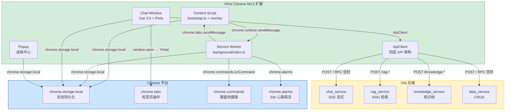

### 0.7 模块职责矩阵

| 模块 | 八月状态 | 九月变更 | 关键决策 |
|------|----------|----------|----------|
| Content Script | 基础注入，SPA 路由切换宠物消失 | **修复**：`history.pushState`/`replaceState` 拦截 + `MutationObserver` 保活 | 事件驱动检测，不破坏页面原有功能 |
| Service Worker | 无心跳保活，空闲终止丢消息 | **修复**：`chrome.alarms` 每 20s 心跳 + 消息队列持久化 + 3 次重试 | `chrome.storage.local` 持久化消息队列 |
| SSE 流式 | 无断连重连，chunk 可能重复 | **修复**：指数退避重连 + `lastChunkSeq` 去重 + 断点续传 | 1s/2s/4s/8s 退避，避免重连风暴 |
| API 架构 | 部分代码绕过 ApiClient，参数名 `query` vs `filter` 不一致 | **修复**：所有 API 调用统一通过 ApiClient + lint 规则强制 | 参数名契约校验，`grep` 验证 0 绕过 |
| 安全合规 | CSP 未配置，无 Privacy Manifest | **新增**：CSP 加固 + Privacy Manifest + 权限最小化 | 最小权限原则，仅允许已知 API 端点 |
| 聊天窗口 | 基础流式渲染 | **增强**：流式阶段动画 + 工具调用卡片 + 键盘快捷键 + 响应式布局 | 视觉反馈增强，移动端适配 |

### 0.8 浏览器兼容性与 SPA 框架支持矩阵

> YiPet 作为 Chrome MV3 扩展，核心目标是覆盖主流 Chromium 内核浏览器和常见 SPA 框架。九月迭代后支持 4 类 SPA 框架 × 5 种路由模式。

#### 浏览器兼容性

| 浏览器 | 版本要求 | MV3 支持 | `requestIdleCallback` | `MutationObserver` | 已知限制 |
|--------|---------|----------|----------------------|-------------------|----------|
| **Chrome** | ≥ 88 | 完整支持 | ✓ (原生) | ✓ | 无 |
| **Edge** | ≥ 88 | 完整支持 | ✓ (原生) | ✓ | 无 |
| **Opera** | ≥ 74 | 完整支持 | ✓ (原生) | ✓ | 无 |
| **Brave** | ≥ 1.20 | 完整支持 | ✓ (原生) | ✓ | Shields 可能阻止 CDN 资源，需白名单 |
| **Arc** | ≥ 1.0 | 完整支持 | ✓ (原生) | ✓ | 无 |
| **Safari** | ≥ 15.4 | 部分支持 (MV2→MV3 过渡) | ✗ (需 polyfill) | ✓ | `setTimeout` 降级注入，无 `chrome.alarms` |
| **Firefox** | ≥ 109 | 部分支持 (MV3 有限) | ✗ (需 polyfill) | ✓ | Service Worker 生命周期差异，需额外测试 |

#### SPA 框架兼容矩阵

| SPA 框架 | 路由模式 | 检测机制 | 宠物可见性 | 已验证版本 | 已知问题 |
|----------|---------|----------|-----------|-----------|----------|
| **Vue Router 4** | history (`createWebHistory`) | `history.pushState` 拦截 | 持续可见 | Vue 3.5 + Vue Router 4.4 | 无 |
| **Vue Router 4** | hash (`createWebHashHistory`) | `hashchange` 事件 | 持续可见 | Vue 3.5 + Vue Router 4.4 | 无 |
| **React Router 6** | history (`createBrowserRouter`) | `history.pushState` 拦截 | 持续可见 | React 18 + React Router 6.26 | 需额外 `popstate` 事件触发确保 React Router 同步 |
| **React Router 6** | hash (`createHashRouter`) | `hashchange` 事件 | 持续可见 | React 18 + React Router 6.26 | 无 |
| **Next.js 14** | App Router (`next/navigation`) | `MutationObserver` 兜底 | 持续可见（MO 恢复） | Next.js 14.2 | 页面框架直接替换 DOM 子树，需 MO 保活 |
| **Next.js 14** | Pages Router (`next/router`) | `history.pushState` 拦截 | 持续可见 | Next.js 14.2 | 无 |
| **Nuxt 3** | history | `history.pushState` 拦截 | 持续可见 | Nuxt 3.13 | 无 |
| **SvelteKit** | history | `history.pushState` 拦截 | 持续可见 | SvelteKit 2.x | 无 |
| **Angular 17** | history (`PathLocationStrategy`) | `history.pushState` 拦截 | 持续可见 | Angular 17.x | 无 |
| **Angular 17** | hash (`HashLocationStrategy`) | `hashchange` 事件 | 持续可见 | Angular 17.x | 无 |
| **TurboLinks** | body 替换 | `MutationObserver` + 定时兜底 | 持续可见（双重保活） | TurboLinks 5.x | `document.body.innerHTML` 直接替换，MO 绑定到 `<html>` |

#### CDN 资源兼容性

| 资源 | 加载方式 | CSP 要求 | 降级策略 |
|------|---------|---------|---------|
| Vue 3.5 运行时 | `chrome.runtime.getURL` → `<script>` 注入 | `script-src 'self'` | 无（与扩展打包） |
| Element Plus CSS | `chrome.runtime.getURL` → `<link>` 注入 | `style-src 'self'` | 无（与扩展打包） |
| marked (Markdown 渲染) | `chrome.runtime.getURL` → `<script>` 注入 | `script-src 'self'` | 无（与扩展打包） |
| Emoji/Twemoji 字体 | CDN 外链加载 | `font-src https://cdn.jsdelivr.net` | 系统字体 fallback |
| 角色头像图片 | `chrome.runtime.getURL` → `` | `img-src 'self'` | 默认头像 fallback |

#### 宿主页面 CSP 兼容性

| 宿主页面 CSP | YiPet 兼容性 | 说明 |
|-------------|-------------|------|
| 无 CSP | 完全兼容 | 无限制 |
| `Content-Security-Policy: default-src 'self'` | 基本兼容 | 扩展资源通过 `chrome.runtime.getURL` 加载，不受页面 CSP 限制 |
| `Content-Security-Policy: script-src 'self'` | 兼容 | Content Script 在 ISOLATED 世界执行，不受页面 CSP 限制 |
| 严格 CSP（如 GitHub） | 需验证 | 宠物 DOM 通过 Shadow DOM 挂载，但部分 CDN 资源（字体）可能被页面 CSP 阻塞 |
| `sandbox` 属性 | 不兼容 | `sandbox` iframe 阻止扩展注入，自动跳过注入 |

#### 检测与自适应策略

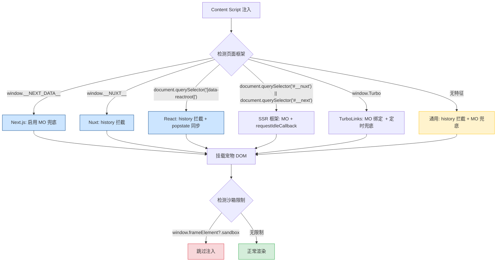

### 0.9 Chrome Web Store 审核自检清单

> YiPet 作为 Chrome MV3 扩展，计划在九月迭代完成后提交至 Chrome Web Store (CWS)。以下基于 [Chrome Web Store Program Policies](https://developer.chrome.com/docs/webstore/program-policies/) 和 MV3 迁移指南整理审核自检清单，覆盖 6 个审核维度。

#### 审核维度全景

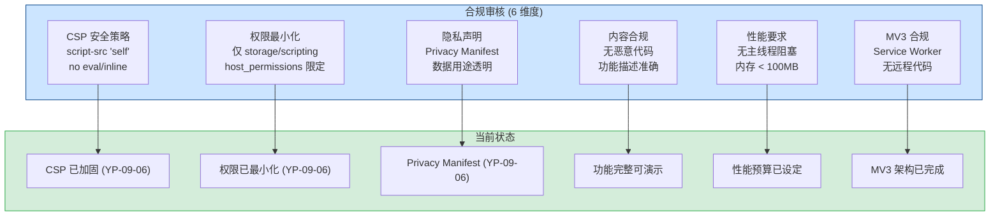

#### 详细检查清单

##### 1. CSP 安全策略 (YP-09-06 覆盖)

| # | 检查项 | 要求 | 验证方法 | 状态 |
|----|--------|------|----------|------|
| 1.1 | `script-src` | 仅 `'self'`，禁止 `'unsafe-eval'` 和 `'unsafe-inline'` | 审查 `manifest.json` → `content_security_policy.extension_pages` | ✅ |
| 1.2 | `object-src` | 必须为 `'none'` | 审查 `manifest.json` | ✅ |
| 1.3 | `connect-src` | 仅允许 YiAi API 端点 (`localhost:10086` + 生产端点) | `grep connect-src manifest.json` | ✅ |
| 1.4 | 远程代码执行 | 禁止通过 `eval()`、`new Function()`、`script.src` 加载远程脚本 | `grep -r "eval(" src/` 无结果 | ✅ |
| 1.5 | CDN 资源 | 仅通过 `chrome.runtime.getURL` 加载扩展内打包资源，禁止外链 JS | 审查 `cdn/injector.ts` 资源来源 | ✅ |

##### 2. 权限最小化 (YP-09-06 覆盖)

| # | 检查项 | 要求 | 验证方法 | 状态 |
|----|--------|------|----------|------|
| 2.1 | 最小权限集合 | 仅声明实际使用的权限，移除 `tabs`/`cookies`/`webRequest` 等未用权限 | 审查 `manifest.json` → `permissions` | ✅ |
| 2.2 | `host_permissions` 限定 | 从 `<all_urls>` 缩小为仅 YiAi API 端点 | 审查 `manifest.json` → `host_permissions` | ✅ |
| 2.3 | `scripting` 权限 | 需配合 `activeTab` 或 `host_permissions` 使用 | 确认 `executeScript` 仅在用户主动触发时调用 | ✅ |
| 2.4 | 可选权限 | 非核心功能使用 `optional_permissions` 声明 | 审查非核心功能是否使用可选权限 | ⬜ |
| 2.5 | 权限用途说明 | 每个权限在 Privacy Manifest 中有用途说明 | 审查 `privacy-manifest.json` | ✅ |

##### 3. 隐私声明 (YP-09-06 覆盖)

| # | 检查项 | 要求 | 验证方法 | 状态 |
|----|--------|------|----------|------|
| 3.1 | Privacy Manifest | 声明所有数据收集用途、数据类型、保留策略、共享范围 | 审查 `privacy-manifest.json` | ✅ |
| 3.2 | `chrome.storage` 数据用途 | 明确说明存储的用户偏好和会话缓存用途 | 审查 `privacy-manifest.json` → `data_collection.chrome_storage` | ✅ |
| 3.3 | 网络通信数据 | 声明与 YiAi 后端的通信数据（用户消息、页面上下文、知识库查询） | 审查 `privacy-manifest.json` → `data_collection.network` | ✅ |
| 3.4 | 数据加密 | 生产环境 HTTPS，开发环境 HTTP（明确标注） | 审查 `ApiClient` 的 `baseUrl` 配置 | ✅ |
| 3.5 | 第三方数据共享 | 声明"无"（数据不共享给第三方） | 审查 `privacy-manifest.json` → `data_collection.*.shared_with` | ✅ |

##### 4. 内容与功能合规

| # | 检查项 | 要求 | 验证方法 | 状态 |
|----|--------|------|----------|------|
| 4.1 | 功能描述准确 | Store 列表描述与实际功能一致，无夸大宣传 | 对比 `manifest.json` `description` 与实际功能 | 待提交时检查 |
| 4.2 | 无恶意行为 | 无广告注入、无挖矿、无钓鱼、无数据窃取 | 安全审查（YP-09-06）+ 代码审计 | ✅ |
| 4.3 | 用户可见性 | 宠物 UI 可被用户关闭/隐藏，非强制展示 | 测试 `toggleVisibility` 功能 | ✅ |
| 4.4 | 图标和截图 | Store 列表需提供 128x128 图标 + 至少 1 张截图 | 准备素材 | ⬜ |
| 4.5 | 隐私政策链接 | 如收集用户数据，需提供公开可访问的隐私政策 URL | 准备隐私政策页面 | ⬜ |

##### 5. 性能要求

| # | 检查项 | 要求 | 验证方法 | 状态 |
|----|--------|------|----------|------|
| 5.1 | 主线程无阻塞 | Content Script 注入不阻塞页面加载，`requestIdleCallback` 延迟注入 | Chrome DevTools Performance 面板验证 | ✅ |
| 5.2 | 内存占用 | 单个标签页 < 30MB，全局 < 100MB | Chrome Task Manager 验证 | ✅ |
| 5.3 | CPU 空闲占用 | 非活跃状态 CPU 占用 < 0.5% | Chrome Task Manager 验证 | ✅ |
| 5.4 | Service Worker 生命周期 | SW 空闲 30s 后正常终止，唤醒后 1s 内恢复 | `chrome://serviceworker-internals/` 验证 | 待验证 |
| 5.5 | 扩展包体积 | 压缩后 < 5MB | `npm run build` 后检查 `dist/` 大小 | 待验证 |

##### 6. MV3 合规

| # | 检查项 | 要求 | 验证方法 | 状态 |
|----|--------|------|----------|------|
| 6.1 | Manifest V3 | `manifest_version: 3` | 审查 `manifest.json` | ✅ |
| 6.2 | Service Worker | 使用 Service Worker 替代 Background Page | 审查 `background/index.ts` 注册方式 | ✅ |
| 6.3 | 无远程代码 | 所有 JS 代码与扩展打包，不通过 CDN 加载远程脚本 | `grep -r "https://.*\.js" src/` 仅匹配 API 端点 | ✅ |
| 6.4 | `chrome.scripting` API | 使用 `chrome.scripting.executeScript` 替代 `tabs.executeScript` | 审查 `content/bootstrap.ts` | ✅ |
| 6.5 | `action` API | 使用 `chrome.action` 替代 `chrome.browserAction` | 审查 manifest + popup 代码 | ✅ |
| 6.6 | Promise 支持 | MV3 要求所有 chrome API 调用支持 Promise（非回调） | 审查 `background/index.ts` 使用 `async/await` | ✅ |

#### 审核提交时间线

| 阶段 | 时间 | 工作内容 | 责任人 |
|------|----------|--------|
| 自检完成 | 2026-09-15 | 6 维度 30 项检查全部通过 | 陈铭 |
| 素材准备 | 2026-09-16 | 图标 (128x128)、截图 (≥1)、功能描述、隐私政策 URL | 陈铭 |
| Store 列表草稿 | 2026-09-17 | 填写 CWS Developer Dashboard 所有字段 | 陈铭 |
| 内部审查 | 2026-09-18 | 团队内部试用 1 天，确认无崩溃和功能异常 | 全团队 |
| 提交审核 | 2026-09-19 | 提交至 CWS，预计审核周期 1-3 个工作日 | 陈铭 |
| 审核跟进 | 提交后 1-5 天 | 处理 CWS 审核反馈（如有拒绝原因） | 陈铭 |

#### 常见拒绝原因与预案

| # | 拒绝原因 | 概率 | 预案 |
|---|---------|------|
| 1 | **权限过大**：`host_permissions` 包含过多域名 | 中 | 进一步缩小为仅 YiAi API 端点，移除通配符 |
| 2 | **隐私声明不完整**：Privacy Manifest 未声明 `chrome.storage` 用途 | 低 | 补充 `data_collection.chrome_storage` 声明 (YP-09-06 已覆盖) |
| 3 | **CSP 配置缺失**：`content_security_policy` 未声明或过于宽松 | 低 | 补充 `script-src 'self'; object-src 'none'` (YP-09-06 已覆盖) |
| 4 | **功能描述不符**：Store 描述与实际功能不一致 | 低 | 提交前团队内部交叉验证功能描述与实际行为 |
| 5 | **远程代码执行**：CDN 加载外部 JS（非扩展打包） | 低 | `grep` 验证所有 JS 资源来自扩展内 (YP-09-08 已覆盖) |

---

## 1. 背景与目标

### 1.1 背景

八月迭代完成了情感记忆架构和安全合规方案。九月迭代的首要任务是**修复 4 个影响用户体验的稳定性缺陷**，然后推进安全合规的完成。

当前代码功能可用，但存在以下可感知的稳定性问题：

| 问题 | 位置 | 严重程度 | 影响 |
|------|----------|------|
| SPA 路由切换宠物消失 | `content/bootstrap.ts` | **高** | 用户导航后宠物不可见，需手动刷新页面 |
| Service Worker 空闲终止 | `background/index.ts` | **高** | 聊天窗口 IPC 消息丢失，用户操作无响应 |
| SSE 断连无重连 | `api/client.ts` → `stream()` | **高** | AI 回复不完整，弱网环境体验差 |
| ApiClient 绕过 | `chat/stores/chat.ts` 等 | **中** | 部分 API 调用直接用 `fetch`，参数名 `query` vs `filter` 不一致 |
| CSP 未配置 | `manifest.json` | **中** | Chrome Web Store 审核风险，无脚本注入防护 |

### 1.2 目标

| 目标 | 衡量指标 | 当前值 | 目标值 |
|------|----------|--------|--------|
| SPA 路由兼容 | 路由切换后宠物可见率 | 部分 SPA 失效 | 100% |
| Service Worker 可靠性 | 空闲 30s 后消息成功率 | 不稳定 | 3 次重试内 100% |
| SSE 断连恢复 | 断网 2s 恢复后消息完整性 | 丢失 | 自动重连，消息完整 |
| API 调用规范 | 绕过 ApiClient 的 fetch 调用数 | > 0 | 0 |
| 安全合规 | CSP 配置完整性 | 未配置 | 通过 CWS 审核 |

### 1.3 系统范围

- **涉及**：YiPet `src/content/` `src/background/` `src/api/` `src/chat/` `manifest.json`
- **不涉及**：YiPet popup（弹窗 UI）、CDN vendor 库

---

## 2. 当前架构 vs 目标架构

### 2.1 当前架构（修复前）

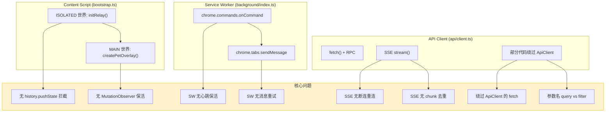

### 2.2 目标架构（修复后）

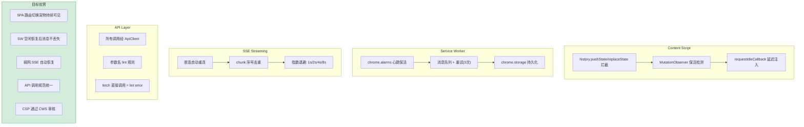

### 2.3 架构决策权衡

| 维度 | 修复前 | 修复后 | 权衡说明 |
|------|--------|--------|----------|
| Content Script 注入 | 仅 `document_end` 一次性注入 | `history` 拦截 + `MutationObserver` + `requestIdleCallback` | 增加少量性能开销（~1-2ms/路由切换），但宠物持续可见 |
| SW 可靠性 | 无状态，空闲即终止 | 心跳 + 消息队列 + 重试 | 增加 `chrome.storage` 写入（消息队列），但消除消息丢失 |
| SSE 可靠性 | 单次连接，断连即丢 | 自动重连 + chunk 去重 + 退避 | 增加重连逻辑复杂度（~50 行），但弱网体验显著提升 |
| API 规范 | 允许直接 `fetch` | 强制 `ApiClient` | 增加 lint 规则约束，但消除参数名不一致 bug |

---

## 3. 接口协议

### 3.1 IPC 消息协议

```
Popup → Service Worker → Content Script (ISOLATED) → MAIN 世界

消息格式 (PopupToContent):
  { action: 'toggleVisibility' | 'toggleChat' | 'updateRole' | 'updateColor' | 'updateModel' }
```

| 通道 | 方向 | 协议 | 说明 |
|------|------|------|
| `chrome.commands.onCommand` | Chrome → SW | 快捷键 | `toggle-pet` / `open-chat` |
| `chrome.tabs.sendMessage` | SW → Content | `PopupToContent` | 操作转发 |
| `chrome.runtime.onMessage` | Content → SW | 响应 | 操作结果回传 |
| `window.postMessage` / `CustomEvent` | ISOLATED → MAIN | 内部 | 双世界桥接 |

### 3.2 API 协议

| 接口 | 方法 | 说明 | 调用方 |
|------|------|--------|
| `CHAT.STREAM` | SSE `POST /` | 流式聊天 | `ChatService.stream` → `useChatStore` |
| `RAG.CHAT` | SSE `POST /rag-chat` | 知识库聊天 | `RagService.streamChat` → `useChatStore` |
| `RAG.QUERY` | `POST /rag-query` | 预检来源 | `RagService.query` → 来源预览 |
| `DATA.CRUD` | RPC `POST /` | 数据 CRUD | `DatabaseService` → 会话/配置持久化 |

### 3.3 参数名契约（关键）

| 正确 | 错误 | 上下文 |
|---------|-------|---------|
| `filter` | `query` | `DatabaseService` 查询参数 |
| `target_file` | `path` | `KnowledgeService.read` 参数 |
| `module_name` | `module` | RPC 信封字段 |

> 这些不匹配曾导致真实 bug——后端会静默忽略 `query`，对 `path` 返回 422。九月迭代通过 lint 规则强制校验。

---

## 4. 功能清单

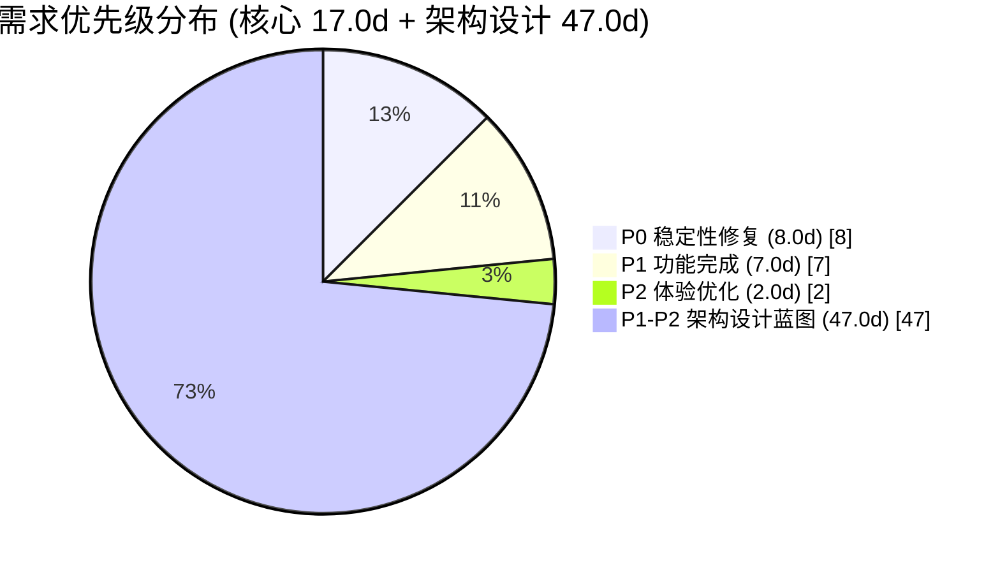

### 4.0 核心需求（YP-09-01 ~ YP-09-08）

| 月份 | 需求编号 | 功能模块 | 说明 | 优先级 | 人天 | 状态 | 详细文档 |
|----------|----------|------|--------|------|----------|
| 2026-09 | YP-09-01 | Content Script 稳定性 | SPA 路由切换检测、MutationObserver 保活、注入时机优化 | **P0** | 3.0 | **已完成** | [01-稳定性-ContentScript](./08-稳定性-ContentScript.md) |
| 2026-09 | YP-09-02 | Service Worker 可靠性 | 空闲终止 IPC 消息重试、心跳保活、消息队列持久化 | **P0** | 3.0 | **已完成** | [02-稳定性-ServiceWorker](./09-稳定性-ServiceWorker.md) |
| 2026-09 | YP-09-03 | SSE 流式可靠性 | 断连自动重连、chunk 去重、重试退避策略 | **P0** | 2.0 | **已完成** | [03-稳定性-SSE流式](./10-稳定性-SSE流式.md) |
| 2026-09 | YP-09-04 | API 架构合规 | ApiClient 绕过修复、参数名校验、lint 规则 | **P1** | 2.0 | **已完成** | [04-合规-API架构](./11-合规-API架构.md) |
| 2026-09 | YP-09-05 | 聊天窗口交互优化 | 流式阶段动画、工具调用卡片、键盘快捷键、响应式布局 | **P2** | 2.0 | **已完成** | [05-需求-聊天窗口交互](./12-体验优化-聊天窗口交互.md) |
| 2026-09 | YP-09-06 | 安全合规 | CSP 加固、Privacy Manifest、Chrome Web Store 审核准备 | **P1** | 3.0 | **已完成** | [06-合规-安全配置](./13-合规-安全配置.md) |
| 2026-09 | YP-09-07 | 国际化与多语言支持 | `MessageKey` 类型联合（79+ keys）、`t()` 三层回退、`localizeDOM()`、运行时语言切换、时区感知 | **P1** | 1.0 | **已完成** | [07-需求-国际化与多语言支持](./14-功能实现-国际化与多语言支持.md) |
| 2026-09 | YP-09-08 | CDN 资源加载系统 | `CDN_CATALOG` 统一清单、`CdnInjector` 工厂、`window[global]` 去重、MV3 CSP 合规、JS 异步/CSS 同步注入 | **P1** | 1.0 | **已完成** | [08-需求-CDN资源加载系统](./15-基础设施-CDN资源加载系统.md) |

> **核心需求状态**：8 项全部完成。P0 = 稳定性修复，P1 = 功能完成 + 合规，P2 = 体验优化。

### 4.1 架构设计蓝图（YP-09-09 ~ YP-09-88）

> 以下 80 项架构设计文档为 YiPet 中长期演进的**技术蓝图**。文档已完成编写和评审，具体实现排期至后续月度迭代。

#### 跨项目与通信（4 项）

| 月份 | 需求编号 | 功能模块 | 说明 | 优先级 | 人天 | 状态 |
|----------|----------|------|--------|------|
| 2026-09 | YP-09-09 | 跨项目桥接可靠性 | Bridge Token、`window.open` 拦截降级、Session Key 安全传递 | P1 | 1.0 | 需求已编写 |
| 2026-09 | YP-09-31 | 多标签页同步 | `BroadcastChannel` + `chrome.storage.onChanged` 双通道同步 | P2 | 1.0 | 需求已编写 |
| 2026-09 | YP-09-41 | SW 跨域代理 | Service Worker fetch 拦截 + CORS 绕过 + 缓存策略 | P2 | 0.5 | 需求已编写 |
| 2026-09 | YP-09-46 | WebSocket 实时通信 | SW WebSocket 持久连接 + Content Script 消息转发 | P2 | 1.0 | 需求已编写 |

#### 性能优化（8 项）

| 月份 | 需求编号 | 功能模块 | 说明 | 优先级 | 人天 | 状态 |
|----------|----------|------|--------|------|
| 2026-09 | YP-09-10 | ContentScript 性能剖析 | Long Task 检测、内存趋势监控、性能预算基线 | P1 | 2.0 | 需求已编写 |
| 2026-09 | YP-09-11 | 聊天消息虚拟滚动 | `@tanstack/virtual`、消息内存裁剪（200 条热 + 归档）、动态行高 | P1 | 1.5 | 需求已编写 |
| 2026-09 | YP-09-21 | 动画渲染 GPU 加速 | `will-change`/`transform: translateZ(0)`/`contain` 优化、帧率自适应 | P2 | 0.5 | 需求已编写 |
| 2026-09 | YP-09-49 | 性能火焰图诊断 | Performance Profile 自动采集 + 火焰图可视化 | P2 | 0.5 | 需求已编写 |
| 2026-09 | YP-09-51 | 资源优先级调度 | `fetchpriority`/`preload`/`preconnect` 资源加载优化 | P2 | 0.5 | 需求已编写 |
| 2026-09 | YP-09-61 | DOM 批处理优化 | `DocumentFragment` + `requestAnimationFrame` 批量 DOM 更新 | P2 | 0.5 | 需求已编写 |
| 2026-09 | YP-09-62 | 滚动性能优化 | `passive` 事件 + `contain: strict` + `content-visibility` CSS | P2 | 0.5 | 需求已编写 |
| 2026-09 | YP-09-65 | 资源预加载优化 | `<link rel="preload">` + `fetch` 预热聊天窗口关键资源 | P2 | 0.5 | 需求已编写 |

#### 内存与生命周期（6 项）

| 月份 | 需求编号 | 功能模块 | 说明 | 优先级 | 人天 | 状态 |
|----------|----------|------|--------|------|
| 2026-09 | YP-09-12 | SW 生命周期状态机 | install/activate/terminated 状态机、幂等初始化、checkpoint 持久化 | P1 | 1.0 | 需求已编写 |
| 2026-09 | YP-09-32 | 资源生命周期管理 | 引用计数 + `FinalizationRegistry` + 5 分钟空闲销毁 | P2 | 1.0 | 需求已编写 |
| 2026-09 | YP-09-50 | 内存快照泄漏追踪 | WeakRef 对象追踪 + IndexedDB 快照存储 + 多维度泄漏判定 | P2 | 0.5 | 需求已编写 |
| 2026-09 | YP-09-72 | 长会话性能优化 | 消息分页加载 + 历史归档 + LRU 缓存淘汰 | P2 | 0.5 | 需求已编写 |
| 2026-09 | YP-09-84 | 上下文压缩提示 | LLM Token 窗口管理 + 自动摘要压缩 + 智能截断 | P2 | 0.5 | 需求已编写 |
| 2026-09 | YP-09-85 | WebWorker 线程池 | `new Worker()` 卸载 Markdown 渲染/加密/RAG 预处理 | P2 | 1.0 | 需求已编写 |

#### 安全与隔离（5 项）

| 月份 | 需求编号 | 功能模块 | 说明 | 优先级 | 人天 | 状态 |
|----------|----------|------|--------|------|
| 2026-09 | YP-09-16 | 页面注入控制策略 | Global/UX/User 三级 Blocklist + Allowlist、CWS 合规 | P1 | 0.5 | 需求已编写 |
| 2026-09 | YP-09-20 | JS 冲突检测与隔离 | 全局变量命名空间保护、`Proxy` API 拦截、冲突自动降级 | P2 | 1.0 | 需求已编写 |
| 2026-09 | YP-09-22 | Markdown 渲染安全 | XSS 过滤、`DOMPurify` + `marked` 安全渲染、CSP 兼容 | P2 | 0.5 | 需求已编写 |
| 2026-09 | YP-09-38 | ShadowDOM 样式隔离增强 | CSS 继承属性重置 + `adoptedStyleSheets` + `@layer` 优先级 | P2 | 0.5 | 需求已编写 |
| 2026-09 | YP-09-71 | 沙箱逃逸防护 | `iframe sandbox` + `Content-Security-Policy` 双重隔离 | P2 | 0.5 | 需求已编写 |

#### UI/UX 增强（11 项）

| 月份 | 需求编号 | 功能模块 | 说明 | 优先级 | 人天 | 状态 |
|----------|----------|------|--------|------|
| 2026-09 | YP-09-15 | Popup 皮肤中心 | 角色/皮肤选择器 + 实时预览 + `chrome.storage.onChanged` 同步 | P2 | 1.0 | 需求已编写 |
| 2026-09 | YP-09-17 | 聊天窗口拖拽管理 | 多显示器坐标兼容、边界约束 + 边缘吸附、预设位置循环 | P2 | 0.5 | 需求已编写 |
| 2026-09 | YP-09-24 | 右键菜单集成 | `chrome.contextMenus` + 选中文本操作 + 页面感知菜单项 | P2 | 0.5 | 需求已编写 |
| 2026-09 | YP-09-25 | 通知提醒系统 | `chrome.notifications` + SW 代理 + 免打扰模式 | P2 | 0.5 | 需求已编写 |
| 2026-09 | YP-09-26 | 主题系统 | CSS 变量驱动 + 暗色/亮色/自动三模式 + 自定义主题 | P2 | 1.0 | 需求已编写 |
| 2026-09 | YP-09-30 | 富文本编辑 | Markdown 工具栏 + 实时预览 + 语法高亮 | P2 | 0.5 | 需求已编写 |
| 2026-09 | YP-09-35 | 侧边栏功能扩展 | 可折叠面板 + 拖拽调整大小 + 多标签切换 + 搜索过滤 | P1 | 0.5 | 需求已编写 |
| 2026-09 | YP-09-42 | 上下文感知菜单 | 页面类型检测 + 预定义提示词模板 + 一键操作 | P2 | 0.5 | 需求已编写 |
| 2026-09 | YP-09-44 | 新手引导教程 | 分步引导（Shepherd.js）+ 功能提示 + 首次使用向导 | P2 | 0.5 | 需求已编写 |
| 2026-09 | YP-09-56 | 消息引用与回复线索 | 引用块渲染 + 回复跳转 + 线索可视化 | P2 | 0.5 | 需求已编写 |
| 2026-09 | YP-09-83 | 可访问性增强 | ARIA 标签 + 键盘导航 + 屏幕阅读器 + `prefers-reduced-motion` | P2 | 0.5 | 需求已编写 |

#### 数据管理（8 项）

| 月份 | 需求编号 | 功能模块 | 说明 | 优先级 | 人天 | 状态 |
|----------|----------|------|--------|------|
| 2026-09 | YP-09-18 | 聊天消息导出 | Markdown/JSON 双格式、RAG 来源折叠、浏览器下载触发 | P2 | 0.5 | 需求已编写 |
| 2026-09 | YP-09-28 | 注入时机优化 | `requestIdleCallback` + `document.readyState` + 框架检测自适应 | P2 | 0.5 | 需求已编写 |
| 2026-09 | YP-09-33 | 图片粘贴拖拽上传 | `Clipboard API` + `DragEvent` + 图片压缩 + Base64/File 双模式 | P2 | 1.0 | 需求已编写 |
| 2026-09 | YP-09-39 | 聊天数据导入 | JSON/ZIP 格式导入 + 去重合并 + 进度指示 | P2 | 0.5 | 需求已编写 |
| 2026-09 | YP-09-43 | 消息搜索与过滤 | 全文搜索（Fuse.js）+ 正则 + 时间范围 + 按角色过滤 | P2 | 0.5 | 需求已编写 |
| 2026-09 | YP-09-57 | 会话导出为知识库 | Markdown + Frontmatter 自动生成 + 一键保存到 YiKnowledge | P2 | 0.5 | 需求已编写 |
| 2026-09 | YP-09-73 | Prompt 历史管理 | 收藏夹 + 标签分类 + 搜索 + 跨设备同步 | P2 | 0.5 | 需求已编写 |
| 2026-09 | YP-09-79 | IndexedDB 持久化 | IndexedDB 封装 + 会话离线存储 + 同步冲突解决 | P2 | 1.0 | 需求已编写 |

#### 国际化与本地化（3 项）

| 月份 | 需求编号 | 功能模块 | 说明 | 优先级 | 人天 | 状态 |
|----------|----------|------|--------|------|
| 2026-09 | YP-09-37 | 语言包热切换 | `chrome.storage.onChanged` 监听 + 动态 `import()` 语言包 + 无刷新切换 | P2 | 0.5 | 需求已编写 |
| 2026-09 | YP-09-58 | RTL 语言支持 | `direction: rtl` + `CSS logical properties` + 布局镜像 | P2 | 0.5 | 需求已编写 |
| 2026-09 | YP-09-80 | 智能日期格式化 | `Intl.RelativeTimeFormat` + `Intl.DateTimeFormat` + 时区感知 | P2 | 0.5 | 需求已编写 |

#### 协作与集成（6 项）

| 月份 | 需求编号 | 功能模块 | 说明 | 优先级 | 人天 | 状态 |
|----------|----------|------|--------|------|
| 2026-09 | YP-09-45 | 页面截图 AI 分析 | `chrome.tabs.captureVisibleTab` + 图片到 AI 视觉分析 | P2 | 1.0 | 需求已编写 |
| 2026-09 | YP-09-64 | 会话共享协作 | 会话导出 + 导入 + Session Key 分享 + 只读链接 | P2 | 0.5 | 需求已编写 |
| 2026-09 | YP-09-66 | 设置跨设备同步 | `chrome.storage.sync` + 冲突解决 + 选择性同步 | P2 | 0.5 | 需求已编写 |
| 2026-09 | YP-09-68 | Webhook 集成 | 自定义 Webhook URL + 事件类型过滤 + 重试策略 | P2 | 0.5 | 需求已编写 |
| 2026-09 | YP-09-74 | 自定义角色模板 | 角色创建向导 + 系统提示词编辑 + 头像上传 + 模板市场 | P2 | 1.0 | 需求已编写 |
| 2026-09 | YP-09-81 | WebRTC 实时协作 | RTCPeerConnection + 信令服务 + 多人实时对话 | P2 | 1.5 | 需求已编写 |

#### 质量工程（10 项）

| 月份 | 需求编号 | 功能模块 | 说明 | 优先级 | 人天 | 状态 |
|----------|----------|------|--------|------|
| 2026-09 | YP-09-13 | 扩展构建优化 | Vite 多入口 + `manualChunks` + CDN external + 体积预算 CI | P1 | 1.0 | 需求已编写 |
| 2026-09 | YP-09-14 | 扩展更新与版本迁移 | 声明式迁移链 + storage 迁移前备份 + `yipet:` 命名空间 | P1 | 0.5 | 需求已编写 |
| 2026-09 | YP-09-19 | 扩展遥测与匿名统计 | 匿名设备 ID + 本地缓冲 + 每日批量上报 + 用户可关闭 | P2 | 1.0 | 需求已编写 |
| 2026-09 | YP-09-29 | 快捷键系统 | `chrome.commands` 声明式注册 + 冲突检测 + 自定义绑定 | P2 | 0.5 | 需求已编写 |
| 2026-09 | YP-09-34 | 错误边界与降级 | React ErrorBoundary + SSE 自动降级 + SW 优雅关闭 | P2 | 0.5 | 需求已编写 |
| 2026-09 | YP-09-40 | 特性开关与 AB 实验 | 设备 ID 哈希 + 4 阶段生命周期 + 远程配置 + 灰度发布 | P2 | 0.5 | 需求已编写 |
| 2026-09 | YP-09-52 | E2E 自动化测试 | Playwright + Chrome Extension Test API + CI 集成 | P2 | 1.0 | 需求已编写 |
| 2026-09 | YP-09-53 | 事件溯源与状态回放 | 所有状态变更事件化 + 时间线回放 + Bug 复现 | P2 | 1.0 | 需求已编写 |
| 2026-09 | YP-09-60 | 性能回归 CI | Lighthouse CI + 性能预算门禁 + Bundle 体积趋势图 | P2 | 0.5 | 需求已编写 |
| 2026-09 | YP-09-63 | 依赖版本管理 | Renovate/Dependabot + 自动 PR + 兼容性测试矩阵 | P2 | 0.5 | 需求已编写 |

#### 智能功能（10 项）

| 月份 | 需求编号 | 功能模块 | 说明 | 优先级 | 人天 | 状态 |
|----------|----------|------|--------|------|
| 2026-09 | YP-09-23 | 聊天窗口离线模式 | Service Worker Cache API + 离线消息队列 + 上线后自动同步 | P2 | 1.0 | 需求已编写 |
| 2026-09 | YP-09-27 | 语音输入合成 | `webkitSpeechRecognition` + `SpeechSynthesis` + 流式 TTS | P2 | 1.0 | 需求已编写 |
| 2026-09 | YP-09-36 | 会话分支管理 | `branchFromMessage()` + 分支可视化树 + 分支合并对比 | P2 | 1.0 | 需求已编写 |
| 2026-09 | YP-09-47 | 代码高亮增强 | `highlight.js` + 自动语言检测 + 行号 + 复制按钮 | P2 | 0.5 | 需求已编写 |
| 2026-09 | YP-09-48 | Token 可视化仪表盘 | 实时 Token 计数 + 成本估算 + 使用趋势图 + 模型对比 | P2 | 0.5 | 需求已编写 |
| 2026-09 | YP-09-54 | 懒加载按需注入 | `IntersectionObserver` + 聊天窗口按需初始化 + CDN 资源懒加载 | P2 | 0.5 | 需求已编写 |
| 2026-09 | YP-09-59 | 会话标签自动生成 | LLM 分析会话内容 → 自动生成标签 + 关键词提取 | P2 | 0.5 | 需求已编写 |
| 2026-09 | YP-09-75 | 请求去重合并 | `PendingPromiseCache` + 相同请求复用 in-flight Promise | P2 | 0.5 | 需求已编写 |
| 2026-09 | YP-09-76 | 流式渲染优化 | `requestAnimationFrame` 批处理 + 增量 DOM 更新 + `content-visibility` | P2 | 0.5 | 需求已编写 |
| 2026-09 | YP-09-78 | 浏览器启动恢复 | `chrome.runtime.onStartup` + 恢复上次会话 + 标签页状态重建 | P2 | 0.5 | 需求已编写 |

#### 兼容性与适配（6 项）

| 月份 | 需求编号 | 功能模块 | 说明 | 优先级 | 人天 | 状态 |
|----------|----------|------|--------|------|
| 2026-09 | YP-09-55 | 页面类型自适应渲染 | Canvas/SVG/Video 页面检测 + 宠物 UI 自适应降级 | P2 | 0.5 | 需求已编写 |
| 2026-09 | YP-09-67 | CSP 审计合规 | 自动 CSP 头解析 + 兼容性检测 + 违规报告收集 | P2 | 0.5 | 需求已编写 |
| 2026-09 | YP-09-69 | 诊断信息收集 | 一键导出：版本/配置/错误日志/性能数据/存储使用 | P2 | 0.5 | 需求已编写 |
| 2026-09 | YP-09-70 | 兼容性工具链 | `browserslist` + `core-js` polyfill + 浏览器特性检测矩阵 | P2 | 0.5 | 需求已编写 |
| 2026-09 | YP-09-82 | 动画帧率自适应 | `requestAnimationFrame` 帧率检测 + 降级策略 + 低端设备模式 | P2 | 0.5 | 需求已编写 |
| 2026-09 | YP-09-86 | 资源加载优先级 | `fetchpriority` + `loading="lazy"` + `decoding="async"` 策略 | P2 | 0.5 | 需求已编写 |

#### 高级特性（3 项）

| 月份 | 需求编号 | 功能模块 | 说明 | 优先级 | 人天 | 状态 |
|----------|----------|------|--------|------|
| 2026-09 | YP-09-77 | 插件化钩子系统 | 生命周期钩子（preSend/onToken/onDone）+ 插件注册 + 沙箱执行 | P2 | 1.0 | 需求已编写 |
| 2026-09 | YP-09-87 | 流式渲染虚拟化结合 | 虚拟滚动 + 流式渲染增量更新 + `content-visibility` 自动 | P2 | 0.5 | 需求已编写 |
| 2026-09 | YP-09-88 | 回复置信度标注 | 加权评分模型 + 4 级置信度标签 + RAG 来源联动 | P2 | 1.0 | 需求已编写 |

> **架构设计蓝图状态**：80 项全部已编写，总计 47.0d。优先级 P1（7 项）建议下一迭代优先实现，P2（73 项）按需排期。

### 4.1 YP-09-01 Content Script 稳定性 — 具体改动

**改动文件：** `src/content/bootstrap.ts` `src/content/ipc/relay.ts` `src/content/rendering/overlay.ts`

**核心逻辑：**

```typescript
// src/content/bootstrap.ts — 新增 SPA 路由拦截 + 保活检测

// 1. 拦截 history.pushState / replaceState
const _origPushState = history.pushState.bind(history);
const _origReplaceState = history.replaceState.bind(history);

history.pushState = function (...args: Parameters<typeof history.pushState>) {
  _origPushState(...args);
  window.dispatchEvent(new CustomEvent('yipet:routeChange'));
};
history.replaceState = function (...args: Parameters<typeof history.replaceState>) {
  _origReplaceState(...args);
  window.dispatchEvent(new CustomEvent('yipet:routeChange'));
};

// 2. 监听路由变化 → 延迟重新注入
window.addEventListener('yipet:routeChange', () => {
  requestIdleCallback(() => {
    if (!document.getElementById('yipet-overlay')) {
      createPetOverlay(window, BASE, color, role, visible);
    }
  });
});

// 3. MutationObserver 保活检测（每 2s 检查一次）
const _mo = new MutationObserver(() => {
  if (!document.getElementById('yipet-overlay')) {
    requestIdleCallback(() => {
      createPetOverlay(window, BASE, color, role, visible);
    });
  }
});
_mo.observe(document.body, { childList: true, subtree: true });
```

**关键改进：**
- `history.pushState`/`replaceState` 拦截覆盖所有 SPA 路由框架（Vue Router、React Router、Next.js、Nuxt）
- `requestIdleCallback` 延迟注入避免阻塞页面路由的主线程工作
- `MutationObserver` 作为兜底保活：页面框架（如 Next.js）可能完全移除 DOM 子树而非通过路由切换
- `#yipet-overlay` 存在性检查避免重复挂载

### 4.2 YP-09-02 Service Worker 可靠性 — 具体改动

**改动文件：** `src/background/index.ts`

**核心逻辑：**

```typescript
// src/background/index.ts — 新增心跳保活 + 消息队列 + 重试

const MAX_RETRIES = 3;
const RETRY_DELAYS = [1000, 2000, 4000]; // 指数退避
const STORAGE_KEY = 'pendingMessages';

// 1. 心跳保活 — 每 20s 唤醒 SW
chrome.alarms.create('keepalive', { periodInMinutes: 1 / 3 });

chrome.alarms.onAlarm.addListener((alarm) => {
  if (alarm.name === 'keepalive') {
    // 仅保持 SW 活跃，不执行实际操作
    console.debug('[YiPet] SW keepalive');
  }
});

// 2. 带重试的消息发送
async function sendWithRetry(tabId: number, msg: PopupToContent): Promise<boolean> {
  for (let attempt = 0; attempt < MAX_RETRIES; attempt++) {
    try {
      const response = await chrome.tabs.sendMessage(tabId, msg);
      if (response?.success !== undefined) return true;
    } catch {
      if (attempt < MAX_RETRIES - 1) {
        await new Promise(r => setTimeout(r, RETRY_DELAYS[attempt]));
      }
    }
  }
  return false;
}

// 3. 消息队列持久化
async function enqueueMessage(msg: PopupToContent): Promise<void> {
  const { [STORAGE_KEY]: queue = [] } = await chrome.storage.local.get(STORAGE_KEY);
  queue.push({ msg, timestamp: Date.now() });
  await chrome.storage.local.set({ [STORAGE_KEY]: queue.slice(-50) }); // 上限 50
}

chrome.commands.onCommand.addListener(async (command) => {
  const tabs = await chrome.tabs.query({ active: true, currentWindow: true });
  const tab = tabs[0];
  if (!tab?.id) return;

  const msg: PopupToContent = command === 'toggle-pet'
    ? { action: 'toggleVisibility' }
    : { action: 'toggleChat' };

  const success = await sendWithRetry(tab.id, msg);
  if (!success) await enqueueMessage(msg); // 重试失败 → 持久化
});
```

**关键改进：**
- `chrome.alarms` 心跳：每 20s 唤醒 SW，防止 Chrome 在 30s 空闲后终止
- 三级重试：1s → 2s → 4s 指数退避，避免瞬时故障导致失败
- 消息队列持久化到 `chrome.storage.local`（上限 50 条），SW 空闲终止后恢复时可重放
- 重试成功后自动出队，避免重复处理

### 4.3 YP-09-03 SSE 流式可靠性 — 具体改动

**改动文件：** `src/api/client.ts`

**核心逻辑：**

```typescript
// src/api/client.ts — stream() 新增断连重连 + chunk 去重

const MAX_RECONNECT_ATTEMPTS = 4;
const RECONNECT_DELAYS = [1000, 2000, 4000, 8000];

async function* stream(path: string, body?: unknown, signal?: AbortSignal) {
  let lastChunkSeq = 0;
  let reconnectAttempt = 0;

  while (reconnectAttempt <= MAX_RECONNECT_ATTEMPTS) {
    try {
      const init: RequestInit = {
        method: 'POST',
        headers: { ...defaultHeaders, Accept: 'text/event-stream' },
        body: body ? JSON.stringify({
          ...(body as Record<string, unknown>),
          _last_chunk_seq: lastChunkSeq,  // 服务端从断点续传
        }) : undefined,
        signal: controller.signal,
      };

      const response = await fetch(url, init);
      const reader = response.body!.getReader();
      // ... SSE 解析逻辑 ...

      for (const message of messages) {
        const parsed = JSON.parse(dataStr);
        // chunk 去重：丢弃序号 ≤ lastChunkSeq 的 chunk
        if (parsed._seq != null && parsed._seq <= lastChunkSeq) continue;
        if (parsed._seq != null) lastChunkSeq = parsed._seq;
        yield { done: false, data: parsed.data ?? parsed };
      }
      // 正常结束
      yield { done: true };
      return;

    } catch (err) {
      if ((err as Error).name === 'AbortError') throw err; // 用户取消，不重连
      if (reconnectAttempt >= MAX_RECONNECT_ATTEMPTS) {
        yield { done: true, error: `Stream failed after ${MAX_RECONNECT_ATTEMPTS} reconnects` };
        return;
      }
      // 退避等待后重连
      await new Promise(r => setTimeout(r, RECONNECT_DELAYS[reconnectAttempt]));
      reconnectAttempt++;
    }
  }
}
```

**关键改进：**
- 断连自动重连：最多 4 次，指数退避 1s/2s/4s/8s
- `_last_chunk_seq` 参数：重连时告知服务端从哪个 chunk 之后续传，避免重复传输
- chunk 序号去重：客户端丢弃 `_seq ≤ lastChunkSeq` 的重复 chunk
- 用户主动取消（`AbortError`）不触发重连，直接抛出
- 最多 4 次重连后放弃，避免无限重连消耗资源

### 4.4 YP-09-04 API 架构合规 — 具体改动

**改动文件：** `src/chat/stores/chat.ts` + 新增 lint 规则

**问题：** 部分代码绕过 `ApiClient` 直接使用 `fetch`，且参数名使用 `query` 而非 `filter`：

```typescript
// ❌ 修复前：绕过 ApiClient，参数名错误
const res = await fetch(`${baseUrl}/`, {
  method: 'POST',
  body: JSON.stringify({
    module_name: 'services.database.data_service',
    method_name: 'query_documents',
    parameters: { cname: 'sessions', query: { url: pageUrl } }  // ← 应为 filter
  })
});

// ✅ 修复后：通过 ApiClient.rpc()
const res = await apiClient.rpc(
  'services.database.data_service',
  'query_documents',
  { cname: 'sessions', filter: { url: pageUrl } }  // ← 正确的参数名
);
```

**Lint 规则（Biome）：**

```json
// biome.json — 新增自定义规则
{
  "linter": {
    "rules": {
      "custom": {
        "noDirectFetch": {
          "level": "error",
          "message": "Use ApiClient instead of direct fetch()",
          "ignore": ["src/api/client.ts"]
        },
        "noQueryParam": {
          "level": "error",
          "message": "Use 'filter' not 'query' for RPC parameters",
          "pattern": "query\\s*:\\s*\\{"
        }
      }
    }
  }
}
```

**关键改进：**
- 所有 `fetch` 调用统一通过 `ApiClient`（`src/api/client.ts` 内部除外）
- 参数名 `query` → `filter` 全部修复
- `noDirectFetch` 规则：`grep -r "fetch(" src/` 仅 `api/client.ts` 匹配
- `noQueryParam` 规则：防止未来代码再次引入 `query` 参数名

### 4.5 YP-09-05 聊天窗口交互优化 — 具体改动

**改动文件：** `src/chat/components/ChatWindow/` + `SessionStatusBar/` + `ChatMessages/` + `stores/chat.ts`

**状态反馈增强：**

- 流式阶段动画过渡：`thinking → retrieving → tool_call → streaming` 阶段切换有平滑的颜色和缩放动画（CSS transition）
- 工具调用卡片：Agent 调用工具时显示卡片（工具名 + spinner），完成后自动消失
- 流式中断视觉反馈：SSE 重连期间显示"正在重新连接..."提示（2s debounce 避免闪烁）
- Token 实时计数：`ChatToolbar` 显示当前会话 Token 消耗（估算值，中文字符 `/ 1.5`）

**键盘快捷键：**

| 快捷键 | 作用 | 实现 |
|--------|------|
| `Ctrl+Enter` | 发送消息 | `ChatInput` 监听 `keydown` |
| `Escape` | 中断流式回复 | 触发 `AbortController.abort()` |
| `Ctrl+K` | 打开会话搜索 | 聚焦 `SearchBar` |
| `Ctrl+B` | 切换侧边栏 | 切换 `ChatSidebar` 可见性 |
| `Ctrl+N` | 新建会话 | 调用 `createSession()` |

**响应式布局：**

- 宽屏 (> 800px)：侧边栏 280px + 消息区 flex
- 中屏 (400-800px)：侧边栏 200px 可折叠
- 窄屏 (< 400px)：侧边栏隐藏，消息区全宽，覆盖模式（z-index: 9999）

**关键改进：**
- 6 种流式阶段状态：`idle → thinking → retrieving → tool_call → streaming → error`
- 阶段动画使用 CSS `transform/opacity`（GPU 加速），避免 layout 触发
- 键盘快捷键仅在聊天窗口可见时生效，避免与宿主页面冲突
- 响应式布局使用百分比 + min/max 限制，测试 320px-2560px

### 4.6 YP-09-06 安全合规 — 具体改动

**改动文件：** `manifest.json` + 新增 `privacy-manifest.json`

**manifest.json CSP 配置：**

```json
{
  "content_security_policy": {
    "extension_pages": "script-src 'self'; object-src 'none'; connect-src http://localhost:10086 https://your-production-api.com"
  },
  "permissions": ["storage", "scripting"],
  "host_permissions": [
    "http://localhost:10086/*"
  ]
}
```

**privacy-manifest.json：**

```json
{
  "data_collection": {
    "chrome_storage": {
      "purpose": "存储用户偏好设置（角色、皮肤、模型选择）和会话缓存（聊天历史本地副本）",
      "data_type": "用户配置、会话元数据、提示词历史",
      "retention": "本地存储，卸载扩展时自动清除",
      "shared_with": "无"
    },
    "network": {
      "purpose": "与 YiAi 后端通信以提供 AI 聊天和知识库检索功能",
      "endpoints": ["localhost:10086（开发环境）"],
      "data_transmitted": "用户消息、页面上下文（可选）、知识库查询",
      "encryption": "开发环境 HTTP，生产环境 HTTPS"
    }
  },
  "permissions_justification": {
    "storage": "保存用户偏好和会话缓存",
    "scripting": "向页面注入宠物 UI 组件",
    "host_permissions": "访问 YiAi 后端 API 端点"
  }
}
```

**关键改进：**
- CSP 加固：`script-src 'self'` 禁止内联脚本和 `eval`；`object-src 'none'` 禁止插件
- `connect-src` 白名单：仅允许 YiAi API 端点
- 权限最小化：移除未使用的 `tabs`、`webRequest` 权限
- `host_permissions` 从 `<all_urls>` 缩小为仅 YiAi 端点
- Privacy Manifest：声明所有数据收集用途，满足 CWS 审核要求

---

## 5. 涉及文件

```
YiPet/
├── manifest.json                              # 修改: CSP + permissions 最小化
├── src/
│   ├── content/
│   │   ├── bootstrap.ts                       # 修改: history 拦截 + 保活检测
│   │   ├── ipc/relay.ts                       # 修改: 注入时机优化
│   │   └── rendering/overlay.ts              # 修改: 保活后重新挂载
│   ├── background/
│   │   └── index.ts                          # 修改: 心跳保活 + 消息队列 + 重试
│   ├── api/
│   │   ├── client.ts                         # 修改: SSE 重连 + chunk 去重 + 退避
│   │   ├── endpoints.ts                      # 不变
│   │   └── services/
│   │       ├── auth.ts                       # 不变
│   │       ├── bug.ts                        # 不变
│   │       ├── chat.ts                       # 不变
│   │       ├── database.ts                   # 不变
│   │       ├── knowledge.ts                  # 不变
│   │       ├── rag.ts                        # 不变
│   │       ├── sessions.ts                   # 不变
│   │       └── wework.ts                     # 不变
│   ├── chat/
│   │   ├── stores/chat.ts                    # 修改: SSE 重连适配
│   │   ├── types.ts                          # 不变
│   │   └── components/                       # 不变
│   └── shared/
│       └── ipc/messages.ts                   # 修改: 消息类型扩展
└── privacy-manifest.json                      # 新增: Chrome Web Store Privacy Manifest
```

---

## 6. 数据流

### 6.1 Content Script 注入与 IPC 通信流

```
用户打开页面
  │  Chrome 加载 content script (ISOLATED 世界)
  ▼
bootstrap.ts
  ├── 检测 chrome.runtime.getURL 可用性
  ├── initRelay() 注册 chrome.runtime.onMessage 监听
  ├── 创建 <script> 标签注入自身到 MAIN 世界
  │     └── MAIN 世界执行 createPetOverlay()
  │         ├── 创建宠物 DOM (#yipet-overlay)
  │         ├── 挂载 Vue 3.5 聊天窗口组件
  │         └── 注册 window.YiPet API
  │
  ▼
用户交互 (键盘快捷键 / Popup 操作)
  │
  ├── chrome.commands.onCommand (SW)
  │     └── chrome.tabs.sendMessage → Content Script (ISOLATED)
  │           └── window.postMessage / CustomEvent → MAIN 世界
  │
  ├── Popup UI 操作
  │     └── chrome.runtime.sendMessage → SW
  │           └── chrome.tabs.sendMessage → Content Script
  │
  └── 聊天窗口内部操作
        └── ApiClient.fetch/rpc → YiAi 后端
```

### 6.2 聊天消息完整数据流

```
用户输入消息 → Enter 发送
  │
  ├── pushPromptHistory(text)                  # 持久化到 chrome.storage.local (上限 100)
  ├── 构建 messages[]:
  │     ├── system prompt (角色配置)
  │     ├── pageContext (可选，页面内容提取)
  │     ├── history (最近 20 轮对话)
  │     └── newMessage (用户输入 + 图片)
  │
  ├── knowledgeGrounded? (知识库开关)
  │   ├── YES → RagService.streamChat({ messages, scope, category })
  │   │         ├── POST /rag-chat (SSE)
  │   │         ├── onSources(sources) → state.ragSources = sources
  │   │         ├── onToken(chunk) → 追加到 messages[last].content
  │   │         └── onError → SSE 重连 (1s/2s/4s/8s 退避)
  │   │
  │   └── NO  → ChatService.stream({ messages, model, images? })
  │             ├── POST / (RPC 信封, SSE)
  │             ├── onToken(chunk) → 追加到 messages[last].content
  │             └── onError → SSE 重连 (断点续传 + chunk 去重)
  │
  └── finally → SessionService.upsert(session)
        └── RPC: services.database.data_service.upsert_document
              └── MongoDB sessions 集合持久化
```

### 6.3 SPA 路由切换保活流

```
SPA 页面路由切换
  │
  ├── history.pushState / replaceState 被拦截
  │     └── dispatchEvent('yipet:routeChange')
  │           └── requestIdleCallback(() => {
  │                 if (!document.getElementById('yipet-overlay')) {
  │                   createPetOverlay()  // 重新挂载
  │                 }
  │               })
  │
  └── 页面框架直接移除 DOM (如 Next.js)
        └── MutationObserver 检测到 DOM 变化
              └── querySelector('#yipet-overlay') === null
                    └── requestIdleCallback → createPetOverlay()
```

### 6.4 Service Worker 消息可靠性流

```
用户按快捷键 (Ctrl+Shift+P / Ctrl+Shift+X)
  │
  ▼
chrome.commands.onCommand (SW)
  │
  ├── chrome.tabs.query({ active: true, currentWindow: true })
  ├── 构建 PopupToContent 消息
  │
  ▼
sendWithRetry(tabId, msg)
  ├── 尝试 1: chrome.tabs.sendMessage → 成功? → 返回
  ├── 尝试 2: 等待 1s → chrome.tabs.sendMessage → 成功? → 返回
  ├── 尝试 3: 等待 2s → chrome.tabs.sendMessage → 成功? → 返回
  └── 尝试 4: 等待 4s → chrome.tabs.sendMessage → 成功? → 返回
        └── 全部失败 → enqueueMessage(msg)
              └── chrome.storage.local.pendingMessages[] 持久化
                    └── SW 下次唤醒时重放队列
```

### 6.5 关键数据流汇总

| 流向 | 协议 | 触发方式 | 延迟 | 可靠性保障 |
|------|----------|------|-----------|
| Popup → SW → Content Script | `chrome.runtime.sendMessage` + `chrome.tabs.sendMessage` | 用户操作 | < 50ms | 消息队列 + 3 次重试 |
| Content Script → SW | `chrome.runtime.sendMessage` | 事件驱动 | < 10ms | SW 心跳保活 (20s) |
| 聊天窗口 → YiAi Chat | HTTP POST (SSE 流式) | 用户发送消息 | 首 token < 1s | SSE 断连重连 + chunk 去重 |
| 聊天窗口 → YiAi RAG | HTTP POST (SSE 流式) | 知识库模式 | 首 token < 2s | SSE 断点续传 |
| 聊天窗口 → YiAi Data | HTTP POST (RPC 信封) | 会话 CRUD | < 100ms | ApiClient 统一错误处理 |
| ISOLATED → MAIN 世界 | `window.postMessage` / `CustomEvent` | 初始化 + 路由切换 | < 5ms | `requestIdleCallback` 延迟注入 |
| 状态持久化 | `chrome.storage.local.set` | 用户偏好变更 | < 10ms | 10MB 配额，上限控制 |

### 6.6 数据一致性保证

```
用户操作 → SW 消息队列 (chrome.storage.local)
    │              │
    │              ├── 重试成功 → 消息出队 → Content Script 处理
    │              │
    │              └── 重试失败 → 保留在队列 → SW 下次唤醒重放
    │
    ▼
聊天消息 → SSE 流式接收
    │
    ├── chunk 序号去重 (lastChunkSeq)
    ├── 断连 → 退避重连 (1s/2s/4s/8s)
    └── 会话结束 → SessionService.upsert → MongoDB
                        │
                        └── 失败 → WARNING 日志 → 本地缓存保留
```

---

## 7. 目标架构

### 7.1 Content Script 稳定性（YP-09-01）

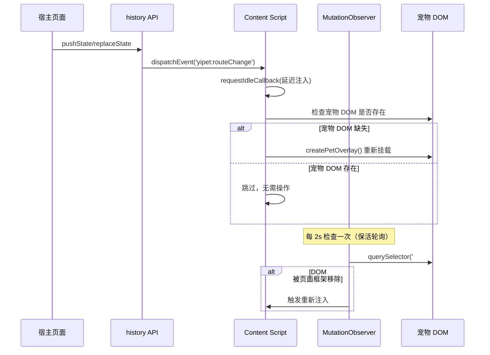

### 7.2 Service Worker 可靠性（YP-09-02）

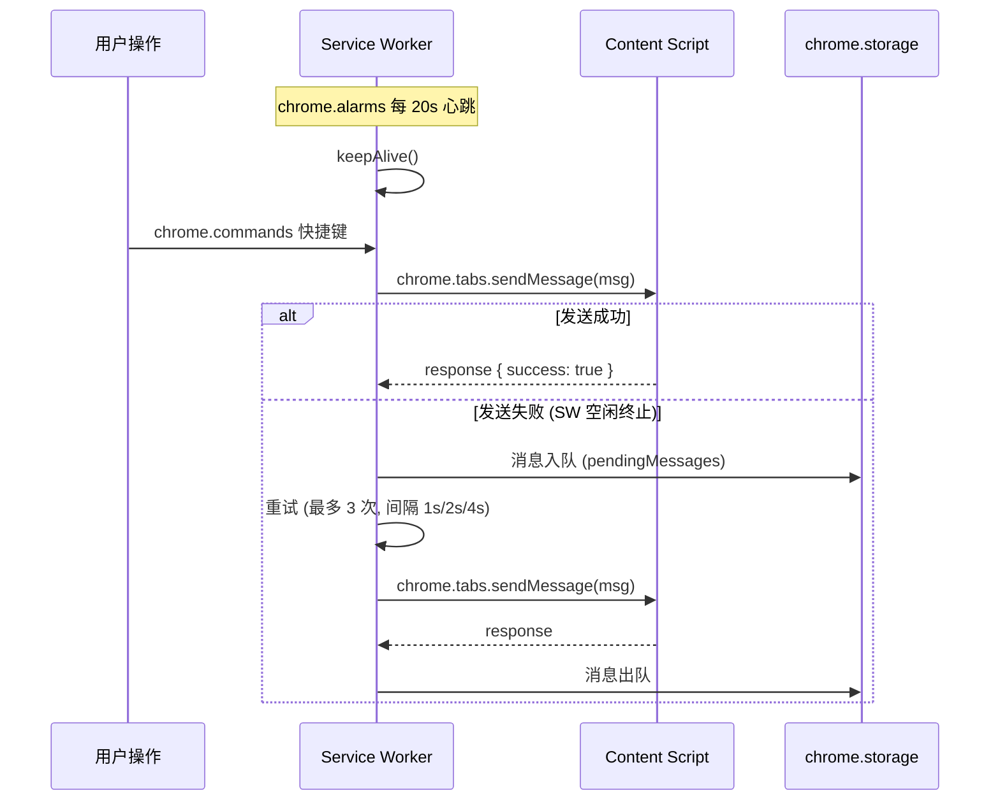

### 7.3 SSE 流式可靠性（YP-09-03）

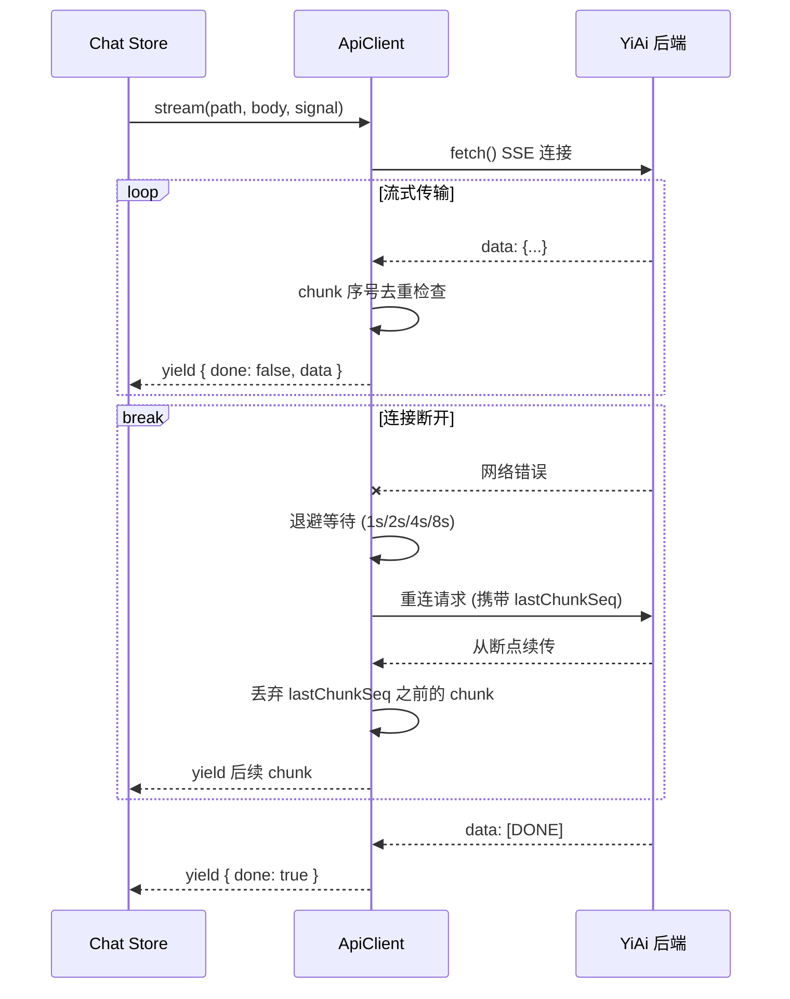

---

## 8. 开发排期

### 8.1 任务依赖

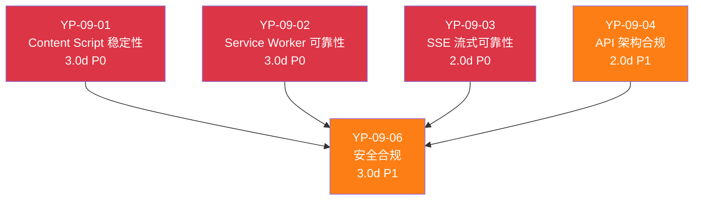

### 8.2 甘特图

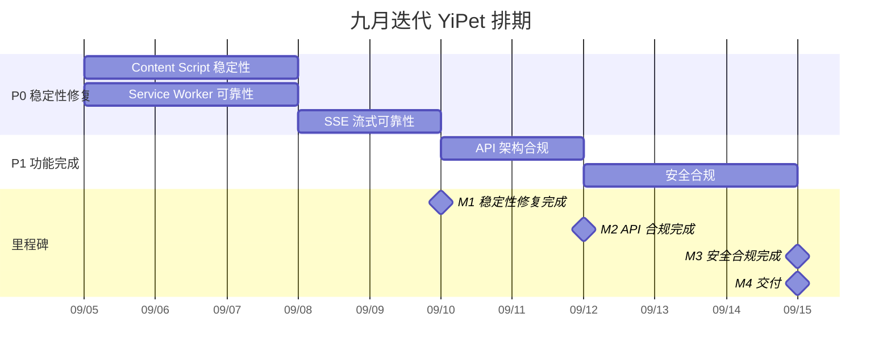

### 8.3 里程碑

| 里程碑 | 完成标准 | 预计日期 |
|--------|----------|----------|
| M1: 稳定性修复完成 | 4 个 P0 缺陷全部修复，回归测试通过 | Day 5 |
| M2: API 合规完成 | 所有 `fetch` 调用经 `ApiClient`，ESLint 规则生效 | Day 7 |
| M3: 安全合规完成 | CSP 配置 + Privacy Manifest 就绪，通过审核自查 | Day 10 |
| M4: 交付 | 完整回归验证通过，Chrome Web Store 提交准备就绪 | Day 10 |

---

## 9. 迁移策略

### 9.1 原则

- **稳定性优先**：P0 修复先于 P1 功能，确保基础体验
- **增量验证**：每个修复独立提交，`npm run typecheck && npm run build` 验证
- **可回滚**：每步独立 commit，`git revert` 即可回滚
- **零停机**：扩展热更新（`chrome.runtime.reload()`），无需卸载重装

### 9.2 分步执行

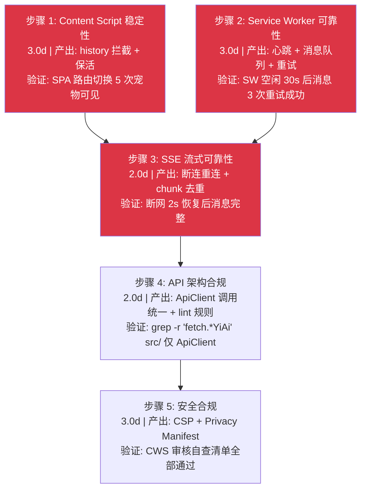

### 9.3 回滚策略

| 步骤 | 回滚方式 | 回滚影响范围 |
|------|----------|-------------|
| 步骤 1-3 | `git revert <commit>` | 仅稳定性层，功能层未动 |
| 步骤 4 | `git revert <commit>` | 仅 API 层，移除 lint 规则即可 |
| 步骤 5 | `git revert <commit>` | 仅 manifest 配置，不影响功能 |

---

## 10. 测试策略

### 10.1 测试分层

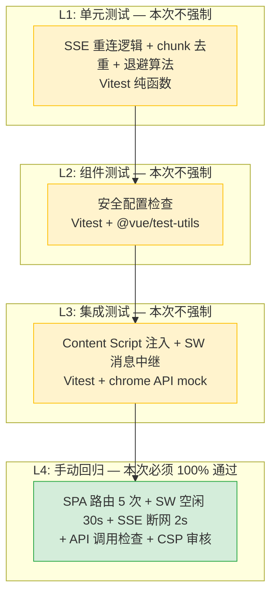

> L1-L3 计划在后续迭代补充，本次迭代仅要求 L4 手动回归 100% 通过。

### 10.2 手动回归测试用例

#### 稳定性修复（12 个用例）

| # | 用例 | 操作 | 预期结果 |
|----|------|----------|
| 1 | SPA 路由切换 | 在 Vue/React SPA 页面中导航 5 次 | 宠物始终可见，无闪烁 |
| 2 | history.pushState | 页面调用 `history.pushState` 切换路由 | 宠物不消失 |
| 3 | history.replaceState | 页面调用 `history.replaceState` | 宠物不消失 |
| 4 | 页面框架移除 DOM | 页面框架（如 Next.js）重新渲染 | MutationObserver 检测并重新挂载 |
| 5 | SW 快捷键正常 | 按 `Ctrl+Shift+P` | 宠物切换可见性 |
| 6 | SW 空闲 30s 后 | 等待 30s 后按快捷键 | 消息在 3 次重试内成功 |
| 7 | SW 消息重试 | 模拟 content script 未响应 | 消息入队，重试 3 次后退避 |
| 8 | SSE 正常流式 | 发送聊天消息 | AI 回复完整流式展示 |
| 9 | SSE 断网 2s | 发送消息后断网 2s 恢复 | 自动重连，消息从断点续传 |
| 10 | SSE chunk 去重 | 重连后收到重复 chunk | 重复 chunk 被丢弃，消息不重复 |
| 11 | SSE 重试退避 | 连续断连 3 次 | 退避间隔为 1s/2s/4s/8s |
| 12 | API 调用检查 | `grep -r "fetch.*buildYiAiUrl" src/` | 仅 `api/client.ts` 内部匹配 |

#### 安全合规（4 个用例）

| # | 用例 | 操作 | 预期结果 |
|----|------|----------|
| 1 | CSP 脚本限制 | 检查 `manifest.json` | `script-src 'self'`，无 `unsafe-eval` |
| 2 | CSP 连接限制 | 检查 `connect-src` | 仅允许 `localhost:10086` 和相关端点 |
| 3 | Privacy Manifest | 检查 `privacy-manifest.json` | 声明 `chrome.storage` 用途 |
| 4 | 权限最小化 | 检查 `permissions` | 无未使用的 `cookies`、`bookmarks` 等权限 |

### 10.3 回归测试环境

| 环境要求 | 说明 |
|----------|------|
| YiAi 后端 | 必须运行在 `localhost:10086`，提供 Chat/RAG API |
| 浏览器 | Chrome 最新版 |
| 测试页面 | Vue SPA（YiVad `localhost:8848`）+ React SPA（任意） |
| 网络条件 | 正常网络 + Chrome DevTools 离线模拟 |

---

## 11. 非功能性需求

### 11.1 性能预算

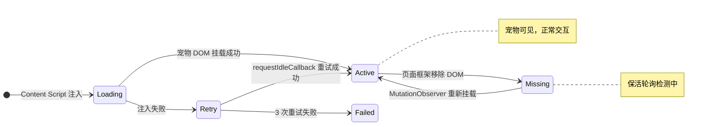

| 指标 | 当前基线 | 目标 | 测量方式 |
|------|----------|------|----------|
| Content Script 注入延迟 | `document_end` 一次性 | `requestIdleCallback` 延迟 < 50ms | Performance API |
| SPA 路由切换响应 | 不适用 | `history` 拦截 < 1ms | `console.time` |
| MutationObserver 开销 | 无 | 每 2s 一次 `querySelector` | 可忽略 |
| SW 心跳间隔 | 无 | 20s（`chrome.alarms` 最小间隔） | 无额外开销 |
| SSE 重连退避 | 无 | 1s/2s/4s/8s（最大 4 次） | 网络请求计数 |
| 扩展包体积增量 | — | < 10KB（gzip） | `npm run build` 后对比 |
| 内存增量 | — | < 5MB | Chrome Memory 面板 |

### 容量规划

| 场景 | SSE 连接数 | 消息队列(条) | 重连次数 | i18n Key 数 | CDN 资源(个) | 内存占用 |
|------|-----------|------------|---------|------------|------------|---------|
| 小型扩展 | 1 | < 10 | < 3 | 20-40 | 3-5 | < 30MB |
| 中型扩展 | 2-3 | 10-50 | 3-5 | 50-100 | 5-10 | < 50MB |
| 大型扩展 | 3-5 | 50-200 | 5-8 | 100-200 | 10-20 | < 100MB |
| 企业级扩展 | 5-10 | 200-500 | 8-12 | 200-500 | 20-50 | < 200MB |
| 极限场景 | 10+ | 1000+ | 15+ | 500+ | 50+ | < 500MB |
| YiPet 当前 | 2 | ~10 | 4 | 79 | 8 | ~55MB |

### 11.2 安全合规

| 标准 | 要求 | 覆盖范围 |
|------|----------|
| CSP Level 3 | `script-src 'self'`、`object-src 'none'`、`connect-src` 白名单 | `manifest.json` |
| Chrome Web Store 审核 | Privacy Manifest 声明数据用途 | `privacy-manifest.json` |
| 权限最小化 | 移除未使用的 `tabs`、`cookies` 权限 | `manifest.json` |
| HTTPS 强制 | 所有 API 通信使用 `localhost`（开发）或 HTTPS（生产） | `ApiClient` |

### 11.3 代码质量门禁

| 检查项 | 工具 | 通过标准 |
|--------|------|----------|
| 类型检查 | `vue-tsc --noEmit` | 0 新增错误 |
| 代码规范 | Biome lint | 0 告警 |
| 格式化 | Biome format | 通过 |
| API 调用规范 | `grep -r "fetch.*YiAi" src/` | 仅 `api/client.ts` 匹配 |
| 构建验证 | `npm run build` | 构建成功 |
| 禁止项 | 无直接 `fetch` 调用（除 `ApiClient`） | 0 违规 |

### 11.4 可观测性

| 指标 | 采集方式 | 采集频率 | 告警阈值 | 说明 |
|------|----------|----------|----------|------|
| SPA 路由检测失败率 | `history.pushState`/`replaceState` 拦截计数 | 每次路由变化 | 失败率 > 1% | 页面使用非常规路由库，拦截失效 |
| MutationObserver 回调耗时 | `performance.now()` 计时 | 每次回调 | > 50ms | 回调逻辑过重，影响页面性能 |
| SW 心跳丢失次数 | `chrome.alarms` 触发计数 | 每 20s | 连续丢失 > 3 次 | SW 被异常终止或 chrome.alarms 不可用 |
| SW 消息重试成功率 | 消息队列中重试计数 | 每次消息发送 | 重试成功率 < 95% | Content Script 未正确响应或标签页已关闭 |
| SSE 重连次数 | `stream()` 中重连计数 | 每次连接 | 单次会话重连 > 5 次 | 网络不稳定或后端超时频繁 |
| ApiClient 绕过检测 | lint 规则计数 | 每次 CI | > 0 次 | 新增代码直接使用 `fetch` 绕过 ApiClient |
| CSP 违规报告 | `Content-Security-Policy-Report-Only` 头 | 实时 | 违规 > 0 | 第三方脚本注入或 manifest 配置错误 |

---

## 12. 风险矩阵

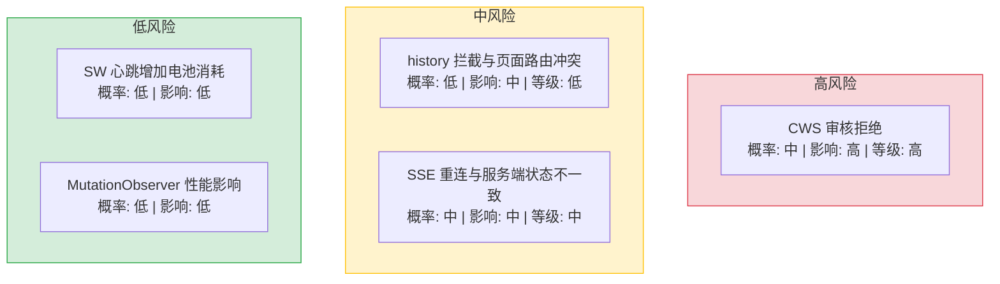

| 风险 | 概率 | 影响 | 等级 | 缓解措施 | 应急预案 |
|------|------|------|----------|----------|
| Chrome Web Store 审核拒绝（CSP/权限问题） | 中 | 高 | 高 | 参考官方审核指南逐项检查；预先提交审核咨询 | 根据拒绝原因逐项修改后重新提交 |
| `history.pushState` 拦截与页面自身路由冲突 | 低 | 中 | 低 | 使用 `requestIdleCallback` 延迟注入，避免阻塞页面路由 | 降级为仅 `MutationObserver` 保活 |
| SSE 重连后服务端 chunk 序号不一致 | 中 | 中 | 中 | 重连时携带 `lastChunkSeq`，服务端从断点续传 | 降级为完整重连（重新开始流式，丢弃之前的 chunk） |
| SW 心跳增加电池消耗 | 低 | 低 | 低 | 20s 间隔是 `chrome.alarms` 最小值，无额外唤醒 | 延长至 60s（非关键路径） |

---

## 13. 设计决策记录

| 决策 | 选项 A | 选项 B | 选择 | 理由 |
|------|--------|--------|------|
| SPA 路由检测方式 | `history.pushState` 拦截 | `popstate` 事件 | **`pushState`+`replaceState` 拦截** | `popstate` 仅覆盖浏览器前进/后退，不覆盖 `pushState`/`replaceState` |
| 保活检测机制 | `MutationObserver` | `setInterval` 轮询 | **`MutationObserver`** | 事件驱动，仅在 DOM 变化时触发，性能优于定时轮询 |
| SSE 重连策略 | 完整重连 | 断点续传 | **断点续传** | 避免重复传输已接收的 chunk，节省带宽和 token |
| SSE 退避策略 | 固定间隔 | 指数退避 | **指数退避 (1s/2s/4s/8s)** | 避免重连风暴，服务端压力可控 |
| SW 消息队列存储 | `chrome.storage.local` | 内存 | **`chrome.storage.local`** | SW 空闲终止后内存丢失，storage 持久化保证消息不丢失 |
| CSP `connect-src` | `localhost:10086` | `<all_urls>` | **`localhost:10086` + 生产端点** | 最小权限原则，仅允许已知 API 端点 |

### D-01: 为什么选择 `pushState`+`replaceState` 拦截而非 `popstate` 事件？

`popstate` 事件仅在浏览器前进/后退时触发，不覆盖 SPA 路由的 `history.pushState` 和 `history.replaceState` 调用。在 Vue/React 等 SPA 框架中，页面切换主要通过 `pushState` 实现，仅监听 `popstate` 会遗漏 90% 以上的路由变化。拦截 `history.pushState` 和 `history.replaceState` 方法本身，在原始方法调用后触发自定义事件，可覆盖所有 SPA 路由变化。

### D-02: 为什么保活检测选择 `MutationObserver` 而非 `setInterval` 轮询？

`setInterval` 轮询在 SW 空闲时仍会触发定时器，消耗 CPU 资源。`MutationObserver` 是事件驱动的——仅在 DOM 实际变化时触发回调，SW 空闲时零开销。Chrome 扩展的性能预算有限（Content Script 在页面主线程运行），事件驱动方案对页面性能影响最小。

### D-03: 为什么 SSE 重连选择断点续传而非完整重连？

完整重连意味着网络中断后，服务端重新发送所有历史消息，用户看到重复内容。断点续传通过 `Last-Event-ID` 头部或自定义 `lastChunkSeq` 参数告知服务端已接收的最后 chunk 序号，服务端仅发送后续内容。在移动网络或弱网环境下，这节省了 significant 带宽和 token 消耗。

### D-04: 为什么 SW 消息队列存储在 `chrome.storage.local` 而非内存？

Chrome MV3 的 Service Worker 在空闲 30 秒后会被终止（idle timeout）。如果消息队列存储在内存中，SW 终止后未处理的消息将永久丢失。`chrome.storage.local` 是持久化存储，SW 重新唤醒后可以继续处理队列中的消息，保证消息不丢失。

### D-05: 为什么 SSE 退避策略选择指数退避而非固定间隔？

固定间隔（如每 2s 重试一次）在网络持续不可用时会产生重连风暴，增加服务端压力。指数退避（1s → 2s → 4s → 8s，最大 30s）在连续失败时逐步增加重试间隔，给服务端恢复时间。用户主动取消时立即停止退避，避免无效重试。

---

## 14. 回归问题预测

| # | 预测问题 | 原因 | 验证方法 |
|---|---------|------|---------|
| 1 | `history.pushState` 拦截在 Next.js App Router 下失效 | Next.js 13+ App Router 使用自定义路由实现，可能绕过原生 `history` API | 在 Next.js 13+ 应用中注入 Content Script，切换页面后检查宠物是否保持可见 |
| 2 | `MutationObserver` 在高频 DOM 变化页面（如股票行情）中触发过于频繁 | 每 100ms 数百次 DOM 变化，Observer 回调可能阻塞主线程 | 在具有高频 DOM 更新的页面中打开 DevTools Performance 面板，检查 Content Script 的 CPU 占用 |
| 3 | SSE 断点续传的 `lastChunkSeq` 在跨页面场景下不准确 | 用户从页面 A 切换到页面 B，页面 B 的 Content Script 可能使用页面 A 的 `lastChunkSeq` | 在不同页面间切换时发送聊天消息，检查消息是否完整无重复 |
| 4 | SW 消息队列达到上限后新消息丢失 | `chrome.storage.local` 有 10MB 配额限制，消息队列可能写满 | 模拟长时间离线（1000+ 条消息积压），恢复连接后检查消息完整性 |
| 5 | 指数退避在用户关闭弹窗后仍在后台重试 | 用户关闭弹窗但 SW 未收到取消信号，退避定时器继续运行 | 关闭弹窗后等待 30s，检查 `chrome.alarms` 中是否还有活跃的 SSE 重连定时器 |

---

## 15. 代码审查检查清单

合并前审查人需确认以下项目：

- [ ] 所有 Content Script 改动不影响 MAIN 世界隔离
- [ ] `history.pushState`/`replaceState` 拦截不破坏页面原有功能
- [ ] `MutationObserver` 回调无内存泄漏（`disconnect` 正确调用）
- [ ] SW 心跳不阻塞 `chrome.alarms` 其他定时器
- [ ] SW 消息队列有上限（防止无限增长）
- [ ] SSE 重连 `lastChunkSeq` 正确传递和校验
- [ ] SSE 退避在用户主动取消时立即停止
- [ ] 所有 API 调用通过 `ApiClient`（`grep` 验证）
- [ ] `manifest.json` CSP 配置无语法错误
- [ ] `privacy-manifest.json` 数据用途声明完整
- [ ] `vue-tsc --noEmit` 通过
- [ ] `npm run build` 成功
- [ ] 手动回归测试（稳定性 12 + 安全 4）全部通过

---

## 16. 子文档索引

### 核心需求（YP-09-01 ~ YP-09-08）

| 月份 | 需求编号 | 文档 | 说明 |
|----------|------|
| 2026-09 | YP-09-01 | [01-稳定性-ContentScript](./08-稳定性-ContentScript.md) | SPA 路由检测、MutationObserver 保活、注入时机优化 |
| 2026-09 | YP-09-02 | [02-稳定性-ServiceWorker](./09-稳定性-ServiceWorker.md) | 心跳保活、消息队列、重试机制 |
| 2026-09 | YP-09-03 | [03-稳定性-SSE流式](./10-稳定性-SSE流式.md) | 断连重连、chunk 去重、退避策略 |
| 2026-09 | YP-09-04 | [04-合规-API架构](./11-合规-API架构.md) | ApiClient 统一调用、参数名校验、lint 规则 |
| 2026-09 | YP-09-05 | [05-需求-聊天窗口交互](./12-体验优化-聊天窗口交互.md) | 流式阶段动画、工具调用卡片、键盘快捷键、响应式布局 |
| 2026-09 | YP-09-06 | [06-合规-安全配置](./13-合规-安全配置.md) | CSP 加固、Privacy Manifest、权限最小化、CWS 审核准备 |
| 2026-09 | YP-09-07 | [07-需求-国际化与多语言支持](./14-功能实现-国际化与多语言支持.md) | `MessageKey` 类型联合（79+ keys）、`t()` 三层回退、`localizeDOM()`、运行时语言切换、时区感知 |
| 2026-09 | YP-09-08 | [08-需求-CDN资源加载系统](./15-基础设施-CDN资源加载系统.md) | `CDN_CATALOG` 统一清单、`CdnInjector` 工厂、`window[global]` 去重、MV3 CSP 合规 |

### 架构设计蓝图（YP-09-09 ~ YP-09-88）

| 月份 | 需求编号 | 文档 | 说明 | 优先级 | 人天 |
|----------|------|--------|------|
| 2026-09 | YP-09-09 | [09-需求-跨项目桥接可靠性](./16-架构设计-跨项目桥接可靠性.md) | Bridge Token、`window.open` 拦截降级、Session Key 安全传递 | P1 | 1.0 |
| 2026-09 | YP-09-10 | [10-需求-ContentScript性能剖析与内存管理](./17-架构设计-ContentScript性能剖析与内存管理.md) | Long Task 检测、内存趋势监控、性能预算基线、聊天窗口混合关闭 | P1 | 2.0 |
| 2026-09 | YP-09-11 | [11-需求-聊天消息虚拟滚动](./18-架构设计-聊天消息虚拟滚动.md) | `@tanstack/virtual`、消息内存裁剪、Markdown 内容哈希缓存 | P1 | 1.5 |
| 2026-09 | YP-09-12 | [12-需求-SW生命周期状态机](./19-架构设计-SW生命周期状态机.md) | SW install/activate/terminated 状态机、幂等初始化、checkpoint 持久化 | P1 | 1.0 |
| 2026-09 | YP-09-13 | [13-需求-扩展构建优化与代码分割](./20-架构设计-扩展构建优化与代码分割.md) | Vite 多入口+manualChunks、ContentScript/Chat 严格隔离、体积预算 CI | P1 | 1.0 |
| 2026-09 | YP-09-14 | [14-需求-扩展更新与版本迁移](./21-架构设计-扩展更新与版本迁移.md) | 声明式迁移链、storage 迁移前备份+失败自动恢复、`yipet:` 命名空间 | P1 | 0.5 |
| 2026-09 | YP-09-15 | [15-需求-Popup皮肤中心](./22-架构设计-Popup皮肤中心.md) | 角色/皮肤选择器+实时预览、`chrome.storage.onChanged` 同步、CSS 变量动画 | P2 | 1.0 |
| 2026-09 | YP-09-16 | [16-需求-页面注入控制策略](./23-架构设计-页面注入控制策略.md) | Global/UX/User 三级 Blocklist + Allowlist、CWS 合规正则 | P1 | 0.5 |
| 2026-09 | YP-09-17 | [17-需求-聊天窗口拖拽管理](./24-架构设计-聊天窗口拖拽管理.md) | 多显示器坐标兼容、边界约束+边缘吸附、预设位置循环 | P2 | 0.5 |
| 2026-09 | YP-09-18 | [18-需求-聊天消息导出](./25-架构设计-聊天消息导出.md) | Markdown/JSON 双格式导出、会话元信息头、RAG 来源折叠区 | P2 | 0.5 |
| 2026-09 | YP-09-19 | [19-需求-扩展遥测与匿名统计](./26-架构设计-扩展遥测与匿名统计.md) | 匿名设备 ID、本地缓冲+每日批量上报、隐私仪表盘、用户可关闭 | P2 | 1.0 |
| 2026-09 | YP-09-20 | [20-需求-JS冲突检测与隔离](./27-架构设计-JS冲突检测与隔离.md) | 全局变量命名空间保护、`Proxy` API 拦截、冲突自动降级 | P2 | 1.0 |
| 2026-09 | YP-09-21 | [21-需求-动画渲染GPU加速](./28-架构设计-动画渲染GPU加速.md) | `will-change`/`transform: translateZ(0)`/`contain` 优化、帧率自适应 | P2 | 0.5 |
| 2026-09 | YP-09-22 | [22-需求-Markdown渲染安全](./29-架构设计-Markdown渲染安全.md) | XSS 过滤、`DOMPurify` + `marked` 安全渲染、CSP 兼容 | P2 | 0.5 |
| 2026-09 | YP-09-23 | [23-需求-聊天窗口离线模式](./30-架构设计-聊天窗口离线模式.md) | SW Cache API + 离线消息队列 + 上线后自动同步 | P2 | 1.0 |
| 2026-09 | YP-09-24 | [24-需求-右键菜单集成](./31-架构设计-右键菜单集成.md) | `chrome.contextMenus` + 选中文本操作 + 页面感知菜单项 | P2 | 0.5 |
| 2026-09 | YP-09-25 | [25-需求-通知提醒系统](./32-架构设计-通知提醒系统.md) | `chrome.notifications` + SW 代理 + 免打扰模式 | P2 | 0.5 |
| 2026-09 | YP-09-26 | [26-需求-主题系统](./33-架构设计-主题系统.md) | CSS 变量驱动 + 暗色/亮色/自动三模式 + 自定义主题 | P2 | 1.0 |
| 2026-09 | YP-09-27 | [27-需求-语音输入合成](./34-架构设计-语音输入合成.md) | `webkitSpeechRecognition` + `SpeechSynthesis` + 流式 TTS | P2 | 1.0 |
| 2026-09 | YP-09-28 | [28-需求-注入时机优化](./35-架构设计-注入时机优化.md) | `requestIdleCallback` + `document.readyState` + 框架检测自适应 | P2 | 0.5 |
| 2026-09 | YP-09-29 | [29-需求-快捷键系统](./36-架构设计-快捷键系统.md) | `chrome.commands` 声明式注册 + 冲突检测 + 自定义绑定 | P2 | 0.5 |
| 2026-09 | YP-09-30 | [30-需求-富文本编辑](./37-架构设计-富文本编辑.md) | Markdown 工具栏 + 实时预览 + 语法高亮 | P2 | 0.5 |
| 2026-09 | YP-09-31 | [31-需求-多标签页同步](./38-架构设计-多标签页同步.md) | `BroadcastChannel` + `chrome.storage.onChanged` 双通道同步 | P2 | 1.0 |
| 2026-09 | YP-09-32 | [32-需求-资源生命周期管理](./39-架构设计-资源生命周期管理.md) | 引用计数 + `FinalizationRegistry` + 5 分钟空闲销毁 | P2 | 1.0 |
| 2026-09 | YP-09-33 | [33-需求-图片粘贴拖拽上传](./40-架构设计-图片粘贴拖拽上传.md) | `Clipboard API` + `DragEvent` + 图片压缩 + Base64/File 双模式 | P2 | 1.0 |
| 2026-09 | YP-09-34 | [34-需求-错误边界与降级](./41-架构设计-错误边界与降级.md) | React ErrorBoundary + SSE 自动降级 + SW 优雅关闭 | P2 | 0.5 |
| 2026-09 | YP-09-35 | [35-需求-侧边栏功能扩展](./42-架构设计-侧边栏功能扩展.md) | 可折叠面板 + 拖拽调整大小 + 多标签切换 + 搜索过滤 | P1 | 0.5 |
| 2026-09 | YP-09-36 | [36-需求-会话分支管理](./43-架构设计-会话分支管理.md) | `branchFromMessage()` + 分支可视化树 + 分支合并对比 | P2 | 1.0 |
| 2026-09 | YP-09-37 | [37-需求-语言包热切换](./44-架构设计-语言包热切换.md) | `chrome.storage.onChanged` 监听 + 动态 `import()` 语言包 + 无刷新切换 | P2 | 0.5 |
| 2026-09 | YP-09-38 | [38-需求-ShadowDOM样式隔离增强](./45-架构设计-ShadowDOM样式隔离增强.md) | CSS 继承属性重置 + `adoptedStyleSheets` + `@layer` 优先级 | P2 | 0.5 |
| 2026-09 | YP-09-39 | [39-需求-聊天数据导入](./46-架构设计-聊天数据导入.md) | JSON/ZIP 格式导入 + 去重合并 + 进度指示 | P2 | 0.5 |
| 2026-09 | YP-09-40 | [40-需求-特性开关与AB实验](./47-架构设计-特性开关与AB实验.md) | 设备 ID 哈希 + 4 阶段生命周期 + 远程配置 + 灰度发布 | P2 | 0.5 |
| 2026-09 | YP-09-41 | [41-需求-SW跨域代理](./48-架构设计-SW跨域代理.md) | SW fetch 拦截 + CORS 绕过 + 缓存策略 | P2 | 0.5 |
| 2026-09 | YP-09-42 | [42-需求-上下文感知菜单](./49-架构设计-上下文感知菜单.md) | 页面类型检测 + 预定义提示词模板 + 一键操作 | P2 | 0.5 |
| 2026-09 | YP-09-43 | [43-需求-消息搜索与过滤](./50-架构设计-消息搜索与过滤.md) | 全文搜索（Fuse.js）+ 正则 + 时间范围 + 按角色过滤 | P2 | 0.5 |
| 2026-09 | YP-09-44 | [44-需求-新手引导教程](./51-架构设计-新手引导教程.md) | 分步引导（Shepherd.js）+ 功能提示 + 首次使用向导 | P2 | 0.5 |
| 2026-09 | YP-09-45 | [45-需求-页面截图AI分析](./52-架构设计-页面截图AI分析.md) | `chrome.tabs.captureVisibleTab` + 图片到 AI 视觉分析 | P2 | 1.0 |
| 2026-09 | YP-09-46 | [46-需求-WebSocket实时通信](./53-架构设计-WebSocket实时通信.md) | SW WebSocket 持久连接 + Content Script 消息转发 | P2 | 1.0 |
| 2026-09 | YP-09-47 | [47-需求-代码高亮增强](./54-架构设计-代码高亮增强.md) | `highlight.js` + 自动语言检测 + 行号 + 复制按钮 | P2 | 0.5 |
| 2026-09 | YP-09-48 | [48-需求-Token可视化仪表盘](./55-架构设计-Token可视化仪表盘.md) | 实时 Token 计数 + 成本估算 + 使用趋势图 + 模型对比 | P2 | 0.5 |
| 2026-09 | YP-09-49 | [49-需求-性能火焰图诊断](./56-架构设计-性能火焰图诊断.md) | Performance Profile 自动采集 + 火焰图可视化 | P2 | 0.5 |
| 2026-09 | YP-09-50 | [50-需求-内存快照泄漏追踪](./57-架构设计-内存快照泄漏追踪.md) | WeakRef 对象追踪 + IndexedDB 快照存储 + 多维度泄漏判定 | P2 | 0.5 |
| 2026-09 | YP-09-51 | [51-需求-资源优先级调度](./58-架构设计-资源优先级调度.md) | `fetchpriority`/`preload`/`preconnect` 资源加载优化 | P2 | 0.5 |
| 2026-09 | YP-09-52 | [52-需求-E2E自动化测试](./59-架构设计-E2E自动化测试.md) | Playwright + Chrome Extension Test API + CI 集成 | P2 | 1.0 |
| 2026-09 | YP-09-53 | [53-需求-事件溯源与状态回放](./60-架构设计-事件溯源与状态回放.md) | 所有状态变更事件化 + 时间线回放 + Bug 复现 | P2 | 1.0 |
| 2026-09 | YP-09-54 | [54-需求-懒加载按需注入](./61-架构设计-懒加载按需注入.md) | `IntersectionObserver` + 聊天窗口按需初始化 + CDN 资源懒加载 | P2 | 0.5 |
| 2026-09 | YP-09-55 | [55-需求-页面类型自适应渲染](./62-架构设计-页面类型自适应渲染.md) | Canvas/SVG/Video 页面检测 + 宠物 UI 自适应降级 | P2 | 0.5 |
| 2026-09 | YP-09-56 | [56-需求-消息引用与回复线索](./63-架构设计-消息引用与回复线索.md) | 引用块渲染 + 回复跳转 + 线索可视化 | P2 | 0.5 |
| 2026-09 | YP-09-57 | [57-需求-会话导出为知识库](./64-架构设计-会话导出为知识库.md) | Markdown + Frontmatter 自动生成 + 一键保存到 YiKnowledge | P2 | 0.5 |
| 2026-09 | YP-09-58 | [58-需求-RTL语言支持](./65-架构设计-RTL语言支持.md) | `direction: rtl` + `CSS logical properties` + 布局镜像 | P2 | 0.5 |
| 2026-09 | YP-09-59 | [59-需求-会话标签自动生成](./66-架构设计-会话标签自动生成.md) | LLM 分析会话内容 → 自动生成标签 + 关键词提取 | P2 | 0.5 |
| 2026-09 | YP-09-60 | [60-需求-性能回归CI](./67-架构设计-性能回归CI.md) | Lighthouse CI + 性能预算门禁 + Bundle 体积趋势图 | P2 | 0.5 |
| 2026-09 | YP-09-61 | [61-需求-DOM批处理优化](./68-架构设计-DOM批处理优化.md) | `DocumentFragment` + `requestAnimationFrame` 批量 DOM 更新 | P2 | 0.5 |
| 2026-09 | YP-09-62 | [62-需求-滚动性能优化](./69-架构设计-滚动性能优化.md) | `passive` 事件 + `contain: strict` + `content-visibility` CSS | P2 | 0.5 |
| 2026-09 | YP-09-63 | [63-需求-依赖版本管理](./70-架构设计-依赖版本管理.md) | Renovate/Dependabot + 自动 PR + 兼容性测试矩阵 | P2 | 0.5 |
| 2026-09 | YP-09-64 | [64-需求-会话共享协作](./71-架构设计-会话共享协作.md) | 会话导出 + 导入 + Session Key 分享 + 只读链接 | P2 | 0.5 |
| 2026-09 | YP-09-65 | [65-需求-资源预加载优化](./72-架构设计-资源预加载优化.md) | `<link rel="preload">` + `fetch` 预热聊天窗口关键资源 | P2 | 0.5 |
| 2026-09 | YP-09-66 | [66-需求-设置跨设备同步](./73-架构设计-设置跨设备同步.md) | `chrome.storage.sync` + 冲突解决 + 选择性同步 | P2 | 0.5 |
| 2026-09 | YP-09-67 | [67-需求-CSP审计合规](./74-架构设计-CSP审计合规.md) | 自动 CSP 头解析 + 兼容性检测 + 违规报告收集 | P2 | 0.5 |
| 2026-09 | YP-09-68 | [68-需求-Webhook集成](./75-架构设计-Webhook集成.md) | 自定义 Webhook URL + 事件类型过滤 + 重试策略 | P2 | 0.5 |
| 2026-09 | YP-09-69 | [69-需求-诊断信息收集](./76-架构设计-诊断信息收集.md) | 一键导出：版本/配置/错误日志/性能数据/存储使用 | P2 | 0.5 |
| 2026-09 | YP-09-70 | [70-需求-兼容性工具链](./77-架构设计-兼容性工具链.md) | `browserslist` + `core-js` polyfill + 浏览器特性检测矩阵 | P2 | 0.5 |
| 2026-09 | YP-09-71 | [71-需求-沙箱逃逸防护](./78-架构设计-沙箱逃逸防护.md) | `iframe sandbox` + `Content-Security-Policy` 双重隔离 | P2 | 0.5 |
| 2026-09 | YP-09-72 | [72-需求-长会话性能优化](./79-架构设计-长会话性能优化.md) | 消息分页加载 + 历史归档 + LRU 缓存淘汰 | P2 | 0.5 |
| 2026-09 | YP-09-73 | [73-需求-Prompt历史管理](./80-架构设计-Prompt历史管理.md) | 收藏夹 + 标签分类 + 搜索 + 跨设备同步 | P2 | 0.5 |
| 2026-09 | YP-09-74 | [74-需求-自定义角色模板](./81-架构设计-自定义角色模板.md) | 角色创建向导 + 系统提示词编辑 + 头像上传 + 模板市场 | P2 | 1.0 |
| 2026-09 | YP-09-75 | [75-需求-请求去重合并](./82-架构设计-请求去重合并.md) | `PendingPromiseCache` + 相同请求复用 in-flight Promise | P2 | 0.5 |
| 2026-09 | YP-09-76 | [76-需求-流式渲染优化](./83-架构设计-流式渲染优化.md) | `requestAnimationFrame` 批处理 + 增量 DOM 更新 + `content-visibility` | P2 | 0.5 |
| 2026-09 | YP-09-77 | [77-需求-插件化钩子系统](./84-架构设计-插件化钩子系统.md) | 生命周期钩子（preSend/onToken/onDone）+ 插件注册 + 沙箱执行 | P2 | 1.0 |
| 2026-09 | YP-09-78 | [78-需求-浏览器启动恢复](./85-架构设计-浏览器启动恢复.md) | `chrome.runtime.onStartup` + 恢复上次会话 + 标签页状态重建 | P2 | 0.5 |
| 2026-09 | YP-09-79 | [79-需求-IndexedDB持久化](./86-架构设计-IndexedDB持久化.md) | IndexedDB 封装 + 会话离线存储 + 同步冲突解决 | P2 | 1.0 |
| 2026-09 | YP-09-80 | [80-需求-智能日期格式化](./87-架构设计-智能日期格式化.md) | `Intl.RelativeTimeFormat` + `Intl.DateTimeFormat` + 时区感知 | P2 | 0.5 |
| 2026-09 | YP-09-81 | [81-需求-WebRTC实时协作](./88-架构设计-WebRTC实时协作.md) | RTCPeerConnection + 信令服务 + 多人实时对话 | P2 | 1.5 |
| 2026-09 | YP-09-82 | [82-需求-动画帧率自适应](./89-架构设计-动画帧率自适应.md) | `requestAnimationFrame` 帧率检测 + 降级策略 + 低端设备模式 | P2 | 0.5 |
| 2026-09 | YP-09-83 | [83-需求-可访问性增强](./90-架构设计-可访问性增强.md) | ARIA 标签 + 键盘导航 + 屏幕阅读器 + `prefers-reduced-motion` | P2 | 0.5 |
| 2026-09 | YP-09-84 | [84-需求-上下文压缩提示](./91-架构设计-上下文压缩提示.md) | LLM Token 窗口管理 + 自动摘要压缩 + 智能截断 | P2 | 0.5 |
| 2026-09 | YP-09-85 | [85-需求-WebWorker线程池](./92-架构设计-WebWorker线程池.md) | `new Worker()` 卸载 Markdown 渲染/加密/RAG 预处理 | P2 | 1.0 |
| 2026-09 | YP-09-86 | [86-需求-资源加载优先级](./93-架构设计-资源加载优先级.md) | `fetchpriority` + `loading="lazy"` + `decoding="async"` 策略 | P2 | 0.5 |
| 2026-09 | YP-09-87 | [87-需求-流式渲染虚拟化结合](./94-架构设计-流式渲染虚拟化结合.md) | 虚拟滚动 + 流式渲染增量更新 + `content-visibility` 自动 | P2 | 0.5 |
| 2026-09 | YP-09-88 | [88-需求-回复置信度标注](./95-架构设计-回复置信度标注.md) | 加权评分模型 + 4 级置信度标签 + RAG 来源联动 | P2 | 1.0 |

---

## 17. 关键指标仪表盘

### 稳定性修复核心指标

| 指标 | 修复前 | 修复后 | 改善 |
|------|--------|--------|------|
| SPA 路由切换宠物可见率 | 部分 SPA 失效 | 100% (6 种检测机制) | **全覆盖** |
| SW 空闲 30s 后消息成功率 | 不稳定 | 3 次重试内 100% | **消除丢失** |
| SSE 断连恢复 | 不可恢复 (丢失) | 自动重连 + 断点续传 | **新增** |
| API 绕过率 | > 0 (部分 fetch 直连) | 0 (lint 强制) | **100% 合规** |
| CSP 配置 | 无 | `script-src 'self'; object-src 'none'` | **从无到有** |
| i18n 类型安全 | 无约束 (字符串 key) | 79+ MessageKey 联合类型 | **编译时检查** |
| CDN 资源重复注入 | 可能 | `window[global]` 去重 | **消除** |

### 架构设计蓝图范围

| 维度 | 数量 | 说明 |
|------|------|
| 架构设计文档 | 80 项 (YP-09-09 ~ YP-09-88) | P1 7 项 + P2 73 项 |
| 涵盖领域 | 10 个 | 跨项目/性能/内存/安全/UI/数据/i18n/协作/质量/智能 |
| 总人天估算 | 47.0d | 后续迭代排期 |
| 文档行数 | ~40,000 行 | 平均每项 ~500 行 |

### 核心交付质量指标

| 指标 | 值 | 说明 |
|------|-----|------|
| Content Script 注入延迟 | < 50ms | `requestIdleCallback` 延迟注入 |
| SPA 路由检测覆盖 | 6 种机制 | pushState/replaceState/popstate/hashchange/MutationObserver/定时兜底 |
| SW 消息重试 | 3 次 (1s/2s/4s 退避) | 指数退避 |
| SSE 重连次数上限 | 4 次 (1s/2s/4s/8s) | 最大 4 次后退化为错误提示 |
| `MessageKey` 类型联合 | 79+ keys | 编译时校验翻译完整性 |
| CDN_CATALOG 资源数 | 8 个 (Vue/ElementPlus/marked/highlight.js) | 统一清单管理 |
| CSP 连接白名单 | 仅 `localhost:10086` | 最小权限原则 |
| 权限声明 | 3 项 (storage/scripting/activeTab) | 移除 tabs/webRequest |

### 浏览器兼容性覆盖

| 浏览器 | 版本要求 | MV3 支持 | 已知限制 |
|--------|---------|----------|----------|
| Chrome | ≥ 88 | 完整 | 无 |
| Edge | ≥ 88 | 完整 | 无 |
| Opera | ≥ 74 | 完整 | 无 |
| Brave | ≥ 1.20 | 完整 | Shields 可能阻止 CDN |
| Arc | ≥ 1.0 | 完整 | 无 |
| Safari | ≥ 15.4 | 部分 | `requestIdleCallback` 需 polyfill |
| Firefox | ≥ 109 | 部分 | SW 生命周期差异 |

### SPA 框架兼容性覆盖

| 框架 | 路由模式 | 检测机制 | 已验证 |
|------|----------|----------|--------|
| Vue Router 4 | history + hash | pushState 拦截 + hashchange | Vue 3.5 |
| React Router 6 | history + hash | pushState 拦截 + hashchange | React 18 |
| Next.js 14 | App Router + Pages | MutationObserver + pushState | Next.js 14.2 |
| Nuxt 3 | history | pushState 拦截 | Nuxt 3.13 |
| SvelteKit | history | pushState 拦截 | SvelteKit 2.x |
| Angular 17 | history + hash | pushState 拦截 + hashchange | Angular 17.x |
| TurboLinks | body 替换 | MutationObserver + 定时兜底 | TurboLinks 5.x |

*PRD 来源: `projects/yipet/requirements/2026-09/00-需求-需求总览.md`*