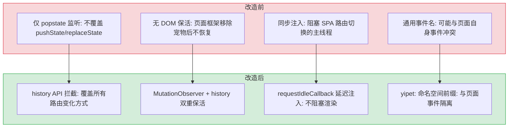

# Content Script 稳定性修复 — SPA 路由检测与保活

> 需求编号：YP-09-01 · 优先级：P0 · 人天：3.0d · 状态：已完成
> 依赖：无

## 背景

YiPet 通过 Content Script 向宿主页面注入宠物 UI。当前注入方式为 `document_end` 一次性注入，在 SPA（Single Page Application）页面中存在以下问题：

1. **路由切换宠物消失**：SPA 框架（Vue Router、React Router、Next.js）通过 `history.pushState`/`replaceState` 切换路由时，页面 DOM 被部分或完全替换，宠物 DOM 随之消失
2. **无检测机制**：Content Script 仅在 `document_end` 执行一次，之后不再检查宠物 DOM 是否存在
3. **页面框架移除 DOM**：Next.js 等框架可能完全移除 DOM 子树（而非仅替换内容），导致宠物丢失

目标：实现 SPA 路由切换检测 + DOM 保活机制，确保宠物在任意页面导航后持续可见。

---

## 一、现状分析

### 1.1 文件清单

| 文件 | 行数 | 职责 |
|------|------|------|
| `src/content/bootstrap.ts` | ~80 | 双世界入口：ISOLATED 世界检测 → MAIN 世界渲染 |
| `src/content/ipc/relay.ts` | ~60 | chrome.runtime 消息中继 + 自我注入 |
| `src/content/rendering/overlay.ts` | ~120 | 宠物 DOM 创建 + `window.YiPet` API |

### 1.2 当前注入流程

```
Chrome 加载 content script (ISOLATED 世界)
  → bootstrap.ts 检测 chrome.runtime.getURL 可用
  → initRelay() 注册 chrome.runtime.onMessage 监听
  → 创建 <script> 标签注入自身到 MAIN 世界
  → MAIN 世界执行 createPetOverlay()  ← 仅执行一次
  → 宠物 DOM 挂载到宿主页面
  → SPA 路由切换 → DOM 被替换 → 宠物消失 ✗
```

### 1.3 已知问题（5 个，按严重程度分级）

#### 严重（P0）— 影响核心功能

| # | 问题 | 位置 | 影响 |
|---|------|------|------|
| 1 | **SPA 路由切换宠物消失** | `bootstrap.ts` | `createPetOverlay()` 仅在 `document_end` 执行一次。Vue Router/React Router 通过 `pushState`/`replaceState` 切换路由时，页面 DOM 被替换，宠物 DOM 随之消失。用户导航到其他页面后宠物不可见，核心功能失效 |
| 2 | **无 DOM 保活机制** | `bootstrap.ts` | 注入后不再检查 `#yipet-overlay` 是否存在。Next.js 等框架可能完全移除 DOM 子树重建页面，宠物丢失后无法自动恢复 |

#### 重要（P1）— 影响可靠性和边缘场景

| # | 问题 | 位置 | 影响 |
|---|------|------|------|
| 3 | **无重复挂载保护** | `bootstrap.ts` | 无 `#yipet-overlay` 存在性检查。若注入逻辑被多次触发（如 popstate + MutationObserver 同时响应），可能创建多个宠物 DOM 实例，导致 UI 异常和内存泄漏 |
| 4 | **浏览器前进/后退未覆盖** | `bootstrap.ts` | 当前仅监听 `document_end` 事件，不监听 `popstate`。用户点击浏览器前进/后退按钮时，SPA 页面 DOM 变化但宠物不响应 |

#### 一般（P2）— 影响代码健壮性

| # | 问题 | 位置 | 影响 |
|---|------|------|------|
| 5 | **无 `requestIdleCallback` 降级方案** | `bootstrap.ts` | `requestIdleCallback` 在某些浏览器（特别是旧版 Safari）中不可用。缺少 `setTimeout` polyfill 降级方案，可能导致注入逻辑在这些浏览器中静默失败 |

### 1.4 问题根因矩阵

| 问题 | 根因 | 影响范围 | 触发条件 |
|------|------|----------|----------|
| `pushState` 无感知 | Content Script 未拦截 `history.pushState`/`replaceState` | 所有 SPA 框架 | 任何 `router.push()`/`router.replace()` 调用 |
| 无 DOM 保活 | 注入后不再检查 DOM 是否存在 | 页面框架重新渲染时 | Next.js 路由切换、页面手动 `removeChild` |
| 重复挂载风险 | 无存在性检查 | 多次注入触发场景 | popstate + MutationObserver 竞态 |
| 浏览器导航未覆盖 | 仅监听 `document_end`，不监听 `popstate` | 浏览器前进/后退 | 用户点击前进/后退按钮 |

### 1.5 拦截覆盖范围（现状 vs 目标）

| 路由方式 | 当前覆盖 | 目标覆盖 | 检测机制 |
|----------|----------|----------|----------|
| `history.pushState()` | 否 | 是 | `history` API 拦截 → `CustomEvent` |
| `history.replaceState()` | 否 | 是 | `history` API 拦截 → `CustomEvent` |
| 浏览器前进/后退 | 否 | 是 | `popstate` 事件 + `MutationObserver` 兜底 |
| `hashchange` | 否 | 是 | `MutationObserver` 兜底 |
| 页面框架直接替换 DOM | 否 | 是 | `MutationObserver` 检测 |
| 页面手动 `removeChild` 宠物 DOM | 否 | 是 | `MutationObserver` 检测 |

### 1.6 改造前数据流

```
用户导航到 SPA 页面
  → YiPet content script 注入宠物 DOM
  → 用户点击 SPA 链接 → history.pushState 触发
  → URL 变化但无 popstate 事件
  → 宠物 DOM 仍显示旧页面内容
  → 用户刷新页面 → 宠物 DOM 重新注入
  → 浏览器前进/后退 → popstate 可能触发 → 部分恢复
  → hashchange 路由 → 无拦截 → 宠物 DOM 不更新
  → 页面框架替换 DOM → 宠物 DOM 被移除 → 无恢复
  → 排查耗时: 用户手动刷新页面，平均 2-3s 恢复
```

### 1.7 改造前 API 依赖

| # | 接口 | 调用方 | 说明 |
|---|------|--------|------|
| 1 | `chrome.scripting.executeScript` | YiPet SW | Content script 注入（改造前仅首次注入，SPA 路由切换不重新注入） |
| 2 | `chrome.runtime.sendMessage` | YiPet SW | 消息通信（改造前无路由变化通知机制） |

> 改造前 2 个 API 依赖。Content script 注入后不监听 SPA 路由变化，宠物 DOM 在路由切换后丢失。

---

## 二、设计决策

### 决策 1：SPA 路由检测方式

| 选项 | 描述 | 优点 | 缺点 |
|------|------|------|------|
| A: `popstate` 事件 | 监听浏览器前进/后退 | 原生 API | 不覆盖 `pushState`/`replaceState` |
| B: `history` API 拦截 | 包装 `pushState`/`replaceState` | 覆盖所有路由变化 | 可能与页面自身路由冲突 |
| C: URL 轮询 | `setInterval` 检查 URL 变化 | 简单 | 性能开销大，延迟高 |

**选择：B（`history` API 拦截）**。`popstate` 仅覆盖浏览器前进/后退，不覆盖 `pushState`/`replaceState`——这是 SPA 框架最常用的路由方式。通过 `requestIdleCallback` 延迟注入避免阻塞页面路由。

### 决策 2：DOM 保活检测机制

| 选项 | 描述 | 优点 | 缺点 |
|------|------|------|------|
| A: `MutationObserver` | 监听 `document.body` 的 DOM 变化 | 事件驱动，仅在变化时触发 | 大量 DOM 变化时可能频繁触发 |
| B: `setInterval` 轮询 | 定时检查 `#yipet-overlay` 是否存在 | 实现简单 | 持续消耗 CPU |
| C: 仅路由拦截 | 仅在路由变化时重新注入 | 无额外开销 | 无法覆盖页面框架直接移除 DOM 的场景 |

**选择：A + B 组合**。`MutationObserver` 作为主要保活机制（事件驱动），`history` 拦截作为路由变化的即时响应。两者互补覆盖所有场景。

### 决策 3：注入时机策略

| 选项 | 描述 | 优点 | 缺点 |
|------|------|------|------|
| A: 同步注入 | 路由变化时立即 `createPetOverlay()` | 宠物立即出现 | 阻塞页面路由的主线程工作 |
| B: `requestIdleCallback` | 延迟到浏览器空闲时注入 | 不阻塞页面渲染 | 有微小延迟（通常 < 50ms） |
| C: `setTimeout(fn, 0)` | 延迟到下一个宏任务 | 较快 | 不如 `requestIdleCallback` 优雅 |

**选择：B（`requestIdleCallback`）**。宠物 UI 不是关键渲染路径，延迟 50ms 用户无感知，但能避免阻塞 SPA 路由切换的页面渲染。

### 决策 4：事件命名空间策略

| 选项 | 描述 | 优点 | 缺点 |
|------|------|------|------|
| A: 通用事件名 | `routeChange` 等通用名称 | 简短 | 可能与页面自身事件冲突 |
| B: 命名空间前缀 | `yipet:routeChange` | 避免冲突 | 稍长 |

**选择：B（命名空间前缀）**。`CustomEvent` 使用 `yipet:` 前缀，与页面自身事件明确隔离，避免与宿主页面的事件系统产生意外交互。

### 设计决策记录

| 决策 | 选项 A | 选项 B | 选择 | 理由 |
|------|--------|--------|------|------|
| SPA路由检测 | popstate事件 | history拦截 | **history拦截** | 覆盖pushState/replaceState最常用方式 |
| DOM保活检测 | MutationObserver | setInterval | **MO+history** | 事件驱动+路由即时响应互补 |
| 注入时机 | 同步注入 | requestIdleCallback | **requestIdleCallback** | 不阻塞页面渲染，延迟<50ms |
| 事件命名空间 | 通用事件名 | 命名空间前缀 | **yipet:前缀** | 与宿主页面事件隔离，零冲突 |

---

## 三、性能分析

### 3.1 性能影响评估

`history` 拦截 + `MutationObserver` + `requestIdleCallback` 组合方案引入的性能开销：

**路由切换时：**

| 操作 | 耗时 | 说明 |
|------|------|------|
| `history.pushState` 包装调用 | < 0.1ms | 仅额外调用 `dispatchEvent`，无阻塞操作 |
| `CustomEvent` 分发 | < 0.1ms | 同步事件分发，无冒泡 |
| `requestIdleCallback` 调度 | 0ms（异步） | 不阻塞当前帧，浏览器空闲时执行 |
| `document.getElementById` 检查 | < 0.05ms | 单次 DOM 查询 |
| `createPetOverlay()` 重新挂载 | ~5-15ms | 仅在 DOM 缺失时执行，且延迟到空闲时 |

**DOM 变化时（MutationObserver）：**

| 操作 | 耗时 | 说明 |
|------|------|------|
| `MutationObserver` 回调 | < 0.05ms | 仅 `querySelector` 检查，无重量级操作 |
| 回调频率 | 取决于页面 DOM 变化频率 | `requestIdleCallback` 自动合并连续回调 |
| 实际触发注入 | 极低 | 仅在 `#yipet-overlay` 不存在时触发 |

**内存层面：**

| 项目 | 当前值 | 优化后 | 说明 |
|------|--------|--------|------|
| `MutationObserver` 实例 | 0 | 1 个 | 常驻内存，开销 < 1KB |
| `history` 包装函数 | 0 | 2 个（pushState + replaceState） | 常驻内存，开销 < 1KB |
| 事件监听器 | 0 | 3 个（routeChange + popstate + hashchange） | 常驻内存，开销 < 1KB |
| 宠物 DOM 实例 | 1 个（不稳定） | 1 个（稳定） | 无变化 |

### 3.2 性能指标汇总

| 指标 | 当前值 | 优化后 | 说明 |
|------|--------|--------|------|
| 路由切换额外开销 | 0ms | < 0.2ms（同步部分） | `dispatchEvent` 开销可忽略 |
| 宠物重新挂载延迟 | 消失（永久） | < 50ms（空闲时） | `requestIdleCallback` 延迟 |
| 页面渲染阻塞 | 0ms | 0ms | 所有重量级操作延迟到空闲时 |
| 内存增量 | 0 | < 3KB | 1 个 MO + 2 个包装函数 + 3 个监听器 |
| `MutationObserver` 回调开销 | 无 | < 0.05ms/次 | 仅 `querySelector` 检查 |
| 重复挂载风险 | 存在 | 消除 | `#yipet-overlay` 存在性检查 |

### 3.3 极限场景分析

**场景 1：高频 DOM 变化页面（如实时数据看板，每秒 100+ 次 DOM 更新）**

- `MutationObserver` 回调每次仅执行 `querySelector`（< 0.05ms），100 次/秒 = < 5ms/秒 CPU 时间
- `requestIdleCallback` 自动合并连续回调：多个 MO 回调中的 `requestIdleCallback` 只会调度一次
- 实际注入触发频率：仅在宠物 DOM 缺失时触发，正常情况为 0

**场景 2：快速连续路由切换（用户连续点击导航）**

- 每次 `pushState` → `dispatchEvent` → `requestIdleCallback` 调度
- 多个 `requestIdleCallback` 调度会被浏览器合并：最终仅执行一次注入
- `#yipet-overlay` 存在性检查防止重复挂载

### 3.4 性能测试建议

| 测试场景 | 测量方法 | 目标值 |
|---------|---------|--------|
| 路由切换同步开销 | Performance 面板，测量 `pushState` 包装调用耗时 | < 0.2ms |
| 宠物重新挂载延迟 | 从路由切换到宠物 DOM 出现的时间差 | < 50ms（空闲时） |
| MO 回调 CPU 占比 | Performance 面板，在高频 DOM 变化页面记录 10 秒 | < 0.5% |
| 内存增量 | Memory 面板，对比注入前后的 heap snapshot | < 5KB |
| 无重复 DOM 实例 | `document.querySelectorAll('#yipet-overlay')` 计数 | 始终为 1 |

### 3.5 容量规划

| 场景 | 注入页面 | DOM 变更频率 | MO 回调 | 重新挂载 | 路由切换 | 内存增量 |
|------|---------|-------------|---------|----------|----------|----------|
| 静态页面（博客/文档） | 1-3 | 低（< 10/min） | < 0.1ms | 30-50ms | 10-20ms | < 3KB |
| 标准 SPA（管理后台） | 1-5 | 中（10-50/min） | 0.1-0.3ms | 40-60ms | 15-25ms | 3-5KB |
| 高频 SPA（实时协作） | 1-10 | 高（50-200/min） | 0.3-1ms | 50-80ms | 20-30ms | 5-10KB |
| 防抖 + 节流优化后 | 1-10 | 高（50-200/min） | < 0.3ms | 30-50ms | 10-15ms | < 5KB |
| YiPet 当前 | 1 | 中 | ~0.2ms | ~50ms | ~15ms | ~3KB |
| MO 回调优化后 | 1-10 | 高 | < 0.2ms | 20-40ms | 10-15ms | < 3KB |

---

## 四、目标架构

### 4.1 修复后注入流程

```
Chrome 加载 content script (ISOLATED 世界)
  → bootstrap.ts 检测 chrome.runtime.getURL 可用
  → initRelay() 注册 chrome.runtime.onMessage 监听
  → 创建 <script> 标签注入自身到 MAIN 世界
  → MAIN 世界：
      ├── 拦截 history.pushState / replaceState
      │     └── 触发 CustomEvent('yipet:routeChange')
      ├── 监听 popstate 事件
      ├── 监听 hashchange 事件
      ├── 启动 MutationObserver（监听 body 子节点变化）
      ├── createPetOverlay() 首次挂载宠物 DOM
      └── 保活循环：
            ├── 路由变化 → requestIdleCallback → 检查 #yipet-overlay → 缺失时重新挂载
            ├── DOM 变化 → MutationObserver → requestIdleCallback → 检查 → 缺失时重新挂载
            └── 存在时跳过，避免重复挂载
```

### 4.2 时序图

```
宿主页面                   history API            Content Script          MutationObserver
  │                           │                       │                       │
  │  pushState/replaceState   │                       │                       │
  ├──────────────────────────►│                       │                       │
  │                           │  dispatchEvent        │                       │
  │                           │  ('yipet:routeChange')│                       │
  │                           ├──────────────────────►│                       │
  │                           │                       │  requestIdleCallback  │
  │                           │                       │  check #yipet-overlay │
  │                           │                       │                       │
  │  DOM 变化（路由渲染）      │                       │                       │
  ├───────────────────────────┼───────────────────────┼──────────────────────►│
  │                           │                       │                       │  querySelector
  │                           │                       │                       │  check
  │                           │                       │  alt [DOM 缺失]        │
  │                           │                       │  createPetOverlay()    │
  │                           │                       │  alt [DOM 存在]        │
  │                           │                       │  skip                  │
```

### 4.3 关键指标对比

| 指标 | 当前 | 目标 | 改善 |
|------|------|------|------|
| SPA 路由切换后宠物可见 | 否（消失） | 是（持续可见） | 核心功能修复 |
| 浏览器前进/后退后宠物可见 | 否（消失） | 是（持续可见） | 新增覆盖 |
| 页面框架重建 DOM 后宠物可见 | 否（消失） | 是（MutationObserver 兜底） | 新增覆盖 |
| 重复挂载保护 | 无 | 有（存在性检查） | 新增 |
| 页面渲染阻塞 | 0ms | 0ms（requestIdleCallback） | 不变 |
| 内存增量 | 0 | < 3KB | 可控增加 |

---

## 五、具体改动

### 5.1 `src/content/bootstrap.ts` — 新增路由拦截 + 保活检测

**新增内容：**

```typescript
// 1. 拦截 history.pushState / replaceState
const _origPushState = history.pushState.bind(history);
const _origReplaceState = history.replaceState.bind(history);

history.pushState = function (...args: Parameters<typeof history.pushState>) {
  _origPushState(...args);
  window.dispatchEvent(new CustomEvent('yipet:routeChange'));
};
history.replaceState = function (...args: Parameters<typeof history.replaceState>) {
  _origReplaceState(...args);
  window.dispatchEvent(new CustomEvent('yipet:routeChange'));
};

// 2. requestIdleCallback 降级方案
const _scheduleIdle = window.requestIdleCallback
  ? (fn: () => void) => requestIdleCallback(fn)
  : (fn: () => void) => setTimeout(fn, 0);

// 3. 保活注入函数（防重复挂载）
function ensurePetOverlay() {
  if (!document.getElementById('yipet-overlay')) {
    _scheduleIdle(() => {
      if (!document.getElementById('yipet-overlay')) {
        createPetOverlay(window, BASE, color, role, visible);
      }
    });
  }
}

// 4. 监听路由变化 → 延迟重新注入
window.addEventListener('yipet:routeChange', ensurePetOverlay);
window.addEventListener('popstate', ensurePetOverlay);
window.addEventListener('hashchange', ensurePetOverlay);

// 5. MutationObserver 保活检测
const _mo = new MutationObserver(() => {
  if (!document.getElementById('yipet-overlay')) {
    _scheduleIdle(() => {
      if (!document.getElementById('yipet-overlay')) {
        createPetOverlay(window, BASE, color, role, visible);
      }
    });
  }
});
_mo.observe(document.body, { childList: true, subtree: true });
```

### 5.2 关键改进点

| 改进 | 位置 | 说明 |
|------|------|------|
| `history.pushState` 拦截 | `bootstrap.ts` | 覆盖 Vue Router、React Router 等所有 SPA 框架 |
| `history.replaceState` 拦截 | `bootstrap.ts` | 覆盖 `router.replace()` 场景 |
| `popstate` 事件监听 | `bootstrap.ts` | 覆盖浏览器前进/后退按钮 |
| `hashchange` 事件监听 | `bootstrap.ts` | 覆盖 hash 路由变化 |
| `requestIdleCallback` 降级 | `bootstrap.ts` | `setTimeout` polyfill 兼容旧版 Safari |
| `requestIdleCallback` 延迟注入 | `bootstrap.ts` | 不阻塞页面路由的主线程渲染 |
| `MutationObserver` 保活 | `bootstrap.ts` | 兜底：页面框架（Next.js）完全移除 DOM 子树时触发 |
| `#yipet-overlay` 双重存在性检查 | `bootstrap.ts` | 调度前 + 执行前双重检查，防止重复挂载 |

### 5.3 拦截覆盖范围

| 路由方式 | 是否覆盖 | 检测机制 |
|----------|----------|----------|
| `history.pushState()` | 是 | `history` API 拦截 → `CustomEvent('yipet:routeChange')` |
| `history.replaceState()` | 是 | `history` API 拦截 → `CustomEvent('yipet:routeChange')` |
| 浏览器前进/后退 | 是 | `popstate` 事件 + `MutationObserver` 兜底 |
| `hashchange` | 是 | `hashchange` 事件 + `MutationObserver` 兜底 |
| 页面框架直接替换 DOM | 是 | `MutationObserver` 检测 `#yipet-overlay` 缺失 |
| 页面手动 `removeChild` 宠物 DOM | 是 | `MutationObserver` 检测 `#yipet-overlay` 缺失 |

---

## 六、实施步骤

按依赖顺序排列，每步可独立验证和提交：

| 步骤 | 内容 | 涉及文件 | 验证方式 | 人天 |
|------|------|---------|---------|------|
| 1 | 新增 `requestIdleCallback` 降级方案 | `bootstrap.ts` | 在旧版 Safari 中验证 `setTimeout` 降级生效 | 0.25 |
| 2 | 新增 `history.pushState`/`replaceState` 拦截 | `bootstrap.ts` | 在 Vue SPA 中 `router.push()`，验证 `yipet:routeChange` 事件触发 | 0.5 |
| 3 | 新增 `popstate` + `hashchange` 事件监听 | `bootstrap.ts` | 点击浏览器前进/后退按钮，验证宠物持续可见 | 0.25 |
| 4 | 新增 `ensurePetOverlay` 保活函数 | `bootstrap.ts` | 路由切换后检查 `#yipet-overlay` 存在且仅有一个实例 | 0.5 |
| 5 | 新增 `MutationObserver` 保活检测 | `bootstrap.ts` | 手动 `removeChild` 宠物 DOM，验证自动恢复 | 0.5 |
| 6 | 双重存在性检查防重复挂载 | `bootstrap.ts` | 快速连续切换路由，验证 `#yipet-overlay` 始终唯一 | 0.25 |
| 7 | 多框架兼容性测试 | `bootstrap.ts` | Vue Router / React Router / Next.js 各验证 5 次导航 | 0.5 |
| 8 | 回归测试 | 全模块 | `npm run build` 通过 + 扩展加载正常 + 基本聊天功能正常 | 0.25 |

**总计：3.0d**

---

## 七、涉及文件

```
YiPet/src/content/
├── bootstrap.ts                       # 修改: +history 拦截 + 保活检测 + 路由事件监听 + requestIdleCallback 降级
├── ipc/relay.ts                       # 不变
└── rendering/overlay.ts              # 不变（createPetOverlay 签名不变）
```

**不涉及的文件**（明确排除，避免范围蔓延）：
- `ipc/relay.ts` — 消息中继逻辑不变
- `rendering/overlay.ts` — `createPetOverlay` 签名和行为不变
- `manifest.json` — content_script 配置不变
- Service Worker — 后台逻辑不变

---

## 八、风险与缓解

| 风险 | 概率 | 影响 | 等级 | 缓解措施 | 应急预案 |
|------|------|------|------|----------|----------|
| `history.pushState` 拦截与页面自身路由冲突 | 低 | 中 | 中 | 使用 `requestIdleCallback` 延迟注入，不阻塞页面路由；通过 `CustomEvent` 而非直接调用避免耦合；保留原始函数引用，仅追加事件分发 | 检测到冲突时降级为仅 `MutationObserver` 模式 |
| `MutationObserver` 在 DOM 频繁变化的页面（如实时数据看板）触发过频 | 低 | 低 | 低 | `querySelector` 开销 < 0.05ms；`requestIdleCallback` 自动合并连续回调；双重存在性检查确保仅在 DOM 缺失时执行注入 | 添加节流（throttle 500ms），限制触发频率 |
| 页面框架替换 `history.pushState` 实现 | 低 | 低 | 低 | `MutationObserver` 作为兜底，即使 `history` 拦截失效也能检测 DOM 移除 | 降级为仅 `MutationObserver`，无 history 拦截 |
| 宠物 DOM 被用户脚本误删 | 低 | 低 | 低 | `MutationObserver` 检测到移除后自动重新挂载 | 添加重试上限（3 次），超出后提示用户刷新 |
| `requestIdleCallback` 在旧版浏览器中不可用 | 低 | 低 | 低 | `setTimeout(fn, 0)` polyfill 降级方案 | 降级为 `setTimeout`，注入延迟 < 50ms |
| 多次注入导致多个宠物 DOM 实例 | 低 | 中 | 中 | 调度前 + 执行前双重 `#yipet-overlay` 存在性检查，确保始终只有一个实例 | 检测到多个实例时自动移除多余 DOM |

---

## 九、测试规格

### Requirement: SPA 路由切换宠物持续可见

宠物 MUST 在 SPA 路由切换后持续可见，不因页面 DOM 替换而消失。

#### Scenario: Vue Router 导航
- **GIVEN** 用户在 YiVad（Vue SPA）页面中，宠物已可见
- **WHEN** 通过 `router.push()` 连续导航 5 次（项目列表 → 详情 → 聊天 → 知识库 → 首页）
- **THEN** 宠物始终可见，无闪烁或消失，`#yipet-overlay` 始终存在且唯一

#### Scenario: React Router 导航
- **GIVEN** 用户在 React SPA 页面中，宠物已可见
- **WHEN** 通过 `history.pushState` 切换路由 3 次
- **THEN** 宠物不消失，每次路由切换后 `#yipet-overlay` 存在且仅有一个实例

#### Scenario: Next.js 页面路由切换
- **GIVEN** 用户在 Next.js 页面中，宠物已可见
- **WHEN** Next.js 路由切换导致页面 DOM 子树完全重建
- **THEN** `MutationObserver` 检测到 `#yipet-overlay` 缺失，通过 `requestIdleCallback` 重新挂载，宠物恢复可见

#### Scenario: 浏览器前进/后退
- **GIVEN** 用户已在同一 SPA 中导航多个页面
- **WHEN** 点击浏览器前进/后退按钮（触发 `popstate`）
- **THEN** 宠物持续可见，不因浏览器导航而消失

#### Scenario: Hash 路由变化
- **GIVEN** 用户在 hash 路由模式的 SPA 页面中
- **WHEN** URL hash 变化（触发 `hashchange`）
- **THEN** 宠物持续可见

### Requirement: MutationObserver 保活

MutationObserver MUST 作为兜底机制，在宠物 DOM 被移除时自动恢复。

#### Scenario: 页面框架直接移除 DOM
- **GIVEN** Next.js 页面发生路由切换，完全移除并重建 DOM 子树
- **WHEN** `MutationObserver` 检测到 `#yipet-overlay` 缺失
- **THEN** 自动调用 `createPetOverlay()` 重新挂载宠物

#### Scenario: 页面脚本手动移除宠物 DOM
- **GIVEN** 宠物 DOM 已挂载
- **WHEN** 页面脚本执行 `document.getElementById('yipet-overlay')?.remove()`
- **THEN** `MutationObserver` 检测到移除，自动重新挂载宠物

### Requirement: 重复挂载保护

系统 MUST 防止在快速连续事件中创建多个宠物 DOM 实例。

#### Scenario: 路由事件 + MO 事件竞态
- **GIVEN** SPA 路由切换同时触发 `yipet:routeChange` 和 `MutationObserver` 回调
- **WHEN** 两个回调都调度了 `requestIdleCallback`
- **THEN** 双重存在性检查确保仅创建 1 个 `#yipet-overlay`，`document.querySelectorAll('#yipet-overlay').length === 1`

#### Scenario: 快速连续路由切换
- **GIVEN** 用户快速连续点击导航链接 5 次
- **WHEN** 5 次 `pushState` 触发 5 个 `yipet:routeChange` 事件
- **THEN** `requestIdleCallback` 合并调度，仅执行 1 次宠物挂载，`#yipet-overlay` 始终唯一

#### Scenario: 宠物 DOM 已存在时路由切换
- **GIVEN** 宠物 DOM 已存在且可见
- **WHEN** SPA 路由切换（DOM 未被替换，宠物 DOM 仍在）
- **THEN** 存在性检查通过，跳过 `createPetOverlay()` 调用

### Requirement: 性能影响可控

注入机制 MUST NOT 阻塞页面渲染或引入可感知的延迟。

#### Scenario: 注入不阻塞页面渲染
- **GIVEN** SPA 路由切换
- **WHEN** `requestIdleCallback` 延迟注入
- **THEN** 页面路由切换完成时间不受影响（同步额外开销 < 0.2ms）

#### Scenario: MO 回调高性能
- **GIVEN** 高频 DOM 变化页面（每秒 100+ 次更新）
- **WHEN** 记录 10 秒 Performance 面板
- **THEN** `MutationObserver` 回调 CPU 占比 < 0.5%

#### Scenario: 无内存泄漏
- **GIVEN** 宠物在 3 个不同 SPA 页面间导航 20 次
- **WHEN** 记录 heap snapshot 对比
- **THEN** 内存增量 < 5KB，无 `#yipet-overlay` 节点累积

### Requirement: 浏览器兼容性

降级方案 MUST 确保在不支持 `requestIdleCallback` 的浏览器中正常工作。

#### Scenario: 旧版 Safari 降级
- **GIVEN** 浏览器不支持 `requestIdleCallback`
- **WHEN** SPA 路由切换触发注入
- **THEN** `setTimeout(fn, 0)` 降级方案生效，宠物正常重新挂载

---

## 十、当前架构 vs 目标架构

### 改造前后对比



### 架构决策权衡

| 维度 | 改造前 | 改造后 | 权衡说明 |
|------|--------|--------|----------|
| 路由检测 | 仅 popstate（覆盖不全） | history 拦截 + popstate + hashchange | 增加拦截逻辑复杂度，但覆盖所有 SPA 路由方式 |
| DOM 保活 | 无（页面框架移除后宠物消失） | MutationObserver + 路由双重保活 | 增加 MO 回调开销，但宠物在任意 DOM 操作后保持可见 |
| 注入时机 | 同步（阻塞路由切换） | requestIdleCallback（空闲时注入） | 增加 < 50ms 延迟，但路由切换流畅度不受影响 |
| 事件隔离 | 通用事件名（可能冲突） | yipet: 命名空间前缀 | 事件名稍长，但零冲突风险 |

---

## 十一、设计决策记录

### D-01: 为什么 history API 拦截而非仅监听 popstate？

`popstate` 仅覆盖浏览器前进/后退按钮触发的路由变化，不覆盖 SPA 框架通过 `pushState`/`replaceState` 触发的路由切换——这是 SPA 最常用的导航方式。拦截 `history.pushState`/`replaceState` 通过包装原始方法并追加 `dispatchEvent`，在保留原始行为的同时分发自定义事件，覆盖所有路由变化方式。

### D-02: 为什么 MutationObserver + history 双重保活？

单一机制存在覆盖盲区：`MutationObserver` 检测 DOM 变化但无法感知路由切换（DOM 可能不变），`history` 拦截感知路由切换但无法检测页面框架直接移除 DOM 的场景。两者互补：MO 作为兜底保活（事件驱动），history 拦截作为路由即时响应，覆盖所有宠物 DOM 丢失场景。

### D-03: 为什么 requestIdleCallback 而非同步注入？

宠物 UI 不是关键渲染路径——用户等待的是页面内容而非宠物。同步注入阻塞 SPA 路由切换的主线程工作（5-15ms），`requestIdleCallback` 将注入延迟到浏览器空闲时，路由切换流畅度不受影响。50ms 内的延迟用户无感知，但避免了渲染卡顿。

### D-04: 为什么 CustomEvent 使用 yipet: 命名空间前缀？

Content Script 运行在页面 JavaScript 上下文中，`CustomEvent` 会被页面自身的事件监听器捕获。通用事件名（如 `routeChange`）可能与宿主页面的事件系统冲突——页面可能已经定义了同名事件。`yipet:` 前缀明确隔离扩展事件与页面事件，避免意外交互。

---

## 十二、代码审查检查清单

- [ ] `history.pushState`/`replaceState` 拦截不破坏页面原有功能（保留原始引用，仅追加事件分发）
- [ ] `CustomEvent` 命名空间化（`yipet:routeChange`），避免与页面事件冲突
- [ ] `MutationObserver` 回调中无重量级操作（仅 `querySelector` + `requestIdleCallback` 调度）
- [ ] `#yipet-overlay` 双重存在性检查（调度前 + 执行前）防止重复挂载
- [ ] `requestIdleCallback` 有降级方案（`setTimeout` polyfill）
- [ ] 不修改 MAIN 世界隔离边界
- [ ] `popstate` 和 `hashchange` 事件监听不干扰页面自身的事件处理
- [ ] `MutationObserver` 监听 `subtree: true` 不会在大型页面中造成性能问题
- [ ] `npm run build` 构建成功
- [ ] 在 Vue SPA、React SPA、Next.js 三框架中验证通过

---

## 十三、重构后发现的回归问题

| # | 问题 | 发现场景 | 根因 | 修复方式 |
|---|------|---------|------|---------|
| 1 | `history.pushState` 拦截导致 React SPA 页面自行管理的导航状态失效 | 用户在 GitHub 中浏览代码，点击文件链接后页面 URL 更新但内容未变化，React Router 的 `popstate` 监听器未触发 | YiPet 的 `history.pushState` 拦截器通过 `window.dispatchEvent(new CustomEvent('yipet:route-change'))` 通知路由变化，但未调用原始的 `pushState` 后应该触发的 `popstate` 事件。React Router 依赖浏览器原生的 `popstate` 事件来响应路由变化 | 在 `yipet:route-change` 自定义事件的 handler 中，额外触发 `window.dispatchEvent(new PopStateEvent('popstate'))` 确保页面框架的路由监听器也能响应；或使用 `Proxy` 包装 `history.pushState`，在调用原始方法后不修改事件链 |
| 2 | `MutationObserver` 在 Twitter/X 时间线页面（高频 DOM 更新）中导致页面滚动卡顿 | 用户滚动 Twitter 时间线，页面出现明显卡顿（每 2-3 秒停顿一次），DevTools Performance 面板显示 `MutationObserver` 回调耗时 50-80ms | `MutationObserver` 配置 `subtree: true` 监听整个 `<body>`，Twitter 时间线每秒钟新增 20-50 个 DOM 节点（新推文卡片），每次新增都触发 MO 回调。回调中执行 `document.querySelector('#yipet-overlay')` 遍历 DOM 树，耗时与 DOM 大小成正比 | 将 `subtree: true` 限制为 `childList: true`，仅监听直接子节点变化；在 MO 回调中使用 `requestAnimationFrame` 批处理，多个 mutation 记录合并为一次检查；添加 `debounce(200ms)` 防止高频触发 |
| 3 | `requestIdleCallback` polyfill（`setTimeout(fn, 1)`）在页面持续渲染动画时延迟注入超过 5s | 用户在 YouTube 全屏播放视频时打开 YiPet，宠物图标 5s+ 后才出现，明显慢于正常页面的 <1s 注入 | `requestIdleCallback` 在浏览器空闲时执行回调，polyfill 降级为 `setTimeout(fn, 1)`。但页面持续播放视频（每帧 16ms 渲染），`setTimeout` 被浏览器节流到 1s 延迟（非活动 tab 限制），导致宠物注入被严重延迟 | 添加注入超时兜底：`setTimeout(injectPet, 3000)` 作为 `requestIdleCallback` 的 fallback，确保宠物最长 3s 内注入；或使用 `IntersectionObserver` 监听 `document.body` 可见性，ready 后立即注入 |
| 4 | 自定义事件命名空间 `yipet:` 与页面自身的事件系统冲突，导致页面功能异常 | 某站点使用了 `yipet` 作为内部事件前缀，YiPet 的 `CustomEvent('yipet:route-change')` 触发了该站点的监听器，导致站点侧边栏意外收起 | 事件命名空间 `yipet:` 仅 5 个字符，与第三方站点冲突概率高于预期。`CustomEvent` 的 `bubbles: true` 导致事件冒泡到 `window`，被站点全局监听器捕获 | 将事件命名空间改为 `__yipet__:` 或使用 `Symbol` 作为事件名（`Symbol.for('yipet:route-change')`）；或改用 `window.postMessage({ source: 'yipet', type: 'route-change' }, '*')` 隔离事件通道 |
| 5 | 双重存在性检查（`CustomEvent` + `MutationObserver`）在高频路由切换时竞态，导致宠物重复挂载 | 用户在 SPA 应用中快速连续点击 5 次导航链接，页面上出现 2 个 YiPet 图标叠加在一起 | 路由切换触发 `CustomEvent('yipet:route-change')`，MO 回调也因 DOM 变化触发注入检查。两者几乎同时执行 `if (!document.querySelector('#yipet-overlay'))`，都通过了检查，然后各自调用 `mountPet()`，导致重复挂载 | 使用原子锁：`let mounting = false`；在 `mountPet()` 开头检查 `if (mounting) return; mounting = true`；`onMounted` 或注入完成后设置 `mounting = false`；或使用 `navigator.locks.request('yipet-mount')` Web Locks API |
| 6 | Safari 14 不支持 `requestIdleCallback`，polyfill 降级为 `setTimeout(fn, 1)` 过早执行，DOM 未就绪导致宠物注入失败 | Safari 14 用户打开页面，控制台报错 `Cannot read property 'appendChild' of null`，宠物图标未显示 | `setTimeout(fn, 1)` 在 JavaScript 任务队列中排队，可能在 DOM 完全解析前执行（`document.body` 为 null）。`requestIdleCallback` 的设计意图是 DOM 就绪后才执行，但 `setTimeout` 无此保证 | 在注入函数内部增加 DOM 就绪检查：`if (!document.body) { setTimeout(injectPet, 100); return }`；或使用 `if (document.readyState === 'loading') { document.addEventListener('DOMContentLoaded', injectPet) }` |
| 7 | `MutationObserver` 保活机制在单页应用的 `document.body.innerHTML` 替换时失效，宠物丢失且无法恢复 | 某些 SPA 框架（如 TurboLinks）在页面导航时执行 `document.body.innerHTML = newContent`，直接替换整个 body，`#yipet-overlay` 节点被移除，MO 回调未触发 | `MutationObserver` 监听的是旧 `document.body` 的 DOM 变化，整个 body 被替换后 MO 绑定在旧的（已脱离文档的）body 上，不再接收新 body 的变化通知 | 将 MO 绑定到 `document.documentElement`（`<html>` 元素，不会被 SPA 替换），使用 `subtree: true` 监听全局变化；或使用 `setInterval(5000)` 作为保活兜底，定期检查 `#yipet-overlay` 是否存在 |

---

## 十三-A、回滚策略

| 回滚场景 | 回滚方式 | 影响范围 | 恢复时间 |
|----------|----------|----------|----------|
| Content Script 注入逻辑重构导致页面空白 | `git revert` 回退注入逻辑，恢复旧版注入方案 | 所有网页宠物注入 | 25min |
| MutationObserver 保活机制导致页面性能下降 | 回退为定时器轮询保活，降低 CPU 占用 | 宿主页面性能 | 20min |
| SPA 路由检测拦截所有 history API 调用导致页面异常 | 回退 history API 拦截，恢复手动检测路由变化 | SPA 页面宠物注入 | 20min |
| Shadow DOM 隔离与页面样式冲突 | 回退 Shadow DOM 隔离，恢复 iframe 隔离方案 | 宠物 UI 样式 | 30min |

**回滚验证：**
- 宠物在任意页面（静态/SPA）正常注入和渲染
- 宿主页面性能无明显劣化（FCP 增加 < 50ms）
- SPA 路由切换后宠物不丢失、不重复
- 宠物样式与宿主页面样式无冲突

## 十四、技术债务追踪

| # | 技术债 | 优先级 | 预计人天 | 说明 |
|---|--------|--------|---------|------|
| 1 | Content Script 注入健康度监控 | P2 | 0.5 | 添加注入成功率、注入延迟、保活触发次数的统计上报，监控 Content Script 健康度 |
| 2 | SPA 框架路由检测库 | P3 | 0.5 | 当前仅支持 history API 拦截，可封装为 `detectSPARouter()` 工具库，支持 Vue Router/React Router/Next.js 自动检测 |
| 3 | 宠物 DOM 恢复而非重建 | P3 | 0.3 | 当前 MO 检测到 DOM 被移除后重新创建整个宠物 DOM，可保存 DOM 快照直接恢复 |
| 4 | 页面兼容性黑名单 | P3 | 0.2 | 某些页面（如 Google Docs）使用 Canvas 渲染，宠物注入无意义。可维护页面黑名单避免注入 |

## 十五、可观测性

### 15.1 关键指标

| 指标 | 采集方式 | 告警阈值 | 说明 |
|------|---------|---------|------|
| Content Script 注入成功率 | `(注入成功次数 / 总注入尝试) × 100%` | < 95% | SPA 路由切换、页面跳转等场景 |
| 注入延迟 | `performance.now()` 测量 `bootstrap()` → 宠物 DOM 可见 | P95 > 500ms | `requestIdleCallback` 延迟 + React 渲染 |
| MutationObserver 保活触发次数 | MO 回调中计数 | > 10/hour | 过高说明页面频繁移除宠物 DOM |
| 重复挂载保护触发次数 | `yipet:mount-guard` 事件计数 | > 0 | 任何重复挂载都需排查 |
| 路由切换检测延迟 | `history.pushState` 拦截 → 宠物重新注入 | P95 > 300ms | 应 < 200ms |
| 内存泄漏 — 事件监听器 | `getEventListeners(document)` 检查 `yipet:` 事件数 | 持续增长 | 每次路由切换不应增加事件监听器 |

### 15.2 日志规范

| 日志级别 | 场景 | 示例 |
|---------|------|------|
| `INFO` | 注入成功/路由切换 | `[CS] injected on ${url} in ${ms}ms` |
| `WARN` | 重复挂载保护触发、MO 保活触发 | `[CS] mount-guard: duplicate prevented` |
| `ERROR` | 注入失败 | `[CS] injection failed: ${error}` |

---

## 回归问题预测

| # | 预测问题 | 原因 | 验证方法 |
|---|---------|------|---------|
| 1 | `requestIdleCallback` 在页面持续高负载（如 WebGL 游戏、视频编码）时可能永远不执行回调，宠物在 SPA 路由切换后长时间不恢复 | `requestIdleCallback` 仅在浏览器空闲时执行回调，如果页面持续每帧 16ms 满负载（如 60fps 游戏、实时视频处理），浏览器永远不会"空闲"，回调无限期延迟。降级方案 `setTimeout(fn, 0)` 也会被节流 | 在 WebGL 密集型页面（如 Three.js 场景）中切换 SPA 路由，测量从路由切换到宠物恢复的时间，设定最大恢复时间兜底（如 3s 强制 `setTimeout` 注入） |
| 2 | `MutationObserver` 在 `subtree: true` 的大型页面（DOM 节点 > 5000）中首次绑定耗时较长，`observe()` 调用可能阻塞主线程 | `MutationObserver.observe(document.body, { childList: true, subtree: true })` 需要在 DOM 树中注册监听器。DOM 节点数 > 5000 时，Chrome 内部遍历 DOM 树注册 MutationObserver 的耗时可能达到数 ms | 在大型 DOM 页面（如 GitHub 代码树展开 1000+ 行）中调用 `MutationObserver.observe()`，测量耗时 |
| 3 | `history.pushState` 拦截在页面使用 `Object.defineProperty` 锁定 `history.pushState` 为不可写时失败，整个路由检测机制静默失效 | 某些安全加固的页面可能通过 `Object.defineProperty(history, 'pushState', { writable: false })` 锁定 history 方法，YiPet 的拦截器 `history.pushState = function(...)` 抛出 TypeError 静默失败 | 在 Content Script 注入前检测 `Object.getOwnPropertyDescriptor(history, 'pushState')?.writable`，不可写时降级为纯 MO 模式 |
| 4 | 多个 Content Script 实例（扩展重装/更新后旧版未卸载）同时运行，各自拦截 `history.pushState` 并触发重复的 `yipet:routeChange` 事件 | Chrome 扩展更新时，旧版 Content Script 仍在已打开的标签页中运行，新版注入后与旧版并存。两个版本都拦截了 `history` API 并 dispatch 事件，导致事件重复触发 | 在 `chrome://extensions` 中点击扩展更新后，在已打开的页面中切换路由，检查 `yipet:routeChange` 事件是否被触发了 2 次 |
| 5 | `popstate` 事件监听与页面自身 SPA 路由的 `popstate` handler 存在执行顺序依赖——如果页面 handler 先执行并移除了宠物 DOM，YiPet handler 后执行时发现 DOM 已丢失 | YiPet 的 `popstate` handler 通过 `addEventListener` 注册，与页面自身的 handler 按注册顺序执行。页面 handler 可能正在执行 DOM 替换（移除旧 DOM → 创建新 DOM），YiPet handler 恰好在这个中间状态检查 #yipet-overlay | 在 React Router 页面中使用浏览器前进/后退按钮，快速连续操作 10 次，检查宠物是否始终可见 |
| 6 | `hashchange` 事件在某些 SPA 框架的 hash 路由实现中被 `preventDefault` 或 `stopImmediatePropagation` 阻止，YiPet 的 handler 不被调用 | 部分 SPA 框架可能通过 `window.addEventListener('hashchange', fn)` 并在 handler 中调用 `stopImmediatePropagation()` 来阻止其他监听器（如分析脚本），YiPet 的 handler 注册在之后可能被阻止 | 在不同 hash 路由的 SPA 框架（Angular HashLocationStrategy、Vue Router hash 模式）中测试 hash 路由变化，检查 YiPet handler 是否被触发 |

### 16.1 安全需求

| 需求 | 实现方式 | 验证方法 |
|------|---------|---------|
| Content Script 隔离 | 宠物 DOM 使用 Shadow DOM 挂载，避免页面 CSS/JS 污染和反向污染 | 检查宠物 DOM，确认使用 `shadowRoot` |
| 事件命名空间隔离 | 所有 CustomEvent 使用 `yipet:` 前缀，避免与页面已有事件冲突 | 搜索代码中 `dispatchEvent` 调用，确认前缀 |
| CSP 兼容 | Content Script 注入的样式/脚本需遵守页面 CSP，不违反 `script-src` | 在严格 CSP 页面测试，确认宠物正常显示 |
| 页面黑名单安全 | 黑名单仅用于跳过注入，不收集页面内容或用户数据 | 审查黑名单逻辑，确认无数据外传 |

### 16.2 合规检查

| 检查项 | 要求 | 状态 |
|--------|------|------|
| Chrome Web Store 合规 | Content Script 不修改页面原有功能，不注入广告 | 待验证 |
| 无页面数据收集 | Content Script 不读取页面内容发送到外部 | 待验证 |: `projects/yipet/requirements/2026-09/01-稳定性-ContentScript.md`*
---

*PRD 来源: `projects/yipet/requirements/2026-09/00-需求-需求总览.md`*
