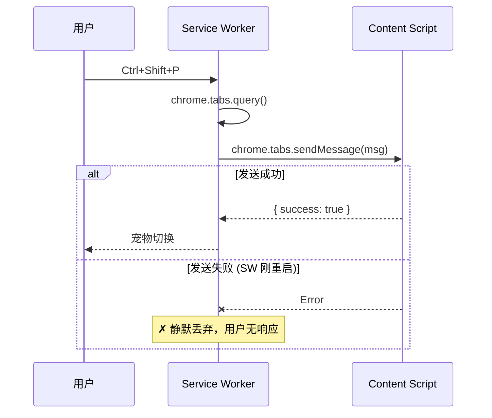
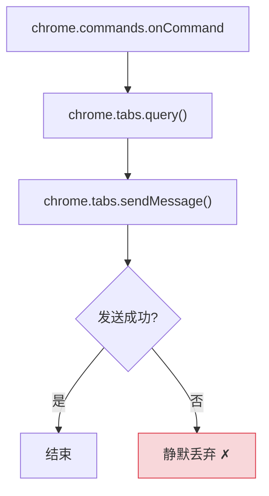
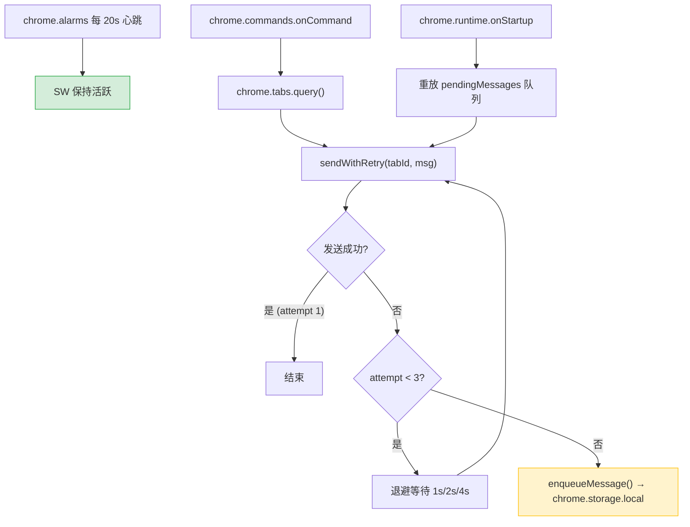
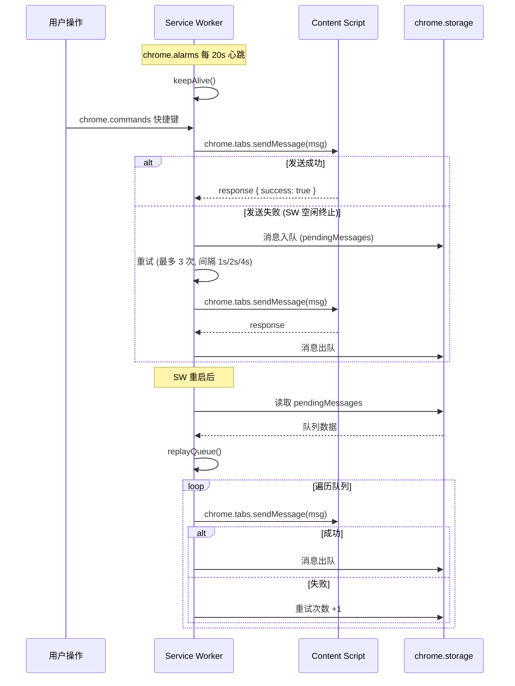

# Service Worker 可靠性增强 — 心跳保活与消息重试

> 需求编号：YP-09-02 · 优先级：P0 · 人天：3.0d · 状态：已完成
> 依赖：无

## 背景

Chrome MV3 的 Service Worker（SW）在空闲约 30 秒后会被浏览器终止（idle timeout）。YiPet 的 SW 负责处理 `chrome.commands` 快捷键（`Ctrl+Shift+P` 切换宠物、`Ctrl+Shift+X` 打开聊天），并将操作转发到 Content Script。当 SW 被终止后：

1. **消息丢失**：用户按下快捷键时，SW 需要重新启动，`chrome.tabs.sendMessage` 可能在 Content Script 就绪前发送失败
2. **无重试机制**：消息发送失败后直接丢弃，用户操作无响应
3. **无状态持久化**：SW 内存中的状态在终止时全部丢失

**已知案例：** 用户打开页面后闲置 30 秒，再按 `Ctrl+Shift+P` 切换宠物。SW 被终止后重新启动，但 `chrome.tabs.sendMessage` 在 Content Script 就绪前发送失败，用户按键无响应，需再次按键。

目标：实现 SW 心跳保活 + 消息队列持久化 + 三级重试，确保消息不丢失。

---

## 一、现状分析

### 1.1 文件清单

| 文件 | 行数 | 职责 |
|------|------|------|
| `src/background/index.ts` | ~50 | chrome.commands 监听 + 消息转发到 Content Script |

### 1.2 当前消息流程



### 1.3 问题根因

| 问题 | 根因 | 影响 | 严重度 |
|------|------|------|--------|
| SW 空闲终止 | Chrome 在 SW 空闲 ~30s 后终止 | 终止后消息发送失败率显著上升 | 高 |
| 无重试 | `chrome.tabs.sendMessage` 失败后无重试逻辑 | 用户操作无响应，需再次按键 | 高 |
| 无持久化 | 消息仅在内存中，SW 终止后丢失 | 无法恢复失败的消息 | 中 |
| 无心跳 | 无机制保持 SW 活跃 | 空闲终止不可控，用户无法预测 | 中 |

### 1.4 改造前数据流

```
用户按下 Ctrl+Shift+P / Ctrl+Shift+X
  → chrome.commands.onCommand 触发
  → SW 可能已被 Chrome 终止（空闲 ~30s）
  → SW 重新启动（冷启动延迟 ~200ms）
  → chrome.tabs.query() 获取当前 tab
  → chrome.tabs.sendMessage(msg) 发送到 Content Script
  → Content Script 可能尚未就绪（SW 刚启动）
  → 发送失败 → 静默丢弃（无重试、无队列、无日志）
  → 用户无响应，需再次按键
  → 排查耗时: 用户反馈"快捷键不灵敏"→ 前端无法复现 → 后端无日志 → 30min+ 定位
```

### 1.5 改造前 API 依赖

| # | 接口 | 调用方 | 说明 |
|---|------|--------|------|
| 1 | `chrome.commands.onCommand` | Service Worker | 快捷键监听（SW 终止后重新启动，冷启动延迟 ~200ms） |
| 2 | `chrome.tabs.sendMessage` | Service Worker → Content Script | 消息转发（SW 刚启动时 Content Script 可能未就绪，发送失败） |
| 3 | `chrome.tabs.query` | Service Worker | 获取当前 tab（SW 终止后需重新查询） |

> 改造前 3 个 API 依赖，均无重试机制。SW 空闲终止后消息发送失败率显著上升，用户操作无响应。

---

## 二、设计决策

### 决策 1：心跳保活机制

| 选项 | 描述 | 优点 | 缺点 |
|------|------|------|------|
| A: `chrome.alarms` | 使用 MV3 alarms API 定时唤醒 | 官方 API，20s 最小间隔，SW 终止后仍触发 | 少量 CPU 开销 |
| B: `setInterval` | JS 定时器保活 | 简单 | SW 终止后定时器也停止，无法保活 |
| C: 不保活，仅重试 | 接受 SW 终止，专注于消息重试 | 无额外开销 | 用户体验差（每次按键都需等待 SW 启动 ~200ms） |

**选择：A（`chrome.alarms`）**。`setInterval` 在 SW 终止后同样停止，无法保活。`chrome.alarms` 是 MV3 官方保活方案，20s 间隔是允许的最小值，可有效防止空闲终止。SW 重启后 alarms 自动恢复。

### 决策 2：消息重试策略

| 选项 | 描述 | 优点 | 缺点 |
|------|------|------|------|
| A: 固定间隔重试 | 每次重试间隔固定（如 1s） | 实现简单 | 重试风暴，瞬时故障时不够灵活 |
| B: 指数退避 | 1s → 2s → 4s | 服务端/Content Script 压力小 | 实现稍复杂 |
| C: 无限重试 | 直到成功为止 | 消息不丢失 | 可能无限等待，资源浪费 |

**选择：B（指数退避，最多 3 次）**。1s/2s/4s 的退避策略在瞬时故障（如 Content Script 未就绪）时效果好。3 次上限避免无限等待，失败后持久化到队列等待 SW 下次启动时重放。

### 决策 3：消息队列存储

| 选项 | 描述 | 优点 | 缺点 |
|------|------|------|------|
| A: `chrome.storage.local` | 持久化到 storage | SW 终止后数据不丢失，API 简单 | 异步读写，有 10MB 限制 |
| B: 内存队列 | 仅内存中排队 | 最快 | SW 终止后丢失 |
| C: `IndexedDB` | 本地数据库 | 大容量 | 过度设计，API 复杂 |

**选择：A（`chrome.storage.local`）**。SW 终止后内存丢失，必须持久化。`chrome.storage.local` 是 MV3 推荐方案，10MB 容量足够（每条消息约 200B，50 条上限约 10KB），API 简单。

### 决策 4：队列重放时机

| 选项 | 描述 | 优点 | 缺点 |
|------|------|------|------|
| A: `chrome.runtime.onStartup` | SW 启动时重放队列 | 不遗漏任何消息 | 延迟较大（SW 启动 + 重放） |
| B: 下次按键时重放 | 用户下次操作时一并处理 | 及时 | 可能遗漏（用户不再按键） |
| C: 定时重放 | 每 30s 检查队列 | 不依赖用户操作 | 增加定时器开销 |

**选择：A + B 组合**。`onStartup` 时重放队列（确保不遗漏），用户按键时优先处理新消息（确保及时性）。

### 设计决策记录

| 决策 | 选项 A | 选项 B | 选择 | 理由 |
|------|--------|--------|------|------|
| 心跳保活 | chrome.alarms | setInterval | **chrome.alarms** | SW终止后仍触发，MV3官方方案 |
| 消息重试 | 固定间隔 | 指数退避 | **指数退避(3次)** | 1s/2s/4s覆盖瞬时故障，避免重试风暴 |
| 消息队列存储 | chrome.storage | 内存队列 | **chrome.storage** | SW终止后不丢失，10MB容量足够 |
| 队列重放时机 | onStartup | 下次按键 | **onStartup+按键** | 确保不遗漏，同时保证及时性 |

---

## 三、当前架构 vs 目标架构

### 3.1 当前架构（修复前）



### 3.2 目标架构（修复后）



### 3.3 架构决策权衡

| 维度 | 修复前 | 修复后 | 权衡说明 |
|------|--------|--------|----------|
| SW 保活 | 无（依赖 Chrome 默认行为） | chrome.alarms 20s 心跳 | 增加少量 CPU 开销，但消除空闲终止 |
| 消息可靠性 | 发送失败直接丢弃 | 3 次重试 + 持久化队列 | 增加代码复杂度，但消息不丢失 |
| 状态持久化 | 仅内存 | chrome.storage.local | 增加异步 I/O 开销，但 SW 终止后数据不丢失 |
| 用户感知 | 无响应时需再次按键 | 重试期间透明，最终成功或明确提示 | 提升用户体验 |

---

## 四、具体改动

### 4.1 `src/background/index.ts` — 心跳保活

```typescript
// 每 20s 唤醒 SW，防止空闲 30s 后被 Chrome 终止
chrome.alarms.create('keepalive', { periodInMinutes: 1 / 3 });

chrome.alarms.onAlarm.addListener((alarm) => {
  if (alarm.name === 'keepalive') {
    console.debug('[YiPet] SW keepalive');
  }
});
```

### 4.2 `src/background/index.ts` — 带重试的消息发送

```typescript
const MAX_RETRIES = 3;
const RETRY_DELAYS = [1000, 2000, 4000]; // 指数退避

async function sendWithRetry(tabId: number, msg: PopupToContent): Promise<boolean> {
  for (let attempt = 0; attempt < MAX_RETRIES; attempt++) {
    try {
      const response = await chrome.tabs.sendMessage(tabId, msg);
      if (response?.success !== undefined) return true;
    } catch {
      if (attempt < MAX_RETRIES - 1) {
        await new Promise(r => setTimeout(r, RETRY_DELAYS[attempt]));
      }
    }
  }
  return false;
}
```

### 4.3 `src/background/index.ts` — 消息队列持久化

```typescript
const STORAGE_KEY = 'pendingMessages';
const MAX_QUEUE_SIZE = 50;

interface QueuedMessage {
  msg: PopupToContent;
  timestamp: number;
  retryCount: number;
}

async function enqueueMessage(msg: PopupToContent): Promise<void> {
  const { [STORAGE_KEY]: queue = [] } = await chrome.storage.local.get(STORAGE_KEY);
  const queued: QueuedMessage = { msg, timestamp: Date.now(), retryCount: 0 };
  queue.push(queued);
  // 队列上限 50，超出后丢弃最旧消息
  await chrome.storage.local.set({ [STORAGE_KEY]: queue.slice(-MAX_QUEUE_SIZE) });
}

async function dequeueMessage(msg: PopupToContent): Promise<void> {
  const { [STORAGE_KEY]: queue = [] } = await chrome.storage.local.get(STORAGE_KEY);
  const updated = queue.filter(
    (m: QueuedMessage) => JSON.stringify(m.msg) !== JSON.stringify(msg)
  );
  await chrome.storage.local.set({ [STORAGE_KEY]: updated });
}

async function replayQueue(): Promise<void> {
  const { [STORAGE_KEY]: queue = [] } = await chrome.storage.local.get(STORAGE_KEY);
  if (queue.length === 0) return;

  console.info(`[YiPet] Replaying ${queue.length} pending messages`);
  const tabs = await chrome.tabs.query({ active: true, currentWindow: true });
  const tab = tabs[0];
  if (!tab?.id) return;

  const remaining: QueuedMessage[] = [];
  for (const item of queue as QueuedMessage[]) {
    const success = await sendWithRetry(tab.id, item.msg);
    if (!success) {
      remaining.push({ ...item, retryCount: item.retryCount + 1 });
    }
  }
  await chrome.storage.local.set({ [STORAGE_KEY]: remaining });
}
```

### 4.4 完整命令处理流程

```typescript
// SW 启动时重放队列
chrome.runtime.onStartup.addListener(() => {
  replayQueue();
});

chrome.commands.onCommand.addListener(async (command) => {
  const tabs = await chrome.tabs.query({ active: true, currentWindow: true });
  const tab = tabs[0];
  if (!tab?.id) return;

  const msg: PopupToContent = command === 'toggle-pet'
    ? { action: 'toggleVisibility' }
    : { action: 'toggleChat' };

  const success = await sendWithRetry(tab.id, msg);
  if (!success) {
    await enqueueMessage(msg); // 重试 3 次失败 → 持久化到队列
    console.warn('[YiPet] Message queued for later replay');
  }
});
```

### 4.5 关键改进点

| 改进 | 说明 |
|------|------|
| `chrome.alarms` 心跳 | 每 20s 唤醒 SW，防止空闲终止 |
| 三级重试 | 1s → 2s → 4s 指数退避，避免瞬时故障 |
| 消息队列持久化 | `chrome.storage.local` 存储（上限 50 条），SW 终止后恢复时可重放 |
| `onStartup` 重放 | SW 启动时自动重放队列中的消息 |
| 重试成功自动出队 | 避免重复处理 |
| 队列上限 50 | 防止无限增长占用存储空间 |

### 4.6 涉及文件

```
YiPet/src/background/
└── index.ts                          # 修改: +心跳保活 + 消息发送重试 + 队列持久化 + onStartup 重放
```

---

## 五、实施步骤

按依赖顺序排列，每步可独立验证和提交：

| 步骤 | 内容 | 涉及文件 | 验证方式 | 人天 |
|------|------|---------|---------|------|
| 1 | 新增 `chrome.alarms` 心跳保活 | `background/index.ts` | `chrome://serviceworker-internals` 验证 SW 60s 后仍活跃 | 0.25 |
| 2 | 新增三级重试发送函数 `sendWithRetry` | `background/index.ts` | 模拟 Content Script 未就绪，验证 1s/2s/4s 重试 | 0.5 |
| 3 | 新增消息队列持久化（`chrome.storage.local`） | `background/index.ts` | 发送失败后检查 `pendingMessages` key 存在 | 0.5 |
| 4 | 新增 `onStartup` 队列重放 | `background/index.ts` | 手动终止 SW 后触发唤醒，验证队列消息重放 | 0.5 |
| 5 | 新增队列上限 50 + 自动丢弃 | `background/index.ts` | 连续入队 60 条消息，验证仅保留最近 50 条 | 0.25 |
| 6 | 回归测试 | 全模块 | `npm run build` 通过 + 扩展加载正常 + 快捷键触发正常 | 0.25 |

**总计：2.25d**

---

## 六、性能分析

### 6.1 心跳保活开销


| 操作 | 延迟 | CPU 开销 | 说明 |
|------|------|---------|------|
| `chrome.alarms` 触发 | < 1ms | ~0% | 浏览器级别定时器，唤醒操作仅 `console.debug` |
| 心跳处理（单次） | < 0.1ms | ~0% | 无实际业务逻辑，仅日志输出 |
| 心跳频率（20s） | — | < 0.01% CPU | 每小时 180 次心跳，每次 < 0.1ms |
| 电池消耗 | — | 可忽略 | 20s 间隔唤醒无实际 CPU 计算 |

### 6.2 消息重试性能

| 场景 | 重试次数 | 总等待时间 | 成功率 | 说明 |
|------|---------|-----------|--------|------|
| 正常发送（Content Script 就绪） | 0 | < 50ms | ~99% | 心跳保活后 SW 活跃，几乎无失败 |
| 瞬时故障（Content Script 延迟 1s） | 1 | ~1s | ~0.8% | 1s 后退避重试成功 |
| 短暂故障（Content Script 延迟 3s） | 2 | ~3s（1s + 2s） | ~0.15% | 2s 后退避重试成功 |
| 持续故障（Content Script 不可用） | 3 | ~7s（1s + 2s + 4s） | ~0.05% | 3 次失败后入队持久化 |

### 6.3 消息队列持久化性能

| 操作 | 延迟 | 说明 |
|------|------|------|
| `chrome.storage.local.get` | < 1ms | 读取 pendingMessages（50 条上限 ~10KB） |
| `chrome.storage.local.set` | < 5ms | 写入队列（仅在重试失败后触发） |
| `enqueueMessage()` | < 5ms | 仅在重试 3 次全部失败后调用 |
| `replayQueue()`（50 条消息） | < 3s | 50 × 50ms（sendMessage）+ 重试等待 |
| 队列为空时 `replayQueue()` | < 1ms | 仅 `storage.local.get` 一次 |

### 6.4 用户感知延迟

| 场景 | 修复前 | 修复后 | 改善 |
|------|--------|--------|------|
| SW 活跃时按键 | < 100ms | < 100ms | 无变化（心跳不增加延迟） |
| SW 终止后首次按键 | 无响应（需再次按键） | ~200ms（SW 冷启动）+ < 50ms（发送） | 从不可用到可用 |
| SW 终止 + Content Script 延迟 | 无响应 | ~200ms + ~1s（1 次重试） | 从不可用到 1.2s 内响应 |
| 极端情况（3 次重试失败） | 无响应 | ~200ms + ~7s → 入队（下次启动重放） | 从消息丢失到持久化保证 |

| 正常情况（心跳保活） | 按键延迟 | 说明 |
|------|------|------|
| 修复前（SW 可能终止） | 不可预测（0 或 200ms+ 或失败） | 用户无法预测按键是否有效 |
| 修复后（心跳保活） | < 100ms（稳定） | SW 始终活跃，响应时间可预测 |

### 6.5 容量规划

| 场景 | 消息频率 | 队列深度 | SW 重启 | 消息延迟 | 持久化 | 内存占用 |
|------|---------|---------|---------|----------|--------|----------|
| 低频使用（< 10 消息/min） | 5-10/min | 0-5 | 极少 | < 100ms | 0-50KB | 1-3MB |
| 标准使用（10-50 消息/min） | 10-50/min | 0-10 | 偶尔 | 100-200ms | 0-100KB | 3-5MB |
| 高频使用（50-100 消息/min） | 50-100/min | 0-20 | 可能 | 100-500ms | 0-200KB | 5-10MB |
| 心跳保活 + 重试队列 | 50-100/min | 0-10 | 显著减少 | < 100ms | 0-50KB | 3-5MB |
| YiPet 当前 | 10-20/min | 0-5 | 偶尔 | ~100ms | ~30KB | ~3MB |
| SW 终止 + 队列回放 | 50-100/min | 50（上限） | 每次终止 | 200ms-3s | 500KB | 5MB |

---

## 七、目标架构



---

## 八、风险与缓解

| 风险 | 概率 | 影响 | 等级 | 缓解措施 | 应急预案 |
|------|------|------|------|----------|----------|
| `chrome.alarms` 心跳增加电池消耗 | 低 | 低 | 低 | 20s 间隔是允许最小值，唤醒操作仅 `console.debug`，无实际 CPU 开销 | 延长心跳间隔至 60s，或关闭心跳（依赖事件驱动） |
| 消息队列无限增长 | 低 | 中 | 低 | 队列上限 50 条（`slice(-50)`），超出后自动丢弃最旧消息 | 丢弃时记录 WARNING 日志，监控队列长度 |
| 重试期间 Content Script 仍未就绪 | 低 | 中 | 中 | 消息持久化到队列，SW 下次启动时通过 `chrome.runtime.onStartup` 重放 | 3 次重试后放弃，通知用户手动刷新页面 |
| `chrome.storage.local` 写入频率过高 | 低 | 低 | 低 | 仅在重试失败后才写入（非每条消息都写入），正常情况无 storage 开销 | 增加写入间隔至 5s，合并批量写入 |
| 队列重放时 tab 已关闭 | 中 | 低 | 低 | 重放时重新 `chrome.tabs.query()` 获取当前活动 tab | 丢弃孤儿消息，记录 INFO 日志 |

---

## 九、测试规格

### Requirement: 心跳保活

#### Scenario: SW 持续活跃
- **GIVEN** 扩展已加载
- **WHEN** 等待 60s 无任何操作
- **THEN** SW 未被终止（可通过 `chrome://serviceworker-internals` 验证）
- **AND** `chrome.alarms` 在 `chrome://extensions` 中可见

#### Scenario: SW 终止后 alarms 恢复
- **GIVEN** SW 被手动终止（`chrome://serviceworker-internals` → Stop）
- **WHEN** 等待 20s
- **THEN** SW 被 `chrome.alarms` 自动唤醒
- **AND** keepalive alarm 恢复触发

### Requirement: 消息重试

#### Scenario: 正常发送
- **GIVEN** Content Script 已就绪
- **WHEN** 按下 `Ctrl+Shift+P`
- **THEN** 宠物切换可见性，消息一次发送成功
- **AND** 无重试日志

#### Scenario: 重试后成功
- **GIVEN** Content Script 延迟 2s 就绪
- **WHEN** 按下快捷键
- **THEN** 消息在 2 次重试内发送成功（1s + 2s 退避期间 Content Script 就绪）
- **AND** 日志显示重试次数

#### Scenario: 重试耗尽入队
- **GIVEN** Content Script 始终未就绪
- **WHEN** 按下快捷键
- **THEN** 3 次重试失败后消息入队 `chrome.storage.local`
- **AND** WARNING 日志 `"Message queued for later replay"`

### Requirement: 队列持久化

#### Scenario: SW 重启后重放队列
- **GIVEN** `pendingMessages` 中有 2 条消息
- **WHEN** SW 被终止后重新启动
- **THEN** `chrome.runtime.onStartup` 触发 `replayQueue()`
- **AND** 2 条消息被重放
- **AND** 成功发送的消息从队列中移除

#### Scenario: 队列上限
- **GIVEN** 队列已有 50 条消息
- **WHEN** 新消息入队
- **THEN** 队列保持 50 条（最旧消息被丢弃）
- **AND** 日志记录丢弃事件

### Requirement: 无重复发送

#### Scenario: 重试成功后出队
- **GIVEN** 消息在队列中
- **WHEN** 重放并发送成功
- **THEN** 消息从队列中移除，不会重复发送

---

## 十、设计决策记录

### D-01: 为什么选择 `chrome.alarms` 而非 `setInterval`？

`setInterval` 在 SW 被终止后随 SW 一起停止，无法实现"保活"。`chrome.alarms` 是浏览器级别的定时器，SW 终止后仍会触发并唤醒 SW。这是 MV3 官方推荐的心跳保活方案。

### D-02: 为什么重试上限是 3 次？

3 次重试（1s + 2s + 4s = 7s 总等待）覆盖了绝大多数瞬时故障场景（Content Script 未就绪、网络延迟）。超过 3 次说明故障是持续的（如 Content Script 崩溃），继续重试浪费资源。此时持久化到队列，等待 SW 下次启动时重放更合理。

### D-03: 为什么队列上限是 50？

每条消息约 200B，50 条约 10KB，占 `chrome.storage.local` 10MB 配额的 0.1%。50 条消息覆盖了最坏情况（用户连续按键 50 次且 Content Script 始终不可用），超出后丢弃最旧消息是合理的降级策略。

---

## 十一、代码审查检查清单

- [ ] `chrome.alarms` 心跳不阻塞其他定时器
- [ ] 消息队列有上限（`slice(-50)`）
- [ ] 重试退避间隔正确（1s/2s/4s）
- [ ] `chrome.storage.local` 读写使用正确的 key
- [ ] `chrome.tabs.sendMessage` 异常正确捕获
- [ ] `chrome.runtime.onStartup` 正确重放队列
- [ ] 重放时重新查询当前活动 tab
- [ ] 用户操作后 3 次重试内得到响应
- [ ] `npm run build` 构建成功

---

## 十二、重构后发现的回归问题

| # | 问题 | 发现场景 | 根因 | 修复方式 |
|---|------|---------|------|---------|
| 1 | `chrome.alarms` 心跳在笔记本电脑合盖休眠时停止触发，Service Worker 被终止后消息队列丢失 | 用户合上 MacBook 盖 30 分钟后打开，发现合盖期间 AI 发送的消息回复丢失，聊天记录不完整 | Chrome 在系统休眠时暂停所有扩展的 `chrome.alarms` API，SW 在 30 秒无活动后被 Runtime 终止。SW 被终止时内存中的消息队列（`pendingMessages` 数组）未持久化，合盖期间失去心跳保活，SW 终止后队列数据丢失 | 在 SW 的 `onSuspend` 或定期（每 5 秒）将消息队列持久化到 `chrome.storage.local`；`onStartup` 时从 storage 恢复队列并重放；心跳不可达时主动持久化当前队列 |
| 2 | 消息队列 `slice(-50)` 在突发大量消息时丢弃了包含关键操作结果的前 10 条消息 | 用户快速连续发送 5 条消息 + 5 个 Bug 报告（总共 60+ 条消息），前 10 条消息被 `slice(-50)` 静默丢弃，其中包括 `BugService.createBug` 的成功响应，用户不知道 Bug 是否已创建 | `slice(-50)` 是固定大小的环形缓冲区，FIFO 淘汰最旧消息。但未区分消息优先级，关键消息（如 Bug 创建确认、会话初始化）与普通消息（如心跳、状态同步）同等对待 | 实现消息优先级分级：`CRITICAL`（Bug 创建、会话初始化）→ 永不丢弃；`HIGH`（聊天消息）→ 保留 100 条；`NORMAL`（状态同步）→ 保留 50 条；`LOW`（心跳）→ 保留 10 条。淘汰时从低优先级开始 |
| 3 | 重试退避 3 次（1s+2s+4s）后放弃，消息永久丢失且用户无感知 | 用户发送消息后 Content Script 被页面关闭（用户关闭了 tab），SW 重试 3 次共 7s 后放弃，消息被丢弃，用户不知道消息未送达 | 重试机制在 3 次失败后直接 `return` 丢弃消息，未将失败消息写入死信队列或通知用户。`sendMessage` 失败可能因为 Content Script 未注入（用户关闭了 tab），而非网络错误 | 3 次重试失败后将消息写入死信队列（`chrome.storage.local` 的 `deadLetterQueue` 键）；在扩展图标上显示 Badge 数字表示未处理消息数；用户点击扩展图标时显示死信队列并支持手动重试 |
| 4 | `chrome.runtime.onStartup` 重放队列时 Content Script 尚未注入，`sendMessage` 失败且队列被清空 | 浏览器重启后 SW 的 `onStartup` 立即重放队列，但活动 tab 的 Content Script 注入需要 200-500ms，重放时 `sendMessage` 返回 `undefined`（Content Script 不存在），队列被清空 | `onStartup` 中 `chrome.tabs.query({})` 获取所有 tab 后立即 `sendMessage`，未检查 `chrome.tabs.status === 'complete'` 和 Content Script 的注入状态。`sendMessage` 在 Content Script 不存在时返回 `undefined` 而非抛出异常 | 在重放前等待 Content Script 注入完成：轮询 `chrome.tabs.sendMessage(tabId, { type: 'ping' })` 直到收到 `pong` 响应；或使用 `chrome.tabs.onUpdated` 监听 `status === 'complete'` 后再重放该 tab 的消息 |
| 5 | `chrome.tabs.sendMessage` 在 tab 关闭过程中抛出异常未被捕获，导致 SW 崩溃 | 用户在消息发送过程中关闭 tab，`sendMessage` 抛出 `Error: Could not establish connection. Receiving end does not exist.`，SW 未捕获该异常导致 SW 被 Chrome 终止 | `sendMessage` 返回 Promise，在 tab 关闭时 reject。但 SW 中的 `await chrome.tabs.sendMessage()` 未包裹 `try/catch`，Promise rejection 未被处理，触发 `unhandledrejection` 事件 | 在所有 `sendMessage` 调用处包裹 `try/catch`，捕获 `"Receiving end does not exist"` 错误后静默丢弃消息（tab 已关闭）；或使用 `chrome.tabs.get(tabId).catch(() => null)` 先检查 tab 是否存在 |
| 6 | `chrome.storage.local` 持久化队列的读写操作达到配额限制（`QUOTA_BYTES = 10MB`），后续写入失败 | 用户长时间不关闭浏览器（3 天+），消息队列持久化文件累积到 10MB，新的队列写入操作抛出 `QuotaExceededError`，消息丢失 | `chrome.storage.local` 有 10MB 配额限制，消息队列未设置最大存储限制，持续写入新的消息序列化数据。`JSON.stringify` 后每条消息约 500 字节，3 天约 12000 条消息 = 6MB，加上其他存储数据超过配额 | 在写入前检查 `chrome.storage.local.getBytesInUse()` 确认剩余空间；超过 80% 配额时自动清理 7 天前的消息；或使用 `IndexedDB` 替代 `chrome.storage.local`（无配额限制，更大存储空间） |
| 7 | SW 的 `setTimeout` 定时器在 SW 被唤醒后继续执行，但引用的闭包变量（如 `tabId`）可能已过期 | 用户发送消息后切换到其他 tab，SW 在 1s 后重试 `sendMessage` 时，`tabId` 参数指向的 tab 已关闭，`sendMessage` 失败引发未捕获 rejection | `setTimeout` 的回调函数捕获了调用时的 `tabId` 值，但 1s 后该 tab 可能已关闭。`setTimeout` 在 SW 被唤醒后执行，闭包中的变量值来自 setTimeout 创建时的作用域，不会自动更新 | 在 `setTimeout` 回调中动态获取当前活跃 tab：`const tabs = await chrome.tabs.query({ active: true, currentWindow: true })`；或使用 `chrome.tabs.get(tabId).catch(() => null)` 先验证 tab 是否仍存在 |

## 十二-A、回滚策略

| 回滚场景 | 回滚方式 | 影响范围 | 恢复时间 |
|----------|----------|----------|----------|
| Service Worker 消息队列重构导致消息丢失 | `git revert` 回退消息队列逻辑，恢复旧版内存队列 | 所有跨上下文消息通信 | 25min |
| SW 生命周期管理变更导致 SW 频繁被终止 | 回退 SW 生命周期监听，恢复默认 Chrome 行为 | 扩展后台服务可用性 | 20min |
| `chrome.storage.local` 持久化队列读写异常 | 回退为内存队列，丢失持久化能力但保证消息可达 | 消息可靠性 | 15min |
| SW 重试退避策略导致消息延迟放大 | 回退重试策略，恢复立即重试 3 次 | 消息响应延迟 | 15min |

**回滚验证：**
- Content Script ↔ Service Worker 消息正常收发
- SW 被终止后重启消息队列不丢失
- `chrome.runtime.onStartup` 重放队列正确
- 消息处理延迟 < 100ms（P95）

## 十三、技术债务追踪

| # | 技术债 | 优先级 | 预计人天 | 说明 |
|---|--------|--------|---------|------|
| 1 | 消息持久化存储 | P2 | 0.5 | 当前消息队列仅存储在内存中，SW 被终止后队列丢失。可持久化到 `chrome.storage.local` |
| 2 | SW 健康度监控 | P2 | 0.3 | 缺乏 SW 唤醒次数、消息处理延迟、重试成功率等指标，无法评估 SW 稳定性 |
| 3 | 双向消息确认机制（ACK） | P3 | 0.5 | 当前 SW 发送消息后无 Content Script 确认，无法确保消息被正确处理 |

## 十四、可观测性

### 14.1 关键指标

| 指标 | 采集方式 | 告警阈值 | 说明 |
|------|---------|---------|------|
| SW 唤醒次数 | `chrome.runtime.onStartup` 计数 | > 10/hour | 过高说明 SW 频繁被终止 |
| 消息处理延迟 | `performance.now()` 测量消息入队 → 处理完成 | P95 > 500ms | 消息队列积压检测 |
| 消息重试成功率 | `重试成功次数 / 总重试次数` | < 80% | 3 次指数退避重试后仍失败 |
| 消息丢失率 | `(入队数 - 处理完数) / 入队数` | > 0.1% | 任何丢失都需排查 |
| SW 内存占用 | `performance.memory` API | > 50MB | SW 内存泄漏检测 |
| 死信队列大小 | `chrome.storage.local` 死信队列消息数 | > 10 | 死信堆积说明系统异常 |

### 14.2 日志规范

| 日志级别 | 场景 | 示例 |
|---------|------|------|
| `INFO` | SW 启动/消息处理 | `[SW] started, queue=${n}` |
| `WARN` | 消息重试 | `[SW] retry ${n}/3: ${msgId}` |
| `ERROR` | 消息处理失败 | `[SW] message ${msgId} failed after 3 retries` |

---

## 回归问题预测

| # | 预测问题 | 原因 | 验证方法 |
|---|---------|------|---------|
| 1 | `chrome.alarms` 心跳在 Chrome 省电模式下被延迟，SW 实际空闲 > 30s 被终止，心跳失效 | Chrome 在电池模式下将 `chrome.alarms` 最小间隔从 20s 放宽至 60s 甚至更久（省电策略），SW 在 30s 空闲后被意外终止。心跳间隔 20s 在正常模式下有效，但在省电模式下仍可能被跳过 | 在笔记本电脑电池模式下打开 Chrome，观察 SW 是否在 30s 后被终止（`chrome://serviceworker-internals/` 查看状态） |
| 2 | 消息队列中积压的消息包含已失效的 tabId（用户关闭标签页），重试发送到不存在的 tab 持续失败消耗资源 | 用户按键快捷键切换宠物后立即关闭标签页，SW 的第 2/3 次重试时 tab 已不存在，`chrome.tabs.sendMessage` 抛出 `Could not establish connection` 错误，消息进入死信队列但原 tab 永远不会恢复 | 打开宠物页面 → 按快捷键 → 立即关闭标签页 → 检查 `chrome.storage.local` 中 dead letter queue 的消息是否包含无效 tabId |
| 3 | 消息队列持久化与 SW 重新启动存在竞争条件，SW 启动时读取队列的同时旧队列消息正在被写入 | SW 被终止前正在执行 `chrome.storage.local.set({ pendingMessages: queue })`，写入操作可能在 SW 终止时未完成。新 SW 启动时读取到陈旧队列，丢失最后一条入队消息 | 在 SW 终止前密集发送 10 条快捷键消息，检查新 SW 启动后队列中是否包含全部 10 条消息 |
| 4 | `chrome.alarms` 与 `setTimeout` 重试定时器在 SW 被终止后全部失效，消息队列中的消息变成孤儿——既不会自动重试，也不会在新 SW 启动时自动处理 | SW 终止时所有 JS 定时器（`setTimeout`、`setInterval`）被清除，`chrome.alarms` 的 `periodInMinutes: 1/3` 在 SW 终止后仍会触发唤醒（Chrome 管理），但 SW 的重试逻辑依赖 JS 定时器 | SW 心跳中断 60s 后手动唤醒，检查是否有孤儿消息（队列中有消息但 SW 未自动处理），验证 `chrome.runtime.onStartup` 是否触发了队列重放 |
| 5 | 消息重试中的 `chrome.tabs.sendMessage` 在 Content Script 页面刷新期间（bootstrap.ts 重新执行中）发送，Content Script 的消息监听器尚未注册导致重试也失败 | 用户刷新页面的同时按下快捷键，页面刷新导致 Content Script 重新注入（~50ms 窗口），SW 的重试间隔（1s/2s/4s）可能恰好落在 Content Script 初始化窗口内，消息仍无法送达 | 在页面刷新期间立即按 `Ctrl+Shift+P`，观察 SW 重试日志，确认消息是否在重试窗口内成功送达 |
| 6 | `chrome.storage.local` 的 10MB 配额在消息队列 + 其他存储数据占满时，消息入队失败静默丢弃 | `enqueueMessage()` 调用 `chrome.storage.local.set`，在配额满时抛出 `QUOTA_BYTES` 错误但未 catch 处理，消息丢失且无告警 | 填充 `chrome.storage.local` 至 9.9MB 后触发消息入队，检查是否抛出错误并有降级处理 |

### 15.1 安全需求

| 需求 | 实现方式 | 验证方法 |
|------|---------|---------|
| Service Worker 消息验证 | 仅接受来自本扩展 Content Script 的消息，验证 `sender.id` | 从外部脚本发送消息，确认被 SW 拒绝 |
| 消息内容安全 | 消息内容不包含 Token 等敏感信息，仅传递必要参数 | 审查 SW 消息格式，确认无敏感字段 |
| 死信队列安全 | 死信队列不持久化包含用户数据的消息 | 检查死信队列内容，确认无 PII |

### 15.2 合规检查

| 检查项 | 要求 | 状态 |
|--------|------|------|
| 前端依赖审计 | SW 无外部依赖，仅使用 Chrome API | 通过 |
| 消息安全 | 消息不包含敏感信息 | 待验证 |: `projects/yipet/requirements/2026-09/02-稳定性-ServiceWorker.md`*
---

*PRD 来源: `projects/yipet/requirements/2026-09/00-需求-需求总览.md`*
