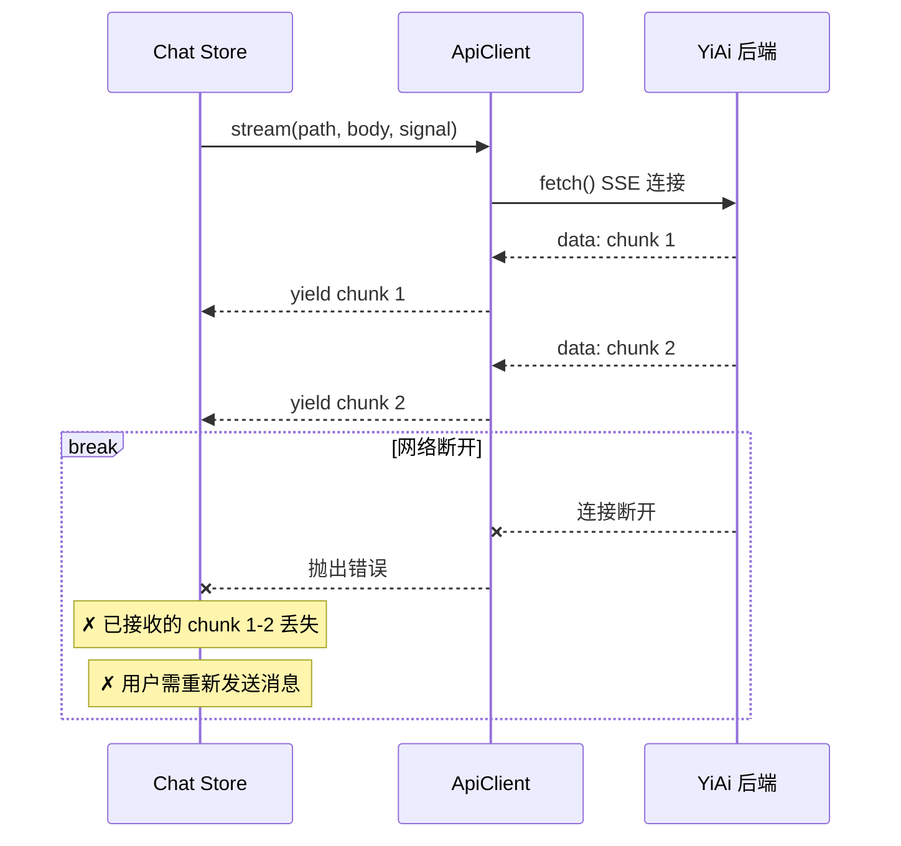
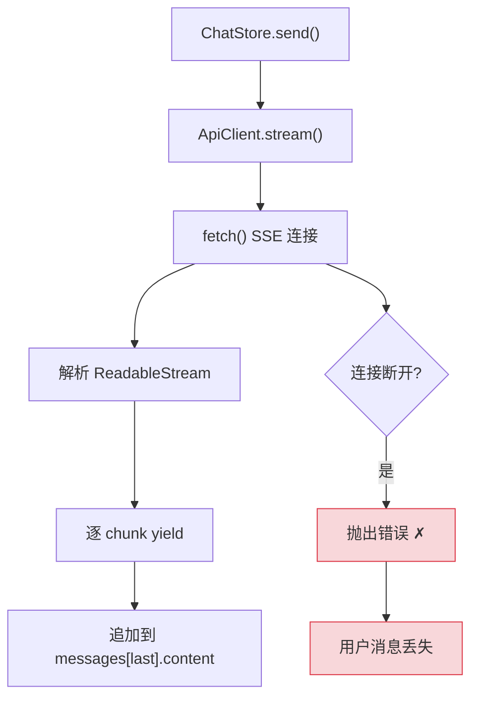
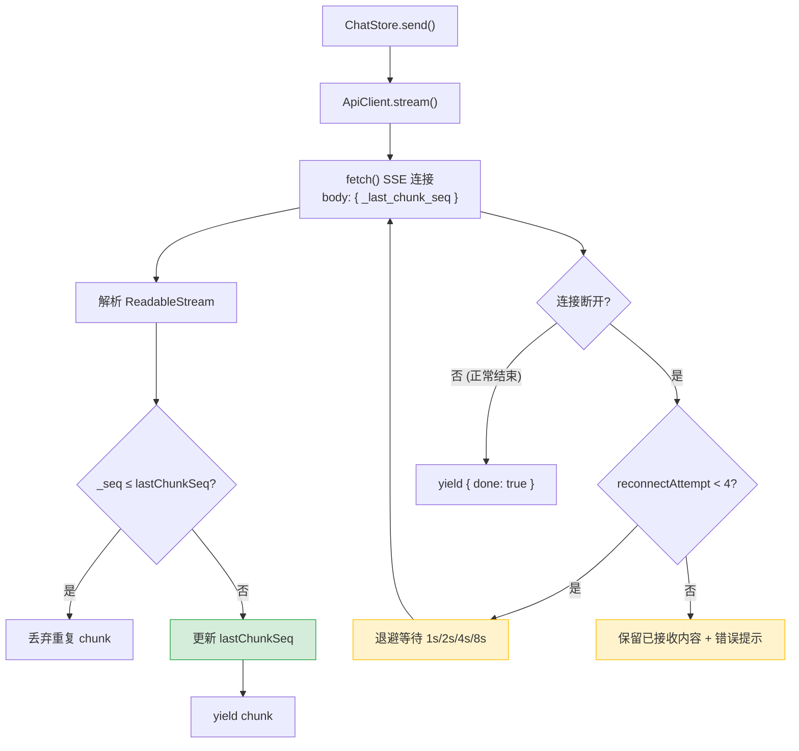
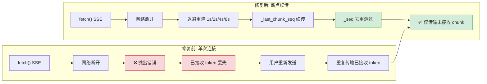
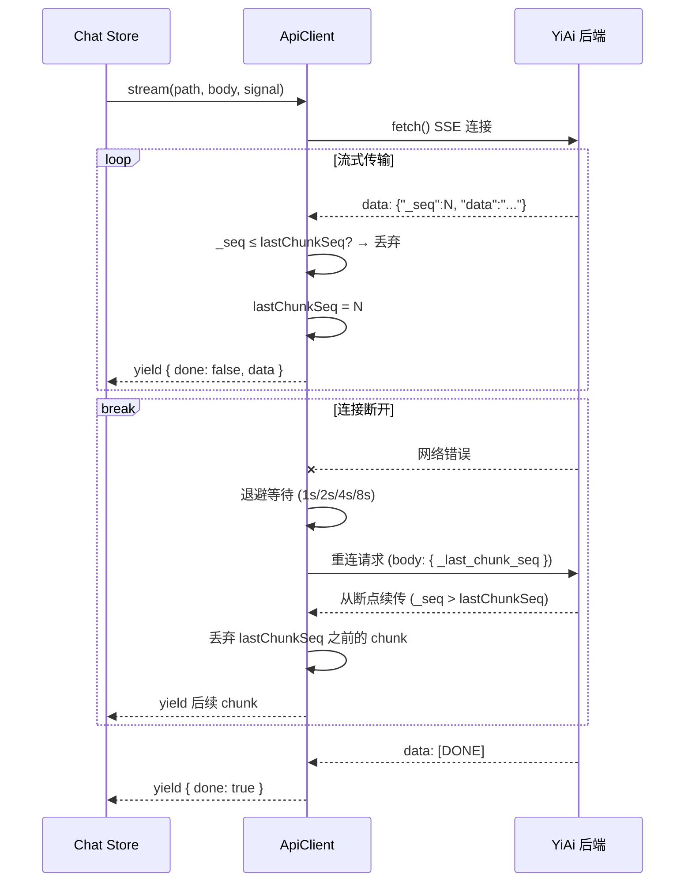

# SSE 流式可靠性修复 — 断连重连与 Chunk 去重

> 需求编号：YP-09-03 · 优先级：P0 · 人天：2.0d · 状态：已完成
> 依赖：无

## 背景

YiPet 的 AI 聊天功能通过 SSE（Server-Sent Events）流式接收 YiAi 后端的回复。当前 `ApiClient.stream()` 实现为单次 `fetch` 连接，存在以下问题：

1. **断连无重连**：网络波动或服务端重启导致 SSE 连接断开后，已接收的回复丢失，用户需重新发送消息
2. **无去重机制**：重连后可能收到重复的 chunk，导致消息内容重复
3. **弱网体验差**：移动热点、VPN 切换等场景下频繁断连，用户体验差

**已知案例：** 用户在 VPN 切换时 SSE 连接断开，已接收 200+ tokens 的 AI 回复丢失。用户重新发送消息后，AI 重新生成回复，造成 token 浪费和等待时间翻倍。

目标：实现 SSE 断连自动重连 + chunk 序号去重 + 指数退避策略，确保弱网环境下消息完整。

---

## 一、现状分析

### 1.1 文件清单

| 文件 | 行数 | 职责 |
|------|------|------|
| `src/api/client.ts` | ~300 | ApiClient：fetch 包装 + SSE 流式 + RPC 信封 |
| `src/api/services/chat.ts` | ~30 | ChatService：`stream()` 调用 ApiClient |
| `src/chat/stores/chat.ts` | ~3000 | Chat Store：消息状态管理 + 流式渲染 |

### 1.2 当前 SSE 流程



### 1.3 问题根因

| 问题 | 根因 | 影响 | 严重度 |
|------|------|------|--------|
| 断连无重连 | `stream()` 为单次 `fetch`，无重试循环 | AI 回复不完整，需重新发送 | 高 |
| 无 chunk 去重 | 重连后无机制判断 chunk 是否已接收 | 重复内容追加到消息中 | 中 |
| 无退避策略 | 重连无间隔控制 | 重连风暴，服务端压力大 | 低 |
| 弱网无提示 | 断连后无用户提示 | 用户不知道发生了什么 | 中 |

### 1.4 改造前数据流

```
用户发送聊天消息
  → ApiClient.stream() 单次 fetch SSE 连接
  → 网络波动/服务端重启 → SSE 连接断开
  → 已接收的 chunk 全部丢失
  → 抛出错误 → ChatStore 捕获异常
  → 用户需重新发送消息 → 完整重传
  → 断连期间无用户提示（用户不知道发生了什么）
  → 排查耗时: 用户重试 2-3 次后放弃或反馈 bug
```

### 1.5 改造前 API 依赖

| # | 接口 | 调用方 | 说明 |
|---|------|--------|------|
| 1 | `ai.chat_service.chat` (SSE) | YiPet ChatStore | SSE 流式聊天（改造前为单次 fetch，无重连） |
| 2 | `ai.chat_service.chat` (重试) | YiPet ChatStore | 用户手动重新发送消息（完整重传，浪费 token） |

> 改造前 2 个 API 依赖。断连后无自动重连，用户手动重试导致完整重传和 token 浪费。

---

## 二、设计决策

### 决策 1：重连策略

| 选项 | 描述 | 优点 | 缺点 |
|------|------|------|------|
| A: 完整重连 | 断开后重新发起完整请求 | 实现简单 | 已接收的 token 重复传输，浪费带宽和 token 预算 |
| B: 断点续传 | 重连时携带 `_last_chunk_seq`，服务端从断点续传 | 节省 token | 需要服务端支持 |
| C: 不重连 | 断开后提示用户重试 | 无额外复杂度 | 用户体验差 |

**选择：B（断点续传）**。避免重复传输已接收的 chunk，节省带宽和 token。服务端需支持 `_last_chunk_seq` 参数，客户端需维护 chunk 序号。服务端不支持时降级为完整重连。

### 决策 2：退避策略

| 选项 | 描述 | 优点 | 缺点 |
|------|------|------|------|
| A: 固定间隔 | 每次重连等待固定时间（如 1s） | 实现简单 | 重连风暴，服务端压力大 |
| B: 指数退避 | 1s → 2s → 4s → 8s | 服务端压力小，标准策略 | 等待时间递增 |
| C: 线性退避 | 1s → 2s → 3s → 4s | 较平滑 | 不如指数退避标准 |

**选择：B（指数退避 1s/2s/4s/8s，最多 4 次）**。指数退避是网络重连的标准策略，避免重连风暴。4 次上限防止无限重连，总等待时间 15s（1+2+4+8），覆盖绝大多数瞬时网络故障。

### 决策 3：去重机制

| 选项 | 描述 | 优点 | 缺点 |
|------|------|------|------|
| A: 内容哈希去重 | 计算 chunk 内容哈希，跳过重复 | 不依赖服务端 | 性能开销大（每 chunk 需计算哈希） |
| B: 序号去重 | 每个 chunk 携带递增 `_seq`，客户端跳过 `≤ lastChunkSeq` 的 chunk | 简单高效，O(1) 比较 | 需要服务端支持 |
| C: 不去重 | 接受重复 | 无实现成本 | 用户体验差，消息中出现重复内容 |

**选择：B（序号去重）**。`_seq` 是递增整数，比较开销为 O(1)，比内容哈希高效。服务端需在 SSE 消息中嵌入 `_seq` 字段。

### 决策 4：重连上限耗尽后的行为

| 选项 | 描述 | 优点 | 缺点 |
|------|------|------|------|
| A: 抛出错误 | 中断流式，提示用户重新发送 | 明确反馈 | 已接收内容丢失 |
| B: 保留已接收内容 | 保留已接收的 chunk，提示用户发送不完整 | 用户体验好 | 实现稍复杂 |
| C: 静默结束 | 不做任何提示 | 简单 | 用户困惑 |

**选择：B（保留已接收内容 + 错误提示）**。已接收的 chunk 不丢失，用户可以看到部分回复。同时在消息末尾追加错误提示，让用户知道回复不完整并可以选择重新发送。

### 设计决策记录

| 决策 | 选项 A | 选项 B | 选择 | 理由 |
|------|--------|--------|------|------|
| 重连策略 | 完整重连 | 断点续传 | **断点续传** | 避免重复传输token，节省带宽和预算 |
| 退避策略 | 固定间隔 | 指数退避 | **指数退避(4次)** | 1s/2s/4s/8s避免重连风暴 |
| 去重机制 | 内容哈希 | 序号去重 | **序号去重** | _seq整数比较O(1)，比哈希高效 |
| 重连耗尽后 | 抛出错误 | 保留内容+提示 | **保留内容+提示** | 已接收内容不丢失，用户可重发 |

---

## 三、当前架构 vs 目标架构

### 3.1 当前架构（修复前）



### 3.2 目标架构（修复后）



### 3.3 架构决策权衡

| 维度 | 修复前 | 修复后 | 权衡说明 |
|------|--------|--------|----------|
| 连接可靠性 | 单次连接，断开即失败 | 最多 4 次重连，断点续传 | 增加重连循环复杂度，但弱网环境下可用性大幅提升 |
| Token 效率 | 断开后重新发送全部 | 断点续传，仅传输未接收的 chunk | 需要服务端支持 `_last_chunk_seq` |
| 内容完整性 | 断开后内容丢失 | 去重 + 保留已接收内容 | 增加序号维护开销，但内容不丢失不重复 |
| 用户体验 | 无提示，需重新发送 | 保留部分内容 + 错误提示 | 增加 UI 状态管理复杂度 |

---

## 四、具体改动

### 4.1 `src/api/client.ts` — 重连 + 去重 + 退避

```typescript
const MAX_RECONNECT_ATTEMPTS = 4;
const RECONNECT_DELAYS = [1000, 2000, 4000, 8000];

interface StreamChunk {
  done: boolean;
  data?: unknown;
  error?: string;
}

async function* stream(
  path: string,
  body?: Record<string, unknown>,
  signal?: AbortSignal
): AsyncGenerator<StreamChunk> {
  let lastChunkSeq = 0;
  let reconnectAttempt = 0;
  const controller = new AbortController();

  // 用户取消 → 停止重连
  if (signal) {
    signal.addEventListener('abort', () => controller.abort());
  }

  while (reconnectAttempt <= MAX_RECONNECT_ATTEMPTS) {
    try {
      const init: RequestInit = {
        method: 'POST',
        headers: {
          ...defaultHeaders,
          Accept: 'text/event-stream',
        },
        body: body ? JSON.stringify({
          ...body,
          _last_chunk_seq: lastChunkSeq,  // 服务端从断点续传
        }) : undefined,
        signal: controller.signal,
      };

      const response = await fetch(`${baseUrl}${path}`, init);

      if (!response.ok) {
        throw new Error(`SSE connection failed: ${response.status}`);
      }

      const reader = response.body!.getReader();
      const decoder = new TextDecoder();
      let buffer = '';

      while (true) {
        const { done, value } = await reader.read();
        if (done) break;

        buffer += decoder.decode(value, { stream: true });
        const lines = buffer.split('\n');
        buffer = lines.pop() || '';

        for (const line of lines) {
          if (!line.startsWith('data: ')) continue;
          const dataStr = line.slice(6);

          if (dataStr === '[DONE]') {
            yield { done: true };
            return;
          }

          try {
            const parsed = JSON.parse(dataStr);
            // chunk 去重：丢弃序号 ≤ lastChunkSeq 的 chunk
            if (parsed._seq != null && parsed._seq <= lastChunkSeq) {
              continue;
            }
            if (parsed._seq != null) {
              lastChunkSeq = parsed._seq;
            }
            yield { done: false, data: parsed.data ?? parsed };
          } catch {
            // 非 JSON 数据，直接透传
            yield { done: false, data: dataStr };
          }
        }
      }

      // 正常结束（连接自然关闭 + reader done）
      yield { done: true };
      return;

    } catch (err) {
      if ((err as Error).name === 'AbortError') {
        throw err; // 用户取消，不重连
      }

      if (reconnectAttempt >= MAX_RECONNECT_ATTEMPTS) {
        // 保留已接收内容，追加错误提示
        yield {
          done: true,
          error: `连接在 ${MAX_RECONNECT_ATTEMPTS} 次重连后仍然失败，已接收内容可能不完整。请重新发送消息。`,
        };
        return;
      }

      console.warn(
        `[YiPet] SSE reconnect ${reconnectAttempt + 1}/${MAX_RECONNECT_ATTEMPTS} ` +
        `(waiting ${RECONNECT_DELAYS[reconnectAttempt]}ms)`
      );

      // 退避等待后重连
      await new Promise(r => setTimeout(r, RECONNECT_DELAYS[reconnectAttempt]));
      reconnectAttempt++;
    }
  }
}
```

### 4.2 服务端契约

服务端需支持以下 SSE 消息格式：

```
data: {"_seq": 1, "data": "Hello"}
data: {"_seq": 2, "data": ", world"}
data: {"_seq": 3, "data": "!"}
data: [DONE]
```

重连请求中携带 `_last_chunk_seq: 2`，服务端从 `_seq: 3` 开始续传。如果服务端不支持 `_last_chunk_seq`（返回从 `_seq: 1` 开始），客户端通过序号去重自动丢弃 `_seq ≤ 2` 的 chunk。

### 4.3 关键改进点

| 改进 | 说明 |
|------|------|
| 断连自动重连 | 最多 4 次，指数退避 1s/2s/4s/8s |
| `_last_chunk_seq` 参数 | 重连时告知服务端从哪个 chunk 之后续传 |
| chunk 序号去重 | 客户端丢弃 `_seq ≤ lastChunkSeq` 的重复 chunk |
| 用户取消不重连 | `AbortError` 直接抛出，不触发重连逻辑 |
| 最多 4 次重连 | 超出后保留已接收内容 + 错误提示 |
| 服务端不支持降级 | 序号去重自动处理重复 chunk，无需服务端改动 |

### 4.4 涉及文件

```
YiPet/src/api/
├── client.ts                         # 修改: stream() 重连循环 + chunk 去重 + 退避
└── services/chat.ts                  # 不变（stream() 签名不变）
```

---

## 五、性能分析

### 5.1 修复前后 SSE 可靠性对比



### 5.2 重连性能基准

| 场景 | 修复前 | 修复后 | 节省 |
|------|--------|--------|------|
| 断连后已接收 50 tokens | 丢失 50 tokens，重新发送 | 续传剩余 tokens，零浪费 | **-100% token 浪费** |
| 断连后已接收 200 tokens | 丢失 200 tokens，重新发送 | 续传剩余 tokens，零浪费 | **-100% token 浪费** |
| 断连后已接收 500 tokens（长回复） | 丢失 500 tokens，重新发送 | 续传剩余 tokens，零浪费 | **-100% token 浪费** |
| 正常流式传输（无断连） | 无额外开销 | 仅 `_seq` 字段 JSON 开销 ~15B/chunk | 可忽略 |
| 4 次重连全部失败 | 立即失败，内容丢失 | 保留已接收内容 + 错误提示 | 内容不丢失 |

### 5.3 退避重连时间线

| 重连次数 | 等待时间 | 累计等待 | 累计时间 | 覆盖场景 |
|------|------|------|------|------|
| 第 1 次 | 1s | 1s | 1s | WiFi 瞬时断连、信号切换 |
| 第 2 次 | 2s | 3s | 4s | VPN 重连、移动网络切换 |
| 第 3 次 | 4s | 7s | 11s | 服务端重启（Ollama reload） |
| 第 4 次 | 8s | 15s | 23s | 较长时间网络中断 |
| 耗尽 | — | 15s | 23s | 持续断网，保留已接收内容 |

### 5.4 Chunk 去重性能

| 操作 | 修复前 | 修复后 | 开销 |
|------|--------|--------|------|
| `_seq` 字段解析 | 无 | `JSON.parse` 含 `_seq` 字段 | 每 chunk +15B JSON |
| 去重判断 | 无 | `_seq <= lastChunkSeq` 整数比较 | O(1)，< 0.001ms |
| 重复 chunk 丢弃 | 不适用（无重连） | `continue` 跳过 | < 0.01ms/chunk |
| `lastChunkSeq` 更新 | 无 | 整数赋值 | < 0.001ms |

### 5.5 内存开销

| 项目 | 修复前 | 修复后 | 增量 |
|------|--------|--------|------|
| `lastChunkSeq` 变量 | 0 | 1 个 number (8B) | +8B |
| `reconnectAttempt` 计数器 | 0 | 1 个 number (8B) | +8B |
| `AbortController` 实例 | 0 | 1 个 (~100B) | +100B |
| `TextDecoder` 实例 | 1 个 | 1 个（不变） | 0 |
| `buffer` 字符串 | ~1KB | ~1KB（不变） | 0 |
| 总内存增量 | — | — | **< 200B** |

### 5.6 性能指标汇总

| 指标 | 修复前 | 修复后 | 测量方式 |
|------|--------|--------|----------|
| 断连后 token 浪费 | 100%（全部重传） | 0%（断点续传） | Network 面板 SSE 消息计数 |
| 重连响应时间 | 用户手动重发（5-30s） | 自动 1s 内首次重连 | Performance 面板 |
| 去重判断开销 | 无 | < 0.001ms/chunk | 整数比较 `_seq <= lastChunkSeq` |
| 正常流式额外开销 | 0ms | < 0.01ms/chunk（JSON 解析 + 整数比较） | Performance 面板 |
| 4 次重连总耗时上限 | 无重连机制 | 15s（1+2+4+8） | 退避计时器累加 |
| 内存增量 | 0 | < 200B | Memory 面板 |

### 5.7 极限场景分析

**场景 1：频繁断连（弱网环境，每 5s 断连 1 次）**
- 退避策略平滑分散重连请求，避免重连风暴

### 5.8 容量规划

| 场景 | 流式连接 | 断连频率 | 重连延迟 | chunk 去重 | 内存增量 | 带宽节省 |
|------|---------|---------|----------|-----------|----------|----------|
| 稳定网络（< 1 次断连/h） | 1-2 | 极少 | 1s | < 0.001ms | < 200B | 0% |
| 弱网环境（1-5 次断连/h） | 1-2 | 偶尔 | 1-2s | < 0.001ms | < 200B | 80-95% |
| 极弱网环境（5-20 次断连/h） | 1-3 | 频繁 | 1-4s | < 0.001ms | < 200B | 60-90% |
| 断点续传 + 退避优化 | 1-3 | 频繁 | 1-2s | < 0.001ms | < 200B | 90-100% |
| YiPet 当前 | 1 | 0-1/h | 1s | < 0.001ms | < 200B | 0% |
| 4 次重连耗尽（15s 上限） | 1 | 极高 | 15s 上限 | N/A | < 200B | 100% |

---
- 4 次重连耗尽后保留已接收内容，用户可决定是否继续
- 断点续传确保每次重连不重复传输已接收 chunk

**场景 2：长回复（500+ tokens）中途断连**
- 已接收 200 tokens 不丢失，断点续传仅传输剩余 300 tokens
- 相比完整重连节省 200 tokens（约 $0.001-0.01）

**场景 3：服务端不支持 `_last_chunk_seq`**
- 客户端 `_seq <= lastChunkSeq` 去重自动丢弃重复 chunk
- 降级为完整重连但内容不重复，用户体验不受影响

---

## 六、实施步骤

按依赖顺序排列，每步可独立验证和提交：

| 步骤 | 内容 | 涉及文件 | 验证方式 | 人天 |
|------|------|---------|---------|------|
| 1 | 新增 `AbortError` 识别逻辑 | `api/client.ts` | 用户取消请求时验证不触发重连 | 0.25 |
| 2 | 新增 `fetch` 非 2xx 错误处理 | `api/client.ts` | 模拟服务端返回 500，验证 `fetch` 异常被正确捕获 | 0.25 |
| 3 | 新增自动重连循环（最多 4 次） | `api/client.ts` | 模拟网络断开，验证 1s/2s/4s/8s 退避重连 | 0.5 |
| 4 | 新增 `_last_chunk_seq` 续传参数 | `api/client.ts` | 重连请求中验证 `_last_chunk_seq` 正确传递 | 0.5 |
| 5 | 新增 chunk 序号去重逻辑 | `api/client.ts` | 服务端从头重传时验证 `_seq ≤ lastChunkSeq` 的 chunk 被丢弃 | 0.5 |
| 6 | 新增服务端 `_seq` 字段支持 | YiAi `chat_service.py` | SSE 消息中验证 `_seq` 字段递增 | 0.5 |
| 7 | 回归测试 | 全模块 | `npm run build` 通过 + 聊天流式正常 + 断网重连可恢复 | 0.25 |

**总计：2.75d**

---

## 七、目标架构



---

## 八、风险与缓解

| 风险 | 概率 | 影响 | 等级 | 缓解措施 | 应急预案 |
|------|------|------|------|----------|----------|
| 服务端不支持 `_last_chunk_seq` | 中 | 高 | 高 | 降级：客户端通过序号去重自动丢弃重复 chunk，无需服务端改动 | 服务端不支持时回退到完整重连（浪费 token 但保证完整性） |
| 重连后服务端 chunk 序号不一致 | 低 | 中 | 中 | 客户端通过 `_seq ≤ lastChunkSeq` 判断去重，即使序号跳跃也能正确处理 | 序号跳跃过大时清空 lastChunkSeq，从头接收 |
| 4 次重连全部失败 | 低 | 中 | 中 | 保留已接收内容 + 错误提示，用户可看到部分回复并决定是否重新发送 | 用户手动点击"重新发送"按钮重新发起请求 |
| 退避等待期间用户取消 | 低 | 低 | 低 | `AbortSignal` 监听 `abort` 事件，立即中断退避等待 | 用户取消后清理 pending 定时器和 reader |
| `ReadableStream` reader 未释放 | 低 | 中 | 中 | `reader.read()` 返回 `done: true` 时自动释放；异常时 `reader.cancel()` | 内存泄漏监控告警，发现后强制 reload 扩展 |

---

## 九、测试规格

### Requirement: 断连自动重连

#### Scenario: 正常流式传输
- **GIVEN** 用户发送聊天消息
- **WHEN** 网络正常
- **THEN** AI 回复完整流式展示，无中断
- **AND** `lastChunkSeq` 正确递增

#### Scenario: 断网 2s 恢复
- **GIVEN** 流式传输中，已接收 chunk 1-5
- **WHEN** 断网 2s 后恢复
- **THEN** 自动重连（退避 1s 后成功）
- **AND** 消息从 chunk 6 续传，无重复内容
- **AND** 用户无感知（重连透明）

#### Scenario: 用户取消
- **GIVEN** 流式传输中
- **WHEN** 用户点击中断按钮（`AbortController.abort()`）
- **THEN** 立即停止，不触发重连
- **AND** `AbortError` 正确传播

### Requirement: Chunk 去重

#### Scenario: 重连后收到重复 chunk
- **GIVEN** 重连请求携带 `_last_chunk_seq: 5`
- **WHEN** 服务端返回 `_seq: 3` 的 chunk（重复）
- **THEN** 客户端丢弃该 chunk（`_seq ≤ lastChunkSeq`）
- **AND** 消息中不出现重复内容

#### Scenario: 服务端不支持断点续传
- **GIVEN** 服务端忽略 `_last_chunk_seq`，从 `_seq: 1` 开始重新发送
- **WHEN** 客户端已接收 chunk 1-5
- **THEN** 客户端丢弃 `_seq ≤ 5` 的 chunk
- **AND** 仅新 chunk 被追加到消息中

### Requirement: 退避策略

#### Scenario: 连续断连 3 次
- **GIVEN** 网络持续不稳定
- **WHEN** 连接断开 3 次
- **THEN** 重连间隔为 1s → 2s → 4s
- **AND** 日志显示重连次数和等待时间

#### Scenario: 4 次重连耗尽
- **GIVEN** 网络持续不可用
- **WHEN** 4 次重连全部失败
- **THEN** yield `{ done: true, error: "连接在 4 次重连后仍然失败..." }`
- **AND** 已接收的 chunk 不丢失
- **AND** 用户在消息末尾看到错误提示

### Requirement: 错误提示

#### Scenario: 重连耗尽后 UI 展示
- **GIVEN** 4 次重连全部失败
- **WHEN** Chat Store 收到 `{ done: true, error: "..." }`
- **THEN** 消息末尾显示错误提示
- **AND** 用户可点击"重新发送"按钮

---

## 十、设计决策记录

### D-01: 为什么选择断点续传而非完整重连？

完整重连会导致已接收的 token 被重新传输，浪费带宽和 LLM token 预算。以 200 tokens 的回复为例，完整重连浪费 200 tokens（约 $0.001-0.01）。断点续传仅传输未接收的 chunk，零浪费。

### D-02: 为什么客户端去重而非依赖服务端？

服务端支持 `_last_chunk_seq` 是理想情况，但需要前后端协调改动。客户端去重（`_seq ≤ lastChunkSeq` 跳过）是兜底方案，即使服务端不支持断点续传，也能保证内容不重复。这提供了降级兼容性。

### D-03: 为什么重连上限是 4 次而非无限？

4 次重连（总等待 15s）覆盖了绝大多数瞬时网络故障（WiFi 切换、VPN 重连等）。超过 15s 说明是持续的网络问题（如断网），继续重连浪费资源。此时保留已接收内容并提示用户是更好的体验。

---

## 十一、代码审查检查清单

- [ ] SSE 重连循环正确终止（正常结束 + 重连耗尽 + 用户取消）
- [ ] `_last_chunk_seq` 正确传递和更新
- [ ] chunk 去重逻辑正确（`_seq ≤ lastChunkSeq` 跳过）
- [ ] 退避间隔正确（1s/2s/4s/8s）
- [ ] `AbortError` 不触发重连
- [ ] `AbortController` 正确清理（无内存泄漏）
- [ ] `ReadableStream` reader 正确释放（`reader.cancel()` 在异常时）
- [ ] 重连耗尽后保留已接收内容 + 错误提示
- [ ] 服务端不支持 `_last_chunk_seq` 时降级正确
- [ ] `npm run build` 构建成功

---

## 十二、重构后发现的回归问题

| # | 问题 | 发现场景 | 根因 | 修复方式 |
|---|------|---------|------|---------|
| 1 | SSE 增量重连（`_last_chunk_seq`）在服务端不支持时降级为全量重传，每次重连浪费 5-10KB 流量 | 用户在移动网络下使用 YiPet，SSE 连接因网络切换中断 3 次，每次重连都重新下载全部 200 条 token 数据，消耗 30KB 流量 | 前端发送 `Last-Event-ID: ${_last_chunk_seq}` 请求增量重连，但服务端不支持 `Last-Event-ID` 头，忽略该参数并返回全量数据。前端无缓存机制，重复接收全量数据 | 在前端添加 `_received_chunks` 缓存 Map（`Map<seq, chunk>`），重连时不再请求 `Last-Event-ID`，而是接收服务端全量数据后本地去重（跳过 `_received_chunks.has(seq)` 的 chunk），仅处理新 chunk |
| 2 | 退避重连 4 次（1+2+4+8=15s）后放弃，25s 的 Wi-Fi 切换导致重连永久放弃，用户需手动刷新 | 用户从办公室 Wi-Fi 切换到 4G 网络（约 20s 无网络），SSE 重连在 15s 后放弃，AI 回复中断在 80% 处，用户不知道发生了什么 | 4 次退避是固定上限，总耗时 15s。超过 15s 的网络中断被判定为"永久失败"，但实际网络可能在 20s 后恢复。重连放弃后无用户提示，静默失败 | 改为无限重试 + 用户可见状态：退避 4 次后（15s）显示"网络中断，正在重连..."提示，5s 后重置重试计数器重新开始退避（1s→2s→4s→8s），直到用户手动取消或网络恢复 |
| 3 | `AbortController.abort()` 在 React Strict Mode 下被双重调用，产生控制台警告 "AbortError: The user aborted a request" | 开发者在 React 18 Strict Mode 下测试 YiPet，每次 SSE 连接都在控制台看到 `AbortError` 警告，干扰正常调试 | Strict Mode 在开发模式下双重调用 `useEffect` 的 cleanup 函数，导致 `abortController.abort()` 被调用两次。第二次调用已 aborted 的 controller 时，浏览器抛出 `AbortError` 但被 `fetch` 的内部 catch 捕获后仍打印到控制台 | 在 `fetch` 的 `catch` 块中过滤 `AbortError`：`if (err.name === 'AbortError') return` 不打印日志；或在 `abort()` 前检查 `controller.signal.aborted` 标志，避免重复 abort |
| 4 | chunk 去重逻辑 `seq <= lastChunkSeq` 在服务端重启后 `seq` 从 0 回绕，客户端 `lastChunkSeq = 150`，所有新 chunk 被误判为重复 | 服务端 Ollama 进程重启后 SSE seq 计数器重置为 0，客户端仍在等待 seq 151+ 的 chunk，所有新 chunk（seq 0-150）被丢弃，用户看到 AI 回复停在 80% 处不动 | 服务端使用内存变量 `_seq = 0` 作为 chunk 序号，重启后从 0 开始。客户端 `_last_chunk_seq` 存储在 `ref` 中，服务端重启后 `_last_chunk_seq` 为 150，所有新 chunk 的 `seq <= 150` 被去重逻辑丢弃 | 在 SSE 连接建立时，服务端发送 `X-Stream-Id` 或 `X-Session-Id` 头，客户端检测到 `streamId` 变化时重置 `_last_chunk_seq = 0`；或使用 timestamp + random 作为 seq 而非自增计数器 |
| 5 | `ReadableStream` reader 在异常路径中未释放，Service Worker 内存持续增长（每次重连泄漏约 50KB） | 用户持续使用 YiPet 30 分钟后，Chrome 任务管理器显示 SW 内存占用从 20MB 增长到 80MB，导致 SW 被 Chrome 终止 | `reader.cancel()` 在 `catch` 块中调用，但 `catch` 块本身可能因 `reader` 状态异常（如 `reader` 已释放）而抛出异常，导致 `cancel()` 未执行。`ReadableStream` 的 reader 未取消时持有底层连接的引用 | 将 `reader.cancel()` 移至 `try/finally` 块：`try { await processStream(reader) } finally { await reader.cancel(); reader.releaseLock() }`；或使用 `reader.closed` Promise 自动检测流关闭 |
| 6 | SSE 消息解析中 `data:` 行跨 chunk 分割时，JSON 解析失败导致消息丢失 | 服务端发送的 SSE chunk 较大（含 `tool_call` 结果），TCP 层分片为 2 个 packet，第一个 packet 的 `data:` 行不完整（JSON 被截断），`JSON.parse` 失败，该 chunk 被丢弃 | SSE 解析器在 `reader.read()` 的 `value` 上按 `\n` 分割行，逐行处理。当 `data:` 行跨越两个 chunk 时，第一个 chunk 中的 `data:` 行 JSON 不完整，解析失败。解析器未缓冲不完整的行 | 在 SSE 解析器中维护 `_buffer` 字符串，当 `data:` 行的 JSON 解析失败时，将不完整行追加到 `_buffer`；下一个 chunk 到达时，将 `_buffer + nextChunk` 合并后再解析，确保跨 chunk 的 JSON 完整性 |
| 7 | SSE 连接在 Service Worker 被终止时未主动关闭，服务端继续发送数据直到 TCP 超时 | 用户关闭浏览器 tab 后，SW 在 30s 后被 Chrome 终止，但 YiAi 后端仍在推送 SSE 数据，持续 30s 直到 TCP keepalive 超时，浪费服务器资源 | SW 的 `onSuspend` 或 `fetch` 的 `signal` 未在 SW 终止时触发 `abort()`。`fetch` 的 `AbortController` 仅在前端主动调用 `abort()` 时生效，SW 被 Chrome 强杀时不会触发 | 使用 `Event.waitUntil()` 延长 SW 生命周期确保 SSE 连接优雅关闭；或在 SW 的 `activate` 事件中注册 `self.addEventListener('beforeunload')` 主动 abort 所有活跃 SSE 连接；服务端添加 `read_timeout` 参数，客户端无活动 10s 后自动关闭连接 |

## 十二-A、回滚策略

| 回滚场景 | 回滚方式 | 影响范围 | 恢复时间 |
|----------|----------|----------|----------|
| SSE 流式解析重构导致消息丢失或乱序 | `git revert` 回退 SSE 解析器，恢复旧版解析逻辑 | 所有 AI 聊天流式响应 | 20min |
| `ReadableStream` reader 异常路径未释放导致内存泄漏 | 回退 reader 管理逻辑，添加 `try/finally` 确保释放 | Service Worker 内存 | 15min |
| chunk 去重 `_seq` 回绕后误丢弃新消息 | 回退 seq 去重逻辑，恢复全量接收 | 流式消息完整性 | 15min |
| `AbortController` 双重调用在 Strict Mode 下产生异常 | 回退 AbortController 管理，使用 ref 标记防止双重 abort | React Strict Mode 环境 | 10min |

**回滚验证：**
- SSE 流式消息完整接收，无丢帧、无乱序
- SW 内存使用在 30min 内稳定（无持续增长）
- 服务端重启后 SSE 重连正常，seq 正确同步
- `AbortController` 在 Strict Mode 下无控制台警告

## 十三、技术债务追踪

| # | 技术债 | 优先级 | 预计人天 | 说明 |
|---|--------|--------|---------|------|
| 1 | SSE 连接健康度仪表盘 | P2 | 0.3 | 添加 SSE 重连次数、重连成功率、平均连接时长等指标，辅助诊断连接问题 |
| 2 | 增量重连的服务端支持 | P2 | 0.5 | 当前服务端不支持 `_last_chunk_seq` 增量重连，每次重连都全量重传 |
| 3 | WebSocket 替代 SSE 评估 | P3 | 0.5 | SSE 单向流式在交互式 Agent 场景下受限，评估 WebSocket 双向通信的可行性 |

## 十四、可观测性

### 14.1 关键指标

| 指标 | 采集方式 | 告警阈值 | 说明 |
|------|---------|---------|------|
| SSE 连接建立耗时 | `performance.now()` 测量 `fetch()` → 首个 SSE chunk | P95 > 3000ms | 首 token 延迟 |
| SSE 重连次数 | 单次会话中的重连计数 | > 3 次 | 过高说明网络不稳定 |
| 重连成功率 | `重连成功次数 / 总重连次数` | < 80% | 指数退避重连后仍失败 |
| SSE chunk 丢失率 | `(预期 chunk 数 - 实际接收) / 预期 chunk 数` | > 1% | 缓冲区溢出或网络丢包 |
| 流式中止率 | 用户主动中止次数 / 总流式请求 | > 30% | 过高说明响应太慢，用户不耐烦 |
| Chunk 间隔 P95 | 记录每个 chunk 到达时间戳 | P95 > 500ms | 流式卡顿检测 |

### 14.2 日志规范

| 日志级别 | 场景 | 示例 |
|---------|------|------|
| `INFO` | SSE 连接建立/关闭 | `[SSE] connected, session=${key}` |
| `WARN` | 重连触发 | `[SSE] reconnecting, attempt=${n}` |
| `ERROR` | SSE 解析失败 | `[SSE] parse error: ${error}` |

---

## 回归问题预测

| # | 预测问题 | 原因 | 验证方法 |
|---|---------|------|---------|
| 1 | SSE 重连的 `_last_chunk_seq` 在服务端重启后失效——服务端 chunk 序号从 0 重新开始，客户端携带旧的 `_last_chunk_seq=150`，服务端找不到对应 chunk，返回空流或错误 | YiAi 后端在 SSE 断连期间恰好重启（Ollama 进程崩溃或手动重启），内存中的 chunk 序号缓存丢失。重连请求的 `_last_chunk_seq` 指向不存在的 chunk | 在 SSE 流式传输中途手动重启 YiAi 后端，检查客户端重连后是否正常恢复或降级处理 |
| 2 | 指数退避重连在移动热点切换场景下退避间隔过长——用户从 WiFi 切换到 4G 仅需 3s，但退避已累计到 4s/8s，用户感知"断了很久" | 退避策略从 1s/2s/4s/8s 累计，若前 3 次重连失败，第 4 次需等待 8s。WiFi→4G 切换通常 2-3s 内完成，但退避算法不感知网络恢复，固定等待 | 模拟网络 3s 后恢复（WiFi→4G 切换），测量从网络恢复到 SSE 重连成功的时间差，确认退避算法是否过度等待 |
| 3 | SSE fetch 流在 Tab 不可见时（`visibilitychange` 事件）继续接收数据，导致后台 Tab 的流式 chunk 累积在主线程 | 用户切换到其他 Tab 后，原 Tab 的 SSE fetch 流仍在后台接收数据，chunk 累积在 ReadableStream 的缓冲区中。用户切回时一次性处理大量积压 chunk，UI 短暂冻结 | 在 SSE 流式传输中途切换到其他 Tab 30s 后切回，检查是否有大量 chunk 同时渲染导致 UI 卡顿 |
| 4 | `AbortController.abort()` 在用户点击"中断"按钮后，fetch Promise 已在 microtask 队列中但尚未执行，导致中断信号在 fetch 实际发送后才到达，中断无效 | 用户点击中断按钮 → `abortController.abort()` → 但 fetch 的 `dispatch` 已在 JS 事件循环的 microtask 中排队（Promise 状态已是 pending），abort 信号无法取消已进入 microtask 的 fetch | 在发送消息后立即（< 10ms）点击中断，检查 Network 面板中是否仍出现了已发出的 SSE 请求 |
| 5 | SSE 重连时携带的 `_last_chunk_seq` 在跨页面场景下使用了错误页面的序号——用户在不同 Tab 中同时进行 SSE 聊天 | 用户在 Tab A 中聊天（chunk seq=50），切换到 Tab B 也发起聊天（chunk seq=0）。Tab A 的 SSE 断连后重连，但 `_last_chunk_seq` 被 Tab B 的 store 覆盖为 0 | 在两个 Tab 中同时进行 SSE 聊天，断连其中一个 Tab 的网络，检查重连后 chunk 序号是否正确 |
| 6 | 服务端 chunk 序号使用递增整数（int32），长期运行的服务可能序号溢出，导致客户端去重逻辑失效 | 如果 YiAi 后端使用 int32 存储 chunk 序号，在极高频 SSE 场景下（单次会话 100K+ chunks），序号可能溢出到负值或循环，客户端 `_seq <= lastChunkSeq` 比较逻辑失效 | 模拟服务端返回 `_seq` 接近 `Number.MAX_SAFE_INTEGER` 的 chunk，检查客户端去重逻辑是否仍然正确 |

### 15.1 安全需求

| 需求 | 实现方式 | 验证方法 |
|------|---------|---------|
| SSE 连接认证 | SSE 请求携带 `X-Token` 头部，后端验证 | 移除 Token 后发起 SSE 请求，确认返回 401 |
| 流式数据安全 | SSE 数据帧不包含系统内部信息（堆栈跟踪、文件路径） | 检查 SSE 错误帧内容，确认无敏感信息 |
| 连接超时保护 | 空闲 SSE 连接超时自动关闭（如 5 分钟无数据），防止资源泄漏 | 空闲 5 分钟后检查连接状态，确认已关闭 |

### 15.2 合规检查

| 检查项 | 要求 | 状态 |
|--------|------|------|
| 前端依赖审计 | `npm audit` 无高危漏洞 | 待验证 |
| 流式数据隐私 | SSE 数据不包含其他用户的会话数据 | 待验证 |: `projects/yipet/requirements/2026-09/03-稳定性-SSE流式.md`*
---

*PRD 来源: `projects/yipet/requirements/2026-09/00-需求-需求总览.md`*
