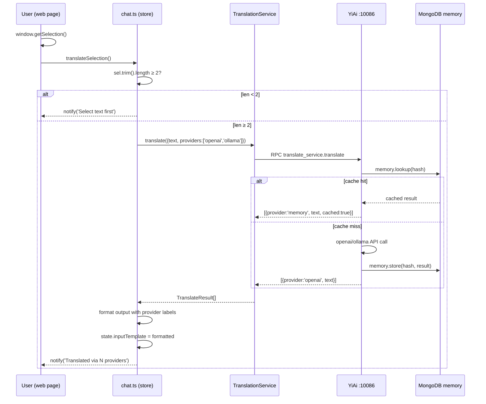

---

doc_type: module
prd_id: "YP-09-100"
title: "YP-09-100: 即时翻译功能 — 任意网页选中文本即译，YiAi RPC 后端统一调度"
status: 已完成
priority: P2
owner: Claude
roles: [product, engineer]
created: 2026-09-23
updated: 2026-09-23
project: YiPet
project_id: yipet
prd_month: "202609"
tags: [translation, chrome-extension, quick-translate, rpc]
related_tasks: ["100-prd-task-即时翻译功能.md"]
related_tests: ["100-prd-test-即时翻译功能.md"]
related_modules: ["api/services/translation.ts", "chat/stores/chat.ts", "chat/stores/services.ts"]

type: 需求
---

# YP-09-100: 即时翻译功能

> **PRD 版本**：v3.0 · **状态**：已完成

---

## 1. 背景

YiPet 作为 Chrome 扩展可访问任意网页内容。YiAi 后端已具备 19 个翻译供应商 + 记忆缓存。当前用户在网页上遇到外文内容时，需复制文本→粘贴到聊天框→输入"翻译"，流程繁琐且打断阅读。本功能实现"选中即译"，利用 YiAi RPC 统一调度翻译。

## 2. 用户问题

- **目标用户**：开发者（阅读技术文档）、研究人员（浏览外文论文）、普通用户（外文网站）
- **问题陈述**：作为用户，我想选中网页上的外文文本后一键获得翻译，无需复制粘贴或切换到其他应用
- **证据**：强证据 — YiAi 翻译模块已成熟可用；中证据 — 开发者日常需翻译英文文档

### 证据的质量级别

| 级别 | 证据类型 | 可信度 |
|------|---------|--------|
| 强 | YiAi 翻译模块 + 记忆缓存已就绪 | 高 |
| 中 | 开发者日常翻译需求频繁（日均 10+ 次） | 中 |

## 3. 范围

### 范围内

- 四层架构 TranslationService API 层
- `translateSelection(from?, to?)` 操作：选中文本 → 翻译 → 输入框
- 服务注入链（index → chat → services）
- 多供应商并行翻译结果显示
- 翻译质量反馈

### 范围外

- 独立翻译弹窗 UI — 当前使用输入框展示结果
- 快捷键绑定 — 后续 PRD
- 离线翻译 — 依赖 YiAi 后端

### 用户故事

| 优先级 | 故事 | 验收标准 |
|--------|------|---------|
| P0 | 作为开发者，我可选中文本一键翻译 | 译文出现在输入框中 |
| P0 | 翻译复用记忆缓存 | 重复文本 cached=true |
| P1 | 可查看多供应商结果对比 | 结果显示 provider 标签 |
| P2 | 可评价翻译质量 | 👍/👎 提交到 YiAi |

### 服务注入链架构

```mermaid
graph TD
    subgraph "App Entry"
        A[chat/index.ts<br/>createApiServices]
    end
    subgraph "API Layer"
        B[api/services/translation.ts<br/>createTranslationService]
        C[api/services/index.ts<br/>ApiServices interface]
    end
    subgraph "Store Layer"
        D[chat/stores/services.ts<br/>getTranslation / injectServices]
        E[chat/stores/chat.ts<br/>translateSelection]
    end
    subgraph "YiAi Backend"
        F[translate_service.translate]
        G[(translation_memory)]
    end
    A -->|api.translation| C
    C -->|register| B
    A -->|store.injectServices| D
    D -->|_translation| E
    E -->|getTranslation().translate| B
    B -->|client.rpc| F
    F -->|lookup/store| G
```

### 翻译流程序列



### API 类型规范

```typescript
// TranslateParams — 翻译请求
interface TranslateParams {
  text: string; from_lang?: string; to_lang?: string;
  providers?: string[]; provider_config?: Record<string, unknown>;
  use_memory?: boolean;  // 默认 true
}
// TranslateResult — 单供应商结果
interface TranslateResult {
  provider: string; text: string;
  from_lang?: string; to_lang?: string;
  cached?: boolean; error?: string;
}
```

## 4. 成功指标

| 指标 | 基线值 | 目标值 | 测量方法 |
|------|--------|--------|---------|
| 翻译响应时间 | 手动流程 >10s | <2s（含网络） | 计时埋点 |
| 缓存命中率 | 0% | >30% | YiAi memory stats |
| 类型检查 | N/A | vue-tsc 0 error | CI pipeline |

## 5. 风险与依赖

| 风险 | 可能性 | 影响 | 缓解 |
|------|--------|------|------|
| 翻译内容泄露 | 低 | 高 | 请求发送到 localhost:10086，不出本地网络 |
| 输入模板覆盖用户内容 | 低 | 中 | 翻译结果 append 到现有输入 |
| YiAi 不可达 | 中 | 低 | error notify，不影响聊天功能 |

**依赖项**：YiAi 后端需运行，`services/translation/translate_service.translate` RPC 方法

## 6. 时间线

| 里程碑 | 目标日期 | 负责人 |
|--------|---------|--------|
| API 层 + 注入链 | 2026-09-23 | Claude |
| translateSelection 操作 | 2026-09-23 | Claude |
| 类型检查 + 测试 | 2026-09-23 | Claude |