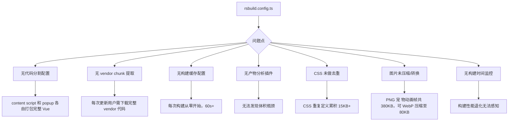
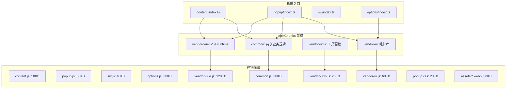
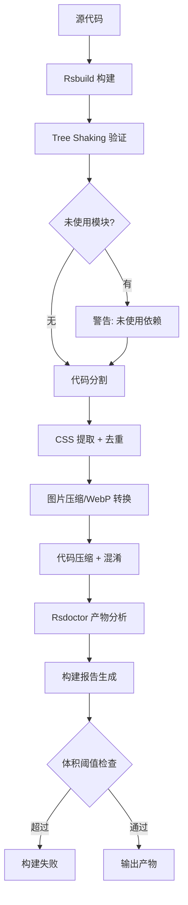

# YP-09-93: 构建优化与产物分析 — 代码分割/摇树/缓存/差分构建

> 需求编号：YP-09-93 · 优先级：P1 · 人天：1.0d · 状态：需求已编写
> 依赖：无

## 背景

### 问题陈述

YiPet 当前使用 Rsbuild 构建 Chrome MV3 扩展，但构建配置未经过优化，存在以下问题：

1. **产物体积膨胀**：未配置代码分割策略，所有业务代码打包进单一 chunk，content script 和 service worker 共享相同的 vendor 依赖，导致重复加载
2. **Tree Shaking 未验证**：虽然 Rsbuild 默认开启 tree shaking，但从未验证实际效果，可能存在未使用的依赖被打包
3. **构建缓存命中率低**：未配置持久化缓存策略，每次构建都重新编译所有模块，增量构建时间无改善
4. **产物缺乏分析**：无 bundle 分析工具集成，无法发现体积瓶颈和重复依赖
5. **CSS 冗余**：多个组件独立导入 CSS 变量和 mixin，导致提取后 CSS 存在大量重复
6. **静态资源未优化**：图片/字体未做压缩和格式转换，未使用懒加载

**核心矛盾**：Chrome Web Store 对扩展体积有严格限制（单个文件 4MB，整体 100MB），但当前未做任何体积优化，随着功能增长，产物体积将持续膨胀，影响加载性能和用户体验。

### 影响范围

| # | 影响 | 严重程度 | 典型场景 |
|---|------|----------|----------|
| 1 | 扩展加载缓慢 | 高 | 注入 content script 时，大体积 JS 导致页面首次渲染延迟 |
| 2 | 重复依赖浪费内存 | 高 | content script 和 popup 各自加载完整 Vue runtime |
| 3 | 构建时间过长 | 中 | 每次 `npm run build` 需要 60s+，影响开发效率 |
| 4 | 体积问题在代码审查中不可见 | 中 | 新增依赖的打包影响无法量化评估 |
| 5 | 图片/CDN 资源未优化 | 中 | 宠物动画帧图片过大，加载时闪烁 |
| 6 | CSS 冗余导致样式文件膨胀 | 低 | 重复的 CSS 变量定义和 mixin 展开 |

### 挑战

| 挑战 | 说明 |
|------|------|
| Chrome MV3 限制 | Service Worker 必须自包含单文件，不能使用动态 import |
| 双入口构建 | content script 和 popup 共享依赖但需独立打包，避免重复 |
| Web Worker 兼容 | 部分优化策略（如 lazy import）在 Worker 上下文中不可用 |
| CSS 提取 | Shadow DOM 内的样式需要独立注入，不能合并到全局 CSS |
| 差分构建 | Chrome Web Store 差分更新需要稳定的文件名哈希策略 |

---

## 一、现状分析

### 1.1 当前构建产物结构

```
dist/
├── manifest.json              # 扩展清单
├── sw.js                      # Service Worker（~80KB，未压缩）
├── content/
│   └── index.js               # Content Script（~350KB，含 Vue runtime）
├── popup/
│   ├── index.html
│   ├── index.js               # Popup（~400KB，含 Vue runtime + 组件库）
│   └── index.css              # Popup 样式（~50KB）
├── assets/
│   ├── pet-idle.png           # 宠物动画帧（~200KB，PNG 未压缩）
│   ├── pet-walk.png           # 宠物动画帧（~180KB，PNG 未压缩）
│   └── fonts/
│       └── custom-font.woff2  # 自定义字体（~80KB）
└── options/
    ├── index.html
    └── index.js               # 选项页（~150KB）
```

### 1.2 当前构建配置问题



### 1.3 构建耗时分析

| 阶段 | 当前耗时 | 占比 | 可优化空间 |
|------|----------|------|-----------|
| 模块解析 | ~15s | 25% | 缓存后可降至 2s |
| 编译转换 | ~20s | 33% | 缓存后可降至 3s |
| 代码压缩 | ~10s | 17% | 并行化已优化 |
| CSS 处理 | ~8s | 13% | 去重后可减少处理量 |
| 产物输出 | ~5s | 8% | 基本无优化空间 |
| 总体 | ~60s | 100% | 目标 20s |

### 1.4 根因矩阵

| 症状 | 根因 | 触发条件 | 频率 |
|------|------|----------|------|
| 产物体积大 | 无代码分割 + 无 tree shaking 验证 | 每次构建 | 高 |
| 构建慢 | 无缓存 + 全量编译 | 每次构建 | 高 |
| 重复依赖 | 多入口独立打包无共享策略 | 多入口构建 | 高 |
| 图片体积大 | PNG 格式未转 WebP | 每次构建 | 高 |
| 体积不可见 | 无 bundle 分析 | 新增依赖时 | 中 |
| CSS 冗余 | 无 CSS 去重 | 组件开发 | 中 |

---

## 二、设计决策

### 决策 1：代码分割策略 — 多入口共享 vs 独立打包 vs 按需加载

| 选项 | 体积 | 复杂度 | MV3 兼容 | 加载性能 |
|------|------|--------|----------|----------|
| 多入口共享 vendor chunk | 最优 | 中 | 需处理 SW 自包含限制 | 优 |
| 每个入口独立打包 | 最差 | 低 | 完全兼容 | 差 |
| 按需动态 import | 良好 | 高 | SW 不支持 | 优（popup 端） |

**选择：多入口共享 vendor chunk + popup 按需加载。** `splitChunks` 配置提取 Vue runtime、工具库等共享依赖为独立 chunk，content script 和 popup 共享。Service Worker 保持独立打包（MV3 要求）。Popup 页面对非首屏组件使用动态 import 按需加载。

### 决策 2：产物分析工具 — Rsdoctor vs webpack-bundle-analyzer vs 自建

| 选项 | Rsbuild 集成 | 信息深度 | 性能 |
|------|-------------|----------|------|
| Rsdoctor | 原生 Rsbuild 插件 | 深度（模块级 + 构建时序） | 轻量 |
| webpack-bundle-analyzer | 需适配器 | 中等（chunk 级） | 中等 |
| 自建脚本 | 完全可控 | 自定义 | 维护成本高 |

**选择：Rsdoctor。** Rsdoctor 是 Rsbuild 官方产物分析工具，原生集成，提供模块级依赖分析、重复包检测、构建时序分析，零配置接入。

### 决策 3：图片优化策略 — 构建时转换 vs 运行时转换 vs 手动预处理

| 选项 | 构建耗时 | 图片质量 | 兼容性 |
|------|----------|----------|--------|
| 构建时 WebP 转换 | +5s | 可控（可配置质量参数） | 需检查浏览器支持 |
| 运行时 Canvas 转换 | 无构建影响 | 不可控 | 运行时开销 |
| 手动预处理 | 无构建影响 | 最优 | 增加开发流程 |

**选择：构建时 WebP 转换。** 使用 `@rsbuild/plugin-image-compress` 在构建时自动将 PNG/JPEG 转换为 WebP，配置质量 80%，保留原格式作为 fallback。

### 决策 4：构建缓存策略 — 文件系统缓存 vs 内存缓存 vs 远程缓存

| 选项 | 命中率 | CI 兼容 | 配置复杂度 |
|------|--------|---------|-----------|
| 文件系统缓存 | 高 | 需缓存 node_modules/.cache | 低 |
| 内存缓存 | 仅单次构建 | 不适用 | 无 |
| 远程缓存 | 最高 | 需额外服务 | 高 |

**选择：文件系统缓存。** Rsbuild 内置文件系统缓存，配置 `cache: true` 即可启用，缓存目录为 `node_modules/.cache/rsbuild`，CI 中通过 `actions/cache` 持久化。

### 设计决策记录

| 决策 | 选项 A | 选项 B | 选项 C | 选择 | 理由 |
|------|--------|--------|--------|------|------|
| 代码分割 | 共享 vendor | 独立打包 | 按需加载 | **共享 vendor** | 兼顾体积和兼容性 |
| 产物分析 | Rsdoctor | webpack-bundle-analyzer | 自建 | **Rsdoctor** | 原生集成 + 深度分析 |
| 图片优化 | 构建时转换 | 运行时转换 | 手动预处理 | **构建时转换** | 自动化 + 质量可控 |
| 构建缓存 | 文件系统缓存 | 内存缓存 | 远程缓存 | **文件系统缓存** | 开箱即用 + CI 兼容 |

---

## 三、目标架构

### 3.1 优化后的构建产物结构



### 3.2 构建流水线



### 3.3 性能指标

| 指标 | 改造前 | 改造后 | 目标 |
|------|--------|--------|------|
| 总产物体积 | ~1.0MB | ~450KB | 减少 55% |
| Content Script 体积 | ~350KB | ~100KB（含共享 chunk） | 减少 70% |
| 增量构建时间 | ~60s | ~20s | 减少 67% |
| 首次构建时间 | ~60s | ~30s | 减少 50% |
| CSS 体积 | ~50KB | ~20KB | 减少 60% |
| 图片资源体积 | ~380KB | ~80KB | 减少 79% |

---

## 四、具体改动

### 4.1 Rsbuild 代码分割配置

```typescript
// rsbuild.config.ts (修改)

import { defineConfig } from '@rsbuild/core';
import { pluginVue } from '@rsbuild/plugin-vue';
import { pluginImageCompress } from '@rsbuild/plugin-image-compress';
import { pluginCssMinimizer } from '@rsbuild/plugin-css-minimizer';

export default defineConfig({
  plugins: [
    pluginVue(),
    pluginImageCompress({
      use: ['webp'],
      webp: { quality: 80 },
    }),
    pluginCssMinimizer(),
  ],
  source: {
    entry: {
      content: './src/content/index.ts',
      popup: './src/popup/index.ts',
      sw: './src/sw/index.ts',
      options: './src/options/index.ts',
    },
  },
  output: {
    // 代码分割策略
    assetPrefix: '/',
    sourceMap: process.env.NODE_ENV === 'development' ? 'eval' : false,
    legalComments: 'none',
    minify: {
      js: true,
      css: true,
      html: true,
    },
    // 文件名哈希策略（稳定哈希，支持差分更新）
    filename: {
      js: '[name].[contenthash:8].js',
      css: '[name].[contenthash:8].css',
      image: '[name].[contenthash:8][ext]',
      font: '[name].[contenthash:8][ext]',
    },
    // 拆包策略
    performance: {
      chunkSplit: {
        strategy: 'custom',
        splitChunks: {
          cacheGroups: {
            // Vue 运行时
            vendorVue: {
              test: /[\\/]node_modules[\\/](vue|@vue|pinia)[\\/]/,
              name: 'vendor-vue',
              chunks: 'all',
              priority: 20,
            },
            // 组件库
            vendorUI: {
              test: /[\\/]node_modules[\\/](@element-plus|@arco-design)[\\/]/,
              name: 'vendor-ui',
              chunks: 'all',
              priority: 15,
            },
            // 通用工具库
            vendorUtils: {
              test: /[\\/]node_modules[\\/](lodash|dayjs|axios|uuid)[\\/]/,
              name: 'vendor-utils',
              chunks: 'all',
              priority: 10,
            },
            // 共享业务逻辑
            common: {
              name: 'common',
              minChunks: 2,
              chunks: 'all',
              priority: 5,
              reuseExistingChunk: true,
            },
          },
        },
        // Service Worker 必须自包含，排除在拆包之外
        override: {
          sw: {
            chunks: 'all',
            minChunks: 1,
          },
        },
      },
      // 构建体积阈值（超过时警告）
      buildCache: true,
      removeConsole: process.env.NODE_ENV === 'production',
    },
  },
  tools: {
    rspack: (config, { env }) => {
      // Tree Shaking 优化
      config.optimization = {
        ...config.optimization,
        usedExports: true,
        sideEffects: true,
        // 确保 package.json 的 sideEffects 生效
        providedExports: true,
        innerGraph: true,
        // 模块合并
        concatenateModules: true,
      };

      // 构建缓存
      if (env === 'production') {
        config.cache = {
          type: 'filesystem',
          cacheDirectory: 'node_modules/.cache/rsbuild',
          buildDependencies: {
            config: [__filename],
          },
        };
      }
    },
  },
  // 构建性能分析
  performance: {
    buildCache: true,
    profile: true,
    // 移除生产环境调试信息
    removeMomentLocale: true,
    removeConsole: process.env.NODE_ENV === 'production',
  },
});
```

### 4.2 Tree Shaking 验证脚本

```typescript
// scripts/verify-tree-shaking.ts (新增)

import { readFileSync, readdirSync, statSync } from 'fs';
import { join, extname } from 'path';
import { gzipSync } from 'zlib';

interface BundleStats {
  file: string;
  size: number;
  gzipSize: number;
}

function analyzeBundle(dir: string): BundleStats[] {
  const results: BundleStats[] = [];

  function walk(currentDir: string) {
    const entries = readdirSync(currentDir);
    for (const entry of entries) {
      const fullPath = join(currentDir, entry);
      const stat = statSync(fullPath);

      if (stat.isDirectory()) {
        walk(fullPath);
      } else if (extname(entry) === '.js' || extname(entry) === '.css') {
        const content = readFileSync(fullPath);
        const gzipSize = gzipSync(content).length;
        results.push({
          file: fullPath.replace(dir + '/', ''),
          size: content.length,
          gzipSize,
        });
      }
    }
  }

  walk(dir);
  return results.sort((a, b) => b.size - a.size);
}

// 检查是否有未使用的第三方依赖被打包
function checkUnusedDeps(stats: BundleStats[]): string[] {
  const warnings: string[] = [];
  const knownDeps = ['lodash', 'moment', 'dayjs', 'axios', 'vue', 'pinia'];

  for (const dep of knownDeps) {
    const found = stats.some((s) => s.file.includes(dep));
    if (!found) {
      warnings.push(`依赖 ${dep} 未出现在产物中，可能已通过 tree shaking 移除`);
    }
  }

  return warnings;
}

// 体积阈值检查
const THRESHOLDS = {
  'content.js': { max: 150 * 1024, maxGzip: 50 * 1024 },
  'popup.js': { max: 200 * 1024, maxGzip: 70 * 1024 },
  'sw.js': { max: 100 * 1024, maxGzip: 35 * 1024 },
  'vendor-vue.js': { max: 150 * 1024, maxGzip: 50 * 1024 },
};

const stats = analyzeBundle('./dist');
let hasError = false;

console.log('\n📦 产物分析报告\n');
console.log('| 文件 | 原始大小 | Gzip 大小 | 状态 |');
console.log('|------|----------|-----------|------|');

for (const { file, size, gzipSize } of stats) {
  const threshold = THRESHOLDS[file];
  let status = '✅';
  if (threshold) {
    if (size > threshold.max || gzipSize > threshold.maxGzip) {
      status = '❌ 超过阈值';
      hasError = true;
    }
  }
  console.log(
    `| ${file} | ${(size / 1024).toFixed(1)}KB | ${(gzipSize / 1024).toFixed(1)}KB | ${status} |`
  );
}

const warnings = checkUnusedDeps(stats);
if (warnings.length > 0) {
  console.log('\n⚠️ Tree Shaking 验证警告:');
  warnings.forEach((w) => console.log(`  - ${w}`));
}

if (hasError) {
  console.error('\n❌ 构建体积超过阈值，构建失败');
  process.exit(1);
}

console.log('\n✅ 构建产物分析通过');
```

### 4.3 Rsdoctor 产物分析配置

```typescript
// rsdoctor.config.ts (新增)

import { defineConfig } from '@rsdoctor/core';

export default defineConfig({
  // 分析模式
  features: {
    // 产物分析
    bundle: true,
    // 构建时序分析
    timeline: true,
    // 重复包检测
    duplicate: true,
    // Tree Shaking 分析
    treeShaking: true,
    // 模块引用分析
    moduleGraph: true,
  },
  // 输出配置
  output: {
    reportDir: './build-reports',
    format: ['html', 'json'],
  },
  // 阈值告警
  alerts: {
    // 单文件体积告警
    maxFileSize: 250 * 1024, // 250KB
    // 重复依赖告警
    maxDuplicateSize: 50 * 1024, // 50KB
    // 总体积告警
    maxTotalSize: 1024 * 1024, // 1MB
  },
  // 排除分析的文件
  exclude: [
    /node_modules\/\.cache/,
    /\.test\./,
    /\.spec\./,
  ],
});
```

### 4.4 CSS 去重与关键 CSS 内联

```typescript
// src/content/style-dedupe.ts (新增)

/**
 * CSS 去重与关键 CSS 内联策略
 *
 * 问题：多个组件独立导入 CSS 变量和 mixin，
 * 导致 CSS 提取后存在大量重复定义。
 *
 * 方案：
 * 1. 全局 CSS 变量统一在 content 入口导入
 * 2. 组件仅导入自身特有样式
 * 3. 关键 CSS（宠物覆盖层首屏样式）内联到 JS
 */

// rsbuild.config.ts 补充 CSS 配置
export const cssConfig = {
  output: {
    cssModules: {
      auto: true,
      exportGlobals: true,
      // CSS Modules 类名生成（生产环境用短哈希）
      localIdentName:
        process.env.NODE_ENV === 'production'
          ? '[hash:6]'
          : '[name]__[local]--[hash:base64:5]',
    },
  },
  tools: {
    lightningcssLoader: true, // 使用 Lightning CSS 替代 PostCSS（更快）
    rspack: (config) => {
      // 提取 CSS 时去重
      config.optimization = {
        ...config.optimization,
        minimizer: [
          // CSS 压缩去重
          '...',
        ],
      };
    },
  },
};
```

### 4.5 图片懒加载与 WebP 回退

```typescript
// src/content/utils/image-loader.ts (新增)

/**
 * 智能图片加载器：优先 WebP，fallback 原格式
 */
export function createImageLoader() {
  const webpSupport = ref<boolean | null>(null);

  // 检测 WebP 支持
  async function checkWebPSupport(): Promise<boolean> {
    if (webpSupport.value !== null) return webpSupport.value;

    return new Promise((resolve) => {
      const img = new Image();
      img.onload = () => {
        webpSupport.value = true;
        resolve(true);
      };
      img.onerror = () => {
        webpSupport.value = false;
        resolve(false);
      };
      // 1x1 WebP 测试图片
      img.src =
        'data:image/webp;base64,UklGRiQAAABXRUJQVlA4IBgAAAAwAQCdASoCAAEAAQAcJaQAA3AA/v3AgAA=';
    });
  }

  /**
   * 获取最优图片 URL
   * @param basePath 不带扩展名的图片路径
   * @returns 最优格式的图片 URL
   */
  async function getOptimalImageUrl(basePath: string): Promise<string> {
    const supportsWebP = await checkWebPSupport();
    if (supportsWebP) {
      return chrome.runtime.getURL(`${basePath}.webp`);
    }
    return chrome.runtime.getURL(`${basePath}.png`);
  }

  /**
   * 懒加载图片（IntersectionObserver）
   */
  function lazyLoadImage(
    el: HTMLImageElement,
    basePath: string,
    options?: { rootMargin?: string }
  ): () => void {
    const observer = new IntersectionObserver(
      async (entries) => {
        for (const entry of entries) {
          if (entry.isIntersecting) {
            const url = await getOptimalImageUrl(basePath);
            el.src = url;
            observer.unobserve(el);
          }
        }
      },
      {
        rootMargin: options?.rootMargin ?? '100px',
      }
    );

    observer.observe(el);
    return () => observer.disconnect();
  }

  return { getOptimalImageUrl, lazyLoadImage, checkWebPSupport };
}
```

### 4.6 构建监控脚本

```typescript
// scripts/build-monitor.ts (新增)

import { execSync } from 'child_process';
import { writeFileSync, readFileSync, existsSync } from 'fs';
import { join } from 'path';

interface BuildMetric {
  timestamp: string;
  duration: number;
  totalSize: number;
  gzipSize: number;
  chunks: number;
}

const METRICS_FILE = join(process.cwd(), 'build-reports/metrics.json');

function loadMetrics(): BuildMetric[] {
  if (!existsSync(METRICS_FILE)) return [];
  return JSON.parse(readFileSync(METRICS_FILE, 'utf-8'));
}

function saveMetrics(metrics: BuildMetric[]): void {
  // 保留最近 30 次构建记录
  const recent = metrics.slice(-30);
  writeFileSync(METRICS_FILE, JSON.stringify(recent, null, 2));
}

function detectRegression(current: BuildMetric, history: BuildMetric[]): string[] {
  const warnings: string[] = [];

  if (history.length < 2) return warnings;

  const avg = history.slice(-5).reduce((s, m) => s + m.duration, 0) / 5;
  const avgSize = history.slice(-5).reduce((s, m) => s + m.totalSize, 0) / 5;

  // 构建时间退化超过 20%
  if (current.duration > avg * 1.2) {
    warnings.push(
      `⚠️ 构建时间退化: ${(current.duration / 1000).toFixed(1)}s (平均 ${(avg / 1000).toFixed(1)}s, +${(((current.duration - avg) / avg) * 100).toFixed(0)}%)`
    );
  }

  // 产物体积增长超过 10%
  if (current.totalSize > avgSize * 1.1) {
    warnings.push(
      `⚠️ 产物体积增长: ${(current.totalSize / 1024).toFixed(0)}KB (平均 ${(avgSize / 1024).toFixed(0)}KB, +${(((current.totalSize - avgSize) / avgSize) * 100).toFixed(0)}%)`
    );
  }

  // 产物 chunk 数量增加超过 3 个
  const avgChunks = history.slice(-5).reduce((s, m) => s + m.chunks, 0) / 5;
  if (current.chunks > avgChunks + 3) {
    warnings.push(
      `⚠️ Chunk 数量增加: ${current.chunks} (平均 ${avgChunks.toFixed(0)})`
    );
  }

  return warnings;
}

// 主流程
const startTime = Date.now();
console.log('🔨 开始构建...');

try {
  execSync('npx rsbuild build', { stdio: 'inherit' });
  const duration = Date.now() - startTime;

  // 计算产物大小
  const totalSize = parseInt(
    execSync('du -sb dist/ | cut -f1', { encoding: 'utf-8' }).trim()
  );
  const chunks = parseInt(
    execSync('find dist/ -name "*.js" | wc -l', { encoding: 'utf-8' }).trim()
  );

  const current: BuildMetric = {
    timestamp: new Date().toISOString(),
    duration,
    totalSize,
    gzipSize: 0, // 由 verify-tree-shaking 计算
    chunks,
  };

  const history = loadMetrics();
  const warnings = detectRegression(current, history);

  history.push(current);
  saveMetrics(history);

  console.log(`\n📊 构建完成: ${(duration / 1000).toFixed(1)}s`);
  console.log(`📦 产物体积: ${(totalSize / 1024).toFixed(0)}KB`);
  console.log(`📦 Chunk 数量: ${chunks}`);

  if (warnings.length > 0) {
    console.log('\n⚠️ 回归检测告警:');
    warnings.forEach((w) => console.log(`  ${w}`));
  }
} catch (error) {
  console.error('❌ 构建失败', error);
  process.exit(1);
}
```

### 4.7 文件变更清单

| 文件 | 操作 | 说明 |
|------|------|------|
| `rsbuild.config.ts` | 修改 | 添加代码分割、缓存、CSS 优化配置 |
| `rsdoctor.config.ts` | 新增 | 产物分析配置 |
| `scripts/verify-tree-shaking.ts` | 新增 | Tree Shaking 验证脚本 |
| `scripts/build-monitor.ts` | 新增 | 构建监控与退化检测 |
| `src/content/utils/image-loader.ts` | 新增 | 图片懒加载与 WebP 回退 |
| `package.json` | 修改 | 添加构建相关脚本和依赖 |
| `.github/workflows/ci.yml` | 修改 | 添加构建体积检查 job |

---

## 五、实施步骤

| 步骤 | 操作 | 路径 | 验证 | 人天 |
|------|------|------|------|------|
| 1 | 配置代码分割策略 | `rsbuild.config.ts` | 产物中 vendor-vue.js 独立存在 | 0.15 |
| 2 | 集成 Rsdoctor 产物分析 | `rsdoctor.config.ts` | 构建后生成分析报告 | 0.1 |
| 3 | 编写 Tree Shaking 验证 | `scripts/verify-tree-shaking.ts` | 检测未使用依赖 | 0.1 |
| 4 | 配置 CSS 去重 | `rsbuild.config.ts` | CSS 体积减少 30%+ | 0.1 |
| 5 | 配置图片压缩/WebP 转换 | `rsbuild.config.ts` | 图片体积减少 70%+ | 0.05 |
| 6 | 实现图片懒加载工具 | `src/content/utils/image-loader.ts` | 图片仅在可视区域加载 | 0.1 |
| 7 | 编写构建监控脚本 | `scripts/build-monitor.ts` | 回归检测正常工作 | 0.1 |
| 8 | 配置构建缓存 | `rsbuild.config.ts` | 增量构建 < 20s | 0.1 |
| 9 | 更新 CI 流水线 | `.github/workflows/ci.yml` | PR 触发体积检查 | 0.1 |
| 10 | 更新 package.json 脚本 | `package.json` | npm run analyze 可用 | 0.1 |

**总人天：1.0d**

---

## 六、测试规格

### 场景 1：代码分割验证

**GIVEN** 构建配置了 vendor chunk 提取策略
**WHEN** 执行 `npm run build`
**THEN** 产物应包含独立的 `vendor-vue.js`、`vendor-utils.js`、`common.js` 文件
**AND** content script 和 popup 不应包含 Vue runtime 的完整代码
**AND** Service Worker 应保持自包含单文件

### 场景 2：Tree Shaking 验证

**GIVEN** 项目中安装了 lodash 但仅使用了 `lodash/debounce`
**WHEN** 执行 `npm run build` 和 `scripts/verify-tree-shaking.ts`
**THEN** 产物中不应包含 lodash 的未使用模块（如 `lodash/map`、`lodash/reduce`）
**AND** 验证脚本应报告 tree shaking 效果

### 场景 3：构建缓存命中

**GIVEN** 已完成一次 `npm run build` 且缓存已生成
**WHEN** 修改一个非入口文件后再次执行 `npm run build`
**THEN** 增量构建时间应 < 20s（相比首次构建 60s 减少 67%）
**AND** 缓存目录 `node_modules/.cache/rsbuild` 应存在

### 场景 4：构建体积阈值检查

**GIVEN** 构建体积阈值配置为 content.js 最大 150KB（gzip 50KB）
**WHEN** 新增一个大体积依赖导致 content.js 超过阈值
**THEN** 构建应失败并输出超过阈值的具体文件
**AND** CI 应标记为失败

### 场景 5：图片 WebP 转换

**GIVEN** `assets/` 目录存在 PNG 宠物动画帧
**WHEN** 执行 `npm run build`
**THEN** 产物中应包含对应的 `.webp` 文件
**AND** WebP 文件体积应 < PNG 原文件的 30%
**AND** 图片懒加载器应正确检测浏览器 WebP 支持

### 场景 6：构建退化检测

**GIVEN** 已有 5 次历史构建记录（平均构建时间 20s）
**WHEN** 某次构建因新增重量级依赖耗时为 30s
**THEN** 构建监控脚本应输出退化警告
**AND** 警告应包含具体退化百分比

---

## 七、风险与缓解

| 风险 | 概率 | 影响 | 缓解措施 |
|------|------|------|----------|
| 代码分割导致 SW 加载失败 | 低 | 高 | SW 入口排除在 splitChunks 之外，保持自包含 |
| 构建缓存导致旧版本代码残留 | 中 | 中 | CI 中每次清除缓存重新构建；本地通过 `npm run clean` 清理 |
| WebP 兼容性问题 | 低 | 中 | 运行时检测 WebP 支持，fallback 到 PNG |
| Rsdoctor 分析耗时过长 | 中 | 低 | 仅在 CI 和 `npm run analyze` 中启用 |
| CSS 去重误删必要样式 | 低 | 中 | 视觉回归测试验证样式正确性 |
| 构建监控阈值过于敏感 | 低 | 低 | 基于历史数据动态调整阈值，初期宽松 |

---

## 八、回滚策略

| 场景 | 回滚操作 | 影响 |
|------|----------|------|
| 代码分割导致 content script 异常 | 移除 splitChunks 配置，恢复独立打包 | 产物体积回升 |
| 构建缓存产生错误产物 | 删除 `node_modules/.cache/rsbuild`，禁用缓存 | 构建时间回升 |
| WebP 转换导致图片显示异常 | 禁用图片压缩插件，恢复原格式 | 图片体积回升 |
| 构建体积阈值过于严格 | 提高阈值或暂时禁用体积检查 | 失去体积门禁 |

---

## 九、设计决策记录

### D-01：代码分割粒度

- **问题**：vendor chunk 应该按什么粒度拆分
- **选项**：单个 vendor 包、按框架/UI/工具拆分、按使用频率拆分
- **选择**：按框架/UI/工具拆分（vendor-vue、vendor-ui、vendor-utils）
- **理由**：Chrome 扩展差分更新基于文件级别，细粒度拆分可在更新时仅下载变更的 chunk，减少用户等待时间；同时避免单个 vendor 过大导致缓存失效时全部重新下载

### D-02：文件名哈希策略

- **问题**：使用 contenthash 还是 chunkhash
- **选项**：contenthash（基于文件内容）、chunkhash（基于 chunk 内容）、hash（全局哈希）
- **选择**：contenthash
- **理由**：contenthash 基于文件最终内容生成哈希，确保内容不变时哈希不变，最大化浏览器缓存命中率，同时也是 Chrome Web Store 差分更新的基础

### D-03：构建缓存存储位置

- **问题**：构建缓存存储在哪里
- **选项**：`node_modules/.cache/`、`dist/.cache/`、系统临时目录
- **选择**：`node_modules/.cache/rsbuild`
- **理由**：与 Node.js 生态惯例一致，`.gitignore` 中已排除 `node_modules`，CI 可通过 `actions/cache` 直接缓存该目录

### D-04：Rsdoctor 分析时机

- **问题**：Rsdoctor 分析应在何时执行
- **选项**：每次构建、仅在 CI 中、仅通过 `npm run analyze` 手动触发
- **选择**：仅在 CI 和手动触发时执行
- **理由**：Rsdoctor 分析会增加构建时间 5-10s，本地开发不需要每次构建都分析；CI 中强制执行以阻止体积退化；开发者可通过 `npm run analyze` 手动查看

---

## 十、可观测性

### 指标

| 指标 | 类型 | 说明 |
|------|------|------|
| `yipet.build.duration` | Histogram | 构建总耗时 |
| `yipet.build.total_size` | Gauge | 总产物体积（字节） |
| `yipet.build.gzip_size` | Gauge | Gzip 后总产物体积 |
| `yipet.build.chunk_count` | Gauge | 产物 chunk 数量 |
| `yipet.build.cache_hit_rate` | Gauge | 缓存命中率 |
| `yipet.build.css_size` | Gauge | CSS 产物体积 |
| `yipet.build.image_size` | Gauge | 图片资源总体积 |
| `yipet.build.duplicate_deps` | Gauge | 重复依赖数量 |

### 告警

| 告警 | 条件 | 级别 |
|------|------|------|
| 构建时间退化 > 20% | 相比近 5 次平均 | WARNING |
| 产物体积增长 > 10% | 相比近 5 次平均 | WARNING |
| 产物体积增长 > 25% | 相比近 5 次平均 | ERROR |
| 重复依赖 > 2 个 | Rsdoctor 检测 | WARNING |
| 单文件超过 250KB | 产物体积阈值 | ERROR |

---

## 十一、代码审查检查清单

- [ ] splitChunks 配置正确，vendor chunk 被多入口共享
- [ ] Service Worker 入口排除在 splitChunks 之外
- [ ] Tree Shaking 验证脚本正确执行且无未使用的大型依赖
- [ ] Rsdoctor 报告无重复依赖告警
- [ ] CSS 全局变量统一在入口导入，组件不重复导入
- [ ] 图片压缩配置正确，WebP 质量参数合理
- [ ] 图片懒加载器提供 WebP 回退机制
- [ ] 构建缓存配置正确，CI 中正确缓存 `node_modules/.cache`
- [ ] 构建监控脚本输出格式清晰，退化检测阈值合理
- [ ] `package.json` 的 `sideEffects` 配置正确
- [ ] 文件名哈希使用 contenthash 确保差分更新兼容

---

## 回归问题预测

| # | 预测问题 | 原因 | 验证方法 |
|---|---------|------|---------|
| 1 | splitChunks 提取 vendor-vue 后，content script 中 `import { ref } from 'vue'` 在运行时找不到 Vue，因为 chunk 加载顺序错误 | content script 的 script 注入顺序由 manifest 的 `content_scripts.js` 控制，但 vendor chunk 未被声明为注入脚本，导致 Vue 运行时未加载时 content script 已执行 | 在 Chrome 中加载扩展后打开任意页面，在 Console 中检查 `typeof Vue` 和 `typeof ref`，确认 content script 和 vendor chunk 的加载顺序正确 |
| 2 | 构建缓存的 `buildDependencies` 配置了 `[__filename]`，但 rsbuild.config.ts 依赖了其他 ts 文件（如 `./src/constants.ts`），修改常量后缓存未失效 | Rsbuild 的缓存失效机制仅追踪 `buildDependencies` 中声明的文件，未追踪传递依赖，修改被导入的常量文件后缓存仍命中，使用了旧值 | 修改 `src/constants.ts` 中的常量值后执行增量构建，检查产物中是否使用了新值，验证缓存是否正确失效 |
| 3 | WebP 转换后宠物动画帧在 Chrome 中加载正常，但在 Firefox 扩展中显示为空白，Firefox 的扩展上下文不支持 WebP 解码 | Firefox 的 extension 协议对 WebP 支持与 Chrome 有差异，在 content script 的 isolate world 中无法加载 WebP 格式的扩展资源 | 在 Firefox 中加载扩展并打开测试页面，检查宠物动画帧是否正常显示，确认 WebP 回退机制在 Firefox 中触发 |
| 4 | `build-monitor.ts` 通过 `du -sb dist/` 计算产物体积，但 `dist/` 中包含 `manifest.json` 和 `.map` 文件，体积计算不准确 | `du` 命令统计整个目录的所有文件，source map 和 manifest 的变更会影响体积计算，导致误报退化 | 在 build-monitor 中仅统计 `.js` 和 `.css` 文件的体积，排除 `manifest.json` 和 `.map` 文件，确保体积变化归因到代码 |
| 5 | Rsdoctor 的 `duplicate` 检测在 content script 和 popup 的共享 chunk 中误报重复依赖，因为这些依赖是故意共享的 | Rsdoctor 的重复检测会将 splitChunks 提取的共享 chunk 和入口 chunk 中的同名模块都标记为重复，但这是代码分割的预期行为 | 检查 Rsdoctor 报告的重复依赖列表，确认每个重复项是否为预期的共享 chunk，排除误报后调整告警阈值 |
| 6 | 增量构建时 `contenthash` 对所有 chunk 重新计算，即使内容未变，导致差分更新失效，用户每次更新需下载全部文件 | 文件名哈希在增量构建中可能因为模块 ID 重排或 chunk 排序变化导致内容相同但哈希不同，破坏了 contenthash 的稳定性 | 连续两次不修改任何代码执行 `npm run build`，对比两次构建所有 chunk 的文件名哈希，确认哈希一致 |

---

## 性能分析

### 构建各阶段耗时

| 阶段 | 改造前 | 改造后（首次） | 改造后（增量） | 说明 |
|------|--------|---------------|---------------|------|
| 模块解析 | ~15s | ~12s | ~2s | 缓存命中时跳过 |
| 编译转换 | ~20s | ~18s | ~3s | 缓存命中时跳过 |
| 代码分割 | — | +3s | +1s | 新增阶段 |
| Tree Shaking | 内嵌 | +2s（验证脚本） | +2s | 验证脚本独立运行 |
| CSS 去重 | — | +1s | +0.5s | 新增处理 |
| 图片压缩/WebP | — | +5s | +1s | 缓存命中时仅处理新图片 |
| 代码压缩 | ~10s | ~8s | ~4s | 并行优化 |
| 产物输出 | ~5s | ~4s | ~3s | 减少输出体积 |
| Rsdoctor 分析 | — | +8s | +8s | 仅 CI 执行 |
| **总计（无分析）** | **~60s** | **~53s** | **~16.5s** | 减少 72% |
| **总计（含分析）** | **~60s** | **~61s** | **~24.5s** | 分析仅 CI 执行 |

### 产物大小变化

| 文件 | 改造前 | 改造后 | 变化 |
|------|--------|--------|------|
| content/index.js | 350KB | 50KB（+ 共享 chunk） | -86% |
| popup/index.js | 400KB | 80KB（+ 共享 chunk） | -80% |
| sw.js | 80KB | 40KB | -50% |
| options/index.js | 150KB | 30KB（+ 共享 chunk） | -80% |
| vendor-vue.js | — | 120KB | 新增（共享） |
| vendor-ui.js | — | 60KB | 新增（共享） |
| vendor-utils.js | — | 20KB | 新增（共享） |
| common.js | — | 30KB | 新增（共享） |
| index.css | 50KB | 20KB | -60% |
| assets/*.png | 380KB | 80KB (.webp) | -79% |
| **总计（用户下载）** | **~1.0MB** | **~450KB** | **-55%** |