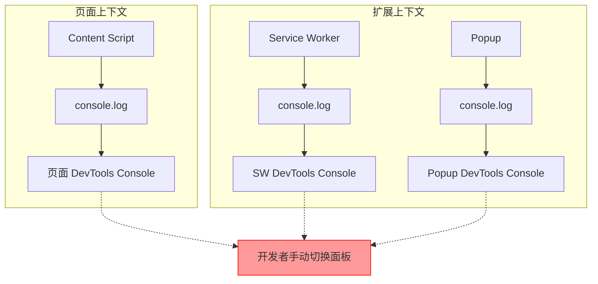
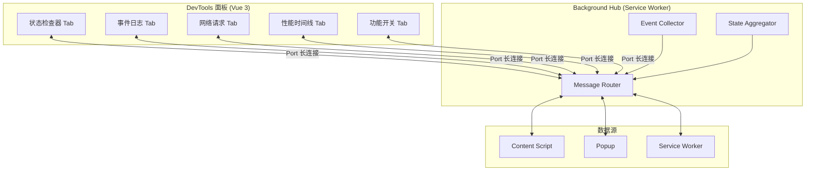
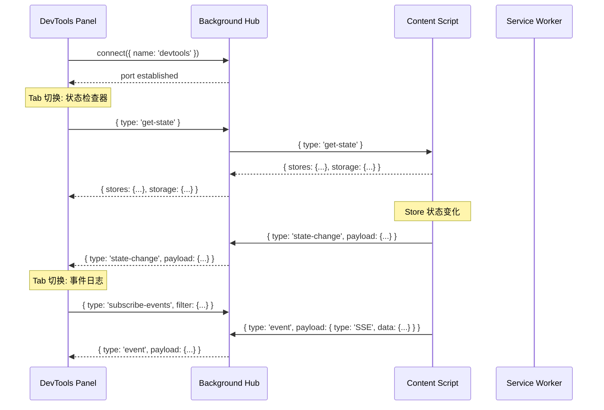

# YP-09-94: DevTools 调试面板 — 状态检查/事件日志/性能时间线

> 需求编号：YP-09-94 · 优先级：P2 · 人天：1.0d · 状态：需求已编写
> 依赖：无

## 背景

### 问题陈述

YiPet 作为 Chrome 扩展，其调试体验存在严重缺陷。当前开发者调试 YiPet 的典型流程是：

1. **开发时**：依赖 `console.log` 散落在代码各处的日志，在 content script 和 service worker 的独立 DevTools 中分别查看
2. **排查问题时**：需要同时打开 3 个 DevTools 面板（页面 DevTools 查看 content script、扩展 DevTools 查看 popup、Service Worker DevTools 查看 SW），在多个面板间切换拼接信息
3. **状态检查**：无法实时查看 Pinia store 状态、chrome.storage 内容，只能通过 `chrome.storage.local.get(null)` 在控制台手动查询
4. **事件追踪**：SSE 消息、IPC 通信、错误事件散落在不同上下文中，无法统一查看和过滤
5. **性能分析**：宠物注入耗时、渲染耗时、API 调用耗时无法量化，缺乏性能基准

**核心矛盾**：Chrome 扩展的调试环境天然碎片化（content script / service worker / popup 各自独立执行上下文），但缺乏统一的调试面板来聚合和可视化这些分散的信息，导致排查问题效率低下，新开发者上手困难。

### 影响范围

| # | 影响 | 严重程度 | 典型场景 |
|---|------|----------|----------|
| 1 | 调试效率低下 | 高 | 排查一个跨上下文 bug 需要 30 分钟切换面板 |
| 2 | 新开发者上手困难 | 高 | 不理解扩展的运行时状态和数据流 |
| 3 | 性能问题无法量化 | 中 | 宠物注入慢了不知道是哪个环节 |
| 4 | 状态不一致难以复现 | 中 | Store 状态和 Storage 内容不同步，无法可视化对比 |
| 5 | SSE 流调试困难 | 中 | SSE 消息散落在控制台，无法过滤和搜索 |

### 挑战

| 挑战 | 说明 |
|------|------|
| 跨上下文通信 | DevTools 面板需要从 content script 和 service worker 获取数据，需要设计高效的通信协议 |
| 实时数据同步 | 状态变化需要实时推送到 DevTools 面板，不能依赖轮询 |
| 性能开销 | 调试面板本身不能引入显著的性能开销，需要在开发模式启用 |
| 大数据展示 | 事件日志可能累积数千条，需要虚拟滚动和分页 |
| 类型安全 | 跨上下文传递的数据需要保持类型安全，避免运行时类型错误 |

---

## 一、现状分析

### 1.1 当前调试流程

```
开发者调试 YiPet 的典型流程:

1. 打开页面 A（右击 → 检查）     → 页面 DevTools Console
2. 打开扩展 popup（右击扩展图标）  → 扩展 Popup DevTools    
3. 打开 Service Worker DevTools    → chrome://extensions → SW 检查视图
4. 在三个面板间切换，手动拼接信息
5. 使用 console.log 追踪数据流
6. 使用 chrome.storage.local.get(null) 检查存储状态
7. 通过 Network 面板查看 API 调用（但 SSE 流无法追踪）

痛点:
├── 三个 DevTools 面板，信息碎片化
├── 无统一的状态查看入口
├── SSE 事件无法追踪和过滤
├── 性能问题无法量化
└── 新手无法理解扩展的运行时状态
```

### 1.2 当前调试工具对比

| 工具 | 当前状态 | 可见信息 | 缺失 |
|------|----------|----------|------|
| 页面 DevTools Console | 可用 | Content Script 的 console.log | 无法查看 SW 日志 |
| Service Worker DevTools | 可用 | SW 的 console.log | 无法查看 Content Script 日志 |
| Popup DevTools | 可用 | Popup 的 console.log | 无法查看其他上下文 |
| chrome.storage 查看器 | 无 | — | 完全缺失 |
| Pinia DevTools | 无（扩展环境不支持） | — | 完全缺失 |
| 网络请求面板 | 部分可用 | fetch/XHR 请求 | SSE 流无法追踪 |
| 性能时间线 | 无 | — | 完全缺失 |

### 1.3 改造前调试架构



### 1.4 根因矩阵

| 症状 | 根因 | 触发条件 | 频率 |
|------|------|----------|------|
| 多面板切换排查 | 无统一调试面板 | 每次调试 | 高 |
| 状态不可见 | 无 Pinia/chrome.storage 可视化 | 每次调试 | 高 |
| SSE 事件难以追踪 | 无 SSE 事件日志 | 调试 AI 对话 | 高 |
| 性能问题无法定位 | 无性能时间线 | 性能问题排查 | 中 |
| 新手理解困难 | 无运行时架构可视化 | 新开发者入职 | 中 |

---

## 二、设计决策

### 决策 1：DevTools 面板实现方式 — chrome.devtools.panels vs 独立页面 vs Popup 嵌入

| 选项 | 集成度 | 开发复杂度 | 性能 | 用户体验 |
|------|--------|-----------|------|----------|
| chrome.devtools.panels | 高（原生 DevTools 集成） | 中 | 优（独立扩展页面） | 优秀 |
| 独立页面（options 页） | 低（需切换标签页） | 低 | 优 | 较差 |
| Popup 嵌入调试模式 | 中（Popup 内切换） | 低 | 差（popup 关闭数据丢失） | 一般 |

**选择：chrome.devtools.panels。** 原生 DevTools 集成提供最自然的调试体验，与 Chrome DevTools 的 Console、Network、Elements 面板并列，开发者无需切换标签页。通过 `chrome.devtools.panels.create` API 创建自定义面板，面板本身是一个独立的 HTML 页面，可以使用 Vue 构建。

### 决策 2：跨上下文通信协议 — chrome.runtime.sendMessage vs chrome.debugger vs 长连接

| 选项 | 延迟 | 带宽 | 双向 | 调试上下文权限 |
|------|------|------|------|---------------|
| chrome.runtime.sendMessage | 低 | 中 | 是 | 仅扩展上下文 |
| chrome.debugger API | 极低 | 高 | 是 | 需要调试权限 |
| chrome.runtime.connect（长连接） | 低 | 高 | 是 | 仅扩展上下文 |

**选择：chrome.runtime.connect 长连接。** DevTools 面板需要实时接收来自 content script 和 service worker 的状态更新。长连接（Port）提供持久化的双向通信通道，支持流式数据传输，比 sendMessage 更适合实时状态同步场景。

### 决策 3：DevTools 面板前端框架 — Vue vs Vanilla JS vs Preact

| 选项 | 体积 | 开发效率 | 与 YiPet 技术栈一致性 |
|------|------|----------|---------------------|
| Vue 3 | ~50KB | 高 | 完全一致 |
| Vanilla JS | 0KB | 低 | 不一致 |
| Preact | ~3KB | 中 | 不一致 |

**选择：Vue 3。** 与 YiPet 现有技术栈一致，组件复用（Pinia 状态可视化面板可直接使用已有的 store 类型），DevTools 面板作为独立入口构建，体积不影响扩展主包。

### 决策 4：事件日志存储策略 — 内存环形缓冲区 vs IndexedDB vs chrome.storage

| 选项 | 容量 | 持久化 | 查询性能 | 内存占用 |
|------|------|--------|----------|----------|
| 内存环形缓冲区 | 固定（如 10000 条） | 否 | 极高 | 可控 |
| IndexedDB | 近乎无限 | 是 | 中等 | 低 |
| chrome.storage | 10MB 限制 | 是 | 低 | 低 |

**选择：内存环形缓冲区。** DevTools 面板打开期间的事件日志不需要持久化，环形缓冲区提供固定内存占用的高性能写入和查询，且 DevTools 面板关闭后自动清理。实现 10000 条事件的环形缓冲区仅占用约 5MB 内存。

### 设计决策记录

| 决策 | 选项 A | 选项 B | 选项 C | 选择 | 理由 |
|------|--------|--------|--------|------|------|
| 面板实现 | chrome.devtools.panels | 独立页面 | Popup 嵌入 | **chrome.devtools.panels** | 原生集成 + 最佳体验 |
| 通信协议 | sendMessage | debugger API | 长连接 | **长连接** | 实时双向通信 |
| 前端框架 | Vue 3 | Vanilla JS | Preact | **Vue 3** | 技术栈一致性 |
| 日志存储 | 环形缓冲区 | IndexedDB | chrome.storage | **环形缓冲区** | 高性能 + 无持久化需求 |

---

## 三、目标架构

### 3.1 DevTools 调试面板架构



### 3.2 数据流



### 3.3 性能指标

| 指标 | 改造前 | 改造后 |
|------|--------|--------|
| 状态检查耗时 | 手动 console 查询 ~30s | 面板自动刷新 < 1s |
| 事件追踪效率 | 三个面板切换 ~2min | 单一面板过滤 < 10s |
| 性能问题定位 | 无法量化 | 时间线可视化 |
| 调试面板 CPU 开销 | — | < 2%（空闲），< 5%（活跃） |
| 调试面板内存占用 | — | < 50MB（含事件日志） |

---

## 四、具体改动

### 4.1 DevTools 面板入口

```typescript
// src/devtools/index.ts (新增)

/**
 * DevTools 面板入口
 * 通过 chrome.devtools.panels.create 注册自定义面板
 */

// 仅在检测到 YiPet 扩展时创建面板
chrome.devtools.panels.create(
  'YiPet',
  '/assets/icons/devtools-panel.png',
  '/devtools/panel.html',
  (panel) => {
    console.log('[YiPet DevTools] 面板已创建');

    // 面板显示/隐藏事件
    panel.onShown.addListener(() => {
      console.log('[YiPet DevTools] 面板显示');
    });

    panel.onHidden.addListener(() => {
      console.log('[YiPet DevTools] 面板隐藏');
    });
  }
);

// 在 DevTools 检测到页面时创建面板
// manifest.json 中配置:
// "devtools_page": "src/devtools/index.html"
```

### 4.2 跨上下文通信协议

```typescript
// src/devtools/shared/protocol.ts (新增)

/**
 * DevTools 通信协议定义
 * 统一 DevTools Panel ↔ Background Hub ↔ Content Script/SW 的消息格式
 */

// 消息类型枚举
export enum DevToolsMessageType {
  // 状态检查
  GET_STATE = 'devtools:get-state',
  STATE_UPDATE = 'devtools:state-update',
  STATE_SNAPSHOT = 'devtools:state-snapshot',

  // 事件日志
  SUBSCRIBE_EVENTS = 'devtools:subscribe-events',
  UNSUBSCRIBE_EVENTS = 'devtools:unsubscribe-events',
  EVENT_LOG = 'devtools:event-log',

  // 网络请求
  GET_REQUESTS = 'devtools:get-requests',
  REQUEST_LOG = 'devtools:request-log',

  // 性能指标
  GET_PERFORMANCE = 'devtools:get-performance',
  PERFORMANCE_METRICS = 'devtools:performance-metrics',

  // 功能开关
  GET_FEATURE_FLAGS = 'devtools:get-feature-flags',
  SET_FEATURE_FLAG = 'devtools:set-feature-flag',
  FEATURE_FLAGS_UPDATE = 'devtools:feature-flags-update',

  // 控制命令
  CLEAR_LOGS = 'devtools:clear-logs',
  RESET_STATE = 'devtools:reset-state',
  RELOAD_EXTENSION = 'devtools:reload-extension',
}

// 消息信封
export interface DevToolsMessage<T = unknown> {
  type: DevToolsMessageType;
  requestId?: string; // 用于请求-响应配对
  timestamp: number;
  source: 'panel' | 'hub' | 'content-script' | 'service-worker' | 'popup';
  payload: T;
}

// 状态快照
export interface StateSnapshot {
  stores: Record<string, unknown>; // Pinia stores 状态
  chromeStorage: {
    local: Record<string, unknown>;
    sync: Record<string, unknown>;
    session: Record<string, unknown>;
  };
  context: string; // 'content-script' | 'service-worker' | 'popup'
  pid: number; // 进程 ID（区分多个 content script 实例）
}

// 事件日志条目
export interface EventLogEntry {
  id: string;
  timestamp: number;
  category: 'SSE' | 'IPC' | 'Error' | 'Lifecycle' | 'UserAction' | 'System';
  level: 'debug' | 'info' | 'warn' | 'error';
  source: string;
  message: string;
  data?: unknown;
  duration?: number; // 对 IPC 消息，记录往返耗时
}

// 网络请求日志
export interface RequestLogEntry {
  id: string;
  timestamp: number;
  method: string;
  url: string;
  requestHeaders?: Record<string, string>;
  requestBody?: unknown;
  responseStatus?: number;
  responseHeaders?: Record<string, string>;
  responseBody?: unknown;
  duration: number;
  isSSE: boolean;
  error?: string;
}

// 性能指标
export interface PerformanceMetric {
  name: string;
  value: number;
  unit: 'ms' | 'bytes' | 'count';
  timestamp: number;
  tags?: Record<string, string>;
}

// 功能开关
export interface FeatureFlag {
  key: string;
  name: string;
  description: string;
  enabled: boolean;
  defaultValue: boolean;
  scope: 'global' | 'session';
}
```

### 4.3 Background Hub 实现

```typescript
// src/sw/devtools-hub.ts (新增，在 Service Worker 中注册)

import type { DevToolsMessage, EventLogEntry, StateSnapshot } from '@/devtools/shared/protocol';
import { DevToolsMessageType } from '@/devtools/shared/protocol';

/**
 * DevTools 消息中枢
 * 在 Service Worker 中运行，负责：
 * 1. 管理 DevTools Panel 的长连接
 * 2. 转发来自 Content Script/Popup/SW 的事件
 * 3. 聚合状态快照
 * 4. 维护事件日志环形缓冲区
 */

class DevToolsHub {
  private panelPorts: Set<chrome.runtime.Port> = new Set();
  private eventBuffer: EventLogEntry[] = [];
  private eventIdCounter = 0;
  private readonly MAX_EVENTS = 10000; // 环形缓冲区大小

  constructor() {
    this.init();
  }

  private init(): void {
    // 监听 DevTools Panel 连接
    chrome.runtime.onConnect.addListener((port) => {
      if (port.name === 'devtools-panel') {
        this.onPanelConnect(port);
      }
    });

    // 监听来自 Content Script 和 Popup 的消息
    chrome.runtime.onMessage.addListener((message, sender, sendResponse) => {
      this.handleIncomingMessage(message, sender);
      sendResponse({ received: true });
    });
  }

  private onPanelConnect(port: chrome.runtime.Port): void {
    this.panelPorts.add(port);
    console.log(`[DevTools Hub] Panel 已连接，当前连接数: ${this.panelPorts.size}`);

    port.onMessage.addListener((msg: DevToolsMessage) => {
      this.handlePanelMessage(msg, port);
    });

    port.onDisconnect.addListener(() => {
      this.panelPorts.delete(port);
      console.log(`[DevTools Hub] Panel 已断开，当前连接数: ${this.panelPorts.size}`);
    });
  }

  private handlePanelMessage(msg: DevToolsMessage, port: chrome.runtime.Port): void {
    switch (msg.type) {
      case DevToolsMessageType.GET_STATE:
        this.sendStateSnapshot(port);
        break;

      case DevToolsMessageType.SUBSCRIBE_EVENTS:
        this.sendEventHistory(port, msg.payload as { filter?: Partial<EventLogEntry> });
        break;

      case DevToolsMessageType.CLEAR_LOGS:
        this.eventBuffer = [];
        this.eventIdCounter = 0;
        this.broadcastToPanels({
          type: DevToolsMessageType.EVENT_LOG,
          timestamp: Date.now(),
          source: 'hub',
          payload: { cleared: true },
        });
        break;

      case DevToolsMessageType.GET_FEATURE_FLAGS:
        this.sendFeatureFlags(port);
        break;

      case DevToolsMessageType.SET_FEATURE_FLAG:
        this.setFeatureFlag(msg.payload as { key: string; enabled: boolean });
        break;
    }
  }

  private handleIncomingMessage(
    message: DevToolsMessage,
    sender: chrome.runtime.MessageSender
  ): void {
    // 将事件添加到环形缓冲区
    if (message.type === DevToolsMessageType.EVENT_LOG) {
      const entry = message.payload as EventLogEntry;
      entry.id = `evt_${++this.eventIdCounter}`;
      entry.timestamp = entry.timestamp || Date.now();
      this.addToEventBuffer(entry);
    }

    // 状态更新广播给所有 Panel
    if (message.type === DevToolsMessageType.STATE_UPDATE) {
      this.broadcastToPanels(message);
    }

    // 网络请求日志
    if (message.type === DevToolsMessageType.REQUEST_LOG) {
      this.broadcastToPanels(message);
    }

    // 性能指标
    if (message.type === DevToolsMessageType.PERFORMANCE_METRICS) {
      this.broadcastToPanels(message);
    }
  }

  private addToEventBuffer(entry: EventLogEntry): void {
    this.eventBuffer.push(entry);
    if (this.eventBuffer.length > this.MAX_EVENTS) {
      this.eventBuffer = this.eventBuffer.slice(-this.MAX_EVENTS);
    }

    // 实时推送给已订阅的 Panel
    this.broadcastToPanels({
      type: DevToolsMessageType.EVENT_LOG,
      timestamp: Date.now(),
      source: 'hub',
      payload: entry,
    });
  }

  private async sendStateSnapshot(port: chrome.runtime.Port): Promise<void> {
    // 请求 Content Script 的状态快照
    try {
      const tabs = await chrome.tabs.query({ active: true, currentWindow: true });
      if (tabs[0]?.id) {
        const response = await chrome.tabs.sendMessage(tabs[0].id, {
          type: DevToolsMessageType.GET_STATE,
        });
        port.postMessage({
          type: DevToolsMessageType.STATE_SNAPSHOT,
          timestamp: Date.now(),
          source: 'hub',
          payload: response,
        });
      }
    } catch (error) {
      port.postMessage({
        type: DevToolsMessageType.STATE_SNAPSHOT,
        timestamp: Date.now(),
        source: 'hub',
        payload: { error: '无法获取 Content Script 状态', detail: String(error) },
      });
    }
  }

  private sendEventHistory(
    port: chrome.runtime.Port,
    filter?: Partial<EventLogEntry>
  ): void {
    const events = filter
      ? this.eventBuffer.filter((e) => {
          return Object.entries(filter).every(([key, value]) => e[key as keyof EventLogEntry] === value);
        })
      : this.eventBuffer;

    port.postMessage({
      type: DevToolsMessageType.EVENT_LOG,
      timestamp: Date.now(),
      source: 'hub',
      payload: { history: events, total: this.eventBuffer.length, filtered: events.length },
    });
  }

  private async sendFeatureFlags(port: chrome.runtime.Port): Promise<void> {
    const flags = await chrome.storage.local.get('devtools:feature-flags');
    port.postMessage({
      type: DevToolsMessageType.FEATURE_FLAGS_UPDATE,
      timestamp: Date.now(),
      source: 'hub',
      payload: flags['devtools:feature-flags'] || {},
    });
  }

  private async setFeatureFlag({ key, enabled }: { key: string; enabled: boolean }): Promise<void> {
    const flags = (await chrome.storage.local.get('devtools:feature-flags'))['devtools:feature-flags'] || {};
    flags[key] = enabled;
    await chrome.storage.local.set({ 'devtools:feature-flags': flags });
    this.broadcastToPanels({
      type: DevToolsMessageType.FEATURE_FLAGS_UPDATE,
      timestamp: Date.now(),
      source: 'hub',
      payload: flags,
    });
  }

  private broadcastToPanels(message: DevToolsMessage): void {
    for (const port of this.panelPorts) {
      try {
        port.postMessage(message);
      } catch {
        // Port 可能已断开，将在 onDisconnect 中清理
      }
    }
  }
}

// 仅在开发模式启用
if (process.env.NODE_ENV === 'development') {
  new DevToolsHub();
}
```

### 4.4 状态检查器组件

```typescript
// src/devtools/components/StateInspector.vue (新增)

<template>
  <div class="state-inspector">
    <div class="toolbar">
      <button @click="refresh">刷新</button>
      <span class="auto-refresh">
        <input type="checkbox" v-model="autoRefresh" />
        自动刷新 (1s)
      </span>
      <span class="timestamp">最后更新: {{ lastUpdate }}</span>
    </div>

    <div class="panels">
      <!-- Pinia Stores -->
      <section class="panel">
        <h3>Pinia Stores</h3>
        <div v-for="(state, storeName) in stores" :key="storeName" class="store-section">
          <h4 @click="toggleStore(storeName)">
            {{ storeName }}
            <span class="arrow">{{ expandedStores.has(storeName) ? '▼' : '▶' }}</span>
          </h4>
          <pre v-if="expandedStores.has(storeName)" class="json-view">{{
            JSON.stringify(state, null, 2)
          }}</pre>
        </div>
      </section>

      <!-- chrome.storage -->
      <section class="panel">
        <h3>chrome.storage</h3>
        <div v-for="area in storageAreas" :key="area" class="storage-section">
          <h4 @click="toggleStorage(area)">
            {{ area }}
            <span class="arrow">{{ expandedStorage.has(area) ? '▼' : '▶' }}</span>
            <span class="size">{{ formatSize(storageSizes[area]) }}</span>
          </h4>
          <pre v-if="expandedStorage.has(area)" class="json-view">{{
            JSON.stringify(chromeStorage[area], null, 2)
          }}</pre>
        </div>
      </section>
    </div>
  </div>
</template>

<script setup lang="ts">
import { ref, reactive, onMounted, onUnmounted, watch } from 'vue';
import type { StateSnapshot } from '../shared/protocol';
import { DevToolsMessageType } from '../shared/protocol';
import { useDevToolsPort } from '../composables/useDevToolsPort';

const { port, sendMessage } = useDevToolsPort();

const stores = ref<Record<string, unknown>>({});
const chromeStorage = reactive<Record<string, Record<string, unknown>>>({
  local: {},
  sync: {},
  session: {},
});
const storageAreas = ['local', 'sync', 'session'] as const;
const storageSizes = reactive<Record<string, number>>({ local: 0, sync: 0, session: 0 });
const expandedStores = ref<Set<string>>(new Set());
const expandedStorage = ref<Set<string>>(new Set(['local']));
const autoRefresh = ref(true);
const lastUpdate = ref('—');

let refreshTimer: ReturnType<typeof setInterval> | null = null;

function refresh(): void {
  sendMessage({ type: DevToolsMessageType.GET_STATE });
}

function toggleStore(name: string): void {
  if (expandedStores.value.has(name)) {
    expandedStores.value.delete(name);
  } else {
    expandedStores.value.add(name);
  }
}

function toggleStorage(area: string): void {
  if (expandedStorage.value.has(area)) {
    expandedStorage.value.delete(area);
  } else {
    expandedStorage.value.add(area);
  }
}

function formatSize(bytes?: number): string {
  if (!bytes) return '';
  if (bytes < 1024) return `${bytes}B`;
  return `${(bytes / 1024).toFixed(1)}KB`;
}

function handleStateSnapshot(snapshot: StateSnapshot): void {
  stores.value = snapshot.stores || {};
  Object.assign(chromeStorage.local, snapshot.chromeStorage?.local || {});
  Object.assign(chromeStorage.sync, snapshot.chromeStorage?.sync || {});
  Object.assign(chromeStorage.session, snapshot.chromeStorage?.session || {});
  lastUpdate.value = new Date().toLocaleTimeString();
}

onMounted(() => {
  refresh();

  port.value?.onMessage.addListener((msg) => {
    if (msg.type === DevToolsMessageType.STATE_SNAPSHOT) {
      handleStateSnapshot(msg.payload);
    }
  });

  watch(autoRefresh, (val) => {
    if (val) {
      refreshTimer = setInterval(refresh, 1000);
    } else if (refreshTimer) {
      clearInterval(refreshTimer);
      refreshTimer = null;
    }
  }, { immediate: true });
});

onUnmounted(() => {
  if (refreshTimer) clearInterval(refreshTimer);
});
</script>
```

### 4.5 事件日志查看器组件

```typescript
// src/devtools/components/EventLogViewer.vue (新增)

<template>
  <div class="event-log-viewer">
    <!-- 工具栏 -->
    <div class="toolbar">
      <div class="filters">
        <select v-model="filterCategory">
          <option value="">所有类别</option>
          <option v-for="cat in categories" :key="cat">{{ cat }}</option>
        </select>
        <select v-model="filterLevel">
          <option value="">所有级别</option>
          <option value="debug">Debug</option>
          <option value="info">Info</option>
          <option value="warn">Warn</option>
          <option value="error">Error</option>
        </select>
        <select v-model="filterSource">
          <option value="">所有来源</option>
          <option value="content-script">Content Script</option>
          <option value="service-worker">Service Worker</option>
          <option value="popup">Popup</option>
        </select>
        <input
          v-model="searchText"
          placeholder="搜索事件..."
          class="search-input"
        />
      </div>
      <div class="actions">
        <span class="event-count">{{ filteredEvents.length }} / {{ totalEvents }} 条</span>
        <button @click="clearLogs">清除</button>
        <button @click="exportLogs">导出 JSON</button>
        <label class="auto-scroll">
          <input type="checkbox" v-model="autoScroll" />
          自动滚动
        </label>
      </div>
    </div>

    <!-- 事件列表 -->
    <div class="event-list" ref="listRef">
      <div
        v-for="event in filteredEvents"
        :key="event.id"
        :class="['event-item', `level-${event.level}`]"
        @click="toggleEventDetail(event.id)"
      >
        <div class="event-header">
          <span class="event-time">{{ formatTime(event.timestamp) }}</span>
          <span :class="['event-level', event.level]">{{ event.level.toUpperCase() }}</span>
          <span class="event-category">{{ event.category }}</span>
          <span class="event-source">{{ event.source }}</span>
          <span class="event-message">{{ event.message }}</span>
          <span v-if="event.duration" class="event-duration">{{ event.duration }}ms</span>
        </div>
        <div v-if="expandedEvents.has(event.id)" class="event-detail">
          <pre>{{ JSON.stringify(event.data, null, 2) }}</pre>
        </div>
      </div>
    </div>
  </div>
</template>

<script setup lang="ts">
import { ref, computed, onMounted, watch, nextTick } from 'vue';
import type { EventLogEntry } from '../shared/protocol';
import { DevToolsMessageType } from '../shared/protocol';
import { useDevToolsPort } from '../composables/useDevToolsPort';

const { port, sendMessage } = useDevToolsPort();

const events = ref<EventLogEntry[]>([]);
const totalEvents = ref(0);
const filterCategory = ref('');
const filterLevel = ref('');
const filterSource = ref('');
const searchText = ref('');
const autoScroll = ref(true);
const expandedEvents = ref<Set<string>>(new Set());
const listRef = ref<HTMLDivElement>();

const categories = ['SSE', 'IPC', 'Error', 'Lifecycle', 'UserAction', 'System'];

const filteredEvents = computed(() => {
  return events.value.filter((e) => {
    if (filterCategory.value && e.category !== filterCategory.value) return false;
    if (filterLevel.value && e.level !== filterLevel.value) return false;
    if (filterSource.value && e.source !== filterSource.value) return false;
    if (searchText.value) {
      const search = searchText.value.toLowerCase();
      if (
        !e.message.toLowerCase().includes(search) &&
        !JSON.stringify(e.data).toLowerCase().includes(search)
      ) {
        return false;
      }
    }
    return true;
  });
});

function formatTime(ts: number): string {
  return new Date(ts).toLocaleTimeString('zh-CN', {
    hour12: false,
    hour: '2-digit',
    minute: '2-digit',
    second: '2-digit',
    fractionalSecondDigits: 3,
  } as Intl.DateTimeFormatOptions);
}

function toggleEventDetail(id: string): void {
  if (expandedEvents.value.has(id)) {
    expandedEvents.value.delete(id);
  } else {
    expandedEvents.value.add(id);
  }
}

function clearLogs(): void {
  sendMessage({ type: DevToolsMessageType.CLEAR_LOGS });
  events.value = [];
  totalEvents.value = 0;
}

function exportLogs(): void {
  const blob = new Blob([JSON.stringify(events.value, null, 2)], {
    type: 'application/json',
  });
  const url = URL.createObjectURL(blob);
  const a = document.createElement('a');
  a.href = url;
  a.download = `yipet-events-${Date.now()}.json`;
  a.click();
  URL.revokeObjectURL(url);
}

onMounted(() => {
  sendMessage({ type: DevToolsMessageType.SUBSCRIBE_EVENTS });

  port.value?.onMessage.addListener((msg) => {
    if (msg.type === DevToolsMessageType.EVENT_LOG) {
      if (msg.payload.history) {
        events.value = msg.payload.history;
        totalEvents.value = msg.payload.total;
      } else if (msg.payload.cleared) {
        events.value = [];
        totalEvents.value = 0;
      } else {
        events.value.push(msg.payload);
        totalEvents.value++;
      }
    }
  });

  // 自动滚动到底部
  watch(filteredEvents, async () => {
    if (autoScroll.value) {
      await nextTick();
      if (listRef.value) {
        listRef.value.scrollTop = listRef.value.scrollHeight;
      }
    }
  });
});
</script>
```

### 4.6 性能时间线组件

```typescript
// src/devtools/components/PerformanceTimeline.vue (新增)

<template>
  <div class="performance-timeline">
    <div class="toolbar">
      <button @click="startRecording" :disabled="isRecording">开始录制</button>
      <button @click="stopRecording" :disabled="!isRecording">停止</button>
      <button @click="clearMetrics">清除</button>
      <span class="recording-indicator" v-if="isRecording">🔴 录制中 ({{ recordingTime }}s)</span>
    </div>

    <div class="metrics-summary">
      <div class="metric-card" v-for="m in summaryMetrics" :key="m.name">
        <div class="metric-name">{{ m.name }}</div>
        <div class="metric-value">{{ m.value }}{{ m.unit }}</div>
      </div>
    </div>

    <div class="timeline-chart" ref="chartRef">
      <svg :width="chartWidth" :height="chartHeight">
        <!-- 时间轴 -->
        <line
          x1="50" :y1="chartHeight - 30"
          :x2="chartWidth - 10" :y2="chartHeight - 30"
          stroke="#ccc" stroke-width="1"
        />
        <!-- 性能标记点 -->
        <g v-for="(point, i) in chartPoints" :key="i">
          <circle
            :cx="point.x" :cy="point.y"
            r="4" :fill="point.color"
            @mouseenter="showTooltip($event, point)"
            @mouseleave="hideTooltip"
          />
          <text
            :x="point.x" :y="chartHeight - 10"
            text-anchor="middle" font-size="10" fill="#999"
          >
            {{ point.label }}
          </text>
        </g>
      </svg>
      <div v-if="tooltipVisible" class="tooltip" :style="tooltipStyle">
        <div>{{ tooltipData?.name }}</div>
        <div>{{ tooltipData?.value }}{{ tooltipData?.unit }}</div>
      </div>
    </div>

    <div class="metrics-table">
      <table>
        <thead>
          <tr>
            <th>名称</th>
            <th>值</th>
            <th>时间</th>
            <th>标签</th>
          </tr>
        </thead>
        <tbody>
          <tr v-for="m in metrics" :key="m.timestamp + m.name">
            <td>{{ m.name }}</td>
            <td>{{ m.value }}{{ m.unit }}</td>
            <td>{{ formatTime(m.timestamp) }}</td>
            <td>{{ formatTags(m.tags) }}</td>
          </tr>
        </tbody>
      </table>
    </div>
  </div>
</template>

<script setup lang="ts">
import { ref, computed, onMounted } from 'vue';
import type { PerformanceMetric } from '../shared/protocol';
import { DevToolsMessageType } from '../shared/protocol';
import { useDevToolsPort } from '../composables/useDevToolsPort';

const { port, sendMessage } = useDevToolsPort();

const metrics = ref<PerformanceMetric[]>([]);
const isRecording = ref(false);
const recordingTime = ref(0);
const tooltipVisible = ref(false);
const tooltipData = ref<{ name: string; value: number; unit: string } | null>(null);
const tooltipStyle = ref({ top: '0px', left: '0px' });

const chartWidth = 800;
const chartHeight = 200;

const summaryMetrics = computed(() => {
  const grouped: Record<string, { total: number; count: number; unit: string }> = {};
  for (const m of metrics.value) {
    if (!grouped[m.name]) {
      grouped[m.name] = { total: 0, count: 0, unit: m.unit };
    }
    grouped[m.name].total += m.value;
    grouped[m.name].count++;
  }
  return Object.entries(grouped).map(([name, { total, count, unit }]) => ({
    name,
    value: (total / count).toFixed(1),
    unit,
  }));
});

const chartPoints = computed(() => {
  if (metrics.value.length === 0) return [];
  const maxValue = Math.max(...metrics.value.map((m) => m.value));
  return metrics.value.map((m, i) => ({
    x: 50 + (i / Math.max(metrics.value.length - 1, 1)) * (chartWidth - 60),
    y: chartHeight - 30 - (m.value / maxValue) * (chartHeight - 60),
    label: m.name,
    color: m.value > maxValue * 0.8 ? '#e74c3c' : '#3498db',
    ...m,
  }));
});

let recordingTimer: ReturnType<typeof setInterval> | null = null;

function startRecording(): void {
  isRecording.value = true;
  recordingTime.value = 0;
  recordingTimer = setInterval(() => {
    recordingTime.value++;
  }, 1000);
}

function stopRecording(): void {
  isRecording.value = false;
  if (recordingTimer) {
    clearInterval(recordingTimer);
    recordingTimer = null;
  }
}

function clearMetrics(): void {
  metrics.value = [];
}

function formatTime(ts: number): string {
  return new Date(ts).toLocaleTimeString('zh-CN');
}

function formatTags(tags?: Record<string, string>): string {
  if (!tags) return '—';
  return Object.entries(tags)
    .map(([k, v]) => `${k}=${v}`)
    .join(', ');
}

function showTooltip(event: MouseEvent, point: { name: string; value: number; unit: string }): void {
  tooltipData.value = point;
  tooltipStyle.value = {
    top: `${event.offsetY - 40}px`,
    left: `${event.offsetX + 10}px`,
  };
  tooltipVisible.value = true;
}

function hideTooltip(): void {
  tooltipVisible.value = false;
}

onMounted(() => {
  port.value?.onMessage.addListener((msg) => {
    if (msg.type === DevToolsMessageType.PERFORMANCE_METRICS) {
      metrics.value.push(msg.payload);
    }
  });
});
</script>
```

### 4.7 功能开关面板

```typescript
// src/devtools/components/FeatureTogglePanel.vue (新增)

<template>
  <div class="feature-toggle-panel">
    <h3>功能开关 (开发模式)</h3>
    <p class="description">
      这些开关仅在开发模式生效，不影响生产环境。修改后立即生效，无需刷新扩展。
    </p>

    <div class="toggle-list">
      <div v-for="flag in flags" :key="flag.key" class="toggle-item">
        <div class="toggle-info">
          <div class="toggle-name">{{ flag.name }}</div>
          <div class="toggle-desc">{{ flag.description }}</div>
          <div class="toggle-meta">
            <code>{{ flag.key }}</code> · 默认: {{ flag.defaultValue ? '开启' : '关闭' }}
          </div>
        </div>
        <label class="toggle-switch">
          <input
            type="checkbox"
            :checked="flag.enabled"
            @change="toggleFlag(flag.key, !flag.enabled)"
          />
          <span class="slider"></span>
        </label>
      </div>
    </div>

    <div class="actions">
      <button @click="resetDefaults">恢复默认值</button>
    </div>
  </div>
</template>

<script setup lang="ts">
import { ref, onMounted } from 'vue';
import type { FeatureFlag } from '../shared/protocol';
import { DevToolsMessageType } from '../shared/protocol';
import { useDevToolsPort } from '../composables/useDevToolsPort';

const { port, sendMessage } = useDevToolsPort();

const flags = ref<FeatureFlag[]>([
  {
    key: 'debug.showPetBoundingBox',
    name: '显示宠物包围盒',
    description: '在宠物周围显示红色边框，用于调试定位和碰撞检测',
    enabled: false,
    defaultValue: false,
    scope: 'global',
  },
  {
    key: 'debug.logAllSSEMessages',
    name: '记录所有 SSE 消息',
    description: '将所有 SSE 流消息记录到事件日志中',
    enabled: true,
    defaultValue: true,
    scope: 'global',
  },
  {
    key: 'debug.logIPC',
    name: '记录 IPC 通信',
    description: '记录所有 Content Script ↔ Service Worker 的 IPC 消息',
    enabled: true,
    defaultValue: true,
    scope: 'global',
  },
  {
    key: 'debug.showPerformanceOverlay',
    name: '显示性能叠加层',
    description: '在页面右上角显示 FPS 和注入耗时叠加层',
    enabled: false,
    defaultValue: false,
    scope: 'global',
  },
  {
    key: 'debug.disablePetAnimation',
    name: '禁用宠物动画',
    description: '禁用宠物动画以简化调试',
    enabled: false,
    defaultValue: false,
    scope: 'global',
  },
  {
    key: 'debug.mockAIResponse',
    name: '模拟 AI 回复',
    description: '使用预定义的模拟回复替代真实 AI 调用',
    enabled: false,
    defaultValue: false,
    scope: 'session',
  },
  {
    key: 'debug.slowNetwork',
    name: '模拟慢速网络',
    description: '为 API 调用添加 500ms 延迟，模拟慢速网络环境',
    enabled: false,
    defaultValue: false,
    scope: 'session',
  },
]);

function toggleFlag(key: string, enabled: boolean): void {
  sendMessage({
    type: DevToolsMessageType.SET_FEATURE_FLAG,
    payload: { key, enabled },
  });
}

function resetDefaults(): void {
  for (const flag of flags.value) {
    if (flag.enabled !== flag.defaultValue) {
      toggleFlag(flag.key, flag.defaultValue);
    }
  }
}

onMounted(() => {
  sendMessage({ type: DevToolsMessageType.GET_FEATURE_FLAGS });

  port.value?.onMessage.addListener((msg) => {
    if (msg.type === DevToolsMessageType.FEATURE_FLAGS_UPDATE) {
      const remoteFlags = msg.payload;
      for (const flag of flags.value) {
        if (flag.key in remoteFlags) {
          flag.enabled = remoteFlags[flag.key];
        }
      }
    }
  });
});
</script>
```

### 4.8 文件变更清单

| 文件 | 操作 | 说明 |
|------|------|------|
| `src/devtools/index.html` | 新增 | DevTools 面板入口 HTML |
| `src/devtools/index.ts` | 新增 | DevTools 面板入口 TS |
| `src/devtools/panel.html` | 新增 | 面板页面 HTML |
| `src/devtools/panel.ts` | 新增 | 面板页面入口（挂载 Vue） |
| `src/devtools/App.vue` | 新增 | 面板主组件（Tab 切换） |
| `src/devtools/shared/protocol.ts` | 新增 | 通信协议定义 |
| `src/devtools/composables/useDevToolsPort.ts` | 新增 | Port 连接管理 composable |
| `src/devtools/components/StateInspector.vue` | 新增 | 状态检查器 |
| `src/devtools/components/EventLogViewer.vue` | 新增 | 事件日志查看器 |
| `src/devtools/components/NetworkInspector.vue` | 新增 | 网络请求查看器 |
| `src/devtools/components/PerformanceTimeline.vue` | 新增 | 性能时间线 |
| `src/devtools/components/FeatureTogglePanel.vue` | 新增 | 功能开关面板 |
| `src/sw/devtools-hub.ts` | 新增 | Background Hub |
| `src/content/devtools-reporter.ts` | 新增 | Content Script 事件上报 |
| `manifest.json` | 修改 | 添加 `devtools_page` 字段 |

---

## 五、实施步骤

| 步骤 | 操作 | 路径 | 验证 | 人天 |
|------|------|------|------|------|
| 1 | 创建通信协议定义 | `src/devtools/shared/protocol.ts` | TypeScript 类型检查通过 | 0.1 |
| 2 | 实现 Background Hub | `src/sw/devtools-hub.ts` | SW 启动后 Hub 实例化 | 0.15 |
| 3 | 实现 Content Script 事件上报 | `src/content/devtools-reporter.ts` | 事件可到达 Hub | 0.1 |
| 4 | 创建 DevTools 面板入口 | `src/devtools/index.ts` + `panel.ts` | 面板在 DevTools 中显示 | 0.1 |
| 5 | 实现状态检查器 | `src/devtools/components/StateInspector.vue` | Pinia 和 chrome.storage 状态实时显示 | 0.15 |
| 6 | 实现事件日志查看器 | `src/devtools/components/EventLogViewer.vue` | 事件日志过滤和搜索 | 0.15 |
| 7 | 实现性能时间线 | `src/devtools/components/PerformanceTimeline.vue` | 性能指标可视化 | 0.1 |
| 8 | 实现功能开关面板 | `src/devtools/components/FeatureTogglePanel.vue` | 开关修改即时生效 | 0.1 |
| 9 | 添加 devtools 入口到构建配置 | `manifest.json` + `rsbuild.config.ts` | 构建时 devtools 作为独立入口 | 0.05 |

**总人天：1.0d**

---

## 六、测试规格

### 场景 1：DevTools 面板正常显示

**GIVEN** YiPet 扩展已安装并加载
**WHEN** 开发者打开任意页面，按 F12 打开 DevTools，切换到 YiPet 面板
**THEN** 应显示 YiPet 调试面板，含状态检查器、事件日志、网络请求、性能时间线、功能开关 5 个 Tab
**AND** 面板应无 JavaScript 错误

### 场景 2：状态检查器实时更新

**GIVEN** DevTools 面板已打开，状态检查器 Tab 激活
**WHEN** Content Script 中的 Pinia store 状态发生变化（如聊天消息新增）
**THEN** 状态检查器应在 1s 内显示更新后的 store 状态
**AND** chrome.storage 内容应同步更新

### 场景 3：事件日志过滤

**GIVEN** 事件日志中存在 SSE、IPC、Error 三类事件各 10 条
**WHEN** 选择过滤类别为 "SSE"，级别为 "error"
**THEN** 应仅显示类别为 SSE 且级别为 error 的事件
**AND** 事件计数应显示过滤后的数量

### 场景 4：性能时间线录制

**GIVEN** DevTools 面板已打开，性能时间线 Tab 激活
**WHEN** 点击 "开始录制" 按钮，触发宠物注入和聊天交互
**THEN** 性能时间线应显示注入耗时、渲染耗时、API 调用耗时等标记
**AND** 停止录制后指标应保留在表格中

### 场景 5：功能开关即时生效

**GIVEN** DevTools 面板已打开，功能开关 Tab 激活
**WHEN** 切换 "显示宠物包围盒" 开关为开启
**THEN** 宠物周围应立即显示红色调试边框
**AND** 切换为关闭后边框应立即消失

### 场景 6：事件日志导出

**GIVEN** 事件日志中存在 100 条事件
**WHEN** 点击 "导出 JSON" 按钮
**THEN** 应下载一个 JSON 文件，包含所有 100 条事件
**AND** 文件名格式为 `yipet-events-{timestamp}.json`

---

## 七、风险与缓解

| 风险 | 概率 | 影响 | 缓解措施 |
|------|------|------|----------|
| DevTools 面板在 headless 环境中崩溃 | 低 | 中 | 所有 DevTools 代码仅在开发模式下启用，不影响生产构建 |
| 跨上下文通信性能开销 | 中 | 中 | 事件批量发送（50ms 窗口），状态快照按需请求 |
| 事件日志内存溢出 | 中 | 低 | 环形缓冲区限制 10000 条，超出后自动截断 |
| chrome.devtools.panels API 变更 | 低 | 中 | 使用已稳定多年的 API，Chrome 不轻易变更 |
| 功能开关在生产环境误启用 | 低 | 中 | 开关保存在 chrome.storage.local，每次构建时清除；生产构建不包含 DevTools 代码 |

---

## 八、回滚策略

| 场景 | 回滚操作 | 影响 |
|------|----------|------|
| DevTools 面板导致扩展性能下降 | 从 manifest.json 移除 `devtools_page` 字段 | 失去调试面板功能 |
| 跨上下文通信导致 SW 异常 | 在 SW 中移除 Hub 初始化 | 失去实时状态同步 |
| 功能开关误影响生产 | 删除 `chrome.storage.local` 中的开关数据 | 功能恢复默认行为 |

---

## 九、设计决策记录

### D-01：DevTools 面板仅在开发模式启用

- **问题**：DevTools 面板代码是否应包含在生产构建中
- **选项**：始终包含、仅在开发模式包含、作为独立扩展
- **选择**：仅在开发模式包含
- **理由**：DevTools 面板代码约 50KB（含 Vue runtime），且跨上下文通信有轻微性能开销。生产环境用户不需要调试面板，通过 `process.env.NODE_ENV === 'development'` 条件编译排除

### D-02：事件日志环形缓冲区容量

- **问题**：环形缓冲区应保留多少条事件
- **选项**：1000 条、5000 条、10000 条、无限制
- **选择**：10000 条
- **理由**：每条事件日志约 500 字节，10000 条约 5MB 内存，在 DevTools 面板内存预算（50MB）内。通常一次调试会话的事件量在 1000-3000 条之间，10000 条可覆盖整个调试过程

### D-03：状态快照获取方式

- **问题**：DevTools 面板如何获取 Content Script 的状态
- **选项**：轮询、事件驱动推送、按需请求
- **选择**：按需请求 + 事件驱动推送
- **理由**：面板打开时按需请求完整快照，Store 变化时由 Content Script 主动推送增量更新。避免轮询的性能开销，同时保证面板显示的状态始终是最新的

### D-04：DevTools 面板与 Content Script 的通信通道

- **问题**：DevTools 面板如何与 Content Script 通信
- **选项**：直接通过 chrome.tabs.sendMessage、通过 Service Worker 中转、通过 chrome.debugger
- **选择**：通过 Service Worker 中转
- **理由**：DevTools 面板运行在独立的扩展上下文中，与 Content Script 不在同一进程。chrome.tabs.sendMessage 可以直接通信，但 Service Worker 作为中转可以提供统一的消息路由、事件聚合和缓冲，同时避免面板直接向页面注入代码的安全风险

---

## 十、可观测性

### 指标

| 指标 | 类型 | 说明 |
|------|------|------|
| `yipet.devtools.panel_open` | Counter | DevTools 面板打开次数 |
| `yipet.devtools.event_buffer_size` | Gauge | 事件日志环形缓冲区当前大小 |
| `yipet.devtools.event_rate` | Gauge | 每秒事件产生速率 |
| `yipet.devtools.port_connection_count` | Gauge | 当前活跃的 Port 连接数 |
| `yipet.devtools.state_snapshot_latency` | Histogram | 状态快照获取延迟 |
| `yipet.devtools.message_drop_rate` | Gauge | 消息丢弃率 |

### 告警

| 告警 | 条件 | 级别 |
|------|------|------|
| 事件速率 > 1000/s | 持续 5s | WARNING |
| 环形缓冲区满 | 10000 条 | INFO |
| 状态快照延迟 > 500ms | 连续 3 次 | WARNING |
| Port 连接异常断开 | 5s 内重连超过 3 次 | WARNING |

---

## 十一、代码审查检查清单

- [ ] DevTools 面板仅在开发模式启用，生产构建不包含
- [ ] 通信协议定义完整，所有消息类型有 TypeScript 类型
- [ ] Background Hub 正确处理 Panel 连接和断开
- [ ] 事件日志环形缓冲区限制 10000 条，不无限增长
- [ ] 状态检查器正确显示 Pinia stores 和 chrome.storage 内容
- [ ] 事件日志查看器支持多维度过滤和文本搜索
- [ ] 性能时间线正确可视化性能指标
- [ ] 功能开关修改后即时生效，无需刷新
- [ ] 跨上下文通信不阻塞主线程
- [ ] DevTools 面板内存占用 < 50MB
- [ ] DevTools 面板关闭后资源正确释放

---

## 回归问题预测

| # | 预测问题 | 原因 | 验证方法 |
|---|---------|------|---------|
| 1 | DevTools 面板打开后，Content Script 的 `chrome.runtime.onMessage` 监听器被 Background Hub 的消息淹没，导致正常的扩展功能（如宠物交互）响应延迟 | Hub 在状态快照请求时发送大量数据，Content Script 的 onMessage 监听器是单线程处理，大量消息排队导致正常消息处理延迟 | 在 DevTools 面板打开的情况下，点击宠物验证交互响应时间，确保在 100ms 内，对比面板关闭时的响应时间 |
| 2 | 事件日志查看器的虚拟滚动未实现，10000 条事件直接渲染导致 DevTools 面板卡死 | 事件日志列表使用 v-for 直接渲染所有事件，10000 条 DOM 节点导致浏览器渲染阻塞，面板无响应 | 在 10000 条事件日志的情况下，验证面板 FPS > 30，如不满足则实现虚拟滚动（使用 `vue-virtual-scroller` 或 IntersectionObserver） |
| 3 | 多个标签页同时打开 DevTools 面板时，Background Hub 向所有 Panel 广播事件，导致事件重复计算和带宽浪费 | Hub 的 `broadcastToPanels` 方法向所有连接的 Panel 发送相同事件，多个标签页各自维护事件列表，但事件源的统计（如 totalEvents）会重复 | 在 3 个标签页中同时打开 DevTools 面板，验证每个面板的事件计数是否一致，确保 Hub 维护统一的事件源而非每个 Panel 独立计数 |
| 4 | 功能开关 `debug.mockAIResponse` 在 Content Script 中生效但 Popup 中未生效，因为开关的 chrome.storage 监听器仅在 Content Script 中注册 | 功能开关通过 chrome.storage.local 同步，但 Popup 使用独立的 Vue 实例，未监听 storage 变化事件，开关状态在 Popup 中不更新 | 在 DevTools 面板中切换 `debug.mockAIResponse` 后，打开 Popup 验证 AI 对话是否使用 mock 回复，确保 Popup 也监听 storage 变化 |
| 5 | Content Script 的 `devtools-reporter.ts` 在每次 store 变化时都发送 `STATE_UPDATE` 消息，高频操作（如宠物动画帧更新）导致每秒上百条消息，Hub 消息队列溢出 | 宠物动画使用 requestAnimationFrame 更新位置状态，每次更新触发 store 变化，reporter 无节流/防抖，导致消息风暴 | 在宠物动画播放期间观察 DevTools 面板的事件日志速率，确认 reporter 实现了节流（如 50ms 合并窗口），消息速率不超过 20/s |
| 6 | DevTools 面板的 Vue 实例与 Content Script 的 Vue 实例使用不同的构建版本（完整版 vs runtime-only），导致共享的类型定义在运行时不一致 | DevTools 面板作为独立入口构建，可能使用完整版 Vue（含 compiler），而 Content Script 使用 runtime-only，两者在 `ref` 的 `__v_isRef` 标记等内部属性上存在差异 | 在 DevTools 面板中检查状态快照中 `ref` 对象的显示，确认 `__v_isRef` 标记正确解析，Ref 值正确展开为 `.value` 内容 |

---

## 性能分析

### DevTools 面板各组件性能

| 组件 | 初始渲染 | 更新延迟 | 内存占用 | 说明 |
|------|----------|----------|----------|------|
| 状态检查器 | ~50ms | < 100ms | ~5MB | 1s 自动刷新 |
| 事件日志查看器 | ~100ms | < 50ms | ~15MB | 10000 条事件 |
| 网络请求查看器 | ~30ms | < 50ms | ~3MB | 按需加载 |
| 性能时间线 | ~80ms | < 100ms | ~5MB | SVG 图表渲染 |
| 功能开关面板 | ~20ms | < 50ms | ~2MB | 静态内容 |
| **总计** | **~280ms** | **—** | **~30MB** | 50MB 预算内 |

### 跨上下文通信延迟

| 路径 | 延迟 | 说明 |
|------|------|------|
| Panel → Hub → Content Script | ~5-10ms | 请求状态快照 |
| Content Script → Hub → Panel | ~5-10ms | 状态更新推送 |
| 事件日志批量发送 | ~50ms 窗口 | 50ms 内事件合并发送 |
| 状态快照（含 100KB 数据） | ~20-30ms | 大数据量传输 |