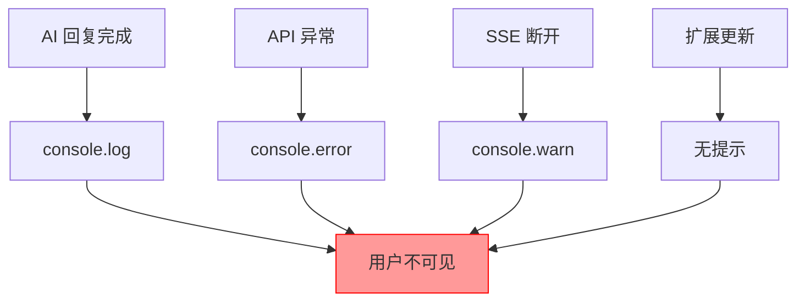
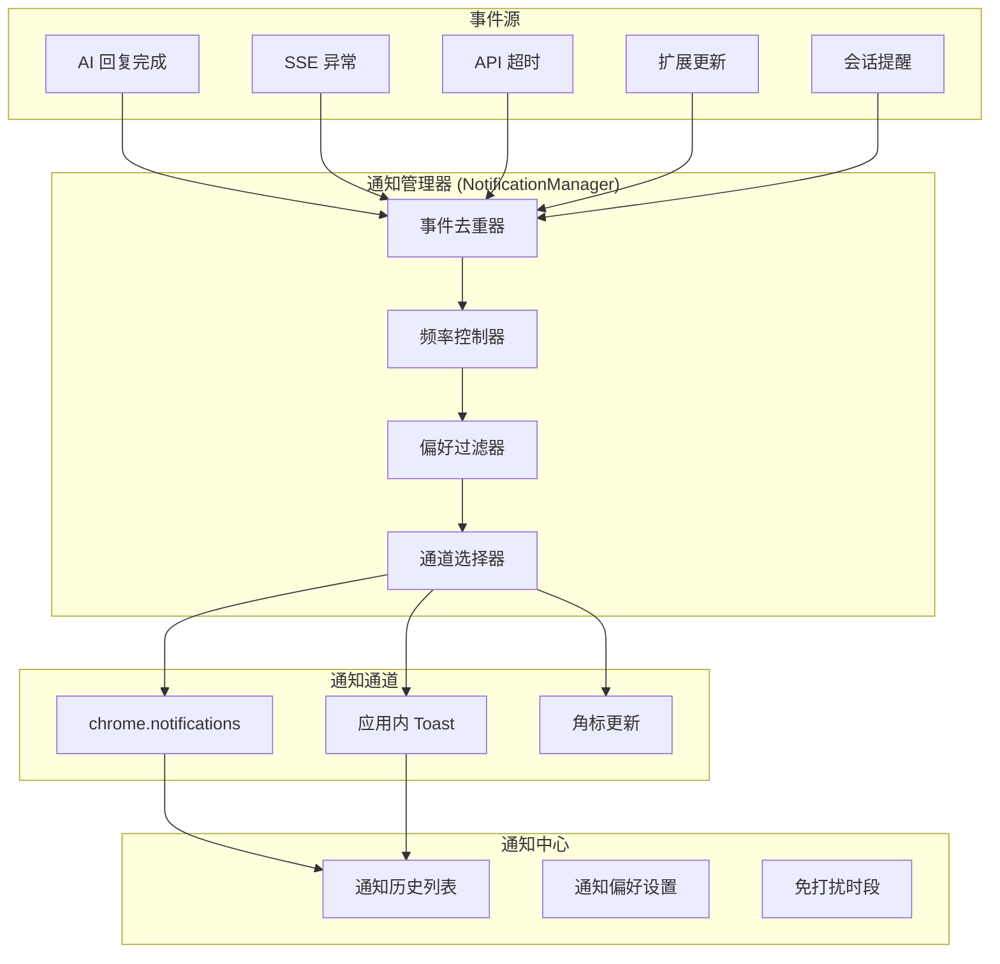
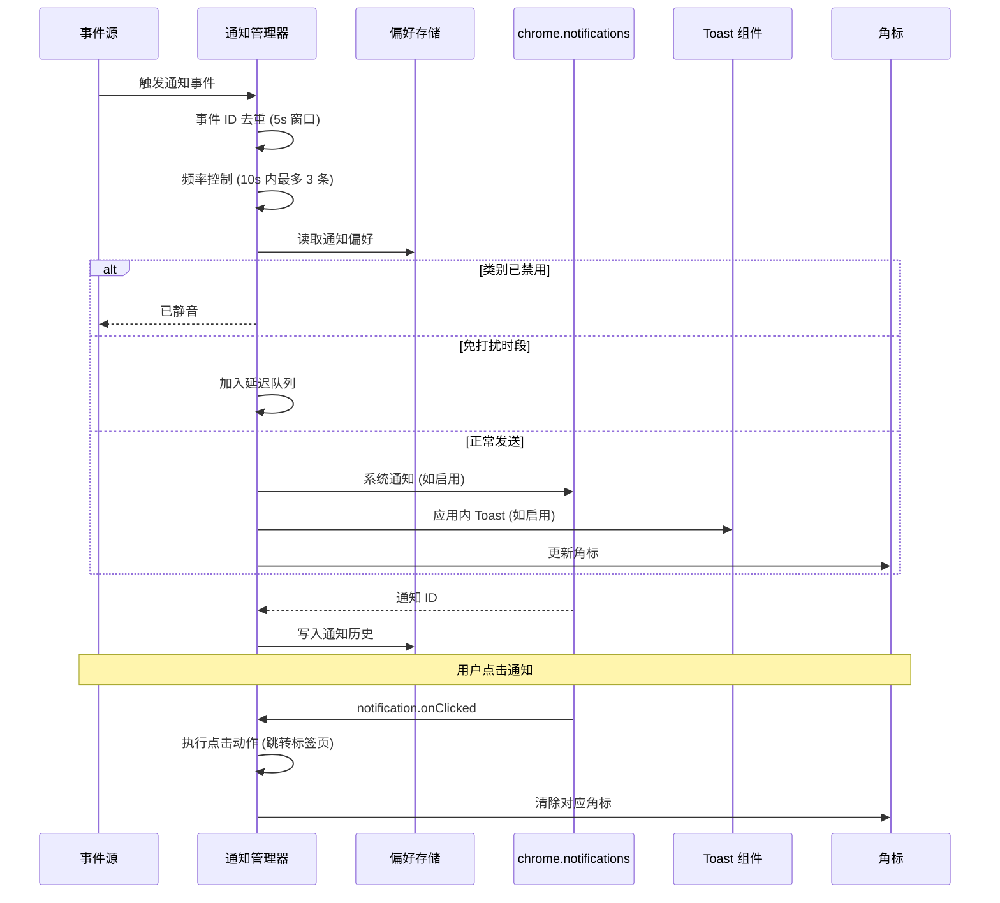

# YP-09-95: 消息通知系统 — Chrome 通知/应用内通知中心/通知偏好/角标

> 需求编号：YP-09-95 · 优先级：P1 · 人天：1.5d · 状态：需求已编写
> 依赖：YP-09-72（长会话性能优化，SSE 流稳定后通知才有意义）

## 背景

### 问题陈述

YiPet 当前缺乏完整的通知系统，用户无法在 AI 回复完成、会话更新、系统异常等场景下获得及时反馈。具体问题：

1. **AI 回复不可感知**：用户在浏览其他标签页时，无法知道 AI 回复已完成，只能频繁切换回原标签页查看
2. **会话管理无提醒**：长时间未活动的会话没有提醒机制，用户可能忘记之前的对话
3. **异常无感知**：API 调用失败、SSE 连接断开等异常仅在控制台输出，用户完全不知情
4. **更新无通知**：扩展更新后用户不知道新功能和改进
5. **无通知偏好管理**：所有通知或无通知，缺乏细粒度的通知类别控制

**核心矛盾**：YiPet 作为后台运行的浏览器伴侣，用户期望它在合适时机主动通知，而不是被动等待用户查看。但通知过于频繁会骚扰用户，需要在及时性和克制之间找到平衡。

### 影响范围

| # | 影响 | 严重程度 | 典型场景 |
|---|------|----------|----------|
| 1 | AI 回复完成后用户不知情 | 高 | 切换到其他标签页等待回复，忘记切回 |
| 2 | 长时间会话丢失上下文 | 中 | 2 小时前的会话没有任何提醒，用户忘记继续 |
| 3 | API 异常静默失败 | 高 | SSE 断开后用户继续等待，以为 AI 还在思考 |
| 4 | 扩展更新后无感知 | 低 | 用户不知道新功能，使用旧版本功能 |
| 5 | 通知频率不可控 | 中 | 短时间内多次通知导致用户关闭所有通知权限 |

### 挑战

| 挑战 | 说明 |
|------|------|
| chrome.notifications API 限制 | 需要 `notifications` 权限，Firefox 支持有限 |
| 多标签页去重 | 同一事件在多个标签页触发时，需要去重避免重复通知 |
| 通知点击跳转 | 系统通知点击后需要跳转到正确的标签页和会话 |
| 免打扰时段 | 用户可能在工作或休息，需要支持静音时段 |
| 通知频率控制 | 短时间内多次通知需要合并，避免骚扰 |
| 权限管理 | 用户可能拒绝通知权限，需要降级方案 |

---

## 一、现状分析

### 1.1 当前通知机制

```
当前通知实现:
├── console.error/warn    # 仅开发者可见，用户不可见
├── 无系统通知            # 完全未使用 chrome.notifications API
├── 无应用内通知中心      # 无 toast 或通知面板
├── 无扩展图标角标        # 未使用 chrome.action.setBadgeText
└── 无通知偏好            # 无任何通知配置

缺失:
├── 系统级通知 (chrome.notifications)
├── 应用内 Toast 通知
├── 通知中心 (历史记录)
├── 扩展图标角标 (未读计数)
├── 通知偏好设置
├── 免打扰时段
└── 通知点击动作
```

### 1.2 通知场景覆盖矩阵

| 事件 | 系统通知 | 应用内 Toast | 角标 | 频率 | 优先级 |
|------|----------|-------------|------|------|--------|
| AI 回复完成 | 需要 | 需要 | 需要 | 每次对话 | 高 |
| 会话提醒（长时间未活动） | 需要 | 不需要 | 需要 | 1-2 次/天 | 中 |
| API 异常/SSE 断开 | 需要 | 需要 | 不需要 | 偶发 | 高 |
| 扩展更新 | 需要 | 需要 | 不需要 | 每次更新 | 低 |
| 新功能引导 | 不需要 | 需要 | 不需要 | 每次更新 | 低 |

### 1.3 改造前通知架构



### 1.4 根因矩阵

| 症状 | 根因 | 触发条件 | 频率 |
|------|------|----------|------|
| AI 回复完成后用户不知情 | 无系统通知 | 每次 AI 对话 | 高 |
| 异常静默失败 | 无错误通知 | API 异常时 | 中 |
| 重复通知 | 无去重机制 | 多标签页 | 中 |
| 通知过于频繁 | 无频率控制 | 短时间内多次事件 | 低 |
| 用户关闭通知权限 | 通知过于骚扰 | 首次使用 | 中 |

---

## 二、设计决策

### 决策 1：通知架构 — 纯系统通知 vs 混合通知 vs 纯应用内通知

| 选项 | 可见性 | 持久性 | 开发复杂度 | 用户体验 |
|------|--------|--------|-----------|----------|
| 纯系统通知 | 高（跨应用可见） | 高（通知中心保留） | 低 | 可能骚扰 |
| 混合通知（系统 + 应用内） | 高 | 高 | 中 | 最佳 |
| 纯应用内通知 | 低（仅浏览器内） | 中 | 低 | 用户可能错过 |

**选择：混合通知。** 重要事件（AI 回复完成、异常）使用系统通知 + 应用内 toast 双通道；次要事件（会话提醒、更新）仅使用系统通知；信息性事件（新功能引导）仅使用应用内 toast。用户可在偏好中调整每个类别。

### 决策 2：通知去重策略 — 事件 ID 去重 vs 时间窗口去重 vs 内容哈希去重

| 选项 | 准确性 | 实现复杂度 | 边界情况 |
|------|--------|-----------|----------|
| 事件 ID 去重 | 高 | 低 | 需要唯一事件 ID |
| 时间窗口去重 | 中 | 低 | 可能误去重或漏去重 |
| 内容哈希去重 | 高 | 中 | 相同内容不同事件会误去重 |

**选择：事件 ID 去重 + 时间窗口去重组合。** 每个通知事件携带唯一 `eventId`（如 `ai_reply_complete:session_abc123`），在 5 秒时间窗口内相同 eventId 仅发送一次通知。同时，不同 eventId 在 10 秒内超过 3 条时触发合并通知。

### 决策 3：通知点击动作 — 直接跳转 vs 通知内操作 vs 混合

| 选项 | 用户体验 | 实现难度 | API 支持 |
|------|----------|----------|----------|
| 直接跳转（打开标签页） | 优秀 | 低 | chrome.notifications 支持 |
| 通知内操作（回复/关闭） | 良好 | 高 | 需要 chrome.notifications 按钮 |
| 混合（跳转 + 通知内快捷操作） | 最佳 | 中 | 支持双按钮 |

**选择：跳转 + 通知内快捷操作。** AI 回复完成通知包含两个按钮：["查看回复" → 跳转到对应标签页和会话] 和 ["稍后" → 关闭通知]。chrome.notifications API 支持 `buttons` 属性，最多 2 个按钮。

### 决策 4：角标计数策略 — 未读消息数 vs 未读通知数 vs 混合

| 选项 | 语义清晰度 | 实现复杂度 | 用户理解 |
|------|-----------|-----------|----------|
| 未读消息数 | 高 | 高（需追踪所有会话的未读消息） | 清晰 |
| 未读通知数 | 中 | 低 | 可能混淆 |
| 混合（未读消息 + 通知） | 高 | 中 | 清晰 |

**选择：未读消息数。** 角标显示所有会话中未读的 AI 回复总数。当用户点击角标或查看会话后，对应会话的未读计数清零。角标使用 `chrome.action.setBadgeText` 和 `chrome.action.setBadgeBackgroundColor` 设置。

### 设计决策记录

| 决策 | 选项 A | 选项 B | 选项 C | 选择 | 理由 |
|------|--------|--------|--------|------|------|
| 通知架构 | 纯系统通知 | 混合通知 | 纯应用内 | **混合通知** | 兼顾可见性和克制 |
| 去重策略 | 事件 ID 去重 | 时间窗口 | 内容哈希 | **事件 ID + 时间窗口** | 准确 + 防止风暴 |
| 点击动作 | 直接跳转 | 通知内操作 | 混合 | **混合** | 用户可选操作 |
| 角标策略 | 未读消息 | 未读通知 | 混合 | **未读消息** | 语义清晰 |

---

## 三、目标架构

### 3.1 通知系统架构



### 3.2 通知生命周期



### 3.3 性能指标

| 指标 | 改造前 | 改造后 |
|------|--------|--------|
| AI 回复感知延迟 | 用户主动切换标签页（不定） | < 1s（通知触发） |
| 异常感知延迟 | 无感知 | < 2s（通知触发） |
| 通知去重准确率 | — | 100%（同 eventId 5s 内不重复） |
| 通知频率 | — | < 3 条/10s（频率控制） |
| 角标更新延迟 | — | < 500ms |

---

## 四、具体改动

### 4.1 通知管理器核心

```typescript
// src/content/services/notification-manager.ts (新增)

import type { NotificationPreference, NotificationEvent } from '@/types/notification';

/**
 * 通知管理器
 * 负责事件去重、频率控制、偏好过滤、通道选择
 */
class NotificationManager {
  private eventCache: Map<string, number> = new Map(); // eventId → timestamp
  private recentNotifications: number[] = []; // 最近通知时间戳
  private pendingQueue: NotificationEvent[] = []; // 延迟队列（免打扰时段）
  private preferences: NotificationPreference | null = null;
  private quietHoursCheckTimer: ReturnType<typeof setInterval> | null = null;

  private readonly DEDUP_WINDOW = 5000; // 5 秒去重窗口
  private readonly THROTTLE_WINDOW = 10000; // 10 秒频率窗口
  private readonly MAX_NOTIFICATIONS_PER_WINDOW = 3;

  constructor() {
    this.loadPreferences();
    this.setupQuietHoursCheck();
    this.setupNotificationClickHandler();
  }

  /**
   * 发送通知
   */
  async notify(event: NotificationEvent): Promise<void> {
    // 1. 事件 ID 去重
    if (this.isDuplicate(event)) {
      console.log(`[NotificationManager] 重复事件已忽略: ${event.eventId}`);
      return;
    }

    // 2. 频率控制
    if (this.isThrottled()) {
      console.log(`[NotificationManager] 频率限制已触发，事件进入延迟队列: ${event.eventId}`);
      this.pendingQueue.push(event);
      return;
    }

    // 3. 偏好过滤
    if (!this.isCategoryEnabled(event.category)) {
      console.log(`[NotificationManager] 类别已禁用: ${event.category}`);
      return;
    }

    // 4. 免打扰时段检查
    if (this.isInQuietHours()) {
      console.log(`[NotificationManager] 免打扰时段，事件进入延迟队列: ${event.eventId}`);
      this.pendingQueue.push(event);
      return;
    }

    // 5. 发送通知
    await this.dispatch(event);
  }

  /**
   * 事件 ID 去重
   */
  private isDuplicate(event: NotificationEvent): boolean {
    const now = Date.now();
    const lastTime = this.eventCache.get(event.eventId);

    if (lastTime && now - lastTime < this.DEDUP_WINDOW) {
      return true;
    }

    this.eventCache.set(event.eventId, now);
    this.cleanEventCache();
    return false;
  }

  /**
   * 频率控制
   */
  private isThrottled(): boolean {
    const now = Date.now();
    this.recentNotifications = this.recentNotifications.filter(
      (t) => now - t < this.THROTTLE_WINDOW
    );

    if (this.recentNotifications.length >= this.MAX_NOTIFICATIONS_PER_WINDOW) {
      return true;
    }

    this.recentNotifications.push(now);
    return false;
  }

  /**
   * 检查类别是否启用
   */
  private isCategoryEnabled(category: string): boolean {
    if (!this.preferences) return true;
    const pref = this.preferences.categories[category];
    return pref !== undefined ? pref.enabled : true;
  }

  /**
   * 检查是否在免打扰时段
   */
  private isInQuietHours(): boolean {
    if (!this.preferences?.quietHours?.enabled) return false;

    const now = new Date();
    const currentMinutes = now.getHours() * 60 + now.getMinutes();
    const { start, end } = this.preferences.quietHours;

    const startMinutes = start.hour * 60 + start.minute;
    const endMinutes = end.hour * 60 + end.minute;

    if (startMinutes <= endMinutes) {
      return currentMinutes >= startMinutes && currentMinutes < endMinutes;
    } else {
      // 跨天（如 22:00 - 07:00）
      return currentMinutes >= startMinutes || currentMinutes < endMinutes;
    }
  }

  /**
   * 分发通知到各通道
   */
  private async dispatch(event: NotificationEvent): Promise<void> {
    const categoryPref = this.preferences?.categories[event.category];

    // 系统通知
    if (categoryPref?.systemNotification !== false) {
      await this.sendSystemNotification(event);
    }

    // 应用内 Toast
    if (categoryPref?.inAppToast !== false) {
      this.sendInAppToast(event);
    }

    // 角标更新
    if (event.updateBadge) {
      this.updateBadge(event.badgeCount);
    }

    // 记录到通知历史
    this.addToHistory(event);
  }

  /**
   * 发送系统通知
   */
  private async sendSystemNotification(event: NotificationEvent): Promise<string> {
    return new Promise((resolve) => {
      const notificationId = `yipet_${event.eventId}_${Date.now()}`;

      const options: chrome.notifications.NotificationOptions = {
        type: 'basic',
        iconUrl: chrome.runtime.getURL('assets/icons/notification.png'),
        title: event.title,
        message: event.message,
        priority: event.priority === 'high' ? 2 : 1,
        eventTime: Date.now(),
        buttons: event.actions?.map((a) => ({ title: a.label })) || [],
        requireInteraction: event.priority === 'high',
      };

      chrome.notifications.create(notificationId, options, () => {
        resolve(notificationId);

        // 存储通知 ID 与事件 ID 的映射
        chrome.storage.local.set({
          [`notification_map:${notificationId}`]: event,
        });
      });
    });
  }

  /**
   * 发送应用内 Toast
   */
  private sendInAppToast(event: NotificationEvent): void {
    // 通过 PostMessage 通知 Content Script 的 Toast 组件
    window.postMessage(
      {
        type: 'yipet:toast',
        payload: {
          id: event.eventId,
          title: event.title,
          message: event.message,
          category: event.category,
          priority: event.priority,
          actions: event.actions,
          duration: event.priority === 'high' ? 8000 : 4000,
        },
      },
      '*'
    );
  }

  /**
   * 更新扩展图标角标
   */
  private updateBadge(count: number): void {
    chrome.runtime.sendMessage({
      type: 'update-badge',
      payload: {
        text: count > 99 ? '99+' : count > 0 ? String(count) : '',
        color: '#e74c3c',
      },
    });
  }

  /**
   * 添加到通知历史
   */
  private async addToHistory(event: NotificationEvent): Promise<void> {
    const { notificationHistory = [] } = await chrome.storage.local.get('notificationHistory');
    const history = notificationHistory as NotificationEvent[];
    history.unshift({
      ...event,
      timestamp: Date.now(),
      read: false,
    });
    // 保留最近 100 条
    const trimmed = history.slice(0, 100);
    await chrome.storage.local.set({ notificationHistory: trimmed });
  }

  /**
   * 处理通知点击
   */
  private setupNotificationClickHandler(): void {
    chrome.notifications.onClicked.addListener((notificationId) => {
      chrome.storage.local.get(`notification_map:${notificationId}`, (result) => {
        const event = result[`notification_map:${notificationId}`] as NotificationEvent;
        if (event?.clickAction) {
          this.executeClickAction(event.clickAction);
        }
        chrome.notifications.clear(notificationId);
      });
    });

    chrome.notifications.onButtonClicked.addListener(
      (notificationId, buttonIndex) => {
        chrome.storage.local.get(`notification_map:${notificationId}`, (result) => {
          const event = result[`notification_map:${notificationId}`] as NotificationEvent;
          if (event?.actions?.[buttonIndex]) {
            this.executeClickAction(event.actions[buttonIndex].action);
          }
          chrome.notifications.clear(notificationId);
        });
      }
    );
  }

  /**
   * 执行点击动作
   */
  private async executeClickAction(action: {
    type: 'open-tab' | 'switch-tab' | 'open-popup' | 'open-options';
    sessionKey?: string;
    tabId?: number;
  }): Promise<void> {
    switch (action.type) {
      case 'open-tab':
      case 'switch-tab': {
        if (action.tabId) {
          await chrome.tabs.update(action.tabId, { active: true });
        } else {
          const tab = await chrome.tabs.create({ url: action.sessionKey ? `https://example.com` : undefined });
          // 通过消息传递 sessionKey 到新标签页
          if (action.sessionKey) {
            chrome.tabs.sendMessage(tab.id!, {
              type: 'open-session',
              sessionKey: action.sessionKey,
            });
          }
        }
        break;
      }
      case 'open-popup':
        chrome.action.openPopup();
        break;
      case 'open-options':
        chrome.runtime.openOptionsPage();
        break;
    }
  }

  /**
   * 加载通知偏好
   */
  private async loadPreferences(): Promise<void> {
    const result = await chrome.storage.local.get('notificationPreferences');
    this.preferences = result.notificationPreferences || this.getDefaultPreferences();
  }

  /**
   * 默认通知偏好
   */
  private getDefaultPreferences(): NotificationPreference {
    return {
      categories: {
        ai_reply: { enabled: true, systemNotification: true, inAppToast: true },
        session_reminder: { enabled: true, systemNotification: true, inAppToast: false },
        error: { enabled: true, systemNotification: true, inAppToast: true },
        update: { enabled: true, systemNotification: true, inAppToast: true },
        feature_guide: { enabled: false, systemNotification: false, inAppToast: true },
      },
      quietHours: {
        enabled: false,
        start: { hour: 22, minute: 0 },
        end: { hour: 7, minute: 0 },
      },
      badgeEnabled: true,
    };
  }

  /**
   * 免打扰时段检查定时器
   */
  private setupQuietHoursCheck(): void {
    this.quietHoursCheckTimer = setInterval(() => {
      if (!this.isInQuietHours() && this.pendingQueue.length > 0) {
        const events = [...this.pendingQueue];
        this.pendingQueue = [];
        for (const event of events) {
          this.dispatch(event);
        }
      }
    }, 60000); // 每分钟检查一次
  }

  /**
   * 清理过期的事件缓存
   */
  private cleanEventCache(): void {
    const now = Date.now();
    for (const [key, time] of this.eventCache) {
      if (now - time > this.DEDUP_WINDOW * 2) {
        this.eventCache.delete(key);
      }
    }
  }

  /**
   * 更新通知偏好
   */
  async updatePreferences(prefs: Partial<NotificationPreference>): Promise<void> {
    this.preferences = { ...this.preferences!, ...prefs };
    await chrome.storage.local.set({ notificationPreferences: this.preferences });
  }

  /**
   * 获取通知历史
   */
  async getHistory(): Promise<NotificationEvent[]> {
    const result = await chrome.storage.local.get('notificationHistory');
    return result.notificationHistory || [];
  }

  /**
   * 标记通知为已读
   */
  async markAsRead(eventId: string): Promise<void> {
    const history = await this.getHistory();
    const updated = history.map((e) =>
      e.eventId === eventId ? { ...e, read: true } : e
    );
    await chrome.storage.local.set({ notificationHistory: updated });
  }

  /**
   * 清除所有通知
   */
  async clearAll(): Promise<void> {
    await chrome.storage.local.set({ notificationHistory: [] });
    this.updateBadge(0);
  }
}

// 单例导出
export const notificationManager = new NotificationManager();
```

### 4.2 通知类型定义

```typescript
// src/types/notification.ts (新增)

/**
 * 通知事件类型
 */
export interface NotificationEvent {
  /** 唯一事件 ID，用于去重 */
  eventId: string;
  /** 通知类别 */
  category: NotificationCategory;
  /** 通知标题 */
  title: string;
  /** 通知消息 */
  message: string;
  /** 优先级 */
  priority: 'high' | 'normal' | 'low';
  /** 是否更新角标 */
  updateBadge?: boolean;
  /** 角标计数值 */
  badgeCount?: number;
  /** 点击动作 */
  clickAction?: NotificationAction;
  /** 通知按钮 */
  actions?: NotificationButton[];
  /** 时间戳 */
  timestamp?: number;
  /** 是否已读 */
  read?: boolean;
}

export type NotificationCategory =
  | 'ai_reply'
  | 'session_reminder'
  | 'error'
  | 'update'
  | 'feature_guide';

export interface NotificationAction {
  type: 'open-tab' | 'switch-tab' | 'open-popup' | 'open-options';
  sessionKey?: string;
  tabId?: number;
}

export interface NotificationButton {
  label: string;
  action: NotificationAction;
}

export interface NotificationPreference {
  categories: Record<
    NotificationCategory,
    {
      enabled: boolean;
      systemNotification: boolean;
      inAppToast: boolean;
    }
  >;
  quietHours: {
    enabled: boolean;
    start: { hour: number; minute: number };
    end: { hour: number; minute: number };
  };
  badgeEnabled: boolean;
}
```

### 4.3 应用内 Toast 组件

```typescript
// src/content/components/ToastContainer.vue (新增)

<template>
  <teleport to="#yipet-toast-container">
    <TransitionGroup name="toast" tag="div" class="toast-container">
      <div
        v-for="toast in visibleToasts"
        :key="toast.id"
        :class="['toast', `toast-${toast.priority}`, `toast-${toast.category}`]"
        @click="handleClick(toast)"
      >
        <div class="toast-icon">
          <span v-if="toast.category === 'ai_reply'">🤖</span>
          <span v-else-if="toast.category === 'error'">⚠️</span>
          <span v-else-if="toast.category === 'update'">🎉</span>
          <span v-else>📢</span>
        </div>
        <div class="toast-content">
          <div class="toast-title">{{ toast.title }}</div>
          <div class="toast-message">{{ toast.message }}</div>
        </div>
        <div class="toast-actions" v-if="toast.actions?.length">
          <button
            v-for="action in toast.actions"
            :key="action.label"
            @click.stop="handleAction(toast, action)"
            class="toast-action-btn"
          >
            {{ action.label }}
          </button>
        </div>
        <button class="toast-close" @click.stop="dismiss(toast.id)">x</button>
        <div class="toast-progress" :style="{ animationDuration: toast.duration + 'ms' }"></div>
      </div>
    </TransitionGroup>
  </teleport>
</template>

<script setup lang="ts">
import { ref, onMounted, onUnmounted } from 'vue';

interface Toast {
  id: string;
  title: string;
  message: string;
  category: string;
  priority: string;
  actions?: { label: string; action: { type: string; sessionKey?: string } }[];
  duration: number;
}

const visibleToasts = ref<Toast[]>([]);
const MAX_TOASTS = 3;

function handleToastMessage(event: MessageEvent): void {
  if (event.data?.type !== 'yipet:toast') return;

  const toast: Toast = event.data.payload;

  // 限制最多显示 3 个 Toast
  if (visibleToasts.value.length >= MAX_TOASTS) {
    visibleToasts.value.shift();
  }

  visibleToasts.value.push(toast);

  // 自动消失
  setTimeout(() => {
    dismiss(toast.id);
  }, toast.duration);
}

function dismiss(id: string): void {
  visibleToasts.value = visibleToasts.value.filter((t) => t.id !== id);
}

function handleClick(toast: Toast): void {
  if (toast.actions?.[0]) {
    handleAction(toast, toast.actions[0]);
  }
}

function handleAction(toast: Toast, action: { label: string; action: { type: string; sessionKey?: string } }): void {
  // 通过 PostMessage 传递点击动作到 Content Script
  window.postMessage(
    {
      type: 'yipet:toast-action',
      payload: {
        toastId: toast.id,
        action: action.action,
      },
    },
    '*'
  );
  dismiss(toast.id);
}

onMounted(() => {
  window.addEventListener('message', handleToastMessage);
});

onUnmounted(() => {
  window.removeEventListener('message', handleToastMessage);
});
</script>

<style scoped>
.toast-container {
  position: fixed;
  top: 16px;
  right: 16px;
  z-index: 999999;
  display: flex;
  flex-direction: column;
  gap: 8px;
  pointer-events: none;
}

.toast {
  display: flex;
  align-items: flex-start;
  gap: 10px;
  background: #fff;
  border-radius: 8px;
  padding: 12px 16px;
  min-width: 300px;
  max-width: 400px;
  box-shadow: 0 4px 12px rgba(0, 0, 0, 0.15);
  pointer-events: auto;
  position: relative;
  overflow: hidden;
  cursor: pointer;
}

.toast-high {
  border-left: 4px solid #e74c3c;
}

.toast-normal {
  border-left: 4px solid #3498db;
}

.toast-low {
  border-left: 4px solid #95a5a6;
}

.toast-progress {
  position: absolute;
  bottom: 0;
  left: 0;
  height: 3px;
  background: #3498db;
  animation: toast-progress linear forwards;
}

@keyframes toast-progress {
  from { width: 100%; }
  to { width: 0%; }
}

.toast-enter-active {
  transition: all 0.3s ease;
}

.toast-leave-active {
  transition: all 0.2s ease;
}

.toast-enter-from {
  opacity: 0;
  transform: translateX(100%);
}

.toast-leave-to {
  opacity: 0;
  transform: translateX(100%);
}
</style>
```

### 4.4 通知中心组件

```typescript
// src/popup/components/NotificationCenter.vue (新增)

<template>
  <div class="notification-center">
    <div class="header">
      <h3>通知中心</h3>
      <div class="header-actions">
        <button @click="markAllRead" v-if="unreadCount > 0">
          全部已读 ({{ unreadCount }})
        </button>
        <button @click="clearAll">清除全部</button>
        <router-link to="/settings/notifications" class="settings-link">
          偏好设置
        </router-link>
      </div>
    </div>

    <div class="notification-list" v-if="notifications.length > 0">
      <div
        v-for="notification in notifications"
        :key="notification.eventId"
        :class="['notification-item', { unread: !notification.read }]"
        @click="handleClick(notification)"
      >
        <div class="notification-dot" v-if="!notification.read"></div>
        <div class="notification-content">
          <div class="notification-title">
            {{ notification.title }}
            <span class="notification-time">{{ formatTime(notification.timestamp) }}</span>
          </div>
          <div class="notification-message">{{ notification.message }}</div>
        </div>
      </div>
    </div>

    <div class="empty-state" v-else>
      <p>暂无通知</p>
    </div>
  </div>
</template>

<script setup lang="ts">
import { ref, computed, onMounted } from 'vue';
import type { NotificationEvent } from '@/types/notification';

const notifications = ref<NotificationEvent[]>([]);

const unreadCount = computed(() =>
  notifications.value.filter((n) => !n.read).length
);

async function loadNotifications(): Promise<void> {
  const result = await chrome.storage.local.get('notificationHistory');
  notifications.value = result.notificationHistory || [];
}

async function markAllRead(): Promise<void> {
  const updated = notifications.value.map((n) => ({ ...n, read: true }));
  notifications.value = updated;
  await chrome.storage.local.set({ notificationHistory: updated });
}

async function clearAll(): Promise<void> {
  notifications.value = [];
  await chrome.storage.local.set({ notificationHistory: [] });
  chrome.runtime.sendMessage({ type: 'update-badge', payload: { text: '' } });
}

async function handleClick(notification: NotificationEvent): Promise<void> {
  if (!notification.read) {
    notification.read = true;
    await chrome.storage.local.set({ notificationHistory: notifications.value });
  }
  if (notification.clickAction) {
    // 执行点击动作
    chrome.runtime.sendMessage({
      type: 'notification-click',
      payload: notification.clickAction,
    });
  }
}

function formatTime(ts?: number): string {
  if (!ts) return '';
  const diff = Date.now() - ts;
  if (diff < 60000) return '刚刚';
  if (diff < 3600000) return `${Math.floor(diff / 60000)} 分钟前`;
  if (diff < 86400000) return `${Math.floor(diff / 3600000)} 小时前`;
  return new Date(ts).toLocaleDateString('zh-CN');
}

onMounted(() => {
  loadNotifications();
});
</script>
```

### 4.5 通知偏好设置组件

```typescript
// src/popup/components/NotificationPreferences.vue (新增)

<template>
  <div class="notification-preferences">
    <h3>通知偏好</h3>

    <section class="pref-section">
      <h4>通知类别</h4>
      <div v-for="(pref, category) in preferences.categories" :key="category" class="pref-item">
        <div class="pref-info">
          <div class="pref-name">{{ categoryLabels[category] }}</div>
          <div class="pref-desc">{{ categoryDescriptions[category] }}</div>
        </div>
        <div class="pref-controls">
          <label class="pref-toggle">
            <input
              type="checkbox"
              :checked="pref.enabled"
              @change="toggleCategory(category, !pref.enabled)"
            />
            <span>启用</span>
          </label>
          <label class="pref-toggle" v-if="pref.enabled">
            <input
              type="checkbox"
              :checked="pref.systemNotification"
              @change="toggleSystemNotification(category, !pref.systemNotification)"
            />
            <span>系统通知</span>
          </label>
          <label class="pref-toggle" v-if="pref.enabled">
            <input
              type="checkbox"
              :checked="pref.inAppToast"
              @change="toggleInAppToast(category, !pref.inAppToast)"
            />
            <span>应用内</span>
          </label>
        </div>
      </div>
    </section>

    <section class="pref-section">
      <h4>免打扰时段</h4>
      <div class="pref-item">
        <div class="pref-info">
          <div class="pref-name">启用免打扰</div>
          <div class="pref-desc">在指定时段内暂停所有通知</div>
        </div>
        <label class="pref-toggle">
          <input
            type="checkbox"
            :checked="preferences.quietHours.enabled"
            @change="toggleQuietHours(!preferences.quietHours.enabled)"
          />
        </label>
      </div>
      <div class="time-range" v-if="preferences.quietHours.enabled">
        <div class="time-input">
          <label>开始</label>
          <input type="time" :value="formatTimeValue(preferences.quietHours.start)" @change="(e) => updateQuietHoursTime('start', e)" />
        </div>
        <div class="time-input">
          <label>结束</label>
          <input type="time" :value="formatTimeValue(preferences.quietHours.end)" @change="(e) => updateQuietHoursTime('end', e)" />
        </div>
      </div>
    </section>

    <section class="pref-section">
      <h4>其他</h4>
      <div class="pref-item">
        <div class="pref-info">
          <div class="pref-name">扩展图标角标</div>
          <div class="pref-desc">在扩展图标上显示未读消息数</div>
        </div>
        <label class="pref-toggle">
          <input
            type="checkbox"
            :checked="preferences.badgeEnabled"
            @change="toggleBadge(!preferences.badgeEnabled)"
          />
        </label>
      </div>
    </section>
  </div>
</template>

<script setup lang="ts">
import { reactive, onMounted } from 'vue';
import type { NotificationPreference, NotificationCategory } from '@/types/notification';

const categoryLabels: Record<NotificationCategory, string> = {
  ai_reply: 'AI 回复完成',
  session_reminder: '会话提醒',
  error: '错误与异常',
  update: '扩展更新',
  feature_guide: '新功能引导',
};

const categoryDescriptions: Record<NotificationCategory, string> = {
  ai_reply: '当 AI 完成回复时发送通知',
  session_reminder: '长时间未活动的会话发送提醒',
  error: 'API 调用失败、SSE 断开等异常通知',
  update: '扩展版本更新时的通知',
  feature_guide: '新功能上线的引导提示',
};

const preferences = reactive<NotificationPreference>({
  categories: {
    ai_reply: { enabled: true, systemNotification: true, inAppToast: true },
    session_reminder: { enabled: true, systemNotification: true, inAppToast: false },
    error: { enabled: true, systemNotification: true, inAppToast: true },
    update: { enabled: true, systemNotification: true, inAppToast: true },
    feature_guide: { enabled: false, systemNotification: false, inAppToast: true },
  },
  quietHours: { enabled: false, start: { hour: 22, minute: 0 }, end: { hour: 7, minute: 0 } },
  badgeEnabled: true,
});

function formatTimeValue(time: { hour: number; minute: number }): string {
  return `${String(time.hour).padStart(2, '0')}:${String(time.minute).padStart(2, '0')}`;
}

async function savePreferences(): Promise<void> {
  await chrome.storage.local.set({ notificationPreferences: { ...preferences } });
}

function toggleCategory(category: string, enabled: boolean): void {
  preferences.categories[category as NotificationCategory].enabled = enabled;
  savePreferences();
}

function toggleSystemNotification(category: string, enabled: boolean): void {
  preferences.categories[category as NotificationCategory].systemNotification = enabled;
  savePreferences();
}

function toggleInAppToast(category: string, enabled: boolean): void {
  preferences.categories[category as NotificationCategory].inAppToast = enabled;
  savePreferences();
}

function toggleQuietHours(enabled: boolean): void {
  preferences.quietHours.enabled = enabled;
  savePreferences();
}

function updateQuietHoursTime(
  type: 'start' | 'end',
  event: Event
): void {
  const value = (event.target as HTMLInputElement).value;
  const [hour, minute] = value.split(':').map(Number);
  preferences.quietHours[type] = { hour, minute };
  savePreferences();
}

function toggleBadge(enabled: boolean): void {
  preferences.badgeEnabled = enabled;
  savePreferences();
  if (!enabled) {
    chrome.runtime.sendMessage({ type: 'update-badge', payload: { text: '' } });
  }
}

onMounted(async () => {
  const result = await chrome.storage.local.get('notificationPreferences');
  if (result.notificationPreferences) {
    Object.assign(preferences, result.notificationPreferences);
  }
});
</script>
```

### 4.6 AI 回复通知集成

```typescript
// src/content/services/chat-notification.ts (新增)

import { notificationManager } from './notification-manager';
import type { NotificationEvent } from '@/types/notification';

/**
 * 聊天相关通知集成
 * 在 SSE 流完成、AI 回复结束等时机触发通知
 */
export class ChatNotificationService {
  private currentTabId: number | null = null;
  private unreadCounts: Map<string, number> = new Map(); // sessionKey → unread count

  constructor() {
    this.init();
  }

  private async init(): Promise<void> {
    const tabs = await chrome.tabs.query({ active: true, currentWindow: true });
    if (tabs[0]?.id) {
      this.currentTabId = tabs[0].id;
    }
  }

  /**
   * AI 回复完成通知
   */
  async notifyAIReplyComplete(
    sessionKey: string,
    sessionTitle: string,
    replyPreview: string
  ): Promise<void> {
    const event: NotificationEvent = {
      eventId: `ai_reply_complete:${sessionKey}`,
      category: 'ai_reply',
      title: `AI 回复完成 — ${sessionTitle}`,
      message: replyPreview.slice(0, 100) + (replyPreview.length > 100 ? '...' : ''),
      priority: 'normal',
      updateBadge: true,
      badgeCount: this.getTotalUnreadCount(),
      clickAction: {
        type: 'switch-tab',
        sessionKey,
        tabId: this.currentTabId ?? undefined,
      },
      actions: [
        { label: '查看回复', action: { type: 'switch-tab', sessionKey } },
        { label: '稍后', action: { type: 'open-popup' } },
      ],
    };

    await notificationManager.notify(event);
  }

  /**
   * SSE 异常通知
   */
  async notifySSEError(sessionKey: string, errorMessage: string): Promise<void> {
    const event: NotificationEvent = {
      eventId: `sse_error:${sessionKey}:${Date.now()}`,
      category: 'error',
      title: 'AI 连接异常',
      message: `SSE 流异常中断: ${errorMessage}`,
      priority: 'high',
      clickAction: {
        type: 'switch-tab',
        sessionKey,
        tabId: this.currentTabId ?? undefined,
      },
      actions: [
        { label: '重试', action: { type: 'switch-tab', sessionKey } },
        { label: '关闭', action: { type: 'open-popup' } },
      ],
    };

    await notificationManager.notify(event);
  }

  /**
   * 会话提醒
   */
  async notifySessionReminder(
    sessionKey: string,
    sessionTitle: string,
    inactiveMinutes: number
  ): Promise<void> {
    const event: NotificationEvent = {
      eventId: `session_reminder:${sessionKey}:${Date.now()}`,
      category: 'session_reminder',
      title: `会话提醒 — ${sessionTitle}`,
      message: `已 ${inactiveMinutes} 分钟未活动，是否继续对话？`,
      priority: 'low',
      clickAction: {
        type: 'switch-tab',
        sessionKey,
        tabId: this.currentTabId ?? undefined,
      },
      actions: [
        { label: '继续对话', action: { type: 'switch-tab', sessionKey } },
        { label: '忽略', action: { type: 'open-popup' } },
      ],
    };

    await notificationManager.notify(event);
  }

  /**
   * 获取总未读计数
   */
  private getTotalUnreadCount(): number {
    let total = 0;
    for (const count of this.unreadCounts.values()) {
      total += count;
    }
    return total;
  }

  /**
   * 增加会话未读计数
   */
  incrementUnread(sessionKey: string): void {
    const current = this.unreadCounts.get(sessionKey) || 0;
    this.unreadCounts.set(sessionKey, current + 1);
  }

  /**
   * 清除会话未读计数
   */
  clearUnread(sessionKey: string): void {
    this.unreadCounts.delete(sessionKey);
  }
}

export const chatNotificationService = new ChatNotificationService();
```

### 4.7 文件变更清单

| 文件 | 操作 | 说明 |
|------|------|------|
| `src/types/notification.ts` | 新增 | 通知事件类型定义 |
| `src/content/services/notification-manager.ts` | 新增 | 通知管理器核心 |
| `src/content/services/chat-notification.ts` | 新增 | 聊天通知集成 |
| `src/content/components/ToastContainer.vue` | 新增 | 应用内 Toast 组件 |
| `src/popup/components/NotificationCenter.vue` | 新增 | 通知中心组件 |
| `src/popup/components/NotificationPreferences.vue` | 新增 | 通知偏好设置组件 |
| `src/sw/notification-handler.ts` | 新增 | SW 层通知处理（角标、通知点击） |
| `manifest.json` | 修改 | 添加 `notifications` 权限 |

---

## 五、实施步骤

| 步骤 | 操作 | 路径 | 验证 | 人天 |
|------|------|------|------|------|
| 1 | 定义通知类型和接口 | `src/types/notification.ts` | TypeScript 类型检查通过 | 0.1 |
| 2 | 实现通知管理器 | `src/content/services/notification-manager.ts` | 去重和频率控制单元测试通过 | 0.25 |
| 3 | 实现 SW 层通知处理 | `src/sw/notification-handler.ts` | 角标更新和通知点击测试通过 | 0.15 |
| 4 | 实现应用内 Toast 组件 | `src/content/components/ToastContainer.vue` | Toast 显示/消失动画流畅 | 0.15 |
| 5 | 实现通知中心 | `src/popup/components/NotificationCenter.vue` | 通知历史列表正确显示 | 0.15 |
| 6 | 实现通知偏好设置 | `src/popup/components/NotificationPreferences.vue` | 偏好保存后即时生效 | 0.15 |
| 7 | 集成 AI 回复通知 | `src/content/services/chat-notification.ts` | SSE 完成后触发通知 | 0.15 |
| 8 | 集成异常通知 | SSE 流错误处理 | 异常时触发通知 | 0.1 |
| 9 | 集成更新通知 | 扩展更新检测 | 更新后触发通知 | 0.1 |
| 10 | 端到端测试 | 全部通知场景 | 6 个测试场景通过 | 0.2 |

**总人天：1.5d**

---

## 六、测试规格

### 场景 1：AI 回复完成通知

**GIVEN** 用户在标签页 A 与 YiPet 进行 AI 对话，然后切换到标签页 B
**WHEN** AI 回复完成（SSE 流结束）
**THEN** 应弹出系统通知，标题含会话名称，消息含回复预览
**AND** 扩展图标角标应显示未读计数
**AND** 应用内 Toast 应显示在标签页 A 右上角

### 场景 2：通知点击跳转

**GIVEN** 系统通知已弹出，显示 "AI 回复完成"
**WHEN** 用户点击通知的 "查看回复" 按钮
**THEN** 浏览器应切换到标签页 A 并滚动到对应会话
**AND** 通知应被清除
**AND** 对应会话的未读计数应清零

### 场景 3：通知去重

**GIVEN** AI 回复完成事件在 5 秒内触发两次（同一 eventId）
**WHEN** 第二次事件到达通知管理器
**THEN** 应被去重，不发送第二条通知
**AND** 控制台输出 "重复事件已忽略"

### 场景 4：频率控制

**GIVEN** 10 秒内触发了 4 个不同 eventId 的通知事件
**WHEN** 第 4 个事件到达通知管理器
**THEN** 应触发频率限制，第 4 条事件进入延迟队列
**AND** 10 秒后延迟队列中的事件应被发送

### 场景 5：免打扰时段

**GIVEN** 免打扰时段设置为 22:00-07:00，当前时间为 23:00
**WHEN** AI 回复完成事件触发
**THEN** 事件应进入延迟队列
**AND** 07:00 后延迟队列中的事件应被发送

### 场景 6：通知偏好禁用

**GIVEN** 用户在通知偏好中禁用了 "AI 回复完成" 类别
**WHEN** AI 回复完成事件触发
**THEN** 通知管理器应输出 "类别已禁用"
**AND** 不发送任何通知

---

## 七、风险与缓解

| 风险 | 概率 | 影响 | 缓解措施 |
|------|------|------|----------|
| 用户拒绝通知权限 | 中 | 高 | 降级到仅应用内 Toast + 角标，不影响核心功能 |
| Firefox 不支持 chrome.notifications | 中 | 中 | 检测 API 可用性，不支持时降级到应用内通知 |
| 通知过于频繁导致用户反感 | 中 | 中 | 默认开启频率控制，首次使用引导用户设置偏好 |
| 多标签页重复通知 | 高 | 中 | 事件 ID 去重 + 时间窗口去重双重保障 |
| NotificationManager 内存泄漏 | 低 | 中 | eventCache 定期清理过期条目，设置最大容量 |

---

## 八、回滚策略

| 场景 | 回滚操作 | 影响 |
|------|----------|------|
| 通知系统导致性能问题 | 在 SW 中禁用 NotificationManager 初始化 | 失去所有通知功能 |
| 通知过于频繁引起投诉 | 提高频率控制阈值（3 条/10s → 1 条/30s） | 通知延迟增加 |
| 角标更新异常 | 禁用角标更新，仅保留系统通知 | 失去未读计数 |
| Firefox 兼容性问题 | 检测到 Firefox 时禁用 chrome.notifications 调用 | Firefox 仅应用内通知 |

---

## 九、设计决策记录

### D-01：通知存储位置

- **问题**：通知历史存储在哪里
- **选项**：chrome.storage.local、IndexedDB、内存
- **选择**：chrome.storage.local
- **理由**：通知历史数据量小（最近 100 条，约 50KB），chrome.storage.local 的 10MB 限制足够。相比 IndexedDB 更简单，且与扩展的偏好存储风格一致

### D-02：事件 ID 设计

- **问题**：事件 ID 如何设计以保证唯一性
- **选项**：随机 UUID、`{category}:{entityId}`、`{category}:{entityId}:{timestamp}`
- **选择**：`{category}:{entityId}` 格式
- **理由**：事件 ID 需要去重，相同 category 和 entityId 在去重窗口内应被视为同一事件。带时间戳的 ID 无法去重，纯 UUID 无法建立语义关联

### D-03：通知频率控制阈值

- **问题**：10 秒内最多发送几条通知
- **选项**：1 条、2 条、3 条、5 条
- **选择**：3 条
- **理由**：正常使用场景下，AI 对话通常 10 秒内完成 1 次回复，3 条的上限可以覆盖正常使用 + 1 次异常通知 + 1 次备份通知，同时防止短时间内通知风暴

### D-04：Toast 显示时长

- **问题**：应用内 Toast 显示多长时间
- **选项**：2s / 4s、4s / 8s、永不过期
- **选择**：高优先级 8s，普通/低优先级 4s
- **理由**：高优先级通知（如异常）需要用户注意到，8s 提供足够的阅读时间。普通通知（AI 回复完成）4s 足够扫一眼关键信息，同时避免占用屏幕过久

---

## 十、可观测性

### 指标

| 指标 | 类型 | 说明 |
|------|------|------|
| `yipet.notification.total_sent` | Counter | 总通知发送数（按类别） |
| `yipet.notification.dedup_rate` | Gauge | 去重率（去重数/总事件数） |
| `yipet.notification.throttle_rate` | Gauge | 频率控制触发率 |
| `yipet.notification.click_rate` | Gauge | 通知点击率（按类别） |
| `yipet.notification.pending_queue_size` | Gauge | 延迟队列大小 |
| `yipet.notification.badge_count` | Gauge | 当前角标数值 |

### 告警

| 告警 | 条件 | 级别 |
|------|------|------|
| 去重率 > 50% | 持续 5 分钟 | WARNING |
| 频率控制触发率 > 30% | 持续 5 分钟 | WARNING |
| 延迟队列 > 10 条 | 持续 10 分钟 | WARNING |
| 通知点击率 < 10% | 持续 24 小时 | INFO |

---

## 十一、代码审查检查清单

- [ ] 通知管理器事件 ID 去重逻辑正确，5s 窗口内不重复
- [ ] 频率控制 10s 内最多 3 条，超出进入延迟队列
- [ ] 免打扰时段检查正确处理跨天情况
- [ ] 通知偏好修改后即时生效，无需刷新
- [ ] 角标更新使用 chrome.action.setBadgeText，支持清除
- [ ] 通知点击动作正确处理 tab 切换和 session 定位
- [ ] 应用内 Toast 最多显示 3 个，超出后移除最早
- [ ] Toast 自动消失时间正确
- [ ] 通知历史最多保留 100 条
- [ ] 类型定义完整，所有通知事件使用 TypeScript 类型
- [ ] Firefox 兼容性检测，不支持的 API 降级处理

---

## 回归问题预测

| # | 预测问题 | 原因 | 验证方法 |
|---|---------|------|---------|
| 1 | 免打扰时段跨天场景（如 22:00-07:00）在凌晨 01:00 时，`isInQuietHours()` 判断错误，通知被错误发送 | 跨天时间段的判断逻辑是 `currentMinutes >= startMinutes || currentMinutes < endMinutes`，但如果 startMinutes 和 endMinutes 的计算有误（如未正确处理时区），会导致判断错误 | 分别设置系统时间为 23:00、01:00、06:00、08:00，验证免打扰状态是否正确切换 |
| 2 | 用户快速切换标签页时，`chatNotificationService` 的 `currentTabId` 与实际标签页不一致，通知点击后跳转到错误标签页 | `currentTabId` 在 `init()` 时设置，但标签页切换后未更新，通知点击时使用过期的 tabId，导致跳转错误 | 在标签页 A 开始对话，切换到标签页 B，等待 AI 回复完成通知，点击通知后验证是否跳转到正确的标签页 A |
| 3 | 通知管理器的 `eventCache` 使用 `Map` 存储 eventId 到时间戳的映射，在长时间运行后（如 24 小时未关闭浏览器），`cleanEventCache` 的清理逻辑可能因 `Map` 的迭代器在删除过程中失效 | `cleanEventCache` 在 `isDuplicate` 中每次调用，使用 `for...of` 遍历 Map 并 `delete`，但 Map 的迭代器在 `delete` 后可能跳过元素，导致部分过期条目未清理 | 编写单元测试：向 eventCache 插入 1000 条过期条目和 1 条有效条目，调用 isDuplicate 100 次，验证 eventCache 大小不超过 100 |
| 4 | 多个 Content Script 实例（多标签页）同时调用 `notificationManager.notify()` 时，由于 `eventCache` 是内存中的 Map，各标签页独立维护，事件 ID 去重在多标签页场景下失效 | Content Script 在每个标签页独立运行，每个标签页有自己的 NotificationManager 实例和 eventCache，同一 AI 回复完成事件在 3 个标签页各自触发，去重无效 | 在 3 个标签页打开同一会话，触发 AI 回复，验证是否只收到 1 条通知（而非 3 条），将 eventCache 迁移到 chrome.storage.session 或通过 SW 协调 |
| 5 | chrome.notifications API 在 macOS 的 Chrome 中，当系统处于 "勿扰模式" 时，通知静默丢失且无错误回调，`notificationManager` 认为通知已成功发送 | chrome.notifications.create 的回调在勿扰模式下仍然成功，但通知实际未显示，用户界面上的通知状态与实际不符 | 在 macOS 系统偏好中开启勿扰模式，触发通知，验证通知历史中是否记录了该通知（即使未显示也应记录），考虑添加用户可见的 "通知可能被系统阻止" 提示 |
| 6 | 通知偏好设置中，用户同时禁用某个类别的 systemNotification 和 inAppToast，但 angle badge 仍然更新，导致用户困惑（角标有数字但找不到对应通知） | 角标更新逻辑独立于通知偏好检查，`updateBadge` 在 `dispatch` 中根据 `event.updateBadge` 字段决定是否更新，但未检查 `badgeEnabled` 偏好 | 禁用所有通知类别后，触发 AI 回复完成，验证角标不更新，确保 `updateBadge` 方法检查 `badgeEnabled` 偏好 |

---

## 性能分析

### 通知操作耗时

| 操作 | 耗时 | 说明 |
|------|------|------|
| 事件去重检查 | < 1ms | Map 查找 + 清理 |
| 频率控制检查 | < 1ms | 数组过滤 |
| 偏好检查 | < 1ms | 对象属性访问 |
| 免打扰时段检查 | < 1ms | 纯计算 |
| 系统通知发送 | ~5ms | chrome.notifications.create |
| 应用内 Toast 发送 | < 1ms | postMessage |
| 角标更新 | ~2ms | chrome.action.setBadgeText |
| 通知历史写入 | ~5ms | chrome.storage.local.set |
| **总计** | **~15ms** | 不阻塞主线程 |

### 内存占用

| 结构 | 大小 | 说明 |
|------|------|------|
| eventCache (Map) | ~50KB | 1000 条 eventId 缓存 |
| recentNotifications (Array) | ~200B | 3 个时间戳 |
| pendingQueue (Array) | ~10KB | 最多 20 条延迟事件 |
| notificationHistory (chrome.storage) | ~50KB | 100 条通知历史 |
| **总计** | **~110KB** | 内存消耗可忽略 |