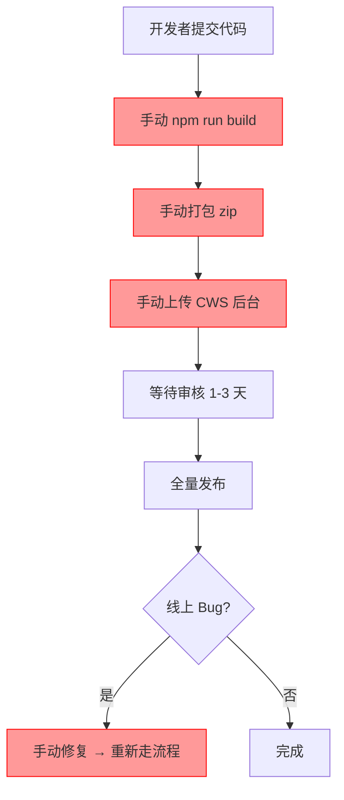
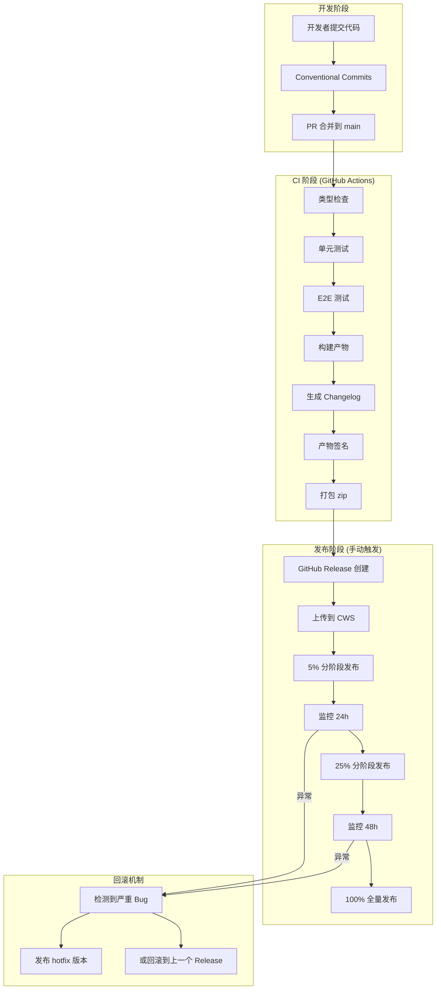
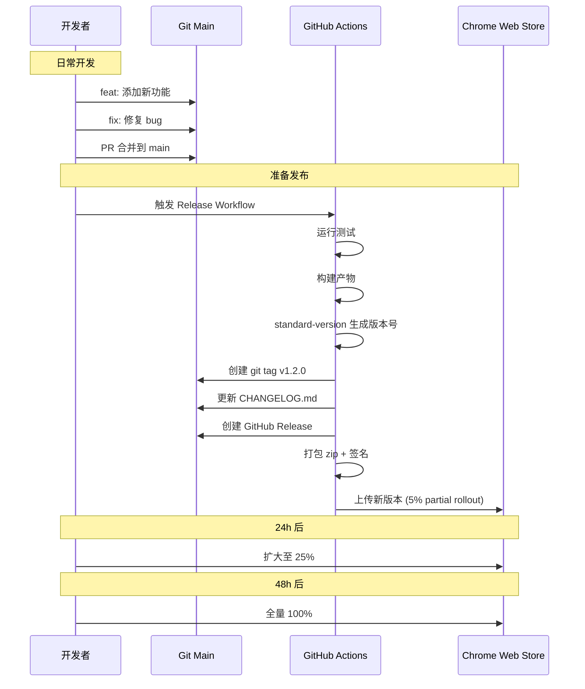

# YP-09-96: 自动更新与发布管理 — 版本策略/分阶段发布/回滚/CI/CD 发布

> 需求编号：YP-09-96 · 优先级：P2 · 人天：0.5d · 状态：需求已编写
> 依赖：YP-09-93（构建优化，产物签名基于优化后的构建输出）

## 背景

### 问题陈述

YiPet 当前发布流程完全手动，存在以下问题：

1. **版本管理混乱**：无语义版本规范，版本号随意递增，无法从版本号判断变更类型（breaking/feature/fix）
2. **发布流程手工操作**：手动执行 `npm run build`，手动打包 zip，手动上传到 Chrome Web Store 开发者后台，出错率高
3. **无分阶段发布**：新版本直接全量推送，一旦有严重 bug 影响所有用户，无法快速回滚
4. **无更新日志**：用户更新后不知道改了什么，changelog 依赖开发者手动编写
5. **无构建签名**：产物无签名验证，无法确保发布包未被篡改
6. **无自动化流水线**：从代码提交到 Chrome Web Store 发布无 CI/CD 支持

**核心矛盾**：Chrome Web Store 的审核和发布周期（1-3 天）与快速迭代需求（每周发布）之间的矛盾，需要自动化的发布流水线和分阶段发布策略来平衡速度和质量。

### 影响范围

| # | 影响 | 严重程度 | 典型场景 |
|---|------|----------|----------|
| 1 | 发布流程耗时 > 30 分钟 | 高 | 每次发版需要手动构建、打包、上传 |
| 2 | 版本号无规范 | 中 | 用户无法判断是否需要更新 |
| 3 | 无分阶段发布 | 高 | 严重 bug 影响所有用户，无法快速止损 |
| 4 | 更新日志缺失 | 中 | 用户不知道新功能，开发者不知道历史版本变更 |
| 5 | 回滚困难 | 高 | 线上故障无法快速回退到上一个稳定版本 |
| 6 | 无自动化验证 | 中 | 发布前不做自动化检查，靠人工判断 |

### 挑战

| 挑战 | 说明 |
|------|------|
| Chrome Web Store 审核周期 | 发布后 1-3 天才能上线，影响紧急修复 |
| API 速率限制 | Chrome Web Store API 有每日调用次数限制 |
| 分阶段发布粒度 | 需要 Chrome Web Store 支持百分比灰度 |
| 多环境签名 | 开发/测试/生产环境的签名密钥不同 |
| 更新通知时机 | 需要在扩展更新后正确显示 changelog |

---

## 一、现状分析

### 1.1 当前发布流程

```
当前发布流程 (全手动):

1. 开发者手动修改 manifest.json 中的 version
2. npm run build
3. 手动将 dist/ 打包为 .zip
4. 打开 Chrome Web Store 开发者后台
5. 上传 .zip 包
6. 填写更新说明 (手动)
7. 提交审核 (1-3 天)
8. 审核通过后全量发布

痛点:
├── 版本号手动修改，容易遗忘或冲突
├── 构建产物无签名验证
├── 无分阶段发布，全量推送风险高
├── 无自动化回滚机制
├── 更新日志手动编写，格式不统一
└── 发布流程耗时 30 分钟以上
```

### 1.2 版本号现状

```
当前版本号记录:
├── 1.0.0 → 1.0.1 → 1.0.2 → ... → 1.1.0 → 1.2.0
├── 无 semver 规范，版本号递增无规律
├── 无 changelog 文件
└── 无 git tag 与版本号关联
```

### 1.3 改造前发布架构



### 1.4 根因矩阵

| 症状 | 根因 | 触发条件 | 频率 |
|------|------|----------|------|
| 发布流程耗时 | 手工操作多 | 每次发版 | 高 |
| 版本号混乱 | 无 semver 规范 | 每次发版 | 高 |
| 全量发布风险 | 无分阶段发布 | 每次发版 | 高 |
| 回滚困难 | 无自动化回滚 | 线上故障 | 中 |
| 更新日志缺失 | 无 changelog 自动生成 | 每次发版 | 高 |

---

## 二、设计决策

### 决策 1：语义版本策略 — semver vs calver vs 自定版本

| 选项 | 语义清晰度 | 工具支持 | 扩展兼容性 | 社区惯例 |
|------|-----------|----------|-----------|----------|
| semver (MAJOR.MINOR.PATCH) | 高 | 优秀（standard-version, semantic-release） | 完全兼容 | 主流 |
| calver (YYYY.MM.PATCH) | 中 | 中等 | 兼容 | 少数 |
| 自定版本 | 低 | 无 | 兼容 | 不推荐 |

**选择：semver (MAJOR.MINOR.PATCH)。** MAJOR：不兼容的 API 变更（如权限变更、MV3 迁移）。MINOR：向后兼容的功能新增（新功能、新组件）。PATCH：向后兼容的 bug 修复。使用 `standard-version` 自动基于 Conventional Commits 生成版本号和 changelog。

### 决策 2：发布方式 — 手动 vs 半自动 vs 全自动 CI/CD

| 选项 | 速度 | 风险控制 | 开发成本 | 灵活性 |
|------|------|----------|----------|--------|
| 手动上传 | 慢 | 高（人工审查） | 低 | 高 |
| 半自动（CI 构建 + 手动发布） | 中 | 高 | 中 | 中 |
| 全自动 CI/CD | 快 | 低 | 高 | 低 |

**选择：半自动。** CI 自动构建、测试、签名、生成 changelog，但最终的 Chrome Web Store 上传由开发者手动触发（通过 GitHub Release 或 workflow dispatch）。这样既保证构建产物的一致性，又保留人工审查发布内容的环节。

### 决策 3：分阶段发布策略 — 固定百分比 vs 自适应百分比 vs 手动控制

| 选项 | 灵活性 | 风险控制 | 实现复杂度 | Chrome Web Store 支持 |
|------|--------|----------|-----------|---------------------|
| 固定百分比（5%→25%→100%） | 中 | 高 | 低 | 支持 partial rollout |
| 自适应百分比 | 高 | 高 | 高 | 不支持 |
| 手动控制 | 高 | 高 | 低 | 支持 |

**选择：固定百分比 5% → 25% → 100%。** Chrome Web Store 支持 `partialRollout` 参数，但自适应百分比需要实时监控和自动决策，超出当前阶段需求。固定百分比三个阶段：5%（观察 24h）、25%（观察 48h）、100%（全量）。

### 决策 4：Changelog 生成方式 — 手动编写 vs conventional-changelog vs release-please

| 选项 | 自动化程度 | 格式规范 | 集成难度 |
|------|-----------|----------|----------|
| 手动编写 | 无 | 依赖人工 | 无 |
| conventional-changelog (standard-version) | 高 | Keep a Changelog 格式 | 低 |
| release-please | 高 | GitHub Release 格式 | 中 |

**选择：standard-version (conventional-changelog)。** 基于 Conventional Commits 自动生成 CHANGELOG.md，格式遵循 Keep a Changelog 规范。与项目已有的 commitlint + cz-git 工作流无缝集成。

### 设计决策记录

| 决策 | 选项 A | 选项 B | 选项 C | 选择 | 理由 |
|------|--------|--------|--------|------|------|
| 版本策略 | semver | calver | 自定 | **semver** | 社区标准 + 工具支持 |
| 发布方式 | 手动 | 半自动 | 全自动 | **半自动** | 平衡效率与风险 |
| 分阶段发布 | 固定百分比 | 自适应 | 手动控制 | **固定百分比** | CWS 原生支持 |
| Changelog | 手动 | standard-version | release-please | **standard-version** | 与现有工作流集成 |

---

## 三、目标架构

### 3.1 发布流水线架构



### 3.2 版本管理流程



### 3.3 性能指标

| 指标 | 改造前 | 改造后 |
|------|--------|--------|
| 发布耗时 | 30 分钟（手动） | 5 分钟（半自动） |
| 版本号生成 | 手动 | 自动（基于 commits） |
| Changelog 生成 | 手动 | 自动（standard-version） |
| 分阶段发布 | 无 | 5%→25%→100% |
| 回滚耗时 | 30 分钟（重新发版） | 5 分钟（CWS 回滚或 hotfix） |

---

## 四、具体改动

### 4.1 语义版本与 Changelog 配置

```json
// .versionrc.json (新增)

{
  "types": [
    { "type": "feat", "section": "新功能" },
    { "type": "fix", "section": "Bug 修复" },
    { "type": "perf", "section": "性能优化" },
    { "type": "refactor", "section": "代码重构" },
    { "type": "docs", "section": "文档", "hidden": true },
    { "type": "style", "section": "样式", "hidden": true },
    { "type": "test", "section": "测试", "hidden": true },
    { "type": "chore", "section": "杂项", "hidden": true },
    { "type": "ci", "section": "CI/CD", "hidden": true },
    { "type": "build", "section": "构建", "hidden": true }
  ],
  "commitUrlFormat": "https://github.com/{{owner}}/{{repository}}/commit/{{hash}}",
  "compareUrlFormat": "https://github.com/{{owner}}/{{repository}}/compare/{{previousTag}}...{{currentTag}}",
  "issueUrlFormat": "https://github.com/{{owner}}/{{repository}}/issues/{{id}}",
  "releaseCommitMessageFormat": "chore(release): {{currentTag}}",
  "scripts": {
    "postchangelog": "node scripts/generate-release-notes.js"
  }
}
```

### 4.2 发布配置

```typescript
// scripts/release-config.ts (新增)

/**
 * 发布配置
 * 定义分阶段发布参数、签名密钥路径、CWS 配置
 */

export interface ReleaseConfig {
  /** 当前版本号 */
  version: string;
  /** Chrome Web Store 扩展 ID */
  extensionId: string;
  /** Chrome Web Store API 凭据 */
  cws: {
    clientId: string;
    clientSecret: string;
    refreshToken: string;
  };
  /** 分阶段发布策略 */
  rollout: {
    /** 第一阶段百分比 */
    stage1Percent: number;
    /** 第一阶段观察时长（小时） */
    stage1Duration: number;
    /** 第二阶段百分比 */
    stage2Percent: number;
    /** 第二阶段观察时长（小时） */
    stage2Duration: number;
  };
  /** 签名配置 */
  signing: {
    /** 私钥路径（CI 中通过 secret 传入） */
    privateKeyPath: string;
    /** 签名算法 */
    algorithm: 'RSA-SHA256';
  };
  /** 目标浏览器 */
  targetBrowsers: ('chrome' | 'edge' | 'firefox')[];
}

export const releaseConfig: ReleaseConfig = {
  version: process.env.RELEASE_VERSION || '0.0.0',
  extensionId: process.env.CWS_EXTENSION_ID || '',
  cws: {
    clientId: process.env.CWS_CLIENT_ID || '',
    clientSecret: process.env.CWS_CLIENT_SECRET || '',
    refreshToken: process.env.CWS_REFRESH_TOKEN || '',
  },
  rollout: {
    stage1Percent: 5,
    stage1Duration: 24,
    stage2Percent: 25,
    stage2Duration: 48,
  },
  signing: {
    privateKeyPath: process.env.SIGNING_KEY_PATH || './keys/extension.pem',
    algorithm: 'RSA-SHA256',
  },
  targetBrowsers: ['chrome', 'edge'],
};
```

### 4.3 GitHub Actions 发布流水线

```yaml
# .github/workflows/release.yml (新增)

name: Release

on:
  workflow_dispatch:
    inputs:
      bump:
        description: '版本升级类型'
        required: true
        type: choice
        options:
          - patch
          - minor
          - major
          - prerelease
      prerelease_tag:
        description: '预发布标签 (如 alpha, beta)'
        required: false
        type: string
        default: 'beta'
      dry_run:
        description: '仅演练，不实际发布'
        required: false
        type: boolean
        default: false

jobs:
  prepare:
    name: 准备发布
    runs-on: ubuntu-latest
    outputs:
      version: ${{ steps.version.outputs.new_version }}
      is_prerelease: ${{ steps.version.outputs.is_prerelease }}
    steps:
      - uses: actions/checkout@v4
        with:
          fetch-depth: 0
          token: ${{ secrets.GH_TOKEN }}

      - uses: actions/setup-node@v4
        with:
          node-version: '20'
          cache: 'npm'

      - run: npm ci

      - name: 生成版本号与 Changelog
        id: version
        run: |
          if [ "${{ inputs.bump }}" = "prerelease" ]; then
            npx standard-version --prerelease ${{ inputs.prerelease_tag }} --dry-run > /tmp/release-output.txt
          else
            npx standard-version --release-as ${{ inputs.bump }} --dry-run > /tmp/release-output.txt
          fi
          NEW_VERSION=$(grep "tagging release" /tmp/release-output.txt | sed 's/.*tagging release v//')
          echo "new_version=$NEW_VERSION" >> $GITHUB_OUTPUT
          if [ "${{ inputs.bump }}" = "prerelease" ]; then
            echo "is_prerelease=true" >> $GITHUB_OUTPUT
          else
            echo "is_prerelease=false" >> $GITHUB_OUTPUT
          fi
          cat /tmp/release-output.txt

  quality:
    name: 质量检查
    needs: [prepare]
    uses: ./.github/workflows/ci.yml

  build-and-sign:
    name: 构建与签名
    needs: [quality]
    runs-on: ubuntu-latest
    outputs:
      artifact_name: ${{ steps.build.outputs.artifact_name }}
    steps:
      - uses: actions/checkout@v4
        with:
          token: ${{ secrets.GH_TOKEN }}

      - uses: actions/setup-node@v4
        with:
          node-version: '20'
          cache: 'npm'

      - run: npm ci

      - name: 执行版本升级
        if: ${{ !inputs.dry_run }}
        run: |
          git config user.name "github-actions[bot]"
          git config user.email "github-actions[bot]@users.noreply.github.com"
          if [ "${{ inputs.bump }}" = "prerelease" ]; then
            npx standard-version --prerelease ${{ inputs.prerelease_tag }}
          else
            npx standard-version --release-as ${{ inputs.bump }}
          fi

      - name: 构建扩展
        id: build
        run: |
          npm run build
          VERSION=$(node -p "require('./package.json').version")
          echo "artifact_name=yipet-v${VERSION}" >> $GITHUB_OUTPUT

      - name: 签名扩展
        run: |
          npx chrome-webstore-upload-cli upload \
            --source dist/ \
            --extension-id ${{ secrets.CWS_EXTENSION_ID }} \
            --client-id ${{ secrets.CWS_CLIENT_ID }} \
            --client-secret ${{ secrets.CWS_CLIENT_SECRET }} \
            --refresh-token ${{ secrets.CWS_REFRESH_TOKEN }} \
            --auto-publish false

      - name: 打包产物
        run: |
          cd dist
          zip -r ../yipet-v${{ needs.prepare.outputs.version }}.zip .

      - name: 上传产物
        uses: actions/upload-artifact@v4
        with:
          name: ${{ steps.build.outputs.artifact_name }}
          path: yipet-v${{ needs.prepare.outputs.version }}.zip

      - name: 推送 Git Tag
        if: ${{ !inputs.dry_run }}
        run: |
          git push --follow-tags origin main

  create-release:
    name: 创建 GitHub Release
    needs: [build-and-sign, prepare]
    runs-on: ubuntu-latest
    steps:
      - uses: actions/checkout@v4
        with:
          fetch-depth: 0

      - name: 读取 Changelog
        id: changelog
        run: |
          VERSION="${{ needs.prepare.outputs.version }}"
          CHANGELOG=$(node -e "
            const fs = require('fs');
            const content = fs.readFileSync('CHANGELOG.md', 'utf-8');
            const match = content.match(new RegExp('## \\\\[?' + '${VERSION}'.replace(/\./g, '\\\\.') + '\\\\]?[\\s\\S]*?(?=## \\[|$)'));
            console.log(match ? match[0].trim() : '');
          ")
          echo "changelog<<EOF" >> $GITHUB_OUTPUT
          echo "$CHANGELOG" >> $GITHUB_OUTPUT
          echo "EOF" >> $GITHUB_OUTPUT

      - name: 下载产物
        uses: actions/download-artifact@v4
        with:
          name: ${{ needs.build-and-sign.outputs.artifact_name }}

      - name: 创建 GitHub Release
        uses: softprops/action-gh-release@v1
        with:
          tag_name: v${{ needs.prepare.outputs.version }}
          name: v${{ needs.prepare.outputs.version }}
          body: ${{ steps.changelog.outputs.changelog }}
          prerelease: ${{ needs.prepare.outputs.is_prerelease }}
          files: yipet-v${{ needs.prepare.outputs.version }}.zip
          token: ${{ secrets.GH_TOKEN }}

  publish-cws:
    name: 发布到 Chrome Web Store
    needs: [create-release, prepare]
    runs-on: ubuntu-latest
    if: ${{ !inputs.dry_run && !needs.prepare.outputs.is_prerelease }}
    steps:
      - name: 下载产物
        uses: actions/download-artifact@v4
        with:
          name: ${{ needs.build-and-sign.outputs.artifact_name }}

      - name: 上传到 CWS 并发布
        uses: trmcnvn/chrome-webstore-upload-action@v1
        with:
          extension-id: ${{ secrets.CWS_EXTENSION_ID }}
          client-id: ${{ secrets.CWS_CLIENT_ID }}
          client-secret: ${{ secrets.CWS_CLIENT_SECRET }}
          refresh-token: ${{ secrets.CWS_REFRESH_TOKEN }}
          file: yipet-v${{ needs.prepare.outputs.version }}.zip
          # 5% 分阶段发布
          publish: true
          publish-target: trustedTesters
```

### 4.4 扩展更新通知

```typescript
// src/sw/update-handler.ts (新增)

/**
 * 扩展更新处理
 * 监听 chrome.runtime.onUpdateAvailable 和 onInstalled
 * 显示更新通知和 changelog
 */

interface UpdateInfo {
  version: string;
  previousVersion: string;
  reason: chrome.runtime.OnInstalledReason;
}

class UpdateHandler {
  private readonly CHANGELOG_URL =
    'https://raw.githubusercontent.com/{{owner}}/{{repo}}/main/CHANGELOG.md';

  constructor() {
    this.init();
  }

  private init(): void {
    // 监听扩展安装/更新
    chrome.runtime.onInstalled.addListener((details) => {
      this.handleInstalled(details);
    });

    // 监听更新可用
    chrome.runtime.onUpdateAvailable.addListener((details) => {
      console.log(`[UpdateHandler] 新版本可用: ${details.version}`);
    });
  }

  /**
   * 处理扩展安装/更新事件
   */
  private async handleInstalled(
    details: chrome.runtime.InstalledDetails
  ): Promise<void> {
    const info: UpdateInfo = {
      version: chrome.runtime.getManifest().version,
      previousVersion: details.previousVersion || '0.0.0',
      reason: details.reason,
    };

    switch (details.reason) {
      case 'install':
        await this.handleFirstInstall(info);
        break;
      case 'update':
        await this.handleUpdate(info);
        break;
      case 'chrome_update':
        // Chrome 浏览器更新，通常不需要特殊处理
        break;
    }
  }

  /**
   * 首次安装
   */
  private async handleFirstInstall(info: UpdateInfo): Promise<void> {
    console.log(`[UpdateHandler] 首次安装 YiPet v${info.version}`);

    // 打开欢迎页面或引导
    await chrome.storage.local.set({
      'update:lastVersion': info.version,
      'update:installTime': Date.now(),
    });

    // 可选：打开引导页面
    // chrome.tabs.create({ url: chrome.runtime.getURL('welcome.html') });
  }

  /**
   * 扩展更新
   */
  private async handleUpdate(info: UpdateInfo): Promise<void> {
    console.log(
      `[UpdateHandler] 更新: v${info.previousVersion} → v${info.version}`
    );

    // 获取更新日志
    const changelog = await this.fetchChangelog(info.version);

    // 存储更新信息
    await chrome.storage.local.set({
      'update:lastVersion': info.version,
      'update:previousVersion': info.previousVersion,
      'update:changelog': changelog,
      'update:timestamp': Date.now(),
      'update:seen': false,
    });

    // 检查是否需要显示更新通知
    const shouldNotify = this.shouldNotifyUpdate(info);
    if (shouldNotify) {
      await this.showUpdateNotification(info, changelog);
    }
  }

  /**
   * 判断是否需要通知用户
   */
  private shouldNotifyUpdate(info: UpdateInfo): boolean {
    // 补丁版本不通知（仅 bug 修复）
    const prevParts = info.previousVersion.split('.').map(Number);
    const currParts = info.version.split('.').map(Number);

    if (prevParts[0] === 0 && currParts[0] === 0) {
      // 0.x.x 版本，minor 和 patch 都通知
      return true;
    }

    if (currParts[0] > prevParts[0]) {
      // Major 版本，必须通知
      return true;
    }

    if (currParts[1] > prevParts[1]) {
      // Minor 版本，通知
      return true;
    }

    // Patch 版本，不通知
    return false;
  }

  /**
   * 获取更新日志
   */
  private async fetchChangelog(version: string): Promise<string> {
    try {
      const response = await fetch(this.CHANGELOG_URL);
      const text = await response.text();

      // 提取当前版本的 changelog
      const versionHeader = `## [${version}]`;
      const nextHeader = `## [`;
      const startIndex = text.indexOf(versionHeader);

      if (startIndex === -1) return '';

      const remaining = text.slice(startIndex + versionHeader.length);
      const endIndex = remaining.indexOf(nextHeader);

      if (endIndex === -1) {
        return remaining.trim();
      }

      return remaining.slice(0, endIndex).trim();
    } catch {
      return '更新日志暂时不可用';
    }
  }

  /**
   * 显示更新通知
   */
  private async showUpdateNotification(
    info: UpdateInfo,
    changelog: string
  ): Promise<void> {
    const notificationId = `update_${info.version}`;

    await chrome.notifications.create(notificationId, {
      type: 'basic',
      iconUrl: chrome.runtime.getURL('assets/icons/notification.png'),
      title: `YiPet 已更新至 v${info.version}`,
      message: changelog.split('\n')[0] || '查看更新内容',
      priority: 1,
      buttons: [
        { title: '查看更新内容' },
        { title: '知道了' },
      ],
      requireInteraction: false,
    });

    // 存储通知 ID
    await chrome.storage.local.set({
      [`update:notification_${info.version}`]: notificationId,
    });
  }

  /**
   * 获取更新信息（供 Popup 调用）
   */
  async getUpdateInfo(): Promise<{
    hasUpdate: boolean;
    version: string;
    previousVersion: string;
    changelog: string;
    seen: boolean;
  } | null> {
    const result = await chrome.storage.local.get([
      'update:lastVersion',
      'update:previousVersion',
      'update:changelog',
      'update:seen',
    ]);

    if (!result['update:lastVersion']) return null;

    return {
      hasUpdate: true,
      version: result['update:lastVersion'],
      previousVersion: result['update:previousVersion'],
      changelog: result['update:changelog'] || '',
      seen: result['update:seen'] || false,
    };
  }

  /**
   * 标记更新已查看
   */
  async markUpdateSeen(): Promise<void> {
    await chrome.storage.local.set({ 'update:seen': true });
  }
}

export const updateHandler = new UpdateHandler();
```

### 4.5 更新日志展示组件

```typescript
// src/popup/components/UpdateChangelog.vue (新增)

<template>
  <div class="update-changelog" v-if="updateInfo && !updateInfo.seen">
    <div class="changelog-header">
      <div class="update-badge">
        <span class="version-icon">🎉</span>
        <span class="version-text">
          已更新至 v{{ updateInfo.version }}
          <span class="prev-version">(原 v{{ updateInfo.previousVersion }})</span>
        </span>
      </div>
      <button @click="dismiss" class="close-btn">知道了</button>
    </div>
    <div class="changelog-body" v-html="renderedChangelog"></div>
  </div>
</template>

<script setup lang="ts">
import { ref, computed, onMounted } from 'vue';
import { updateHandler } from '@/sw/update-handler';

interface UpdateInfo {
  hasUpdate: boolean;
  version: string;
  previousVersion: string;
  changelog: string;
  seen: boolean;
}

const updateInfo = ref<UpdateInfo | null>(null);

const renderedChangelog = computed(() => {
  if (!updateInfo.value?.changelog) return '';
  // 简单 Markdown 转 HTML
  return updateInfo.value.changelog
    .replace(/### (.*)/g, '<h4>$1</h4>')
    .replace(/## (.*)/g, '<h3>$1</h3>')
    .replace(/\*\*(.*?)\*\*/g, '<strong>$1</strong>')
    .replace(/- (.*)/g, '<li>$1</li>')
    .replace(/\n\n/g, '<br><br>');
});

async function dismiss(): Promise<void> {
  await updateHandler.markUpdateSeen();
  if (updateInfo.value) {
    updateInfo.value.seen = true;
  }
}

onMounted(async () => {
  const info = await updateHandler.getUpdateInfo();
  if (info) {
    updateInfo.value = info;
  }
});
</script>

<style scoped>
.update-changelog {
  background: linear-gradient(135deg, #667eea 0%, #764ba2 100%);
  border-radius: 12px;
  padding: 20px;
  color: #fff;
  margin-bottom: 16px;
}

.changelog-header {
  display: flex;
  justify-content: space-between;
  align-items: center;
  margin-bottom: 12px;
}

.update-badge {
  display: flex;
  align-items: center;
  gap: 8px;
}

.version-text {
  font-size: 16px;
  font-weight: 600;
}

.prev-version {
  font-size: 12px;
  opacity: 0.7;
  font-weight: 400;
}

.close-btn {
  background: rgba(255, 255, 255, 0.2);
  border: 1px solid rgba(255, 255, 255, 0.3);
  color: #fff;
  padding: 6px 14px;
  border-radius: 6px;
  cursor: pointer;
  font-size: 13px;
}

.changelog-body {
  background: rgba(255, 255, 255, 0.1);
  border-radius: 8px;
  padding: 12px 16px;
  font-size: 13px;
  line-height: 1.6;
  max-height: 200px;
  overflow-y: auto;
}
</style>
```

### 4.6 回滚机制

```typescript
// scripts/rollback.ts (新增)

/**
 * 回滚脚本
 *
 * 使用方式:
 *   npx ts-node scripts/rollback.ts --to v1.0.5
 *   npx ts-node scripts/rollback.ts --list  # 列出可用版本
 *
 * 回滚策略:
 *   1. Chrome Web Store: 通过 API 回滚到指定版本
 *   2. 本地: 切换 git tag 并重新构建
 */

import { execSync } from 'child_process';

interface RollbackTarget {
  version: string;
  tag: string;
  date: string;
  commitHash: string;
}

async function listAvailableVersions(): Promise<RollbackTarget[]> {
  const output = execSync('git tag -l "v*" --format="%(refname:short)|%(creatordate:short)|%(objectname:short)"', {
    encoding: 'utf-8',
  });

  return output
    .trim()
    .split('\n')
    .filter(Boolean)
    .map((line) => {
      const [tag, date, hash] = line.split('|');
      return {
        version: tag.replace('v', ''),
        tag,
        date,
        commitHash: hash,
      };
    })
    .reverse(); // 最新在前
}

async function rollbackToVersion(version: string): Promise<void> {
  const tag = version.startsWith('v') ? version : `v${version}`;

  console.log(`\n🔄 开始回滚到 ${tag}...\n`);

  // 1. 验证 tag 存在
  try {
    execSync(`git rev-parse ${tag}`, { stdio: 'ignore' });
  } catch {
    console.error(`❌ Tag ${tag} 不存在`);
    console.log('\n可用版本:');
    const versions = await listAvailableVersions();
    for (const v of versions) {
      console.log(`  ${v.tag} (${v.date})`);
    }
    process.exit(1);
  }

  // 2. 切换到目标 tag
  console.log(`1. 切换到 ${tag}...`);
  execSync(`git checkout ${tag}`, { stdio: 'inherit' });

  // 3. 安装依赖
  console.log('2. 安装依赖...');
  execSync('npm ci', { stdio: 'inherit' });

  // 4. 构建
  console.log('3. 构建回滚版本...');
  execSync('npm run build', { stdio: 'inherit' });

  // 5. 打包
  console.log('4. 打包...');
  const versionNumber = tag.replace('v', '');
  execSync(`cd dist && zip -r ../yipet-rollback-v${versionNumber}.zip .`, {
    stdio: 'inherit',
  });

  // 6. 上传到 CWS
  console.log('5. 上传到 Chrome Web Store...');
  execSync(
    `npx chrome-webstore-upload-cli upload ` +
      `--source dist/ ` +
      `--extension-id ${process.env.CWS_EXTENSION_ID} ` +
      `--client-id ${process.env.CWS_CLIENT_ID} ` +
      `--client-secret ${process.env.CWS_CLIENT_SECRET} ` +
      `--refresh-token ${process.env.CWS_REFRESH_TOKEN} ` +
      `--auto-publish true`,
    { stdio: 'inherit' }
  );

  // 7. 切回 main 分支
  console.log('6. 切回 main 分支...');
  execSync('git checkout main', { stdio: 'inherit' });

  console.log(`\n✅ 回滚完成: ${tag} 已发布到 Chrome Web Store`);
  console.log('⚠️ 请创建 hotfix 分支修复问题，然后重新发布新版本');
}

// CLI 入口
const args = process.argv.slice(2);
const command = args[0];
const target = args[1]?.replace('--to=', '');

async function main(): Promise<void> {
  if (command === '--list') {
    const versions = await listAvailableVersions();
    console.log('\n可用版本:');
    for (const v of versions) {
      console.log(`  ${v.tag} (${v.date}) — ${v.commitHash}`);
    }
  } else if (command === '--to' && target) {
    await rollbackToVersion(target);
  } else {
    console.log('用法:');
    console.log('  npx ts-node scripts/rollback.ts --list          # 列出可用版本');
    console.log('  npx ts-node scripts/rollback.ts --to v1.0.5     # 回滚到指定版本');
  }
}

main();
```

### 4.7 文件变更清单

| 文件 | 操作 | 说明 |
|------|------|------|
| `.versionrc.json` | 新增 | standard-version 配置 |
| `CHANGELOG.md` | 新增 | 自动生成的更新日志 |
| `scripts/release-config.ts` | 新增 | 发布配置 |
| `scripts/rollback.ts` | 新增 | 回滚脚本 |
| `scripts/generate-release-notes.js` | 新增 | 生成 release notes |
| `src/sw/update-handler.ts` | 新增 | 扩展更新处理 |
| `src/popup/components/UpdateChangelog.vue` | 新增 | 更新日志展示组件 |
| `.github/workflows/release.yml` | 新增 | GitHub Actions 发布流水线 |
| `package.json` | 修改 | 添加 release 相关脚本 |

---

## 五、实施步骤

| 步骤 | 操作 | 路径 | 验证 | 人天 |
|------|------|------|------|------|
| 1 | 配置 standard-version | `.versionrc.json` | `npx standard-version --dry-run` 正确输出 | 0.05 |
| 2 | 生成初始 CHANGELOG.md | `CHANGELOG.md` | 基于已有 commits 生成 | 0.05 |
| 3 | 实现更新处理器 | `src/sw/update-handler.ts` | 更新后触发通知 | 0.1 |
| 4 | 实现更新日志展示 | `src/popup/components/UpdateChangelog.vue` | Popup 中显示更新内容 | 0.05 |
| 5 | 创建发布流水线 | `.github/workflows/release.yml` | workflow dispatch 触发成功 | 0.1 |
| 6 | 实现回滚脚本 | `scripts/rollback.ts` | 可列出历史版本并回滚 | 0.05 |
| 7 | 配置 CWS API 凭据 | GitHub Secrets | API 调用成功 | 0.05 |
| 8 | 端到端发布测试 | 完整发布流程 | 从 CI 到 CWS 的全流程通过 | 0.05 |

**总人天：0.5d**

---

## 六、测试规格

### 场景 1：语义版本自动生成

**GIVEN** 自上次发布以来有 3 个 `feat:` 和 2 个 `fix:` commits
**WHEN** 执行 `npx standard-version --release-as minor`
**THEN** 版本号应从 `1.0.0` 升级到 `1.1.0`
**AND** CHANGELOG.md 应包含新功能和 Bug 修复两个章节
**AND** git tag `v1.1.0` 应被创建

### 场景 2：扩展更新通知

**GIVEN** 用户已安装 YiPet v1.0.0，扩展更新到 v1.1.0
**WHEN** 浏览器自动更新扩展或用户手动更新
**THEN** `chrome.runtime.onInstalled` 事件应触发，reason 为 "update"
**AND** 应显示系统通知，标题为 "YiPet 已更新至 v1.1.0"
**AND** Popup 中应显示更新日志卡片

### 场景 3：补丁版本不通知

**GIVEN** 用户已安装 YiPet v1.1.0，扩展更新到 v1.1.1（patch）
**WHEN** 扩展更新完成
**THEN** `shouldNotifyUpdate` 应返回 false
**AND** 不显示更新通知

### 场景 4：分阶段发布

**GIVEN** 新版本 v1.2.0 已上传到 Chrome Web Store
**WHEN** 设置 partialRollout 为 5%
**THEN** 仅 5% 的用户收到更新
**AND** 24 小时后扩大至 25%
**AND** 48 小时后扩大至 100%

### 场景 5：回滚到指定版本

**GIVEN** v1.2.0 发布后发现严重 bug
**WHEN** 执行 `npx ts-node scripts/rollback.ts --to v1.1.0`
**THEN** 应构建 v1.1.0 的产物并上传到 Chrome Web Store
**AND** 用户应回退到 v1.1.0

### 场景 6：GitHub Release 自动创建

**GIVEN** Release workflow 执行成功
**WHEN** 构建产物上传完成
**THEN** GitHub Release 应被创建，包含 changelog 和 zip 附件
**AND** Release tag 应匹配版本号

---

## 七、风险与缓解

| 风险 | 概率 | 影响 | 缓解措施 |
|------|------|------|----------|
| CWS API 调用失败 | 低 | 高 | 添加重试机制（最多 3 次），失败时通知开发者手动上传 |
| CWS 审核延迟 | 中 | 中 | 分阶段发布可在审核通过前预上传，通过后自动生效 |
| 签名密钥泄露 | 低 | 高 | 私钥存储在 GitHub Secrets 中，CI 中仅使用时解密 |
| Changelog 生成错误 | 低 | 低 | standard-version 的 dry-run 模式先预览，再正式执行 |
| 回滚后用户数据不兼容 | 中 | 中 | 数据迁移需考虑向后兼容，回滚版本应能读取新版数据格式 |

---

## 八、回滚策略

| 场景 | 回滚操作 | 影响 |
|------|----------|------|
| 新版本严重 bug | 通过 CWS 回滚到上一个稳定版本 | 用户自动降级（丢失新版本数据可能） |
| CWS 审核拒绝 | 修复问题后重新提交，无需回滚 | 发布延迟 |
| CI 发布流水线失败 | 手动执行构建和上传 | 发布耗时增加 |
| 更新通知过于频繁 | 调整 `shouldNotifyUpdate` 阈值 | 减少通知频次 |

---

## 九、设计决策记录

### D-01：版本号管理工具

- **问题**：使用哪个工具管理语义版本和 changelog
- **选项**：standard-version、semantic-release、release-please、手动
- **选择**：standard-version
- **理由**：与项目已有的 Conventional Commits 工作流无缝集成，本地运行，不依赖 GitHub API。semantic-release 需要全自动发布（不适合当前半自动模式），release-please 依赖 GitHub Actions 且配置复杂

### D-02：分阶段发布时间间隔

- **问题**：各阶段之间的观察时间多久
- **选项**：1h/4h/8h、12h/24h/48h、24h/48h/72h
- **选择**：24h/48h（2 阶段到 100%）
- **理由**：5% 用户 24 小时足够暴露大部分问题，25% 用户 48 小时覆盖更多使用场景。总计 72 小时（3 天）的发布周期，在速度和安全之间取得平衡

### D-03：更新通知策略

- **问题**：哪些版本更新需要通知用户
- **选项**：所有版本、仅 Major 和 Minor、仅 Major
- **选择**：仅 Major 和 Minor
- **理由**：Patch 版本（bug 修复）应静默更新，避免频繁通知骚扰用户。Major 版本（breaking changes）必须通知，Minor 版本（新功能）通知让用户了解新能力

### D-04：回滚方式

- **问题**：线上故障时如何回滚
- **选项**：CWS API 回滚、重新发布旧版本、Git revert + 重新构建
- **选择**：CWS API 回滚（首选）+ 重新发布旧版本（备用）
- **理由**：CWS 支持通过 API 回滚到上一版本，用户无需手动操作。如果 CWS API 不可用，则通过 rollback 脚本重新构建旧版本并上传

---

## 十、可观测性

### 指标

| 指标 | 类型 | 说明 |
|------|------|------|
| `yipet.release.version` | Gauge | 当前发布版本号 |
| `yipet.release.rollout_percent` | Gauge | 当前分阶段发布百分比 |
| `yipet.release.days_since_last` | Gauge | 距上次发布天数 |
| `yipet.release.update_rate` | Gauge | 用户更新率（估算） |
| `yipet.release.rollback_count` | Counter | 回滚次数 |

### 告警

| 告警 | 条件 | 级别 |
|------|------|------|
| 距上次发布 > 30 天 | 无新版本发布 | INFO |
| 分阶段发布 5% 阶段错误率 > 5% | 相比上一版本 | ERROR |
| 回滚次数 > 3 次/月 | 月度统计 | WARNING |
| CWS 审核拒绝 | 发布被拒绝 | ERROR |

---

## 十一、代码审查检查清单

- [ ] semantic version 规范正确，MAJOR/MINOR/PATCH 定义清晰
- [ ] standard-version 配置正确，commit 类型映射合理
- [ ] CHANGELOG.md 遵循 Keep a Changelog 格式
- [ ] GitHub Actions 发布流水线正确处理 dry-run 模式
- [ ] 发布流水线包含质量检查（类型检查、测试）
- [ ] 构建产物签名验证通过
- [ ] 更新处理器正确区分 install/update 事件
- [ ] 补丁版本不触发更新通知
- [ ] 更新日志展示组件正确渲染 Markdown
- [ ] 回滚脚本可列出可用版本并正确回滚
- [ ] CWS API 凭据正确存储在 GitHub Secrets 中
- [ ] 分阶段发布参数（5%/25%）正确配置

---

## 回归问题预测

| # | 预测问题 | 原因 | 验证方法 |
|---|---------|------|---------|
| 1 | standard-version 在 CI 中执行 `git push --follow-tags` 时，因 main 分支已受保护（需要 PR 合并），push 失败导致版本 tag 未创建，但 CHANGELOG.md 和 package.json 已修改 | GitHub Actions 的 `GITHUB_TOKEN` 默认不能推送到受保护分支，standard-version 的后置 git push 被拒绝，但前置的本地文件修改已经完成，造成仓库状态不一致 | 在 CI 中配置 `GH_TOKEN` secret（Personal Access Token with repo scope），验证 push 成功后 `git tag -l` 返回新标签 |
| 2 | 扩展从 v1.0.0 更新到 v2.0.0（Major），但 `chrome.storage` 中的数据格式已变更，回滚到 v1.9.0 后旧版本无法读取新格式数据，导致扩展崩溃 | Major 版本可能包含数据迁移逻辑（如 localStorage key 重命名），回滚时旧版本遇到不认识的 key 格式，解析失败 | 在 v2.0.0 中定义数据版本号 `dataVersion: 2`，v1.9.0 读取时检测到 `dataVersion > 1` 时跳过未知数据而非崩溃，添加数据迁移的回滚测试 |
| 3 | GitHub Actions Release workflow 的 `publish-cws` job 中，`trmcnvn/chrome-webstore-upload-action` 在 CWS 审核期间返回成功，但后续审核被拒，workflow 状态与实际发布状态不一致 | CWS 的 `publish` 操作是异步的，审核可能在数小时后才完成，Action 在上传完成时即返回成功，但审核拒绝后 workflow 不会感知 | 在 publish 步骤后添加 CWS 状态检查步骤（轮询 CWS API 获取 item 状态），如果状态为 `REJECTED` 则标记 workflow 失败 |
| 4 | `update-handler.ts` 的 `fetchChangelog` 从 GitHub raw URL 获取 CHANGELOG.md，但扩展在离线环境（如飞机上）更新时，fetch 请求超时 30s 才失败，阻塞了 `handleInstalled` 的后续逻辑 | `fetchChangelog` 使用默认的 fetch 超时（无超时限制），在离线环境下 TCP 连接超时可能长达 30s，而 `handleInstalled` 中的 `await` 阻塞了整个更新处理流程 | 为 `fetchChangelog` 添加 5s 超时（使用 AbortController），超时后返回 fallback 文本 "更新日志暂不可用"，不阻塞后续通知显示 |
| 5 | 分阶段发布 5% 阶段，部分用户收到更新但其他用户未收到，未收到更新的用户看到扩展商店页面显示 "已更新"，但实际运行的仍是旧版本，产生困惑 | Chrome 的分阶段发布是随机选择用户百分比，用户在 `chrome://extensions` 中看到 "已更新" 是因为商店页面版本号已更新，但本地扩展尚未收到推送 | 在扩展中添加版本检查逻辑：每次启动时对比 `chrome.runtime.getManifest().version` 与 `update:lastVersion`，如果不一致则显示 "新版本即将推送" 提示 |
| 6 | `rollback.ts` 脚本执行 `git checkout ${tag}` 后在 detached HEAD 状态构建，`npm ci` 安装的依赖版本可能与 `package-lock.json` 不匹配（如果 lockfile 在后续版本中更新过），导致构建失败 | 旧版本的 `package-lock.json` 记录的依赖版本可能已被 unpublish 或在 npm registry 中不可用，`npm ci` 因 checksum 不匹配而失败 | 在 rollback 脚本中先尝试 `npm ci`，如果失败则降级为 `npm install`（允许依赖版本浮动），添加构建失败时的手动干预提示 |

---

## 性能分析

### 发布流程各阶段耗时

| 阶段 | 耗时 | 自动化 | 说明 |
|------|------|--------|------|
| 质量检查（类型检查 + lint） | ~1min | 自动 | CI 并行执行 |
| 单元测试 | ~30s | 自动 | |
| E2E 测试 | ~2min | 自动 | |
| 构建产物 | ~30s | 自动 | |
| 签名验证 | ~10s | 自动 | |
| 打包 zip | ~5s | 自动 | |
| 上传到 CWS | ~30s | 自动 | 依赖网络 |
| 创建 GitHub Release | ~10s | 自动 | |
| 分阶段发布 5% → 25% → 100% | 72h | 手动 | 观察期 |
| **总计（自动化部分）** | **~5min** | — | CI 并行执行 |

### 各组件大小

| 组件 | 大小 | 说明 |
|------|------|------|
| `update-handler.ts` | ~3KB | SW 中运行 |
| `UpdateChangelog.vue` | ~2KB | Popup 中渲染 |
| `.github/workflows/release.yml` | ~3KB | CI 配置 |
| `scripts/rollback.ts` | ~2KB | 开发工具脚本 |
| `CHANGELOG.md` | 随版本增长 | 文本文件，不随扩展分发 |