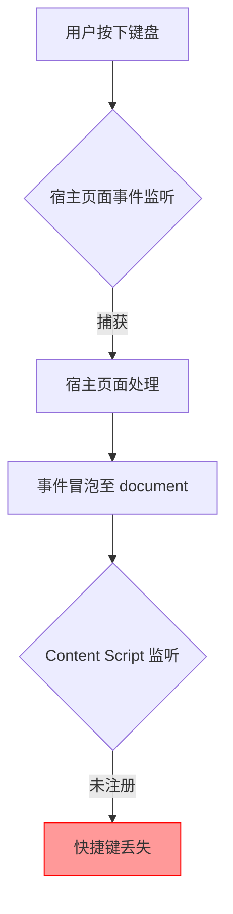
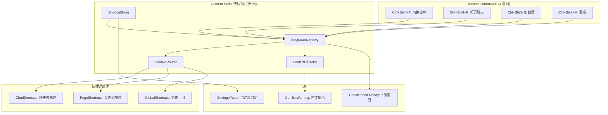
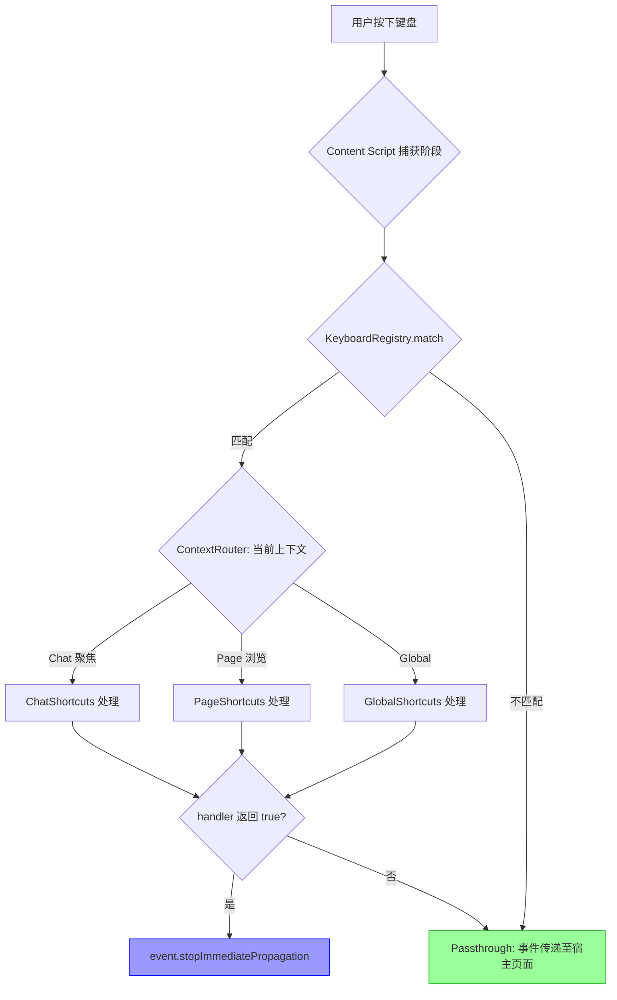

# YP-09-97: 键盘快捷键系统 — 全局快捷键注册、冲突检测与自定义绑定

> 需求编号：YP-09-97 · 优先级：P2 · 人天：0.5d · 状态：需求已编写
> 依赖：YP-09-42（设置面板重构）

## 背景

### 问题陈述

YiPet 当前完全依赖鼠标操作：唤起宠物、打开聊天、截图、静音切换等功能均需通过点击宠物或菜单完成。对于高频用户和键盘偏好用户，这造成了显著的效率瓶颈：

1. **操作效率低**：每次切换聊天窗口需移动鼠标点击宠物，打断键盘工作流
2. **可访问性缺失**：依赖鼠标操作排除了纯键盘用户和辅助技术用户
3. **快捷键碎片化**：不同功能缺乏统一的快捷键体系，用户无法记忆
4. **宿主页面冲突**：未处理与宿主页面（如 VS Code Web、Notion）的快捷键冲突

**核心矛盾**：Chrome 扩展的键盘事件在 Content Script 和宿主页面之间存在优先级竞争，需要设计一套既能捕获快捷键又不干扰页面正常操作的机制。

### 影响范围

| # | 影响 | 严重程度 | 典型场景 |
|---|------|----------|----------|
| 1 | 键盘用户无法高效操作 | 高 | 开发者需频繁切换鼠标操作宠物 |
| 2 | 可访问性合规风险 | 中 | WCAG 2.1 要求所有功能可通过键盘访问 |
| 3 | 快捷键与宿主页面冲突 | 高 | VS Code Web 中 Ctrl+Shift+P 被扩展拦截 |
| 4 | 用户无法自定义快捷键 | 中 | 不同用户有不同快捷键习惯 |
| 5 | 快捷键发现性差 | 中 | 用户不知道存在哪些快捷键 |

### 挑战

| 挑战 | 说明 |
|------|------|
| Content Script 事件捕获 | CS 中的 keydown 事件与宿主页面事件处理器竞争，需正确处理事件冒泡 |
| chrome.commands 限制 | chrome.commands 仅支持 4 个全局快捷键组合，且无法动态修改 |
| 上下文感知 | 聊天窗口聚焦时和页面浏览时的快捷键应不同 |
| 冲突检测 | 需检测与宿主页面、其他扩展、浏览器内置快捷键的冲突 |
| 跨平台键位差异 | macOS (Cmd) 和 Windows/Linux (Ctrl) 的修饰键差异 |

---

## 一、现状分析

### 1.1 当前快捷键体系

```
现有快捷键（无系统化管理）:
├── chrome.commands（manifest.json 中声明）
│   └── _execute_action: Ctrl+Shift+Y（默认，打开 popup）
├── Content Script 内联事件
│   └── 无 —— 未注册任何键盘事件监听
├── Popup 窗口内
│   └── Escape 关闭弹窗（浏览器默认行为）
└── 聊天窗口内
    └── Enter 发送消息（浏览器默认行为）

缺失:
├── 快捷键注册中心               # ❌ 不存在
├── 冲突检测机制                  # ❌ 不存在
├── 快捷键自定义 UI               # ❌ 不存在
├── 快捷键速查面板               # ❌ 不存在
├── 上下文感知路由               # ❌ 不存在
└── 可访问性键盘导航             # ❌ 不存在
```

### 1.2 快捷键覆盖需求

| 功能 | 默认快捷键 | 作用域 | 类型 |
|------|-----------|--------|------|
| 切换宠物显示/隐藏 | Ctrl+Shift+P | 全局 | chrome.commands |
| 打开聊天窗口 | Ctrl+Shift+K | 全局 | chrome.commands |
| 截图 | Ctrl+Shift+S | 全局 | chrome.commands |
| 切换静音 | Ctrl+Shift+M | 全局 | chrome.commands |
| 快速回复模板 1-5 | Ctrl+Shift+1~5 | 聊天聚焦 | CS 键盘事件 |
| 显示快捷键面板 | ? | 全局 | CS 键盘事件 |
| 聚焦聊天输入框 | Ctrl+Shift+J | 全局 | CS 键盘事件 |
| 关闭聊天窗口 | Escape | 聊天聚焦 | CS 键盘事件 |
| 上一页/下一页 | ← → | 聊天聚焦 | CS 键盘事件 |
| 朗读当前消息 | Ctrl+Shift+R | 全局 | CS 键盘事件 |

### 1.3 事件流现状



### 1.4 根因矩阵

| 症状 | 根因 | 触发条件 | 频率 |
|------|------|----------|------|
| 无快捷键支持 | 未实现快捷键注册中心 | 用户尝试键盘操作 | 高 |
| 快捷键与页面冲突 | 无冲突检测与 passthrough 机制 | 在富文本编辑器中使用 | 高 |
| 快捷键不可发现 | 无速查面板 | 新用户使用 | 高 |
| 无法自定义 | 无设置面板集成 | 用户有特殊需求 | 中 |
| 跨平台不一致 | 未处理 Cmd/Ctrl 差异 | macOS 用户 | 中 |

---

## 二、设计决策

### 决策 1：快捷键注册方式 — chrome.commands 为主 vs Content Script 为主 vs 混合

| 选项 | 全局可用 | 可自定义 | 冲突处理 | 数量限制 |
|------|---------|----------|----------|----------|
| chrome.commands 为主 | 是（任何页面） | 仅 chrome://extensions/shortcuts | 浏览器自动处理 | 4 个 |
| Content Script 为主 | 仅当前页面 | 完全可自定义 | 需手动处理 | 无限制 |
| 混合方案 | 核心 4 个全局 + 其余 CS | 全局浏览器设置 + CS 自定义 | 分层处理 | 4 全局 + 无限制 CS |

**选择：混合方案。** chrome.commands 用于 4 个核心全局快捷键（切换宠物、打开聊天、截图、静音），保证在任何页面均可用。Content Script 键盘事件用于其余快捷键，提供无限扩展和完全自定义能力。全局快捷键由浏览器管理冲突，CS 快捷键通过自建冲突检测机制处理。

### 决策 2：冲突检测策略 — 被动检测 vs 主动拦截 vs 智能 passthrough

| 选项 | 用户体验 | 实现复杂度 | 误拦截风险 |
|------|----------|-----------|-----------|
| 被动检测（仅在冲突时提示） | 中 | 低 | 高（已拦截后才发现） |
| 主动拦截（扩展优先） | 低 | 中 | 高（破坏页面功能） |
| 智能 passthrough | 高 | 高 | 低（仅处理未消费事件） |

**选择：智能 passthrough。** 注册 keydown 事件时使用 `{ capture: true }` 在捕获阶段监听，调用 `event.stopImmediatePropagation()` 仅在扩展处理该快捷键时阻止冒泡。若快捷键未注册或未匹配，事件正常传递至宿主页面。同时记录宿主页面已注册的快捷键（通过遍历页面事件监听器），在冲突时提示用户。

### 决策 3：自定义快捷键存储 — chrome.storage.sync vs chrome.storage.local vs 后端

| 选项 | 跨设备同步 | 存储限制 | 延迟 |
|------|-----------|----------|------|
| chrome.storage.sync | 是 | 102KB 总计 | 低（本地缓存 + 异步同步） |
| chrome.storage.local | 否 | 10MB | 极低 |
| 后端 API | 是 | 无限制 | 高（网络请求） |

**选择：chrome.storage.sync。** 快捷键配置数据量极小（< 1KB），使用 sync 可实现跨设备同步，用户在任何设备上获得一致的快捷键体验。同时保留 local 作为 fallback 写入（sync 配额满时）。

### 决策 4：快捷键速查面板 UI — 独立 overlay vs 聊天窗口内嵌 vs Popup 页面

| 选项 | 可见性 | 上下文保持 | 实现复杂度 |
|------|--------|-----------|-----------|
| 独立 overlay | 全屏展示 | 不中断页面 | 中 |
| 聊天窗口内嵌 | 需先打开聊天 | 中断当前工作 | 低 |
| Popup 页面 | 独立窗口 | 完全隔离 | 低 |

**选择：独立 overlay。** 按下 `?` 时在全屏 overlay 上展示快捷键列表，半透明背景不遮挡页面内容，释放后自动关闭。与聊天窗口解耦，不依赖聊天窗口状态。

### 设计决策记录

| 决策 | 选项 A | 选项 B | 选项 C | 选择 | 理由 |
|------|--------|--------|--------|------|------|
| 注册方式 | chrome.commands | Content Script | 混合 | **混合** | 全局保底 + 灵活扩展 |
| 冲突策略 | 被动检测 | 主动拦截 | 智能 passthrough | **智能 passthrough** | 不干扰宿主页面 |
| 存储方式 | sync | local | 后端 | **sync** | 跨设备同步 |
| 速查面板 | 独立 overlay | 聊天内嵌 | Popup | **独立 overlay** | 不打断工作流 |

---

## 三、目标架构

### 3.1 快捷键系统架构



### 3.2 事件处理流程



### 3.3 性能指标

| 指标 | 目标值 | 说明 |
|------|--------|------|
| 快捷键注册耗时 | < 5ms | KeyboardRegistry 初始化 |
| 按键匹配耗时 | < 1ms | keydown 事件到 handler 调用 |
| 冲突检测耗时 | < 10ms | 首次运行时扫描页面事件 |
| 速查面板打开 | < 50ms | overlay 渲染完成 |
| 内存占用 | < 500KB | 快捷键配置 + 注册表 |

---

## 四、具体改动

### 4.1 快捷键类型定义

```typescript
// src/shortcuts/types.ts (新增)

export type ShortcutScope = 'global' | 'chat' | 'page';

export type ModifierKey = 'ctrl' | 'alt' | 'shift' | 'meta';

export interface KeyboardShortcut {
  id: string;
  label: string;
  description: string;
  /** 默认键位，如 'ctrl+shift+p' */
  defaultKeys: string;
  /** 当前绑定的键位（用户可自定义） */
  currentKeys: string;
  scope: ShortcutScope;
  /** 是否通过 chrome.commands 注册 */
  isGlobalCommand: boolean;
  /** 功能分类 */
  category: 'pet' | 'chat' | 'utility' | 'navigation';
  /** 处理函数标识 */
  action: string;
}

export interface ShortcutBinding {
  shortcutId: string;
  keys: string;
  updatedAt: number;
}

export interface ShortcutConflict {
  shortcutId: string;
  conflictingKeys: string;
  conflictSource: 'host_page' | 'chrome' | 'other_extension';
  detectedAt: number;
}
```

### 4.2 快捷键注册中心

```typescript
// src/shortcuts/KeyboardRegistry.ts (新增)

import type { KeyboardShortcut, ShortcutScope, ModifierKey } from './types';
import { ShortcutStore } from './ShortcutStore';
import { ConflictDetector } from './ConflictDetector';

interface ParsedShortcut {
  modifiers: ModifierKey[];
  key: string;
}

export class KeyboardRegistry {
  private shortcuts: Map<string, KeyboardShortcut> = new Map();
  private handlers: Map<string, (event: KeyboardEvent) => boolean> = new Map();
  private store: ShortcutStore;
  private conflictDetector: ConflictDetector;
  private currentScope: ShortcutScope = 'page';
  private boundKeydown: ((e: KeyboardEvent) => void) | null = null;

  constructor() {
    this.store = new ShortcutStore();
    this.conflictDetector = new ConflictDetector();
  }

  /** 注册快捷键 */
  register(shortcut: KeyboardShortcut, handler: (event: KeyboardEvent) => boolean): void {
    this.shortcuts.set(shortcut.id, shortcut);
    this.handlers.set(shortcut.id, handler);
  }

  /** 初始化：加载用户自定义绑定 + 注册默认快捷键 */
  async initialize(): Promise<void> {
    const bindings = await this.store.loadBindings();

    // 注册默认快捷键
    this.registerDefaultShortcuts(bindings);

    // 绑定 keydown 事件（捕获阶段）
    this.boundKeydown = this.handleKeydown.bind(this);
    document.addEventListener('keydown', this.boundKeydown, { capture: true });

    // 检测冲突
    await this.conflictDetector.detectConflicts(
      Array.from(this.shortcuts.values())
    );
  }

  /** 设置当前上下文（聊天聚焦 / 页面浏览） */
  setScope(scope: ShortcutScope): void {
    this.currentScope = scope;
  }

  /** 核心按键分发 */
  private handleKeydown(event: KeyboardEvent): void {
    // 忽略 IME 组合输入
    if (event.isComposing) return;

    const pressedKeys = this.eventToKeyString(event);

    for (const [id, shortcut] of this.shortcuts) {
      // 检查作用域
      if (shortcut.scope !== 'global' && shortcut.scope !== this.currentScope) {
        continue;
      }

      if (pressedKeys === shortcut.currentKeys) {
        const handler = this.handlers.get(id);
        if (handler) {
          const handled = handler(event);
          if (handled) {
            event.preventDefault();
            event.stopImmediatePropagation();
            return;
          }
        }
      }
    }
    // 未匹配任何快捷键，事件传递至宿主页面
  }

  /** 将 KeyboardEvent 转换为标准化键位字符串 */
  private eventToKeyString(event: KeyboardEvent): string {
    const parts: string[] = [];
    if (event.ctrlKey) parts.push('ctrl');
    if (event.altKey) parts.push('alt');
    if (event.shiftKey) parts.push('shift');
    if (event.metaKey) parts.push('meta');

    // 标准化 key 值
    const key = event.key.toLowerCase();
    if (key !== 'control' && key !== 'alt' && key !== 'shift' && key !== 'meta') {
      parts.push(key);
    }

    return parts.join('+');
  }

  /** 注册默认快捷键 */
  private registerDefaultShortcuts(bindings: ShortcutBinding[]): void {
    const defaults: KeyboardShortcut[] = [
      {
        id: 'toggle-pet',
        label: '切换宠物显示/隐藏',
        description: '显示或隐藏宠物形象',
        defaultKeys: 'ctrl+shift+p',
        currentKeys: 'ctrl+shift+p',
        scope: 'global',
        isGlobalCommand: true,
        category: 'pet',
        action: 'togglePet',
      },
      {
        id: 'open-chat',
        label: '打开聊天窗口',
        description: '打开或聚焦聊天窗口',
        defaultKeys: 'ctrl+shift+k',
        currentKeys: 'ctrl+shift+k',
        scope: 'global',
        isGlobalCommand: true,
        category: 'chat',
        action: 'openChat',
      },
      {
        id: 'screenshot',
        label: '截图',
        description: '截取当前页面并发送到聊天',
        defaultKeys: 'ctrl+shift+s',
        currentKeys: 'ctrl+shift+s',
        scope: 'global',
        isGlobalCommand: true,
        category: 'utility',
        action: 'screenshot',
      },
      {
        id: 'toggle-mute',
        label: '切换静音',
        description: '启用或禁用宠物音效和语音',
        defaultKeys: 'ctrl+shift+m',
        currentKeys: 'ctrl+shift+m',
        scope: 'global',
        isGlobalCommand: true,
        category: 'pet',
        action: 'toggleMute',
      },
      {
        id: 'focus-chat-input',
        label: '聚焦聊天输入框',
        description: '快速聚焦到聊天输入框',
        defaultKeys: 'ctrl+shift+j',
        currentKeys: 'ctrl+shift+j',
        scope: 'chat',
        isGlobalCommand: false,
        category: 'chat',
        action: 'focusChatInput',
      },
      {
        id: 'close-chat',
        label: '关闭聊天窗口',
        description: '关闭当前聊天窗口',
        defaultKeys: 'escape',
        currentKeys: 'escape',
        scope: 'chat',
        isGlobalCommand: false,
        category: 'chat',
        action: 'closeChat',
      },
      {
        id: 'quick-reply-1',
        label: '快速回复模板 1',
        description: '插入第 1 个快速回复模板',
        defaultKeys: 'ctrl+shift+1',
        currentKeys: 'ctrl+shift+1',
        scope: 'chat',
        isGlobalCommand: false,
        category: 'chat',
        action: 'quickReply1',
      },
      {
        id: 'quick-reply-2',
        label: '快速回复模板 2',
        description: '插入第 2 个快速回复模板',
        defaultKeys: 'ctrl+shift+2',
        currentKeys: 'ctrl+shift+2',
        scope: 'chat',
        isGlobalCommand: false,
        category: 'chat',
        action: 'quickReply2',
      },
      {
        id: 'quick-reply-3',
        label: '快速回复模板 3',
        description: '插入第 3 个快速回复模板',
        defaultKeys: 'ctrl+shift+3',
        currentKeys: 'ctrl+shift+3',
        scope: 'chat',
        isGlobalCommand: false,
        category: 'chat',
        action: 'quickReply3',
      },
      {
        id: 'show-cheatsheet',
        label: '快捷键速查',
        description: '显示快捷键速查面板',
        defaultKeys: '?',
        currentKeys: '?',
        scope: 'global',
        isGlobalCommand: false,
        category: 'utility',
        action: 'showCheatSheet',
      },
      {
        id: 'read-aloud',
        label: '朗读当前消息',
        description: '使用 TTS 朗读最后一条 AI 消息',
        defaultKeys: 'ctrl+shift+r',
        currentKeys: 'ctrl+shift+r',
        scope: 'chat',
        isGlobalCommand: false,
        category: 'chat',
        action: 'readAloud',
      },
    ];

    // 应用用户自定义绑定
    const bindingMap = new Map(bindings.map(b => [b.shortcutId, b.keys]));
    for (const shortcut of defaults) {
      const customKeys = bindingMap.get(shortcut.id);
      if (customKeys) {
        shortcut.currentKeys = customKeys;
      }
      this.register(shortcut, this.createHandler(shortcut.action));
    }
  }

  private createHandler(action: string): (event: KeyboardEvent) => boolean {
    // 返回默认 handler，实际 handler 由各模块注入
    return () => {
      window.dispatchEvent(new CustomEvent(`yipet:shortcut:${action}`));
      return true;
    };
  }

  /** 更新快捷键绑定 */
  async updateBinding(shortcutId: string, newKeys: string): Promise<boolean> {
    const shortcut = this.shortcuts.get(shortcutId);
    if (!shortcut) return false;

    // 检测新键位是否与已有快捷键冲突
    const conflict = this.conflictDetector.checkInternalConflict(
      newKeys,
      shortcutId,
      Array.from(this.shortcuts.values())
    );
    if (conflict) return false;

    shortcut.currentKeys = newKeys;
    await this.store.saveBinding({ shortcutId, keys: newKeys, updatedAt: Date.now() });
    return true;
  }

  /** 获取所有已注册快捷键 */
  getShortcuts(): KeyboardShortcut[] {
    return Array.from(this.shortcuts.values());
  }

  /** 销毁：移除事件监听 */
  destroy(): void {
    if (this.boundKeydown) {
      document.removeEventListener('keydown', this.boundKeydown, { capture: true });
      this.boundKeydown = null;
    }
    this.shortcuts.clear();
    this.handlers.clear();
  }
}
```

### 4.3 冲突检测器

```typescript
// src/shortcuts/ConflictDetector.ts (新增)

import type { KeyboardShortcut, ShortcutConflict } from './types';

export class ConflictDetector {
  /** 检测扩展快捷键与宿主页面的冲突 */
  async detectConflicts(shortcuts: KeyboardShortcut[]): Promise<ShortcutConflict[]> {
    const conflicts: ShortcutConflict[] = [];

    for (const shortcut of shortcuts) {
      // 检测常见 Web 应用快捷键
      const knownPageShortcuts = this.getKnownPageShortcuts();
      const key = shortcut.currentKeys;

      if (key in knownPageShortcuts) {
        conflicts.push({
          shortcutId: shortcut.id,
          conflictingKeys: key,
          conflictSource: 'host_page',
          detectedAt: Date.now(),
        });
      }
    }

    return conflicts;
  }

  /** 检测扩展内部快捷键冲突 */
  checkInternalConflict(
    newKeys: string,
    excludeId: string,
    allShortcuts: KeyboardShortcut[]
  ): KeyboardShortcut | null {
    return allShortcuts.find(
      s => s.id !== excludeId && s.currentKeys === newKeys
    ) ?? null;
  }

  /** 已知宿主页面快捷键（常见 Web 应用） */
  private getKnownPageShortcuts(): Record<string, string> {
    return {
      'ctrl+s': '保存（VS Code/Google Docs/大多应用）',
      'ctrl+p': '打印/快速打开（浏览器/VS Code）',
      'ctrl+k': '搜索/插入链接（浏览器/Notion）',
      'ctrl+shift+p': '命令面板（VS Code/Figma）',
      'ctrl+shift+k': '删除行（VS Code）',
      'ctrl+shift+s': '另存为（大多应用）',
      'ctrl+shift+m': 'Markdown 预览（VS Code）',
      'escape': '取消/关闭（通用）',
      '?': '快捷键帮助（GitHub/Twitter/Jira）',
    };
  }
}
```

### 4.4 快捷键存储

```typescript
// src/shortcuts/ShortcutStore.ts (新增)

import type { ShortcutBinding } from './types';

const STORAGE_KEY = 'yipet_shortcut_bindings';

export class ShortcutStore {
  async loadBindings(): Promise<ShortcutBinding[]> {
    try {
      const result = await chrome.storage.sync.get(STORAGE_KEY);
      return result[STORAGE_KEY] ?? [];
    } catch {
      // sync 存储满时回退到 local
      const result = await chrome.storage.local.get(STORAGE_KEY);
      return result[STORAGE_KEY] ?? [];
    }
  }

  async saveBinding(binding: ShortcutBinding): Promise<void> {
    const bindings = await this.loadBindings();
    const index = bindings.findIndex(b => b.shortcutId === binding.shortcutId);

    if (index >= 0) {
      bindings[index] = binding;
    } else {
      bindings.push(binding);
    }

    try {
      await chrome.storage.sync.set({ [STORAGE_KEY]: bindings });
    } catch {
      // sync 配额满时回退到 local
      await chrome.storage.local.set({ [STORAGE_KEY]: bindings });
    }
  }

  async resetToDefaults(): Promise<void> {
    await chrome.storage.sync.remove(STORAGE_KEY);
    await chrome.storage.local.remove(STORAGE_KEY);
  }
}
```

### 4.5 快捷键速查面板（Vue 组件）

```typescript
// src/components/CheatSheetOverlay.vue (新增)

// Vue 3 组合式 API 组件
// 快捷键速查面板：按 ? 键触发，全屏半透明 overlay
// 按分类分组展示所有快捷键，支持搜索过滤

import { ref, computed, onMounted, onUnmounted } from 'vue';
import type { KeyboardShortcut } from '@/shortcuts/types';

const shortcuts = ref<KeyboardShortcut[]>([]);
const visible = ref(false);
const searchQuery = ref('');

const categories = [
  { key: 'pet', label: '宠物控制' },
  { key: 'chat', label: '聊天操作' },
  { key: 'utility', label: '工具' },
  { key: 'navigation', label: '导航' },
];

const filteredShortcuts = computed(() => {
  if (!searchQuery.value) return shortcuts.value;
  const q = searchQuery.value.toLowerCase();
  return shortcuts.value.filter(
    s => s.label.includes(q) || s.description.includes(q) || s.currentKeys.includes(q)
  );
});

const groupedShortcuts = computed(() => {
  const groups: Record<string, KeyboardShortcut[]> = {};
  for (const cat of categories) {
    groups[cat.key] = filteredShortcuts.value.filter(s => s.category === cat.key);
  }
  return groups;
});

function show() {
  visible.value = true;
  searchQuery.value = '';
}

function hide() {
  visible.value = false;
}

function formatKeys(keys: string): string {
  return keys
    .replace('ctrl', navigator.platform.includes('Mac') ? 'Cmd' : 'Ctrl')
    .replace('meta', 'Cmd')
    .split('+')
    .map(k => k.charAt(0).toUpperCase() + k.slice(1))
    .join(' + ');
}

// 绑定 ? 键和 Escape 关闭
function onKeydown(e: KeyboardEvent) {
  if (e.key === '?' && !visible.value && !isInputFocused()) {
    e.preventDefault();
    show();
  }
  if (e.key === 'Escape' && visible.value) {
    hide();
  }
}

function isInputFocused(): boolean {
  const tag = document.activeElement?.tagName;
  return tag === 'INPUT' || tag === 'TEXTAREA' || tag === 'SELECT';
}
```

### 4.6 chrome.commands 注册

```json
// manifest.json 片段 (修改)
{
  "commands": {
    "toggle-pet": {
      "suggested_key": {
        "default": "Ctrl+Shift+P",
        "mac": "Command+Shift+P"
      },
      "description": "切换宠物显示/隐藏"
    },
    "open-chat": {
      "suggested_key": {
        "default": "Ctrl+Shift+K",
        "mac": "Command+Shift+K"
      },
      "description": "打开聊天窗口"
    },
    "screenshot": {
      "suggested_key": {
        "default": "Ctrl+Shift+S",
        "mac": "Command+Shift+S"
      },
      "description": "截取当前页面"
    },
    "toggle-mute": {
      "suggested_key": {
        "default": "Ctrl+Shift+M",
        "mac": "Command+Shift+M"
      },
      "description": "切换静音"
    }
  }
}
```

### 4.7 Service Worker 中处理 chrome.commands

```typescript
// src/sw/command-handler.ts (新增)

chrome.commands.onCommand.addListener(async (command) => {
  const [tab] = await chrome.tabs.query({ active: true, currentWindow: true });
  if (!tab?.id) return;

  switch (command) {
    case 'toggle-pet':
      chrome.tabs.sendMessage(tab.id, { type: 'SHORTCUT', action: 'togglePet' });
      break;
    case 'open-chat':
      chrome.tabs.sendMessage(tab.id, { type: 'SHORTCUT', action: 'openChat' });
      break;
    case 'screenshot':
      chrome.tabs.sendMessage(tab.id, { type: 'SHORTCUT', action: 'screenshot' });
      break;
    case 'toggle-mute':
      chrome.tabs.sendMessage(tab.id, { type: 'SHORTCUT', action: 'toggleMute' });
      break;
  }
});
```

### 4.8 文件变更清单

| 文件 | 操作 | 说明 |
|------|------|------|
| `src/shortcuts/types.ts` | 新增 | 快捷键类型定义 |
| `src/shortcuts/KeyboardRegistry.ts` | 新增 | 快捷键注册中心 |
| `src/shortcuts/ConflictDetector.ts` | 新增 | 冲突检测器 |
| `src/shortcuts/ShortcutStore.ts` | 新增 | 快捷键持久化存储 |
| `src/shortcuts/defaults.ts` | 新增 | 默认快捷键配置 |
| `src/components/CheatSheetOverlay.vue` | 新增 | 快捷键速查面板 |
| `src/sw/command-handler.ts` | 新增 | SW 中 chrome.commands 处理 |
| `src/composables/useKeyboard.ts` | 新增 | 键盘快捷键 Composable |
| `src/content/index.ts` | 修改 | 初始化 KeyboardRegistry |
| `manifest.json` | 修改 | 添加 commands 字段 |
| `src/popup/App.vue` | 修改 | 集成快捷键自定义 UI |

---

## 五、实施步骤

| 步骤 | 操作 | 路径 | 验证 | 人天 |
|------|------|------|------|------|
| 1 | 定义快捷键类型和默认配置 | `src/shortcuts/types.ts`, `defaults.ts` | 类型检查通过 | 0.03 |
| 2 | 实现 KeyboardRegistry 注册中心 | `src/shortcuts/KeyboardRegistry.ts` | 快捷键注册和匹配正常 | 0.08 |
| 3 | 实现 ConflictDetector 冲突检测 | `src/shortcuts/ConflictDetector.ts` | 检测到已知冲突 | 0.05 |
| 4 | 实现 ShortcutStore 持久化 | `src/shortcuts/ShortcutStore.ts` | 读写 chrome.storage 正常 | 0.03 |
| 5 | 配置 manifest.json chrome.commands | `manifest.json` | 4 个全局命令可触发 | 0.03 |
| 6 | 实现 SW command handler | `src/sw/command-handler.ts` | SW 接收命令并转发到 CS | 0.05 |
| 7 | 实现 CheatSheetOverlay 速查面板 | `src/components/CheatSheetOverlay.vue` | ? 键打开、Escape 关闭 | 0.08 |
| 8 | 集成到 Content Script 初始化 | `src/content/index.ts` | 所有快捷键正常工作 | 0.05 |
| 9 | 实现快捷键自定义 UI（设置面板） | `src/popup/App.vue` | 用户可修改快捷键绑定 | 0.05 |
| 10 | 编写单元测试 | `tests/unit/shortcuts/` | 覆盖注册、匹配、冲突检测 | 0.05 |

**总人天：0.5d**

---

## 六、测试规格

### 场景 1：全局快捷键切换宠物

**GIVEN** 用户在任何页面浏览，宠物当前可见
**WHEN** 用户按下 Ctrl+Shift+P
**THEN** 宠物应隐藏，宠物覆盖层 DOM 应移除
**AND** 再次按下 Ctrl+Shift+P 时宠物应重新显示
**AND** 快捷键事件不应传递至宿主页面

### 场景 2：聊天聚焦时快捷键上下文切换

**GIVEN** 用户已打开聊天窗口，输入框获得焦点
**WHEN** 用户按下 Escape
**THEN** 聊天窗口应关闭
**AND** KeyboardRegistry 的 scope 应切换为 'page'
**AND** 此时再按 Escape 应传递至宿主页面（passthrough）

### 场景 3：快捷键冲突检测与提示

**GIVEN** 用户在 VS Code Web 页面中
**WHEN** KeyboardRegistry 初始化时检测到 Ctrl+Shift+P 与 VS Code 命令面板冲突
**THEN** 应在控制台记录冲突警告
**AND** 用户自定义快捷键时若新键位与已有快捷键冲突，应阻止保存并提示

### 场景 4：快捷键速查面板

**GIVEN** 用户在页面中，未聚焦输入框
**WHEN** 用户按下 ? 键
**THEN** 应显示全屏快捷键速查面板，按分类分组
**AND** 面板应显示快捷键标签、键位绑定和描述
**AND** 按下 Escape 应关闭面板
**AND** 在输入框中按 ? 不应触发面板（passthrough）

### 场景 5：自定义快捷键绑定

**GIVEN** 用户在设置面板中打开快捷键自定义
**WHEN** 用户将 "切换静音" 快捷键从 Ctrl+Shift+M 修改为 Ctrl+Shift+Q
**THEN** 新绑定应立即生效
**AND** 绑定应持久化到 chrome.storage.sync
**AND** 新标签页打开后应加载自定义绑定

### 场景 6：跨平台键位适配

**GIVEN** 用户在 macOS 上使用 Chrome
**WHEN** 用户按下 Cmd+Shift+P
**THEN** 应触发 "切换宠物" 功能（macOS 上 Cmd 替代 Ctrl）
**AND** 速查面板应显示 Cmd 而非 Ctrl
**AND** 在 Windows/Linux 上应显示 Ctrl

---

## 七、风险与缓解

| 风险 | 概率 | 影响 | 缓解措施 |
|------|------|------|----------|
| 快捷键与宿主页面冲突导致功能异常 | 中 | 高 | 智能 passthrough + 冲突检测 + 用户可自定义 |
| chrome.commands 仅 4 个限制 | 确定 | 中 | 核心功能用 commands，其余用 CS 事件 |
| 某些页面阻止事件捕获 | 低 | 中 | 检测 passive 事件监听器，必要时降级 |
| chrome.storage.sync 配额超限 | 低 | 低 | 自动回退到 chrome.storage.local |
| 跨设备同步延迟导致快捷键不同步 | 低 | 低 | 本地缓存立即生效，同步异步更新 |

---

## 八、回滚策略

| 场景 | 回滚操作 | 影响 |
|------|----------|------|
| 快捷键导致宿主页面功能异常 | 移除 Content Script keydown 监听，仅保留 chrome.commands | 失去自定义快捷键和上下文感知 |
| 速查面板 UI 异常 | 禁用 ? 键触发，添加设置入口 | 失去快速发现 |
| 冲突检测误报 | 关闭冲突提示，仅保留日志 | 用户可能遇到冲突 |
| 存储异常 | 降级为仅使用默认快捷键（不持久化） | 失去自定义绑定 |

---

## 九、设计决策记录

### D-01：事件捕获阶段 vs 冒泡阶段

- **问题**：keydown 事件应在捕获阶段还是冒泡阶段监听
- **选项**：捕获阶段（`{ capture: true }`）、冒泡阶段（默认）
- **选择**：捕获阶段
- **理由**：捕获阶段在宿主页面事件处理器之前触发，扩展可以先判断是否需要处理，不需要时事件正常冒泡至页面。冒泡阶段监听时页面可能已调用 `stopPropagation()` 阻止了事件。

### D-02：Esc 键特殊处理

- **问题**：Esc 键在聊天窗口关闭和页面通用取消之间如何区分
- **选项**：始终拦截 Esc、始终 passthrough、上下文感知
- **选择**：上下文感知——聊天聚焦时拦截，页面浏览时 passthrough
- **理由**：Esc 是 Web 应用中最高频的快捷键之一，仅在聊天窗口打开时拦截，避免破坏宿主页面的 Esc 行为（如关闭模态框、取消编辑）。

### D-03：? 键触发速查面板的条件

- **问题**：? 键何时触发速查面板
- **选项**：始终触发、仅非输入框时触发、Shift+? 触发
- **选择**：仅非输入框时触发（`!isInputFocused()`）
- **理由**：在输入框/文本区域中 ? 是正常输入字符，不应拦截。添加到冲突检测的已知列表中。

### D-04：chrome.commands 的 4 个槽位分配

- **问题**：仅 4 个 chrome.commands 名额，分配给哪些功能
- **选项**：最高频功能、最难用 CS 实现的功能、按用户投票
- **选择**：切换宠物、打开聊天、截图、静音
- **理由**：这 4 个功能是所有场景下都需要的全局操作，chrome.commands 保证在任何页面（包括 chrome:// 和 Web Store）均可触发。其余功能在特定页面通过 CS 处理。

---

## 十、可观测性

### 指标

| 指标 | 类型 | 说明 |
|------|------|------|
| `yipet.shortcuts.registered_count` | Gauge | 已注册快捷键总数 |
| `yipet.shortcuts.triggered_total` | Counter | 快捷键触发总次数（按 action 分组） |
| `yipet.shortcuts.conflicts_detected` | Gauge | 检测到的冲突数量 |
| `yipet.shortcuts.cheatsheet_opens` | Counter | 速查面板打开次数 |
| `yipet.shortcuts.custom_bindings` | Gauge | 用户自定义绑定的快捷键数量 |
| `yipet.shortcuts.match_latency_us` | Histogram | 按键匹配耗时（微秒） |

### 告警

| 告警 | 条件 | 级别 |
|------|------|------|
| 快捷键冲突数 > 5 | 单次初始化检测 | WARNING |
| 快捷键匹配耗时 > 5ms | 连续 100 次采样 | WARNING |
| 快捷键触发率为 0 | 扩展激活 5 分钟后 | INFO（用户可能不知快捷键存在） |
| 速查面板打开率 < 1% | 日活用户中 | INFO（可发现性不足） |

---

## 十一、代码审查检查清单

- [ ] KeyboardRegistry 在捕获阶段注册 keydown 事件
- [ ] 未匹配的快捷键事件正确 passthrough（不调用 stopImmediatePropagation）
- [ ] IME 组合输入时跳过快捷键处理（`event.isComposing`）
- [ ] 输入框聚焦时 ? 键不触发速查面板
- [ ] chrome.commands 4 个槽位分配合理
- [ ] SW command handler 正确转发消息到 Content Script
- [ ] 冲突检测覆盖已知 Web 应用快捷键
- [ ] 快捷键绑定存储使用 chrome.storage.sync + local fallback
- [ ] CheatSheetOverlay 按分类分组展示，搜索过滤可用
- [ ] 自定义快捷键 UI 支持键盘录制（按新键位自动捕获）
- [ ] macOS 和 Windows 键位显示正确（Cmd vs Ctrl）
- [ ] 所有快捷键操作均可通过键盘完成（可访问性）

---

## 回归问题预测

| # | 预测问题 | 原因 | 验证方法 |
|---|---------|------|---------|
| 1 | Content Script 事件捕获阶段监听 `{ capture: true }` 在 React 页面上失效，React 合成事件系统在 root 节点上监听，先于 CS 捕获阶段执行 | React 17+ 将事件委托到 root DOM 节点，使用原生 `addEventListener` 在 root 上注册，`capture: true` 的 CS 事件在 document 上先触发，但 React 的 `stopPropagation` 在合成事件层阻止冒泡，不影响原生捕获 | 在 React 页面（如 Facebook）中测试所有快捷键，验证 passthrough 和拦截行为正确 |
| 2 | `navigator.platform` 在部分 Linux 发行版返回空字符串，导致 Cmd/Ctrl 显示错误，快捷键格式化函数降级到无修饰键名称 | 某些 Linux 发行版的 Chrome 浏览器 `navigator.platform` 返回 `''` 或 `'Linux i686'` 等非标准值，formatKeys 函数未处理边界情况 | 在 Linux 虚拟机中测试速查面板显示，确保修饰键名称正确 |
| 3 | chrome.storage.sync 写入失败时 fallback 到 local，但下次加载先读 sync 再读 local，导致自定义绑定被覆盖 | sync 写入失败时不抛异常（chrome.storage 的 `set()` 在配额满时静默失败），local fallback 写入成功，但用户下次打开浏览器时 sync 中旧数据覆盖了 local 中的新绑定 | 模拟 sync 配额满场景，验证 local fallback 写入后下次加载时绑定正确 |
| 4 | 快捷键 ? 在 GitHub/GitLab/Jira 页面被拦截，但用户在这些页面中按 ? 期望看到宿主页面的快捷键帮助，而非 YiPet 的速查面板 | 冲突检测已知 ? 是 GitHub 等平台的快捷键，但智能 passthrough 在捕获阶段仍会先匹配到 YiPet 的 ? 快捷键并拦截 | 将 ? 的冲突检测结果从"警告"升级为"自动禁用"，在已检测到冲突的页面自动禁用 ? 快捷键，改由设置面板入口打开速查 |
| 5 | chrome.commands 修改后 chrome://extensions/shortcuts 页面显示混乱，用户同时修改 YiPet 和其他扩展的快捷键时产生冲突 | Chrome 在 chrome://extensions/shortcuts 页面允许用户修改任何扩展的快捷键，用户可能将 YiPet 的快捷键设置为与其他扩展相同的组合，Chrome 不保证全局唯一 | 在 chrome.commands 的 `onCommand` 中记录实际触发的命令，若发现短时间内多个扩展响应同一组合键，在控制台提示用户 |
| 6 | 聊天窗口内输入 Emoji 时，`event.isComposing` 为 true 但 `event.key` 为 '?' 等字符，快捷键匹配可能在 IME 组合结束后延迟触发 | IME 组合输入时 `isComposing` 为 true 应跳过，但 `compositionend` 事件后可能产生额外的 keydown 事件，时序上可能被误匹配 | 在中文/日文输入法下测试聊天输入，确保输入 `?` 字符时不会触发速查面板 |

---

## 性能分析

### 快捷键系统各阶段耗时

| 阶段 | 预估耗时 | 说明 |
|------|----------|------|
| KeyboardRegistry 初始化 | < 5ms | 加载默认配置 + 用户绑定 |
| ShortcutStore 加载 | < 10ms | chrome.storage.sync 读取（异步，不阻塞） |
| ConflictDetector 检测 | < 10ms | 首次运行时扫描已知冲突 |
| keydown 事件匹配 | < 1ms | 遍历 ~15 个快捷键 |
| CheatSheetOverlay 渲染 | < 30ms | Vue 组件挂载 + DOM 渲染 |
| 自定义绑定保存 | < 20ms | chrome.storage.sync 写入 |

### 文件体积预估

| 文件 | 大小 | 说明 |
|------|------|------|
| `src/shortcuts/types.ts` | ~1KB | 类型定义 |
| `src/shortcuts/KeyboardRegistry.ts` | ~4KB | 注册中心核心逻辑 |
| `src/shortcuts/ConflictDetector.ts` | ~2KB | 冲突检测 |
| `src/shortcuts/ShortcutStore.ts` | ~1.5KB | 存储层 |
| `src/shortcuts/defaults.ts` | ~2KB | 默认快捷键配置 |
| `src/components/CheatSheetOverlay.vue` | ~3KB | 速查面板组件 |
| `src/sw/command-handler.ts` | ~1KB | SW 命令处理 |
| `src/composables/useKeyboard.ts` | ~1.5KB | Composable |
| `manifest.json` (修改) | +0.5KB | commands 字段 |