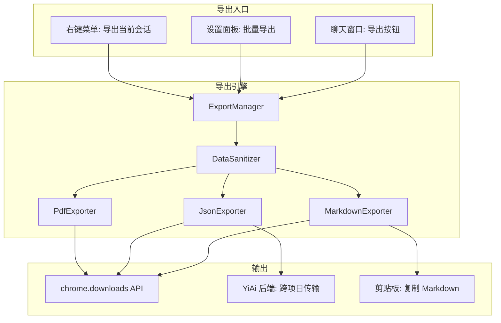
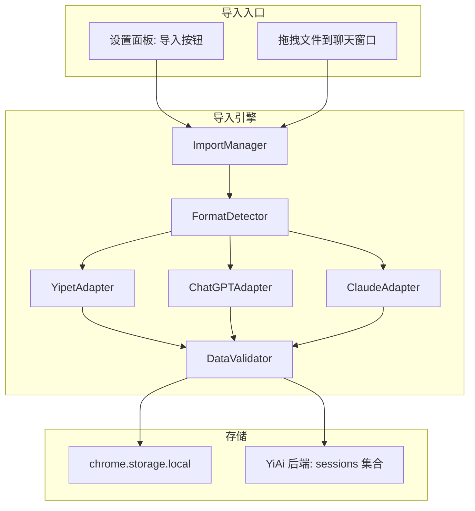

# YP-09-98: 会话导出与迁移 — Markdown/JSON/PDF 导出与跨平台会话迁移

> 需求编号：YP-09-98 · 优先级：P2 · 人天：0.5d · 状态：需求已编写
> 依赖：YP-09-42（设置面板重构）

## 背景

### 问题陈述

YiPet 当前的聊天会话数据完全封闭在扩展的 chrome.storage.local 中，用户无法导出、备份或迁移其对话历史。这带来了严重的数据锁定问题：

1. **数据丢失风险**：用户清除浏览器数据、重装扩展或切换设备时，所有会话历史永久丢失
2. **无法跨平台使用**：用户在 YiPet 中的对话无法导出到其他工具（Obsidian、Notion、ChatGPT）继续使用
3. **知识孤岛**：宝贵的对话记录被锁定在扩展中，无法融入个人知识管理流程
4. **缺乏备份机制**：没有任何自动或手动备份方案，数据完全依赖浏览器的 chrome.storage 持久性

**核心矛盾**：Chrome 扩展的存储是设备本地的且不可靠（chrome.storage.local 可能被浏览器自动清理），用户需要将对话数据导出为可持久化的标准格式，同时需要从其他 AI 工具迁移数据到 YiPet 中。

### 影响范围

| # | 影响 | 严重程度 | 典型场景 |
|---|------|----------|----------|
| 1 | 切换设备/重装扩展后会话丢失 | 高 | 用户重装 Chrome 后发现所有对话消失 |
| 2 | 无法将对话整合到笔记系统 | 中 | 用户想将 AI 回复保存到 Obsidian |
| 3 | 无法从其他 AI 工具迁移 | 中 | 从 ChatGPT 迁移到 YiPet 的用户 |
| 4 | 无数据备份安全感 | 中 | 重要对话不敢关闭会话 |
| 5 | 跨项目数据断层 | 低 | YiPet 对话无法共享到 YiVad |

### 挑战

| 挑战 | 说明 |
|------|------|
| 大数据量导出 | 长会话可能包含数千条消息，导出需分块处理避免内存溢出 |
| 格式保真度 | Markdown 导出需保留代码块、表格、引用等富文本格式 |
| PDF 生成 | 浏览器扩展中无 Node.js 环境，无法使用 puppeteer；需使用客户端 PDF 方案 |
| 数据脱敏 | 导出前需移除内部 ID、时间戳精度、敏感元数据 |
| 导入兼容性 | ChatGPT/Claude 导出格式各异，需解析多种 JSON 结构 |
| 跨项目传输 | YiPet→YiVad 会话传输需处理认证和会话归属 |

---

## 一、现状分析

### 1.1 当前会话数据流

```
聊天数据存储现状:
├── chrome.storage.local
│   ├── yipet_session_{key}      # 每个会话独立 key
│   │   ├── messages[]           # 消息数组（含内部 ID）
│   │   ├── title                # 会话标题
│   │   ├── tags[]               # 标签
│   │   ├── createdAt            # 创建时间戳
│   │   └── updatedAt            # 更新时间戳
│   └── yipet_session_index      # 会话索引列表
│
├── YiAi 后端 (MongoDB)
│   └── sessions 集合            # 服务端会话备份（若启用同步）
│
缺失:
├── 导出功能                      # ❌ 不存在
├── 导入功能                      # ❌ 不存在
├── 数据脱敏                      # ❌ 不存在
├── 格式转换工具                  # ❌ 不存在
└── 跨项目传输                    # ❌ 不存在
```

### 1.2 会话数据规模预估

| 指标 | 典型值 | 最大值 | 说明 |
|------|--------|--------|------|
| 会话数量 | 10-30 | 100+ | 活跃用户 |
| 单会话消息数 | 20-50 | 500+ | 长对话 |
| 单条消息大小 | 0.5-2KB | 50KB | 含代码块 |
| 总会话数据 | 500KB | 5MB+ | 所有会话 |

### 1.3 导出格式对比

| 格式 | 用途 | 可读性 | 可恢复性 | 兼容性 |
|------|------|--------|----------|--------|
| Markdown | 笔记归档、Obsidian/Notion | 高 | 低（丢失结构化数据） | 高 |
| JSON | 备份恢复、跨工具迁移 | 低 | 高（完整数据） | 中 |
| PDF | 分享、打印 | 高 | 极低 | 极高 |

### 1.4 根因矩阵

| 症状 | 根因 | 触发条件 | 频率 |
|------|------|----------|------|
| 会话数据丢失 | 无导出备份机制 | 重装扩展/清除浏览器数据 | 中 |
| 知识无法复用 | 数据封闭在扩展中 | 用户想归档对话 | 高 |
| 迁移成本高 | 无导入功能 | 新用户从其他 AI 工具迁移 | 中 |
| 跨项目断层 | 无 YiPet→YiVad 传输 | 用户在 YiVad 继续对话 | 低 |

---

## 二、设计决策

### 决策 1：Markdown 导出格式设计 — 对话流 vs 剧本 vs 纯文本

| 选项 | 可读性 | 代码块处理 | 元数据保留 |
|------|--------|-----------|-----------|
| 对话流（角色标注） | 高 | 标准 Markdown fenced code | frontmatter YAML |
| 剧本格式 | 中 | 嵌入文本 | 有限 |
| 纯文本 | 低 | 丢失语法高亮 | 无 |

**选择：对话流格式。** 使用 YAML frontmatter 存储会话元数据（title、tags、date），消息体使用 `**角色**：` 标注，代码块使用 Markdown fenced code block 保留语言标注和语法高亮信息。图片使用原始 URL 引用。

### 决策 2：PDF 生成方案 — 浏览器打印 vs jsPDF vs html2pdf

| 选项 | 质量 | 体积 | 中文支持 | 代码块 |
|------|------|------|----------|--------|
| 浏览器打印（window.print + CSS @media print） | 高 | 0（内置） | 优秀 | 优秀 |
| jsPDF | 中 | ~200KB | 需额外字体 | 手动排版 |
| html2pdf.js | 中 | ~300KB | 需额外字体 | 较复杂 |

**选择：浏览器打印方案。** 使用 `window.print()` + CSS `@media print` 样式，将对话渲染到隐藏 iframe 中触发打印。Chrome 打印对话框支持"另存为 PDF"，无需引入额外依赖。对于代码块，print CSS 可保留背景色和等宽字体。

### 决策 3：导入格式兼容 — 仅 JSON vs 多格式解析器 vs 适配器模式

| 选项 | 扩展性 | 维护成本 | 覆盖范围 |
|------|--------|----------|----------|
| 仅 JSON（自有格式） | 低 | 低 | 仅 YiPet 导出 |
| 多格式解析器 | 中 | 高 | YiPet + ChatGPT + Claude |
| 适配器模式 | 高 | 中 | 可扩展任意格式 |

**选择：适配器模式。** 定义 `ImportAdapter` 接口，每种格式实现一个适配器。当前支持 YiPet JSON、ChatGPT 导出（`conversations.json`）、Claude 导出（`*.json`）。未来可扩展更多格式。适配器负责将外部格式转换为 YiPet 内部消息格式。

### 决策 4：跨项目传输协议 — RPC 信封 vs chrome.runtime.sendMessage vs window.postMessage

| 选项 | 安全性 | 复杂度 | 跨域 |
|------|--------|--------|------|
| RPC 信封（YiAi） | 高（Token 认证） | 中 | 是 |
| chrome.runtime.sendMessage | 高（扩展沙箱） | 低 | 仅扩展内部 |
| window.postMessage | 低 | 低 | 是 |

**选择：RPC 信封（YiAi 中转）。** 跨项目传输（YiPet→YiVad）通过 YiAi 后端中转：YiPet 导出会话 → 调用 YiAi `data_service.insert_document` → YiVad 从 YiAi 拉取。使用 YiVad 的会话 key 标识目标，避免直接跨域通信的安全风险。

### 设计决策记录

| 决策 | 选项 A | 选项 B | 选项 C | 选择 | 理由 |
|------|--------|--------|--------|------|------|
| Markdown 格式 | 对话流 | 剧本 | 纯文本 | **对话流** | 可读性 + 元数据 |
| PDF 方案 | 浏览器打印 | jsPDF | html2pdf | **浏览器打印** | 零依赖 + 高质量 |
| 导入兼容 | 仅 JSON | 多格式解析器 | 适配器模式 | **适配器模式** | 可扩展 |
| 跨项目传输 | RPC 信封 | sendMessage | postMessage | **RPC 信封** | 安全 + 认证 |

---

## 三、目标架构

### 3.1 导出系统架构



### 3.2 导入系统架构



### 3.3 性能指标

| 指标 | 目标值 | 说明 |
|------|--------|------|
| 单会话 Markdown 导出 | < 500ms | 100 条消息 |
| 单会话 JSON 导出 | < 200ms | 100 条消息 |
| PDF 生成（打印对话框） | < 1s | 渲染 + 打开打印对话框 |
| 批量导出 10 会话 | < 3s | zip 打包 |
| 导入 100 条消息 | < 1s | 解析 + 校验 + 存储 |
| 导出文件大小（Markdown） | < 消息数 * 2KB | 含代码块 |

---

## 四、具体改动

### 4.1 导出类型定义

```typescript
// src/export/types.ts (新增)

export type ExportFormat = 'markdown' | 'json' | 'pdf';

export interface ExportOptions {
  format: ExportFormat;
  includeMetadata: boolean;
  includeTimestamps: boolean;
  includeInternalIds: boolean;
  dateRange?: { start: number; end: number };
}

export interface ExportResult {
  success: boolean;
  format: ExportFormat;
  fileName: string;
  data: Blob | string;
  messageCount: number;
  sizeBytes: number;
}

export interface ImportOptions {
  /** 冲突策略：覆盖 | 跳过 | 创建副本 */
  conflictStrategy: 'overwrite' | 'skip' | 'duplicate';
  /** 导入后是否同步到后端 */
  syncToBackend: boolean;
}

export interface ImportResult {
  success: boolean;
  sessionsImported: number;
  messagesImported: number;
  errors: ImportError[];
}

export interface ImportError {
  sessionKey: string;
  message: string;
  line?: number;
}

export interface SessionExportData {
  version: '1.0';
  exportedAt: number;
  exportedFrom: 'yipet';
  session: {
    key: string;
    title: string;
    tags: string[];
    createdAt: number;
    updatedAt: number;
    messages: ExportMessage[];
  };
}

export interface ExportMessage {
  role: 'user' | 'assistant' | 'system';
  content: string;
  timestamp: number;
}
```

### 4.2 数据脱敏器

```typescript
// src/export/DataSanitizer.ts (新增)

import type { SessionExportData, ExportOptions } from './types';

export class DataSanitizer {
  sanitize(data: SessionExportData, options: ExportOptions): SessionExportData {
    const sanitized = JSON.parse(JSON.stringify(data)) as SessionExportData;

    // 移除内部 ID
    if (!options.includeInternalIds) {
      delete (sanitized.session as Record<string, unknown>)._id;
      delete (sanitized.session as Record<string, unknown>).__v;
      for (const msg of sanitized.session.messages) {
        delete (msg as Record<string, unknown>).id;
        delete (msg as Record<string, unknown>).messageId;
        delete (msg as Record<string, unknown>).sessionId;
        delete (msg as Record<string, unknown>).userId;
      }
    }

    // 移除时间戳
    if (!options.includeTimestamps) {
      sanitized.exportedAt = 0;
      sanitized.session.createdAt = 0;
      sanitized.session.updatedAt = 0;
      for (const msg of sanitized.session.messages) {
        msg.timestamp = 0;
      }
    }

    // 移除元数据
    if (!options.includeMetadata) {
      delete (sanitized.session as Record<string, unknown>).tags;
      delete (sanitized.session as Record<string, unknown>).model;
      delete (sanitized.session as Record<string, unknown>).settings;
    }

    return sanitized;
  }
}
```

### 4.3 Markdown 导出器

```typescript
// src/export/MarkdownExporter.ts (新增)

import type { SessionExportData, ExportOptions, ExportResult } from './types';
import { DataSanitizer } from './DataSanitizer';

export class MarkdownExporter {
  private sanitizer = new DataSanitizer();

  async export(data: SessionExportData, options: ExportOptions): Promise<ExportResult> {
    const sanitized = this.sanitizer.sanitize(data, options);

    const lines: string[] = [];

    // YAML frontmatter
    if (options.includeMetadata) {
      lines.push('---');
      lines.push(`title: "${sanitized.session.title}"`);
      lines.push(`tags: [${sanitized.session.tags.join(', ')}]`);
      lines.push(`created: ${new Date(sanitized.session.createdAt).toISOString()}`);
      lines.push(`exported: ${new Date(sanitized.exportedAt).toISOString()}`);
      lines.push(`source: YiPet`);
      lines.push(`message_count: ${sanitized.session.messages.length}`);
      lines.push('---');
      lines.push('');
    }

    lines.push(`# ${sanitized.session.title}`);
    lines.push('');

    // 消息内容
    for (const msg of sanitized.session.messages) {
      const roleLabel = msg.role === 'user' ? '**用户**' : msg.role === 'assistant' ? '**YiPet**' : '**系统**';
      const timestamp = options.includeTimestamps
        ? ` *${new Date(msg.timestamp).toLocaleString()}*`
        : '';

      lines.push(`### ${roleLabel}${timestamp}`);
      lines.push('');

      // 处理代码块：确保 Markdown fenced code block 正确转义
      const content = this.escapeNestedCodeBlocks(msg.content);
      lines.push(content);
      lines.push('');
      lines.push('---');
      lines.push('');
    }

    const markdown = lines.join('\n');
    const fileName = this.sanitizeFileName(`${sanitized.session.title}.md`);

    return {
      success: true,
      format: 'markdown',
      fileName,
      data: markdown,
      messageCount: sanitized.session.messages.length,
      sizeBytes: new Blob([markdown]).size,
    };
  }

  /** 处理嵌套代码块（内容中已有 ``` 时使用更多反引号） */
  private escapeNestedCodeBlocks(content: string): string {
    // 检测内容中是否包含 ```，若有则使用 ```` 包裹
    if (content.includes('```')) {
      return content.replace(/```/g, '````');
    }
    return content;
  }

  /** 文件名安全化（移除非法字符） */
  private sanitizeFileName(name: string): string {
    return name.replace(/[<>:"/\\|?*]/g, '_').slice(0, 200);
  }
}
```

### 4.4 JSON 导出器

```typescript
// src/export/JsonExporter.ts (新增)

import type { SessionExportData, ExportOptions, ExportResult } from './types';
import { DataSanitizer } from './DataSanitizer';

export class JsonExporter {
  private sanitizer = new DataSanitizer();

  async export(data: SessionExportData, options: ExportOptions): Promise<ExportResult> {
    const sanitized = this.sanitizer.sanitize(data, options);
    const json = JSON.stringify(sanitized, null, 2);
    const blob = new Blob([json], { type: 'application/json' });

    return {
      success: true,
      format: 'json',
      fileName: `${sanitized.session.title}.json`,
      data: blob,
      messageCount: sanitized.session.messages.length,
      sizeBytes: blob.size,
    };
  }
}
```

### 4.5 PDF 导出器

```typescript
// src/export/PdfExporter.ts (新增)

import type { SessionExportData, ExportOptions, ExportResult } from './types';
import { MarkdownExporter } from './MarkdownExporter';

export class PdfExporter {
  private markdownExporter = new MarkdownExporter();

  async export(data: SessionExportData, options: ExportOptions): Promise<ExportResult> {
    // 先生成 Markdown
    const mdResult = await this.markdownExporter.export(data, { ...options, format: 'markdown' });

    // 将 Markdown 渲染为 HTML（用于打印）
    const html = this.markdownToPrintHtml(mdResult.data as string, data.session.title);

    // 创建隐藏 iframe 并触发打印
    const blob = new Blob([html], { type: 'text/html' });

    return {
      success: true,
      format: 'pdf',
      fileName: `${data.session.title}.pdf`,
      data: blob,
      messageCount: data.session.messages.length,
      sizeBytes: blob.size,
    };
  }

  private markdownToPrintHtml(markdown: string, title: string): string {
    // 简单的 Markdown→HTML 转换（用于打印）
    // 实际实现使用 marked 或 markdown-it 库
    return `<!DOCTYPE html>
<html>
<head>
  <meta charset="utf-8">
  <title>${title}</title>
  <style>
    @media print {
      body { font-family: system-ui, sans-serif; line-height: 1.6; max-width: 800px; margin: 0 auto; padding: 20px; }
      h1 { border-bottom: 2px solid #333; padding-bottom: 8px; }
      h3 { color: #555; margin-top: 24px; }
      pre { background: #f5f5f5; padding: 12px; border-radius: 4px; overflow-x: auto; }
      code { font-family: 'Fira Code', 'Consolas', monospace; font-size: 13px; }
      hr { border: none; border-top: 1px solid #eee; margin: 16px 0; }
      @page { margin: 2cm; }
    }
  </style>
</head>
<body>
  ${this.simpleMarkdownToHtml(markdown)}
</body>
</html>`;
  }

  private simpleMarkdownToHtml(md: string): string {
    return md
      .replace(/^### (.*)/gm, '<h3>$1</h3>')
      .replace(/^## (.*)/gm, '<h2>$1</h2>')
      .replace(/^# (.*)/gm, '<h1>$1</h1>')
      .replace(/^---$/gm, '<hr>')
      .replace(/\*\*(.*?)\*\*/g, '<strong>$1</strong>')
      .replace(/\*(.*?)\*/g, '<em>$1</em>')
      .replace(/```(\w*)\n([\s\S]*?)```/g, '<pre><code>$2</code></pre>')
      .replace(/`([^`]+)`/g, '<code>$1</code>')
      .replace(/\n\n/g, '</p><p>')
      .replace(/^(?!<[hp/])(.+)/gm, '<p>$1</p>');
  }
}
```

### 4.6 导出管理器

```typescript
// src/export/ExportManager.ts (新增)

import type { ExportFormat, ExportOptions, ExportResult } from './types';
import { MarkdownExporter } from './MarkdownExporter';
import { JsonExporter } from './JsonExporter';
import { PdfExporter } from './PdfExporter';

export class ExportManager {
  private markdownExporter = new MarkdownExporter();
  private jsonExporter = new JsonExporter();
  private pdfExporter = new PdfExporter();

  /** 导出单个会话 */
  async exportSession(
    sessionData: SessionExportData,
    options: ExportOptions
  ): Promise<ExportResult> {
    const exporter = this.getExporter(options.format);
    const result = await exporter.export(sessionData, options);

    // 使用 chrome.downloads API 触发下载
    if (result.data instanceof Blob) {
      const url = URL.createObjectURL(result.data);
      await chrome.downloads.download({
        url,
        filename: `yipet-export/${result.fileName}`,
        saveAs: true,
      });
      URL.revokeObjectURL(url);
    } else {
      // 字符串（Markdown）：创建 Blob 后下载
      const blob = new Blob([result.data], { type: 'text/markdown' });
      const url = URL.createObjectURL(blob);
      await chrome.downloads.download({
        url,
        filename: `yipet-export/${result.fileName}`,
        saveAs: true,
      });
      URL.revokeObjectURL(url);
    }

    return result;
  }

  /** 批量导出多个会话 */
  async batchExport(
    sessions: SessionExportData[],
    format: ExportFormat
  ): Promise<ExportResult[]> {
    const results: ExportResult[] = [];

    for (const session of sessions) {
      const result = await this.exportSession(session, {
        format,
        includeMetadata: true,
        includeTimestamps: true,
        includeInternalIds: false,
      });
      results.push(result);
    }

    return results;
  }

  private getExporter(format: ExportFormat) {
    switch (format) {
      case 'markdown': return this.markdownExporter;
      case 'json': return this.jsonExporter;
      case 'pdf': return this.pdfExporter;
    }
  }
}
```

### 4.7 导入适配器

```typescript
// src/import/adapters/types.ts (新增)

export interface ImportAdapter {
  /** 适配器名称 */
  readonly name: string;
  /** 检测此适配器是否能处理该文件 */
  canHandle(fileData: string, fileName: string): boolean;
  /** 解析文件为 YiPet 内部会话格式 */
  parse(fileData: string): Promise<ParsedSession[]>;
}

export interface ParsedSession {
  title: string;
  tags: string[];
  messages: ParsedMessage[];
  sourceFormat: string;
}

export interface ParsedMessage {
  role: 'user' | 'assistant' | 'system';
  content: string;
  timestamp?: number;
}

// src/import/adapters/ChatGPTAdapter.ts (新增)

export class ChatGPTAdapter implements ImportAdapter {
  readonly name = 'ChatGPT';

  canHandle(fileData: string, fileName: string): boolean {
    // ChatGPT 导出文件名为 conversations.json
    if (fileName === 'conversations.json') return true;

    try {
      const data = JSON.parse(fileData);
      // 检测 ChatGPT 导出结构：数组，每项有 title 和 mapping
      return Array.isArray(data) && data.length > 0 && 'mapping' in data[0];
    } catch {
      return false;
    }
  }

  async parse(fileData: string): Promise<ParsedSession[]> {
    const raw = JSON.parse(fileData);
    const sessions: ParsedSession[] = [];

    for (const conv of raw) {
      const messages: ParsedMessage[] = [];

      // ChatGPT 的 mapping 是以 message ID 为 key 的对象
      const mapping = conv.mapping ?? {};
      for (const msgId of Object.keys(mapping)) {
        const node = mapping[msgId];
        const msg = node?.message;
        if (!msg?.content) continue;

        const role = msg.author?.role === 'assistant' ? 'assistant' : 'user';
        const content = msg.content.parts?.join('\n') ?? '';

        if (content.trim()) {
          messages.push({
            role,
            content,
            timestamp: msg.create_time ? msg.create_time * 1000 : undefined,
          });
        }
      }

      if (messages.length > 0) {
        sessions.push({
          title: conv.title ?? 'ChatGPT 导入',
          tags: ['imported', 'chatgpt'],
          messages,
          sourceFormat: 'chatgpt',
        });
      }
    }

    return sessions;
  }
}
```

### 4.8 文件变更清单

| 文件 | 操作 | 说明 |
|------|------|------|
| `src/export/types.ts` | 新增 | 导出/导入类型定义 |
| `src/export/DataSanitizer.ts` | 新增 | 数据脱敏器 |
| `src/export/MarkdownExporter.ts` | 新增 | Markdown 导出器 |
| `src/export/JsonExporter.ts` | 新增 | JSON 导出器 |
| `src/export/PdfExporter.ts` | 新增 | PDF 导出器 |
| `src/export/ExportManager.ts` | 新增 | 导出管理器 |
| `src/import/types.ts` | 新增 | 导入类型定义 |
| `src/import/ImportManager.ts` | 新增 | 导入管理器 |
| `src/import/adapters/types.ts` | 新增 | 适配器接口 |
| `src/import/adapters/YipetAdapter.ts` | 新增 | YiPet 自有格式适配器 |
| `src/import/adapters/ChatGPTAdapter.ts` | 新增 | ChatGPT 格式适配器 |
| `src/import/adapters/ClaudeAdapter.ts` | 新增 | Claude 格式适配器 |
| `src/components/ExportDialog.vue` | 新增 | 导出对话框组件 |
| `src/components/ImportDialog.vue` | 新增 | 导入对话框组件 |
| `src/composables/useExport.ts` | 新增 | 导出 Composable |
| `src/composables/useImport.ts` | 新增 | 导入 Composable |

---

## 五、实施步骤

| 步骤 | 操作 | 路径 | 验证 | 人天 |
|------|------|------|------|------|
| 1 | 定义导出类型和接口 | `src/export/types.ts` | 类型检查通过 | 0.02 |
| 2 | 实现 DataSanitizer 数据脱敏 | `src/export/DataSanitizer.ts` | 脱敏后无内部 ID | 0.03 |
| 3 | 实现 MarkdownExporter | `src/export/MarkdownExporter.ts` | 导出 Markdown 格式正确 | 0.05 |
| 4 | 实现 JsonExporter | `src/export/JsonExporter.ts` | 导出 JSON 可再导入 | 0.03 |
| 5 | 实现 PdfExporter (打印方案) | `src/export/PdfExporter.ts` | 打印预览显示对话 | 0.05 |
| 6 | 实现 ExportManager + chrome.downloads | `src/export/ExportManager.ts` | 文件下载成功 | 0.05 |
| 7 | 实现导入适配器接口 + 3 个适配器 | `src/import/adapters/` | 3 种格式可解析 | 0.08 |
| 8 | 实现 ImportManager | `src/import/ImportManager.ts` | 导入后会话可正常显示 | 0.05 |
| 9 | 实现导出/导入 UI 组件 | `src/components/ExportDialog.vue`, `ImportDialog.vue` | UI 交互正常 | 0.06 |
| 10 | 实现跨项目传输（YiPet→YiVad） | `src/export/CrossProjectTransfer.ts` | 会话在 YiVad 中可见 | 0.05 |
| 11 | 编写单元测试 | `tests/unit/export/`, `tests/unit/import/` | 格式转换 + 脱敏 + 适配器 | 0.03 |

**总人天：0.5d**

---

## 六、测试规格

### 场景 1：Markdown 导出格式正确

**GIVEN** 用户有一个包含 20 条消息的会话（含代码块和普通文本）
**WHEN** 用户选择 "导出为 Markdown"
**THEN** 应生成包含 YAML frontmatter 的 .md 文件
**AND** 用户消息以 "**用户**" 标注，AI 消息以 "**YiPet**" 标注
**AND** 代码块应包含在 fenced code block 中（```语言名）
**AND** 文件应通过 chrome.downloads API 下载到 `yipet-export/` 目录

### 场景 2：JSON 导出与再导入

**GIVEN** 用户导出会话为 JSON 格式
**WHEN** 文件下载后，用户在新安装的扩展中导入该 JSON 文件
**THEN** 会话应在会话列表中显示，标题、标签一致
**AND** 所有消息的角色、内容、时间戳应正确恢复
**AND** 内部 ID 不应出现在导出文件中（脱敏验证）

### 场景 3：PDF 导出打印预览

**GIVEN** 用户选择 "导出为 PDF"
**WHEN** 导出器生成 HTML 并触发打印
**THEN** 浏览器打印对话框应打开，显示格式化的对话
**AND** 用户可选择 "另存为 PDF" 完成导出
**AND** 打印样式应包含代码块背景色和等宽字体

### 场景 4：ChatGPT 数据导入

**GIVEN** 用户有一个从 ChatGPT 导出的 `conversations.json` 文件
**WHEN** 用户拖拽文件到 YiPet 导入区域
**THEN** ChatGPTAdapter 应检测并解析该文件
**AND** 每个 ChatGPT 对话应转换为 YiPet 会话
**AND** 消息的角色映射应正确（user→用户, assistant→AI, system→系统）
**AND** 导入的会话应带有 "imported" 和 "chatgpt" 标签

### 场景 5：批量导出

**GIVEN** 用户有 10 个会话，在设置面板选择 "批量导出"
**WHEN** 用户选择导出格式为 JSON，勾选所有 10 个会话
**THEN** 应依次导出 10 个 JSON 文件，每个文件对应一个会话
**AND** 导出进度应显示在 UI 中
**AND** 若某个会话导出失败，应继续导出其余会话并记录错误

### 场景 6：数据脱敏验证

**GIVEN** 会话数据包含内部 ID（`_id`, `__v`, `messageId`）
**WHEN** 用户以默认选项导出（不包含内部 ID）
**THEN** 导出文件中不应包含 `_id`、`__v`、`messageId`、`sessionId`、`userId` 字段
**AND** 若用户勾选 "包含内部 ID"，以上字段应保留

---

## 七、风险与缓解

| 风险 | 概率 | 影响 | 缓解措施 |
|------|------|------|----------|
| chrome.downloads API 权限未声明 | 中 | 高 | manifest.json 添加 downloads 权限 |
| 大会话导出内存溢出 | 低 | 中 | 分批处理消息，每批 100 条 |
| 导入格式解析失败 | 中 | 中 | 适配器 try-catch + 详细错误信息 |
| PDF 打印样式在不同浏览器中不一致 | 中 | 低 | 仅支持 Chrome 打印（Chrome 扩展） |
| 跨项目传输认证失败 | 低 | 中 | 检查 YiVad session key 有效性 |

---

## 八、回滚策略

| 场景 | 回滚操作 | 影响 |
|------|----------|------|
| 导出功能异常 | 禁用导出按钮，提示用户使用浏览器控制台手动拷贝 | 失去便捷导出 |
| 导入功能导致数据损坏 | 禁用导入，回滚至仅支持 JSON 自有格式 | 失去多格式导入 |
| chrome.downloads 权限问题 | 降级为 Blob URL 下载（新标签页打开） | 下载体验降级 |
| PDF 打印异常 | 禁用 PDF 选项，仅保留 Markdown/JSON | 失去 PDF 导出 |

---

## 九、设计决策记录

### D-01：导出文件命名策略

- **问题**：导出文件如何命名以避免覆盖和冲突
- **选项**：时间戳前缀、会话标题、序号后缀
- **选择**：会话标题 + 序号后缀（如 `会话标题 (1).md`）
- **理由**：时间戳不够直观，用户难以识别。会话标题可读性强，序号后缀在 `chrome.downloads` 中自动处理冲突。

### D-02：导入冲突策略

- **问题**：导入的会话 key 与已有会话冲突时如何处理
- **选项**：覆盖、跳过、创建副本、提示用户选择
- **选择**：默认创建副本（`{key}_imported_{timestamp}`），提供覆盖/跳过选项
- **理由**：默认不丢失数据，给用户选择的灵活性。

### D-03：PDF 导出依赖

- **问题**：是否需要引入第三方 PDF 库
- **选项**：引入 jsPDF（~200KB）、引入 html2pdf（~300KB）、使用浏览器打印
- **选择**：浏览器打印，不引入额外依赖
- **理由**：Chrome 扩展安装包体积有上限，且浏览器自带 "另存为 PDF" 质量最高。零依赖也意味着零维护成本。

### D-04：跨项目传输的会话归属

- **问题**：YiPet 导出到 YiVad 的会话归属于谁
- **选项**：匿名会话、绑定当前用户、生成临时 token
- **选择**：绑定当前用户（通过 YiAi 认证 Token）
- **理由**：YiVad 的会话管理需要明确的用户归属，匿名会话无法在会话列表中正确显示。

---

## 十、可观测性

### 指标

| 指标 | 类型 | 说明 |
|------|------|------|
| `yipet.export.count_total` | Counter | 导出总次数（按格式分组） |
| `yipet.export.bytes_total` | Counter | 导出总字节数 |
| `yipet.export.duration_ms` | Histogram | 导出耗时 |
| `yipet.import.count_total` | Counter | 导入总次数（按来源格式分组） |
| `yipet.import.messages_imported` | Counter | 导入的总消息数 |
| `yipet.import.errors_total` | Counter | 导入失败次数 |
| `yipet.cross_project.transfer_count` | Counter | 跨项目传输次数 |

### 告警

| 告警 | 条件 | 级别 |
|------|------|------|
| 导出失败率 > 10% | 最近 100 次导出 | WARNING |
| 导入解析失败率 > 20% | 最近 50 次导入 | WARNING |
| 单次导出超 10s | 导出耗时 | WARNING |
| 跨项目传输失败 | 任何传输失败 | ERROR |

---

## 十一、代码审查检查清单

- [ ] DataSanitizer 正确移除所有内部 ID 字段
- [ ] Markdown 导出包含 YAML frontmatter 且格式正确
- [ ] 代码块在 Markdown 中嵌套转义正确
- [ ] JSON 导出格式与导入兼容（可往返）
- [ ] PDF 打印样式包含代码块背景色和等宽字体
- [ ] chrome.downloads API 权限在 manifest.json 中声明
- [ ] 导出文件名安全化（移除非法字符）
- [ ] 导入适配器接口定义清晰，易于扩展
- [ ] ChatGPT/Claude 适配器正确映射角色和消息格式
- [ ] 导入冲突策略实现正确（默认创建副本）
- [ ] 批量导出进度反馈在 UI 中可见
- [ ] 跨项目传输使用 YiAi RPC 信封 + Token 认证

---

## 回归问题预测

| # | 预测问题 | 原因 | 验证方法 |
|---|---------|------|---------|
| 1 | chrome.downloads.download 在 Service Worker 中调用失败，因为 SW 无法访问 `URL.createObjectURL` | `URL.createObjectURL` 在 Service Worker 中不可用，SW 中 `chrome.downloads.download` 需要 Data URL 或已存在的 HTTP URL | 在 Content Script 中调用导出逻辑（而非 SW），确保 `URL.createObjectURL` 可用 |
| 2 | Markdown 导出中消息内容包含 `---` 会导致 YAML frontmatter 解析错误，破坏 Obsidian/Notion 中的显示 | 消息内容中的 `---` 与 frontmatter 分隔符冲突，某些 Markdown 解析器将消息内容误认为 frontmatter 的一部分 | 测试导出包含 `---` 的对话，在 Obsidian 中验证 frontmatter 正确解析 |
| 3 | ChatGPT 导出文件中 `mapping` 对象包含已删除的消息节点（`message: null`），适配器未过滤导致空消息出现在会话中 | ChatGPT 的 `conversations.json` 保留已删除消息的节点（`message: null`），仅 `mapping` 引用被移除，直接遍历 `mapping` 会包含这些节点 | 在 `ChatGPTAdapter.parse()` 中添加 `if (!node?.message?.content) continue` 判断 |
| 4 | PDF 打印的 `@media print` 样式在 Chrome headless 模式下与交互模式渲染不一致，用户看到的打印预览与 CI 测试不同 | Chrome 打印预览使用 Skia 渲染引擎，headless 模式使用不同的 PDF 生成路径，字体渲染和页边距可能有差异 | 在 CI 中仅验证 HTML 结构而非像素级渲染，实际打印质量由用户手动确认 |
| 5 | 批量导出时 `chrome.downloads.download` 的 `saveAs: true` 每个文件弹出一个保存对话框，10 个文件弹出 10 次对话框，用户体验极差 | `saveAs: true` 参数导致每个文件单独弹出保存对话框，批量导出时用户需要手动确认每个文件 | 批量导出时使用 `saveAs: false`，所有文件自动保存到默认下载目录，仅单个导出时使用 `saveAs: true` |
| 6 | 导入的 Claude 会话包含 `tool_use` 和 `tool_result` 消息类型，适配器将其映射为 `system` 角色，但内容可能包含 JSON 结构，聊天窗口显示混乱 | Claude 的 `tool_use` 消息包含结构化 JSON 参数，`tool_result` 包含工具返回内容，YiPet 聊天窗口不支持工具调用消息的渲染 | 在 `ClaudeAdapter` 中为 `tool_use` 消息添加 `[工具调用]` 前缀，为 `tool_result` 添加 `[工具结果]` 前缀，使用代码块包裹 JSON 内容 |

---

## 性能分析

### 导出各阶段耗时

| 阶段 | 预估耗时 | 说明 |
|------|----------|------|
| 数据加载（chrome.storage） | < 10ms | 单个会话 |
| 数据脱敏 | < 5ms | 深拷贝 + 字段删除 |
| Markdown 格式化 | < 50ms | 100 条消息 |
| JSON 序列化 | < 20ms | 100 条消息 |
| PDF HTML 渲染 | < 100ms | 生成 HTML 字符串 |
| chrome.downloads 触发 | < 50ms | 打开保存对话框 |
| **总计（Markdown）** | **~120ms** | 100 条消息 |
| **总计（JSON）** | **~85ms** | 100 条消息 |

### 导入各阶段耗时

| 阶段 | 预估耗时 | 说明 |
|------|----------|------|
| 文件读取 | < 10ms | FileReader API |
| 格式检测 | < 5ms | 尝试各适配器的 canHandle |
| 解析 | < 100ms | ChatGPT 1000 条消息 |
| 数据校验 | < 20ms | 必填字段检查 |
| chrome.storage 写入 | < 50ms | 100 条消息 |
| **总计** | **~185ms** | 1000 条消息导入 |

### 文件体积预估

| 文件 | 大小 | 说明 |
|------|------|------|
| `src/export/types.ts` | ~1.5KB | 类型定义 |
| `src/export/DataSanitizer.ts` | ~1KB | 脱敏逻辑 |
| `src/export/MarkdownExporter.ts` | ~2.5KB | Markdown 导出 |
| `src/export/JsonExporter.ts` | ~1KB | JSON 导出 |
| `src/export/PdfExporter.ts` | ~2KB | PDF 打印方案 |
| `src/export/ExportManager.ts` | ~2KB | 导出管理 |
| `src/import/ImportManager.ts` | ~2.5KB | 导入管理 |
| `src/import/adapters/types.ts` | ~1KB | 适配器接口 |
| `src/import/adapters/YipetAdapter.ts` | ~1KB | 自有格式 |
| `src/import/adapters/ChatGPTAdapter.ts` | ~2KB | ChatGPT 适配 |
| `src/import/adapters/ClaudeAdapter.ts` | ~2KB | Claude 适配 |
| `src/components/ExportDialog.vue` | ~2.5KB | 导出 UI |
| `src/components/ImportDialog.vue` | ~2.5KB | 导入 UI |