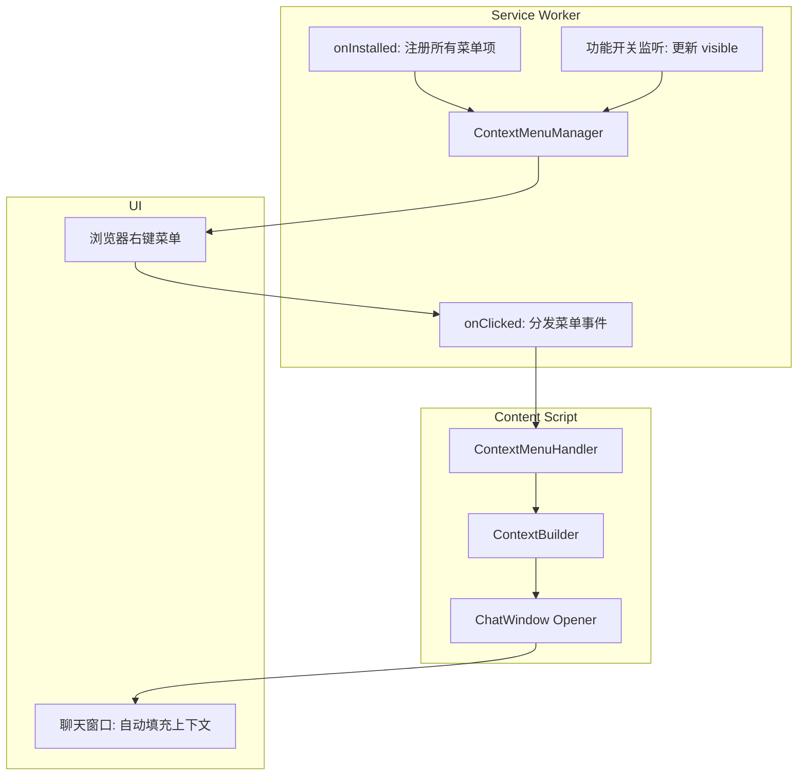
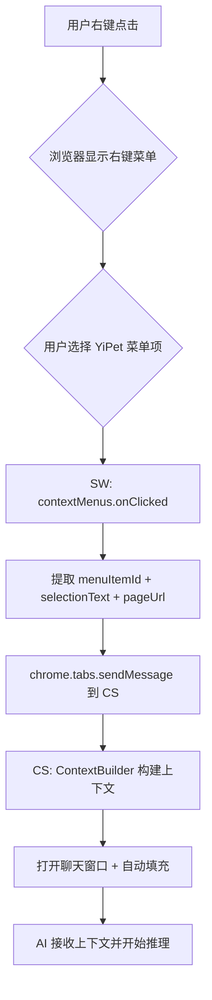

# YP-09-99: 右键菜单集成 — chrome.contextMenus 上下文感知菜单与选中内容交互

> 需求编号：YP-09-99 · 优先级：P2 · 人天：0.5d · 状态：需求已编写
> 依赖：YP-09-97（键盘快捷键系统）

## 背景

### 问题陈述

YiPet 当前的操作入口仅限于宠物形象点击和聊天窗口，用户在浏览网页时遇到需要 AI 辅助的场景（如阅读一段不理解的技术文档、需要翻译外文段落、想总结当前页面内容），必须手动复制文本 → 点击宠物 → 打开聊天 → 粘贴文本 → 输入指令，操作链路长达 5 步。这严重降低了 AI 辅助的效率：

1. **操作链路长**：阅读场景中从"发现问题"到"获得 AI 帮助"需要 5 步操作
2. **上下文丢失**：复制粘贴过程中丢失选中文本的页面上下文（URL、页面标题、选中位置）
3. **功能发现性差**：用户不知道 YiPet 可以针对选中内容提供 AI 辅助
4. **与其他扩展冲突**：右键菜单是有限资源，多个扩展争抢菜单项位置

**核心矛盾**：用户的 AI 辅助需求是上下文感知的（选中文本、选中图片、当前页面），但 YiPet 的操作入口是无上下文的（宠物点击、通用聊天窗口），需要在用户上下文和 AI 功能之间建立最短路径。

### 影响范围

| # | 影响 | 严重程度 | 典型场景 |
|---|------|----------|----------|
| 1 | 阅读场景 AI 辅助效率低 | 高 | 阅读技术文档选中代码段需 5 步才能让 AI 解释 |
| 2 | 翻译场景操作繁琐 | 中 | 选中外文段落 → 复制 → 打开聊天 → 粘贴 → 输入"翻译" |
| 3 | 功能发现性差 | 中 | 用户不知道右键可以使用 YiPet 功能 |
| 4 | 页面上下文丢失 | 中 | 提问时 AI 不知道用户在看什么页面 |
| 5 | 扩展菜单冲突 | 低 | 右键菜单项过多导致用户选择困难 |

### 挑战

| 挑战 | 说明 |
|------|------|
| contextMenus 创建限制 | chrome.contextMenus.create 必须在 SW 中调用，且创建时有性能要求 |
| 上下文感知 | 需根据选中内容类型（文本/图片/链接/页面）动态显示不同菜单项 |
| 菜单项数量限制 | Chrome 对扩展右键菜单项数量有限制（建议不超过 6 个顶层项） |
| 与其他扩展共存 | 多个扩展注册右键菜单，YiPet 菜单项需合理的分组和标签 |
| 选中文本传递 | 大型选中文本（>10KB）通过 chrome.runtime.sendMessage 传递可能超限 |

---

## 一、现状分析

### 1.1 当前右键菜单状态

```
现有右键菜单（零）:
├── chrome.contextMenus          # ❌ 未使用
├── Service Worker 菜单注册      # ❌ 不存在
├── Content Script 右键处理      # ❌ 不存在
└── 页面右键菜单                 # 仅浏览器默认菜单

缺失:
├── 上下文感知菜单项              # ❌ 不存在
├── 菜单项分组和层级              # ❌ 不存在
├── 选中内容传递到聊天            # ❌ 不存在
├── 动态菜单更新                  # ❌ 不存在
└── 功能开关控制菜单项可见性      # ❌ 不存在
```

### 1.2 右键菜单项需求

| 菜单项 | 触发条件 | 选中内容 | 行为 |
|--------|----------|----------|------|
| 询问 YiPet 关于 "[选中文本]" | 文本选中 | 选中文本 | 打开聊天窗口，自动填充上下文 |
| 总结当前页面 | 页面右键 | 页面 URL + 标题 | 打开聊天窗口，请求页面总结 |
| 翻译选中内容 | 文本选中 | 选中文本 | 打开聊天窗口，请求翻译 |
| 解释选中代码 | 文本选中 | 选中文本 | 打开聊天窗口，请求代码解释 |
| 搜索知识库 "[选中文本]" | 文本选中 | 选中文本 | 搜索 YiKnowledge，结果显示在聊天窗口 |
| 朗读选中内容 | 文本选中 | 选中文本 | 使用 TTS 朗读选中文本 |

### 1.3 菜单层级结构

```
YiPet 右键菜单树:
├── YiPet                        # 顶层菜单（parent）
│   ├── 询问 YiPet 关于 "[选中文本]"  # 文本选中时显示
│   ├── 翻译选中内容               # 文本选中时显示
│   ├── 解释选中代码               # 文本选中时显示（仅当内容疑似代码）
│   ├── 搜索知识库 "[选中文本]"    # 文本选中时显示
│   ├── 朗读选中内容               # 文本选中时显示
│   ├── 总结当前页面               # 页面右键时始终显示
│   ├── ─────────────────────     # 分隔线
│   └── 打开 YiPet 聊天窗口        # 始终显示
```

### 1.4 根因矩阵

| 症状 | 根因 | 触发条件 | 频率 |
|------|------|----------|------|
| 操作链路长 | 无右键菜单集成 | 用户需要 AI 辅助阅读 | 高 |
| 上下文丢失 | 未传递页面元数据 | 提问时 AI 不了解页面 | 中 |
| 功能不可发现 | 入口仅限宠物点击 | 新用户/不常用用户 | 高 |
| 翻译/解释效率低 | 需手动复制粘贴 | 阅读外文/技术文档 | 中 |

---

## 二、设计决策

### 决策 1：菜单项注册时机 — 扩展安装时一次性注册 vs 按需动态创建

| 选项 | 性能 | 灵活性 | 复杂度 |
|------|------|--------|--------|
| 安装时一次性注册（onInstalled） | 高（仅一次） | 低（无法动态调整） | 低 |
| 按需动态创建（onClicked 时重建） | 中（每次创建） | 高（完全动态） | 中 |
| 混合：安装时注册 + 功能开关时更新 | 高 | 高 | 中 |

**选择：混合方案。** 扩展安装时（`chrome.runtime.onInstalled`）一次性注册所有菜单项，使用 `documentUrlPatterns` 和 `contexts` 限制显示条件。功能开关变更时（如用户禁用某功能），通过 `chrome.contextMenus.update` 动态更新菜单项的 `visible` 属性，无需重新创建。

### 决策 2：菜单项层级 — 平铺 vs 一级分组 vs 二级分组

| 选项 | 点击步数 | 视觉复杂度 | 扩展兼容性 |
|------|----------|-----------|-----------|
| 平铺（所有项在根菜单） | 1 步 | 高（占满右键菜单） | 好 |
| 一级分组（YiPet 父菜单） | 2 步 | 低（仅 1 个顶层项） | 好 |
| 二级分组（YiPet > 子类别） | 3 步 | 最低 | 部分浏览器不支持 |

**选择：一级分组。** 所有菜单项作为 "YiPet" 顶层菜单的子项，减少对右键菜单的视觉污染。用户只需 2 步（右键 → 选择 YiPet 子项）即可触发操作。Chrome 原生支持 `parentId` 实现菜单分组。

### 决策 3：选中内容传递方式 — sendMessage vs storage vs 直接 URL 参数

| 选项 | 数据量限制 | 延迟 | 安全性 |
|------|-----------|------|--------|
| chrome.runtime.sendMessage | 64MB（MV3） | 极低 | 高 |
| chrome.storage.local | 10MB | 中（异步读写） | 高 |
| 直接 URL 参数 | 无限制 | 低 | 低（URL 可能被记录） |

**选择：chrome.runtime.sendMessage。** Service Worker 的 `contextMenus.onClicked` 事件中包含 `selectionText` 字段（选中的文本），可直接通过 `chrome.tabs.sendMessage` 传递给 Content Script。MV3 中消息大小限制为 64MB，远超任何实际选中文本大小。

### 决策 4：菜单项可见性控制 — 全量注册 + visible 切换 vs 动态创建/删除

| 选项 | 实现复杂度 | 响应速度 | 状态一致性 |
|------|-----------|----------|-----------|
| 全量注册 + visible 切换 | 低 | 快（同步更新） | 高（单一数据源） |
| 动态创建/删除 | 中 | 中（异步 API） | 中（需管理创建/删除状态） |

**选择：全量注册 + visible 切换。** 安装时注册所有可能的菜单项，通过 `chrome.contextMenus.update(id, { visible: true/false })` 控制可见性。减少 API 调用次数，避免创建/删除竞态条件。

### 设计决策记录

| 决策 | 选项 A | 选项 B | 选项 C | 选择 | 理由 |
|------|--------|--------|--------|------|------|
| 注册时机 | 安装时一次性 | 按需动态 | 混合 | **混合** | 性能 + 灵活 |
| 菜单层级 | 平铺 | 一级分组 | 二级分组 | **一级分组** | 减少视觉污染 |
| 内容传递 | sendMessage | storage | URL 参数 | **sendMessage** | 低延迟 + 安全 |
| 可见性控制 | visible 切换 | 动态创建/删除 | — | **visible 切换** | 状态一致性 |

---

## 三、目标架构

### 3.1 右键菜单系统架构



### 3.2 菜单点击事件流



### 3.3 性能指标

| 指标 | 目标值 | 说明 |
|------|--------|------|
| 菜单项注册耗时 | < 10ms | onInstalled 中一次性注册 |
| 菜单项创建数量 | 7 个（1 父 + 6 子） | 含分隔线 |
| 右键菜单显示延迟 | 0ms（浏览器原生） | 注册后浏览器自动管理 |
| 菜单点击到聊天窗口打开 | < 200ms | SW → CS → 打开聊天 |
| 选中文本大小限制 | 64KB | 超出时分段发送 |

---

## 四、具体改动

### 4.1 菜单项类型定义

```typescript
// src/context-menu/types.ts (新增)

export type ContextMenuAction =
  | 'ask-about-selection'
  | 'summarize-page'
  | 'translate-selection'
  | 'explain-code'
  | 'search-knowledge'
  | 'read-aloud-selection'
  | 'open-chat';

export interface ContextMenuItem {
  id: ContextMenuAction;
  parentId?: string;
  title: string;
  contexts: chrome.contextMenus.ContextType[];
  /** 仅当选中文本匹配此模式时显示（如代码检测） */
  visibleWhen?: (selection: ContextMenuEvent) => boolean;
  /** 功能开关 key，用于控制可见性 */
  featureFlag?: string;
}

export interface ContextMenuEvent {
  menuItemId: string;
  selectionText?: string;
  pageUrl: string;
  pageTitle: string;
  /** 选中文本所在元素的标签名 */
  sourceTagName?: string;
  /** 是否为可编辑元素 */
  isEditable: boolean;
}

export interface ContextPayload {
  action: ContextMenuAction;
  selection?: string;
  pageUrl: string;
  pageTitle: string;
  /** 选中文本所在元素类型（用于 AI 上下文） */
  context: {
    source: 'selection' | 'page' | 'link' | 'image';
    sourceTagName?: string;
    surroundingText?: string;
  };
}
```

### 4.2 Service Worker 菜单管理器

```typescript
// src/sw/ContextMenuManager.ts (新增)

import type { ContextMenuItem, ContextMenuEvent } from '../context-menu/types';

const PARENT_MENU_ID = 'yipet-root';

const MENU_ITEMS: ContextMenuItem[] = [
  {
    id: 'ask-about-selection',
    parentId: PARENT_MENU_ID,
    title: '询问 YiPet 关于 "%s"',
    contexts: ['selection'],
  },
  {
    id: 'translate-selection',
    parentId: PARENT_MENU_ID,
    title: '翻译选中内容',
    contexts: ['selection'],
  },
  {
    id: 'explain-code',
    parentId: PARENT_MENU_ID,
    title: '解释选中代码',
    contexts: ['selection'],
    visibleWhen: (event) => {
      // 检测是否为代码：包含 {}、缩进、关键字等
      const text = event.selectionText ?? '';
      return /[{};]|\b(function|const|let|var|class|def|import|export)\b/.test(text);
    },
  },
  {
    id: 'search-knowledge',
    parentId: PARENT_MENU_ID,
    title: '搜索知识库 "%s"',
    contexts: ['selection'],
  },
  {
    id: 'read-aloud-selection',
    parentId: PARENT_MENU_ID,
    title: '朗读选中内容',
    contexts: ['selection'],
  },
  {
    id: 'summarize-page',
    parentId: PARENT_MENU_ID,
    title: '总结当前页面',
    contexts: ['page'],
  },
  {
    id: 'open-chat',
    parentId: PARENT_MENU_ID,
    title: '打开 YiPet 聊天窗口',
    contexts: ['page'],
  },
];

export class ContextMenuManager {
  private initialized = false;

  /** 初始化：注册所有菜单项 */
  async initialize(): Promise<void> {
    if (this.initialized) return;

    // 移除旧菜单项（避免重复注册）
    await this.removeAll();

    // 创建父菜单
    chrome.contextMenus.create({
      id: PARENT_MENU_ID,
      title: 'YiPet',
      contexts: ['selection', 'page', 'link', 'image'],
    });

    // 创建子菜单项
    for (const item of MENU_ITEMS) {
      chrome.contextMenus.create({
        id: item.id,
        parentId: item.parentId,
        title: item.title,
        contexts: item.contexts,
      });
    }

    // 添加分隔线
    chrome.contextMenus.create({
      id: 'yipet-separator',
      parentId: PARENT_MENU_ID,
      type: 'separator',
      contexts: ['selection', 'page', 'link', 'image'],
    });

    this.initialized = true;
  }

  /** 监听菜单点击事件 */
  setupClickListener(): void {
    chrome.contextMenus.onClicked.addListener(async (info, tab) => {
      if (!tab?.id) return;

      const event: ContextMenuEvent = {
        menuItemId: info.menuItemId.toString(),
        selectionText: info.selectionText,
        pageUrl: tab.url ?? '',
        pageTitle: tab.title ?? '',
        isEditable: info.editable ?? false,
      };

      // 发送到 Content Script
      await chrome.tabs.sendMessage(tab.id, {
        type: 'CONTEXT_MENU_CLICKED',
        payload: this.buildPayload(event),
      });

      // 上报事件
      this.reportMenuClick(event.menuItemId, event.pageUrl);
    });
  }

  /** 更新菜单项可见性（功能开关变更时） */
  async updateVisibility(featureFlags: Record<string, boolean>): Promise<void> {
    for (const item of MENU_ITEMS) {
      if (item.featureFlag) {
        const visible = featureFlags[item.featureFlag] ?? true;
        await chrome.contextMenus.update(item.id, { visible });
      }
    }
  }

  /** 移除所有菜单项 */
  private async removeAll(): Promise<void> {
    await chrome.contextMenus.removeAll();
  }

  /** 构建传递给 CS 的上下文载荷 */
  private buildPayload(event: ContextMenuEvent): ContextPayload {
    const action = event.menuItemId as ContextMenuAction;

    return {
      action,
      selection: event.selectionText,
      pageUrl: event.pageUrl,
      pageTitle: event.pageTitle,
      context: {
        source: event.selectionText ? 'selection' : 'page',
        sourceTagName: event.sourceTagName,
      },
    };
  }

  /** 上报菜单点击事件 */
  private reportMenuClick(action: string, pageUrl: string): void {
    // 发送到 analytics（如果启用）
    console.debug(`[ContextMenu] ${action} clicked on ${pageUrl}`);
  }
}
```

### 4.3 Content Script 上下文处理器

```typescript
// src/content/ContextMenuHandler.ts (新增)

import type { ContextPayload } from '../context-menu/types';

export class ContextMenuHandler {
  private chatOpener: ChatWindowOpener;

  constructor(chatOpener: ChatWindowOpener) {
    this.chatOpener = chatOpener;
  }

  /** 处理来自 SW 的右键菜单事件 */
  async handle(payload: ContextPayload): Promise<void> {
    switch (payload.action) {
      case 'ask-about-selection':
        await this.handleAskAboutSelection(payload);
        break;
      case 'summarize-page':
        await this.handleSummarizePage(payload);
        break;
      case 'translate-selection':
        await this.handleTranslateSelection(payload);
        break;
      case 'explain-code':
        await this.handleExplainCode(payload);
        break;
      case 'search-knowledge':
        await this.handleSearchKnowledge(payload);
        break;
      case 'read-aloud-selection':
        await this.handleReadAloudSelection(payload);
        break;
      case 'open-chat':
        await this.handleOpenChat(payload);
        break;
    }
  }

  private async handleAskAboutSelection(payload: ContextPayload): Promise<void> {
    const context = this.buildContextPrompt(payload);
    const prompt = `关于以下内容，请帮我分析：\n\n> ${payload.selection}\n\n页面上下文：${context}`;
    await this.chatOpener.openWithPrompt(prompt);
  }

  private async handleSummarizePage(payload: ContextPayload): Promise<void> {
    // 获取页面主要内容（通过 document.body.innerText 截取前 5000 字符）
    const pageContent = this.extractPageContent();

    const prompt = `请总结以下页面的内容：\n\nURL: ${payload.pageUrl}\n标题: ${payload.pageTitle}\n\n内容摘要:\n${pageContent.slice(0, 5000)}`;
    await this.chatOpener.openWithPrompt(prompt);
  }

  private async handleTranslateSelection(payload: ContextPayload): Promise<void> {
    const prompt = `请将以下内容翻译成中文：\n\n${payload.selection}`;
    await this.chatOpener.openWithPrompt(prompt);
  }

  private async handleExplainCode(payload: ContextPayload): Promise<void> {
    const prompt = `请解释以下代码的功能和逻辑：\n\n\`\`\`\n${payload.selection}\n\`\`\``;
    await this.chatOpener.openWithPrompt(prompt);
  }

  private async handleSearchKnowledge(payload: ContextPayload): Promise<void> {
    const prompt = `在知识库中搜索以下内容的相关信息：${payload.selection}`;
    await this.chatOpener.openWithPrompt(prompt, { useRAG: true });
  }

  private async handleReadAloudSelection(payload: ContextPayload): Promise<void> {
    // 触发 TTS 朗读事件
    window.dispatchEvent(new CustomEvent('yipet:tts:read', {
      detail: { text: payload.selection },
    }));
  }

  private async handleOpenChat(_payload: ContextPayload): Promise<void> {
    await this.chatOpener.open();
  }

  /** 构建 AI 上下文提示 */
  private buildContextPrompt(payload: ContextPayload): string {
    return `[来源: ${payload.pageUrl} | 标题: ${payload.pageTitle}]`;
  }

  /** 提取页面主要内容 */
  private extractPageContent(): string {
    // 优先从 article/main 标签获取内容
    const article = document.querySelector('article') ?? document.querySelector('main');
    if (article) {
      return article.innerText;
    }

    // 否则从 body 获取（排除 script/style 标签）
    const body = document.body.cloneNode(true) as HTMLElement;
    body.querySelectorAll('script, style, nav, footer, header').forEach(el => el.remove());
    return body.innerText;
  }
}
```

### 4.4 聊天窗口上下文填充

```typescript
// src/content/ChatWindowOpener.ts (新增)

export class ChatWindowOpener {
  /** 打开聊天窗口并自动填充 prompt */
  async openWithPrompt(prompt: string, options?: { useRAG?: boolean }): Promise<void> {
    // 确保宠物覆盖层已初始化
    await this.ensureOverlayReady();

    // 打开聊天窗口
    window.dispatchEvent(new CustomEvent('yipet:chat:open', {
      detail: {
        prompt,
        useRAG: options?.useRAG ?? false,
        autoSubmit: true,  // 自动发送消息
      },
    }));
  }

  /** 仅打开聊天窗口（不填充内容） */
  async open(): Promise<void> {
    await this.ensureOverlayReady();
    window.dispatchEvent(new CustomEvent('yipet:chat:open', {
      detail: { autoSubmit: false },
    }));
  }

  private async ensureOverlayReady(): Promise<void> {
    // 等待覆盖层就绪（最多 5 秒）
    const maxWait = 5000;
    const start = Date.now();
    while (!document.querySelector('#yipet-overlay')) {
      if (Date.now() - start > maxWait) {
        throw new Error('YiPet overlay not ready');
      }
      await new Promise(resolve => setTimeout(resolve, 100));
    }
  }
}
```

### 4.5 Service Worker 入口注册

```typescript
// src/sw/index.ts (修改)

import { ContextMenuManager } from './ContextMenuManager';

const contextMenuManager = new ContextMenuManager();

// 扩展安装时注册菜单
chrome.runtime.onInstalled.addListener(async () => {
  await contextMenuManager.initialize();
  contextMenuManager.setupClickListener();
});

// 启动时也注册（处理 SW 重启的情况）
contextMenuManager.initialize().then(() => {
  contextMenuManager.setupClickListener();
});

// 监听消息：Content Script 请求更新菜单可见性
chrome.runtime.onMessage.addListener((message, _sender, sendResponse) => {
  if (message.type === 'UPDATE_CONTEXT_MENU_VISIBILITY') {
    contextMenuManager.updateVisibility(message.featureFlags);
    sendResponse({ success: true });
  }
  return true;
});
```

### 4.6 文件变更清单

| 文件 | 操作 | 说明 |
|------|------|------|
| `src/context-menu/types.ts` | 新增 | 菜单项类型定义 |
| `src/sw/ContextMenuManager.ts` | 新增 | SW 菜单管理器 |
| `src/content/ContextMenuHandler.ts` | 新增 | CS 上下文处理器 |
| `src/content/ChatWindowOpener.ts` | 新增 | 聊天窗口打开器 |
| `src/sw/index.ts` | 修改 | 注册 ContextMenuManager |
| `src/content/index.ts` | 修改 | 注册 ContextMenuHandler |
| `manifest.json` | 修改 | 声明 contextMenus 权限 |
| `src/content/message-router.ts` | 修改 | 添加 CONTEXT_MENU_CLICKED 消息路由 |

---

## 五、实施步骤

| 步骤 | 操作 | 路径 | 验证 | 人天 |
|------|------|------|------|------|
| 1 | 定义菜单项类型和接口 | `src/context-menu/types.ts` | 类型检查通过 | 0.02 |
| 2 | 实现 ContextMenuManager（SW 侧） | `src/sw/ContextMenuManager.ts` | 菜单项注册成功 | 0.08 |
| 3 | 实现 ContextMenuHandler（CS 侧） | `src/content/ContextMenuHandler.ts` | 菜单点击触发聊天窗口 | 0.08 |
| 4 | 实现 ChatWindowOpener | `src/content/ChatWindowOpener.ts` | 聊天窗口自动填充上下文 | 0.05 |
| 5 | 注册 onInstalled 和 onClicked 监听 | `src/sw/index.ts` | 扩展安装后菜单显示 | 0.03 |
| 6 | 实现菜单可见性动态更新 | `src/sw/ContextMenuManager.ts` | 功能开关切换菜单可见性 | 0.05 |
| 7 | 实现代码检测逻辑（explain-code 可见性） | `src/context-menu/code-detector.ts` | 选中代码时菜单项显示 | 0.03 |
| 8 | 添加 contextMenus 权限 | `manifest.json` | 权限声明正确 | 0.01 |
| 9 | 集成到 Content Script 消息路由 | `src/content/message-router.ts` | 消息正确路由 | 0.03 |
| 10 | 编写单元测试 | `tests/unit/context-menu/` | 覆盖菜单注册、事件分发、上下文构建 | 0.05 |
| 11 | 手动测试冲突场景（与其他扩展） | — | 菜单项共存无异常 | 0.02 |

**总人天：0.5d**

---

## 六、测试规格

### 场景 1：选中文本后右键询问 YiPet

**GIVEN** 用户在任意页面中选中一段文本 "什么是闭包"
**WHEN** 用户右键点击，在 YiPet 子菜单中选择 "询问 YiPet 关于 '什么是闭包'"
**THEN** 应打开聊天窗口
**AND** 聊天输入框应自动填充 "关于以下内容，请帮我分析：\n\n> 什么是闭包\n\n页面上下文：[URL | 标题]"
**AND** 消息应自动发送

### 场景 2：页面右键总结

**GIVEN** 用户在任意页面未选中文本
**WHEN** 用户右键点击，在 YiPet 子菜单中选择 "总结当前页面"
**THEN** 应提取页面 main/article 内容（前 5000 字符）
**AND** 聊天窗口应自动填充总结请求（含 URL 和页面标题）
**AND** 应排除 script/style/nav/footer 等非内容元素

### 场景 3：选中代码时解释代码菜单项可见

**GIVEN** 用户选中一段代码 `function add(a, b) { return a + b; }`
**WHEN** 用户右键点击
**THEN** YiPet 子菜单中应包含 "解释选中代码" 菜单项
**AND** 若用户选中普通文本（不含代码特征），该菜单项应隐藏

### 场景 4：选中文本后右键翻译

**GIVEN** 用户选中一段英文文本 "The quick brown fox jumps over the lazy dog"
**WHEN** 用户右键选择 "翻译选中内容"
**THEN** 聊天窗口应自动填充 "请将以下内容翻译成中文：\n\nThe quick brown fox..."
**AND** 消息应自动发送

### 场景 5：功能开关控制菜单项可见性

**GIVEN** 用户在设置中禁用了 "朗读" 功能
**WHEN** Content Script 发送 UPDATE_CONTEXT_MENU_VISIBILITY 消息
**THEN** "朗读选中内容" 菜单项应隐藏
**AND** 其他菜单项不受影响
**AND** 重新启用功能后菜单项应恢复可见

### 场景 6：不带选中文本的右键菜单

**GIVEN** 用户在页面空白处右键（未选中任何文本）
**WHEN** 右键菜单打开
**THEN** YiPet 子菜单中应仅显示 "总结当前页面" 和 "打开 YiPet 聊天窗口"
**AND** 与选中文本相关的菜单项（询问/翻译/解释/搜索/朗读）应隐藏

---

## 七、风险与缓解

| 风险 | 概率 | 影响 | 缓解措施 |
|------|------|------|----------|
| contextMenus API 权限被用户拒绝 | 低 | 高 | 安装时检测权限，若无权限则降级为仅宠物点击入口 |
| 菜单项过多导致右键菜单臃肿 | 中 | 中 | 一级分组（YiPet 父菜单）仅占 1 个顶层位置 |
| 大型选中文本跨消息传递超限 | 低 | 低 | 超过 64KB 时分段发送或截断（截断时提示用户） |
| 与其他扩展菜单项冲突 | 低 | 低 | 使用唯一 parentId 前缀 `yipet-*`，避免命名冲突 |
| 页面内容提取失败（Shadow DOM/CSP） | 中 | 中 | 多级降级：article → main → body → 仅 URL+标题 |

---

## 八、回滚策略

| 场景 | 回滚操作 | 影响 |
|------|----------|------|
| 右键菜单注册失败导致扩展崩溃 | 在 SW 中 try-catch，失败时跳过菜单注册 | 失去右键菜单功能 |
| 菜单项导致浏览器右键菜单加载缓慢 | 移除所有 contextMenus，仅保留宠物点击入口 | 回到原始交互方式 |
| 选中文本传递失败 | 降级为仅打开聊天窗口（不填充上下文） | 用户需手动粘贴 |
| 与其他扩展严重冲突 | 添加用户选项完全禁用右键菜单 | 用户可关闭该功能 |

---

## 九、设计决策记录

### D-01：父菜单 ID 命名策略

- **问题**：父菜单 ID 如何命名以避免与其他扩展冲突
- **选项**：使用简短 ID（如 `root`）、使用带前缀 ID（如 `yipet-root`）、使用 UUID
- **选择**：`yipet-root`（带应用前缀）
- **理由**：Chrome 扩展的 contextMenus ID 在同一扩展内唯一即可，但带前缀有助于调试时区分。UUID 过于冗长且不便于日志查看。

### D-02：选中文本大小截断阈值

- **问题**：选中文本超过多少字符时截断
- **选项**：不截断、5000 字符、10000 字符、64KB
- **选择**：10000 字符（约 20KB）
- **理由**：大多数 LLM 上下文窗口足够处理 10000 字符的选中文本。超过此阈值时在聊天输入框中显示 "[内容过长，已截断至前 10000 字符]"，由用户决定是否发送。

### D-03：代码检测逻辑的精确度

- **问题**：代码检测应多精确（宁可误显示还是宁可漏显示）
- **选项**：高精确度（宁可漏显示）、高召回率（宁可误显示）、平衡
- **选择**：高召回率（宁可误显示）
- **理由**："解释选中代码" 菜单项在非代码选中时显示不会造成严重问题（AI 会告知这不是代码），但代码选中时漏显示则会失去功能价值。误显示的成本远低于漏显示。

### D-04：菜单项标题中的动态文本

- **问题**：菜单项标题是否包含选中文本的截断（如 "询问 YiPet 关于 '什么是闭包...' "）
- **选项**：使用 chrome 的 `%s` 占位符、静态标题、JS 动态更新标题
- **选择**：使用 `%s` 占位符（chrome.contextMenus 原生支持）
- **理由**：`%s` 是 Chrome 原生支持的选中文本占位符，自动截断为合理长度。无需在每次右键时调用 `chrome.contextMenus.update` 更新标题，性能最优。

---

## 十、可观测性

### 指标

| 指标 | 类型 | 说明 |
|------|------|------|
| `yipet.context_menu.click_total` | Counter | 右键菜单点击总次数（按 action 分组） |
| `yipet.context_menu.registration_success` | Gauge | 菜单注册是否成功（1/0） |
| `yipet.context_menu.chat_open_duration_ms` | Histogram | 从菜单点击到聊天窗口打开的耗时 |
| `yipet.context_menu.selection_size_bytes` | Histogram | 选中文本大小分布 |
| `yipet.context_menu.action_distribution` | Counter | 各菜单项点击分布 |

### 告警

| 告警 | 条件 | 级别 |
|------|------|------|
| 菜单注册失败 | onInstalled 中 create 抛出异常 | ERROR |
| 菜单点击后聊天窗口未打开 | 超时 5s | WARNING |
| 菜单项点击率极低 | 日活用户中 < 1% 使用右键菜单 | INFO |

---

## 十一、代码审查检查清单

- [ ] contextMenus 权限在 manifest.json 中声明
- [ ] 菜单项在 onInstalled 中注册，支持 SW 重启恢复
- [ ] 父菜单 ID 使用 `yipet-root` 前缀避免冲突
- [ ] 菜单项标题使用 `%s` 占位符显示选中文本
- [ ] 选中文本相关菜单项仅在 `contexts: ['selection']` 时显示
- [ ] 页面相关菜单项仅在 `contexts: ['page']` 时显示
- [ ] 代码检测逻辑正确判断代码特征
- [ ] 大型选中文本（>10KB）被截断并提示用户
- [ ] 页面内容提取排除 script/style/nav/footer 等元素
- [ ] 聊天窗口打开前检查覆盖层是否就绪
- [ ] 功能开关变更时菜单可见性正确更新
- [ ] 菜单点击事件正确上报

---

## 回归问题预测

| # | 预测问题 | 原因 | 验证方法 |
|---|---------|------|---------|
| 1 | chrome.contextMenus.create 在 Service Worker 首次启动时被调用，但 SW 在 `onInstalled` 之前就被终止，导致菜单项未注册 | SW 在空闲 30 秒后被终止，重启时 `onInstalled` 不会触发（仅安装/更新时触发），菜单项需要在 SW 每次启动时注册 | 在 SW 顶层代码中直接调用 `initialize()` 而非仅在 `onInstalled` 中调用，确保每次 SW 启动都注册菜单 |
| 2 | `chrome.contextMenus.create` 的 `title` 参数使用 `%s` 占位符，但 Chrome 在某些地区语言版本中 `%s` 替换行为不一致，中文占位符显示异常 | Chrome 的 `%s` 替换使用字符串直接替换，中文选中文本与标题中的中文字符拼接时可能产生编码问题 | 在中文 Windows/macOS Chrome 中测试右键菜单标题显示，确保选中文本正确显示 |
| 3 | `document.body.cloneNode(true)` 在包含大量 DOM 的页面（如 Twitter/X 时间线）中导致内存飙升，CS 主线程阻塞，用户体验卡顿 | cloneNode 是同步操作，大型页面（DOM 节点 > 10000）的深拷贝可能在主线程中执行 100ms+，阻塞 CS 的所有事件处理 | 在大型 SPA 页面（Twitter/X 100+ 条推文）中触发 "总结当前页面"，监控主线程阻塞时间，若 > 50ms 则改用 textContent 直接提取 |
| 4 | 右键菜单项在 Chrome 的 `chrome://` 和 `chrome-extension://` 页面上仍然显示，但 `chrome.tabs.sendMessage` 无法发送到这些页面，点击后无响应 | Chrome 禁止在 chrome:// 页面注入 Content Script，但 `contextMenus` 的 `contexts` 没有 `excludePages` 选项，菜单项仍会显示 | 使用 `documentUrlPatterns` 排除 `chrome://*/*` 和 `chrome-extension://*/*`，确保菜单项仅在实际可注入的页面显示 |
| 5 | `ContextMenuHandler` 中的 `chatOpener.openWithPrompt()` 使用 `CustomEvent` 在 DOM 上派发，但聊天窗口组件可能尚未挂载，事件监听器缺失，prompt 丢失 | 聊天窗口是懒加载的（用户首次点击宠物才挂载），右键菜单可能在聊天窗口挂载前触发，`yipet:chat:open` 事件在 DOM 上派发但无人监听 | 在 `ChatWindowOpener` 中实现事件队列：若聊天窗口未就绪，先将 prompt 存入队列，聊天窗口挂载后消费队列中的事件 |
| 6 | 多个浏览器标签页同时打开时，SW 的 `contextMenus.onClicked` 使用 `chrome.tabs.sendMessage` 发送到当前标签页，但在某些情况下 `tab.id` 指向错误的标签页 | `contextMenus.onClicked` 的 `tab` 参数来自右键点击的标签页，但在某些 Chrome 版本中，若用户快速切换标签页，`tab` 参数可能指向切换后的标签页 | 在 `onClicked` 中使用 `info.frameId` 和 `tab.id` 联合验证，发送前检查 `chrome.tabs.get(tab.id)` 确认标签页存在且 URL 匹配 |

---

## 性能分析

### 右键菜单操作各阶段耗时

| 阶段 | 预估耗时 | 说明 |
|------|----------|------|
| 菜单项注册（onInstalled） | < 10ms | 8 个 contextMenus.create 调用 |
| 右键菜单显示 | 0ms | 浏览器原生渲染，无需扩展参与 |
| onClicked → sendMessage | < 5ms | SW 中消息发送 |
| CS 接收消息 → 构建上下文 | < 5ms | 字符串拼接 |
| 聊天窗口打开 | < 100ms | DOM 渲染 + Vue 组件挂载 |
| 页面内容提取（总结页面） | < 50ms | 提取 article/main 内容 |
| **总计** | **~170ms** | 从点击到聊天窗口就绪 |

### 文件体积预估

| 文件 | 大小 | 说明 |
|------|------|------|
| `src/context-menu/types.ts` | ~1KB | 类型定义 |
| `src/sw/ContextMenuManager.ts` | ~3KB | 菜单管理器 |
| `src/content/ContextMenuHandler.ts` | ~3KB | 上下文处理器 |
| `src/content/ChatWindowOpener.ts` | ~1.5KB | 聊天窗口打开器 |
| `src/context-menu/code-detector.ts` | ~1KB | 代码检测逻辑 |
| `manifest.json` (修改) | +0.1KB | contextMenus 权限 |