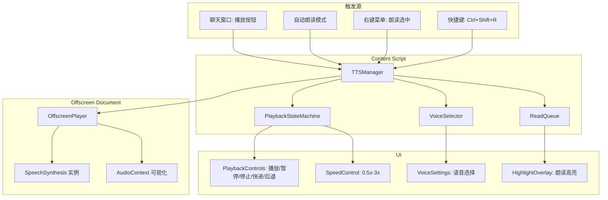
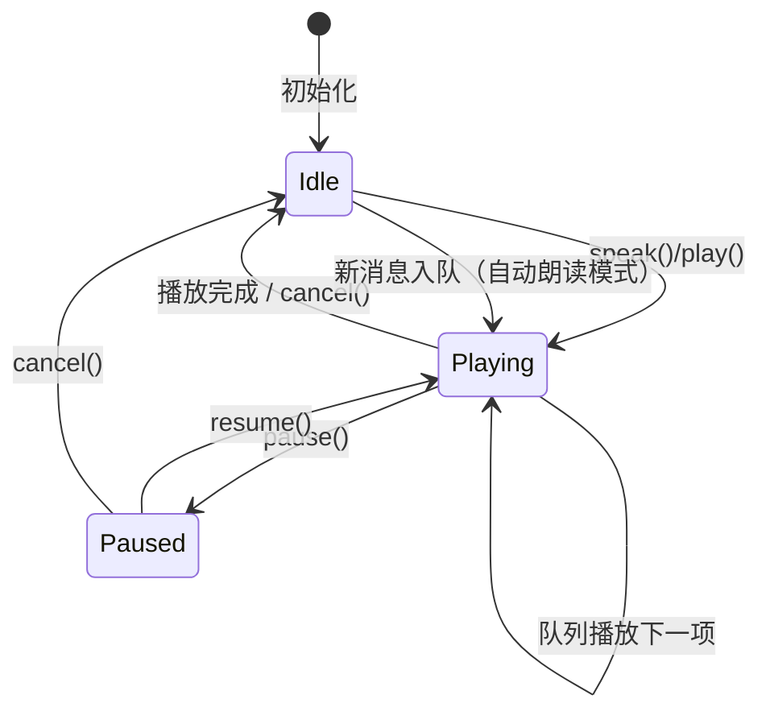

# YP-09-100: 文本转语音与朗读 — Web Speech API 集成、播放控制与后台朗读

> 需求编号：YP-09-100 · 优先级：P2 · 人天：1.0d · 状态：需求已编写
> 依赖：YP-09-97（键盘快捷键系统）、YP-09-99（右键菜单集成）

## 背景

### 问题陈述

YiPet 的 AI 对话交互完全依赖文本阅读，用户必须逐字阅读 AI 的长回复。对于长文本回复、多任务场景（如边写代码边看 AI 回复）、视障用户或阅读疲劳用户，这严重限制了使用体验：

1. **阅读负担重**：AI 回复可能长达数百字，纯文本阅读在移动/多任务场景中体验差
2. **可访问性缺失**：视障用户、阅读障碍用户无法有效使用 AI 对话功能
3. **多任务效率低**：用户无法在阅读 AI 回复的同时进行其他操作（如编码、浏览）
4. **页面内容朗读无入口**：用户想听网页内容时需借助其他工具或浏览器自带朗读

**核心矛盾**：Web Speech API 的 SpeechSynthesis 在 Chrome 中可用但功能有限（无暂停/恢复、队列管理弱），且 Firefox 完全不支持 SpeechSynthesis。同时 Chrome 扩展的 Service Worker 生命周期短，无法在后台持续朗读。

### 影响范围

| # | 影响 | 严重程度 | 典型场景 |
|---|------|----------|----------|
| 1 | 长 AI 回复阅读负担 | 高 | AI 回复 500 字，用户需逐字阅读 |
| 2 | 视障/阅读障碍用户无法使用 | 高 | 依赖屏幕阅读器的用户 |
| 3 | 多任务场景效率低 | 中 | 开发者边写代码边等待 AI 回复 |
| 4 | 网页内容朗读无入口 | 中 | 用户想听长文章但需切换工具 |
| 5 | 无后台朗读支持 | 中 | 关闭 popup 后朗读停止 |

### 挑战

| 挑战 | 说明 |
|------|------|
| SpeechSynthesis 限制 | 无内置暂停/恢复，需通过 cancel + 重新 speak 模拟 |
| Firefox 不支持 | Firefox 无 SpeechSynthesis，需要 fallback 方案 |
| 语音选择 | 系统语音因操作系统和语言包而异，需匹配内容语言 |
| Service Worker 朗读 | SW 生命周期短，无法持续朗读，需 Offscreen API |
| 队列管理 | 多条消息排队朗读，需管理队列状态和播放顺序 |
| 跨语言 | AI 回复可能包含英文术语，中文语音朗读英文效果差 |

---

## 一、现状分析

### 1.1 当前 TTS 状态

```
现有 TTS 功能（零）:
├── SpeechSynthesis               # ❌ 未使用
├── 语音播放控制                   # ❌ 不存在
├── AI 回复朗读                    # ❌ 不存在
├── 页面内容朗读                   # ❌ 不存在
├── 后台朗读                       # ❌ 不存在
└── 音频可视化                     # ❌ 不存在

缺失:
├── TTSManager: 朗读生命周期管理   # ❌ 不存在
├── PlaybackControls: 播放控制 UI  # ❌ 不存在
├── VoiceSelector: 语音选择器      # ❌ 不存在
├── ReadQueue: 消息队列管理        # ❌ 不存在
├── AutoRead: 自动朗读模式         # ❌ 不存在
├── OffscreenPlayer: 后台朗读      # ❌ 不存在
└── TTSHighlight: 朗读高亮同步     # ❌ 不存在
```

### 1.2 Web Speech API 能力矩阵

| 功能 | Chrome | Edge | Firefox | Safari |
|------|--------|------|---------|--------|
| SpeechSynthesis.speak() | 支持 | 支持 | 不支持 | 支持 |
| SpeechSynthesis.pause() | 支持 | 支持 | — | 支持 |
| SpeechSynthesis.resume() | 支持 | 支持 | — | 支持 |
| SpeechSynthesis.cancel() | 支持 | 支持 | — | 支持 |
| SpeechSynthesis.getVoices() | 异步加载 | 异步加载 | — | 异步加载 |
| onboundary 事件 | 支持 | 支持 | — | 支持 |
| lang 属性匹配 | 支持 | 支持 | — | 支持 |
| rate 控制 | 0.1-10 | 0.1-10 | — | 0.1-10 |

### 1.3 朗读功能需求矩阵

| 功能 | 触发方式 | 朗读内容 | 说明 |
|------|----------|----------|------|
| 朗读 AI 回复 | 消息旁播放按钮 | 最后一条 AI 消息 | 手动触发 |
| 自动朗读 | 设置开关 | 每条新 AI 回复 | 自动模式 |
| 朗读选中文本 | 右键菜单 | 页面选中文本 | 与 YP-09-99 集成 |
| 朗读当前消息 | 快捷键 Ctrl+Shift+R | 当前 AI 消息 | 与 YP-09-97 集成 |
| 后台朗读 | 自动续读 | 队列中的消息 | 关闭 popup 后继续 |

### 1.4 根因矩阵

| 症状 | 根因 | 触发条件 | 频率 |
|------|------|----------|------|
| 无法听 AI 回复 | 未集成 SpeechSynthesis | 用户想听而非读 | 中 |
| 长文本阅读疲劳 | 无语音输出 | AI 回复 > 500 字 | 高 |
| 多任务中断 | 必须盯着屏幕阅读 | 编码/浏览时 | 高 |
| 无法朗读页面 | 右键菜单无朗读选项 | 阅读长文章 | 中 |
| 关闭 popup 后朗读停止 | 无 Offscreen 后台朗读 | 关闭 popup 窗口 | 中 |

---

## 二、设计决策

### 决策 1：TTS 引擎选择 — Web Speech API vs 服务端 TTS vs 第三方 API

| 选项 | 延迟 | 离线支持 | 成本 | 语音质量 |
|------|------|----------|------|----------|
| Web Speech API (SpeechSynthesis) | 极低（本地） | 部分（依赖系统语音） | 免费 | 系统语音质量 |
| 服务端 TTS（YiAi 集成） | 高（网络） | 否 | 需 GPU | 高（可定制） |
| 第三方 API（Google/Azure TTS） | 中 | 否 | 付费 | 最高 |

**选择：Web Speech API（SpeechSynthesis）为主，服务端 TTS 为可选增强。** SpeechSynthesis 在 Chrome 中可用，零延迟，零成本，离线可用。服务端 TTS 作为可选增强（通过 YiAi 的 `/tts` 端点），用户可在设置中选择使用服务端高质量语音。

### 决策 2：暂停/恢复实现 — 原生 pause/resume vs cancel + 重新 speak vs 自定义 AudioBuffer

| 选项 | 准确性 | 实现复杂度 | 兼容性 |
|------|--------|-----------|--------|
| 原生 pause/resume | 高 | 低 | Chrome 仅 |
| cancel + 重新 speak（记录位置） | 中（边界对齐） | 中 | 所有支持 SpeechSynthesis 的浏览器 |
| 自定义 AudioBuffer（服务端生成） | 最高 | 高 | 所有浏览器 |

**选择：原生 pause/resume 为主，cancel + 重新 speak 为 fallback。** Chrome 原生支持 `pause()` 和 `resume()`，优先使用。对于不支持原生 pause 的浏览器，使用 `onboundary` 事件记录播放位置，`cancel()` 后从记录位置重新 `speak()`。

### 决策 3：后台朗读方案 — Offscreen API vs 长连接 Service Worker vs Content Script 持续运行

| 选项 | 持久性 | 音频输出 | 实现复杂度 |
|------|--------|----------|-----------|
| Offscreen API | 高（独立文档） | 支持 | 中 |
| 长连接 SW | 低（30s 超时） | 不支持 | 高 |
| Content Script 持续运行 | 中（页面关闭则停止） | 支持 | 低 |

**选择：Offscreen API。** Chrome MV3 的 Offscreen API 允许创建一个隐藏的后台文档，该文档可以访问 DOM API（包括 SpeechSynthesis），且不会因 SW 终止而停止。Content Script 作为 fallback（当 Offscreen API 不可用时）。

### 决策 4：语音选择策略 — 自动匹配 vs 手动选择 vs 混合

| 选项 | 用户体验 | 实现复杂度 | 准确度 |
|------|----------|-----------|--------|
| 自动匹配（根据内容语言） | 高（零配置） | 中 | 中（可能误匹配） |
| 手动选择（用户选择语音） | 中（需配置） | 低 | 高（用户意图） |
| 混合（自动匹配 + 用户可覆盖） | 高 | 中 | 高 |

**选择：混合方案。** 默认自动匹配：检测消息内容语言（中文/英文/日文），选择系统对应语言的第一个语音。用户可在设置中手动选择偏好语音，覆盖自动匹配。

### 设计决策记录

| 决策 | 选项 A | 选项 B | 选项 C | 选择 | 理由 |
|------|--------|--------|--------|------|------|
| TTS 引擎 | Web Speech API | 服务端 TTS | 第三方 API | **Web Speech API** | 零延迟 + 免费 |
| 暂停/恢复 | 原生 pause | cancel+speak | AudioBuffer | **原生 pause** | 最高准确度 |
| 后台朗读 | Offscreen API | 长连接 SW | CS 持续运行 | **Offscreen API** | 独立生命周期 |
| 语音选择 | 自动匹配 | 手动选择 | 混合 | **混合** | 零配置 + 灵活 |

---

## 三、目标架构

### 3.1 TTS 系统架构



### 3.2 播放状态机



### 3.3 性能指标

| 指标 | 目标值 | 说明 |
|------|--------|------|
| speak() 调用到开始播放 | < 100ms | SpeechSynthesis 启动延迟 |
| 语音加载（getVoices） | < 500ms | 首次异步加载系统语音列表 |
| 暂停/恢复响应 | < 50ms | 原生 pause/resume |
| 队列切换延迟 | < 100ms | 当前项结束到下一项开始 |
| Offscreen 文档创建 | < 200ms | 创建后台文档并加载 |
| 内存占用（空闲） | < 1MB | TTSManager 实例 |
| 内存占用（播放中） | < 5MB | 含 AudioContext |

---

## 四、具体改动

### 4.1 TTS 类型定义

```typescript
// src/tts/types.ts (新增)

export type PlaybackState = 'idle' | 'playing' | 'paused';

export type TTSProvider = 'web-speech' | 'server';

export interface TTSOptions {
  /** 语音提供商 */
  provider: TTSProvider;
  /** 语音 URI（Web Speech 的 voiceURI） */
  voiceURI?: string;
  /** 语速：0.5-3.0 */
  rate: number;
  /** 音调：0.5-2.0 */
  pitch: number;
  /** 音量：0-1 */
  volume: number;
  /** 目标语言（用于自动选择语音） */
  lang?: string;
}

export interface ReadQueueItem {
  id: string;
  text: string;
  /** 来源：ai-message | page-selection | user-message */
  source: 'ai-message' | 'page-selection' | 'user-message';
  /** 消息语言（用于语音匹配） */
  lang?: string;
  /** 关联的 DOM 元素（用于高亮） */
  elementSelector?: string;
  /** 入队时间 */
  enqueuedAt: number;
}

export interface PlaybackProgress {
  itemId: string;
  charIndex: number;
  charLength: number;
  elapsedMs: number;
}

export interface VoiceInfo {
  voiceURI: string;
  name: string;
  lang: string;
  default: boolean;
  localService: boolean;
}

export interface TTSState {
  playbackState: PlaybackState;
  currentItem: ReadQueueItem | null;
  queue: ReadQueueItem[];
  options: TTSOptions;
  availableVoices: VoiceInfo[];
  autoRead: boolean;
  lastProgress: PlaybackProgress | null;
}
```

### 4.2 TTS 管理器

```typescript
// src/tts/TTSManager.ts (新增)

import type {
  TTSOptions, ReadQueueItem, PlaybackState,
  PlaybackProgress, VoiceInfo, TTSState, TTSProvider,
} from './types';

export class TTSManager {
  private state: TTSState;
  private synthesis: SpeechSynthesis;
  private currentUtterance: SpeechSynthesisUtterance | null = null;
  private boundaryPosition: number = 0;
  private listeners: Map<string, Set<Function>> = new Map();

  constructor() {
    this.synthesis = window.speechSynthesis;
    this.state = {
      playbackState: 'idle',
      currentItem: null,
      queue: [],
      options: {
        provider: 'web-speech',
        rate: 1.0,
        pitch: 1.0,
        volume: 1.0,
        lang: 'zh-CN',
      },
      availableVoices: [],
      autoRead: false,
      lastProgress: null,
    };

    this.loadVoices();
  }

  /** 加载系统语音列表 */
  private loadVoices(): void {
    const voices = this.synthesis.getVoices();
    if (voices.length > 0) {
      this.state.availableVoices = voices.map(v => ({
        voiceURI: v.voiceURI,
        name: v.name,
        lang: v.lang,
        default: v.default,
        localService: v.localService,
      }));
    }

    // 语音列表异步加载（Chrome 行为）
    this.synthesis.onvoiceschanged = () => {
      const updatedVoices = this.synthesis.getVoices();
      this.state.availableVoices = updatedVoices.map(v => ({
        voiceURI: v.voiceURI,
        name: v.name,
        lang: v.lang,
        default: v.default,
        localService: v.localService,
      }));
      this.emit('voices-changed', this.state.availableVoices);
    };
  }

  /** 朗读文本（立即播放，清空队列） */
  speak(item: ReadQueueItem): void {
    this.stop();
    this.state.currentItem = item;
    this.state.playbackState = 'playing';
    this.boundaryPosition = 0;
    this.speakItem(item);
  }

  /** 加入播放队列 */
  enqueue(item: ReadQueueItem): void {
    this.state.queue.push(item);
    this.emit('queue-updated', this.state.queue);

    // 如果当前未播放，立即开始
    if (this.state.playbackState === 'idle') {
      this.playNextInQueue();
    }
  }

  /** 播放队列中的下一项 */
  private playNextInQueue(): void {
    const next = this.state.queue.shift();
    if (next) {
      this.speak(next);
    } else {
      this.state.playbackState = 'idle';
      this.state.currentItem = null;
      this.emit('queue-empty');
    }
  }

  /** 暂停播放 */
  pause(): void {
    if (this.state.playbackState !== 'playing') return;

    if (typeof this.synthesis.pause === 'function') {
      this.synthesis.pause();
      this.state.playbackState = 'paused';
      this.emit('state-changed', this.state);
    }
  }

  /** 恢复播放 */
  resume(): void {
    if (this.state.playbackState !== 'paused') return;

    if (typeof this.synthesis.resume === 'function') {
      this.synthesis.resume();
      this.state.playbackState = 'playing';
      this.emit('state-changed', this.state);
    }
  }

  /** 停止播放并清空队列 */
  stop(): void {
    this.synthesis.cancel();
    this.state.playbackState = 'idle';
    this.state.currentItem = null;
    this.state.queue = [];
    this.currentUtterance = null;
    this.boundaryPosition = 0;
    this.emit('state-changed', this.state);
    this.emit('queue-updated', []);
  }

  /** 跳转到下一条（队列中） */
  skipForward(): void {
    this.synthesis.cancel();
    this.playNextInQueue();
  }

  /** 快进 10 秒 */
  skipForward10s(): void {
    // 通过 cancel + 从 boundaryPosition + 估算字符数重新 speak
    this.seekRelative(10);
  }

  /** 后退 10 秒 */
  skipBackward10s(): void {
    this.seekRelative(-10);
  }

  private seekRelative(seconds: number): void {
    if (!this.state.currentItem || !this.state.lastProgress) return;

    const rate = this.state.options.rate;
    // 估算：中文约 3 字/秒，英文约 12 字符/秒
    const charsPerSecond = this.state.options.lang?.startsWith('zh') ? 3 : 12;
    const charDelta = Math.round(seconds * charsPerSecond * rate);
    const newPosition = Math.max(0, this.boundaryPosition + charDelta);

    this.boundaryPosition = newPosition;
    this.synthesis.cancel();

    const text = this.state.currentItem.text.slice(newPosition);
    this.speakItem({ ...this.state.currentItem, text });
  }

  /** 设置语速 */
  setRate(rate: number): void {
    this.state.options.rate = Math.max(0.5, Math.min(3.0, rate));
    this.emit('options-changed', this.state.options);
  }

  /** 设置语音 */
  setVoice(voiceURI: string): void {
    this.state.options.voiceURI = voiceURI;
    this.emit('options-changed', this.state.options);
  }

  /** 切换自动朗读模式 */
  toggleAutoRead(): boolean {
    this.state.autoRead = !this.state.autoRead;
    this.emit('auto-read-changed', this.state.autoRead);
    return this.state.autoRead;
  }

  /** 获取当前状态 */
  getState(): Readonly<TTSState> {
    return this.state;
  }

  /** 检测语言并匹配合适的语音 */
  detectLanguageAndSelectVoice(text: string): VoiceInfo | null {
    // 简单的语言检测
    const hasChinese = /[\u4e00-\u9fff]/.test(text);
    const hasJapanese = /[\u3040-\u309f\u30a0-\u30ff]/.test(text);
    const hasKorean = /[\uac00-\ud7af]/.test(text);

    let targetLang = 'en-US';
    if (hasChinese) targetLang = 'zh-CN';
    else if (hasJapanese) targetLang = 'ja-JP';
    else if (hasKorean) targetLang = 'ko-KR';

    // 查找匹配语言的语音
    const matchedVoice = this.state.availableVoices.find(
      v => v.lang.startsWith(targetLang.split('-')[0]) && v.localService
    );

    if (matchedVoice) {
      this.state.options.voiceURI = matchedVoice.voiceURI;
      this.state.options.lang = targetLang;
    }

    return matchedVoice ?? null;
  }

  /** 核心朗读实现 */
  private speakItem(item: ReadQueueItem): void {
    const utterance = new SpeechSynthesisUtterance(item.text);
    this.currentUtterance = utterance;

    // 设置语音参数
    utterance.rate = this.state.options.rate;
    utterance.pitch = this.state.options.pitch;
    utterance.volume = this.state.options.volume;

    // 选择语音
    if (this.state.options.voiceURI) {
      const voice = this.synthesis.getVoices().find(
        v => v.voiceURI === this.state.options.voiceURI
      );
      if (voice) utterance.voice = voice;
    } else {
      // 自动检测语言并选择语音
      this.detectLanguageAndSelectVoice(item.text);
      const voice = this.synthesis.getVoices().find(
        v => v.voiceURI === this.state.options.voiceURI
      );
      if (voice) utterance.voice = voice;
    }

    utterance.lang = this.state.options.lang ?? 'zh-CN';

    // 边界事件：用于高亮同步
    utterance.onboundary = (event) => {
      this.boundaryPosition = event.charIndex;
      this.state.lastProgress = {
        itemId: item.id,
        charIndex: event.charIndex,
        charLength: item.text.length,
        elapsedMs: event.elapsedTime,
      };
      this.emit('progress', this.state.lastProgress);
    };

    // 播放结束
    utterance.onend = () => {
      this.emit('item-ended', item);
      this.playNextInQueue();
    };

    // 播放错误
    utterance.onerror = (event) => {
      console.error('[TTS] SpeechSynthesis error:', event.error);
      this.emit('error', { item, error: event.error });
      // 错误时跳过当前项，继续队列
      this.playNextInQueue();
    };

    this.synthesis.speak(utterance);
  }

  /** 事件系统 */
  on(event: string, callback: Function): void {
    if (!this.listeners.has(event)) {
      this.listeners.set(event, new Set());
    }
    this.listeners.get(event)!.add(callback);
  }

  off(event: string, callback: Function): void {
    this.listeners.get(event)?.delete(callback);
  }

  private emit(event: string, data?: unknown): void {
    this.listeners.get(event)?.forEach(cb => cb(data));
  }

  /** 销毁 */
  destroy(): void {
    this.stop();
    this.listeners.clear();
  }
}
```

### 4.3 播放控制 UI 组件

```typescript
// src/components/PlaybackControls.vue (新增)

// Vue 3 组合式 API 组件
// 播放控制栏：播放/暂停、停止、快退 10s、快进 10s、语速滑块

import { ref, computed } from 'vue';
import type { TTSManager } from '@/tts/TTSManager';
import type { PlaybackState } from '@/tts/types';

const props = defineProps<{
  ttsManager: TTSManager;
}>();

const state = ref<PlaybackState>('idle');
const rate = ref(1.0);
const progress = ref(0);
const autoRead = ref(false);

// 监听 TTSManager 状态变化
props.ttsManager.on('state-changed', (newState: { playbackState: PlaybackState }) => {
  state.value = newState.playbackState;
});

props.ttsManager.on('progress', (p: { charIndex: number; charLength: number }) => {
  progress.value = p.charLength > 0 ? (p.charIndex / p.charLength) * 100 : 0;
});

function togglePlayPause() {
  if (state.value === 'playing') {
    props.ttsManager.pause();
  } else if (state.value === 'paused') {
    props.ttsManager.resume();
  }
}

function stop() {
  props.ttsManager.stop();
}

function skipBackward() {
  props.ttsManager.skipBackward10s();
}

function skipForward() {
  props.ttsManager.skipForward10s();
}

function setRate(newRate: number) {
  rate.value = newRate;
  props.ttsManager.setRate(newRate);
}

function toggleAutoRead() {
  autoRead.value = props.ttsManager.toggleAutoRead();
}

const rateOptions = [0.5, 0.75, 1.0, 1.25, 1.5, 2.0, 3.0];
const rateLabels: Record<number, string> = {
  0.5: '0.5x', 0.75: '0.75x', 1.0: '1x', 1.25: '1.25x',
  1.5: '1.5x', 2.0: '2x', 3.0: '3x',
};
```

### 4.4 Offscreen 后台朗读

```typescript
// src/sw/OffscreenTTS.ts (新增)

export class OffscreenTTS {
  private offscreenDocument: string | null = null;

  /** 创建 Offscreen 文档并加载 TTS 播放器 */
  async createOffscreenPlayer(): Promise<void> {
    // 检查是否已存在
    const existingClients = await chrome.offscreen?.hasDocument?.();
    if (existingClients) return;

    await chrome.offscreen.createDocument({
      url: 'offscreen/tts-player.html',
      reasons: ['AUDIO_PLAYBACK'],
      justification: '在后台持续朗读 AI 回复文本',
    });

    this.offscreenDocument = 'offscreen/tts-player.html';
  }

  /** 向 Offscreen 文档发送朗读指令 */
  async speak(text: string, options: { rate: number; voiceURI?: string; lang?: string }): Promise<void> {
    await this.ensureOffscreenReady();
    await chrome.runtime.sendMessage({
      type: 'OFFSCREEN_TTS_SPEAK',
      target: 'offscreen',
      payload: { text, options },
    });
  }

  /** 暂停 */
  async pause(): Promise<void> {
    await chrome.runtime.sendMessage({
      type: 'OFFSCREEN_TTS_PAUSE',
      target: 'offscreen',
    });
  }

  /** 恢复 */
  async resume(): Promise<void> {
    await chrome.runtime.sendMessage({
      type: 'OFFSCREEN_TTS_RESUME',
      target: 'offscreen',
    });
  }

  /** 停止 */
  async stop(): Promise<void> {
    await chrome.runtime.sendMessage({
      type: 'OFFSCREEN_TTS_STOP',
      target: 'offscreen',
    });
  }

  /** 关闭 Offscreen 文档 */
  async close(): Promise<void> {
    if (this.offscreenDocument) {
      await chrome.offscreen.closeDocument();
      this.offscreenDocument = null;
    }
  }

  private async ensureOffscreenReady(): Promise<void> {
    if (!this.offscreenDocument) {
      await this.createOffscreenPlayer();
    }
  }
}

// src/offscreen/tts-player.html (新增)
// 精简的 HTML 页面，仅包含 SpeechSynthesis 播放逻辑
// 通过 chrome.runtime.onMessage 接收指令

// src/offscreen/tts-player.ts (新增)
// Offscreen 文档中运行的 TTS 播放器脚本
// 独立于 Content Script 的 TTSManager，共享相同的接口
```

### 4.5 朗读高亮同步

```typescript
// src/tts/HighlightSyncer.ts (新增)

export class HighlightSyncer {
  private highlightElement: HTMLElement | null = null;

  /** 创建高亮覆盖层 */
  createHighlight(targetElement: HTMLElement): void {
    this.removeHighlight();

    const highlight = document.createElement('span');
    highlight.className = 'yipet-tts-highlight';
    highlight.style.cssText = `
      background: linear-gradient(90deg, #ffd700 50%, transparent 50%);
      background-size: 200% 100%;
      background-position: 0 0;
      border-radius: 2px;
      padding: 0 2px;
      transition: background-position 0.3s ease;
    `;

    this.highlightElement = highlight;
    targetElement.appendChild(highlight);
  }

  /** 更新高亮位置（根据进度） */
  updateProgress(progress: number): void {
    if (!this.highlightElement) return;
    this.highlightElement.style.backgroundPosition = `${-progress}% 0`;
  }

  /** 移除高亮 */
  removeHighlight(): void {
    this.highlightElement?.remove();
    this.highlightElement = null;
  }
}
```

### 4.6 文件变更清单

| 文件 | 操作 | 说明 |
|------|------|------|
| `src/tts/types.ts` | 新增 | TTS 类型定义 |
| `src/tts/TTSManager.ts` | 新增 | TTS 管理器核心 |
| `src/tts/VoiceSelector.ts` | 新增 | 语音选择器 |
| `src/tts/LanguageDetector.ts` | 新增 | 语言检测（中/英/日/韩） |
| `src/tts/HighlightSyncer.ts` | 新增 | 朗读高亮同步 |
| `src/components/PlaybackControls.vue` | 新增 | 播放控制 UI |
| `src/components/VoiceSettings.vue` | 新增 | 语音设置 UI |
| `src/sw/OffscreenTTS.ts` | 新增 | Offscreen 后台朗读 |
| `src/offscreen/tts-player.html` | 新增 | Offscreen 播放器 HTML |
| `src/offscreen/tts-player.ts` | 新增 | Offscreen 播放器脚本 |
| `src/composables/useTTS.ts` | 新增 | TTS Composable |
| `src/content/index.ts` | 修改 | 初始化 TTSManager |
| `manifest.json` | 修改 | 添加 offscreen 权限 |
| `src/content/ContextMenuHandler.ts` | 修改 | 集成 read-aloud-selection |

---

## 五、实施步骤

| 步骤 | 操作 | 路径 | 验证 | 人天 |
|------|------|------|------|------|
| 1 | 定义 TTS 类型和接口 | `src/tts/types.ts` | 类型检查通过 | 0.03 |
| 2 | 实现 TTSManager 核心（speak/pause/resume/stop） | `src/tts/TTSManager.ts` | 朗读文本正常播放 | 0.15 |
| 3 | 实现 ReadQueue 队列管理 | `src/tts/TTSManager.ts` (enqueue) | 队列按序播放 | 0.05 |
| 4 | 实现 VoiceSelector + 语言检测 | `src/tts/VoiceSelector.ts`, `LanguageDetector.ts` | 自动匹配语言 | 0.05 |
| 5 | 实现 PlaybackControls UI 组件 | `src/components/PlaybackControls.vue` | 播放/暂停/停止/快进退 | 0.1 |
| 6 | 实现 VoiceSettings UI 组件 | `src/components/VoiceSettings.vue` | 语音选择和语速调整 | 0.05 |
| 7 | 实现 HighlightSyncer 高亮同步 | `src/tts/HighlightSyncer.ts` | 朗读位置高亮同步 | 0.05 |
| 8 | 实现 OffscreenTTS 后台朗读 | `src/sw/OffscreenTTS.ts`, `offscreen/` | 关闭 popup 后继续朗读 | 0.15 |
| 9 | 集成到聊天窗口（播放按钮 + 自动朗读） | 聊天窗口组件修改 | 每条 AI 消息旁有播放按钮 | 0.1 |
| 10 | 集成到右键菜单（朗读选中）+ 快捷键 | 修改 ContextMenuHandler + KeyboardRegistry | 右键朗读 + Ctrl+Shift+R | 0.05 |
| 11 | 实现 Firefox fallback（无 SpeechSynthesis 时的提示） | `src/tts/TTSManager.ts` | Firefox 提示不支持 | 0.03 |
| 12 | 编写单元测试 | `tests/unit/tts/` | 覆盖状态机、队列、语言检测 | 0.08 |
| 13 | 手动测试（Chrome + Edge + Firefox） | — | 各浏览器行为验证 | 0.06 |

**总人天：1.0d**

---

## 六、测试规格

### 场景 1：手动朗读 AI 回复

**GIVEN** 聊天窗口中有 AI 回复 "你好，这是一段测试文本，用于验证语音朗读功能。"
**WHEN** 用户点击 AI 消息旁的播放按钮
**THEN** SpeechSynthesis 应开始朗读该文本
**AND** 播放控制栏应显示为 "播放中" 状态
**AND** 消息文本应有高亮动画跟随朗读进度
**AND** 朗读完成后播放控制栏应回到 "空闲" 状态

### 场景 2：暂停与恢复

**GIVEN** AI 回复正在朗读中，已朗读到第 50 个字符
**WHEN** 用户点击暂停按钮
**THEN** 朗读应立即暂停，高亮停留在第 50 个字符位置
**AND** 播放控制栏应显示为 "已暂停" 状态
**AND** 用户点击播放按钮后应从第 50 个字符附近恢复朗读

### 场景 3：自动朗读模式

**GIVEN** 用户在设置中启用了自动朗读模式
**WHEN** 新的 AI 回复到达聊天窗口
**THEN** 应自动开始朗读该回复
**AND** 若正在朗读上一条回复，新回复应加入队列等待
**AND** 上一条朗读完成后，队列中的下一条应自动开始

### 场景 4：语速调整

**GIVEN** 当前朗读语速为 1.0x
**WHEN** 用户将语速滑块调整为 2.0x
**THEN** 正在朗读的文本语速应实时变化为 2 倍速
**AND** 后续朗读的文本也应使用 2.0x 语速
**AND** 语速设置应持久化到 chrome.storage

### 场景 5：右键菜单朗读选中文本

**GIVEN** 用户在页面中选中文本 "这是一段需要朗读的文本"
**WHEN** 用户右键选择 "YiPet > 朗读选中内容"
**THEN** 应开始朗读选中的文本
**AND** 播放控制栏应显示在页面上
**AND** 朗读来源应标记为 "page-selection"

### 场景 6：Firefox 无 SpeechSynthesis 时的降级

**GIVEN** 用户在 Firefox 浏览器中使用 YiPet
**WHEN** 用户尝试触发朗读功能（播放按钮/右键菜单/快捷键）
**THEN** 应显示提示 "您的浏览器不支持语音朗读功能（Firefox 限制），建议使用 Chrome 或 Edge"
**AND** 播放按钮应显示为禁用状态（灰色）
**AND** 右键菜单中的 "朗读选中内容" 应隐藏

---

## 七、风险与缓解

| 风险 | 概率 | 影响 | 缓解措施 |
|------|------|------|----------|
| Firefox 完全不支持 SpeechSynthesis | 确定 | 高 | 检测浏览器能力，Firefox 中禁用 TTS 功能并提示 |
| 系统语音质量差（某些语言） | 中 | 中 | 优先选择 localService 语音，提供用户语音选择 |
| Offscreen API 在某些 Chrome 版本不可用 | 低 | 中 | Content Script fallback（关闭 popup 后无法后台朗读） |
| 中文语音朗读英文术语效果差 | 中 | 中 | 语言检测后自动切换对应语音，或提示用户安装中英双语语音包 |
| SpeechSynthesis 在后台标签页被限流 | 中 | 中 | 使用 Offscreen API 保持音频播放优先级 |
| 长文本朗读内存泄漏 | 低 | 低 | 单次朗读文本限制 10000 字符，超出时自动分段 |

---

## 八、回滚策略

| 场景 | 回滚操作 | 影响 |
|------|----------|------|
| SpeechSynthesis 导致页面崩溃 | 禁用 TTS 功能，移除事件监听 | 失去朗读功能 |
| Offscreen 后台朗读不稳定 | 降级为仅 Content Script 朗读（关闭 popup 停止） | 失去后台朗读 |
| 语言检测误匹配导致语音混乱 | 禁用自动语言检测，使用用户手动选择 | 语言检测降级 |
| 播放控制 UI 异常 | 隐藏播放控制栏，仅保留简单的播放/停止 | UI 降级 |

---

## 九、设计决策记录

### D-01：单条朗读文本长度限制

- **问题**：对单次朗读的文本长度是否需要限制
- **选项**：不限制、10000 字符、5000 字符
- **选择**：10000 字符
- **理由**：SpeechSynthesis 对超长文本的处理存在浏览器差异，部分浏览器在 10000+ 字符时可能出现内存问题。10000 字符约等于 2000 个中文字，覆盖绝大多数 AI 回复。超出时自动分段，逐段入队朗读。

### D-02：自动朗读模式的触发时机

- **问题**：自动朗读何时触发
- **选项**：AI 回复完整到达后、AI 回复首个 token 到达后、用户手动触发
- **选择**：AI 回复完整到达后（SSE 流结束）
- **理由**：流式 AI 回复在生成过程中文本不完整，逐 token 朗读会产生不连贯的语音。完整回复到达后一次性朗读，用户体验最佳。

### D-03：Offscreen 文档的生命周期

- **问题**：Offscreen 文档何时创建和销毁
- **选项**：扩展启动时创建常驻、首次朗读时创建空闲时销毁、按需创建用完即销毁
- **选择**：首次朗读时创建，空闲 30 秒后销毁
- **理由**：常驻会占用内存。按需创建每次都有 ~200ms 延迟。首次创建后保持 30 秒，覆盖连续朗读场景，空闲后自动释放。

### D-04：高亮同步的精确度

- **问题**：朗读高亮应精确到字符还是词
- **选项**：逐字符（onboundary event）、逐词（onboundary word）、逐句
- **选择**：逐词（onboundary 的 word 边界）
- **理由**：逐字符高亮变化过于频繁，视觉上闪烁。逐词高亮变化频率适中，视觉效果好。Chrome 的 `onboundary` 事件在 `name === 'word'` 时触发词边界。

---

## 十、可观测性

### 指标

| 指标 | 类型 | 说明 |
|------|------|------|
| `yipet.tts.speak_total` | Counter | 朗读触发总次数（按 source 分组） |
| `yipet.tts.playback_duration_ms` | Histogram | 单次朗读时长 |
| `yipet.tts.pause_count` | Counter | 暂停次数 |
| `yipet.tts.queue_length` | Gauge | 队列中等待的消息数 |
| `yipet.tts.auto_read_enabled` | Gauge | 自动朗读启用率（1/0） |
| `yipet.tts.error_count` | Counter | 朗读错误次数（按 error 类型分组） |
| `yipet.tts.voice_changed_count` | Counter | 用户切换语音次数 |
| `yipet.tts.offscreen_usage` | Counter | Offscreen 后台朗读使用次数 |

### 告警

| 告警 | 条件 | 级别 |
|------|------|------|
| TTS 错误率 > 5% | 最近 100 次朗读 | WARNING |
| SpeechSynthesis 不可用 | 任何浏览器检测到不支持 | INFO |
| 队列深度 > 10 | 队列中等待项超过 10 | INFO |
| Offscreen 创建失败 | 任何创建失败 | WARNING |

---

## 十一、代码审查检查清单

- [ ] TTSManager 状态机正确实现 idle → playing → paused 转换
- [ ] SpeechSynthesis.pause/resume 在 Chrome 中可用性检测
- [ ] Firefox 浏览器检测到无 SpeechSynthesis 时正确降级
- [ ] 语音列表异步加载（onvoiceschanged）处理正确
- [ ] 语言检测覆盖中/英/日/韩四种语言
- [ ] 播放进度通过 onboundary 事件正确传递
- [ ] 队列管理：播完当前项自动播放下一项
- [ ] 快进/快退通过 cancel + 重新 speak 实现
- [ ] Offscreen 文档创建权限在 manifest.json 中声明
- [ ] Offscreen 文档空闲 30 秒后自动销毁
- [ ] 播放控制 UI 正确响应用户操作
- [ ] 高亮同步不产生内存泄漏（removeHighlight 正确调用）
- [ ] 自动朗读模式在 AI 回复完整到达后触发
- [ ] 单次朗读文本超过 10000 字符时自动分段

---

## 回归问题预测

| # | 预测问题 | 原因 | 验证方法 |
|---|---------|------|---------|
| 1 | SpeechSynthesis.getVoices() 在 Chrome 中首次调用返回空数组，语音列表异步加载，但用户可能在语音加载完成前就触发了朗读，导致使用错误的默认语音 | Chrome 的 SpeechSynthesis.getVoices() 在页面加载时同步返回空数组，语音列表通过 onvoiceschanged 事件异步加载，TTSManager 初始化时读取到的 voices 为空，但后续朗读时未重新检查 | 在 TTSManager 的 speakItem 方法中，每次朗读前检查 voices 是否为空，若为空则等待 onvoiceschanged 事件后再执行朗读 |
| 2 | 在 macOS 上，中文语音 "Tingting" 在朗读包含英文单词的文本时，英文单词被逐个字母拼读而非按单词朗读，用户体验极差 | macOS 中文语音的 TTS 引擎对中英混排文本的处理方式不同，"Tingting" 语音将英文单词视为未知字符逐字母朗读，而 "Sin-ji" 等语音可以正确朗读英文单词 | 在 VoiceSelector 中标注各语音的中英混排朗读能力，推荐使用支持混排的语音，或在语言检测到混合文本时自动切换到支持混排的语音 |
| 3 | Offscreen API 的 `chrome.offscreen.createDocument` 在被频繁调用时，Chrome 可能因文档尚未完全关闭而拒绝创建新文档，导致朗读失败 | Offscreen 文档的关闭是异步的，`closeDocument` 回调可能尚未执行完成时，下一次 `createDocument` 被调用，Chrome 检查到已有文档存在而拒绝创建 | 在 `createOffscreenPlayer` 中添加 `hasDocument` 检查，如果已有文档存在则直接使用；文档关闭时添加 100ms 延迟确保清理完成 |
| 4 | SpeechSynthesis 的 `onboundary` 事件在 Chrome 的某些版本中，`charIndex` 的值在中文文本朗读时与 JavaScript 字符串索引不一致，导致高亮位置偏移 | Chrome 的 SpeechSynthesis 引擎在内部可能使用 UTF-8 字节偏移而非 UTF-16 字符偏移，中文等多字节字符的 `charIndex` 与实际 JavaScript 字符串位置存在偏差 | 编写测试：朗读一段已知长度的中文文本，记录 onboundary 的 charIndex 与实际字符位置的偏差，若偏差超过 5 个字符，则使用字符比例估算位置 |
| 5 | 当用户快速切换标签页时，原标签页的 Content Script 中的 SpeechSynthesis 实例可能被浏览器暂停（非用户主动暂停），但 TTSManager 的 playbackState 仍为 'playing'，状态不一致 | Chrome 在标签页不可见时可能自动暂停 SpeechSynthesis（取决于浏览器版本和电源设置），但不会触发 `onpause` 事件，TTSManager 无法感知状态变化 | 在 TTSManager 中添加 `visibilitychange` 监听，页面不可见时检查 SpeechSynthesis.speaking 状态，若 speaking 为 false 但 playbackState 为 'playing'，则标记为 'interrupted' 并尝试恢复 |
| 6 | Firefox 中 SpeechSynthesis 完全不可用，但 `window.speechSynthesis` 对象存在（为 `null` 或空对象），简单的 `if (window.speechSynthesis)` 检查无法正确检测，导致后续调用报错 | Firefox 的 `window.speechSynthesis` 可能返回一个无实际功能的空对象（而非 `undefined`），`typeof speechSynthesis.speak === 'function'` 检查会通过，但实际调用 `speak()` 时静默失败 | 使用能力检测而非存在性检测：`typeof window.speechSynthesis?.speak === 'function' && window.speechSynthesis.getVoices().length > 0`，同时检查 voices 数量确保引擎可用 |

---

## 性能分析

### TTS 操作各阶段耗时

| 阶段 | 预估耗时 | 说明 |
|------|----------|------|
| TTSManager 初始化 | < 10ms | 创建实例 + 事件监听 |
| 语音列表加载（首次） | < 500ms | 异步 onvoiceschanged |
| speak() 调用 → 开始播放 | < 100ms | SpeechSynthesis 启动 |
| pause/resume | < 50ms | 原生 API |
| stop (cancel) | < 20ms | 原生 API |
| 语言检测 | < 1ms | 正则匹配 |
| Offscreen 文档创建 | < 200ms | 创建 + 加载 HTML |
| Offscreen 消息传递 | < 10ms | SW → Offscreen |

### 音频播放性能

| 指标 | 目标值 | 说明 |
|------|--------|------|
| 音频延迟 | < 100ms | speak() 到开始听到声音 |
| CPU 占用（播放中） | < 2% | SpeechSynthesis 本地合成 |
| 内存占用（空闲） | < 1MB | TTSManager 实例 |
| 内存占用（播放中） | < 5MB | 含 AudioContext |
| 队列切换延迟 | < 100ms | 当前项结束到下一项开始 |

### 文件体积预估

| 文件 | 大小 | 说明 |
|------|------|------|
| `src/tts/types.ts` | ~1.5KB | 类型定义 |
| `src/tts/TTSManager.ts` | ~5KB | 核心管理器 |
| `src/tts/VoiceSelector.ts` | ~1.5KB | 语音选择 |
| `src/tts/LanguageDetector.ts` | ~1KB | 语言检测 |
| `src/tts/HighlightSyncer.ts` | ~1KB | 高亮同步 |
| `src/components/PlaybackControls.vue` | ~3KB | 播放控制 UI |
| `src/components/VoiceSettings.vue` | ~2KB | 语音设置 UI |
| `src/sw/OffscreenTTS.ts` | ~2KB | 后台朗读 |
| `src/offscreen/tts-player.html` | ~0.5KB | Offscreen HTML |
| `src/offscreen/tts-player.ts` | ~2KB | Offscreen 播放器 |
| `src/composables/useTTS.ts` | ~1.5KB | Composable |