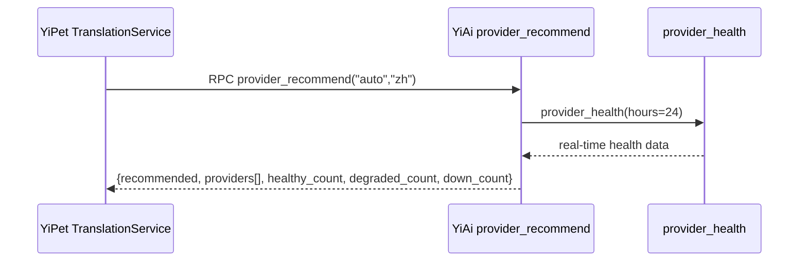

---

doc_type: module
prd_id: "YP-09-108"
title: "YP-09-108: 智能供应商推荐 — getProviderRecommend API 接入"
status: 已完成
priority: P2
owner: Claude + Linter
roles: [engineer]
created: 2026-09-23
updated: 2026-09-23
project: YiPet
project_id: yipet
prd_month: "202609"
related_tasks: ["108-prd-task-智能供应商推荐.md"]
related_tests: ["108-prd-test-智能供应商推荐.md"]
tags: [translation, recommendation, smart-routing]

type: 需求
---

# YP-09-108: 智能供应商推荐

> **PRD 版本**：v3.0

## 1. 背景

YiAi 已提供 `provider_recommend` RPC 方法（基于实时健康数据排名供应商）。YiPet 的 TranslationService 需接入此 API，为将来智能引擎选择做准备。

## 2. 范围

**In scope**：`getProviderRecommend(fromLang?, toLang?)` 方法，返回排名供应商列表

**Out of scope**：UI 集成（后续 PRD）

## 3. 实现

## 4. 文件变更

| 文件 | 操作 |
|------|------|
| `api/services/translation.ts` | +16 (getProviderRecommend) |

## 5. 时间线

2026-09-23（Linter 自动补全）