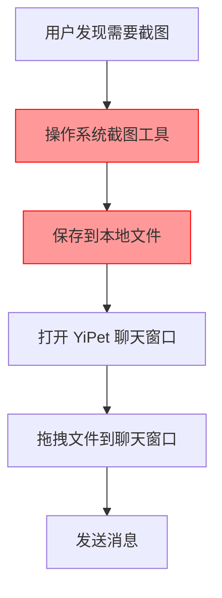
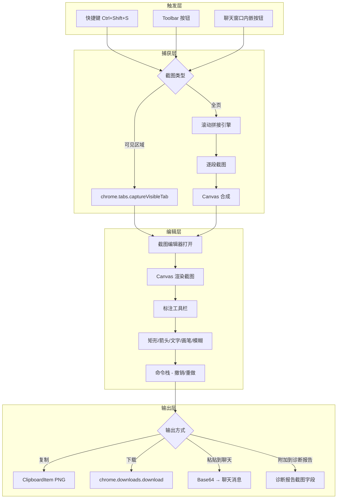
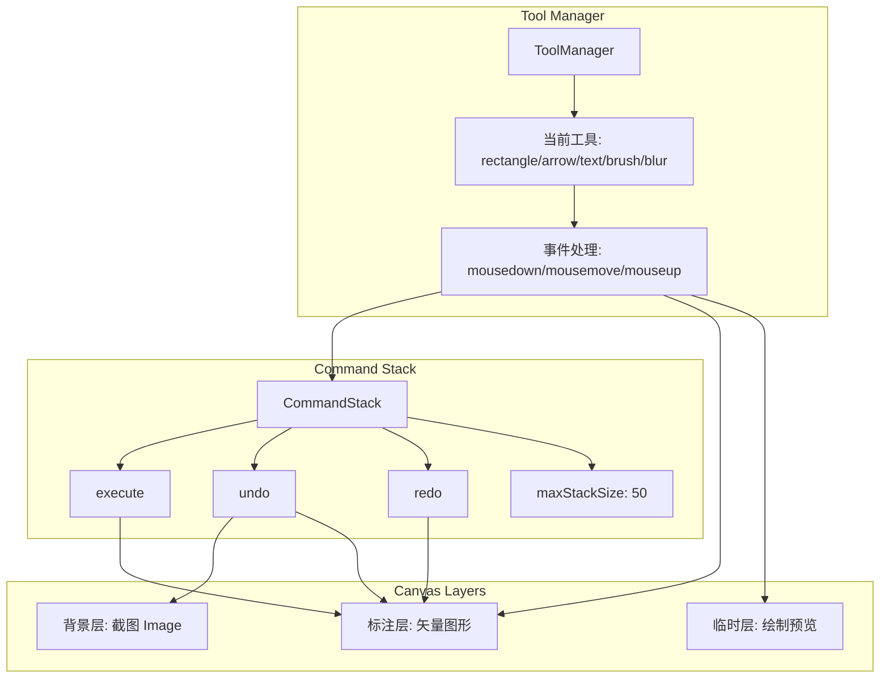

# YP-09-101: 截图与标注工具 — 页面截图捕获、滚动全页截图与标注编辑

> 需求编号：YP-09-101 · 优先级：P2 · 人天：1.0d · 状态：需求已编写
> 依赖：YP-09-69（诊断信息收集）、YP-09-97（键盘快捷键系统）

## 背景

### 问题陈述

用户在浏览器中与 AI 助手交互时，经常需要分享当前页面的视觉信息——例如展示一个 UI bug、引用一段图表数据、或标记网页上的关键区域。当前 YiPet 不支持截图功能，用户必须使用操作系统截图工具或浏览器开发者工具，然后手动粘贴到聊天窗口。这导致：

1. **操作繁琐**：截图 → 保存 → 找到文件 → 拖入聊天窗口，至少 4 步操作
2. **无法标注**：用户无法在截图上绘制箭头、矩形或文字来突出重点
3. **全页截图缺失**：`chrome.tabs.captureVisibleTab` 仅截取可见区域，无法捕获滚动后的完整页面
4. **诊断效率低**：提交 bug 报告时，截图和诊断信息分离，无法自动关联

**核心矛盾**：Chrome 扩展有能力截取页面，但缺乏从截图到标注再到分享的完整工作流，用户被迫在多个工具间切换。

### 影响范围

| # | 影响 | 严重程度 | 典型场景 |
|---|------|----------|----------|
| 1 | 截图操作步骤过多 | 中 | 每次分享页面内容需 4+ 步操作 |
| 2 | 无法直观标注重点 | 高 | 用户需用文字描述"页面左上角第三个按钮" |
| 3 | 全页截图无法实现 | 中 | 长页面内容无法一次性捕获 |
| 4 | 截图与诊断信息分离 | 中 | Bug 报告中截图和上下文信息不关联 |
| 5 | 快捷键缺失 | 低 | 每次截图需点击扩展图标 → 选择截图 |

### 挑战

| 挑战 | 说明 |
|------|------|
| 全页截图实现 | 需通过 `chrome.tabs.captureVisibleTab` + 滚动拼接实现，涉及跨帧 Canvas 合成 |
| Canvas 标注引擎 | 需要在 Canvas 上实现矢量标注工具（矩形、箭头、文字、画笔），并支持撤销/重做 |
| 敏感信息模糊 | 需要检测并模糊处理页面中的敏感信息（手机号、邮箱、身份证号等）或手动涂抹 |
| 剪贴板写入 | 将 Canvas 内容写入系统剪贴板需要 `navigator.clipboard.write` + ClipboardItem API |
| 大图性能 | 全页截图可能超过 10000px 高度，Canvas 合成和标注操作需考虑内存和性能 |

---

## 一、现状分析

### 1.1 当前截图能力

```
现有能力:
├── chrome.tabs.captureVisibleTab           # 可用但未封装
├── navigator.clipboard.write               # 可用但未集成截图
├── <canvas> 元素渲染                        # 可用但无标注工具
└── 无                                          # 无截图 UI、无标注、无全页截图

缺失:
├── 截图触发 UI（按钮/快捷键）                 # ❌ 不存在
├── 全页截图（滚动拼接）                       # ❌ 不存在
├── Canvas 标注工具（矩形/箭头/文字/画笔）      # ❌ 不存在
├── 模糊/涂抹工具                              # ❌ 不存在
├── 撤销/重做栈                                # ❌ 不存在
├── 截图编辑器（工具栏 + 属性面板）             # ❌ 不存在
├── 剪贴板写入（PNG 格式）                     # ❌ 不存在
├── 下载为 PNG                                 # ❌ 不存在
├── 直接粘贴到聊天窗口                          # ❌ 不存在
└── 与诊断报告集成                              # ❌ 不存在
```

### 1.2 改造前截图流程



### 1.3 根因矩阵

| 症状 | 根因 | 触发条件 | 频率 |
|------|------|----------|------|
| 截图操作繁琐 | 无内置截图工具 | 每次需要分享页面视觉信息 | 高 |
| 无法标注 | 无 Canvas 标注引擎 | 需要突出页面重点 | 高 |
| 无全页截图 | 未实现滚动拼接 | 长页面截图需求 | 中 |
| 截图与诊断分离 | 未集成诊断模块 | 提交 Bug 报告 | 中 |
| 快捷键缺失 | 未注册截图命令 | 频繁截图场景 | 中 |

---

## 二、设计决策

### 决策 1：截图触发方式 — toolbar 按钮 vs 快捷键 vs 右键菜单

| 选项 | 用户可见性 | 实现复杂度 | 操作效率 |
|------|-----------|-----------|----------|
| 扩展 Toolbar 按钮 | 高 | 低（Popup 入口） | 中（需点击） |
| 键盘快捷键 Ctrl+Shift+S | 中 | 低（commands API） | 高（无需鼠标） |
| 右键菜单 | 中 | 低（contextMenus API） | 低（需右键） |

**选择：组合方案。** 同时提供 Toolbar 按钮入口、键盘快捷键（Ctrl+Shift+S）、以及聊天窗口内嵌的截图按钮。三种方式互补：快捷键适合频繁操作，按钮适合发现性，右键菜单作为补充。

### 决策 2：全页截图实现 — 滚动拼接 vs CDP Page.captureScreenshot vs 第三方库

| 选项 | 精度 | 性能 | 兼容性 | 滚动条处理 |
|------|------|------|--------|-----------|
| 滚动拼接（captureVisibleTab + scroll） | 高 | 中 | Chrome 全版本 | 需手动处理 |
| CDP Page.captureScreenshot | 最高 | 高 | 需 debugger 权限 | 自动处理 |
| html2canvas 第三方库 | 低（DOM 渲染，非真实截图） | 低 | 中 | 不适用 |

**选择：滚动拼接方案。** CDP 需要 `debugger` 权限（Chrome Web Store 审核严格），且会在标签页显示调试横幅。滚动拼接方案使用标准 `chrome.tabs.captureVisibleTab` API，逐段截取后 Canvas 合成，兼容性最好。

### 决策 3：标注引擎架构 — Canvas 直接操作 vs SVG 叠加层 vs Fabric.js

| 选项 | 性能 | 功能丰富度 | 包体积 | 撤销/重做 |
|------|------|-----------|--------|----------|
| Canvas 直接操作 | 最高 | 需自建 | 0KB | 需自建 |
| SVG 叠加层 | 中 | 中 | 0KB | 需自建 |
| Fabric.js | 高 | 高 | ~200KB | 内置 |

**选择：Canvas 直接操作。** 截图标注场景相对简单（矩形、箭头、文字、画笔），无需 Fabric.js 的完整功能集。Canvas 直接操作体积为零，性能最优，撤销/重做通过命令栈（Command Pattern）实现。

### 决策 4：剪贴板写入策略 — ClipboardItem vs execCommand vs 降级

| 选项 | 浏览器支持 | 格式支持 | 安全性 |
|------|-----------|----------|--------|
| `navigator.clipboard.write` + ClipboardItem | Chrome 76+ | PNG | 需用户手势 |
| `document.execCommand('copy')` | 全版本 | 仅 image/png（部分支持） | 不安全 |
| 降级（下载文件） | 全版本 | PNG 文件 | 始终可用 |

**选择：ClipboardItem 优先，降级为下载。** 主路径使用 `navigator.clipboard.write` 写入 PNG 格式，失败时降级为 `chrome.downloads.download` 下载文件，并在聊天窗口提供粘贴区域。

### 设计决策记录

| 决策 | 选项 A | 选项 B | 选项 C | 选择 | 理由 |
|------|--------|--------|--------|------|------|
| 截图触发方式 | Toolbar 按钮 | 快捷键 | 右键菜单 | **组合方案** | 互补覆盖不同场景 |
| 全页截图实现 | 滚动拼接 | CDP | html2canvas | **滚动拼接** | 无 debugger 权限依赖 |
| 标注引擎 | Canvas 原生 | SVG | Fabric.js | **Canvas 原生** | 零依赖 + 最高性能 |
| 剪贴板写入 | ClipboardItem | execCommand | 下载降级 | **ClipboardItem + 降级** | 兼容性 + 鲁棒性 |

---

## 三、目标架构

### 3.1 截图工作流



### 3.2 标注工具架构



### 3.3 性能指标

| 指标 | 目标值 | 说明 |
|------|--------|------|
| 可见区域截图耗时 | < 500ms | 从触发到编辑器打开 |
| 全页截图耗时 | < 3s（10000px 页面） | 滚动 + 拼接 |
| 标注操作响应 | < 16ms（60fps） | 鼠标移动时绘制预览 |
| 撤销/重做 | < 50ms | 恢复前一个状态 |
| 剪贴板写入 | < 200ms | Canvas → Blob → Clipboard |
| 编辑器内存 | < 50MB | 全页截图 + 50 个标注 |

---

## 四、具体改动

### 4.1 截图捕获服务

```typescript
// src/services/screenshot-capture.ts (新增)

interface ScreenshotOptions {
  type: 'visible' | 'fullpage';
  format?: 'png' | 'jpeg';
  quality?: number; // jpeg 质量 0-100
}

interface ScreenshotResult {
  dataUrl: string;
  width: number;
  height: number;
  type: 'visible' | 'fullpage';
  devicePixelRatio: number;
}

async function captureVisibleTab(
  format: 'png' | 'jpeg' = 'png',
  quality: number = 100
): Promise<string> {
  return new Promise((resolve, reject) => {
    chrome.tabs.captureVisibleTab(
      { format, quality },
      (dataUrl) => {
        if (chrome.runtime.lastError) {
          reject(new Error(chrome.runtime.lastError.message));
          return;
        }
        resolve(dataUrl);
      }
    );
  });
}

async function captureFullPage(): Promise<ScreenshotResult> {
  // 1. 获取页面尺寸
  const [{ result: pageDimensions }] = await chrome.scripting.executeScript({
    target: { tabId },
    func: () => ({
      width: document.documentElement.scrollWidth,
      height: document.documentElement.scrollHeight,
      viewportHeight: window.innerHeight,
      viewportWidth: window.innerWidth,
      devicePixelRatio: window.devicePixelRatio,
    }),
  });

  // 2. 计算滚动段数
  const segments = Math.ceil(pageDimensions.height / pageDimensions.viewportHeight);

  // 3. 逐段截图
  const dataUrls: string[] = [];
  for (let i = 0; i < segments; i++) {
    await chrome.scripting.executeScript({
      target: { tabId },
      func: (scrollY) => window.scrollTo(0, scrollY),
      args: [i * pageDimensions.viewportHeight],
    });
    await new Promise(r => setTimeout(r, 300)); // 等待渲染
    const dataUrl = await captureVisibleTab();
    dataUrls.push(dataUrl);
  }

  // 4. Canvas 合成
  const canvas = document.createElement('canvas');
  canvas.width = pageDimensions.width * pageDimensions.devicePixelRatio;
  canvas.height = pageDimensions.height * pageDimensions.devicePixelRatio;
  const ctx = canvas.getContext('2d')!;

  const images = await Promise.all(dataUrls.map(loadImage));
  images.forEach((img, i) => {
    ctx.drawImage(
      img,
      0,
      i * pageDimensions.viewportHeight * pageDimensions.devicePixelRatio
    );
  });

  return {
    dataUrl: canvas.toDataURL('image/png'),
    width: canvas.width,
    height: canvas.height,
    type: 'fullpage',
    devicePixelRatio: pageDimensions.devicePixelRatio,
  };
}
```

### 4.2 标注引擎命令栈

```typescript
// src/services/annotation/command-stack.ts (新增)

interface AnnotationCommand {
  execute(ctx: CanvasRenderingContext2D): void;
  undo(ctx: CanvasRenderingContext2D, backgroundImage: ImageBitmap): void;
  getBounds(): { x: number; y: number; width: number; height: number };
  serialize(): AnnotationData;
}

interface AnnotationData {
  type: 'rectangle' | 'arrow' | 'text' | 'brush' | 'blur';
  id: string;
  color: string;
  lineWidth: number;
  points: { x: number; y: number }[];
  text?: string;
  fontSize?: number;
}

class CommandStack {
  private undoStack: AnnotationCommand[] = [];
  private redoStack: AnnotationCommand[] = [];
  private maxSize = 50;

  execute(command: AnnotationCommand, ctx: CanvasRenderingContext2D): void {
    command.execute(ctx);
    this.undoStack.push(command);
    if (this.undoStack.length > this.maxSize) {
      this.undoStack.shift();
    }
    this.redoStack = []; // 新操作清空重做栈
  }

  undo(ctx: CanvasRenderingContext2D, bgImage: ImageBitmap): boolean {
    const command = this.undoStack.pop();
    if (!command) return false;
    command.undo(ctx, bgImage);
    this.redoStack.push(command);
    return true;
  }

  redo(ctx: CanvasRenderingContext2D): boolean {
    const command = this.redoStack.pop();
    if (!command) return false;
    command.execute(ctx);
    this.undoStack.push(command);
    return true;
  }

  canUndo(): boolean { return this.undoStack.length > 0; }
  canRedo(): boolean { return this.redoStack.length > 0; }

  serialize(): AnnotationData[] {
    return this.undoStack.map(cmd => cmd.serialize());
  }
}
```

### 4.3 截图编辑器组件

```typescript
// src/components/ScreenshotEditor.vue (新增)

<script setup lang="ts">
import { ref, onMounted, onUnmounted, watch } from 'vue';
import { CommandStack } from '@/services/annotation/command-stack';
import { RectangleTool, ArrowTool, TextTool, BrushTool, BlurTool } from '@/services/annotation/tools';

const props = defineProps<{
  screenshot: string; // dataUrl
  initialAnnotations?: AnnotationData[];
}>();

const emit = defineEmits<{
  done: [dataUrl: string];
  cancel: [];
  pasteToChat: [dataUrl: string];
}>();

const canvasRef = ref<HTMLCanvasElement>();
const commandStack = new CommandStack();
const currentTool = ref<'rectangle' | 'arrow' | 'text' | 'brush' | 'blur'>('rectangle');
const currentColor = ref('#FF0000');
const currentLineWidth = ref(3);
const currentFontSize = ref(16);

let backgroundImage: ImageBitmap | null = null;
let toolInstance: AnnotationTool | null = null;

onMounted(async () => {
  const img = await loadImage(props.screenshot);
  backgroundImage = await createImageBitmap(img);
  const canvas = canvasRef.value!;
  canvas.width = backgroundImage.width;
  canvas.height = backgroundImage.height;
  redrawAll();
});

function redrawAll() {
  const ctx = canvasRef.value!.getContext('2d')!;
  ctx.clearRect(0, 0, canvasRef.value!.width, canvasRef.value!.height);
  ctx.drawImage(backgroundImage!, 0, 0);
  // 重放所有命令
  for (const cmd of commandStack.getAll()) {
    cmd.execute(ctx);
  }
}

function handleMouseDown(e: MouseEvent) {
  const rect = canvasRef.value!.getBoundingClientRect();
  const point = { x: e.clientX - rect.left, y: e.clientY - rect.top };
  toolInstance = createTool(currentTool.value, {
    color: currentColor.value,
    lineWidth: currentLineWidth.value,
    fontSize: currentFontSize.value,
  });
  toolInstance.onStart(point);
}

function handleMouseMove(e: MouseEvent) {
  if (!toolInstance) return;
  const rect = canvasRef.value!.getBoundingClientRect();
  const point = { x: e.clientX - rect.left, y: e.clientY - rect.top };
  toolInstance.onMove(point, canvasRef.value!.getContext('2d')!, backgroundImage!);
}

function handleMouseUp(e: MouseEvent) {
  if (!toolInstance) return;
  const rect = canvasRef.value!.getBoundingClientRect();
  const point = { x: e.clientX - rect.left, y: e.clientY - rect.top };
  const command = toolInstance.onEnd(point);
  if (command) {
    commandStack.execute(command, canvasRef.value!.getContext('2d')!);
  }
  toolInstance = null;
}

function undo() { commandStack.undo(canvasRef.value!.getContext('2d')!, backgroundImage!); }
function redo() { commandStack.redo(canvasRef.value!.getContext('2d')!); }

async function copyToClipboard() {
  const blob = await new Promise<Blob>(r => canvasRef.value!.toBlob(r, 'image/png'));
  await navigator.clipboard.write([new ClipboardItem({ 'image/png': blob })]);
}

function download() {
  const dataUrl = canvasRef.value!.toDataURL('image/png');
  const link = document.createElement('a');
  link.download = `screenshot-${Date.now()}.png`;
  link.href = dataUrl;
  link.click();
}

function pasteToChat() {
  const dataUrl = canvasRef.value!.toDataURL('image/png');
  emit('pasteToChat', dataUrl);
}
</script>
```

### 4.4 剪贴板粘贴到聊天窗口

```typescript
// src/services/clipboard-integration.ts (新增)

export async function pasteScreenshotToChat(
  dataUrl: string,
  chatInputElement: HTMLTextAreaElement
): Promise<void> {
  // 1. 将截图转为内嵌图片消息
  const imageMessage = {
    type: 'image',
    dataUrl,
    timestamp: Date.now(),
    filename: `screenshot-${Date.now()}.png`,
  };

  // 2. 触发聊天窗口的图片粘贴事件
  const pasteEvent = new CustomEvent('yipet:paste-image', {
    detail: imageMessage,
  });
  chatInputElement.dispatchEvent(pasteEvent);

  // 3. 可选：在输入框中插入 Markdown 图片引用
  chatInputElement.value += `\n\n`;
  chatInputElement.focus();
}
```

### 4.5 文件变更清单

| 文件 | 操作 | 说明 |
|------|------|------|
| `src/services/screenshot-capture.ts` | 新增 | 截图捕获服务（可见/全页） |
| `src/services/annotation/command-stack.ts` | 新增 | 标注命令栈（撤销/重做） |
| `src/services/annotation/tools/rectangle.ts` | 新增 | 矩形标注工具 |
| `src/services/annotation/tools/arrow.ts` | 新增 | 箭头标注工具 |
| `src/services/annotation/tools/text.ts` | 新增 | 文字标注工具 |
| `src/services/annotation/tools/brush.ts` | 新增 | 画笔工具 |
| `src/services/annotation/tools/blur.ts` | 新增 | 模糊/涂抹工具 |
| `src/services/annotation/types.ts` | 新增 | 标注类型定义 |
| `src/services/clipboard-integration.ts` | 新增 | 剪贴板与聊天集成 |
| `src/components/ScreenshotEditor.vue` | 新增 | 截图编辑器组件 |
| `src/components/ScreenshotToolbar.vue` | 新增 | 标注工具栏组件 |
| `src/content/screenshot-trigger.ts` | 新增 | Content Script 截图触发器 |
| `src/background/screenshot-handler.ts` | 新增 | Service Worker 截图协调 |
| `src/manifest.json` | 修改 | 添加 `commands.screenshot` 快捷键 |
| `src/stores/screenshot.ts` | 新增 | 截图状态管理 |

---

## 五、实施步骤

| 步骤 | 操作 | 路径 | 验证 | 人天 |
|------|------|------|------|------|
| 1 | 实现 `captureVisibleTab` 封装 | `src/services/screenshot-capture.ts` | 可见区域截图生成 dataUrl | 0.1 |
| 2 | 实现全页截图滚动拼接引擎 | `src/services/screenshot-capture.ts` | 2000px+ 页面完整拼接 | 0.2 |
| 3 | 实现标注命令栈 | `src/services/annotation/command-stack.ts` | 撤销/重做正确 | 0.1 |
| 4 | 实现 5 种标注工具 | `src/services/annotation/tools/*` | 每种工具绘制正确 | 0.2 |
| 5 | 实现截图编辑器 UI | `src/components/ScreenshotEditor.vue` | 工具栏 + Canvas 交互 | 0.15 |
| 6 | 实现剪贴板写入和下载 | `src/components/ScreenshotEditor.vue` | 复制 PNG 到剪贴板 | 0.05 |
| 7 | 实现聊天窗口粘贴集成 | `src/services/clipboard-integration.ts` | 截图出现在聊天消息中 | 0.05 |
| 8 | 注册键盘快捷键 | `src/manifest.json` | Ctrl+Shift+S 触发截图 | 0.05 |
| 9 | 与诊断报告集成 | `src/services/screenshot-capture.ts` | 诊断报告自动附带截图 | 0.05 |
| 10 | 添加截图状态管理 | `src/stores/screenshot.ts` | 截图状态持久化 | 0.05 |

**总人天：1.0d**

---

## 六、测试规格

### 场景 1：可见区域截图

**GIVEN** 用户在任意网页上
**WHEN** 按下 Ctrl+Shift+S（或点击截图按钮）
**THEN** 应捕获当前可见区域并打开截图编辑器
**AND** 截图分辨率应匹配 `window.devicePixelRatio`
**AND** 编辑器应显示截图预览

### 场景 2：全页截图拼接

**GIVEN** 用户在高度为 5000px 的页面上
**WHEN** 选择"全页截图"模式
**THEN** 应自动滚动页面并逐段截图
**AND** 最终 Canvas 应包含完整页面内容
**AND** 各段之间的接缝应无缝（像素级对齐）
**AND** 截图完成后页面应恢复到原始滚动位置

### 场景 3：标注工具交互

**GIVEN** 截图编辑器已打开并显示截图
**WHEN** 选择矩形工具，在截图上拖拽绘制
**THEN** 应在 Canvas 上绘制红色矩形
**AND** 切换到箭头工具后拖拽应绘制箭头
**AND** 选择文字工具后点击应弹出文字输入
**AND** 选择画笔工具后拖拽应绘制自由曲线
**AND** 选择模糊工具后拖拽区域应被模糊处理

### 场景 4：撤销/重做

**GIVEN** 用户在截图上绘制了 3 个标注（矩形、箭头、文字）
**WHEN** 连续点击撤销 3 次
**THEN** 标注应按逆序消失（文字 → 箭头 → 矩形）
**AND** 点击重做 2 次
**THEN** 标注应按正序恢复（矩形 → 箭头）
**AND** 在撤销后绘制新标注应清空重做栈

### 场景 5：剪贴板复制

**GIVEN** 截图编辑器中有标注后的截图
**WHEN** 点击"复制到剪贴板"按钮
**THEN** 系统剪贴板应包含 PNG 格式的截图
**AND** 用户可以在任意应用中粘贴（Ctrl+V）
**AND** 若剪贴板 API 不可用，应降级为下载 PNG 文件

### 场景 6：截图粘贴到聊天窗口

**GIVEN** 截图编辑器中有标注后的截图
**WHEN** 点击"粘贴到聊天"按钮
**THEN** 截图应作为图片消息出现在聊天输入区
**AND** 聊天窗口应自动聚焦
**AND** 截图编辑器应关闭

---

## 七、风险与缓解

| 风险 | 概率 | 影响 | 缓解措施 |
|------|------|------|----------|
| 全页截图滚动拼接有接缝 | 中 | 中 | 使用 `scrollTo` 精确控制滚动位置，添加 300ms 渲染等待 |
| 大图 Canvas 内存溢出 | 低 | 高 | 限制全页截图最大高度为 15000px，超出时等比例缩放 |
| 剪贴板 API 权限被拒绝 | 中 | 中 | 降级为 `chrome.downloads.download` 下载文件 |
| 标注工具在触摸设备上体验差 | 中 | 低 | 添加触摸事件支持（touchstart/touchmove/touchend） |
| 快捷键与其他扩展冲突 | 低 | 低 | 允许用户在设置中自定义快捷键 |

---

## 八、回滚策略

| 场景 | 回滚操作 | 影响 |
|------|----------|------|
| 截图编辑器性能问题 | 禁用全页截图，仅保留可见区域截图 | 失去全页截图能力 |
| 标注工具 bug 严重 | 隐藏标注工具栏，截图直接复制/下载 | 失去标注能力 |
| 剪贴板写入不稳定 | 全部使用下载降级 | 操作步骤增多 |
| 快捷键冲突 | 取消默认快捷键，仅保留 UI 按钮触发 | 失去快捷操作 |

---

## 九、设计决策记录

### D-01：全页截图滚动策略

- **问题**：如何实现全页截图的同时保证拼接精度
- **选项**：CDP Page.captureScreenshot、滚动拼接、html2canvas
- **选择**：滚动拼接（`captureVisibleTab` + `scrollTo` + Canvas 合成）
- **理由**：CDP 需要 `debugger` 权限（审核风险），html2canvas 不是真实截图（无跨域图片、无 WebGL）。滚动拼接使用标准 API，通过 `devicePixelRatio` 和精确滚动位置保证拼接精度

### D-02：标注引擎分层策略

- **问题**：如何高效渲染标注并支持撤销/重做
- **选项**：单层 Canvas 直接绘制、多层 Canvas 叠加、SVG 叠加层
- **选择**：单层 Canvas + 命令栈重放
- **理由**：多层 Canvas 增加内存开销，SVG 需要 DOM 操作。单层 Canvas + 命令栈模式：每次重绘时先绘制背景图，再依次执行命令栈中的命令，撤销/重做只需操作命令栈

### D-03：模糊工具实现

- **问题**：如何实现局部模糊（敏感信息遮盖）
- **选项**：CSS filter blur、Canvas filter blur、像素平均模糊
- **选择**：Canvas `ctx.filter = 'blur(10px)'` + 区域裁剪
- **理由**：Canvas 原生 filter 性能好，通过 `save/restore` + `clip` 实现区域模糊，不依赖外部库

### D-04：截图编辑器 UI 定位

- **问题**：截图编辑器在扩展中的显示位置
- **选项**：Popup 窗口、新标签页、Content Script 注入的全屏覆盖层
- **选择**：Content Script 注入的全屏覆盖层
- **理由**：Popup 窗口尺寸有限（最大 800x600px），新标签页会打断用户流程。全屏覆盖层在 Content Script 中注入，提供最大编辑空间，通过 Shadow DOM 隔离样式

---

## 十、可观测性

### 指标

| 指标 | 类型 | 说明 |
|------|------|------|
| `yipet.screenshot.capture_count` | Counter | 截图触发次数（按类型：visible/fullpage） |
| `yipet.screenshot.capture_duration_ms` | Histogram | 截图捕获耗时 |
| `yipet.screenshot.fullpage_segments` | Histogram | 全页截图滚动段数 |
| `yipet.screenshot.annotation_count` | Counter | 标注工具使用次数（按工具类型） |
| `yipet.screenshot.undo_count` | Counter | 撤销操作次数 |
| `yipet.screenshot.output_type` | Counter | 输出方式分布（clipboard/download/chat） |
| `yipet.screenshot.error_count` | Counter | 截图失败次数（按错误类型） |

### 告警

| 告警 | 条件 | 级别 |
|------|------|------|
| 全页截图失败率 > 10% | 最近 100 次截图 | WARNING |
| 全页截图平均耗时 > 5s | 最近 50 次截图 | WARNING |
| 剪贴板写入失败率 > 20% | 最近 100 次复制 | INFO |
| 标注编辑器内存 > 100MB | 单次截图编辑 | WARNING |

---

## 十一、代码审查检查清单

- [ ] `captureVisibleTab` 封装正确处理 `chrome.runtime.lastError`
- [ ] 全页截图滚动拼接后恢复原始滚动位置
- [ ] 命令栈 `maxSize` 限制为 50，防止内存无限增长
- [ ] 所有标注工具实现 `execute`、`undo`、`serialize` 接口
- [ ] 模糊工具使用 Canvas `save/restore` 正确裁剪区域
- [ ] 剪贴板写入提供降级方案（下载文件）
- [ ] 截图编辑器在 Shadow DOM 中渲染，样式隔离
- [ ] 快捷键 `Ctrl+Shift+S` 在 `manifest.json` 中正确注册
- [ ] 全页截图限制最大高度，防止 OOM
- [ ] 截图 dataUrl 不存储在 Pinia 持久化中（数据量大）
- [ ] 诊断报告集成时截图自动转为 Base64 附加

---

## 回归问题预测

| # | 预测问题 | 原因 | 验证方法 |
|---|---------|------|---------|
| 1 | 全页截图在 `position: fixed` 元素上出现重复或缺失，拼接后出现"鬼影" | 滚动时 fixed 元素相对于视口位置不变，每段截图都会包含它，导致合成时 fixed 元素重复出现多次 | 在包含 fixed header 的页面上执行全页截图，检查合成结果中 fixed 元素是否只出现一次 |
| 2 | 截图编辑器的 Canvas 尺寸超过浏览器限制，在 4K 屏幕上全页截图导致 Canvas 渲染失败 | Chrome 对 Canvas 有最大尺寸限制（约 16384x16384px），高 DPI 全页截图可能超出限制 | 在 4K 屏幕上截取 20000px 高度页面，确认 Canvas 自动缩放至安全尺寸，图片不失真 |
| 3 | 剪贴板写入在 Service Worker 中调用 `navigator.clipboard.write` 失败，因为 SW 无 DOM 上下文 | Service Worker 中没有 `navigator.clipboard` API，截图写入剪贴板必须在 Content Script 或 Popup 中执行 | 通过消息传递将截图 dataUrl 发送到 Content Script，在 Content Script 中执行剪贴板写入 |
| 4 | 标注工具的鼠标事件在页面有 CSS `pointer-events: none` 元素时无法触发，Canvas 点击穿透到下层页面 | 截图编辑器覆盖层下方页面的元素可能拦截鼠标事件，Canvas 的 `pointer-events` 未正确设置 | 在覆盖层 CSS 中设置 `pointer-events: auto` 并阻止事件冒泡，验证在有复杂 DOM 的页面上标注工具可用 |
| 5 | 撤销/重做后标注颜色或线宽丢失，因为命令序列化时未保存样式属性 | 命令的 `serialize()` 只保存几何数据（points），未保存 `color`、`lineWidth` 等样式属性，redo 时使用当前工具设置而非原始设置 | 验证：绘制红色矩形后切换为蓝色，撤销再重做，确认矩形恢复为红色而非蓝色 |
| 6 | 截图中包含 `:hover` 或 `:focus` 状态的元素，全页截图滚动时触发不同元素的 hover 状态，导致每段截图不一致 | 滚动时鼠标位置不变，但下方元素变化触发不同元素的 `:hover` 样式，导致拼接后有样式不一致的条纹 | 截图前通过 `document.body.style.pointerEvents = 'none'` 临时禁用 hover，截图完成后恢复 |

---

## 性能分析

### 截图流程各阶段耗时

| 阶段 | 预估耗时 | 说明 |
|------|----------|------|
| 快捷键触发 → 截图开始 | < 50ms | 消息从 Content Script → SW → Content Script |
| 可见区域截图 | ~200ms | `chrome.tabs.captureVisibleTab` API 调用 |
| 全页截图（每段） | ~300ms/段 | 滚动 + 等待渲染 + captureVisibleTab |
| Canvas 合成（全页） | ~200ms | 图片解码 + drawImage 拼接 |
| 编辑器打开 | < 100ms | Vue 组件挂载 + Canvas 渲染 |
| 标注工具响应 | < 16ms | 鼠标移动时绘制预览 |
| 撤销/重做 | < 50ms | 清空 Canvas + 重放命令栈 |
| 复制到剪贴板 | ~150ms | Canvas → Blob → ClipboardItem.write |
| 下载 PNG | ~100ms | toDataURL → download |
| **总计（可见区域截图 → 复制）** | **~700ms** | 端到端最快路径 |
| **总计（全页 5000px → 复制）** | **~2.5s** | 5 段滚动拼接 |

### 文件体积预估

| 文件 | 大小 | 说明 |
|------|------|------|
| `src/services/screenshot-capture.ts` | ~4KB | 截图捕获核心逻辑 |
| `src/services/annotation/command-stack.ts` | ~2KB | 命令栈实现 |
| `src/services/annotation/tools/rectangle.ts` | ~1.5KB | 矩形工具 |
| `src/services/annotation/tools/arrow.ts` | ~2KB | 箭头工具（含箭头头部计算） |
| `src/services/annotation/tools/text.ts` | ~2KB | 文字工具（含输入框定位） |
| `src/services/annotation/tools/brush.ts` | ~1.5KB | 画笔工具（自由曲线） |
| `src/services/annotation/tools/blur.ts` | ~1.5KB | 模糊工具 |
| `src/services/annotation/types.ts` | ~1KB | 类型定义 |
| `src/services/clipboard-integration.ts` | ~1.5KB | 剪贴板集成 |
| `src/components/ScreenshotEditor.vue` | ~6KB | 编辑器主组件 |
| `src/components/ScreenshotToolbar.vue` | ~3KB | 工具栏组件 |
| `src/content/screenshot-trigger.ts` | ~1.5KB | Content Script 触发器 |
| `src/background/screenshot-handler.ts` | ~2KB | SW 协调逻辑 |
| `src/stores/screenshot.ts` | ~1.5KB | 状态管理 |
| `src/manifest.json` (修改) | +0.2KB | 快捷键配置 |