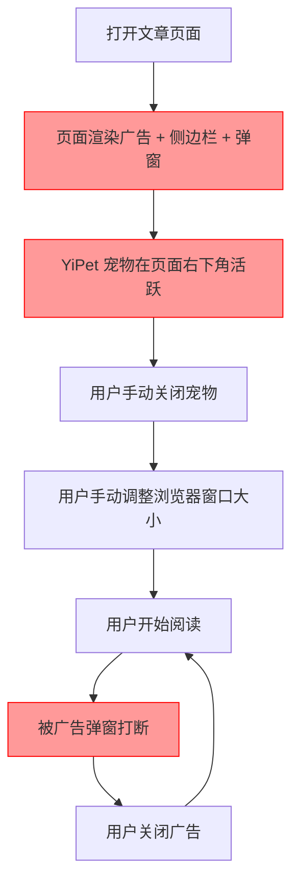
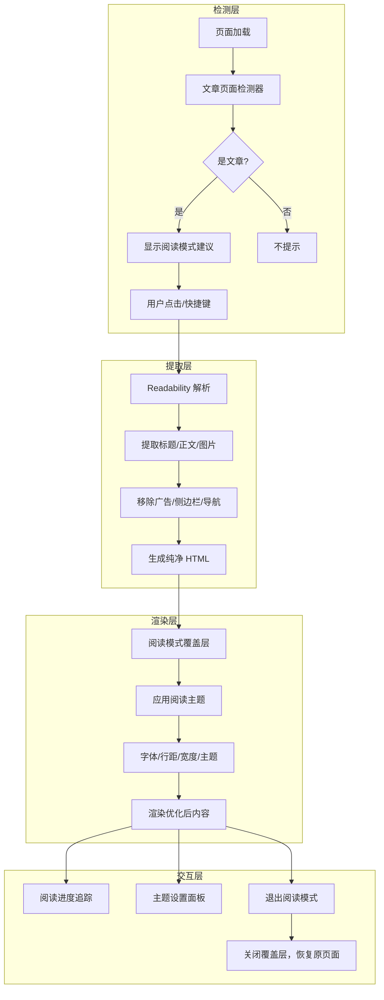
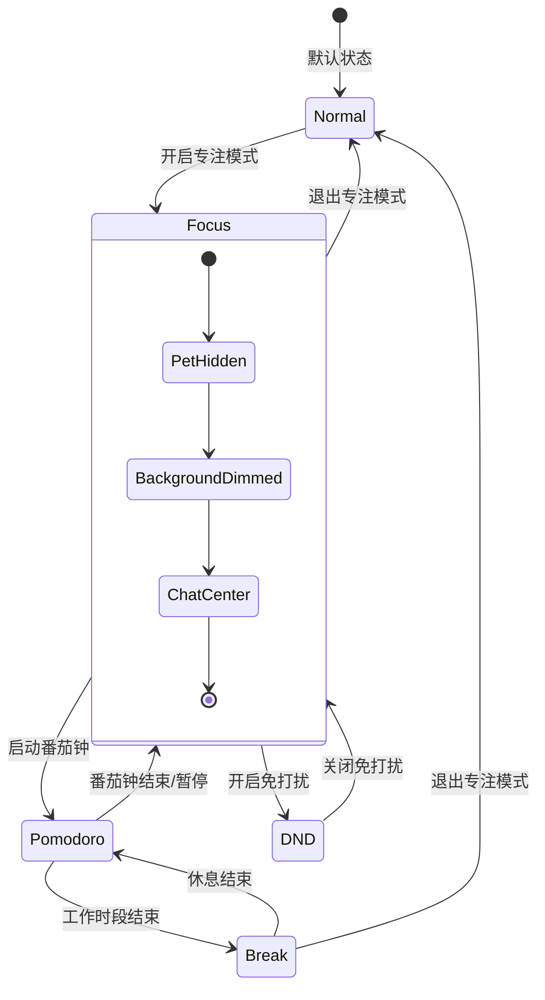

# YP-09-102: 阅读模式与专注模式 — 页面内容提取、阅读优化与番茄钟专注

> 需求编号：YP-09-102 · 优先级：P2 · 人天：0.5d · 状态：需求已编写
> 依赖：YP-09-05（聊天窗口交互）、YP-09-97（键盘快捷键系统）

## 背景

### 问题陈述

用户在浏览器中阅读长文章时，常被广告、侧边栏、弹窗和宠物动画干扰。同时，用户在深度工作或学习时，需要 YiPet 进入"安静模式"——收起宠物动画，减少干扰，但仍保持 AI 助手可用。当前 YiPet 缺乏阅读模式和专注模式，导致：

1. **阅读干扰严重**：页面广告、推荐内容、侧边栏分散注意力
2. **宠物动画醒目**：在需要专注时，宠物动画反而成为干扰源
3. **无时间管理工具**：用户需要切换到其他番茄钟应用
4. **阅读体验不一致**：不同网站的字体大小、行距、宽度差异大

**核心矛盾**：YiPet 作为常驻页面的 AI 伴侣，在某些场景下需要"隐身"或"静默"，但当前设计缺少状态切换机制。

### 影响范围

| # | 影响 | 严重程度 | 典型场景 |
|---|------|----------|----------|
| 1 | 阅读长文章时广告干扰 | 中 | 技术博客、新闻文章页面被广告包围 |
| 2 | 深度工作时宠物动画分散注意力 | 中 | 编写代码或文档时需要专注 |
| 3 | 缺少内建时间管理 | 低 | 用户需切换到系统时钟或番茄钟应用 |
| 4 | 阅读体验不一致 | 中 | 不同网站字体、行距差异大 |
| 5 | 无自动检测阅读场景 | 低 | 用户手动判断是否需要阅读模式 |

### 挑战

| 挑战 | 说明 |
|------|------|
| 内容提取准确性 | 不同网站 DOM 结构差异大，需智能识别正文内容区域 |
| 样式注入隔离 | 阅读模式样式需覆盖页面样式但不影响 YiPet 自身 UI |
| 番茄钟精度 | `setInterval` 在后台标签页会被节流，需使用 Worker 或 SW 计时 |
| 免打扰模式判定 | 需区分"重要通知"（如 AI 回复完成）和"非紧急通知" |
| 页面类型检测 | 自动检测文章/博客/文档页面，触发阅读模式建议 |

---

## 一、现状分析

### 1.1 当前阅读与专注能力

```
现有能力:
├── YiPet 宠物覆盖层                            # 常驻显示
├── 聊天窗口可关闭                              # 手动操作
├── 无                                          # 无阅读模式
└── 无                                          # 无专注模式

缺失:
├── 阅读模式（内容提取 + 样式优化）               # ❌ 不存在
├── 专注模式（宠物隐藏 + 背景变暗 + 通知静默）    # ❌ 不存在
├── 番茄钟计时器                                # ❌ 不存在
├── 免打扰模式                                  # ❌ 不存在
├── 阅读进度追踪                                # ❌ 不存在
├── 阅读主题自定义                              # ❌ 不存在
├── 文章页面自动检测                            # ❌ 不存在
└── 阅读模式快捷键                              # ❌ 不存在
```

### 1.2 改造前阅读体验



### 1.3 根因矩阵

| 症状 | 根因 | 触发条件 | 频率 |
|------|------|----------|------|
| 阅读干扰 | 无内容提取和样式优化 | 阅读长文章 | 高 |
| 宠物动画干扰 | 无专注模式 | 深度工作 | 中 |
| 无时间管理 | 无内建番茄钟 | 长时间工作 | 中 |
| 阅读体验不一致 | 无阅读主题统一 | 跨网站阅读 | 中 |
| 手动切换繁琐 | 无自动检测 | 浏览文章页面 | 中 |

---

## 二、设计决策

### 决策 1：内容提取策略 — Readability.js vs 自建 vs 浏览器原生

| 选项 | 准确率 | 包体积 | 维护成本 | 自定义能力 |
|------|--------|--------|----------|-----------|
| Mozilla Readability | 高（90%+） | ~30KB | 低（社区维护） | 中 |
| 自建 DOM 启发式提取 | 中（70%） | 0KB | 高 | 高 |
| 浏览器原生（无） | — | — | — | — |

**选择：Readability.js。** 成熟的内容提取库，Firefox 阅读模式使用同一算法，准确率 90%+，包体积 30KB 可接受。自建方案需要大量规则维护，投入产出比低。

### 决策 2：阅读模式注入方式 — 覆盖层 vs 新标签页 vs 页面内替换

| 选项 | 无缝体验 | 样式隔离 | 原页面保留 |
|------|---------|----------|-----------|
| Content Script 注入覆盖层 | 高 | Shadow DOM 隔离 | 是（覆盖层在上方） |
| 新标签页（chrome-extension://） | 中 | 完全隔离 | 否（离开原页面） |
| 页面内 DOM 替换 | 低 | 差（样式冲突） | 否（原 DOM 被替换） |

**选择：Content Script 注入覆盖层。** 在新标签页打开会打断用户浏览流程，页面内 DOM 替换有样式冲突风险。覆盖层方案通过 Shadow DOM 隔离样式，保留原页面在下方，用户可随时切换回原页面。

### 决策 3：番茄钟计时器实现 — setInterval vs Web Worker vs Service Worker

| 选项 | 后台运行 | 精度 | 内存占用 | 复杂度 |
|------|---------|------|----------|--------|
| `setInterval` | 标签页后台时被节流（1s+） | 低 | 极低 | 低 |
| Web Worker | 独立线程，不受节流 | 高 | 低 | 中 |
| Service Worker | 独立于页面 | 高 | 低 | 低（已有 SW） |

**选择：Service Worker。** YiPet 已有 Service Worker，利用 `setTimeout` 链式调用（SW 中不会被节流），实现精确计时。数据结构简单（`{ remaining, state, sessionStart }`），存储在 `chrome.storage.session` 中。

### 决策 4：免打扰模式粒度 — 全部静默 vs 分级过滤 vs 按来源

| 选项 | 灵活性 | 实现复杂度 | 用户体验 |
|------|--------|-----------|----------|
| 全部静默 | 低 | 低 | 差（可能错过重要消息） |
| 分级过滤 | 高 | 中 | 好（AI 回复完成通知放行） |
| 按来源过滤 | 中 | 中 | 中（需手动配置） |

**选择：分级过滤。** 定义通知优先级：P0（AI 回复完成、错误告警）始终放行，P1（番茄钟提醒、进度更新）在专注模式中静默，P2（非紧急通知）全部静默。用户可自定义每个来源的级别。

### 设计决策记录

| 决策 | 选项 A | 选项 B | 选项 C | 选择 | 理由 |
|------|--------|--------|--------|------|------|
| 内容提取 | Readability.js | 自建 | 浏览器原生 | **Readability.js** | 成熟准确，维护成本低 |
| 注入方式 | 覆盖层 | 新标签页 | DOM 替换 | **覆盖层** | 无感知切换，样式隔离 |
| 番茄钟计时 | setInterval | Web Worker | Service Worker | **Service Worker** | 已有 SW，后台精确 |
| 免打扰粒度 | 全部静默 | 分级过滤 | 按来源 | **分级过滤** | 灵活可控 |

---

## 三、目标架构

### 3.1 阅读模式工作流



### 3.2 专注模式状态机



### 3.3 性能指标

| 指标 | 目标值 | 说明 |
|------|--------|------|
| 阅读模式打开耗时 | < 500ms | 从触发到内容渲染完成 |
| 内容提取准确率 | > 90% | 正文内容完整提取 |
| 覆盖层打开/关闭 | < 100ms | 无闪烁 |
| 番茄钟计时精度 | < 1s 偏差/小时 | SW 计时精度 |
| 阅读主题切换 | < 50ms | CSS 变量切换 |
| 内存增量 | < 10MB | 阅读模式覆盖层 |

---

## 四、具体改动

### 4.1 文章页面检测器

```typescript
// src/services/reading-mode/article-detector.ts (新增)

interface ArticleDetectionResult {
  isArticle: boolean;
  confidence: number;
  title?: string;
  excerpt?: string;
  wordCount?: number;
}

export function detectArticlePage(): ArticleDetectionResult {
  const doc = document;

  // 1. 检测 <article> 标签
  const articleElement = doc.querySelector('article');
  if (articleElement) {
    const text = articleElement.textContent || '';
    return {
      isArticle: true,
      confidence: 0.95,
      title: doc.title,
      wordCount: text.split(/\s+/).length,
    };
  }

  // 2. 检测常见文章容器选择器
  const articleSelectors = [
    '.post-content', '.article-content', '.entry-content',
    '.markdown-body', '.prose', '[role="article"]',
    '.blog-post', '.story-body', '.article-body',
  ];
  for (const selector of articleSelectors) {
    const el = doc.querySelector(selector);
    if (el) {
      const text = el.textContent || '';
      const wordCount = text.split(/\s+/).length;
      if (wordCount > 200) {
        return {
          isArticle: true,
          confidence: 0.8,
          title: doc.title,
          wordCount,
        };
      }
    }
  }

  // 3. 启发式检测：长文本 + 段落数量
  const paragraphs = doc.querySelectorAll('p');
  const longParagraphs = Array.from(paragraphs).filter(
    p => (p.textContent || '').length > 100
  );
  if (longParagraphs.length >= 3) {
    return {
      isArticle: true,
      confidence: 0.6,
      title: doc.title,
      wordCount: longParagraphs.reduce((sum, p) => sum + (p.textContent || '').split(/\s+/).length, 0),
    };
  }

  return { isArticle: false, confidence: 0 };
}
```

### 4.2 阅读模式覆盖层

```typescript
// src/content/reading-mode/overlay.ts (新增)

import { Readability } from '@mozilla/readability';

interface ReadingTheme {
  fontFamily: 'serif' | 'sans-serif';
  fontSize: number;       // px
  lineHeight: number;     // 倍数
  maxWidth: number;       // px
  colorScheme: 'light' | 'dark' | 'sepia';
}

const DEFAULT_THEME: ReadingTheme = {
  fontFamily: 'serif',
  fontSize: 18,
  lineHeight: 1.8,
  maxWidth: 720,
  colorScheme: 'light',
};

export class ReadingModeOverlay {
  private shadowRoot: ShadowRoot;
  private container: HTMLDivElement;
  private theme: ReadingTheme;
  private originalScrollY = 0;
  private progress = 0;

  constructor() {
    this.theme = this.loadTheme();
  }

  async open(): Promise<void> {
    // 1. 提取内容
    const documentClone = document.cloneNode(true) as Document;
    const reader = new Readability(documentClone);
    const article = reader.parse();

    if (!article) {
      throw new Error('无法提取页面内容');
    }

    // 2. 保存原始滚动位置
    this.originalScrollY = window.scrollY;

    // 3. 创建覆盖层
    this.container = document.createElement('div');
    this.container.id = 'yipet-reading-overlay';
    this.shadowRoot = this.container.attachShadow({ mode: 'closed' });

    // 4. 渲染阅读内容
    this.shadowRoot.innerHTML = `
      <style>
        :host {
          position: fixed; top: 0; left: 0; right: 0; bottom: 0;
          z-index: 2147483646; background: var(--bg);
          overflow-y: auto; font-family: var(--font);
          font-size: var(--font-size); line-height: var(--line-height);
        }
        .content {
          max-width: var(--max-width); margin: 0 auto;
          padding: 40px 20px;
        }
        h1 { font-size: 1.8em; margin-bottom: 0.5em; }
        img { max-width: 100%; height: auto; }
        pre { overflow-x: auto; background: var(--code-bg); padding: 1em; }
        .toolbar { position: fixed; top: 16px; right: 16px; z-index: 1; }
        .progress-bar { position: fixed; top: 0; left: 0; height: 3px;
          background: var(--accent); transition: width 0.1s; }
      </style>
      <div class="progress-bar" id="progress"></div>
      <div class="toolbar">
        <button id="btn-theme">主题</button>
        <button id="btn-close">✕</button>
      </div>
      <div class="content">
        <h1>${article.title}</h1>
        ${article.content}
      </div>
    `;

    this.applyTheme(this.theme);
    document.body.appendChild(this.container);

    // 5. 隐藏宠物
    this.hidePet();

    // 6. 监听滚动更新进度
    this.container.addEventListener('scroll', this.updateProgress.bind(this));

    // 7. 绑定工具栏事件
    this.shadowRoot.getElementById('btn-close')!.onclick = () => this.close();
    this.shadowRoot.getElementById('btn-theme')!.onclick = () => this.showThemePanel();
  }

  close(): void {
    this.container.remove();
    this.showPet();
    window.scrollTo(0, this.originalScrollY);
  }

  private applyTheme(theme: ReadingTheme): void {
    const host = this.container as HTMLElement;
    const colorSchemes = {
      light: { '--bg': '#fff', '--text': '#333', '--code-bg': '#f5f5f5', '--accent': '#4a90d9' },
      dark: { '--bg': '#1a1a2e', '--text': '#e0e0e0', '--code-bg': '#16213e', '--accent': '#4a90d9' },
      sepia: { '--bg': '#f4ecd8', '--text': '#5b4636', '--code-bg': '#e8dcc8', '--accent': '#8b7355' },
    };
    const colors = colorSchemes[theme.colorScheme];
    Object.entries(colors).forEach(([k, v]) => host.style.setProperty(k, v));
    host.style.setProperty('--font', theme.fontFamily);
    host.style.setProperty('--font-size', `${theme.fontSize}px`);
    host.style.setProperty('--line-height', String(theme.lineHeight));
    host.style.setProperty('--max-width', `${theme.maxWidth}px`);
  }

  private updateProgress(): void {
    const scrollTop = this.container.scrollTop;
    const scrollHeight = this.container.scrollHeight - this.container.clientHeight;
    this.progress = scrollHeight > 0 ? (scrollTop / scrollHeight) * 100 : 0;
    const bar = this.shadowRoot.getElementById('progress');
    if (bar) bar.style.width = `${this.progress}%`;
  }

  private hidePet(): void {
    const overlay = document.getElementById('yipet-overlay');
    if (overlay) overlay.style.display = 'none';
  }

  private showPet(): void {
    const overlay = document.getElementById('yipet-overlay');
    if (overlay) overlay.style.display = '';
  }

  private loadTheme(): ReadingTheme {
    try {
      const saved = localStorage.getItem('yipet-reading-theme');
      return saved ? JSON.parse(saved) : DEFAULT_THEME;
    } catch {
      return DEFAULT_THEME;
    }
  }

  saveTheme(theme: ReadingTheme): void {
    this.theme = theme;
    localStorage.setItem('yipet-reading-theme', JSON.stringify(theme));
    this.applyTheme(theme);
  }

  showThemePanel(): void {
    // 渲染主题设置面板（字体、大小、行距、宽度、配色）
    // 用户修改后调用 saveTheme
  }
}
```

### 4.3 番茄钟计时器

```typescript
// src/services/focus-mode/pomodoro.ts (新增)

interface PomodoroState {
  phase: 'work' | 'break' | 'idle';
  remaining: number;       // 剩余秒数
  workDuration: number;    // 工作时段秒数（默认 25min）
  breakDuration: number;   // 休息时段秒数（默认 5min）
  longBreakDuration: number; // 长休息秒数（默认 15min）
  sessionsCompleted: number; // 已完成番茄钟数
  sessionsBeforeLongBreak: number; // 长休息间隔（默认 4）
  startedAt: number | null;
}

const DEFAULT_POMODORO: PomodoroState = {
  phase: 'idle',
  remaining: 25 * 60,
  workDuration: 25 * 60,
  breakDuration: 5 * 60,
  longBreakDuration: 15 * 60,
  sessionsCompleted: 0,
  sessionsBeforeLongBreak: 4,
  startedAt: null,
};

export class PomodoroTimer {
  private state: PomodoroState;
  private timerId: ReturnType<typeof setTimeout> | null = null;
  private listeners: Set<(state: PomodoroState) => void> = new Set();

  constructor() {
    this.state = { ...DEFAULT_POMODORO };
  }

  start(): void {
    if (this.state.phase === 'idle') {
      this.state.phase = 'work';
      this.state.remaining = this.state.workDuration;
      this.state.startedAt = Date.now();
    }
    this.tick();
    this.notify();
  }

  pause(): void {
    if (this.timerId) {
      clearTimeout(this.timerId);
      this.timerId = null;
    }
    this.notify();
  }

  resume(): void {
    if (this.timerId === null && this.state.phase !== 'idle') {
      this.tick();
    }
  }

  reset(): void {
    this.pause();
    this.state = { ...DEFAULT_POMODORO };
    this.notify();
  }

  private tick(): void {
    this.timerId = setTimeout(() => {
      this.state.remaining--;

      if (this.state.remaining <= 0) {
        this.switchPhase();
      }

      this.notify();
      this.tick();
    }, 1000);
  }

  private switchPhase(): void {
    if (this.state.phase === 'work') {
      this.state.sessionsCompleted++;
      const isLongBreak = this.state.sessionsCompleted % this.state.sessionsBeforeLongBreak === 0;
      this.state.phase = 'break';
      this.state.remaining = isLongBreak ? this.state.longBreakDuration : this.state.breakDuration;
    } else {
      this.state.phase = 'work';
      this.state.remaining = this.state.workDuration;
    }
  }

  getState(): PomodoroState {
    return { ...this.state };
  }

  subscribe(listener: (state: PomodoroState) => void): () => void {
    this.listeners.add(listener);
    return () => this.listeners.delete(listener);
  }

  private notify(): void {
    const state = this.getState();
    this.listeners.forEach(fn => fn(state));
  }
}
```

### 4.4 免打扰模式

```typescript
// src/services/focus-mode/dnd.ts (新增)

type NotificationPriority = 0 | 1 | 2; // P0: 必达, P1: 重要, P2: 普通

interface DNDRule {
  source: string;
  priority: NotificationPriority;
}

const DEFAULT_RULES: DNDRule[] = [
  { source: 'ai.response.complete', priority: 0 },
  { source: 'ai.response.error', priority: 0 },
  { source: 'pomodoro.tick', priority: 1 },
  { source: 'pomodoro.complete', priority: 1 },
  { source: 'pet.animation', priority: 2 },
  { source: 'chat.message', priority: 2 },
  { source: 'system.update', priority: 2 },
];

export class DoNotDisturb {
  private enabled = false;
  private rules: DNDRule[] = [...DEFAULT_RULES];

  enable(): void {
    this.enabled = true;
    // 隐藏宠物动画
    this.togglePetAnimation(false);
    // 通知 SW 进入 DND 模式
    chrome.runtime.sendMessage({ type: 'yipet:dnd:enable' });
  }

  disable(): void {
    this.enabled = false;
    this.togglePetAnimation(true);
    chrome.runtime.sendMessage({ type: 'yipet:dnd:disable' });
  }

  isEnabled(): boolean {
    return this.enabled;
  }

  shouldDeliver(source: string): boolean {
    if (!this.enabled) return true;
    const rule = this.rules.find(r => r.source === source);
    if (!rule) return true; // 未知来源默认放行
    return rule.priority === 0; // 仅 P0 放行
  }

  private togglePetAnimation(visible: boolean): void {
    const overlay = document.getElementById('yipet-overlay');
    if (overlay) {
      overlay.style.opacity = visible ? '1' : '0.3';
      overlay.style.pointerEvents = visible ? 'auto' : 'none';
    }
  }
}
```

### 4.5 文件变更清单

| 文件 | 操作 | 说明 |
|------|------|------|
| `src/services/reading-mode/article-detector.ts` | 新增 | 文章页面检测器 |
| `src/content/reading-mode/overlay.ts` | 新增 | 阅读模式覆盖层 |
| `src/content/reading-mode/theme-panel.ts` | 新增 | 主题设置面板 |
| `src/services/focus-mode/pomodoro.ts` | 新增 | 番茄钟计时器 |
| `src/services/focus-mode/dnd.ts` | 新增 | 免打扰模式 |
| `src/components/FocusModePanel.vue` | 新增 | 专注模式面板组件 |
| `src/components/PomodoroDisplay.vue` | 新增 | 番茄钟显示组件 |
| `src/stores/focus-mode.ts` | 新增 | 专注模式状态管理 |
| `src/stores/reading-mode.ts` | 新增 | 阅读模式状态管理 |
| `src/manifest.json` | 修改 | 添加 `commands.toggle-focus` 快捷键 |
| `package.json` | 修改 | 添加 `@mozilla/readability` 依赖 |

---

## 五、实施步骤

| 步骤 | 操作 | 路径 | 验证 | 人天 |
|------|------|------|------|------|
| 1 | 安装 Readability.js 依赖 | `package.json` | `npm install` 成功 | 0.02 |
| 2 | 实现文章页面检测器 | `src/services/reading-mode/article-detector.ts` | 10 个常见网站检测准确率 > 90% | 0.05 |
| 3 | 实现阅读模式覆盖层 | `src/content/reading-mode/overlay.ts` | 内容提取 + 渲染正确 | 0.1 |
| 4 | 实现阅读主题设置面板 | `src/content/reading-mode/theme-panel.ts` | 5 种主题切换正常 | 0.05 |
| 5 | 实现番茄钟计时器 | `src/services/focus-mode/pomodoro.ts` | 计时精确，切换正常 | 0.08 |
| 6 | 实现免打扰模式 | `src/services/focus-mode/dnd.ts` | P0 通知放行，P1/P2 静默 | 0.05 |
| 7 | 实现专注模式 UI | `src/components/FocusModePanel.vue` | 面板交互正常 | 0.05 |
| 8 | 实现状态管理 | `src/stores/*.ts` | 状态持久化 | 0.05 |
| 9 | 注册快捷键 | `src/manifest.json` | 快捷键触发正常 | 0.03 |
| 10 | 端到端验证 | 手动测试 | 全部流程正常 | 0.02 |

**总人天：0.5d**

---

## 六、测试规格

### 场景 1：自动检测文章页面

**GIVEN** 用户导航到一篇技术博客文章页面（如 medium.com/xxx）
**WHEN** 页面加载完成
**THEN** 检测器应返回 `isArticle: true`，confidence > 0.7
**AND** 宠物应显示阅读模式建议提示
**AND** 用户导航到非文章页面（如 GitHub 首页），不应提示

### 场景 2：阅读模式打开与关闭

**GIVEN** 用户在文章页面上，阅读模式检测结果为文章
**WHEN** 用户点击"进入阅读模式"按钮
**THEN** 应提取页面正文内容，移除广告和侧边栏
**AND** 覆盖层应以可读主题渲染内容
**AND** 宠物应隐藏
**AND** 用户点击关闭按钮或按 ESC 键
**THEN** 覆盖层应关闭，恢复原始页面和宠物

### 场景 3：阅读主题切换

**GIVEN** 阅读模式已打开
**WHEN** 用户打开主题设置面板，切换字体为 sans-serif，字号为 20px，配色为暗色
**THEN** 阅读内容应立即应用新样式
**AND** 主题设置应持久化到 localStorage
**AND** 下次打开阅读模式应使用上次设置的主题

### 场景 4：番茄钟完整周期

**GIVEN** 用户开启专注模式并启动番茄钟（25 分钟工作 + 5 分钟休息）
**WHEN** 计时器开始倒计时
**THEN** 应显示剩余时间
**AND** 25 分钟后自动切换到休息模式
**AND** 休息 5 分钟后自动切换到工作模式
**AND** 完成 4 个番茄钟后进入长休息（15 分钟）

### 场景 5：免打扰模式通知过滤

**GIVEN** 专注模式 + 免打扰已开启
**WHEN** AI 回复完成（P0 来源）
**THEN** 应显示通知
**AND** 番茄钟提醒（P1 来源）
**THEN** 不应显示通知，仅在番茄钟结束时静默记录
**AND** 宠物动画（P2 来源）
**THEN** 不应触发

### 场景 6：阅读进度追踪

**GIVEN** 阅读模式已打开，内容高度为 5000px
**WHEN** 用户滚动到页面中部
**THEN** 进度条应显示约 50%
**AND** 用户滚动到底部
**THEN** 进度条应显示 100%
**AND** 关闭阅读模式后重新打开同一页面，进度应恢复

---

## 七、风险与缓解

| 风险 | 概率 | 影响 | 缓解措施 |
|------|------|------|----------|
| Readability 提取失败 | 中 | 中 | 降级为保留原始页面 DOM，仅注入阅读样式 |
| 覆盖层与页面 CSP 冲突 | 低 | 中 | 覆盖层样式通过 Shadow DOM 注入，不依赖内联样式 |
| 番茄钟在 SW 休眠时失效 | 低 | 高 | 使用 `chrome.storage.session` 存储状态，SW 重启时恢复 |
| 阅读模式覆盖层遮挡页面关键元素 | 低 | 低 | 提供 ESC 和关闭按钮双退出通道 |
| 主题设置与 CSS 变量冲突 | 低 | 低 | Shadow DOM 内的 CSS 变量完全隔离，不受页面影响 |

---

## 八、回滚策略

| 场景 | 回滚操作 | 影响 |
|------|----------|------|
| Readability 导致构建失败 | 移除 `@mozilla/readability` 依赖，降级为简单 DOM 清理 | 失去智能内容提取 |
| 阅读模式覆盖层样式异常 | 禁用阅读模式功能，仅保留专注模式 | 失去阅读模式 |
| 番茄钟计时器内存泄漏 | 强制停止所有计时器，禁用番茄钟功能 | 失去时间管理 |
| 免打扰模式误杀重要通知 | 将所有来源优先级临时设为 P0 | 失去通知过滤 |

---

## 九、设计决策记录

### D-01：阅读模式内容提取库选择

- **问题**：如何从任意网页中提取正文内容
- **选项**：自建正则提取、扩展自己解析 DOM、Readability.js
- **选择**：Readability.js
- **理由**：Mozilla 维护，Firefox 阅读模式使用同一算法，准确率 90%+，包体积 30KB 可接受。自建方案需要大量规则维护，覆盖中文网站效果差

### D-02：覆盖层与宠物交互策略

- **问题**：阅读模式覆盖层打开时，宠物如何处理
- **选项**：宠物保持可见、宠物完全隐藏、宠物缩小为小图标
- **选择**：宠物完全隐藏
- **理由**：阅读模式的核心目标是去干扰，宠物动画是主要干扰源之一。用户主动进入阅读模式时，不应被宠物分心

### D-03：番茄钟计时器 SW 持久化

- **问题**：SW 可能被浏览器终止，如何保证计时不丢失
- **选项**：存储开始时间 + 计算偏移、定期写入 storage、仅在 Content Script 中计时
- **选择**：存储开始时间 + 计算偏移 + 定期写入 backup
- **理由**：SW 重启时从 `chrome.storage.session` 读取 `startedAt`，计算已过时间，恢复剩余时间。每 10 秒写入一次 backup 防止数据丢失

### D-04：免打扰模式通知分级

- **问题**：如何定义通知优先级
- **选项**：用户自定义全部、预设 3 级 + 用户可调、仅开/关
- **选择**：预设 3 级（P0/P1/P2）+ 用户可调
- **理由**：预设覆盖主要场景，降低用户配置负担。高级用户可自定义每个来源的优先级

---

## 十、可观测性

### 指标

| 指标 | 类型 | 说明 |
|------|------|------|
| `yipet.reading_mode.open_count` | Counter | 阅读模式打开次数 |
| `yipet.reading_mode.detect_accuracy` | Gauge | 文章检测准确率（用户确认/拒绝） |
| `yipet.reading_mode.close_reason` | Counter | 关闭原因（手动/ESC/切换页面） |
| `yipet.focus_mode.session_count` | Counter | 专注模式会话次数 |
| `yipet.focus_mode.session_duration` | Histogram | 专注模式会话时长 |
| `yipet.pomodoro.completed_count` | Counter | 完成番茄钟次数 |
| `yipet.pomodoro.interrupted_count` | Counter | 中断番茄钟次数 |
| `yipet.dnd.notifications_blocked` | Counter | 被免打扰过滤的通知数 |

### 告警

| 告警 | 条件 | 级别 |
|------|------|------|
| Readability 提取失败率 > 20% | 最近 100 次阅读模式 | WARNING |
| 番茄钟中断率 > 50% | 最近 50 次番茄钟 | INFO |
| 免打扰误杀 P0 通知 | 任何 P0 通知被过滤 | ERROR |
| 阅读模式覆盖层内存 > 50MB | 单次使用 | WARNING |

---

## 十一、代码审查检查清单

- [ ] Readability.js 在 Content Script 中正确初始化（`document.cloneNode`）
- [ ] 阅读模式覆盖层使用 Shadow DOM 隔离样式
- [ ] 阅读模式关闭时恢复原始页面滚动位置
- [ ] 主题设置持久化到 localStorage，支持 JSON 序列化/反序列化
- [ ] 番茄钟使用 SW `setTimeout` 链式调用，避免 `setInterval` 节流问题
- [ ] 番茄钟状态在 `chrome.storage.session` 中备份
- [ ] 免打扰模式 P0 通知永不阻塞
- [ ] 专注模式面板显示番茄钟剩余时间、当前阶段
- [ ] 快捷键在 `manifest.json` 中正确注册
- [ ] 文章检测器不阻塞页面加载（异步执行）
- [ ] 阅读模式进度条在 Shadow DOM 中正确渲染

---

## 回归问题预测

| # | 预测问题 | 原因 | 验证方法 |
|---|---------|------|---------|
| 1 | Readability 在 SPA 页面（如 React 渲染的文章）中提取失败，因为 `document.cloneNode` 时内容未完全渲染，返回空文章 | SPA 的异步渲染导致 `cloneNode` 时 DOM 不完整，Readability 解析到空 `<div id="root">` | 在 React/Vue SPA 文章页面上，等待 2s 后再调用 Readability 解析，确认内容提取完整 |
| 2 | 阅读模式覆盖层的 `z-index: 2147483646` 与页面自身的 modal/popup 冲突，页面弹窗出现在覆盖层上方 | 部分网站使用 `z-index: 2147483647`（最大值），覆盖层被遮挡 | 在覆盖层打开时，遍历页面所有元素的 z-index，若发现更高值则临时降低 |
| 3 | 番茄钟在 SW 被终止后恢复时，`startedAt` 计算出的剩余时间出现负数，导致计时器状态异常 | SW 终止到重启之间有时钟偏差，`Date.now() - startedAt` 可能大于 `workDuration` | 恢复时对 `remaining` 做 `Math.max(0, ...)` 处理，负数时自动切换到下一阶段 |
| 4 | 免打扰模式的 `shouldDeliver` 在 Service Worker 和 Content Script 中判断逻辑不一致，同一通知在两个上下文中判定结果不同 | SW 和 CS 中的 DND 状态不同步，SW 通过 `chrome.storage` 读取，CS 通过内存读取 | 将 DND 状态统一存储在 `chrome.storage.session`，SW 和 CS 都从此读取，避免不一致 |
| 5 | 阅读模式进度条在页面包含大量图片懒加载时，滚动过程中图片加载导致内容高度变化，进度条回跳 | 图片懒加载完成后撑开内容高度，`scrollHeight` 增大，已计算的进度百分比变小 | 在图片加载完成后重新计算进度，或使用 `ResizeObserver` 监听内容高度变化后调整进度 |
| 6 | 专注模式面板中的番茄钟显示与 SW 中实际计时器不同步，用户看到的时间滞后 1-2 秒 | CS 通过消息传递获取 SW 计时器状态，消息往返有延迟，且 SW 的 `setTimeout` 可能被推迟 | 在 CS 中独立维护一个本地计时器，与 SW 每 30 秒同步一次，本地计时器 1s 更新一次显示 |

---

## 性能分析

### 阅读模式各阶段耗时

| 阶段 | 预估耗时 | 说明 |
|------|----------|------|
| 文章检测 | < 50ms | DOM 选择器遍历 |
| Readability 解析 | ~100ms | `document.cloneNode` + 算法提取 |
| 覆盖层 DOM 创建 | < 50ms | Shadow DOM + 内容注入 |
| 主题 CSS 应用 | < 10ms | CSS 变量切换 |
| 覆盖层打开（总） | < 500ms | 端到端 |
| 覆盖层关闭 | < 50ms | DOM 移除 + 恢复状态 |
| 主题切换 | < 50ms | CSS 变量更新 |
| 番茄钟状态同步 | < 100ms | CS → SW 消息往返 |

### 文件体积预估

| 文件 | 大小 | 说明 |
|------|------|------|
| `src/services/reading-mode/article-detector.ts` | ~2KB | 文章检测器 |
| `src/content/reading-mode/overlay.ts` | ~5KB | 阅读模式覆盖层 |
| `src/content/reading-mode/theme-panel.ts` | ~2.5KB | 主题设置面板 |
| `src/services/focus-mode/pomodoro.ts` | ~3KB | 番茄钟计时器 |
| `src/services/focus-mode/dnd.ts` | ~2KB | 免打扰模式 |
| `src/components/FocusModePanel.vue` | ~3KB | 专注模式面板 |
| `src/components/PomodoroDisplay.vue` | ~2KB | 番茄钟显示 |
| `src/stores/focus-mode.ts` | ~1.5KB | 状态管理 |
| `src/stores/reading-mode.ts` | ~1.5KB | 状态管理 |
| `@mozilla/readability` | ~30KB | 第三方依赖 |
| `src/manifest.json` (修改) | +0.2KB | 快捷键配置 |