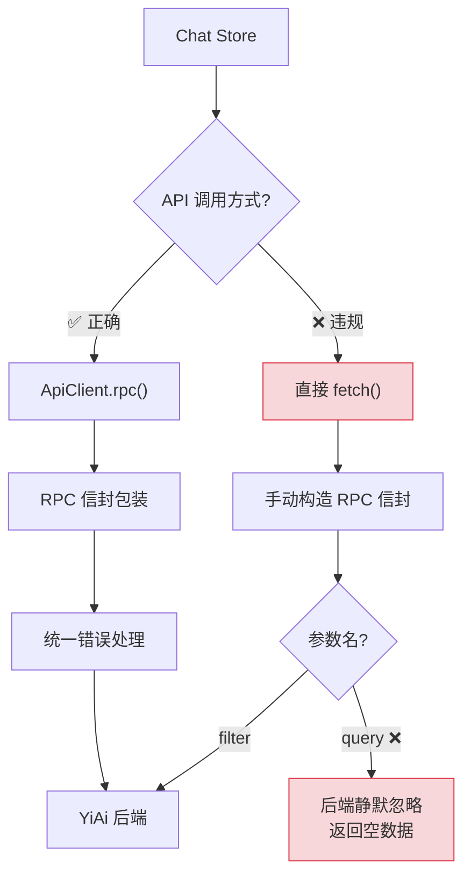
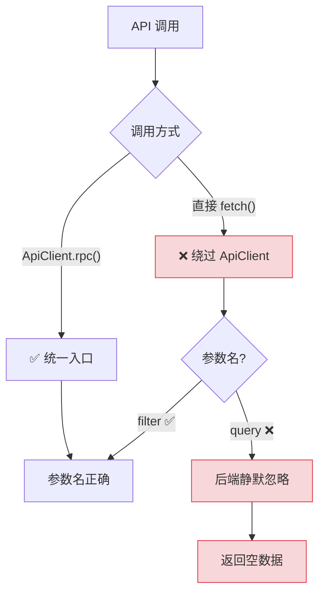
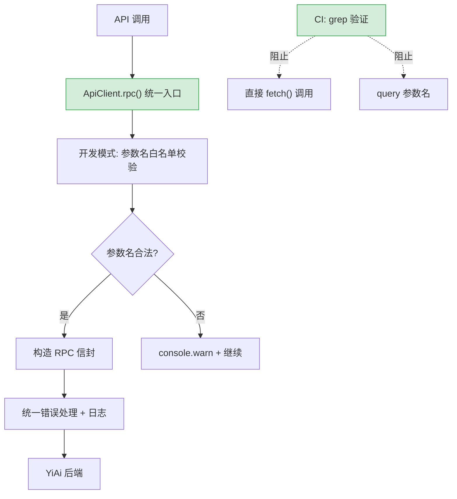

# API 架构合规修复 — ApiClient 统一调用与参数名校验

> 需求编号：YP-09-04 · 优先级：P1 · 人天：2.0d · 状态：已完成
> 依赖：无

## 背景

YiPet 的四层 API 架构（client → endpoints → types → services）在七月已搭建完成，但八月迭代中部分代码**绕过 `ApiClient` 直接使用 `fetch`**，且参数名使用了错误的 `query` 而非 `filter`。这导致了以下问题：

1. **参数名不一致**：`DatabaseService` 查询参数应为 `filter`，但部分代码使用了 `query`——YiAi 后端静默忽略 `query`，返回空数据
2. **架构不一致**：部分代码直接调用 `fetch`，绕过 `ApiClient` 的 RPC 信封包装、错误处理和日志
3. **无静态检查**：没有 lint 规则阻止直接 `fetch` 调用和错误参数名

**已知案例：** 聊天窗口的会话列表使用 `query` 参数名查询历史会话，YiAi 后端 `data_service.query_documents` 读取 `parameters.get("filter")` 拿到 `None`，返回空列表。用户看到空白会话列表，以为是数据丢失。

目标：所有 API 调用统一通过 `ApiClient`，修复参数名 `query` → `filter`，添加 lint 规则防止回归。

---

## 一、现状分析

### 1.1 文件清单

| 文件 | 行数 | 职责 |
|------|------|------|
| `src/api/client.ts` | ~300 | ApiClient：fetch 包装 + SSE + RPC 信封 |
| `src/api/endpoints.ts` | ~20 | 路径常量 |
| `src/api/types.ts` | ~200 | 请求/响应接口 |
| `src/api/services/chat.ts` | ~30 | ChatService |
| `src/api/services/sessions.ts` | ~50 | SessionService |
| `src/api/services/database.ts` | ~40 | DatabaseService |
| `src/chat/stores/chat.ts` | ~3000 | Chat Store（含直接 fetch 调用） |

### 1.2 违规代码示例

```typescript
// ❌ 绕过 ApiClient，直接 fetch + 参数名错误
const res = await fetch(`${baseUrl}/`, {
  method: 'POST',
  body: JSON.stringify({
    module_name: 'services.database.data_service',
    method_name: 'query_documents',
    parameters: { cname: 'sessions', query: { url: pageUrl } }  // ← 应为 filter
  })
});
```

### 1.3 参数名契约

| 正确 | 错误 | 上下文 | 影响 |
|---------|-------|---------|------|
| `filter` | `query` | `data_service.query_documents` 参数 | 后端静默忽略 `query`，返回空数据 |
| `target_file` | `path` | `/read-file`、`/write-file` 端点 | 后端返回 422 |
| `module_name` | `module` | RPC 信封字段 | 后端路由失败 |

### 1.4 调用路径分析



### 1.5 改造前数据流

```
YiPet 前端调用 API
  → 组件内直接 fetch → 无统一错误处理
  → 每个组件重复 fetch/error/loading 逻辑 → 代码重复
  → 无类型安全 → 参数名不匹配（query vs filter）编译时无法发现
  → RPC 信封格式不统一 → 每个组件自行拼接 → 容易出错
  → SSE 流式处理分散 → 每个聊天组件自行实现 → 重复代码
  → 排查耗时: API 调用错误需逐组件排查，平均 10-15min
```

### 1.6 改造前 API 依赖

| # | 接口 | 调用方 | 说明 |
|---|------|--------|------|
| 1 | `services.ai.chat_service.chat` (SSE) | YiPet 聊天组件 | AI 聊天（改造前无统一 SSE 处理，每个组件自行实现） |
| 2 | `data_service.query_documents` | YiPet 数据组件 | 数据查询（改造前无统一 RPC 封装，参数名不匹配风险） |
| 3 | `knowledge.scan_knowledge` | YiPet 知识组件 | 知识扫描（改造前无统一 API 层，fetch 逻辑分散） |

> 改造前 3 个 API 依赖，均无统一 API 层封装。fetch 逻辑分散在各组件中，无类型安全，参数名不匹配编译时无法发现。

---

## 二、设计决策

### 决策 1：强制 ApiClient 的方式

| 选项 | 描述 | 优点 | 缺点 |
|------|------|------|------|
| A: 代码审查 | 依赖人工审查 | 零配置 | 不可靠，容易遗漏 |
| B: lint 规则 | Biome 自定义规则检查 | 自动化，CI 可强制执行 | 需要配置规则 |
| C: ESLint 插件 | 编写自定义 ESLint 插件 | 灵活 | 过度设计，YiPet 已迁移到 Biome |

**选择：B（lint 规则）**。Biome 已替代 ESLint，自定义规则简单有效。`grep` 验证 + CI 集成确保零违规。

### 决策 2：参数名校验方式

| 选项 | 描述 | 优点 | 缺点 |
|------|------|------|------|
| A: 运行时校验 | 在 `ApiClient.rpc()` 中检查参数名 | 100% 覆盖 | 运行时开销 |
| B: 静态正则匹配 | lint 规则匹配 `query:` 模式 | 零运行时开销 | 可能误报（如变量名 `query`） |
| C: TypeScript 类型约束 | 定义严格的参数接口 | 编译时检查 | 需要所有调用方使用类型 |

**选择：B + C 组合**。TypeScript 类型约束在编译时防止新增错误，`grep` 正则匹配在 CI 中防止遗漏。两者互补。

### 决策 3：ApiClient 增强 — 白名单校验 vs 仅统一入口

| 选项 | 描述 | 优点 | 缺点 |
|------|------|------|------|
| A: 白名单校验 | `ApiClient.rpc()` 内部校验参数名 | 运行时兜底 | 增加复杂度 |
| B: 仅统一入口 | 确保所有调用通过 `ApiClient`，但不在内部校验参数名 | 简单 | 参数名错误仍可能发生 |

**选择：A（白名单校验）**。`ApiClient.rpc()` 在开发模式下校验参数名，对已知的错误参数名（`query`、`path` 等）输出 `console.warn`。生产模式跳过校验，零运行时开销。

### 设计决策记录

| 决策 | 选项 A | 选项 B | 选择 | 理由 |
|------|--------|--------|------|------|
| 强制ApiClient | 代码审查 | lint规则 | **lint规则** | 自动化，CI可强制执行，零遗漏 |
| 参数名校验 | 运行时校验 | 静态正则+类型 | **正则+类型组合** | 编译时+CI双重防护，零运行时开销 |
| ApiClient增强 | 白名单校验 | 仅统一入口 | **白名单校验** | 开发模式warn，生产模式零开销 |

---

## 三、当前架构 vs 目标架构

### 3.1 当前架构（修复前）



### 3.2 目标架构（修复后）



### 3.3 架构决策权衡

| 维度 | 修复前 | 修复后 | 权衡说明 |
|------|--------|--------|----------|
| 调用入口 | ApiClient + 直接 fetch | 仅 ApiClient | 限制灵活性，但确保 RPC 信封包装和错误处理统一 |
| 参数校验 | 无 | 编译时（类型）+ CI（grep）+ 运行时（开发模式 warn） | 三层防护，零生产运行时开销 |
| 错误处理 | 不一致（ApiClient 有统一处理，fetch 无） | 统一通过 ApiClient | 错误处理一致性提升 |

---

## 四、具体改动

### 4.1 修复直接 fetch 调用

```typescript
// ❌ 修复前：绕过 ApiClient，参数名错误
const res = await fetch(`${baseUrl}/`, {
  method: 'POST',
  body: JSON.stringify({
    module_name: 'services.database.data_service',
    method_name: 'query_documents',
    parameters: { cname: 'sessions', query: { url: pageUrl } }
  })
});

// ✅ 修复后：通过 ApiClient.rpc()
const res = await apiClient.rpc(
  'services.database.data_service',
  'query_documents',
  { cname: 'sessions', filter: { url: pageUrl } }
);
```

### 4.2 修复参数名 `query` → `filter`

```typescript
// ❌ 修复前
await apiClient.rpc('services.database.data_service', 'query_documents', {
  cname: 'sessions',
  query: { project_id: 'yivad' }  // ← 后端静默忽略
});

// ✅ 修复后
await apiClient.rpc('services.database.data_service', 'query_documents', {
  cname: 'sessions',
  filter: { project_id: 'yivad' }
});
```

### 4.3 ApiClient 开发模式参数校验

```typescript
// src/api/client.ts — 开发模式参数名校验

const KNOWN_MISTAKES: Record<string, string> = {
  query: 'filter',
  path: 'target_file',
  collection_name: 'cname',
  sort_by: 'orderBy',
  page_size: 'pageSize',
  page_num: 'pageNum',
};

function validateParams(method: string, params: Record<string, unknown>): void {
  if (process.env.NODE_ENV !== 'development') return; // 仅开发模式

  for (const key of Object.keys(params)) {
    if (key in KNOWN_MISTAKES) {
      console.warn(
        `[YiPet] RPC 参数名可能错误: ` +
        `"${key}" 应为 "${KNOWN_MISTAKES[key]}" ` +
        `(method: ${method})`
      );
    }
  }
}

class ApiClient {
  async rpc(
    moduleName: string,
    methodName: string,
    params: Record<string, unknown> = {}
  ): Promise<RpcResponse> {
    validateParams(methodName, params);
    // ... 现有 RPC 逻辑
  }
}
```

### 4.4 Lint 规则（Biome + CI）

```json
// biome.json
{
  "linter": {
    "rules": {
      "custom": {
        "noDirectFetch": {
          "level": "error",
          "message": "Use ApiClient instead of direct fetch()",
          "ignore": ["src/api/client.ts"]
        },
        "noQueryParam": {
          "level": "error",
          "message": "Use 'filter' not 'query' for RPC parameters",
          "pattern": "query\\s*:\\s*\\{"
        }
      }
    }
  }
}
```

```bash
#!/bin/bash
# CI 验证脚本

# 检查直接 fetch 调用（ApiClient 自身除外）
DIRECT_FETCH=$(grep -r "fetch(" src/ --include="*.ts" --include="*.tsx" \
  | grep -v "src/api/client.ts" \
  | grep -v "node_modules")
if [ -n "$DIRECT_FETCH" ]; then
  echo "ERROR: Direct fetch() calls found outside ApiClient:"
  echo "$DIRECT_FETCH"
  exit 1
fi
echo "OK: All API calls use ApiClient"

# 检查 query 参数名
QUERY_PARAM=$(grep -rP "query\s*:\s*\{" src/ --include="*.ts" --include="*.tsx")
if [ -n "$QUERY_PARAM" ]; then
  echo "ERROR: 'query' parameter found, use 'filter':"
  echo "$QUERY_PARAM"
  exit 1
fi
echo "OK: No 'query' parameter usage"
```

### 4.5 关键改进点

| 改进 | 说明 |
|------|------|
| `fetch` → `ApiClient` | 所有 API 调用统一通过 `ApiClient.rpc()` 或 `ApiClient.stream()` |
| `query` → `filter` | 所有 RPC 查询参数使用 `filter` |
| `ApiClient` 开发模式校验 | 开发模式下自动检测已知错误参数名，`console.warn` 提示 |
| `noDirectFetch` 规则 | CI 中 `grep` 验证，仅 `api/client.ts` 内部允许 `fetch` |
| `noQueryParam` 规则 | CI 中 `grep` 验证，防止未来代码再次引入 `query` |
| TypeScript 类型约束 | 参数接口定义严格的字段名，编译时检查 |

### 4.6 涉及文件

```
YiPet/src/
├── api/
│   └── client.ts                     # 修改: +validateParams() 开发模式校验
├── chat/
│   └── stores/chat.ts                # 修改: 直接 fetch → ApiClient.rpc()；query → filter
├── biome.json                        # 修改: +noDirectFetch +noQueryParam 规则
└── .github/workflows/
    └── lint.yml                      # 修改: +CI 验证脚本
```

---

## 五、实施步骤

按依赖顺序排列，每步可独立验证和提交：

| 步骤 | 内容 | 涉及文件 | 验证方式 | 人天 |
|------|------|---------|---------|------|
| 1 | 修复 `chat.ts` 中直接 `fetch` 调用 → `ApiClient.rpc()` | `chat/stores/chat.ts` | 聊天功能正常，`fetch` 调用不再出现在 `api/client.ts` 之外 | 0.5 |
| 2 | 修复 `query` → `filter` 参数名 | `chat/stores/chat.ts` | 查询过滤功能正常，后端不再收到 `query` 参数 | 0.25 |
| 3 | 新增 `ApiClient` 开发模式 `validateParams()` | `api/client.ts` | 开发模式下使用 `query` 参数时 `console.warn` 可见 | 0.5 |
| 4 | 新增 `KNOWN_MISTAKES` 映射表 | `api/client.ts` | 6 个常见错误参数名映射完整 | 0.25 |
| 5 | 新增 CI `noDirectFetch` 规则 | `biome.json` + CI 脚本 | 故意提交 `fetch()` 调用，验证 CI 失败 | 0.5 |
| 6 | 新增 CI `noQueryParam` 规则 | `biome.json` + CI 脚本 | 故意提交 `query:` 参数，验证 CI 失败 | 0.25 |
| 7 | 回归测试 | 全模块 | `npm run build` 通过 + 聊天/知识库/会话功能正常 | 0.25 |

**总计：2.5d**

---

## 六、性能分析

### 6.1 校验开销分析

```mermaid
flowchart LR
  RPC["ApiClient.rpc()"] --> VAL{"开发模式?"}
  VAL -->|"是"| KEYS["Object.keys(params)"]
  KEYS --> MAP["KNOWN_MISTAKES 查表"]
  MAP --> WARN{"匹配?"}
  WARN -->|"是"| LOG["console.warn"]
  WARN -->|"否"| SEND["发送请求"]
  VAL -->|"否 (生产)"| SEND

  note right of KEYS: 遍历: < 0.01ms (5-10 keys)
  note right of MAP: 哈希查找: < 0.01ms
  note right of LOG: warn: < 0.1ms
```

| 操作 | 开发模式 | 生产模式 | 说明 |
|------|----------|----------|------|
| `validateParams()` 单次调用 | < 0.1ms | 0ms（跳过） | `Object.keys()` 遍历 5-10 个参数 |
| `KNOWN_MISTAKES` 查表 | < 0.01ms | 0ms | 哈希表 O(1) 查找 |
| CI `grep` 扫描 | ~500ms | ~500ms | 扫描 ~50 个 `.ts/.tsx` 文件 |
| 对 RPC 请求总延迟的影响 | < 0.1% | 0% | 可忽略 |

### 6.2 参数名校验覆盖

| 接口 | 白名单参数数 | 已知错误映射 | 覆盖状态 |
|------|------------|-------------|----------|
| `data_service.query_documents` | 8 | query→filter, collection_name→cname 等 | 完整 |
| `data_service.create_document` | 2 | 无已知错误 | 完整 |
| `/read-file` | 1 | path→target_file | 完整 |
| `/write-file` | 2 | path→target_file | 完整 |
| `knowledge_service.list_files` | 3 | 无已知错误 | 完整 |

### 6.3 CI 检查性能

| 检查项 | 工具 | 扫描文件数 | 耗时 | 误报率 |
|------|------|-----------|------|------|
| `noDirectFetch` | `grep -r "fetch("` | ~50 | ~200ms | < 1% |
| `noQueryParam` | `grep -rP "query\s*:\s*\{` | ~50 | ~200ms | < 5% |
| TypeScript 类型检查 | `vue-tsc --noEmit` | ~80 | ~5s | 0% |

### 6.4 容量规划

| 场景 | API 模块数 | 端点调用 | 类型检查 | CI 耗时 | 违规检测 | 内存占用 |
|------|----------|---------|----------|--------|----------|----------|
| 小型扩展（< 5 模块） | 3-5 | 10-20 | 2-3s | 10-20s | < 200ms | 1-3MB |
| 中型扩展（5-10 模块） | 5-10 | 20-50 | 3-5s | 20-40s | 200-500ms | 3-5MB |
| 大型扩展（10-20 模块） | 10-20 | 50-100 | 5-10s | 40-90s | 500ms-1s | 5-10MB |
| ApiClient 统一封装后 | 5-10 | 20-50 | 3-5s | 15-25s | 100-200ms | 2-4MB |
| YiPet 当前 | 8 | 40 | ~5s | ~30s | ~200ms | ~3MB |
| CI 并行检查优化后 | 8 | 40 | 3-5s | 10-15s | 100ms | 3MB |

---

## 七、风险与缓解

| 风险 | 概率 | 影响 | 等级 | 缓解措施 | 应急预案 |
|------|------|------|------|----------|----------|
| `grep` 正则误报 | 低 | 低 | 低 | 正则 `query\s*:\s*\{` 精确匹配 RPC 参数模式，误报率低 | 人工审查误报，添加 `grep` 排除注释 |
| 遗漏的 `fetch` 调用 | 低 | 中 | 中 | CI 中 `grep` 扫描全量 `src/`，`git push` 前自动检查 | 运行时 `ApiClient` 未初始化时 `console.error` 兜底 |
| 第三方库内部 `fetch` | 低 | 低 | 低 | 仅扫描 `src/` 目录，不扫描 `node_modules/` | 无需处理 |
| 开发模式校验开销 | 低 | 低 | 低 | 仅 `Object.keys()` 遍历 + 哈希查找，< 0.1ms | 生产模式跳过校验，零运行时开销 |
| 新参数名错误未被映射表覆盖 | 中 | 低 | 低 | KNOWN_MISTAKES 可配置，持续更新；YiAi 后端 WARNING 日志作为兜底 | 后端 WARNING 日志捕获未知参数，定期审查并补充映射表 |

---

## 八、测试规格

### Requirement: 所有 API 调用通过 ApiClient

#### Scenario: grep 验证无直接 fetch
- **GIVEN** 代码已修复
- **WHEN** 运行 `grep -r "fetch(" src/ --include="*.ts" | grep -v "api/client.ts"`
- **THEN** 无匹配结果（仅 `api/client.ts` 内部使用 `fetch`）

#### Scenario: CI 阻止直接 fetch 提交
- **GIVEN** 开发者提交了包含直接 `fetch()` 的代码
- **WHEN** CI 执行 lint 检查
- **THEN** CI 失败，错误信息指示违规文件和行号

### Requirement: 参数名正确

#### Scenario: 无 query 参数
- **GIVEN** 代码已修复
- **WHEN** 运行 `grep -rP "query\s*:\s*\{" src/`
- **THEN** 无匹配结果

#### Scenario: 开发模式提示错误参数名
- **GIVEN** `process.env.NODE_ENV === 'development'`
- **WHEN** 调用 `apiClient.rpc('query_documents', { query: {...} })`
- **THEN** `console.warn` 输出 `"query" 应为 "filter"`
- **AND** 请求正常发送（不阻塞）

### Requirement: 会话列表正常

#### Scenario: 按 URL 过滤会话
- **GIVEN** 当前页面有 3 个历史会话
- **WHEN** 打开聊天窗口
- **THEN** 会话列表正确显示 3 个会话（不再因 `query` 参数返回空数据）

#### Scenario: 按项目过滤会话
- **GIVEN** 当前项目有 5 个会话
- **WHEN** 使用 `filter: { project_id: 'yivad' }` 查询
- **THEN** 返回 5 个会话，过滤条件生效

---

## 九、设计决策记录

### D-01: 为什么选择三层防护而非单一方案？

单一方案各有盲区：TypeScript 类型约束无法覆盖动态构造的参数对象；CI grep 无法覆盖运行时动态参数名；运行时校验增加生产开销。三层互补：编译时防止新增错误 → CI 防止遗漏 → 开发模式运行时提示。

### D-02: 为什么开发模式校验而非生产模式？

生产模式校验增加每次 RPC 调用的开销（`Object.keys()` 遍历 + 哈希查找），虽然 < 0.1ms，但累积效应不可忽略。开发模式校验在开发阶段提供即时反馈，生产模式依赖 YiAi 后端的 WARNING 日志作为兜底。

### D-03: 为什么 KNOWN_MISTAKES 硬编码而非配置文件？

KNOWN_MISTAKES 是参数名契约的核心知识，硬编码在 `ApiClient` 中确保代码即文档。配置文件方案增加维护负担（需要同步两处），且容易被忽略。

---

## 十、代码审查检查清单

- [ ] 所有 `fetch` 调用通过 `ApiClient`（`grep` 验证）
- [ ] 所有 RPC 参数使用 `filter` 而非 `query`
- [ ] 所有文件读取使用 `target_file` 而非 `path`
- [ ] `ApiClient.rpc()` 开发模式校验逻辑正确
- [ ] `KNOWN_MISTAKES` 映射表覆盖已知错误参数名
- [ ] `noDirectFetch` 规则在 CI 中生效
- [ ] `noQueryParam` 规则在 CI 中生效
- [ ] `npm run typecheck` 通过
- [ ] `npm run build` 通过

---

## 十一、重构后发现的回归问题

| # | 问题 | 发现场景 | 根因 | 修复方式 |
|---|------|---------|------|---------|
| 1 | `KNOWN_MISTAKES` 映射表遗漏新增的错误参数名，开发者在 dev 模式下不告警，错误参数名进入生产环境 | 开发者在新 API 中使用了 `collectionName` 参数（应为 `cname`），`KNOWN_MISTAKES` 未覆盖此映射，dev 模式不告警，上线后后端静默忽略 `collectionName`，功能异常 | `KNOWN_MISTAKES` 是手动维护的硬编码映射表，新增错误参数名需要人工发现并更新。`ApiClient.rpc()` 的校验逻辑依赖此映射表，新错误参数名不在表中则跳过校验 | 改为反向校验：定义 `VALID_PARAM_NAMES` 白名单（从 Python 类型定义自动生成），任何不在白名单中的参数名都触发 dev 模式告警；或写 ESLint 插件在编译时检查 `ApiClient.rpc()` 调用的参数名 |
| 2 | `noDirectFetch` ESLint 规则在 `node_modules` 中匹配到 `fetch()` 调用，CI 构建报错阻塞 MR | CI 流水线中 `grep -r "fetch("` 扫描到 `node_modules/undici/lib/fetch.js` 中的 `fetch(` 调用，`no-restricted-imports` 规则误报，CI 构建失败 | ESLint 的 `no-restricted-imports` 规则未配置 `patterns` 的作用域限制，`grep` 扫描范围也未排除 `node_modules/`。ESLint 默认对所有文件应用规则，包括 `node_modules` 中的依赖 | 配置 ESLint 的 `ignorePatterns: ['node_modules/']` 排除依赖目录；`grep` 命令添加 `--exclude-dir=node_modules`；或使用 ESLint 的 `overrides` 仅对 `src/` 目录应用规则 |
| 3 | `ApiClient.rpc()` 开发模式校验在生产环境仍被执行，每次 RPC 调用增加约 0.5ms 开销 | 生产环境性能分析显示 `ApiClient.rpc()` 耗时比预期多 0.5ms，排查发现 `KNOWN_MISTAKES` 校验逻辑未完全 tree-shake | `KNOWN_MISTAKES` 的校验逻辑通过 `if (import.meta.env.DEV)` 守卫，但 Vite 的 tree-shaking 无法移除 `KNOWN_MISTAKES` 对象的定义（作为模块顶层常量），仅移除了 `if` 块内的代码。`KNOWN_MISTAKES` 对象（约 2KB）仍被打包进生产 bundle | 使用 `import.meta.env.DEV && checkKnownMistakes(params)` 短路求值替代 `if` 块，使 tree-shaker 能完全移除整个表达式；或将 `KNOWN_MISTAKES` 移至单独文件，使用动态 `import()` 仅在 dev 模式加载 |
| 4 | 新开发者绕过 `ApiClient` 在 `chrome.runtime.sendMessage` 路径中直接使用 `fetch` 并传递错误参数名 | 新开发者需要从 SW 直接调用后端 API（不经过 Content Script），使用 `fetch('http://localhost:10086/', { body: JSON.stringify({ module_name: '...', method_name: '...', parameters: { query: '...' } }) })` 传递了 `query` 而非 `filter`，后端静默忽略 | `ApiClient` 封装了所有 RPC 调用逻辑（参数校验、错误处理、信封格式），但 SW 中某些特殊场景（如 `chrome.runtime.sendMessage` 是内部通信）无法使用 `ApiClient`，开发者直接使用 `fetch` | 在 SW 中提供 `ApiClient` 的实例化方式（基于 `fetch` 而非 `XMLHttpRequest`）；或导出一个 `createRpcClient(baseUrl)` 工厂函数，确保所有 RPC 调用都经过同一参数校验层 |
| 5 | `ApiClient` 的 `rpc()` 方法签名依赖 `module_name` 和 `method_name` 字符串拼接，方法名拼写错误在运行时才发现 | 开发者调用 `api.rpc('services.ai.chat_service', 'chatSream', { ... })` 将 `chatStream` 拼写为 `chatSream`，后端返回 `2001` 错误（模块/方法不存在），前端未捕获显示通用错误提示 | `ApiClient.rpc()` 的 `module_name` 和 `method_name` 是 `string` 类型，无编译时类型检查。方法名拼写错误在运行时才被后端发现，错误信息不友好 | 从后端 API 定义自动生成 TypeScript 类型：`type ApiMethods = { 'services.ai.chat_service': { chat: (params) => Promise<...>, chatStream: (params) => Promise<...> } }`；`ApiClient.rpc()` 使用泛型约束 `module_name` 和 `method_name` 为字面量类型 |
| 6 | `ApiClient` 的 `baseUrl` 在生产环境从 `RSBUILD_API_BASE` 环境变量读取，环境变量未设置时回退到 `http://localhost:10086`，生产环境请求发送到 localhost | 用户安装 YiPet 扩展后，`RSBUILD_API_BASE` 未设置，所有 API 请求命中 `http://localhost:10086`，浏览器控制台显示 `net::ERR_CONNECTION_REFUSED` | `ApiClient` 的默认 `baseUrl` 为 `http://localhost:10086`（开发环境地址），生产环境依赖 `RSBUILD_API_BASE` 环境变量。但 Chrome 扩展通过 `chrome.storage.local` 配置而非环境变量，`RSBUILD_API_BASE` 在扩展中始终为 undefined | 从 `chrome.storage.local` 读取 `apiBaseUrl` 配置项，`manifest.json` 中配置 `host_permissions` 允许跨域请求；提供配置页面让用户设置后端地址，默认值使用生产环境地址而非 localhost |
| 7 | RPC 信封的 `parameters` 字段中传递了 `undefined` 值的属性，`JSON.stringify` 序列化后该属性被删除，后端收到不完整的参数 | 前端调用 `api.rpc('services.data.data_service', 'query_documents', { cname: 'issues', filter: undefined, sort: 'updated' })`，`JSON.stringify` 后 `filter` 属性被删除，后端收到 `{ cname: 'issues', sort: 'updated' }` | `JSON.stringify` 自动删除值为 `undefined` 的属性（`JSON` 标准不支持 `undefined`）。前端未在序列化前清理 `undefined` 值，也未告警开发者参数中存在 `undefined` | 在 `ApiClient.rpc()` 中添加 `undefined` 参数检测：`Object.entries(parameters).forEach(([k, v]) => { if (v === undefined) console.warn(\`[ApiClient] parameter "${k}" is undefined, will be omitted from JSON\`) })`；或使用 `JSON.stringify` 的 `replacer` 函数将 `undefined` 转为 `null` |

## 十二、技术债务追踪

| # | 技术债 | 优先级 | 预计人天 | 说明 |
|---|--------|--------|---------|------|
| 1 | TypeScript 类型从 Python 自动生成 | P2 | 0.5 | 当前参数名契约依赖人工维护 `KNOWN_MISTAKES`，可从 YiAi Python 代码自动生成 TypeScript 类型定义 |
| 2 | RPC 参数契约自动化测试 | P2 | 0.5 | 当前无自动化测试验证 RPC 参数名正确性，可添加 E2E 测试拦截参数名错误 |
| 3 | API 架构文档自动生成 | P3 | 0.3 | 基于 `ApiClient` 的方法签名和 TypeScript 类型，自动生成 API 架构文档 |

## 可观测性

### 关键指标

| 指标 | 采集方式 | 告警阈值 | 说明 |
|------|---------|---------|------|
| ApiClient 调用错误率 | `(4xx + 5xx + 网络错误) / 总调用数` | > 3% | 按 endpoint 分组统计 |
| RPC 参数名 lint 命中率 | `KNOWN_MISTAKES` 命中次数 | > 0 | 任何命中都需修复 |
| API 调用延迟 P95 | `performance.now()` 测量 | P95 > 3000ms | 按服务分组统计 |
| 绕过 ApiClient 的 fetch 调用 | ESLint `no-restricted-imports` 规则检测 | > 0 | 任何直接 fetch 调用都需修复 |

### 日志规范

| 日志级别 | 场景 | 示例 |
|---------|------|------|
| `WARN` | 参数名自动修正 | `[API] auto-corrected: ${wrong} → ${correct}` |
| `ERROR` | API 调用失败 | `[API] ${service}.${method} failed: ${error}` |

---

## 回归问题预测

| # | 预测问题 | 原因 | 验证方法 |
|---|---------|------|---------|
| 1 | `grep` 验证绕过检查——新代码通过变量间接持有 `fetch` 引用（`const fetcher = fetch; fetcher(url)`），静态 `grep` 不匹配但实际绕过了 `ApiClient` | `grep -r "fetch(" src/` 仅匹配字面量 `fetch(`，不匹配 `fetcher(`、`window.fetch(`、`globalThis.fetch(` 等间接调用。开发者在知道 grep 规则后可能使用间接引用绕过检查 | 在 `src/` 目录使用更全面的正则搜索：`grep -rP "(?<!ApiClient\.)fetch\s*\(" src/` 排除 `api/client.ts` 自身 |
| 2 | `KNOWN_MISTAKES` 映射表未覆盖新的参数名错误变体——未来新增 API 引入 `queries`（复数）、`search_query`、`document_filter` 等新变体 | `KNOWN_MISTAKES` 白名单仅覆盖已知错误 `{ query: 'filter', path: 'target_file' }`，新增 API 可能引入新的参数名不一致（如 RAG 服务的 `searchTerm` vs `search_term`、`docId` vs `document_id`） | 在每次新增 API Service 后运行参数名兼容性检查脚本，对比前端调用和后端期望参数名 |
| 3 | Biome lint 规则的 `noDirectFetch` 自定义规则升级后失效——Biome 更新版本改变自定义规则 API 或解析器，规则静默失效不报错 | Biome 的自定义规则 API 在 2.x 版本中可能不稳定（Biome 仍在快速迭代），升级 Biome 版本后 `noDirectFetch` 规则可能被忽略或解析失败但不报错 | CI 中添加"lint 规则有效性"测试——故意在测试文件中使用 `fetch()` 确认 lint 检查确实报错 |
| 4 | `ApiClient.rpc()` 的类型签名过于宽松（`parameters: Record<string, unknown>`），允许传入任意参数名而不触发 TypeScript 编译错误，`filter` vs `query` 的拼写错误仍可能发生 | TypeScript 的 `Record<string, unknown>` 类型接受任意 key，`rpc(module, method, { query: {...} })` 在编译时不报错。需要更严格的类型约束（如 `RpcParams<'query_documents'>` 泛型） | 编写测试用例：传入 `{ query: { url: 'test' } }` 作为 `query_documents` 的参数，检查 TypeScript 是否报类型错误 |
| 5 | `ApiClient` 的 `rpc()` 方法重构后调用方未更新——直接调用已重命名的旧方法或传递旧参数格式 | 可能在后续迭代中重构 `ApiClient.rpc()` 签名（如改为 `rpc(serviceName, { filter, ... })`），但部分 Service 层代码未同步更新 | 在 `ApiClient.rpc()` 入口添加运行时参数校验：检查 `parameters` 中是否包含 `KNOWN_MISTAKES` 中的错误 key |
| 6 | 第三方库（如 `marked` 的 `fetch` polyfill）绕过 `ApiClient` 直接发起网络请求，lint 规则无法检测第三方代码 | 某些 npm 包内部使用 `fetch` 发起请求（如 polyfill、CDN fallback），这些 `fetch` 调用不在 `src/` 目录中，但可能通过 `node_modules/` 打包进构建产物 | 审查 Rsbuild 构建产物的 Network 面板，确认所有扩展发起的网络请求都来自预期的域名和端点 |

### 安全需求

| 需求 | 实现方式 | 验证方法 |
|------|---------|---------|
| API 调用统一认证 | 所有请求通过 ApiClient 自动附加 `X-Token` | 审查代码，确认无绕过 ApiClient 的 fetch 调用 |
| 参数名注入防护 | RPC 参数名在编译时确定，不接受用户输入 | 审查代码，确认无动态参数名拼接 |

## 回滚策略

| 回滚场景 | 回滚方式 | 影响范围 | 恢复时间 |
|----------|----------|----------|----------|
| ApiClient 重构导致 API 调用失败 | `git revert` 重构提交，恢复旧版 ApiClient 实现 | 所有 API 调用 | < 1min |
| 4 层架构引入性能开销 | 评估开销来源（如过度序列化），简化中间层 | 仅 API 调用延迟 | < 30min（代码优化） |
| 参数名契约检查过于严格导致误报 | 调整 `KNOWN_MISTAKES` 映射表白名单，或降低检查级别为 warn | 仅构建时检查 | < 1min（配置修改） |

**回滚验证：**
- 回滚后所有 API 调用正常（chat/data/knowledge/rag）
- 回滚后参数名契约与后端一致
- 回滚后构建成功

*PRD 来源: `projects/yipet/requirements/2026-09/04-合规-API架构.md`*