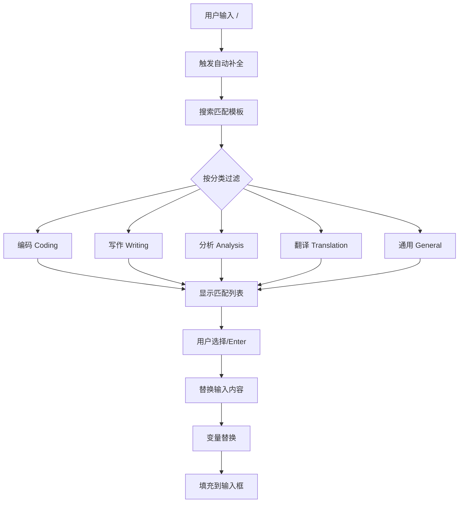

# YP-09-103: 快捷回复与消息模板 — 预设模板、斜杠命令与模板变量替换

> 需求编号：YP-09-103 · 优先级：P2 · 人天：0.5d · 状态：需求已编写
> 依赖：YP-09-05（聊天窗口交互）、YP-09-97（键盘快捷键系统）

## 背景

### 问题陈述

用户在使用 YiPet 聊天时，经常重复输入相似的问题或指令，例如"解释这段代码"、"总结这个页面"、"翻译成英文"。每次都需要手动输入完整的提示词，效率低下。此外，当用户选中页面文本后，需要手动复制 → 粘贴到聊天窗口 → 补充上下文，操作繁琐。当前 YiPet 缺乏：

1. **快捷回复**：无预设模板，每次重复输入相同指令
2. **模板变量**：无法自动获取选中文本、页面标题、URL 等上下文
3. **斜杠命令**：无 `/explain`、`/summarize` 等快捷指令
4. **模板管理**：无自定义模板创建和管理功能

**核心矛盾**：AI 聊天助手的高频使用场景（代码解释、页面总结、翻译）需要重复输入相似的提示词，缺乏模板化手段导致每次都需要手动构造 prompt。

### 影响范围

| # | 影响 | 严重程度 | 典型场景 |
|---|------|----------|----------|
| 1 | 重复输入相同指令 | 中 | 每日多次"解释这段代码" |
| 2 | 上下文手动拼接 | 中 | 选中文本后手动粘贴 + 补充标题 |
| 3 | 无快捷指令 | 中 | 需要输入完整英文指令 |
| 4 | 模板无法复用 | 低 | 跨设备、跨会话丢失常用模板 |
| 5 | 模板使用情况未知 | 低 | 不知道哪些模板受欢迎 |

### 挑战

| 挑战 | 说明 |
|------|------|
| 模板变量替换 | 需要从页面上下文获取选中文本、标题、URL，并安全替换到模板中 |
| 斜杠命令自动补全 | 用户输入 `/` 后需要实时显示匹配的命令列表，支持键盘导航 |
| 模板存储与同步 | 用户自定义模板需要持久化存储，支持导入/导出 |
| 快捷按钮布局 | 聊天输入框下方最多显示 4 个快捷按钮，需支持配置 |
| 模板变量安全 | 用户可能注入恶意内容到模板变量中，需做转义 |

---

## 一、现状分析

### 1.1 当前消息输入方式

```
现有能力:
├── 文本输入框（textarea）                      # 自由输入
├── 发送按钮                                   # 回车或点击发送
├── 无                                          # 无快捷回复
└── 无                                          # 无消息模板

缺失:
├── 预设快捷回复按钮                           # ❌ 不存在
├── 模板变量替换（{{selection}} 等）            # ❌ 不存在
├── 斜杠命令自动补全                           # ❌ 不存在
├── 用户自定义模板管理                         # ❌ 不存在
├── 模板分类（编码/写作/分析/翻译/通用）         # ❌ 不存在
├── 模板导入/导出                              # ❌ 不存在
├── 模板使用统计                               # ❌ 不存在
└── 常用模板置顶                               # ❌ 不存在
```

### 1.2 改造前消息发送流程

```mermaid
graph TD
    A[用户想解释代码] --> B[选中页面中的代码]
    B --> C[Ctrl+C 复制]
    C --> D[打开 YiPet 聊天窗口]
    D --> E[手动输入"解释这段代码"]
    E --> F[Ctrl+V 粘贴代码]
    F --> G[点击发送]
    
    style E fill:#f99,stroke:#f00
    style F fill:#f99,stroke:#f00
```

### 1.3 根因矩阵

| 症状 | 根因 | 触发条件 | 频率 |
|------|------|----------|------|
| 重复输入相同指令 | 无模板系统 | 高频 AI 交互场景 | 高 |
| 手动拼接上下文 | 无模板变量 | 需要引用页面内容 | 高 |
| 无快捷输入方式 | 无斜杠命令 | 习惯命令行效率的用户 | 中 |
| 模板无法复用 | 无持久化存储 | 跨会话使用 | 中 |
| 模板使用情况不透明 | 无使用统计 | 产品优化决策 | 低 |

---

## 二、设计决策

### 决策 1：模板存储位置 — chrome.storage.sync vs localStorage vs IndexedDB

| 选项 | 跨设备同步 | 容量限制 | 访问速度 | 离线支持 |
|------|-----------|----------|----------|----------|
| `chrome.storage.sync` | 是 | 100KB（总计） | 快 | 是 |
| `localStorage` | 否 | 5-10MB | 快 | 是 |
| `IndexedDB` | 否 | 无限制 | 中 | 是 |

**选择：`chrome.storage.sync`（用户模板）+ `chrome.storage.local`（内置模板）。** 用户自定义模板数量有限（通常 < 50 条），100KB 足够。`chrome.storage.sync` 支持跨设备同步，用户在不同设备上登录同一 Chrome 账号可共享模板。内置模板（预设）存储在 `chrome.storage.local` 中，不占用 sync 配额。

### 决策 2：斜杠命令实现 — 输入监听 vs contenteditable 选区 vs 组合

| 选项 | 实现复杂度 | 兼容性 | 中文输入法兼容 |
|------|-----------|--------|--------------|
| 输入监听（textarea input 事件） | 低 | 全平台 | 好（需处理 composition） |
| contenteditable 选区操作 | 高 | 中 | 差 |
| 组合方案 | 中 | 全平台 | 好 |

**选择：输入监听（textarea input 事件）。** 在 `textarea` 的 `input` 事件中检测 `/` 字符，触发自动补全面板。需正确处理中文输入法的 compositionstart/compositionend 事件，避免在拼音输入过程中误触发。

### 决策 3：模板变量来源 — 页面上下文 vs 扩展 API vs 用户输入

| 选项 | 实时性 | 准确率 | 安全风险 |
|------|--------|--------|----------|
| 页面上下文（Content Script 获取） | 高 | 高 | 低（服务端渲染） |
| 扩展 API（`chrome.tabs.query`） | 高 | 高 | 低 |
| 用户输入（手动填写） | 低 | 低 | 低 |

**选择：页面上下文 + 扩展 API 组合。** `{{selection}}` 通过 Content Script 的 `window.getSelection()` 获取，`{{pageTitle}}` 通过 `document.title` 获取，`{{pageUrl}}` 通过 `window.location.href` 获取，`{{date}}` 通过 `new Date()` 本地生成。不依赖服务端，安全高效。

### 决策 4：快捷按钮布局 — 固定 4 个 vs 可配置数量 vs 纵向列表

| 选项 | 空间占用 | 可配置性 | 操作效率 |
|------|---------|----------|----------|
| 固定 4 个 | 低 | 用户可选择哪些模板显示 | 高 |
| 可配置数量（2-8） | 中 | 高 | 中 |
| 纵向列表（可滚动） | 高 | 高 | 低 |

**选择：固定 4 个快捷按钮。** 聊天输入框下方空间有限，4 个按钮在视觉上平衡，用户可配置哪些模板出现在快捷按钮区。更多模板通过斜杠命令或模板面板访问。

### 设计决策记录

| 决策 | 选项 A | 选项 B | 选项 C | 选择 | 理由 |
|------|--------|--------|--------|------|------|
| 模板存储 | chrome.storage.sync | localStorage | IndexedDB | **chrome.storage.sync** | 跨设备同步 |
| 斜杠命令 | 输入监听 | contenteditable | 组合 | **输入监听** | 简单可靠 |
| 模板变量 | 页面上下文 | 扩展 API | 用户输入 | **组合** | 覆盖所有变量 |
| 快捷按钮 | 固定 4 个 | 可配置数量 | 纵向列表 | **固定 4 个** | 空间平衡 |

---

## 三、目标架构

### 3.1 模板系统架构

```mermaid
graph TD
    subgraph "模板存储"
        A1[内置模板 - chrome.storage.local]
        A2[用户模板 - chrome.storage.sync]
    end
    
    subgraph "模板引擎"
        B1[TemplateEngine]
        B1 --> B2[变量解析器]
        B1 --> B3[模板渲染器]
        B2 --> B4[{{selection}} → getSelection()]
        B2 --> B5[{{pageTitle}} → document.title]
        B2 --> B6[{{pageUrl}} → location.href]
        B2 --> B7[{{date}} → new Date()]
    end
    
    subgraph "交互层"
        C1[快捷按钮 4 个]
        C2[斜杠命令自动补全]
        C3[模板管理面板]
        C4[模板导入/导出]
    end
    
    A1 --> B1
    A2 --> B1
    B1 --> C1
    B1 --> C2
    B3 --> C1
    C3 --> A2
    C4 --> A2
```

### 3.2 斜杠命令自动补全流程



### 3.3 性能指标

| 指标 | 目标值 | 说明 |
|------|--------|------|
| 斜杠命令响应 | < 50ms | 输入 `/` 到显示补全列表 |
| 模板变量替换 | < 10ms | 所有变量替换完成 |
| 模板列表加载 | < 100ms | 从 storage 读取全部模板 |
| 模板导入/导出 | < 500ms | JSON 文件读写 |
| 快捷按钮点击 → 填充 | < 50ms | 模板渲染 + 输入框填充 |

---

## 四、具体改动

### 4.1 模板引擎

```typescript
// src/services/template/engine.ts (新增)

interface Template {
  id: string;
  category: 'coding' | 'writing' | 'analysis' | 'translation' | 'general';
  title: string;
  content: string;           // 模板内容，含 {{variable}} 占位符
  slashCommand: string;      // 斜杠命令，如 "explain"
  icon?: string;             // emoji 图标
  isBuiltin: boolean;        // 是否内置模板
  usageCount: number;        // 使用次数
  lastUsedAt: number | null; // 上次使用时间
  createdAt: number;
  updatedAt: number;
}

interface TemplateContext {
  selection?: string;    // 页面选中文本
  pageTitle?: string;    // 页面标题
  pageUrl?: string;      // 页面 URL
  date?: string;         // 当前日期
}

const BUILTIN_TEMPLATES: Template[] = [
  {
    id: 'builtin-explain-code',
    category: 'coding',
    title: '解释代码',
    content: '请解释以下代码的功能和实现逻辑：\n\n```\n{{selection}}\n```',
    slashCommand: 'explain',
    icon: '💻',
    isBuiltin: true,
    usageCount: 0,
    lastUsedAt: null,
    createdAt: 0,
    updatedAt: 0,
  },
  {
    id: 'builtin-summarize-page',
    category: 'analysis',
    title: '总结页面',
    content: '请总结以下页面的核心内容（页面标题：{{pageTitle}}）：\n\n{{selection}}',
    slashCommand: 'summarize',
    icon: '📄',
    isBuiltin: true,
    usageCount: 0,
    lastUsedAt: null,
    createdAt: 0,
    updatedAt: 0,
  },
  {
    id: 'builtin-translate-en',
    category: 'translation',
    title: '翻译成英文',
    content: '请将以下内容翻译成英文：\n\n{{selection}}',
    slashCommand: 'translate',
    icon: '🌐',
    isBuiltin: true,
    usageCount: 0,
    lastUsedAt: null,
    createdAt: 0,
    updatedAt: 0,
  },
  {
    id: 'builtin-translate-zh',
    category: 'translation',
    title: '翻译成中文',
    content: '请将以下内容翻译成中文：\n\n{{selection}}',
    slashCommand: 'translate-zh',
    icon: '🇨🇳',
    isBuiltin: true,
    usageCount: 0,
    lastUsedAt: null,
    createdAt: 0,
    updatedAt: 0,
  },
  {
    id: 'builtin-improve-writing',
    category: 'writing',
    title: '润色文字',
    content: '请润色以下文字，使其更流畅、专业：\n\n{{selection}}',
    slashCommand: 'improve',
    icon: '✍️',
    isBuiltin: true,
    usageCount: 0,
    lastUsedAt: null,
    createdAt: 0,
    updatedAt: 0,
  },
  {
    id: 'builtin-code-review',
    category: 'coding',
    title: '代码审查',
    content: '请审查以下代码，指出潜在问题和改进建议：\n\n```\n{{selection}}\n```',
    slashCommand: 'review',
    icon: '🔍',
    isBuiltin: true,
    usageCount: 0,
    lastUsedAt: null,
    createdAt: 0,
    updatedAt: 0,
  },
  {
    id: 'builtin-generate-test',
    category: 'coding',
    title: '生成测试',
    content: '请为以下代码生成单元测试：\n\n```\n{{selection}}\n```',
    slashCommand: 'test',
    icon: '🧪',
    isBuiltin: true,
    usageCount: 0,
    lastUsedAt: null,
    createdAt: 0,
    updatedAt: 0,
  },
  {
    id: 'builtin-explain-concept',
    category: 'general',
    title: '解释概念',
    content: '请解释以下概念：{{selection}}',
    slashCommand: 'what',
    icon: '❓',
    isBuiltin: true,
    usageCount: 0,
    lastUsedAt: null,
    createdAt: 0,
    updatedAt: 0,
  },
];

export class TemplateEngine {
  private templates: Template[] = [];
  private context: TemplateContext = {};

  async initialize(): Promise<void> {
    // 加载内置模板
    const builtinResult = await chrome.storage.local.get('yipet:builtin-templates');
    if (!builtinResult['yipet:builtin-templates']) {
      await chrome.storage.local.set({
        'yipet:builtin-templates': BUILTIN_TEMPLATES,
      });
    }

    // 加载用户模板
    const userResult = await chrome.storage.sync.get('yipet:user-templates');
    const userTemplates: Template[] = userResult['yipet:user-templates'] || [];

    const builtins: Template[] = builtinResult['yipet:builtin-templates'] || BUILTIN_TEMPLATES;
    this.templates = [...builtins, ...userTemplates];
  }

  setContext(ctx: TemplateContext): void {
    this.context = ctx;
  }

  render(templateId: string): string {
    const template = this.getTemplate(templateId);
    if (!template) return '';

    let content = template.content;
    content = content.replace(/\{\{selection\}\}/g, this.context.selection || '');
    content = content.replace(/\{\{pageTitle\}\}/g, this.context.pageTitle || '');
    content = content.replace(/\{\{pageUrl\}\}/g, this.context.pageUrl || '');
    content = content.replace(/\{\{date\}\}/g, this.context.date || new Date().toLocaleDateString('zh-CN'));

    // 清理未替换的变量
    content = content.replace(/\{\{\w+\}\}/g, '');

    // 记录使用
    this.recordUsage(templateId);

    return content.trim();
  }

  searchBySlashCommand(query: string): Template[] {
    const q = query.toLowerCase().replace(/^\//, '');
    if (!q) return this.getQuickAccessTemplates();

    return this.templates.filter(t =>
      t.slashCommand.toLowerCase().includes(q) ||
      t.title.toLowerCase().includes(q)
    ).sort((a, b) => b.usageCount - a.usageCount);
  }

  getTemplatesByCategory(category: Template['category']): Template[] {
    return this.templates.filter(t => t.category === category);
  }

  getQuickAccessTemplates(): Template[] {
    return this.templates
      .sort((a, b) => b.usageCount - a.usageCount)
      .slice(0, 4);
  }

  async addUserTemplate(template: Omit<Template, 'id' | 'isBuiltin' | 'usageCount' | 'lastUsedAt' | 'createdAt' | 'updatedAt'>): Promise<Template> {
    const newTemplate: Template = {
      ...template,
      id: `user-${Date.now()}-${Math.random().toString(36).slice(2, 8)}`,
      isBuiltin: false,
      usageCount: 0,
      lastUsedAt: null,
      createdAt: Date.now(),
      updatedAt: Date.now(),
    };
    this.templates.push(newTemplate);
    await this.persistUserTemplates();
    return newTemplate;
  }

  async updateUserTemplate(id: string, updates: Partial<Pick<Template, 'title' | 'content' | 'slashCommand' | 'category' | 'icon'>>): Promise<void> {
    const index = this.templates.findIndex(t => t.id === id);
    if (index === -1 || this.templates[index].isBuiltin) return;
    this.templates[index] = { ...this.templates[index], ...updates, updatedAt: Date.now() };
    await this.persistUserTemplates();
  }

  async deleteUserTemplate(id: string): Promise<void> {
    const index = this.templates.findIndex(t => t.id === id);
    if (index === -1 || this.templates[index].isBuiltin) return;
    this.templates.splice(index, 1);
    await this.persistUserTemplates();
  }

  getTemplate(id: string): Template | undefined {
    return this.templates.find(t => t.id === id);
  }

  private async recordUsage(templateId: string): Promise<void> {
    const template = this.templates.find(t => t.id === templateId);
    if (template) {
      template.usageCount++;
      template.lastUsedAt = Date.now();
      if (!template.isBuiltin) {
        await this.persistUserTemplates();
      }
    }
  }

  private async persistUserTemplates(): Promise<void> {
    const userTemplates = this.templates.filter(t => !t.isBuiltin);
    await chrome.storage.sync.set({ 'yipet:user-templates': userTemplates });
  }

  async exportTemplates(): Promise<string> {
    const userTemplates = this.templates.filter(t => !t.isBuiltin);
    return JSON.stringify(userTemplates, null, 2);
  }

  async importTemplates(json: string): Promise<number> {
    try {
      const imported = JSON.parse(json) as Template[];
      let count = 0;
      for (const t of imported) {
        if (!this.templates.find(existing => existing.slashCommand === t.slashCommand)) {
          await this.addUserTemplate({
            category: t.category,
            title: t.title,
            content: t.content,
            slashCommand: t.slashCommand,
            icon: t.icon,
          });
          count++;
        }
      }
      return count;
    } catch (e) {
      throw new Error('模板文件格式无效');
    }
  }

  getUsageStats(): { templateId: string; title: string; usageCount: number; lastUsedAt: number | null }[] {
    return this.templates
      .map(t => ({ templateId: t.id, title: t.title, usageCount: t.usageCount, lastUsedAt: t.lastUsedAt }))
      .sort((a, b) => b.usageCount - a.usageCount);
  }
}
```

### 4.2 斜杠命令自动补全组件

```typescript
// src/components/SlashCommandAutocomplete.vue (新增)

<script setup lang="ts">
import { ref, computed, watch, onMounted } from 'vue';
import { TemplateEngine } from '@/services/template/engine';

const props = defineProps<{
  engine: TemplateEngine;
  inputElement: HTMLTextAreaElement;
}>();

const isOpen = ref(false);
const query = ref('');
const selectedIndex = ref(0);
const results = computed(() => props.engine.searchBySlashCommand(query.value));

function onInput(e: Event): void {
  const target = e.target as HTMLTextAreaElement;
  const value = target.value;
  const cursorPos = target.selectionStart;

  // 查找光标前的最后一个 /
  const textBeforeCursor = value.slice(0, cursorPos);
  const slashIndex = textBeforeCursor.lastIndexOf('/');

  if (slashIndex === -1 || cursorPos - slashIndex > 30) {
    isOpen.value = false;
    return;
  }

  const afterSlash = textBeforeCursor.slice(slashIndex);
  // 检查是否在中文输入法组合中
  if (target.dataset.composing === 'true') {
    isOpen.value = false;
    return;
  }

  query.value = afterSlash;
  selectedIndex.value = 0;
  isOpen.value = results.value.length > 0;
}

function selectTemplate(template: Template): void {
  const target = props.inputElement;
  const value = target.value;
  const cursorPos = target.selectionStart;
  const textBeforeCursor = value.slice(0, cursorPos);
  const slashIndex = textBeforeCursor.lastIndexOf('/');

  // 替换 / 命令为模板内容
  const rendered = props.engine.render(template.id);
  const before = value.slice(0, slashIndex);
  const after = value.slice(cursorPos);
  target.value = before + rendered + after;

  isOpen.value = false;
  target.focus();
}

function onKeyDown(e: KeyboardEvent): void {
  if (!isOpen.value) return;

  if (e.key === 'ArrowDown') {
    e.preventDefault();
    selectedIndex.value = Math.min(selectedIndex.value + 1, results.value.length - 1);
  } else if (e.key === 'ArrowUp') {
    e.preventDefault();
    selectedIndex.value = Math.max(selectedIndex.value - 1, 0);
  } else if (e.key === 'Enter' && results.value[selectedIndex.value]) {
    e.preventDefault();
    selectTemplate(results.value[selectedIndex.value]);
  } else if (e.key === 'Escape') {
    isOpen.value = false;
  }
}

onMounted(() => {
  props.inputElement.addEventListener('input', onInput);
  props.inputElement.addEventListener('keydown', onKeyDown);
  props.inputElement.addEventListener('compositionstart', () => {
    props.inputElement.dataset.composing = 'true';
  });
  props.inputElement.addEventListener('compositionend', () => {
    props.inputElement.dataset.composing = 'false';
  });
});
</script>

<template>
  <div v-if="isOpen" class="slash-command-panel">
    <div
      v-for="(template, index) in results"
      :key="template.id"
      :class="['slash-command-item', { selected: index === selectedIndex }]"
      @click="selectTemplate(template)"
      @mouseenter="selectedIndex = index"
    >
      <span class="icon">{{ template.icon }}</span>
      <span class="command">/{{ template.slashCommand }}</span>
      <span class="title">{{ template.title }}</span>
      <span class="category">{{ template.category }}</span>
    </div>
  </div>
</template>
```

### 4.3 快捷按钮组件

```typescript
// src/components/QuickReplyButtons.vue (新增)

<script setup lang="ts">
import { ref, onMounted } from 'vue';
import { TemplateEngine } from '@/services/template/engine';

const props = defineProps<{
  engine: TemplateEngine;
}>();

const emit = defineEmits<{
  select: [content: string];
}>();

const quickTemplates = ref<Template[]>([]);

onMounted(async () => {
  quickTemplates.value = props.engine.getQuickAccessTemplates();
});

function handleClick(template: Template): void {
  const content = props.engine.render(template.id);
  emit('select', content);
}
</script>

<template>
  <div class="quick-reply-buttons">
    <button
      v-for="template in quickTemplates"
      :key="template.id"
      class="quick-reply-btn"
      :title="template.title"
      @click="handleClick(template)"
    >
      <span class="icon">{{ template.icon }}</span>
      <span class="label">{{ template.title }}</span>
    </button>
  </div>
</template>
```

### 4.4 文件变更清单

| 文件 | 操作 | 说明 |
|------|------|------|
| `src/services/template/engine.ts` | 新增 | 模板引擎核心逻辑 |
| `src/services/template/types.ts` | 新增 | 模板类型定义 |
| `src/components/SlashCommandAutocomplete.vue` | 新增 | 斜杠命令自动补全组件 |
| `src/components/QuickReplyButtons.vue` | 新增 | 快捷回复按钮组件 |
| `src/components/TemplateManager.vue` | 新增 | 模板管理面板组件 |
| `src/components/TemplateEditor.vue` | 新增 | 模板编辑器（创建/编辑） |
| `src/stores/template.ts` | 新增 | 模板状态管理 |
| `src/content/context-provider.ts` | 新增 | 页面上下文提供者（selection/title/url） |

---

## 五、实施步骤

| 步骤 | 操作 | 路径 | 验证 | 人天 |
|------|------|------|------|------|
| 1 | 实现模板引擎（变量替换 + 存储） | `src/services/template/engine.ts` | 8 个内置模板可渲染 | 0.1 |
| 2 | 实现页面上下文提供者 | `src/content/context-provider.ts` | selection/title/url 正确获取 | 0.03 |
| 3 | 实现斜杠命令自动补全 | `src/components/SlashCommandAutocomplete.vue` | /explain 匹配并替换 | 0.08 |
| 4 | 实现快捷回复按钮 | `src/components/QuickReplyButtons.vue` | 4 个按钮点击填充 | 0.05 |
| 5 | 实现模板管理面板 | `src/components/TemplateManager.vue` | 创建/编辑/删除自定义模板 | 0.08 |
| 6 | 实现模板导入/导出 | `src/components/TemplateManager.vue` | JSON 文件导入导出 | 0.05 |
| 7 | 实现模板使用统计 | `src/services/template/engine.ts` | usageCount 和 lastUsedAt 更新 | 0.03 |
| 8 | 实现模板状态管理 | `src/stores/template.ts` | 模板状态持久化 | 0.03 |
| 9 | 集成到聊天窗口 | 修改聊天组件 | 快捷按钮 + 斜杠命令可用 | 0.05 |

**总人天：0.5d**

---

## 六、测试规格

### 场景 1：快捷按钮点击填充

**GIVEN** 聊天窗口已打开，用户在任意页面上
**WHEN** 用户点击"解释代码"快捷按钮
**THEN** 输入框应填充"请解释以下代码的功能和实现逻辑：\n\n```\n\n```"
**AND** 若用户有选中文本，`{{selection}}` 应替换为选中文本
**AND** 模板使用次数应 +1

### 场景 2：斜杠命令自动补全

**GIVEN** 聊天输入框聚焦
**WHEN** 用户输入 `/expl`
**THEN** 应显示匹配的自动补全列表（至少包含"解释代码"）
**AND** 用户按 ↓ 键切换选中项
**AND** 用户按 Enter 键选择
**THEN** 输入框应替换为模板渲染后的内容

### 场景 3：模板变量替换

**GIVEN** 用户在页面中选中了"Hello World"，页面标题为"测试页面"
**WHEN** 用户使用"翻译成英文"模板
**THEN** `{{selection}}` 应替换为"Hello World"
**AND** `{{pageTitle}}` 应替换为"测试页面"
**AND** `{{date}}` 应替换为当前日期（如"2026-09-09"）
**AND** `{{pageUrl}}` 应替换为当前页面 URL
**AND** 未被赋值的变量（若模板中有但未获取到）应被移除

### 场景 4：自定义模板创建

**GIVEN** 用户打开模板管理面板
**WHEN** 点击"创建模板"按钮
**THEN** 应打开模板编辑器
**AND** 用户填写标题、内容（含 `{{selection}}` 变量）、斜杠命令、分类
**THEN** 新模板应保存到 `chrome.storage.sync`
**AND** 斜杠命令应立即可用
**AND** 快捷按钮列表应更新

### 场景 5：模板导入/导出

**GIVEN** 用户有 3 个自定义模板
**WHEN** 点击"导出模板"按钮
**THEN** 应下载 JSON 文件，包含 3 个模板的完整数据
**AND** 在另一设备上点击"导入模板"并选择该文件
**THEN** 3 个模板应被导入，且不重复
**AND** 导入结果应显示成功导入数量

### 场景 6：中文输入法兼容性

**GIVEN** 用户使用中文输入法（如拼音）
**WHEN** 用户输入 `/jie` 并在拼音组合中（未确认）
**THEN** 不应触发斜杠命令自动补全
**AND** 用户确认输入后（compositionend）
**THEN** 应正常触发自动补全

---

## 七、风险与缓解

| 风险 | 概率 | 影响 | 缓解措施 |
|------|------|------|----------|
| `chrome.storage.sync` 配额不足 | 低 | 中 | 限制用户模板数量上限为 100 条，超出时提示清理 |
| 斜杠命令与正常输入冲突 | 中 | 中 | 仅当 `/` 后紧跟英文字母时触发，中文输入法组合中不触发 |
| 模板变量注入恶意内容 | 中 | 低 | 模板变量替换时对 `<`、`>`、`&` 进行 HTML 实体转义 |
| 模板导入 JSON 格式错误 | 中 | 低 | 导入前验证 JSON schema，失败时显示具体错误行 |
| 跨设备同步延迟 | 低 | 低 | 使用 `chrome.storage.sync` 的 `onChanged` 事件实时同步 |

---

## 八、回滚策略

| 场景 | 回滚操作 | 影响 |
|------|----------|------|
| 斜杠命令与正常输入冲突严重 | 禁用斜杠命令，仅保留快捷按钮 | 失去斜杠命令 |
| 模板引擎性能问题 | 降级为仅内置模板，禁用用户自定义 | 失去自定义模板 |
| 导入/导出功能 bug | 隐藏导入/导出按钮 | 失去跨设备迁移 |
| 快捷按钮布局问题 | 降级为 1 个默认按钮或隐藏 | 失去快捷操作 |

---

## 九、设计决策记录

### D-01：模板存储策略

- **问题**：用户自定义模板存储在哪里
- **选项**：`chrome.storage.sync`（跨设备同步 100KB）、`chrome.storage.local`（本地 5MB+）、`IndexedDB`（无限制）
- **选择**：`chrome.storage.sync`（用户模板）+ `chrome.storage.local`（内置模板）
- **理由**：用户模板平均每条 < 1KB，100 条以内足够。跨设备同步是核心需求，用户在不同设备上应有相同模板。内置模板不占用 sync 配额

### D-02：斜杠命令触发时机

- **问题**：何时触发斜杠命令自动补全
- **选项**：输入 `/` 立即触发、输入 `/` + 至少 1 个字符后触发、仅当 `/` 是行首或空格后触发
- **选择**：输入 `/` + 至少 1 个字符后触发
- **理由**：避免每次输入 `/` 都弹出面板（如输入 URL 时），同时兼容中文输入法的 composition 事件

### D-03：模板变量安全处理

- **问题**：模板变量值可能包含特殊字符，如何安全替换
- **选项**：不做处理、HTML 实体转义、白名单过滤
- **选择**：HTML 实体转义（`<` → `&lt;`、`>` → `&gt;`、`&` → `&amp;`）
- **理由**：用户选中的文本可能包含 HTML 标签，直接替换可能导致渲染问题。转义后不影响 AI 理解内容

### D-04：快捷按钮模板选择策略

- **问题**：快捷按钮显示哪些模板
- **选项**：固定 4 个内置模板、用户自定义 4 个、按使用频率自动排序
- **选择**：按使用频率自动排序（用户可手动固定）
- **理由**：自动排序适应用户习惯变化，减少配置负担。用户可手动将某些模板"固定"到快捷按钮区

---

## 十、可观测性

### 指标

| 指标 | 类型 | 说明 |
|------|------|------|
| `yipet.template.usage_count` | Counter | 模板使用次数（按模板 ID） |
| `yipet.template.slash_command_count` | Counter | 斜杠命令使用次数 |
| `yipet.template.quick_button_count` | Counter | 快捷按钮点击次数 |
| `yipet.template.user_created_count` | Gauge | 用户自定义模板数量 |
| `yipet.template.import_count` | Counter | 模板导入次数 |
| `yipet.template.export_count` | Counter | 模板导出次数 |
| `yipet.template.render_failure_count` | Counter | 模板渲染失败次数 |

### 告警

| 告警 | 条件 | 级别 |
|------|------|------|
| 模板渲染失败率 > 5% | 最近 100 次渲染 | WARNING |
| sync 存储接近配额 | 使用量 > 80KB | INFO |
| 内置模板从未被使用 | 上线 30 天后 usageCount = 0 | INFO |
| 用户模板数量 > 80 | 接近 100 条上限 | INFO |

---

## 十一、代码审查检查清单

- [ ] 模板引擎正确处理所有 4 种变量（selection/pageTitle/pageUrl/date）
- [ ] 未赋值的模板变量被清理（`\{\{xxx\}\}` → 空字符串）
- [ ] 模板渲染前对变量值进行 HTML 实体转义
- [ ] 斜杠命令在中文输入法 composition 期间不触发
- [ ] 内置模板存储在 `chrome.storage.local`，用户模板存储在 `chrome.storage.sync`
- [ ] 模板导入前验证 JSON 结构
- [ ] 模板导入时检查重复（按 slashCommand 去重）
- [ ] 快捷按钮最多显示 4 个
- [ ] 模板使用统计正确更新（usageCount + lastUsedAt）
- [ ] 模板管理面板支持搜索和分类筛选
- [ ] 删除用户模板前有确认提示

---

## 回归问题预测

| # | 预测问题 | 原因 | 验证方法 |
|---|---------|------|---------|
| 1 | 斜杠命令在 URL 粘贴场景中误触发，用户粘贴 `https://example.com/path` 时 `/path` 触发自动补全 | 输入框 `input` 事件检测到 `/` 后跟字母，但用户意图是粘贴 URL 而非使用命令 | 检测 `/` 前是否有 `://` 或 `:` 字符，若有则跳过斜杠命令检测 |
| 2 | `chrome.storage.sync` 写入频率过高导致 `QUOTA_BYTES_PER_ITEM` 错误，每次模板使用都更新 `usageCount` 触发 sync | `storage.sync` 有写入频率限制（约 2 次/秒），频繁使用模板时 `persistUserTemplates` 调用过于频繁 | 使用防抖（debounce 5s）批量写入用户模板的使用统计，减少 sync 写入频率 |
| 3 | 模板变量 `{{selection}}` 的内容过长（如用户选中整个页面），渲染后输入框内容超过 textarea 限制，导致部分内容丢失 | 用户误选中大量文本，模板渲染后内容可能超过 10000 字符，AI 处理时 token 超限 | 对 `{{selection}}` 内容限制最大 5000 字符，超出时截断并添加"（内容已截断）"提示 |
| 4 | 模板导入时，导入的模板 `slashCommand` 与已有模板冲突，导入后用户的斜杠命令行为不一致，两个模板同名命令随机触发 | 导入模板的 `slashCommand` 与内置模板或已有用户模板重名，`searchBySlashCommand` 返回多个匹配，用户选择时混淆 | 导入时检查 `slashCommand` 唯一性，冲突时提示用户修改或自动添加后缀（如 `_1`） |
| 5 | 快捷按钮在聊天窗口最小化时仍然显示，占用过多空间，影响页面体验 | 聊天窗口折叠模式下快捷按钮未隐藏，视觉上突兀 | 快捷按钮的显示/隐藏与聊天窗口展开/折叠状态绑定，折叠时隐藏 |
| 6 | 模板使用频率排序导致低频但重要的模板被挤出快捷按钮区，用户找不到常用模板 | 排序算法仅按 `usageCount` 降序，新添加的模板即使很重要也排在最后 | 引入"最近使用时间"权重（0.7 × usageCount + 0.3 × 最近使用衰减），确保最近使用的模板排名靠前 |

---

## 性能分析

### 模板系统各阶段耗时

| 阶段 | 预估耗时 | 说明 |
|------|----------|------|
| 模板引擎初始化 | < 100ms | 从 storage 加载内置 + 用户模板 |
| 模板渲染 | < 10ms | 4 个变量替换 |
| 斜杠命令搜索 | < 5ms | 内存中 filter + sort |
| 自动补全面板渲染 | < 16ms | Vue 组件渲染（最多 8 项） |
| 快捷按钮点击 → 填充 | < 50ms | 渲染 + 输入框 value 更新 |
| 模板管理面板打开 | < 100ms | 组件挂载 + 模板列表渲染 |
| 模板导入 | < 200ms | JSON 解析 + 逐条写入 storage |
| 模板导出 | < 50ms | JSON.stringify + Blob 创建 |

### 文件体积预估

| 文件 | 大小 | 说明 |
|------|------|------|
| `src/services/template/engine.ts` | ~5KB | 模板引擎核心逻辑 |
| `src/services/template/types.ts` | ~1KB | 类型定义 |
| `src/components/SlashCommandAutocomplete.vue` | ~3KB | 自动补全组件 |
| `src/components/QuickReplyButtons.vue` | ~2KB | 快捷按钮组件 |
| `src/components/TemplateManager.vue` | ~4KB | 模板管理面板 |
| `src/components/TemplateEditor.vue` | ~3KB | 模板编辑器 |
| `src/stores/template.ts` | ~1.5KB | 状态管理 |
| `src/content/context-provider.ts` | ~1.5KB | 页面上下文获取 |
| 内置模板（8 条） | ~2KB | 预置模板数据 |