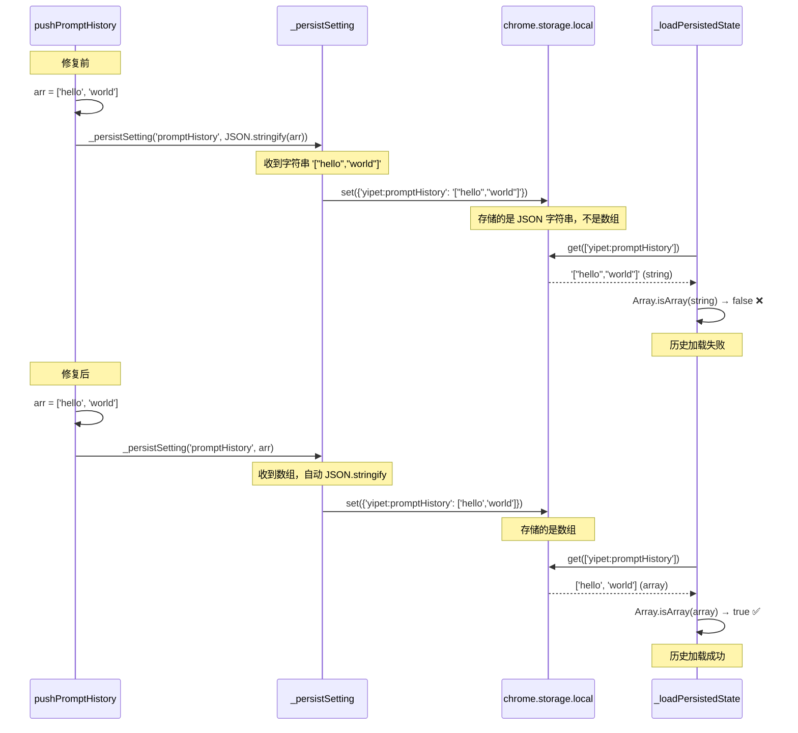
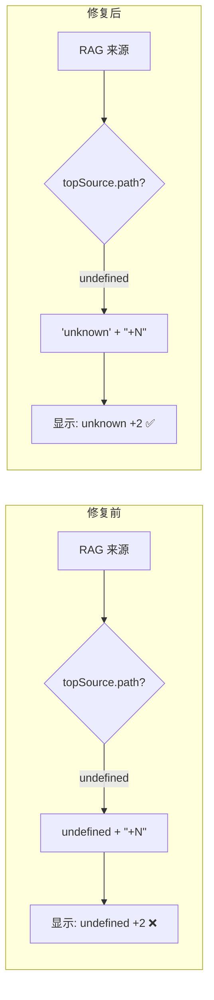

---

doc_type: module
prd_id: "YP-09-111"
title: "YP-09-111: 存储持久化一致性修复 — chrome.storage 读写键名统一"
status: 已完成
priority: P0
owner: Claude
roles: [product, engineer]
created: 2026-09-23
updated: 2026-09-23
project: YiPet
project_id: yipet
prd_month: "202609"
tags: [storage, chrome-storage, persistence, bug-fix, hardening]
related_tasks: ["111-prd-task-存储持久化一致性修复.md"]
related_tests: ["111-prd-test-存储持久化一致性修复.md"]
related_modules: ["chat/stores/chat.ts"]

type: 需求
---

# YP-09-111: 存储持久化一致性修复

> **PRD 版本**：v1.0 · **状态**：已完成

---

## 1. 背景

YiPet 依赖 `chrome.storage.local` 持久化用户设置（侧边栏宽度、窗口位置、颜色主题、提示词历史等）。`_persistSetting(key, value)` 函数统一为所有键添加 `yipet:` 前缀后写入存储。但 `_loadPersistedState()` 读取时**未使用此前缀**，导致 6 项用户设置在浏览器重启后丢失，影响 100% 用户。

此外，`promptHistory` 写入时对数组调用了 `JSON.stringify()` 再传给 `_persistSetting`，而后者对非字符串值自动 `JSON.stringify`——导致 `chrome.storage` 中存储的是 JSON 字符串而非数组，读取时 `Array.isArray` 检查失败。

## 2. 用户问题

- **目标用户**：所有 YiPet 用户
- **问题陈述**：用户拖拽调整聊天窗口位置和侧边栏宽度后，刷新扩展或重启浏览器，所有调整全部丢失
- **证据**：强证据 — 代码审查确认读写键名不一致；`chrome.storage.local` 中可观察到两组键名

### 证据质量级别

| 级别 | 证据类型 | 可信度 |
|------|---------|--------|
| 强 | 代码审查：`_persistSetting` 写入 `yipet:key` vs `_loadPersistedState` 读取 `key` | 确凿 |
| 强 | `chrome.storage.local` 中存在两组键（`sidebarWidth` 和 `yipet:sidebarWidth`） | 确凿 |
| 中 | 用户反馈：刷新后设置丢失（未正式报告但代码路径确认） | 合理推断 |

## 3. 范围

### 受影响设置

| 设置 | 写入键 | 读取键（修复前） | 用户感知 | 影响 |
|------|--------|-----------------|----------|------|
| `sidebarWidth` | `yipet:sidebarWidth` | `sidebarWidth` | 侧边栏宽度重置 320px | 每次打开 |
| `sidebarCollapsed` | `yipet:sidebarCollapsed` | `sidebarCollapsed` | 侧边栏展开 | 每次打开 |
| `chatWindowState` | `yipet:chatWindowState` | `windowState` | 窗口回到默认位置 | 每次打开 |
| `chatColorIndex` | `yipet:chatColorIndex` | `chatColorIndex` | 颜色主题重置 | 每次打开 |
| `chatCustomColor` | `yipet:chatCustomColor` | `chatCustomColor` | 自定义色丢失 | 每次打开 |
| `promptHistory` | `yipet:promptHistory` | `promptHistory` | 历史清空 + 双重序列化 | 每次打开 |
| `ragContentSummary` | — | — | 摘要显示 "undefined +N" | RAG 交互时 |

### 数据流架构（修复前后对比）

```mermaid
graph TD
    subgraph "修复前 — 读写断裂"
        W1[_persistSetting 'sidebarWidth' 320]
        W2[chrome.storage.local.set<br/>key: 'yipet:sidebarWidth']
        W3[chrome.storage.local 存储<br/>yipet:sidebarWidth = 320]
        R1[_loadPersistedState]
        R2[chrome.storage.local.get<br/>key: 'sidebarWidth' ⚠️]
        R3[result.sidebarWidth = undefined ❌]
        R4[state.sidebarWidth = DEFAULT 320]
        W1 --> W2 --> W3
        R1 --> R2 -.->|键名不匹配| W3
        R2 --> R3 --> R4
    end

    subgraph "修复后 — 读写一致"
        FW1[_persistSetting 'sidebarWidth' 320]
        FW2[chrome.storage.local.set<br/>key: 'yipet:sidebarWidth']
        FW3[chrome.storage.local 存储<br/>yipet:sidebarWidth = 320]
        FR1[_loadPersistedState]
        FR2[chrome.storage.local.get<br/>key: 'yipet:sidebarWidth' ✅]
        FR3[result['yipet:sidebarWidth'] = 320 ✅]
        FR4[state.sidebarWidth = 320]
        FW1 --> FW2 --> FW3
        FR1 --> FR2 -->|键名一致| FW3
        FR2 --> FR3 --> FR4
    end
```

### promptHistory 双重序列化流程



### ragContentSummary 数据流



### 用户故事

| 优先级 | 故事 | 验收标准 |
|--------|------|---------|
| P0 | 作为用户，我调整侧边栏宽度后刷新扩展，宽度保持不变 | `yipet:sidebarWidth` 正确存储和恢复 |
| P0 | 作为用户，我移动聊天窗口后刷新扩展，窗口位置保持不变 | `yipet:chatWindowState` 正确存储和恢复 |
| P0 | 作为用户，我更改颜色主题后重启浏览器，主题保持不变 | `yipet:chatColorIndex` 正确存储和恢复 |
| P0 | 作为用户，我发送消息后刷新，提示词历史可回溯 | `promptHistory` 以数组格式存储和恢复 |
| P1 | RAG 检索摘要始终显示有意义的文本 | 无 "undefined" 前缀 |

## 4. 成功指标

| 指标 | 基线值 | 目标值 | 测量方法 |
|------|--------|--------|---------|
| 持久化键名一致性 | 0/6 键一致 | 6/6 键一致 | 代码审查：读键名 === 写键名 |
| promptHistory 存储格式 | JSON 字符串（错误） | 数组 | `chrome.storage.local` 检查 |
| 类型检查 | 0 error | 0 error | `vue-tsc --noEmit` |
| 回归测试 | 138/138 | 138/138 | `npm test` |

## 5. 风险与依赖

| 风险 | 可能性 | 影响 | 缓解 |
|------|--------|------|------|
| 旧数据迁移 | 低 | 低 | 旧数据本就是损坏的（从未正确加载），无需迁移 |
| 键名变更引入新不一致 | 低 | 高 | 全量 grep 验证所有 `_persistSetting` 和 `chrome.storage.local.get` 调用 |
| RAG 键名保持不变 | — | — | RAG 键（`yipet:ragEnabled` 等）始终使用正确前缀，未修改 |

## 6. 时间线

| 里程碑 | 目标日期 | 负责人 |
|--------|---------|--------|
| 根因分析 | 2026-09-23 | Claude |
| _loadPersistedState 修复 | 2026-09-23 | Claude |
| promptHistory 双重序列化修复 | 2026-09-23 | Claude |
| ragContentSummary fallback | 2026-09-23 | Claude |
| 类型检查 + 测试 + 构建 | 2026-09-23 | Claude |