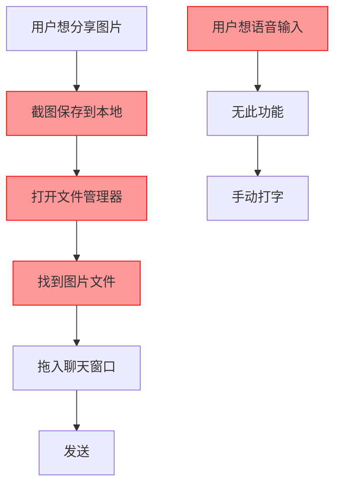
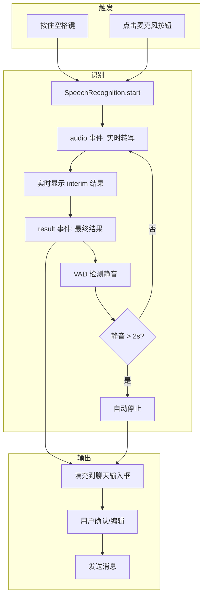
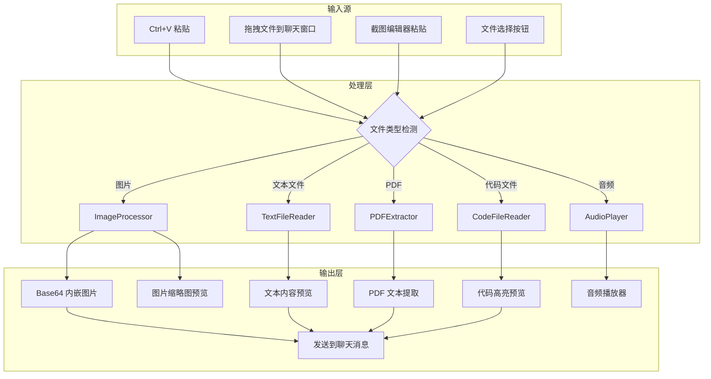

# YP-09-104: 语音输入与多媒体交互 — Web Speech 语音识别、图片粘贴拖拽与文件附件

> 需求编号：YP-09-104 · 优先级：P2 · 人天：1.0d · 状态：需求已编写
> 依赖：YP-09-05（聊天窗口交互）、YP-09-101（截图与标注工具）

## 背景

### 问题陈述

YiPet 当前仅支持纯文本输入，用户在需要分享图片、代码文件或使用语音输入时受到限制。现代 AI 助手（如 ChatGPT、Claude）已普遍支持多模态输入，但 YiPet 作为浏览器扩展面临独特挑战：Content Script 的权限限制、Service Worker 不能直接访问 DOM API、Web Speech API 在扩展上下文中的可用性。这导致：

1. **无法语音输入**：双手不便时（如阅读长文、驾驶场景）无法使用语音
2. **图片分享繁琐**：需要截图 → 保存 → 拖入聊天窗口，无法直接粘贴
3. **文件附件不支持**：无法分享代码文件、PDF、文本文件
4. **多模态交互缺失**：无法同时使用语音 + 图片 + 文本

**核心矛盾**：Web Speech API 在 Chrome 扩展中可用，但权限请求、音频捕获和实时转录的集成需要专门设计。图片粘贴和文件拖拽受限于 Content Script 的隔离环境。

### 影响范围

| # | 影响 | 严重程度 | 典型场景 |
|---|------|----------|----------|
| 1 | 无法语音输入 | 中 | 驾驶、阅读、双手不便场景 |
| 2 | 图片无法直接粘贴 | 中 | 从其他应用截图后粘贴到聊天 |
| 3 | 代码文件无法分享 | 中 | 请求 AI 审查代码文件 |
| 4 | 拖拽操作不支持 | 低 | 从文件管理器拖入图片/文件 |
| 5 | 语音响应无法播放 | 低 | AI 语音回复需 TTS 播放 |

### 挑战

| 挑战 | 说明 |
|------|------|
| Web Speech API 权限 | Content Script 中使用 `SpeechRecognition` 需要用户授权麦克风，且部分网站 CSP 可能阻止 |
| 语音识别语言 | 需要支持中英文混合识别，自动检测或手动切换语言 |
| 剪贴板图片读取 | Content Script 中 `navigator.clipboard.read()` 需要用户手势和 `clipboardRead` 权限 |
| 大文件处理 | 代码文件可能很大，需要限制大小并压缩后传输 |
| 拖拽事件拦截 | 页面自身的拖拽事件可能与扩展的拖拽区域冲突 |

---

## 一、现状分析

### 1.1 当前多媒体输入能力

```
现有能力:
├── 文本输入框（textarea）                      # 纯文本
├── 无                                          # 无语音输入
├── 无                                          # 无图片粘贴
├── 无                                          # 无文件拖拽
└── 无                                          # 无文件附件

缺失:
├── Web Speech API 语音识别                      # ❌ 不存在
├── 语音活动检测（VAD）                          # ❌ 不存在
├── 实时转写显示                                # ❌ 不存在
├── 按键说话模式（Push-to-Talk）                 # ❌ 不存在
├── 剪贴板图片粘贴                              # ❌ 不存在
├── 图片拖拽到聊天窗口                           # ❌ 不存在
├── 截图粘贴到聊天窗口                           # ❌ 不存在
├── 文件附件上传（txt/pdf/code）                 # ❌ 不存在
├── 文件预览                                    # ❌ 不存在
├── 音频播放（TTS 回复）                         # ❌ 不存在
└── 语言自动检测                                # ❌ 不存在
```

### 1.2 改造前多媒体输入流程



### 1.3 根因矩阵

| 症状 | 根因 | 触发条件 | 频率 |
|------|------|----------|------|
| 无法语音输入 | 未集成 Web Speech API | 双手不便场景 | 中 |
| 图片无法粘贴 | 未监听 paste 事件 | 从剪贴板分享图片 | 高 |
| 文件无法拖入 | 未监听 drop 事件 | 从文件管理器拖入文件 | 中 |
| 代码文件无法分享 | 无文件附件功能 | 请求 AI 审查代码 | 中 |
| 语音回复无法播放 | 无 TTS 播放器 | AI 语音回复 | 低 |

---

## 二、设计决策

### 决策 1：语音识别实现 — Web Speech API vs 第三方 ASR vs 后端转发

| 选项 | 延迟 | 离线支持 | 语言支持 | 成本 |
|------|------|----------|----------|------|
| Web Speech API（浏览器内置） | 最低（本地） | Chrome 支持离线 | 中/英/日等 50+ 语言 | 免费 |
| 第三方 ASR（Whisper/Deepgram） | 中（网络） | 否 | 高（100+ 语言） | 付费 |
| 后端转发（YiAi 中转） | 高（网络 + 后端） | 否 | 取决于后端 | 自托管 |

**选择：Web Speech API。** Chrome 内置的语音识别引擎支持离线识别（下载语言包后），延迟最低，完全免费，支持 50+ 语言。对于扩展场景，本地识别避免了网络延迟和隐私问题。

### 决策 2：语音触发方式 — 按钮点击 vs Push-to-Talk vs 自动检测

| 选项 | 用户控制 | 误触发风险 | 实现复杂度 | 适合场景 |
|------|---------|-----------|-----------|----------|
| 按钮点击（开始/停止） | 高 | 低 | 低 | 长句输入 |
| Push-to-Talk（按住说话） | 最高 | 极低 | 中 | 短句、中英文混合 |
| 自动检测（VAD 静音停止） | 中 | 中 | 高 | 连续对话 |

**选择：组合方案。** 默认使用 Push-to-Talk 模式（按住空格键说话），同时提供按钮切换模式（点击开始/点击停止）+ 自动停止（检测到 2 秒静音自动停止）。三种模式互补覆盖不同场景。

### 决策 3：图片粘贴处理 — Clipboard API vs paste 事件 vs 拖拽

| 选项 | 支持格式 | 权限需求 | 用户手势 | 浏览器支持 |
|------|---------|----------|----------|-----------|
| `navigator.clipboard.read()` | PNG/JPEG/GIF | `clipboardRead` | 需要 | Chrome 76+ |
| `paste` 事件 `clipboardData` | PNG/JPEG/GIF | 无（事件自带） | 需要 | 全版本 |
| 拖拽 `drop` 事件 | 任意文件 | 无 | 需要 | 全版本 |

**选择：`paste` 事件（图片）+ 拖拽 `drop` 事件（文件）。** `paste` 事件不需要额外权限，`event.clipboardData.files` 直接获取图片 Blob。拖拽 `drop` 事件处理文件管理器拖入的文件。`navigator.clipboard.read()` 作为补充（从其他应用复制后粘贴）。

### 决策 4：文件附件限制 — 大小限制 vs 类型限制 vs 不限制

| 选项 | 安全性 | 用户体验 | 存储压力 |
|------|--------|----------|----------|
| 仅大小限制（5MB） | 中 | 好 | 中 |
| 仅类型限制（txt/pdf/code） | 高 | 中 | 中 |
| 大小 + 类型限制 | 最高 | 好 | 中 |

**选择：大小 + 类型限制。** 限制文件大小 5MB，支持类型：`.txt`, `.pdf`, `.js`, `.ts`, `.py`, `.java`, `.go`, `.rs`, `.json`, `.md`, `.html`, `.css`, `.vue`, `.yaml`, `.xml`, `.csv`。图片格式：PNG/JPEG/GIF/WebP/SVG，限制 10MB。

### 设计决策记录

| 决策 | 选项 A | 选项 B | 选项 C | 选择 | 理由 |
|------|--------|--------|--------|------|------|
| 语音识别 | Web Speech | 第三方 ASR | 后端转发 | **Web Speech** | 免费 + 离线 + 低延迟 |
| 语音触发 | 按钮 | Push-to-Talk | VAD | **组合** | 覆盖不同场景 |
| 图片粘贴 | Clipboard API | paste 事件 | 拖拽 drop | **paste + drop** | 无额外权限，兼容性好 |
| 文件附件 | 仅大小 | 仅类型 | 大小+类型 | **大小+类型** | 安全 + 体验 |

---

## 三、目标架构

### 3.1 语音输入工作流



### 3.2 多媒体输入处理流程



### 3.3 性能指标

| 指标 | 目标值 | 说明 |
|------|--------|------|
| 语音识别启动延迟 | < 500ms | 从触发到开始转写 |
| 实时转写延迟 | < 200ms | interim 结果更新频率 |
| 图片粘贴响应 | < 100ms | paste 事件 → 缩略图显示 |
| 文件读取（1MB） | < 500ms | FileReader 读取 |
| 拖拽预览 | < 100ms | drop → 预览渲染 |
| 音频播放缓冲 | < 1s | 音频文件加载 |

---

## 四、具体改动

### 4.1 语音识别服务

```typescript
// src/services/voice/speech-recognition.ts (新增)

interface VoiceRecognitionOptions {
  lang?: string;
  continuous?: boolean;
  interimResults?: boolean;
  mode?: 'push-to-talk' | 'toggle' | 'auto';
  silenceTimeout?: number; // 静音自动停止超时 ms
}

interface VoiceRecognitionState {
  isListening: boolean;
  isSupported: boolean;
  interimText: string;
  finalText: string;
  error: string | null;
}

export class VoiceRecognitionService {
  private recognition: SpeechRecognition | null = null;
  private state: VoiceRecognitionState = {
    isListening: false,
    isSupported: false,
    interimText: '',
    finalText: '',
    error: null,
  };
  private silenceTimer: ReturnType<typeof setTimeout> | null = null;
  private lastSpeechTime = 0;
  private options: Required<VoiceRecognitionOptions>;
  private listeners: Set<(state: VoiceRecognitionState) => void> = new Set();

  constructor(options: VoiceRecognitionOptions = {}) {
    this.options = {
      lang: options.lang || 'zh-CN',
      continuous: options.continuous ?? true,
      interimResults: options.interimResults ?? true,
      mode: options.mode || 'push-to-talk',
      silenceTimeout: options.silenceTimeout || 2000,
    };

    this.checkSupport();
  }

  private checkSupport(): void {
    const SpeechRecognitionAPI = window.SpeechRecognition || window.webkitSpeechRecognition;
    this.state.isSupported = !!SpeechRecognitionAPI;

    if (this.state.isSupported) {
      this.recognition = new SpeechRecognitionAPI();
      this.recognition.lang = this.options.lang;
      this.recognition.continuous = this.options.continuous;
      this.recognition.interimResults = this.options.interimResults;
      this.recognition.maxAlternatives = 1;

      this.recognition.onresult = this.handleResult.bind(this);
      this.recognition.onerror = this.handleError.bind(this);
      this.recognition.onend = this.handleEnd.bind(this);
      this.recognition.onaudiostart = () => this.resetSilenceTimer();
      this.recognition.onspeechstart = () => this.resetSilenceTimer();
    }
  }

  start(): void {
    if (!this.recognition) {
      this.state.error = '浏览器不支持语音识别';
      this.notify();
      return;
    }

    try {
      this.recognition.start();
      this.state.isListening = true;
      this.state.error = null;
      this.notify();
    } catch (e) {
      this.state.error = `语音识别启动失败: ${(e as Error).message}`;
      this.notify();
    }
  }

  stop(): void {
    if (this.recognition) {
      this.recognition.stop();
      this.state.isListening = false;
      this.clearSilenceTimer();
      this.notify();
    }
  }

  setLanguage(lang: string): void {
    this.options.lang = lang;
    if (this.recognition) {
      // 需要重启 recognition 才能生效
      const wasListening = this.state.isListening;
      this.stop();
      this.recognition.lang = lang;
      if (wasListening) {
        setTimeout(() => this.start(), 100);
      }
    }
  }

  private handleResult(event: SpeechRecognitionEvent): void {
    let interim = '';
    let final = '';

    for (let i = event.resultIndex; i < event.results.length; i++) {
      const transcript = event.results[i][0].transcript;
      if (event.results[i].isFinal) {
        final += transcript;
      } else {
        interim += transcript;
      }
    }

    if (final) {
      this.state.finalText += final;
      this.state.interimText = '';
    } else {
      this.state.interimText = interim;
    }

    this.resetSilenceTimer();
    this.notify();
  }

  private handleError(event: SpeechRecognitionErrorEvent): void {
    this.state.error = `语音识别错误: ${event.error} (${event.message})`;
    this.state.isListening = false;
    this.notify();
  }

  private handleEnd(): void {
    this.state.isListening = false;
    this.clearSilenceTimer();
    this.notify();
  }

  private resetSilenceTimer(): void {
    this.lastSpeechTime = Date.now();
    if (this.options.mode === 'auto' && this.state.isListening) {
      this.clearSilenceTimer();
      this.silenceTimer = setTimeout(() => {
        if (Date.now() - this.lastSpeechTime >= this.options.silenceTimeout) {
          this.stop();
        }
      }, this.options.silenceTimeout);
    }
  }

  private clearSilenceTimer(): void {
    if (this.silenceTimer) {
      clearTimeout(this.silenceTimer);
      this.silenceTimer = null;
    }
  }

  getState(): VoiceRecognitionState {
    return { ...this.state };
  }

  subscribe(listener: (state: VoiceRecognitionState) => void): () => void {
    this.listeners.add(listener);
    return () => this.listeners.delete(listener);
  }

  private notify(): void {
    const state = this.getState();
    this.listeners.forEach(fn => fn(state));
  }

  destroy(): void {
    this.stop();
    this.recognition = null;
    this.listeners.clear();
  }
}
```

### 4.2 图片粘贴处理

```typescript
// src/services/media/image-paste-handler.ts (新增)

interface PastedImage {
  dataUrl: string;
  blob: Blob;
  width: number;
  height: number;
  size: number;
  format: string;
}

const MAX_IMAGE_SIZE = 10 * 1024 * 1024; // 10MB
const ALLOWED_IMAGE_TYPES = ['image/png', 'image/jpeg', 'image/gif', 'image/webp', 'image/svg+xml'];

export class ImagePasteHandler {
  private dropZone: HTMLElement;
  private onImagePaste: (images: PastedImage[]) => void;

  constructor(dropZone: HTMLElement, onImagePaste: (images: PastedImage[]) => void) {
    this.dropZone = dropZone;
    this.onImagePaste = onImagePaste;
    this.setupListeners();
  }

  private setupListeners(): void {
    // 1. 粘贴事件（Ctrl+V / Cmd+V）
    this.dropZone.addEventListener('paste', this.handlePaste.bind(this));

    // 2. 拖拽事件
    this.dropZone.addEventListener('dragover', this.handleDragOver.bind(this));
    this.dropZone.addEventListener('dragleave', this.handleDragLeave.bind(this));
    this.dropZone.addEventListener('drop', this.handleDrop.bind(this));
  }

  private async handlePaste(e: ClipboardEvent): Promise<void> {
    const items = e.clipboardData?.items;
    if (!items) return;

    const imageItems: DataTransferItem[] = [];
    for (let i = 0; i < items.length; i++) {
      if (items[i].type.startsWith('image/')) {
        imageItems.push(items[i]);
      }
    }

    if (imageItems.length === 0) return;

    e.preventDefault();
    const images = await this.processImageItems(imageItems);
    this.onImagePaste(images);
  }

  private async processImageItems(items: DataTransferItem[]): Promise<PastedImage[]> {
    const results: PastedImage[] = [];

    for (const item of items) {
      const file = item.getAsFile();
      if (!file) continue;

      if (!ALLOWED_IMAGE_TYPES.includes(file.type)) continue;
      if (file.size > MAX_IMAGE_SIZE) {
        console.warn(`图片过大: ${(file.size / 1024 / 1024).toFixed(1)}MB`);
        continue;
      }

      const dataUrl = await this.fileToDataUrl(file);
      const dimensions = await this.getImageDimensions(dataUrl);

      results.push({
        dataUrl,
        blob: file,
        width: dimensions.width,
        height: dimensions.height,
        size: file.size,
        format: file.type,
      });
    }

    return results;
  }

  private handleDragOver(e: DragEvent): void {
    e.preventDefault();
    e.stopPropagation();
    if (e.dataTransfer) {
      e.dataTransfer.dropEffect = 'copy';
    }
    this.dropZone.classList.add('drag-over');
  }

  private handleDragLeave(e: DragEvent): void {
    e.preventDefault();
    e.stopPropagation();
    this.dropZone.classList.remove('drag-over');
  }

  private async handleDrop(e: DragEvent): Promise<void> {
    e.preventDefault();
    e.stopPropagation();
    this.dropZone.classList.remove('drag-over');

    const files = e.dataTransfer?.files;
    if (!files || files.length === 0) return;

    const imageFiles = Array.from(files).filter(f => f.type.startsWith('image/'));
    if (imageFiles.length === 0) return;

    const pseudoItems = imageFiles.map(file => {
      const dt = new DataTransfer();
      dt.items.add(file);
      return dt.items[0];
    });

    const images = await this.processImageItems(pseudoItems);
    this.onImagePaste(images);
  }

  private fileToDataUrl(file: Blob): Promise<string> {
    return new Promise((resolve, reject) => {
      const reader = new FileReader();
      reader.onload = () => resolve(reader.result as string);
      reader.onerror = reject;
      reader.readAsDataURL(file);
    });
  }

  private getImageDimensions(dataUrl: string): Promise<{ width: number; height: number }> {
    return new Promise((resolve, reject) => {
      const img = new Image();
      img.onload = () => resolve({ width: img.width, height: img.height });
      img.onerror = reject;
      img.src = dataUrl;
    });
  }

  destroy(): void {
    this.dropZone.removeEventListener('paste', this.handlePaste);
    this.dropZone.removeEventListener('dragover', this.handleDragOver);
    this.dropZone.removeEventListener('dragleave', this.handleDragLeave);
    this.dropZone.removeEventListener('drop', this.handleDrop);
  }
}
```

### 4.3 文件附件处理

```typescript
// src/services/media/file-attachment.ts (新增)

interface FileAttachment {
  id: string;
  name: string;
  size: number;
  type: string;
  content: string;     // 文本内容或 Base64
  preview: string;     // 预览文本（前 500 字符）
  isBinary: boolean;
}

const MAX_FILE_SIZE = 5 * 1024 * 1024; // 5MB
const ALLOWED_EXTENSIONS = [
  '.txt', '.pdf', '.js', '.ts', '.py', '.java', '.go', '.rs',
  '.json', '.md', '.html', '.css', '.vue', '.yaml', '.yml',
  '.xml', '.csv', '.sql', '.sh', '.bash', '.zsh',
];
const ALLOWED_MIME_TYPES = [
  'text/plain', 'application/pdf', 'application/json',
  'text/javascript', 'text/typescript', 'text/x-python',
  'text/html', 'text/css', 'text/markdown', 'text/csv',
  'application/xml', 'text/xml',
];

export class FileAttachmentHandler {
  private onFileAttach: (attachments: FileAttachment[]) => void;

  constructor(onFileAttach: (attachments: FileAttachment[]) => void) {
    this.onFileAttach = onFileAttach;
  }

  createFileInput(): HTMLInputElement {
    const input = document.createElement('input');
    input.type = 'file';
    input.multiple = true;
    input.accept = ALLOWED_EXTENSIONS.join(',');
    input.onchange = async () => {
      if (input.files) {
        const attachments = await this.processFiles(Array.from(input.files));
        this.onFileAttach(attachments);
      }
    };
    return input;
  }

  async processFiles(files: File[]): Promise<FileAttachment[]> {
    const results: FileAttachment[] = [];

    for (const file of files) {
      // 检查扩展名
      const ext = '.' + file.name.split('.').pop()?.toLowerCase();
      if (!ALLOWED_EXTENSIONS.includes(ext)) {
        console.warn(`不支持的文件类型: ${ext}`);
        continue;
      }

      // 检查大小
      if (file.size > MAX_FILE_SIZE) {
        console.warn(`文件过大: ${(file.size / 1024 / 1024).toFixed(1)}MB`);
        continue;
      }

      const isBinary = file.type === 'application/pdf';
      const content = await this.readFileContent(file, isBinary);
      const preview = this.generatePreview(content, isBinary, file.name);

      results.push({
        id: `file-${Date.now()}-${Math.random().toString(36).slice(2, 8)}`,
        name: file.name,
        size: file.size,
        type: file.type || ext,
        content,
        preview,
        isBinary,
      });
    }

    return results;
  }

  private readFileContent(file: File, isBinary: boolean): Promise<string> {
    return new Promise((resolve, reject) => {
      const reader = new FileReader();
      reader.onload = () => resolve(reader.result as string);
      reader.onerror = reject;
      if (isBinary) {
        reader.readAsDataURL(file);
      } else {
        reader.readAsText(file);
      }
    });
  }

  private generatePreview(content: string, isBinary: boolean, filename: string): string {
    if (isBinary) {
      return `[PDF 文件: ${filename}]`;
    }

    const lines = content.split('\n').slice(0, 10);
    const preview = lines.join('\n');
    if (preview.length > 500) {
      return preview.slice(0, 500) + '...';
    }
    return preview;
  }
}
```

### 4.4 语音输入组件

```typescript
// src/components/VoiceInput.vue (新增)

<script setup lang="ts">
import { ref, onMounted, onUnmounted } from 'vue';
import { VoiceRecognitionService } from '@/services/voice/speech-recognition';

const props = defineProps<{
  mode?: 'push-to-talk' | 'toggle' | 'auto';
}>();

const emit = defineEmits<{
  transcript: [text: string];
  stateChange: [isListening: boolean];
}>();

const service = new VoiceRecognitionService({ mode: props.mode || 'push-to-talk' });
const isListening = ref(false);
const interimText = ref('');
const finalText = ref('');
const error = ref<string | null>(null);
const selectedLang = ref('zh-CN');

// 语言选项
const languages = [
  { code: 'zh-CN', label: '中文（简体）' },
  { code: 'en-US', label: 'English (US)' },
  { code: 'ja-JP', label: '日本語' },
  { code: 'ko-KR', label: '한국어' },
  { code: 'auto', label: '自动检测' },
];

onMounted(() => {
  service.subscribe((state) => {
    isListening.value = state.isListening;
    interimText.value = state.interimText;
    finalText.value = state.finalText;
    error.value = state.error;
    emit('stateChange', state.isListening);
  });

  // Push-to-Talk: 监听空格键
  if (props.mode === 'push-to-talk') {
    document.addEventListener('keydown', handleKeyDown);
    document.addEventListener('keyup', handleKeyUp);
  }
});

onUnmounted(() => {
  document.removeEventListener('keydown', handleKeyDown);
  document.removeEventListener('keyup', handleKeyUp);
  service.destroy();
});

let spaceHeld = false;

function handleKeyDown(e: KeyboardEvent): void {
  if (e.code === 'Space' && !spaceHeld && !isListening.value) {
    // 仅在聊天输入框未聚焦时触发（输入框聚焦时空格用于打字）
    const activeEl = document.activeElement;
    if (activeEl?.tagName === 'TEXTAREA' || activeEl?.tagName === 'INPUT') return;

    e.preventDefault();
    spaceHeld = true;
    service.start();
  }
}

function handleKeyUp(e: KeyboardEvent): void {
  if (e.code === 'Space' && spaceHeld) {
    spaceHeld = false;
    service.stop();
    commitText();
  }
}

function toggleVoice(): void {
  if (isListening.value) {
    service.stop();
    commitText();
  } else {
    finalText.value = '';
    service.start();
  }
}

function commitText(): void {
  if (finalText.value.trim()) {
    emit('transcript', finalText.value.trim());
    finalText.value = '';
  }
}

function changeLanguage(lang: string): void {
  selectedLang.value = lang;
  if (lang === 'auto') {
    // 自动检测：使用 navigator.language
    service.setLanguage(navigator.language);
  } else {
    service.setLanguage(lang);
  }
}
</script>

<template>
  <div class="voice-input">
    <button
      :class="['voice-btn', { active: isListening }]"
      @click="toggleVoice"
      :title="isListening ? '停止录音' : '开始录音'"
    >
      <span v-if="isListening" class="pulse"></span>
      🎤
    </button>

    <select v-model="selectedLang" @change="changeLanguage(($event.target as HTMLSelectElement).value)">
      <option v-for="lang in languages" :key="lang.code" :value="lang.code">
        {{ lang.label }}
      </option>
    </select>

    <div v-if="isListening" class="transcription">
      <span class="final">{{ finalText }}</span>
      <span class="interim">{{ interimText }}</span>
    </div>

    <div v-if="error" class="error">{{ error }}</div>
  </div>
</template>

<style scoped>
.voice-btn {
  position: relative;
  width: 40px;
  height: 40px;
  border-radius: 50%;
  border: none;
  cursor: pointer;
  font-size: 20px;
  transition: background 0.2s;
}
.voice-btn.active {
  background: #ff4444;
  color: white;
}
.pulse {
  position: absolute;
  inset: -4px;
  border-radius: 50%;
  border: 2px solid #ff4444;
  animation: pulse 1.5s infinite;
}
@keyframes pulse {
  0% { transform: scale(1); opacity: 1; }
  100% { transform: scale(1.4); opacity: 0; }
}
.interim {
  color: #999;
  font-style: italic;
}
.error {
  color: #ff4444;
  font-size: 12px;
}
</style>
```

### 4.5 文件变更清单

| 文件 | 操作 | 说明 |
|------|------|------|
| `src/services/voice/speech-recognition.ts` | 新增 | 语音识别服务 |
| `src/services/media/image-paste-handler.ts` | 新增 | 图片粘贴/拖拽处理 |
| `src/services/media/file-attachment.ts` | 新增 | 文件附件处理 |
| `src/services/media/audio-player.ts` | 新增 | 音频播放器（TTS 回复） |
| `src/components/VoiceInput.vue` | 新增 | 语音输入组件 |
| `src/components/MediaPreview.vue` | 新增 | 多媒体预览（图片/文件） |
| `src/components/FileAttachmentBar.vue` | 新增 | 文件附件栏 |
| `src/components/AudioPlayer.vue` | 新增 | 音频播放器组件 |
| `src/stores/media.ts` | 新增 | 多媒体状态管理 |
| `src/manifest.json` | 修改 | 添加 `audioCapture` 权限（若需要） |

---

## 五、实施步骤

| 步骤 | 操作 | 路径 | 验证 | 人天 |
|------|------|------|------|------|
| 1 | 实现 Web Speech API 封装 | `src/services/voice/speech-recognition.ts` | 语音识别返回转写文本 | 0.15 |
| 2 | 实现 Push-to-Talk + VAD | `src/services/voice/speech-recognition.ts` | 空格键按住说话，静音 2s 停止 | 0.1 |
| 3 | 实现语音输入 UI 组件 | `src/components/VoiceInput.vue` | 麦克风按钮 + 转写显示 | 0.1 |
| 4 | 实现图片粘贴处理器 | `src/services/media/image-paste-handler.ts` | Ctrl+V 粘贴图片到聊天 | 0.1 |
| 5 | 实现图片拖拽处理器 | `src/services/media/image-paste-handler.ts` | 拖入图片显示缩略图 | 0.08 |
| 6 | 实现文件附件处理器 | `src/services/media/file-attachment.ts` | 选择文件后显示预览 | 0.1 |
| 7 | 实现多媒体预览组件 | `src/components/MediaPreview.vue` | 图片/文件预览正常 | 0.08 |
| 8 | 实现音频播放器 | `src/services/media/audio-player.ts` | TTS 音频播放 | 0.08 |
| 9 | 实现多媒体状态管理 | `src/stores/media.ts` | 状态持久化 | 0.05 |
| 10 | 集成到聊天窗口 | 修改聊天组件 | 全部输入方式可用 | 0.1 |
| 11 | 端到端验证 | 手动测试 | 全流程正常 | 0.06 |

**总人天：1.0d**

---

## 六、测试规格

### 场景 1：语音输入（Push-to-Talk）

**GIVEN** 浏览器支持 Web Speech API，聊天窗口已打开
**WHEN** 用户按住空格键开始说话
**THEN** 应显示"正在聆听"状态
**AND** 实时转写文本应显示在 interim 区域
**AND** 用户松开空格键
**THEN** 最终转写文本应填充到聊天输入框
**AND** 语音识别服务应停止

### 场景 2：语音输入（自动静音停止）

**GIVEN** 语音识别模式设置为"自动"
**WHEN** 用户点击麦克风按钮开始说话
**THEN** 转写文本实时显示
**AND** 用户停止说话 2 秒
**THEN** 语音识别应自动停止
**AND** 最终转写文本应填充到输入框

### 场景 3：图片粘贴到聊天窗口

**GIVEN** 用户从剪贴板复制了一张 PNG 图片
**WHEN** 在聊天窗口中按 Ctrl+V
**THEN** 图片应作为附件显示在聊天输入区
**AND** 应显示缩略图预览
**AND** 图片格式、大小信息应正确
**AND** 图片超过 10MB 应被拒绝并提示

### 场景 4：文件拖拽到聊天窗口

**GIVEN** 用户从文件管理器拖入一个 `.py` 代码文件（1.5MB）
**WHEN** 文件拖放到聊天窗口
**THEN** 应显示文件预览（文件名、大小、前 500 字符）
**AND** 文件内容应正确读取
**AND** 用户点击发送后，文件内容和文件名应包含在消息中
**AND** 文件 `__pycache__/` 等不应被接受

### 场景 5：文件附件类型过滤

**GIVEN** 用户尝试拖入 `.exe` 文件、`.zip` 文件、`.jpg` 图片
**WHEN** 文件被拖放到聊天窗口
**THEN** `.exe` 文件应被拒绝（不支持的类型）
**AND** `.zip` 文件应被拒绝
**AND** `.jpg` 图片应被接受（图片类型）
**AND** 被拒绝的文件应静默忽略，不显示错误

### 场景 6：音频播放（TTS 回复）

**GIVEN** AI 回复了语音消息（Base64 音频或 URL）
**WHEN** 消息渲染在聊天窗口
**THEN** 应显示音频播放器（播放/暂停 + 进度条）
**AND** 用户点击播放按钮
**THEN** 音频应开始播放
**AND** 音频播放器应显示当前播放进度
**AND** 用户点击暂停按钮应停止播放

---

## 七、风险与缓解

| 风险 | 概率 | 影响 | 缓解措施 |
|------|------|------|----------|
| Web Speech API 在部分网站被 CSP 阻止 | 中 | 高 | 在 Content Script 中通过 iframe 隔离语音识别上下文 |
| 语音识别准确率低（中文口音） | 中 | 中 | 支持手动编辑转写结果，允许用户纠正 |
| 剪贴板图片读取需用户手势 | 中 | 中 | 仅在 paste 事件中处理（事件自带用户手势） |
| 大文件读取阻塞 UI | 低 | 中 | 使用 FileReader 异步读取，显示加载进度 |
| 拖拽事件与页面自身冲突 | 低 | 低 | 仅当拖拽到聊天窗口区域时拦截，其他地方不处理 |

---

## 八、回滚策略

| 场景 | 回滚操作 | 影响 |
|------|----------|------|
| 语音识别导致页面卡顿 | 禁用语音输入功能 | 失去语音输入 |
| 图片粘贴占内存过多 | 限制同时粘贴图片数量为 3 张 | 失去批量粘贴 |
| 文件附件功能不稳定 | 仅保留文本文件支持，禁用 PDF 和二进制 | 失去 PDF 支持 |
| 音频播放器兼容性问题 | 降级为浏览器原生 `<audio>` 标签 | 失去自定义播放器 UI |

---

## 九、设计决策记录

### D-01：语音识别上下文隔离

- **问题**：Content Script 中使用 Web Speech API 可能被页面 CSP 阻止
- **选项**：在 Content Script 中直接使用、通过 iframe 隔离、仅在 Popup 中使用
- **选择**：在 Content Script 中直接使用，降级为 iframe 隔离
- **理由**：大多数网站不阻止 Web Speech API，直接使用性能最优。若检测到 CSP 阻止，降级为动态创建 iframe（`srcdoc` 属性）隔离语音识别上下文

### D-02：Push-to-Talk 按键选择

- **问题**：使用哪个键作为 Push-to-Talk 触发键
- **选项**：空格键、Ctrl 键、自定义快捷键
- **选择**：空格键（仅在输入框未聚焦时触发）
- **理由**：空格键是最自然的"按住说话"键，与微信等应用一致。当输入框聚焦时，空格键用于正常打字，不触发语音

### D-03：图片存储方式

- **问题**：粘贴的图片如何存储和传输
- **选项**：Base64 内嵌、Blob URL、上传到 YiAi 文件服务
- **选择**：Base64 内嵌（< 1MB）+ Blob URL（预览）
- **理由**：小图片 Base64 直接嵌入消息，无需额外网络请求。大图片使用 Blob URL 预览，发送时转为 Base64 传给 AI。未来可扩展为上传到 YiAi 文件服务

### D-04：文件附件安全处理

- **问题**：如何处理用户上传的任意文件
- **选项**：仅文本预览、全部拒绝、类型白名单 + 大小限制
- **选择**：类型白名单 + 大小限制 + 文本预览
- **理由**：白名单确保只接受安全文件类型（代码、文档），大小限制防止内存溢出，文本预览让用户在发送前确认内容

---

## 十、可观测性

### 指标

| 指标 | 类型 | 说明 |
|------|------|------|
| `yipet.voice.recognition_count` | Counter | 语音识别使用次数 |
| `yipet.voice.recognition_duration` | Histogram | 语音识别时长 |
| `yipet.voice.recognition_error_count` | Counter | 语音识别错误次数（按错误类型） |
| `yipet.voice.language_usage` | Counter | 语言使用分布（zh-CN/en-US/等） |
| `yipet.media.image_paste_count` | Counter | 图片粘贴次数 |
| `yipet.media.image_drop_count` | Counter | 图片拖拽次数 |
| `yipet.media.file_attach_count` | Counter | 文件附件次数（按文件类型） |
| `yipet.media.file_reject_count` | Counter | 文件被拒绝次数（按原因） |
| `yipet.media.audio_play_count` | Counter | 音频播放次数 |

### 告警

| 告警 | 条件 | 级别 |
|------|------|------|
| 语音识别错误率 > 30% | 最近 100 次识别 | WARNING |
| 图片粘贴失败率 > 10% | 最近 100 次粘贴 | WARNING |
| 文件被拒绝率 > 50% | 最近 100 次文件操作 | INFO |
| 单次语音识别 > 60s | 超长识别 | INFO |

---

## 十一、代码审查检查清单

- [ ] Web Speech API 在 `checkSupport()` 中检测 `window.SpeechRecognition` 和 `webkitSpeechRecognition`
- [ ] 语音识别 `onerror` 处理所有错误类型（not-allowed、no-speech、network 等）
- [ ] Push-to-Talk 仅在输入框未聚焦时触发空格键
- [ ] 图片粘贴处理 `event.clipboardData.items`（而非 `files`）以支持多种格式
- [ ] 图片大小限制为 10MB，文件大小限制为 5MB
- [ ] 文件类型白名单覆盖所有支持的代码文件扩展名
- [ ] 文件读取使用 `FileReader` 异步 API，不阻塞 UI
- [ ] 拖拽事件正确处理 `dragover`（必须 `preventDefault`）和 `drop`
- [ ] 多媒体预览组件在 Shadow DOM 中渲染，样式隔离
- [ ] 音频播放器支持播放/暂停/进度条基本控制
- [ ] 语音识别组件销毁时正确清理事件监听器

---

## 回归问题预测

| # | 预测问题 | 原因 | 验证方法 |
|---|---------|------|---------|
| 1 | Web Speech API 在 HTTPS 页面首次使用需要用户授权麦克风，但授权弹窗被 Content Script 注入的 UI 遮挡，用户看不到授权请求 | Chrome 的麦克风权限弹窗出现在地址栏左侧，若聊天窗口覆盖层遮挡该区域，用户无法点击"允许"，语音识别始终处于 `not-allowed` 错误 | 检查聊天窗口的 z-index 和位置，确保不遮挡地址栏左侧的权限弹窗区域，或提供引导提示用户点击地址栏的权限图标 |
| 2 | `SpeechRecognition` 在 `continuous: true` 模式下，长时间静音后自动停止，但 `onend` 事件未正确触发 `stop()` 清理，导致状态不一致 | `continuous: true` 时浏览器会在静音约 60s 后自动停止 recognition，但不会触发 `onerror`，`onend` 中 `isListening` 被设为 false，但 UI 未更新 | 在 `onend` 中始终调用 `notify()` 确保 UI 同步，测试：开始识别后静默 60s，验证 UI 状态显示"已停止" |
| 3 | 图片粘贴时 `event.clipboardData.items` 包含多张图片，但 `getAsFile()` 在异步处理中可能因浏览器安全策略返回 null | 浏览器可能限制从 paste 事件异步获取文件，`getAsFile()` 在 `setTimeout` 或 `Promise` 中调用时返回 null | 在 paste 事件处理函数中同步调用 `getAsFile()`，将 File 对象保存到数组，然后异步处理 File 对象 |
| 4 | 文件拖拽到聊天窗口时，包含 `\r\n` 换行符的文本文件在 Windows 和 macOS 上显示不一致，代码预览时行号错位 | 文本文件在 Windows 上使用 `\r\n`，macOS 使用 `\n`，`readAsText` 不自动转换换行符，导致预览中换行不一致 | 在 `readAsText` 完成后统一将 `\r\n` 和 `\r` 替换为 `\n`，确保跨平台预览一致 |
| 5 | 语音识别在 `lang: 'zh-CN'` 时无法识别英文单词，用户中英文混合输入时英文部分被转写为拼音或乱码 | Web Speech API 的 `lang` 参数是单语言模式，`zh-CN` 模式下英文单词被当作拼音处理，`en-US` 模式下中文被忽略 | 提供"自动检测"模式：使用 `navigator.language` 作为默认，同时提供 `cmn-Hans-CN` 等更精确的语言标签，或使用两个 recognition 实例分别处理中英文 |
| 6 | 音频播放器在 Service Worker 中无法使用 `HTMLAudioElement`，TTS 音频必须在 Content Script 中播放，但消息组件在 Shadow DOM 中 | Service Worker 没有 DOM 环境，不能在 SW 中播放音频；Content Script 的 Shadow DOM 中可以创建 `<audio>` 元素，但需要确保音频 URL 在扩展上下文中可访问 | 在 Content Script 的 Shadow DOM 中创建 `<audio>` 元素，音频 URL 通过 `chrome.runtime.getURL` 转换为扩展内部路径，或使用 `blob:` URL 播放 Base64 音频 |

---

## 性能分析

### 多媒体输入各阶段耗时

| 阶段 | 预估耗时 | 说明 |
|------|----------|------|
| 语音识别启动 | < 500ms | SpeechRecognition API 初始化 |
| 实时转写更新 | < 200ms | interim result 回调 |
| 静音检测 | 2000ms 超时 | 可配置 |
| 图片粘贴（小图 < 1MB） | < 100ms | FileReader + 缩略图渲染 |
| 图片粘贴（大图 5MB） | < 500ms | FileReader 读取 |
| 文件拖拽（1MB 文本） | < 300ms | FileReader 读取 |
| 文件拖拽（5MB 文本） | < 1s | FileReader 读取 |
| 音频加载（< 1MB） | < 1s | `<audio>` 元素加载 |
| 音频播放缓冲 | < 500ms | 首帧播放 |

### 文件体积预估

| 文件 | 大小 | 说明 |
|------|------|------|
| `src/services/voice/speech-recognition.ts` | ~4KB | 语音识别服务 |
| `src/services/media/image-paste-handler.ts` | ~3KB | 图片粘贴/拖拽 |
| `src/services/media/file-attachment.ts` | ~3KB | 文件附件处理 |
| `src/services/media/audio-player.ts` | ~2KB | 音频播放器 |
| `src/components/VoiceInput.vue` | ~4KB | 语音输入组件 |
| `src/components/MediaPreview.vue` | ~3KB | 多媒体预览 |
| `src/components/FileAttachmentBar.vue` | ~2KB | 文件附件栏 |
| `src/components/AudioPlayer.vue` | ~2KB | 音频播放器 |
| `src/stores/media.ts` | ~1.5KB | 状态管理 |
| `src/manifest.json` (修改) | +0.2KB | 权限配置 |