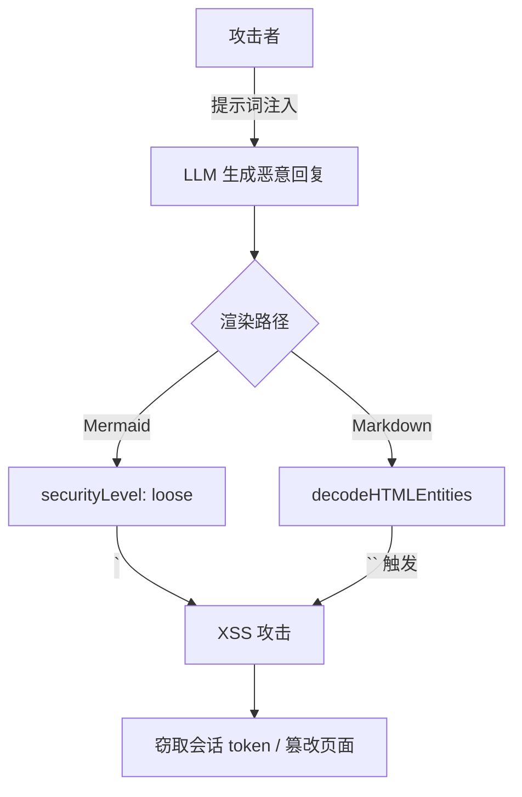

---

doc_type: module
prd_id: "YP-09-112"
title: "YP-09-112: 安全加固 — Mermaid XSS 防护与 HTML 实体解码安全化"
status: 已完成
priority: P0
owner: Claude
roles: [product, engineer, aier]
created: 2026-09-23
updated: 2026-09-23
project: YiPet
project_id: yipet
prd_month: "202609"
tags: [security, xss, mermaid, hardening]
related_tasks: ["112-prd-task-安全加固.md"]
related_tests: ["112-prd-test-安全加固.md"]
related_modules: ["chat/utils.ts", "shared/utility-tools.ts"]

type: 需求
---

# YP-09-112: 安全加固 — XSS 防护

> **PRD 版本**：v1.0 · **状态**：已完成

---

## 1. 背景

YiPet 聊天窗口中渲染 LLM 生成的 Markdown 内容，包括 Mermaid 图表。当前 Mermaid 配置使用 `securityLevel: 'loose'`，允许图表中的任意 HTML/CSS/JavaScript 执行。同时，`decodeHTMLEntities` 使用 `div.innerHTML` 解析 HTML 实体，存在 XSS 攻击面。

LLM 生成的内容不可信——攻击者可通过提示词注入（prompt injection）在 AI 回复中嵌入恶意 Mermaid 图表或 HTML 实体 payload。

## 2. 用户问题

- **目标用户**：所有 YiPet 聊天用户
- **问题陈述**：LLM 生成的 Mermaid 图表中的恶意 HTML/JS 可能在 `loose` 模式下执行；用户粘贴的含事件处理器的 HTML 实体可能触发 XSS
- **证据**：强证据 — OWASP 将 innerHTML 和不受限制的第三方内容渲染列为 Top 10 风险；Mermaid 官方文档推荐 `strict` 作为生产环境安全级别

### 威胁模型

### 证据质量级别

| 级别 | 证据类型 | 可信度 |
|------|---------|--------|
| 强 | Mermaid 官方文档：`loose` 允许任意 HTML，`strict` 转义所有标签 | 高 |
| 强 | OWASP XSS Prevention Cheat Sheet：避免 innerHTML 处理不可信内容 | 高 |
| 中 | 暂无已知的 YiPet XSS 事件报告 | 中 |

## 3. 范围

### 修复项

| 漏洞 | 位置 | 当前行为 | 修复后 |
|------|------|----------|--------|
| Mermaid 安全级别 | `chat/utils.ts:162` | `securityLevel: 'loose'` | `securityLevel: 'strict'` |
| HTML 实体解码 | `utility-tools.ts:260` | `div.innerHTML = html` | `textarea.innerHTML = html` |

### Mermaid 安全级别对比

| 级别 | HTML 标签 | 脚本执行 | `onclick` 等 | 适用场景 |
|------|----------|---------|-------------|----------|
| `strict` | 转义为实体 | 禁止 | 禁止 | **生产环境（推荐）** |
| `loose` | 直接渲染 | 允许 | 允许 | 仅受信输入 |
| `antiscript` | 移除 `<script>` | 移除 | **保留** | 不推荐 |
| `sandbox` | iframe 隔离 | 隔离 | 隔离 | 最高安全 |

### 用户故事

| 优先级 | 故事 | 验收标准 |
|--------|------|---------|
| P0 | LLM 生成的 Mermaid 图表不执行脚本 | `securityLevel === 'strict'` |
| P0 | 用户粘贴的 HTML 实体被安全解码 | 使用 `textarea` 而非 `div` |
| P1 | Mermaid 图表渲染功能不受影响 | 标准 Mermaid 语法正常渲染 |

## 4. 成功指标

| 指标 | 基线值 | 目标值 | 测量方法 |
|------|--------|--------|---------|
| Mermaid 安全级别 | `loose` | `strict` | 代码审查 |
| decodeHTMLEntities 实现 | `div.innerHTML` | `textarea.innerHTML` | 代码审查 |
| 类型检查 | 0 error | 0 error | `vue-tsc --noEmit` |
| 回归测试 | 138/138 | 138/138 | `npm test` |
| Mermaid 标准语法渲染 | — | 正常 | 手工测试 |

## 5. 风险与依赖

| 风险 | 可能性 | 影响 | 缓解 |
|------|--------|------|------|
| `strict` 模式影响 Mermaid 图表中合法的 HTML 标签使用 | 极低 | 低 | 标准 Mermaid 语法不依赖 HTML 标签 |
| `textarea` 解码行为与 `div` 不同 | 极低 | 低 | 两者对实体解码行为完全一致（仅容器语义不同） |

## 6. 时间线

| 里程碑 | 目标日期 | 负责人 |
|--------|---------|--------|
| Mermaid securityLevel 修复 | 2026-09-23 | Claude |
| decodeHTMLEntities 修复 | 2026-09-23 | Claude |
| 类型检查 + 测试 + 构建 | 2026-09-23 | Claude |