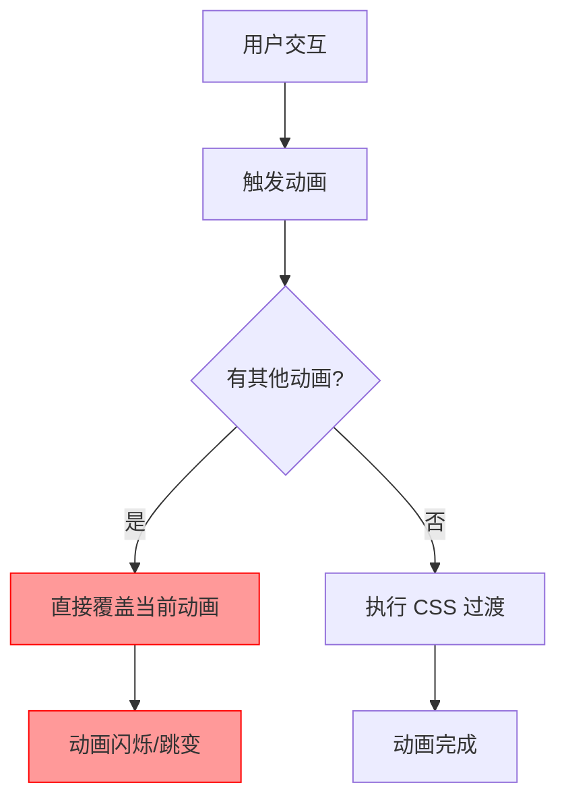
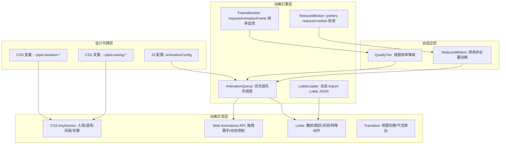
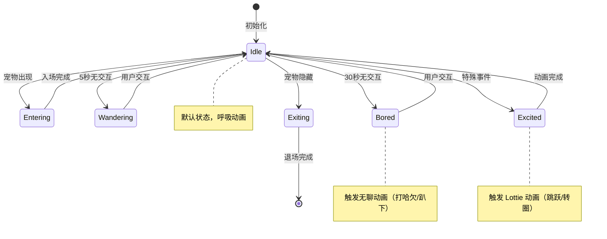

# YP-09-105: 动画与过渡效果系统 — CSS 设计令牌、关键帧动画、队列调度与性能自适应

> 需求编号：YP-09-105 · 优先级：P2 · 人天：0.5d · 状态：需求已编写
> 依赖：无

## 背景

### 问题陈述

YiPet 当前缺乏系统化的动画与过渡效果体系。宠物元素的出现/消失、状态切换、聊天气泡弹出等场景均使用零散的 CSS 过渡，存在以下问题：

1. **体验不一致**：不同组件中动画时长、缓动函数、延迟时间各不相同，缺乏统一的设计令牌
2. **性能问题**：部分动画使用 `left`/`top`/`width`/`height` 等触发布局的属性，在低性能设备上导致卡顿
3. **无无障碍支持**：未检测 `prefers-reduced-motion` 媒体查询，对前庭功能障碍用户不友好
4. **动画冲突**：多个动画同时触发时无队列管理，导致动画互相覆盖、闪烁
5. **复杂动画缺失**：宠物复杂动作（如撒娇、跳跃）无法用纯 CSS 实现，缺少 Lottie 集成方案
6. **无性能监控**：无法感知当前帧率，无法在低帧率时自动降级动画质量

**核心矛盾**：动画是宠物伴侣产品体验的核心差异化要素，但当前实现零散、低效、无系统化设计，且完全不考虑无障碍和性能自适应。

### 影响范围

| # | 影响 | 严重程度 | 典型场景 |
|---|------|----------|----------|
| 1 | 宠物动画在不同设备上表现不一致 | 高 | 高性能设备与低性能设备动画差异大 |
| 2 | 无 reduced-motion 支持导致用户不适 | 中 | 前庭功能障碍用户无法使用产品 |
| 3 | 动画冲突导致 UI 闪烁 | 中 | 快速切换宠物状态时动画重叠 |
| 4 | 复杂宠物动作无法实现 | 中 | 宠物撒娇、跳跃等动作无法表达 |
| 5 | 动画性能无监控 | 低 | 低帧率场景下用户无感知，无法优化 |

### 挑战

| 挑战 | 说明 |
|------|------|
| GPU 加速约束 | 仅 `transform` 和 `opacity` 可触发 GPU 合成，其他属性触发布局重排 |
| Content Script 环境 | 动画运行在宿主页面上下文中，需避免与宿主页面 CSS 冲突 |
| Shadow DOM 隔离 | 动画元素在 Shadow DOM 中，需确保关键帧动画在 Shadow Root 内生效 |
| 帧率检测 | requestAnimationFrame 在后台标签页中会被节流，需区分节流与真实卡顿 |
| Lottie 体积 | Lottie JSON 文件体积大，需按需加载，避免影响 Content Script 注入速度 |

---

## 一、现状分析

### 1.1 当前动画实现

```
现有动画 (零散实现):
├── src/content/components/Pet.vue
│   ├── 宠物入场: opacity 过渡 (0.3s ease)
│   ├── 宠物闲逛: transform translateX (1s linear 无限循环)
│   └── 宠物点击: scale(1.1) (0.2s ease)
├── src/content/components/ChatBubble.vue
│   ├── 气泡弹出: opacity + translateY (0.3s ease-out)
│   └── 气泡消失: opacity (0.2s ease-in)
└── src/content/components/Popup.vue
    └── 面板展开: max-height 过渡 (0.3s ease)

缺失:
├── 设计令牌系统              # ❌ 无统一变量
├── 动画队列管理              # ❌ 无调度
├── prefers-reduced-motion     # ❌ 未检测
├── Lottie 集成               # ❌ 不支持
├── 帧率监控                  # ❌ 无
├── 无聊动画                  # ❌ 无
├── 视图切换过渡              # ❌ 无
└── 动画性能自适应            # ❌ 无
```

### 1.2 动画性能问题分析

| 属性 | 触发阶段 | 性能影响 | 当前使用 |
|------|----------|----------|----------|
| `transform` | 仅合成 (Composite) | 低 | 部分使用 |
| `opacity` | 仅合成 (Composite) | 低 | 使用 |
| `left`/`top` | 布局 → 绘制 → 合成 | 高 | 未使用 |
| `width`/`height` | 布局 → 绘制 → 合成 | 高 | 未使用 |
| `max-height` | 布局 → 绘制 → 合成 | 高 | 面板展开使用 |
| `background-color` | 绘制 → 合成 | 中 | 未使用 |

### 1.3 改造前动画流程



### 1.4 根因矩阵

| 症状 | 根因 | 触发条件 | 频率 |
|------|------|----------|------|
| 动画不一致 | 无设计令牌系统 | 任何动画触发 | 高 |
| 低性能设备卡顿 | 使用触发布局属性 | 动画播放时 | 中 |
| 动画闪烁 | 无队列管理 | 快速连续操作 | 中 |
| 无障碍缺失 | 未检测 reduced-motion | 前庭功能障碍用户 | 低 |
| 复杂动作无法实现 | 无 Lottie 集成 | 需要复杂动画 | 中 |
| 性能不可感知 | 无帧率监控 | 低帧率场景 | 低 |

---

## 二、设计决策

### 决策 1：动画设计令牌方案 — CSS 变量 vs SCSS 变量 vs JS 配置对象

| 选项 | 运行时可变 | 类型安全 | Shadow DOM 兼容 | 体积 |
|------|-----------|----------|----------------|------|
| CSS 变量 (Custom Properties) | 是 | 否 | 需显式继承 | 极小 |
| SCSS 变量 | 否 | 否 | 编译时注入 | 编译时消除 |
| JS 配置对象 | 是 | 是 | 手动注入 | 小 |

**选择：CSS 变量 + JS 配置对象组合。** CSS 变量用于声明式动画属性（时长、缓动），JS 配置对象用于动画队列调度和逻辑控制。CSS 变量通过 `:host` 在 Shadow DOM 中继承，JS 配置对象提供类型安全和运行时动态调整能力。

### 决策 2：复杂动画方案 — 纯 CSS vs Lottie vs Web Animations API

| 选项 | 表现力 | 体积 | 性能 | 可控性 |
|------|--------|------|------|--------|
| 纯 CSS (@keyframes) | 中 | 极小 | 最优 | 声明式，不可暂停 |
| Lottie (lottie-web) | 高 | 大 (50-200KB/动画) | 良好 | 完整 API 控制 |
| Web Animations API | 中高 | 极小 | 最优 | 完整 JS 控制 |

**选择：分层策略。** 简单动画（入场/退场/闲逛/无聊）使用纯 CSS @keyframes；复杂宠物动作（撒娇/跳跃/庆祝）使用 Lottie 按需加载；动态控制的动画（如跟手拖拽）使用 Web Animations API。

### 决策 3：动画队列调度策略 — 覆盖 vs 排队 vs 插队

| 选项 | 用户体验 | 实现复杂度 | 适用场景 |
|------|----------|-----------|----------|
| 覆盖（新动画直接替换旧动画） | 闪烁 | 低 | 简单场景 |
| 排队（FIFO 队列） | 延迟 | 中 | 顺序动画 |
| 优先级插队（高优先级中断低优先级） | 流畅 | 高 | 交互动画 |

**选择：优先级插队策略。** 用户交互触发的动画（点击、拖拽）为高优先级，可中断低优先级的自动动画（闲逛、无聊）。同优先级动画排队执行。提供 `cancelAll()` 方法用于场景切换时强制中断所有动画。

### 决策 4：Lottie 动画按需加载策略

| 选项 | 首屏速度 | 离线可用 | 内存占用 |
|------|----------|----------|----------|
| 全部打包进扩展 | 慢 | 是 | 高 |
| 网络按需加载 | 快 | 否 | 低 |
| 扩展内按需加载（动态 import） | 快 | 是 | 低 |

**选择：扩展内按需加载（动态 import）。** Lottie JSON 文件打包进扩展但通过动态 import 按需加载，首次使用时加载对应动画文件。常用动画预加载，不常用动画懒加载。每个 Lottie 动画文件控制在 50KB 以内。

### 设计决策记录

| 决策 | 选项 A | 选项 B | 选项 C | 选择 | 理由 |
|------|--------|--------|--------|------|------|
| 令牌方案 | CSS 变量 | SCSS 变量 | JS 配置对象 | **CSS 变量 + JS 组合** | 声明式 + 运行时可控 |
| 复杂动画 | 纯 CSS | Lottie | Web Animations API | **分层策略** | 按复杂度选择方案 |
| 队列调度 | 覆盖 | 排队 | 优先级插队 | **优先级插队** | 交互流畅优先 |
| Lottie 加载 | 全部打包 | 网络加载 | 按需动态 import | **按需动态 import** | 速度 + 离线可用 |

---

## 三、目标架构

### 3.1 动画系统架构



### 3.2 动画状态机



### 3.3 性能指标

| 指标 | 改造前 | 改造后 |
|------|--------|--------|
| 动画帧率（高性能设备） | 不稳定 (30-60fps) | 稳定 60fps |
| 动画帧率（低性能设备） | 20-30fps | 自适应降级 30fps |
| 动画冲突率 | 高 | 消除 |
| 首次动画响应时间 | 即时 | 即时（非 Lottie）/ < 200ms（Lottie 懒加载） |
| reduced-motion 支持 | 无 | 完整支持 |
| 设计令牌覆盖率 | 0% | 100% |

---

## 四、具体改动

### 4.1 CSS 动画设计令牌

```css
/* src/content/styles/animation-tokens.css (新增) */

:host {
  /* === 时长令牌 === */
  --yipet-duration-instant: 0ms;
  --yipet-duration-fast: 150ms;
  --yipet-duration-normal: 300ms;
  --yipet-duration-slow: 500ms;
  --yipet-duration-slower: 800ms;

  /* === 缓动令牌 === */
  --yipet-easing-standard: cubic-bezier(0.4, 0.0, 0.2, 1);
  --yipet-easing-decelerate: cubic-bezier(0.0, 0.0, 0.2, 1);
  --yipet-easing-accelerate: cubic-bezier(0.4, 0.0, 1.0, 1);
  --yipet-easing-sharp: cubic-bezier(0.4, 0.0, 0.6, 1);
  --yipet-easing-bounce: cubic-bezier(0.175, 0.885, 0.32, 1.275);

  /* === 延迟令牌 === */
  --yipet-delay-short: 50ms;
  --yipet-delay-normal: 100ms;
  --yipet-delay-long: 300ms;
  --yipet-delay-stagger: 80ms;

  /* === 距离令牌 === */
  --yipet-offset-near: 8px;
  --yipet-offset-normal: 24px;
  --yipet-offset-far: 48px;
}
```

### 4.2 CSS 关键帧动画

```css
/* src/content/styles/keyframes.css (新增) */

/* 宠物入场：从屏幕外滑入 + 淡入 */
@keyframes pet-enter {
  from {
    opacity: 0;
    transform: translateX(var(--yipet-offset-far)) scale(0.8);
  }
  to {
    opacity: 1;
    transform: translateX(0) scale(1);
  }
}

/* 宠物退场：缩小 + 淡出 */
@keyframes pet-exit {
  from {
    opacity: 1;
    transform: scale(1);
  }
  to {
    opacity: 0;
    transform: scale(0.5);
  }
}

/* 闲逛：缓慢水平摆动 */
@keyframes pet-wander {
  0%   { transform: translateX(0) rotate(0deg); }
  25%  { transform: translateX(12px) rotate(2deg); }
  75%  { transform: translateX(-12px) rotate(-2deg); }
  100% { transform: translateX(0) rotate(0deg); }
}

/* 无聊：轻微上下浮动 */
@keyframes pet-bored {
  0%   { transform: translateY(0) scale(1); }
  50%  { transform: translateY(-6px) scale(1.02); }
  100% { transform: translateY(0) scale(1); }
}

/* 聊天气泡滑入 */
@keyframes bubble-slide-in {
  from {
    opacity: 0;
    transform: translateY(var(--yipet-offset-near)) scale(0.95);
  }
  to {
    opacity: 1;
    transform: translateY(0) scale(1);
  }
}

/* 呼吸动画（空闲状态） */
@keyframes pet-breathe {
  0%   { transform: scale(1); }
  50%  { transform: scale(1.03); }
  100% { transform: scale(1); }
}

/* 动画应用类 */
.pet-anim-enter {
  animation: pet-enter var(--yipet-duration-slow) var(--yipet-easing-decelerate);
}

.pet-anim-exit {
  animation: pet-exit var(--yipet-duration-normal) var(--yipet-easing-accelerate);
}

.pet-anim-wander {
  animation: pet-wander 3s var(--yipet-easing-standard) infinite;
}

.pet-anim-bored {
  animation: pet-bored 2s var(--yipet-easing-standard) infinite;
}

.pet-anim-breathe {
  animation: pet-breathe 4s var(--yipet-easing-standard) infinite;
}

.bubble-anim-enter {
  animation: bubble-slide-in var(--yipet-duration-normal) var(--yipet-easing-decelerate);
}
```

### 4.3 动画队列系统

```typescript
// src/content/composables/useAnimationQueue.ts (新增)

type AnimationPriority = 'high' | 'normal' | 'low';

interface AnimationTask {
  id: string;
  priority: AnimationPriority;
  execute: () => Promise<void>;
  onCancel?: () => void;
}

interface UseAnimationQueue {
  enqueue: (task: AnimationTask) => Promise<void>;
  cancelAll: () => void;
  cancelByPriority: (priority: AnimationPriority) => void;
  isRunning: () => boolean;
  pendingCount: () => number;
}

export function useAnimationQueue(): UseAnimationQueue {
  const highQueue: AnimationTask[] = [];
  const normalQueue: AnimationTask[] = [];
  const lowQueue: AnimationTask[] = [];
  let currentTask: AnimationTask | null = null;
  let isProcessing = false;

  function getQueue(priority: AnimationPriority): AnimationTask[] {
    switch (priority) {
      case 'high': return highQueue;
      case 'normal': return normalQueue;
      case 'low': return lowQueue;
    }
  }

  function getNextTask(): AnimationTask | undefined {
    return highQueue.shift() || normalQueue.shift() || lowQueue.shift();
  }

  async function processQueue(): Promise<void> {
    if (isProcessing) return;
    isProcessing = true;

    while (true) {
      const task = getNextTask();
      if (!task) break;

      currentTask = task;
      try {
        await task.execute();
      } catch (error) {
        console.warn('[AnimationQueue] Task failed:', task.id, error);
      }
      currentTask = null;
    }

    isProcessing = false;
  }

  async function enqueue(task: AnimationTask): Promise<void> {
    // 高优先级任务中断当前低优先级任务
    if (task.priority === 'high' && currentTask && currentTask.priority === 'low') {
      currentTask.onCancel?.();
      currentTask = null;
    }

    const queue = getQueue(task.priority);
    queue.push(task);
    // 按优先级排序（高优先级在前）
    if (task.priority === 'high') {
      queue.sort((a, b) => {
        const order = { high: 0, normal: 1, low: 2 };
        return order[a.priority] - order[b.priority];
      });
    }

    if (!isProcessing) {
      await processQueue();
    }
  }

  function cancelAll(): void {
    highQueue.length = 0;
    normalQueue.length = 0;
    lowQueue.length = 0;
    currentTask?.onCancel?.();
    currentTask = null;
    isProcessing = false;
  }

  function cancelByPriority(priority: AnimationPriority): void {
    const queue = getQueue(priority);
    queue.length = 0;
  }

  return {
    enqueue,
    cancelAll,
    cancelByPriority,
    isRunning: () => isProcessing,
    pendingCount: () => highQueue.length + normalQueue.length + lowQueue.length,
  };
}
```

### 4.4 帧率监控与自适应降级

```typescript
// src/content/composables/useFrameMonitor.ts (新增)

type QualityTier = 'high' | 'medium' | 'low';

interface FrameStats {
  currentFps: number;
  averageFps: number;
  qualityTier: QualityTier;
  isThrottled: boolean;
}

interface UseFrameMonitor {
  start: () => void;
  stop: () => void;
  getStats: () => FrameStats;
  onQualityChange: (callback: (tier: QualityTier) => void) => () => void;
}

export function useFrameMonitor(): UseFrameMonitor {
  let rafId: number | null = null;
  let lastTime = performance.now();
  let frameCount = 0;
  let fpsHistory: number[] = [];
  const FPS_SAMPLE_WINDOW = 60; // 采样 60 帧
  const listeners: Set<(tier: QualityTier) => void> = new Set();
  let currentTier: QualityTier = 'high';

  function tick(now: number): void {
    const delta = now - lastTime;
    lastTime = now;

    // 后台标签页 requestAnimationFrame 会被节流，delta 可能很大
    const isThrottled = delta > 100;
    if (!isThrottled && delta > 0) {
      const fps = 1000 / delta;
      fpsHistory.push(fps);
      if (fpsHistory.length > FPS_SAMPLE_WINDOW) {
        fpsHistory.shift();
      }
    }

    frameCount++;
    rafId = requestAnimationFrame(tick);
  }

  function getAverageFps(): number {
    if (fpsHistory.length === 0) return 60;
    const sum = fpsHistory.reduce((a, b) => a + b, 0);
    return Math.round(sum / fpsHistory.length);
  }

  function evaluateQuality(fps: number): QualityTier {
    if (fps >= 50) return 'high';
    if (fps >= 30) return 'medium';
    return 'low';
  }

  function checkQualityChange(): void {
    const avgFps = getAverageFps();
    const newTier = evaluateQuality(avgFps);
    if (newTier !== currentTier) {
      currentTier = newTier;
      listeners.forEach(cb => cb(newTier));
    }
  }

  // 每秒检查一次质量等级
  let qualityCheckInterval: ReturnType<typeof setInterval> | null = null;

  return {
    start() {
      rafId = requestAnimationFrame(tick);
      qualityCheckInterval = setInterval(checkQualityChange, 1000);
    },

    stop() {
      if (rafId !== null) {
        cancelAnimationFrame(rafId);
        rafId = null;
      }
      if (qualityCheckInterval !== null) {
        clearInterval(qualityCheckInterval);
        qualityCheckInterval = null;
      }
    },

    getStats(): FrameStats {
      return {
        currentFps: fpsHistory.length > 0 ? fpsHistory[fpsHistory.length - 1] : 60,
        averageFps: getAverageFps(),
        qualityTier: currentTier,
        isThrottled: false,
      };
    },

    onQualityChange(callback: (tier: QualityTier) => void): () => void {
      listeners.add(callback);
      return () => listeners.delete(callback);
    },
  };
}
```

### 4.5 Reduced Motion 检测

```typescript
// src/content/composables/useReducedMotion.ts (新增)

interface UseReducedMotion {
  isReduced: () => boolean;
  onChange: (callback: (reduced: boolean) => void) => () => void;
}

export function useReducedMotion(): UseReducedMotion {
  const mediaQuery = window.matchMedia('(prefers-reduced-motion: reduce)');

  return {
    isReduced: () => mediaQuery.matches,

    onChange(callback: (reduced: boolean) => void): () => void {
      const handler = (event: MediaQueryListEvent) => {
        callback(event.matches);
      };
      mediaQuery.addEventListener('change', handler);
      return () => mediaQuery.removeEventListener('change', handler);
    },
  };
}

// 使用方式：在动画组件中
// const { isReduced } = useReducedMotion();
// if (isReduced()) {
//   // 跳过非必要动画，直接设置最终状态
// } else {
//   // 播放完整动画
// }
```

### 4.6 Lottie 集成器

```typescript
// src/content/composables/useLottieLoader.ts (新增)

interface LottieAnimation {
  name: string;
  play: () => void;
  stop: () => void;
  destroy: () => void;
}

type LottieAnimationName = 'excited-jump' | 'celebrate' | 'sleep' | 'beg';

const ANIMATION_MAP: Record<LottieAnimationName, () => Promise<unknown>> = {
  'excited-jump': () => import('../assets/lottie/excited-jump.json'),
  'celebrate': () => import('../assets/lottie/celebrate.json'),
  'sleep': () => import('../assets/lottie/sleep.json'),
  'beg': () => import('../assets/lottie/beg.json'),
};

const preloadList: LottieAnimationName[] = ['excited-jump'];
const loadedCache = new Map<string, unknown>();

export function useLottieLoader() {
  async function load(name: LottieAnimationName): Promise<unknown> {
    if (loadedCache.has(name)) {
      return loadedCache.get(name);
    }
    const loader = ANIMATION_MAP[name];
    if (!loader) {
      throw new Error(`Unknown Lottie animation: ${name}`);
    }
    const module = await loader();
    loadedCache.set(name, module);
    return module;
  }

  async function preload(): Promise<void> {
    await Promise.all(preloadList.map(name => load(name)));
  }

  function isLoaded(name: LottieAnimationName): boolean {
    return loadedCache.has(name);
  }

  return { load, preload, isLoaded };
}
```

### 4.7 文件变更清单

| 文件 | 操作 | 说明 |
|------|------|------|
| `src/content/styles/animation-tokens.css` | 新增 | CSS 动画设计令牌 |
| `src/content/styles/keyframes.css` | 新增 | CSS 关键帧动画定义 |
| `src/content/composables/useAnimationQueue.ts` | 新增 | 动画队列调度系统 |
| `src/content/composables/useFrameMonitor.ts` | 新增 | 帧率监控与自适应降级 |
| `src/content/composables/useReducedMotion.ts` | 新增 | Reduced Motion 检测 |
| `src/content/composables/useLottieLoader.ts` | 新增 | Lottie 动画按需加载 |
| `src/content/components/Pet.vue` | 修改 | 接入动画队列 + 帧率自适应 |
| `src/content/components/ChatBubble.vue` | 修改 | 接入动画令牌 + 队列 |
| `src/content/components/Popup.vue` | 修改 | 视图切换过渡 |
| `src/content/assets/lottie/*.json` | 新增 | Lottie 动画文件 (4个) |
| `src/content/types/animation.ts` | 新增 | 动画相关类型定义 |

---

## 五、实施步骤

| 步骤 | 操作 | 路径 | 验证 | 人天 |
|------|------|------|------|------|
| 1 | 创建 CSS 设计令牌 | `animation-tokens.css` | 变量在 Shadow DOM 中可访问 | 0.03 |
| 2 | 定义 CSS 关键帧动画 | `keyframes.css` | 动画在浏览器中渲染正常 | 0.05 |
| 3 | 实现动画队列系统 | `useAnimationQueue.ts` | 优先级插队逻辑正确 | 0.08 |
| 4 | 实现帧率监控 | `useFrameMonitor.ts` | 帧率统计准确，质量切换触发 | 0.06 |
| 5 | 实现 reduced-motion 检测 | `useReducedMotion.ts` | 系统设置变化时回调触发 | 0.02 |
| 6 | 实现 Lottie 加载器 | `useLottieLoader.ts` | 按需加载成功，缓存生效 | 0.05 |
| 7 | 改造 Pet 组件 | `Pet.vue` | 入场/退场/闲逛/无聊动画流畅 | 0.08 |
| 8 | 改造 ChatBubble 组件 | `ChatBubble.vue` | 气泡动画流畅，无冲突 | 0.04 |
| 9 | 改造 Popup 视图切换 | `Popup.vue` | 视图切换过渡平滑 | 0.04 |
| 10 | 制作 Lottie 动画文件 | `assets/lottie/` | 4 个动画可正常播放 | 0.05 |

**总人天：0.5d**

---

## 六、测试规格

### 场景 1：宠物入场动画

**GIVEN** 宠物元素首次渲染到页面
**WHEN** 动画系统执行入场动画
**THEN** 宠物应从右侧滑入并淡入
**AND** 动画时长应为 `--yipet-duration-slow`（500ms）
**AND** 缓动函数应为 `--yipet-easing-decelerate`
**AND** 动画完成后宠物应处于空闲呼吸状态

### 场景 2：动画优先级插队

**GIVEN** 宠物正在执行无聊动画（低优先级）
**WHEN** 用户点击宠物触发交互动画（高优先级）
**THEN** 无聊动画应立即中断
**AND** 交互动画应立即开始播放
**AND** 交互动画完成后不应恢复无聊动画

### 场景 3：Reduced Motion 偏好

**GIVEN** 用户在操作系统中启用了"减少动态效果"
**WHEN** 任何动画触发
**THEN** 所有非必要动画应跳过（宠物入场直接显示，无过渡）
**AND** 仅保留必要的功能性动画（如加载指示器）
**AND** CSS 变量 `--yipet-duration-*` 应被覆盖为 `0ms`

### 场景 4：帧率自适应降级

**GIVEN** 帧率监控检测到平均帧率低于 30fps
**WHEN** 质量等级从 `high` 降为 `low`
**THEN** 应禁用 Lottie 动画（回退为 CSS 动画）
**AND** 应减少同时播放的动画数量
**AND** 应移除阴影/模糊等 GPU 开销大的视觉效果
**AND** 帧率恢复后应自动恢复到原质量等级

### 场景 5：Lottie 动画按需加载

**GIVEN** 宠物需要播放庆祝动画（Lottie）
**WHEN** 首次调用 `useLottieLoader().load('celebrate')`
**THEN** 应动态 import 对应的 Lottie JSON 文件
**AND** 加载完成后应缓存，第二次调用直接返回缓存
**AND** 加载期间宠物应显示 CSS 回退动画
**AND** 加载失败应静默回退到 CSS 动画

### 场景 6：动画队列取消

**GIVEN** 队列中有 3 个待执行的动画
**WHEN** 调用 `cancelAll()`
**THEN** 所有待执行动画应从队列中移除
**AND** 当前正在执行的动画应触发 `onCancel` 回调
**AND** 队列状态应重置为空闲

---

## 七、风险与缓解

| 风险 | 概率 | 影响 | 缓解措施 |
|------|------|------|----------|
| CSS 变量与宿主页面命名冲突 | 低 | 中 | 使用 `--yipet-` 前缀，Shadow DOM 隔离 |
| Lottie 动画文件体积过大 | 中 | 中 | 限制每个动画 50KB，使用 lottie-compress 压缩 |
| 帧率检测在后台标签页误判 | 中 | 低 | 检测 delta > 100ms 判定为节流而非卡顿 |
| 动画队列内存泄漏 | 低 | 中 | 限制队列最大长度 20，超限时丢弃最低优先级任务 |
| Web Animations API 兼容性 | 低 | 低 | Safari 15.4+ 已支持，MV3 要求 Chrome 88+ 完全支持 |

---

## 八、回滚策略

| 场景 | 回滚操作 | 影响 |
|------|----------|------|
| 动画队列导致交互卡顿 | 禁用队列，恢复为覆盖模式 | 动画可能闪烁 |
| Lottie 加载性能问题 | 移除 Lottie 集成，仅保留 CSS 动画 | 复杂动作无法表达 |
| 帧率监控误判导致过度降级 | 固定质量等级为 `high` | 低性能设备体验差 |
| CSS 变量与宿主页面冲突 | 移除 CSS 变量方案，回退为硬编码值 | 失去设计令牌灵活性 |

---

## 九、设计决策记录

### D-01：动画帧率监控采样策略

- **问题**：如何准确检测帧率并在低帧率时自适应降级
- **选项**：固定周期采样（每秒）、滑动窗口采样（60 帧）、事件驱动采样
- **选择**：滑动窗口采样（最近 60 帧取平均）
- **理由**：固定周期在帧率波动时误判率高；事件驱动无法覆盖持续低帧率；滑动窗口（60 帧 ≈ 1s @ 60fps）平衡了响应速度和稳定性

### D-02：Lottie 动画与 CSS 动画的切换策略

- **问题**：Lottie 加载期间和加载失败时显示什么
- **选项**：空白等待、CSS 回退动画、静态占位
- **选择**：CSS 回退动画
- **理由**：空白等待导致用户感知延迟；静态占位与宠物产品调性不符；CSS 回退动画（如简化的跳跃关键帧）提供即时反馈，Lottie 加载完成后无缝切换

### D-03：Reduced Motion 的动画分类

- **问题**：哪些动画在 reduced-motion 模式下应保留
- **选项**：全部禁用、仅禁用装饰性动画、用户自定义
- **选择**：仅禁用装饰性动画（入场/退场/闲逛/无聊），保留功能性动画（加载指示器、进度条）
- **理由**：WCAG 2.2 准则 2.3.3 要求保留必要动画；装饰性动画是前庭功能障碍的主要触发因素；功能性动画帮助用户理解系统状态

### D-04：动画队列容量限制

- **问题**：动画队列无限增长时如何处理
- **选项**：无限制、FIFO 溢出丢弃、优先级丢弃
- **选择**：优先级丢弃（队列超过 20 个任务时丢弃最低优先级的任务）
- **理由**：无限制可能导致内存泄漏；FIFO 丢弃可能丢弃重要的交互动画；优先级丢弃确保高优先级交互动画始终保留

---

## 十、可观测性

### 指标

| 指标 | 类型 | 说明 |
|------|------|------|
| `yipet.anim.fps_current` | Gauge | 当前帧率 |
| `yipet.anim.fps_average` | Gauge | 平均帧率（60 帧窗口） |
| `yipet.anim.quality_tier` | Gauge | 当前质量等级 (0=low, 1=medium, 2=high) |
| `yipet.anim.queue_length` | Gauge | 动画队列当前长度 |
| `yipet.anim.queue_dropped_total` | Counter | 因队列溢出丢弃的任务数 |
| `yipet.anim.lottie_load_time_ms` | Histogram | Lottie 动画加载耗时 |
| `yipet.anim.reduced_motion_enabled` | Gauge | 用户是否启用 reduced-motion |

### 告警

| 告警 | 条件 | 级别 |
|------|------|------|
| 帧率持续低于 30fps | 超过 5 秒 | WARNING |
| 动画队列长度 > 10 | 持续超过 3 秒 | WARNING |
| Lottie 加载失败 | 任何加载失败 | ERROR |
| 队列丢弃任务 | 每分钟 > 5 次 | WARNING |

---

## 十一、代码审查检查清单

- [ ] CSS 动画仅使用 `transform` 和 `opacity`，不触发 layout
- [ ] 所有动画时长和缓动使用 CSS 变量，无硬编码值
- [ ] 动画队列正确实现优先级插队，高优先级中断低优先级
- [ ] 帧率监控区分了后台标签页节流和真实卡顿
- [ ] reduced-motion 检测正确，装饰性动画被跳过
- [ ] Lottie 动画按需加载，缓存机制生效
- [ ] Lottie 加载失败有 CSS 回退动画
- [ ] 动画队列有容量限制，防止内存泄漏
- [ ] 组件卸载时动画队列和帧率监控正确清理
- [ ] 所有新增文件有对应的单元测试

---

## 回归问题预测

| # | 预测问题 | 原因 | 验证方法 |
|---|---------|------|---------|
| 1 | Shadow DOM 中的 CSS 关键帧动画不生效，宠物元素无动画效果 | CSS `@keyframes` 在 Shadow DOM 中需要定义在 `:host` 选择器内或使用 `@keyframes` 在 Shadow Root 内部的 `<style>` 标签中；如果定义在全局 CSS 中，Shadow DOM 无法访问 | 在 Shadow DOM 中定义 `@keyframes`，确保 `animation` 属性引用的是 Shadow 内部的关键帧名称 |
| 2 | `requestAnimationFrame` 在后台标签页被节流，帧率监控误判为低性能，触发了不必要的动画降级 | Chrome 后台标签页的 rAF 被限制为 1fps，`performance.now()` 返回的 delta 可能达到 1000ms，被帧率监控认为是卡顿 | 在帧率监控中添加 `delta > 100` 的后台标签页检测逻辑，标记 `isThrottled` 状态，节流期间不触发质量降级 |
| 3 | Lottie 动画的 `lottie-web` 库体积约 250KB（gzip 后约 70KB），导致 Content Script 注入时间增加，宠物首次出现延迟 | `lottie-web` 作为依赖打包进 Content Script bundle，增加了初始加载体积 | 使用 `lottie-web/build/player/lottie_light.min.js`（仅 SVG 渲染，gzip 后约 50KB），且仅在首次调用 `load()` 时动态 import，不阻塞首次渲染 |
| 4 | 动画队列中 `enqueue()` 返回的 Promise 在用户快速点击时永远不会 resolve，导致调用方挂起 | 如果 `cancelAll()` 在任务执行前被调用，被取消的任务的 Promise 没有被 reject 或 resolve，调用方 `await` 永远等待 | 在 `cancelAll()` 中为所有被取消的任务调用 `onCancel`，任务在被取消时 reject 一个 `CancelledError`，调用方使用 `try/catch` 处理 |
| 5 | CSS 变量 `--yipet-duration-*` 在 reduced-motion 模式下被覆盖为 `0ms`，但 `transition` 属性中使用 `0ms` 时浏览器仍会触发 `transitionend` 事件，导致状态管理逻辑错误 | CSS transition 的 duration 为 `0ms` 时，`transitionend` 事件在下一帧触发而不是立即触发，顺序依赖 `transitionend` 的代码可能出错 | 在 reduced-motion 模式下，使用 `animation: none` 和 `transition: none` 直接禁用，而不是设置 `0ms` 时长，避免 `transitionend` 事件触发 |
| 6 | 动画队列中连续执行多个 Lottie 动画时，前一个动画的 DOM 元素未清理，导致 Shadow DOM 中累积大量 Lottie SVG 节点，内存持续增长 | Lottie 的 `destroy()` 方法需要显式调用才能清理 DOM 节点和事件监听器；如果动画被中断但未调用 `destroy()`，SVG 节点残留在 DOM 中 | 在 Lottie 动画的 `onCancel` 回调中调用 `destroy()`，队列中每个 Lottie 任务包装为 try/finally 确保 `destroy()` 始终被调用 |

---

## 性能分析

### 动画各阶段耗时

| 阶段 | 预估耗时 | 说明 |
|------|----------|------|
| CSS 动画触发 | < 1ms | 浏览器合成器线程处理，不阻塞主线程 |
| Lottie JSON 加载（首次） | 50-200ms | 动态 import，受网络/磁盘速度影响 |
| Lottie JSON 加载（缓存） | < 1ms | 从内存缓存读取 |
| Lottie 渲染初始化 | 5-15ms | 解析 JSON + 创建 SVG 节点 |
| 帧率监控采样 | < 0.1ms/帧 | rAF 回调中的计算开销 |
| 动画队列调度 | < 0.5ms/任务 | 队列操作和优先级判断 |

### 内存影响

| 项目 | 体积 | 说明 |
|------|------|------|
| CSS 令牌 + 关键帧 | ~2KB | 静态 CSS 文件 |
| 动画队列 | ~1KB | 运行时内存（最多 20 个任务） |
| 帧率监控 | ~2KB | fpsHistory 数组（60 个数字） |
| Lottie JSON（单个） | 30-50KB | 按需加载，最多同时缓存 4 个 |
| lottie_light 库 | ~50KB (gzip) | 按需加载，不阻塞首屏 |

### 对 Content Script 注入速度的影响

| 阶段 | 影响 | 说明 |
|------|------|------|
| 初始注入 | 无影响 | 动画令牌和队列系统为纯 JS，体积 < 5KB |
| 首帧渲染 | 无影响 | CSS 动画由浏览器合成器处理 |
| Lottie 首次使用 | 延迟 50-200ms | 仅在触发复杂动画时加载 |
| 长期运行 | 稳定 | 队列有容量限制，定时清理 |

### 帧率目标

| 质量等级 | 目标帧率 | 动画策略 |
|----------|----------|----------|
| High (>= 50fps) | 60fps | 完整动画 + Lottie + 视觉效果 |
| Medium (30-50fps) | 30fps | CSS 动画优先，减少同时动画数 |
| Low (< 30fps) | 15fps | 仅保留必要动画，禁用 Lottie |