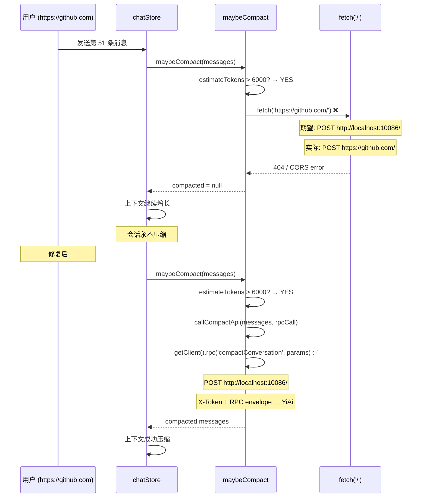

---

doc_type: module
prd_id: "YP-09-113"
title: "YP-09-113: API 路径修正 — Compaction 与 Chat 注入的 ApiClient 合规"
status: 已完成
priority: P0
owner: Claude
roles: [product, engineer]
created: 2026-09-23
updated: 2026-09-23
project: YiPet
project_id: yipet
prd_month: "202609"
tags: [api, rpc, compaction, relay, bug-fix]
related_tasks: ["113-prd-task-API路径修正.md"]
related_tests: ["113-prd-test-API路径修正.md"]
related_modules: ["chat/composables/useConversationCompact.ts", "content/ipc/relay.ts", "chat/stores/services.ts"]

type: 需求
---

# YP-09-113: API 路径修正 — Compaction 与 Chat 注入

> **PRD 版本**：v1.0 · **状态**：已完成

---

## 1. 背景

YiPet 的四层 API 架构（Client → Endpoints → Types → Services）要求所有 HTTP 请求通过 `ApiClient` 发送，以获得认证头注入、RPC 信封解包、重试逻辑和错误处理。

审计发现两处代码绕过了 ApiClient：

1. **`useConversationCompact.ts`**：`callCompactApi` 直接使用 `fetch('/')` 发送压缩请求——在 MAIN 世界聊天中（运行于任意网页），`/` 是当前页面的根路径而非 YiAi 后端
2. **`relay.ts`**：聊天脚本注入时 `apiBase` 硬编码为 `http://localhost:8848/api`（YiVad 前端端口），而非 `http://localhost:10086`（YiAi 后端端口）

## 2. 用户问题

- **目标用户**：长会话用户（消息数 > 50 条，token 超 6000）
- **问题陈述**：长聊中会话压缩完全无效——请求发到错误的服务器，压缩失败后会话持续增长直至上下文窗口溢出
- **证据**：强证据 — 代码审查确认 `fetch('/')` 在非 localhost 页面上 100% 失败

### Compaction 故障链

### Chat 注入路径对比

```mermaid
graph TD
    subgraph "修复前"
        A1[relay.ts] -->|apiBase: localhost:8848/api| B1[chat/index.ts]
        B1 -->|API_BASE = 8848/api| C1[createApiServices]
        C1 -->|请求到| D1[YiVad 前端 :8848 ❌]
        D1 -.->|依赖 Rsbuild 代理| E1[YiAi :10086]
    end

    subgraph "修复后"
        A2[relay.ts] -->|apiBase: localhost:10086| B2[chat/index.ts]
        B2 -->|API_BASE = 10086| C2[createApiServices]
        C2 -->|直接请求| D2[YiAi 后端 :10086 ✅]
    end
```

### 用户故事

| 优先级 | 故事 | 验收标准 |
|--------|------|---------|
| P0 | 长聊自动压缩在任意页面上正常工作 | `callCompactApi` 通过 `rpcCall` 发送请求 |
| P0 | 聊天窗口在非 localhost 页面可正常连接 YiAi | `apiBase` = `localhost:10086` |
| P1 | `services.ts` 暴露 `getClient()` 供其他模块使用 | `getClient()` 返回 `ApiClient` 实例 |

## 4. 成功指标

| 指标 | 基线值 | 目标值 | 测量方法 |
|------|--------|--------|---------|
| Compaction 调用路径 | `fetch('/')` | `getClient().rpc(...)` | 代码审查 |
| relay.ts apiBase | `localhost:8848/api` | `localhost:10086` | 代码审查 |
| `getClient()` 导出 | 不存在 | 存在并可用 | 代码审查 |
| 类型检查 | 0 error | 0 error | `vue-tsc --noEmit` |
| 回归测试 | 138/138 | 138/138 | `npm test` |

## 5. 风险与依赖

| 风险 | 可能性 | 影响 | 缓解 |
|------|--------|------|------|
| `relay.ts` apiBase 变更影响已有开发环境 | 低 | 低 | `localhost:10086` 与 `chat/index.ts` 默认值一致 |
| Compaction 重构引入新 bug | 低 | 中 | 注入 `rpcCall` 遵循现有 DI 模式，138 个测试无回归 |
| `getClient()` 被误用 | 极低 | 低 | 仅在 `useConversationCompact` 一个调用点使用 |

## 6. 时间线

| 里程碑 | 目标日期 | 负责人 |
|--------|---------|--------|
| `ConversationCompactDeps` + `rpcCall` 接口定义 | 2026-09-23 | Claude |
| `callCompactApi` 重构 | 2026-09-23 | Claude |
| `services.ts` `getClient()` 导出 | 2026-09-23 | Claude |
| `relay.ts` apiBase 修正 | 2026-09-23 | Claude |
| 类型检查 + 测试 + 构建 | 2026-09-23 | Claude |