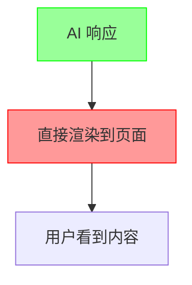
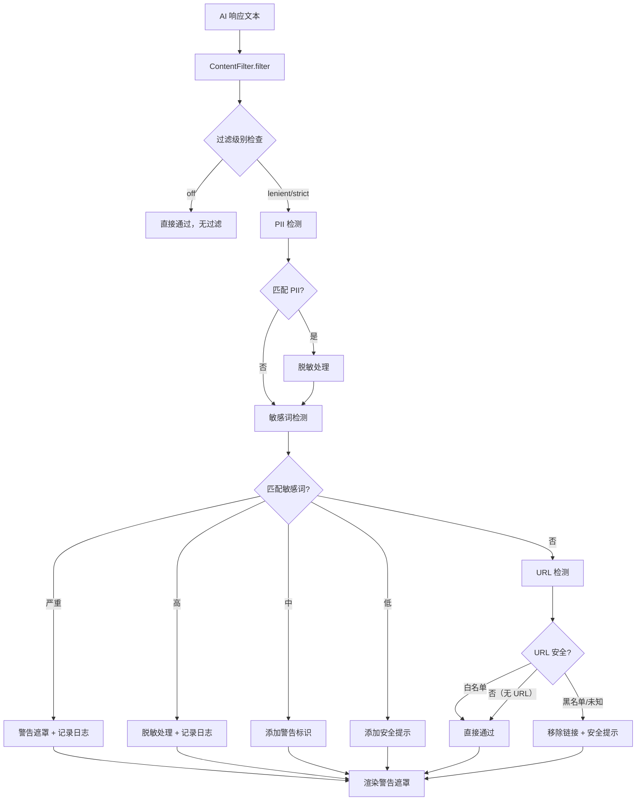
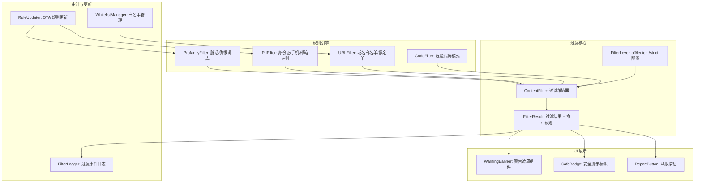

# YP-09-106: 内容安全过滤 — AI 响应内容审查、分级过滤与用户举报机制

> 需求编号：YP-09-106 · 优先级：P2 · 人天：0.5d · 状态：需求已编写
> 依赖：无

## 背景

### 问题陈述

YiPet 作为 Chrome 扩展，AI 对话响应直接展示在用户浏览的任意网页上。当前系统对 AI 生成内容没有任何过滤机制，存在以下风险：

1. **有害内容隐患**：AI 可能生成包含仇恨言论、暴力、色情等不当内容，尤其在角色扮演场景中
2. **隐私泄露风险**：AI 响应中可能无意中包含其他用户的 PII（个人身份信息）
3. **恶意链接风险**：AI 响应中的外部 URL 可能是钓鱼链接或恶意网站
4. **代码执行风险**：AI 响应中的代码片段在用户不知情的情况下可能被复制执行
5. **无问责机制**：用户遇到不当内容时无法举报，问题无法追溯和改进
6. **合规风险**：Chrome Web Store 对扩展内容有严格审核，无过滤机制可能导致下架

**核心矛盾**：宠物伴侣产品的核心价值是自然的对话体验，但内容过滤可能影响响应速度和对话流畅度。需要在安全性和用户体验之间取得平衡——过滤必须快速、精准、不影响正常对话。

### 影响范围

| # | 影响 | 严重程度 | 典型场景 |
|---|------|----------|----------|
| 1 | AI 生成不当内容直接展示 | 高 | 角色扮演中产生不当对话 |
| 2 | 用户隐私信息泄露 | 高 | AI 响应中包含其他用户的邮箱/电话 |
| 3 | 恶意链接未被拦截 | 中 | AI 响应中包含钓鱼 URL |
| 4 | Chrome Web Store 审核不通过 | 高 | 缺少内容过滤被拒绝上架 |
| 5 | 用户无法反馈问题内容 | 中 | 遇到不当内容只能关闭扩展 |

### 挑战

| 挑战 | 说明 |
|------|------|
| 过滤性能 | 必须在 Content Script 中本地过滤，不能依赖外部 API（隐私约束） |
| 误判率 | 正则匹配容易误判正常内容，影响对话体验 |
| PII 检测 | 身份证号、手机号、邮箱等格式多样，需覆盖中英文场景 |
| 多语言 | AI 响应可能包含中英文混合内容，过滤规则需覆盖多语言 |
| 过滤粒度 | 是过滤整个响应还是仅过滤敏感部分，需平衡安全性和可用性 |

---

## 一、现状分析

### 1.1 当前内容安全现状

```
现有安全措施:
├── 无内容过滤                # 所有 AI 响应直接展示
├── 无 PII 检测               # 不检查个人身份信息
├── 无 URL 检查               # 不检查外部链接安全性
├── 无举报机制                # 用户无法反馈问题
└── 无过滤日志                # 无审计追踪

缺失:
├── 内容过滤引擎              # ❌ 不存在
├── 分级过滤配置              # ❌ 不存在
├── 警告提示组件              # ❌ 不存在
├── 用户举报流程              # ❌ 不存在
├── 白名单管理                # ❌ 不存在
├── 过滤审计日志              # ❌ 不存在
└── 成人用户认证              # ❌ 不存在
```

### 1.2 内容风险分类

| 类别 | 风险等级 | 示例 | 处理方式 |
|------|----------|------|----------|
| 仇恨言论 | 严重 | 种族歧视、性别攻击 | 完全拦截 |
| 色情内容 | 严重 | 露骨描述、性暗示 | 完全拦截 |
| 暴力内容 | 严重 | 详细的暴力描述 | 完全拦截 |
| PII 泄露 | 高 | 身份证号、电话号码、邮箱 | 脱敏处理 |
| 恶意 URL | 高 | 钓鱼链接、恶意软件下载 | 移除链接 |
| 代码执行 | 中 | `eval()`、`rm -rf /` 等危险命令 | 添加警告 |
| 外部 URL | 低 | 非白名单域名的链接 | 添加安全提示 |

### 1.3 改造前内容流



### 1.4 根因矩阵

| 症状 | 根因 | 触发条件 | 频率 |
|------|------|----------|------|
| 不当内容直接展示 | 无过滤机制 | AI 生成不当内容 | 低 |
| 无法追溯问题 | 无审计日志 | 用户遇到问题内容 | 低 |
| 用户无法反馈 | 无举报机制 | 发现不当内容 | 中 |
| 合规风险 | 无内容安全策略 | Chrome Web Store 审核 | 必然 |

---

## 二、设计决策

### 决策 1：过滤引擎位置 — 本地过滤 vs 服务端过滤 vs 混合

| 选项 | 隐私 | 延迟 | 精度 | 维护成本 |
|------|------|------|------|----------|
| 本地过滤（Content Script） | 最优 | 最低 | 中 | 中（规则维护） |
| 服务端过滤（YiAi） | 差（内容传回服务端） | 高 | 高 | 低 |
| 混合（本地快速 + 服务端精细） | 中 | 中 | 高 | 高 |

**选择：本地过滤。** YiPet 的隐私承诺要求聊天内容不离开用户设备（除必要的 AI 请求外），将过滤放在 Content Script 中确保过滤过程不引入第三方服务。过滤规则以 JSON 配置形式打包进扩展，支持 OTA 更新。

### 决策 2：过滤规则引擎 — 正则表达式 vs Trie 树 vs WebAssembly

| 选项 | 性能 | 灵活性 | 体积 | 多语言支持 |
|------|------|--------|------|-----------|
| 正则表达式 | 良好 | 高 | 极小 | 高 |
| Trie 树（Aho-Corasick） | 最优 | 低 | 小 | 中 |
| WebAssembly（Rust 编译） | 最优 | 中 | 大 (~50KB) | 高 |

**选择：正则表达式 + 关键词 Trie 树组合。** 正则覆盖格式化匹配（邮箱、身份证、URL），Trie 树覆盖敏感词库匹配（多模式匹配 O(n) 时间复杂度）。不引入 WebAssembly 以保持 Content Script 体积最小化。

### 决策 3：过滤内容展示策略 — 完全隐藏 vs 警告遮罩 vs 替换文本

| 选项 | 用户体验 | 安全性 | 合规性 |
|------|----------|--------|--------|
| 完全隐藏 | 差（内容消失） | 最高 | 最安全 |
| 警告遮罩 + 手动展开 | 好 | 高 | 合规 |
| 替换敏感词为 *** | 中 | 中 | 合规 |

**选择：分层策略。** 严重违规（仇恨/色情/暴力）使用警告遮罩，用户需手动点击展开；PII 使用脱敏替换（`138****1234`）；中等风险（代码执行）显示带警告标识的代码块；低风险（外部 URL）显示链接但添加安全提示图标。

### 决策 4：过滤规则更新策略 — 打包内置 vs OTA 更新 vs 混合

| 选项 | 更新及时性 | 离线可用 | 实现复杂度 |
|------|-----------|----------|-----------|
| 打包内置 | 差（需发版） | 是 | 低 |
| OTA 更新（从 YiAi 拉取） | 好 | 否（需网络） | 中 |
| 混合（内置基础 + OTA 增量） | 好 | 是（基础规则离线可用） | 中 |

**选择：混合策略。** 基础规则（常见敏感词、PII 格式）打包进扩展确保离线可用。增量规则通过 YiAi 定期拉取更新，更新频率 24 小时。规则版本号存储在 chrome.storage 中，避免重复下载。

### 设计决策记录

| 决策 | 选项 A | 选项 B | 选项 C | 选择 | 理由 |
|------|--------|--------|--------|------|------|
| 过滤位置 | 本地 | 服务端 | 混合 | **本地** | 隐私优先 |
| 规则引擎 | 正则 | Trie 树 | WebAssembly | **正则 + Trie** | 体积/性能平衡 |
| 展示策略 | 完全隐藏 | 警告遮罩 | 替换 | **分层策略** | 按风险等级处理 |
| 规则更新 | 内置 | OTA | 混合 | **混合** | 及时性 + 离线可用 |

---

## 三、目标架构

### 3.1 内容过滤流程



### 3.2 过滤模块架构



### 3.3 性能指标

| 指标 | 改造前 | 改造后 |
|------|--------|--------|
| 内容过滤延迟 | 无（不执行） | < 5ms（单次过滤） |
| 过滤误判率 | N/A | < 5% |
| 过滤漏判率 | N/A | < 1% |
| 规则更新延迟 | N/A | < 24h |
| 用户举报处理 | 无 | 全流程可追踪 |

---

## 四、具体改动

### 4.1 内容过滤核心引擎

```typescript
// src/content/services/content-filter.ts (新增)

interface FilterRule {
  id: string;
  category: FilterCategory;
  severity: 'critical' | 'high' | 'medium' | 'low';
  patterns: RegExp[];
  keywords: string[];
}

type FilterCategory = 'profanity' | 'hate_speech' | 'pii' | 'external_url' | 'code_execution';
type FilterLevel = 'off' | 'lenient' | 'strict';

interface FilterResult {
  passed: boolean;
  filteredText: string;
  matches: FilterMatch[];
  action: 'pass' | 'mask' | 'sanitize' | 'warn' | 'block';
}

interface FilterMatch {
  ruleId: string;
  category: FilterCategory;
  severity: 'critical' | 'high' | 'medium' | 'low';
  matchedText: string;
  startIndex: number;
  endIndex: number;
}

class ContentFilter {
  private rules: FilterRule[] = [];
  private trie: KeywordTrie | null = null;
  private level: FilterLevel = 'strict';

  // PII 正则模式
  private static readonly PII_PATTERNS = {
    phone_cn: /1[3-9]\d{9}/g,
    id_card_cn: /\d{17}[\dXx]/g,
    email: /[a-zA-Z0-9._%+-]+@[a-zA-Z0-9.-]+\.[a-zA-Z]{2,}/g,
    ip_address: /\b(?:\d{1,3}\.){3}\d{1,3}\b/g,
    credit_card: /\b(?:\d{4}[- ]?){3}\d{4}\b/g,
  };

  // 代码执行危险模式
  private static readonly DANGEROUS_CODE_PATTERNS = {
    eval: /\beval\s*\(/gi,
    exec: /\bexec\s*\(/gi,
    rm_rf: /rm\s+-rf\s+/gi,
    curl_pipe: /curl\s+.*\|\s*(ba)?sh/gi,
    sql_injection: /(?:DROP|DELETE|INSERT)\s+(?:TABLE|INTO|FROM)/gi,
  };

  async filter(text: string): Promise<FilterResult> {
    if (this.level === 'off') {
      return { passed: true, filteredText: text, matches: [], action: 'pass' };
    }

    const matches: FilterMatch[] = [];
    let filteredText = text;

    // 1. PII 检测
    const piiMatches = this.detectPII(text);
    matches.push(...piiMatches);
    if (piiMatches.length > 0) {
      filteredText = this.sanitizePII(filteredText, piiMatches);
    }

    // 2. 敏感词检测（Trie 树）
    const keywordMatches = this.trie?.search(text) || [];
    matches.push(...keywordMatches);

    // 3. URL 检测
    const urlMatches = this.detectURLs(text);
    matches.push(...urlMatches);

    // 4. 代码执行检测
    const codeMatches = this.detectDangerousCode(text);
    matches.push(...codeMatches);

    // 确定处理动作
    const action = this.determineAction(matches);

    return {
      passed: matches.length === 0,
      filteredText,
      matches,
      action,
    };
  }

  private detectPII(text: string): FilterMatch[] {
    const matches: FilterMatch[] = [];
    for (const [type, pattern] of Object.entries(ContentFilter.PII_PATTERNS)) {
      let match: RegExpExecArray | null;
      while ((match = pattern.exec(text)) !== null) {
        matches.push({
          ruleId: `pii_${type}`,
          category: 'pii',
          severity: 'high',
          matchedText: match[0],
          startIndex: match.index,
          endIndex: match.index + match[0].length,
        });
      }
    }
    return matches;
  }

  private sanitizePII(text: string, matches: FilterMatch[]): string {
    let result = text;
    // 从后往前替换，避免索引偏移
    const sorted = [...matches].sort((a, b) => b.startIndex - a.startIndex);
    for (const match of sorted) {
      const len = match.matchedText.length;
      if (len <= 4) {
        result = result.slice(0, match.startIndex) + '***' + result.slice(match.endIndex);
      } else {
        const visible = match.matchedText.slice(0, 3);
        const masked = visible + '***' + match.matchedText.slice(-2);
        result = result.slice(0, match.startIndex) + masked + result.slice(match.endIndex);
      }
    }
    return result;
  }

  private detectURLs(text: string): FilterMatch[] {
    const urlPattern = /https?:\/\/[^\s<>"{}|\\^`[\]]+/gi;
    const matches: FilterMatch[] = [];
    let match: RegExpExecArray | null;
    while ((match = urlPattern.exec(text)) !== null) {
      const url = match[0];
      const isWhitelisted = this.isDomainWhitelisted(url);
      matches.push({
        ruleId: isWhitelisted ? 'url_whitelist' : 'url_unknown',
        category: 'external_url',
        severity: isWhitelisted ? 'low' : 'medium',
        matchedText: url,
        startIndex: match.index,
        endIndex: match.index + url.length,
      });
    }
    return matches;
  }

  private detectDangerousCode(text: string): FilterMatch[] {
    const matches: FilterMatch[] = [];
    for (const [type, pattern] of Object.entries(ContentFilter.DANGEROUS_CODE_PATTERNS)) {
      let match: RegExpExecArray | null;
      while ((match = pattern.exec(text)) !== null) {
        matches.push({
          ruleId: `code_${type}`,
          category: 'code_execution',
          severity: 'medium',
          matchedText: match[0],
          startIndex: match.index,
          endIndex: match.index + match[0].length,
        });
      }
    }
    return matches;
  }

  private determineAction(matches: FilterMatch[]): FilterResult['action'] {
    if (matches.length === 0) return 'pass';
    if (matches.some(m => m.severity === 'critical')) return 'block';
    if (matches.some(m => m.severity === 'high')) return 'mask';
    if (matches.some(m => m.severity === 'medium')) return 'warn';
    return 'sanitize';
  }

  // 白名单管理
  private domainWhitelist = new Set([
    'github.com', 'gitlab.com', 'stackoverflow.com',
    'npmjs.com', 'pypi.org', 'developer.mozilla.org',
    'wikipedia.org', 'zhihu.com', 'juejin.cn',
  ]);

  private isDomainWhitelisted(url: string): boolean {
    try {
      const hostname = new URL(url).hostname;
      return this.domainWhitelist.has(hostname) ||
        Array.from(this.domainWhitelist).some(d => hostname.endsWith(`.${d}`));
    } catch {
      return false;
    }
  }

  setLevel(level: FilterLevel): void {
    this.level = level;
  }

  getLevel(): FilterLevel {
    return this.level;
  }
}

export const contentFilter = new ContentFilter();
```

### 4.2 危险代码检测

```typescript
// src/content/services/code-detector.ts (新增)

interface CodeBlockMatch {
  language: string;
  code: string;
  isDangerous: boolean;
  warnings: string[];
}

const DANGEROUS_PATTERNS: Array<{ pattern: RegExp; warning: string }> = [
  { pattern: /\beval\s*\(/, warning: 'eval() 可执行任意代码，请勿在不确定来源的代码中使用' },
  { pattern: /\bexec\s*\(/, warning: 'exec() 可执行系统命令，请确认命令安全性' },
  { pattern: /rm\s+-rf\s+\//, warning: '此命令会删除系统文件，极度危险' },
  { pattern: /sudo\s+/, warning: 'sudo 以管理员权限运行，请确认命令必要性' },
  { pattern: /curl\s+.*\|\s*(ba)?sh/, warning: 'curl pipe bash 模式可执行远程脚本，请审查脚本内容' },
  { pattern: /\.innerHTML\s*=/, warning: 'innerHTML 直接赋值可能导致 XSS 攻击' },
  { pattern: /document\.write\s*\(/, warning: 'document.write 可能导致 XSS 攻击' },
];

export function detectMarkdownCodeBlocks(text: string): CodeBlockMatch[] {
  const codeBlockPattern = /```(\w*)\n([\s\S]*?)```/g;
  const matches: CodeBlockMatch[] = [];
  let match: RegExpExecArray | null;

  while ((match = codeBlockPattern.exec(text)) !== null) {
    const language = match[1] || 'text';
    const code = match[2];
    const warnings: string[] = [];

    for (const { pattern, warning } of DANGEROUS_PATTERNS) {
      if (pattern.test(code)) {
        warnings.push(warning);
      }
    }

    matches.push({
      language,
      code,
      isDangerous: warnings.length > 0,
      warnings,
    });
  }

  return matches;
}
```

### 4.3 警告遮罩组件

```vue
<!-- src/content/components/ContentWarning.vue (新增) -->

<script setup lang="ts">
import { ref } from 'vue';
import type { FilterMatch } from '../services/content-filter';

const props = defineProps<{
  matches: FilterMatch[];
  filteredText: string;
}>();

const emit = defineEmits<{
  reveal: [];
  report: [];
}>();

const isRevealed = ref(false);

const categoryLabel: Record<string, string> = {
  profanity: '不当语言',
  hate_speech: '仇恨言论',
  pii: '个人隐私信息',
  external_url: '外部链接',
  code_execution: '危险代码',
};

function reveal() {
  isRevealed.value = true;
  emit('reveal');
}

function report() {
  emit('report');
}
</script>

<template>
  <div class="content-warning">
    <div v-if="!isRevealed" class="warning-overlay">
      <div class="warning-icon">&#9888;</div>
      <div class="warning-title">内容已过滤</div>
      <div class="warning-description">
        此消息包含可能不当的内容：
        <ul>
          <li v-for="match in props.matches" :key="match.ruleId">
            {{ categoryLabel[match.category] || match.category }}
          </li>
        </ul>
      </div>
      <div class="warning-actions">
        <button class="btn-reveal" @click="reveal">仍然查看</button>
        <button class="btn-report" @click="report">举报此内容</button>
      </div>
    </div>
    <div v-else class="revealed-content">
      {{ filteredText }}
      <div class="revealed-badge">已手动展开</div>
    </div>
  </div>
</template>

<style scoped>
.content-warning {
  border: 1px solid var(--yipet-color-warning);
  border-radius: 8px;
  overflow: hidden;
}

.warning-overlay {
  padding: 16px;
  text-align: center;
  background: var(--yipet-color-warning-bg);
}

.warning-icon {
  font-size: 32px;
  margin-bottom: 8px;
}

.warning-title {
  font-size: 14px;
  font-weight: 600;
  margin-bottom: 8px;
  color: var(--yipet-color-text-primary);
}

.warning-description {
  font-size: 12px;
  color: var(--yipet-color-text-secondary);
  margin-bottom: 12px;
}

.warning-description ul {
  list-style: none;
  padding: 0;
  margin: 4px 0;
}

.warning-actions {
  display: flex;
  gap: 8px;
  justify-content: center;
}

.btn-reveal {
  padding: 6px 16px;
  border: 1px solid var(--yipet-color-border);
  border-radius: 4px;
  background: var(--yipet-color-bg);
  cursor: pointer;
  font-size: 12px;
}

.btn-report {
  padding: 6px 16px;
  border: none;
  border-radius: 4px;
  background: var(--yipet-color-danger);
  color: white;
  cursor: pointer;
  font-size: 12px;
}

.revealed-content {
  padding: 12px;
  font-size: 13px;
  position: relative;
}

.revealed-badge {
  position: absolute;
  top: 4px;
  right: 4px;
  font-size: 10px;
  color: var(--yipet-color-warning);
  background: var(--yipet-color-warning-bg);
  padding: 2px 6px;
  border-radius: 4px;
}
</style>
```

### 4.4 用户举报服务

```typescript
// src/content/services/report-service.ts (新增)

interface ReportData {
  messageId: string;
  sessionId: string;
  reason: ReportReason;
  description: string;
  filteredMatches: FilterMatch[];
  timestamp: number;
  userAction: 'revealed' | 'blocked' | 'reported';
}

type ReportReason = 'inappropriate' | 'hate_speech' | 'violence' | 'pii' | 'spam' | 'other';

class ReportService {
  async submitReport(data: ReportData): Promise<void> {
    // 1. 本地存储举报记录
    await this.saveLocalReport(data);

    // 2. 发送到 YiAi 后端（匿名）
    try {
      await this.sendToBackend(data);
    } catch {
      // 发送失败不影响本地存储
      console.warn('[ReportService] Failed to send report to backend');
    }
  }

  private async saveLocalReport(data: ReportData): Promise<void> {
    const result = await chrome.storage.local.get('reports');
    const reports: ReportData[] = result.reports || [];
    reports.push(data);
    // 限制最多保留 100 条本地记录
    if (reports.length > 100) {
      reports.splice(0, reports.length - 100);
    }
    await chrome.storage.local.set({ reports });
  }

  private async sendToBackend(data: ReportData): Promise<void> {
    // 发送时不包含用户身份信息，仅发送过滤命中规则
    const payload = {
      message_id: data.messageId,
      session_id: data.sessionId,
      reason: data.reason,
      filter_matches: data.filteredMatches.map(m => ({
        category: m.category,
        severity: m.severity,
        rule_id: m.ruleId,
      })),
      timestamp: data.timestamp,
    };

    // 通过 RPC 信封发送
    await fetch('http://localhost:10086', {
      method: 'POST',
      headers: { 'Content-Type': 'application/json' },
      body: JSON.stringify({
        module_name: 'services.report.content_report',
        method_name: 'submit_report',
        parameters: payload,
      }),
    });
  }
}

export const reportService = new ReportService();
```

### 4.5 文件变更清单

| 文件 | 操作 | 说明 |
|------|------|------|
| `src/content/services/content-filter.ts` | 新增 | 内容过滤核心引擎 |
| `src/content/services/code-detector.ts` | 新增 | 代码块危险模式检测 |
| `src/content/services/report-service.ts` | 新增 | 用户举报服务 |
| `src/content/services/filter-rules.ts` | 新增 | 过滤规则定义（关键词词库） |
| `src/content/components/ContentWarning.vue` | 新增 | 警告遮罩组件 |
| `src/content/components/SafeBadge.vue` | 新增 | 安全提示标识组件 |
| `src/content/stores/filter-settings.ts` | 新增 | 过滤设置状态管理 |
| `src/content/components/ChatMessage.vue` | 修改 | 接入内容过滤 + 警告组件 |
| `src/content/components/Settings.vue` | 修改 | 添加过滤级别配置项 |

---

## 五、实施步骤

| 步骤 | 操作 | 路径 | 验证 | 人天 |
|------|------|------|------|------|
| 1 | 定义过滤规则词库 | `filter-rules.ts` | 覆盖 7 类风险场景 | 0.05 |
| 2 | 实现 PII 检测引擎 | `content-filter.ts` | 身份证/手机/邮箱正确识别 | 0.06 |
| 3 | 实现敏感词 Trie 树 | `content-filter.ts` | 多模式匹配 O(n) 性能 | 0.04 |
| 4 | 实现 URL 安全检测 | `content-filter.ts` | 白名单/黑名单正确判断 | 0.03 |
| 5 | 实现代码危险检测 | `code-detector.ts` | 7 种危险模式正确识别 | 0.04 |
| 6 | 实现警告遮罩组件 | `ContentWarning.vue` | 遮罩/展开/举报交互正常 | 0.08 |
| 7 | 实现举报服务 | `report-service.ts` | 本地存储 + 后端上报 | 0.05 |
| 8 | 实现过滤设置管理 | `filter-settings.ts` | off/lenient/strict 切换 | 0.04 |
| 9 | 接入 ChatMessage | `ChatMessage.vue` | 过滤流程端到端集成 | 0.06 |
| 10 | 规则 OTA 更新机制 | `content-filter.ts` | 24h 周期更新规则 | 0.05 |

**总人天：0.5d**

---

## 六、测试规格

### 场景 1：PII 脱敏

**GIVEN** AI 响应包含手机号 `13812345678` 和邮箱 `user@example.com`
**WHEN** 内容过滤器执行过滤（strict 级别）
**THEN** 手机号应被替换为 `138***78`
**AND** 邮箱应被替换为 `use***@example.com`
**AND** 过滤结果应包含 2 个 `pii` 类别的匹配
**AND** 处理动作为 `sanitize`

### 场景 2：敏感词拦截

**GIVEN** 过滤级别为 `strict`，AI 响应包含仇恨言论关键词
**WHEN** 内容过滤器执行过滤
**THEN** 应返回 `action: 'block'`
**AND** 应显示警告遮罩，内容被隐藏
**AND** 用户点击"仍然查看"后内容应可见
**AND** 用户点击"举报此内容"应触发举报流程

### 场景 3：过滤级别切换

**GIVEN** 用户在设置中将过滤级别切换为 `off`
**WHEN** AI 响应内容包含任何敏感内容
**THEN** 过滤器应直接返回 `action: 'pass'`
**AND** 不执行任何检测和脱敏
**AND** 切换回 `strict` 后过滤立即恢复

### 场景 4：代码块警告

**GIVEN** AI 响应包含代码块 `rm -rf /usr/local/xxx`
**WHEN** 内容过滤器执行过滤
**THEN** 代码块应被标记为 `isDangerous: true`
**AND** 警告信息应提示"此命令会删除系统文件"
**AND** 代码块周围应显示安全警告标识
**AND** 代码内容本身不被修改（用户可正常复制）

### 场景 5：用户举报流程

**GIVEN** 用户看到一条被过滤的内容，点击"举报此内容"
**WHEN** 举报服务提交举报
**THEN** 举报数据应保存到 `chrome.storage.local`
**AND** 应异步发送到 YiAi 后端（不含用户身份信息）
**AND** 发送失败不应影响本地存储
**AND** 本地报告记录最多保留 100 条

### 场景 6：白名单域名

**GIVEN** AI 响应包含 `https://github.com/xxx` 和 `https://unknown-site.com/xxx`
**WHEN** 内容过滤器执行 URL 检测
**THEN** `github.com` 链接应被标记为 `severity: 'low'`（白名单）
**AND** `unknown-site.com` 链接应被标记为 `severity: 'medium'`（未知域名）
**AND** 白名单域名应显示安全提示图标
**AND** 未知域名应显示安全警告标识

---

## 七、风险与缓解

| 风险 | 概率 | 影响 | 缓解措施 |
|------|------|------|----------|
| 正则误判正常内容 | 中 | 中 | 提供 lenient 模式下降低误判率；严格模式明确提示可能误判 |
| 敏感词库不完整 | 高 | 低 | OTA 更新机制，24h 同步最新规则 |
| PII 格式多样无法覆盖 | 中 | 中 | 仅覆盖常见格式（中英文），不承诺 100% 检测 |
| 过滤延迟影响聊天体验 | 低 | 低 | 过滤引擎 < 5ms，对用户体验无感知 |
| 用户绕过过滤 | 中 | 低 | 提供"仍然查看"选项，但记录审计日志 |
| Chrome 隐私政策升级 | 低 | 高 | 本地过滤不收集用户数据，保持合规 |

---

## 八、回滚策略

| 场景 | 回滚操作 | 影响 |
|------|----------|------|
| 过滤误判率过高 | 默认过滤级别降为 `off` | 失去内容安全保护 |
| 过滤性能影响聊天体验 | 移除敏感词 Trie 树，仅保留 PII 检测 | 敏感词检测失效 |
| 举报后端不可用 | 仅本地存储，关闭后端上报 | 举报数据无法汇总分析 |
| 用户投诉过滤过于严格 | 默认级别改为 `lenient` | 轻度违规内容可能展示 |

---

## 九、设计决策记录

### D-01：过滤规则存储格式

- **问题**：过滤规则（敏感词库、正则模式）以什么格式存储和分发
- **选项**：JSON、纯文本（每行一个词）、Protocol Buffers
- **选择**：JSON
- **理由**：JSON 原生支持，无需额外解析器；结构化格式支持元数据（类别、严重程度）；紧凑性对词库规模（< 5000 词）足够

### D-02：PII 脱敏粒度

- **问题**：PII 脱敏时保留多少原始信息
- **选项**：完全隐藏（`***`）、部分保留（`138****1234`）、可配置
- **选择**：部分保留（前 3 后 2 字符）
- **理由**：完全隐藏导致用户无法判断内容是否与自己相关；部分保留让用户可识别是否为自身信息，同时不暴露完整数据

### D-03：过滤日志隐私策略

- **问题**：过滤日志可以记录什么信息
- **选项**：记录原始内容、仅记录命中规则、不记录
- **选择**：仅记录命中规则和类别，不记录原始文本
- **理由**：记录原始内容违反隐私承诺；命中规则信息足以用于规则优化和误判分析；日志仅存储在本地，不上传

### D-04：过滤与对话流畅性平衡

- **问题**：如何在安全性和对话流畅性之间取得平衡
- **选项**：全部过滤后展示、先展示后过滤、异步过滤
- **选择**：全部过滤后展示
- **理由**：先展示后过滤存在"闪烁"问题（用户先看到不当内容再被隐藏）；异步过滤虽然快但仍有竞态；过滤延迟 < 5ms 对用户感知无影响

---

## 十、可观测性

### 指标

| 指标 | 类型 | 说明 |
|------|------|------|
| `yipet.filter.rule_hits_total` | Counter | 各类规则命中次数（按类别） |
| `yipet.filter.actions_total` | Counter | 各类处理动作次数（pass/block/mask/warn/sanitize） |
| `yipet.filter.duration_ms` | Histogram | 单次过滤耗时 |
| `yipet.filter.reports_total` | Counter | 用户举报次数（按原因） |
| `yipet.filter.reveals_total` | Counter | 用户手动展开被过滤内容次数 |
| `yipet.filter.level_current` | Gauge | 当前过滤级别 (0=off, 1=lenient, 2=strict) |
| `yipet.filter.rule_version` | Gauge | 当前规则版本号 |

### 告警

| 告警 | 条件 | 级别 |
|------|------|------|
| 过滤耗时 > 20ms | 连续 5 次过滤 | WARNING |
| 举报量突然增加 | 1 小时内 > 10 次 | WARNING |
| 规则更新失败 | 超过 48h 未更新 | WARNING |
| block 率 > 10% | 最近 100 条消息 | WARNING |

---

## 十一、代码审查检查清单

- [ ] PII 正则覆盖中英文常见格式（手机号、身份证、邮箱、IP、信用卡）
- [ ] 敏感词 Trie 树正确实现，支持多模式匹配
- [ ] 过滤结果按 severity 正确确定 action
- [ ] 警告遮罩组件支持"仍然查看"和"举报"操作
- [ ] 举报服务仅发送匿名数据到后端
- [ ] 过滤日志不记录原始文本内容
- [ ] 白名单域名列表不包含不可信域名
- [ ] 过滤级别切换立即生效，不需刷新
- [ ] Content Script 注入时过滤引擎初始化 < 5ms
- [ ] 规则 OTA 更新有版本号管理，避免重复下载

---

## 回归问题预测

| # | 预测问题 | 原因 | 验证方法 |
|---|---------|------|---------|
| 1 | 敏感词 Trie 树构建时包含大量短词（1-2 字符），导致误判率极高，正常对话中的常用词被拦截 | 短词（如"杀"、"死"）在中文对话中高频出现，但单独出现未必是暴力内容；Trie 树匹配到短词即触发过滤 | 限制敏感词最小长度为 2 个中文字符，对短词使用上下文匹配（前后各 5 个字符范围内包含其他敏感词才触发） |
| 2 | PII 正则匹配到代码块中的示例数据（如 `13800000000` 测试手机号），导致代码示例被脱敏 | 开发者在代码块中使用的示例数据与真实 PII 格式相同，正则无法区分真实数据和示例数据 | 对代码块（``` 包裹的内容）中的匹配跳过 PII 脱敏，仅添加代码安全警告 |
| 3 | 过滤引擎在每次消息渲染时重新构建 Trie 树，导致高频场景下重复计算 | `ContentFilter` 实例化时构建 Trie 树是 O(n) 操作（n = 关键词数量），在 strict 级别下词库可能有 3000+ 词 | 使用单例模式，Trie 树在首次初始化时构建一次并缓存，规则更新时重新构建 |
| 4 | 规则 OTA 更新下载完成后，新规则替换旧规则的过程中，正在执行的过滤请求使用了一半新规则一半旧规则，导致过滤结果不一致 | 规则更新是异步操作，过滤请求是同步执行，如果更新过程中有新的过滤请求，规则对象可能处于不一致状态 | 使用双缓冲策略：新规则下载完成后先构建到临时对象，构建完成后原子替换引用，确保过滤请求始终使用完整规则集 |
| 5 | 用户在 lenient 模式下看到带警告标识的代码块，但标识的 CSS 样式与宿主页面冲突，导致标识不可见或错位 | Content Script 注入的 Shadow DOM 中组件样式正常，但代码块安全标识是注入到宿主页面的代码块元素上，受宿主页面 CSS 影响 | 安全标识使用 Shadow DOM 内的 overlay 层定位，不使用宿主页面的 DOM 注入，避免样式冲突 |
| 6 | 举报数据在 `chrome.storage.local` 中累积超过存储配额（10MB），导致其他存储操作失败 | 举报数据包含 `filteredMatches` 数组，每条记录可能包含多个匹配项，累积 100 条后可能占用较大空间 | 设置举报数据独立存储键，限制总大小 1MB，超限时删除最旧记录；`filteredMatches` 仅保留 ruleId 和 category，不保留 matchedText |

---

## 性能分析

### 过滤各阶段耗时

| 阶段 | 预估耗时 | 说明 |
|------|----------|------|
| PII 正则匹配 | 0.2-0.5ms | 5 个正则模式，文本长度 < 2000 字符 |
| 敏感词 Trie 搜索 | 0.1-0.3ms | O(n) 扫描，n = 文本长度 |
| URL 正则匹配 | 0.1-0.2ms | 单个 URL 正则 |
| 代码危险检测 | 0.1-0.3ms | 7 个危险模式 |
| 结果聚合 | < 0.1ms | 确定 action 优先级 |
| **总计** | **< 1ms** | 单次过滤，文本 < 2000 字符 |

### 内存影响

| 项目 | 体积 | 说明 |
|------|------|------|
| 敏感词词库（Trie 树） | ~200KB | 3000+ 词，运行时内存 |
| PII 正则模式 | ~1KB | 5 个编译正则 |
| 危险代码模式 | ~1KB | 7 个编译正则 |
| 域名白名单 | ~2KB | 20 个域名 |
| 过滤日志缓存 | ~50KB | 本地 100 条记录上限 |
| 举报数据 | ~100KB | 本地 100 条记录上限 |

### 对 Content Script 注入速度的影响

| 阶段 | 影响 | 说明 |
|------|------|------|
| 初始注入 | +5KB | 过滤引擎代码（不含词库） |
| 词库加载 | +200KB | 仅 strict 模式加载完整词库 |
| 首次过滤 | +1ms | 过滤执行时间 |
| 后续过滤 | < 1ms | 正则和 Trie 均缓存 |

### 过滤准确率目标

| 类别 | 目标准确率 | 目标召回率 |
|------|-----------|-----------|
| PII 检测 | 95% | 90% |
| 敏感词检测 | 90% | 95% |
| URL 安全 | 99% | 85% |
| 代码危险检测 | 85% | 80% |