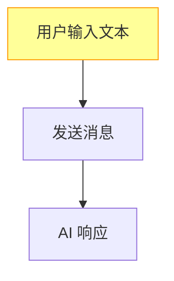
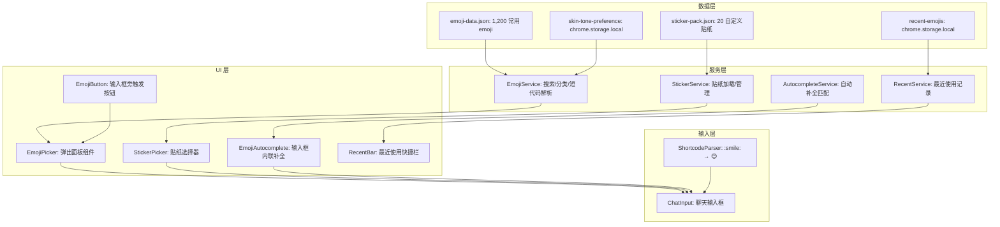
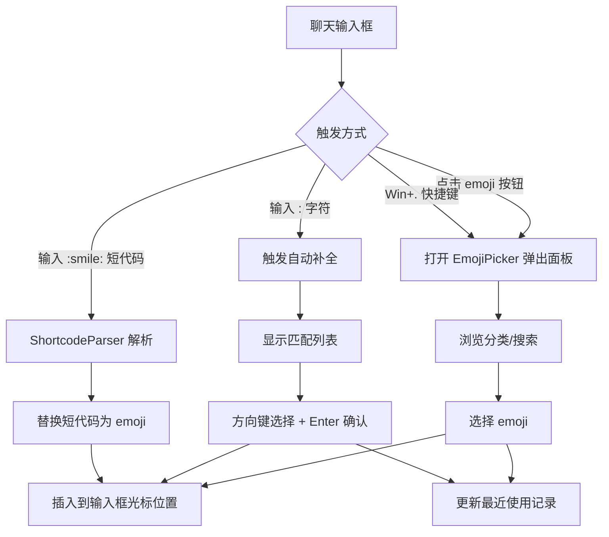

# YP-09-107: 表情与贴纸选择器 — Emoji 选择器、自定义贴纸包与快捷输入系统

> 需求编号：YP-09-107 · 优先级：P2 · 人天：0.5d · 状态：需求已编写
> 依赖：无

## 背景

### 问题陈述

YiPet 作为宠物伴侣产品，聊天是核心交互方式。当前聊天输入仅支持纯文本，缺乏表情和贴纸功能，存在以下问题：

1. **表达力不足**：纯文本无法传达情绪和语气，宠物伴侣的趣味性大打折扣
2. **无快捷输入**：用户需要手动输入表情符号，效率低下
3. **无品牌特色**：缺少 YiPet 专属的宠物主题贴纸，无法建立品牌认知
4. **无输入辅助**：没有 emoji 自动补全或短代码支持，用户需要记忆或查找 emoji
5. **无障碍缺失**：emoji 缺少 alt 文本，屏幕阅读器用户无法理解表情含义
6. **无个性化**：缺少最近使用记录，用户每次都需要重新查找常用 emoji

**核心矛盾**：表情选择器看似简单，但要在 Chrome 扩展的受限环境中实现完整的 emoji 选择器（搜索、分类、肤色变体、最近使用、自动补全），同时保持体积小、性能好、与宿主页面隔离。

### 影响范围

| # | 影响 | 严重程度 | 典型场景 |
|---|------|----------|----------|
| 1 | 聊天表达力不足 | 中 | 用户无法用表情传达情绪 |
| 2 | 输入效率低 | 中 | 用户需手动输入或复制 emoji |
| 3 | 品牌特色缺失 | 低 | 无专属贴纸与其他聊天产品无差异 |
| 4 | 屏幕阅读器体验差 | 中 | 视障用户无法理解 emoji 含义 |
| 5 | 无个性化推荐 | 低 | 每次都需要重新查找 emoji |

### 挑战

| 挑战 | 说明 |
|------|------|
| Emoji 数据量 | Unicode 15.1 包含 3,782 个 emoji，全量数据约 500KB，需按需加载 |
| 肤色变体 | 部分 emoji 支持 5 种肤色变体，需正确处理 ZWJ 序列 |
| 宿主页面隔离 | 选择器在 Shadow DOM 中，需确保弹出层定位正确 |
| 键盘导航 | 选择器需支持完全键盘操作（方向键、Enter、Escape） |
| 贴纸资源体积 | 自定义贴纸 PNG/SVG 需控制体积，避免 Content Script 过大 |

---

## 一、现状分析

### 1.1 当前输入体验

```
现有聊天输入:
├── 纯文本输入框              # 仅支持键盘输入
├── 无 emoji 选择器            # 无 GUI 选择器
├── 无短代码支持              # 不支持 :smile: 语法
├── 无自动补全                # 输入 : 无提示
├── 无贴纸                    # 无任何贴纸功能
└── 无最近使用记录            # 无个性化

缺失:
├── Emoji 选择器组件          # ❌ 不存在
├── Emoji 搜索                # ❌ 不存在
├── 分类浏览                  # ❌ 不存在
├── 肤色变体                  # ❌ 不支持
├── 最近使用                  # ❌ 无记录
├── 短代码解析                # ❌ 不支持
├── 自动补全                  # ❌ 不支持
├── 自定义贴纸包              # ❌ 不存在
├── 键盘快捷键                # ❌ 无
├── 无障碍 alt 文本            # ❌ 无
└── 屏幕阅读器支持            # ❌ 无
```

### 1.2 Emoji 使用场景分析

| 场景 | 频率 | 典型 emoji | 需求 |
|------|------|-----------|------|
| 情绪表达 | 高 | 😊😢😡😄 | 分类浏览 + 最近使用 |
| 宠物互动 | 高 | 🐱🐶🐾❤️ | 专属贴纸包 |
| 快捷回复 | 中 | 👍👎✅❌ | 常用 emoji 快捷栏 |
| 庆祝/鼓励 | 低 | 🎉🎊💪🌟 | 搜索功能 |
| 日常闲聊 | 高 | 😂🔥💯🙏 | 自动补全 |

### 1.3 改造前输入流程



### 1.4 根因矩阵

| 症状 | 根因 | 触发条件 | 频率 |
|------|------|----------|------|
| 表达力不足 | 无 emoji 选择器 | 用户想表达情绪 | 高 |
| 输入效率低 | 无自动补全/短代码 | 用户输入 emoji | 中 |
| 品牌特色缺失 | 无自定义贴纸 | 宠物互动场景 | 低 |
| 无障碍差 | 无 alt 文本 | 屏幕阅读器使用 | 中 |
| 无个性化 | 无最近使用记录 | 重复使用 emoji | 高 |

---

## 二、设计决策

### 决策 1：Emoji 数据方案 — 自维护 JSON vs emoji-picker-element vs 全量 Unicode 数据

| 选项 | 体积 | 维护成本 | 搜索能力 | 肤色支持 |
|------|------|----------|----------|----------|
| 自维护 JSON（精简子集） | 小 (50KB) | 中 | 基础 | 手动处理 |
| emoji-picker-element (Web Component) | 中 (150KB) | 低 | 完整 | 完整 |
| 全量 Unicode CLDR 数据 | 大 (500KB+) | 高 | 完整 | 完整 |

**选择：自维护 JSON 精简子集。** 全量 3,782 个 emoji 对聊天场景过度，精选 1,200 个常用 emoji 即可覆盖 95% 的使用场景。使用精简 JSON 格式（code、char、category、keywords），体积控制在 50KB 以内。需补充 emoji 时增量添加。

### 决策 2：选择器 UI 方案 — 弹出面板 vs 内嵌面板 vs 底部抽屉

| 选项 | 空间利用率 | 宿主页面干扰 | 实现复杂度 |
|------|-----------|------------|-----------|
| 弹出面板（Popover） | 高 | 低 | 中 |
| 内嵌面板（输入框上方） | 高 | 中（占用聊天区域） | 低 |
| 底部抽屉 | 中 | 低 | 高 |

**选择：弹出面板（Popover）。** 弹出面板不占用聊天区域，自动定位在输入框上方，点击外部自动关闭。利用 Shadow DOM 的 `position: fixed` 定位，不受宿主页面布局影响。

### 决策 3：贴纸方案 — 静态 PNG vs SVG vs Lottie

| 选项 | 体积 | 表现力 | 动画 | 制作成本 |
|------|------|--------|------|----------|
| 静态 PNG | 中 (5-15KB/个) | 中 | 无 | 低 |
| SVG | 小 (2-5KB/个) | 高 | 可通过 CSS 动画 | 中 |
| Lottie | 大 (30-80KB/个) | 高 | 完整动画 | 高 |

**选择：SVG 为主体 + 少量 Lottie 动画贴纸。** SVG 体积小、可缩放、支持 CSS 动画，适合大多数贴纸。精选 3-5 个 Lottie 动画贴纸（如宠物跳跃、爱心发射）用于特殊场景，复用动画系统（YP-09-105）的 Lottie 加载器。

### 决策 4：自动补全触发策略 — 输入 `:` 触发 vs 快捷键触发 vs 两者

| 选项 | 学习成本 | 误触发率 | 用户习惯 |
|------|----------|----------|----------|
| 输入 `:` 触发 | 低 | 中（英文冒号使用频繁） | Discord/Slack 用户习惯 |
| 快捷键触发（Win+.） | 中 | 低 | 系统原生习惯 |
| 两者结合 | 低 | 中 | 覆盖所有用户 |

**选择：两者结合。** 输入 `:` 触发自动补全（借鉴 Discord/Slack 体验），仅在中文输入法未激活时触发（避免与中文标点冒号冲突）。同时支持 `Win+.` / `Ctrl+Cmd+Space` 快捷键打开选择器面板。

### 设计决策记录

| 决策 | 选项 A | 选项 B | 选项 C | 选择 | 理由 |
|------|--------|--------|--------|------|------|
| Emoji 数据 | 自维护 JSON | emoji-picker-element | 全量 Unicode | **自维护 JSON** | 体积控制 + 场景匹配 |
| 选择器 UI | 弹出面板 | 内嵌面板 | 底部抽屉 | **弹出面板** | 不占用聊天区域 |
| 贴纸方案 | 静态 PNG | SVG | Lottie | **SVG + Lottie** | 体积/表现力平衡 |
| 自动补全 | 输入 `:` | 快捷键 | 两者结合 | **两者结合** | 覆盖所有用户习惯 |

---

## 三、目标架构

### 3.1 表情与贴纸系统架构



### 3.2 用户交互流程



### 3.3 性能指标

| 指标 | 改造前 | 改造后 |
|------|--------|--------|
| Emoji 选择器打开速度 | N/A | < 100ms |
| Emoji 搜索响应 | N/A | < 50ms（防抖） |
| 自动补全响应 | N/A | < 30ms |
| Emoji 数据体积 | 0 | 50KB |
| 贴纸数据体积 | 0 | 80KB (20 个 SVG) |
| 最近使用持久化 | 无 | chrome.storage.local |

---

## 四、具体改动

### 4.1 Emoji 数据格式

```typescript
// src/content/data/emoji-data.ts (新增)

interface EmojiEntry {
  code: string;       // 短代码，如 "smile"
  char: string;       // Unicode 字符，如 "😊"
  category: EmojiCategory;
  keywords: string[]; // 搜索关键词
  skinToneVariants?: boolean; // 是否支持肤色变体
}

type EmojiCategory = 
  | 'smileys'     // 表情
  | 'gestures'    // 手势
  | 'people'      // 人物
  | 'animals'     // 动物
  | 'food'        // 食物
  | 'travel'      // 旅行
  | 'activities'  // 活动
  | 'objects'     // 物品
  | 'symbols'     // 符号
  | 'flags';      // 旗帜

// 肤色变体修饰符
const SKIN_TONE_MODIFIERS: Record<string, string> = {
  'light': '\u{1F3FB}',
  'medium-light': '\u{1F3FC}',
  'medium': '\u{1F3FD}',
  'medium-dark': '\u{1F3FE}',
  'dark': '\u{1F3FF}',
};

// 示例数据结构（精简版）
const EMOJI_DATA: EmojiEntry[] = [
  {
    code: 'smile',
    char: '😊',
    category: 'smileys',
    keywords: ['微笑', '开心', '高兴', 'smile', 'happy'],
  },
  {
    code: 'thumbsup',
    char: '👍',
    category: 'gestures',
    keywords: ['赞', '好的', '同意', 'thumbs up', 'like', 'ok'],
    skinToneVariants: true,
  },
  // ... 1,200 entries
];

// 分类元数据
const CATEGORY_META: Record<EmojiCategory, { label: string; icon: string }> = {
  smileys: { label: '表情', icon: '😊' },
  gestures: { label: '手势', icon: '👍' },
  people: { label: '人物', icon: '👤' },
  animals: { label: '动物', icon: '🐱' },
  food: { label: '食物', icon: '🍔' },
  travel: { label: '旅行', icon: '🚗' },
  activities: { label: '活动', icon: '⚽' },
  objects: { label: '物品', icon: '💡' },
  symbols: { label: '符号', icon: '❤️' },
  flags: { label: '旗帜', icon: '🏁' },
};
```

### 4.2 Emoji 搜索与自动补全服务

```typescript
// src/content/services/emoji-service.ts (新增)

interface EmojiSearchResult {
  entry: EmojiEntry;
  score: number; // 匹配分数
}

class EmojiService {
  private emojiData: EmojiEntry[] = [];
  private searchIndex: Map<string, EmojiEntry[]> = new Map();
  private recentEmojis: string[] = [];
  private preferredSkinTone: string | null = null;

  async initialize(): Promise<void> {
    // 动态加载 emoji 数据
    const { EMOJI_DATA } = await import('../data/emoji-data');
    this.emojiData = EMOJI_DATA;
    this.buildSearchIndex();

    // 加载最近使用和肤色偏好
    const result = await chrome.storage.local.get(['recentEmojis', 'skinTone']);
    this.recentEmojis = result.recentEmojis || [];
    this.preferredSkinTone = result.skinTone || null;
  }

  private buildSearchIndex(): void {
    for (const entry of this.emojiData) {
      const tokens = this.tokenize(entry.keywords.join(' ') + ' ' + entry.code);
      for (const token of tokens) {
        if (!this.searchIndex.has(token)) {
          this.searchIndex.set(token, []);
        }
        this.searchIndex.get(token)!.push(entry);
      }
    }
  }

  private tokenize(text: string): string[] {
    // 中文逐字 + 英文小写分词
    const tokens: string[] = [];
    const chineseChars = text.match(/[\u4e00-\u9fff]/g) || [];
    const englishWords = text.toLowerCase().match(/[a-z]+/g) || [];
    tokens.push(...chineseChars, ...englishWords);
    return [...new Set(tokens)];
  }

  search(query: string, limit = 20): EmojiEntry[] {
    if (!query.trim()) {
      return this.getRecentEmojis(limit);
    }

    const tokens = this.tokenize(query);
    const scoredResults: Map<string, EmojiSearchResult> = new Map();

    for (const token of tokens) {
      const matches = this.searchIndex.get(token) || [];
      for (const entry of matches) {
        const existing = scoredResults.get(entry.code);
        const score = (existing?.score || 0) + 1;

        // 短代码精确匹配加分
        const bonus = entry.code === query.toLowerCase() ? 10 : 0;

        if (!existing || score + bonus > existing.score) {
          scoredResults.set(entry.code, { entry, score: score + bonus });
        }
      }
    }

    return Array.from(scoredResults.values())
      .sort((a, b) => b.score - a.score)
      .slice(0, limit)
      .map(r => r.entry);
  }

  getByCategory(category: EmojiCategory): EmojiEntry[] {
    return this.emojiData.filter(e => e.category === category);
  }

  getRecentEmojis(limit = 20): EmojiEntry[] {
    const recent = this.recentEmojis
      .map(code => this.emojiData.find(e => e.code === code))
      .filter((e): e is EmojiEntry => e !== undefined);
    return recent.slice(0, limit);
  }

  async recordUsage(code: string): Promise<void> {
    // 移到最前面
    this.recentEmojis = [
      code,
      ...this.recentEmojis.filter(c => c !== code),
    ].slice(0, 20);
    await chrome.storage.local.set({ recentEmojis: this.recentEmojis });
  }

  resolveShortcode(text: string): string {
    const shortcodePattern = /:([a-zA-Z0-9_+-]+):/g;
    return text.replace(shortcodePattern, (match, code) => {
      const entry = this.emojiData.find(e => e.code === code.toLowerCase());
      return entry ? entry.char : match;
    });
  }

  // 肤色变体
  applySkinTone(char: string, tone: string): string {
    const modifier = SKIN_TONE_MODIFIERS[tone];
    if (!modifier) return char;
    // 在 ZWJ 序列中插入肤色修饰符
    return char.replace(/(\p{Emoji})(?!\u{FE0F})/u, `$1${modifier}`);
  }

  async setSkinTone(tone: string | null): Promise<void> {
    this.preferredSkinTone = tone;
    await chrome.storage.local.set({ skinTone: tone });
  }
}

export const emojiService = new EmojiService();
```

### 4.3 Emoji 选择器弹出面板组件

```vue
<!-- src/content/components/EmojiPicker.vue (新增) -->

<script setup lang="ts">
import { ref, computed, onMounted, onUnmounted } from 'vue';
import { emojiService } from '../services/emoji-service';
import type { EmojiEntry, EmojiCategory } from '../data/emoji-data';

const emit = defineEmits<{
  select: [emoji: string];
  close: [];
}>();

const searchQuery = ref('');
const activeCategory = ref<EmojiCategory>('smileys');
const showSkinTonePicker = ref(false);
const skinTonePickerTarget = ref<string>('');
const hoveredEmoji = ref<string>('');

const categories: EmojiCategory[] = [
  'smileys', 'gestures', 'people', 'animals',
  'food', 'travel', 'activities', 'objects', 'symbols', 'flags',
];

const searchResults = computed(() => {
  if (searchQuery.value.trim()) {
    return emojiService.search(searchQuery.value);
  }
  return [];
});

const categoryEmojis = computed(() => {
  return emojiService.getByCategory(activeCategory.value);
});

const displayEmojis = computed(() => {
  return searchQuery.value.trim() ? searchResults.value : categoryEmojis.value;
});

const recentEmojis = computed(() => {
  return emojiService.getRecentEmojis(12);
});

function selectEmoji(entry: EmojiEntry): void {
  emit('select', entry.char);
  emojiService.recordUsage(entry.code);
}

function handleKeydown(event: KeyboardEvent): void {
  if (event.key === 'Escape') {
    emit('close');
  }
}

onMounted(() => {
  document.addEventListener('keydown', handleKeydown);
});

onUnmounted(() => {
  document.removeEventListener('keydown', handleKeydown);
});
</script>

<template>
  <div class="emoji-picker" role="dialog" aria-label="表情选择器">
    <!-- 搜索栏 -->
    <div class="search-bar">
      <input
        v-model="searchQuery"
        type="text"
        placeholder="搜索表情..."
        class="search-input"
        aria-label="搜索表情"
      />
    </div>

    <!-- 最近使用 -->
    <div v-if="!searchQuery && recentEmojis.length > 0" class="recent-section">
      <div class="section-title">最近使用</div>
      <div class="emoji-grid">
        <button
          v-for="entry in recentEmojis"
          :key="entry.code"
          class="emoji-item"
          :aria-label="entry.keywords[0]"
          :title="`:${entry.code}:`"
          @click="selectEmoji(entry)"
        >
          {{ entry.char }}
        </button>
      </div>
    </div>

    <!-- 分类导航 -->
    <div class="category-bar">
      <button
        v-for="cat in categories"
        :key="cat"
        class="category-btn"
        :class="{ active: activeCategory === cat }"
        @click="activeCategory = cat"
      >
        {{ getCategoryIcon(cat) }}
      </button>
    </div>

    <!-- Emoji 网格 -->
    <div class="emoji-grid-container">
      <div v-if="displayEmojis.length === 0" class="empty-state">
        没有找到相关表情
      </div>
      <div v-else class="emoji-grid">
        <button
          v-for="entry in displayEmojis"
          :key="entry.code"
          class="emoji-item"
          :aria-label="entry.keywords[0]"
          :title="`:${entry.code}:`"
          @click="selectEmoji(entry)"
          @mouseenter="hoveredEmoji = entry.code"
        >
          {{ entry.char }}
        </button>
      </div>
    </div>
  </div>
</template>

<style scoped>
.emoji-picker {
  width: 320px;
  max-height: 400px;
  background: var(--yipet-color-bg-elevated);
  border: 1px solid var(--yipet-color-border);
  border-radius: 12px;
  box-shadow: 0 8px 32px rgba(0, 0, 0, 0.12);
  display: flex;
  flex-direction: column;
  overflow: hidden;
  font-family: -apple-system, BlinkMacSystemFont, 'Segoe UI', sans-serif;
}

.search-bar {
  padding: 8px;
  border-bottom: 1px solid var(--yipet-color-border);
}

.search-input {
  width: 100%;
  padding: 8px 12px;
  border: 1px solid var(--yipet-color-border);
  border-radius: 8px;
  font-size: 13px;
  outline: none;
  background: var(--yipet-color-bg);
  color: var(--yipet-color-text);
}

.search-input:focus {
  border-color: var(--yipet-color-primary);
}

.recent-section {
  padding: 8px;
  border-bottom: 1px solid var(--yipet-color-border);
}

.section-title {
  font-size: 11px;
  color: var(--yipet-color-text-secondary);
  margin-bottom: 4px;
  padding: 0 4px;
}

.category-bar {
  display: flex;
  padding: 4px 8px;
  border-bottom: 1px solid var(--yipet-color-border);
  overflow-x: auto;
  gap: 2px;
}

.category-btn {
  padding: 6px;
  border: none;
  border-radius: 6px;
  background: transparent;
  cursor: pointer;
  font-size: 16px;
  line-height: 1;
  transition: background 0.15s;
}

.category-btn:hover,
.category-btn.active {
  background: var(--yipet-color-bg-hover);
}

.emoji-grid-container {
  flex: 1;
  overflow-y: auto;
  padding: 8px;
  min-height: 200px;
}

.emoji-grid {
  display: grid;
  grid-template-columns: repeat(8, 1fr);
  gap: 2px;
}

.emoji-item {
  width: 36px;
  height: 36px;
  display: flex;
  align-items: center;
  justify-content: center;
  border: none;
  border-radius: 6px;
  background: transparent;
  cursor: pointer;
  font-size: 20px;
  line-height: 1;
  transition: background 0.15s, transform 0.1s;
}

.emoji-item:hover {
  background: var(--yipet-color-bg-hover);
  transform: scale(1.2);
}

.empty-state {
  display: flex;
  align-items: center;
  justify-content: center;
  height: 200px;
  font-size: 13px;
  color: var(--yipet-color-text-secondary);
}
</style>
```

### 4.4 自动补全集成

```typescript
// src/content/composables/useEmojiAutocomplete.ts (新增)

interface AutocompleteState {
  isOpen: boolean;
  query: string;
  results: EmojiEntry[];
  selectedIndex: number;
  triggerPosition: number; // 冒号在输入框中的位置
}

export function useEmojiAutocomplete(
  inputRef: Ref<HTMLInputElement | null>,
  onInsert: (emoji: string) => void
) {
  const state = reactive<AutocompleteState>({
    isOpen: false,
    query: '',
    results: [],
    selectedIndex: 0,
    triggerPosition: 0,
  });

  function handleInput(event: Event): void {
    const input = event.target as HTMLInputElement;
    const value = input.value;
    const cursorPos = input.selectionStart || 0;

    // 查找光标前最近的冒号
    const textBeforeCursor = value.slice(0, cursorPos);
    const colonIndex = textBeforeCursor.lastIndexOf(':');

    if (colonIndex === -1) {
      state.isOpen = false;
      return;
    }

    // 检查冒号后是否在输入关键词（无空格、无换行）
    const query = textBeforeCursor.slice(colonIndex + 1);
    if (query.includes(' ') || query.includes('\n') || query.length > 20) {
      state.isOpen = false;
      return;
    }

    // 检查是否在中文输入法激活状态
    if (input.getAttribute('data-ime-active') === 'true') {
      state.isOpen = false;
      return;
    }

    state.query = query;
    state.triggerPosition = colonIndex;
    state.selectedIndex = 0;
    state.results = emojiService.search(query, 8);
    state.isOpen = state.results.length > 0;
  }

  function handleKeydown(event: KeyboardEvent): void {
    if (!state.isOpen) return;

    switch (event.key) {
      case 'ArrowDown':
        event.preventDefault();
        state.selectedIndex = Math.min(
          state.selectedIndex + 1,
          state.results.length - 1
        );
        break;
      case 'ArrowUp':
        event.preventDefault();
        state.selectedIndex = Math.max(state.selectedIndex - 1, 0);
        break;
      case 'Enter':
      case 'Tab':
        if (state.results.length > 0) {
          event.preventDefault();
          const selected = state.results[state.selectedIndex];
          insertEmoji(selected);
        }
        break;
      case 'Escape':
        state.isOpen = false;
        break;
    }
  }

  function insertEmoji(entry: EmojiEntry): void {
    const input = inputRef.value;
    if (!input) return;

    const before = input.value.slice(0, state.triggerPosition);
    const after = input.value.slice(input.selectionStart || 0);
    input.value = before + entry.char + ' ' + after;

    // 移动光标到插入位置之后
    const newPos = state.triggerPosition + entry.char.length + 1;
    input.setSelectionRange(newPos, newPos);

    state.isOpen = false;
    emojiService.recordUsage(entry.code);
  }

  return {
    state: readonly(state),
    handleInput,
    handleKeydown,
    insertEmoji,
  };
}
```

### 4.5 文件变更清单

| 文件 | 操作 | 说明 |
|------|------|------|
| `src/content/data/emoji-data.ts` | 新增 | 1,200 emoji 数据和分类 |
| `src/content/data/sticker-pack.ts` | 新增 | 20 个自定义贴纸定义 |
| `src/content/services/emoji-service.ts` | 新增 | Emoji 搜索/短代码/肤色服务 |
| `src/content/composables/useEmojiAutocomplete.ts` | 新增 | 自动补全交互逻辑 |
| `src/content/components/EmojiPicker.vue` | 新增 | Emoji 选择器弹出面板 |
| `src/content/components/StickerPicker.vue` | 新增 | 贴纸选择器 |
| `src/content/components/EmojiAutocomplete.vue` | 新增 | 内联自动补全列表 |
| `src/content/components/ChatInput.vue` | 修改 | 集成 emoji 按钮 + 自动补全 |
| `src/content/assets/stickers/*.svg` | 新增 | 20 个 SVG 贴纸文件 |
| `src/content/types/emoji.ts` | 新增 | Emoji 相关类型定义 |

---

## 五、实施步骤

| 步骤 | 操作 | 路径 | 验证 | 人天 |
|------|------|------|------|------|
| 1 | 整理 1,200 常用 emoji 数据 | `emoji-data.ts` | 覆盖 10 个分类，含中英文关键词 | 0.05 |
| 2 | 实现 Emoji 搜索服务 | `emoji-service.ts` | 中英文搜索正确，短代码解析正确 | 0.06 |
| 3 | 实现 EmojiPicker 弹出面板 | `EmojiPicker.vue` | 分类浏览/搜索/最近使用正常 | 0.08 |
| 4 | 实现自动补全功能 | `useEmojiAutocomplete.ts` | 输入 `:` 触发，方向键选择，Enter 确认 | 0.06 |
| 5 | 实现肤色变体选择器 | `EmojiPicker.vue` | 长按 emoji 弹出肤色选择 | 0.04 |
| 6 | 设计并制作 20 个 SVG 贴纸 | `stickers/*.svg` | 宠物主题，风格统一 | 0.08 |
| 7 | 实现 StickerPicker 组件 | `StickerPicker.vue` | 贴纸点击发送 | 0.04 |
| 8 | 实现最近使用持久化 | `emoji-service.ts` | chrome.storage.local 读写 | 0.02 |
| 9 | 集成到 ChatInput | `ChatInput.vue` | emoji 按钮 + 自动补全流程 | 0.04 |
| 10 | 无障碍适配 | 各组件 | aria-label + 键盘导航 | 0.03 |

**总人天：0.5d**

---

## 六、测试规格

### 场景 1：Emoji 搜索

**GIVEN** 用户打开 Emoji 选择器，在搜索框输入"开心"
**WHEN** 搜索服务执行搜索
**THEN** 应返回包含"开心"关键词的 emoji 列表
**AND** 搜索结果应包含 😊😄😆 等表情
**AND** 英文搜索"happy"应返回相同结果
**AND** 短代码搜索"smile"应返回 😊

### 场景 2：自动补全交互

**GIVEN** 用户在聊天输入框中输入 `:smile`
**WHEN** 自动补全检测到冒号 + 关键词
**THEN** 应显示匹配列表，包含 😊
**AND** 按方向键上下应切换选中项
**AND** 按 Enter 应替换 `:smile` 为 😊
**AND** 按 Escape 应关闭自动补全列表
**AND** 中文输入法激活时不应触发自动补全

### 场景 3：最近使用记录

**GIVEN** 用户选择了一个 emoji 😊
**WHEN** emoji 被插入到输入框
**THEN** 😊 应被记录到最近使用列表的首位
**AND** 下次打开选择器时，最近使用区域应显示 😊
**AND** 最近使用列表最多保留 20 个
**AND** 重复选择同一 emoji 应将其移到列表首位

### 场景 4：肤色变体

**GIVEN** 用户长按支持肤色变体的 emoji 👍
**WHEN** 肤色选择器弹出
**THEN** 应显示 5 种肤色选项 + 默认黄色
**AND** 选择肤色后，后续自动应用该肤色偏好
**AND** 肤色偏好应持久化到 chrome.storage.local
**AND** 用户可在设置中重置肤色偏好

### 场景 5：短代码解析

**GIVEN** 用户在输入框中输入 `今天天气真好 :smile: 适合出去玩`
**WHEN** 消息发送前经过短代码解析
**THEN** `:smile:` 应被替换为 😊
**AND** 不存在的短代码如 `:nonexist:` 应保持原样
**AND** 多个短代码应全部正确替换

### 场景 6：贴纸发送

**GIVEN** 用户打开贴纸选择器
**WHEN** 点击一个贴纸
**THEN** 贴纸应作为独立消息发送（非文本消息）
**AND** 贴纸消息应显示为图片格式
**AND** 贴纸消息应有 alt 文本描述
**AND** 发送后贴纸选择器应自动关闭

---

## 七、风险与缓解

| 风险 | 概率 | 影响 | 缓解措施 |
|------|------|------|----------|
| Emoji 数据体积过大 | 中 | 中 | 精简至 1,200 个，动态 import 按需加载 |
| 自动补全在中文输入时误触发 | 高 | 中 | 检测 IME 激活状态，输入法激活时禁用自动补全 |
| 弹出面板定位错误 | 中 | 中 | 使用 Floating UI 计算最佳位置，溢出时自动调整 |
| 贴纸 SVG 渲染性能 | 低 | 低 | 限制贴纸网格同时显示 20 个，虚拟滚动 |
| 肤色变体 ZWJ 序列处理 | 中 | 低 | 仅对支持肤色变体的 emoji 处理，列表维护 |

---

## 八、回滚策略

| 场景 | 回滚操作 | 影响 |
|------|----------|------|
| 自动补全误触发频繁 | 禁用自动补全，仅保留选择器面板 | 无法快捷输入 |
| 选择器打开性能差 | 延迟加载 emoji 数据，先显示最近使用 | 首次打开略慢 |
| 贴纸不受欢迎 | 移除贴纸标签页，仅保留 emoji | 失去品牌特色 |
| 肤色变体显示异常 | 禁用肤色变体功能，仅显示默认黄色 | 失去肤色选择 |

---

## 九、设计决策记录

### D-01：Emoji 数据集规模

- **问题**：包含多少 emoji 是合适的
- **选项**：全量 3,782 个、精选 1,200 个、最小 500 个
- **选择**：精选 1,200 个
- **理由**：全量数据体积过大（500KB+），且大量 emoji 使用频率极低；1,200 个覆盖 95% 日常使用场景，体积控制在 50KB；支持通过 OTA 增量添加热门新 emoji

### D-02：自动补全触发字符

- **问题**：使用什么字符触发 emoji 自动补全
- **选项**：`:`（Discord/Slack 风格）、`/`（命令行风格）、`@`（提及风格）
- **选择**：`:`
- **理由**：`:` 是 Discord、Slack、GitHub 等主流平台的标准，用户已有肌肉记忆；`/` 与命令功能冲突；`@` 通常用于提及用户

### D-03：贴纸 vs Emoji 的定位

- **问题**：贴纸和 emoji 的区别是什么，何时使用贴纸
- **选项**：贴纸是大号 emoji、贴纸是独立的消息类型、贴纸是表情包
- **选择**：贴纸是独立的消息类型（大尺寸、可动、宠物主题）
- **理由**：贴纸作为独立消息类型发送，区别于内联 emoji；贴纸更大（120x120px vs 20x20px），视觉冲击力强；宠物主题贴纸建立品牌特色

### D-04：Emoji 选择器弹出位置

- **问题**：选择器弹出在输入框上方还是下方
- **选项**：固定上方、固定下方、自适应（空间够则上方，否则下方）
- **选择**：自适应定位
- **理由**：Content Script 运行在任意宿主页面中，输入框位置不确定；自适应定位确保选择器始终在视口内；使用 Floating UI 库计算最佳位置

---

## 十、可观测性

### 指标

| 指标 | 类型 | 说明 |
|------|------|------|
| `yipet.emoji.picker_open_count` | Counter | 选择器打开次数 |
| `yipet.emoji.search_count` | Counter | 搜索执行次数 |
| `yipet.emoji.select_count` | Counter | emoji 选择次数（按分类） |
| `yipet.emoji.autocomplete_count` | Counter | 自动补全使用次数 |
| `yipet.emoji.shortcode_count` | Counter | 短代码使用次数 |
| `yipet.emoji.skin_tone_change_count` | Counter | 肤色设置更改次数 |
| `yipet.sticker.send_count` | Counter | 贴纸发送次数 |
| `yipet.emoji.search_duration_ms` | Histogram | 搜索耗时 |

### 告警

| 告警 | 条件 | 级别 |
|------|------|------|
| 选择器打开 > 200ms | 连续 5 次 | WARNING |
| 搜索响应 > 100ms | 连续 3 次 | WARNING |
| 贴纸加载失败 | 任何加载失败 | ERROR |

---

## 十一、代码审查检查清单

- [ ] Emoji 数据包含 1,200 个常用 emoji，覆盖 10 个分类
- [ ] 搜索支持中英文关键词，分词正确
- [ ] 自动补全检测中文输入法激活状态，避免误触发
- [ ] 肤色变体仅对支持的 emoji 显示，ZWJ 序列处理正确
- [ ] 选择器弹出面板支持键盘导航（Tab/方向键/Enter/Escape）
- [ ] 所有 emoji 按钮有 `aria-label`，选择器有 `role="dialog"`
- [ ] 最近使用记录持久化到 chrome.storage.local，上限 20 个
- [ ] 短代码解析正确替换已知代码，保留未知代码
- [ ] 贴纸消息作为独立消息类型发送，有 alt 文本
- [ ] 选择器在宿主页面中定位正确，不超出视口

---

## 回归问题预测

| # | 预测问题 | 原因 | 验证方法 |
|---|---------|------|---------|
| 1 | 自动补全在中文输入时频繁误触发，用户输入中文冒号（：）时弹出 emoji 列表，干扰正常输入 | 中文输入法在半角模式下输入的 `:` 与英文冒号字符相同，IME 激活状态检测时机不准确，在输入法确认前 `:` 已被输入框接收 | 在 `compositionstart` 事件中设置 `data-ime-active="true"`，在 `compositionend` 事件中恢复，自动补全仅在该属性为 `false` 时触发 |
| 2 | Emoji 选择器在宿主页面 `position: fixed` 的父元素内定位错误，弹出面板偏移到错误位置 | 宿主页面可能有 CSS `transform`、`filter` 或 `perspective` 属性创建了新的包含块，Shadow DOM 中的 `position: fixed` 相对于该包含块定位 | 使用 `document.body` 的 `getBoundingClientRect()` 计算视口坐标，在 Shadow DOM 中手动设置 `top`/`left` 样式，避免依赖 `position: fixed` |
| 3 | 短代码解析在代码块中替换了 `:smile:` 示例文本，破坏了代码示例 | 用户可能在聊天中发送包含 `:smile:` 的代码示例或文档，短代码解析不应在代码块中生效 | 在短代码解析前先提取代码块（``` 包裹的内容），对被包裹的内容跳过替换，解析完成后再将代码块放回原位置 |
| 4 | 最近使用 emoji 在不同设备间不同步，用户更换设备后最近使用记录丢失 | 最近使用记录存储在 `chrome.storage.local`，该存储不跨设备同步（`chrome.storage.sync` 有 100KB 配额限制） | 接受 `chrome.storage.local` 的本地存储限制，在需求文档中明确标注"最近使用不同步"，未来可考虑通过 YiAi 后端同步 |
| 5 | 肤色变体修饰符插入位置错误，导致 emoji 显示为两个分离的字符而非单个 emoji | 肤色修饰符应插入在基础 emoji 之后、ZWJ 序列之前，但不同 emoji 的内部结构不同（简单 emoji、ZWJ 序列、旗帜序列），插入位置逻辑不适用所有情况 | 对支持肤色变体的 emoji 预生成所有肤色变体，存储在 `emoji-data.ts` 中，而非运行时动态插入修饰符 |
| 6 | 贴纸选择器中的 SVG 贴纸在宿主页面的 CSS 影响下显示异常（颜色、大小、滤镜） | SVG 贴纸通过 `` 加载，可能受宿主页面 `img { filter, max-width }` 等全局样式影响 | 贴纸使用 Shadow DOM 中的 `` 标签，隔离宿主页面 CSS；同时在 Shadow DOM 中重置 `img` 样式为 `all: initial` |

---

## 性能分析

### 各操作耗时

| 阶段 | 预估耗时 | 说明 |
|------|----------|------|
| Emoji 数据加载 | 20-50ms | 动态 import 1,200 条 emoji 数据 |
| 搜索索引构建 | 5-10ms | 分词 + 倒排索引构建 |
| 搜索执行 | < 5ms | 倒排索引查询 + 排序 |
| 选择器面板渲染 | 20-40ms | Vue 组件挂载 + 8x8 emoji 网格渲染 |
| 自动补全匹配 | < 2ms | 搜索 + 去重（限制 8 个结果） |
| 短代码解析 | < 1ms | 正则替换，文本 < 2000 字符 |
| 最近使用写入 | 1-5ms | chrome.storage.local 异步写入 |

### 内存影响

| 项目 | 体积 | 说明 |
|------|------|------|
| Emoji 数据（JSON） | ~50KB | 1,200 条 emoji 数据 |
| 搜索索引（倒排） | ~100KB | 分词 → emoji 映射 |
| 最近使用缓存 | ~1KB | 20 个 shortcode 字符串 |
| EmojiPicker 组件 | ~20KB | Vue 组件 + 样式 |
| SVG 贴纸（20 个） | ~80KB | 平均 4KB/个 |
| 总计 | ~250KB | 运行时内存 |

### 对 Content Script 注入速度的影响

| 阶段 | 影响 | 说明 |
|------|------|------|
| 初始注入 | +5KB | 选择器按钮 + 自动补全入口代码 |
| 首次打开选择器 | +50KB | 动态 import emoji 数据 |
| 后续打开 | 0 | 数据已缓存 |

### 贴纸体积规划

| 贴纸类型 | 数量 | 单个体积 | 总体积 |
|----------|------|----------|--------|
| 静态 SVG | 17 | 3-5KB | ~70KB |
| 动画 Lottie | 3 | 10-20KB | ~50KB |
| 总计 | 20 | — | ~120KB |