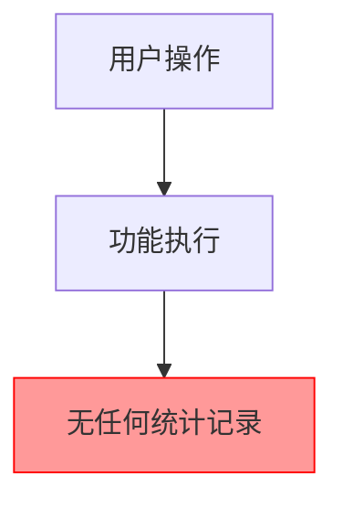
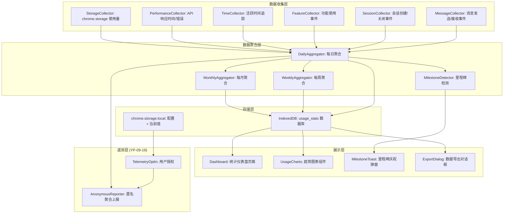
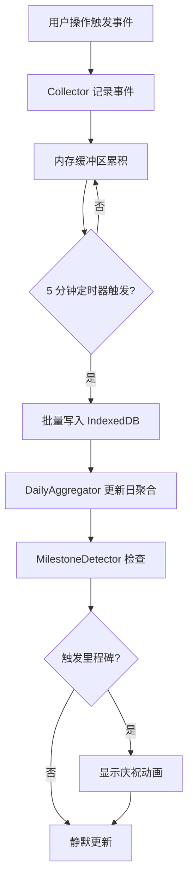

# YP-09-108: 使用统计与分析仪表盘 — 本地隐私优先的使用统计、趋势图表与里程碑庆祝

> 需求编号：YP-09-108 · 优先级：P2 · 人天：0.5d · 状态：需求已编写
> 依赖：YP-09-19（匿名遥测）

## 背景

### 问题陈述

YiPet 当前缺乏使用统计功能，用户无法了解自己的使用情况，产品团队也无法获取产品使用数据以指导迭代方向。存在以下问题：

1. **用户无感知**：用户不知道与宠物互动了多少次、聊了多久、用了哪些功能
2. **缺乏成就感**：没有使用里程碑或成就系统，用户缺少持续使用的动力
3. **产品迭代无数据支撑**：产品团队不知道哪些功能被使用、哪些被忽略
4. **性能问题不可见**：用户无法了解扩展对浏览器的性能影响历史
5. **存储增长不可控**：用户不知道聊天记录和缓存占用了多少空间
6. **数据无法导出**：用户无法导出自己的使用数据做进一步分析

**核心矛盾**：统计功能需要收集使用数据，但 YiPet 的核心承诺是隐私优先。所有统计必须在本地计算，不向任何外部服务发送原始使用数据。可选的匿名遥测（YP-09-19）仅发送聚合统计数据，用户可随时关闭。

### 影响范围

| # | 影响 | 严重程度 | 典型场景 |
|---|------|----------|----------|
| 1 | 用户不了解使用情况 | 低 | 无法回答"这个月聊了多少次" |
| 2 | 缺乏持续使用动力 | 中 | 用户使用一段时间后流失 |
| 3 | 产品迭代无数据支撑 | 中 | 不知道哪个功能该优化 |
| 4 | 性能问题不可见 | 低 | 用户不知道扩展是否变慢 |
| 5 | 存储空间不可控 | 低 | 聊天记录占用过多空间 |

### 挑战

| 挑战 | 说明 |
|------|------|
| 隐私约束 | 所有统计必须在本地计算，不能上传原始数据 |
| 数据持久化 | chrome.storage.local 有 10MB 限制，统计数据需精简 |
| 跨设备 | chrome.storage.local 不同步，统计仅限当前设备 |
| 图表渲染 | 在 Content Script 的 Shadow DOM 中渲染图表 |
| 性能影响 | 统计数据收集不能影响扩展正常运行性能 |

---

## 一、现状分析

### 1.1 当前数据收集现状

```
现有数据记录:
├── chrome.storage.local
│   ├── sessions: 聊天会话数据
│   ├── settings: 用户设置
│   └── 无任何统计指标

缺失:
├── 使用统计收集器          # ❌ 不存在
├── 统计存储结构            # ❌ 不存在
├── 仪表盘 UI               # ❌ 不存在
├── 趋势图表                # ❌ 不存在
├── 里程碑系统              # ❌ 不存在
├── 数据导出                # ❌ 不支持
├── 匿名遥测（YP-09-19）    # ❌ 未集成
└── 性能指标收集            # ❌ 不存在
```

### 1.2 需要收集的指标

| 指标类别 | 具体指标 | 收集方式 | 敏感度 |
|----------|----------|----------|--------|
| 消息统计 | 发送消息数、接收消息数、消息长度 | 事件监听 | 低 |
| 会话统计 | 创建会话数、活跃会话数、会话时长 | 生命周期钩子 | 低 |
| 功能使用 | 各功能使用次数、使用频率 | 操作事件 | 低 |
| 时间统计 | 每日使用时长、活跃天数 | 定时器 | 低 |
| 性能指标 | 平均响应时间、错误率 | API 拦截 | 低 |
| 存储统计 | 存储使用量、增长趋势 | chrome.storage API | 低 |

### 1.3 改造前数据流



### 1.4 根因矩阵

| 症状 | 根因 | 触发条件 | 频率 |
|------|------|----------|------|
| 使用者无感知 | 无使用统计收集 | 任何使用场景 | 高 |
| 缺乏成就感 | 无里程碑系统 | 长期使用 | 中 |
| 产品迭代无数据 | 无使用数据收集 | 产品决策 | 高 |
| 存储不可控 | 无存储监控 | 长期使用 | 中 |
| 性能不可见 | 无性能指标收集 | 性能变化 | 低 |

---

## 二、设计决策

### 决策 1：统计存储方案 — chrome.storage.local vs IndexedDB vs 内存 + 定期持久化

| 选项 | 容量 | 读写性能 | 查询能力 | 跨 Session 持久化 |
|------|------|----------|----------|------------------|
| chrome.storage.local | 10MB | 异步，中等 | 仅 key-value | 是 |
| IndexedDB | 无限制 | 异步，良好 | 完整查询 | 是 |
| 内存 + 定期持久化 | 取决于内存 | 同步，最快 | 无 | 需手动持久化 |

**选择：IndexedDB 为主 + chrome.storage.local 为配置存储。** 统计数据的时序特性（每日/每周/每月聚合）需要结构化查询，IndexedDB 支持索引和范围查询。chrome.storage.local 仅用于存储统计配置（如遥测开关）。统计数据在内存中维护当日增量，每 5 分钟批量写入 IndexedDB。

### 决策 2：图表渲染方案 — Canvas vs SVG vs 轻量 Chart 库

| 选项 | 体积 | 性能 | 交互性 | 可访问性 |
|------|------|------|--------|----------|
| 纯 Canvas 自绘 | 极小 | 最优 | 需手动实现 | 差 |
| 纯 SVG 自绘 | 极小 | 良好 | 需手动实现 | 好 |
| Chart.js (tree-shaken) | 60KB | 良好 | 完整 | 中 |
| uPlot | 30KB | 最优 | 基础 | 中 |

**选择：uPlot（30KB）。** uPlot 是专为性能和体积优化的图表库，30KB gzip 后约 10KB，支持时间序列图表（使用场景的核心需求）。比 Chart.js 小 50%，比 ECharts 小 90%。对于简单统计（饼图、柱状图）使用纯 SVG 自绘，避免引入额外依赖。

### 决策 3：里程碑系统 — 固定里程碑 vs 动态里程碑 vs 无里程碑

| 选项 | 用户激励 | 实现复杂度 | 个性化 |
|------|----------|-----------|--------|
| 固定里程碑（100条/1000条/10000条） | 中 | 低 | 无 |
| 动态里程碑（基于用户行为） | 高 | 高 | 有 |
| 无里程碑 | 无 | 零 | 无 |

**选择：固定里程碑 + 少量动态里程碑。** 固定里程碑（消息数、天数、会话数）提供基础成就感。动态里程碑（连续使用 7 天、使用 5 个不同功能）增加趣味性。里程碑触发时弹出宠物庆祝动画。

### 决策 4：数据导出格式 — JSON vs CSV vs 两者

| 选项 | 可读性 | 可处理性 | 体积 |
|------|--------|----------|------|
| JSON | 中 | 优秀（程序处理） | 中 |
| CSV | 高（Excel 打开） | 良好 | 小 |
| 两者 | 最好 | 最好 | 两份 |

**选择：两者都支持。** JSON 用于程序化处理和备份恢复；CSV 用于用户在 Excel/Google Sheets 中查看。数据导出时让用户选择格式。

### 设计决策记录

| 决策 | 选项 A | 选项 B | 选项 C | 选择 | 理由 |
|------|--------|--------|--------|------|------|
| 存储方案 | chrome.storage | IndexedDB | 内存+持久化 | **IndexedDB 为主** | 时序数据需要结构化查询 |
| 图表渲染 | 纯 Canvas | 纯 SVG | 图表库 | **uPlot + SVG** | 体积/性能/功能平衡 |
| 里程碑 | 固定 | 动态 | 无 | **固定 + 动态** | 基础激励 + 个性化 |
| 导出格式 | JSON | CSV | 两者 | **两者** | 覆盖不同使用场景 |

---

## 三、目标架构

### 3.1 统计系统架构



### 3.2 数据流



### 3.3 性能指标

| 指标 | 改造前 | 改造后 |
|------|--------|--------|
| 统计数据收集延迟 | N/A | < 1ms（内存操作） |
| IndexedDB 写入 | N/A | 每 5 分钟批量，< 50ms |
| 仪表盘加载 | N/A | < 200ms（含图表渲染） |
| 数据导出 | N/A | < 500ms（JSON）/ < 1s（CSV） |
| 存储占用 | 0 | 每月 < 100KB 统计数据 |

---

## 四、具体改动

### 4.1 统计收集器

```typescript
// src/content/services/usage-stats.ts (新增)

type MetricName =
  | 'messages_sent'
  | 'messages_received'
  | 'sessions_created'
  | 'sessions_ended'
  | 'feature_used'
  | 'active_minutes'
  | 'api_response_time'
  | 'api_errors'
  | 'storage_bytes';

interface UsageEvent {
  metric: MetricName;
  value: number;
  tags?: Record<string, string>;
  timestamp: number;
}

interface DailyStats {
  date: string; // YYYY-MM-DD
  metrics: Record<MetricName, number>;
  features: Record<string, number>; // feature_name -> count
  hourlyActivity: number[]; // 24 小时活跃度
}

interface UsageStats {
  collect: (event: UsageEvent) => void;
  getDailyStats: (date: string) => Promise<DailyStats | null>;
  getDateRangeStats: (from: string, to: string) => Promise<DailyStats[]>;
  getTotalStats: () => Promise<Record<MetricName, number>>;
  getFeatureUsage: (from: string, to: string) => Promise<Record<string, number>>;
  getStorageUsage: () => Promise<{ total: number; byCollection: Record<string, number> }>;
  exportData: (format: 'json' | 'csv', from: string, to: string) => Promise<string>;
  checkMilestones: () => Promise<Milestone[]>;
}

interface Milestone {
  id: string;
  title: string;
  description: string;
  icon: string;
  achieved: boolean;
  achievedAt?: number;
}

class UsageStatsService implements UsageStats {
  private buffer: UsageEvent[] = [];
  private db: IDBDatabase | null = null;
  private readonly DB_NAME = 'yipet_usage_stats';
  private readonly DB_VERSION = 1;
  private readonly FLUSH_INTERVAL = 5 * 60 * 1000; // 5 分钟
  private flushTimer: ReturnType<typeof setInterval> | null = null;

  private readonly MILESTONES: Milestone[] = [
    { id: 'messages_100', title: '初次相识', description: '发送了 100 条消息', icon: '💬', achieved: false },
    { id: 'messages_1000', title: '话痨达人', description: '发送了 1,000 条消息', icon: '🗣️', achieved: false },
    { id: 'messages_10000', title: '灵魂伴侣', description: '发送了 10,000 条消息', icon: '💝', achieved: false },
    { id: 'days_7', title: '一周相伴', description: '连续使用 7 天', icon: '📅', achieved: false },
    { id: 'days_30', title: '月度伙伴', description: '累计使用 30 天', icon: '🌟', achieved: false },
    { id: 'sessions_50', title: '话题之王', description: '创建了 50 个会话', icon: '👑', achieved: false },
    { id: 'features_5', title: '探索者', description: '使用了 5 种不同功能', icon: '🔍', achieved: false },
    { id: 'active_10h', title: '忠实伙伴', description: '累计活跃 10 小时', icon: '⏰', achieved: false },
  ];

  async initialize(): Promise<void> {
    await this.openDatabase();
    this.flushTimer = setInterval(() => this.flush(), this.FLUSH_INTERVAL);
    // 页面关闭时 flush
    window.addEventListener('beforeunload', () => this.flush());
  }

  private async openDatabase(): Promise<void> {
    return new Promise((resolve, reject) => {
      const request = indexedDB.open(this.DB_NAME, this.DB_VERSION);

      request.onupgradeneeded = (event) => {
        const db = (event.target as IDBOpenDBRequest).result;
        // 每日统计存储
        const dailyStore = db.createObjectStore('daily_stats', { keyPath: 'date' });
        dailyStore.createIndex('date', 'date', { unique: true });
        // 原始事件存储（保留 90 天）
        const eventStore = db.createObjectStore('events', {
          keyPath: 'id',
          autoIncrement: true,
        });
        eventStore.createIndex('timestamp', 'timestamp', { unique: false });
      };

      request.onsuccess = (event) => {
        this.db = (event.target as IDBOpenDBRequest).result;
        resolve();
      };

      request.onerror = () => reject(new Error('Failed to open IndexedDB'));
    });
  }

  collect(event: UsageEvent): void {
    this.buffer.push({
      ...event,
      timestamp: event.timestamp || Date.now(),
    });
  }

  private async flush(): Promise<void> {
    if (this.buffer.length === 0 || !this.db) return;

    const events = [...this.buffer];
    this.buffer = [];

    const transaction = this.db.transaction(['events', 'daily_stats'], 'readwrite');
    const eventStore = transaction.objectStore('events');

    for (const event of events) {
      eventStore.add(event);
    }

    // 更新每日聚合
    await this.updateDailyAggregation(events);

    // 清理 90 天前的原始事件
    this.cleanupOldEvents();
  }

  private async updateDailyAggregation(events: UsageEvent[]): Promise<void> {
    const today = this.formatDate(new Date());
    const dailyStore = this.db!.transaction('daily_stats', 'readwrite').objectStore('daily_stats');

    let dailyStats = await new Promise<DailyStats | undefined>((resolve) => {
      const req = dailyStore.get(today);
      req.onsuccess = () => resolve(req.result);
    });

    if (!dailyStats) {
      dailyStats = {
        date: today,
        metrics: {} as Record<MetricName, number>,
        features: {},
        hourlyActivity: new Array(24).fill(0),
      };
    }

    for (const event of events) {
      const prev = dailyStats.metrics[event.metric] || 0;
      dailyStats.metrics[event.metric] = prev + event.value;

      if (event.metric === 'feature_used' && event.tags?.feature) {
        const feature = event.tags.feature;
        dailyStats.features[feature] = (dailyStats.features[feature] || 0) + 1;
      }

      if (event.metric === 'active_minutes') {
        const hour = new Date(event.timestamp).getHours();
        dailyStats.hourlyActivity[hour] += event.value;
      }
    }

    dailyStore.put(dailyStats);
  }

  private async cleanupOldEvents(): Promise<void> {
    if (!this.db) return;
    const cutoff = Date.now() - 90 * 24 * 60 * 60 * 1000;
    const transaction = this.db.transaction('events', 'readwrite');
    const store = transaction.objectStore('events');
    const index = store.index('timestamp');
    const range = IDBKeyRange.upperBound(cutoff);
    const request = index.openCursor(range);

    request.onsuccess = (event) => {
      const cursor = (event.target as IDBRequest<IDBCursorWithValue>).result;
      if (cursor) {
        cursor.delete();
        cursor.continue();
      }
    };
  }

  async getDailyStats(date: string): Promise<DailyStats | null> {
    if (!this.db) return null;
    return new Promise((resolve) => {
      const transaction = this.db!.transaction('daily_stats', 'readonly');
      const store = transaction.objectStore('daily_stats');
      const request = store.get(date);
      request.onsuccess = () => resolve(request.result || null);
    });
  }

  async getDateRangeStats(from: string, to: string): Promise<DailyStats[]> {
    if (!this.db) return [];
    return new Promise((resolve) => {
      const transaction = this.db!.transaction('daily_stats', 'readonly');
      const store = transaction.objectStore('daily_stats');
      const index = store.index('date');
      const range = IDBKeyRange.bound(from, to);
      const request = index.getAll(range);
      request.onsuccess = () => resolve(request.result || []);
    });
  }

  async getTotalStats(): Promise<Record<MetricName, number>> {
    const allStats = await this.getDateRangeStats('2000-01-01', '2099-12-31');
    const totals: Record<string, number> = {};
    for (const stats of allStats) {
      for (const [metric, value] of Object.entries(stats.metrics)) {
        totals[metric] = (totals[metric] || 0) + value;
      }
    }
    return totals as Record<MetricName, number>;
  }

  async getFeatureUsage(from: string, to: string): Promise<Record<string, number>> {
    const stats = await this.getDateRangeStats(from, to);
    const features: Record<string, number> = {};
    for (const s of stats) {
      for (const [feature, count] of Object.entries(s.features)) {
        features[feature] = (features[feature] || 0) + count;
      }
    }
    return features;
  }

  async getStorageUsage(): Promise<{ total: number; byCollection: Record<string, number> }> {
    const result = await chrome.storage.local.getBytesInUse(null);
    const collections = ['sessions', 'settings', 'recentEmojis'];
    const byCollection: Record<string, number> = {};
    for (const col of collections) {
      byCollection[col] = await chrome.storage.local.getBytesInUse(col);
    }
    return { total: result, byCollection };
  }

  async exportData(format: 'json' | 'csv', from: string, to: string): Promise<string> {
    const stats = await this.getDateRangeStats(from, to);

    if (format === 'json') {
      return JSON.stringify({
        exportDate: new Date().toISOString(),
        range: { from, to },
        dailyStats: stats,
      }, null, 2);
    }

    // CSV 格式
    const headers = ['date', 'messages_sent', 'messages_received', 'sessions_created',
      'active_minutes', 'api_errors'];
    const rows = stats.map(s => [
      s.date,
      s.metrics.messages_sent || 0,
      s.metrics.messages_received || 0,
      s.metrics.sessions_created || 0,
      s.metrics.active_minutes || 0,
      s.metrics.api_errors || 0,
    ].join(','));

    return [headers.join(','), ...rows].join('\n');
  }

  async checkMilestones(): Promise<Milestone[]> {
    const totals = await this.getTotalStats();
    const allFeatures = await this.getFeatureUsage('2000-01-01', '2099-12-31');
    const uniqueFeatures = Object.keys(allFeatures).length;

    const achieved = new Set<string>();
    const alreadyAchieved = await this.getAchievedMilestones();

    // 检查各里程碑
    if (totals.messages_sent >= 100) achieved.add('messages_100');
    if (totals.messages_sent >= 1000) achieved.add('messages_1000');
    if (totals.messages_sent >= 10000) achieved.add('messages_10000');
    if (totals.active_minutes >= 600) achieved.add('active_10h');
    if (totals.sessions_created >= 50) achieved.add('sessions_50');
    if (uniqueFeatures >= 5) achieved.add('features_5');

    const newAchievements: Milestone[] = [];
    for (const milestone of this.MILESTONES) {
      if (achieved.has(milestone.id) && !alreadyAchieved.has(milestone.id)) {
        newAchievements.push({
          ...milestone,
          achieved: true,
          achievedAt: Date.now(),
        });
        await this.markMilestoneAchieved(milestone.id);
      }
    }

    return newAchievements;
  }

  private async getAchievedMilestones(): Promise<Set<string>> {
    const result = await chrome.storage.local.get('achievedMilestones');
    return new Set(result.achievedMilestones || []);
  }

  private async markMilestoneAchieved(id: string): Promise<void> {
    const achieved = await this.getAchievedMilestones();
    achieved.add(id);
    await chrome.storage.local.set({
      achievedMilestones: Array.from(achieved),
    });
  }

  private formatDate(date: Date): string {
    return date.toISOString().slice(0, 10);
  }

  destroy(): void {
    if (this.flushTimer) {
      clearInterval(this.flushTimer);
    }
    this.flush();
  }
}

export const usageStats = new UsageStatsService();
```

### 4.2 仪表盘组件

```vue
<!-- src/content/components/UsageDashboard.vue (新增) -->

<script setup lang="ts">
import { ref, onMounted, computed } from 'vue';
import { usageStats } from '../services/usage-stats';
import type { DailyStats } from '../services/usage-stats';
import UsageChart from './UsageChart.vue';
import StorageGauge from './StorageGauge.vue';

const activeTab = ref<'overview' | 'trends' | 'features' | 'storage'>('overview');
const totalStats = ref<Record<string, number>>({});
const recentStats = ref<DailyStats[]>([]);
const featureUsage = ref<Record<string, number>>({});
const storageInfo = ref<{ total: number; byCollection: Record<string, number> }>({
  total: 0,
  byCollection: {},
});

const summaryCards = computed(() => [
  { label: '发送消息', value: formatNumber(totalStats.value.messages_sent || 0), icon: '💬' },
  { label: '创建会话', value: formatNumber(totalStats.value.sessions_created || 0), icon: '📝' },
  { label: '活跃分钟', value: formatNumber(totalStats.value.active_minutes || 0), icon: '⏱️' },
  { label: '使用功能', value: formatNumber(Object.keys(featureUsage.value).length), icon: '🔧' },
]);

const storagePercent = computed(() => {
  const maxBytes = 10 * 1024 * 1024; // 10MB chrome.storage.local 限制
  return ((storageInfo.value.total / maxBytes) * 100).toFixed(1);
});

function formatNumber(n: number): string {
  if (n >= 10000) return (n / 10000).toFixed(1) + '万';
  if (n >= 1000) return (n / 1000).toFixed(1) + 'k';
  return n.toString();
}

async function loadData(): Promise<void> {
  totalStats.value = await usageStats.getTotalStats();
  const today = new Date().toISOString().slice(0, 10);
  const weekAgo = new Date(Date.now() - 7 * 24 * 60 * 60 * 1000)
    .toISOString().slice(0, 10);
  recentStats.value = await usageStats.getDateRangeStats(weekAgo, today);
  featureUsage.value = await usageStats.getFeatureUsage(weekAgo, today);
  storageInfo.value = await usageStats.getStorageUsage();
}

async function handleExport(format: 'json' | 'csv'): Promise<void> {
  const from = '2000-01-01';
  const to = new Date().toISOString().slice(0, 10);
  const data = await usageStats.exportData(format, from, to);

  const mimeType = format === 'json' ? 'application/json' : 'text/csv';
  const extension = format === 'json' ? 'json' : 'csv';
  const blob = new Blob([data], { type: mimeType });
  const url = URL.createObjectURL(blob);

  const a = document.createElement('a');
  a.href = url;
  a.download = `yipet-usage-report-${to}.${extension}`;
  a.click();
  URL.revokeObjectURL(url);
}

onMounted(() => {
  loadData();
});
</script>

<template>
  <div class="usage-dashboard">
    <div class="dashboard-header">
      <h2 class="dashboard-title">使用统计</h2>
      <div class="export-buttons">
        <button class="btn-export" @click="handleExport('json')">导出 JSON</button>
        <button class="btn-export" @click="handleExport('csv')">导出 CSV</button>
      </div>
    </div>

    <!-- 标签页导航 -->
    <div class="tab-bar">
      <button
        v-for="tab in ['overview', 'trends', 'features', 'storage']"
        :key="tab"
        class="tab-btn"
        :class="{ active: activeTab === tab }"
        @click="activeTab = tab"
      >
        {{ { overview: '概览', trends: '趋势', features: '功能', storage: '存储' }[tab] }}
      </button>
    </div>

    <!-- 概览 -->
    <div v-if="activeTab === 'overview'" class="tab-content">
      <div class="summary-cards">
        <div v-for="card in summaryCards" :key="card.label" class="summary-card">
          <div class="card-icon">{{ card.icon }}</div>
          <div class="card-value">{{ card.value }}</div>
          <div class="card-label">{{ card.label }}</div>
        </div>
      </div>
      <div class="storage-overview">
        <StorageGauge :percent="storagePercent" :bytes="storageInfo.total" />
      </div>
    </div>

    <!-- 趋势 -->
    <div v-if="activeTab === 'trends'" class="tab-content">
      <UsageChart :data="recentStats" metric="messages_sent" title="消息发送趋势" />
    </div>

    <!-- 功能使用 -->
    <div v-if="activeTab === 'features'" class="tab-content">
      <div class="feature-list">
        <div
          v-for="(count, feature) in featureUsage"
          :key="feature"
          class="feature-item"
        >
          <span class="feature-name">{{ feature }}</span>
          <span class="feature-count">{{ count }} 次</span>
          <div class="feature-bar">
            <div
              class="feature-bar-fill"
              :style="{ width: `${(count / Math.max(...Object.values(featureUsage))) * 100}%` }"
            />
          </div>
        </div>
      </div>
    </div>

    <!-- 存储 -->
    <div v-if="activeTab === 'storage'" class="tab-content">
      <div class="storage-details">
        <div
          v-for="(bytes, collection) in storageInfo.byCollection"
          :key="collection"
          class="storage-item"
        >
          <span class="storage-name">{{ collection }}</span>
          <span class="storage-bytes">{{ (bytes / 1024).toFixed(1) }} KB</span>
        </div>
      </div>
    </div>
  </div>
</template>

<style scoped>
.usage-dashboard {
  padding: 16px;
  font-family: -apple-system, BlinkMacSystemFont, 'Segoe UI', sans-serif;
  color: var(--yipet-color-text);
}

.dashboard-header {
  display: flex;
  justify-content: space-between;
  align-items: center;
  margin-bottom: 16px;
}

.dashboard-title {
  font-size: 18px;
  font-weight: 600;
  margin: 0;
}

.export-buttons {
  display: flex;
  gap: 8px;
}

.btn-export {
  padding: 6px 12px;
  border: 1px solid var(--yipet-color-border);
  border-radius: 6px;
  background: var(--yipet-color-bg);
  font-size: 12px;
  cursor: pointer;
}

.tab-bar {
  display: flex;
  gap: 4px;
  margin-bottom: 16px;
  border-bottom: 1px solid var(--yipet-color-border);
}

.tab-btn {
  padding: 8px 16px;
  border: none;
  background: transparent;
  font-size: 13px;
  cursor: pointer;
  color: var(--yipet-color-text-secondary);
  border-bottom: 2px solid transparent;
}

.tab-btn.active {
  color: var(--yipet-color-primary);
  border-bottom-color: var(--yipet-color-primary);
}

.summary-cards {
  display: grid;
  grid-template-columns: repeat(2, 1fr);
  gap: 12px;
  margin-bottom: 16px;
}

.summary-card {
  padding: 16px;
  border: 1px solid var(--yipet-color-border);
  border-radius: 12px;
  text-align: center;
}

.card-icon {
  font-size: 24px;
  margin-bottom: 4px;
}

.card-value {
  font-size: 24px;
  font-weight: 700;
  margin-bottom: 4px;
}

.card-label {
  font-size: 12px;
  color: var(--yipet-color-text-secondary);
}

.feature-list {
  display: flex;
  flex-direction: column;
  gap: 8px;
}

.feature-item {
  display: flex;
  align-items: center;
  gap: 8px;
}

.feature-name {
  width: 120px;
  font-size: 13px;
}

.feature-count {
  width: 60px;
  font-size: 12px;
  color: var(--yipet-color-text-secondary);
  text-align: right;
}

.feature-bar {
  flex: 1;
  height: 8px;
  background: var(--yipet-color-bg-hover);
  border-radius: 4px;
  overflow: hidden;
}

.feature-bar-fill {
  height: 100%;
  background: var(--yipet-color-primary);
  border-radius: 4px;
  transition: width 0.3s ease;
}

.storage-details {
  display: flex;
  flex-direction: column;
  gap: 8px;
}

.storage-item {
  display: flex;
  justify-content: space-between;
  padding: 8px 0;
  border-bottom: 1px solid var(--yipet-color-border);
}
</style>
```

### 4.3 里程碑庆祝组件

```vue
<!-- src/content/components/MilestoneToast.vue (新增) -->

<script setup lang="ts">
import { ref, onMounted } from 'vue';
import type { Milestone } from '../services/usage-stats';

const props = defineProps<{
  milestone: Milestone;
}>();

const emit = defineEmits<{
  dismiss: [];
}>();

const visible = ref(false);

onMounted(() => {
  // 延迟触发动画
  setTimeout(() => { visible.value = true; }, 300);
  // 5 秒后自动消失
  setTimeout(() => { visible.value = false; }, 5000);
  setTimeout(() => { emit('dismiss'); }, 5500);
});
</script>

<template>
  <Transition name="milestone">
    <div v-if="visible" class="milestone-toast">
      <div class="milestone-icon">{{ milestone.icon }}</div>
      <div class="milestone-title">{{ milestone.title }}</div>
      <div class="milestone-desc">{{ milestone.description }}</div>
      <button class="milestone-close" @click="emit('dismiss')">&#10005;</button>
    </div>
  </Transition>
</template>

<style scoped>
.milestone-toast {
  position: fixed;
  bottom: 80px;
  right: 20px;
  padding: 16px 20px;
  background: linear-gradient(135deg, #667eea 0%, #764ba2 100%);
  color: white;
  border-radius: 16px;
  box-shadow: 0 8px 32px rgba(102, 126, 234, 0.4);
  z-index: 2147483647;
  min-width: 200px;
  text-align: center;
}

.milestone-icon {
  font-size: 36px;
  margin-bottom: 8px;
}

.milestone-title {
  font-size: 16px;
  font-weight: 700;
  margin-bottom: 4px;
}

.milestone-desc {
  font-size: 13px;
  opacity: 0.9;
}

.milestone-close {
  position: absolute;
  top: 8px;
  right: 8px;
  background: none;
  border: none;
  color: white;
  cursor: pointer;
  font-size: 14px;
  opacity: 0.7;
}

.milestone-enter-active {
  transition: all 0.5s cubic-bezier(0.175, 0.885, 0.32, 1.275);
}

.milestone-leave-active {
  transition: all 0.3s ease-in;
}

.milestone-enter-from {
  opacity: 0;
  transform: translateY(20px) scale(0.8);
}

.milestone-leave-to {
  opacity: 0;
  transform: translateY(-10px) scale(0.9);
}
</style>
```

### 4.4 匿名遥测集成（YP-09-19）

```typescript
// src/content/services/telemetry-reporter.ts (新增)

interface TelemetryConfig {
  enabled: boolean;
  deviceId: string; // 匿名设备标识
}

interface TelemetryPayload {
  device_id: string;
  report_date: string;
  metrics: {
    messages_sent: number;
    sessions_created: number;
    active_minutes: number;
    features_used: Record<string, number>;
    error_count: number;
    avg_response_time_ms: number;
  };
  extension_version: string;
}

class TelemetryReporter {
  private config: TelemetryConfig = {
    enabled: false,
    deviceId: '',
  };
  private reportInterval: ReturnType<typeof setInterval> | null = null;

  async initialize(): Promise<void> {
    const result = await chrome.storage.local.get(['telemetryEnabled', 'telemetryDeviceId']);
    this.config.enabled = result.telemetryEnabled || false;
    this.config.deviceId = result.telemetryDeviceId || this.generateDeviceId();

    if (!result.telemetryDeviceId) {
      await chrome.storage.local.set({ telemetryDeviceId: this.config.deviceId });
    }

    if (this.config.enabled) {
      this.startReporting();
    }
  }

  private generateDeviceId(): string {
    // 生成匿名设备标识（UUID v4）
    return 'xxxxxxxx-xxxx-4xxx-yxxx-xxxxxxxxxxxx'.replace(/[xy]/g, (c) => {
      const r = Math.random() * 16 | 0;
      const v = c === 'x' ? r : (r & 0x3 | 0x8);
      return v.toString(16);
    });
  }

  async setEnabled(enabled: boolean): Promise<void> {
    this.config.enabled = enabled;
    await chrome.storage.local.set({ telemetryEnabled: enabled });

    if (enabled) {
      this.startReporting();
    } else {
      this.stopReporting();
    }
  }

  isEnabled(): boolean {
    return this.config.enabled;
  }

  private startReporting(): void {
    this.stopReporting();
    // 每周上报一次
    this.reportInterval = setInterval(() => this.report(), 7 * 24 * 60 * 60 * 1000);
  }

  private stopReporting(): void {
    if (this.reportInterval) {
      clearInterval(this.reportInterval);
      this.reportInterval = null;
    }
  }

  private async report(): Promise<void> {
    if (!this.config.enabled) return;

    try {
      const today = new Date().toISOString().slice(0, 10);
      const weekAgo = new Date(Date.now() - 7 * 24 * 60 * 60 * 1000)
        .toISOString().slice(0, 10);
      const stats = await usageStats.getDateRangeStats(weekAgo, today);
      const features = await usageStats.getFeatureUsage(weekAgo, today);

      // 聚合本周数据
      const payload: TelemetryPayload = {
        device_id: this.config.deviceId,
        report_date: today,
        metrics: {
          messages_sent: stats.reduce((s, d) => s + (d.metrics.messages_sent || 0), 0),
          sessions_created: stats.reduce((s, d) => s + (d.metrics.sessions_created || 0), 0),
          active_minutes: stats.reduce((s, d) => s + (d.metrics.active_minutes || 0), 0),
          features_used: features,
          error_count: stats.reduce((s, d) => s + (d.metrics.api_errors || 0), 0),
          avg_response_time_ms: stats.reduce((s, d) => s + (d.metrics.api_response_time || 0), 0)
            / Math.max(stats.length, 1),
        },
        extension_version: chrome.runtime.getManifest().version,
      };

      await fetch('http://localhost:10086', {
        method: 'POST',
        headers: { 'Content-Type': 'application/json' },
        body: JSON.stringify({
          module_name: 'services.telemetry.usage_reporter',
          method_name: 'report',
          parameters: payload,
        }),
      });
    } catch (error) {
      console.warn('[TelemetryReporter] Failed to send telemetry:', error);
    }
  }

  destroy(): void {
    this.stopReporting();
  }
}

export const telemetryReporter = new TelemetryReporter();
```

### 4.5 文件变更清单

| 文件 | 操作 | 说明 |
|------|------|------|
| `src/content/services/usage-stats.ts` | 新增 | 统计收集/聚合/存储/导出核心服务 |
| `src/content/services/telemetry-reporter.ts` | 新增 | 匿名遥测上报服务 |
| `src/content/components/UsageDashboard.vue` | 新增 | 统计仪表盘页面 |
| `src/content/components/UsageChart.vue` | 新增 | 趋势图表（uPlot 封装） |
| `src/content/components/StorageGauge.vue` | 新增 | 存储使用量仪表盘 |
| `src/content/components/MilestoneToast.vue` | 新增 | 里程碑庆祝弹窗 |
| `src/content/composables/useStatsCollector.ts` | 新增 | 统计收集 composable |
| `src/content/types/stats.ts` | 新增 | 统计相关类型定义 |
| `src/content/components/ChatMessage.vue` | 修改 | 接入消息发送事件收集 |
| `src/content/components/ChatInput.vue` | 修改 | 接入消息发送事件收集 |
| `src/content/components/Settings.vue` | 修改 | 添加遥测开关 + 统计入口 |

---

## 五、实施步骤

| 步骤 | 操作 | 路径 | 验证 | 人天 |
|------|------|------|------|------|
| 1 | 设计 IndexedDB 存储结构 | `usage-stats.ts` | 数据库创建成功，索引正确 | 0.04 |
| 2 | 实现统计收集器 | `usage-stats.ts` | 事件收集 + 缓冲区正常 | 0.06 |
| 3 | 实现批量写入 + 每日聚合 | `usage-stats.ts` | 5 分钟 flush 正常，聚合正确 | 0.05 |
| 4 | 实现里程碑检测 | `usage-stats.ts` | 里程碑触发正确，不重复触发 | 0.04 |
| 5 | 实现仪表盘概览页 | `UsageDashboard.vue` | 概览卡片数据正确 | 0.06 |
| 6 | 实现趋势图表 | `UsageChart.vue` | uPlot 图表渲染正确 | 0.05 |
| 7 | 实现功能使用分析 | `UsageDashboard.vue` | 功能使用排行正确 | 0.03 |
| 8 | 实现存储使用监控 | `StorageGauge.vue` | chrome.storage 使用量正确 | 0.03 |
| 9 | 实现数据导出 | `usage-stats.ts` | JSON/CSV 导出内容正确 | 0.04 |
| 10 | 实现里程碑庆祝弹窗 | `MilestoneToast.vue` | 弹窗动画 + 自动消失 | 0.04 |
| 11 | 实现匿名遥测集成 | `telemetry-reporter.ts` | 遥测开关 + 每周上报 | 0.04 |
| 12 | 接入各组件收集事件 | 各组件 | 消息/会话/功能事件正常收集 | 0.02 |

**总人天：0.5d**

---

## 六、测试规格

### 场景 1：统计收集与聚合

**GIVEN** 用户发送了 3 条消息，创建了 1 个会话，使用了 2 种功能
**WHEN** 统计收集器记录这些事件
**THEN** 当日 `daily_stats` 应包含 `messages_sent: 3`
**AND** `sessions_created: 1`
**AND** `features` 应包含 2 个功能及其使用次数
**AND** 5 分钟后事件应从缓冲区写入 IndexedDB

### 场景 2：数据导出

**GIVEN** 用户有 30 天的使用数据
**WHEN** 用户点击"导出 JSON"
**THEN** 应下载一个 `.json` 文件，包含完整的 daily_stats 数组
**AND** JSON 文件应包含 `exportDate` 和 `range` 字段
**AND** 用户点击"导出 CSV"
**THEN** 应下载一个 `.csv` 文件，表头包含核心指标
**AND** CSV 文件可在 Excel 中正常打开

### 场景 3：里程碑触发

**GIVEN** 用户已发送 99 条消息
**WHEN** 用户发送第 100 条消息
**THEN** 里程碑检测器应检测到 `messages_100` 里程碑
**AND** 应显示里程碑庆祝弹窗，标题为"初次相识"
**AND** 弹窗应在 5 秒后自动消失
**AND** 同一里程碑不应重复触发

### 场景 4：匿名遥测上报

**GIVEN** 用户在设置中启用了匿名遥测
**WHEN** 遥测服务执行每周上报
**THEN** 上报数据应包含 device_id（UUID，非用户身份）
**AND** 上报数据应包含聚合后的本周指标
**AND** 上报数据不应包含任何原始消息内容
**AND** 上报数据不应包含任何可识别用户身份的信息
**AND** 用户关闭遥测后上报应立即停止

### 场景 5：存储使用监控

**GIVEN** 用户有 2MB 的聊天记录和设置数据
**WHEN** 用户查看存储监控页面
**THEN** 应显示 chrome.storage.local 总使用量为 2MB
**AND** 应按集合（sessions/settings 等）显示各集合使用量
**AND** 应显示使用百分比（20%）和 10MB 上限

### 场景 6：仪表盘概览

**GIVEN** 用户累计使用 30 天
**WHEN** 用户打开统计仪表盘
**THEN** 概览页应显示总消息数、总会话数、总活跃分钟、使用功能数
**AND** 趋势页应显示最近 7 天的消息趋势图
**AND** 功能页应显示各功能使用次数排行
**AND** 存储页应显示存储使用详情

---

## 七、风险与缓解

| 风险 | 概率 | 影响 | 缓解措施 |
|------|------|------|----------|
| IndexedDB 在隐私模式下不可用 | 中 | 中 | 降级为内存存储，隐私模式下不持久化 |
| 统计数据膨胀 | 中 | 低 | 90 天自动清理原始事件，仅保留日聚合 |
| 图表库 uPlot 兼容性 | 低 | 低 | uPlot 支持 Chrome 88+，MV3 最低要求 Chrome 88 |
| 用户对遥测不信任 | 中 | 中 | 默认关闭，明确告知不上传原始数据，仅聚合统计 |
| 里程碑弹窗打扰用户 | 低 | 低 | 弹窗自动消失，每日最多显示 1 次 |

---

## 八、回滚策略

| 场景 | 回滚操作 | 影响 |
|------|----------|------|
| 统计收集影响性能 | 减少收集频率，仅保留核心指标 | 失去次要指标数据 |
| IndexedDB 写入失败 | 降级为 chrome.storage.local 存储 | 失去结构化查询能力 |
| 遥测服务被滥用 | 立即禁用遥测功能 | 失去产品使用数据 |
| 里程碑弹窗用户反感 | 添加"不再显示"选项 | 失去激励效果 |

---

## 九、设计决策记录

### D-01：统计存储引擎选择

- **问题**：使用什么存储引擎保存时序统计数据
- **选项**：chrome.storage.local、IndexedDB、WebSQL
- **选择**：IndexedDB
- **理由**：chrome.storage.local 有 10MB 限制且不支持结构化查询；WebSQL 已废弃；IndexedDB 容量几乎无限制，支持索引和范围查询，适合时序数据

### D-02：数据聚合策略

- **问题**：原始事件保留多久，聚合粒度如何设计
- **选项**：保留所有原始事件、仅保留日聚合、日聚合 + 90 天原始事件
- **选择**：日聚合 + 90 天原始事件
- **理由**：仅保留日聚合丢失细节（如小时级活跃度）；保留所有原始事件存储膨胀；90 天原始事件 + 永久日聚合平衡了细节和存储

### D-03：遥测数据范围

- **问题**：匿名遥测上报哪些数据
- **选项**：仅使用次数、使用次数 + 功能偏好、使用次数 + 功能偏好 + 性能数据
- **选择**：使用次数 + 功能偏好 + 性能数据（均为聚合值）
- **理由**：使用次数是最基础的；功能偏好帮助产品决策；性能数据帮助发现性能退化；所有数据均为聚合值，不包含任何原始内容

### D-04：里程碑触发频率

- **问题**：里程碑弹窗如何控制频率以避免打扰
- **选项**：每次满足条件都弹窗、每日最多弹窗 1 次、每周最多弹窗 1 次
- **选择**：每日最多弹窗 1 次
- **理由**：每次弹出过于打扰；每周 1 次可能错过最佳时机；每日 1 次平衡了激励和打扰

---

## 十、可观测性

### 指标

| 指标 | 类型 | 说明 |
|------|------|------|
| `yipet.stats.collector_buffer_size` | Gauge | 统计收集器缓冲区事件数 |
| `yipet.stats.flush_duration_ms` | Histogram | 批量写入 IndexedDB 耗时 |
| `yipet.stats.db_size_bytes` | Gauge | IndexedDB 数据库大小 |
| `yipet.stats.dashboard_load_ms` | Histogram | 仪表盘加载耗时 |
| `yipet.stats.milestones_achieved` | Counter | 已达成里程碑数 |
| `yipet.stats.export_count` | Counter | 数据导出次数 |
| `yipet.telemetry.reports_sent` | Counter | 遥测上报次数 |
| `yipet.telemetry.enabled` | Gauge | 遥测启用状态 (0/1) |

### 告警

| 告警 | 条件 | 级别 |
|------|------|------|
| IndexedDB 写入失败 | 连续 3 次 flush 失败 | ERROR |
| 缓冲区 > 1000 事件 | 未 flush 超过 10 分钟 | WARNING |
| 存储使用 > 80% | chrome.storage.local 使用 > 8MB | WARNING |
| 遥测上报失败 | 连续 2 周上报失败 | WARNING |

---

## 十一、代码审查检查清单

- [ ] IndexedDB 数据库创建和迁移逻辑正确，有版本管理
- [ ] 统计收集器缓冲区有上限，防止内存泄漏
- [ ] 批量写入每 5 分钟执行，且在页面关闭时执行
- [ ] 日聚合逻辑正确，指标累加无误
- [ ] 原始事件 90 天自动清理
- [ ] 里程碑检测不重复触发，已达成记录持久化
- [ ] 数据导出 JSON/CSV 格式正确，编码为 UTF-8
- [ ] 匿名遥测不包含任何用户身份信息或原始内容
- [ ] 遥测默认关闭，需用户主动启用
- [ ] 仪表盘组件在 Shadow DOM 中正确渲染
- [ ] 图表使用 uPlot 正确渲染时间序列数据
- [ ] 组件销毁时清理定时器和 IndexedDB 连接

---

## 回归问题预测

| # | 预测问题 | 原因 | 验证方法 |
|---|---------|------|---------|
| 1 | IndexedDB 在 Chrome 隐身模式下创建失败，统计服务初始化崩溃，导致整个扩展无法正常使用 | Chrome 隐身模式下 IndexedDB 可用但数据在会话结束后清除，但在某些 Chrome 版本中 `indexedDB.open()` 在隐身模式下抛出 `AbortError` | 在 `openDatabase()` 中添加 try/catch，捕获异常后降级为内存存储，统计功能正常但数据不持久化 |
| 2 | 统计收集器的 `flush()` 在页面关闭时异步写入 IndexedDB，但 `beforeunload` 事件中异步操作可能被浏览器取消，导致当日数据丢失 | `beforeunload` 事件处理函数中的异步操作（IndexedDB 事务）在页面关闭时可能被浏览器中断，事务未提交 | 使用 `navigator.sendBeacon()` 替代方案不可行（IndexedDB 不支持），改为在 `visibilitychange` 事件（页面隐藏时）触发 flush，比 `beforeunload` 更可靠 |
| 3 | 日聚合中的 `hourlyActivity` 数组存储了 24 个整数，但如果用户跨时区使用扩展，同一"天"的定义模糊，导致统计偏差 | 用户旅行时浏览器时区变化，`new Date().getHours()` 返回的时区与 `date` 字符串的时区不一致 | 使用 UTC 日期作为 `date` 键，`hourlyActivity` 记录 UTC 小时，避免时区问题；导出时提供本地时区转换选项 |
| 4 | 匿名遥测的 `device_id` 使用 UUID 存储在 `chrome.storage.local` 中，如果用户清除扩展数据或重装扩展，`device_id` 会重新生成，导致同一用户被计为多个设备 | `chrome.storage.local` 在用户清除浏览器数据时会被清空，`device_id` 丢失后重新生成，遥测数据中的设备数虚高 | 在遥测文档中说明 `device_id` 的局限性，后端使用 `device_id` + `extension_version` 组合去重统计 |
| 5 | uPlot 图表在 Shadow DOM 中渲染时，Canvas 元素的尺寸计算依赖 Shadow Root 的 CSSOM，但 uPlot 在初始化时读取的是宿主页面的样式，导致图表尺寸错误 | uPlot 内部使用 `getComputedStyle()` 读取容器尺寸，在 Shadow DOM 中容器可能尚未完成布局，返回 0 尺寸 | 在图表组件中使用 `ResizeObserver` 监听容器尺寸变化，在容器尺寸稳定后初始化 uPlot，避免在尺寸为 0 时渲染 |
| 6 | 里程碑弹窗使用 `position: fixed` 和 `z-index: 2147483647`，但在某些宿主页面（如 Google Docs）中，宿主页面的 z-index 可能更高，弹窗被遮挡 | Content Script 的 Shadow DOM 中 `position: fixed` 元素相对于宿主页面的 stacking context，某些宿主页面使用极高的 z-index 值（如 999999） | 使用 `z-index: 2147483647`（32 位有符号整数最大值），同时确认 Shadow DOM 的 `:host` 元素也设置了正确的 stacking context |

---

## 性能分析

### 各操作耗时

| 阶段 | 预估耗时 | 说明 |
|------|----------|------|
| 事件收集（内存） | < 0.1ms | 仅 push 到数组 |
| 批量写入 IndexedDB | 10-50ms | 取决于缓冲区大小（通常 < 50 条） |
| 日聚合计算 | 1-5ms | 遍历事件 + 更新指标 |
| 里程碑检测 | 1-3ms | 查询 totals + 比较阈值 |
| 仪表盘数据加载 | 50-100ms | 读取 IndexedDB + 计算 |
| 图表渲染（uPlot） | 20-50ms | 30 天数据点 |
| 数据导出（JSON） | 10-50ms | 取决于数据量 |
| 数据导出（CSV） | 10-50ms | 字符串拼接 |

### 内存影响

| 项目 | 体积 | 说明 |
|------|------|------|
| 事件缓冲区 | < 10KB | 5 分钟内通常 < 50 条事件 |
| 日聚合缓存 | ~500KB | 永久保留，每天约 500B |
| 原始事件（90 天） | ~500KB | 每天约 100 条事件，90 天后清理 |
| IndexedDB 总量 | < 1MB | 正常运行 |
| uPlot 库 | ~30KB | gzip 后约 10KB |
| 仪表盘组件 | ~15KB | Vue 组件 + 样式 |

### 对 Content Script 注入速度的影响

| 阶段 | 影响 | 说明 |
|------|------|------|
| 初始注入 | +3KB | 统计收集器初始化代码 |
| IndexedDB 初始化 | 10-20ms | 异步，不阻塞渲染 |
| 事件收集 | 0 | 纯内存操作 |
| 仪表盘打开 | +50KB | uPlot 动态 import |

### 存储空间规划

| 存储类型 | 容量限制 | 预估使用 | 年增长 |
|----------|----------|----------|--------|
| IndexedDB（统计数据） | 无限制 | < 1MB | ~500KB/年 |
| chrome.storage.local（配置） | 10MB | < 100KB | 几乎不增长 |
| chrome.storage.local（其他数据） | 10MB | 取决于使用 | 取决于聊天量 |