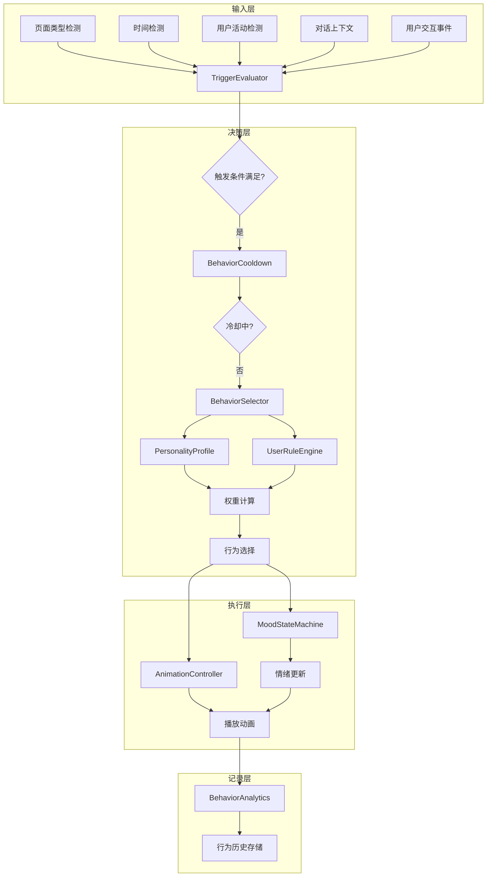

# YP-09-109: 宠物行为自定义 — 宠物动画配置、性格档案、触发条件与行为冷却系统

> 需求编号：YP-09-109 · 优先级：P2 · 人天：0.5d · 状态：需求已编写
> 依赖：YP-09-55（页面类型自适应渲染）、YP-09-28（注入时机优化）

## 背景

### 问题陈述

YiPet 当前宠物行为完全由内置逻辑驱动：空闲动画随机播放、交互响应固定、行为频率不可控。用户无法根据自身偏好调整宠物表现，导致：

1. **行为单一乏味**：所有页面上宠物表现一致，缺少个性化和新鲜感
2. **干扰工作流**：宠物在专注工作时频繁出现或播放动画，用户无法控制行为频率
3. **无法适配场景**：不同页面类型（文档、代码、视频）需要不同的宠物行为模式，但当前无法区分
4. **缺少情感连接**：宠物情绪不随上下文变化，用户感知不到宠物的"状态"
5. **配置无法迁移**：用户精心调整的偏好无法导出复用

**核心矛盾**：宠物行为系统需要在"有趣多变"和"不干扰工作"之间取得平衡，同时提供足够的自定义能力让用户掌控行为边界。

### 影响范围

| # | 影响 | 严重程度 | 典型场景 |
|---|------|----------|----------|
| 1 | 宠物行为不可预测，干扰工作 | 高 | 用户专注编码时宠物频繁弹出动画 |
| 2 | 宠物缺少个性化，用户粘性低 | 中 | 所有用户看到相同的宠物行为，无差异 |
| 3 | 无法根据页面类型调整行为 | 中 | 视频页面和文档页面宠物表现相同 |
| 4 | 行为配置无法持久化或迁移 | 中 | 重装扩展后行为偏好丢失 |
| 5 | 宠物情绪不随上下文变化 | 低 | 长时间无交互后宠物仍保持开心状态 |

### 挑战

| 挑战 | 说明 |
|------|------|
| 行为权重平衡 | 多种性格参数叠加后，需确保行为概率分布合理 |
| 冷却系统设计 | 需要全局冷却 + 单行为冷却双重机制，防止频繁重复 |
| 上下文感知 | 页面类型、时间、用户活动等多种因素需实时融合 |
| 情绪状态机 | 情绪切换需平滑过渡，避免突兀的状态跳变 |
| 配置兼容性 | 导入/导出配置需版本校验，防止旧版本配置导致崩溃 |

---

## 一、现状分析

### 1.1 当前宠物行为系统

```
现有宠物行为（硬编码）:
├── 空闲动画
│   ├── idle_blink      # 眨眼（固定每 5s）
│   ├── idle_stretch    # 伸展（固定每 30s）
│   └── idle_look       # 张望（固定每 15s）
├── 交互响应
│   ├── on_click        # 点击 → 跳跃
│   ├── on_hover        # 悬停 → 歪头
│   └── on_drag         # 拖拽 → 挣扎
└── 出现频率
    ├── 始终可见（无隐藏逻辑）
    └── 无页面类型区分

缺失:
├── 性格配置              # ❌ 不存在
├── 触发条件系统          # ❌ 不存在
├── 行为冷却系统          # ❌ 不存在
├── 用户自定义行为规则    # ❌ 不存在
├── 情绪系统              # ❌ 不存在
├── 行为历史与分析        # ❌ 不存在
└── 配置导入/导出         # ❌ 不存在
```

### 1.2 行为系统架构现状

```
当前架构（硬编码）:
┌─────────────────────────────────────────┐
│  PetAnimationController                  │
│  ├── _idleTimer: setInterval            │
│  ├── _currentAnimation: string          │
│  ├── playRandomIdle() → 固定列表随机    │
│  └── onInteraction() → 固定响应         │
└─────────────────────────────────────────┘

目标架构（可配置）:
┌─────────────────────────────────────────┐
│  PetBehaviorEngine                       │
│  ├── PersonalityProfile (性格参数)       │
│  ├── TriggerEvaluator (触发条件判定)     │
│  ├── BehaviorCooldown (冷却系统)         │
│  ├── MoodStateMachine (情绪状态机)       │
│  ├── BehaviorRuleEngine (自定义规则)     │
│  └── BehaviorAnalytics (行为分析)        │
└─────────────────────────────────────────┘
```

### 1.3 根因矩阵

| 症状 | 根因 | 触发条件 | 频率 |
|------|------|----------|------|
| 宠物行为干扰工作 | 无行为频率控制 | 用户专注工作时 | 高 |
| 宠物行为单调 | 无性格差异 | 长期使用 | 中 |
| 无法适配场景 | 无页面类型感知 | 切换页面类型时 | 中 |
| 配置丢失 | 无导出机制 | 重装扩展 | 中 |
| 情绪不真实 | 无上下文情绪系统 | 任何场景 | 低 |

---

## 二、设计决策

### 决策 1：行为配置存储 — chrome.storage.sync vs chrome.storage.local vs IndexedDB

| 选项 | 容量 | 同步 | 读写性能 | 配置迁移 |
|------|------|------|----------|----------|
| chrome.storage.sync | 100KB | 跨设备同步 | 快 | 自动 |
| chrome.storage.local | 10MB | 仅本地 | 快 | 需手动导出 |
| IndexedDB | 无限制 | 无 | 中等 | 需手动导出 |

**选择：chrome.storage.local 为主，chrome.storage.sync 为辅助。** 行为配置（性格参数、自定义规则、冷却设置）存储在 local 中（避免 sync 容量限制），关键偏好（性格选择、行为频率级别）通过 sync 同步到多设备。配置导出/导入提供完整的迁移能力。

### 决策 2：行为触发条件评估 — 轮询 vs 事件驱动 vs 混合

| 选项 | CPU 开销 | 响应速度 | 复杂度 |
|------|----------|----------|--------|
| 轮询（每 500ms 检查条件） | 中 | 中等 | 低 |
| 事件驱动（监听页面事件） | 低 | 快 | 高 |
| 混合（事件触发 + 定期检查） | 中 | 快 | 中 |

**选择：混合模式。** 页面类型变化、用户交互等高频事件使用事件驱动；时间驱动行为（如"每 30 分钟"）使用轻量定时器；用户活动水平检测使用 2s 间隔的采样轮询。事件驱动降低 CPU 开销，轮询覆盖无法通过事件捕获的条件。

### 决策 3：情绪状态机 — 离散状态 vs 连续维度 vs 混合

| 选项 | 表现力 | 复杂度 | 动画映射 |
|------|--------|--------|----------|
| 离散状态（开心/思考/惊讶/困倦） | 中 | 低 | 简单 |
| 连续维度（valence + arousal 0-1） | 高 | 高 | 复杂 |
| 混合（离散状态 + 强度参数） | 高 | 中 | 中等 |

**选择：混合模式。** 使用 4 种离散情绪状态（开心、思考、惊讶、困倦）作为主状态，每个状态附带 0-1 的强度参数。离散状态映射到不同的动画集合，强度参数影响动画速度（0.8x-1.2x）和色彩色调（暖色-冷色）。这种设计在表现力和实现复杂度之间取得平衡。

### 决策 4：行为冷却系统设计 — 全局冷却 vs 单行为冷却 vs 双层

| 选项 | 防重复 | 灵活性 | 实现复杂度 |
|------|--------|--------|-----------|
| 全局冷却 | 有效但粗糙 | 低 | 低 |
| 单行为冷却 | 精确 | 高 | 中 |
| 双层（全局 + 单行为） | 最佳 | 高 | 中 |

**选择：双层冷却。** 全局冷却（默认 3s）防止任何动画之间的过度切换，单行为冷却（每个行为独立配置，如 idle_stretch 冷却 30s）防止同一行为重复出现。两层冷却可独立配置，用户可设置全局冷却 1-15s，单行为冷却 5-300s。

### 设计决策记录

| 决策 | 选项 A | 选项 B | 选项 C | 选择 | 理由 |
|------|--------|--------|--------|------|------|
| 配置存储 | chrome.storage.sync | chrome.storage.local | IndexedDB | **local + sync** | 容量 + 同步兼顾 |
| 触发评估 | 轮询 | 事件驱动 | 混合 | **混合** | 性能 + 覆盖 |
| 情绪模型 | 离散状态 | 连续维度 | 混合 | **混合** | 表现力 + 可行性 |
| 冷却系统 | 全局冷却 | 单行为冷却 | 双层 | **双层** | 精度 + 灵活性 |

---

## 三、目标架构

### 3.1 行为引擎架构



### 3.2 性格档案参数模型

```
PersonalityProfile {
  playfulness: 0.0-1.0    // 嬉闹程度 → 影响活跃动画频率
  calmness: 0.0-1.0       // 冷静程度 → 影响安静动画频率
  curiosity: 0.0-1.0      // 好奇程度 → 影响探索动画频率
  helpfulness: 0.0-1.0    // 助人程度 → 影响提示/建议频率
}

预设性格:
├── playful  (0.9, 0.2, 0.7, 0.3)  # 调皮
├── calm     (0.2, 0.9, 0.3, 0.5)  # 冷静
├── curious  (0.5, 0.4, 0.9, 0.4)  # 好奇
└── helpful  (0.3, 0.7, 0.4, 0.9)  # 助人
```

### 3.3 情绪状态机

```mermaid
stateDiagram-v2
    [*] --> Happy : 初始状态
    
    Happy --> Thinking : 用户提问/页面内容变化
    Thinking --> Happy : 获得回复/任务完成
    Happy --> Surprised : 意外交互/新页面类型
    Surprised --> Happy : 适应后
    Happy --> Sleepy : 长时间无交互(>30min)
    Sleepy --> Happy : 用户交互唤醒
    Thinking --> Sleepy : 长时间思考无结果
    Sleepy --> Surprised : 突然交互
    
    note right of Happy : 强度 0.6-1.0\n表情: 微笑\n动画速度: 1.0x\n色调: 暖色
    note right of Thinking : 强度 0.3-0.7\n表情: 沉思\n动画速度: 0.8x\n色调: 中性
    note right of Surprised : 强度 0.7-1.0\n表情: 惊讶\n动画速度: 1.2x\n色调: 亮色
    note right of Sleepy : 强度 0.1-0.4\n表情: 困倦\n动画速度: 0.6x\n色调: 暗色
```

### 3.4 触发条件类型

| 条件类型 | 参数 | 示例规则 |
|----------|------|----------|
| page_type | 正则匹配 URL/域名 | `page_type: "code"` → 降低动画频率 |
| time_of_day | 时间段 (morning/afternoon/evening/night) | `time: "night"` → 安静模式 |
| user_activity | 空闲/轻度/中度/高度 | `activity: "high"` → 隐藏宠物 |
| conversation_context | 消息数/最近消息时间 | 新对话开始 → 出现欢迎动画 |
| page_content | 页面文本关键词匹配 | `page contains "error"` → 显示担忧表情 |
| user_idle_time | 无操作秒数 | `idle > 300s` → 进入睡眠 |

### 3.5 性能指标

| 指标 | 改造前 | 改造后 |
|------|--------|--------|
| 行为决策延迟 | 0ms（固定逻辑） | < 5ms（条件评估 + 权重计算） |
| 动画切换平滑度 | 直接切换 | 250ms 过渡动画 |
| 配置存储大小 | 0 | < 50KB（local） |
| 行为历史记录 | 0 | 最近 1000 条（循环覆盖） |
| 冷却检查开销 | 0 | < 1ms（Map 查找） |

---

## 四、具体改动

### 4.1 性格档案数据结构

```typescript
// src/types/behavior.ts (新增)

interface PersonalityProfile {
  id: string;
  name: string;
  playfulness: number;   // 0.0 - 1.0
  calmness: number;      // 0.0 - 1.0
  curiosity: number;     // 0.0 - 1.0
  helpfulness: number;   // 0.0 - 1.0
  isPreset: boolean;     // 是否为预设性格
  isCustom: boolean;     // 是否为用户自定义
}

interface BehaviorConfig {
  personality: PersonalityProfile;
  idleAnimations: AnimationConfig[];
  interactionResponses: InteractionConfig[];
  appearanceFrequency: FrequencyConfig;
  cooldowns: CooldownConfig;
  triggerRules: TriggerRule[];
  moodSettings: MoodSettings;
}

interface AnimationConfig {
  id: string;
  name: string;
  category: 'idle' | 'interaction' | 'reaction' | 'mood';
  priority: number;          // 1-10, 越高越优先
  weight: number;            // 选择权重
  minDuration: number;       // 最小持续时间 ms
  maxDuration: number;       // 最大持续时间 ms
  cooldownMs: number;        // 独立冷却时间
  moodRequired?: MoodType;   // 需要的情绪状态
  personalityWeights: {      // 各性格参数的权重加成
    playfulness: number;
    calmness: number;
    curiosity: number;
    helpfulness: number;
  };
}

interface CooldownConfig {
  globalCooldownMs: number;  // 全局冷却 (默认 3000ms)
  perBehavior: Record<string, number>; // 单行为冷却
}
```

### 4.2 行为引擎核心实现

```typescript
// src/content/behavior/PetBehaviorEngine.ts (新增)

type MoodType = 'happy' | 'thinking' | 'surprised' | 'sleepy';

interface MoodState {
  type: MoodType;
  intensity: number;        // 0.0 - 1.0
  enteredAt: number;        // 进入时间戳
  previousType: MoodType | null;
  transitions: MoodTransition[];
}

interface MoodTransition {
  from: MoodType;
  to: MoodType;
  trigger: string;
  timestamp: number;
}

class PetBehaviorEngine {
  private config: BehaviorConfig;
  private moodState: MoodState;
  private cooldownMap: Map<string, number>;  // behaviorId → lastTriggeredAt
  private globalCooldownUntil: number = 0;
  private behaviorHistory: BehaviorRecord[] = [];
  private animationController: AnimationController;
  private triggerEvaluator: TriggerEvaluator;

  constructor(config: BehaviorConfig, animationController: AnimationController) {
    this.config = config;
    this.moodState = {
      type: 'happy',
      intensity: 0.8,
      enteredAt: Date.now(),
      previousType: null,
      transitions: [],
    };
    this.cooldownMap = new Map();
    this.animationController = animationController;
    this.triggerEvaluator = new TriggerEvaluator(config.triggerRules);
  }

  /**
   * 评估触发条件并选择行为
   */
  evaluateAndAct(context: BehaviorContext): AnimationConfig | null {
    // 1. 检查全局冷却
    if (Date.now() < this.globalCooldownUntil) {
      return null;
    }

    // 2. 评估触发条件
    const matchedTriggers = this.triggerEvaluator.evaluate(context);
    if (matchedTriggers.length === 0) {
      // 无触发条件匹配 → 使用默认空闲行为
      return this.selectIdleBehavior();
    }

    // 3. 根据权重选择行为
    const behavior = this.selectBehavior(matchedTriggers, context);

    // 4. 检查单行为冷却
    if (this.isOnCooldown(behavior.id)) {
      return null;
    }

    // 5. 更新冷却
    this.updateCooldowns(behavior);

    // 6. 更新情绪
    this.updateMood(context, behavior);

    // 7. 记录行为
    this.recordBehavior(behavior, context);

    return behavior;
  }

  /**
   * 权重计算：性格参数 × 行为权重 × 触发匹配度
   */
  private calculateWeight(behavior: AnimationConfig, context: BehaviorContext): number {
    const profile = this.config.personality;
    const pw = behavior.personalityWeights;
    
    const personalityScore = 
      profile.playfulness * pw.playfulness +
      profile.calmness * pw.calmness +
      profile.curiosity * pw.curiosity +
      profile.helpfulness * pw.helpfulness;

    const moodMultiplier = this.getMoodMultiplier(behavior, this.moodState.type);
    const recencyPenalty = this.getRecencyPenalty(behavior.id);

    return behavior.weight * personalityScore * moodMultiplier * recencyPenalty;
  }

  /**
   * 新近惩罚：最近播放过的行为降低权重，避免重复
   */
  private getRecencyPenalty(behaviorId: string): number {
    const recentCount = this.behaviorHistory
      .slice(-10)
      .filter(r => r.behaviorId === behaviorId).length;
    return Math.max(0.1, 1 - recentCount * 0.2);
  }

  /**
   * 情绪倍数：匹配情绪的行为获得加成
   */
  private getMoodMultiplier(behavior: AnimationConfig, currentMood: MoodType): number {
    if (!behavior.moodRequired) return 1.0;
    return behavior.moodRequired === currentMood ? 1.5 : 0.3;
  }

  /**
   * 更新情绪状态
   */
  updateMood(context: BehaviorContext, behavior?: AnimationConfig): void {
    const newMood = this.evaluateMood(context);
    if (newMood !== this.moodState.type) {
      const transition: MoodTransition = {
        from: this.moodState.type,
        to: newMood,
        trigger: `context:${context.pageType}`,
        timestamp: Date.now(),
      };
      this.moodState = {
        type: newMood,
        intensity: this.calculateIntensity(newMood, context),
        enteredAt: Date.now(),
        previousType: this.moodState.type,
        transitions: [...this.moodState.transitions.slice(-20), transition],
      };

      // 通知动画控制器情绪变化
      this.animationController.onMoodChanged(this.moodState);
    }
  }

  /**
   * 情绪评估逻辑
   */
  private evaluateMood(context: BehaviorContext): MoodType {
    // 长时间无交互 → 困倦
    if (context.userIdleTime > 30 * 60 * 1000) return 'sleepy';
    
    // 对话进行中 / 页面有复杂内容 → 思考
    if (context.conversationActive || context.pageComplexity > 0.7) return 'thinking';
    
    // 新页面 / 意外事件 → 惊讶
    if (context.isNewPage || context.hasUnexpectedContent) return 'surprised';
    
    return 'happy';
  }

  /**
   * 行为冷却管理
   */
  private isOnCooldown(behaviorId: string): boolean {
    const lastTriggered = this.cooldownMap.get(behaviorId);
    if (!lastTriggered) return false;
    const cooldownMs = this.config.cooldowns.perBehavior[behaviorId] || 5000;
    return Date.now() - lastTriggered < cooldownMs;
  }

  private updateCooldowns(behavior: AnimationConfig): void {
    this.cooldownMap.set(behavior.id, Date.now());
    this.globalCooldownUntil = Date.now() + this.config.cooldowns.globalCooldownMs;
  }

  /**
   * 导出/导入配置
   */
  exportConfig(): string {
    return JSON.stringify({
      version: 1,
      personality: this.config.personality,
      cooldowns: this.config.cooldowns,
      triggerRules: this.config.triggerRules,
      moodSettings: this.config.moodSettings,
      exportedAt: Date.now(),
    }, null, 2);
  }

  importConfig(json: string): boolean {
    try {
      const data = JSON.parse(json);
      if (data.version !== 1) {
        throw new Error(`Unsupported config version: ${data.version}`);
      }
      this.config.personality = data.personality;
      this.config.cooldowns = data.cooldowns;
      this.config.triggerRules = data.triggerRules;
      this.config.moodSettings = data.moodSettings;
      return true;
    } catch (e) {
      console.error('[PetBehaviorEngine] Config import failed:', e);
      return false;
    }
  }
}
```

### 4.4 用户自定义行为规则

```typescript
// src/content/behavior/TriggerEvaluator.ts (新增)

interface TriggerRule {
  id: string;
  name: string;
  enabled: boolean;
  conditions: TriggerCondition[];
  action: TriggerAction;
  priority: number;
}

interface TriggerCondition {
  type: 'page_url' | 'page_content' | 'time_range' | 'activity_level' | 'conversation_state';
  operator: 'contains' | 'equals' | 'regex' | 'gt' | 'lt' | 'between';
  value: string | number | [number, number];
}

interface TriggerAction {
  type: 'play_animation' | 'change_mood' | 'show_message' | 'hide_pet' | 'show_pet';
  params: Record<string, unknown>;
}

class TriggerEvaluator {
  private rules: TriggerRule[];

  constructor(rules: TriggerRule[]) {
    this.rules = rules.sort((a, b) => b.priority - a.priority);
  }

  evaluate(context: BehaviorContext): TriggerRule[] {
    return this.rules
      .filter(rule => rule.enabled)
      .filter(rule => this.matchConditions(rule.conditions, context));
  }

  private matchConditions(conditions: TriggerCondition[], context: BehaviorContext): boolean {
    return conditions.every(cond => this.matchSingleCondition(cond, context));
  }

  private matchSingleCondition(cond: TriggerCondition, context: BehaviorContext): boolean {
    switch (cond.type) {
      case 'page_url':
        return this.matchString(context.pageUrl, cond.operator, cond.value as string);
      case 'page_content':
        return this.matchString(context.pageText, cond.operator, cond.value as string);
      case 'time_range': {
        const [start, end] = cond.value as [number, number];
        const hour = new Date().getHours();
        return hour >= start && hour < end;
      }
      case 'activity_level':
        return this.matchNumber(context.activityLevel, cond.operator, cond.value as number);
      case 'conversation_state':
        return context.conversationActive === (cond.value === 'active');
      default:
        return false;
    }
  }

  private matchString(target: string, operator: string, value: string): boolean {
    switch (operator) {
      case 'contains': return target.includes(value);
      case 'equals': return target === value;
      case 'regex': return new RegExp(value, 'i').test(target);
      default: return false;
    }
  }

  private matchNumber(target: number, operator: string, value: number): boolean {
    switch (operator) {
      case 'gt': return target > value;
      case 'lt': return target < value;
      case 'equals': return target === value;
      default: return false;
    }
  }
}
```

### 4.5 情绪影响视觉外观

```typescript
// src/content/behavior/MoodVisualMapper.ts (新增)

interface MoodVisualConfig {
  expression: string;       // 表情 CSS class
  animationSpeed: number;   // 动画速度倍率
  colorTone: string;        // 色调 CSS filter
  particleEffect: string;   // 粒子效果
}

const MOOD_VISUAL_MAP: Record<MoodType, MoodVisualConfig> = {
  happy: {
    expression: 'pet-expr-smile',
    animationSpeed: 1.0,
    colorTone: 'warm',
    particleEffect: 'sparkle',
  },
  thinking: {
    expression: 'pet-expr-think',
    animationSpeed: 0.8,
    colorTone: 'neutral',
    particleEffect: 'dots',
  },
  surprised: {
    expression: 'pet-expr-surprise',
    animationSpeed: 1.2,
    colorTone: 'bright',
    particleEffect: 'exclamation',
  },
  sleepy: {
    expression: 'pet-expr-sleepy',
    animationSpeed: 0.6,
    colorTone: 'dim',
    particleEffect: 'zzz',
  },
};

class MoodVisualMapper {
  static apply(mood: MoodState, element: HTMLElement): void {
    const config = MOOD_VISUAL_MAP[mood.type];
    
    // 表情
    element.setAttribute('data-expression', config.expression);
    
    // 动画速度（受强度影响）
    const speed = config.animationSpeed * (0.8 + mood.intensity * 0.4);
    element.style.setProperty('--pet-anim-speed', speed.toString());
    
    // 色调
    element.setAttribute('data-color-tone', config.colorTone);
    
    // 粒子效果
    element.setAttribute('data-particle', config.particleEffect);
  }
}
```

### 4.6 文件变更清单

| 文件 | 操作 | 说明 |
|------|------|------|
| `src/types/behavior.ts` | 新增 | 行为系统类型定义 |
| `src/content/behavior/PetBehaviorEngine.ts` | 新增 | 行为引擎核心 |
| `src/content/behavior/TriggerEvaluator.ts` | 新增 | 触发条件评估器 |
| `src/content/behavior/MoodStateMachine.ts` | 新增 | 情绪状态机 |
| `src/content/behavior/MoodVisualMapper.ts` | 新增 | 情绪视觉映射 |
| `src/content/behavior/BehaviorAnalytics.ts` | 新增 | 行为分析与历史 |
| `src/content/behavior/CooldownManager.ts` | 新增 | 冷却管理器 |
| `src/content/behavior/ConfigExporter.ts` | 新增 | 配置导入/导出 |
| `src/components/settings/BehaviorSettings.vue` | 新增 | 行为设置面板 |
| `src/components/settings/PersonalityEditor.vue` | 新增 | 性格编辑器 |
| `src/components/settings/RuleEditor.vue` | 新增 | 自定义规则编辑器 |
| `src/content/PetAnimationController.ts` | 修改 | 集成行为引擎 |
| `src/stores/behavior.ts` | 新增 | 行为配置 Pinia store |

---

## 五、实施步骤

| 步骤 | 操作 | 路径 | 验证 | 人天 |
|------|------|------|------|------|
| 1 | 定义行为系统类型接口 | `src/types/behavior.ts` | TypeScript 类型检查通过 | 0.03 |
| 2 | 实现冷却管理器 | `src/content/behavior/CooldownManager.ts` | 单元测试：冷却/过期/重置 | 0.05 |
| 3 | 实现触发条件评估器 | `src/content/behavior/TriggerEvaluator.ts` | 5 种条件类型全部通过 | 0.08 |
| 4 | 实现情绪状态机 | `src/content/behavior/MoodStateMachine.ts` | 状态转换测试 + 视觉映射 | 0.08 |
| 5 | 实现行为引擎核心 | `src/content/behavior/PetBehaviorEngine.ts` | 权重计算 + 行为选择 | 0.1 |
| 6 | 实现行为分析模块 | `src/content/behavior/BehaviorAnalytics.ts` | 历史记录 + 统计 | 0.03 |
| 7 | 实现配置导入/导出 | `src/content/behavior/ConfigExporter.ts` | 导入/导出 JSON 往返 | 0.03 |
| 8 | 创建行为设置 UI | `src/components/settings/BehaviorSettings.vue` | 设置面板交互 | 0.06 |
| 9 | 集成到现有动画系统 | `src/content/PetAnimationController.ts` | 行为引擎驱动动画 | 0.04 |

**总人天：0.5d**

---

## 六、测试规格

### 场景 1：性格权重影响行为选择

**GIVEN** 宠物性格设置为 playful (playfulness=0.9, calmness=0.2)
**WHEN** 行为引擎在空闲状态下选择动画
**THEN** playfulness 权重高的动画被选中概率显著高于 calmness 权重高的动画
**AND** 100 次选择中，playfulness 类动画占比 > 60%

### 场景 2：行为冷却防止重复

**GIVEN** 行为 A 设置了 10s 单行为冷却，全局冷却 3s
**WHEN** 行为 A 在 t=0 被触发
**THEN** t=0 到 t=3 期间任何行为都不触发
**AND** t=3 到 t=10 期间行为 A 不触发，其他行为可触发
**AND** t=10 后行为 A 可再次触发

### 场景 3：情绪状态随上下文切换

**GIVEN** 宠物初始情绪为 happy
**WHEN** 用户在 30 分钟内无任何交互
**THEN** 情绪应从 happy 切换到 sleepy
**AND** 视觉表现应更新为 sleepy 配置（表情、动画速度 0.6x、暗色调）
**WHEN** 用户随后点击宠物
**THEN** 情绪应从 sleepy 切换到 happy
**AND** 过渡动画应平滑（250ms ease-in-out）

### 场景 4：用户自定义规则触发

**GIVEN** 用户创建规则："当页面包含 'error' 时，显示担忧表情"
**WHEN** 用户导航到包含 "error" 文本的页面
**THEN** TriggerEvaluator 应匹配该规则
**AND** 宠物情绪应切换到 thinking（担忧）
**AND** 行为历史应记录该规则触发

### 场景 5：配置导入/导出版本校验

**GIVEN** 用户导出配置 version=1
**WHEN** 用户在其他设备导入该配置
**THEN** 导入成功，行为配置完全恢复
**WHEN** 用户尝试导入 version=999 的配置
**THEN** 导入失败，返回错误信息 "Unsupported config version"
**AND** 现有配置不受影响

### 场景 6：新近惩罚避免行为重复

**GIVEN** 行为 A 在最近 10 次行为历史中出现了 5 次
**WHEN** 行为引擎计算行为 A 的权重
**THEN** getRecencyPenalty 返回 0.1（最低惩罚）
**AND** 行为 A 被选中的概率显著降低
**GIVEN** 行为 B 在最近 10 次行为历史中出现了 0 次
**WHEN** 行为引擎计算行为 B 的权重
**THEN** getRecencyPenalty 返回 1.0（无惩罚）

---

## 七、风险与缓解

| 风险 | 概率 | 影响 | 缓解措施 |
|------|------|------|----------|
| 行为引擎 CPU 开销过高 | 中 | 中 | 限制评估频率为 500ms，使用 requestIdleCallback 降低优先级 |
| 情绪切换过于频繁 | 中 | 低 | 设置情绪最小持续时间（30s），加入滞后阈值 |
| 自定义规则导致性能问题 | 低 | 中 | 限制规则数量（最多 20 条），正则表达式超时 100ms |
| 配置导入不兼容旧版本 | 中 | 低 | 严格版本校验 + 迁移函数 |
| 性格参数极端值导致行为单一 | 低 | 中 | 限制参数范围 0.1-0.9，强制至少两个参数 > 0.3 |

---

## 八、回滚策略

| 场景 | 回滚操作 | 影响 |
|------|----------|------|
| 行为引擎导致性能下降 | 禁用行为引擎，回退到固定动画逻辑 | 失去个性化行为 |
| 情绪系统异常 | 固定情绪为 happy 状态 | 情绪表现力丧失 |
| 自定义规则系统崩溃 | 禁用规则引擎，仅使用预设行为 | 自定义功能关闭 |
| 配置导入导致数据损坏 | 清除行为配置，恢复默认配置 | 用户自定义配置丢失 |

---

## 九、设计决策记录

### D-01：行为选择算法

- **问题**：多个行为候选时如何选择
- **选项**：随机选择、加权随机、优先级排序
- **选择**：加权随机（weighted random selection）
- **理由**：加权随机保证了行为多样性，同时让性格参数和上下文能有效影响选择。纯随机过于无趣，纯优先级排序会导致行为固化。

### D-02：情绪状态持久化

- **问题**：情绪状态是否需要在 Service Worker 重启后恢复
- **选项**：始终从 happy 开始、从存储恢复、从上下文推断
- **选择**：从 chrome.storage.local 恢复最后一次情绪 + 上下文微调
- **理由**：完全从 happy 开始会让用户感觉宠物"失忆"；从上下文推断可能不准确；保存最后状态 + 根据当前上下文微调最为自然。

### D-03：冷却时间默认值

- **问题**：全局冷却和单行为冷却的默认值
- **选项**：短冷却（1s/5s）、中冷却（3s/15s）、长冷却（5s/30s）
- **选择**：中冷却（全局 3s，单行为 15s）
- **理由**：短冷却导致动画频繁切换视觉疲劳；长冷却让宠物显得迟钝；3s/15s 在趣味性和克制之间平衡。

### D-04：规则优先级冲突解决

- **问题**：多条自定义规则同时匹配时如何处理
- **选项**：执行第一条匹配、执行所有匹配、按优先级排序
- **选择**：按优先级排序，执行最高优先级规则
- **理由**：同时执行多条规则可能导致冲突（如同时 hide 和 show）；执行最高优先级规则行为可预测。

---

## 十、可观测性

### 指标

| 指标 | 类型 | 说明 |
|------|------|------|
| `yipet.behavior.evaluate_duration` | Histogram | 行为评估耗时（ms） |
| `yipet.behavior.animation_count` | Counter | 动画触发总数 |
| `yipet.behavior.mood_transitions` | Counter | 情绪切换次数 |
| `yipet.behavior.cooldown_hits` | Counter | 冷却命中次数 |
| `yipet.behavior.rule_triggers` | Counter | 自定义规则触发次数 |
| `yipet.behavior.avg_animation_interval` | Gauge | 平均动画间隔（s） |

### 告警

| 告警 | 条件 | 级别 |
|------|------|------|
| 行为评估耗时 > 10ms | 连续 5 次 | WARNING |
| 情绪切换频率 > 10/min | 1 分钟内 | WARNING |
| 冷却命中率 > 90% | 最近 100 次评估 | INFO |
| 自定义规则超时 | 单次规则评估 > 100ms | WARNING |

---

## 十一、代码审查检查清单

- [ ] 行为引擎评估频率合理（建议 500ms-2000ms）
- [ ] 冷却管理器使用 Map 而非 Object 存储冷却时间
- [ ] 情绪状态机转换图完整，无死锁状态
- [ ] 加权随机算法的权重总和始终为 1（归一化）
- [ ] 自定义规则评估有超时保护（100ms）
- [ ] 配置导入有版本校验和错误处理
- [ ] 行为历史记录有上限（最多 1000 条，循环覆盖）
- [ ] 性格参数在 0.0-1.0 范围内校验
- [ ] 情绪视觉映射不影响页面布局（使用 CSS custom properties）
- [ ] 所有动画切换使用 CSS transition（250ms）避免突兀
- [ ] chrome.storage.local 写入使用防抖（500ms）

---

## 回归问题预测

| # | 预测问题 | 原因 | 验证方法 |
|---|---------|------|---------|
| 1 | 行为引擎在高频页面（如滚动、键盘输入）上触发评估过于频繁，导致 CPU 使用率上升，页面滚动卡顿 | Content Script 监听 scroll/input 事件每次触发评估，加权计算和规则匹配在短时间内累积执行，阻塞主线程 | 在包含大量 DOM 的页面上滚动并监控 Performance API，验证行为评估耗时 < 5ms，总 CPU 增量 < 2% |
| 2 | 情绪状态机在 `sleepy` 和 `happy` 之间频繁切换（用户短暂离开后又回来），导致宠物动画闪烁 | 用户离开 30min 进入 sleepy，1s 后点击宠物进入 happy，但 30min 阈值和用户活动检测存在时间窗口竞争 | 模拟用户在 30min 边界前后的交互，验证情绪切换有最小持续时间（30s），防止快速来回切换 |
| 3 | 自定义规则的正则表达式评估在页面文本很大时（如长文档）导致主线程阻塞，宠物卡住不动 | `page_content` 条件使用 `new RegExp(value).test(context.pageText)`，长文档的 pageText 可能达到数 MB | 限制 pageText 采样为前 100KB，正则执行超时 100ms 后终止，并记录超时事件 |
| 4 | 配置导入的 JSON 包含未知字段时，深合并逻辑覆盖了默认值，导致行为异常 | 导入的 JSON 可能包含旧版本或第三方编辑的额外字段，Object.assign 或 spread 覆盖了合理的默认值 | 使用白名单字段过滤导入的 JSON，仅允许已知字段被合并，未知字段忽略并记录警告 |
| 5 | 行为历史记录在 Service Worker 休眠后丢失，Analytics 模块的统计数据（如"今日动画次数"）不准确 | Service Worker 被浏览器终止后内存中的行为历史丢失，恢复后仅从 chrome.storage 加载最近一次持久化快照 | 在每次行为触发后异步写入 chrome.storage.local（防抖 500ms），确保 SW 恢复后数据不丢失超过 5s |
| 6 | 视觉映射的 CSS custom properties 更新后，动画速度变化在 CSS transition 中产生中间状态，宠物出现"变速"抖动 | `--pet-anim-speed` 从 1.0 变为 0.6 时，transition 期间的中间值（0.8）导致动画帧计算不一致 | 在情绪切换时先暂停当前动画，更新 CSS 变量后重新启动动画，避免 transition 干扰 animation |

---

## 性能分析

### 行为引擎各阶段耗时

| 阶段 | 预估耗时 | 说明 |
|------|----------|------|
| 上下文采集 | ~0.5ms | 读取 pageType、activityLevel、idleTime |
| 触发条件评估 | ~1ms | 遍历最多 20 条规则，每条匹配 < 0.05ms |
| 冷却检查 | ~0.1ms | Map.has() 操作 O(1) |
| 权重计算 | ~0.5ms | 候选行为通常 < 10 个 |
| 加权随机选择 | ~0.1ms | 累积权重 + 二分查找 |
| 情绪更新 | ~0.3ms | 状态机判断 + 持久化入队 |
| 动画触发 | ~0.5ms | CSS class 切换 + transition 启动 |
| **总计** | **~3ms** | 远低于 16ms 帧预算 |

### 存储开销

| 存储项 | 大小 | 说明 |
|------|------|------|
| 行为配置 (BehaviorConfig) | ~2KB | 性格 + 冷却 + 规则 |
| 情绪状态 (MoodState) | ~0.5KB | 当前情绪 + 最近 20 条转换 |
| 行为历史 (BehaviorRecord[]) | ~10KB | 最近 1000 条记录 |
| 动画配置缓存 | ~5KB | 预加载的动画元数据 |
| **总计 (local)** | **~18KB** | 远低于 10MB 限制 |
| **总计 (sync)** | **~0.5KB** | 仅性格选择 + 频率级别 |

### 内存占用

| 组件 | 内存 | 说明 |
|------|------|------|
| PetBehaviorEngine 实例 | ~50KB | 包含所有配置和历史 |
| TriggerEvaluator | ~10KB | 规则缓存 + 正则编译 |
| MoodStateMachine | ~5KB | 状态机定义 + 转换历史 |
| BehaviorAnalytics | ~15KB | 聚合统计数据 |
| **总计** | **~80KB** | Content Script 内存预算内 |