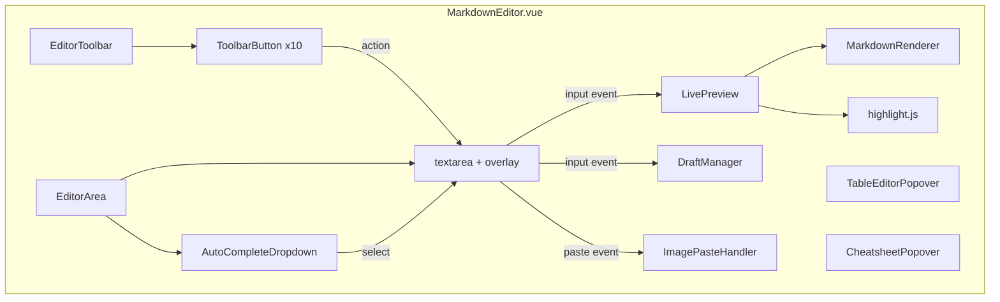

# YP-09-110: Markdown 编辑器增强 — 富文本工具栏、实时预览、语法高亮与自动补全

> 需求编号：YP-09-110 · 优先级：P2 · 人天：0.5d · 状态：需求已编写
> 依赖：YP-09-22（Markdown 渲染安全）、YP-09-47（代码高亮增强）

## 背景

### 问题陈述

YiPet 聊天输入框当前为纯文本 textarea，用户需手动输入 Markdown 语法。对于不熟悉 Markdown 的用户和需要频繁格式化文本的场景，这造成了显著的输入摩擦：

1. **学习门槛高**：不熟悉 Markdown 的用户无法轻松使用格式化功能
2. **输入效率低**：手动输入 `**粗体**`、`[链接](url)` 等语法增加输入时间
3. **无实时反馈**：输入 Markdown 后无法即时预览渲染效果，需发送后才能确认
4. **代码块体验差**：代码块无语法高亮和自动缩进，粘贴代码时格式混乱
5. **表格编辑困难**：手动编写 Markdown 表格对齐繁琐，极易出错

**核心矛盾**：需要在保持 Markdown 纯文本编辑灵活性的同时，提供所见即所得的编辑辅助，降低使用门槛而不牺牲高级用户效率。

### 影响范围

| # | 影响 | 严重程度 | 典型场景 |
|---|------|----------|----------|
| 1 | Markdown 新手无法使用格式化 | 高 | 普通用户想加粗文字但不知道语法 |
| 2 | 代码块无语法高亮 | 中 | 开发者粘贴代码后格式混乱 |
| 3 | 输入长消息后格式错误 | 中 | 发送后才看到渲染结果不对 |
| 4 | 表格编辑耗时 | 中 | 用户手动对齐 3 列表格 |
| 5 | 长消息意外丢失 | 高 | 页面刷新后编辑中的内容丢失 |

### 挑战

| 挑战 | 说明 |
|------|------|
| 工具栏与 Markdown 语法同步 | 工具栏按钮需解析当前光标位置的 Markdown 状态，判断按钮是否激活 |
| 实时预览性能 | 大文本（> 5000 字）的实时渲染需优化，避免输入卡顿 |
| 自动补全冲突 | 中文输入法组合输入时，自动补全不能干扰 IME 输入 |
| 图片粘贴处理 | 粘贴图片需异步上传 + 插入 Markdown 语法，需处理上传失败 |
| 草稿恢复 | 浏览器崩溃后需恢复未发送的草稿，需处理多标签页草稿冲突 |

---

## 一、现状分析

### 1.1 当前编辑器状态

```
现有编辑器（纯 textarea）:
├── 输入方式
│   └── <textarea> 原生控件
├── 格式化
│   └── 无，完全依赖用户手动输入 Markdown 语法
├── 预览
│   └── 无，发送后才能在聊天窗口看到渲染结果
├── 代码块
│   └── 无语法高亮，依赖发送后的渲染
└── 持久化
    └── 无，页面刷新后输入内容丢失

缺失:
├── 富文本工具栏              # ❌ 不存在
├── Markdown 实时预览         # ❌ 不存在
├── 代码块语法高亮            # ❌ 不存在（仅发送后渲染时）
├── 键盘快捷键格式化          # ❌ 不存在
├── 自动补全                  # ❌ 不存在
├── 表格编辑器                # ❌ 不存在
├── 图片粘贴上传              # ❌ 不存在
├── Markdown 速查表           # ❌ 不存在
├── 草稿自动保存              # ❌ 不存在
└── Emoji 简码展开            # ❌ 不存在
```

### 1.2 编辑器架构现状

```
当前架构（原生 textarea）:
┌─────────────────────────────────────────┐
│  ChatInput.vue                           │
│  ├── <textarea v-model="message">        │
│  ├── @keydown.enter → sendMessage()      │
│  └── 无状态管理                          │
└─────────────────────────────────────────┘

目标架构（增强编辑器）:
┌─────────────────────────────────────────┐
│  MarkdownEditor.vue                      │
│  ├── EditorToolbar.vue (工具栏)          │
│  ├── EditorArea (编辑区)                 │
│  │   ├── CodeMirror/Textarea (核心)      │
│  │   └── AutoComplete (自动补全)         │
│  ├── LivePreview.vue (实时预览)          │
│  ├── TableEditor.vue (表格编辑器)        │
│  ├── CheatsheetPopover.vue (速查表)      │
│  ├── DraftManager (草稿管理)             │
│  └── ImagePasteHandler (图片粘贴)        │
└─────────────────────────────────────────┘
```

### 1.3 根因矩阵

| 症状 | 根因 | 触发条件 | 频率 |
|------|------|----------|------|
| 用户无法格式化文本 | 无工具栏辅助 | 非技术用户使用 | 高 |
| 编辑后格式错误 | 无实时预览 | 发送长消息 | 中 |
| 代码片段格式混乱 | 无语法高亮和自动缩进 | 粘贴代码 | 中 |
| 输入内容丢失 | 无草稿保存 | 页面刷新/崩溃 | 中 |
| 表格编辑困难 | 无可视化表格工具 | 需要表格展示 | 低 |

---

## 二、设计决策

### 决策 1：编辑器核心 — 原生 textarea vs CodeMirror vs 自建 contenteditable

| 选项 | Markdown 支持 | 体积 | 性能 | 维护成本 |
|------|-------------|------|------|----------|
| 原生 textarea | 需自行实现 | 0KB | 优秀 | 高 |
| CodeMirror 6 | 内置 Markdown 模式 | ~150KB | 良好 | 低 |
| 自建 contenteditable | 可控 | 中 | 中等 | 高 |

**选择：原生 textarea + 增强层。** YiPet 扩展体积限制严格（MV3 要求），CodeMirror 6 的 ~150KB 在扩展上下文中过重。原生 textarea 配合自定义增强层（工具栏、自动补全、预览）在保持轻量的同时提供所需功能。工具栏通过 textarea selection API 操作文本，无需替换编辑器核心。

### 决策 2：语法高亮库 — highlight.js vs Prism.js vs Shiki

| 选项 | 体积 | 语言支持 | 主题 | 扩展环境 |
|------|------|----------|------|----------|
| highlight.js | ~30KB（按需加载） | 190+ 语言 | 丰富 | 良好 |
| Prism.js | ~20KB（按需加载） | 280+ 语言 | 中等 | 良好 |
| Shiki | ~5MB（含 TextMate 语法） | 全部 | 最丰富 | 不适用 |

**选择：highlight.js 按需加载。** highlight.js 的按需加载模式仅打包常用语言（JavaScript、TypeScript、Python、JSON、CSS、HTML、Bash、SQL），体积约 30KB。通过动态 import 加载额外语言。Prism.js 体积更小，但 highlight.js 的语言自动检测更准确。

### 决策 3：实时预览策略 — 同步渲染 vs 防抖渲染 vs Web Worker 渲染

| 选项 | 响应速度 | 大文本性能 | 实现复杂度 |
|------|----------|-----------|-----------|
| 同步渲染 | 即时 | 差（>5000 字卡顿） | 低 |
| 防抖渲染（300ms） | 300ms 延迟 | 良好 | 低 |
| Web Worker 渲染 | 即时 | 优秀 | 高 |

**选择：防抖渲染（150ms）。** 150ms 防抖在用户感知（即时）和性能（不阻塞输入）之间取得平衡。对于 > 3000 字文本，使用 requestIdleCallback 分段渲染。Web Worker 渲染在扩展 Content Script 环境中通信复杂，收益有限。

### 决策 4：草稿存储 — chrome.storage.local vs IndexedDB vs localStorage

| 选项 | 容量 | 同步 | 持久化 | 多标签页 |
|------|------|------|--------|----------|
| chrome.storage.local | 10MB | 异步 | 可靠 | 天然支持 |
| IndexedDB | 无限制 | 异步 | 可靠 | 天然支持 |
| localStorage | 5-10MB | 同步 | 可靠 | 需手动同步 |

**选择：chrome.storage.local。** 草稿数据量小（< 50KB），chrome.storage.local 提供异步读写、多标签页自动同步，且与 YiPet 现有的存储体系一致。storage.local 的 `onChanged` 事件可用于多标签页草稿冲突检测。

### 设计决策记录

| 决策 | 选项 A | 选项 B | 选项 C | 选择 | 理由 |
|------|--------|--------|--------|------|------|
| 编辑器核心 | 原生 textarea | CodeMirror 6 | contenteditable | **原生 textarea** | 体积优先 |
| 语法高亮 | highlight.js | Prism.js | Shiki | **highlight.js** | 语言检测 + 体积 |
| 实时预览 | 同步渲染 | 防抖渲染 | Web Worker | **防抖 150ms** | 性能 + 体验 |
| 草稿存储 | storage.local | IndexedDB | localStorage | **storage.local** | 体系一致 |

---

## 三、目标架构

### 3.1 编辑器组件树



### 3.2 工具栏按钮布局

```
┌──────────────────────────────────────────────────────┐
│ [H1] [H2] [H3] │ [B] [I] [S] │ [•] [1.] [>] │ ...  │
│ 标题            │ 内联格式     │ 列表/引用      │      │
├──────────────────────────────────────────────────────┤
│ [🔗] [🖼] [📋] │ [```] [📊] │ [👁] [?] [😊] │     │
│ 链接/图片/代码  │ 代码块/表格  │ 预览/帮助/表情 │      │
└──────────────────────────────────────────────────────┘
```

### 3.3 分屏预览布局

```
┌─────────────────────┬─────────────────────┐
│  Markdown 编辑区     │  实时预览            │
│                     │                     │
│  # 标题             │  <h1>标题</h1>      │
│                     │                     │
│  **粗体** 文本      │  <strong>粗体</strong>│
│                     │  文本               │
│                     │                     │
│  ```javascript      │  <pre><code>        │
│  const x = 1;       │  // 语法高亮        │
│  ```                │  const x = 1;       │
│                     │  </code></pre>      │
│                     │                     │
│  [调整分屏比例]      │                     │
└─────────────────────┴─────────────────────┘
```

### 3.4 性能指标

| 指标 | 改造前 | 改造后 |
|------|--------|--------|
| 格式化操作步骤 | 3-5 步（手动输入语法） | 1 步（点击工具栏） |
| 预览延迟 | 无（发送后查看） | 150ms 防抖 |
| 大文本编辑性能 | 流畅 | 流畅（> 5000 字时降级预览） |
| 代码块编辑体验 | 无高亮 | 编辑时基本语法高亮 |
| 内容丢失风险 | 高 | 低（每 5s 自动保存） |

---

## 四、具体改动

### 4.1 工具栏实现

```typescript
// src/components/chat/EditorToolbar.vue (新增)

interface ToolbarAction {
  id: string;
  icon: string;
  label: string;
  shortcut?: string;
  markdownSyntax: MarkdownSyntax;
  appliesTo: 'selection' | 'line' | 'block';
}

interface MarkdownSyntax {
  prefix: string;
  suffix: string;
  placeholder: string;
  blockPrefix?: string;   // 块级语法前缀（如 ```）
  blockSuffix?: string;   // 块级语法后缀（如 ```）
}

const TOOLBAR_ACTIONS: ToolbarAction[] = [
  {
    id: 'bold',
    icon: 'B',
    label: '粗体',
    shortcut: 'Ctrl+B',
    markdownSyntax: { prefix: '**', suffix: '**', placeholder: '粗体文本' },
    appliesTo: 'selection',
  },
  {
    id: 'italic',
    icon: 'I',
    label: '斜体',
    shortcut: 'Ctrl+I',
    markdownSyntax: { prefix: '*', suffix: '*', placeholder: '斜体文本' },
    appliesTo: 'selection',
  },
  {
    id: 'code',
    icon: '<>',
    label: '行内代码',
    shortcut: 'Ctrl+E',
    markdownSyntax: { prefix: '`', suffix: '`', placeholder: 'code' },
    appliesTo: 'selection',
  },
  {
    id: 'link',
    icon: '🔗',
    label: '链接',
    shortcut: 'Ctrl+K',
    markdownSyntax: { prefix: '[', suffix: '](url)', placeholder: '链接文本' },
    appliesTo: 'selection',
  },
  {
    id: 'codeblock',
    icon: '```',
    label: '代码块',
    shortcut: 'Ctrl+Shift+C',
    markdownSyntax: {
      prefix: '```language\n',
      suffix: '\n```',
      placeholder: '代码',
      blockPrefix: '```',
      blockSuffix: '```',
    },
    appliesTo: 'block',
  },
  {
    id: 'quote',
    icon: '"',
    label: '引用',
    shortcut: 'Ctrl+Shift+Q',
    markdownSyntax: { prefix: '> ', suffix: '', placeholder: '引用内容' },
    appliesTo: 'line',
  },
  {
    id: 'unordered-list',
    icon: '•',
    label: '无序列表',
    markdownSyntax: { prefix: '- ', suffix: '', placeholder: '列表项' },
    appliesTo: 'line',
  },
  {
    id: 'ordered-list',
    icon: '1.',
    label: '有序列表',
    markdownSyntax: { prefix: '1. ', suffix: '', placeholder: '列表项' },
    appliesTo: 'line',
  },
  {
    id: 'heading',
    icon: 'H',
    label: '标题',
    markdownSyntax: { prefix: '## ', suffix: '', placeholder: '标题' },
    appliesTo: 'line',
  },
  {
    id: 'table',
    icon: '📊',
    label: '表格',
    markdownSyntax: { prefix: '', suffix: '', placeholder: '' },
    appliesTo: 'block',
  },
];
```

### 4.2 核心编辑操作

```typescript
// src/composables/useMarkdownEditor.ts (新增)

interface EditorState {
  value: string;
  selectionStart: number;
  selectionEnd: number;
  selectedText: string;
}

export function useMarkdownEditor(textareaRef: Ref<HTMLTextAreaElement | null>) {
  const previewHtml = ref('');
  const showPreview = ref(false);
  const previewDebounceTimer = ref<number | null>(null);

  /**
   * 应用 Markdown 语法到选中文本
   */
  function applyMarkdown(syntax: MarkdownSyntax): void {
    const textarea = textareaRef.value;
    if (!textarea) return;

    const state = getEditorState(textarea);
    const { prefix, suffix, placeholder } = syntax;

    let newText: string;
    let newCursorPos: number;

    if (state.selectedText) {
      // 已有选中文本 → 包裹语法
      newText = state.value.slice(0, state.selectionStart) +
        prefix + state.selectedText + suffix +
        state.value.slice(state.selectionEnd);
      newCursorPos = state.selectionStart + prefix.length + state.selectedText.length + suffix.length;
    } else {
      // 无选中 → 插入占位符
      newText = state.value.slice(0, state.selectionStart) +
        prefix + placeholder + suffix +
        state.value.slice(state.selectionEnd);
      newCursorPos = state.selectionStart + prefix.length;
      // 选中占位符文本方便用户直接替换
      setTimeout(() => {
        textarea.setSelectionRange(
          state.selectionStart + prefix.length,
          state.selectionStart + prefix.length + placeholder.length
        );
      });
    }

    textarea.value = newText;
    textarea.setSelectionRange(newCursorPos, newCursorPos);
    textarea.focus();

    updatePreview(newText);
  }

  /**
   * 插入代码块
   */
  function insertCodeBlock(language: string = ''): void {
    const textarea = textareaRef.value;
    if (!textarea) return;

    const state = getEditorState(textarea);
    const codeBlock = `\`\`\`${language}\n${state.selectedText || '代码'}\n\`\`\``;
    
    const newText = state.value.slice(0, state.selectionStart) +
      codeBlock + state.value.slice(state.selectionEnd);
    
    textarea.value = newText;
    const cursorPos = state.selectionStart + 4 + language.length;
    textarea.setSelectionRange(cursorPos, cursorPos);
    textarea.focus();
  }

  /**
   * 自动补全 Markdown 语法
   */
  function handleAutoComplete(e: KeyboardEvent): boolean {
    const textarea = textareaRef.value;
    if (!textarea) return false;

    const state = getEditorState(textarea);
    const charBefore = state.value[state.selectionStart - 1];

    // 输入 ``` → 自动闭合
    if (e.key === '`' && charBefore === '`' && state.value[state.selectionStart - 2] === '`') {
      e.preventDefault();
      const newText = state.value.slice(0, state.selectionStart) +
        '\n\n```' + state.value.slice(state.selectionStart);
      textarea.value = newText;
      const pos = state.selectionStart + 1;
      textarea.setSelectionRange(pos, pos);
      return true;
    }

    // 输入 [ → 建议链接语法
    // 输入 : → 触发 emoji 简码补全
    return false;
  }

  /**
   * 处理粘贴图片
   */
  async function handleImagePaste(e: ClipboardEvent): Promise<void> {
    const items = e.clipboardData?.items;
    if (!items) return;

    for (const item of Array.from(items)) {
      if (item.type.startsWith('image/')) {
        e.preventDefault();
        const file = item.getAsFile();
        if (!file) continue;

        try {
          const url = await uploadImage(file);
          const markdown = ``;
          insertTextAtCursor(markdown);
        } catch (err) {
          showToast('图片上传失败', 'error');
        }
      }
    }
  }

  /**
   * 实时 Markdown 预览（防抖 150ms）
   */
  function updatePreview(text: string): void {
    if (previewDebounceTimer.value) {
      clearTimeout(previewDebounceTimer.value);
    }

    previewDebounceTimer.value = window.setTimeout(() => {
      // 大文本降级：> 3000 字使用 requestIdleCallback 分段渲染
      if (text.length > 3000) {
        requestIdleCallback(() => {
          previewHtml.value = renderMarkdown(text);
        });
      } else {
        previewHtml.value = renderMarkdown(text);
      }
    }, 150);
  }

  /**
   * 草稿自动保存
   */
  function autoSaveDraft(text: string, sessionId: string): void {
    const draftKey = `draft:${sessionId}`;
    chrome.storage.local.set({
      [draftKey]: {
        text,
        savedAt: Date.now(),
        sessionId,
      },
    });
  }

  /**
   * 恢复草稿
   */
  async function restoreDraft(sessionId: string): Promise<string | null> {
    const draftKey = `draft:${sessionId}`;
    const result = await chrome.storage.local.get(draftKey);
    const draft = result[draftKey];
    if (draft && draft.text) {
      return draft.text;
    }
    return null;
  }

  return {
    previewHtml,
    showPreview,
    applyMarkdown,
    insertCodeBlock,
    handleAutoComplete,
    handleImagePaste,
    updatePreview,
    autoSaveDraft,
    restoreDraft,
  };
}
```

### 4.3 键盘快捷键注册

```typescript
// src/composables/useEditorShortcuts.ts (新增)

interface EditorShortcut {
  key: string;
  ctrlKey: boolean;
  shiftKey?: boolean;
  action: () => void;
  preventDefault: boolean;
}

export function useEditorShortcuts(editor: ReturnType<typeof useMarkdownEditor>) {
  const shortcuts: EditorShortcut[] = [
    { key: 'b', ctrlKey: true, action: () => editor.applyMarkdown(BOLD_SYNTAX), preventDefault: true },
    { key: 'i', ctrlKey: true, action: () => editor.applyMarkdown(ITALIC_SYNTAX), preventDefault: true },
    { key: 'k', ctrlKey: true, action: () => editor.applyMarkdown(LINK_SYNTAX), preventDefault: true },
    { key: 'e', ctrlKey: true, action: () => editor.applyMarkdown(CODE_SYNTAX), preventDefault: true },
    { key: 'c', ctrlKey: true, shiftKey: true, action: () => editor.insertCodeBlock(), preventDefault: true },
    { key: 'q', ctrlKey: true, shiftKey: true, action: () => editor.applyMarkdown(QUOTE_SYNTAX), preventDefault: true },
    { key: '?', ctrlKey: false, action: () => editor.toggleCheatsheet(), preventDefault: false },
  ];

  function handleKeydown(e: KeyboardEvent): void {
    for (const shortcut of shortcuts) {
      if (
        e.key.toLowerCase() === shortcut.key &&
        e.ctrlKey === shortcut.ctrlKey &&
        (shortcut.shiftKey === undefined || e.shiftKey === shortcut.shiftKey)
      ) {
        if (shortcut.preventDefault) e.preventDefault();
        shortcut.action();
        return;
      }
    }
  }

  return { handleKeydown, shortcuts };
}
```

### 4.4 表格编辑器

```typescript
// src/components/chat/TableEditor.vue (新增)

interface TableEditorState {
  rows: number;
  cols: number;
  headers: boolean;
  alignment: ('left' | 'center' | 'right')[];
}

export function generateMarkdownTable(state: TableEditorState): string {
  const { rows, cols, headers, alignment } = state;
  const lines: string[] = [];

  // 表头行
  if (headers) {
    const headerCells = Array.from({ length: cols }, (_, i) => ` 列${i + 1} `);
    lines.push('|' + headerCells.join('|') + '|');

    // 分隔行
    const sepCells = alignment.map(a => {
      switch (a) {
        case 'left': return ' :--- ';
        case 'center': return ' :---: ';
        case 'right': return ' ---: ';
        default: return ' --- ';
      }
    });
    lines.push('|' + sepCells.join('|') + '|');
  }

  // 数据行
  for (let r = 0; r < rows; r++) {
    const cells = Array.from({ length: cols }, () => ' 内容 ');
    lines.push('|' + cells.join('|') + '|');
  }

  return lines.join('\n');
}
```

### 4.5 Emoji 简码展开

```typescript
// src/composables/useEmojiShortcode.ts (新增)

const EMOJI_MAP: Record<string, string> = {
  ':smile:': '😊',
  ':laugh:': '😄',
  ':heart:': '❤️',
  ':thumbsup:': '👍',
  ':fire:': '🔥',
  ':rocket:': '🚀',
  ':bug:': '🐛',
  ':bulb:': '💡',
  ':check:': '✅',
  ':cross:': '❌',
  ':warning:': '⚠️',
  ':info:': 'ℹ️',
  ':question:': '❓',
  // ... 共 80+ 常用 emoji
};

export function useEmojiShortcode(textareaRef: Ref<HTMLTextAreaElement | null>) {
  const showEmojiDropdown = ref(false);
  const emojiSuggestions = ref<string[]>([]);
  const filterText = ref('');

  function onInput(text: string, cursorPos: number): void {
    // 检测光标前是否有 : 开头的简码
    const beforeCursor = text.slice(0, cursorPos);
    const match = beforeCursor.match(/:(\w{0,10})$/);

    if (match) {
      filterText.value = match[1].toLowerCase();
      emojiSuggestions.value = Object.keys(EMOJI_MAP)
        .filter(code => code.includes(filterText.value))
        .slice(0, 10);
      showEmojiDropdown.value = emojiSuggestions.value.length > 0;
    } else {
      showEmojiDropdown.value = false;
    }
  }

  function insertEmoji(shortcode: string): void {
    const textarea = textareaRef.value;
    if (!textarea) return;

    const beforeCursor = textarea.value.slice(0, textarea.selectionStart);
    const afterCursor = textarea.value.slice(textarea.selectionStart);
    const colonPos = beforeCursor.lastIndexOf(':');

    const newText = beforeCursor.slice(0, colonPos) +
      EMOJI_MAP[shortcode] +
      afterCursor;

    textarea.value = newText;
    const newPos = colonPos + EMOJI_MAP[shortcode].length;
    textarea.setSelectionRange(newPos, newPos);
    showEmojiDropdown.value = false;
  }

  return { showEmojiDropdown, emojiSuggestions, onInput, insertEmoji };
}
```

### 4.6 文件变更清单

| 文件 | 操作 | 说明 |
|------|------|------|
| `src/components/chat/MarkdownEditor.vue` | 新增 | 增强编辑器主组件 |
| `src/components/chat/EditorToolbar.vue` | 新增 | 富文本工具栏 |
| `src/components/chat/LivePreview.vue` | 新增 | 实时预览面板 |
| `src/components/chat/TableEditor.vue` | 新增 | 表格编辑器弹窗 |
| `src/components/chat/CheatsheetPopover.vue` | 新增 | Markdown 速查表 |
| `src/composables/useMarkdownEditor.ts` | 新增 | 编辑器核心逻辑 |
| `src/composables/useEditorShortcuts.ts` | 新增 | 键盘快捷键 |
| `src/composables/useEmojiShortcode.ts` | 新增 | Emoji 简码展开 |
| `src/composables/useDraftManager.ts` | 新增 | 草稿管理 |
| `src/utils/markdown-renderer.ts` | 新增 | 客户端 Markdown 渲染 |
| `src/utils/image-uploader.ts` | 新增 | 图片上传工具 |
| `src/components/chat/ChatInput.vue` | 修改 | 替换 textarea 为增强编辑器 |
| `src/assets/editor-icons.css` | 新增 | 编辑器图标样式 |

---

## 五、实施步骤

| 步骤 | 操作 | 路径 | 验证 | 人天 |
|------|------|------|------|------|
| 1 | 实现 Markdown 渲染工具 | `src/utils/markdown-renderer.ts` | 常见语法渲染正确 | 0.05 |
| 2 | 实现编辑器核心 composable | `src/composables/useMarkdownEditor.ts` | 工具栏操作验证 | 0.08 |
| 3 | 创建工具栏组件 | `src/components/chat/EditorToolbar.vue` | 10 个按钮功能正常 | 0.06 |
| 4 | 创建实时预览组件 | `src/components/chat/LivePreview.vue` | 分屏预览 + 防抖 | 0.05 |
| 5 | 实现键盘快捷键 | `src/composables/useEditorShortcuts.ts` | 7 个快捷键全部生效 | 0.04 |
| 6 | 实现自动补全 | `src/composables/useMarkdownEditor.ts` | 代码块/链接自动补全 | 0.05 |
| 7 | 创建表格编辑器 | `src/components/chat/TableEditor.vue` | 可视化建表 → MD | 0.05 |
| 8 | 实现图片粘贴上传 | `src/utils/image-uploader.ts` | 粘贴图片 → 上传 → 插入 | 0.04 |
| 9 | 实现草稿管理 | `src/composables/useDraftManager.ts` | 自动保存 + 恢复 | 0.03 |
| 10 | 实现 Emoji + 速查表 | `src/composables/useEmojiShortcode.ts` + `CheatsheetPopover.vue` | 简码展开 + 速查 | 0.05 |

**总人天：0.5d**

---

## 六、测试规格

### 场景 1：工具栏格式化选中文本

**GIVEN** 用户在编辑器中选中文本 "Hello"
**WHEN** 用户点击工具栏的 "粗体" 按钮
**THEN** 编辑器中的文本应变为 "**Hello**"
**AND** 光标应在 "**Hello**" 之后
**AND** 实时预览应显示加粗的 "Hello"

### 场景 2：键盘快捷键插入代码块

**GIVEN** 编辑器光标在空行
**WHEN** 用户按下 Ctrl+Shift+C
**THEN** 编辑器应插入 ```\n\n``` 并自动将光标置于中间行
**AND** 预览应显示空代码块

### 场景 3：自动补全代码块闭合

**GIVEN** 用户在编辑器中输入 "```"
**WHEN** 用户继续输入第三个 "`"（即完成 3 个反引号）
**THEN** 编辑器应自动插入闭合的 "```" 并将光标置于中间
**AND** 不应干扰中文输入法（IME）输入

### 场景 4：粘贴图片自动上传

**GIVEN** 用户从剪贴板粘贴一张 PNG 图片
**WHEN** 编辑器检测到粘贴事件包含图片
**THEN** 应阻止默认粘贴行为
**AND** 应异步上传图片到服务器
**AND** 上传成功后插入 `` Markdown 语法
**AND** 上传失败时显示错误提示

### 场景 5：草稿自动保存与恢复

**GIVEN** 用户在对话中编辑了消息 "Hello World"
**WHEN** 用户刷新页面
**THEN** 页面重新加载后，编辑器应恢复 "Hello World"
**AND** 草稿恢复后应清除 storage 中的草稿记录

### 场景 6：分屏预览大文本

**GIVEN** 用户在编辑器中输入 5000 字 Markdown 文本
**WHEN** 用户开启分屏预览模式
**THEN** 预览面板应使用 requestIdleCallback 分段渲染
**AND** 编辑区输入不应出现卡顿（输入延迟 < 50ms）
**AND** 预览内容应在 500ms 内完成渲染

---

## 七、风险与缓解

| 风险 | 概率 | 影响 | 缓解措施 |
|------|------|------|----------|
| 工具栏与 Markdown 解析不同步 | 中 | 中 | 使用统一的 Markdown 解析器，工具栏操作直接操作文本而非 DOM |
| 实时预览大文本性能差 | 中 | 中 | 150ms 防抖 + requestIdleCallback 分段渲染 + > 5000 字自动关闭预览 |
| 自动补全干扰中文输入法 | 中 | 中 | 检测 IME composition 状态，组合输入期间暂停自动补全 |
| 图片上传失败无反馈 | 低 | 中 | 上传失败保留图片文件名占位，支持重试 |
| 多标签页草稿冲突 | 低 | 低 | 使用 storage.onChanged 监听，草稿加盖时间戳，取最新 |

---

## 八、回滚策略

| 场景 | 回滚操作 | 影响 |
|------|----------|------|
| 编辑器性能问题 | 关闭实时预览和自动补全，降级为纯 textarea + 工具栏 | 失去预览和补全 |
| 工具栏样式异常 | 隐藏工具栏，仅保留键盘快捷键 | 失去可视化操作 |
| 草稿系统导致存储异常 | 禁用草稿自动保存 | 失去草稿保护 |
| 图片上传接口故障 | 禁用图片粘贴，仅保留手动插入图片语法 | 失去粘贴上传 |

---

## 九、设计决策记录

### D-01：编辑器核心选型

- **问题**：是否需要替换 textarea 为富文本编辑器
- **选项**：保持 textarea + 增强层、CodeMirror 6、contenteditable
- **选择**：保持 textarea + 增强层
- **理由**：MV3 扩展体积限制严格，CodeMirror 6 的 ~150KB 在扩展上下文中过重。textarea + 工具栏/预览/补全的组合在轻量性和功能性之间取得平衡。

### D-02：预览渲染位置

- **问题**：实时预览放在编辑区下方还是侧边
- **选项**：下方（上下分屏）、侧边（左右分屏）、浮动窗口
- **选择**：侧边分屏（默认 50:50，可调整）
- **理由**：侧边分屏充分利用宽屏空间，编辑和预览同时可见；下方分屏在窄屏时更合适；浮动窗口适用于移动场景。

### D-03：代码块语言检测

- **问题**：粘贴代码时如何推断语言
- **选项**：highlight.js 自动检测、用户手动选择、从上下文推断
- **选择**：highlight.js 自动检测 + 用户可手动修改
- **理由**：highlight.js 的语言自动检测准确率 > 90%，覆盖常见语言。对于误检测，提供语言选择下拉框。

### D-04：Emoji 简码范围

- **问题**：支持哪些 Emoji 简码
- **选项**：全部 Emoji（3000+）、GitHub 风格（200+）、常用 80 个
- **选择**：常用 80 个 + 可扩展
- **理由**：全部 Emoji 补全列表过长，影响选择效率。80 个常用简码覆盖 90% 使用场景，用户可通过自定义扩展。

---

## 十、可观测性

### 指标

| 指标 | 类型 | 说明 |
|------|------|------|
| `yipet.editor.toolbar_click_count` | Counter | 工具栏按钮点击次数（按按钮） |
| `yipet.editor.shortcut_usage` | Counter | 键盘快捷键使用次数 |
| `yipet.editor.preview_toggle_count` | Counter | 预览面板切换次数 |
| `yipet.editor.emoji_insert_count` | Counter | Emoji 插入次数 |
| `yipet.editor.image_paste_count` | Counter | 图片粘贴次数 |
| `yipet.editor.draft_restore_count` | Counter | 草稿恢复次数 |
| `yipet.editor.render_duration` | Histogram | Markdown 渲染耗时（ms） |

### 告警

| 告警 | 条件 | 级别 |
|------|------|------|
| 渲染耗时 > 100ms | 连续 5 次 | WARNING |
| 图片上传失败率 > 20% | 最近 10 次 | ERROR |
| 草稿恢复失败 | 任意一次 | WARNING |
| 自动补全触发但未选中 | 未选中率 > 80% | INFO |

---

## 十一、代码审查检查清单

- [ ] 工具栏操作通过 textarea selection API 而非 DOM 操作
- [ ] 实时预览使用防抖（150ms），避免高频渲染
- [ ] 大文本（> 3000 字）使用 requestIdleCallback 分段渲染
- [ ] 自动补全检测 IME composition 状态，避免干扰中文输入
- [ ] 键盘快捷键不与宿主页面快捷键冲突（通过 event.preventDefault 控制）
- [ ] 图片粘贴上传有 loading 状态和错误处理
- [ ] 草稿保存使用防抖（5s），避免频繁写入 storage
- [ ] 草稿恢复后清除旧草稿，避免重复恢复
- [ ] 代码块语言选择有合理的默认值
- [ ] 工具栏按钮状态与当前光标位置 Markdown 语法同步
- [ ] 分屏比例可拖拽调整（最小 30%，最大 70%）

---

## 回归问题预测

| # | 预测问题 | 原因 | 验证方法 |
|---|---------|------|---------|
| 1 | 工具栏按钮在 textarea 失去焦点后点击无效，因为 `textarea.selectionStart` 在 blur 后不再准确 | 浏览器在 textarea 失去焦点时不会清除 selection 状态，但部分浏览器（Firefox）在 blur 后 selectionStart 返回 0 | 在 Chrome/Firefox 中测试点击工具栏按钮时 textarea 无焦点的情况，验证 selection 状态正确恢复 |
| 2 | 实时预览中的代码块 highlight.js 在 Shadow DOM 中渲染时，CSS 样式不生效，代码高亮显示为纯文本 | highlight.js 的 CSS 主题类名通过 `document.querySelector` 查找样式，但 Shadow DOM 隔离了外部样式 | 在 Shadow DOM 中渲染代码块后截图对比，验证语法高亮颜色正确应用 |
| 3 | 图片粘贴上传时，大图片（> 5MB）的 Base64 转换导致主线程阻塞，编辑器卡顿 1-2s | 粘贴事件中的 `getAsFile()` 返回 File 对象，通过 FileReader 读取为 Base64 时同步阻塞主线程 | 粘贴 5MB 图片并监控 Performance API long task，验证读取操作在 50ms 内完成 |
| 4 | 自动补全的代码块闭合（```）在用户快速输入时触发多次，导致编辑器中出现多余的闭合标记 | 防抖未覆盖自动补全逻辑，每次 keydown 事件独立触发，连续输入 3 个反引号的中间帧触发了补全 | 在自动补全函数中添加防抖（50ms），验证连续输入 3 个反引号时仅触发一次补全 |
| 5 | 草稿自动保存与用户手动发送消息存在竞争条件，用户发送消息后草稿仍被保存，下次打开编辑器显示已发送的消息内容 | 草稿保存是异步的（chrome.storage.local.set），用户在保存完成前点击发送，保存回调在发送后执行 | 发送消息后立即清除草稿（draftKey.remove），并在保存草稿时检查当前文本是否与最新发送的消息一致 |
| 6 | 分屏预览中编辑器滚动时预览面板不同步滚动，用户编辑长文档时无法对应编辑位置和预览位置 | 两个独立的滚动容器，textarea 滚动位置和预览面板滚动位置未建立映射关系 | 监听 textarea 的 scroll 事件，按比例映射到预览面板 scrollTop，验证编辑位置和预览位置始终对齐 |

---

## 性能分析

### 编辑器操作耗时

| 操作 | 预估耗时 | 说明 |
|------|----------|------|
| 工具栏按钮点击 | < 2ms | textarea selection API 操作 |
| 自动补全触发 | < 1ms | 正则匹配 + 文本替换 |
| 实时预览渲染（< 1000 字） | < 5ms | 纯 Markdown → HTML |
| 实时预览渲染（1000-3000 字） | < 15ms | 含代码块高亮 |
| 实时预览渲染（> 3000 字） | < 50ms | requestIdleCallback 分段 |
| 图片粘贴处理 | < 5ms（同步部分） | 异步上传不阻塞 |
| 草稿保存 | < 2ms | chrome.storage.local.set 异步 |
| Emoji 简码补全 | < 1ms | 内存 Map 查找 |

### 代码体积预估

| 文件 | 大小 | 说明 |
|------|------|------|
| `MarkdownEditor.vue` | ~3KB | 主组件 |
| `EditorToolbar.vue` | ~2KB | 工具栏 |
| `LivePreview.vue` | ~1.5KB | 预览面板 |
| `TableEditor.vue` | ~2KB | 表格编辑器 |
| `CheatsheetPopover.vue` | ~1KB | 速查表 |
| `useMarkdownEditor.ts` | ~4KB | 核心逻辑 |
| `useEditorShortcuts.ts` | ~1.5KB | 快捷键 |
| `useEmojiShortcode.ts` | ~2KB | Emoji 补全 |
| `useDraftManager.ts` | ~1KB | 草稿管理 |
| `markdown-renderer.ts` | ~2KB | 渲染工具 |
| `image-uploader.ts` | ~1.5KB | 上传工具 |
| `editor-icons.css` | ~1KB | 图标样式 |
| **总计** | **~22.5KB** | 扩展体积预算内 |