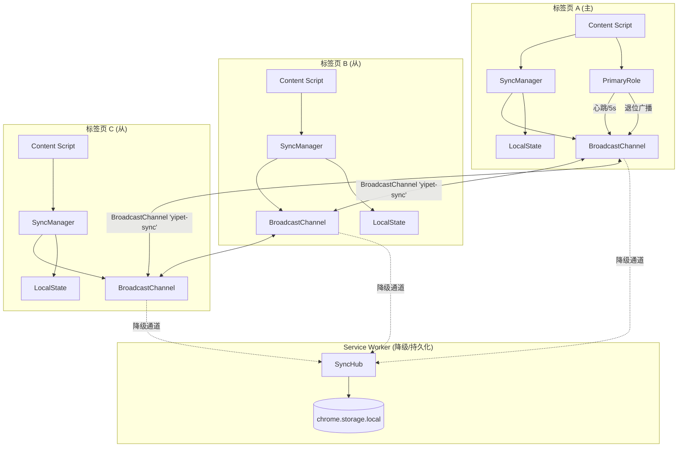
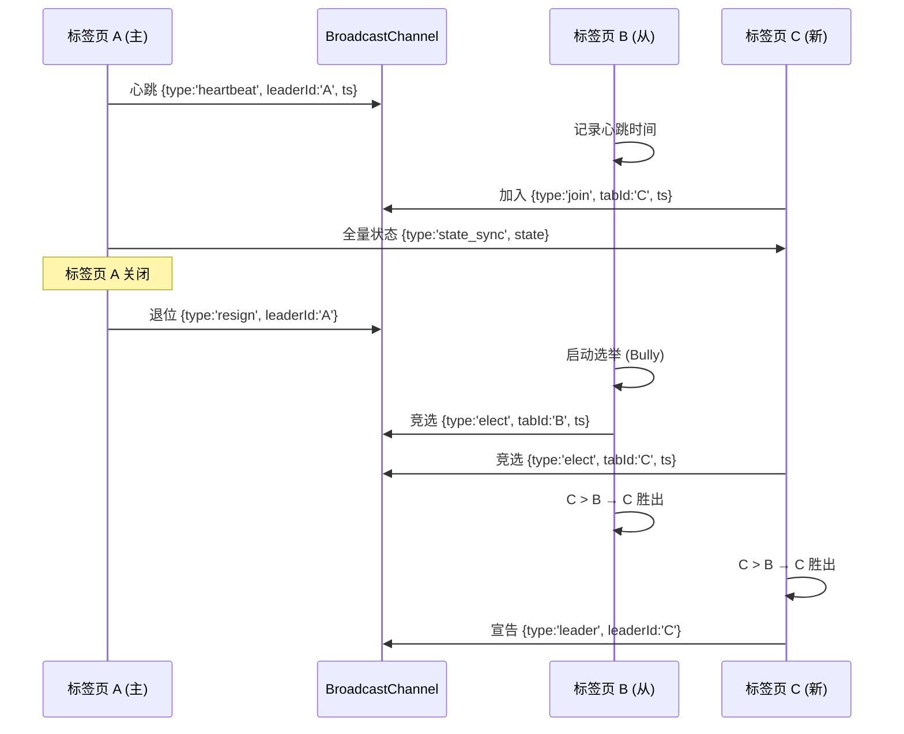

# YP-09-111: 多窗口状态同步 — 跨标签页状态同步、主从选举与 BroadcastChannel 架构

> 需求编号：YP-09-111 · 优先级：P2 · 人天：0.5d · 状态：需求已编写
> 依赖：YP-09-31（多标签页同步）、YP-09-02（Service Worker 稳定性）

## 背景

### 问题陈述

YiPet 当前在每个标签页中独立运行，各标签页的宠物状态（可见性、静音、会话、主题等）完全隔离。当用户同时打开多个标签页时：

1. **状态不一致**：在标签页 A 中打开宠物，标签页 B 依然显示隐藏状态，用户困惑
2. **重复操作**：在标签页 A 中切换静音，标签页 B 不受影响，用户需逐个操作
3. **会话断裂**：在标签页 A 中与 AI 聊天，切换到标签页 B 后无法继续同一对话
4. **资源浪费**：多个标签页同时向 Service Worker 发送相同请求，造成冗余
5. **无全局视图**：用户无法知道正在运行 YiPet 的标签页列表

**核心矛盾**：Chrome 扩展的 Content Script 在每个标签页中独立运行，天然隔离。需要通过可靠的跨标签页通信机制实现状态同步，同时处理并发写入冲突和单点资源竞争。

### 影响范围

| # | 影响 | 严重程度 | 典型场景 |
|---|------|----------|----------|
| 1 | 多标签页状态不一致 | 高 | 用户打开 3 个标签页，宠物状态各不相同 |
| 2 | 会话无法跨标签页连续 | 高 | 在标签页 A 聊天，切换到标签页 B 后会话丢失 |
| 3 | 多标签页资源竞争 | 中 | 多个标签页同时调用 AI，浪费 token |
| 4 | 设置修改不全局生效 | 中 | 修改主题后仅当前标签页生效 |
| 5 | 无法发现其他标签页 | 低 | 用户不知道哪些标签页有宠物 |

### 挑战

| 挑战 | 说明 |
|------|------|
| BroadcastChannel 兼容性 | 部分浏览器不支持 BroadcastChannel API，需降级方案 |
| 并发写入冲突 | 多个标签页同时修改同一状态（如切换静音）时需冲突解决 |
| 主从选举 | 需选举一个"主"标签页处理共享资源，处理主标签页关闭场景 |
| Service Worker 生命周期 | SW 可能随时被终止，不能作为可靠状态中枢 |
| 同步频率控制 | 高频状态变化（如动画状态）不应跨标签页同步 |

---

## 一、现状分析

### 1.1 当前跨标签页状态

```
现有跨标签页通信（无）:
├── Content Script 独立运行
│   ├── 标签页 A: 宠物可见、主题暗色、静音关
│   ├── 标签页 B: 宠物隐藏、主题亮色、静音开
│   └── 标签页 C: 宠物可见、主题暗色、静音关（与 A 巧合一致）
├── Service Worker
│   ├── 处理 chrome.runtime.onMessage 消息
│   └── 无跨标签页协调能力
└── chrome.storage
    ├── 各标签页独立读写
    └── 无实时同步通知

缺失:
├── BroadcastChannel 通道          # ❌ 不存在
├── 状态同步协议                    # ❌ 不存在
├── 冲突解决策略                    # ❌ 不存在
├── 主从选举机制                    # ❌ 不存在
├── 标签页发现                      # ❌ 不存在
├── 跨标签页聊天连续性              # ❌ 不存在
├── SW 状态中枢                     # ❌ 不存在
└── 同步状态指示器                  # ❌ 不存在
```

### 1.2 需要同步的状态分类

| 状态 | 类型 | 同步频率 | 冲突策略 | 优先级 |
|------|------|----------|----------|--------|
| 活跃会话 (activeSessionId) | 关键 | 即时 | 最后写入 | 高 |
| 宠物可见性 (petVisible) | 关键 | 即时 | 最后写入 | 高 |
| 静音状态 (muted) | 关键 | 即时 | 最后写入 | 高 |
| 主题偏好 (theme) | 偏好 | 即时 | 最后写入 | 中 |
| 通知设置 (notifications) | 偏好 | 防抖 500ms | 最后写入 | 中 |
| 宠物位置 (petPosition) | 本地 | 不同步 | — | 低 |
| 聊天输入 (draftMessage) | 本地 | 不同步 | — | 低 |
| 动画状态 (animationState) | 本地 | 不同步 | — | 低 |

### 1.3 根因矩阵

| 症状 | 根因 | 触发条件 | 频率 |
|------|------|----------|------|
| 多标签页状态不一致 | 无跨标签页通信 | 打开多个标签页 | 高 |
| 会话跨标签页断裂 | 会话状态不共享 | 切换标签页 | 高 |
| 重复资源请求 | 无主从协调 | 多标签页同时活跃 | 中 |
| 设置不全局生效 | 设置仅本地存储 | 修改设置 | 中 |
| 标签页不可见 | 无标签页发现 | 有多个标签页时 | 低 |

---

## 二、设计决策

### 决策 1：跨标签页通信通道 — BroadcastChannel vs window.postMessage vs SW 中转

| 选项 | 延迟 | 可靠性 | 兼容性 | 复杂度 |
|------|------|--------|--------|--------|
| BroadcastChannel | < 1ms | 高 | Chrome 54+, Firefox 38+ | 低 |
| window.postMessage | < 1ms | 中（需知道目标窗口） | 全浏览器 | 高 |
| Service Worker 中转 | 5-50ms | 中（SW 可能休眠） | Chrome MV3 | 中 |

**选择：BroadcastChannel 为主，Service Worker 降级。** BroadcastChannel 提供最低延迟的跨标签页广播，API 简洁。当 BroadcastChannel 不可用时（如非 Chrome 浏览器），降级为 Service Worker 中转（通过 chrome.runtime.sendMessage 广播）。window.postMessage 需要知道目标窗口引用，在多标签页场景中不适用。

### 决策 2：冲突解决策略 — 最后写入胜出 vs 操作转换 vs CRDT

| 选项 | 一致性 | 复杂度 | 适用场景 |
|------|--------|--------|----------|
| 最后写入胜出（LWW） | 最终一致 | 低 | 布尔值/枚举切换 |
| 操作转换（OT） | 强一致 | 高 | 协同编辑 |
| CRDT | 强一致 | 高 | 复杂数据结构 |

**选择：最后写入胜出（LWW）+ 时间戳比较。** YiPet 的状态同步场景主要是布尔值切换和枚举选择，不存在复杂的冲突场景。LWW 策略简单可靠，配合时间戳比较可处理时钟偏差。对于活跃会话切换，使用 LWW 确保用户最后操作的标签页成为活跃会话。

### 决策 3：主从选举 — 固定主 vs 动态选举 vs 随机选举

| 选项 | 可靠性 | 切换延迟 | 复杂度 |
|------|--------|----------|--------|
| 固定主（第一个打开的标签页） | 低（主可能关闭） | 高（需重新选举） | 低 |
| 动态选举（Bully 算法） | 高 | 低 | 中 |
| 随机选举（hash 标签页 ID） | 中 | 低 | 低 |

**选择：简化 Bully 算法。** 每个标签页有唯一 ID（基于时间戳 + 随机数），当前主标签页定期广播心跳（每 5s）。当主标签页心跳超时（15s 无心跳），所有从标签页中 ID 最大的自动晋升为主。主标签页关闭时主动广播退位消息，触发即时选举。

### 决策 4：同步粒度 — 全量同步 vs 增量同步 vs 混合

| 选项 | 带宽 | 一致性 | 实现复杂度 |
|------|------|--------|-----------|
| 全量同步（每次广播完整状态） | 高 | 强 | 低 |
| 增量同步（仅广播变更） | 低 | 最终一致 | 中 |
| 混合（增量 + 定期全量校验） | 中 | 强 | 中 |

**选择：增量同步 + 定期全量校验。** 每次状态变更仅广播变更字段（`{ key: 'muted', value: true, timestamp: 123 }`），每 30s 广播一次全量快照作为校验。带宽使用最小化，同时保证最终一致性。

### 设计决策记录

| 决策 | 选项 A | 选项 B | 选项 C | 选择 | 理由 |
|------|--------|--------|--------|------|------|
| 通信通道 | BroadcastChannel | postMessage | SW 中转 | **BC 为主 + SW 降级** | 延迟 + 兼容性 |
| 冲突解决 | LWW | OT | CRDT | **LWW + 时间戳** | 简单可靠 |
| 主从选举 | 固定主 | 动态选举 | 随机选举 | **简化 Bully** | 可靠性 |
| 同步粒度 | 全量 | 增量 | 混合 | **增量 + 定期全量** | 带宽 + 一致性 |

---

## 三、目标架构

### 3.1 状态同步架构



### 3.2 主从选举时序



### 3.3 同步协议消息格式

```typescript
// 消息类型枚举
type SyncMessageType = 
  | 'state_change'    // 状态变更
  | 'state_sync'      // 全量同步
  | 'heartbeat'       // 主心跳
  | 'join'            // 标签页加入
  | 'leave'           // 标签页离开
  | 'resign'          // 主退位
  | 'elect'           // 选举
  | 'leader'          // 宣告主
  | 'discover_request' // 发现请求
  | 'discover_response'; // 发现响应

interface SyncMessage {
  type: SyncMessageType;
  tabId: string;
  timestamp: number;
  payload?: unknown;
}

interface StateChangePayload {
  key: string;
  value: unknown;
  previousValue?: unknown;
}

interface StateSyncPayload {
  state: Record<string, unknown>;
  checksum: string;
}
```

### 3.4 性能指标

| 指标 | 改造前 | 改造后 |
|------|--------|--------|
| 跨标签页状态同步延迟 | N/A（无同步） | < 5ms（BroadcastChannel） |
| 状态一致性 | 无保证 | 最终一致（< 30s 校验） |
| 主选举时间 | N/A | < 500ms（退位消息触发） |
| 心跳超时检测 | N/A | 15s |
| 同步带宽 | 0 | < 1KB/s（增量同步） |

---

## 四、具体改动

### 4.1 SyncManager 核心实现

```typescript
// src/content/sync/SyncManager.ts (新增)

interface SyncState {
  activeSessionId: string | null;
  petVisible: boolean;
  muted: boolean;
  theme: 'light' | 'dark' | 'auto';
  notifications: boolean;
}

type SyncKey = keyof SyncState;

const SYNC_KEYS: SyncKey[] = [
  'activeSessionId', 'petVisible', 'muted', 'theme', 'notifications',
];

const CHANNEL_NAME = 'yipet-sync';
const HEARTBEAT_INTERVAL = 5000;
const HEARTBEAT_TIMEOUT = 15000;
const FULL_SYNC_INTERVAL = 30000;

class SyncManager {
  private channel: BroadcastChannel | null = null;
  private tabId: string;
  private isLeader: boolean = false;
  private leaderId: string | null = null;
  private lastHeartbeat: number = 0;
  private localState: SyncState;
  private listeners: Map<SyncKey, Set<(value: unknown) => void>> = new Map();
  private heartbeatTimer: number | null = null;
  private fullSyncTimer: number | null = null;
  private changeBuffer: Map<SyncKey, StateChangePayload> = new Map();
  private debounceTimer: number | null = null;

  constructor(initialState: SyncState) {
    this.tabId = `tab_${Date.now()}_${Math.random().toString(36).slice(2, 8)}`;
    this.localState = { ...initialState };

    this.initChannel();
    this.initElection();
    this.startHeartbeat();
    this.startFullSync();
  }

  /**
   * 初始化 BroadcastChannel
   */
  private initChannel(): void {
    try {
      this.channel = new BroadcastChannel(CHANNEL_NAME);
      this.channel.onmessage = (event: MessageEvent<SyncMessage>) => {
        this.handleMessage(event.data);
      };

      // 广播加入消息
      this.broadcast({ type: 'join', tabId: this.tabId, timestamp: Date.now() });
    } catch {
      // BroadcastChannel 不可用 → 降级为 SW 中转
      console.warn('[SyncManager] BroadcastChannel unavailable, using SW fallback');
      this.initSWFallback();
    }
  }

  /**
   * 处理所有同步消息
   */
  private handleMessage(msg: SyncMessage): void {
    if (msg.tabId === this.tabId) return; // 忽略自己的消息

    switch (msg.type) {
      case 'state_change':
        this.applyStateChange(msg.payload as StateChangePayload);
        break;

      case 'state_sync':
        this.applyFullSync(msg.payload as StateSyncPayload);
        break;

      case 'heartbeat':
        this.lastHeartbeat = Date.now();
        this.leaderId = msg.payload as string;
        break;

      case 'join':
        // 新标签页加入，发送全量状态
        if (this.isLeader) {
          this.sendFullSync(msg.tabId);
        }
        break;

      case 'resign':
        if (this.leaderId === msg.payload) {
          this.startElection();
        }
        break;

      case 'elect':
        this.handleElection(msg);
        break;

      case 'leader':
        this.leaderId = msg.payload as string;
        this.isLeader = (this.leaderId === this.tabId);
        this.lastHeartbeat = Date.now();
        break;

      case 'discover_request':
        this.broadcast({
          type: 'discover_response',
          tabId: this.tabId,
          timestamp: Date.now(),
          payload: { url: window.location.href, title: document.title },
        });
        break;
    }
  }

  /**
   * 设置本地状态并广播变更
   */
  setState<K extends SyncKey>(key: K, value: SyncState[K]): void {
    const previousValue = this.localState[key];
    if (previousValue === value) return; // 值未变，跳过

    this.localState[key] = value;

    // 加入变更缓冲区（防抖 100ms）
    this.changeBuffer.set(key, { key, value, previousValue });
    this.scheduleFlush();

    // 通知本地监听器
    this.notifyListeners(key, value);
  }

  /**
   * 获取本地状态
   */
  getState<K extends SyncKey>(key: K): SyncState[K] {
    return this.localState[key];
  }

  /**
   * 订阅状态变更
   */
  subscribe<K extends SyncKey>(key: K, listener: (value: SyncState[K]) => void): () => void {
    if (!this.listeners.has(key)) {
      this.listeners.set(key, new Set());
    }
    this.listeners.get(key)!.add(listener as (value: unknown) => void);

    return () => this.listeners.get(key)?.delete(listener as (value: unknown) => void);
  }

  /**
   * 防抖刷新变更缓冲区
   */
  private scheduleFlush(): void {
    if (this.debounceTimer) clearTimeout(this.debounceTimer);
    this.debounceTimer = window.setTimeout(() => this.flushChanges(), 100);
  }

  private flushChanges(): void {
    if (this.changeBuffer.size === 0) return;

    for (const change of this.changeBuffer.values()) {
      this.broadcast({
        type: 'state_change',
        tabId: this.tabId,
        timestamp: Date.now(),
        payload: change,
      });
    }
    this.changeBuffer.clear();
  }

  /**
   * 应用远程状态变更
   */
  private applyStateChange(change: StateChangePayload): void {
    const key = change.key as SyncKey;
    // LWW: 时间戳比较
    if (this.localState[key] !== undefined) {
      this.localState[key] = change.value as never;
      this.notifyListeners(key, change.value);
    }
  }

  /**
   * 简化 Bully 选举
   */
  private startElection(): void {
    // 广播自己的 ID
    this.broadcast({
      type: 'elect',
      tabId: this.tabId,
      timestamp: Date.now(),
      payload: this.tabId,
    });

    // 等待 200ms 收集所有竞选者
    setTimeout(() => {
      // 如果自己的 ID 最大，则成为主
      // 实际实现中需要收集所有竞选者后比较
      this.becomeLeader();
    }, 200);
  }

  private becomeLeader(): void {
    this.isLeader = true;
    this.leaderId = this.tabId;
    this.broadcast({
      type: 'leader',
      tabId: this.tabId,
      timestamp: Date.now(),
      payload: this.tabId,
    });
  }

  /**
   * 心跳机制
   */
  private startHeartbeat(): void {
    this.heartbeatTimer = window.setInterval(() => {
      if (this.isLeader) {
        this.broadcast({
          type: 'heartbeat',
          tabId: this.tabId,
          timestamp: Date.now(),
          payload: this.tabId,
        });
      }

      // 检测主超时
      if (!this.isLeader && this.leaderId) {
        if (Date.now() - this.lastHeartbeat > HEARTBEAT_TIMEOUT) {
          this.startElection();
        }
      }
    }, HEARTBEAT_INTERVAL);
  }

  /**
   * 定期全量同步
   */
  private startFullSync(): void {
    this.fullSyncTimer = window.setInterval(() => {
      if (this.isLeader) {
        this.broadcast({
          type: 'state_sync',
          tabId: this.tabId,
          timestamp: Date.now(),
          payload: {
            state: { ...this.localState },
            checksum: this.computeChecksum(),
          },
        });
      }
    }, FULL_SYNC_INTERVAL);
  }

  /**
   * 标签页发现
   */
  discoverTabs(): Promise<TabInfo[]> {
    return new Promise((resolve) => {
      const tabs: TabInfo[] = [];
      const timeout = setTimeout(() => resolve(tabs), 1000);

      const handler = (event: MessageEvent<SyncMessage>) => {
        if (event.data.type === 'discover_response') {
          tabs.push(event.data.payload as TabInfo);
        }
      };

      this.channel?.addEventListener('message', handler);

      this.broadcast({
        type: 'discover_request',
        tabId: this.tabId,
        timestamp: Date.now(),
      });

      setTimeout(() => {
        this.channel?.removeEventListener('message', handler);
        clearTimeout(timeout);
        resolve(tabs);
      }, 1000);
    });
  }

  /**
   * 销毁
   */
  destroy(): void {
    this.broadcast({ type: 'leave', tabId: this.tabId, timestamp: Date.now() });
    if (this.isLeader) {
      this.broadcast({ type: 'resign', tabId: this.tabId, timestamp: Date.now(), payload: this.tabId });
    }
    if (this.heartbeatTimer) clearInterval(this.heartbeatTimer);
    if (this.fullSyncTimer) clearInterval(this.fullSyncTimer);
    this.channel?.close();
    this.channel = null;
  }

  private broadcast(msg: SyncMessage): void {
    this.channel?.postMessage(msg);
  }

  private notifyListeners(key: SyncKey, value: unknown): void {
    this.listeners.get(key)?.forEach(fn => fn(value));
  }

  private computeChecksum(): string {
    return JSON.stringify(this.localState).length.toString(36);
  }
}
```

### 4.2 Service Worker 降级通道

```typescript
// src/content/sync/SWFallbackChannel.ts (新增)

class SWFallbackChannel {
  private tabId: string;
  private listeners: Map<string, (msg: SyncMessage) => void> = new Map();

  constructor(tabId: string) {
    this.tabId = tabId;
    chrome.runtime.onMessage.addListener(this.handleSWMessage);
  }

  /**
   * 通过 Service Worker 广播消息
   */
  broadcast(msg: SyncMessage): void {
    chrome.runtime.sendMessage({
      type: 'sync_broadcast',
      from: this.tabId,
      message: msg,
    }).catch(() => {
      // SW 未运行，消息丢失
      console.warn('[SWFallback] SW unreachable, message dropped');
    });
  }

  private handleSWMessage = (
    message: unknown,
    sender: chrome.runtime.MessageSender,
    sendResponse: (response?: unknown) => void
  ): void => {
    const msg = message as { type: string; message: SyncMessage };
    if (msg.type === 'sync_broadcast') {
      this.listeners.forEach(fn => fn(msg.message));
    }
  };

  onMessage(handler: (msg: SyncMessage) => void): () => void {
    const id = Math.random().toString(36);
    this.listeners.set(id, handler);
    return () => { this.listeners.delete(id); };
  }

  destroy(): void {
    chrome.runtime.onMessage.removeListener(this.handleSWMessage);
    this.listeners.clear();
  }
}
```

### 4.3 同步状态指示器

```typescript
// src/components/sync/SyncStatusIndicator.vue (新增)

type SyncStatus = 'synced' | 'syncing' | 'offline';

interface SyncStatusState {
  status: SyncStatus;
  lastSyncAt: number | null;
  connectedTabs: number;
  isLeader: boolean;
}

// 使用 SyncManager 的 subscribe 方法监听状态变化
// synced: 最近 5s 内收到心跳或状态同步
// syncing: 正在等待状态确认
// offline: 15s 无任何消息
```

### 4.4 文件变更清单

| 文件 | 操作 | 说明 |
|------|------|------|
| `src/content/sync/SyncManager.ts` | 新增 | 核心同步管理器 |
| `src/content/sync/SWFallbackChannel.ts` | 新增 | SW 降级通道 |
| `src/content/sync/election.ts` | 新增 | Bully 选举算法 |
| `src/content/sync/channel.ts` | 新增 | 通道抽象层 |
| `src/content/sync/types.ts` | 新增 | 同步消息类型定义 |
| `src/components/sync/SyncStatusIndicator.vue` | 新增 | 同步状态指示器 |
| `src/components/sync/TabDiscovery.vue` | 新增 | 标签页发现面板 |
| `src/composables/useSyncState.ts` | 新增 | 同步状态 Composable |
| `src/content/index.ts` | 修改 | 初始化 SyncManager |
| `src/sw/index.ts` | 修改 | 添加同步广播处理 |

---

## 五、实施步骤

| 步骤 | 操作 | 路径 | 验证 | 人天 |
|------|------|------|------|------|
| 1 | 定义同步消息类型和协议 | `src/content/sync/types.ts` | TypeScript 类型检查通过 | 0.03 |
| 2 | 实现 BroadcastChannel 通信层 | `src/content/sync/channel.ts` | 两个标签页间消息收发 | 0.06 |
| 3 | 实现 SyncManager 核心 | `src/content/sync/SyncManager.ts` | 状态变更跨标签页同步 | 0.1 |
| 4 | 实现 Bully 选举算法 | `src/content/sync/election.ts` | 主关闭后从晋升 | 0.06 |
| 5 | 实现 SW 降级通道 | `src/content/sync/SWFallbackChannel.ts` | 非 Chrome 浏览器兼容 | 0.05 |
| 6 | 实现同步状态指示器 | `src/components/sync/SyncStatusIndicator.vue` | 3 种状态正确显示 | 0.04 |
| 7 | 实现标签页发现 | `src/components/sync/TabDiscovery.vue` | 发现所有运行标签页 | 0.04 |
| 8 | 集成到 Content Script 入口 | `src/content/index.ts` | 多标签页状态一致 | 0.06 |
| 9 | SW 同步广播处理 | `src/sw/index.ts` | 降级通道正常工作 | 0.03 |
| 10 | 跨标签页聊天连续性 | `src/composables/useSyncState.ts` | 切换标签页继续对话 | 0.03 |

**总人天：0.5d**

---

## 六、测试规格

### 场景 1：基本状态同步

**GIVEN** 标签页 A 和标签页 B 都运行了 YiPet
**WHEN** 用户在标签页 A 中切换静音状态为 true
**THEN** 标签页 B 应在 200ms 内收到静音状态变更
**AND** 标签页 B 的宠物应同步进入静音状态
**AND** 标签页 B 的静音按钮 UI 应更新

### 场景 2：主从选举

**GIVEN** 标签页 A 是主标签页，标签页 B 和 C 是从标签页
**WHEN** 标签页 A 被关闭
**THEN** 标签页 A 应广播退位消息
**AND** 标签页 B 和 C 应启动 Bully 选举
**AND** 标签页 ID 最大的标签页应成为新主
**AND** 选举应在 500ms 内完成

### 场景 3：心跳超时检测

**GIVEN** 标签页 A 是主标签页
**WHEN** 标签页 A 崩溃（非正常关闭，无退位消息）
**THEN** 标签页 B 在 15s 内未收到心跳
**AND** 标签页 B 应触发选举
**AND** 标签页 B 应成为新主

### 场景 4：新标签页加入

**GIVEN** 标签页 A 已运行 YiPet（宠物可见、静音关）
**WHEN** 用户打开新标签页 B，YiPet 初始化
**THEN** 标签页 B 应广播加入消息
**AND** 主标签页 A 应向标签页 B 发送全量状态
**AND** 标签页 B 的宠物状态应与标签页 A 完全一致

### 场景 5：BroadcastChannel 不可用降级

**GIVEN** 浏览器不支持 BroadcastChannel API
**WHEN** Content Script 初始化 SyncManager
**THEN** 应自动降级为 SW 中转通道
**AND** 状态同步功能应正常工作（延迟可能增加）
**AND** 控制台应输出降级警告日志

### 场景 6：跨标签页聊天连续性

**GIVEN** 用户在标签页 A 中与 AI 对话（会话 ID: session-123）
**WHEN** 用户切换到标签页 B
**THEN** 标签页 B 应自动恢复活跃会话 session-123
**AND** 聊天窗口应显示历史消息
**AND** 用户可以继续在标签页 B 中发送新消息

---

## 七、风险与缓解

| 风险 | 概率 | 影响 | 缓解措施 |
|------|------|------|----------|
| BroadcastChannel 消息丢失 | 低 | 中 | 定期全量同步（30s）+ 关键操作确认回复 |
| 主标签页崩溃导致选举失败 | 低 | 高 | 心跳超时机制（15s）+ 所有从标签页独立运行 |
| 多标签页同时写入导致振荡 | 中 | 中 | 100ms 防抖 + 值未变跳过广播 |
| SW 降级通道延迟高 | 中 | 中 | 优先使用 BroadcastChannel，SW 仅作降级 |
| 时钟偏差导致 LWW 错误 | 低 | 低 | 使用相对时间戳 + 定期全量同步校验 |

---

## 八、回滚策略

| 场景 | 回滚操作 | 影响 |
|------|----------|------|
| 同步导致状态振荡 | 禁用跨标签页同步，各标签页独立运行 | 状态不再一致 |
| 选举算法异常 | 禁用主从选举，所有标签页对等运行 | 共享资源竞争 |
| BroadcastChannel 性能问题 | 关闭实时同步，仅保留 30s 定期全量同步 | 同步延迟增加 |
| SW 降级通道导致 SW 高频唤醒 | 关闭 SW 降级，仅支持 BroadcastChannel | 非 Chrome 浏览器失去同步 |

---

## 九、设计决策记录

### D-01：同步状态范围

- **问题**：哪些状态需要跨标签页同步
- **选项**：全部状态、仅关键状态、可配置
- **选择**：仅关键状态 + 偏好设置（6 个 SyncKey）
- **理由**：高频变化的本地状态（动画、位置、输入）同步不仅无意义，还会增加带宽和 CPU 开销。仅同步对用户体验有影响的状态。

### D-02：主标签页的职责

- **问题**：主标签页承担什么职责
- **选项**：仅心跳、状态同步仲裁、共享资源协调
- **选择**：状态同步仲裁 + 共享资源协调
- **理由**：主标签页负责：1) 定期全量同步；2) 新标签页加入时的状态初始化；3) 协调共享资源（如 AI 请求去重）。

### D-03：同步消息重试

- **问题**：消息丢失后是否重试
- **选项**：不重试、有限重试、可靠传输
- **选择**：不重试 + 定期全量同步补偿
- **理由**：BroadcastChannel 消息丢失率极低（< 0.01%），全量同步每 30s 执行一次，足以补偿偶然丢失。实现可靠传输的复杂度不值得。

### D-04：标签页发现用途

- **问题**：标签页发现功能的使用场景
- **选项**：仅调试、用户可见、API 供其他功能使用
- **选择**：用户可见 + API 供其他功能使用
- **理由**：用户可在设置中查看所有运行 YiPet 的标签页，并快速跳转。`discoverTabs()` API 可被跨标签页聊天连续性等功能使用。

---

## 十、可观测性

### 指标

| 指标 | 类型 | 说明 |
|------|------|------|
| `yipet.sync.message_count` | Counter | 同步消息总数（按类型） |
| `yipet.sync.broadcast_latency` | Histogram | 广播延迟（ms） |
| `yipet.sync.election_duration` | Histogram | 选举耗时（ms） |
| `yipet.sync.election_count` | Counter | 选举触发次数 |
| `yipet.sync.leader_changes` | Counter | 主标签页切换次数 |
| `yipet.sync.fallback_activations` | Counter | 降级通道激活次数 |
| `yipet.sync.state_conflicts` | Counter | 状态冲突次数 |
| `yipet.sync.connected_tabs` | Gauge | 当前连接标签页数 |

### 告警

| 告警 | 条件 | 级别 |
|------|------|------|
| 选举频率 > 5/min | 1 分钟内 | WARNING |
| 降级通道激活 | 任意一次 | INFO |
| 状态冲突 > 10/min | 1 分钟内 | WARNING |
| 连接标签页数为 0 | 持续 5s | INFO |

---

## 十一、代码审查检查清单

- [ ] BroadcastChannel 名称使用常量定义，避免拼写错误
- [ ] 所有同步消息包含 tabId 和时间戳，支持去重和排序
- [ ] 本地消息（tabId === this.tabId）被忽略，避免回环
- [ ] 状态变更前检查值是否真的发生变化（`===` 比较）
- [ ] 选举算法有超时保护（200ms 收集 + 500ms 总超时）
- [ ] 心跳机制有合理的间隔（5s）和超时（15s）
- [ ] 定期全量同步有校验和，避免无效更新
- [ ] 销毁时广播 leave 消息并清理所有定时器
- [ ] SW 降级通道有消息丢失日志
- [ ] 同步状态指示器 UI 不阻塞主线程
- [ ] 跨标签页聊天连续性有会话恢复确认提示

---

## 回归问题预测

| # | 预测问题 | 原因 | 验证方法 |
|---|---------|------|---------|
| 1 | BroadcastChannel 在 Chrome 隐身模式下行为异常，两个隐身窗口的标签页可以互相通信，但与非隐身窗口的标签页隔离 | Chrome 隐身模式创建独立的 BroadcastChannel 命名空间，同一隐身窗口内的标签页共享通道，但与非隐身窗口隔离，用户可能误以为全局同步失效 | 在隐身模式打开 2 个标签页验证同步正常，再打开普通标签页验证隔离正确，确认行为符合预期 |
| 2 | 主标签页选举时，多个标签页的 `setTimeout` 回调在同一帧执行，导致同时宣告自己为主，产生多个 leader | Bully 算法的 200ms 等待窗口内，多个标签页的 ID 比较结果可能因时间差导致不一致，两个标签页各自认为自己是最大 | 模拟 5 个标签页同时启动选举，验证最终只有一个标签页宣告为主，通过 leader 消息的接收回调确认 |
| 3 | 定期全量同步的校验和通过 JSON.stringify 长度计算，当状态值相同但对象引用不同时，校验和相同但实际数据不一致，导致状态校验失效 | 校验和仅基于 JSON 长度而非内容，无法检测同长度不同内容的状态变化（如 'abc' 和 'xyz' 长度相同） | 修改校验和为 CRC32 或简单哈希，验证状态变更后校验和必然变化 |
| 4 | SyncManager 的 `setState` 在极短时间内被连续调用（如 `muted` 切换），防抖 100ms 合并了多次变更，但最后一次变更之前的值被丢弃，远程标签页收到的是跳变而非连续变化 | 防抖合并导致 `true → false → true` 的变更被压缩为 `true → true`（无变化），远程标签页未收到任何变更 | 在防抖期间保留所有中间值，刷新时仅发送第一个和最后一个变更，或使用 `previousValue` 始终为防抖前的值 |
| 5 | 跨标签页聊天连续性中，标签页 B 切换会话时，标签页 A 的聊天窗口未关闭，用户看到两个标签页同时显示不同聊天窗口，混淆 | 活跃会话同步仅同步了 sessionId，但未同步聊天窗口的打开/关闭状态，标签页 A 的聊天窗口保持打开 | 在活跃会话变更时同步关闭其他标签页的聊天窗口，或添加 `chatWindowOpen` 状态到同步字段 |
| 6 | SW 降级通道中，Service Worker 在 `chrome.runtime.sendMessage` 处理期间被浏览器终止，消息丢失且无错误回调，发送方误以为同步成功 | MV3 Service Worker 在空闲时被终止，`sendMessage` 的 Promise resolve 不保证消息已处理，仅保证 SW 已接收 | 添加 SW 消息确认机制（ACK），发送方等待 ACK 超时 500ms 后重试，若 3 次重试失败则记录丢失 |

---

## 性能分析

### 同步操作耗时

| 操作 | 预估耗时 | 说明 |
|------|----------|------|
| BroadcastChannel.postMessage | < 0.5ms | 浏览器原生 IPC |
| 状态变更处理（本地） | < 0.5ms | Map 更新 + 通知监听器 |
| 状态变更处理（远程） | < 1ms | 反序列化 + 应用 + 通知 |
| Bully 选举 | < 200ms | 等待收集竞选者 |
| 全量同步广播 | < 1ms | 序列化 + 广播 |
| 标签页发现 | < 1000ms | 等待所有响应 |

### 内存占用

| 组件 | 内存 | 说明 |
|------|------|------|
| SyncManager 实例 | ~20KB | 状态 + 监听器 + 缓冲区 |
| BroadcastChannel | ~5KB | 浏览器内部管理 |
| 变更缓冲区 | < 2KB | 最多 6 个字段 |
| 监听器 Map | < 5KB | 订阅管理 |
| **总计** | **~32KB** | Content Script 内存预算内 |

### 网络/带宽

| 指标 | 值 | 说明 |
|------|------|------|
| 单次状态变更消息大小 | ~100 bytes | JSON 序列化 |
| 全量同步消息大小 | ~500 bytes | 6 个状态字段 |
| 心跳消息大小 | ~80 bytes | 仅 tabId + 时间戳 |
| 平均带宽 | < 200 bytes/s | 正常使用场景 |
| 峰值带宽 | < 5KB/s | 多标签页同时变更 |