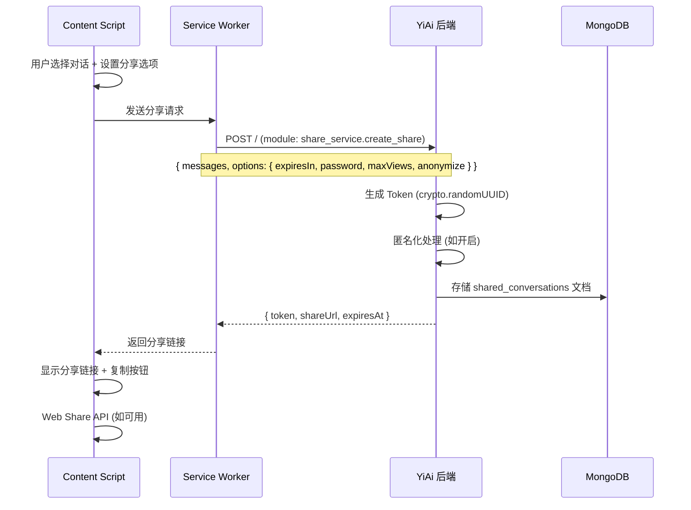
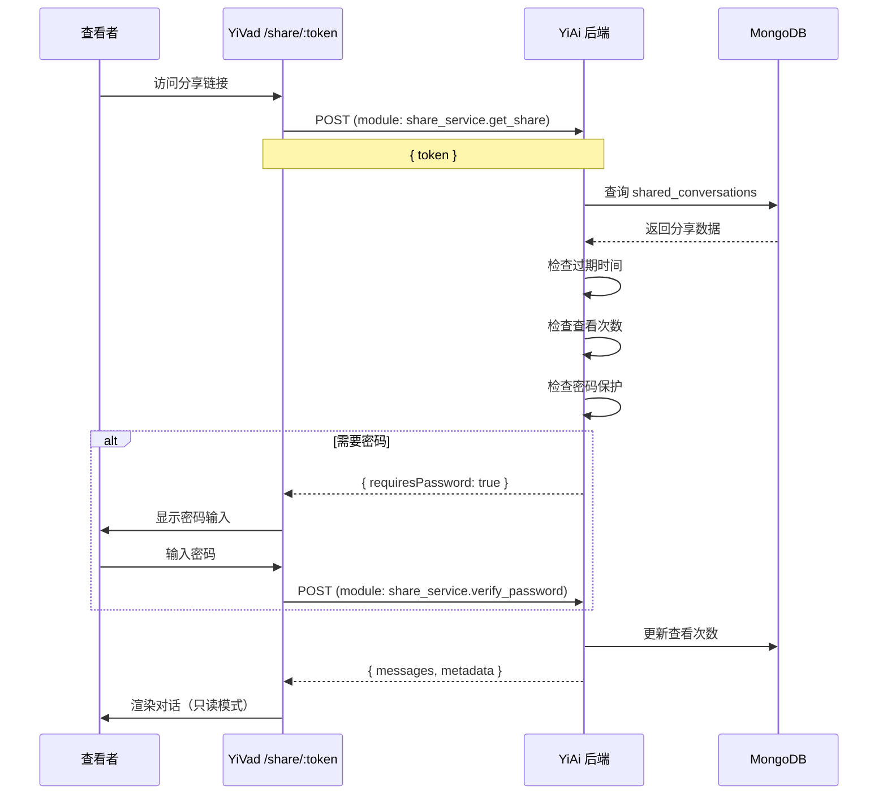

# YP-09-112: 对话分享与导出图片 — 分享链接生成、对话截图导出与访问控制

> 需求编号：YP-09-112 · 优先级：P2 · 人天：0.5d · 状态：需求已编写
> 依赖：YP-09-98（会话导出与迁移）、YP-09-18（聊天消息导出）

## 背景

### 问题陈述

YiPet 当前不支持对话分享和可视化导出。用户与 AI 的有价值对话被锁定在浏览器中，无法分享给他人或将精彩对话保存为图片：

1. **无法分享对话**：用户想将有趣的 AI 对话分享给朋友或同事，只能手动截图或复制粘贴文本
2. **导出格式单一**：当前仅支持纯文本/Markdown 导出，无法生成美观的图片格式
3. **无访问控制**：即使将来支持分享链接，也无法控制链接的有效期和访问权限
4. **隐私泄露风险**：分享对话时可能无意中暴露用户名、时间戳等敏感信息
5. **无法追踪分享**：分享后无法知道链接是否被查看、被谁查看

**核心矛盾**：对话分享需要在"便利性"（一键生成分享链接）和"隐私安全"（访问控制、过期时间、匿名化）之间取得平衡。图片导出需要在"美观"（自定义主题）和"真实性"（不篡改对话内容）之间取得平衡。

### 影响范围

| # | 影响 | 严重程度 | 典型场景 |
|---|------|----------|----------|
| 1 | 无法分享精彩对话 | 高 | 用户想分享 AI 的有趣回复给朋友 |
| 2 | 手动截图质量差 | 中 | 长对话截图需要多次拼接 |
| 3 | 分享无隐私保护 | 高 | 分享链接可能被任何人访问 |
| 4 | 无法追踪分享效果 | 低 | 不知道分享链接是否被查看 |
| 5 | 导出格式不美观 | 中 | 纯文本导出缺少视觉吸引力 |

### 挑战

| 挑战 | 说明 |
|------|------|
| 分享链接生成 | 需要后端支持生成唯一分享 URL 和 Token，并存储分享数据 |
| 图片导出渲染 | 长对话的截图生成需要虚拟渲染，Canvas 尺寸有限制 |
| 水印嵌入 | 需要在图片中嵌入不可轻易去除的水印 |
| 访问控制 | 密码保护、过期时间、查看次数限制需在后端实现 |
| 匿名化处理 | 需要识别并移除对话中的敏感信息 |

---

## 一、现状分析

### 1.1 当前对话分享能力

```
现有分享/导出（无）:
├── 导出
│   └── 无对话导出功能
├── 分享
│   └── 无分享功能
└── 截图
    └── 依赖用户手动截图（浏览器原生或第三方工具）

缺失:
├── 分享链接生成              # ❌ 不存在
├── 分享过期设置              # ❌ 不存在
├── 对话图片导出              # ❌ 不存在
├── 选择性导出                # ❌ 不存在
├── 匿名化选项                # ❌ 不存在
├── 水印功能                  # ❌ 不存在
├── Web Share API 集成        # ❌ 不存在
├── 访问控制                  # ❌ 不存在
└── 分享追踪                  # ❌ 不存在
```

### 1.2 对话分享数据流

```
当前流程（无分享）:
用户 → 复制文本 → 粘贴到聊天工具 → 手动标注来源

目标流程:
┌──────────────────────────────────────────────────┐
│  用户选择对话                                      │
│  ├── 分享链接                                     │
│  │   ├── 设置过期时间 (1h/1d/7d/永久)              │
│  │   ├── 设置密码保护 (可选)                       │
│  │   ├── 设置查看次数限制 (可选)                    │
│  │   ├── 匿名化处理 (可选)                         │
│  │   └── 生成 Token → 后端存储 → 返回分享 URL      │
│  ├── 导出图片                                     │
│  │   ├── 选择消息范围                              │
│  │   ├── 选择主题/背景                             │
│  │   ├── 匿名化处理 (可选)                         │
│  │   ├── 添加水印 (可选)                           │
│  │   └── Canvas 渲染 → 导出 PNG/JPEG               │
│  └── 分享到社交平台                                │
│      └── Web Share API → 系统分享菜单               │
└──────────────────────────────────────────────────┘
```

### 1.3 根因矩阵

| 症状 | 根因 | 触发条件 | 频率 |
|------|------|----------|------|
| 无法分享对话 | 无分享链接生成 | 用户想分享时 | 高 |
| 手动截图体验差 | 无图片导出功能 | 长对话截图 | 中 |
| 隐私泄露风险 | 无匿名化选项 | 分享包含敏感信息 | 中 |
| 分享不可控 | 无访问控制 | 分享后无法撤销 | 中 |
| 分享无反馈 | 无查看追踪 | 分享后无数据 | 低 |

---

## 二、设计决策

### 决策 1：分享链接存储 — 后端生成 vs 前端生成 vs 混合

| 选项 | 安全性 | 可控性 | 实现复杂度 |
|------|--------|--------|-----------|
| 后端生成（YiAi 存储分享数据） | 高 | 高（可撤销/过期） | 中 |
| 前端生成（Base64 编码对话数据在 URL 中） | 低 | 低（无法撤销） | 低 |
| 混合（后端存储 + 前端 Token） | 高 | 高 | 高 |

**选择：后端生成。** 在 YiAi 后端新增 `shared_conversations` 集合，存储分享的对话数据、Token、过期时间、密码和访问计数。前端仅负责发起分享请求和展示。后端生成方案确保分享链接可撤销、可追踪，且不将对话数据暴露在 URL 中。

### 决策 2：图片导出实现 — html2canvas vs 自建 Canvas 渲染 vs DOM 截图

| 选项 | 质量 | 长对话支持 | Shadow DOM | 体积 |
|------|------|-----------|------------|------|
| html2canvas | 良好 | 有限（需分段） | 部分支持 | ~30KB |
| 自建 Canvas 渲染 | 优秀 | 完整支持 | 完全可控 | 中等 |
| DOM 截图（Playwright 风格） | 优秀 | 完整支持 | 不支持 | 不适用 |

**选择：自建 Canvas 渲染。** html2canvas 在 Shadow DOM 中存在兼容性问题，且长对话分段拼接复杂。自建 Canvas 渲染完全控制渲染管线：解析消息列表 → 逐条绘制到 Canvas → 导出图片。支持自定义主题、背景、字体和水印。

### 决策 3：水印策略 — 可见水印 vs 不可见水印 vs 混合

| 选项 | 威慑力 | 美观度 | 实现复杂度 |
|------|--------|--------|-----------|
| 可见水印（半透明文字覆盖） | 高 | 低 | 低 |
| 不可见水印（LSB 隐写） | 低 | 高 | 高 |
| 混合（可见底纹 + 隐写追踪码） | 高 | 中 | 中 |

**选择：可见半透明水印。** LSB 隐写在有损压缩（JPEG）后容易丢失，且实现复杂度高。半透明文字水印（用户 ID + 分享时间）在图片底部，威慑力足够且实现简单。用户可选择是否添加水印。

### 决策 4：分享页面渲染 — 服务端渲染 vs 客户端渲染 vs 静态页面

| 选项 | SEO | 性能 | 维护成本 |
|------|------|------|----------|
| 服务端渲染（YiAi 返回 HTML） | 好 | 快 | 中 |
| 客户端渲染（SPA 加载数据） | 差 | 慢 | 低 |
| 静态页面 + 数据注入 | 中 | 快 | 中 |

**选择：客户端渲染（轻量 SPA）。** 在 YiVad 中新增分享查看页面（`/share/:token`），页面加载后通过 API 获取对话数据并渲染。YiPet 生成的分享链接指向 YiVad 的分享页面。这种方案复用 YiVad 现有的 Markdown 渲染和 UI 组件，维护成本低。

### 设计决策记录

| 决策 | 选项 A | 选项 B | 选项 C | 选择 | 理由 |
|------|--------|--------|--------|------|------|
| 分享存储 | 后端生成 | 前端生成 | 混合 | **后端生成** | 安全性 + 可控 |
| 图片导出 | html2canvas | 自建 Canvas | DOM 截图 | **自建 Canvas** | Shadow DOM 兼容 |
| 水印策略 | 可见水印 | 不可见水印 | 混合 | **可见水印** | 实现简单 + 有效 |
| 分享页面 | SSR | CSR | 静态页面 | **CSR (YiVad)** | 复用现有组件 |

---

## 三、目标架构

### 3.1 分享链接生成流程



### 3.2 图片导出渲染管线

```mermaid
graph TD
    A[选择消息范围] --> B[选择主题/背景]
    B --> C[匿名化处理]
    C --> D[准备渲染数据]
    D --> E[计算 Canvas 尺寸]
    E --> F[逐条消息渲染]
    
    subgraph "消息渲染"
        F1[背景填充]
        F2[头像 + 角色标签]
        F3[消息文本/Markdown 渲染]
        F4[时间戳(可选)]
        F5[消息间距]
    end
    
    F --> G[添加水印]
    G --> H[导出 PNG/JPEG]
    H --> I[下载或分享]
```

### 3.3 分享查看页面（YiVad）



### 3.4 性能指标

| 指标 | 改造前 | 改造后 |
|------|--------|--------|
| 分享链接生成时间 | N/A | < 500ms |
| 图片导出（50 条消息） | N/A | < 2s |
| 分享页面加载时间 | N/A | < 1s |
| 图片导出文件大小 | N/A | < 5MB（PNG） |
| 分享链接验证延迟 | N/A | < 200ms |

---

## 四、具体改动

### 4.1 分享链接数据结构

```typescript
// 前端: src/types/share.ts (新增)

interface ShareOptions {
  expiresIn: '1h' | '1d' | '7d' | 'never';
  password?: string;
  maxViews?: number;
  anonymize: boolean;
  watermark: boolean;
  messageIds: string[];  // 选择要分享的消息 ID
}

interface SharedConversation {
  token: string;
  sessionId: string;
  messages: SharedMessage[];
  metadata: {
    title: string;
    createdAt: number;
    expiresAt: number | null;
    maxViews: number | null;
    viewCount: number;
    hasPassword: boolean;
    isExpired: boolean;
    isMaxViewsReached: boolean;
  };
}

interface SharedMessage {
  role: 'user' | 'assistant' | 'system';
  content: string;
  timestamp: number | null;  // 匿名化时为 null
  username: string | null;   // 匿名化时为 null
}
```

### 4.2 后端分享服务

```python
# YiAi: services/share/share_service.py (新增)

import hashlib
import secrets
import time
from datetime import datetime, timedelta
from typing import Optional

class ShareService:
    def __init__(self, repository):
        self.repository = repository

    async def create_share(self, parameters: dict) -> dict:
        """创建分享链接"""
        session_id = parameters.get('session_id')
        messages = parameters.get('messages', [])
        options = parameters.get('options', {})

        # 生成 Token
        token = secrets.token_urlsafe(32)

        # 计算过期时间
        expires_in = options.get('expiresIn', '7d')
        expires_at = self._calculate_expiry(expires_in)

        # 匿名化处理
        if options.get('anonymize', False):
            messages = self._anonymize_messages(messages)

        # 密码哈希
        password_hash = None
        if options.get('password'):
            password_hash = hashlib.sha256(
                options['password'].encode()
            ).hexdigest()

        # 存储到 MongoDB
        doc = {
            'token': token,
            'session_id': session_id,
            'messages': messages,
            'password_hash': password_hash,
            'expires_at': expires_at,
            'max_views': options.get('maxViews'),
            'view_count': 0,
            'created_at': datetime.utcnow(),
            'created_by': parameters.get('user_id'),
            'title': options.get('title', 'Shared Conversation'),
        }

        await self.repository.insert_one('shared_conversations', doc)

        # 构建分享 URL
        share_url = f"{parameters.get('base_url', 'https://yivad.app')}/share/{token}"

        return {
            'token': token,
            'share_url': share_url,
            'expires_at': expires_at.isoformat() if expires_at else None,
        }

    async def get_share(self, parameters: dict) -> dict:
        """获取分享的对话内容"""
        token = parameters.get('token')
        password = parameters.get('password')

        doc = await self.repository.find_one('shared_conversations', {'token': token})
        if not doc:
            return {'error': 'NOT_FOUND', 'message': '分享链接不存在'}

        # 检查过期
        if doc.get('expires_at') and doc['expires_at'] < datetime.utcnow():
            return {'error': 'EXPIRED', 'message': '分享链接已过期'}

        # 检查查看次数
        max_views = doc.get('max_views')
        if max_views and doc['view_count'] >= max_views:
            return {'error': 'MAX_VIEWS', 'message': '已达最大查看次数'}

        # 检查密码
        if doc.get('password_hash'):
            if not password:
                return {'requires_password': True}
            if hashlib.sha256(password.encode()).hexdigest() != doc['password_hash']:
                return {'error': 'WRONG_PASSWORD', 'message': '密码错误'}

        # 更新查看次数
        await self.repository.update_one(
            'shared_conversations',
            {'token': token},
            {'$inc': {'view_count': 1}}
        )

        return {
            'token': token,
            'session_id': doc['session_id'],
            'messages': doc['messages'],
            'metadata': {
                'title': doc.get('title', ''),
                'created_at': doc['created_at'].isoformat(),
                'expires_at': doc['expires_at'].isoformat() if doc.get('expires_at') else None,
                'max_views': doc.get('max_views'),
                'view_count': doc['view_count'] + 1,
                'has_password': bool(doc.get('password_hash')),
            },
        }

    def _calculate_expiry(self, expires_in: str) -> Optional[datetime]:
        if expires_in == 'never':
            return None
        durations = {'1h': timedelta(hours=1), '1d': timedelta(days=1), '7d': timedelta(days=7)}
        return datetime.utcnow() + durations.get(expires_in, timedelta(days=7))

    def _anonymize_messages(self, messages: list) -> list:
        return [
            {
                'role': msg.get('role'),
                'content': msg.get('content'),
                'timestamp': None,
                'username': None,
            }
            for msg in messages
        ]
```

### 4.3 图片导出 Canvas 渲染

```typescript
// src/content/export/ImageExporter.ts (新增)

interface ExportTheme {
  name: string;
  background: string;
  userBubbleColor: string;
  assistantBubbleColor: string;
  textColor: string;
  secondaryTextColor: string;
  fontFamily: string;
  fontSize: number;
}

const EXPORT_THEMES: Record<string, ExportTheme> = {
  light: {
    name: '浅色',
    background: '#FFFFFF',
    userBubbleColor: '#E3F2FD',
    assistantBubbleColor: '#F5F5F5',
    textColor: '#212121',
    secondaryTextColor: '#9E9E9E',
    fontFamily: '-apple-system, BlinkMacSystemFont, sans-serif',
    fontSize: 14,
  },
  dark: {
    name: '深色',
    background: '#1E1E1E',
    userBubbleColor: '#0D47A1',
    assistantBubbleColor: '#333333',
    textColor: '#E0E0E0',
    secondaryTextColor: '#757575',
    fontFamily: '-apple-system, BlinkMacSystemFont, sans-serif',
    fontSize: 14,
  },
  warm: {
    name: '暖色',
    background: '#FFF8E1',
    userBubbleColor: '#FFE0B2',
    assistantBubbleColor: '#FFF3E0',
    textColor: '#3E2723',
    secondaryTextColor: '#8D6E63',
    fontFamily: 'Georgia, serif',
    fontSize: 15,
  },
};

class ImageExporter {
  private canvas: HTMLCanvasElement;
  private ctx: CanvasRenderingContext2D;
  private theme: ExportTheme;
  private padding = 40;
  private bubbleRadius = 12;
  private avatarSize = 36;
  private messageGap = 16;
  private watermark = '';

  constructor(theme: ExportTheme = EXPORT_THEMES.light) {
    this.canvas = document.createElement('canvas');
    this.ctx = this.canvas.getContext('2d')!;
    this.theme = theme;
  }

  /**
   * 导出对话为图片
   */
  async export(
    messages: ExportMessage[],
    options: {
      watermark?: string;
      showTimestamps?: boolean;
      maxWidth?: number;
    } = {}
  ): Promise<Blob> {
    const maxWidth = options.maxWidth || 750;
    this.watermark = options.watermark || '';

    // 计算每行文本的高度
    const lines = this.calculateLines(messages, maxWidth);

    // 计算总高度
    const totalHeight = this.calculateTotalHeight(lines);

    // 设置 Canvas 尺寸
    this.canvas.width = maxWidth + this.padding * 2;
    this.canvas.height = totalHeight + this.padding * 2;

    // 绘制
    this.ctx.fillStyle = this.theme.background;
    this.ctx.fillRect(0, 0, this.canvas.width, this.canvas.height);

    let y = this.padding;
    for (const msg of messages) {
      y = this.drawMessage(msg, y, maxWidth, options.showTimestamps);
    }

    // 绘制水印
    if (this.watermark) {
      this.drawWatermark(totalHeight);
    }

    return new Promise((resolve) => {
      this.canvas.toBlob((blob) => {
        resolve(blob!);
      }, 'image/png');
    });
  }

  /**
   * 绘制单条消息
   */
  private drawMessage(
    msg: ExportMessage,
    startY: number,
    maxWidth: number,
    showTimestamps?: boolean
  ): number {
    const isUser = msg.role === 'user';
    const bubbleWidth = maxWidth * 0.75;
    const bubbleX = isUser
      ? this.padding + maxWidth - bubbleWidth
      : this.padding;

    let y = startY;

    // 角色标签
    if (!showTimestamps) {
      // 匿名化模式：不显示角色
    } else {
      this.ctx.fillStyle = this.theme.secondaryTextColor;
      this.ctx.font = `12px ${this.theme.fontFamily}`;
      const label = isUser ? 'You' : 'AI Assistant';
      this.ctx.fillText(label, bubbleX, y);
      y += 20;
    }

    // 气泡背景
    const bubbleColor = isUser
      ? this.theme.userBubbleColor
      : this.theme.assistantBubbleColor;
    this.ctx.fillStyle = bubbleColor;

    const textLines = this.wrapText(msg.content, bubbleWidth - 20);
    const bubbleHeight = textLines.length * 22 + 20;

    this.roundRect(bubbleX, y, bubbleWidth, bubbleHeight, this.bubbleRadius);
    this.ctx.fill();

    // 文本
    this.ctx.fillStyle = this.theme.textColor;
    this.ctx.font = `${this.theme.fontSize}px ${this.theme.fontFamily}`;
    textLines.forEach((line, i) => {
      this.ctx.fillText(line, bubbleX + 10, y + 20 + i * 22);
    });

    y += bubbleHeight;

    // 时间戳
    if (showTimestamps && msg.timestamp) {
      this.ctx.fillStyle = this.theme.secondaryTextColor;
      this.ctx.font = `11px ${this.theme.fontFamily}`;
      this.ctx.fillText(
        new Date(msg.timestamp).toLocaleString(),
        bubbleX,
        y + 14
      );
      y += 20;
    }

    return y + this.messageGap;
  }

  /**
   * 绘制水印
   */
  private drawWatermark(totalHeight: number): void {
    this.ctx.save();
    this.ctx.globalAlpha = 0.15;
    this.ctx.fillStyle = this.theme.textColor;
    this.ctx.font = `12px ${this.theme.fontFamily}`;
    this.ctx.textAlign = 'center';
    this.ctx.fillText(
      this.watermark,
      this.canvas.width / 2,
      totalHeight + this.padding - 10
    );
    this.ctx.restore();
  }

  /**
   * 文本换行
   */
  private wrapText(text: string, maxWidth: number): string[] {
    const words = text.split('');
    const lines: string[] = [];
    let currentLine = '';

    for (const char of words) {
      const testLine = currentLine + char;
      const metrics = this.ctx.measureText(testLine);
      if (metrics.width > maxWidth && currentLine.length > 0) {
        lines.push(currentLine);
        currentLine = char;
      } else {
        currentLine = testLine;
      }
    }
    if (currentLine) lines.push(currentLine);

    return lines;
  }

  /**
   * 圆角矩形
   */
  private roundRect(x: number, y: number, w: number, h: number, r: number): void {
    this.ctx.beginPath();
    this.ctx.moveTo(x + r, y);
    this.ctx.lineTo(x + w - r, y);
    this.ctx.quadraticCurveTo(x + w, y, x + w, y + r);
    this.ctx.lineTo(x + w, y + h - r);
    this.ctx.quadraticCurveTo(x + w, y + h, x + w - r, y + h);
    this.ctx.lineTo(x + r, y + h);
    this.ctx.quadraticCurveTo(x, y + h, x, y + h - r);
    this.ctx.lineTo(x, y + r);
    this.ctx.quadraticCurveTo(x, y, x + r, y);
    this.ctx.closePath();
  }

  private calculateLines(messages: ExportMessage[], maxWidth: number): number {
    let total = 0;
    for (const msg of messages) {
      total += this.wrapText(msg.content, maxWidth * 0.75 - 20).length;
    }
    return total;
  }

  private calculateTotalHeight(lines: number): number {
    return lines * 22;
  }
}
```

### 4.4 分享选项 UI

```typescript
// src/components/share/ShareDialog.vue (新增)

interface ShareDialogState {
  // 分享方式
  mode: 'link' | 'image';

  // 链接分享选项
  linkOptions: {
    expiresIn: '1h' | '1d' | '7d' | 'never';
    password: string;
    maxViews: number | null;
    anonymize: boolean;
  };

  // 图片导出选项
  imageOptions: {
    theme: 'light' | 'dark' | 'warm';
    showTimestamps: boolean;
    anonymize: boolean;
    watermark: boolean;
    selectedMessages: string[];  // 选中的消息 ID
  };

  // 状态
  isGenerating: boolean;
  shareUrl: string | null;
  error: string | null;
}
```

### 4.5 文件变更清单

| 文件 | 操作 | 说明 |
|------|------|------|
| `src/types/share.ts` | 新增 | 分享相关类型定义 |
| `src/content/export/ImageExporter.ts` | 新增 | Canvas 图片导出器 |
| `src/components/share/ShareDialog.vue` | 新增 | 分享对话框 |
| `src/components/share/ShareLinkPanel.vue` | 新增 | 链接分享面板 |
| `src/components/share/ImageExportPanel.vue` | 新增 | 图片导出面板 |
| `src/components/share/ShareViewTracker.vue` | 新增 | 分享追踪面板 |
| `src/composables/useShare.ts` | 新增 | 分享逻辑 Composable |
| `src/composables/useImageExport.ts` | 新增 | 图片导出逻辑 |
| `src/services/share-api.ts` | 新增 | 分享 API 客户端 |
| `YiAi/services/share/share_service.py` | 新增 | 后端分享服务 |
| `YiAi/data/repository.py` | 修改 | 新增 shared_conversations 集合 |
| `YiVad/src/views/share/ShareView.vue` | 新增 | 分享查看页面 |
| `YiVad/src/router/index.ts` | 修改 | 新增 /share/:token 路由 |

---

## 五、实施步骤

| 步骤 | 操作 | 路径 | 验证 | 人天 |
|------|------|------|------|------|
| 1 | 定义分享类型和接口 | `src/types/share.ts` | TypeScript 类型检查通过 | 0.02 |
| 2 | 实现后端分享服务 | `YiAi/services/share/share_service.py` | 创建/获取分享 + 过期/密码 | 0.08 |
| 3 | 实现分享 API 客户端 | `src/services/share-api.ts` | API 调用正常 | 0.03 |
| 4 | 实现 Canvas 图片导出器 | `src/content/export/ImageExporter.ts` | 生成 PNG 图片 | 0.1 |
| 5 | 实现分享对话框 UI | `src/components/share/ShareDialog.vue` | 链接/图片分享面板 | 0.06 |
| 6 | 实现分享链接面板 | `src/components/share/ShareLinkPanel.vue` | 过期/密码/次数设置 | 0.04 |
| 7 | 实现图片导出面板 | `src/components/share/ImageExportPanel.vue` | 主题/消息选择/水印 | 0.05 |
| 8 | 实现 Web Share API 集成 | `src/composables/useShare.ts` | 系统分享菜单 | 0.02 |
| 9 | 实现 YiVad 分享查看页 | `YiVad/src/views/share/ShareView.vue` | 只读对话渲染 | 0.06 |
| 10 | 实现分享追踪 | `src/components/share/ShareViewTracker.vue` | 查看次数/反馈 | 0.04 |

**总人天：0.5d**

---

## 六、测试规格

### 场景 1：创建分享链接

**GIVEN** 用户与 AI 有一段 10 条消息的对话
**WHEN** 用户选择 "分享链接"，设置过期时间 1 天，不设密码
**THEN** 后端应生成唯一 Token 并存储对话数据
**AND** 返回的分享 URL 格式为 `https://yivad.app/share/{token}`
**AND** 过期时间应为当前时间 + 1 天

### 场景 2：分享链接过期

**GIVEN** 一个已过期的分享链接
**WHEN** 查看者访问该分享链接
**THEN** 应显示 "分享链接已过期" 提示
**AND** 不应返回对话内容

### 场景 3：密码保护分享

**GIVEN** 分享链接设置了密码 "secret123"
**WHEN** 查看者访问分享链接
**THEN** 应显示密码输入界面
**WHEN** 查看者输入错误密码 "wrong"
**THEN** 应显示 "密码错误" 提示
**WHEN** 查看者输入正确密码 "secret123"
**THEN** 应显示对话内容
**AND** 查看次数 +1

### 场景 4：对话图片导出

**GIVEN** 用户选择了一段包含 5 条消息的对话
**WHEN** 用户选择 "导出图片"，主题为 "浅色"，开启水印
**THEN** 应生成一张 PNG 图片
**AND** 图片底部应包含半透明水印文字
**AND** 图片应包含所有 5 条消息的完整内容
**AND** 图片文件大小应 < 5MB

### 场景 5：匿名化导出

**GIVEN** 对话包含用户名 "张三" 和时间戳 "2026-09-09 10:00"
**WHEN** 用户选择 "匿名化" 并导出图片
**THEN** 导出图片中不应出现用户名 "张三"
**AND** 导出图片中不应出现时间戳
**AND** 消息角色仅显示 "You" 和 "AI Assistant"

### 场景 6：查看次数限制

**GIVEN** 分享链接设置最大查看次数为 3
**WHEN** 第 4 次访问该分享链接
**THEN** 应显示 "已达最大查看次数" 提示
**AND** 不应返回对话内容
**AND** 查看次数应保持为 3

---

## 七、风险与缓解

| 风险 | 概率 | 影响 | 缓解措施 |
|------|------|------|----------|
| 分享链接被恶意爬取 | 中 | 高 | 密码保护 + 查看次数限制 + 过期时间 |
| Canvas 渲染大图片内存溢出 | 中 | 中 | 限制最大消息数 200 条 + 分段渲染 |
| 后端分享数据膨胀 | 中 | 低 | 自动清理过期分享 + 限制单用户分享数 |
| 水印可被裁剪移除 | 低 | 低 | 将水印嵌入到消息气泡中而非仅底部 |
| Web Share API 浏览器不支持 | 中 | 低 | 降级为复制链接 + 提示 |

---

## 八、回滚策略

| 场景 | 回滚操作 | 影响 |
|------|----------|------|
| 分享服务后端故障 | 关闭分享链接功能，仅保留图片导出 | 失去链接分享 |
| Canvas 导出性能问题 | 限制最大消息数 50 条 + 降低分辨率 | 导出质量下降 |
| 分享页面被滥用 | 紧急关闭分享查看页面路由 | 所有分享链接失效 |
| 密码保护漏洞 | 强制所有分享链接需要密码 | 用户体验下降 |

---

## 九、设计决策记录

### D-01：分享 Token 生成方式

- **问题**：分享 Token 如何生成以保证唯一性和安全性
- **选项**：自增 ID、UUID v4、secrets.token_urlsafe(32)
- **选择**：secrets.token_urlsafe(32)（43 字符 Base64 编码）
- **理由**：256 位随机数是密码学安全的，碰撞概率极低（2^256），且不可预测。URL-safe Base64 编码可直接用于 URL 路径。

### D-02：图片导出 Canvas 尺寸限制

- **问题**：Canvas 最大尺寸限制以及超长对话的处理
- **选项**：单 Canvas 完整渲染、分段渲染拼接、虚拟滚动分页
- **选择**：单 Canvas 渲染 + 200 条消息限制
- **理由**：Chrome Canvas 最大尺寸约 16384x16384 像素，200 条消息约 12000 像素高度，在安全范围内。超过 200 条提示用户选择消息范围。

### D-03：分享查看页面归属

- **问题**：分享查看页面放在 YiVad 还是独立部署
- **选项**：YiVad 路由 `/share/:token`、独立静态页面、YiAi 直接返回 HTML
- **选择**：YiVad 路由 `/share/:token`
- **理由**：复用 YiVad 现有的 Markdown 渲染、UI 组件和认证体系。YiVad 已部署且可公开访问，无需额外基础设施。

### D-04：匿名化范围

- **问题**：匿名化需要移除哪些信息
- **选项**：仅移除用户名、移除用户名+时间戳、移除所有元数据
- **选择**：移除用户名 + 时间戳 + 用户自定义标签
- **理由**：仅移除用户名不够，时间戳可推断用户时区和活跃时间。移除用户名、时间戳和标签足以保护隐私，同时保留消息角色（用户/AI）以维持对话可读性。

---

## 十、可观测性

### 指标

| 指标 | 类型 | 说明 |
|------|------|------|
| `yipet.share.create_count` | Counter | 分享链接创建次数 |
| `yipet.share.view_count` | Counter | 分享链接查看次数 |
| `yipet.share.expired_access_count` | Counter | 过期链接访问次数 |
| `yipet.share.password_failures` | Counter | 密码错误次数 |
| `yipet.share.export_image_count` | Counter | 图片导出次数 |
| `yipet.share.export_duration` | Histogram | 图片导出耗时（ms） |
| `yipet.share.export_image_size` | Histogram | 导出图片文件大小（KB） |
| `yipet.share.web_share_usage` | Counter | Web Share API 使用次数 |

### 告警

| 告警 | 条件 | 级别 |
|------|------|------|
| 分享创建失败率 > 5% | 最近 100 次 | ERROR |
| 密码错误次数激增 | 同一 Token 5 次错误 | WARNING |
| 图片导出耗时 > 5s | 连续 3 次 | WARNING |
| 过期分享链接占比 > 50% | 全量 | INFO |

---

## 十一、代码审查检查清单

- [ ] 分享 Token 使用密码学安全的随机数生成器
- [ ] 密码存储使用哈希（SHA-256），不存储明文
- [ ] 过期时间在服务端校验，不依赖客户端
- [ ] 查看次数限制在服务端校验，防止客户端绕过
- [ ] Canvas 导出前检查尺寸是否超限
- [ ] 图片导出有进度反馈（长对话渲染可能需要 2s+）
- [ ] 匿名化处理移除用户名、时间戳和自定义标签
- [ ] 水印包含用户 ID 和分享时间，不可轻易去除
- [ ] Web Share API 调用前检查浏览器支持
- [ ] 分享查看页面是只读的，不暴露编辑/删除功能
- [ ] 后端定期清理过期分享数据（cron job）

---

## 回归问题预测

| # | 预测问题 | 原因 | 验证方法 |
|---|---------|------|---------|
| 1 | Canvas 导出图片时，中文字体在非中文系统上渲染为方块（tofu），因为 Canvas 使用的字体回退链不包含中文字体 | Canvas 的 `font` 属性设置的 `fontFamily` 中没有中文字体，在英文系统上中文字符回退失败，渲染为空白方块 | 在 macOS/Windows/Linux 三个系统上分别导出包含中文的对话，验证中文字符正确渲染 |
| 2 | 分享链接中的 Markdown 渲染与 YiPet 聊天窗口中的渲染不一致，代码块、表格、嵌套列表的样式差异导致分享页面看起来与原始对话不同 | YiPet 的 Markdown 渲染器和 YiVad 分享页面的渲染器使用不同的 CSS 主题和配置，渲染结果存在视觉差异 | 对比同一对话在 YiPet 聊天窗口和分享页面的截图，验证渲染一致性，差异应在 5% 以内 |
| 3 | 图片导出的 Canvas 尺寸计算中，`measureText` 在不同浏览器中返回的宽度不同，长文本在 Chrome 中正常换行但在 Firefox 中超出气泡宽度 | Canvas `measureText` 的精度和字体度量在不同浏览器/操作系统中存在微小差异，累积到长文本时导致换行位置不一致 | 在 Chrome/Firefox/Edge 中导出相同对话，对比每行文本的气泡宽度，验证差异在 2px 以内 |
| 4 | 分享链接设置了密码和查看次数限制，用户连续快速刷新页面，查看次数被多次增加，导致提前达到限制 | 查看次数更新（`$inc`）和校验不是原子操作，刷新页面时多个请求同时到达，`view_count` 检查在更新之前完成 | 使用 MongoDB 的 `findOneAndUpdate` 和条件更新（`$inc` + `$where`）确保原子性，验证并发 5 次请求时查看次数仅增加 1 |
| 5 | 匿名化导出时，匿名化仅处理了消息元数据，但消息内容中可能包含用户名（如 "你好，我是张三"），用户以为匿名化处理了所有内容 | 匿名化仅处理消息对象中的 `username` 和 `timestamp` 字段，不处理消息 `content` 文本中的敏感信息 | 在 UI 中添加提示："匿名化仅移除消息元数据，不会修改消息正文内容"，并在预览中高亮可能包含用户名的内容 |
| 6 | Web Share API 的 `share()` 方法在接受文件（PNG Blob）时，部分 Android 浏览器不支持 `files` 参数，导致分享失败，用户点击分享按钮无反应 | Web Share API Level 2 的 `files` 参数在 Chrome 76+ 支持，但部分 Android 厂商浏览器（如 UC、百度）不支持 | 在调用 `navigator.share()` 前检查 `navigator.canShare({ files: [...] })` 是否支持，不支持时降级为下载图片 + 提示用户手动分享 |

---

## 性能分析

### 分享操作耗时

| 操作 | 预估耗时 | 说明 |
|------|----------|------|
| 分享链接创建 | < 500ms | 后端 Token 生成 + MongoDB 写入 |
| 分享链接验证 | < 200ms | MongoDB 查询 + 校验 |
| 图片导出（10 条消息） | < 500ms | Canvas 渲染 |
| 图片导出（50 条消息） | < 1.5s | 更多消息 + 更复杂的 Markdown |
| 图片导出（100 条消息） | < 3s | 最大常规场景 |
| Web Share API 调用 | < 100ms | 浏览器原生 API |

### 导出图片文件大小预估

| 场景 | 文件大小 | 说明 |
|------|----------|------|
| 10 条消息，浅色主题，PNG | ~500KB | 750px 宽 |
| 50 条消息，浅色主题，PNG | ~2MB | 750px 宽 |
| 100 条消息，浅色主题，PNG | ~4MB | 750px 宽 |
| 50 条消息，浅色主题，JPEG (80%) | ~500KB | 有损压缩 |

### 后端存储开销

| 存储项 | 单条大小 | 说明 |
|------|------|------|
| 单条分享记录 | ~5KB | 10 条消息的对话 |
| 大对话分享记录 | ~50KB | 100 条消息的对话 |
| 索引（token, expires_at） | ~1KB | MongoDB 自动索引 |
| 月度预估（1000 次分享） | ~50MB | 含过期数据 |

### 过期数据清理策略

| 清理策略 | 频率 | 说明 |
|------|------|------|
| 自动清理过期分享 | 每 1 小时 | 删除 `expires_at < now()` 的文档 |
| 清理零查看分享 | 每 24 小时 | 删除 7 天前创建且 view_count=0 的文档 |
| 手动清理 | 按需 | 管理后台操作 |