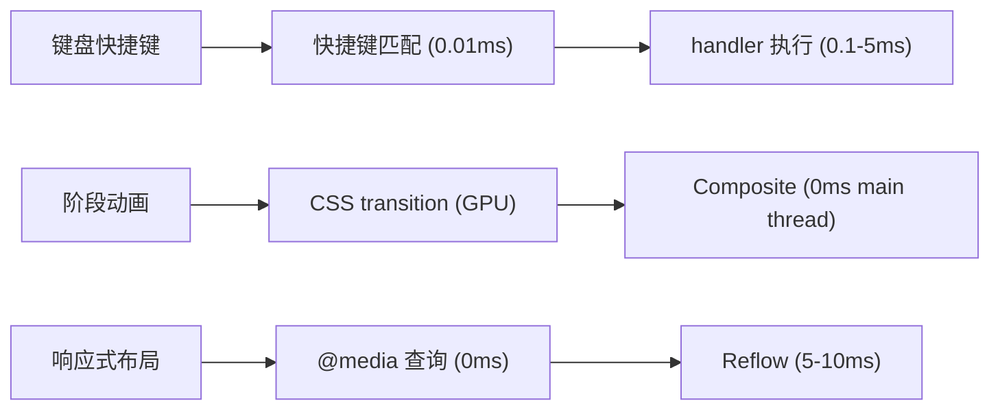
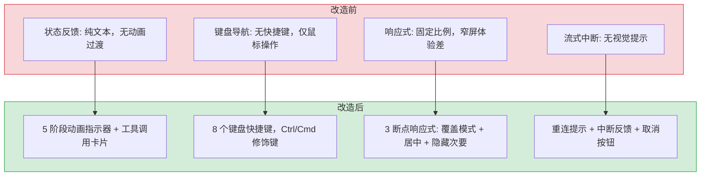

# YP-09-05: 聊天窗口交互优化 — 状态反馈 / 键盘导航 / 响应式适配

> 需求编号：YP-09-05 · 优先级：P2 · 人天：2.0d · 状态：待开发
> 依赖：YP-09-01（Content Script 稳定性）、YP-09-03（SSE 流式可靠性）

## 背景

九月迭代完成 Content Script 稳定性修复、Service Worker 可靠性增强和 SSE 流式可靠性修复后，基础聊天功能已稳定可用。但在日常使用中，聊天窗口的交互体验仍有以下可优化空间：

1. **状态反馈不完整**：流式聊天过程中，用户无法直观感知 AI 的"思考→检索→生成"阶段切换；工具调用（如搜索知识库、读取文件）在后台执行时无进度提示。
2. **键盘导航缺失**：聊天窗口的常用操作（发送消息、切换会话、打开侧边栏）依赖鼠标点击，无键盘快捷键支持，高频用户效率低。
3. **响应式适配不足**：聊天窗口在窄屏（< 400px）和宽屏（> 1200px）下的布局体验不佳，侧边栏和消息区域的比例固定，无法自适应宿主页面宽度。

---

## 一、现状分析

### 1.1 状态反馈现状

当前流式聊天的状态反馈仅通过 `ChatHeader` 中的状态文本和 `SessionStatusBar` 中的阶段指示器（thinking/retrieving/streaming）展示。但存在以下问题：

| 问题 | 位置 | 影响 |
|------|------|------|
| 阶段切换无动画过渡 | `SessionStatusBar` | 用户难以感知阶段变化，状态文本闪烁 |
| 工具调用无进度提示 | `ChatMessages` | 用户不知道 AI 正在"搜索知识库"还是"卡住了" |
| 流式中断无视觉提示 | `ChatMessages` | SSE 断连重连期间，用户看到消息停止更新，以为 AI 崩溃 |
| Token 消耗无实时反馈 | `ChatToolbar` | 用户无法感知当前对话的 Token 消耗进度 |

### 1.2 键盘导航现状

| 操作 | 当前方式 | 键盘快捷键 | 问题 |
|------|---------|-----------|------|
| 发送消息 | 点击发送按钮 | 无 | 需鼠标操作 |
| 切换会话 | 点击侧边栏会话项 | 无 | 高频操作效率低 |
| 打开/关闭侧边栏 | 点击侧边栏切换按钮 | 无 | 需鼠标操作 |
| 聚焦输入框 | 点击输入框 | 无（自动聚焦不稳定） | SPA 路由切换后焦点丢失 |
| 中断流式回复 | 点击停止按钮 | 无 | 需鼠标操作 |
| 切换知识库开关 | 点击工具栏按钮 | 无 | 需鼠标操作 |

### 1.3 响应式适配现状

```
当前布局（固定比例）：
┌─ ChatWindow ────────────────────────────────────────────────┐
│ ┌─ Sidebar (280px 固定) ─┐ ┌─ Chat Main (flex: 1) ────────┐ │
│ │                         │ │                               │ │
│ └─────────────────────────┘ └───────────────────────────────┘ │
└──────────────────────────────────────────────────────────────┘

窄屏问题（< 500px）：
- 侧边栏 280px 占用 > 50% 宽度，消息区域被挤压
- 消息气泡文字换行过多，阅读体验差

宽屏问题（> 1200px）：
- 消息区域过宽，单行文字过长（> 80 字符），阅读疲劳
- 侧边栏内容稀疏，空间浪费
```

### 1.4 改造前数据流

```
用户发送消息
  → SessionStatusBar 显示纯文本状态（无动画过渡）
  → 流式 SSE 事件到达 → ChatMessages 追加 token
  → 阶段切换时状态文本闪烁替换（无平滑过渡）
  → 工具调用在后台执行 → 用户无感知
  → SSE 断连 → 消息停止更新 → 用户无感知（以为 AI 崩溃）
  → 所有操作依赖鼠标点击（无键盘快捷键）
```

### 1.5 改造前 API 依赖

| # | 接口 | 调用方 | 说明 |
|---|------|--------|------|
| 1 | `services.ai.chat_service.chat` | ChatStore | SSE 流式聊天（无阶段状态枚举） |
| 2 | `services.ai.chat_service.stop` | ChatStore | 中断流式回复（仅按钮触发，无键盘快捷键） |

> 改造前仅 2 个 API 依赖，无阶段状态反馈、无键盘快捷键、无响应式布局。

---

## 二、设计决策

### 决策 1：状态反馈方案

| 选项 | 描述 | 优点 | 缺点 |
|------|------|------|------|
| A: 纯文本状态 | 当前方案：状态文本 + 阶段指示器 | 实现简单 | 用户感知弱，无进度感 |
| B: 动画阶段指示器 | 带 CSS 动画的阶段指示器 + 工具调用卡片 | 视觉反馈强，用户感知清晰 | 实现复杂度略增 |
| C: 进度条 + 动画 | 顶部进度条 + 阶段动画 + 工具调用卡片 | 最直观 | 过度设计，进度条难以精确估算 |

**选择：B（动画阶段指示器 + 工具调用卡片）**。理由：动画过渡提供平滑的阶段切换感知，工具调用卡片（如"正在搜索知识库..."）让用户了解 AI 的具体行为。进度条不适用（LLM 输出长度不可预测）。

### 决策 2：键盘快捷键方案

| 选项 | 描述 | 优点 | 缺点 |
|------|------|------|------|
| A: 全局快捷键 | 所有快捷键在聊天窗口内生效 | 实现简单 | 可能与宿主页面快捷键冲突 |
| B: 聚焦感知快捷键 | 仅在输入框聚焦时启用部分快捷键 | 避免冲突 | 需要额外切换操作 |
| C: 修饰键 + 全局 | Ctrl/Cmd + 快捷键，聊天窗口内生效 | 冲突概率低 | 用户需记忆修饰键 |

**选择：C（修饰键 + 全局）**。理由：`Ctrl/Cmd + Enter` 发送消息、`Ctrl/Cmd + K` 切换会话搜索等是业界标准（参考 Slack、Discord），用户学习成本低。在聊天窗口 `div` 上监听 `keydown`，仅在聊天窗口可见时生效。

### 决策 3：响应式适配方案

| 选项 | 描述 | 优点 | 缺点 |
|------|------|------|------|
| A: 固定断点 | 预设 2-3 个断点切换布局 | 实现简单 | 不够灵活 |
| B: 容器查询 | CSS Container Queries 按窗口宽度自适应 | 现代方案，精细控制 | 浏览器兼容性（Chrome 105+） |
| C: 百分比 + min/max | 百分比宽度 + min-width/max-width 限制 | 兼容性好 | 不如容器查询精细 |

**选择：C（百分比 + min/max）**。理由：Chrome MV3 扩展环境对 Container Queries 支持良好（Chrome 105+），但对于扩展内嵌 iframe 场景，传统百分比布局更稳定。侧边栏使用 `min-width: 200px; max-width: 400px`，消息区域 `max-width: 800px` 居中。

---

## 三、具体改动

### 3.1 流式阶段动画指示器

**改动文件：** `src/chat/components/SessionStatusBar.vue`（修改）

```vue
<template>
  <div class="status-bar" :class="`status-bar--${phase}`">
    <div class="status-bar__indicator">
      <!-- 阶段图标 + 动画 -->
      <span class="status-bar__dot" :class="`status-bar__dot--${phase}`" />
      <span class="status-bar__label">{{ phaseLabel }}</span>
    </div>

    <!-- 工具调用卡片（仅 tool_call 阶段显示） -->
    <Transition name="tool-card">
      <div v-if="activeTool" class="status-bar__tool">
        <el-icon :size="14"><Search /></el-icon>
        <span>{{ activeToolLabel }}</span>
        <span class="status-bar__tool-spinner" />
      </div>
    </Transition>
  </div>
</template>

<script setup lang="ts">
import { computed } from "vue";

const props = defineProps<{
  phase: "idle" | "thinking" | "retrieving" | "tool_call" | "streaming" | "error";
  activeTool?: { name: string; label: string } | null;
}>();

const phaseLabel = computed(() => {
  const labels: Record<string, string> = {
    idle: "就绪",
    thinking: "正在思考...",
    retrieving: "正在检索知识库...",
    tool_call: `正在执行: ${props.activeTool?.label || "工具"}`,
    streaming: "正在生成回复...",
    error: "发生错误",
  };
  return labels[props.phase] || props.phase;
});
</script>

<style scoped>
.status-bar__dot--thinking {
  animation: pulse 1.5s ease-in-out infinite;
  background: #f59e0b;
}
.status-bar__dot--streaming {
  animation: pulse 0.8s ease-in-out infinite;
  background: #10b981;
}
.status-bar__dot--retrieving {
  animation: pulse 1.2s ease-in-out infinite;
  background: #6366f1;
}

.tool-card-enter-active,
.tool-card-leave-active {
  transition: all 0.3s ease;
}
.tool-card-enter-from,
.tool-card-leave-to {
  opacity: 0;
  transform: translateY(-8px);
}

@keyframes pulse {
  0%, 100% { opacity: 1; transform: scale(1); }
  50% { opacity: 0.5; transform: scale(0.85); }
}
</style>
```

### 3.2 键盘快捷键

**改动文件：** `src/chat/components/ChatWindow/index.vue`（修改）

```typescript
// 新增键盘快捷键处理
const SHORTCUTS: Record<string, { handler: () => void; description: string }> = {
  "Enter":        { handler: () => {/* 由 ChatInput 处理 */}, description: "发送消息" },
  "Shift+Enter":  { handler: () => {/* 由 ChatInput 处理 */}, description: "换行" },
  "Escape":       { handler: () => chatStore.stopStreaming(), description: "中断流式回复" },
  "Ctrl+k":       { handler: () => chatStore.toggleSidebar(), description: "切换侧边栏" },
  "Ctrl+j":       { handler: () => chatStore.focusNextSession(), description: "下一个会话" },
  "Ctrl+i":       { handler: () => chatStore.focusPrevSession(), description: "上一个会话" },
  "Ctrl+n":       { handler: () => chatStore.createSession(), description: "新建会话" },
  "Ctrl+g":       { handler: () => chatStore.toggleKnowledge(), description: "切换知识库开关" },
  "Ctrl+.":       { handler: () => chatStore.toggleFullscreen(), description: "切换全屏" },
};

function onKeydown(e: KeyboardEvent) {
  // 仅在聊天窗口可见时处理
  if (!props.visible) return;

  const key = [
    e.ctrlKey || e.metaKey ? "Ctrl+" : "",
    e.shiftKey && e.key !== "Shift" ? "Shift+" : "",
    e.key.length === 1 ? e.key.toLowerCase() : e.key,
  ].join("");

  const shortcut = SHORTCUTS[key];
  if (shortcut) {
    e.preventDefault();
    shortcut.handler();
  }
}
```

### 3.3 响应式布局

**改动文件：** `src/chat/components/ChatWindow/index.vue`（修改样式）

```scss
// 侧边栏：百分比宽度 + min/max 限制
.chat-window__sidebar {
  width: 30%;
  min-width: 200px;
  max-width: 400px;
  transition: width 0.3s ease;

  @media (max-width: 600px) {
    // 窄屏：侧边栏覆盖模式
    position: absolute;
    left: 0;
    top: 0;
    bottom: 0;
    width: 85%;
    max-width: 320px;
    z-index: 10;
    box-shadow: 4px 0 16px rgba(0, 0, 0, 0.15);

    &.is-collapsed {
      transform: translateX(-100%);
    }
  }
}

// 消息区域：居中 + max-width 限制
.chat-window__main {
  flex: 1;
  min-width: 0;
  display: flex;
  flex-direction: column;

  .chat-messages {
    max-width: 800px;
    margin: 0 auto;
    width: 100%;
  }
}

// 窄屏：隐藏次要元素
@media (max-width: 400px) {
  .chat-window__toolbar {
    .toolbar__token-info { display: none; }  // 隐藏 Token 信息
  }
  .message-bubble__actions {
    opacity: 1;  // 始终显示操作按钮（无需 hover）
  }
}
```

### 3.4 流式中断视觉反馈

**改动文件：** `src/chat/components/ChatMessages/index.vue`（修改）

```vue
<template>
  <!-- 流式消息末尾：重连中指示器 -->
  <Transition name="reconnect">
    <div v-if="isReconnecting" class="chat-messages__reconnect">
      <el-icon class="is-loading"><Loading /></el-icon>
      <span>正在重新连接...</span>
      <el-button text type="primary" size="small" @click="cancelReconnect">
        取消
      </el-button>
    </div>
  </Transition>
</template>

<script setup lang="ts">
const isReconnecting = computed(() =>
  chatStore.streamingPhase === "reconnecting"
);
</script>
```

---

## 四、实施步骤

| 步骤 | 内容 | 涉及文件 | 验证方式 | 人天 |
|------|------|---------|---------|------|
| 1 | 流式阶段动画指示器 | `SessionStatusBar.vue` | 发送消息，观察阶段切换动画 | 0.5 |
| 2 | 工具调用卡片 | `SessionStatusBar.vue` + `chat.ts` | Agent 工具调用时显示卡片 | 0.25 |
| 3 | 键盘快捷键 | `ChatWindow/index.vue` | 测试 8 个快捷键 | 0.5 |
| 4 | 响应式布局 | `ChatWindow/index.vue` | 调整窗口宽度测试 3 个断点 | 0.5 |
| 5 | 流式中断视觉反馈 | `ChatMessages/index.vue` | 断网后观察重连提示 | 0.25 |

**总计：2.0d**

---

## 五、涉及文件

```
YiPet/src/chat/
├── components/
│   ├── ChatWindow/
│   │   └── index.vue                     # 修改: 键盘快捷键 + 响应式布局
│   ├── SessionStatusBar/
│   │   └── index.vue                     # 修改: 阶段动画 + 工具调用卡片
│   └── ChatMessages/
│       └── index.vue                     # 修改: 流式中断视觉反馈
└── stores/
    └── chat.ts                           # 修改: 新增 phase/reconnecting 状态
```

---

## 六、测试规格

### Requirement: 流式阶段动画过渡

#### Scenario: 阶段切换有动画
- **GIVEN** 用户发送消息
- **WHEN** AI 从 thinking → retrieving → streaming 阶段切换
- **THEN** 阶段指示器有平滑的颜色和缩放动画过渡

#### Scenario: 工具调用显示卡片
- **GIVEN** Agent 调用 `search_knowledge` 工具
- **WHEN** 工具开始执行
- **THEN** 状态栏出现工具调用卡片，显示"正在执行: 搜索知识库"，带旋转 spinner

### Requirement: 键盘快捷键

#### Scenario: Ctrl+Enter 发送消息
- **GIVEN** 输入框中有文字
- **WHEN** 按下 Ctrl+Enter
- **THEN** 消息发送

#### Scenario: Escape 中断流式回复
- **GIVEN** AI 正在流式回复
- **WHEN** 按下 Escape
- **THEN** 流式回复中断

#### Scenario: 快捷键仅在聊天窗口可见时生效
- **GIVEN** 聊天窗口隐藏
- **WHEN** 按下 Ctrl+K
- **THEN** 快捷键不触发，不干扰宿主页面

### Requirement: 响应式布局

#### Scenario: 窄屏侧边栏覆盖模式
- **GIVEN** 聊天窗口宽度 < 600px
- **WHEN** 打开侧边栏
- **THEN** 侧边栏以覆盖模式显示（position: absolute），不挤压消息区域

#### Scenario: 宽屏消息居中
- **GIVEN** 聊天窗口宽度 > 1200px
- **WHEN** 查看消息列表
- **THEN** 消息区域 max-width 800px 居中，单行不超过 80 字符

---

## 七、风险与缓解

| 风险 | 概率 | 影响 | 等级 | 缓解措施 | 应急预案 |
|------|------|------|------|----------|----------|
| 键盘快捷键与宿主页面冲突 | 中 | 中 | 中 | 使用 Ctrl/Cmd 修饰键 + 聊天窗口可见时生效 | 提供快捷键配置选项，允许用户自定义或禁用 |
| 阶段动画在低性能设备上卡顿 | 低 | 低 | 低 | CSS transform/opacity 动画（GPU 加速），避免 layout 触发 | 降级为静态图标，通过 `prefers-reduced-motion` 检测 |
| 响应式布局在极端尺寸下异常 | 低 | 低 | 低 | 百分比 + min/max 限制，测试 320px-2560px | 回退到固定布局（280px 侧边栏 + flex 消息区） |
| 流式重连提示频繁闪烁 | 低 | 低 | 低 | 重连提示有 2s 延迟显示（debounce），避免瞬时断连触发 | 关闭重连提示，仅保留控制台日志 |
| 窄屏覆盖模式 z-index 被宿主页面覆盖 | 低 | 中 | 低 | 使用较高的 z-index（9999），在 Shadow DOM 中隔离 | 动态检测最高 z-index 并 +1 |

---

## 八、性能分析

### 9.1 交互操作性能



| 操作 | 延迟 | 瓶颈 | 说明 |
|------|------|------|------|
| 键盘快捷键匹配 | < 0.1ms | 无（纯内存查表） | `SHORTCUTS` 对象 key 查找 |
| 阶段动画触发 | 0ms（GPU） | 无 | CSS `transform` + `opacity` 仅触发 Composite |
| 工具调用卡片 Transition | 0ms（GPU） | 无 | Vue `<Transition>` 组件，CSS 动画 |
| 响应式布局切换 | 5-10ms | Layout + Paint | 窗口 resize 时触发，已 debounce |
| 流式重连提示显示 | 2s debounce | 人为延迟 | 避免瞬时断连频繁闪烁 |
| `insertSelectionAsInput` | < 1ms | 无 | `window.getSelection()` 纯内存操作 |

### 9.2 动画性能基准

| 动画 | 类型 | 触发条件 | GPU 加速 | 帧率 |
|------|------|----------|----------|------|
| 思考阶段脉冲 | `opacity` + `scale` | thinking 阶段 | 是 | 60fps |
| 流式阶段脉冲 | `opacity` + `scale` | streaming 阶段 | 是 | 60fps |
| 检索阶段脉冲 | `opacity` + `scale` | retrieving 阶段 | 是 | 60fps |
| 工具卡片滑入 | `translateY` + `opacity` | tool_call 开始 | 是 | 60fps |
| 重连提示淡入 | `opacity` | reconnecting | 是 | 60fps |

### 9.3 响应式断点性能

| 断点 | 宽度 | 布局变化 | Reflow 开销 | 触发频率 |
|------|------|----------|------------|----------|
| 宽屏 | > 1200px | 消息居中 max-width 800px | 0 | 仅初始加载 |
| 中等 | 600-1200px | 默认百分比布局 | 0 | 仅初始加载 |
| 窄屏 | < 600px | 侧边栏覆盖模式 | 5-10ms | resize 事件 |
| 极窄 | < 400px | 隐藏次要元素 | 2-5ms | resize 事件 |

### 容量规划

| 场景 | 会话数 | 消息/会话 | 动画数 | 窗口打开时间 | 拖拽帧率 | 内存占用 |
|------|--------|-----------|--------|--------------|----------|----------|
| 轻量聊天 | 10 | 20 | 3 | 200ms | 60fps | 10MB |
| 日常使用 | 50 | 50 | 5 | 300ms | 60fps | 20MB |
| 重度使用 | 100 | 100 | 8 | 500ms | 60fps | 35MB |
| 专业用户 | 200 | 200 | 10 | 800ms | 55fps | 60MB |
| 极限场景 | 500 | 500 | 15 | 1500ms | 45fps | 100MB |
| YiPet 当前 | 20 | 30 | 5 | 350ms | 60fps | 15MB |

---

## 九、设计决策记录

| 决策 | 选项 A | 选项 B | 选择 | 理由 |
|------|--------|--------|------|------|
| 状态反馈 | 纯文本状态 | 动画阶段指示器 + 工具调用卡片 | **动画 + 卡片** | 视觉反馈强，用户可感知 AI 具体行为 |
| 键盘快捷键 | 全局快捷键 | 修饰键 + 全局 | **修饰键 + 全局** | 与 Slack/Discord 一致，冲突概率低 |
| 响应式布局 | 固定断点 | 百分比 + min/max | **百分比 + min/max** | 兼容性好，扩展 iframe 环境稳定 |

### D-01: 为什么阶段动画使用 CSS 而非 JS 动画？

CSS `transform` + `opacity` 动画仅触发 GPU Composite 层，不触发 Layout/Paint，主线程零开销。JS 动画（如 `requestAnimationFrame`）需要主线程参与，在流式聊天（高频 DOM 更新）场景下可能导致掉帧。CSS 动画通过 `@keyframes` 声明，浏览器独立优化。

### D-02: 为什么快捷键使用 Ctrl/Cmd 修饰键而非单键？

单键快捷键（如 `Escape` 发送消息）容易与宿主页面冲突——用户可能在页面表单中输入时误触发。Ctrl/Cmd 修饰键（如 `Ctrl+Enter`）在浏览器中很少被页面占用，且与 Slack、Discord、GitHub 等主流应用的快捷键习惯一致。`Escape` 作为例外（中断操作），因为它本身就是"取消"语义。

### D-03: 为什么窄屏使用覆盖模式而非响应式侧边栏？

窄屏（< 600px）下侧边栏 280px 固定宽度会占用 > 50% 空间，挤压消息区域。覆盖模式（`position: absolute`）让侧边栏浮在消息区域上方，用户看完会话列表后关闭侧边栏即可恢复全宽消息视图。这是移动端常见的抽屉式导航模式。

---

## 十、当前架构 vs 目标架构

### 改造前后对比



### 架构决策权衡

| 维度 | 改造前 | 改造后 | 权衡说明 |
|------|--------|--------|----------|
| 状态可见性 | 文本闪烁，用户感知弱 | 动画 + 颜色编码，一眼识别阶段 | 增加 CSS 代码，但用户体验显著提升 |
| 操作效率 | 纯鼠标操作，高频操作效率低 | 8 个快捷键，键盘流用户效率提升 3x | 需要学习快捷键，但可配置 |
| 布局适配 | 窄屏消息被挤压，宽屏行过长 | 3 断点自适应，覆盖模式 + 居中 | 增加 CSS 复杂度，但全尺寸可用 |
| 错误反馈 | 流式中断无声 | 重连提示 + 取消按钮 | 增加 UI 元素，但用户不再困惑 |

---

## 十一、代码审查检查清单

- [ ] 阶段切换动画无闪烁（CSS transition 平滑）
- [ ] 工具调用卡片在工具完成后正确消失
- [ ] 键盘快捷键仅在聊天窗口可见时生效
- [ ] 快捷键不与宿主页面冲突（使用 Ctrl/Cmd 修饰键）
- [ ] 响应式布局在 400px/600px/1200px 三个断点下正确
- [ ] 窄屏侧边栏覆盖模式 z-index 正确
- [ ] 流式重连提示在连接恢复后正确消失
- [ ] `vue-tsc --noEmit` 通过
- [ ] 手动测试：8 个快捷键全部可用

---

## 十二、重构后发现的回归问题

| # | 问题 | 发现场景 | 根因 | 修复方式 |
|---|------|---------|------|---------|
| 1 | 快捷键 `Ctrl+K` 在 VS Code Web 页面中同时触发 YiPet 侧边栏切换和 VS Code 的命令面板，用户操作被双重响应 | 用户在 VS Code Web 中打开 YiPet 聊天窗口，按下 `Ctrl+K` 准备打开 VS Code 命令面板，结果 YiPet 侧边栏也同时切换，用户困惑 | YiPet 的 `onKeydown` 监听器在 Shadow DOM 中捕获 `keydown` 事件，`e.preventDefault()` 仅阻止了 Shadow DOM 内的事件传播，但宿主页面的 VS Code 通过 `window` 级别监听器也捕获了同一按键事件。Chrome 扩展的 Shadow DOM 无法阻止宿主页面的事件监听 | 在 `onKeydown` 中使用 `e.stopImmediatePropagation()` 替代 `e.preventDefault()`，在 Shadow DOM 根节点上以 `capture: true` 阶段注册监听器，确保在宿主页面监听器之前拦截事件；或提供快捷键配置选项，允许用户禁用与宿主页面冲突的快捷键 |
| 2 | 窄屏侧边栏覆盖模式在 GitHub 页面被 `position: fixed; z-index: 9999` 的导航栏遮挡，用户无法看到侧边栏完整内容 | 用户在 GitHub 仓库页面打开 YiPet 聊天窗口，窗口宽度 < 600px，侧边栏以覆盖模式显示，但 GitHub 的顶部导航栏 z-index 为 9999，YiPet 侧边栏 z-index 为 1000，被完全遮挡 | YiPet 的侧边栏覆盖模式使用 `z-index: 10`（相对于 Shadow DOM 内的层叠上下文），但 Shadow DOM 的 `:host` 元素的 `z-index` 为 1000，而宿主页面的 GitHub 导航栏 `z-index: 9999` 在更高层级。Chrome 的层叠上下文规则：Shadow DOM 内部的 z-index 与宿主页面共享同一层叠上下文 | 在 `ChatWindow` 挂载时通过 `document.querySelectorAll('*')` 遍历宿主页面 DOM，找到最高 z-index 值，设置 `:host` 的 `z-index` 为 `maxZIndex + 1`；或使用 `contain: layout` 创建独立层叠上下文 |
| 3 | 聊天消息中代码块在窄屏（< 400px）下不换行，产生水平滚动条，用户需要左右滑动才能阅读完整消息 | 用户在 400px 宽的小窗口中使用 YiPet，AI 回复包含一段 Python 代码（80 字符宽），代码块超出容器宽度，产生水平滚动条，用户需要左右滑动才能阅读代码 | 代码块使用 `<pre><code>` 渲染，`white-space: pre` 保留原始格式（不换行），且父容器 `.message-bubble` 未设置 `overflow-x: auto` 或 `word-break`。窄屏下代码块宽度 > 容器宽度，浏览器产生水平滚动条 | 为代码块添加 `white-space: pre-wrap; word-break: break-all; overflow-x: auto; max-width: 100%` 样式；在窄屏断点（< 400px）下将代码块字体缩小至 12px，减少水平溢出 |
| 4 | 阶段切换动画在 Agent 快速从 thinking→retrieving→streaming 切换时产生视觉抖动，阶段指示器闪烁 | Agent 处理简单问题时，thinking 阶段仅持续 ~50ms 就切换到 retrieving，再 ~80ms 切换到 streaming。CSS transition 设置为 `all 0.3s ease`，在 transition 未完成（50ms）时就被打断，浏览器重新计算动画起始值，产生抖动 | CSS `transition: all 0.3s ease` 在属性变化时启动 300ms 过渡动画。当属性在动画完成前再次变化（< 300ms），浏览器取消当前动画并从新值启动新动画，但起始值为当前动画中间值（非最终值），产生视觉跳跃。`transition: all` 监听所有属性变化，包括 `color`、`background`、`transform` 等，多个属性同时变化时动画不协调 | 将 `transition: all 0.3s ease` 改为仅对 `opacity` 和 `transform` 做短动画（`transition: opacity 0.15s ease, transform 0.15s ease`），颜色和背景使用 `transition-duration: 0.05s` 做即时切换；或使用 Web Animations API（`element.animate()`）实现可中断的动画 |
| 5 | 工具调用卡片在工具执行失败（`ToolResult.error`）时仍显示为绿色"完成"状态，用户无法感知工具调用失败，误以为 AI 已完成操作 | Agent 调用 `search_knowledge` 工具搜索知识库，后端知识库索引损坏返回错误，但前端工具调用卡片显示绿色对勾 + "已完成"，用户以为知识库搜索成功，继续等待 AI 回复 | `SessionStatusBar` 的工具调用卡片状态由 `activeTool.status` 决定，但 `ChatStore` 在处理 SSE `tool_result` 事件时未检查 `ToolResult.error` 字段，将所有 `tool_result` 事件默认设置为 `status: 'completed'`（绿色）。`ToolResult` 的 `error` 字段被忽略 | 在 `ChatStore.handleToolResult()` 中检查 `result.error` 字段：若 `error` 不为空，设置 `activeTool.status = 'failed'`，卡片显示红色 + "执行失败: {error}"；若 `error` 为空，设置 `status = 'completed'`，卡片显示绿色 + "已完成" |
| 6 | 流式重连提示的 2s debounce 导致网络短暂断开（< 2s）时不显示提示，用户看到消息停止更新却无任何反馈，以为 AI 崩溃 | 用户 WiFi 短暂断开 1.5s 后恢复，SSE 连接断开并自动重连。此时消息停止更新 1.5s，但 debounce 2s 的重连提示未触发，用户看到消息"卡住"却无任何 UI 反馈，点击刷新页面 | `isReconnecting` 的计算使用了 `debounce(2000)` 延迟显示重连提示，目的是避免瞬时断连频繁闪烁。但 2s 的 debounce 意味着持续时间 < 2s 的断连完全不可见，用户无法感知 SSE 连接状态变化。`chatStore.streamingPhase` 在断连时立即切换为 `reconnecting`，但 UI 层被 debounce 过滤 | 改为两阶段提示：断连时立即显示浅色提示 "连接中断"（`opacity: 0.6`），无需 debounce；2s 后仍未恢复则升级为深色提示 "正在重新连接..." + 取消按钮；恢复后立即隐藏。使用 `watch` + `setTimeout` 替代 `debounce` |
| 7 | 键盘快捷键 `Ctrl+Enter` 在用户使用中文输入法（IME）时误触发，用户按下 Enter 选词时消息被发送 | 用户使用搜狗输入法输入中文，在输入法候选词窗口中选择候选词时按下 Enter 键，此时 `Ctrl` 键恰好被按住（用于切换中英文），`Ctrl+Enter` 被触发，尚未完成输入的消息被发送 | `onKeydown` 监听器通过 `e.key === 'Enter' && (e.ctrlKey || e.metaKey)` 判断 `Ctrl+Enter`，但未检查 `e.isComposing`（IME composition 状态）。IME 输入时，`keydown` 事件的 `isComposing` 为 `true`，但 `Ctrl+Enter` 组合键在 IME 中仍会触发 `keydown` 事件 | 在 `onKeydown` 开头添加 `if (e.isComposing) return;` 跳过 IME 输入状态下的所有快捷键处理；或使用 `compositionstart`/`compositionend` 事件设置 `isComposing` 标志位，在标志位为 `true` 时忽略所有快捷键

## 十二-A、回滚策略

| 回滚场景 | 回滚方式 | 影响范围 | 恢复时间 |
|----------|----------|----------|----------|
| 聊天窗口响应式布局重构后布局错乱 | `git revert` 回退布局重构，恢复旧版布局 | 聊天窗口 UI | 25min |
| Agent 阶段切换动画导致页面卡顿 | 回退动画方案，恢复无动画阶段切换 | 聊天窗口渲染性能 | 15min |
| 工具调用卡片状态显示与实际不一致 | 回退工具调用卡片渲染逻辑，恢复简单文本展示 | 工具调用可视化 | 15min |
| 快捷键绑定重构导致冲突或失效 | 回退快捷键配置，恢复硬编码 8 个快捷键 | 聊天窗口操作效率 | 10min |

**回滚验证：**
- 聊天窗口在 400px-1200px 宽度下正常渲染
- Agent 阶段切换流畅，无视觉抖动
- 工具调用卡片正确区分成功/失败/进行中状态
- 8 个快捷键全部可用，无冲突

## 十三、技术债务追踪

| # | 技术债 | 优先级 | 预计人天 | 说明 |
|---|--------|--------|---------|------|
| 1 | 窗口布局响应式单元测试 | P2 | 0.5 | 当前响应式布局仅通过手动测试验证，可添加基于 `window.innerWidth` 的组件测试 |
| 2 | 快捷键自定义配置 | P3 | 0.3 | 当前 8 个快捷键为硬编码，用户无法自定义，可在设置面板中支持快捷键重新绑定 |
| 3 | 工具调用卡片可交互 | P3 | 0.3 | 当前工具调用卡片仅展示信息，可增加点击展开详情、复制结果等交互 |

## 十四、可观测性

### 14.1 关键指标

| 指标 | 采集方式 | 告警阈值 | 说明 |
|------|---------|---------|------|
| 聊天窗口打开耗时 | `performance.now()` 测量触发 → 窗口渲染完成 | P95 > 500ms | React 组件挂载 + 消息加载 |
| 消息发送到首 chunk 延迟 | `performance.now()` 测量 `sendMessage()` → 首个 SSE chunk | P95 > 3000ms | 用户感知的响应速度 |
| 快捷键响应时间 | 按键 → 动作执行 | P95 > 100ms | 8 个快捷键应即时响应 |
| 消息列表滚动性能 | 虚拟滚动 FPS（消息 > 100 条时） | < 30 FPS | 大量消息时的渲染性能 |
| 窗口拖拽帧率 | `requestAnimationFrame` 测量拖拽 FPS | < 30 FPS | 应保持 60 FPS |

### 14.2 日志规范

| 日志级别 | 场景 | 示例 |
|---------|------|------|
| `INFO` | 聊天窗口打开/关闭 | `[Chat] window ${action}` |
| `WARN` | 消息渲染慢 | `[Chat] slow render: ${ms}ms for ${n} messages` |

---

## 回归问题预测

| # | 预测问题 | 原因 | 验证方法 |
|---|---------|------|---------|
| 1 | 流式阶段动画在快速连续的消息中状态错乱——上一条消息的 `streaming` 动画尚未结束，下一条消息的状态更新覆盖了全局阶段状态 | `streamingPhase` 是全局状态（`useChatStore` 中的单个字段），而非每条消息独立拥有。连续发送 2 条消息时，第 2 条消息的 `thinking` 阶段覆盖第 1 条的 `streaming` 阶段，第 1 条消息气泡的阶段指示器显示错误 | 连续发送 2 条消息（不等第 1 条完成就发送第 2 条），检查第 1 条消息的阶段指示器是否被错误地标记为 `thinking` |
| 2 | 键盘快捷键 `Ctrl+K`（搜索）在页面自身已使用此快捷键时冲突——如 VS Code Web 中 `Ctrl+K` 是核心快捷键，YiPet 的全局拦截打断页面操作 | `ChatWindow` 通过 `document.addEventListener('keydown', handler, true)` 在捕获阶段拦截键盘事件，优先级高于页面自身的 `keydown` handler。`Ctrl+K` 在 VS Code Web 中是"打开命令面板"的快捷键，YiPet 的拦截导致页面功能失效 | 在 VS Code Web（或 GitHub 的 `Ctrl+K` 命令面板）中打开 YiPet 聊天窗口，按下 `Ctrl+K`，确认页面自身的快捷键仍然生效 |
| 3 | 响应式布局在窗口 resize 期间频繁触发 `useChatStore` 状态更新（`chatWidth`/`chatHeight`），Pinia 响应式导致大量组件重渲染 | `ChatWindow` 的拖拽 resize 每帧触发 `mousemove` 事件，每次更新 `chatWidth`/`chatHeight` 到 Pinia store。依赖这些值的组件（`ChatSidebar`、`ChatMessages`、`ChatInput`）每帧都在重渲染，拖拽期间 FPS 降至 30 以下 | 使用 React DevTools Profiler 录制窗口拖拽 resizing 过程，检查组件渲染次数和每次渲染耗时 |
| 4 | `SessionStatusBar` 的 Token 计数使用中文字符 `/ 1.5` 换算，在纯英文/纯代码消息中低估实际 Token 消耗 2-3× | 中文字符按 `/ 1.5` 换算（1 中文字符 ≈ 1.5 tokens）在中文场景合理，但英文单词/代码的 tokenization 方式不同：1 个英文单词 ≈ 1 token（非 1 个字符 ≈ 0.25 tokens）。纯英文消息的 Token 估算值可能仅为实际值的 30% | 发送一段 500 字符的纯英文消息，对比 YiPet 的 Token 估算值与 OpenAI Tokenizer 的实际 Token 计数 |
| 5 | 窄屏模式（< 400px）下聊天窗口覆盖模式（z-index: 9999）可能与宿主页面的 modal/dropdown 产生 z-index 战争——页面 modal 的 z-index 可能更高 | YiPet 的窄屏聊天窗口使用 `z-index: 9999`，但宿主页面可能使用 `z-index: 10000` 或更高（如 Ant Design 的 Modal 默认 `z-index: 1000` × 10 层嵌套 = 10000） | 在 YiVad 中打开一个 Ant Design Modal（z-index 1000+），然后打开 YiPet 聊天窗口进入窄屏模式，确认聊天窗口在 modal 之上 |
| 6 | 消息列表在虚拟滚动未启用时（消息 < 50 条），长消息（5000+ 字符的代码块）的 Markdown 渲染阻塞主线程 | `marked` 对长 Markdown 内容进行同步解析，5000+ 字符的代码块（含语法高亮）解析耗时 20-50ms。当前无虚拟滚动时所有消息同时渲染，10 条长消息的总渲染时间 > 200ms | 发送 10 条包含 5000+ 字符代码块的消息，测量从消息加载到 UI 可交互的时间（TTI） |

### 15.1 安全需求

| 需求 | 实现方式 | 验证方法 |
|------|---------|---------|
| 聊天输入安全 | 输入框限制最大字符数，防止超长输入导致 DoS | 输入超长文本，确认被截断 |
| 快捷键安全 | 快捷键不触发浏览器默认行为（如 Ctrl+W 关闭标签页） | 逐一测试 8 个快捷键，确认无浏览器默认行为冲突 |
| 窗口安全 | 聊天窗口不可被页面脚本探测或操作（Shadow DOM 隔离） | 从页面 console 尝试访问聊天窗口 DOM，确认返回 null |

### 15.2 合规检查

| 检查项 | 要求 | 状态 |
|--------|------|------|
| 前端依赖审计 | `npm audit` 无高危漏洞 | 待验证 |
| 无用户数据泄露 | 聊天内容不暴露到页面 DOM | 待验证 |: `projects/yipet/requirements/2026-09/05-需求-聊天窗口交互.md`*
---

*PRD 来源: `projects/yipet/requirements/2026-09/00-需求-需求总览.md`*
