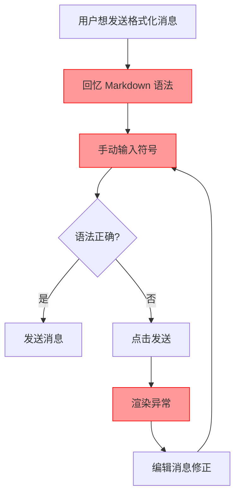
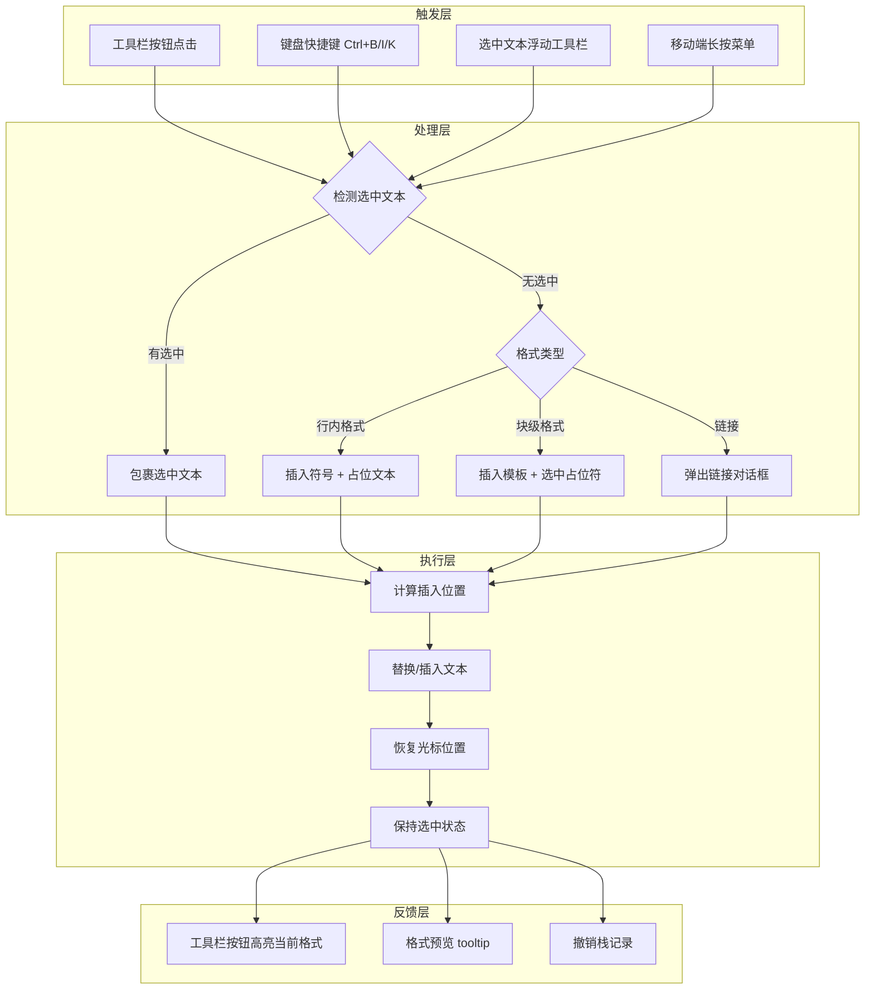
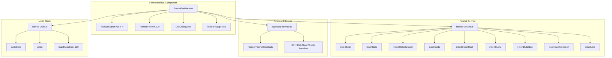

# YP-09-113: 消息格式化工具栏 — 富文本格式工具栏、Markdown 语法插入、键盘快捷键与格式预览

> 需求编号：YP-09-113 · 优先级：P2 · 人天：0.3d · 状态：需求已编写
> 依赖：YP-09-110（Markdown 编辑器增强）、YP-09-97（键盘快捷键系统）

## 背景

### 问题陈述

用户在 YiPet 聊天窗口中输入消息时，需要手动编写 Markdown 语法来格式化文本——例如用 `**粗体**` 包裹文字、用 `- ` 开头创建列表、用 `` ` `` 包裹代码。这导致：

1. **学习成本高**：不熟悉 Markdown 语法的用户无法使用格式化功能，只能发送纯文本
2. **操作效率低**：即使熟悉 Markdown，手动输入 `**` 和 `*` 等符号也比点击按钮慢
3. **格式错误频繁**：用户手动输入时容易遗漏闭合符号（如只写了 `**粗体` 忘记结尾 `**`），导致渲染异常
4. **发现性差**：新用户不知道 YiPet 支持 Markdown 格式化，功能被埋没
5. **移动端不友好**：在触屏设备上输入 Markdown 符号更加困难，虚拟键盘切换符号面板操作繁琐

**核心矛盾**：YiPet 已支持 Markdown 渲染（YP-09-22），但输入侧缺乏可视化格式化工具，用户被迫记忆和手动输入 Markdown 语法，输入体验与渲染效果之间存在断层。

### 影响范围

| # | 影响 | 严重程度 | 典型场景 |
|---|------|----------|----------|
| 1 | 格式化操作门槛高 | 高 | 新用户不知道如何加粗文字 |
| 2 | 手动输入效率低 | 中 | 频繁使用代码块需要输入 6 个反引号 |
| 3 | 格式错误导致渲染异常 | 中 | 闭合符号遗漏导致后续内容格式错乱 |
| 4 | 移动端输入困难 | 中 | 触屏输入 Markdown 符号需多次切换键盘 |
| 5 | 格式化功能发现性差 | 低 | 用户不知道聊天支持 Markdown |

### 挑战

| 挑战 | 说明 |
|------|------|
| 文本选择保留 | 在有选中文本时插入格式符号，需保留选中状态并正确定位光标 |
| 多行格式处理 | 代码块、列表等块级格式需处理多行选中，每行独立添加前缀 |
| 格式嵌套 | 用户可能先加粗再斜体，需正确处理嵌套格式的符号顺序 |
| 工具栏响应式 | 聊天窗口宽度从 300px 到 800px 不等，工具栏需自适应布局 |
| 快捷键冲突 | Ctrl+B/I/K 等快捷键可能与页面或浏览器快捷键冲突 |

---

## 一、现状分析

### 1.1 当前格式化能力

```
现有能力:
├── Markdown 渲染引擎                    # YP-09-22，支持粗体/斜体/代码/列表等
├── 纯文本输入框（textarea）              # 无格式化辅助
├── 键盘事件监听                          # 可用但未注册格式化快捷键
└── 无                                      # 无格式化工具栏、无格式预览

缺失:
├── 格式化工具栏 UI                        # ❌ 不存在
├── 粗体/斜体/删除线/代码 按钮              # ❌ 不存在
├── 代码块/引用/列表 按钮                   # ❌ 不存在
├── 链接插入对话框                          # ❌ 不存在
├── 文本选择检测与格式包裹                  # ❌ 不存在
├── 格式化快捷键注册                        # ❌ 不存在
├── 格式预览提示（tooltip）                 # ❌ 不存在
├── 工具栏显示/隐藏切换                     # ❌ 不存在
├── 移动端紧凑模式                          # ❌ 不存在
└── 格式操作的撤销支持                      # ❌ 不存在
```

### 1.2 改造前格式化流程



### 1.3 根因矩阵

| 症状 | 根因 | 触发条件 | 频率 |
|------|------|----------|------|
| 格式化操作门槛高 | 无可视化格式化工具 | 每次需要格式化文本 | 高 |
| 手动输入效率低 | 无工具栏按钮 | 频繁使用代码块/列表 | 高 |
| 格式错误频繁 | 无自动闭合符号 | 手动输入 Markdown 符号 | 中 |
| 移动端输入困难 | 无触屏优化 | 移动设备使用场景 | 中 |
| 功能发现性差 | 格式化能力无视觉提示 | 新用户首次使用 | 中 |

---

## 二、设计决策

### 决策 1：工具栏呈现方式 — 常驻工具栏 vs 浮动工具栏 vs 选中弹出

| 选项 | 可见性 | 空间占用 | 操作效率 |
|------|--------|----------|----------|
| 常驻工具栏（输入框上方） | 高 | 固定占用 40-48px | 高（始终可见） |
| 浮动工具栏（选中文本弹出） | 中 | 按需显示 | 中（需先选中） |
| 右键菜单触发 | 低 | 零占用 | 低（需右键） |

**选择：常驻工具栏 + 选中文本弹出组合。** 主工具栏常驻在聊天输入框上方，提供全部格式化按钮；当用户选中文本时，在选中区域附近弹出迷你工具栏（粗体、斜体、代码），减少鼠标移动距离。常驻工具栏可通过切换按钮隐藏。

### 决策 2：格式插入策略 — 包裹选中文本 vs 插入模板文本 vs 弹出对话框

| 选项 | 适用场景 | 实现复杂度 | 用户体验 |
|------|----------|-----------|----------|
| 包裹选中文本 | 粗体/斜体/删除线/代码 | 低 | 直观（所见即所得） |
| 插入模板文本 | 代码块/引用/列表 | 低 | 需手动替换占位符 |
| 弹出对话框 | 链接/图片 | 中 | 结构化输入 |

**选择：按格式类型混合策略。** 行内格式（粗体、斜体、删除线、代码）使用包裹选中文本；块级格式（代码块、引用、列表）使用插入模板 + 自动选中占位符；链接/图片使用弹出对话框输入 URL。

### 决策 3：快捷键方案 — 全局注册 vs 输入框内监听 vs 混合

| 选项 | 冲突风险 | 实现复杂度 | 适用范围 |
|------|----------|-----------|----------|
| 全局注册（manifest commands） | 高（与浏览器/页面冲突） | 低 | 仅 4 个可注册 |
| 输入框内监听（keydown） | 低（仅输入框聚焦时） | 低 | 无限制 |
| 混合方案 | 中 | 中 | 兼顾两者 |

**选择：输入框内监听方案。** Chrome 扩展 `commands` API 仅支持 4 个全局快捷键（已用于截图、打开聊天等核心功能），格式化快捷键更适合在输入框聚焦时生效。使用 `keydown` 事件在 textarea 上监听，仅在输入框聚焦时拦截快捷键，避免与页面冲突。

### 决策 4：移动端适配 — 响应式折叠 vs 独立工具栏 vs 长按菜单

| 选项 | 实现复杂度 | 触屏体验 | 空间效率 |
|------|-----------|----------|----------|
| 响应式折叠（宽度 < 400px 折叠） | 低 | 中 | 高 |
| 独立底部工具栏 | 中 | 高 | 中 |
| 长按上下文菜单 | 中 | 高 | 最高 |

**选择：响应式折叠 + 长按菜单组合。** 宽度 >= 500px 显示完整工具栏，300-500px 显示紧凑模式（仅图标无文字），< 300px 折叠为 "Aa" 按钮，点击展开下拉面板。移动端额外支持长按选中文本弹出格式菜单。

### 设计决策记录

| 决策 | 选项 A | 选项 B | 选项 C | 选择 | 理由 |
|------|--------|--------|--------|------|------|
| 工具栏呈现方式 | 常驻工具栏 | 浮动工具栏 | 右键菜单 | **常驻 + 浮动组合** | 互补覆盖不同场景 |
| 格式插入策略 | 包裹选中文本 | 插入模板 | 弹出对话框 | **按类型混合** | 行内/块级/链接需求不同 |
| 快捷键方案 | 全局注册 | 输入框内监听 | 混合 | **输入框内监听** | 避免全局冲突 |
| 移动端适配 | 响应式折叠 | 独立工具栏 | 长按菜单 | **响应式 + 长按** | 最大化空间效率 |

---

## 三、目标架构

### 3.1 格式化工具栏工作流



### 3.2 工具栏组件架构



### 3.3 性能指标

| 指标 | 目标值 | 说明 |
|------|--------|------|
| 按钮点击 → 文本插入 | < 16ms | 同步操作，无异步延迟 |
| 工具栏渲染 | < 50ms | 组件挂载到可交互 |
| 快捷键响应 | < 16ms | keydown 事件到文本变更 |
| 工具栏显示/隐藏切换 | < 100ms | CSS transition 动画 |
| 链接对话框弹出 | < 100ms | 对话框组件挂载 |
| 撤销操作 | < 16ms | 恢复前一个文本状态 |

---

## 四、具体改动

### 4.1 格式化服务

```typescript
// src/services/format-service.ts (新增)

interface FormatAction {
  type: 'bold' | 'italic' | 'strikethrough' | 'code' | 'codeBlock' | 'quote' | 'bulletList' | 'numberedList' | 'link';
  shortcut: string;
  markdownPrefix: string;
  markdownSuffix: string;
  isBlockLevel: boolean;
}

const FORMAT_CONFIG: Record<string, FormatAction> = {
  bold: {
    type: 'bold',
    shortcut: 'Ctrl+B',
    markdownPrefix: '**',
    markdownSuffix: '**',
    isBlockLevel: false,
  },
  italic: {
    type: 'italic',
    shortcut: 'Ctrl+I',
    markdownPrefix: '*',
    markdownSuffix: '*',
    isBlockLevel: false,
  },
  strikethrough: {
    type: 'strikethrough',
    shortcut: 'Ctrl+K',
    markdownPrefix: '~~',
    markdownSuffix: '~~',
    isBlockLevel: false,
  },
  code: {
    type: 'code',
    shortcut: 'Ctrl+E',
    markdownPrefix: '`',
    markdownSuffix: '`',
    isBlockLevel: false,
  },
  codeBlock: {
    type: 'codeBlock',
    shortcut: 'Ctrl+Shift+C',
    markdownPrefix: '\n```\n',
    markdownSuffix: '\n```\n',
    isBlockLevel: true,
  },
  quote: {
    type: 'quote',
    shortcut: 'Ctrl+Shift+.',
    markdownPrefix: '> ',
    markdownSuffix: '',
    isBlockLevel: true,
  },
  bulletList: {
    type: 'bulletList',
    shortcut: 'Ctrl+Shift+U',
    markdownPrefix: '- ',
    markdownSuffix: '',
    isBlockLevel: true,
  },
  numberedList: {
    type: 'numberedList',
    shortcut: 'Ctrl+Shift+O',
    markdownPrefix: '1. ',
    markdownSuffix: '',
    isBlockLevel: true,
  },
  link: {
    type: 'link',
    shortcut: 'Ctrl+Shift+L',
    markdownPrefix: '[',
    markdownSuffix: '](url)',
    isBlockLevel: false,
  },
};

export function applyFormat(
  textarea: HTMLTextAreaElement,
  formatType: string,
  linkUrl?: string
): FormatResult {
  const config = FORMAT_CONFIG[formatType];
  if (!config) throw new Error(`Unknown format type: ${formatType}`);

  const { selectionStart, selectionEnd, value } = textarea;
  const hasSelection = selectionStart !== selectionEnd;
  const selectedText = value.substring(selectionStart, selectionEnd);

  let newText: string;
  let newCursorPos: number;

  if (formatType === 'link') {
    // 链接格式：有选中文本时使用选中文本作为链接文字，否则使用占位符
    const linkText = hasSelection ? selectedText : '链接文字';
    const url = linkUrl || 'https://';
    newText = `[${linkText}](${url})`;
    newCursorPos = selectionStart + newText.length;
  } else if (config.isBlockLevel) {
    // 块级格式：对每行添加前缀
    if (hasSelection) {
      const lines = selectedText.split('\n');
      const formattedLines = lines.map(line => config.markdownPrefix + line);
      newText = formattedLines.join('\n');
    } else {
      newText = config.markdownPrefix + '输入内容';
    }
    newCursorPos = selectionStart + newText.length;
  } else {
    // 行内格式：包裹选中文本或插入占位符
    if (hasSelection) {
      newText = config.markdownPrefix + selectedText + config.markdownSuffix;
    } else {
      const placeholder = formatType === 'code' ? '代码' : '文本';
      newText = config.markdownPrefix + placeholder + config.markdownSuffix;
      // 自动选中占位符文本，方便用户直接输入替换
      setTimeout(() => {
        textarea.setSelectionRange(
          selectionStart + config.markdownPrefix.length,
          selectionStart + config.markdownPrefix.length + placeholder.length
        );
      }, 0);
    }
    newCursorPos = selectionStart + newText.length;
  }

  // 替换文本
  const before = value.substring(0, selectionStart);
  const after = value.substring(selectionEnd);
  textarea.value = before + newText + after;

  // 恢复光标位置
  if (!config.isBlockLevel && !hasSelection && formatType !== 'link') {
    // 光标留在占位符后面（已在上面设置选中）
  } else {
    textarea.setSelectionRange(newCursorPos, newCursorPos);
  }

  textarea.focus();

  return {
    type: formatType,
    beforeText: selectedText,
    afterText: newText,
    position: selectionStart,
  };
}
```

### 4.2 工具栏组件

```typescript
// src/components/FormatToolbar.vue (新增)

<script setup lang="ts">
import { ref, computed, watch } from 'vue';
import { applyFormat, FORMAT_CONFIG } from '@/services/format-service';
import { useFormatUndo } from '@/composables/useFormatUndo';
import { useResponsive } from '@/composables/useResponsive';

const props = defineProps<{
  textareaRef: HTMLTextAreaElement | null;
  visible: boolean;
}>();

const emit = defineEmits<{
  'toggle-visibility': [];
  'format-applied': [type: string];
}>();

const { pushState, undo } = useFormatUndo();
const { isMobile, isCompact } = useResponsive();
const showLinkDialog = ref(false);
const linkUrl = ref('');

const buttonGroups = [
  {
    name: 'inline',
    buttons: [
      { type: 'bold', icon: 'B', label: '粗体', shortcut: 'Ctrl+B' },
      { type: 'italic', icon: 'I', label: '斜体', shortcut: 'Ctrl+I' },
      { type: 'strikethrough', icon: 'S', label: '删除线', shortcut: 'Ctrl+K' },
      { type: 'code', icon: '<>', label: '行内代码', shortcut: 'Ctrl+E' },
    ],
  },
  {
    name: 'block',
    buttons: [
      { type: 'codeBlock', icon: '{ }', label: '代码块', shortcut: 'Ctrl+Shift+C' },
      { type: 'quote', icon: '"', label: '引用', shortcut: 'Ctrl+Shift+.' },
      { type: 'bulletList', icon: '•', label: '无序列表', shortcut: 'Ctrl+Shift+U' },
      { type: 'numberedList', icon: '1.', label: '有序列表', shortcut: 'Ctrl+Shift+O' },
    ],
  },
  {
    name: 'insert',
    buttons: [
      { type: 'link', icon: '🔗', label: '链接', shortcut: 'Ctrl+Shift+L' },
    ],
  },
];

function handleFormatClick(type: string) {
  if (!props.textareaRef) return;

  if (type === 'link') {
    showLinkDialog.value = true;
    return;
  }

  // 保存撤销状态
  pushState(props.textareaRef.value);

  applyFormat(props.textareaRef, type);
  emit('format-applied', type);
}

function handleLinkInsert() {
  if (!props.textareaRef || !linkUrl.value.trim()) return;

  pushState(props.textareaRef.value);
  applyFormat(props.textareaRef, 'link', linkUrl.value.trim());
  showLinkDialog.value = false;
  linkUrl.value = '';
  emit('format-applied', 'link');
}

function handleUndo() {
  if (!props.textareaRef) return;
  undo(props.textareaRef);
}

const toolbarClass = computed(() => ({
  'format-toolbar': true,
  'format-toolbar--hidden': !props.visible,
  'format-toolbar--compact': isCompact.value,
  'format-toolbar--mobile': isMobile.value,
}));
</script>

<template>
  <div :class="toolbarClass">
    <div v-if="!isMobile || !isCompact" class="toolbar-groups">
      <div v-for="group in buttonGroups" :key="group.name" class="toolbar-group">
        <button
          v-for="btn in group.buttons"
          :key="btn.type"
          class="toolbar-btn"
          :title="`${btn.label} (${btn.shortcut})`"
          @click="handleFormatClick(btn.type)"
        >
          <span class="toolbar-btn-icon">{{ btn.icon }}</span>
          <span v-if="!isCompact" class="toolbar-btn-label">{{ btn.label }}</span>
        </button>
      </div>
    </div>

    <!-- 移动端紧凑模式 -->
    <div v-else class="toolbar-mobile">
      <button class="toolbar-btn toolbar-btn--format" @click="showMobileMenu = !showMobileMenu">
        <span class="toolbar-btn-icon">Aa</span>
        <span class="toolbar-btn-label">格式</span>
      </button>
      <div v-if="showMobileMenu" class="toolbar-mobile-menu">
        <button v-for="btn in allButtons" :key="btn.type" @click="handleFormatClick(btn.type)">
          {{ btn.icon }} {{ btn.label }}
        </button>
      </div>
    </div>

    <!-- 撤销按钮 -->
    <button class="toolbar-btn toolbar-btn--undo" title="撤销格式 (Ctrl+Z)" @click="handleUndo">
      <span class="toolbar-btn-icon">↩</span>
    </button>

    <!-- 工具栏切换 -->
    <button class="toolbar-btn toolbar-btn--toggle" title="隐藏工具栏" @click="$emit('toggle-visibility')">
      <span class="toolbar-btn-icon">{{ props.visible ? '▲' : '▼' }}</span>
    </button>

    <!-- 链接对话框 -->
    <Teleport to="body">
      <div v-if="showLinkDialog" class="link-dialog-overlay" @click.self="showLinkDialog = false">
        <div class="link-dialog">
          <h3>插入链接</h3>
          <input
            v-model="linkUrl"
            type="url"
            placeholder="https://example.com"
            @keydown.enter="handleLinkInsert"
            @keydown.escape="showLinkDialog = false"
            autofocus
          />
          <div class="link-dialog-actions">
            <button @click="showLinkDialog = false">取消</button>
            <button @click="handleLinkInsert" :disabled="!linkUrl.trim()">插入</button>
          </div>
        </div>
      </div>
    </Teleport>
  </div>
</template>
```

### 4.3 键盘快捷键注册

```typescript
// src/composables/useFormatKeyboard.ts (新增)

import { onMounted, onUnmounted } from 'vue';

interface ShortcutHandler {
  key: string;
  ctrl: boolean;
  shift: boolean;
  handler: (e: KeyboardEvent) => void;
}

export function useFormatKeyboard(
  textareaRef: Ref<HTMLTextAreaElement | null>,
  onFormat: (type: string) => void,
  onUndo: () => void
) {
  const shortcuts: ShortcutHandler[] = [
    { key: 'b', ctrl: true, shift: false, handler: (e) => { e.preventDefault(); onFormat('bold'); } },
    { key: 'i', ctrl: true, shift: false, handler: (e) => { e.preventDefault(); onFormat('italic'); } },
    { key: 'k', ctrl: true, shift: false, handler: (e) => { e.preventDefault(); onFormat('strikethrough'); } },
    { key: 'e', ctrl: true, shift: false, handler: (e) => { e.preventDefault(); onFormat('code'); } },
    { key: 'c', ctrl: true, shift: true, handler: (e) => { e.preventDefault(); onFormat('codeBlock'); } },
    { key: '.', ctrl: true, shift: true, handler: (e) => { e.preventDefault(); onFormat('quote'); } },
    { key: 'u', ctrl: true, shift: true, handler: (e) => { e.preventDefault(); onFormat('bulletList'); } },
    { key: 'o', ctrl: true, shift: true, handler: (e) => { e.preventDefault(); onFormat('numberedList'); } },
    { key: 'l', ctrl: true, shift: true, handler: (e) => { e.preventDefault(); onFormat('link'); } },
    { key: 'z', ctrl: true, shift: false, handler: (e) => { e.preventDefault(); onUndo(); } },
  ];

  function handleKeydown(e: KeyboardEvent) {
    // 仅在输入框聚焦时处理
    if (document.activeElement !== textareaRef.value) return;

    for (const shortcut of shortcuts) {
      if (
        e.key.toLowerCase() === shortcut.key &&
        e.ctrlKey === shortcut.ctrl &&
        e.shiftKey === shortcut.shift &&
        !e.altKey &&
        !e.metaKey
      ) {
        shortcut.handler(e);
        return;
      }
    }
  }

  onMounted(() => {
    document.addEventListener('keydown', handleKeydown);
  });

  onUnmounted(() => {
    document.removeEventListener('keydown', handleKeydown);
  });
}
```

### 4.4 格式撤销栈

```typescript
// src/composables/useFormatUndo.ts (新增)

interface UndoState {
  value: string;
  selectionStart: number;
  selectionEnd: number;
}

export function useFormatUndo(maxStackSize = 100) {
  const undoStack: UndoState[] = [];
  const redoStack: UndoState[] = [];

  function pushState(textarea: HTMLTextAreaElement) {
    undoStack.push({
      value: textarea.value,
      selectionStart: textarea.selectionStart,
      selectionEnd: textarea.selectionEnd,
    });
    if (undoStack.length > maxStackSize) {
      undoStack.shift();
    }
    redoStack.length = 0; // 新操作清空重做栈
  }

  function undo(textarea: HTMLTextAreaElement): boolean {
    const state = undoStack.pop();
    if (!state) return false;

    // 保存当前状态到重做栈
    redoStack.push({
      value: textarea.value,
      selectionStart: textarea.selectionStart,
      selectionEnd: textarea.selectionEnd,
    });

    // 恢复
    textarea.value = state.value;
    textarea.setSelectionRange(state.selectionStart, state.selectionEnd);
    textarea.focus();
    return true;
  }

  function redo(textarea: HTMLTextAreaElement): boolean {
    const state = redoStack.pop();
    if (!state) return false;

    undoStack.push({
      value: textarea.value,
      selectionStart: textarea.selectionStart,
      selectionEnd: textarea.selectionEnd,
    });

    textarea.value = state.value;
    textarea.setSelectionRange(state.selectionStart, state.selectionEnd);
    textarea.focus();
    return true;
  }

  function canUndo(): boolean {
    return undoStack.length > 0;
  }

  return { pushState, undo, redo, canUndo };
}
```

### 4.5 文件变更清单

| 文件 | 操作 | 说明 |
|------|------|------|
| `src/services/format-service.ts` | 新增 | 格式化核心逻辑（9 种格式） |
| `src/components/FormatToolbar.vue` | 新增 | 格式化工具栏组件 |
| `src/components/LinkDialog.vue` | 新增 | 链接插入对话框 |
| `src/components/FormatPreview.vue` | 新增 | 格式预览 tooltip |
| `src/composables/useFormatKeyboard.ts` | 新增 | 键盘快捷键注册 |
| `src/composables/useFormatUndo.ts` | 新增 | 格式操作撤销栈 |
| `src/composables/useResponsive.ts` | 修改 | 添加工具栏响应式断点 |
| `src/content/chat-input.vue` | 修改 | 集成 FormatToolbar 组件 |
| `src/stores/chat.ts` | 修改 | 添加 toolbarVisible 状态 |

---

## 五、实施步骤

| 步骤 | 操作 | 路径 | 验证 | 人天 |
|------|------|------|------|------|
| 1 | 实现 format-service.ts 核心逻辑 | `src/services/format-service.ts` | 9 种格式的文本插入正确 | 0.05 |
| 2 | 实现 FormatToolbar.vue 组件 | `src/components/FormatToolbar.vue` | 工具栏渲染 + 按钮点击 | 0.05 |
| 3 | 实现键盘快捷键注册 | `src/composables/useFormatKeyboard.ts` | Ctrl+B/I/K 等快捷键生效 | 0.05 |
| 4 | 实现格式撤销栈 | `src/composables/useFormatUndo.ts` | Ctrl+Z 撤销格式操作 | 0.03 |
| 5 | 实现工具栏显示/隐藏切换 | `src/components/FormatToolbar.vue` | 切换按钮 + 状态持久化 | 0.02 |
| 6 | 实现移动端紧凑模式 | `src/components/FormatToolbar.vue` | 窄宽度下折叠为 Aa 按钮 | 0.03 |
| 7 | 实现格式预览 tooltip | `src/components/FormatPreview.vue` | 悬停按钮显示预览效果 | 0.02 |
| 8 | 集成到聊天输入组件 | `src/content/chat-input.vue` | 工具栏在输入框上方正常显示 | 0.05 |

**总人天：0.3d**

---

## 六、测试规格

### 场景 1：行内格式 — 粗体选中文本

**GIVEN** 用户在聊天输入框中输入了 "这是一段重要文本"
**WHEN** 用户选中 "重要" 二字，点击工具栏"粗体"按钮（或按 Ctrl+B）
**THEN** 输入框内容应变为 "这是一段 **重要** 文本"
**AND** 光标应定位在 "**重要**" 之后
**AND** 工具栏"粗体"按钮应短暂高亮

### 场景 2：行内格式 — 无选中文本

**GIVEN** 用户在聊天输入框中光标停在末尾
**WHEN** 点击工具栏"斜体"按钮（或按 Ctrl+I）
**THEN** 输入框应插入 "*文本*"
**AND** "文本" 二字应被自动选中（高亮）
**AND** 用户可直接输入替换占位符

### 场景 3：块级格式 — 多行代码块

**GIVEN** 用户在输入框中选中了 3 行代码
**WHEN** 点击工具栏"代码块"按钮（或按 Ctrl+Shift+C）
**THEN** 选中文本前后应分别插入换行后的 ``` 标记
**AND** 代码块内容应保持原有缩进
**AND** 代码块前后应有空行分隔

### 场景 4：链接插入

**GIVEN** 用户选中了文字 "官方文档"
**WHEN** 点击工具栏"链接"按钮（或按 Ctrl+Shift+L）
**THEN** 应弹出链接输入对话框
**AND** 对话框预填 "https://" 前缀
**AND** 用户输入 URL 后按 Enter 或点击"插入"
**THEN** 输入框内容变为 "[官方文档](https://example.com)"
**AND** 按 Esc 或点击遮罩应关闭对话框不插入

### 场景 5：工具栏显示/隐藏切换

**GIVEN** 格式化工具栏当前可见
**WHEN** 用户点击工具栏右侧的"隐藏"按钮（▲）
**THEN** 工具栏应以动画收起，仅显示"显示工具栏"按钮（▼）
**AND** 工具栏可见性状态应持久化到 localStorage
**AND** 下次打开聊天窗口时保持上次的可见性状态

### 场景 6：移动端紧凑模式

**GIVEN** 聊天窗口宽度 < 400px（移动端）
**WHEN** 工具栏渲染
**THEN** 应显示紧凑模式：仅显示 "Aa" 格式按钮
**AND** 点击 "Aa" 按钮展开下拉面板，显示全部格式选项
**AND** 长按输入框选中文本时，应弹出浮动格式菜单（粗体、斜体、代码）

---

## 七、风险与缓解

| 风险 | 概率 | 影响 | 缓解措施 |
|------|------|------|----------|
| 快捷键与页面应用冲突 | 中 | 中 | 仅在输入框聚焦时拦截，其他时刻不处理 |
| 多行选中时格式符号插入位置错误 | 低 | 中 | 逐行处理，每行独立添加前缀/后缀 |
| 撤销栈内存持续增长 | 低 | 低 | 限制 maxStackSize=100，超出时移除最旧状态 |
| 移动端下拉面板定位异常 | 低 | 低 | 使用 position: fixed + 动态计算位置，避免被裁剪 |
| 格式嵌套符号顺序错误 | 低 | 中 | 按点击顺序添加符号，先加粗后斜体 = `***文本***` |

---

## 八、回滚策略

| 场景 | 回滚操作 | 影响 |
|------|----------|------|
| 工具栏性能问题 | 通过 display:none 隐藏工具栏，快捷键仍可用 | 仅失去可视化工具栏 |
| 快捷键冲突严重 | 禁用所有格式化快捷键，仅保留工具栏按钮 | 失去快捷操作 |
| 撤销栈 bug | 禁用撤销功能，格式化操作不可撤销 | 误操作无法恢复 |
| 移动端适配问题 | 回退到桌面端工具栏，移动端隐藏工具栏 | 移动端失去格式化功能 |

---

## 九、设计决策记录

### D-01：工具栏布局策略

- **问题**：如何在有限的聊天窗口空间内展示 9 个格式化按钮
- **选项**：单行排列、分组折叠、下拉菜单
- **选择**：分组排列 + 响应式折叠
- **理由**：单行 9 个按钮在 300px 宽度下每按钮仅 33px，过于拥挤。分组（行内格式 | 块级格式 | 插入）在视觉上清晰分隔，>= 500px 显示完整分组，< 500px 折叠为紧凑模式，< 300px 折叠为下拉面板

### D-02：格式占位符策略

- **问题**：无选中文本时点击格式按钮，应插入什么内容
- **选项**：仅插入符号不插入文本、插入固定占位符、插入可编辑占位符
- **选择**：插入可编辑占位符（自动选中）
- **理由**：仅插入符号（如 `****`）用户需手动移动光标到中间，体验差；固定占位符如 `**粗体文本**` 需要用户删除 "粗体文本" 再输入。自动选中占位符文本，用户可直接输入替换，操作步骤最少

### D-03：快捷键修饰键选择

- **问题**：格式化快捷键使用 Ctrl 还是 Alt 作为修饰键
- **选项**：Ctrl（与主流编辑器一致）、Alt（避免与浏览器冲突）、Cmd（Mac 专用）
- **选择**：Ctrl，Mac 自动映射为 Cmd
- **理由**：Ctrl+B/I/K 是 VS Code、Notion、Google Docs 等主流编辑器的通用约定，用户无需额外学习。Mac 上浏览器自动将 Ctrl 映射为 Cmd，无需特殊处理。仅在输入框聚焦时拦截，避免与浏览器快捷键冲突

### D-04：格式预览 tooltip 内容

- **问题**：tooltip 应显示什么内容帮助用户理解格式化效果
- **选项**：仅显示快捷键、显示渲染预览、显示快捷键 + 渲染预览
- **选择**：显示快捷键 + 渲染预览
- **理由**：仅显示快捷键对新手不友好；仅显示渲染预览对熟练用户信息量不足。组合显示：tooltip 上半部分渲染实际格式化效果（如 **粗体文本** 渲染为粗体），下半部分显示快捷键，同时服务两类用户

---

## 十、可观测性

### 指标

| 指标 | 类型 | 说明 |
|------|------|------|
| `yipet.format.button_click` | Counter | 工具栏按钮点击次数（按格式类型） |
| `yipet.format.shortcut_use` | Counter | 快捷键使用次数（按格式类型） |
| `yipet.format.undo_count` | Counter | 格式撤销操作次数 |
| `yipet.format.link_dialog_open` | Counter | 链接对话框打开次数 |
| `yipet.format.toolbar_toggle` | Counter | 工具栏显示/隐藏切换次数 |
| `yipet.format.mobile_menu_open` | Counter | 移动端下拉面板打开次数 |
| `yipet.format.error_count` | Counter | 格式化操作失败次数 |

### 告警

| 告警 | 条件 | 级别 |
|------|------|------|
| 格式化操作失败率 > 5% | 最近 100 次操作 | WARNING |
| 撤销栈操作失败率 > 10% | 最近 100 次撤销 | INFO |
| 工具栏渲染时间 > 200ms | 最近 50 次挂载 | INFO |

---

## 十一、代码审查检查清单

- [ ] `format-service.ts` 中 9 种格式的 `applyFormat` 逻辑正确，边界情况覆盖
- [ ] 选中文本时格式符号正确包裹，无选中时插入占位符并自动选中
- [ ] 块级格式（代码块、引用、列表）正确处理多行文本
- [ ] 链接对话框 URL 校验（非空、格式合法）
- [ ] 键盘快捷键仅在输入框聚焦时生效，不影响其他页面交互
- [ ] 撤销栈 `maxStackSize` 限制为 100，防止内存泄漏
- [ ] 工具栏可见性状态持久化到 `localStorage`
- [ ] 移动端紧凑模式 CSS 断点正确（< 500px 紧凑，< 300px 折叠）
- [ ] 格式预览 tooltip 在 Shadow DOM 中正确渲染，样式隔离
- [ ] 工具栏按钮在 disabled 状态（无输入框引用）时正确禁用

---

## 回归问题预测

| # | 预测问题 | 原因 | 验证方法 |
|---|---------|------|---------|
| 1 | 在 Shadow DOM 中 `document.activeElement` 检测失败，导致快捷键在聚焦输入框时不生效，事件冒泡到宿主页面触发页面快捷键 | Shadow DOM 中 `activeElement` 可能指向 ShadowRoot 而非内部 textarea，`document.activeElement !== textareaRef.value` 判断失败 | 在 Shadow DOM 封装的聊天窗口中聚焦输入框，按 Ctrl+B，确认格式化生效且页面无响应 |
| 2 | 撤销栈在用户手动输入后未清空，导致撤销时恢复到格式化操作前的状态，丢失手动输入内容 | 用户点击粗体后手动输入 "hello"，按 Ctrl+Z 撤销，期望撤销粗体格式但保留 "hello"，实际可能恢复到粗体前状态丢失 "hello" | 验证：输入 "hello" → 点击粗体 → 手动输入 "world" → Ctrl+Z，确认仅撤销粗体操作，"world" 保留 |
| 3 | 代码块格式在已包含 Markdown 代码块的文本中再次插入，产生嵌套或格式错乱，导致 Markdown 渲染失败 | 用户选中包含 ` ``` ` 标记的文本点击"代码块"，前后再添加 ` ``` ` 标记，导致渲染时出现两层代码块嵌套 | 在包含已有代码块的文本中选中全部，点击代码块按钮，确认生成的 Markdown 能正确渲染 |
| 4 | 移动端下拉面板在聊天窗口靠近屏幕底部时被裁剪，部分格式按钮不可见，用户无法滚动到被遮挡的按钮 | 聊天窗口定位在屏幕底部，下拉面板向下展开超出屏幕可视区域，且未设置 max-height + scroll | 在移动端将聊天窗口拖到屏幕底部，点击 Aa 按钮，确认下拉面板向上展开或设置 max-height 可滚动 |
| 5 | 格式预览 tooltip 在快速移动鼠标时出现闪烁或卡顿，因为 tooltip 的显示/隐藏 debounce 设置不当，频繁触发 DOM 更新 | 鼠标快速扫过多个按钮，tooltip 连续创建和销毁，导致 Shadow DOM 频繁重绘 | 在工具栏上快速移动鼠标，检查是否有 tooltip 闪烁，确认 debounce 为 200ms 且上一个 tooltip 未消失时新 tooltip 不创建 |
| 6 | 撤销操作在内容已被其他方式修改（如粘贴、拖拽）后仍然执行，恢复到错误的历史状态，导致输入框内容与用户预期不一致 | 用户在格式化后粘贴了一段文本，撤销栈中仍保留格式化前的状态，按 Ctrl+Z 恢复到格式化前状态，丢失粘贴内容 | 验证：格式化 → 粘贴文本 → Ctrl+Z，确认撤销行为符合预期（要么撤销粘贴，要么撤销格式化） |

---

## 性能分析

### 格式化操作各阶段耗时

| 阶段 | 预估耗时 | 说明 |
|------|----------|------|
| 按钮点击 → 事件处理 | < 1ms | Vue 事件绑定，同步触发 |
| 文本选择状态读取 | < 1ms | `textarea.selectionStart/End` 同步属性 |
| 格式符号计算 | < 1ms | 纯字符串拼接，无复杂计算 |
| 文本替换 + 光标恢复 | < 2ms | `textarea.value` 赋值 + `setSelectionRange` |
| 撤销栈 push | < 1ms | 数组 push 操作 |
| 工具栏 UI 更新 | < 5ms | Vue 响应式更新 + DOM 渲染 |
| 格式预览 tooltip | < 10ms | 创建 tooltip DOM + CSS 动画 |
| **总计（按钮点击 → 完成）** | **< 20ms** | 端到端同步操作 |
| **总计（快捷键 → 完成）** | **< 20ms** | 与按钮点击相同路径 |

### 文件体积预估

| 文件 | 大小 | 说明 |
|------|------|------|
| `src/services/format-service.ts` | ~3KB | 格式化核心逻辑 + FORMAT_CONFIG |
| `src/components/FormatToolbar.vue` | ~5KB | 工具栏组件 + 响应式布局 |
| `src/components/LinkDialog.vue` | ~1.5KB | 链接插入对话框 |
| `src/components/FormatPreview.vue` | ~1KB | 格式预览 tooltip |
| `src/composables/useFormatKeyboard.ts` | ~1.5KB | 键盘快捷键注册 |
| `src/composables/useFormatUndo.ts` | ~1KB | 撤销栈实现 |
| `src/content/chat-input.vue` (修改) | +0.5KB | 集成工具栏 |
| `src/stores/chat.ts` (修改) | +0.2KB | toolbarVisible 状态 |