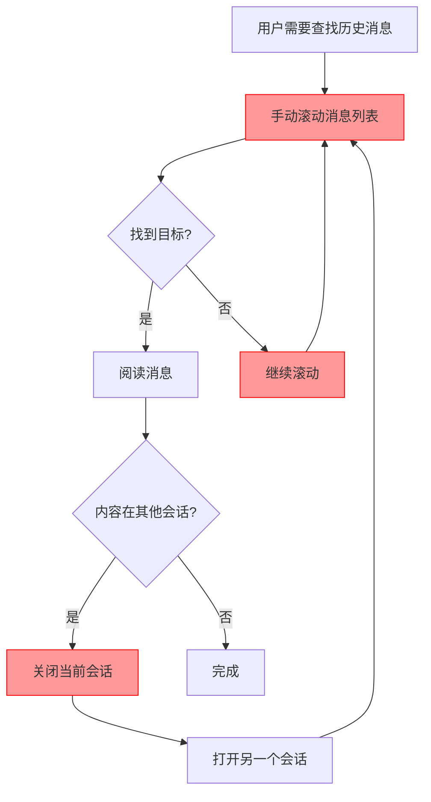
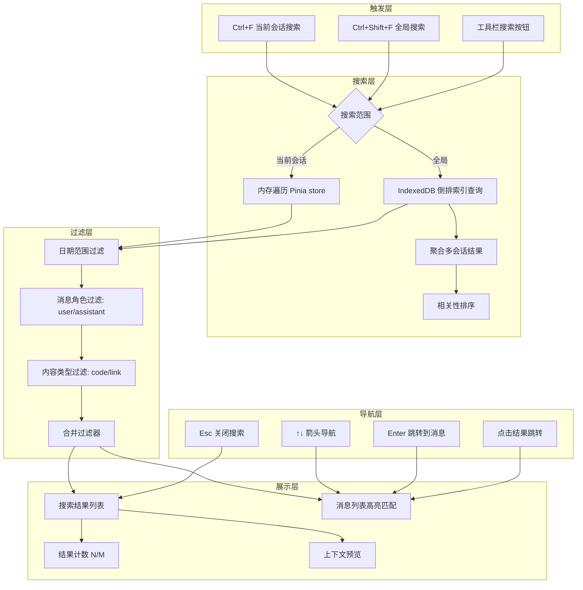
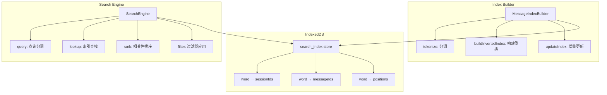

# YP-09-114: 会话内搜索 — 当前会话搜索、全局搜索、结果导航、过滤器与 IndexedDB 索引

> 需求编号：YP-09-114 · 优先级：P2 · 人天：0.3d · 状态：需求已编写
> 依赖：YP-09-43（消息搜索与过滤）、YP-09-79（IndexedDB 持久化）

## 背景

### 问题陈述

用户在 YiPet 中进行长时间对话后，会话历史可能包含数十甚至数百条消息。当需要回顾之前讨论过的某个具体内容时，用户只能手动滚动翻阅，效率极低。这导致：

1. **查找效率低下**：在长会话中手动滚动查找特定关键词，耗时且容易遗漏
2. **无法跨会话搜索**：用户可能记得某个话题讨论过，但不记得在哪个会话中，需要逐个打开会话查找
3. **搜索结果定位困难**：即使找到匹配消息，也需要手动滚动到对应位置，在虚拟滚动列表中尤其不便
4. **搜索粒度不足**：无法按消息角色（用户/助手）或内容类型（代码/链接）过滤，搜索结果噪音大
5. **搜索性能差**：每次搜索时遍历所有消息的全文，在大数据量下性能下降明显

**核心矛盾**：YiPet 的会话管理已有基础结构（YP-09-43），但搜索功能仅限于简单的关键词匹配，缺乏结果显示、导航、过滤和性能优化，用户在实际使用中无法高效检索历史对话。

### 影响范围

| # | 影响 | 严重程度 | 典型场景 |
|---|------|----------|----------|
| 1 | 长会话查找效率低 | 高 | 50+ 条消息的会话中查找特定内容 |
| 2 | 无法跨会话搜索 | 高 | 不记得话题在哪个会话中 |
| 3 | 搜索结果定位困难 | 中 | 找到匹配但无法快速跳转 |
| 4 | 搜索噪音大 | 中 | 代码块中的关键词干扰业务内容搜索 |
| 5 | 大量会话搜索性能差 | 中 | 100+ 会话时全文搜索耗时过长 |

### 挑战

| 挑战 | 说明 |
|------|------|
| 搜索高亮定位 | 在虚拟滚动列表中，匹配消息可能不在当前渲染范围内，需要 scrollTo 并等待渲染 |
| IndexedDB 全文搜索 | IndexedDB 不支持 LIKE 或全文索引，需要通过内存索引或外部索引库实现 |
| 搜索输入防抖 | 用户输入时需防抖（300ms），但 Enter 键应立即触发搜索 |
| 跨会话结果聚合 | 全局搜索需聚合多个会话的结果，按相关性排序，显示来源会话 |
| 结果预览上下文 | 需要截取匹配位置前后的文本作为预览，同时高亮匹配词 |

---

## 一、现状分析

### 1.1 当前搜索能力

```
现有能力:
├── 消息列表渲染                          # 虚拟滚动，支持大量消息
├── 会话列表展示                          # 显示所有会话标题和时间
├── sessionStore 消息数据                  # Pinia store 中缓存当前会话消息
├── IndexedDB 持久化                       # YP-09-79，会话数据持久化
└── 基础关键词过滤                         # YP-09-43，简单字符串匹配

缺失:
├── 搜索输入框 UI                          # ❌ 不存在
├── 当前会话搜索（Ctrl+F）                  # ❌ 不存在
├── 搜索结果列表                           # ❌ 不存在
├── 结果导航（↑↓ + N/M 计数器）             # ❌ 不存在
├── 匹配文本高亮 + 滚动定位                # ❌ 不存在
├── 全局跨会话搜索                         # ❌ 不存在
├── 搜索过滤器（日期/角色/代码/链接）        # ❌ 不存在
├── 搜索结果预览（上下文 + 高亮）            # ❌ 不存在
├── 键盘快捷键（Enter/Esc）                # ❌ 不存在
├── IndexedDB 搜索索引                     # ❌ 不存在
└── 搜索历史记录                           # ❌ 不存在
```

### 1.2 改造前搜索流程



### 1.3 根因矩阵

| 症状 | 根因 | 触发条件 | 频率 |
|------|------|----------|------|
| 查找效率低 | 无搜索功能 | 每次需要回顾历史消息 | 高 |
| 跨会话查找困难 | 无全局搜索 | 不记得内容在哪个会话 | 中 |
| 结果定位困难 | 无导航 + 高亮 | 长会话中找到匹配消息 | 中 |
| 搜索噪音大 | 无过滤器 | 代码/链接干扰关键词搜索 | 中 |
| 搜索性能差 | 无搜索索引 | 大量会话/消息 | 低 |

---

## 二、设计决策

### 决策 1：搜索实现方式 — 内存遍历 vs IndexedDB 查询 vs 外部索引库

| 选项 | 性能 | 实现复杂度 | 包体积 | 实时性 |
|------|------|-----------|--------|--------|
| 内存遍历（当前会话） | 最高（< 10ms） | 低 | 0KB | 实时 |
| IndexedDB 游标查询 | 中（< 100ms） | 中 | 0KB | 准实时 |
| 外部索引库（FlexSearch/Lunr） | 高（< 50ms） | 中 | ~10KB | 需手动同步 |

**选择：内存遍历 + IndexedDB 索引组合。** 当前会话搜索使用内存遍历（消息已在 Pinia store 中），响应最快。全局搜索使用 IndexedDB 存储预计算的搜索索引（分词 + 倒排索引），避免每次全量读取和解析。不引入外部索引库，利用 IndexedDB 的索引能力。

### 决策 2：搜索索引结构 — 倒排索引 vs 前缀树 vs 纯文本拼接

| 选项 | 查询速度 | 索引大小 | 更新成本 |
|------|----------|----------|----------|
| 倒排索引（词 → 消息列表） | 快 | 中（约为原文 1.5x） | 中（需分词） |
| 前缀树（Trie） | 中 | 大 | 高 |
| 纯文本拼接搜索 | 慢 | 0 | 低 |

**选择：倒排索引。** 对每条消息进行分词（基于空格和标点，中文按 bigram），构建 `词 → [{sessionId, messageId, position}]` 的映射。查询时直接查找匹配词的消息列表，无需遍历所有消息。索引存储在 IndexedDB 的独立 object store 中。

### 决策 3：搜索 UI 布局 — 顶部搜索栏 vs 侧边搜索面板 vs 浮动搜索框

| 选项 | 空间占用 | 可见性 | 操作便利性 |
|------|----------|--------|-----------|
| 顶部搜索栏（类似 VS Code） | 临时占用 40px | 高 | 高（Ctrl+F 唤起） |
| 侧边搜索面板 | 永久占用 200px+ | 高 | 中 |
| 浮动搜索框 | 零占用 | 中 | 中 |

**选择：顶部搜索栏（类似 VS Code Ctrl+F）。** 按 Ctrl+F 在聊天窗口顶部滑入搜索栏，包含搜索输入框、结果计数、导航箭头和过滤器按钮。Esc 关闭搜索栏，搜索结果高亮在消息列表中。不搜索时零空间占用，与主流编辑器体验一致。

### 决策 4：搜索结果排序 — 时间倒序 vs 相关性排序 vs 混合

| 选项 | 直观性 | 实现复杂度 | 适用场景 |
|------|--------|-----------|----------|
| 时间倒序（最新在前） | 高 | 低 | 当前会话搜索 |
| 相关性排序（匹配次数/位置） | 高 | 中 | 全局搜索 |
| 混合排序 | 中 | 高 | 两者兼顾 |

**选择：当前会话用时间顺序，全局搜索用相关性排序。** 当前会话搜索保持消息时间顺序（用户按 Ctrl+↑↓ 导航），匹配消息高亮；全局搜索按匹配次数降序 + 会话相关性排序，优先显示匹配度高的结果。

### 设计决策记录

| 决策 | 选项 A | 选项 B | 选项 C | 选择 | 理由 |
|------|--------|--------|--------|------|------|
| 搜索实现方式 | 内存遍历 | IndexedDB 查询 | 外部索引库 | **内存 + IndexedDB** | 零依赖 + 分层性能 |
| 搜索索引结构 | 倒排索引 | 前缀树 | 纯文本拼接 | **倒排索引** | 查询快 + 体积适中 |
| 搜索 UI 布局 | 顶部搜索栏 | 侧边面板 | 浮动框 | **顶部搜索栏** | VS Code 风格，零占用 |
| 搜索结果排序 | 时间倒序 | 相关性 | 混合 | **按场景分策略** | 当前会话 vs 全局不同 |

---

## 三、目标架构

### 3.1 搜索工作流



### 3.2 搜索索引架构



### 3.3 性能指标

| 指标 | 目标值 | 说明 |
|------|--------|------|
| 当前会话搜索响应 | < 50ms | 100 条消息，内存遍历 |
| 全局搜索响应 | < 200ms | 100 个会话，1000 条消息，索引查询 |
| 索引构建时间 | < 500ms | 1000 条消息首次索引 |
| 搜索结果高亮渲染 | < 16ms | 单条消息高亮匹配文本 |
| 搜索结果导航跳转 | < 100ms | 虚拟滚动定位到目标消息 |
| 搜索输入防抖 | 300ms | 输入停止后 300ms 触发搜索 |

---

## 四、具体改动

### 4.1 搜索服务

```typescript
// src/services/search-service.ts (新增)

interface SearchOptions {
  scope: 'current' | 'global';
  query: string;
  filters?: SearchFilters;
}

interface SearchFilters {
  dateRange?: { start: number; end: number };
  role?: 'user' | 'assistant';
  hasCode?: boolean;
  hasLink?: boolean;
}

interface SearchResult {
  sessionId: string;
  sessionTitle: string;
  messageId: string;
  messageIndex: number;
  content: string;
  role: 'user' | 'assistant';
  timestamp: number;
  matches: MatchPosition[];
  preview: string;
}

interface MatchPosition {
  start: number;
  end: number;
  previewContext: string;
}

class SearchService {
  private currentSessionResults: SearchResult[] = [];
  private currentResultIndex = -1;
  private searchIndex: InvertedIndex | null = null;

  /**
   * 在当前会话中搜索
   */
  searchCurrentSession(
    query: string,
    messages: ChatMessage[],
    filters?: SearchFilters
  ): SearchResult[] {
    const lowerQuery = query.toLowerCase();
    const results: SearchResult[] = [];

    for (let i = 0; i < messages.length; i++) {
      const msg = messages[i];
      if (!msg.content) continue;

      // 应用过滤器
      if (filters?.role && msg.role !== filters.role) continue;
      if (filters?.hasCode && !msg.content.includes('```')) continue;
      if (filters?.hasLink && !msg.content.includes('http')) continue;
      if (filters?.dateRange) {
        if (msg.timestamp < filters.dateRange.start || msg.timestamp > filters.dateRange.end) continue;
      }

      // 查找匹配位置
      const matches: MatchPosition[] = [];
      let pos = msg.content.toLowerCase().indexOf(lowerQuery);
      while (pos !== -1) {
        matches.push({
          start: pos,
          end: pos + query.length,
          previewContext: this.getPreviewContext(msg.content, pos, query.length),
        });
        pos = msg.content.toLowerCase().indexOf(lowerQuery, pos + 1);
      }

      if (matches.length > 0) {
        results.push({
          sessionId: messages[i].sessionId || '',
          sessionTitle: '',
          messageId: msg.id,
          messageIndex: i,
          content: msg.content,
          role: msg.role,
          timestamp: msg.timestamp,
          matches,
          preview: this.getPreviewContext(msg.content, matches[0].start, query.length),
        });
      }
    }

    this.currentSessionResults = results;
    this.currentResultIndex = results.length > 0 ? 0 : -1;
    return results;
  }

  /**
   * 全局搜索（使用 IndexedDB 索引）
   */
  async searchGlobal(
    query: string,
    filters?: SearchFilters
  ): Promise<SearchResult[]> {
    const index = await this.getSearchIndex();
    const tokens = this.tokenize(query.toLowerCase());
    const matchMap = new Map<string, SearchResult>();

    for (const token of tokens) {
      const messageIds = await index.lookup(token);
      if (!messageIds) continue;

      for (const ref of messageIds) {
        const key = `${ref.sessionId}:${ref.messageId}`;
        if (!matchMap.has(key)) {
          matchMap.set(key, {
            sessionId: ref.sessionId,
            sessionTitle: ref.sessionTitle,
            messageId: ref.messageId,
            messageIndex: ref.messageIndex,
            content: '',
            role: ref.role,
            timestamp: ref.timestamp,
            matches: [],
            preview: '',
          });
        }
        const result = matchMap.get(key)!;
        result.matches.push({
          start: ref.position,
          end: ref.position + token.length,
          previewContext: '',
        });
      }
    }

    // 按匹配次数排序
    const results = Array.from(matchMap.values())
      .sort((a, b) => b.matches.length - a.matches.length);

    // 补充预览内容
    for (const result of results) {
      const fullContent = await this.getMessageContent(result.messageId);
      result.content = fullContent;
      result.preview = this.getPreviewContext(fullContent, result.matches[0]?.start || 0, query.length);
    }

    return results;
  }

  /**
   * 获取匹配位置的上下文预览
   */
  private getPreviewContext(content: string, matchStart: number, matchLength: number): string {
    const contextLength = 60;
    const previewStart = Math.max(0, matchStart - contextLength);
    const previewEnd = Math.min(content.length, matchStart + matchLength + contextLength);
    let preview = content.substring(previewStart, previewEnd);

    if (previewStart > 0) preview = '...' + preview;
    if (previewEnd < content.length) preview = preview + '...';

    return preview;
  }

  /**
   * 导航到下一个/上一个结果
   */
  navigateNext(): SearchResult | null {
    if (this.currentSessionResults.length === 0) return null;
    this.currentResultIndex = (this.currentResultIndex + 1) % this.currentSessionResults.length;
    return this.currentSessionResults[this.currentResultIndex];
  }

  navigatePrev(): SearchResult | null {
    if (this.currentSessionResults.length === 0) return null;
    this.currentResultIndex = this.currentResultIndex <= 0
      ? this.currentSessionResults.length - 1
      : this.currentResultIndex - 1;
    return this.currentSessionResults[this.currentResultIndex];
  }

  getCurrentResult(): { index: number; total: number } {
    return {
      index: this.currentResultIndex + 1,
      total: this.currentSessionResults.length,
    };
  }

  /**
   * 分词（中英文混合）
   */
  private tokenize(text: string): string[] {
    // 英文/数字按空格和标点分词，中文按 bigram
    const tokens: string[] = [];
    const segments = text.split(/[\s,.;:!?，。；：！？]+/);

    for (const segment of segments) {
      if (/^[a-zA-Z0-9]+$/.test(segment)) {
        tokens.push(segment);
      } else {
        // 中文 bigram
        for (let i = 0; i < segment.length - 1; i++) {
          tokens.push(segment.substring(i, i + 2));
        }
        if (segment.length === 1) tokens.push(segment);
      }
    }

    return tokens;
  }

  private async getSearchIndex(): Promise<InvertedIndex> {
    if (!this.searchIndex) {
      this.searchIndex = new InvertedIndex();
      await this.searchIndex.load();
    }
    return this.searchIndex;
  }

  private async getMessageContent(messageId: string): Promise<string> {
    const db = await openSearchDB();
    const tx = db.transaction('messages', 'readonly');
    const store = tx.objectStore('messages');
    const msg = await store.get(messageId);
    return msg?.content || '';
  }
}
```

### 4.2 倒排索引实现

```typescript
// src/services/search-index.ts (新增)

interface IndexEntry {
  word: string;
  refs: MessageRef[];
}

interface MessageRef {
  sessionId: string;
  sessionTitle: string;
  messageId: string;
  messageIndex: number;
  role: 'user' | 'assistant';
  timestamp: number;
  position: number; // 匹配位置
}

class InvertedIndex {
  private db: IDBDatabase | null = null;
  private readonly DB_NAME = 'yipet_search_index';
  private readonly STORE_NAME = 'inverted_index';

  async load(): Promise<void> {
    this.db = await this.openDB();
  }

  async buildIndex(messages: Array<{
    sessionId: string;
    sessionTitle: string;
    messageId: string;
    messageIndex: number;
    role: 'user' | 'assistant';
    content: string;
    timestamp: number;
  }>): Promise<void> {
    const db = await this.openDB();
    const tx = db.transaction(this.STORE_NAME, 'readwrite');
    const store = tx.objectStore(this.STORE_NAME);

    // 清空旧索引
    await store.clear();

    const indexMap = new Map<string, MessageRef[]>();

    for (const msg of messages) {
      const tokens = this.tokenize(msg.content.toLowerCase());
      const processedPositions = new Set<string>();

      for (const token of tokens) {
        const pos = msg.content.toLowerCase().indexOf(token);
        if (pos === -1) continue;

        const dedupKey = `${token}:${pos}`;
        if (processedPositions.has(dedupKey)) continue;
        processedPositions.add(dedupKey);

        if (!indexMap.has(token)) {
          indexMap.set(token, []);
        }
        indexMap.get(token)!.push({
          sessionId: msg.sessionId,
          sessionTitle: msg.sessionTitle,
          messageId: msg.messageId,
          messageIndex: msg.messageIndex,
          role: msg.role,
          timestamp: msg.timestamp,
          position: pos,
        });
      }
    }

    // 写入 IndexedDB
    for (const [word, refs] of indexMap) {
      await store.put({ word, refs });
    }

    await new Promise<void>((resolve, reject) => {
      tx.oncomplete = () => resolve();
      tx.onerror = () => reject(tx.error);
    });
  }

  async lookup(word: string): Promise<MessageRef[] | null> {
    const db = await this.openDB();
    const tx = db.transaction(this.STORE_NAME, 'readonly');
    const store = tx.objectStore(this.STORE_NAME);
    const entry = await store.get(word.toLowerCase());
    return entry?.refs || null;
  }

  async updateMessage(
    sessionId: string,
    messageId: string,
    content: string,
    role: 'user' | 'assistant',
    timestamp: number
  ): Promise<void> {
    // 增量更新：先删除该消息的旧索引，再添加新索引
    await this.removeMessage(messageId);

    const tokens = this.tokenize(content.toLowerCase());
    const db = await this.openDB();
    const tx = db.transaction(this.STORE_NAME, 'readwrite');
    const store = tx.objectStore(this.STORE_NAME);

    for (const token of tokens) {
      const existing = await store.get(token);
      const refs = existing?.refs || [];
      const pos = content.toLowerCase().indexOf(token);

      refs.push({
        sessionId,
        sessionTitle: '',
        messageId,
        messageIndex: 0,
        role,
        timestamp,
        position: pos,
      });

      await store.put({ word: token, refs });
    }

    await new Promise<void>((resolve, reject) => {
      tx.oncomplete = () => resolve();
      tx.onerror = () => reject(tx.error);
    });
  }

  private async removeMessage(messageId: string): Promise<void> {
    // 遍历所有词条，移除该消息的引用
    const db = await this.openDB();
    const tx = db.transaction(this.STORE_NAME, 'readwrite');
    const store = tx.objectStore(this.STORE_NAME);
    const allEntries = await store.getAll();

    for (const entry of allEntries) {
      const filtered = entry.refs.filter((r: MessageRef) => r.messageId !== messageId);
      if (filtered.length !== entry.refs.length) {
        if (filtered.length === 0) {
          await store.delete(entry.word);
        } else {
          await store.put({ word: entry.word, refs: filtered });
        }
      }
    }
  }

  private tokenize(text: string): string[] {
    const tokens: string[] = [];
    const segments = text.split(/[\s,.;:!?，。；：！？]+/);

    for (const segment of segments) {
      if (/^[a-zA-Z0-9]+$/.test(segment)) {
        if (segment.length >= 2) tokens.push(segment);
      } else {
        for (let i = 0; i < segment.length - 1; i++) {
          tokens.push(segment.substring(i, i + 2));
        }
      }
    }

    return [...new Set(tokens)]; // 去重
  }

  private openDB(): Promise<IDBDatabase> {
    return new Promise((resolve, reject) => {
      const request = indexedDB.open(this.DB_NAME, 1);
      request.onupgradeneeded = () => {
        const db = request.result;
        if (!db.objectStoreNames.contains(this.STORE_NAME)) {
          db.createObjectStore(this.STORE_NAME, { keyPath: 'word' });
        }
      };
      request.onsuccess = () => resolve(request.result);
      request.onerror = () => reject(request.error);
    });
  }
}
```

### 4.3 搜索栏组件

```typescript
// src/components/SearchBar.vue (新增)

<script setup lang="ts">
import { ref, watch, onMounted, onUnmounted } from 'vue';
import { SearchService } from '@/services/search-service';
import type { SearchFilters, SearchResult } from '@/services/search-service';

const props = defineProps<{
  visible: boolean;
  scope: 'current' | 'global';
}>();

const emit = defineEmits<{
  close: [];
  'navigate-to': [result: SearchResult];
  'results-change': [results: SearchResult[]];
}>();

const searchService = new SearchService();
const query = ref('');
const results = ref<SearchResult[]>([]);
const currentIndex = ref(0);
const totalResults = ref(0);
const showFilters = ref(false);
const filters = ref<SearchFilters>({});

const inputRef = ref<HTMLInputElement>();

// 防抖搜索
let debounceTimer: ReturnType<typeof setTimeout>;

watch(query, (newQuery) => {
  clearTimeout(debounceTimer);
  debounceTimer = setTimeout(() => {
    performSearch(newQuery);
  }, 300);
});

function performSearch(q: string) {
  if (!q.trim()) {
    results.value = [];
    totalResults.value = 0;
    return;
  }

  if (props.scope === 'current') {
    // 从 Pinia store 获取当前会话消息
    const messages = getCurrentSessionMessages();
    results.value = searchService.searchCurrentSession(q, messages, filters.value);
  } else {
    searchService.searchGlobal(q, filters.value).then((r) => {
      results.value = r;
      totalResults.value = r.length;
    });
  }

  totalResults.value = results.value.length;
  emit('results-change', results.value);
}

function navigateNext() {
  const result = searchService.navigateNext();
  if (result) {
    emit('navigate-to', result);
    updateCounter();
  }
}

function navigatePrev() {
  const result = searchService.navigatePrev();
  if (result) {
    emit('navigate-to', result);
    updateCounter();
  }
}

function updateCounter() {
  const { index, total } = searchService.getCurrentResult();
  currentIndex.value = index;
  totalResults.value = total;
}

function handleKeydown(e: KeyboardEvent) {
  if (e.key === 'Enter') {
    e.preventDefault();
    if (e.shiftKey) {
      navigatePrev();
    } else {
      navigateNext();
    }
  } else if (e.key === 'Escape') {
    e.preventDefault();
    closeSearch();
  }
}

function closeSearch() {
  query.value = '';
  results.value = [];
  emit('close');
}

onMounted(() => {
  inputRef.value?.focus();
});

watch(() => props.visible, (v) => {
  if (v) {
    setTimeout(() => inputRef.value?.focus(), 100);
  }
});
</script>

<template>
  <Transition name="search-slide">
    <div v-if="visible" class="search-bar">
      <div class="search-input-wrapper">
        <span class="search-icon">🔍</span>
        <input
          ref="inputRef"
          v-model="query"
          type="text"
          :placeholder="scope === 'current' ? '在当前会话中搜索...' : '在所有会话中搜索...'"
          @keydown="handleKeydown"
        />
        <span class="search-counter" v-if="totalResults > 0">
          {{ currentIndex || 1 }} / {{ totalResults }}
        </span>
        <button class="search-nav-btn" @click="navigatePrev" :disabled="totalResults === 0" title="上一个 (Shift+Enter)">
          ↑
        </button>
        <button class="search-nav-btn" @click="navigateNext" :disabled="totalResults === 0" title="下一个 (Enter)">
          ↓
        </button>
        <button class="search-filter-btn" @click="showFilters = !showFilters" :class="{ active: showFilters }" title="过滤器">
          ⏷
        </button>
        <button class="search-close-btn" @click="closeSearch" title="关闭 (Esc)">
          ✕
        </button>
      </div>

      <!-- 过滤器面板 -->
      <div v-if="showFilters" class="search-filters">
        <div class="filter-group">
          <label>消息角色</label>
          <select v-model="filters.role" @change="performSearch(query)">
            <option value="">全部</option>
            <option value="user">用户</option>
            <option value="assistant">助手</option>
          </select>
        </div>
        <div class="filter-group">
          <label>
            <input type="checkbox" v-model="filters.hasCode" @change="performSearch(query)" />
            包含代码
          </label>
        </div>
        <div class="filter-group">
          <label>
            <input type="checkbox" v-model="filters.hasLink" @change="performSearch(query)" />
            包含链接
          </label>
        </div>
        <div class="filter-group">
          <label>日期范围</label>
          <input type="date" v-model="filters.dateRange.start" @change="performSearch(query)" />
          <span>至</span>
          <input type="date" v-model="filters.dateRange.end" @change="performSearch(query)" />
        </div>
      </div>

      <!-- 全局搜索结果列表 -->
      <div v-if="scope === 'global' && results.length > 0" class="search-results">
        <div
          v-for="result in results"
          :key="result.messageId"
          class="search-result-item"
          @click="emit('navigate-to', result)"
        >
          <div class="result-header">
            <span class="result-session">{{ result.sessionTitle }}</span>
            <span class="result-role">{{ result.role === 'user' ? '用户' : '助手' }}</span>
            <span class="result-matches">{{ result.matches.length }} 处匹配</span>
          </div>
          <div class="result-preview" v-html="highlightMatches(result.preview, query)"></div>
        </div>
      </div>
    </div>
  </Transition>
</template>
```

### 4.4 消息高亮显示

```typescript
// src/composables/useSearchHighlight.ts (新增)

export function useSearchHighlight() {
  const searchMatches = ref<Map<string, MatchPosition[]>>(new Map());

  /**
   * 高亮消息中的搜索匹配文本
   */
  function highlightMessageContent(content: string, messageId: string): string {
    const matches = searchMatches.value.get(messageId);
    if (!matches || matches.length === 0) return escapeHtml(content);

    let result = '';
    let lastIndex = 0;

    // 排序匹配位置
    const sorted = [...matches].sort((a, b) => a.start - b.start);

    for (const match of sorted) {
      // 添加匹配前的文本
      result += escapeHtml(content.substring(lastIndex, match.start));
      // 添加高亮的匹配文本
      result += `<mark class="search-highlight">${escapeHtml(content.substring(match.start, match.end))}</mark>`;
      lastIndex = match.end;
    }

    // 添加剩余文本
    result += escapeHtml(content.substring(lastIndex));
    return result;
  }

  /**
   * 滚动到匹配消息
   */
  function scrollToMessage(messageIndex: number, virtualListRef: any) {
    virtualListRef?.scrollToItem(messageIndex);
    // 高亮动画
    setTimeout(() => {
      const highlights = document.querySelectorAll('.search-highlight');
      highlights.forEach((el) => {
        el.classList.add('search-highlight--active');
        setTimeout(() => el.classList.remove('search-highlight--active'), 2000);
      });
    }, 100);
  }

  function setMatches(messageId: string, matches: MatchPosition[]) {
    searchMatches.value.set(messageId, matches);
  }

  function clearMatches() {
    searchMatches.value.clear();
  }

  return {
    highlightMessageContent,
    scrollToMessage,
    setMatches,
    clearMatches,
  };
}
```

### 4.5 文件变更清单

| 文件 | 操作 | 说明 |
|------|------|------|
| `src/services/search-service.ts` | 新增 | 搜索服务（当前/全局搜索、导航） |
| `src/services/search-index.ts` | 新增 | 倒排索引（IndexedDB 存储） |
| `src/components/SearchBar.vue` | 新增 | 搜索栏 UI 组件 |
| `src/components/SearchResults.vue` | 新增 | 全局搜索结果列表 |
| `src/composables/useSearchHighlight.ts` | 新增 | 搜索高亮 + 滚动定位 |
| `src/content/chat-window.vue` | 修改 | 集成搜索栏 |
| `src/stores/search.ts` | 新增 | 搜索状态管理 |

---

## 五、实施步骤

| 步骤 | 操作 | 路径 | 验证 | 人天 |
|------|------|------|------|------|
| 1 | 实现当前会话搜索逻辑 | `src/services/search-service.ts` | 关键词搜索返回匹配消息 | 0.05 |
| 2 | 实现搜索栏 UI 组件 | `src/components/SearchBar.vue` | Ctrl+F 唤起搜索栏 | 0.05 |
| 3 | 实现结果导航（↑↓ + N/M） | `src/services/search-service.ts` | 导航正确切换匹配消息 | 0.03 |
| 4 | 实现消息高亮 + 滚动定位 | `src/composables/useSearchHighlight.ts` | 匹配文本高亮 + 滚动 | 0.03 |
| 5 | 实现全局搜索（IndexedDB 索引） | `src/services/search-index.ts` | 跨会话搜索返回结果 | 0.05 |
| 6 | 实现搜索过滤器 | `src/components/SearchBar.vue` | 角色/代码/链接过滤生效 | 0.03 |
| 7 | 实现搜索结果预览 | `src/components/SearchResults.vue` | 上下文预览 + 高亮匹配 | 0.03 |
| 8 | 集成到聊天窗口 | `src/content/chat-window.vue` | 搜索栏在聊天窗口正常显示 | 0.03 |

**总人天：0.3d**

---

## 六、测试规格

### 场景 1：当前会话搜索

**GIVEN** 用户在一个包含 50 条消息的会话中
**WHEN** 按 Ctrl+F 打开搜索栏，输入关键词 "API"
**THEN** 搜索栏应显示在聊天窗口顶部
**AND** 所有包含 "API" 的消息应在消息列表中高亮显示匹配文本
**AND** 搜索栏应显示结果计数 "1 / 5"（5 条匹配，当前第 1 条）

### 场景 2：搜索结果导航

**GIVEN** 当前会话搜索返回 5 条匹配结果
**WHEN** 按 Enter 键（或点击 ↓ 箭头）
**THEN** 应滚动到下一个匹配消息，当前高亮位置更新
**AND** 计数器更新为 "2 / 5"
**WHEN** 按 Shift+Enter（或点击 ↑ 箭头）
**THEN** 应返回上一个匹配消息，计数器更新为 "1 / 5"
**AND** 在最后一个结果按 Enter 应循环到第一个结果

### 场景 3：搜索高亮显示

**GIVEN** 搜索关键词为 "Markdown"
**WHEN** 消息列表渲染匹配消息
**THEN** 消息中所有 "Markdown" 文本应被 `<mark>` 标签包裹并高亮显示
**AND** 高亮应区分大小写（默认不区分）
**AND** 当消息包含代码块时，代码块内的匹配也应高亮
**AND** 关闭搜索栏后，高亮应消失

### 场景 4：全局搜索

**GIVEN** 用户有 10 个会话，每个会话包含若干消息
**WHEN** 按 Ctrl+Shift+F 打开全局搜索，输入关键词
**THEN** 应显示所有会话中包含该关键词的消息
**AND** 每条结果显示：会话标题、消息角色、匹配次数、内容预览
**AND** 结果按相关性（匹配次数）降序排列
**AND** 点击结果应跳转到对应会话的对应消息

### 场景 5：搜索过滤器

**GIVEN** 搜索关键词为 "error"，当前会话包含用户和助手的多条匹配消息
**WHEN** 打开过滤器面板，选择角色为 "用户"
**THEN** 仅显示用户发送的包含 "error" 的消息
**AND** 勾选 "包含代码" 过滤器
**THEN** 仅显示同时包含代码块（```）和 "error" 的消息
**AND** 设置日期范围为最近 7 天
**THEN** 仅显示最近 7 天内发送的匹配消息

### 场景 6：搜索关闭与清理

**GIVEN** 搜索栏打开，有搜索结果和高亮
**WHEN** 按 Esc 键
**THEN** 搜索栏应关闭（滑出消失）
**AND** 消息列表中的高亮应清除
**AND** 搜索输入框内容应清空
**AND** 搜索结果状态应重置

---

## 七、风险与缓解

| 风险 | 概率 | 影响 | 缓解措施 |
|------|------|------|----------|
| IndexedDB 索引构建时间过长 | 中 | 中 | 索引构建在 Service Worker 中异步执行，使用 requestIdleCallback 分批处理 |
| 中文分词精度不足 | 中 | 中 | 使用 bigram 分词（连续两个字符），覆盖大部分中文词组；英文使用空格分词 |
| 索引存储空间过大 | 低 | 中 | 限制索引最大条目数（50000），超出时 LRU 淘汰旧条目 |
| 搜索高亮影响虚拟滚动性能 | 低 | 中 | 仅在可视区域内的消息进行高亮渲染，非可视区域延迟高亮 |
| 全局搜索跨会话跳转逻辑复杂 | 低 | 中 | 先加载目标会话，再定位到消息，使用 sessionId + messageIndex 双重定位 |

---

## 八、回滚策略

| 场景 | 回滚操作 | 影响 |
|------|----------|------|
| 搜索性能影响聊天渲染 | 禁用搜索功能，隐藏搜索栏入口 | 失去搜索能力 |
| IndexedDB 索引构建失败 | 全局搜索降级为纯内存遍历搜索 | 全局搜索性能下降 |
| 搜索高亮渲染异常 | 关闭高亮显示，仅保留结果列表导航 | 失去视觉高亮反馈 |
| 搜索栏 UI 布局错乱 | 隐藏搜索栏，恢复纯消息列表 | 失去搜索 UI |

---

## 九、设计决策记录

### D-01：中文分词策略

- **问题**：如何对中文文本进行分词以构建搜索索引
- **选项**：引入分词库（如结巴分词）、bigram 分词、单字索引
- **选择**：bigram 分词（连续两个字符组成的词）
- **理由**：引入分词库增加包体积（~100KB+），bigram 分词零依赖，覆盖大部分中文词组（如 "搜索"、"索引"、"会话"），且索引大小可控。对于单字搜索，降级为全文遍历

### D-02：搜索索引更新时机

- **问题**：何时更新 IndexedDB 搜索索引
- **选项**：每次消息发送时实时更新、定时批量更新、关闭扩展时更新
- **选择**：每次消息发送/接收时实时增量更新
- **理由**：搜索索引需要准实时性，延迟更新会导致最新消息不可搜索。增量更新仅修改受影响词条的引用列表，性能开销可控（单条消息 < 10ms）

### D-03：搜索高亮实现方式

- **问题**：如何在消息列表中高亮搜索匹配文本
- **选项**：CSS `::highlight` API、`<mark>` 标签注入、Canvas 覆盖层
- **选择**：`<mark>` 标签注入（v-html）
- **理由**：CSS `::highlight` API 兼容性有限（Chrome 105+），Canvas 覆盖层实现复杂。`<mark>` 标签是最传统且兼容的方案，通过 v-html 注入高亮后的 HTML，配合 XSS 防护（escapeHtml）确保安全

### D-04：全局搜索跨会话跳转

- **问题**：全局搜索结果如何跳转到目标会话的具体消息
- **选项**：直接切换会话 + 定位消息、新窗口打开、仅显示消息不跳转
- **选择**：直接切换会话 + 虚拟滚动定位
- **理由**：用户点击全局搜索结果时期望直接看到目标消息。切换会话后通过 `scrollToItem` 定位到目标消息索引，同时应用搜索高亮。如果目标会话尚未加载，先异步加载会话数据再定位

---

## 十、可观测性

### 指标

| 指标 | 类型 | 说明 |
|------|------|------|
| `yipet.search.current_session_count` | Counter | 当前会话搜索次数 |
| `yipet.search.global_count` | Counter | 全局搜索次数 |
| `yipet.search.query_length` | Histogram | 搜索关键词长度分布 |
| `yipet.search.result_count` | Histogram | 搜索结果数量分布 |
| `yipet.search.navigation_count` | Counter | 搜索结果导航次数 |
| `yipet.search.filter_use_count` | Counter | 过滤器使用次数（按类型） |
| `yipet.search.index_build_ms` | Histogram | 索引构建耗时 |
| `yipet.search.query_ms` | Histogram | 搜索查询耗时 |
| `yipet.search.no_result_count` | Counter | 无结果搜索次数 |

### 告警

| 告警 | 条件 | 级别 |
|------|------|------|
| 搜索查询耗时 > 500ms | 最近 100 次查询 | WARNING |
| 索引构建失败率 > 5% | 最近 50 次构建 | WARNING |
| 无结果搜索率 > 50% | 最近 100 次搜索 | INFO |
| 索引存储 > 50MB | 单次检查 | WARNING |

---

## 十一、代码审查检查清单

- [ ] `searchCurrentSession` 正确处理空消息和空内容
- [ ] 搜索关键词转义正则特殊字符，防止正则注入
- [ ] 高亮 HTML 注入前对消息内容进行 `escapeHtml` 处理
- [ ] 搜索索引在 `requestIdleCallback` 中构建，不阻塞主线程
- [ ] 全局搜索跳转前确认目标会话已加载，提供加载状态
- [ ] 搜索输入 300ms 防抖，但 Enter 键立即触发搜索
- [ ] Esc 键正确关闭搜索栏并清理状态
- [ ] 搜索结果导航支持循环（最后一个 → 第一个）
- [ ] 过滤器变更时自动重新搜索（带防抖）
- [ ] 搜索栏在 Shadow DOM 中正确渲染，样式隔离

---

## 回归问题预测

| # | 预测问题 | 原因 | 验证方法 |
|---|---------|------|---------|
| 1 | 虚拟滚动列表中，搜索匹配消息在可视区域外，`scrollToItem` 调用后高亮未渲染，用户看到跳转但无高亮 | 虚拟滚动仅渲染可视区域 + 缓冲区，`scrollToItem` 触发滚动后列表重渲染有延迟，高亮逻辑在重渲染前执行导致 DOM 不存在 | 在 200 条消息的会话中搜索底部消息，观察跳转后是否同时显示高亮 |
| 2 | 搜索索引在 Service Worker 休眠时未更新，用户新消息发送后立即搜索找不到，索引落后于实际消息 | Service Worker 可能被浏览器休眠，`requestIdleCallback` 中的索引构建任务未执行，增量更新丢失 | 发送消息后立即 Ctrl+F 搜索消息内容，确认搜索结果包含最新消息 |
| 3 | 中文 bigram 分词导致短关键词搜索（如单字 "错"）无法命中索引，降级为全文遍历时性能下降 | bigram 最小粒度为 2 字符，单字搜索无法命中索引，回退到遍历所有消息全文匹配，在 1000+ 消息时性能下降明显 | 搜索单字 "错"，确认搜索耗时 < 200ms，且结果正确 |
| 4 | 搜索高亮在 Markdown 渲染后的 HTML 中注入 `<mark>` 标签，可能破坏 Markdown 渲染的 DOM 结构，导致样式异常 | Markdown 渲染后生成复杂 DOM（代码块、表格、列表），在渲染后的 HTML 中替换文本为 `<mark>` 标签可能破坏 DOM 层级 | 搜索代码块中的关键词，确认高亮后代码块样式正常，无 DOM 结构破坏 |
| 5 | 全局搜索时，用户在当前会话中打开了搜索栏，但当前会话的 Pinia store 数据与 IndexedDB 索引不同步，搜索结果不包含当前会话最新消息 | 搜索索引在消息发送后增量更新，但 Pinia store 和 IndexedDB 之间的同步存在时序问题，最新消息可能未入索引 | 在会话 A 中发送消息，立即打开全局搜索，确认搜索结果包含刚发送的消息 |
| 6 | 过滤器中"包含代码"的判断使用 `includes('```')`，但消息内容中用户引用 Markdown 语法示例（如 "使用 ``` 包裹代码"）也会被误判为包含代码 | 简单的字符串包含检测无法区分实际的代码块和代码块语法的文字说明，过滤器结果不准确 | 搜索包含 "使用 ``` 包裹代码" 的消息，勾选 "包含代码" 过滤器，确认误判率在可接受范围内 |

---

## 性能分析

### 搜索流程各阶段耗时

| 阶段 | 预估耗时 | 说明 |
|------|----------|------|
| 搜索栏打开（Ctrl+F） | < 50ms | Vue 组件挂载 + CSS 过渡动画 |
| 搜索输入防抖等待 | 300ms | 用户输入停止后等待 |
| 当前会话搜索（100 条消息） | < 10ms | 内存遍历 + 字符串匹配 |
| 当前会话搜索（1000 条消息） | < 50ms | 内存遍历 + 字符串匹配 |
| 全局搜索（IndexedDB 索引） | < 50ms | 索引查询 + 词条查找 |
| 全局搜索（100 个会话，1000 条消息） | < 100ms | 索引查询 + 结果聚合排序 |
| 消息高亮渲染（单条消息） | < 5ms | 正则替换 + v-html 渲染 |
| 虚拟滚动定位 | < 100ms | scrollToItem + 等待重渲染 |
| 索引构建（1000 条消息） | < 500ms | 分词 + 倒排索引写入 IndexedDB |
| 索引增量更新（单条消息） | < 10ms | 分词 + 更新词条引用 |
| **总计（当前会话搜索端到端）** | **~400ms** | 含 300ms 防抖 + 10ms 搜索 |
| **总计（全局搜索端到端）** | **~500ms** | 含 300ms 防抖 + 100ms 搜索 |

### 文件体积预估

| 文件 | 大小 | 说明 |
|------|------|------|
| `src/services/search-service.ts` | ~4KB | 搜索核心逻辑 + 导航 |
| `src/services/search-index.ts` | ~3KB | 倒排索引 + IndexedDB 操作 |
| `src/components/SearchBar.vue` | ~5KB | 搜索栏 UI + 过滤器面板 |
| `src/components/SearchResults.vue` | ~2KB | 全局搜索结果列表 |
| `src/composables/useSearchHighlight.ts` | ~1.5KB | 高亮 + 滚动定位 |
| `src/stores/search.ts` | ~1KB | 搜索状态管理 |
| `src/content/chat-window.vue` (修改) | +0.5KB | 集成搜索栏 |