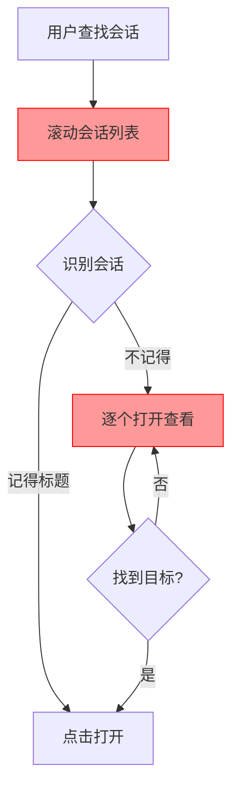
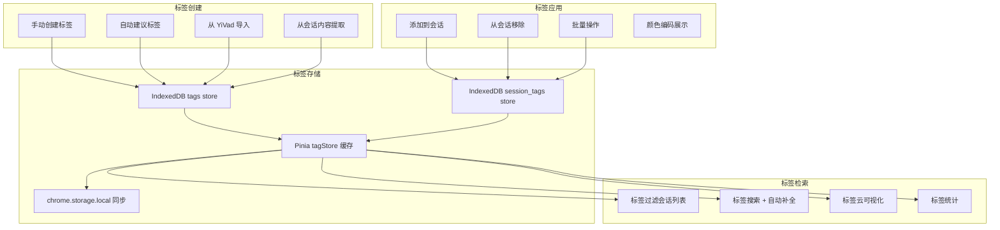

# YP-09-115: 会话标签与分类管理 — 会话标签系统、标签分类、颜色编码、智能建议与标签云可视化

> 需求编号：YP-09-115 · 优先级：P2 · 人天：0.3d · 状态：需求已编写
> 依赖：YP-09-59（会话标签自动生成）、YP-09-09（跨项目桥接可靠性）

## 背景

### 问题陈述

随着用户使用 YiPet 进行越来越多的对话，会话列表不断增长（数十甚至上百个会话），用户面临严重的会话管理困境。当前会话列表仅按时间排序，缺乏有效的分类和检索手段，导致：

1. **会话定位困难**：用户需要在长列表中滚动查找特定会话，依赖记忆会话标题和时间
2. **缺乏分类体系**：无法按主题（如"前端开发"、"Python 学习"）、项目或语言对会话进行归类
3. **视觉辨识度低**：会话列表项外观相似，仅靠标题文本区分，扫描效率低
4. **跨项目一致性差**：YiVad 管理后台已有项目标签体系，但 YiPet 会话无法复用，用户需要在两个系统间维护独立的分类
5. **标签管理缺失**：无法批量添加/删除标签，无法查看标签覆盖的会话范围

**核心矛盾**：YiPet 会话数量已达管理阈值，但缺少结构化的分类和检索手段，用户被迫依赖记忆和手动滚动，会话管理效率随使用时间增长而线性下降。

### 影响范围

| # | 影响 | 严重程度 | 典型场景 |
|---|------|----------|----------|
| 1 | 会话定位困难 | 高 | 50+ 会话中查找特定会话 |
| 2 | 缺乏分类体系 | 高 | 无法按主题归组相关会话 |
| 3 | 视觉辨识度低 | 中 | 会话列表快速扫描效率低 |
| 4 | 跨项目标签不一致 | 中 | YiVad 项目标签无法在 YiPet 中复用 |
| 5 | 标签管理缺失 | 低 | 无法批量操作标签 |

### 挑战

| 挑战 | 说明 |
|------|------|
| 标签自动建议 | 需要分析会话首条消息内容，提取关键词作为标签建议，但中文关键词提取准确度有限 |
| 标签颜色分配 | 需要为每个标签自动分配可辨识的颜色，且颜色需在浅色/深色主题下都有足够对比度 |
| 跨项目标签同步 | YiVad 项目标签存储在 MongoDB，YiPet 需要通过 RPC 获取并缓存到本地 |
| 标签云渲染 | 大量标签（50+）时标签云布局需高效计算，避免布局抖动 |
| 标签搜索性能 | 标签过滤 + 会话列表渲染需要优化，避免在大量会话时出现卡顿 |

---

## 一、现状分析

### 1.1 当前标签能力

```
现有能力:
├── 会话列表按时间排序                    # 基础的排序方式
├── 会话标题展示                          # 自动生成或手动编辑
├── sessionStore 会话数据                 # Pinia store 中缓存会话列表
├── 跨项目桥接（YiPet → YiVad）           # YP-09-09，可通过 session key 跳转
└── 会话标签自动生成（基础）               # YP-09-59，简单关键词提取

缺失:
├── 会话标签添加/删除 UI                   # ❌ 不存在
├── 标签分类体系（主题/项目/语言/自定义）    # ❌ 不存在
├── 标签颜色编码                           # ❌ 不存在
├── 标签过滤和排序                         # ❌ 不存在
├── 标签自动建议（基于会话内容）            # ❌ 不存在
├── 标签云可视化                           # ❌ 不存在
├── 从 YiVad 导入项目标签                  # ❌ 不存在
├── 标签搜索自动补全                       # ❌ 不存在
├── 批量标签操作                           # ❌ 不存在
└── 标签统计（每个标签的会话数）            # ❌ 不存在
```

### 1.2 改造前会话管理流程



### 1.3 根因矩阵

| 症状 | 根因 | 触发条件 | 频率 |
|------|------|----------|------|
| 会话定位困难 | 无分类/标签系统 | 会话数 > 20 | 高 |
| 缺乏分类体系 | 无标签管理功能 | 按主题查找会话 | 高 |
| 视觉辨识度低 | 无颜色编码 | 快速扫描会话列表 | 中 |
| 跨项目标签不一致 | 无标签同步机制 | 同时使用 YiVad 和 YiPet | 中 |
| 标签管理效率低 | 无批量操作 | 整理大量历史会话 | 中 |

---

## 二、设计决策

### 决策 1：标签存储位置 — Pinia Store 仅内存 vs localStorage 持久化 vs IndexedDB

| 选项 | 持久性 | 容量 | 跨会话共享 |
|------|--------|------|-----------|
| Pinia Store（仅内存） | 标签页关闭即丢失 | 无限 | 否 |
| localStorage | 持久 | ~5MB | 否（单标签页） |
| IndexedDB | 持久 | 无限 | 是（通过 SW） |

**选择：IndexedDB 存储 + Pinia Store 缓存。** 标签数据需要持久化，且标签-会话关联关系需要跨标签页共享（通过 `chrome.storage.local` 同步）。IndexedDB 作为主存储，Pinia Store 作为运行时缓存，`chrome.storage.local` 用于跨标签页标签变更通知。

### 决策 2：标签分类体系 — 预设分类 vs 自由标签 vs 混合

| 选项 | 灵活性 | 一致性 | 用户学习成本 |
|------|--------|--------|-------------|
| 预设分类（主题/项目/语言等） | 低 | 高 | 低 |
| 自由标签（用户自定义） | 高 | 低 | 中 |
| 混合（预设分类 + 自由标签） | 高 | 中 | 中 |

**选择：混合分类体系。** 提供 4 种预设分类（主题 topic、项目 project、语言 language、自定义 custom），每种分类下有预定义标签建议，同时允许用户创建自定义标签。分类用于标签分组和颜色主题，标签本身不强制归属分类。

### 决策 3：标签颜色方案 — 用户自定义 vs 自动分配 vs 预设调色板

| 选项 | 个性化 | 一致性 | 可访问性 |
|------|--------|--------|----------|
| 用户自定义颜色 | 高 | 低 | 不可控 |
| 自动分配（哈希颜色） | 中 | 高 | 可控 |
| 预设调色板（固定 12 色） | 低 | 高 | 可控 |

**选择：自动分配（哈希颜色）+ 预设调色板。** 使用标签文本的哈希值从 12 色调色板中选取颜色，确保同一标签始终使用同一颜色。用户可在设置中手动覆盖颜色。12 色调色板经过对比度测试（WCAG AA 级），在浅色和深色主题下均可辨识。

### 决策 4：标签自动建议来源 — 本地分析 vs 服务端 AI vs 规则引擎

| 选项 | 准确度 | 延迟 | 隐私 |
|------|--------|------|------|
| 本地分析（TF-IDF 关键词提取） | 中 | 低 | 高 |
| 服务端 AI（YiAi LLM 分析） | 高 | 高 | 低 |
| 规则引擎（正则匹配模式） | 低 | 低 | 高 |

**选择：本地分析 + 服务端 AI 可选。** 默认使用本地 TF-IDF 关键词提取（分析会话首条消息），快速给出建议标签。用户可在设置中启用"AI 标签建议"，将首条消息发送到 YiAi 进行智能分析（需用户确认，隐私优先）。规则引擎作为补充，匹配常见模式（如技术栈名称、框架名）。

### 设计决策记录

| 决策 | 选项 A | 选项 B | 选项 C | 选择 | 理由 |
|------|--------|--------|--------|------|------|
| 标签存储位置 | Pinia | localStorage | IndexedDB | **IndexedDB + Pinia** | 持久 + 大容量 + 跨标签页 |
| 标签分类体系 | 预设分类 | 自由标签 | 混合 | **混合分类** | 灵活 + 有结构 |
| 标签颜色方案 | 用户自定义 | 自动分配 | 预设调色板 | **自动 + 预设** | 一致 + 可访问 |
| 标签自动建议 | 本地分析 | 服务端 AI | 规则引擎 | **本地 + AI 可选** | 隐私优先 + 可选增强 |

---

## 三、目标架构

### 3.1 标签管理工作流



### 3.2 标签数据模型

```mermaid
graph TD
    subgraph "Tag"
        A[Tag]
        A --> A1[id: string]
        A --> A2[name: string]
        A --> A3[category: topic|project|language|custom]
        A --> A4[color: string]
        A --> A5[createdAt: number]
        A --> A6[usageCount: number]
    end
    
    subgraph "SessionTag"
        B[SessionTag]
        B --> B1[sessionKey: string]
        B --> B2[tagId: string]
        B --> B3[addedAt: number]
    end
    
    subgraph "TagCategory"
        C[TagCategory]
        C --> C1[topic: 主题标签]
        C --> C2[project: 项目标签]
        C --> C3[language: 语言标签]
        C --> C4[custom: 自定义标签]
    end
    
    A --> B
    A --> C
```

### 3.3 性能指标

| 指标 | 目标值 | 说明 |
|------|--------|------|
| 标签列表渲染 | < 50ms | 100 个标签渲染 |
| 标签过滤会话列表 | < 100ms | 100 个会话，按标签过滤 |
| 标签云渲染 | < 100ms | 50 个标签，计算布局 |
| 标签自动建议 | < 500ms | 本地 TF-IDF 分析 |
| 标签搜索自动补全 | < 16ms | 输入时实时过滤 |
| 从 YiVad 导入标签 | < 2s | 网络请求 + 数据转换 |

---

## 四、具体改动

### 4.1 标签服务

```typescript
// src/services/tag-service.ts (新增)

interface Tag {
  id: string;
  name: string;
  category: 'topic' | 'project' | 'language' | 'custom';
  color: string;
  createdAt: number;
  usageCount: number;
}

interface SessionTag {
  sessionKey: string;
  tagId: string;
  addedAt: number;
}

// 预设 12 色调色板（WCAG AA 对比度通过）
const TAG_COLORS = [
  '#2563EB', '#7C3AED', '#DB2777', '#DC2626',
  '#EA580C', '#CA8A04', '#16A34A', '#0891B2',
  '#4F46E5', '#9333EA', '#C026D3', '#0D9488',
];

// 预设分类及推荐标签
const PRESET_TAGS: Record<string, string[]> = {
  topic: ['前端开发', '后端开发', 'AI/机器学习', 'DevOps', '测试', '架构设计', '代码审查', 'Bug 修复', '性能优化', '文档编写'],
  project: ['YiVad', 'YiAi', 'YiPet', 'YiKnowledge', '个人项目'],
  language: ['TypeScript', 'JavaScript', 'Python', 'Vue', 'React', 'Go', 'Rust', 'SQL', 'CSS/HTML', 'Shell'],
  custom: [],
};

class TagService {
  private db: IDBDatabase | null = null;

  /**
   * 哈希标签名获取颜色
   */
  getColorForTag(tagName: string): string {
    let hash = 0;
    for (let i = 0; i < tagName.length; i++) {
      hash = ((hash << 5) - hash) + tagName.charCodeAt(i);
      hash |= 0;
    }
    return TAG_COLORS[Math.abs(hash) % TAG_COLORS.length];
  }

  /**
   * 创建标签
   */
  async createTag(name: string, category: Tag['category'] = 'custom'): Promise<Tag> {
    const id = crypto.randomUUID();
    const tag: Tag = {
      id,
      name: name.trim(),
      category,
      color: this.getColorForTag(name),
      createdAt: Date.now(),
      usageCount: 0,
    };

    await this.saveTag(tag);
    return tag;
  }

  /**
   * 获取所有标签
   */
  async getAllTags(): Promise<Tag[]> {
    const db = await this.getDB();
    const tx = db.transaction('tags', 'readonly');
    const store = tx.objectStore('tags');
    return await store.getAll();
  }

  /**
   * 为会话添加标签
   */
  async addTagToSession(sessionKey: string, tagId: string): Promise<void> {
    const db = await this.getDB();
    const tx = db.transaction(['session_tags', 'tags'], 'readwrite');
    const sessionTagStore = tx.objectStore('session_tags');
    const tagStore = tx.objectStore('tags');

    // 添加关联
    await sessionTagStore.put({
      sessionKey,
      tagId,
      addedAt: Date.now(),
    });

    // 更新标签使用计数
    const tag = await tagStore.get(tagId);
    if (tag) {
      tag.usageCount = (tag.usageCount || 0) + 1;
      await tagStore.put(tag);
    }

    await new Promise<void>((resolve, reject) => {
      tx.oncomplete = () => resolve();
      tx.onerror = () => reject(tx.error);
    });
  }

  /**
   * 从会话移除标签
   */
  async removeTagFromSession(sessionKey: string, tagId: string): Promise<void> {
    const db = await this.getDB();
    const tx = db.transaction(['session_tags', 'tags'], 'readwrite');
    const sessionTagStore = tx.objectStore('session_tags');
    const tagStore = tx.objectStore('tags');

    await sessionTagStore.delete(`${sessionKey}:${tagId}`);

    const tag = await tagStore.get(tagId);
    if (tag) {
      tag.usageCount = Math.max(0, (tag.usageCount || 0) - 1);
      await tagStore.put(tag);
    }
  }

  /**
   * 获取会话的所有标签
   */
  async getTagsForSession(sessionKey: string): Promise<Tag[]> {
    const db = await this.getDB();
    const tx = db.transaction(['session_tags', 'tags'], 'readonly');
    const sessionTagStore = tx.objectStore('session_tags');
    const tagStore = tx.objectStore('tags');

    const sessionTags = await sessionTagStore.getAll();
    const tagIds = sessionTags
      .filter((st: SessionTag) => st.sessionKey === sessionKey)
      .map((st: SessionTag) => st.tagId);

    const tags: Tag[] = [];
    for (const tagId of tagIds) {
      const tag = await tagStore.get(tagId);
      if (tag) tags.push(tag);
    }

    return tags;
  }

  /**
   * 按标签过滤会话
   */
  async getSessionsByTag(tagId: string): Promise<string[]> {
    const db = await this.getDB();
    const tx = db.transaction('session_tags', 'readonly');
    const store = tx.objectStore('session_tags');
    const allSessionTags: SessionTag[] = await store.getAll();
    return allSessionTags
      .filter((st) => st.tagId === tagId)
      .map((st) => st.sessionKey);
  }

  /**
   * 获取标签云数据（按使用频率）
   */
  async getTagCloudData(): Promise<Array<{ tag: Tag; weight: number }>> {
    const tags = await this.getAllTags();
    const maxCount = Math.max(1, ...tags.map((t) => t.usageCount));

    return tags
      .filter((t) => t.usageCount > 0)
      .map((tag) => ({
        tag,
        weight: tag.usageCount / maxCount, // 0-1 归一化
      }))
      .sort((a, b) => b.weight - a.weight);
  }

  /**
   * 标签自动建议（基于文本内容）
   */
  suggestTags(text: string): string[] {
    const suggestions: Array<{ tag: string; score: number }> = [];
    const lowerText = text.toLowerCase();

    // 规则引擎：匹配技术栈关键词
    const keywordPatterns: Array<{ pattern: RegExp; tags: string[] }> = [
      { pattern: /\bvue\b/i, tags: ['Vue', '前端开发'] },
      { pattern: /\breact\b/i, tags: ['React', '前端开发'] },
      { pattern: /\bpython\b/i, tags: ['Python', '后端开发'] },
      { pattern: /\btypescript\b/i, tags: ['TypeScript'] },
      { pattern: /\bjavascript\b/i, tags: ['JavaScript'] },
      { pattern: /\bdocker\b/i, tags: ['DevOps'] },
      { pattern: /\bapi\b/i, tags: ['后端开发', 'API设计'] },
      { pattern: /\bbug\b|\b缺陷\b|\b错误\b/i, tags: ['Bug 修复'] },
      { pattern: /\b性能\b|\bperformance\b/i, tags: ['性能优化'] },
      { pattern: /\btest\b|\b测试\b/i, tags: ['测试'] },
      { pattern: /\brag\b|\b向量\b|\bembedding\b/i, tags: ['AI/机器学习'] },
      { pattern: /\bchrome\b|\b扩展\b|\bextension\b/i, tags: ['YiPet'] },
      { pattern: /\bfastapi\b|\b后端\b/i, tags: ['YiAi', 'Python'] },
      { pattern: /\bmongodb\b|\b数据库\b/i, tags: ['后端开发', '数据库'] },
    ];

    for (const { pattern, tags } of keywordPatterns) {
      if (pattern.test(lowerText)) {
        for (const tag of tags) {
          const existing = suggestions.find((s) => s.tag === tag);
          if (existing) {
            existing.score += 1;
          } else {
            suggestions.push({ tag, score: 1 });
          }
        }
      }
    }

    // 简单 TF-IDF：提取高频词
    const words = text.split(/[\s,.;:!?，。；：！？]+/).filter((w) => w.length >= 2);
    const wordFreq = new Map<string, number>();
    for (const word of words) {
      wordFreq.set(word, (wordFreq.get(word) || 0) + 1);
    }

    // 取前 5 个高频词作为建议
    const topWords = [...wordFreq.entries()]
      .sort((a, b) => b[1] - a[1])
      .slice(0, 5)
      .filter(([_, count]) => count >= 2)
      .map(([word]) => word);

    for (const word of topWords) {
      if (!suggestions.find((s) => s.tag === word)) {
        suggestions.push({ tag: word, score: 0.5 });
      }
    }

    return suggestions
      .sort((a, b) => b.score - a.score)
      .slice(0, 8)
      .map((s) => s.tag);
  }

  /**
   * 从 YiVad 导入标签
   */
  async importFromYiVad(): Promise<number> {
    try {
      const response = await fetch(`${apiBase}/`, {
        method: 'POST',
        headers: { 'Content-Type': 'application/json' },
        body: JSON.stringify({
          module_name: 'services.data.data_service',
          method_name: 'query_documents',
          parameters: {
            cname: 'project_tags',
            filter: {},
          },
        }),
      });

      const { code, data } = await response.json();
      if (code !== 0) return 0;

      let importedCount = 0;
      for (const item of data) {
        const existingTag = await this.findTagByName(item.name);
        if (!existingTag) {
          await this.createTag(item.name, 'project');
          importedCount++;
        }
      }

      return importedCount;
    } catch {
      return 0;
    }
  }

  private async findTagByName(name: string): Promise<Tag | null> {
    const tags = await this.getAllTags();
    return tags.find((t) => t.name.toLowerCase() === name.toLowerCase()) || null;
  }

  private async saveTag(tag: Tag): Promise<void> {
    const db = await this.getDB();
    const tx = db.transaction('tags', 'readwrite');
    const store = tx.objectStore('tags');
    await store.put(tag);
  }

  private getDB(): Promise<IDBDatabase> {
    if (this.db) return Promise.resolve(this.db);
    return new Promise((resolve, reject) => {
      const request = indexedDB.open('yipet_tags', 1);
      request.onupgradeneeded = () => {
        const db = request.result;
        if (!db.objectStoreNames.contains('tags')) {
          db.createObjectStore('tags', { keyPath: 'id' });
        }
        if (!db.objectStoreNames.contains('session_tags')) {
          const store = db.createObjectStore('session_tags', { keyPath: ['sessionKey', 'tagId'].join(':') });
          store.createIndex('sessionKey', 'sessionKey', { unique: false });
          store.createIndex('tagId', 'tagId', { unique: false });
        }
      };
      request.onsuccess = () => {
        this.db = request.result;
        resolve(request.result);
      };
      request.onerror = () => reject(request.error);
    });
  }
}
```

### 4.2 标签管理组件

```typescript
// src/components/TagManager.vue (新增)

<script setup lang="ts">
import { ref, computed, onMounted } from 'vue';
import { TagService } from '@/services/tag-service';
import type { Tag } from '@/services/tag-service';

const props = defineProps<{
  sessionKey: string;
}>();

const emit = defineEmits<{
  'tags-changed': [];
}>();

const tagService = new TagService();
const allTags = ref<Tag[]>([]);
const sessionTags = ref<Tag[]>([]);
const suggestedTags = ref<string[]>([]);
const showTagInput = ref(false);
const tagInput = ref('');
const showSuggestions = ref(false);
const activeCategory = ref<string>('all');

const categories = [
  { key: 'all', label: '全部' },
  { key: 'topic', label: '主题' },
  { key: 'project', label: '项目' },
  { key: 'language', label: '语言' },
  { key: 'custom', label: '自定义' },
];

const filteredTags = computed(() => {
  if (activeCategory.value === 'all') return allTags.value;
  return allTags.value.filter((t) => t.category === activeCategory.value);
});

const tagInputSuggestions = computed(() => {
  if (!tagInput.value.trim()) return [];
  const lower = tagInput.value.toLowerCase();
  return allTags.value
    .filter((t) => t.name.toLowerCase().includes(lower))
    .slice(0, 5);
});

onMounted(async () => {
  await loadTags();
});

async function loadTags() {
  allTags.value = await tagService.getAllTags();
  sessionTags.value = await tagService.getTagsForSession(props.sessionKey);
}

async function addTag(tag: Tag) {
  if (sessionTags.value.find((t) => t.id === tag.id)) return;
  await tagService.addTagToSession(props.sessionKey, tag.id);
  sessionTags.value = await tagService.getTagsForSession(props.sessionKey);
  emit('tags-changed');
}

async function removeTag(tag: Tag) {
  await tagService.removeTagFromSession(props.sessionKey, tag.id);
  sessionTags.value = await tagService.getTagsForSession(props.sessionKey);
  emit('tags-changed');
}

async function createAndAddTag() {
  const name = tagInput.value.trim();
  if (!name) return;

  let tag = allTags.value.find((t) => t.name.toLowerCase() === name.toLowerCase());
  if (!tag) {
    tag = await tagService.createTag(name, 'custom');
    allTags.value.push(tag);
  }

  await addTag(tag);
  tagInput.value = '';
  showTagInput.value = false;
}

async function loadSuggestions() {
  // 获取会话首条消息内容
  const session = getSessionByKey(props.sessionKey);
  if (session?.messages?.[0]?.content) {
    suggestedTags.value = tagService.suggestTags(session.messages[0].content);
  }
}

async function importFromYiVad() {
  const count = await tagService.importFromYiVad();
  if (count > 0) {
    await loadTags();
    showToast(`已从 YiVad 导入 ${count} 个标签`);
  }
}

function getTagColorStyle(tag: Tag) {
  return {
    backgroundColor: tag.color + '20',
    borderColor: tag.color,
    color: tag.color,
  };
}
</script>

<template>
  <div class="tag-manager">
    <!-- 已添加标签 -->
    <div class="session-tags">
      <span
        v-for="tag in sessionTags"
        :key="tag.id"
        class="tag-chip"
        :style="getTagColorStyle(tag)"
      >
        <span class="tag-name">{{ tag.name }}</span>
        <button class="tag-remove" @click="removeTag(tag)" title="移除标签">×</button>
      </span>
      <button class="tag-add-btn" @click="showTagInput = !showTagInput" title="添加标签">
        + 添加标签
      </button>
    </div>

    <!-- 标签输入框 -->
    <div v-if="showTagInput" class="tag-input-area">
      <input
        v-model="tagInput"
        type="text"
        placeholder="搜索或创建标签..."
        @keydown.enter="createAndAddTag"
        @keydown.escape="showTagInput = false"
        @input="showSuggestions = true"
      />
      <div v-if="tagInput && showSuggestions" class="tag-suggestions">
        <div
          v-for="suggestion in tagInputSuggestions"
          :key="suggestion.id"
          class="tag-suggestion-item"
          @click="addTag(suggestion); tagInput = ''; showTagInput = false"
        >
          <span class="suggestion-name">{{ suggestion.name }}</span>
          <span class="suggestion-category">{{ suggestion.category }}</span>
        </div>
        <div
          v-if="tagInput.trim() && !tagInputSuggestions.find(s => s.name === tagInput.trim())"
          class="tag-suggestion-item tag-suggestion-new"
          @click="createAndAddTag"
        >
          <span>创建标签 "{{ tagInput.trim() }}"</span>
        </div>
      </div>
    </div>

    <!-- 自动建议 -->
    <div v-if="suggestedTags.length > 0" class="tag-suggestions-area">
      <span class="suggestions-label">建议标签：</span>
      <span
        v-for="tagName in suggestedTags"
        :key="tagName"
        class="tag-suggestion-chip"
        @click="addTagByName(tagName)"
      >
        {{ tagName }}
      </span>
      <button class="suggestions-refresh" @click="loadSuggestions" title="刷新建议">↻</button>
    </div>

    <!-- 标签分类切换 -->
    <div class="category-tabs">
      <button
        v-for="cat in categories"
        :key="cat.key"
        :class="{ active: activeCategory === cat.key }"
        @click="activeCategory = cat.key"
      >
        {{ cat.label }}
      </button>
    </div>

    <!-- 标签列表 -->
    <div class="tag-list">
      <div
        v-for="tag in filteredTags"
        :key="tag.id"
        class="tag-list-item"
        :class="{ selected: sessionTags.find(t => t.id === tag.id) }"
        @click="sessionTags.find(t => t.id === tag.id) ? removeTag(tag) : addTag(tag)"
      >
        <span class="tag-dot" :style="{ backgroundColor: tag.color }"></span>
        <span class="tag-name">{{ tag.name }}</span>
        <span class="tag-count">{{ tag.usageCount }}</span>
      </div>
    </div>

    <!-- 导入 YiVad 标签 -->
    <div class="tag-import">
      <button @click="importFromYiVad">从 YiVad 导入项目标签</button>
    </div>
  </div>
</template>
```

### 4.3 标签云组件

```typescript
// src/components/TagCloud.vue (新增)

<script setup lang="ts">
import { ref, onMounted } from 'vue';
import { TagService } from '@/services/tag-service';

const emit = defineEmits<{
  'tag-click': [tagId: string];
}>();

const tagService = new TagService();
const cloudData = ref<Array<{ tag: Tag; weight: number }>>([]);

onMounted(async () => {
  cloudData.value = await tagService.getTagCloudData();
});

function getTagStyle(weight: number, tag: Tag) {
  const minSize = 12;
  const maxSize = 32;
  const fontSize = minSize + weight * (maxSize - minSize);
  const opacity = 0.4 + weight * 0.6;

  return {
    fontSize: `${fontSize}px`,
    color: tag.color,
    opacity,
  };
}
</script>

<template>
  <div class="tag-cloud">
    <span
      v-for="item in cloudData"
      :key="item.tag.id"
      class="tag-cloud-item"
      :style="getTagStyle(item.weight, item.tag)"
      @click="emit('tag-click', item.tag.id)"
      :title="`${item.tag.name} (${item.tag.usageCount} 个会话)`"
    >
      {{ item.tag.name }}
    </span>
    <div v-if="cloudData.length === 0" class="tag-cloud-empty">
      暂无标签，添加标签后此处将显示标签云
    </div>
  </div>
</template>

<style scoped>
.tag-cloud {
  display: flex;
  flex-wrap: wrap;
  gap: 8px 12px;
  padding: 16px;
  justify-content: center;
  align-items: center;
  min-height: 100px;
}

.tag-cloud-item {
  cursor: pointer;
  transition: transform 0.2s, opacity 0.2s;
  font-weight: 500;
  user-select: none;
}

.tag-cloud-item:hover {
  transform: scale(1.15);
  opacity: 1 !important;
}

.tag-cloud-empty {
  color: var(--color-text-secondary);
  font-size: 14px;
}
</style>
```

### 4.4 文件变更清单

| 文件 | 操作 | 说明 |
|------|------|------|
| `src/services/tag-service.ts` | 新增 | 标签 CRUD、关联、建议、导入 |
| `src/components/TagManager.vue` | 新增 | 标签管理面板组件 |
| `src/components/TagCloud.vue` | 新增 | 标签云可视化组件 |
| `src/components/TagChip.vue` | 新增 | 单个标签芯片组件 |
| `src/components/SessionListItem.vue` | 修改 | 显示会话标签颜色条 |
| `src/content/sidebar.vue` | 修改 | 侧边栏添加标签过滤 + 标签云入口 |
| `src/stores/tag.ts` | 新增 | 标签状态管理 |
| `src/stores/session.ts` | 修改 | 添加标签过滤逻辑 |

---

## 五、实施步骤

| 步骤 | 操作 | 路径 | 验证 | 人天 |
|------|------|------|------|------|
| 1 | 实现 IndexedDB 标签存储 | `src/services/tag-service.ts` | 标签 CRUD 操作正确 | 0.05 |
| 2 | 实现标签与会话关联 | `src/services/tag-service.ts` | 添加/移除标签关联 | 0.03 |
| 3 | 实现 TagManager 组件 | `src/components/TagManager.vue` | 标签添加/搜索/分类 | 0.05 |
| 4 | 实现标签颜色编码 | `src/services/tag-service.ts` | 哈希分配颜色一致 | 0.02 |
| 5 | 实现标签过滤和排序 | `src/stores/session.ts` | 按标签过滤会话列表 | 0.03 |
| 6 | 实现自动建议 | `src/services/tag-service.ts` | 规则引擎关键词匹配 | 0.03 |
| 7 | 实现标签云可视化 | `src/components/TagCloud.vue` | 标签大小按频率变化 | 0.03 |
| 8 | 实现从 YiVad 导入标签 | `src/services/tag-service.ts` | RPC 获取 + 本地创建 | 0.03 |
| 9 | 实现标签搜索自动补全 | `src/components/TagManager.vue` | 输入时实时过滤 | 0.03 |

**总人天：0.3d**

---

## 六、测试规格

### 场景 1：创建并添加标签到会话

**GIVEN** 用户在一个会话中，会话尚无标签
**WHEN** 点击 "+ 添加标签" 按钮，输入 "前端开发" 并按 Enter
**THEN** 应创建一个新标签 "前端开发"（分类为 custom）
**AND** 标签以彩色芯片形式显示在会话标签区
**AND** 标签颜色由 "前端开发" 哈希确定（始终同一颜色）
**AND** 标签使用计数更新为 1

### 场景 2：标签过滤会话列表

**GIVEN** 用户有 10 个会话，其中 3 个标记了 "Python" 标签
**WHEN** 在侧边栏标签云中点击 "Python" 标签
**THEN** 会话列表应仅显示标记了 "Python" 的 3 个会话
**AND** 过滤状态应显示在列表顶部（"筛选：Python ×"）
**AND** 点击 "×" 清除过滤，恢复显示全部会话

### 场景 3：标签自动建议

**GIVEN** 用户创建新会话，首条消息内容为 "请帮我优化这个 Vue 组件的性能"
**WHEN** 会话创建后打开标签管理面板
**THEN** 建议标签区应显示：Vue、前端开发、性能优化
**AND** 点击建议标签直接添加到会话
**AND** 建议标签基于规则引擎匹配（Vue → Vue + 前端开发）

### 场景 4：标签颜色编码

**GIVEN** 用户创建了 3 个标签："前端开发"、"Python"、"Bug 修复"
**WHEN** 在会话列表中查看标记了这些标签的会话
**THEN** 每个标签应显示不同颜色（蓝色、紫色、橙色等）
**AND** 同一标签在不同会话中颜色一致
**AND** 标签颜色在浅色和深色主题下均可辨识
**AND** 标签芯片背景色为标签颜色的 12% 透明度

### 场景 5：标签云可视化

**GIVEN** 用户有 15 个标签，其中 "Python" 使用 10 次，"前端开发" 使用 5 次，"Bug 修复" 使用 1 次
**WHEN** 打开标签云面板
**THEN** "Python" 标签字体最大（32px），"前端开发" 中等（~22px），"Bug 修复" 最小（~14px）
**AND** 标签按使用频率降序排列
**AND** 点击标签云中的标签可过滤会话列表

### 场景 6：从 YiVad 导入标签

**GIVEN** YiVad 管理后台有项目标签 "YiVad"、"YiAi"、"YiPet"
**WHEN** 在标签管理面板点击 "从 YiVad 导入项目标签"
**THEN** 应通过 RPC 调用获取 YiVad 的项目标签
**AND** 本地不存在的标签自动创建并归类为 "project"
**AND** 已存在的标签不重复创建
**AND** 显示导入结果提示（"已导入 3 个标签"）

---

## 七、风险与缓解

| 风险 | 概率 | 影响 | 缓解措施 |
|------|------|------|----------|
| 标签颜色哈希冲突导致相近标签颜色相同 | 低 | 低 | 12 色调色板足够分散，冲突时提供手动颜色选择 |
| 自动建议准确度低 | 中 | 中 | 规则引擎覆盖常见关键词，后续可启用 AI 建议增强 |
| 从 YiVad 导入标签时网络不可用 | 中 | 低 | 本地缓存上次导入结果，离线时使用缓存 |
| 标签数据与 `chrome.storage.local` 同步冲突 | 低 | 中 | 使用版本号 + 最后写入者胜出策略解决冲突 |
| 大量标签（100+）时标签云渲染性能下降 | 低 | 中 | 限制标签云最多显示 50 个标签，其余折叠 |

---

## 八、回滚策略

| 场景 | 回滚操作 | 影响 |
|------|----------|------|
| 标签过滤性能问题 | 禁用标签过滤，会话列表恢复时间排序 | 失去标签过滤能力 |
| 标签数据不一致 | 清除本地标签数据，从 YiVad 重新导入 | 丢失自定义标签 |
| 标签云渲染异常 | 隐藏标签云，仅保留标签列表 | 失去可视化展示 |
| 自动建议误报率高 | 关闭自动建议，仅保留手动创建 | 失去智能建议 |

---

## 九、设计决策记录

### D-01：标签颜色生成算法

- **问题**：如何为每个标签分配一致且可辨识的颜色
- **选项**：随机颜色、固定轮转、哈希算法
- **选择**：字符串哈希 + 预设 12 色调色板
- **理由**：随机颜色无法保证一致性（同一标签不同会话颜色不同），轮转方式在前 12 个标签后重复。哈希算法确保同一标签名始终得到同一颜色，12 色调色板经过 WCAG AA 对比度测试，深色/浅色主题均可辨识

### D-02：标签自动建议的实现层级

- **问题**：自动建议应在何时触发、以何种方式呈现
- **选项**：会话创建时自动弹出、用户主动点击"建议"按钮、后台静默生成
- **选择**：用户主动点击 + 后台静默生成
- **理由**：自动弹出可能打断用户工作流（如用户快速创建会话后立即聊天）。后台静默生成建议标签，用户打开标签管理面板时可见，点击"刷新建议"重新生成。不强制用户接受建议

### D-03：标签跨标签页同步机制

- **问题**：用户在标签页 A 添加标签后，标签页 B 如何感知变更
- **选项**：`chrome.storage.onChanged` 监听、轮询、不处理
- **选择**：`chrome.storage.local` 写入变更事件 + `onChanged` 监听
- **理由**：`chrome.storage.local` 是 Chrome 扩展中跨上下文（content script、popup、service worker）共享数据的标准方式。每次标签变更时写入一个 `tag_version` 字段，其他标签页监听 `onChanged` 事件，版本号变化时重新加载标签数据

### D-04：YiVad 标签导入的认证策略

- **问题**：从 YiVad 导入标签需要认证，YiPet 如何获取 YiVad 项目标签
- **选项**：使用 session key 认证、使用 X-Token 认证、匿名访问
- **选择**：使用 session key 认证（已有跨项目桥接）
- **理由**：YP-09-09 已实现跨项目桥接，YiPet 和 YiVad 通过 session key 建立信任关系。标签导入复用此认证机制，无需额外的 Token 管理

---

## 十、可观测性

### 指标

| 指标 | 类型 | 说明 |
|------|------|------|
| `yipet.tag.create_count` | Counter | 标签创建次数（按分类） |
| `yipet.tag.add_to_session_count` | Counter | 标签添加到会话次数 |
| `yipet.tag.remove_from_session_count` | Counter | 标签从会话移除次数 |
| `yipet.tag.filter_count` | Counter | 标签过滤会话列表次数 |
| `yipet.tag.suggestion_accept_count` | Counter | 自动建议标签被接受次数 |
| `yipet.tag.import_yivad_count` | Counter | 从 YiVad 导入标签次数 |
| `yipet.tag.cloud_view_count` | Counter | 标签云查看次数 |
| `yipet.tag.total_count` | Gauge | 标签总数 |
| `yipet.tag.avg_per_session` | Gauge | 平均每会话标签数 |

### 告警

| 告警 | 条件 | 级别 |
|------|------|------|
| 标签创建失败率 > 5% | 最近 100 次操作 | WARNING |
| 从 YiVad 导入失败率 > 20% | 最近 20 次导入 | WARNING |
| 标签数据超过 50MB | 单次检查 | INFO |

---

## 十一、代码审查检查清单

- [ ] `tag-service.ts` 中 IndexedDB 事务正确处理 `oncomplete` 和 `onerror`
- [ ] 标签颜色哈希算法在 `TAG_COLORS` 数组长度变化时保持一致
- [ ] 标签名称去重（大小写不敏感）
- [ ] 自动建议规则引擎的 `RegExp` 模式正确转义
- [ ] 从 YiVad 导入标签时处理网络错误（try-catch）
- [ ] 标签云组件限制最大标签数（50），防止性能问题
- [ ] 标签输入框支持键盘操作（Enter 创建、Esc 关闭、↑↓ 选择）
- [ ] 标签芯片颜色在深色主题下对比度足够
- [ ] `chrome.storage.local` 跨标签页同步使用版本号避免冲突
- [ ] 删除标签时同步清理所有 `session_tags` 关联

---

## 回归问题预测

| # | 预测问题 | 原因 | 验证方法 |
|---|---------|------|---------|
| 1 | 标签数据在 IndexedDB 和 `chrome.storage.local` 之间不同步，标签页 A 添加标签后标签页 B 的标签列表未更新，导致过滤结果不一致 | `chrome.storage.onChanged` 监听在 Service Worker 和 Content Script 中的行为不同，SW 休眠时事件丢失，Content Script 注入的 iframe 中事件可能不触发 | 在两个标签页中同时打开 YiPet，标签页 A 添加标签，检查标签页 B 的标签列表是否在 2 秒内更新 |
| 2 | 标签自动建议在会话首条消息为纯代码或非中文内容时产生无意义建议，如 bigram 分词产生 "co"、"nt" 等无效词 | 规则引擎仅匹配预定义关键词，但 TF-IDF 部分对英文单词按空格分词后仍可能产生无效短词，如 "a"、"an"、"is" 等停用词 | 创建会话首条消息为 "const a = 1; let b = 2;"，检查自动建议是否为空或无意义词 |
| 3 | 标签颜色在深色主题下辨识度不足，12 色调色板中某些颜色（如黄色 `#CA8A04`）在白色背景上对比度足够但在深色背景上不够 | 调色板基于浅色背景设计，深色主题下明度较低的色彩与深色背景对比度不足，标签文字难以阅读 | 切换到深色主题，检查所有 12 种标签颜色是否可辨识，标签文字是否清晰 |
| 4 | 标签云在标签数量少（< 5 个）时布局稀疏，标签大字体导致换行异常，视觉上不美观 | 标签云 flex-wrap 布局在大字体标签数量少时可能产生单行溢出或居中不均，小字体标签被挤压 | 创建 3 个标签（各使用 1 次），打开标签云，确认布局合理、标签大小渐变明显 |
| 5 | 删除标签后，已过滤该标签的会话列表未自动刷新，用户看到空列表或旧数据，需要手动取消过滤再重新过滤 | 删除标签时仅更新了 IndexedDB 中的关联数据，未触发 Pinia store 中 `filteredSessions` 的重新计算 | 用标签 "Python" 过滤会话列表，删除该标签，确认会话列表恢复为全部显示或给出明确提示 |
| 6 | 从 YiVad 导入标签时，YiVad 返回的标签数据结构与 YiPet 的 `Tag` 接口不匹配，导致导入失败或数据不完整 | YiVad 的项目标签可能包含 `color`、`description`、`parent` 等字段，而 YiPet 的 Tag 接口仅定义了 `id/name/category/color/createdAt/usageCount` | 调用 YiVad 标签接口，检查返回数据结构，确认 `importFromYiVad` 的字段映射正确，冗余字段被忽略 |

---

## 性能分析

### 标签操作各阶段耗时

| 阶段 | 预估耗时 | 说明 |
|------|----------|------|
| 标签创建（IndexedDB 写入） | < 10ms | 单条记录写入 |
| 标签添加到会话（关联写入） | < 10ms | 关联记录 + 计数更新 |
| 标签列表加载（100 个标签） | < 50ms | IndexedDB getAll |
| 标签过滤会话列表（100 个会话） | < 50ms | 关联查询 + 过滤 |
| 标签云渲染（50 个标签） | < 100ms | 布局计算 + DOM 渲染 |
| 标签自动建议（本地规则引擎） | < 50ms | 正则匹配 + 高频词提取 |
| 标签搜索自动补全（100 个标签） | < 5ms | 数组 filter 操作 |
| 从 YiVad 导入标签（网络） | < 2s | RPC 请求 + 数据转换 |
| 标签跨标签页同步 | < 500ms | `chrome.storage.onChanged` 延迟 |
| **总计（添加标签到会话端到端）** | **< 100ms** | 创建 + 关联 + UI 更新 |

### 文件体积预估

| 文件 | 大小 | 说明 |
|------|------|------|
| `src/services/tag-service.ts` | ~5KB | 标签 CRUD + 建议 + 导入 |
| `src/components/TagManager.vue` | ~4KB | 标签管理面板 |
| `src/components/TagCloud.vue` | ~2KB | 标签云可视化 |
| `src/components/TagChip.vue` | ~1KB | 标签芯片组件 |
| `src/stores/tag.ts` | ~1.5KB | 标签状态管理 |
| `src/components/SessionListItem.vue` (修改) | +0.5KB | 标签颜色条 |
| `src/content/sidebar.vue` (修改) | +0.5KB | 标签过滤入口 |