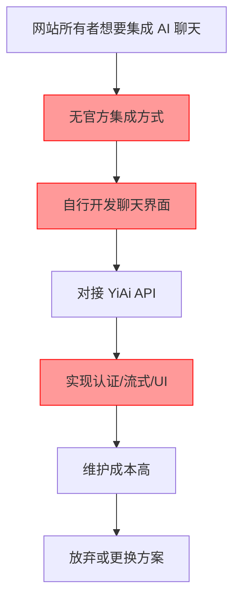
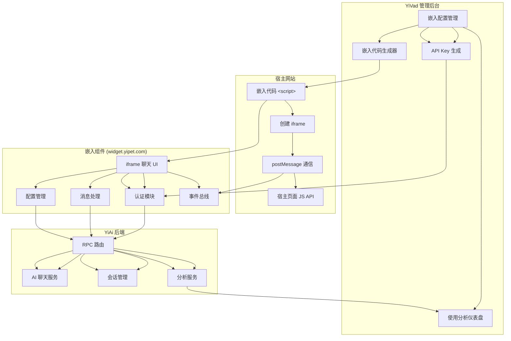
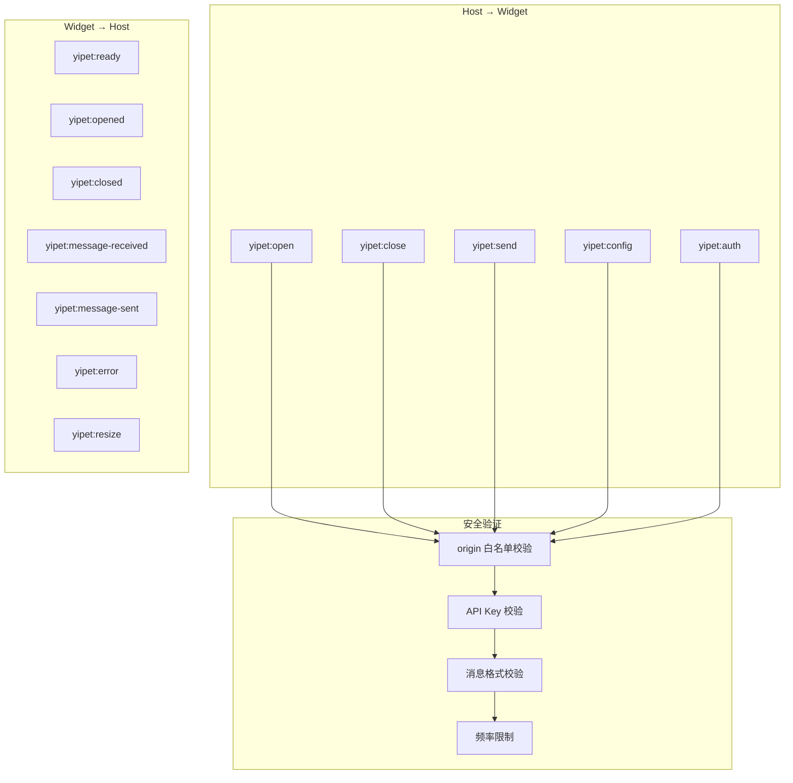

# YP-09-116: 网站嵌入与集成选项 — 可嵌入聊天组件、Widget API、跨域通信、白标与嵌入代码生成器

> 需求编号：YP-09-116 · 优先级：P2 · 人天：0.5d · 状态：需求已编写
> 依赖：YP-09-09（跨项目桥接可靠性）、YP-09-06（安全配置）、YP-09-68（Webhook 集成）

## 背景

### 问题陈述

YiPet 作为 Chrome 扩展，目前只能在已安装扩展的浏览器中使用。这限制了 YiPet 的触达范围——用户希望在自己的网站、博客或文档站点上嵌入 YiPet 聊天组件，让访客无需安装扩展即可与 AI 助手交互。这导致：

1. **触达范围受限**：仅 Chrome 用户且需安装扩展，无法覆盖 Safari/Firefox 用户或未安装扩展的用户
2. **无法嵌入外部网站**：网站所有者无法将 YiPet 集成到自己的站点中，作为客服或 AI 助手
3. **缺乏标准化集成方式**：没有统一的嵌入接口、配置选项和 API 调用方式
4. **品牌定制缺失**：嵌入的聊天组件无法去除 YiPet 品牌标识，无法匹配宿主网站风格
5. **使用数据不可见**：网站所有者无法了解嵌入组件的使用情况（访问量、会话数、用户行为）

**核心矛盾**：YiPet 的核心能力（AI 聊天、宠物伴侣、知识库）仅限扩展内使用，缺乏对外集成能力，无法从"个人工具"升级为"可分发服务"。

### 影响范围

| # | 影响 | 严重程度 | 典型场景 |
|---|------|----------|----------|
| 1 | 触达范围受限 | 高 | 网站访客无法使用 YiPet |
| 2 | 无法嵌入外部网站 | 高 | 博客/文档站需要 AI 助手 |
| 3 | 无标准化集成方式 | 中 | 开发者不知如何集成 |
| 4 | 品牌定制缺失 | 中 | 嵌入组件与宿主风格不搭配 |
| 5 | 使用数据不可见 | 中 | 无法分析嵌入组件使用情况 |

### 挑战

| 挑战 | 说明 |
|------|------|
| 跨域安全 | iframe 嵌入涉及跨域通信，需要设计安全的 postMessage 协议，防止 XSS 和消息伪造 |
| 样式隔离 | 嵌入组件需要通过 Shadow DOM 或 CSS reset 隔离样式，避免宿主页面 CSS 污染 |
| 认证与授权 | 嵌入组件需要独立的认证机制（API Key 或 Token），不能依赖扩展的 session key |
| 响应式设计 | 嵌入组件需要在桌面端和移动端都有良好体验，自适应宿主页面宽度 |
| 性能优化 | 嵌入脚本需要轻量（< 50KB gzip），加载不应阻塞宿主页面渲染 |

---

## 一、现状分析

### 1.1 当前嵌入能力

```
现有能力:
├── Chrome 扩展（Content Script 注入）        # 仅限已安装扩展的浏览器
├── 聊天窗口组件                             # 在扩展内可用
├── YiAi 后端 API                            # RPC 信封，支持 HTTP 调用
├── session key 认证                         # 跨项目桥接认证
├── Shadow DOM 样式隔离                       # 已有实现
└── 无                                          # 无可嵌入组件、无 Widget API

缺失:
├── 可嵌入 iframe 聊天组件                     # ❌ 不存在
├── 嵌入脚本加载器（loader.js）                # ❌ 不存在
├── Widget API（window.yipet）                # ❌ 不存在
├── postMessage 跨域通信协议                    # ❌ 不存在
├── 嵌入配置（位置/主题/初始消息/角色）          # ❌ 不存在
├── 白标选项（去除 YiPet 品牌）                 # ❌ 不存在
├── 嵌入使用分析                              # ❌ 不存在
├── 响应式嵌入适配                            # ❌ 不存在
├── 嵌入代码生成器 UI                          # ❌ 不存在
├── API Key 认证                              # ❌ 不存在
└── 嵌入组件独立部署（静态站点）                 # ❌ 不存在
```

### 1.2 改造前集成流程



### 1.3 根因矩阵

| 症状 | 根因 | 触发条件 | 频率 |
|------|------|----------|------|
| 触达范围受限 | 无可嵌入组件 | 每次需要分享 YiPet 到网站 | 高 |
| 无法嵌入外部网站 | 无标准化嵌入方案 | 网站所有者集成需求 | 高 |
| 集成方式不标准 | 无 Widget API | 开发者集成 | 中 |
| 品牌定制缺失 | 无白标选项 | 企业级集成需求 | 中 |
| 使用数据不可见 | 无分析能力 | 嵌入组件运营 | 中 |

---

## 二、设计决策

### 决策 1：嵌入技术方案 — iframe vs Web Component vs 纯 JS SDK

| 选项 | 样式隔离 | 跨域安全 | 集成复杂度 | 包体积 |
|------|----------|----------|-----------|--------|
| iframe | 天然隔离 | 需 postMessage | 低（一行代码） | 独立页面 |
| Web Component | Shadow DOM 隔离 | 同域要求 | 中 | ~20KB |
| 纯 JS SDK（DOM 注入） | 需手动隔离 | 无跨域问题 | 中 | ~30KB |

**选择：iframe 方案。** iframe 提供天然的样式隔离和 JavaScript 沙箱，最适合嵌入到第三方网站。宿主页面通过 postMessage 与 iframe 通信，安全可控。Web Component 在同域场景下更优，但第三方网站嵌入的核心场景是跨域。iframe 方案集成最简单（一行 `<script>` 标签），符合主流嵌入方案（Intercom、Tawk.to、Crisp）的惯例。

### 决策 2：嵌入组件部署方式 — 独立静态站点 vs YiAi 内嵌路由 vs CDN 部署

| 选项 | 部署复杂度 | 性能 | 版本管理 | 缓存 |
|------|-----------|------|----------|------|
| 独立静态站点（如 widget.yipet.com） | 中 | 高 | 独立管理 | CDN 缓存 |
| YiAi 内嵌路由（FastAPI 静态文件） | 低 | 中 | 与后端绑定 | 无 CDN |
| CDN 直接部署（JS/CSS/HTML bundle） | 高 | 最高 | 需 CI/CD | CDN 缓存 |

**选择：独立静态站点 + CDN。** 嵌入组件作为独立的静态站点部署（如 `widget.yipet.com`），包含聊天 UI、认证逻辑和 API 通信。宿主页面通过 `<iframe src="...">` 加载。静态站点可部署到 CDN（如 OSS + CDN），享受边缘缓存和全球加速。版本管理独立于 YiAi 后端，可独立发布和回滚。

### 决策 3：认证方案 — API Key vs JWT Token vs Session Key

| 选项 | 安全性 | 实现复杂度 | 管理便利性 |
|------|--------|-----------|-----------|
| API Key（服务端生成） | 中 | 低 | 高（复制粘贴） |
| JWT Token（短期 + 刷新） | 高 | 中 | 中 |
| Session Key（与扩展共用） | 低 | 低 | 低（需扩展） |

**选择：API Key 方案。** 嵌入场景下，网站所有者需要一个简单的方式认证。API Key 由 YiVad 管理后台生成（每个嵌入站点一个 Key），网站所有者在嵌入代码中配置。API Key 仅用于标识嵌入来源和统计，不替代用户会话认证。用户与 AI 的对话仍使用独立的匿名会话（或可选的 JWT 用户认证）。

### 决策 4：白标实现方式 — 配置参数 vs CSS 变量覆盖 vs 独立主题

| 选项 | 灵活性 | 实现复杂度 | 品牌一致性 |
|------|--------|-----------|-----------|
| 配置参数（primaryColor、logo 等） | 中 | 低 | 中 |
| CSS 变量完全覆盖 | 高 | 高 | 高 |
| 独立主题（预设模板） | 低 | 中 | 低 |

**选择：配置参数 + CSS 变量覆盖。** 核心配置通过 iframe URL 参数传递（`primaryColor`、`position`、`title`、`initialMessage` 等），高级定制通过 CSS 变量覆盖（`--yipet-*` 变量在宿主页面设置，通过 postMessage 传递给 iframe）。白标选项通过 `branding: 'hidden'` 配置隐藏 YiPet 标识。

### 设计决策记录

| 决策 | 选项 A | 选项 B | 选项 C | 选择 | 理由 |
|------|--------|--------|--------|------|------|
| 嵌入技术方案 | iframe | Web Component | 纯 JS SDK | **iframe** | 天然隔离 + 集成简单 |
| 嵌入组件部署 | 独立静态站点 | YiAi 内嵌 | CDN 直接部署 | **独立静态站点 + CDN** | 独立发布 + 边缘缓存 |
| 认证方案 | API Key | JWT | Session Key | **API Key** | 简单 + 适合嵌入场景 |
| 白标实现方式 | 配置参数 | CSS 变量覆盖 | 独立主题 | **配置参数 + CSS 变量** | 分层次定制 |

---

## 三、目标架构

### 3.1 嵌入集成工作流



### 3.2 postMessage 通信协议



### 3.3 性能指标

| 指标 | 目标值 | 说明 |
|------|--------|------|
| 嵌入脚本加载 | < 10KB gzip | loader.js 体积 |
| iframe 首次渲染 | < 500ms | 加载到可交互 |
| postMessage 响应 | < 10ms | 消息往返延迟 |
| 聊天消息响应 | < 1s | 首 token 时间 |
| 嵌入组件内存 | < 20MB | 空闲状态 |
| 嵌入代码生成器响应 | < 100ms | 配置更新到代码刷新 |

---

## 四、具体改动

### 4.1 嵌入加载器脚本

```typescript
// public/loader.js (新增 —— 宿主网站引入的脚本)

(function () {
  'use strict';

  const WIDGET_ORIGIN = 'https://widget.yipet.com';
  const DEFAULT_CONFIG: WidgetConfig = {
    apiKey: '',
    position: 'bottom-right',
    primaryColor: '#2563EB',
    title: 'AI 助手',
    initialMessage: '你好！有什么可以帮助你的吗？',
    petCharacter: 'default',
    branding: 'visible',
    launcherSize: 60,
    mobileBreakpoint: 768,
    zIndex: 9999,
  };

  let config: WidgetConfig = { ...DEFAULT_CONFIG };
  let iframe: HTMLIFrameElement | null = null;
  let isOpen = false;

  // 全局配置
  window.YiPetWidget = {
    init(userConfig: Partial<WidgetConfig>) {
      config = { ...DEFAULT_CONFIG, ...userConfig };
      if (!config.apiKey) {
        console.error('[YiPet] API Key is required. Get one at https://yivad.com/admin/embed');
        return;
      }
      createIframe();
    },

    open() {
      postMessage('yipet:open');
    },

    close() {
      postMessage('yipet:close');
    },

    send(message: string) {
      postMessage('yipet:send', { message });
    },

    setConfig(partialConfig: Partial<WidgetConfig>) {
      config = { ...config, ...partialConfig };
      postMessage('yipet:config', partialConfig);
    },

    destroy() {
      if (iframe) {
        iframe.remove();
        iframe = null;
      }
      window.removeEventListener('message', handleMessage);
    },
  };

  function createIframe() {
    if (iframe) return;

    // 构建 iframe URL（含配置参数）
    const params = new URLSearchParams({
      apiKey: config.apiKey,
      position: config.position,
      primaryColor: config.primaryColor,
      title: config.title,
      initialMessage: config.initialMessage,
      petCharacter: config.petCharacter,
      branding: config.branding,
      mobileBreakpoint: String(config.mobileBreakpoint),
    });

    iframe = document.createElement('iframe');
    iframe.id = 'yipet-widget';
    iframe.src = `${WIDGET_ORIGIN}/embed.html?${params.toString()}`;
    iframe.style.cssText = `
      position: fixed;
      ${config.position === 'bottom-right' ? 'right: 20px;' : 'left: 20px;'}
      bottom: 20px;
      width: ${config.position === 'bottom-right' || config.position === 'bottom-left' ? '380px' : '100%'};
      height: ${config.position === 'bottom-right' || config.position === 'bottom-left' ? '600px' : '100%'};
      border: none;
      border-radius: 12px;
      box-shadow: 0 4px 24px rgba(0, 0, 0, 0.15);
      z-index: ${config.zIndex};
      display: none;
      transition: opacity 0.3s ease, transform 0.3s ease;
    `;

    document.body.appendChild(iframe);

    // 监听 widget 消息
    window.addEventListener('message', handleMessage);
  }

  function postMessage(type: string, data?: any) {
    if (!iframe?.contentWindow) return;
    iframe.contentWindow.postMessage(
      { type, data, apiKey: config.apiKey, timestamp: Date.now() },
      WIDGET_ORIGIN
    );
  }

  function handleMessage(event: MessageEvent) {
    // 安全校验：仅接受来自 widget 域的消息
    if (event.origin !== WIDGET_ORIGIN) return;

    const { type, data } = event.data;

    switch (type) {
      case 'yipet:ready':
        iframe!.style.display = 'none';
        break;
      case 'yipet:opened':
        iframe!.style.display = 'block';
        iframe!.style.opacity = '1';
        iframe!.style.transform = 'translateY(0)';
        isOpen = true;
        break;
      case 'yipet:closed':
        iframe!.style.opacity = '0';
        iframe!.style.transform = 'translateY(20px)';
        setTimeout(() => {
          if (!isOpen) iframe!.style.display = 'none';
        }, 300);
        isOpen = false;
        break;
      case 'yipet:resize':
        if (data?.width) iframe!.style.width = data.width;
        if (data?.height) iframe!.style.height = data.height;
        break;
      case 'yipet:message-sent':
        window.dispatchEvent(new CustomEvent('yipet:message-sent', { detail: data }));
        break;
      case 'yipet:message-received':
        window.dispatchEvent(new CustomEvent('yipet:message-received', { detail: data }));
        break;
      case 'yipet:error':
        console.error('[YiPet]', data?.message || 'Unknown error');
        break;
    }
  }

  // 自动初始化（如果提前设置了 window.yipetConfig）
  if (window.yipetConfig) {
    window.YiPetWidget.init(window.yipetConfig);
  }
})();
```

### 4.2 嵌入组件主页面

```typescript
// src/embed/embed.html + embed.ts (新增)

// embed.ts
import { createApp } from 'vue';
import { EmbedChat } from './EmbedChat.vue';
import { PostMessageBridge } from './post-message-bridge';

// 解析 URL 参数
const params = new URLSearchParams(window.location.search);
const config: WidgetConfig = {
  apiKey: params.get('apiKey') || '',
  position: (params.get('position') as WidgetConfig['position']) || 'bottom-right',
  primaryColor: params.get('primaryColor') || '#2563EB',
  title: params.get('title') || 'AI 助手',
  initialMessage: params.get('initialMessage') || '你好！有什么可以帮助你的吗？',
  petCharacter: params.get('petCharacter') || 'default',
  branding: (params.get('branding') as WidgetConfig['branding']) || 'visible',
  mobileBreakpoint: Number(params.get('mobileBreakpoint')) || 768,
};

// 验证 API Key
if (!config.apiKey) {
  document.body.innerHTML = '<div style="padding:20px;color:red;">YiPet Widget: API Key is required.</div>';
  throw new Error('API Key is required');
}

// 初始化 postMessage 桥接
const bridge = new PostMessageBridge(config.apiKey);

// 创建 Vue 应用
const app = createApp(EmbedChat, {
  config,
  bridge,
});

app.mount('#app');

// 通知宿主页面已就绪
bridge.send('yipet:ready');

// 应用主题色
document.documentElement.style.setProperty('--yipet-primary', config.primaryColor);
```

### 4.3 postMessage 通信桥接

```typescript
// src/embed/post-message-bridge.ts (新增)

interface BridgeMessage {
  type: string;
  data?: any;
  apiKey?: string;
  timestamp?: number;
}

type MessageHandler = (data: any) => void;

class PostMessageBridge {
  private apiKey: string;
  private handlers: Map<string, MessageHandler[]> = new Map();
  private allowedOrigins: Set<string> = new Set();
  private messageRateLimit: Map<string, number[]> = new Map();

  constructor(apiKey: string) {
    this.apiKey = apiKey;
    this.setupListener();
    // 注册父页面 origin（后续可从服务端获取白名单）
    this.allowedOrigins.add(window.location.ancestorOrigins?.[0] || '*');
  }

  private setupListener() {
    window.addEventListener('message', (event: MessageEvent) => {
      // 校验 origin
      if (!this.isOriginAllowed(event.origin)) {
        console.warn('[YiPet Bridge] Message from unallowed origin:', event.origin);
        return;
      }

      const msg: BridgeMessage = event.data;
      if (!msg || !msg.type) return;

      // 校验 API Key（敏感操作）
      if (msg.apiKey && msg.apiKey !== this.apiKey) {
        console.warn('[YiPet Bridge] API Key mismatch');
        return;
      }

      // 频率限制
      if (!this.checkRateLimit(msg.type)) {
        console.warn('[YiPet Bridge] Rate limit exceeded for:', msg.type);
        return;
      }

      // 消息格式校验
      if (!this.validateMessage(msg)) {
        console.warn('[YiPet Bridge] Invalid message format');
        return;
      }

      // 分发消息
      const handlers = this.handlers.get(msg.type);
      if (handlers) {
        handlers.forEach((handler) => handler(msg.data));
      }
    });
  }

  /**
   * 向宿主页面发送消息
   */
  send(type: string, data?: any) {
    const message: BridgeMessage = {
      type,
      data,
      apiKey: this.apiKey,
      timestamp: Date.now(),
    };

    // targetOrigin 使用 * 因为父页面 origin 未知
    // 安全性由 API Key 校验和 origin 白名单保证
    window.parent.postMessage(message, '*');
  }

  /**
   * 注册消息处理器
   */
  on(type: string, handler: MessageHandler) {
    if (!this.handlers.has(type)) {
      this.handlers.set(type, []);
    }
    this.handlers.get(type)!.push(handler);
  }

  /**
   * 移除消息处理器
   */
  off(type: string, handler: MessageHandler) {
    const handlers = this.handlers.get(type);
    if (handlers) {
      const index = handlers.indexOf(handler);
      if (index > -1) handlers.splice(index, 1);
    }
  }

  private isOriginAllowed(origin: string): boolean {
    if (this.allowedOrigins.has('*')) return true;
    return this.allowedOrigins.has(origin);
  }

  private validateMessage(msg: BridgeMessage): boolean {
    if (!msg.type || typeof msg.type !== 'string') return false;
    if (msg.timestamp && typeof msg.timestamp !== 'number') return false;
    return true;
  }

  private checkRateLimit(type: string): boolean {
    const now = Date.now();
    const window = 1000; // 1 秒窗口
    const maxRequests = 10; // 每秒最多 10 条消息

    if (!this.messageRateLimit.has(type)) {
      this.messageRateLimit.set(type, []);
    }

    const timestamps = this.messageRateLimit.get(type)!;
    // 清理过期记录
    const valid = timestamps.filter((t) => now - t < window);
    this.messageRateLimit.set(type, valid);

    if (valid.length >= maxRequests) return false;

    valid.push(now);
    return true;
  }
}
```

### 4.4 嵌入代码生成器

```typescript
// src/components/EmbedCodeGenerator.vue (新增 —— YiVad 管理后台)

<script setup lang="ts">
import { ref, computed, watch } from 'vue';

interface EmbedConfig {
  apiKey: string;
  position: 'bottom-right' | 'bottom-left' | 'fullscreen';
  primaryColor: string;
  title: string;
  initialMessage: string;
  petCharacter: string;
  branding: 'visible' | 'hidden';
}

const config = ref<EmbedConfig>({
  apiKey: 'yp_live_xxxxxxxxxxxxxxxx',
  position: 'bottom-right',
  primaryColor: '#2563EB',
  title: 'AI 助手',
  initialMessage: '你好！有什么可以帮助你的吗？',
  petCharacter: 'default',
  branding: 'visible',
});

const petCharacters = [
  { value: 'default', label: '默认宠物' },
  { value: 'cat', label: '猫咪' },
  { value: 'dog', label: '小狗' },
  { value: 'rabbit', label: '兔子' },
  { value: 'fox', label: '狐狸' },
];

const embedCode = computed(() => {
  return `<script>
  window.yipetConfig = ${JSON.stringify(config.value, null, 2)};
<\/script>
<script src="https://widget.yipet.com/loader.js" async><\/script>`;
});

const previewStyle = computed(() => ({
  '--preview-color': config.value.primaryColor,
  '--preview-position': config.value.position === 'bottom-right' ? 'right: 20px' : 'left: 20px',
}));

function copyCode() {
  navigator.clipboard.writeText(embedCode.value);
  // 显示复制成功提示
}

function regenerateApiKey() {
  config.value.apiKey = `yp_live_${generateRandomString(24)}`;
}

function generateRandomString(length: number): string {
  const chars = 'abcdefghijklmnopqrstuvwxyz0123456789';
  let result = '';
  for (let i = 0; i < length; i++) {
    result += chars.charAt(Math.floor(Math.random() * chars.length));
  }
  return result;
}
</script>

<template>
  <div class="embed-generator">
    <h2>嵌入代码生成器</h2>
    <p class="desc">配置聊天组件的外观和行为，复制生成的代码到您的网站中。</p>

    <div class="generator-layout">
      <!-- 配置面板 -->
      <div class="config-panel">
        <div class="config-section">
          <h3>基本设置</h3>
          <div class="form-group">
            <label>API Key</label>
            <div class="api-key-input">
              <input :value="config.apiKey" readonly />
              <button @click="regenerateApiKey">重新生成</button>
            </div>
          </div>
          <div class="form-group">
            <label>标题</label>
            <input v-model="config.title" type="text" maxlength="50" />
          </div>
          <div class="form-group">
            <label>初始消息</label>
            <textarea v-model="config.initialMessage" rows="3" maxlength="200"></textarea>
          </div>
        </div>

        <div class="config-section">
          <h3>外观设置</h3>
          <div class="form-group">
            <label>主题色</label>
            <div class="color-input">
              <input v-model="config.primaryColor" type="color" />
              <span>{{ config.primaryColor }}</span>
            </div>
          </div>
          <div class="form-group">
            <label>位置</label>
            <select v-model="config.position">
              <option value="bottom-right">右下角</option>
              <option value="bottom-left">左下角</option>
              <option value="fullscreen">全屏</option>
            </select>
          </div>
          <div class="form-group">
            <label>宠物角色</label>
            <select v-model="config.petCharacter">
              <option v-for="pet in petCharacters" :key="pet.value" :value="pet.value">
                {{ pet.label }}
              </option>
            </select>
          </div>
          <div class="form-group">
            <label>品牌标识</label>
            <select v-model="config.branding">
              <option value="visible">显示 YiPet 品牌</option>
              <option value="hidden">隐藏 YiPet 品牌（白标）</option>
            </select>
          </div>
        </div>
      </div>

      <!-- 预览 + 代码 -->
      <div class="preview-panel">
        <div class="preview-area" :style="previewStyle">
          <div class="preview-mock">
            <div class="preview-header" :style="{ backgroundColor: config.primaryColor }">
              {{ config.title }}
            </div>
            <div class="preview-body">
              <div class="preview-message bot">
                {{ config.initialMessage }}
              </div>
            </div>
            <div class="preview-launcher" :style="{ backgroundColor: config.primaryColor }">
              💬
            </div>
          </div>
        </div>

        <div class="code-area">
          <div class="code-header">
            <span>嵌入代码</span>
            <button @click="copyCode">复制代码</button>
          </div>
          <pre><code>{{ embedCode }}</code></pre>
        </div>

        <div class="widget-api-docs">
          <h4>Widget API</h4>
          <table>
            <tr><td><code>window.YiPetWidget.open()</code></td><td>打开聊天窗口</td></tr>
            <tr><td><code>window.YiPetWidget.close()</code></td><td>关闭聊天窗口</td></tr>
            <tr><td><code>window.YiPetWidget.send(msg)</code></td><td>发送消息</td></tr>
            <tr><td><code>window.YiPetWidget.setConfig(cfg)</code></td><td>更新配置</td></tr>
            <tr><td><code>window.YiPetWidget.destroy()</code></td><td>销毁组件</td></tr>
          </table>
        </div>
      </div>
    </div>
  </div>
</template>
```

### 4.5 使用分析服务

```typescript
// src/services/embed-analytics.ts (新增)

interface EmbedEvent {
  apiKey: string;
  event: string;
  timestamp: number;
  sessionId?: string;
  metadata?: Record<string, any>;
}

class EmbedAnalytics {
  private events: EmbedEvent[] = [];
  private flushInterval: ReturnType<typeof setInterval> | null = null;
  private readonly FLUSH_INTERVAL = 30000; // 30 秒批量上报
  private readonly BATCH_SIZE = 50;

  /**
   * 记录嵌入事件
   */
  track(event: string, apiKey: string, metadata?: Record<string, any>) {
    this.events.push({
      apiKey,
      event,
      timestamp: Date.now(),
      sessionId: metadata?.sessionId,
      metadata,
    });

    if (this.events.length >= this.BATCH_SIZE) {
      this.flush();
    }
  }

  /**
   * 开始定期上报
   */
  startFlush() {
    this.flushInterval = setInterval(() => this.flush(), this.FLUSH_INTERVAL);
  }

  /**
   * 停止定期上报
   */
  stopFlush() {
    if (this.flushInterval) {
      clearInterval(this.flushInterval);
      this.flushInterval = null;
    }
  }

  /**
   * 批量上报事件到 YiAi
   */
  private async flush() {
    if (this.events.length === 0) return;

    const batch = this.events.splice(0, this.BATCH_SIZE);

    try {
      await fetch(`${API_BASE}/`, {
        method: 'POST',
        headers: { 'Content-Type': 'application/json' },
        body: JSON.stringify({
          module_name: 'services.embed.analytics_service',
          method_name: 'track_events',
          parameters: { events: batch },
        }),
      });
    } catch {
      // 上报失败时重新入队（最多保留 200 条）
      this.events.unshift(...batch);
      if (this.events.length > 200) {
        this.events = this.events.slice(-200);
      }
    }
  }
}
```

### 4.6 文件变更清单

| 文件 | 操作 | 说明 |
|------|------|------|
| `public/loader.js` | 新增 | 宿主网站引入的加载器脚本 |
| `src/embed/embed.html` | 新增 | 嵌入组件 HTML 入口 |
| `src/embed/embed.ts` | 新增 | 嵌入组件 Vue 应用入口 |
| `src/embed/EmbedChat.vue` | 新增 | 嵌入聊天主组件 |
| `src/embed/post-message-bridge.ts` | 新增 | postMessage 通信桥接 |
| `src/embed/embed-launcher.vue` | 新增 | 嵌入启动按钮组件 |
| `src/services/embed-analytics.ts` | 新增 | 嵌入使用分析服务 |
| `src/components/EmbedCodeGenerator.vue` | 新增 | 嵌入代码生成器（YiVad） |
| `YiAi/services/embed/analytics_service.py` | 新增 | 嵌入分析后端服务 |
| `YiAi/services/embed/__init__.py` | 新增 | 嵌入模块初始化 |
| `YiVad/src/views/embed/EmbedConfig.vue` | 新增 | 嵌入配置管理页面 |
| `YiVad/src/views/embed/EmbedAnalytics.vue` | 新增 | 嵌入分析仪表盘 |
| `YiVad/src/router/index.ts` | 修改 | 添加嵌入配置路由 |

---

## 五、实施步骤

| 步骤 | 操作 | 路径 | 验证 | 人天 |
|------|------|------|------|------|
| 1 | 实现 loader.js 嵌入脚本 | `public/loader.js` | 脚本加载后创建 iframe | 0.05 |
| 2 | 实现 postMessage 通信桥接 | `src/embed/post-message-bridge.ts` | 双向消息收发正确 | 0.05 |
| 3 | 实现 EmbedChat 聊天组件 | `src/embed/EmbedChat.vue` | 聊天 UI 在 iframe 中正常 | 0.1 |
| 4 | 实现 Widget API（open/close/send） | `public/loader.js` | API 调用正确触发 | 0.05 |
| 5 | 实现嵌入配置（URL 参数） | `src/embed/embed.ts` | 位置/主题/角色配置生效 | 0.05 |
| 6 | 实现白标选项 | `src/embed/EmbedChat.vue` | branding=hidden 隐藏标识 | 0.03 |
| 7 | 实现嵌入使用分析 | `src/services/embed-analytics.ts` | 事件批量上报 | 0.05 |
| 8 | 实现响应式嵌入适配 | `src/embed/embed-launcher.vue` | 移动端全屏/桌面端浮窗 | 0.05 |
| 9 | 实现嵌入代码生成器 UI | `src/components/EmbedCodeGenerator.vue` | 配置 + 预览 + 复制 | 0.05 |
| 10 | 实现后端分析服务 | `YiAi/services/embed/analytics_service.py` | 事件接收和存储 | 0.02 |

**总人天：0.5d**

---

## 六、测试规格

### 场景 1：嵌入组件加载与显示

**GIVEN** 网站所有者在其网站中粘贴了嵌入代码（含有效 API Key）
**WHEN** 访客访问该网站
**THEN** loader.js 应异步加载，不阻塞页面渲染
**AND** 应在页面右下角显示聊天启动按钮（圆形图标）
**AND** 点击启动按钮，聊天窗口从右下角弹出（300ms 过渡动画）
**AND** 聊天窗口显示在 9999 z-index 层级，不遮挡页面主要内容

### 场景 2：Widget API 调用

**GIVEN** 嵌入组件已加载并就绪
**WHEN** 宿主页面调用 `window.YiPetWidget.open()`
**THEN** 聊天窗口应打开
**WHEN** 调用 `window.YiPetWidget.send('你好')`
**THEN** 聊天窗口应打开（如果未打开）并发送消息 "你好"
**WHEN** 调用 `window.YiPetWidget.close()`
**THEN** 聊天窗口应关闭（300ms 过渡动画）
**WHEN** 调用 `window.YiPetWidget.destroy()`
**THEN** iframe 移除，事件监听器清理

### 场景 3：配置参数生效

**GIVEN** 嵌入代码配置了 `position: 'bottom-left'`、`primaryColor: '#DC2626'`、`title: '客服助手'`
**WHEN** 嵌入组件加载
**THEN** 聊天启动按钮应显示在左下角
**AND** 聊天窗口主题色为红色（#DC2626）
**AND** 聊天窗口标题显示 "客服助手"
**AND** 移动端（< 768px）时，聊天窗口应全屏显示

### 场景 4：白标模式

**GIVEN** 嵌入代码配置了 `branding: 'hidden'`
**WHEN** 嵌入组件加载
**THEN** 聊天窗口中不应显示 "Powered by YiPet" 标识
**AND** 不应显示 YiPet 的 Logo 或品牌元素
**AND** 聊天窗口的标题和外观完全由配置参数控制
**AND** 白标模式下仍保留 YiPet 的版权声明在 HTML 注释中

### 场景 5：跨域安全

**GIVEN** 恶意网站尝试通过 postMessage 向嵌入组件发送伪造消息
**WHEN** 嵌入组件收到来自非白名单 origin 的消息
**THEN** 消息应被忽略，不执行任何操作
**AND** 控制台记录安全警告（仅在开发模式下）
**WHEN** 嵌入组件收到 API Key 不匹配的消息
**THEN** 消息应被忽略
**WHEN** 嵌入组件收到频率超过限制的消息（> 10 条/秒）
**THEN** 超出限制的消息应被丢弃

### 场景 6：嵌入代码生成器

**GIVEN** 网站所有者在 YiVad 管理后台打开嵌入代码生成器
**WHEN** 配置聊天组件的外观参数（位置、颜色、标题等）
**THEN** 右侧预览应实时更新反映配置
**AND** 嵌入代码应自动更新
**WHEN** 点击 "复制代码" 按钮
**THEN** 完整嵌入代码应复制到剪贴板
**AND** 显示 "已复制" 提示（2 秒后消失）
**WHEN** 点击 "重新生成 API Key"
**THEN** 旧 Key 失效，新 Key 生成并更新到代码中

---

## 七、风险与缓解

| 风险 | 概率 | 影响 | 缓解措施 |
|------|------|------|----------|
| postMessage 被恶意网站伪造 | 中 | 高 | origin 白名单 + API Key 双重校验 + 频率限制 |
| iframe 被广告拦截器阻止 | 中 | 中 | 使用不触发拦截的域名，提供降级方案（直接链接） |
| 嵌入组件与宿主页面 CSP 冲突 | 中 | 中 | 文档提供 CSP 配置指南，嵌入组件使用最低权限 |
| 嵌入组件在移动端体验不佳 | 中 | 中 | 响应式设计：移动端自动全屏，触摸手势优化 |
| API Key 泄露导致滥用 | 低 | 高 | API Key 可随时在 YiVad 管理后台吊销和重新生成 |

---

## 八、回滚策略

| 场景 | 回滚操作 | 影响 |
|------|----------|------|
| 嵌入组件严重 bug | 重定向 widget.yipet.com 到维护页面，禁用嵌入功能 | 所有嵌入站点聊天不可用 |
| loader.js 性能问题 | 更新 CDN 缓存到上一版本 | 宿主页面加载速度恢复 |
| 安全漏洞 | 紧急吊销所有 API Key，发布安全修复后重新生成 | 嵌入站点暂时不可用 |
| 分析服务负载过高 | 关闭分析上报，仅保留核心聊天功能 | 使用统计数据丢失 |

---

## 九、设计决策记录

### D-01：嵌入脚本加载方式

- **问题**：loader.js 应如何加载以最小化对宿主页面的影响
- **选项**：同步 `<script>`、`async` 加载、`defer` 加载、动态注入
- **选择**：`async` 加载 + 动态注入 iframe
- **理由**：`async` 加载不阻塞 HTML 解析，脚本下载完成后立即执行。动态注入 iframe 在脚本执行后才创建 DOM 元素，不影响宿主页面的首屏渲染。脚本体积 < 10KB gzip，加载时间可忽略

### D-02：postMessage 安全协议

- **问题**：如何确保 postMessage 通信的安全性
- **选项**：仅 origin 校验、origin + API Key 校验、origin + API Key + nonce 签名
- **选择**：origin + API Key + 频率限制
- **理由**：origin 校验防止消息来自非预期域名，API Key 校验防止未授权访问，频率限制（10 条/秒）防止 DoS 攻击。nonce 签名增加复杂度但收益有限，因为 iframe 和宿主页面之间的通信不涉及敏感数据（API Key 已在 URL 中）

### D-03：嵌入组件路由设计

- **问题**：嵌入组件是否需要独立的路由和页面
- **选项**：单页面（仅聊天窗口）、多页面（聊天 + 设置 + 历史）、与 YiVad 共用路由
- **选择**：单页面（仅聊天窗口）+ 设置通过配置面板
- **理由**：嵌入组件的核心场景是聊天，非管理后台。设置通过 iframe URL 参数和 postMessage 配置消息传递，无需独立页面。会话历史可通过聊天窗口内查看，无需独立历史页面

### D-04：嵌入分析数据存储

- **问题**：嵌入使用事件应存储在哪里
- **选项**：MongoDB（YiAi 数据库）、独立分析数据库、第三方分析服务
- **选择**：MongoDB（`embed_analytics` collection）
- **理由**：复用现有 YiAi 基础设施，无需引入额外依赖。分析事件以 JSON 格式存储在 MongoDB 中，按 apiKey + 日期分片。历史数据通过 TTL 索引自动清理（90 天保留期），控制存储成本

---

## 十、可观测性

### 指标

| 指标 | 类型 | 说明 |
|------|------|------|
| `yipet.embed.load_count` | Counter | 嵌入组件加载次数（按 apiKey） |
| `yipet.embed.open_count` | Counter | 聊天窗口打开次数 |
| `yipet.embed.message_sent` | Counter | 嵌入组件中发送的消息数 |
| `yipet.embed.session_count` | Counter | 嵌入组件中的会话数 |
| `yipet.embed.load_time_ms` | Histogram | 嵌入组件加载耗时 |
| `yipet.embed.postmessage_error` | Counter | postMessage 安全校验失败次数 |
| `yipet.embed.api_key_invalid` | Counter | API Key 无效次数 |
| `yipet.embed.unique_origins` | Gauge | 活跃嵌入站点数（按 apiKey 去重） |

### 告警

| 告警 | 条件 | 级别 |
|------|------|------|
| 嵌入组件加载失败率 > 5% | 最近 100 次加载 | WARNING |
| API Key 无效请求 > 10/min | 单 API Key 最近 1 分钟 | WARNING |
| postMessage 安全校验失败 > 50/min | 最近 1 分钟 | CRITICAL |
| 嵌入组件平均加载时间 > 2s | 最近 100 次加载 | INFO |

---

## 十一、代码审查检查清单

- [ ] `loader.js` 中 `window.YiPetWidget` 在全局作用域唯一，不可覆盖已有实例
- [ ] postMessage 的 `targetOrigin` 使用具体域名而非 `*`（iframe 内发往父页面时）
- [ ] origin 白名单校验在 `handleMessage` 中作为第一道防线
- [ ] API Key 在 URL 参数中传递时避免出现在 Referrer 头部（使用 `rel="noreferrer"`）
- [ ] 嵌入组件 CSS 使用 `all: initial` 或 Shadow DOM 隔离样式
- [ ] 移动端响应式断点（768px）下聊天窗口切换为全屏模式
- [ ] 嵌入分析事件批量上报，单次最多 50 条，避免请求过多
- [ ] 嵌入代码生成器实时预览与实际效果一致
- [ ] `destroy()` 方法正确清理 iframe、事件监听器和定时器
- [ ] 白标模式下 YiPet 品牌标识完全隐藏，但保留必要的法律声明

---

## 回归问题预测

| # | 预测问题 | 原因 | 验证方法 |
|---|---------|------|---------|
| 1 | 嵌入组件在宿主页面使用 `Content-Security-Policy: frame-ancestors 'none'` 时无法加载，iframe 被浏览器阻止，导致聊天组件完全不显示 | 宿主网站设置了严格的 CSP 策略，禁止任何页面将其嵌入为 iframe，浏览器拦截 iframe 创建 | 在设置了 `frame-ancestors 'none'` 的测试页面中加载嵌入组件，确认 loader.js 能检测到 iframe 创建失败并提供降级方案（如直接链接） |
| 2 | 嵌入组件的 postMessage 监听在多个 iframe 实例同时存在时消息混乱，不同 API Key 的组件收到不属于自己的消息 | 同一页面可能嵌入多个 YiPet 组件（不同位置/不同 API Key），`window.addEventListener('message')` 在 iframe 内全局监听，收到所有父页面消息但无法区分目标 | 在同一页面嵌入两个不同 API Key 的组件，分别发送消息，确认每个组件只处理自己 API Key 的消息 |
| 3 | 嵌入组件在 iOS Safari 中 iframe 高度计算错误，软键盘弹出时视口变化导致聊天窗口被遮挡或输入框不可见 | iOS Safari 在软键盘弹出时 `window.innerHeight` 变化，iframe 的 `height: 100vh` 计算基于旧视口高度，导致底部被遮挡 | 在 iOS Safari 中打开嵌入组件，聚焦输入框触发软键盘，确认聊天窗口自动调整高度，输入框始终可见 |
| 4 | 嵌入代码生成器生成的代码中 `window.yipetConfig` 在 loader.js 之前设置，但 loader.js 异步加载完成时 `yipetConfig` 可能已被后续脚本覆盖，导致配置丢失 | 宿主页面可能有其他脚本在 loader.js 加载期间修改 `window.yipetConfig`，或者页面有多个 `<script>` 标签同时设置此变量 | 在模拟的宿主页面中，在嵌入代码后添加 `<script>window.yipetConfig = null</script>`，确认 loader.js 初始化时使用的是快照配置而非实时读取 |
| 5 | 嵌入组件在宿主页面使用 `frame-src` CSP 限制时，iframe 的 `src` 被阻止，但 loader.js 的动态创建 iframe 的报错信息不明确，网站所有者难以排查 | CSP 策略阻止 iframe 加载时，浏览器静默失败，无明显的 JavaScript 错误，loader.js 未检测到 iframe 加载失败 | 在 loader.js 中添加 iframe `onerror` 和超时检测（5 秒），加载失败时在宿主页面 console 输出明确的 CSP 配置建议 |
| 6 | 使用分析中的 `sessionId` 在用户刷新页面后丢失，同一用户的连续访问被计为多个独立会话，分析数据失真 | 嵌入组件的会话 ID 存储在 iframe 的 sessionStorage 中，iframe 随页面刷新重建，sessionStorage 清空，无法跨页面刷新保持会话 | 将 sessionId 通过 postMessage 传递给宿主页面，宿主页面存储到 `localStorage`（以 `yipet_session_` 前缀），组件重新加载时宿主页面回传 sessionId |

---

## 性能分析

### 嵌入组件各阶段耗时

| 阶段 | 预估耗时 | 说明 |
|------|----------|------|
| loader.js 下载 | < 100ms | 10KB gzip，CDN 边缘节点 |
| loader.js 执行 | < 10ms | 创建 iframe + 配置解析 |
| iframe 创建 → 开始加载 | < 5ms | DOM 操作 |
| embed.html 下载 | < 200ms | 静态 HTML，CDN 缓存 |
| embed.js bundle 下载 | < 300ms | ~50KB gzip，Vue 应用 |
| Vue 应用初始化 | < 100ms | 组件挂载 + 配置应用 |
| 首次渲染完成 | < 100ms | 启动按钮渲染 |
| API Key 校验 | < 500ms | 网络请求到 YiAi 后端 |
| 聊天窗口打开 | < 100ms | CSS 过渡动画 |
| 首条消息响应 | < 1s | AI 流式响应首 token |
| **总计（首次加载 → 可交互）** | **~1.5s** | 含网络延迟 |
| **总计（二次加载，缓存命中）** | **~500ms** | CDN 缓存 + 浏览器缓存 |

### 文件体积预估

| 文件 | 大小 | 说明 |
|------|------|------|
| `public/loader.js` | ~4KB (2KB gzip) | 宿主网站加载器 |
| `src/embed/embed.html` | ~1KB | 嵌入组件 HTML |
| `src/embed/embed.ts` | ~1KB | 入口文件 |
| `src/embed/EmbedChat.vue` | ~6KB | 聊天主组件 |
| `src/embed/post-message-bridge.ts` | ~3KB | 通信桥接 |
| `src/embed/embed-launcher.vue` | ~2KB | 启动按钮 |
| `src/services/embed-analytics.ts` | ~2KB | 分析服务 |
| `src/components/EmbedCodeGenerator.vue` | ~5KB | 代码生成器（YiVad） |
| `YiAi/services/embed/analytics_service.py` | ~2KB | 后端分析服务 |
| `YiVad/src/views/embed/EmbedConfig.vue` | ~3KB | 配置管理页 |
| `YiVad/src/views/embed/EmbedAnalytics.vue` | ~4KB | 分析仪表盘 |