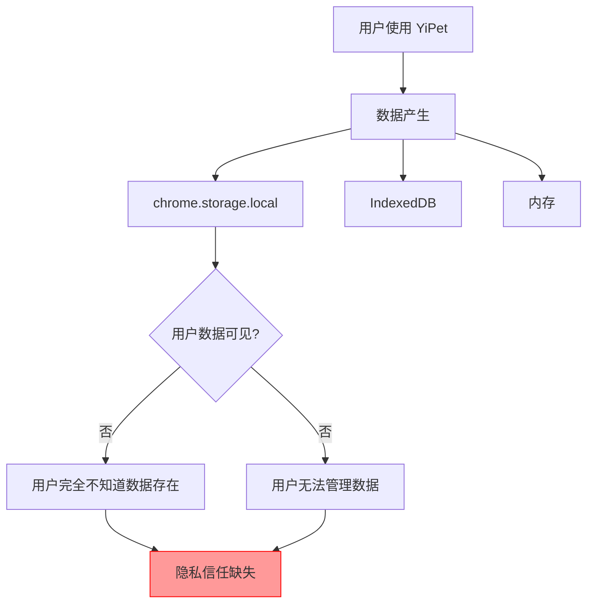
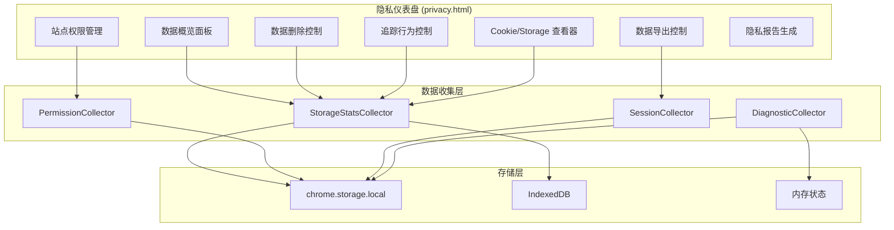
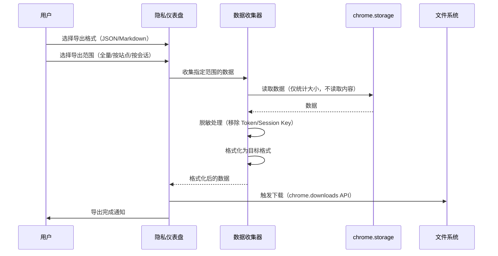

# YP-09-132: 隐私仪表盘 — YiPet 数据存储透明化、导出/删除控制、站点权限管理

> 需求编号：YP-09-132 · 优先级：P2 · 人天：0.3d · 状态：需求已编写
> 依赖：YP-09-66（设置跨设备同步）、YP-09-42（设置面板重构）

## 背景

### 问题陈述

YiPet 作为 Chrome 扩展，在用户浏览过程中持续收集和存储数据：聊天会话、页面上下文、用户偏好、站点权限等。当前缺乏对这些数据的透明呈现，用户无法了解：

1. **数据不可见**：用户不知道 YiPet 存储了哪些数据、数据量有多大、数据存放在哪里
2. **无法导出**：用户无法将聊天记录、偏好设置等数据导出为可读格式
3. **无法删除**：用户无法选择性删除特定站点或会话的数据，只能通过卸载扩展清除全部数据
4. **权限不透明**：用户不知道 YiPet 在哪些站点上被激活/禁用，缺乏站点级别的隐私控制
5. **追踪无感知**：用户不知道 YiPet 收集了哪些行为数据（如果有），无法选择退出

**核心矛盾**：用户对浏览器扩展的隐私期望越来越高（Chrome Web Store 隐私实践要求日趋严格），但 YiPet 当前缺乏隐私透明化机制，存在合规风险和用户信任危机。

### 影响范围

| # | 影响 | 严重程度 | 典型场景 |
|---|------|----------|----------|
| 1 | 用户隐私不透明 | 高 | 用户无法了解 YiPet 数据存储情况 |
| 2 | Chrome Web Store 合规风险 | 高 | 隐私实践标签不达标导致审核不通过 |
| 3 | 用户无法管理数据 | 中 | 想清理某个站点的聊天记录但无操作方法 |
| 4 | 站点权限不可控 | 中 | 用户想在某些站点禁用 YiPet 但无 UI |
| 5 | 无数据导出能力 | 中 | 用户想迁移到新设备需要导出数据 |

### 挑战

| 挑战 | 说明 |
|------|------|
| 数据分散存储 | 数据分布在 chrome.storage.local、IndexedDB、内存中，需统一收集和展示 |
| 隐私计算 | 计算存储大小时不得读取消息内容，仅统计字节数 |
| 删除粒度 | 支持按站点、按会话、按时间范围三级删除粒度 |
| 导出格式 | 需支持 JSON（机器可读）和 Markdown/HTML（人类可读）两种格式 |
| 权限 UI 设计 | 站点权限管理需直观易懂，避免用户误操作 |

---

## 一、现状分析

### 1.1 当前数据存储全景

```
YiPet 数据存储现状:
├── chrome.storage.local
│   ├── sessions: 聊天会话（含消息内容）
│   ├── settings: 用户偏好设置
│   ├── petState: 宠物状态（位置、皮肤、动画）
│   ├── shortcuts: 自定义快捷键绑定
│   └── diagnostics: 诊断数据（崩溃自动采集）
├── IndexedDB (如有)
│   ├── eventLog: 事件溯源日志
│   └── cache: 资源缓存（皮肤图片、字体）
├── 内存
│   ├── Content Script 状态（宠物实例、聊天窗口）
│   └── Service Worker 状态（会话管理、消息路由）
└── 权限存储
    ├── chrome.storage.local (permissions: 站点白名单/黑名单)
    └── 无 UI 管理界面

缺失:
├── 数据存储全景视图               # ❌ 不存在
├── 数据导出功能                   # ❌ 不存在
├── 数据删除（选择性）             # ❌ 不存在
├── 站点权限管理 UI                # ❌ 不存在
├── 追踪行为控制                   # ❌ 不存在
├── Cookie/Storage 查看器           # ❌ 不存在
└── 隐私报告生成                   # ❌ 不存在
```

### 1.2 数据分类与敏感性

| 数据类别 | 存储位置 | 敏感性 | 用户可见 | 当前可控 |
|----------|----------|--------|----------|----------|
| 聊天消息内容 | chrome.storage.local | 高 | 否 | 不可控 |
| 会话元数据（标题、标签） | chrome.storage.local | 中 | 通过聊天列表部分可见 | 不可控 |
| 用户偏好设置 | chrome.storage.local | 低 | 通过设置面板部分可见 | 部分可控 |
| 宠物状态（位置、皮肤） | chrome.storage.local | 低 | 否 | 不可控 |
| 站点权限列表 | chrome.storage.local | 低 | 否 | 不可控 |
| 诊断数据（崩溃报告） | chrome.storage.local | 中 | 否 | 不可控 |
| 事件溯源日志 | chrome.storage.local | 中 | 否 | 不可控 |
| 页面交互统计 | 无 | N/A | 否 | N/A |

### 1.3 改造前隐私架构



### 1.4 根因矩阵

| 症状 | 根因 | 触发条件 | 频率 |
|------|------|----------|------|
| 用户不知道数据存储情况 | 无隐私仪表盘 | 任何时刻 | 持续 |
| 无法导出数据 | 无导出功能 | 用户想迁移数据 | 偶发 |
| 无法选择性删除 | 无删除 UI | 用户想清理特定数据 | 偶发 |
| 站点权限混乱 | 无权限管理 UI | 用户在特定站点遇到问题 | 中 |
| 隐私合规风险 | 无隐私实践文档 | Chrome Web Store 审核 | 审核时 |

---

## 二、设计决策

### 决策 1：隐私仪表盘位置 — Popup 内嵌 vs 独立页面 vs 设置面板 Tab

| 选项 | 可见性 | 实现复杂度 | 用户体验 |
|------|--------|-----------|----------|
| Popup 内嵌 | 每次打开可见 | 低 | 空间受限 |
| 独立页面（chrome-extension://） | 全屏展示 | 中 | 体验最佳 |
| 设置面板 Tab | 需要导航到设置 | 低 | 与其他设置整合 |

**选择：独立页面。** 隐私仪表盘需要足够的空间展示数据概览、导出/删除操作、站点权限矩阵，Popup 的 400x500px 空间不足以承载。使用 `chrome-extension://<id>/privacy.html` 独立页面，可通过 Popup 中的"隐私仪表盘"入口打开。

### 决策 2：数据导出格式 — JSON vs Markdown vs HTML vs 多格式

| 选项 | 机器可读 | 人类可读 | 可导入 | 实现复杂度 |
|------|----------|----------|--------|-----------|
| JSON | 高 | 低 | 是 | 低 |
| Markdown | 低 | 高 | 否 | 中 |
| HTML | 低 | 高 | 否 | 中 |
| 多格式（JSON + Markdown） | 高 | 高 | 是 | 中 |

**选择：多格式（JSON + Markdown）。** JSON 格式用于数据迁移和备份恢复（可重新导入），Markdown 格式用于人类阅读和存档。导出时让用户选择格式。

### 决策 3：数据删除粒度 — 全量 vs 按站点 vs 按会话 vs 三级

| 选项 | 灵活性 | 误操作风险 | 实现复杂度 |
|------|--------|-----------|-----------|
| 全量删除 | 低 | 高 | 低 |
| 按站点删除 | 中 | 中 | 中 |
| 按会话删除 | 高 | 低 | 中 |
| 三级（全量/站点/会话） | 高 | 低 | 中 |

**选择：三级删除粒度。** 全量删除：一键清除所有 YiPet 数据。按站点删除：清除特定域名下的所有会话和权限。按会话删除：删除单个会话（已有功能，整合到隐私仪表盘）。

### 决策 4：追踪行为控制 — 默认关闭 vs 默认开启 vs 分项控制

| 选项 | 隐私友好 | 数据收集 | 合规性 |
|------|----------|----------|--------|
| 默认关闭 | 最高 | 最低 | 最优 |
| 默认开启 | 最低 | 最高 | 有风险 |
| 分项控制（默认关闭） | 高 | 按需 | 最优 |

**选择：分项控制，默认全部关闭。** 将追踪行为分为：使用统计（功能使用频率）、崩溃报告（自动发送）、性能数据（页面加载耗时）。所有选项默认关闭，用户主动开启后才收集。

### 设计决策记录

| 决策 | 选项 A | 选项 B | 选项 C | 选择 | 理由 |
|------|--------|--------|--------|------|------|
| 仪表盘位置 | Popup | 独立页面 | 设置 Tab | **独立页面** | 空间充足，体验最佳 |
| 导出格式 | JSON | Markdown | 多格式 | **多格式** | 兼顾迁移和阅读 |
| 删除粒度 | 全量 | 按站点 | 三级 | **三级** | 灵活且安全 |
| 追踪控制 | 默认关闭 | 默认开启 | 分项 | **分项控制** | 隐私优先 |

---

## 三、目标架构

### 3.1 隐私仪表盘架构



### 3.2 数据导出流程



### 3.3 性能指标

| 指标 | 目标值 | 说明 |
|------|--------|------|
| 隐私仪表盘加载 | < 500ms | 独立页面初始化 |
| 存储大小统计 | < 50ms | 遍历所有 storage key |
| 全量数据导出 | < 2s | 10MB 数据序列化 + 下载 |
| 站点权限列表加载 | < 100ms | 权限存储读取 |
| Cookie/Storage 统计 | < 200ms | 读取当前站点信息 |

---

## 四、具体改动

### 4.1 隐私仪表盘页面

```typescript
// src/privacy/types.ts (新增)

interface PrivacyDashboardData {
  overview: {
    totalStorageBytes: number;
    sessionCount: number;
    totalMessageCount: number;
    permissionedSites: number;
    lastDiagnosticAt: string | null;
  };
  storageBreakdown: {
    category: string;
    key: string;
    bytes: number;
    itemCount: number;
  }[];
  sitePermissions: {
    hostname: string;
    permission: 'allowed' | 'blocked' | 'default';
    sessionCount: number;
    lastActivity: string;
  }[];
  trackingSettings: {
    usageStatistics: boolean;
    crashReports: boolean;
    performanceData: boolean;
  };
  cookieStats: {
    totalCookies: number;
    thirdPartyCookies: number;
    localStorageItems: number;
    sessionStorageItems: number;
  };
}

class PrivacyDashboardCollector {
  async collectOverview(): Promise<PrivacyDashboardData> {
    const storage = await chrome.storage.local.get(null);
    const storageBytes = new TextEncoder().encode(JSON.stringify(storage)).length;
    
    const sessions = await this.getSessions();
    const permissions = await this.getSitePermissions();
    const tracking = await this.getTrackingSettings();
    const cookieStats = await this.getCookieStats();

    return {
      overview: {
        totalStorageBytes: storageBytes,
        sessionCount: sessions.length,
        totalMessageCount: sessions.reduce((sum, s) => sum + (s.messages?.length ?? 0), 0),
        permissionedSites: permissions.length,
        lastDiagnosticAt: storage.diagnostics?.generatedAt ?? null,
      },
      storageBreakdown: this.breakdownStorage(storage),
      sitePermissions: permissions,
      trackingSettings: tracking,
      cookieStats,
    };
  }
}
```

### 4.2 数据导出服务

```typescript
// src/privacy/export.ts (新增)

type ExportFormat = 'json' | 'markdown';
type ExportScope = 'all' | 'site' | 'session';

class DataExportService {
  async exportData(format: ExportFormat, scope: ExportScope, target?: string): Promise<void> {
    const data = await this.collectExportData(scope, target);
    const sanitized = this.sanitize(data);
    
    let content: string;
    let filename: string;
    let mimeType: string;
    
    if (format === 'json') {
      content = JSON.stringify(sanitized, null, 2);
      filename = `yipet-export-${Date.now()}.json`;
      mimeType = 'application/json';
    } else {
      content = this.formatAsMarkdown(sanitized);
      filename = `yipet-export-${Date.now()}.md`;
      mimeType = 'text/markdown';
    }
    
    await this.downloadFile(content, filename, mimeType);
  }

  private sanitize(data: Record<string, unknown>): Record<string, unknown> {
    // 移除 Token、Session Key、个人身份信息
    const sanitized = { ...data };
    delete sanitized.token;
    delete sanitized.sessionKey;
    return sanitized;
  }
}
```

### 4.3 删除控制服务

```typescript
// src/privacy/delete.ts (新增)

type DeleteGranularity = 'all' | 'site' | 'session' | 'time-range';

class DataDeletionService {
  async deleteData(granularity: DeleteGranularity, params?: {
    hostname?: string;
    sessionId?: string;
    before?: Date;
  }): Promise<{ deletedBytes: number; deletedItems: number }> {
    let keys: string[] = [];
    
    switch (granularity) {
      case 'all':
        keys = await this.getAllStorageKeys();
        break;
      case 'site':
        keys = await this.getSiteKeys(params!.hostname!);
        break;
      case 'session':
        keys = [`session_${params!.sessionId}`];
        break;
      case 'time-range':
        keys = await this.getKeysBefore(params!.before!);
        break;
    }
    
    // 先统计大小
    const before = await this.getTotalBytes(keys);
    await chrome.storage.local.remove(keys);
    const after = await this.getTotalBytes([]);
    
    // 同时删除 IndexedDB 中的数据
    await this.deleteFromIndexedDB(granularity, params);
    
    return {
      deletedBytes: before - after,
      deletedItems: keys.length,
    };
  }
}
```

### 4.4 文件变更清单

| 文件 | 操作 | 说明 |
|------|------|------|
| `src/privacy/privacy.html` | 新增 | 隐私仪表盘独立页面 |
| `src/privacy/privacy.ts` | 新增 | 隐私仪表盘入口 |
| `src/privacy/components/overview-panel.vue` | 新增 | 数据概览面板 |
| `src/privacy/components/export-panel.vue` | 新增 | 数据导出面板 |
| `src/privacy/components/delete-panel.vue` | 新增 | 数据删除面板 |
| `src/privacy/components/permission-manager.vue` | 新增 | 站点权限管理 |
| `src/privacy/components/tracking-control.vue` | 新增 | 追踪行为控制 |
| `src/privacy/components/cookie-storage-viewer.vue` | 新增 | Cookie/Storage 查看器 |
| `src/privacy/components/privacy-report.vue` | 新增 | 隐私报告生成 |
| `src/privacy/services/dashboard-collector.ts` | 新增 | 数据收集服务 |
| `src/privacy/services/export-service.ts` | 新增 | 数据导出服务 |
| `src/privacy/services/delete-service.ts` | 新增 | 数据删除服务 |
| `src/privacy/stores/privacy.ts` | 新增 | 隐私仪表盘状态管理 |
| `src/popup/App.vue` | 修改 | 添加隐私仪表盘入口 |
| `manifest.json` | 修改 | 添加 privacy.html 页面 |
| `tests/unit/privacy/dashboard.test.ts` | 新增 | 隐私仪表盘测试 |

---

## 五、实施步骤

| 步骤 | 操作 | 路径 | 验证 | 人天 |
|------|------|------|------|------|
| 1 | 创建隐私仪表盘独立页面 | `src/privacy/privacy.html` + `privacy.ts` | 页面可独立打开 | 0.05 |
| 2 | 实现数据收集服务 | `src/privacy/services/dashboard-collector.ts` | 收集所有存储统计 | 0.05 |
| 3 | 实现数据概览面板 | `src/privacy/components/overview-panel.vue` | 展示存储大小、会话数等 | 0.03 |
| 4 | 实现数据导出服务 | `src/privacy/services/export-service.ts` | JSON/Markdown 导出 | 0.05 |
| 5 | 实现数据删除服务 | `src/privacy/services/delete-service.ts` | 三级删除 | 0.05 |
| 6 | 实现站点权限管理 | `src/privacy/components/permission-manager.vue` | 站点列表 + 开关控制 | 0.03 |
| 7 | 实现追踪行为控制 | `src/privacy/components/tracking-control.vue` | 分项开关 | 0.02 |
| 8 | 实现隐私报告生成 | `src/privacy/components/privacy-report.vue` | 生成可分享的隐私报告 | 0.02 |

**总人天：0.3d**

---

## 六、测试规格

### 场景 1：查看数据概览

**GIVEN** 用户已使用 YiPet 一段时间（10+ 会话、500+ 消息）
**WHEN** 用户打开隐私仪表盘
**THEN** 应展示总存储大小（字节 + 可读格式）
**AND** 应展示会话数、消息数、权限站点数
**AND** 应展示各存储分类的细分统计

### 场景 2：导出数据为 JSON

**GIVEN** 用户打开隐私仪表盘
**WHEN** 用户选择导出格式为 JSON、范围为全量
**THEN** 应生成 JSON 文件并触发下载
**AND** JSON 文件不应包含 Token/Session Key
**AND** JSON 文件应包含所有会话和设置

### 场景 3：按站点删除数据

**GIVEN** 用户在 3 个站点上有聊天记录
**WHEN** 用户选择删除 `example.com` 的数据
**THEN** 应删除 `example.com` 相关的所有会话
**AND** 其他站点的会话应保持不变
**AND** 删除前应弹出确认对话框

### 场景 4：管理站点权限

**GIVEN** 用户打开隐私仪表盘的站点权限管理
**WHEN** 用户将 `banking.com` 设为"阻止"
**THEN** YiPet 不应在 `banking.com` 上注入
**AND** 权限变更应立即生效（无需刷新页面）

### 场景 5：追踪行为控制

**GIVEN** 用户打开隐私仪表盘的追踪控制
**WHEN** 用户关闭"使用统计"选项
**THEN** 后续不再收集功能使用统计数据
**AND** 已收集的统计数据应被清除

### 场景 6：生成隐私报告

**GIVEN** 用户打开隐私仪表盘
**WHEN** 用户点击"生成隐私报告"
**THEN** 应生成包含数据概览、权限清单、追踪状态的 Markdown 报告
**AND** 报告应可复制到剪贴板或下载为文件

---

## 七、风险与缓解

| 风险 | 概率 | 影响 | 缓解措施 |
|------|------|------|----------|
| 删除操作不可逆 | 低 | 高 | 删除前弹出二次确认对话框，展示将删除的数据摘要 |
| 导出数据过大导致浏览器卡顿 | 中 | 中 | 数据超过 5MB 时分片导出，显示进度条 |
| 隐私仪表盘读取数据时泄露敏感内容 | 低 | 高 | 统计时仅计算字节数，不读取消息内容 |
| 站点权限变更后部分页面未生效 | 中 | 低 | 权限变更后向所有活跃标签页广播更新消息 |
| 用户误删除所有数据 | 低 | 高 | 全量删除需输入确认文本"DELETE" |

---

## 八、回滚策略

| 场景 | 回滚操作 | 影响 |
|------|----------|------|
| 隐私仪表盘页面加载失败 | 移除 privacy.html 注册，入口按钮降级为 Popup 简易版 | 隐私管理功能降级 |
| 导出功能异常 | 禁用导出按钮，提示用户通过 Chrome DevTools 手动导出 | 失去自动导出能力 |
| 删除功能误删数据 | 从备份恢复（如有）或提示数据不可恢复 | 用户数据丢失 |
| 站点权限同步异常 | 恢复为全局权限控制，移除站点级权限 | 失去站点粒度控制 |

---

## 九、设计决策记录

### D-01：存储大小统计方式

- **问题**：如何在不读取消息内容的情况下统计存储大小
- **选项**：JSON.stringify 统计字节数、递归遍历计算、使用 chrome.storage.local.getBytesInUse
- **选择**：chrome.storage.local.getBytesInUse（主） + JSON.stringify（辅助）
- **理由**：getBytesInUse 是 Chrome 原生 API，内部优化实现，性能优于手动序列化；对于 IndexedDB 使用 JSON.stringify 估算

### D-02：数据导出完整性

- **问题**：导出数据是否包含 IndexedDB 中的数据
- **选项**：仅 chrome.storage、包含 IndexedDB、全部存储
- **选择**：全部存储（chrome.storage + IndexedDB + 内存关键状态）
- **理由**：用户期望看到完整的数据画像，遗漏任何存储源都会导致隐私仪表盘不准确

### D-03：删除确认机制

- **问题**：删除操作的确认方式
- **选项**：无确认、弹窗确认、输入确认文本
- **选择**：分级确认——按会话删除：弹窗确认；按站点删除：弹窗 + 展示数据摘要；全量删除：输入 "DELETE"
- **理由**：平衡安全性和用户体验，高风险操作需要更强的确认机制

### D-04：隐私报告内容

- **问题**：隐私报告应包含哪些内容
- **选项**：仅数据概览、包含权限清单、包含追踪状态、完整透明度报告
- **选择**：完整透明度报告（数据概览 + 权限清单 + 追踪状态 + 第三方依赖声明）
- **理由**：为用户提供一站式隐私透明度，满足 Chrome Web Store 隐私实践要求

---

## 十、可观测性

### 指标

| 指标 | 类型 | 说明 |
|------|------|------|
| `yipet.privacy.dashboard_open` | Counter | 隐私仪表盘打开次数 |
| `yipet.privacy.export_count` | Counter | 数据导出次数（按格式） |
| `yipet.privacy.delete_count` | Counter | 数据删除次数（按粒度） |
| `yipet.privacy.permission_change` | Counter | 站点权限变更次数 |
| `yipet.privacy.tracking_opt_out` | Counter | 追踪退出次数 |
| `yipet.privacy.report_generate` | Counter | 隐私报告生成次数 |

### 告警

| 告警 | 条件 | 级别 |
|------|------|------|
| 存储使用超过 80% | chrome.storage.local 使用量 > 8MB | WARNING |
| 导出操作失败 | 连续 3 次导出失败 | ERROR |
| 删除操作异常 | 删除后数据未减少 | ERROR |

---

## 十一、代码审查检查清单

- [ ] 隐私仪表盘页面可独立打开（chrome-extension://<id>/privacy.html）
- [ ] 数据概览展示存储总大小、会话数、消息数、权限站点数
- [ ] 存储细分统计按类别（sessions/settings/diagnostics 等）展示
- [ ] 数据导出支持 JSON 和 Markdown 两种格式
- [ ] 导出数据脱敏：移除 Token/Session Key/个人身份信息
- [ ] 数据删除支持三级粒度（全量/站点/会话）
- [ ] 全量删除需要输入确认文本 "DELETE"
- [ ] 站点权限管理展示所有已配置站点及其权限状态
- [ ] 权限变更立即生效，通过广播消息同步到所有标签页
- [ ] 追踪行为控制默认全部关闭，用户主动开启
- [ ] Cookie/Storage 查看器仅展示统计信息，不展示具体内容
- [ ] 隐私报告生成包含数据概览、权限清单、追踪状态
- [ ] 单元测试覆盖所有收集、导出、删除逻辑

---

## 回归问题预测

| # | 预测问题 | 原因 | 验证方法 |
|---|---------|------|---------|
| 1 | `chrome.storage.local.getBytesInUse` 在 Firefox 中不可用，存储大小统计显示为 0 | Firefox 不支持 `getBytesInUse` API，回退到 JSON.stringify 估算时可能遗漏某些 key | 在 Firefox 中打开隐私仪表盘，验证存储大小显示为非零值 |
| 2 | 数据导出时 JSON.stringify 遇到循环引用（如 Pinia store 的 `__v_raw`），导出失败 | 从 storage 读取的数据经过 `structuredClone` 后可能保留内部引用关系 | 在复杂状态下（聊天窗口打开、宠物动画播放中）导出数据，验证序列化成功 |
| 3 | 按站点删除数据时，`chrome.storage.local.remove` 传入的 key 列表不完整，部分数据残留 | 站点权限、会话、事件日志的 key 命名规则不统一，导致删除时遗漏某些 key | 在 3 个站点上创建会话后删除 1 个站点，遍历 storage 验证无残留 |
| 4 | 隐私仪表盘页面与 Service Worker 通信时，SW 未激活导致数据收集超时 | 隐私仪表盘页面加载时 SW 可能处于休眠状态，`chrome.runtime.sendMessage` 等待超时 | 在扩展安装后首次打开隐私仪表盘（SW 未激活），验证数据正常加载 |
| 5 | 全量导出时数据量超过 10MB，`chrome.downloads.download` 的 data URL 过长导致下载失败 | data URL 的 URL 长度有浏览器限制（约 2MB），大数据需要通过 Blob URL 下载 | 构造 5MB+ 的测试数据，验证导出下载成功 |
| 6 | 站点权限变更广播到所有标签页时，部分标签页在休眠状态未收到消息，权限状态不一致 | 后台标签页被 Chrome 冻结后 Service Worker 消息无法送达 | 修改权限后切换多个标签页，验证所有标签页的权限状态一致 |

---

## 性能分析

### 隐私仪表盘关键操作耗时

| 操作 | 耗时 | 说明 |
|------|------|------|
| 隐私仪表盘页面加载 | < 500ms | HTML + Vue 应用初始化 |
| `chrome.storage.local.getBytesInUse(null)` | < 5ms | Chrome 原生 API，内部优化 |
| `chrome.storage.local.get(null)` 全量读取 | < 50ms | 约 1MB 数据的异步读取 |
| 存储细分统计计算 | < 10ms | 解析 key 前缀分类 |
| 站点权限列表读取 | < 10ms | 从 storage 读取 permissions key |
| JSON 导出（1MB 数据） | < 100ms | JSON.stringify 序列化 |
| Markdown 导出（1MB 数据） | < 200ms | 模板字符串拼接 |
| 文件下载触发 | < 50ms | Blob 创建 + chrome.downloads API |
| 全量删除操作 | < 100ms | chrome.storage.local.remove + IndexedDB 清理 |
| Cookie/Storage 统计 | < 200ms | 读取当前站点 cookie/localStorage/sessionStorage |

### 数据量预估

| 模块 | 数据项 | 大小 |
|------|--------|------|
| 数据概览 | 存储大小、会话数、消息数、权限站点数 | ~1KB |
| 存储细分 | 按 category 分类的存储统计 | ~2KB |
| 站点权限清单 | 所有已配置站点的权限状态 | ~5KB |
| 追踪设置 | 3 个布尔开关 | ~100B |
| Cookie 统计 | 当前站点 cookie/localStorage 计数 | ~500B |
| 隐私报告 | 完整 Markdown 报告 | ~10KB |

### 对宿主页面的影响

| 场景 | 页面影响 | 说明 |
|------|----------|------|
| 打开隐私仪表盘 | 零影响 | 独立页面，不与宿主页面共享主线程 |
| 数据导出 | 零影响 | 在隐私仪表盘页面中执行 |
| 数据删除 | 零影响 | 异步操作，不阻塞 UI |

---

## 相关文档

- [设置跨设备同步](../66-需求-设置跨设备同步.md) — 设置数据是隐私仪表盘管理的数据类型之一
- [扩展遥测与匿名统计](../19-需求-扩展遥测.md) — 追踪行为控制与遥测系统互补
- [诊断信息收集](../69-需求-诊断信息收集.md) — 诊断数据是隐私仪表盘展示的数据类型之一

*PRD 来源: `projects/yipet/requirements/2026-09/132-需求-隐私仪表盘.md`*