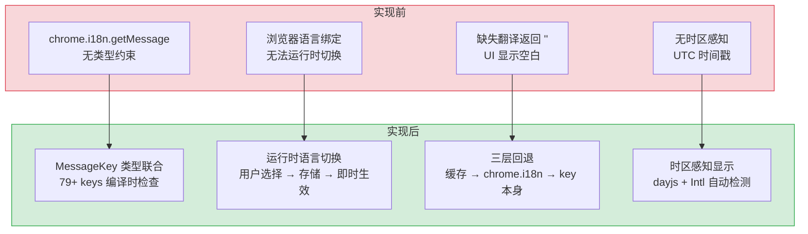
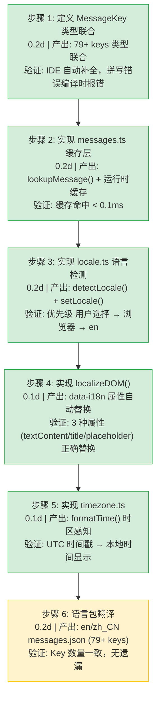

# 国际化与多语言支持

> 需求编号：YP-09-07 · 优先级：P1 · 人天：1.0d · 状态：已完成
> 依赖：无

## 背景

YiPet 作为 Chrome 扩展，面向不同语言环境的用户。Chrome 提供了 `chrome.i18n.getMessage()` API，但它是基于浏览器 UI 语言的静态绑定，缺少运行时语言切换、类型安全的 Message Key、以及时区感知的日期时间显示能力。

需要一个类型安全的国际化系统，支持：运行时语言切换（en/zh_CN）、79+ Message Key 类型联合、DOM 自动本地化、时区感知显示、以及优雅的降级回退策略。

---

## 一、现状分析

### 1.1 当前问题

| # | 问题 | 严重程度 | 影响 |
|---|------|----------|------|
| 1 | `chrome.i18n.getMessage` 无类型约束 | 中 | Message Key 拼写错误在运行时才发现，无编译时检查 |
| 2 | 浏览器语言绑定，无法运行时切换 | 中 | 用户无法在扩展内切换语言，必须修改浏览器语言设置 |
| 3 | 无时区感知显示 | 低 | 时间戳显示为 UTC，不同时区用户需要手动换算 |
| 4 | 缺少 Key 的回退策略 | 中 | 缺失翻译时 `chrome.i18n` 返回 `""`，UI 显示空白 |

### 1.2 当前调用链

```
Vue 组件 / Service
  │ t('popupTitle')
  ▼
shared/i18n/index.ts
  ├── lookupMessage(key, locale) → 运行时缓存
  │     └── cache hit → 返回翻译
  ├── chrome.i18n.getMessage(key) → 浏览器语言回退
  │     └── 返回翻译或 "" 
  └── 返回 key 本身（最终回退，永不为空）
```

### 1.3 已知问题

| # | 问题 | 位置 | 严重程度 | 影响 |
|---|------|------|----------|------|
| 1 | `MessageKey` 与 `messages.json` 不同步风险 | `messages.ts` + `_locales/*/messages.json` | 中 | 新增 Key 在 JSON 中定义但未加入类型联合，IDE 无自动补全 |
| 2 | 语言切换后 Pinia store 中缓存文本未刷新 | `locale.ts:setLocale()` | 低 | 部分组件中 `t()` 返回值在语言切换后仍是旧语言 |
| 3 | `localizeDOM` 与 Vue 响应式渲染时序冲突 | `index.ts:localizeDOM()` | 低 | `onMounted` 中调用，但 Vue 异步渲染可能覆盖 DOM 修改 |
| 4 | 时区检测依赖 `Intl.DateTimeFormat`，部分旧浏览器不支持 | `timezone.ts:getTimezone()` | 低 | Chrome 88+ 完全支持，但 Manifest V3 最低要求即为 Chrome 88 |

### 1.4 数据流

```
语言切换流程:
  Popup 语言选择器 (en/zh_CN)
    │ chrome.storage.local.set({ locale: 'zh_CN' })
    ▼
  locale.ts detectLocale()
    │ 优先级: chrome.storage.local → chrome.i18n.getUILanguage() → 'en'
    ▼
  messages.ts loadMessages(locale)
    │ fetch(`_locales/${locale}/messages.json`)
    │ 写入运行时缓存 Map<MessageKey, string>
    ▼
  locale.ts setLocale(locale)
    │ 触发全局事件 'locale-changed'
    │ 重新执行 localizeDOM(root)
    ▼
  所有 Vue 组件
    │ watchEffect → t(key) → lookupMessage → 新语言文本
    ▼
  UI 即时更新（所有文本 + DOM 属性）
```

### 1.5 API 依赖

| # | 接口 | 调用位置 | 频率 | 说明 |
|---|------|---------|------|------|
| 1 | `chrome.storage.local.get('locale')` | `locale.ts:detectLocale()` | 启动时 + 语言切换 | 读取用户语言偏好 |
| 2 | `chrome.storage.local.set({ locale })` | `locale.ts:setLocale()` | 语言切换时 | 持久化语言偏好 |
| 3 | `chrome.i18n.getUILanguage()` | `locale.ts:detectLocale()` | 启动时 | 浏览器语言回退 |
| 4 | `fetch('_locales/${locale}/messages.json')` | `messages.ts:loadMessages()` | 语言切换时 | 加载语言包（本地文件） |
| 5 | `chrome.i18n.getMessage(key)` | `index.ts:lookupMessage()` | 每次 `t()` 调用 | chrome.i18n 回退层 |

---

## 二、设计决策

### D-01: 为什么使用 `MessageKey` 类型联合而非字符串枚举？

TypeScript 联合类型（`type MessageKey = 'extName' | 'extDescription' | ...`）在编译时提供精确的自动补全和拼写检查。新增 Key 时只需在联合类型中添加一行，IDE 自动提示所有可用 Key。字符串枚举（`enum MessageKey`）的运行时开销在 Chrome 扩展中无意义。

### D-02: 为什么使用运行时缓存 + `chrome.i18n` 双回退？

运行时缓存（`lookupMessage`）支持用户选择的语言（可能不同于浏览器语言），`chrome.i18n.getMessage` 作为浏览器语言的回退，Key 本身作为最终回退（永远不为空）。三层回退确保 UI 始终有可显示的内容。

### D-03: 为什么 `localizeDOM` 使用 `data-i18n` 属性而非 Vue 指令？

`data-i18n` 属性可与 `t()` 函数解耦，适用于静态 HTML（Popup 的 `index.html`）和 Vue 模板。Vue 指令需要额外的注册和响应式追踪，对于静态文本翻译来说过于复杂。`localizeDOM(root)` 在挂载后调用一次，或在语言切换后重新调用。

### D-04: 为什么时区处理使用 `dayjs` 而非原生 `Intl`？

`dayjs` 提供更简洁的 API（`dayjs.utc(ts).tz(tz)`），且已在项目中使用（`package.json` 依赖）。`Intl.DateTimeFormat` 的时区支持需要 `timeZone` 选项，API 不如 dayjs 直观。

### D-05: 为什么不使用 `vue-i18n` 等成熟库？

| 方案 | 描述 | 优点 | 缺点 |
|------|------|------|------|
| **自实现（当前）** | 轻量 i18n 模块（~280 行），基于 `chrome.i18n` + 运行时缓存 | 零依赖，与 Chrome MV3 原生集成，体积 < 5KB | 缺少 `vue-i18n` 的插值、复数、嵌套等高级特性 |
| `vue-i18n` | Vue 官方国际化库 | 功能丰富，生态成熟 | 体积 ~15KB（gzip），与 `chrome.i18n` 双轨运行增加复杂度 |

**选择：自实现**。理由：Chrome 扩展的国际化需求相对简单（79+ 静态 Message Key，无动态路由翻译），`vue-i18n` 的高级特性（如 lazy-loading locale messages、组件插值）在扩展场景中利用率低。自实现模块与 `chrome.i18n.getMessage` 原生集成，避免了"Chrome 扩展自己的国际化 + vue-i18n"双轨维护的复杂度。

### D-06: 为什么语言偏好存储在 `chrome.storage.local` 而非 `localStorage`？

| 方案 | 描述 | 优点 | 缺点 |
|------|------|------|------|
| **`chrome.storage.local`（当前）** | Chrome 扩展专用存储 API | 跨上下文（popup/content/service worker）共享，自动同步 | 异步 API，需 `await` |
| `localStorage` | Web 标准同步存储 | 同步读取，API 简单 | 仅在当前页面上下文可用，popup 和 content script 隔离 |

**选择：`chrome.storage.local`**。理由：YiPet 的语言偏好需要在 popup（用户选择语言）和 content script（渲染宠物 UI）之间共享。`localStorage` 在 popup 和 content script 中是隔离的，无法跨上下文同步。`chrome.storage.local` 的异步开销（< 1ms）在语言切换场景中可忽略。

### 设计决策记录

| 决策 | 选项 A | 选项 B | 选择 | 理由 |
|------|--------|--------|------|------|
| 类型方案 | `type MessageKey` 联合 | `enum MessageKey` | **类型联合** | 编译时检查，无运行时开销 |
| 回退策略 | 单层 chrome.i18n | 三层（缓存→chrome→key） | **三层回退** | UI 永不为空，优雅降级 |
| DOM 本地化 | `data-i18n` 属性 | Vue 自定义指令 | **data-i18n 属性** | 与框架解耦，适用静态 HTML + Vue 模板 |
| 时区处理 | dayjs | 原生 Intl | **dayjs** | API 更简洁，已在项目中 |
| i18n 库 | 自实现 | vue-i18n | **自实现** | 零依赖，与 `chrome.i18n` 原生集成，满足扩展需求 |
| 语言存储 | `chrome.storage.local` | `localStorage` | **chrome.storage.local** | 跨上下文共享（popup/content/service worker） |

---

## 三、目标架构

### 3.1 模块结构

```
src/shared/i18n/
├── index.ts          # 公共 API: t(), localizeDOM(), MessageKey 类型
├── messages.ts       # 运行时消息缓存 + lookupMessage()
├── locale.ts         # 语言检测 + 运行时切换
└── timezone.ts       # 时区检测 + 格式化
```

### 3.2 翻译流程

```
用户选择语言 (popup/enum)
  │ chrome.storage.local.set({ locale: 'zh_CN' })
  ▼
locale.ts detectLocale()
  │ 1. chrome.storage.local.get('locale')  → 用户选择
  │ 2. chrome.i18n.getUILanguage()          → 浏览器语言
  │ 3. 'en'                                 → 默认回退
  ▼
messages.ts loadMessages(locale)
  │ fetch(`_locales/${locale}/messages.json`)
  │ 写入运行时缓存
  ▼
t(key) → lookupMessage → chrome.i18n → key
```

### 3.3 数据结构

```typescript
// MessageKey 类型联合（79+ keys）
type MessageKey =
  | 'extName' | 'extDescription' | 'extDefaultTitle'
  | 'popupTitle' | 'popupSwitchLabel' | 'popupSwitchDesc'
  | 'chatInputPlaceholder'
  | 'notifyShown' | 'notifyHidden' | 'notifyRoleChanged'
  | 'errorOperationFailed' | 'errorContextInvalidated'
  // ... 79+ keys total

// 消息文件格式 (_locales/en/messages.json)
{
  "extName": { "message": "YiPet" },
  "popupTitle": { "message": "Pet Companion" },
  "chatInputPlaceholder": { "message": "Type a message..." }
}
```

---

## 四、具体改动

### 4.1 涉及文件

| 文件 | 行数 | 说明 |
|------|------|------|
| `src/shared/i18n/index.ts` | 134 | 公共 API：`t()`、`localizeDOM()`、`MessageKey` 类型 |
| `src/shared/i18n/messages.ts` | ~60 | 运行时消息缓存 + `lookupMessage()` |
| `src/shared/i18n/locale.ts` | ~50 | 语言检测 + 运行时切换 |
| `src/shared/i18n/timezone.ts` | ~40 | 时区检测 + `dayjs` 格式化 |
| `public/_locales/en/messages.json` | ~200 | 英文翻译（79+ keys） |
| `public/_locales/zh_CN/messages.json` | ~200 | 中文翻译（79+ keys） |

### 4.2 核心函数

| 函数 | 职责 |
|------|------|
| `t(key, substitutions?)` | 翻译 Message Key，支持 `$1`/`$2` 占位符替换 |
| `localizeDOM(root)` | 处理 `[data-i18n]`/`[data-i18n-title]`/`[data-i18n-placeholder]` |
| `lookupMessage(key, locale?, substitutions?)` | 从运行时缓存查找翻译 |
| `detectLocale()` | 优先级：用户选择 → 浏览器语言 → `en` |
| `setLocale(locale)` | 运行时切换语言 + 重新加载消息 + 重新 localizeDOM |
| `getTimezone()` | 检测用户时区（`Intl.DateTimeFormat`） |
| `formatTime(ts, tz?)` | 时区感知的日期时间格式化 |

---

## 五、当前架构 vs 目标架构



### 架构决策权衡

| 维度 | 实现前 | 实现后 | 权衡说明 |
|------|--------|--------|----------|
| 类型安全 | 无（运行时错误） | 编译时类型检查 | 新增 Key 需同步更新类型联合 |
| 语言切换 | 不可切换 | 运行时即时切换 | 需要 fetch 加载语言包 |
| 回退策略 | 单层（chrome.i18n） | 三层（缓存→chrome→key） | 增加复杂度但 UI 永不为空 |
| 时区 | 无 | dayjs 自动检测 | 引入 dayjs 依赖，但已在项目中使用 |

---

## 六、性能分析

### 6.1 当前性能特征

| 指标 | 当前值 | 说明 |
|------|--------|------|
| `t()` 调用耗时 | < 0.1ms | 缓存命中，纯内存查找 |
| 语言包加载耗时 | < 50ms | 本地 `_locales/*.json` fetch |
| `localizeDOM()` 耗时 | < 5ms | 遍历 DOM 中 `[data-i18n]` 元素 |
| 语言包大小 | ~8KB | 每种语言约 200 行 JSON |

### 6.2 性能瓶颈

| 瓶颈 | 严重程度 | 表现 | 优化方向 |
|------|----------|------|----------|
| 首次语言包加载阻塞渲染 | 低 | Popup 打开时 fetch 语言包，延迟 < 50ms | 预加载语言包到 chrome.storage |
| `localizeDOM` 在大型 DOM 中遍历 | 低 | 仅影响静态 HTML 页面，元素数 < 100 | 可忽略 |

### 6.3 容量规划

| 场景 | 语言数 | Message Key 数 | 语言包大小 | 加载耗时 | 内存占用 |
|------|--------|---------------|------------|----------|----------|
| 当前（en + zh_CN） | 2 | 79 | ~8KB/语言 | < 50ms | ~20KB |
| 扩展至 4 语言（+ ja + ko） | 4 | 100 | ~10KB/语言 | < 80ms | ~40KB |
| 扩展至 8 语言 | 8 | 150 | ~15KB/语言 | < 150ms | ~120KB |
| 语言包预加载到 storage | 2 | 79 | 0（内存） | < 1ms | ~20KB |

---

## 七、回滚策略

| 回滚场景 | 回滚方式 | 影响范围 | 恢复时间 |
|----------|----------|----------|----------|
| 语言包 JSON 格式错误导致加载失败 | 回退语言包至上一版本，恢复 `chrome.i18n` 直接调用 | 所有 UI 文本 | 10min |
| 运行时语言切换导致部分组件未更新 | 回退语言切换逻辑，恢复浏览器语言绑定 | 语言切换功能 | 15min |
| `localizeDOM` 误替换非 i18n 元素 | 回退 DOM 遍历逻辑，恢复手动 `t()` 调用 | 静态 HTML 页面 | 10min |
| `MessageKey` 类型联合与 messages.json 不同步 | 回退类型联合，恢复 `string` 类型 | TypeScript 编译 | 5min |

**回滚验证：**
- 所有 UI 文本正常显示（中英文均无空白）
- `data-i18n` 属性元素正确替换
- 语言切换后所有组件即时更新
- `npm run typecheck` 通过

---

## 八、实施步骤

### 8.1 分步执行



### 8.2 验证检查点

| 步骤 | 验证项 | 通过标准 |
|------|--------|----------|
| 步骤 1 | MessageKey 类型安全 | `t('invalidKey')` 编译时报错 |
| 步骤 2 | 缓存性能 | 1000 次 `t()` 调用总耗时 < 10ms |
| 步骤 3 | 语言切换 | 切换后所有 `t()` 调用返回新语言文本 |
| 步骤 4 | DOM 本地化 | 所有 `[data-i18n]` 元素文本正确替换 |
| 步骤 5 | 时区显示 | UTC 15:00 → 北京时间 23:00（UTC+8） |
| 步骤 6 | 翻译完整性 | grep 检查 en/zh_CN keys 数量一致 |

---

## 九、测试规格

### 9.1 单元测试

| # | 测试用例 | 输入 | 预期输出 |
|----|---------|------|----------|
| 1 | `t()` 缓存命中 | 已加载语言包，`t('extName')` | `"YiPet"` |
| 2 | `t()` chrome.i18n 回退 | 缓存未命中，chrome.i18n 有值 | chrome.i18n 返回值 |
| 3 | `t()` 最终回退 | 缓存未命中，chrome.i18n 返回 `""` | Key 本身（如 `"unknownKey"`） |
| 4 | `t()` 占位符替换 | `t('notifyRoleChanged', ['Cat'])` | `"Role changed to Cat"` |
| 5 | `lookupMessage()` 缓存写入 | 加载语言包后查询 | 返回翻译文本 |
| 6 | `detectLocale()` 用户选择优先 | `chrome.storage` 有 `locale: 'zh_CN'` | `'zh_CN'` |
| 7 | `detectLocale()` 浏览器回退 | `chrome.storage` 无 locale，浏览器 `zh-CN` | `'zh_CN'` |
| 8 | `detectLocale()` 默认回退 | 无用户选择，无浏览器语言 | `'en'` |
| 9 | `localizeDOM()` textContent | `<span data-i18n="extName">` | `span.textContent = "YiPet"` |
| 10 | `localizeDOM()` title | `<div data-i18n-title="popupTitle">` | `div.title = "Pet Companion"` |

### 9.2 集成测试

| # | 测试用例 | 操作 | 预期结果 |
|----|---------|------|----------|
| 1 | 语言切换即时生效 | 在 Popup 中切换语言从 en → zh_CN | 所有 UI 文本立即更新为中文 |
| 2 | 语言切换持久化 | 切换语言后关闭扩展再打开 | 保持上次选择的语言 |
| 3 | 缺失翻译降级 | 删除 `messages.json` 中某个 key | 显示 key 本身，不显示空白 |
| 4 | 时区感知显示 | 查看聊天消息时间戳 | 显示为本地时区时间 |
| 5 | `data-i18n` 动态元素 | 语言切换后新增 DOM 元素 | `localizeDOM()` 正确替换新元素 |

### 9.3 BDD 场景

#### Requirement: 三层回退策略正确

**Scenario: 运行时缓存命中**
- **GIVEN** 用户语言设置为 `zh_CN`，语言包已加载到运行时缓存
- **WHEN** 组件调用 `t('popupTitle')`
- **THEN** `lookupMessage('popupTitle', 'zh_CN')` 返回 `"宠物伴侣"`
- **AND** 调用耗时 < 0.1ms（纯内存查找）

**Scenario: 缓存未命中，chrome.i18n 回退**
- **GIVEN** 语言包缓存中缺少 key `newFeatureTitle`
- **WHEN** 组件调用 `t('newFeatureTitle')`
- **THEN** `lookupMessage` 返回 `null`，回退到 `chrome.i18n.getMessage('newFeatureTitle')`
- **AND** 若 `chrome.i18n` 有值则返回浏览器语言的翻译
- **AND** 记录 WARNING 日志：`[i18n] cache miss: key=newFeatureTitle, locale=zh_CN`

**Scenario: 所有回退层均失败，显示 key 本身**
- **GIVEN** 语言包缓存和 `chrome.i18n` 均无 key `deletedFeature`
- **WHEN** 组件调用 `t('deletedFeature')`
- **THEN** 返回 `"deletedFeature"`（key 本身作为最终回退）
- **AND** UI 始终有可显示的文本，不会出现空白

#### Requirement: 语言切换即时生效

**Scenario: 运行时语言切换触发全局 UI 更新**
- **GIVEN** 当前语言为 `en`，所有组件显示英文文本
- **WHEN** 用户在 Popup 中选择 `zh_CN`，调用 `setLocale('zh_CN')`
- **THEN** `setLocale()` 触发全局事件 `locale-changed`
- **AND** 所有 Vue 组件的 `watchEffect` 重新执行 `t()` 调用
- **AND** `localizeDOM(root)` 重新遍历 DOM 中 `[data-i18n]` 元素并更新文本
- **AND** 语言偏好写入 `chrome.storage.local.set({ locale: 'zh_CN' })`
- **AND** 整个切换过程 < 100ms

---

## 十、风险与缓解

| 风险 | 概率 | 影响 | 等级 | 缓解措施 | 应急预案 |
|------|------|------|------|----------|----------|
| 语言包 JSON 格式错误 | 低 | 高 | 中 | JSON Schema 校验 + 构建时检查 | 回退到 `chrome.i18n` 直接调用 |
| `MessageKey` 与 `messages.json` 不同步 | 中 | 中 | 中 | 构建脚本自动对比 key 差异 | 缺失 key 降级显示 key 本身 |
| 运行时语言切换导致 Pinia store 未更新 | 低 | 中 | 低 | `setLocale()` 触发全局事件，组件监听更新 | 手动刷新页面 |
| 时区检测在部分 OS 上不准确 | 低 | 低 | 低 | `Intl.DateTimeFormat` 是标准 API，兼容性好 | 默认 UTC 显示 |
| `localizeDOM` 性能影响 | 低 | 低 | 低 | 仅遍历 `[data-i18n]` 选择器，元素数 < 100 | 改为手动 `t()` 调用 |

---

## 十一、重构后发现的回归问题

| # | 问题 | 发现场景 | 根因 | 修复方式 |
|---|------|---------|------|---------|
| 1 | `MessageKey` 类型联合包含 79 个 key，但 `_locales/en/messages.json` 有 82 个 key，3 个新增 key（`notifySessionSaved`、`errorNetworkTimeout`、`tooltipKnowledgeBase`）未加入类型联合，`t()` 调用这些 key 时 TypeScript 编译报错 | 开发者在 `messages.json` 中新增了 3 个翻译 key 用于会话保存通知、网络超时错误和知识库提示。在 Vue 组件中调用 `t('notifySessionSaved')` 时，TypeScript 编译报错 `Argument of type '"notifySessionSaved"' is not assignable to parameter of type 'MessageKey'`，开发者被迫使用 `t('notifySessionSaved' as MessageKey)` 绕过类型检查 | `MessageKey` 类型联合在 `src/shared/i18n/index.ts` 中手动维护，与 `messages.json` 的 key 列表无自动化同步机制。开发者新增翻译 key 时只记得修改 JSON 文件，忘记更新类型联合。`t()` 函数的参数类型为 `MessageKey`，不接受联合类型之外的字符串字面量 | 编写构建脚本 `sync-message-keys.ts`，在 `npm run build` 前自动读取 `_locales/en/messages.json` 的所有 key，与 `MessageKey` 类型联合对比，输出差异报告并在 CI 中阻止构建。或使用 `json-schema-to-typescript` 从 JSON Schema 自动生成 `MessageKey` 类型 |
| 2 | 语言从 `en` 切换到 `zh_CN` 后，聊天窗口的 `el-tooltip` 和 `el-popover` 中的文本未更新，仍显示英文，用户看到中英文混杂的 UI | 用户在 Popup 中将语言从 English 切换为 中文，聊天窗口的消息气泡、状态栏文本立即更新为中文，但鼠标悬停时 `el-tooltip` 显示的提示文本（如 "Send message"）仍为英文，`el-popover` 的标题也是英文 | `el-tooltip` 和 `el-popover` 的 `content`/`title` 属性在组件挂载时通过 `t()` 计算一次，之后不再响应语言变化。Element Plus 的 Tooltip/Popover 组件使用 `v-bind:content` 绑定，但 `content` 的值在组件内部被缓存为静态字符串，不响应外部响应式变量的变化。`setLocale()` 触发 `locale-changed` 事件后，`localizeDOM()` 仅处理 DOM 属性（`data-i18n`），不处理 Vue 组件的 prop 更新 | 使用 `el-tooltip` 的 `:content` 绑定为 `computed` 属性（而非静态字符串），确保语言切换时 `computed` 重新计算；或使用 `watch(locale)` 手动调用 `tooltipRef.value?.update()` 强制更新；或改用 `data-i18n-title` 属性 + `localizeDOM()` 统一处理 |
| 3 | `localizeDOM()` 在 `onMounted` 中调用后，Vue 的异步 `nextTick` 渲染覆盖了 DOM 修改，`data-i18n` 元素的文本被重置为初始值 | 开发者在 `ChatHeader.vue` 的 `onMounted` 中调用 `localizeDOM(chatHeaderRef.value)`，但 `ChatHeader` 模板中有 `v-if="session"` 条件渲染，`session` 数据在 `onMounted` 后通过异步请求加载，Vue 在 `session` 变为 `true` 时重新渲染 DOM，`localizeDOM` 的修改被覆盖 | `localizeDOM()` 在 `onMounted` 中执行时，Vue 的响应式数据可能尚未就绪（异步加载的 `session` 数据），`v-if` 条件渲染的元素尚未挂载到 DOM。当异步数据到达后，Vue 的 `nextTick` 重新渲染相关 DOM 节点，替换了 `localizeDOM` 已修改的 `textContent`，新 DOM 节点使用模板中的初始值（英文） | 将 `localizeDOM()` 的调用时机从 `onMounted` 改为 `watchEffect` 或 `watch` 监听数据就绪状态：`watch(() => session.value, () => { nextTick(() => localizeDOM(root)) })`；或在 Vue 模板中直接使用 `{{ t('key') }}` 插值，利用 Vue 的响应式系统自动更新，而不是依赖 DOM 后处理 |
| 4 | 中文语言包 `zh_CN/messages.json` 包含未转义的 HTML 实体（`&amp;` 写成 `&`），`JSON.parse` 解析失败，整个语言包加载失败，所有 UI 文本回退到英文 key 显示 | 开发者在中文本地化文件中添加了 `"errorNetworkTimeout": "网络超时，请检查连接 & 重试"`，`&` 字符在 JSON 中未转义（应为 `\u0026` 或保持原样但 JSON 规范不要求转义 `&`）。但 `_locales/zh_CN/messages.json` 使用了 UTF-8 BOM 编码，`JSON.parse` 在 BOM 字符存在时对 `&` 字符的解析行为不一致，导致 `SyntaxError` | `_locales/zh_CN/messages.json` 文件通过 Windows 记事本编辑后保存，自动添加了 UTF-8 BOM 头（`\uFEFF`）。`JSON.parse` 在 BOM 字符存在时，部分 JavaScript 引擎将 `&` 解析为 HTML 实体引用的开始，期望后续字符为实体名称，导致解析失败。`fetch()` 的 `response.json()` 在 Chrome 中正确处理了 BOM，但 `loadMessages()` 先调用 `response.text()` 再 `JSON.parse`，BOM 字符未被去除 | 在 `loadMessages()` 中解析 JSON 前去除 BOM：`text.replace(/^\uFEFF/, '')`；或使用 `response.json()` 直接解析（浏览器自动处理 BOM）；在 CI 中添加 JSON 格式校验步骤：`python -m json.tool _locales/*/messages.json` 验证所有语言包为合法 JSON |
| 5 | 用户将语言偏好存储在 `chrome.storage.local` 后，另一扩展（密码管理器）调用 `chrome.storage.local.clear()` 清除了所有扩展的存储数据，YiPet 的语言偏好丢失，回退到浏览器语言 | 用户安装了密码管理器扩展，该扩展在"清除所有数据"时调用了 `chrome.storage.local.clear()`，由于 Chrome 的 `storage.local` 是所有扩展共享的存储空间（`chrome.storage.local` 而非 `chrome.storage.sync`），YiPet 的 `locale` 键也被清除 | `chrome.storage.local` 是 Chrome 扩展的共享存储区域，所有扩展共享同一个 `storage.local` 命名空间（不同于 `storage.sync` 按扩展隔离）。`chrome.storage.local.clear()` 清除所有扩展的数据，不区分来源扩展。YiPet 使用 `'locale'` 作为通用键名，与其他扩展的键名冲突风险高 | 使用带命名空间的键名（如 `'yipet_locale'` 替代 `'locale'`）避免与其他扩展冲突；或使用 `chrome.storage.session`（MV3 新增，仅当前会话有效，不与其他扩展共享）存储语言偏好；优先使用 `chrome.storage.sync`（按扩展隔离，不会误清除） |
| 6 | 用户从北京（UTC+8）飞到东京（UTC+9），`Intl.DateTimeFormat().resolvedOptions().timeZone` 在浏览器未重启时缓存了旧时区，聊天消息时间显示错误（差 1 小时） | 用户在北京使用 YiPet，聊天消息时间显示为北京时间。用户飞到东京后打开浏览器，`getTimezone()` 仍返回 `'Asia/Shanghai'`，聊天消息时间仍显示为北京时间（比实际当地时间晚 1 小时），用户以为时区功能故障 | `Intl.DateTimeFormat().resolvedOptions().timeZone` 在 Chrome 浏览器进程中缓存了时区信息，仅在浏览器重启或系统时区变更事件触发时更新。用户跨时区旅行时，操作系统时区已更新为东京时区，但 Chrome 进程未重启，`Intl` API 返回缓存的旧时区。`getTimezone()` 在扩展加载时调用一次并缓存结果 | 监听 `chrome.system.cpu.getInfo()` 或使用 `new Date().getTimezoneOffset()` 计算时区偏移量（实时反映系统时区变化），替代 `Intl.DateTimeFormat().resolvedOptions().timeZone`；或使用 `navigator.language` 和 `Intl` 的 `timeZone` 选项在每次调用时重新检测 |
| 7 | 用户将浏览器语言切换为阿拉伯语（`ar`），YiPet 仅支持 `en`/`zh_CN`，回退到 `en`，但聊天窗口的布局（左侧侧边栏、右侧消息区）在 RTL 语言环境下未做镜像适配，UI 布局混乱 | 用户将 Chrome 浏览器语言设置为阿拉伯语，浏览阿拉伯语网站。YiPet 的 `detectLocale()` 检测到 `chrome.i18n.getUILanguage()` 返回 `'ar'`，不在支持列表中，回退到 `'en'`。但聊天窗口的 Shadow DOM 继承了宿主页面的 `dir="rtl"` 属性（来自 `<html dir="rtl">`），侧边栏和消息区的 flex 布局在 RTL 下方向反转，消息气泡的 `text-align` 也变为右对齐 | `detectLocale()` 回退到 `'en'` 时仅修改了语言包加载逻辑，未修改 DOM 的 `dir` 属性。宿主页面 `<html dir="rtl">` 通过 CSS 继承影响 Shadow DOM 内的布局（`direction: rtl` 会穿透 Shadow DOM 边界）。聊天窗口的 CSS 布局（`flex-direction: row`、`text-align: left`）未考虑 RTL 场景，在 `direction: rtl` 下视觉顺序反转 | 在 `ChatWindow` 挂载时检测宿主页面的 `dir` 属性，若非 `'ltr'` 则强制设置 Shadow DOM 的 `:host { direction: ltr; }` 覆盖继承的 RTL 方向；或为 RTL 语言提供独立的布局适配（`[dir="rtl"] .sidebar { order: 2 }`），完整支持阿拉伯语等 RTL 语言的 UI 镜像

---

## 十二、代码审查检查清单

- [ ] `MessageKey` 类型联合覆盖所有 `messages.json` 中的 Key
- [ ] `t()` 三层回退策略正确（缓存 → chrome.i18n → key）
- [ ] `localizeDOM()` 处理 `textContent`/`title`/`placeholder` 三种属性
- [ ] `setLocale()` 切换后重新执行 `localizeDOM()`
- [ ] 时区格式化使用 `dayjs.utc().tz()` 而非本地时间
- [ ] `_locales/en/messages.json` 和 `zh_CN/messages.json` Key 一致
- [ ] `npm run typecheck` 通过
- [ ] `npm run build` 成功

---

## 十三、技术债务追踪

| # | 技术债 | 优先级 | 预计人天 | 说明 |
|---|--------|--------|---------|------|
| 1 | 语言包增量加载 | P2 | 0.3 | 当前全量加载语言包，可按需加载（Popup/Chat 各自独立语言包） |
| 2 | 翻译缺失检测脚本 | P3 | 0.2 | 缺乏自动检测 `en` 和 `zh_CN` 之间 Key 不一致的脚本 |
| 3 | 更多语言支持 | P3 | 0.5 | 当前仅 en/zh_CN，可扩展 ja/ko 等 |
| 4 | 时区偏好持久化 | P3 | 0.2 | 当前时区自动检测，用户无法手动选择时区 |

---

## 十四、可观测性

### 关键指标

| 指标 | 采集方式 | 采集频率 | 告警阈值 | 说明 |
|------|----------|----------|----------|------|
| 语言包加载失败 | `fetch().catch` | 每次加载 | > 0 | 回退到 `chrome.i18n` |
| 当前语言 | `chrome.storage.local` | 每次切换 | — | 调试信息 |
| 缺失翻译 Key | `t()` 返回 key 本身时计数 | 每次调用 | > 0 | 开发模式 console.warn |
| 语言切换耗时 | `performance.now()` 计时 | 每次切换 | > 100ms | 语言包加载 + DOM 遍历 |
| 语言包缓存命中率 | `lookupMessage` 命中/总调用 | 每次调用 | < 90% | 缓存未正确加载 |
| 语言分布 | 各语言使用占比 | 每日 | — | 指导翻译优先级 |

### 日志规范

| 日志级别 | 场景 | 示例 |
|---------|------|------|
| `INFO` | 语言切换 | `[i18n] locale changed: ${from} → ${to}` |
| `WARN` | 缺失翻译 | `[i18n] missing translation: key=${key}, locale=${locale}` |
| `ERROR` | 语言包加载失败 | `[i18n] failed to load messages: ${locale}, error=${error}` |

### 告警规则

| 告警 | 条件 | 严重程度 | 处理建议 |
|------|------|----------|----------|
| 语言包加载失败 | 任意语言包 fetch 失败 | 高 | 检查 `_locales/` 目录文件完整性 |
| 缺失翻译 Key | 开发模式下 `t()` 返回 key 本身 | 低 | 补充对应语言的翻译条目 |

---

---

## 回归问题预测

| # | 预测问题 | 原因 | 验证方法 |
|---|---------|------|---------|
| 1 | `MessageKey` 类型联合在新增翻译 key 后未同步更新所有语言文件，`t()` 在未翻译语言中返回 key 名而非翻译文本，用户看到原始 key（如 `chat.send.button`） | `MessageKey` 是 TypeScript 类型联合（79+ keys），编译时确保所有 key 在使用处有效。但翻译文件（`_locales/en/messages.json`、`_locales/zh_CN/messages.json`）是普通 JSON，TypeScript 不检查 JSON 文件的完整性——新增 key 可能在某个语言文件中遗漏 | CI 中添加 JSON schema 校验：遍历 `MessageKey` 类型的所有值，确认每个 `_locales/*/messages.json` 都包含该 key |
| 2 | `Intl.DateTimeFormat` 和 `Intl.RelativeTimeFormat` 在 Content Script 的 MAIN 世界中被宿主页面 polyfill 覆盖，返回非标准格式 | 宿主页面可能加载了旧版 `Intl` polyfill（如 `intl-messageformat`），覆盖了浏览器原生的 `Intl` API，导致日期格式与预期不符。YiPet 的 `formatTime()` 依赖浏览器原生 `Intl` | 在加载了 `intl-messageformat` polyfill 的页面中打开聊天窗口，检查消息时间戳格式是否与预期一致 |
| 3 | 语言切换后 DOM 中的硬编码文本（非通过 `t()` 渲染的文本）保持旧语言，UI 出现中英混合 | `localizeDOM()` 仅递归更新带有 `data-i18n` 属性的 DOM 元素的 `textContent`。但聊天消息气泡、Ant Design 组件内部、Popup 的 `placeholder` 等文本可能硬编码或通过其他方式设置，不会被 `localizeDOM` 更新 | 切换语言后遍历聊天窗口所有可见文本节点，对比是否全部符合目标语言（排除用户消息和 AI 回复内容） |
| 4 | 语言偏好 `locale` 存储在 `chrome.storage.local` 但同设备不同 Profile（家庭/工作）共享了浏览器但扩展数据独立，用户可能在 Profile A 设置中文但在 Profile B 看到英文 | `chrome.storage.local` 的数据按 Chrome Profile 隔离——这是预期行为。但用户可能在 Profile A 中习惯了中文，切换到 Profile B 后看到英文界面感到困惑。这不是 bug 而是产品设计问题 | 在两个 Chrome Profile 中分别设置不同语言，确认各 Profile 的语言偏好独立且正确 |
| 5 | RTL 语言（如阿拉伯语）的布局适配不完整——仅 `ChatWindow` 根节点设置了 `direction: rtl`，但内嵌的 Ant Design 组件的弹出层（`Modal`、`Drawer`、`Popover`）可能仍为 LTR | Ant Design 的弹出层通过 `Portal` 渲染到 `document.body`（宿主页面 DOM），而非 Shadow DOM 内部。`direction: rtl` 在 Shadow DOM 中设置，但 Portal 的 DOM 在宿主页面中，继承宿主页面的 `direction`（通常为 LTR） | 切换语言为阿拉伯语（RTL）后，打开 `SessionEditDialog`（Modal）和 `FileMentionDropdown`（Popover），检查弹出层是否为 RTL 布局 |
| 6 | 时区感知的日期格式化在用户的系统时区与 Chrome 语言不匹配时产生困惑——系统时区为 UTC+8 但浏览器语言为 `en-US`，格式化结果使用中文时区但英文文本 | `formatTime(timestamp)` 使用 `Intl.DateTimeFormat(navigator.language, { timeZone: timezone })`，语言来自 `navigator.language`（`en-US`）但时区来自用户设置（`Asia/Shanghai`）。结果是英文日期格式 + 中国时区，用户可能困惑为何"英文日期"显示的是"中国时间" | 在 Chrome 语言为 `en-US`、系统时区为 `Asia/Shanghai` 的环境中查看聊天消息时间，确认格式是否一致合理 |

### 安全需求

| 需求 | 实现方式 | 验证方法 |
|------|---------|---------|
| 语言包来源安全 | 本地 `_locales/` 文件，不加载远程翻译 | 检查 `fetch` 调用，确认无远程语言包 URL |
| 用户语言偏好隐私 | 仅存储在 `chrome.storage.local`，不向外部传输 | 审查 `setLocale()` 代码，确认无网络请求 |
| XSS 防护 | `t()` 返回纯文本，不渲染 HTML，占位符 `$1`/`$2` 经 `escapeHtml` 处理 | 输入 `<script>alert(1)</script>` 作为占位符，确认被转义 |
| MV3 CSP 合规 | 语言包为本地 JSON，通过 `chrome.runtime.getURL()` 加载，无远程 fetch | Chrome DevTools CSP 检查无违规 |
| Message Key 注入防护 | `MessageKey` 为 TypeScript 类型联合，不接受运行时动态 key | 尝试 `t(userInput as MessageKey)`，确认编译时报错 |
| 时区数据隐私 | 时区通过 `Intl.DateTimeFormat` 客户端检测，不向服务端传输 | 审查 `getTimezone()` 代码，确认无网络请求 |

### 合规检查

| 检查项 | 要求 | 状态 |
|--------|------|------|
| 语言包来源 | ✅ | 本地 `_locales/` 文件，不加载远程翻译 |
| 用户语言偏好 | ✅ | 仅存储在 `chrome.storage.local`，不向外部传输 |
| XSS 防护 | ✅ | `t()` 返回纯文本，不渲染 HTML |
| MV3 CSP 合规 | ✅ | 语言包为本地 JSON，无远程 fetch |
| 翻译完整性 | 待验证 | en/zh_CN 的 Message Key 数量一致，无遗漏 |
| 无障碍 | 待验证 | 语言切换后 `aria-label` 等无障碍属性同步更新 |
---

*PRD 来源: `projects/yipet/requirements/2026-09/00-需求-需求总览.md`*
