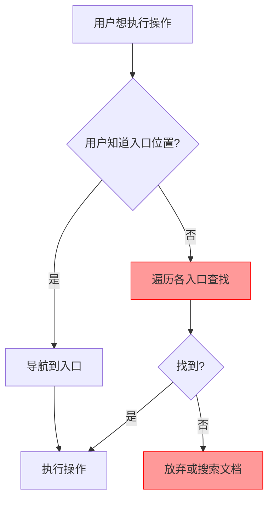
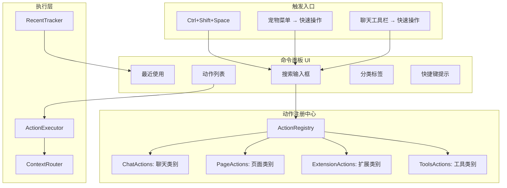
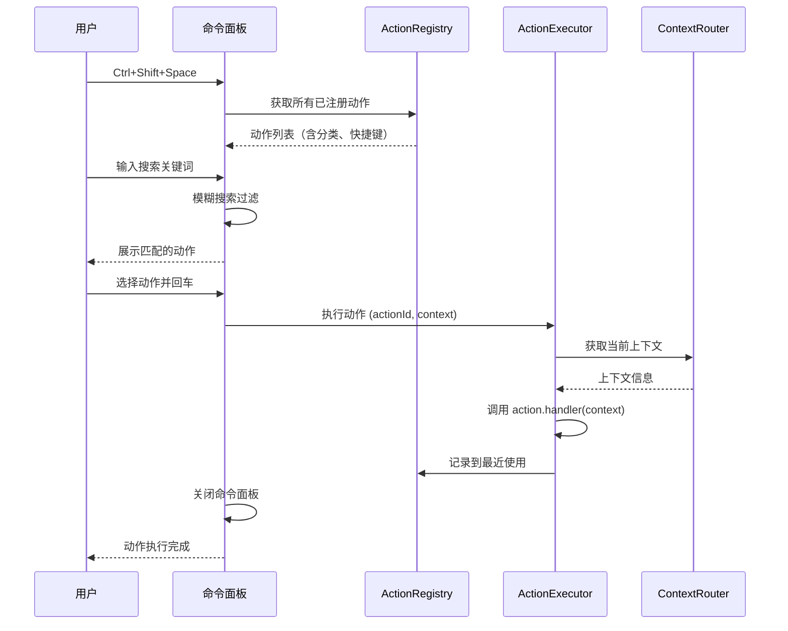

# YP-09-133: 快速操作面板 — 命令面板式操作入口、可搜索动作列表、自定义快捷操作

> 需求编号：YP-09-133 · 优先级：P2 · 人天：0.3d · 状态：需求已编写
> 依赖：YP-09-97（键盘快捷键系统）、YP-09-42（设置面板重构）

## 背景

### 问题陈述

YiPet 功能日益丰富（聊天、截图、朗读、翻译、会话管理、宠物切换等），但用户操作入口分散在多个位置：Popup 菜单、聊天窗口工具栏、右键菜单、宠物点击菜单。用户需要记住每个功能的入口位置，操作效率低下：

1. **操作入口分散**：功能分布在 Popup、聊天窗口、宠物菜单、右键菜单 4 个入口，用户需要记忆每个功能的所在位置
2. **发现性差**：新功能上线后用户不知道存在，缺乏统一的动作发现机制
3. **无快速访问**：高频操作（如切换到特定会话、切换宠物皮肤）需要多次点击
4. **无搜索能力**：用户无法通过输入关键词快速找到目标功能
5. **无最近使用**：用户无法快速重复执行最近使用过的操作

**核心矛盾**：YiPet 功能数量增长 vs 用户认知负荷的线性增长，需要一种可扩展的动作发现和执行机制，类似 VS Code 的命令面板（Ctrl+Shift+P）。

### 影响范围

| # | 影响 | 严重程度 | 典型场景 |
|---|------|----------|----------|
| 1 | 操作入口分散，效率低 | 高 | 用户想切换宠物皮肤，需要经过 3 次点击 |
| 2 | 新功能发现性差 | 中 | 截图功能上线后用户不知道如何使用 |
| 3 | 无键盘快速操作 | 高 | 键盘用户需要频繁切换鼠标操作 |
| 4 | 无最近使用记录 | 中 | 用户重复执行相同操作需要重新导航 |
| 5 | 操作分类不清晰 | 中 | 用户不清楚哪些操作在聊天中可用、哪些在页面中可用 |

### 挑战

| 挑战 | 说明 |
|------|------|
| 动作注册机制 | 需要一种可扩展的动作注册方式，各模块独立注册自己的动作 |
| 搜索性能 | 支持模糊搜索，100+ 动作的搜索延迟 < 50ms |
| 上下文感知 | 不同上下文（聊天聚焦/页面浏览/宠物不可见）下可用的动作不同 |
| 键盘事件处理 | Ctrl+Shift+Space 可能与宿主页面或浏览器快捷键冲突 |
| 最近使用持久化 | 最近使用的动作列表需要持久化存储并在跨标签页间同步 |

---

## 一、现状分析

### 1.1 当前操作入口分布

```
YiPet 操作入口现状:
├── Popup 菜单
│   ├── 设置
│   ├── 会话列表
│   ├── 关于
│   └── 反馈
├── 聊天窗口工具栏
│   ├── 新会话
│   ├── 导出会话
│   ├── 清空会话
│   ├── 朗读
│   └── 截图
├── 宠物点击菜单
│   ├── 切换皮肤
│   ├── 切换宠物
│   ├── 静音/取消静音
│   ├── 隐藏宠物
│   └── 显示/隐藏聊天
├── 右键菜单
│   ├── 发送选中文本到聊天
│   ├── 翻译选中文本
│   └── 朗读选中文本
└── 设置面板
    ├── 快捷键配置
    ├── 主题切换
    ├── 语言切换
    └── 通知偏好

缺失:
├── 统一动作注册中心             # ❌ 不存在
├── 命令面板 UI                  # ❌ 不存在
├── 动作搜索                     # ❌ 不存在
├── 最近使用动作                 # ❌ 不存在
├── 自定义快捷操作               # ❌ 不存在
└── 动作分类体系                 # ❌ 不存在
```

### 1.2 操作覆盖矩阵

| 操作 | 当前入口 | 入口数量 | 执行步骤 | 键盘可访问 |
|------|----------|----------|----------|-----------|
| 切换宠物皮肤 | 宠物菜单 | 1 | 右键宠物 → 选择皮肤 | 否 |
| 切换宠物角色 | 宠物菜单 | 1 | 右键宠物 → 选择角色 | 否 |
| 打开聊天窗口 | Popup / 宠物菜单 | 2 | 点击图标 | 是 (Ctrl+Shift+K) |
| 关闭聊天窗口 | 聊天工具栏 | 1 | 点击关闭按钮 | 是 (Escape) |
| 截图 | 聊天工具栏 | 1 | 点击截图按钮 | 是 (Ctrl+Shift+S) |
| 朗读 | 聊天工具栏 / 右键菜单 | 2 | 点击朗读按钮 | 是 (Ctrl+Shift+R) |
| 导出会话 | 聊天工具栏 | 1 | 点击导出按钮 | 否 |
| 切换语言 | 设置面板 | 1 | Popup → 设置 → 语言 | 否 |
| 翻译选中文本 | 右键菜单 | 1 | 右键 → 翻译 | 否 |
| 发送选中文本 | 右键菜单 | 1 | 右键 → 发送 | 否 |

### 1.3 改造前操作流程



### 1.4 根因矩阵

| 症状 | 根因 | 触发条件 | 频率 |
|------|------|----------|------|
| 操作入口分散 | 无统一动作注册中心 | 用户想执行任何操作 | 持续 |
| 新功能不可发现 | 无动作列表 | 新功能上线后 | 每次更新 |
| 键盘操作效率低 | 无命令面板 | 键盘用户操作 | 高 |
| 重复操作繁琐 | 无最近使用 | 用户重复执行同一操作 | 中 |
| 操作分类不清 | 无分类体系 | 用户不确定操作可用性 | 中 |

---

## 二、设计决策

### 决策 1：命令面板触发方式 — 快捷键 vs 宠物菜单入口 vs 两者

| 选项 | 可见性 | 效率 | 实现复杂度 |
|------|--------|------|-----------|
| 仅快捷键 (Ctrl+Shift+Space) | 低（新用户不知道） | 最高 | 低 |
| 仅宠物菜单入口 | 高 | 低 | 低 |
| 两者（快捷键 + 菜单入口） | 高 | 高 | 低 |

**选择：两者。** 默认快捷键 Ctrl+Shift+Space 触发命令面板，同时在宠物菜单和聊天工具栏中添加"快速操作..."入口。快捷键用于高效用户，菜单入口用于新用户发现。

### 决策 2：动作注册方式 — 集中式注册 vs 分散式声明 vs 插件式

| 选项 | 扩展性 | 类型安全 | 模块解耦 |
|------|--------|----------|----------|
| 集中式注册（所有动作在一个文件） | 低 | 高 | 低 |
| 分散式声明（各模块用装饰器声明） | 中 | 高 | 中 |
| 插件式（各模块实现 ActionProvider 接口） | 高 | 中 | 高 |

**选择：插件式。** 各模块（Chat、Page、Extension、Tools）实现 `ActionProvider` 接口，在初始化时注册到 `ActionRegistry`。命令面板在打开时从注册中心动态获取动作列表，按上下文过滤。

### 决策 3：搜索算法 — 简单过滤 vs 模糊搜索 vs 全文搜索

| 选项 | 搜索精度 | 性能（100+ 动作） | 实现复杂度 |
|------|----------|-------------------|-----------|
| 简单过滤（字符串包含） | 低 | O(n) | 低 |
| 模糊搜索（Levenshtein 距离） | 高 | O(n*m) | 中 |
| 全文搜索（倒排索引） | 高 | O(log n) | 高 |

**选择：模糊搜索（Fuse.js 或自实现简化版）。** 100+ 动作的模糊搜索性能足够（< 10ms），不需要全文搜索的复杂度。使用简化版模糊匹配（子序列匹配 + 字符距离评分），无需引入外部依赖。

### 决策 4：最近使用持久化 — 内存 vs chrome.storage.local vs 两者

| 选项 | 持久性 | 跨标签页同步 | 性能 |
|------|--------|-------------|------|
| 内存 | 低 | 否 | 最高 |
| chrome.storage.local | 高 | 是 | 中 |
| 两者（内存缓存 + storage 持久化） | 高 | 是 | 高 |

**选择：两者。** 最近使用列表在内存中维护（快速读取），同时持久化到 chrome.storage.local（跨标签页同步和重启恢复）。写入使用 debounce（500ms）避免频繁 I/O。

### 设计决策记录

| 决策 | 选项 A | 选项 B | 选项 C | 选择 | 理由 |
|------|--------|--------|--------|------|------|
| 触发方式 | 快捷键 | 菜单入口 | 两者 | **两者** | 兼顾效率和新用户发现 |
| 注册方式 | 集中式 | 分散式 | 插件式 | **插件式** | 模块解耦，可扩展 |
| 搜索算法 | 简单过滤 | 模糊搜索 | 全文搜索 | **模糊搜索** | 性能与精度平衡 |
| 持久化 | 内存 | storage | 两者 | **两者** | 性能 + 同步 |

---

## 三、目标架构

### 3.1 命令面板架构



### 3.2 动作执行流程



### 3.3 性能指标

| 指标 | 目标值 | 说明 |
|------|--------|------|
| 命令面板打开 | < 50ms | overlay 渲染 + 动作列表加载 |
| 动作搜索 | < 10ms | 100+ 动作的模糊搜索 |
| 动作执行 | < 100ms | handler 调用 + 上下文路由 |
| 最近使用更新 | < 5ms | 内存写入 + debounced storage 同步 |
| 内存占用 | < 1MB | 动作注册表 + 搜索索引 |

---

## 四、具体改动

### 4.1 动作定义与注册

```typescript
// src/command-palette/types.ts (新增)

export type ActionCategory = 'chat' | 'page' | 'extension' | 'tools';

export interface CommandAction {
  id: string;
  label: string;
  description: string;
  category: ActionCategory;
  keywords: string[];        // 搜索关键词
  shortcut?: string;         // 关联的快捷键
  icon?: string;             // 图标名
  contextRequired?: boolean; // 是否需要特定上下文
  handler: () => void | Promise<void>;
}

export interface ActionProvider {
  category: ActionCategory;
  getActions(): CommandAction[];
}

// 插件式注册接口
export interface ActionRegistry {
  register(provider: ActionProvider): void;
  unregister(category: ActionCategory): void;
  getAllActions(): CommandAction[];
  getActionsByCategory(category: ActionCategory): CommandAction[];
  search(query: string): CommandAction[];
}
```

### 4.2 命令面板 UI

```typescript
// src/command-palette/components/command-palette.vue (新增)

// <template>
//   <div class="command-palette-overlay" @click.self="close">
//     <div class="command-palette">
//       <input ref="searchInput" v-model="query" @keydown="onKeydown" placeholder="输入命令...">
//       <div class="actions-list">
//         <div v-if="recentActions.length && !query" class="section">
//           <div class="section-header">最近使用</div>
//           <div v-for="action in recentActions" @click="execute(action)">
//             {{ action.label }} <span class="shortcut">{{ action.shortcut }}</span>
//           </div>
//         </div>
//         <div v-for="category in filteredCategories" class="section">
//           <div class="section-header">{{ categoryLabel(category) }}</div>
//           <div v-for="action in filteredActions[category]" @click="execute(action)">
//             {{ action.label }} <span class="shortcut">{{ action.shortcut }}</span>
//           </div>
//         </div>
//       </div>
//     </div>
//   </div>
// </template>

class CommandPaletteState {
  query = '';
  isOpen = false;
  selectedIndex = 0;
  recentActions: CommandAction[] = [];
  filteredActions: Record<ActionCategory, CommandAction[]> = {
    chat: [], page: [], extension: [], tools: [],
  };
}
```

### 4.3 模糊搜索实现

```typescript
// src/command-palette/services/search.ts (新增)

class ActionSearchService {
  search(actions: CommandAction[], query: string): CommandAction[] {
    if (!query.trim()) return actions;
    
    const q = query.toLowerCase().trim();
    const scored = actions.map(action => ({
      action,
      score: this.score(action, q),
    }));
    
    return scored
      .filter(item => item.score > 0)
      .sort((a, b) => b.score - a.score)
      .map(item => item.action);
  }

  private score(action: CommandAction, query: string): number {
    let score = 0;
    const label = action.label.toLowerCase();
    const desc = action.description.toLowerCase();
    
    // 精确匹配 label 加分
    if (label === query) score += 100;
    // label 以 query 开头加分
    else if (label.startsWith(query)) score += 50;
    // label 包含 query 加分
    else if (label.includes(query)) score += 30;
    // description 包含 query 加分
    else if (desc.includes(query)) score += 10;
    // 关键词匹配加分
    else if (action.keywords.some(k => k.toLowerCase().includes(query))) score += 20;
    
    // 子序列匹配加分
    if (this.isSubsequence(query, label)) score += 15;
    
    return score;
  }
}
```

### 4.4 文件变更清单

| 文件 | 操作 | 说明 |
|------|------|------|
| `src/command-palette/types.ts` | 新增 | 动作类型定义 |
| `src/command-palette/registry.ts` | 新增 | 动作注册中心 |
| `src/command-palette/services/search.ts` | 新增 | 模糊搜索服务 |
| `src/command-palette/services/recent.ts` | 新增 | 最近使用管理 |
| `src/command-palette/components/command-palette.vue` | 新增 | 命令面板 UI |
| `src/command-palette/providers/chat-provider.ts` | 新增 | 聊天类动作提供者 |
| `src/command-palette/providers/page-provider.ts` | 新增 | 页面类动作提供者 |
| `src/command-palette/providers/extension-provider.ts` | 新增 | 扩展类动作提供者 |
| `src/command-palette/providers/tools-provider.ts` | 新增 | 工具类动作提供者 |
| `src/command-palette/index.ts` | 新增 | 命令面板入口 |
| `src/content/index.ts` | 修改 | 注册 Ctrl+Shift+Space 快捷键 |
| `src/popup/App.vue` | 修改 | 添加快速操作入口 |
| `tests/unit/command-palette/registry.test.ts` | 新增 | 注册中心测试 |
| `tests/unit/command-palette/search.test.ts` | 新增 | 搜索服务测试 |

---

## 五、实施步骤

| 步骤 | 操作 | 路径 | 验证 | 人天 |
|------|------|------|------|------|
| 1 | 定义动作类型和注册接口 | `src/command-palette/types.ts` | 类型定义完整 | 0.03 |
| 2 | 实现 ActionRegistry | `src/command-palette/registry.ts` | 注册/取消注册/搜索 | 0.05 |
| 3 | 实现模糊搜索服务 | `src/command-palette/services/search.ts` | 100+ 动作搜索 < 10ms | 0.03 |
| 4 | 实现最近使用管理 | `src/command-palette/services/recent.ts` | 持久化 + 跨标签页同步 | 0.03 |
| 5 | 实现命令面板 UI | `src/command-palette/components/command-palette.vue` | 搜索 + 列表 + 键盘导航 | 0.08 |
| 6 | 实现各分类动作提供者 | `src/command-palette/providers/*.ts` | 4 个分类注册 | 0.05 |
| 7 | 集成到快捷键系统 | `src/content/index.ts` | Ctrl+Shift+Space 触发 | 0.03 |

**总人天：0.3d**

---

## 六、测试规格

### 场景 1：打开命令面板

**GIVEN** 用户正在浏览任意页面
**WHEN** 用户按下 Ctrl+Shift+Space
**THEN** 应显示命令面板 overlay
**AND** 搜索输入框应自动聚焦
**AND** 应展示最近使用的动作（如有）

### 场景 2：搜索动作

**GIVEN** 命令面板已打开
**WHEN** 用户输入 "截图"
**THEN** 应过滤出标签或关键词包含"截图"的动作
**AND** 精确匹配的动作应排在前面
**AND** 搜索结果应实时更新

### 场景 3：执行动作

**GIVEN** 命令面板已打开，用户搜索到"截图"动作
**WHEN** 用户按下 Enter 选择该动作
**THEN** 应执行截图功能
**AND** 命令面板应关闭
**AND** 该动作应添加到最近使用列表

### 场景 4：键盘导航

**GIVEN** 命令面板已打开，展示多个动作
**WHEN** 用户按 ↓ 键
**THEN** 选定项应向下移动
**WHEN** 用户按 ↑ 键
**THEN** 选定项应向上移动
**WHEN** 用户按 Escape
**THEN** 命令面板应关闭

### 场景 5：上下文感知过滤

**GIVEN** 聊天窗口未打开
**WHEN** 用户打开命令面板
**THEN** 聊天类动作（如"发送消息"）应标记为不可用或隐藏
**AND** 页面类和扩展类动作应正常可用

### 场景 6：最近使用跨标签页同步

**GIVEN** 用户在标签页 A 执行了"截图"操作
**WHEN** 用户在标签页 B 打开命令面板
**THEN** "截图"应出现在最近使用列表中
**AND** 最近使用列表应按时间倒序排列

---

## 七、风险与缓解

| 风险 | 概率 | 影响 | 缓解措施 |
|------|------|------|----------|
| Ctrl+Shift+Space 与宿主页面冲突 | 中 | 中 | 提供快捷键自定义，允许用户更改触发键 |
| 命令面板在富文本编辑器中打开时抢焦点 | 中 | 中 | 检测 activeElement 是否为 input/textarea，若是则跳过 |
| 动作注册过多导致搜索性能下降 | 低 | 低 | 动作数量控制在 200 以内，超过时使用虚拟滚动 |
| 最近使用列表无限增长 | 低 | 低 | 限制最近使用最多 10 条，超出时移除最旧条目 |
| 跨标签页同步延迟 | 低 | 低 | 使用 chrome.storage.onChanged 事件监听实时同步 |

---

## 八、回滚策略

| 场景 | 回滚操作 | 影响 |
|------|----------|------|
| 命令面板性能问题 | 禁用 Ctrl+Shift+Space 快捷键，仅保留菜单入口 | 失去键盘快速访问 |
| 与宿主页面冲突严重 | 移除 Content Script 键盘监听，恢复为菜单入口 | 命令面板仅在 Popup 可用 |
| 搜索功能异常 | 降级为简单列表展示（无搜索） | 搜索功能不可用 |
| 最近使用持久化失败 | 降级为仅内存存储 | 重启后最近使用丢失 |

---

## 九、设计决策记录

### D-01：命令面板触发快捷键

- **问题**：选择哪个快捷键作为命令面板的默认触发键
- **选项**：Ctrl+Shift+P（VS Code 风格）、Ctrl+Shift+Space（无可争议）、Ctrl+K（冲突风险高）
- **选择**：Ctrl+Shift+Space
- **理由**：Ctrl+Shift+P 与 VS Code Web 和 Chrome DevTools 冲突；Ctrl+Shift+Space 在大多数网站中未被使用，冲突风险低

### D-02：动作分类粒度

- **问题**：动作分类的粒度
- **选项**：2 类（聊天/扩展）、4 类（聊天/页面/扩展/工具）、6 类以上
- **选择**：4 类（聊天/页面/扩展/工具）
- **理由**：4 类覆盖了 YiPet 所有功能域，粒度适中，不会过度细分导致用户困惑

### D-03：最近使用数量上限

- **问题**：最近使用列表最多保留多少条
- **选项**：5 条、10 条、20 条
- **选择**：10 条
- **理由**：10 条足够覆盖用户的常用操作，90% 的用户高频操作不超过 10 个

### D-04：搜索去抖动

- **问题**：搜索输入的去抖动延迟
- **选项**：0ms（实时）、100ms、300ms
- **选择**：100ms
- **理由**：100ms 在实时性和性能之间取得平衡，用户感知不到延迟，但可避免每次按键都触发搜索

---

## 十、可观测性

### 指标

| 指标 | 类型 | 说明 |
|------|------|------|
| `yipet.cmd_palette.open_count` | Counter | 命令面板打开次数（按触发方式） |
| `yipet.cmd_palette.search_count` | Counter | 搜索次数 |
| `yipet.cmd_palette.execute_count` | Counter | 动作执行次数（按 actionId） |
| `yipet.cmd_palette.no_result_count` | Counter | 搜索无结果次数 |
| `yipet.cmd_palette.close_without_action` | Counter | 打开后未执行动作直接关闭 |

### 告警

| 告警 | 条件 | 级别 |
|------|------|------|
| 搜索无结果比例过高 | 无结果/总搜索 > 50% | WARNING |
| 命令面板打开失败 | 连续 3 次 | ERROR |

---

## 十一、代码审查检查清单

- [ ] 动作注册中心支持插件式注册（ActionProvider 接口）
- [ ] 4 个分类（聊天/页面/扩展/工具）的动作提供者已实现
- [ ] 模糊搜索支持子序列匹配和关键词匹配
- [ ] 搜索评分：精确匹配 > 前缀匹配 > 包含匹配 > 关键词匹配
- [ ] 最近使用列表最多 10 条，持久化到 chrome.storage.local
- [ ] 最近使用列表跨标签页同步（chrome.storage.onChanged）
- [ ] 命令面板 UI 支持键盘导航（↑↓ 选择、Enter 执行、Escape 关闭）
- [ ] 上下文感知：不可用动作标记为灰色或隐藏
- [ ] Ctrl+Shift+Space 触发，可在设置中自定义
- [ ] 与宿主页面快捷键冲突时提示用户
- [ ] 命令面板在富文本编辑器中不抢焦点
- [ ] 单元测试覆盖注册中心、搜索服务、最近使用管理

---

## 回归问题预测

| # | 预测问题 | 原因 | 验证方法 |
|---|---------|------|---------|
| 1 | 命令面板打开时，宿主页面正在播放媒体（视频/音频），Ctrl+Shift+Space 被宿主页面拦截 | 某些网站（如 YouTube）在媒体播放时劫持 Space 键，Content Script 的捕获阶段也可能被绕过 | 在 YouTube 播放视频时打开命令面板，验证面板正常显示 |
| 2 | 模糊搜索对中文输入法不友好，用户输入拼音字母时搜索行为异常 | 中文输入法在 compositionstart/compositionend 之间按键事件不应触发搜索，但模糊搜索的实时更新可能误触发 | 使用中文输入法输入"截图"的拼音 "jietu"，验证搜索在 compositionend 后才触发 |
| 3 | 命令面板中执行"切换宠物角色"动作后，宠物实例未正确更新，旧角色残留 | 动作执行调用的是异步函数，但命令面板在动作执行后立即关闭，未等待异步完成 | 通过命令面板切换宠物角色，验证宠物视觉和功能均正确切换 |
| 4 | 最近使用列表在 storage 写入时被 debounce 延迟，用户快速关闭浏览器后最近使用丢失 | debounce 500ms 写入策略在浏览器突然关闭时可能未触发最后一次写入 | 执行动作后立即关闭浏览器，重新打开后验证最近使用列表包含该动作 |
| 5 | 动作注册中心在 Service Worker 中注册的动作，在 Content Script 中执行时上下文丢失 | Service Worker 中的动作注册和 Content Script 中的动作执行通过消息传递，传递时可能丢失 handler 引用 | 注册一个依赖 Content Script 上下文的动作（如"获取当前页面标题"），通过命令面板执行，验证功能正常 |
| 6 | 多个标签页同时打开命令面板，使用同一个 chrome.storage 键写入最近使用，出现竞态条件 | 两个标签页的 debounced 写入可能交错导致数据不一致 | 在两个标签页中快速交替执行不同动作，验证最近使用列表数据一致 |

---

## 性能分析

### 命令面板关键操作耗时

| 操作 | 耗时 | 说明 |
|------|------|------|
| 命令面板打开 | < 50ms | overlay 创建 + Vue 组件挂载 + 动作列表加载 |
| 动作注册（4 个 Provider） | < 10ms | 初始化时注册所有 Provider |
| 模糊搜索（100 动作） | < 5ms | 子序列匹配 + 评分排序 |
| 模糊搜索（200 动作） | < 10ms | 最坏情况 |
| 键盘导航（↑↓ 选择） | < 1ms | 更新 selectedIndex |
| 动作执行（同步） | < 10ms | handler 调用 |
| 动作执行（异步） | < 100ms | 含消息传递 |
| 最近使用更新 | < 1ms | 内存写入 |
| 最近使用持久化 | < 5ms | chrome.storage.local.set |
| 命令面板关闭 | < 10ms | overlay 移除 + 状态清理 |

### 数据量预估

| 模块 | 数据项 | 大小 |
|------|--------|------|
| 动作注册表 | 4 个 Provider，~50 个动作 | ~5KB |
| 搜索索引 | 动作 label + description + keywords | ~10KB |
| 最近使用列表 | 10 条动作引用 | ~500B |
| 命令面板 UI 状态 | Vue 响应式数据 | ~2KB |

### 对宿主页面的影响

| 场景 | 页面影响 | 说明 |
|------|----------|------|
| 命令面板打开 | < 50ms 主线程阻塞 | overlay 渲染 |
| 搜索输入 | < 5ms 主线程 | 每次按键触发搜索 |
| 命令面板关闭 | 零影响 | 异步清理 |

---

## 相关文档

- [键盘快捷键系统](../97-需求-键盘快捷键系统.md) — 命令面板的快捷键集成
- [设置面板重构](../42-需求-设置面板重构.md) — 自定义快捷操作在设置面板中配置
- [快捷键系统](../29-需求-快捷键系统.md) — 快捷键注册与冲突检测

*PRD 来源: `projects/yipet/requirements/2026-09/133-需求-快速操作面板.md`*