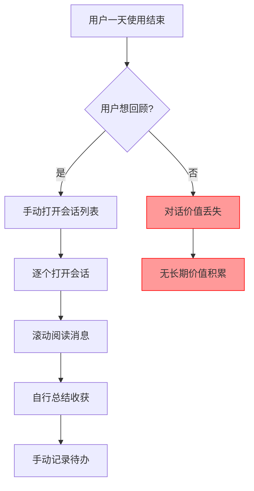
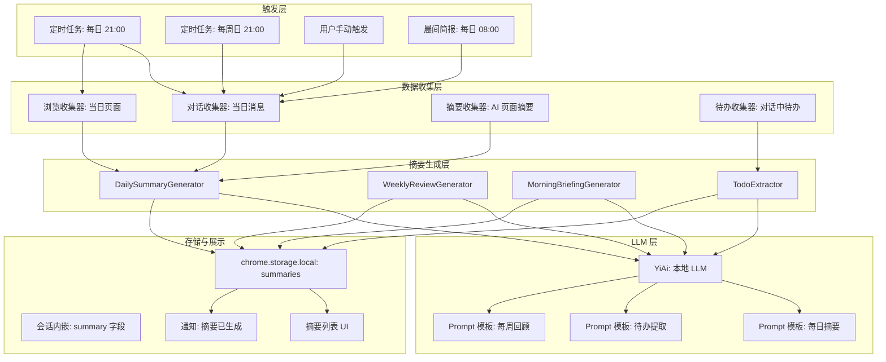
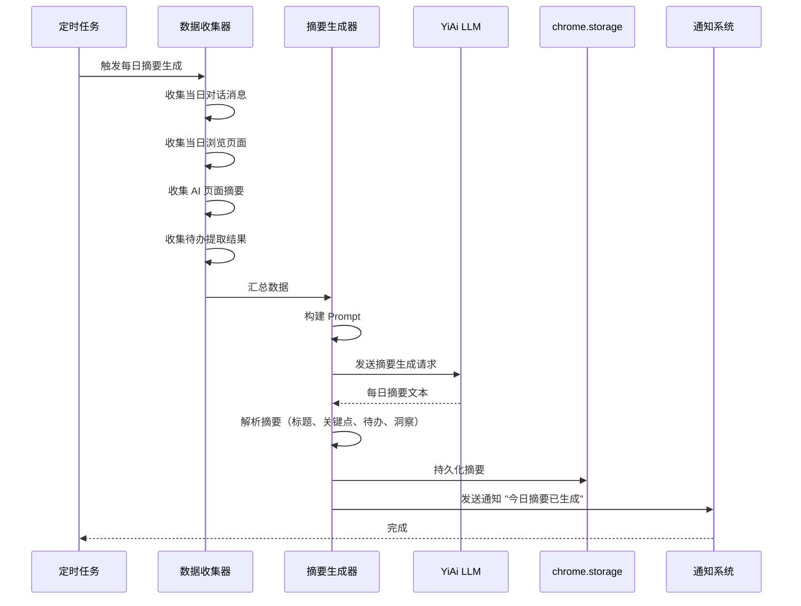

# YP-09-134: 每日摘要与回顾 — AI 生成的每日活动摘要、对话总结、待办提取、每周回顾

> 需求编号：YP-09-134 · 优先级：P2 · 人天：0.3d · 状态：需求已编写
> 依赖：YP-09-123（AI 页面摘要）、YP-09-72（长会话性能优化）、YP-09-95（消息通知系统）

## 背景

### 问题陈述

YiPet 作为用户的 AI 伴侣，伴随用户浏览网页、进行对话、获取信息。但用户每天结束时，往往难以回顾当天的对话收获、浏览洞察和待办事项：

1. **对话价值流失**：用户与 AI 的对话包含大量有价值的信息和见解，但对话结束后这些内容被"遗忘"在会话列表中
2. **待办事项遗漏**：对话中用户提到的"帮我记住..."、"明天提醒我..."等意图无法被系统化追踪
3. **浏览回顾缺失**：用户一天访问了多个页面，但无法获得统一的浏览摘要和洞察
4. **无定期回顾**：缺乏每日/每周的自动回顾机制，用户无法持续从对话中获益
5. **晨间启动慢**：用户每天开始使用时，需要重新建立上下文，回顾前一天的对话

**核心矛盾**：YiPet 作为持续陪伴的 AI 伴侣，积累了大量的对话和交互数据，但这些数据缺乏自动化的总结和回顾机制，导致用户无法从中获得长期价值。

### 影响范围

| # | 影响 | 严重程度 | 典型场景 |
|---|------|----------|----------|
| 1 | 对话价值未被充分利用 | 高 | 有价值的对话内容在会话结束后被遗忘 |
| 2 | 待办事项遗漏 | 高 | 用户在对话中提到的待办未被系统追踪 |
| 3 | 无定期回顾机制 | 中 | 用户无法回顾一天/一周的对话收获 |
| 4 | 晨间启动效率低 | 中 | 用户每天开始使用时需要重新建立上下文 |
| 5 | 无法量化对话价值 | 中 | 用户不知道 AI 对话带来了多少实际帮助 |

### 挑战

| 挑战 | 说明 |
|------|------|
| 摘要质量 | AI 生成的摘要需要准确、简洁、有价值，而非泛泛而谈 |
| 隐私保护 | 摘要生成需要读取对话内容，须在本地处理，不发送到远程 |
| 待办提取准确性 | 从对话中提取待办事项需要一定的 NLP 能力 |
| 通知时机 | 晨间简报和每日摘要的通知时机需要智能判断 |
| 性能 | 摘要生成涉及 LLM 调用，需要在用户不活跃时执行 |

---

## 一、现状分析

### 1.1 当前对话回顾机制

```
YiPet 对话回顾现状:
├── 会话列表
│   ├── 按时间排序的会话入口
│   ├── 会话标题（手动或自动生成）
│   └── 最后活动时间
├── 会话内浏览
│   ├── 滚动查看历史消息
│   └── 无摘要或关键点提取
└── 无自动化回顾
    ├── 无每日摘要
    ├── 无每周回顾
    ├── 无待办提取
    ├── 无晨间简报
    └── 无浏览洞察

缺失:
├── 每日 AI 摘要生成               # ❌ 不存在
├── 对话总结                       # ❌ 不存在
├── 待办事项提取                   # ❌ 不存在
├── 浏览洞察汇总                   # ❌ 不存在
├── 晨间简报通知                   # ❌ 不存在
├── 每周回顾报告                   # ❌ 不存在
└── 摘要持久化与搜索               # ❌ 不存在
```

### 1.2 摘要生成数据源

| 数据源 | 可用性 | 数据量 | 摘要价值 |
|--------|--------|--------|----------|
| 当日对话消息 | ✅ | 5-50 条/天 | 高 |
| 当日浏览页面（URL + 标题） | ✅ | 10-200 个/天 | 中 |
| AI 页面摘要结果 | ⚠️（依赖 YP-09-123） | 0-20 个/天 | 高 |
| 用户手动标记的对话 | ❌ | 0 | 高 |
| 会话标签 | ⚠️（依赖 YP-09-115） | 0-10 个/天 | 中 |

### 1.3 改造前回顾流程



### 1.4 根因矩阵

| 症状 | 根因 | 触发条件 | 频率 |
|------|------|----------|------|
| 对话价值未利用 | 无自动摘要机制 | 每天对话结束 | 每天 |
| 待办事项遗漏 | 无待办提取 | 对话中提及待办 | 偶发 |
| 无定期回顾 | 无定时触发机制 | 每天/每周 | 每天 |
| 晨间无上下文 | 无晨间简报 | 每天开始使用时 | 每天 |
| 无法量化价值 | 无统计数据 | 每周回顾 | 每周 |

---

## 二、设计决策

### 决策 1：摘要生成时机 — 定时触发 vs 事件触发 vs 用户手动触发

| 选项 | 及时性 | 性能影响 | 用户控制 |
|------|--------|----------|----------|
| 定时触发（每日 21:00） | 中 | 低 | 低 |
| 事件触发（用户停止使用 30min 后） | 中 | 低 | 低 |
| 用户手动触发 | 高 | 高 | 高 |
| 混合（定时 + 手动） | 高 | 中 | 高 |

**选择：混合触发。** 默认每日 21:00 自动生成每日摘要（可在设置中调整时间），用户也可随时在 Popup 中手动触发"生成今日摘要"。每周回顾在每周日 21:00 自动生成。

### 决策 2：摘要生成方式 — 本地 LLM vs 远程 LLM vs 模板化

| 选项 | 摘要质量 | 隐私安全 | 响应速度 |
|------|----------|----------|----------|
| 本地 LLM（通过 YiAi） | 高 | 高 | 中 |
| 远程 LLM（直接调用） | 高 | 低 | 中 |
| 模板化（规则引擎） | 低 | 高 | 高 |

**选择：本地 LLM（通过 YiAi）。** 摘要生成需要理解对话内容，模板化无法满足质量要求。通过 YiAi 的本地 LLM 生成摘要，数据不离开本地环境，保护用户隐私。

### 决策 3：待办提取方式 — LLM 提取 vs 规则匹配 vs 用户手动标记

| 选项 | 准确率 | 覆盖率 | 实现复杂度 |
|------|--------|--------|-----------|
| LLM 提取 | 高 | 高 | 中 |
| 规则匹配（关键词：帮我记住、提醒我） | 中 | 低 | 低 |
| 用户手动标记 | 高 | 低 | 低 |
| LLM + 规则双重提取 | 高 | 高 | 中 |

**选择：LLM + 规则双重提取。** 规则匹配作为快速筛选（匹配"帮我记住"、"提醒我"、"TODO"等关键词），LLM 作为深度提取（从对话上下文中识别隐含的待办意图）。

### 决策 4：摘要存储 — 独立存储 vs 会话内嵌 vs 两者

| 选项 | 查询效率 | 数据一致性 | 存储空间 |
|------|----------|-----------|----------|
| 独立存储（summaries key） | 高 | 需维护关联 | 小 |
| 会话内嵌（session.summary） | 中 | 高 | 中 |
| 两者（独立存储 + 会话引用） | 高 | 高 | 中 |

**选择：两者。** 独立存储用于快速查询和列表展示（每日摘要列表），会话内嵌用于关联溯源（从摘要跳转到原始会话）。

### 设计决策记录

| 决策 | 选项 A | 选项 B | 选项 C | 选择 | 理由 |
|------|--------|--------|--------|------|------|
| 生成时机 | 定时 | 事件 | 混合 | **混合** | 自动化 + 用户控制 |
| 生成方式 | 本地 LLM | 远程 LLM | 模板化 | **本地 LLM** | 隐私 + 质量 |
| 待办提取 | LLM | 规则 | 双重 | **双重** | 覆盖率 + 准确率 |
| 摘要存储 | 独立 | 内嵌 | 两者 | **两者** | 查询 + 溯源 |

---

## 三、目标架构

### 3.1 每日摘要系统架构



### 3.2 每日摘要生成流程



### 3.3 性能指标

| 指标 | 目标值 | 说明 |
|------|--------|------|
| 每日摘要生成 | < 30s | 数据收集 + LLM 调用 |
| 晨间简报生成 | < 10s | 仅当日待办 + 关键提醒 |
| 每周回顾生成 | < 60s | 7 天数据汇总 |
| 待办提取 | < 5s | 单次对话扫描 |
| 摘要列表加载 | < 100ms | 从 storage 读取摘要列表 |

---

## 四、具体改动

### 4.1 摘要数据模型

```typescript
// src/summary/types.ts (新增)

export interface DailySummary {
  id: string;
  date: string;                     // YYYY-MM-DD
  generatedAt: string;              // ISO 8601
  title: string;                    // 摘要标题，如"2026-09-09 技术探索日"
  overview: string;                 // 总体概述，2-3 句话
  conversationSummary: {
    totalSessions: number;
    totalMessages: number;
    keyTopics: string[];           // 对话关键主题
    highlights: string[];          // 对话亮点/收获
  };
  browsingSummary: {
    totalPages: number;
    keyPages: { title: string; url: string; insight: string }[];
    pageInsights: string[];        // 从页面摘要中提取的洞察
  };
  todos: ExtractedTodo[];
  insights: string[];              // 当日关键洞察
  mood: 'positive' | 'neutral' | 'negative' | 'unknown';
}

export interface ExtractedTodo {
  id: string;
  content: string;
  source: string;                   // 来源会话 ID
  priority: 'high' | 'medium' | 'low';
  status: 'pending' | 'done';
  extractedAt: string;
  dueDate?: string;
}

export interface WeeklyReview {
  id: string;
  weekStart: string;
  weekEnd: string;
  generatedAt: string;
  title: string;
  overview: string;
  dailySummaries: string[];        // 每日摘要 ID 列表
  weeklyStats: {
    totalSessions: number;
    totalMessages: number;
    totalPages: number;
    todosCompleted: number;
    todosPending: number;
  };
  keyAchievements: string[];
  keyLearnings: string[];
  nextWeekFocus: string[];
}

export interface MorningBriefing {
  id: string;
  date: string;
  generatedAt: string;
  pendingTodos: ExtractedTodo[];
  unreadSummaries: string[];       // 未读摘要 ID 列表
  weather: string;                 // 当天天气（可选）
  motivation: string;              // 每日激励语
}
```

### 4.2 摘要生成器

```typescript
// src/summary/services/daily-summary-generator.ts (新增)

class DailySummaryGenerator {
  private collector: DataCollector;
  private todoExtractor: TodoExtractor;
  private llmClient: YiAiClient;

  async generate(date: string): Promise<DailySummary> {
    // 1. 收集数据
    const conversations = await this.collector.collectConversations(date);
    const pages = await this.collector.collectPages(date);
    const pageSummaries = await this.collector.collectPageSummaries(date);

    // 2. 提取待办
    const todos = await this.todoExtractor.extractFromConversations(conversations);

    // 3. 构建 Prompt
    const prompt = this.buildDailySummaryPrompt({
      conversations,
      pages,
      pageSummaries,
      todos,
    });

    // 4. 调用 LLM 生成摘要
    const response = await this.llmClient.chat({
      messages: [{ role: 'user', content: prompt }],
      temperature: 0.3,
    });

    // 5. 解析 LLM 响应
    const summary = this.parseSummaryResponse(response, date, todos);

    // 6. 持久化
    await this.persistSummary(summary);

    return summary;
  }

  private buildDailySummaryPrompt(data: SummaryInput): string {
    return [
      '# 每日摘要生成',
      '',
      '## 今日对话',
      ...data.conversations.map(c => `- 会话: ${c.title}\n  消息数: ${c.messageCount}\n  内容摘要: ${c.contentSummary}`),
      '',
      '## 今日浏览',
      `- 总页面数: ${data.pages.length}`,
      ...data.pages.map(p => `- ${p.title}: ${p.url}`),
      '',
      '## 已提取待办',
      ...data.todos.map(t => `- [${t.priority}] ${t.content}`),
      '',
      '请生成今日摘要，包含：',
      '1. 总体概述（2-3 句话）',
      '2. 对话关键主题和亮点',
      '3. 浏览洞察',
      '4. 关键收获和洞察',
      '5. 情绪判断 (positive/neutral/negative)',
      '',
      '请以 JSON 格式返回。',
    ].join('\n');
  }
}
```

### 4.3 文件变更清单

| 文件 | 操作 | 说明 |
|------|------|------|
| `src/summary/types.ts` | 新增 | 摘要数据模型定义 |
| `src/summary/services/data-collector.ts` | 新增 | 数据收集器 |
| `src/summary/services/daily-summary-generator.ts` | 新增 | 每日摘要生成器 |
| `src/summary/services/weekly-review-generator.ts` | 新增 | 每周回顾生成器 |
| `src/summary/services/morning-briefing-generator.ts` | 新增 | 晨间简报生成器 |
| `src/summary/services/todo-extractor.ts` | 新增 | 待办提取器 |
| `src/summary/services/scheduler.ts` | 新增 | 定时任务调度 |
| `src/summary/components/summary-list.vue` | 新增 | 摘要列表 UI |
| `src/summary/components/summary-detail.vue` | 新增 | 摘要详情 UI |
| `src/summary/components/weekly-review.vue` | 新增 | 每周回顾 UI |
| `src/summary/components/morning-briefing.vue` | 新增 | 晨间简报 UI |
| `src/summary/stores/summary.ts` | 新增 | 摘要状态管理 |
| `src/sw/summary-scheduler.ts` | 新增 | Service Worker 定时任务 |
| `src/popup/App.vue` | 修改 | 添加摘要入口 |
| `tests/unit/summary/generator.test.ts` | 新增 | 摘要生成测试 |
| `tests/unit/summary/todo-extractor.test.ts` | 新增 | 待办提取测试 |

---

## 五、实施步骤

| 步骤 | 操作 | 路径 | 验证 | 人天 |
|------|------|------|------|------|
| 1 | 定义摘要数据模型 | `src/summary/types.ts` | 类型定义完整 | 0.03 |
| 2 | 实现数据收集器 | `src/summary/services/data-collector.ts` | 收集对话/页面/页面摘要 | 0.05 |
| 3 | 实现每日摘要生成器 | `src/summary/services/daily-summary-generator.ts` | Prompt 构建 + LLM 调用 + 解析 | 0.08 |
| 4 | 实现待办提取器 | `src/summary/services/todo-extractor.ts` | 关键词 + LLM 双重提取 | 0.05 |
| 5 | 实现每周回顾生成器 | `src/summary/services/weekly-review-generator.ts` | 7 天数据汇总 | 0.03 |
| 6 | 实现晨间简报生成器 | `src/summary/services/morning-briefing-generator.ts` | 待办 + 关键提醒 | 0.03 |
| 7 | 实现定时任务调度 | `src/summary/services/scheduler.ts` + `src/sw/` | 定时触发摘要生成 | 0.03 |

**总人天：0.3d**

---

## 六、测试规格

### 场景 1：每日摘要生成

**GIVEN** 用户当天有 3 个会话（共 20 条消息）和 15 个浏览页面
**WHEN** 定时任务触发每日摘要生成（或用户手动触发）
**THEN** 应生成包含总体概述、对话主题、浏览洞察的每日摘要
**AND** 摘要应持久化到 chrome.storage.local
**AND** 用户应收到通知"今日摘要已生成"

### 场景 2：待办事项提取

**GIVEN** 对话中包含"帮我记住明天下午 3 点开会"和"TODO: 完成 Q3 报告"
**WHEN** 待办提取器扫描当日对话
**THEN** 应提取出 2 条待办事项
**AND** 待办内容应包含原始文本和时间信息
**AND** 待办应关联到来源会话

### 场景 3：晨间简报

**GIVEN** 前一天有未完成的待办事项和未读摘要
**WHEN** 用户首次打开浏览器（或定时 08:00 触发）
**THEN** 应展示晨间简报通知
**AND** 简报应包含待办清单和昨日摘要概要
**AND** 用户可点击进入完整摘要页面

### 场景 4：每周回顾

**GIVEN** 过去 7 天有 7 份每日摘要
**WHEN** 周日 21:00 定时任务触发每周回顾生成
**THEN** 应生成包含每周统计、关键成就、学习收获的周报
**AND** 周报应引用 7 天的每日摘要

### 场景 5：摘要列表查看

**GIVEN** 用户已生成 5 份每日摘要
**WHEN** 用户打开摘要列表
**THEN** 应按时间倒序展示所有摘要
**AND** 每份摘要显示标题、日期、对话数、待办数
**AND** 点击可查看完整摘要详情

### 场景 6：摘要生成失败降级

**GIVEN** YiAi 后端不可用（LLM 服务宕机）
**WHEN** 定时任务触发摘要生成
**THEN** 应降级为模板化摘要（仅统计信息，无 AI 分析）
**AND** 应记录生成失败日志
**AND** 下次 YiAi 可用时自动重试

---

## 七、风险与缓解

| 风险 | 概率 | 影响 | 缓解措施 |
|------|------|------|----------|
| LLM 摘要质量不稳定 | 中 | 中 | 提供模板化降级摘要，用户可手动编辑摘要 |
| 摘要生成耗时长影响浏览器性能 | 中 | 中 | 在 Service Worker 中执行，不阻塞 UI |
| 隐私数据泄露（发送到远程 LLM） | 低 | 高 | 强制使用本地 YiAi LLM，代码审查确保无远程调用 |
| 定时任务在浏览器关闭时无法触发 | 高 | 中 | 使用 chrome.alarms API（即使浏览器关闭也能触发 SW） |
| 待办提取准确率低 | 中 | 低 | 用户可手动添加/编辑/删除待办 |

---

## 八、回滚策略

| 场景 | 回滚操作 | 影响 |
|------|----------|------|
| 摘要生成导致性能问题 | 禁用定时任务，仅保留手动触发 | 失去自动摘要 |
| LLM 摘要质量不达标 | 降级为模板化统计摘要 | 摘要质量下降 |
| 待办提取误报过多 | 禁用 LLM 提取，仅保留关键词规则 | 待办覆盖率下降 |
| 通知过于频繁 | 禁用晨间简报通知，仅保留每日摘要 | 失去晨间提醒 |

---

## 九、设计决策记录

### D-01：摘要生成时间

- **问题**：每日摘要的默认生成时间
- **选项**：18:00、21:00、23:00、用户自定义
- **选择**：21:00（默认，用户可自定义）
- **理由**：21:00 是大多数用户结束一天工作/学习的时间，对话数据已足够丰富

### D-02：摘要 Prompt 设计

- **问题**：摘要 Prompt 应包含多少上下文
- **选项**：仅统计信息、统计 + 对话摘要、统计 + 对话摘要 + 完整消息
- **选择**：统计 + 对话摘要（每条会话传 200 字摘要）
- **理由**：完整消息可能过长（超过 LLM 上下文窗口），200 字摘要足够传达关键信息

### D-03：晨间简报触发条件

- **问题**：晨间简报何时触发
- **选项**：首次打开浏览器、固定时间 08:00、两者
- **选择**：两者（首次打开浏览器 OR 08:00，取较晚者）
- **理由**：如果用户在 08:00 前打开浏览器，等到 08:00 才展示；如果用户在 08:00 后打开，立即展示

### D-04：每周回顾的周起始日

- **问题**：每周回顾以哪一天为起始日
- **选项**：周一、周日
- **选择**：周一
- **理由**：符合大多数人的工作/学习节奏，周一作为新的一周开始

---

## 十、可观测性

### 指标

| 指标 | 类型 | 说明 |
|------|------|------|
| `yipet.summary.daily_generated` | Counter | 每日摘要生成次数 |
| `yipet.summary.weekly_generated` | Counter | 每周回顾生成次数 |
| `yipet.summary.briefing_generated` | Counter | 晨间简报生成次数 |
| `yipet.summary.todo_extracted` | Counter | 待办提取总数 |
| `yipet.summary.generate_failed` | Counter | 摘要生成失败次数 |
| `yipet.summary.generate_duration` | Histogram | 摘要生成耗时 |

### 告警

| 告警 | 条件 | 级别 |
|------|------|------|
| 连续 3 天摘要生成失败 | 3 天无摘要 | WARNING |
| 摘要生成耗时超过 60s | 单次 > 60s | WARNING |
| 待办提取数为 0 但有对话 | 连续 3 天 | INFO |

---

## 十一、代码审查检查清单

- [ ] 每日摘要数据模型定义完整（DailySummary/ExtractedTodo/WeeklyReview/MorningBriefing）
- [ ] 数据收集器覆盖对话、浏览页面、页面摘要
- [ ] 每日摘要生成器通过 YiAi 本地 LLM 生成
- [ ] Prompt 模板包含总体概述、对话主题、浏览洞察、待办、情绪判断
- [ ] 待办提取器使用关键词规则 + LLM 双重提取
- [ ] 每周回顾生成器汇总 7 天每日摘要
- [ ] 晨间简报生成器包含待办清单和关键提醒
- [ ] 定时任务使用 chrome.alarms API（浏览器关闭时仍可触发 SW）
- [ ] 摘要持久化到 chrome.storage.local，同时关联到会话
- [ ] 摘要生成失败时降级为模板化统计摘要
- [ ] 摘要列表支持按时间倒序展示
- [ ] 单元测试覆盖数据收集、摘要生成、待办提取

---

## 回归问题预测

| # | 预测问题 | 原因 | 验证方法 |
|---|---------|------|---------|
| 1 | chrome.alarms 定时触发摘要生成时，Service Worker 被 Chrome 回收导致生成中断 | SW 空闲 30s 后被 Chrome 自动回收，摘要生成可能超过 30s | 等待 SW 空闲 30s 后触发的定时任务，验证摘要生成是否完整 |
| 2 | 摘要生成时读取的对话消息包含 Markdown 代码块，Prompt 构建时未正确转义导致 LLM 解析失败 | 对话中的代码块使用反引号，与 Prompt 模板中的反引号冲突 | 在对话中包含多语言代码块（Python/JavaScript/JSON），验证 Prompt 正常构建 |
| 3 | 待办提取器从多条消息中提取到重复的待办事项 | 用户在多个会话中提及相同待办，或同一会话中多次提及，LLM 未做去重 | 在 3 个会话中提及相同待办，验证提取的待办列表已去重 |
| 4 | 每日摘要生成时，Summary 文本过长导致 chrome.storage.local.set 的单个 value 超过配额 | chrome.storage.local 单个 value 限制为 8MB，但包含 Markdown 的摘要文本可能接近上限 | 生成包含大量对话的摘要，验证 storage 写入成功 |
| 5 | 每周回顾生成时，7 天的数据量过大导致 Prompt 超过 LLM 上下文窗口 | 每天 20 条消息 x 7 天 = 140 条消息的摘要，加上浏览数据，Prompt 可能超过 4096 tokens | 模拟 7 天高活跃度数据，验证 Prompt 在上下文窗口内 |
| 6 | 晨间简报在用户首次打开浏览器时触发，但此时 YiAi 后端可能尚未启动，生成失败 | 用户打开浏览器时本地 YiAi 服务可能未运行，LLM 调用失败 | 在 YiAi 未启动的情况下触发晨间简报，验证降级为模板化简报 |

---

## 性能分析

### 摘要生成关键操作耗时

| 操作 | 耗时 | 说明 |
|------|------|------|
| 数据收集（对话） | < 50ms | 从 chrome.storage.local 读取当日会话 |
| 数据收集（浏览） | < 50ms | 从 chrome.storage.local 读取当日页面 |
| 待办提取（关键词） | < 10ms | 正则匹配关键词 |
| 待办提取（LLM） | < 5s | 单次 LLM 调用 |
| 每日摘要生成（LLM） | < 20s | Prompt 构建 + LLM 调用 + 响应解析 |
| 每周回顾生成（LLM） | < 30s | 7 天数据汇总的 LLM 调用 |
| 晨间简报生成 | < 5s | 无需 LLM 调用，仅数据收集 |
| 摘要持久化 | < 10ms | chrome.storage.local.set |
| 通知发送 | < 5ms | chrome.notifications.create |

### 数据量预估

| 模块 | 数据项 | 大小 |
|------|--------|------|
| 每日摘要 | 标题 + 概述 + 对话总结 + 浏览洞察 + 待办 + 洞察 | ~5KB |
| 每周回顾 | 7 天摘要引用 + 统计 + 成就 + 学习 | ~10KB |
| 晨间简报 | 待办清单 + 未读摘要 + 激励语 | ~2KB |
| 待办列表 | 10-20 条待办 | ~3KB |

### 对宿主页面的影响

| 场景 | 页面影响 | 说明 |
|------|----------|------|
| 定时摘要生成 | 零影响 | 在 Service Worker 中执行 |
| 手动摘要生成 | 零影响 | 在 Popup 或 SW 中执行 |
| 晨间简报展示 | 零影响 | 系统通知 + Popup 展示 |

---

## 相关文档

- [AI 页面摘要](../123-需求-AI页面摘要.md) — 页面摘要是每日摘要的数据源之一
- [长会话性能优化](../72-需求-长会话性能优化.md) — 对话数据的存储和读取优化
- [消息通知系统](../95-需求-消息通知系统.md) — 摘要生成完成后的通知
- [会话标签与分类管理](../115-需求-会话标签与分类管理.md) — 标签信息辅助摘要分类

*PRD 来源: `projects/yipet/requirements/2026-09/134-需求-每日摘要与回顾.md`*