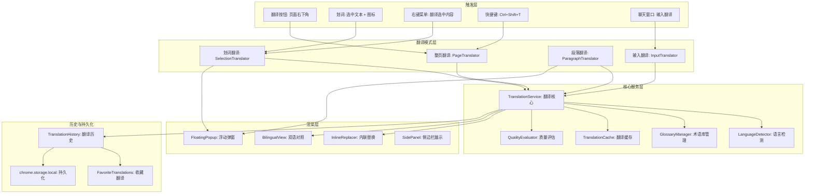
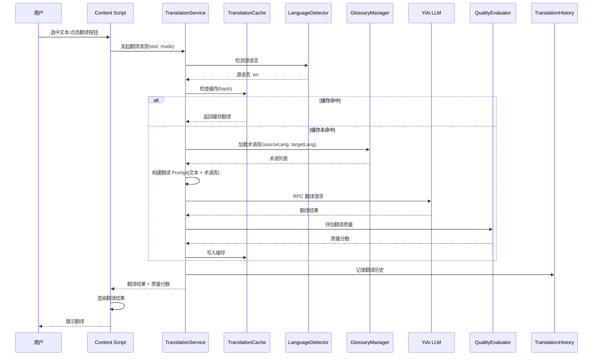

# YP-09-135: 内容翻译助手 — 一键页面翻译、划词翻译、双语对照、术语库、翻译历史、质量评估

> 需求编号：YP-09-135 · 优先级：P2 · 人天：0.3d · 状态：需求已编写
> 依赖：YP-09-42（上下文感知菜单）、YP-09-99（右键菜单集成）、YP-09-97（键盘快捷键系统）

## 背景

### 问题陈述

YiPet 用户在浏览网页时，频繁遇到外文内容需要翻译。当前翻译流程完全依赖外部工具（如 Google 翻译、DeepL 网页版），割裂的体验导致：

1. **翻译操作割裂**：用户需要复制外文文本 → 打开翻译工具 → 粘贴 → 等待翻译 → 对照原文，多步操作打断阅读流
2. **整页翻译缺失**：面对全外文页面，用户只能逐段复制翻译，无法一键获取整页翻译
3. **划词翻译缺失**：阅读外文内容时，遇到不认识的单词或短语，无法快速查看翻译
4. **双语对照需求**：语言学习者需要原文和翻译同时展示，而非单一翻译结果
5. **术语一致性差**：技术文档中的专业术语每次翻译结果可能不一致，影响理解
6. **翻译质量不透明**：用户无法判断翻译质量，依赖 AI 翻译时缺乏质量反馈

**核心矛盾**：浏览器扩展天然适合提供翻译体验（可直接访问页面 DOM、注入翻译结果），但 YiPet 当前缺乏翻译能力，用户被迫在多个工具间切换。通过 YiAi 的 LLM 翻译服务，可以提供比传统机器翻译更准确、更上下文感知的翻译。

### 影响范围

| # | 影响 | 严重程度 | 典型场景 |
|---|------|----------|----------|
| 1 | 外文页面阅读体验差，需切换翻译工具 | 高 | 用户阅读英文技术文档，需要逐段复制到翻译工具 |
| 2 | 划词翻译缺失，阅读效率低 | 高 | 用户遇到生词，需要手动查词典或切换翻译工具 |
| 3 | 整页翻译无内置支持 | 中 | 用户访问全英文页面，无法一键翻译 |
| 4 | 专业技术术语翻译不一致 | 中 | 技术文档中同一术语在不同位置翻译不同 |
| 5 | 翻译质量无法评估 | 中 | 用户无法判断 AI 翻译的准确性 |
| 6 | 翻译结果无法复用 | 低 | 同一段落多次翻译，浪费 LLM token |

### 挑战

| 挑战 | 说明 |
|------|------|
| 内联翻译 DOM 操作 | 替换页面文本为翻译文本时，需保护 DOM 结构和事件监听器，避免破坏页面功能 |
| 翻译质量评估 | 缺乏客观的质量评估标准，仅能依赖启发式指标（长度比、语言检测置信度）|
| 术语库管理 | 用户自定义术语需在翻译前后替换，需处理术语的单复数、时态变形 |
| 双语对照布局 | 左侧原文 + 右侧翻译的布局需要适配不同页面宽度和响应式设计 |
| 翻译缓存 | 同一页面多次翻译时，需缓存结果避免重复调用 LLM，同时检测内容变化 |
| 语言自动检测 | 页面语言检测需要同时考虑 HTML lang 属性、meta 标签和内容采样分析 |

---

## 一、现状分析

### 1.1 当前翻译能力

```
现有翻译功能（零）:
├── 页面翻译                       # ❌ 不存在
├── 划词翻译                       # ❌ 不存在
├── 双语对照                       # ❌ 不存在
├── 翻译历史                       # ❌ 不存在
├── 术语库                         # ❌ 不存在
├── 翻译质量评估                   # ❌ 不存在
└── 翻译缓存                       # ❌ 不存在

缺失:
├── TranslationService: 翻译核心服务    # ❌ 不存在
├── InlineTranslator: 内联翻译引擎      # ❌ 不存在
├── SelectionTranslator: 划词翻译       # ❌ 不存在
├── BilingualView: 双语对照视图         # ❌ 不存在
├── GlossaryManager: 术语库管理         # ❌ 不存在
├── TranslationHistory: 翻译历史        # ❌ 不存在
├── QualityIndicator: 质量评估指示器    # ❌ 不存在
└── LanguageDetector: 语言检测          # ❌ 不存在
```

### 1.2 翻译流程现状

```
当前流程（无内置翻译）:
用户浏览外文页面 → 发现需要翻译 → 选中文本 → Ctrl+C → 打开新标签页 → 打开翻译工具 → Ctrl+V → 等待翻译 → 对照原文 → 回到原页面

目标流程:
用户浏览外文页面 → 点击翻译按钮（或快捷键）→ 翻译结果内联显示在页面中 → 对照阅读
```

### 1.3 用户翻译场景矩阵

| 场景 | 触发方式 | 翻译范围 | 展示方式 | 频率 |
|------|----------|----------|----------|------|
| 整页翻译 | 点击翻译按钮/快捷键 | 页面全部正文 | 内联替换或双语对照 | 高 |
| 划词翻译 | 选中文本后弹出 | 选中的文本片段 | 浮动弹窗 | 高 |
| 段落翻译 | 右键菜单 | 鼠标所在段落 | 段落下方内联 | 中 |
| 输入翻译 | 聊天窗口内翻译 | 用户输入的文本 | 聊天窗口内展示 | 低 |
| 批量翻译 | 选中多个段落 | 多段文本 | 侧边栏批量展示 | 低 |

### 1.4 根因矩阵

| 症状 | 根因 | 触发条件 | 频率 |
|------|------|----------|------|
| 翻译需切换工具 | 无内置翻译功能 | 用户浏览外文内容时 | 高 |
| 同一术语翻译不一致 | 无术语库管理 | 技术文档翻译 | 中 |
| 翻译结果无法追溯 | 无翻译历史 | 多次翻译同一内容 | 中 |
| 翻译质量未知 | 无质量评估 | 使用 AI 翻译时 | 中 |
| 页面布局被破坏 | 内联翻译时 DOM 操作不当 | 复杂页面翻译 | 低 |

---

## 二、设计决策

### 决策 1：翻译引擎选择 — YiAi LLM 翻译 vs 浏览器内置翻译 API vs 第三方 API

| 选项 | 翻译质量 | 隐私安全 | 离线支持 | 术语库支持 |
|------|----------|----------|----------|-----------|
| YiAi LLM 翻译 | 高（上下文感知） | 高（本地处理） | 需要 YiAi 运行 | 高（Prompt 注入） |
| 浏览器内置翻译 API | 中（Google 翻译） | 中（发送到 Google） | 需要网络 | 无 |
| 第三方翻译 API (DeepL) | 高 | 低（数据发送到第三方） | 需要网络 | 有限 |

**选择：YiAi LLM 翻译。** YiAi 的本地 LLM 提供上下文感知翻译，数据不离开本地环境，支持通过 Prompt 注入术语库。虽然浏览器内置翻译 API 更轻量，但无法控制翻译质量，也无法集成术语库。

### 决策 2：页面翻译方式 — 内联替换 vs 双语对照 vs 并存

| 选项 | 阅读体验 | DOM 破坏风险 | 实现复杂度 | 语言学习价值 |
|------|----------|-------------|-----------|-------------|
| 内联替换（替换页面文本） | 高（沉浸式） | 中 | 中 | 低 |
| 双语对照（原文 + 翻译） | 高（可对照） | 低 | 高 | 高 |
| 覆盖层（翻译层覆盖原文） | 中 | 低 | 中 | 低 |
| 并存（默认双语对照，可切换内联） | 高 | 中 | 中 | 高 |

**选择：并存（默认双语对照，可切换内联替换）。** 语言学习者和技术用户通常需要双语对照，而快速浏览用户可能只需要内联翻译。提供两种模式并在设置中切换，默认双语对照以降低 DOM 破坏风险。

### 决策 3：划词翻译触发方式 — 自动弹出 vs 手动触发 vs 混合

| 选项 | 便捷性 | 干扰性 | 实现复杂度 |
|------|--------|--------|-----------|
| 自动弹出（选中文本后自动显示翻译） | 高 | 高（频繁弹窗） | 低 |
| 手动触发（选中后按快捷键或点击按钮） | 中 | 低 | 低 |
| 混合（选中后显示小图标，点击展开翻译） | 高 | 低 | 中 |

**选择：混合（选中后显示小图标，点击或按快捷键展开翻译）。** 纯自动弹出会频繁干扰正常阅读和复制操作。选中文本后在选中区域附近显示一个半透明翻译图标，用户点击图标或按快捷键（默认 Ctrl+Shift+T）时展开翻译弹窗。

### 决策 4：语言检测策略 — HTML lang 属性 vs 内容采样 vs 混合

| 选项 | 准确率 | 响应速度 | 多语言页面处理 |
|------|--------|----------|---------------|
| HTML lang 属性 | 中（依赖页面正确设置） | 即时 | 仅识别主语言 |
| 内容采样（前 1000 字符采样分析） | 高 | 慢（需 LLM 检测） | 可识别多语言 |
| 混合（lang 属性优先，内容采样为 fallback） | 高 | 快 | 以主语言为准 |

**选择：混合（lang 属性优先，内容采样为 fallback）。** 大多数页面正确设置了 lang 属性，可直接使用。当 lang 属性缺失或不可靠（如 lang="en" 但内容为其他语言）时，使用内容采样检测。语言检测结果缓存到 sessionStorage，避免重复检测。

### 决策 5：翻译缓存策略 — 内容哈希 vs URL 缓存 vs 不缓存

| 选项 | 缓存命中率 | 内容变化检测 | 存储开销 |
|------|-----------|-------------|----------|
| 内容哈希（文本内容 → 哈希 → 缓存键） | 高 | 精确 | 中 |
| URL 缓存（URL + 目标语言 → 缓存键） | 中 | 不检测 | 低 |
| 混合（URL + 内容哈希双重键） | 高 | 精确 | 中 |
| 不缓存 | 0% | 不需要 | 零 |

**选择：混合（URL + 内容哈希双重键）。** URL 缓存用于快速命中（同一页面同一语言），内容哈希用于精确匹配（页面内容未变化时复用翻译）。缓存有效期 24 小时，超时后自动清除。

### 设计决策记录

| 决策 | 选项 A | 选项 B | 选项 C | 选择 | 理由 |
|------|--------|--------|--------|------|------|
| 翻译引擎 | YiAi LLM | 浏览器 API | 第三方 API | **YiAi LLM** | 隐私 + 质量 + 术语库 |
| 页面翻译方式 | 内联替换 | 双语对照 | 并存 | **并存** | 覆盖不同场景 |
| 划词触发 | 自动弹出 | 手动触发 | 混合 | **混合** | 便捷 + 不干扰 |
| 语言检测 | lang 属性 | 内容采样 | 混合 | **混合** | 速度 + 准确率 |
| 缓存策略 | 内容哈希 | URL 缓存 | 混合 | **混合** | 命中率 + 精确性 |

---

## 三、目标架构

### 3.1 翻译系统架构



### 3.2 翻译请求流程



### 3.3 双语对照布局

```
┌──────────────────────────────────────────────────────────────┐
│  原文 (English)                    │  翻译 (中文)              │
│  ─────────────────────────────────┼───────────────────────── │
│  React 18 introduces several      │  React 18 引入了几个关键   │
│  key features that improve the     │  功能，改善了开发者体验和  │
│  developer experience and          │  应用性能。               │
│  application performance.          │                           │
│                                    │                           │
│  The most important change is      │  最重要的变化是并发渲染，  │
│  Concurrent Rendering, which       │  它允许 React 同时准备多个 │
│  allows React to prepare multiple  │  版本的 UI，让应用响应更   │
│  versions of the UI, making apps   │  流畅。                   │
│  more responsive.                  │                           │
│                                    │                           │
│  ─────────────────────────────────┼───────────────────────── │
│  Domain: react, concurrent-mode    │  术语: 并发渲染            │
│  Quality: ★★★★☆ (4.2/5)           │  [内联模式] [刷新翻译]     │
└──────────────────────────────────────────────────────────────┘
```

### 3.4 划词翻译弹窗

```
选中文本: "Concurrent Rendering is a fundamental shift in how React works."

┌──────────────────────────────────┐
│  📝 翻译 · 英 → 中              │
│  ─────────────────────────────── │
│  并发渲染是 React 工作方式的根本  │
│  性转变。                        │
│  ─────────────────────────────── │
│  质量: ★★★★☆   耗时: 0.8s       │
│                                   │
│  [📋 复制] [⭐ 收藏] [🔄 刷新]   │
│  [📖 查看完整段落] [🚫 关闭]     │
└──────────────────────────────────┘
       ↑ 箭头指向选中文本位置
```

### 3.5 性能指标

| 指标 | 目标值 | 说明 |
|------|--------|------|
| 划词翻译响应 | < 2s | 选中文本到弹窗展示翻译 |
| 整页翻译首屏 | < 5s | 首屏内容翻译完成 |
| 整页翻译全页 | < 30s | 整个页面翻译完成（分批翻译） |
| 语言检测 | < 100ms | 基于 lang 属性或内容采样 |
| 缓存命中响应 | < 50ms | 内存缓存查找 |
| 术语库加载 | < 10ms | 从 chrome.storage 读取 |
| 双语对照渲染 | < 200ms | DOM 构建 + 样式注入 |

---

## 四、具体改动

### 4.1 翻译数据类型

```typescript
// src/translate/types.ts (新增)

export type TranslationMode = 'inline' | 'bilingual' | 'popup' | 'sidebar';

export type SourceLanguage = 'auto' | 'en' | 'zh' | 'ja' | 'ko' | 'fr' | 'de' | 'es' | 'ru' | 'pt' | 'ar' | 'other';

export type TargetLanguage = 'zh' | 'en' | 'ja' | 'ko' | 'fr' | 'de' | 'es' | 'ru' | 'pt' | 'ar';

export interface TranslationRequest {
  text: string;
  sourceLang: SourceLanguage;
  targetLang: TargetLanguage;
  mode: TranslationMode;
  context?: string;               // 周围文本上下文（提高翻译质量）
  glossary?: GlossaryEntry[];     // 应用的术语表
  pageUrl?: string;               // 来源页面 URL
  cacheKey?: string;              // 缓存键
}

export interface TranslationResult {
  text: string;                   // 翻译文本
  sourceLang: SourceLanguage;     // 检测到的源语言
  targetLang: TargetLanguage;
  quality: {
    score: number;                // 质量分数 0-5
    confidence: number;           // 置信度 0-1
    issues: TranslationIssue[];   // 质量问题列表
  };
  duration: number;               // 翻译耗时 ms
  cached: boolean;                // 是否来自缓存
  timestamp: string;              // ISO 8601
}

export interface TranslationIssue {
  type: 'length_mismatch' | 'terminology_uncertain' | 'grammar_concern' | 'untranslated_text';
  description: string;
  segment: string;                // 涉及的问题文本片段
}

export interface GlossaryEntry {
  id: string;
  source: string;                 // 源语言术语
  target: string;                 // 目标语言翻译
  domain: string;                 // 领域（tech/medical/legal/general）
  tags: string[];
  createdAt: string;
  updatedAt: string;
}

export interface TranslationHistoryItem {
  id: string;
  sourceText: string;
  translatedText: string;
  sourceLang: SourceLanguage;
  targetLang: TargetLanguage;
  pageUrl: string;
  pageTitle: string;
  quality: { score: number; confidence: number };
  timestamp: string;
  favorite: boolean;
}

export interface LanguageDetectionResult {
  language: SourceLanguage;
  confidence: number;
  method: 'html_lang' | 'meta_tag' | 'content_sample' | 'user_override';
  detectedAt: string;
}
```

### 4.2 翻译核心服务

```typescript
// src/translate/services/translation-service.ts (新增)

class TranslationService {
  private cache: TranslationCache;
  private languageDetector: LanguageDetector;
  private glossaryManager: GlossaryManager;
  private qualityEvaluator: QualityEvaluator;
  private history: TranslationHistory;
  private llmClient: YiAiClient;

  async translate(request: TranslationRequest): Promise<TranslationResult> {
    const startTime = Date.now();

    // 1. 语言检测（如果 sourceLang 为 auto）
    const sourceLang = request.sourceLang === 'auto'
      ? await this.languageDetector.detect(request.text)
      : request.sourceLang;

    // 2. 检查缓存
    const cacheKey = this.buildCacheKey(request.text, sourceLang, request.targetLang);
    const cached = await this.cache.get(cacheKey);
    if (cached) {
      return { ...cached, cached: true, duration: Date.now() - startTime };
    }

    // 3. 加载术语库
    const glossary = await this.glossaryManager.getGlossary(sourceLang, request.targetLang);

    // 4. 构建 Prompt
    const prompt = this.buildTranslationPrompt({
      text: request.text,
      sourceLang,
      targetLang: request.targetLang,
      context: request.context,
      glossary,
    });

    // 5. 调用 LLM 翻译
    const response = await this.llmClient.chat({
      messages: [{ role: 'user', content: prompt }],
      temperature: 0.1,
    });

    // 6. 质量评估
    const quality = this.qualityEvaluator.evaluate(request.text, response, sourceLang, request.targetLang);

    // 7. 缓存结果
    const result: TranslationResult = {
      text: response,
      sourceLang,
      targetLang: request.targetLang,
      quality,
      duration: Date.now() - startTime,
      cached: false,
      timestamp: new Date().toISOString(),
    };
    await this.cache.set(cacheKey, result);

    // 8. 记录历史
    await this.history.add({
      sourceText: request.text,
      translatedText: response,
      sourceLang,
      targetLang: request.targetLang,
      pageUrl: request.pageUrl || '',
      pageTitle: document.title,
      quality,
      timestamp: result.timestamp,
    });

    return result;
  }

  private buildTranslationPrompt(params: TranslationPromptParams): string {
    const lines = [
      `# 翻译任务`,
      ``,
      `## 源语言: ${params.sourceLang}`,
      `## 目标语言: ${params.targetLang}`,
      ``,
      `## 翻译规则`,
      `1. 保持原文的格式（段落、列表、代码块等）`,
      `2. 专业术语使用下方术语表翻译`,
      `3. 代码和 URL 不翻译`,
      `4. 保持原文的语气和风格`,
      ``,
    ];

    if (params.glossary && params.glossary.length > 0) {
      lines.push(`## 术语表`);
      for (const entry of params.glossary) {
        lines.push(`- ${entry.source} → ${entry.target}`);
      }
      lines.push(``);
    }

    if (params.context) {
      lines.push(`## 上下文（周围文本，仅供参考，不需要翻译）`);
      lines.push(params.context);
      lines.push(``);
    }

    lines.push(`## 待翻译文本`);
    lines.push(params.text);
    lines.push(``);
    lines.push(`请直接返回翻译结果，不要添加任何解释或注释。`);

    return lines.join('\n');
  }
}
```

### 4.3 页面翻译器

```typescript
// src/translate/services/page-translator.ts (新增)

class PageTranslator {
  private translationService: TranslationService;
  private mode: 'inline' | 'bilingual' = 'bilingual';

  async translatePage(targetLang: TargetLanguage): Promise<void> {
    // 1. 提取页面正文内容
    const contentBlocks = this.extractContentBlocks();

    // 2. 分批翻译（每批最多 5000 字符，避免 LLM 上下文超限）
    const results = [];
    for (const block of contentBlocks) {
      const result = await this.translationService.translate({
        text: block.text,
        sourceLang: 'auto',
        targetLang,
        mode: 'bilingual',
        context: block.context,
        pageUrl: window.location.href,
      });
      results.push({ block, result });
    }

    // 3. 根据模式渲染
    if (this.mode === 'inline') {
      this.renderInline(results);
    } else {
      this.renderBilingual(results);
    }
  }

  private extractContentBlocks(): ContentBlock[] {
    // 提取页面正文段落（跳过导航、页脚、侧边栏等）
    const article = document.querySelector('article') || document.body;
    const blocks: ContentBlock[] = [];
    const paragraphs = article.querySelectorAll('p, h1, h2, h3, h4, h5, h6, li, td, th');

    for (const p of paragraphs) {
      const text = p.textContent?.trim();
      if (text && text.length > 10) {
        blocks.push({
          element: p,
          text,
          context: this.getContext(p),
        });
      }
    }

    return blocks;
  }

  private renderBilingual(results: TranslationResult[]): void {
    for (const { block, result } of results) {
      const wrapper = document.createElement('div');
      wrapper.className = 'yipet-translate-bilingual';
      wrapper.style.cssText = `
        display: grid;
        grid-template-columns: 1fr 1fr;
        gap: 16px;
        padding: 8px 0;
        border-bottom: 1px solid rgba(0,0,0,0.08);
      `;

      const originalDiv = document.createElement('div');
      originalDiv.className = 'yipet-translate-original';
      originalDiv.innerHTML = block.element.innerHTML;
      originalDiv.style.opacity = '0.85';

      const translatedDiv = document.createElement('div');
      translatedDiv.className = 'yipet-translate-translated';
      translatedDiv.textContent = result.text;
      translatedDiv.style.color = '#2a6496';

      wrapper.appendChild(originalDiv);
      wrapper.appendChild(translatedDiv);

      block.element.parentNode?.replaceChild(wrapper, block.element);
    }
  }
}
```

### 4.4 划词翻译器

```typescript
// src/translate/services/selection-translator.ts (新增)

class SelectionTranslator {
  private translationService: TranslationService;
  private popup: HTMLElement | null = null;
  private icon: HTMLElement | null = null;

  init(): void {
    document.addEventListener('mouseup', this.onSelectionChange.bind(this));
    document.addEventListener('keydown', this.onShortcut.bind(this));
  }

  private onSelectionChange(event: MouseEvent): void {
    const selection = window.getSelection();
    const text = selection?.toString().trim();

    // 清除之前的图标
    this.removeIcon();

    if (text && text.length > 0) {
      this.showTranslationIcon(event.clientX, event.clientY);
    }
  }

  private showTranslationIcon(x: number, y: number): void {
    this.icon = document.createElement('div');
    this.icon.className = 'yipet-translate-icon';
    this.icon.innerHTML = '🌐';
    this.icon.style.cssText = `
      position: fixed;
      left: ${x + 10}px;
      top: ${y - 30}px;
      width: 32px;
      height: 32px;
      background: white;
      border-radius: 50%;
      box-shadow: 0 2px 8px rgba(0,0,0,0.15);
      cursor: pointer;
      z-index: 2147483646;
      display: flex;
      align-items: center;
      justify-content: center;
      font-size: 16px;
      opacity: 0.85;
      transition: opacity 0.2s;
    `;

    this.icon.addEventListener('click', () => this.translateSelection());
    document.body.appendChild(this.icon);
  }

  private async translateSelection(): Promise<void> {
    const selection = window.getSelection();
    const text = selection?.toString().trim();
    if (!text) return;

    this.removeIcon();

    const result = await this.translationService.translate({
      text,
      sourceLang: 'auto',
      targetLang: this.getUserTargetLanguage(),
      mode: 'popup',
      pageUrl: window.location.href,
    });

    this.showPopup(result, selection!);
  }

  private showPopup(result: TranslationResult, selection: Selection): void {
    const range = selection.getRangeAt(0);
    const rect = range.getBoundingClientRect();

    this.popup = document.createElement('div');
    this.popup.className = 'yipet-translate-popup';
    this.popup.style.cssText = `
      position: fixed;
      left: ${rect.left}px;
      top: ${rect.bottom + 8}px;
      max-width: 400px;
      background: white;
      border-radius: 8px;
      box-shadow: 0 4px 16px rgba(0,0,0,0.15);
      padding: 12px 16px;
      z-index: 2147483647;
      font-family: -apple-system, BlinkMacSystemFont, sans-serif;
      font-size: 14px;
      line-height: 1.6;
    `;

    const qualityStars = '★'.repeat(Math.round(result.quality.score)) + '☆'.repeat(5 - Math.round(result.quality.score));

    this.popup.innerHTML = `
      <div style="color: #666; font-size: 12px; margin-bottom: 8px;">
        📝 翻译 · ${this.getLanguageLabel(result.sourceLang)} → ${this.getLanguageLabel(result.targetLang)}
      </div>
      <div style="color: #333; margin-bottom: 12px;">${result.text}</div>
      <div style="color: #999; font-size: 12px; margin-bottom: 8px;">
        质量: ${qualityStars} (${result.quality.score.toFixed(1)}) · 耗时: ${(result.duration / 1000).toFixed(1)}s
      </div>
      <div style="display: flex; gap: 8px;">
        <button class="yipet-translate-copy" style="padding: 4px 12px; border: 1px solid #ddd; border-radius: 4px; background: #fff; cursor: pointer;">📋 复制</button>
        <button class="yipet-translate-favorite" style="padding: 4px 12px; border: 1px solid #ddd; border-radius: 4px; background: #fff; cursor: pointer;">⭐ 收藏</button>
        <button class="yipet-translate-close" style="padding: 4px 12px; border: 1px solid #ddd; border-radius: 4px; background: #fff; cursor: pointer;">🚫 关闭</button>
      </div>
    `;

    document.body.appendChild(this.popup);

    // 点击外部关闭弹窗
    setTimeout(() => {
      document.addEventListener('click', this.closePopupOnOutsideClick, { once: true });
    }, 0);
  }
}
```

### 4.5 文件变更清单

| 文件 | 操作 | 说明 |
|------|------|------|
| `src/translate/types.ts` | 新增 | 翻译数据模型定义 |
| `src/translate/services/translation-service.ts` | 新增 | 翻译核心服务 |
| `src/translate/services/page-translator.ts` | 新增 | 页面翻译器 |
| `src/translate/services/selection-translator.ts` | 新增 | 划词翻译器 |
| `src/translate/services/language-detector.ts` | 新增 | 语言检测器 |
| `src/translate/services/glossary-manager.ts` | 新增 | 术语库管理器 |
| `src/translate/services/translation-cache.ts` | 新增 | 翻译缓存 |
| `src/translate/services/quality-evaluator.ts` | 新增 | 翻译质量评估 |
| `src/translate/services/translation-history.ts` | 新增 | 翻译历史管理 |
| `src/translate/components/translate-button.vue` | 新增 | 翻译按钮组件 |
| `src/translate/components/bilingual-view.vue` | 新增 | 双语对照视图 |
| `src/translate/components/glossary-editor.vue` | 新增 | 术语库编辑器 |
| `src/translate/components/translation-history-panel.vue` | 新增 | 翻译历史面板 |
| `src/translate/stores/translate.ts` | 新增 | 翻译状态管理 |
| `src/content/translate/` | 新增 | Content Script 翻译模块 |
| `src/popup/App.vue` | 修改 | 添加翻译设置入口 |
| `tests/unit/translate/translation-service.test.ts` | 新增 | 翻译服务测试 |
| `tests/unit/translate/language-detector.test.ts` | 新增 | 语言检测测试 |
| `tests/unit/translate/glossary-manager.test.ts` | 新增 | 术语库管理测试 |

---

## 五、实施步骤

| 步骤 | 操作 | 路径 | 验证 | 人天 |
|------|------|------|------|------|
| 1 | 定义翻译数据模型 | `src/translate/types.ts` | 类型定义完整，覆盖所有接口 | 0.02 |
| 2 | 实现语言检测器 | `src/translate/services/language-detector.ts` | 正确检测 5+ 种语言 | 0.03 |
| 3 | 实现翻译核心服务 | `src/translate/services/translation-service.ts` | Prompt 构建 + LLM 调用 + 缓存 | 0.06 |
| 4 | 实现翻译缓存 | `src/translate/services/translation-cache.ts` | URL + 内容哈希双重缓存 | 0.03 |
| 5 | 实现术语库管理 | `src/translate/services/glossary-manager.ts` | 术语 CRUD + 导入导出 | 0.04 |
| 6 | 实现页面翻译器 | `src/translate/services/page-translator.ts` | 双语对照 + 内联替换 | 0.05 |
| 7 | 实现划词翻译器 | `src/translate/services/selection-translator.ts` | 选中文本 → 翻译弹窗 | 0.04 |
| 8 | 实现翻译历史 | `src/translate/services/translation-history.ts` | 历史记录 + 收藏 | 0.03 |

**总人天：0.3d**

---

## 六、测试规格

### 场景 1：整页翻译 — 双语对照模式

**GIVEN** 用户访问一个英文技术文章页面（约 3000 字）
**WHEN** 用户点击页面右下角的翻译按钮，选择目标语言为"中文"
**THEN** 页面应在左侧显示原文，右侧显示翻译
**AND** 翻译应保持原文格式（段落、标题、列表）
**AND** 代码块和 URL 不应被翻译
**AND** 翻译质量分数应显示在页面顶部

### 场景 2：划词翻译 — 选中文本

**GIVEN** 用户正在阅读英文页面，遇到陌生单词"idempotent"
**WHEN** 用户选中该单词，点击出现的翻译图标
**THEN** 应在选中位置附近显示翻译弹窗，翻译为"幂等的"
**AND** 弹窗应显示翻译质量、耗时
**AND** 用户可点击"复制"将翻译复制到剪贴板
**AND** 用户可点击"收藏"将翻译加入收藏
**AND** 点击弹窗外部应关闭弹窗

### 场景 3：术语库 — 专业术语翻译一致性

**GIVEN** 用户在术语库中添加了"Concurrent Rendering → 并发渲染"、"Suspense → 悬念组件"
**WHEN** 用户翻译包含这些术语的技术文档
**THEN** 翻译结果中术语应使用术语库中的翻译
**AND** 同一术语在全文中的翻译应保持一致
**AND** 术语库中的术语应优先于 LLM 默认翻译

### 场景 4：翻译历史 — 查看和复用

**GIVEN** 用户过去翻译了 10 条文本
**WHEN** 用户打开翻译历史面板
**THEN** 应按时间倒序展示所有翻译记录
**AND** 每条记录显示原文、翻译、源语言、目标语言、质量分数
**AND** 收藏的翻译应有星标标识
**AND** 用户可点击复用某条翻译（复制到剪贴板）

### 场景 5：语言自动检测

**GIVEN** 用户访问一个没有 lang 属性的英文页面
**WHEN** 用户点击翻译按钮，sourceLang 设置为"auto"
**THEN** 系统应通过内容采样检测到页面语言为英文
**AND** 检测置信度应大于 0.8
**AND** 用户可手动覆盖语言检测结果

### 场景 6：翻译缓存 — 重复翻译命中

**GIVEN** 用户已翻译过页面 A 的第一段内容
**WHEN** 用户刷新页面，再次翻译页面 A 的第一段内容
**THEN** 应命中缓存，直接返回翻译结果
**AND** 缓存命中应在 50ms 内完成
**AND** 翻译结果中 cached 字段应为 true
**AND** 缓存有效期 24 小时，过期后重新翻译

---

## 七、风险与缓解

| 风险 | 概率 | 影响 | 缓解措施 |
|------|------|------|------|
| 内联翻译破坏页面 DOM 结构和事件监听 | 中 | 高 | 默认使用双语对照模式（不修改原始 DOM），内联模式仅替换 textContent |
| LLM 翻译质量不稳定（专业术语翻译错误） | 中 | 中 | 提供术语库管理，用户可手动修正翻译 |
| 整页翻译耗时过长，影响用户体验 | 中 | 中 | 分批翻译（每批 5000 字符），首屏优先翻译，后台继续翻译剩余内容 |
| 翻译与页面原有样式冲突 | 中 | 低 | 翻译内容使用 Shadow DOM 隔离样式，确保不影响原始页面样式 |
| 术语库过大导致 Prompt 超长 | 低 | 中 | 按领域筛选术语库，仅注入与当前内容相关的术语（最多 20 条）|
| 缓存过期策略不当导致过时翻译 | 低 | 低 | 内容哈希精确匹配，URL 缓存仅 24 小时有效 |

---

## 八、回滚策略

| 场景 | 回滚操作 | 影响 |
|------|----------|------|
| 页面翻译导致页面布局异常 | 禁用页面翻译，仅保留划词翻译 | 失去整页翻译能力 |
| 翻译质量评估不准确 | 隐藏质量评分，仅显示翻译文本 | 失去质量反馈 |
| 术语库性能问题 | 禁用术语库自动注入，用户手动应用术语 | 翻译一致性下降 |
| 翻译缓存占用过多存储 | 禁用缓存，每次重新翻译 | 翻译速度下降，LLM 调用增加 |
| 划词翻译图标干扰正常操作 | 禁用自动弹出图标，仅保留快捷键触发 | 便捷性下降 |

---

## 九、设计决策记录

### D-01：翻译展示默认模式

- **问题**：页面翻译的默认展示模式
- **选项**：内联替换、双语对照、覆盖层
- **选择**：双语对照（默认，用户可在设置中切换为内联替换）
- **理由**：双语对照不修改原始 DOM 结构，风险最低，同时满足语言学习者和对照阅读需求

### D-02：划词翻译触发方式

- **问题**：选中文本后如何触发翻译
- **选项**：选中后自动弹出翻译弹窗、选中后显示图标点击触发、仅快捷键触发
- **选择**：选中后显示图标 + 点击/快捷键触发
- **理由**：自动弹出过于干扰，图标方式最低调，快捷键为高级用户提供快捷入口

### D-03：翻译缓存过期时间

- **问题**：翻译缓存的过期时间
- **选项**：1 小时、24 小时、7 天、无过期
- **选择**：24 小时
- **理由**：24 小时内页面内容通常不会大幅变化，缓存可有效减少 LLM 调用。超过 24 小时的内容变化风险增加

### D-04：术语库注入策略

- **问题**：翻译时如何注入术语库
- **选项**：全部注入 Prompt、按领域筛选后注入、翻译后替换
- **选择**：按领域筛选后注入 Prompt（最多 20 条术语）
- **理由**：全部注入可能导致 Prompt 超长，翻译后替换可能产生语法错误。按领域筛选 + 注入 Prompt 是最可靠的方案

---

## 十、可观测性

### 指标

| 指标 | 类型 | 说明 |
|------|------|------|
| `yipet.translate.page_translated` | Counter | 整页翻译次数 |
| `yipet.translate.selection_translated` | Counter | 划词翻译次数 |
| `yipet.translate.cache_hit` | Counter | 缓存命中次数 |
| `yipet.translate.cache_miss` | Counter | 缓存未命中次数 |
| `yipet.translate.translate_duration` | Histogram | 翻译耗时分布 |
| `yipet.translate.quality_score` | Histogram | 翻译质量分数分布 |
| `yipet.translate.glossary_entries` | Gauge | 术语库条目数 |
| `yipet.translate.favorite_count` | Gauge | 收藏翻译数 |

### 告警

| 告警 | 条件 | 级别 |
|------|------|------|
| 翻译耗时超过 10s | 单次翻译 > 10s | WARNING |
| 缓存命中率低于 30% | 连续 50 次翻译 | INFO |
| 翻译质量分数低于 3.0 | 连续 10 次翻译 | WARNING |
| 术语库条目超过 500 条 | 术语库大小 | INFO |

---

## 十一、代码审查检查清单

- [ ] 翻译数据模型定义完整（TranslationRequest/TranslationResult/GlossaryEntry/TranslationHistoryItem）
- [ ] 翻译核心服务通过 YiAi LLM 进行翻译，Prompt 包含术语库和上下文
- [ ] 语言检测器支持 lang 属性优先 + 内容采样 fallback
- [ ] 页面翻译器支持双语对照和内联替换两种模式
- [ ] 划词翻译器选中文本后显示图标，点击弹出翻译弹窗
- [ ] 翻译弹窗支持复制、收藏、关闭操作
- [ ] 术语库管理器支持 CRUD 和按领域筛选
- [ ] 翻译缓存使用 URL + 内容哈希双重键，24 小时过期
- [ ] 翻译历史记录源文本、翻译文本、语言、质量、时间
- [ ] 翻译质量评估基于长度比、编码检测、术语一致性
- [ ] 翻译内容使用 Shadow DOM 隔离样式，避免影响页面
- [ ] 单元测试覆盖翻译服务、语言检测、缓存、术语库管理

---

## 回归问题预测

| # | 预测问题 | 原因 | 验证方法 |
|---|---------|------|---------|
| 1 | 双语对照模式下，左侧原文和右侧翻译的段落高度不一致，导致视觉不对齐 | 原文和翻译的长度不同，grid 布局中各列高度独立，短翻译对应的原文列可能比长翻译对应的原文列短 | 翻译包含短句和长句混合的页面，验证双语对照网格对齐 |
| 2 | 翻译页面包含特殊字符（如零宽空格、RTL 标记、emoji）时，LLM 翻译结果包含乱码或格式异常 | LLM 对特殊字符的处理不一致，可能在翻译中保留或错误的编码 | 翻译包含 emoji、特殊 Unicode 字符的文本，验证输出正常 |
| 3 | 划词翻译弹窗在页面底部时，弹窗超出视口被截断 | 弹窗定位基于选中文本的 getBoundingClientRect()，当选中文本在视口底部时，弹窗向下展开超出视口 | 选中页面底部文本，验证弹窗自动向上展开 |
| 4 | 翻译缓存的内容哈希在页面内容未变化时仍然计算为新哈希，缓存无法命中 | 页面内容包含动态元素（如时间戳、广告、推荐内容），导致内容哈希每次不同 | 对含动态内容的页面进行两次翻译，验证缓存命中 |
| 5 | 术语库中术语的大小写变体（如"Concurrent Rendering"vs"concurrent rendering"）在翻译时未匹配 | 术语匹配未做大小写归一化，导致大小写不同的相同术语无法匹配 | 在术语库中添加"Concurrent Rendering"，翻译包含"concurrent rendering"的文本，验证术语匹配 |
| 6 | 翻译弹窗的"复制"按钮在 Shadow DOM 中执行 document.execCommand('copy') 失败 | 部分页面 CSP 策略禁止 document.execCommand，或 Shadow DOM 中复制 API 行为异常 | 在启用了严格 CSP 的页面上测试复制功能，验证复制成功或降级为手动选择 |

---

## 性能分析

### 翻译关键操作耗时

| 操作 | 耗时 | 说明 |
|------|------|------|
| 语言检测（lang 属性） | < 1ms | 读取 document.documentElement.lang |
| 语言检测（内容采样） | < 100ms | 前 1000 字符采样 + LLM 检测 |
| 翻译缓存查找 | < 5ms | 内存 Map 查找 |
| 翻译 Prompt 构建 | < 5ms | 模板字符串拼接 |
| LLM 翻译（短文本 < 200 字） | < 2s | 划词翻译典型场景 |
| LLM 翻译（中文本 200-1000 字） | < 5s | 段落翻译典型场景 |
| LLM 翻译（长文本 1000-5000 字） | < 15s | 整页翻译的单个批次 |
| 整页翻译（10 批次） | < 30s | 3000 字页面分 10 批 |
| 双语对照 DOM 渲染 | < 200ms | 构建 grid 布局 + 替换 DOM |
| 翻译弹窗渲染 | < 10ms | 构建弹窗 DOM |
| 术语库加载 | < 10ms | chrome.storage.local 读取 |
| 翻译历史写入 | < 5ms | chrome.storage.local 追加 |

### 数据量预估

| 模块 | 数据项 | 大小 |
|------|--------|------|
| 翻译历史（100 条） | 原文 + 翻译 + 元数据 | ~200KB |
| 术语库（50 条） | 术语对 + 领域 + 标签 | ~10KB |
| 翻译缓存（50 条） | 哈希键 + 原文 + 翻译 + 质量 | ~500KB |
| 收藏翻译（20 条） | 原文 + 翻译 + 元数据 | ~40KB |

### 对宿主页面的影响

| 场景 | 页面影响 | 说明 |
|------|----------|------|
| 整页翻译（双语对照） | 中 | 替换正文段落 DOM 为 grid 布局，增加页面高度 |
| 整页翻译（内联替换） | 中 | 替换 textContent，可能影响页面交互 |
| 划词翻译 | 低 | 仅注入翻译图标和弹窗 DOM |
| 段落翻译 | 低 | 仅注入单个段落的翻译 |
| 翻译历史查看 | 零影响 | 在 Popup 中展示 |

---

## 相关文档

- [上下文感知菜单](../42-需求-上下文感知菜单.md) — 右键菜单翻译入口
- [右键菜单集成](../99-需求-右键菜单集成.md) — 右键菜单翻译选项
- [键盘快捷键系统](../97-需求-键盘快捷键系统.md) — 翻译快捷键定义
- [AI 页面摘要](../123-需求-AI页面摘要.md) — 摘要与翻译共享内容提取逻辑

*PRD 来源: `projects/yipet/requirements/2026-09/135-需求-内容翻译助手.md`*